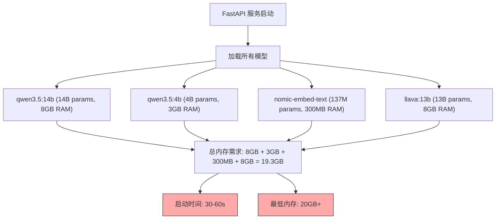
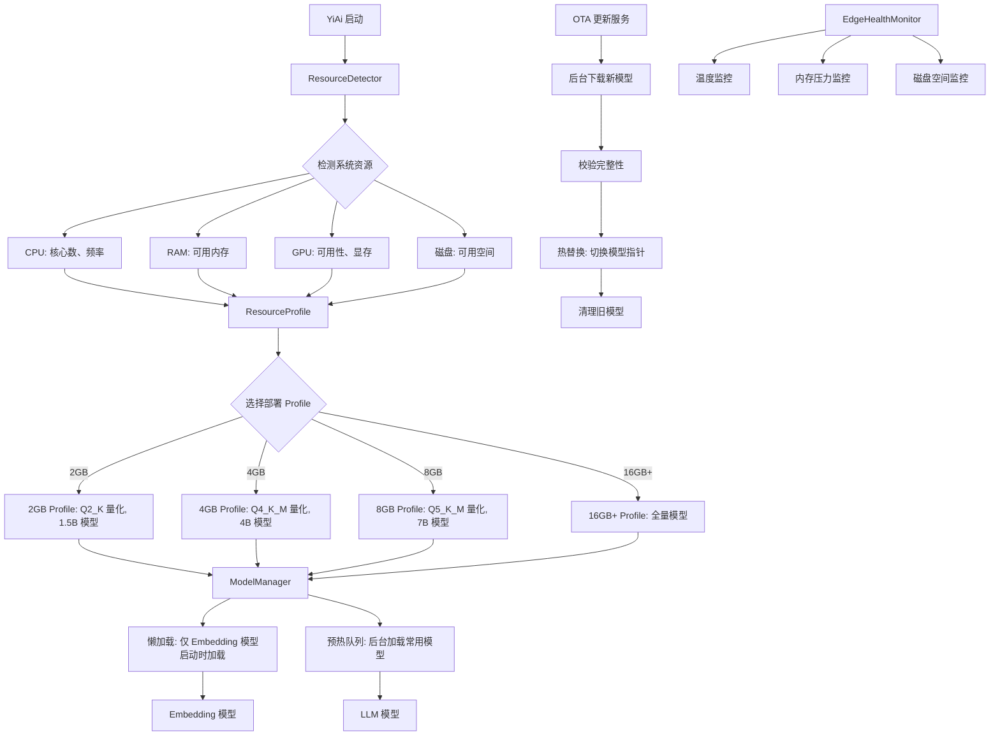

# YA-09-169: 边缘部署优化 — 资源受限环境下的轻量级运行方案

> 需求编号：YA-09-169 · 优先级：P2 · 人天：0.5d · 状态：需求已编写
> 依赖：Ollama API、模型注册中心（#166）、系统监控

## 背景

YiAi 当前设计运行在开发服务器（16GB+ RAM、GPU 可用）上，但在以下场景中需要部署到资源受限的边缘设备：

- **工位助手**：部署在 Intel NUC 上，为单个工位提供 AI 服务，内存仅 4-8GB，无 GPU
- **产线质量检测**：部署在 Jetson Nano 上，实时分析产线数据，内存 2-4GB
- **野外数据采集**：部署在 Raspberry Pi 上，离线环境下的文档分析和数据提取
- **家庭私有 AI**：部署在 NAS 或旧 PC 上，家庭用户的自托管 AI 助手

这些场景的共同约束是：**资源受限**（2-8GB 内存、无 GPU）、**CPU 推理**（慢 10-50 倍）、**启动时间敏感**（期望秒级可用）、**网络不稳定**（离线或弱网环境）。

需要一个**边缘部署优化方案**，支持模型量化、资源自适应 LLM 选择、CPU-only 优化、内存预算管理、快速启动和 OTA 模型更新。

---

## 一、现状分析

### 1.1 当前部署架构



### 1.2 当前问题

| # | 问题 | 严重程度 | 影响 |
|---|------|----------|------|
| 1 | 内存需求过高 | 高 | 全部模型加载需 19.3GB，边缘设备典型只有 2-8GB，无法运行 |
| 2 | 启动时间过长 | 高 | 加载所有模型需 30-60s，边缘设备因 CPU 慢可能需要 2-5 分钟 |
| 3 | 无 GPU 时推理极慢 | 高 | 14B 模型在 CPU 上生成 1 token 需 2-5s，用户无法接受 |
| 4 | 无资源感知 | 中 | 不感知设备资源，统一使用大模型，无法动态降级 |
| 5 | 无内存预算管理 | 中 | 模型加载后内存占用固定，无法根据可用内存调整 |
| 6 | 模型更新需重启 | 中 | 更新模型需停止服务、替换模型文件、重启，中断服务 |
| 7 | 无边缘专属健康检查 | 低 | 标准健康检查不包含温度、内存压力等边缘特有指标 |

### 1.3 改造前 API 依赖

| # | 接口 | 调用方 | 说明 |
|---|------|--------|------|
| 1 | `ollama pull <model>` | 运维手动 | 下载模型，无版本管理，无 OTA 机制 |
| 2 | `ollama serve` | 系统服务 | Ollama 启动，加载所有已下载模型 |
| 3 | YiAi `main.py` 启动 | 运维 | FastAPI 启动，无资源检查，无自适应配置 |

> 改造前无边缘部署优化，完全依赖人工判断和手动操作。资源受限设备上无法运行，或运行极慢。

### 1.4 设计灵感

参考 Ollama 的量化模型（Q4_K_M、Q5_K_M 等）、llama.cpp 的 CPU 优化（线程数、batch size）、以及边缘计算的最佳实践（lazy loading、资源配额、健康检查）。核心思路：量化减少内存 + CPU 优化提升速度 + 资源感知动态降级 + 懒加载加速启动。

---

## 二、设计决策

### 决策 1：模型量化策略 — 预量化 vs 运行时量化

| 维度 | 预量化（Ollama Q4/Q5/Q8） | 运行时量化（动态量化） |
|------|--------------------------|---------------------|
| 内存节省 | 显著（Q4_K_M 约 25% 原始大小） | 中等（需加载原始模型） |
| 推理速度 | 接近原始（硬件加速） | 慢（量化开销） |
| 模型质量 | 轻微下降（< 2% 精度损失） | 随机性大 |
| 实现复杂度 | 低（Ollama 原生支持） | 高（需自行实现） |
| 灵活性 | 需要预先下载量化版本 | 可从任意模型动态量化 |

**选择：预量化。** Ollama 原生支持 Q4_K_M、Q5_K_M、Q8_0 等量化格式，直接 `ollama pull qwen3.5:4b-q4_k_m` 即可使用。预量化模型经过充分测试，精度损失可控。运行时量化实现复杂且收益有限。

### 决策 2：资源自适应 — 静态配置 vs 动态检测

| 维度 | 静态配置（配置文件指定 profile） | 动态检测（运行时检测资源） |
|------|--------------------------------|--------------------------|
| 准确性 | 高（用户明确知道设备资源） | 中（可能受其他进程影响） |
| 灵活性 | 低（需手动修改配置） | 高（自动适应环境变化） |
| 实现复杂度 | 低 | 中 |
| 可预测性 | 高（行为确定） | 中（受系统状态影响） |

**选择：动态检测 + 静态覆盖。** 默认通过 `psutil` 和 `torch.cuda` 自动检测 CPU 核心数、可用内存、GPU 可用性，自动选择最优配置。同时支持通过环境变量 `YIAI_RESOURCE_PROFILE` 强制指定 profile（2GB/4GB/8GB/16GB），覆盖自动检测结果。

### 决策 3：模型加载策略 — 懒加载 vs 预加载

| 维度 | 懒加载（首次使用时加载） | 预加载（启动时加载全部） |
|------|------------------------|------------------------|
| 启动时间 | 快（秒级） | 慢（30-120s） |
| 首次请求延迟 | 高（需加载模型） | 低（模型已就绪） |
| 内存占用 | 低（仅加载用到的模型） | 高（全部加载） |
| 适用场景 | 边缘设备 | 服务器 |

**选择：懒加载 + 预热。** 启动时仅加载核心 Embedding 模型（轻量），LLM 模型在首次请求时加载。同时提供 `prewarm` 接口，允许在启动后后台预热常用模型。平衡启动速度和首次请求延迟。

### 设计决策记录

| 决策 | 选项 A | 选项 B | 选择 | 理由 |
|------|--------|--------|------|------|
| 量化策略 | 预量化 | 运行时量化 | **预量化** | Ollama 原生支持，精度可控，实现简单 |
| 资源自适应 | 动态检测 + 静态覆盖 | 纯静态配置 | **动态检测 + 覆盖** | 默认自动适应，特殊场景手动指定 |
| 模型加载 | 懒加载 + 预热 | 预加载全部 | **懒加载 + 预热** | 启动快，内存低，首次请求可接受 |

---

## 三、目标架构

### 3.1 边缘部署架构



### 3.2 资源 Profile 定义

```python
# domain/edge/models.py

from enum import Enum
from pydantic import BaseModel, Field

class ResourceProfile(str, Enum):
    PROFILE_2GB = "2gb"       # Raspberry Pi 4 (2GB)
    PROFILE_4GB = "4gb"       # Raspberry Pi 4/5 (4GB), Jetson Nano
    PROFILE_8GB = "8gb"       # Intel NUC, Jetson Orin Nano
    PROFILE_16GB = "16gb"     # 开发服务器, 标准 PC

class QuantizationLevel(str, Enum):
    Q2_K = "Q2_K"             # 最大压缩, 约 20% 原始大小
    Q3_K_M = "Q3_K_M"         # 约 30% 原始大小
    Q4_K_M = "Q4_K_M"         # 推荐平衡, 约 50% 原始大小
    Q5_K_M = "Q5_K_M"         # 高质量, 约 60% 原始大小
    Q8_0 = "Q8_0"             # 近无损, 约 80% 原始大小
    FP16 = "FP16"             # 无量化

class EdgeProfile(BaseModel):
    """边缘部署 Profile 配置。"""
    profile: ResourceProfile
    max_memory_mb: int                    # 最大内存预算
    recommended_models: dict[str, str]    # 推荐模型: {task_type: model_name}
    quantization: QuantizationLevel       # 默认量化级别
    cpu_threads: int                      # CPU 推理线程数
    batch_size: int                       # 批处理大小
    max_context_length: int               # 最大上下文长度
    lazy_load: bool = True                # 是否懒加载
    enable_cache: bool = True             # 是否启用缓存
    swap_enabled: bool = False            # 是否启用交换空间

class SystemResources(BaseModel):
    """系统资源信息。"""
    cpu_cores: int                        # CPU 逻辑核心数
    cpu_frequency_mhz: float              # CPU 频率
    total_memory_mb: int                  # 总内存
    available_memory_mb: int              # 可用内存
    gpu_available: bool = False           # GPU 是否可用
    gpu_memory_mb: int = 0                # GPU 显存
    disk_free_mb: int                     # 磁盘可用空间
    temperature_celsius: float = 0.0      # CPU 温度
    swap_used_mb: int = 0                 # 交换空间使用量

class OTAModelUpdate(BaseModel):
    """OTA 模型更新任务。"""
    update_id: str
    model_name: str
    source_version: str
    target_version: str
    quantization: QuantizationLevel
    download_url: str | None = None       # 模型下载地址（可选，默认从 Ollama 拉取）
    status: str                           # pending/downloading/verifying/switching/cleaning/completed/failed
    progress: float = 0.0                 # 0-1
    started_at: datetime | None = None
    completed_at: datetime | None = None
    error_message: str | None = None
```

---

## 四、具体改动

### 4.1 新增文件

| 文件 | 行数 | 说明 |
|------|------|------|
| `src/domain/edge/__init__.py` | 8 | 模块导出 |
| `src/domain/edge/models.py` | 80 | 数据模型：EdgeProfile、SystemResources、OTAModelUpdate、ResourceProfile |
| `src/domain/edge/resource_detector.py` | 80 | 资源检测器：自动检测 CPU/Memory/GPU/Disk |
| `src/domain/edge/profile_manager.py` | 100 | Profile 管理器：根据资源选择 Profile、配置应用 |
| `src/domain/edge/model_manager.py` | 120 | 模型管理器：懒加载、预热、卸载、量化选择 |
| `src/domain/edge/edge_health_monitor.py` | 80 | 边缘健康监控：温度、内存压力、磁盘 |
| `src/services/edge/edge_service.py` | 180 | 边缘服务 RPC：资源查询、Profile 管理、OTA 更新、健康检查 |
| `src/services/edge/ota_updater.py` | 100 | OTA 更新器：下载、校验、热替换、清理 |

### 4.2 核心实现

**资源检测器：**

```python
# domain/edge/resource_detector.py

import os
import psutil

class ResourceDetector:
    """自动检测系统资源。"""

    async def detect(self) -> SystemResources:
        """检测当前系统资源。"""
        # CPU 信息
        cpu_cores = psutil.cpu_count(logical=True)
        cpu_freq = psutil.cpu_freq()
        cpu_frequency_mhz = cpu_freq.current if cpu_freq else 0.0

        # 内存信息
        mem = psutil.virtual_memory()
        total_memory_mb = mem.total // (1024 * 1024)
        available_memory_mb = mem.available // (1024 * 1024)

        # 磁盘信息
        disk = psutil.disk_usage("/")
        disk_free_mb = disk.free // (1024 * 1024)

        # GPU 检测
        gpu_available, gpu_memory_mb = await self._detect_gpu()

        # 温度检测
        temperature = await self._detect_temperature()

        # 交换空间
        swap = psutil.swap_memory()
        swap_used_mb = swap.used // (1024 * 1024)

        return SystemResources(
            cpu_cores=cpu_cores,
            cpu_frequency_mhz=round(cpu_frequency_mhz, 1),
            total_memory_mb=total_memory_mb,
            available_memory_mb=available_memory_mb,
            gpu_available=gpu_available,
            gpu_memory_mb=gpu_memory_mb,
            disk_free_mb=disk_free_mb,
            temperature_celsius=temperature,
            swap_used_mb=swap_used_mb,
        )

    async def _detect_gpu(self) -> tuple[bool, int]:
        """检测 GPU 可用性。"""
        try:
            import torch
            if torch.cuda.is_available():
                # 获取第一个 GPU 的显存
                mem = torch.cuda.get_device_properties(0).total_memory
                return True, mem // (1024 * 1024)
        except ImportError:
            pass

        # 尝试检测 NVIDIA Jetson
        try:
            with open("/proc/device-tree/model", "r") as f:
                model = f.read()
                if "Jetson" in model or "NVIDIA" in model:
                    return True, 4096  # 假设 4GB 共享内存
        except FileNotFoundError:
            pass

        return False, 0

    async def _detect_temperature(self) -> float:
        """检测 CPU 温度。"""
        try:
            temps = psutil.sensors_temperatures()
            if "coretemp" in temps:
                return max(t.current for t in temps["coretemp"])
            if "cpu_thermal" in temps:
                return temps["cpu_thermal"][0].current
        except Exception:
            pass
        return 0.0
```

**Profile 管理器：**

```python
# domain/edge/profile_manager.py

PROFILES = {
    ResourceProfile.PROFILE_2GB: EdgeProfile(
        profile=ResourceProfile.PROFILE_2GB,
        max_memory_mb=1800,
        recommended_models={
            "chat": "qwen3.5:1.5b-q4_k_m",
            "embedding": "nomic-embed-text",
            "vision": None,  # 2GB 不支持视觉模型
            "code": "qwen3.5:1.5b-q4_k_m",
        },
        quantization=QuantizationLevel.Q4_K_M,
        cpu_threads=2,
        batch_size=1,
        max_context_length=2048,
        lazy_load=True,
        enable_cache=True,
        swap_enabled=True,
    ),
    ResourceProfile.PROFILE_4GB: EdgeProfile(
        profile=ResourceProfile.PROFILE_4GB,
        max_memory_mb=3600,
        recommended_models={
            "chat": "qwen3.5:4b-q4_k_m",
            "embedding": "nomic-embed-text",
            "vision": None,
            "code": "qwen3.5:4b-q4_k_m",
        },
        quantization=QuantizationLevel.Q4_K_M,
        cpu_threads=4,
        batch_size=2,
        max_context_length=4096,
        lazy_load=True,
        enable_cache=True,
        swap_enabled=True,
    ),
    ResourceProfile.PROFILE_8GB: EdgeProfile(
        profile=ResourceProfile.PROFILE_8GB,
        max_memory_mb=7200,
        recommended_models={
            "chat": "qwen3.5:4b-q5_k_m",
            "embedding": "nomic-embed-text",
            "vision": "llava:7b-q4_k_m",
            "code": "qwen3.5:4b-q5_k_m",
        },
        quantization=QuantizationLevel.Q5_K_M,
        cpu_threads=4,
        batch_size=4,
        max_context_length=8192,
        lazy_load=True,
        enable_cache=True,
        swap_enabled=False,
    ),
    ResourceProfile.PROFILE_16GB: EdgeProfile(
        profile=ResourceProfile.PROFILE_16GB,
        max_memory_mb=14336,
        recommended_models={
            "chat": "qwen3.5:14b-q4_k_m",
            "embedding": "nomic-embed-text",
            "vision": "llava:13b-q4_k_m",
            "code": "qwen3.5:14b-q4_k_m",
        },
        quantization=QuantizationLevel.Q4_K_M,
        cpu_threads=8,
        batch_size=8,
        max_context_length=16384,
        lazy_load=False,
        enable_cache=True,
        swap_enabled=False,
    ),
}


class ProfileManager:
    """Profile 管理器：根据资源选择部署 Profile。"""

    def __init__(self):
        self.detector = ResourceDetector()
        self._current_profile: EdgeProfile | None = None

    async def select_profile(self, force_profile: str = None) -> EdgeProfile:
        """选择最优 Profile。

        Args:
            force_profile: 强制指定 Profile（2gb/4gb/8gb/16gb），覆盖自动检测
        """
        if force_profile:
            profile = ResourceProfile(force_profile)
            self._current_profile = PROFILES[profile]
            return self._current_profile

        resources = await self.detector.detect()
        available_mb = resources.available_memory_mb

        if available_mb < 1500:
            profile = ResourceProfile.PROFILE_2GB
        elif available_mb < 3500:
            profile = ResourceProfile.PROFILE_4GB
        elif available_mb < 7000:
            profile = ResourceProfile.PROFILE_8GB
        else:
            profile = ResourceProfile.PROFILE_16GB

        self._current_profile = PROFILES[profile]
        return self._current_profile

    async def get_current_profile(self) -> EdgeProfile | None:
        """获取当前生效的 Profile。"""
        return self._current_profile

    async def get_recommended_model(self, task_type: str) -> str | None:
        """获取当前 Profile 推荐的模型。"""
        if not self._current_profile:
            return None
        return self._current_profile.recommended_models.get(task_type)

    async def is_within_budget(self, model_size_mb: int) -> bool:
        """检查加载指定大小的模型是否在内存预算内。"""
        if not self._current_profile:
            return False

        resources = await self.detector.detect()
        current_used = resources.total_memory_mb - resources.available_memory_mb
        projected = current_used + model_size_mb

        return projected <= self._current_profile.max_memory_mb
```

**模型管理器：**

```python
# domain/edge/model_manager.py

import asyncio

class ModelManager:
    """边缘模型管理器：懒加载、预热、卸载。"""

    def __init__(self):
        self.profile_manager = ProfileManager()
        self._loaded_models: set[str] = set()
        self._loading_tasks: dict[str, asyncio.Task] = {}
        self._model_sizes: dict[str, int] = {}  # 模型内存占用估计

    async def get_model(self, task_type: str) -> str:
        """获取指定任务类型的模型，如未加载则懒加载。

        Returns:
            模型名称
        """
        profile = await self.profile_manager.get_current_profile()
        if not profile:
            raise RuntimeError("No active profile")

        model_name = profile.recommended_models.get(task_type)
        if not model_name:
            raise RuntimeError(f"No model for task: {task_type} in profile {profile.profile}")

        if model_name not in self._loaded_models:
            await self._lazy_load(model_name)

        return model_name

    async def _lazy_load(self, model_name: str):
        """懒加载模型到内存。"""
        if model_name in self._loading_tasks:
            await self._loading_tasks[model_name]
            return

        # 检查内存预算
        model_size = await self._estimate_model_size(model_name)
        if not await self.profile_manager.is_within_budget(model_size):
            # 尝试卸载不常用的模型
            await self._evict_models(model_size)

        task = asyncio.create_task(self._load_model(model_name))
        self._loading_tasks[model_name] = task

        try:
            await task
            self._loaded_models.add(model_name)
        finally:
            del self._loading_tasks[model_name]

    async def _load_model(self, model_name: str):
        """执行模型加载（预热请求）。"""
        runtime = OllamaRuntime()
        # 发送轻量请求触发模型加载
        await runtime.complete(
            messages=[{"role": "user", "content": "ping"}],
            model=model_name,
            max_tokens=1,
        )

    async def _estimate_model_size(self, model_name: str) -> int:
        """估算模型内存占用（MB）。"""
        if model_name in self._model_sizes:
            return self._model_sizes[model_name]

        # 从 Ollama 获取模型信息
        try:
            info = await self._get_ollama_model_info(model_name)
            size_bytes = info.get("size", 0)
            size_mb = size_bytes // (1024 * 1024)
            self._model_sizes[model_name] = size_mb
            return size_mb
        except Exception:
            # 粗略估算
            if "1.5b" in model_name:
                return 800
            elif "4b" in model_name:
                return 2300
            elif "7b" in model_name:
                return 4000
            elif "14b" in model_name:
                return 8000
            else:
                return 2000  # 默认估算

    async def _evict_models(self, needed_mb: int):
        """卸载模型以腾出内存。"""
        freed = 0
        for model_name in list(self._loaded_models):
            if freed >= needed_mb:
                break
            # 不卸载 Embedding 模型（核心依赖）
            if "embed" in model_name:
                continue
            size = self._model_sizes.get(model_name, 0)
            await self._unload_model(model_name)
            freed += size

    async def _unload_model(self, model_name: str):
        """卸载模型。"""
        if model_name in self._loaded_models:
            self._loaded_models.discard(model_name)
            # Ollama 自动管理模型内存，显式卸载通过 API
            # 当前版本 Ollama 不支持显式卸载，依赖 OS 内存管理

    async def prewarm(self, task_types: list[str] = None):
        """后台预热模型。

        Args:
            task_types: 要预热的任务类型列表，默认预热所有
        """
        if task_types is None:
            task_types = ["chat", "embedding"]

        profile = await self.profile_manager.get_current_profile()
        if not profile:
            return

        for task_type in task_types:
            model_name = profile.recommended_models.get(task_type)
            if model_name and model_name not in self._loaded_models:
                asyncio.create_task(self._lazy_load(model_name))

    async def get_loaded_models(self) -> dict:
        """获取已加载的模型列表及内存占用。"""
        return {
            name: {
                "loaded": True,
                "estimated_size_mb": self._model_sizes.get(name, 0),
            }
            for name in self._loaded_models
        }
```

**OTA 更新器：**

```python
# services/edge/ota_updater.py

import hashlib
import asyncio
import uuid
from datetime import datetime

class OTAUpdater:
    """OTA 模型更新器：下载、校验、热替换、清理。"""

    def __init__(self):
        self.updates: dict[str, OTAModelUpdate] = {}
        self._active_update: str | None = None

    async def start_update(self, model_name: str, target_version: str,
                           quantization: QuantizationLevel = None) -> dict:
        """启动 OTA 模型更新。

        Args:
            model_name: 模型名称
            target_version: 目标版本标签
            quantization: 量化级别
        """
        if self._active_update:
            return {"code": 1003, "message": "Another update is in progress", "data": None}

        # 获取当前版本
        current_info = await self._get_model_info(model_name)
        source_version = current_info.get("version", "unknown")

        update_id = f"ota_{uuid.uuid4().hex[:8]}"
        update = OTAModelUpdate(
            update_id=update_id,
            model_name=model_name,
            source_version=source_version,
            target_version=target_version,
            quantization=quantization or QuantizationLevel.Q4_K_M,
            status="pending",
        )

        self.updates[update_id] = update
        self._active_update = update_id

        # 异步执行更新
        asyncio.create_task(self._run_update(update))

        return {"code": 0, "message": "ok", "data": {"update": update.model_dump()}}

    async def _run_update(self, update: OTAModelUpdate):
        """执行更新流程。"""
        try:
            # 1. 下载新模型
            update.status = "downloading"
            await self._download_model(update)

            # 2. 校验完整性
            update.status = "verifying"
            await self._verify_model(update)

            # 3. 热替换
            update.status = "switching"
            await self._switch_model(update)

            # 4. 清理旧模型
            update.status = "cleaning"
            await self._cleanup_old_model(update)

            update.status = "completed"
            update.completed_at = datetime.now()
            update.progress = 1.0

        except Exception as e:
            update.status = "failed"
            update.error_message = str(e)
        finally:
            self._active_update = None

    async def _download_model(self, update: OTAModelUpdate):
        """通过 Ollama pull 下载模型。"""
        model_tag = f"{update.model_name}:{update.target_version}"
        if update.quantization:
            model_tag += f"-{update.quantization.value.lower()}"

        # 使用 Ollama CLI 下载
        process = await asyncio.create_subprocess_exec(
            "ollama", "pull", model_tag,
            stdout=asyncio.subprocess.PIPE,
            stderr=asyncio.subprocess.PIPE,
        )

        # 解析进度
        while True:
            line = await process.stdout.readline()
            if not line:
                break
            # Ollama 输出格式: {"status":"pulling","digest":"...","total":...,"completed":...}
            try:
                data = json.loads(line)
                if "total" in data and "completed" in data:
                    update.progress = data["completed"] / data["total"]
            except json.JSONDecodeError:
                pass

        await process.wait()
        if process.returncode != 0:
            raise RuntimeError(f"Model download failed: {model_tag}")

    async def _verify_model(self, update: OTAModelUpdate):
        """校验模型完整性。"""
        model_tag = f"{update.model_name}:{update.target_version}"
        info = await self._get_model_info(model_tag)
        if not info:
            raise RuntimeError(f"Model verification failed: {model_tag}")

    async def _switch_model(self, update: OTAModelUpdate):
        """热替换模型（更新默认模型配置）。"""
        resolver = DefaultModelResolver()

        # 查找该模型服务的任务类型
        for task_type in ["chat", "embedding", "vision", "code"]:
            current = await resolver.resolve(task_type)
            if current and current.startswith(update.model_name):
                new_model = f"{update.model_name}:{update.target_version}"
                await resolver.set_default(task_type, new_model)

    async def _cleanup_old_model(self, update: OTAModelUpdate):
        """清理旧版本模型。"""
        old_tag = f"{update.model_name}:{update.source_version}"
        try:
            process = await asyncio.create_subprocess_exec(
                "ollama", "rm", old_tag,
                stdout=asyncio.subprocess.PIPE,
                stderr=asyncio.subprocess.PIPE,
            )
            await process.wait()
        except Exception:
            pass  # 清理失败不阻塞更新

    async def get_update_progress(self, update_id: str) -> dict:
        """获取更新进度。"""
        update = self.updates.get(update_id)
        if not update:
            return {"code": 1002, "message": f"Update not found: {update_id}", "data": None}

        return {"code": 0, "message": "ok", "data": {"update": update.model_dump()}}
```

**边缘服务 RPC 接口：**

```python
# services/edge/edge_service.py

class EdgeService:
    """边缘部署服务。"""

    def __init__(self):
        self.detector = ResourceDetector()
        self.profile_manager = ProfileManager()
        self.model_manager = ModelManager()
        self.health_monitor = EdgeHealthMonitor()
        self.ota_updater = OTAUpdater()

    async def get_system_resources(self, parameters: dict = None) -> dict:
        """RPC: 获取系统资源信息。"""
        resources = await self.detector.detect()
        return {"code": 0, "message": "ok", "data": {"resources": resources.model_dump()}}

    async def get_current_profile(self, parameters: dict = None) -> dict:
        """RPC: 获取当前部署 Profile。"""
        profile = await self.profile_manager.get_current_profile()
        if not profile:
            return {"code": 1002, "message": "No active profile", "data": None}
        return {"code": 0, "message": "ok", "data": {"profile": profile.model_dump()}}

    async def set_profile(self, parameters: dict) -> dict:
        """RPC: 强制设置部署 Profile。

        parameters:
            profile: str — 2gb/4gb/8gb/16gb
        """
        profile_name = parameters.get("profile")
        if not profile_name:
            return {"code": 1001, "message": "profile is required", "data": None}

        profile = await self.profile_manager.select_profile(force_profile=profile_name)
        return {"code": 0, "message": "ok", "data": {"profile": profile.model_dump()}}

    async def get_loaded_models(self, parameters: dict = None) -> dict:
        """RPC: 获取已加载的模型列表。"""
        models = await self.model_manager.get_loaded_models()
        return {"code": 0, "message": "ok", "data": {"loaded_models": models}}

    async def prewarm_models(self, parameters: dict = None) -> dict:
        """RPC: 预热模型。

        parameters:
            task_types: list[str] — 要预热的任务类型
        """
        task_types = parameters.get("task_types") if parameters else None
        await self.model_manager.prewarm(task_types)
        return {"code": 0, "message": "ok", "data": {"status": "prewarming"}}

    async def start_ota_update(self, parameters: dict) -> dict:
        """RPC: 启动 OTA 模型更新。

        parameters:
            model_name: str       — 模型名称
            target_version: str   — 目标版本
            quantization: str     — 量化级别
        """
        return await self.ota_updater.start_update(
            model_name=parameters.get("model_name"),
            target_version=parameters.get("target_version"),
            quantization=QuantizationLevel(parameters.get("quantization", "Q4_K_M")),
        )

    async def get_ota_progress(self, parameters: dict) -> dict:
        """RPC: 获取 OTA 更新进度。

        parameters:
            update_id: str — 更新 ID
        """
        return await self.ota_updater.get_update_progress(parameters.get("update_id"))

    async def get_edge_health(self, parameters: dict = None) -> dict:
        """RPC: 获取边缘健康状态。"""
        health = await self.health_monitor.check()
        return {"code": 0, "message": "ok", "data": {"health": health}}
```

### 4.3 涉及文件

```
YiAi/src/
├── domain/edge/
│   ├── __init__.py                   # 新增: 模块导出
│   ├── models.py                     # 新增: 数据模型 (80行)
│   ├── resource_detector.py          # 新增: 资源检测器 (80行)
│   ├── profile_manager.py            # 新增: Profile 管理器 (100行)
│   ├── model_manager.py              # 新增: 模型管理器 (120行)
│   └── edge_health_monitor.py        # 新增: 边缘健康监控 (80行)
├── services/edge/
│   ├── edge_service.py               # 新增: 边缘服务 RPC (180行)
│   └── ota_updater.py                # 新增: OTA 更新器 (100行)
└── server/
    └── routes/
        └── edge_routes.py            # 新增: 边缘管理路由 (40行)
```

---

## 五、实施步骤

按依赖顺序排列，每步可独立验证和提交：

| 步骤 | 内容 | 涉及文件 | 验证方式 | 人天 |
|------|------|---------|---------|------|
| 1 | 定义数据模型（EdgeProfile、SystemResources、OTAModelUpdate、ResourceProfile） | `domain/edge/models.py` | Pydantic 校验通过 | 0.03 |
| 2 | 实现资源检测器（CPU/Memory/GPU/Disk/温度） | `domain/edge/resource_detector.py` | 检测结果与实际系统资源一致 | 0.05 |
| 3 | 实现 Profile 管理器（4 个 Profile 定义、自动选择、内存预算检查） | `domain/edge/profile_manager.py` | 不同内存量选择正确 Profile，推荐模型合理 | 0.05 |
| 4 | 实现模型管理器（懒加载、预热、卸载、内存估算） | `domain/edge/model_manager.py` | 懒加载正确，预热不阻塞，内存预算内运行 | 0.08 |
| 5 | 实现边缘健康监控（温度、内存压力、磁盘） | `domain/edge/edge_health_monitor.py` | 健康检查返回正确指标 | 0.05 |
| 6 | 实现 OTA 更新器（下载、校验、热替换、清理） | `services/edge/ota_updater.py` | 更新流程完整，进度可追踪 | 0.08 |
| 7 | 实现边缘服务 RPC（resources、profile、models、prewarm、ota、health） | `services/edge/edge_service.py` | 所有 RPC 接口正常响应 | 0.10 |
| 8 | 集成到启动流程（main.py 启动时检测资源、选择 Profile） | `main.py` | 启动时自动选择 Profile，日志输出资源信息 | 0.03 |
| 9 | 回归测试 | 全模块 | 各 Profile 下模型正确加载，推理正常 | 0.03 |

**总计：0.5d**

---

## 六、测试规格

### Requirement: 资源检测

#### Scenario: 检测服务器资源
- **Given** 服务器有 16GB 内存、8 核 CPU、GPU 可用
- **When** 调用 `get_system_resources` 接口
- **Then** 返回 total_memory_mb=16384、cpu_cores=8、gpu_available=true

#### Scenario: 检测边缘设备资源
- **Given** Raspberry Pi 4 有 4GB 内存、4 核 CPU、无 GPU
- **When** 调用 `get_system_resources` 接口
- **Then** 返回 total_memory_mb=4096、cpu_cores=4、gpu_available=false

### Requirement: Profile 自动选择

#### Scenario: 2GB 设备自动选择 2GB Profile
- **Given** 设备可用内存 1500MB
- **When** 启动时自动检测资源
- **Then** 选择 PROFILE_2GB
- **And** 推荐模型为 `qwen3.5:1.5b-q4_k_m`
- **And** vision 任务无推荐模型

#### Scenario: 8GB 设备自动选择 8GB Profile
- **Given** 设备可用内存 6000MB
- **When** 启动时自动检测资源
- **Then** 选择 PROFILE_8GB
- **And** 推荐模型为 `qwen3.5:4b-q5_k_m`

#### Scenario: 强制指定 Profile 覆盖自动检测
- **Given** 设备可用内存 8000MB（应选 16GB Profile）
- **When** 设置环境变量 `YIAI_RESOURCE_PROFILE=4gb`
- **Then** 选择 PROFILE_4GB
- **And** 忽略自动检测结果

### Requirement: 懒加载

#### Scenario: 启动时仅加载 Embedding 模型
- **Given** 边缘设备启动 YiAi
- **When** 启动完成
- **Then** 仅 Embedding 模型已加载
- **And** LLM 模型未加载（内存占用低）

#### Scenario: 首次聊天请求触发 LLM 懒加载
- **Given** LLM 模型未加载
- **When** 发起首次聊天请求
- **Then** 触发 LLM 模型懒加载
- **And** 首次请求延迟较高（加载时间），后续请求正常

### Requirement: 模型预热

#### Scenario: 后台预热常用模型
- **Given** YiAi 已启动，仅 Embedding 模型已加载
- **When** 调用 `prewarm_models`，参数 `task_types=["chat"]`
- **Then** 后台开始加载聊天模型
- **And** 预热不阻塞其他请求

### Requirement: OTA 更新

#### Scenario: 启动模型 OTA 更新
- **Given** 当前使用 `qwen3.5:4b-q4_k_m`，新版本可用
- **When** 调用 `start_ota_update`，参数 `model_name="qwen3.5"`, `target_version="4b-q5_k_m"`
- **Then** 返回 update_id，状态为 pending
- **And** 后台开始下载、校验、切换、清理流程

#### Scenario: 查询 OTA 更新进度
- **Given** OTA 更新正在下载，进度 60%
- **When** 调用 `get_ota_progress`，参数 update_id
- **Then** 返回 status="downloading"，progress=0.6

---

## 七、风险与缓解

| 风险 | 概率 | 影响 | 等级 | 缓解措施 | 应急预案 |
|------|------|------|------|----------|----------|
| 量化模型质量下降超出预期 | 中 | 中 | 中 | 每个 Profile 提供多级量化选项，用户可自行选择 | 切换到更高量化级别（如 Q5 替代 Q4） |
| 内存预算超限导致 OOM | 中 | 高 | 高 | 懒加载 + 内存预算检查 + 模型卸载 | 启用交换空间，限制并发请求 |
| CPU 推理速度无法接受 | 高 | 高 | 高 | 使用 1.5B 小模型 + 限制 context_length | 异步处理，返回"处理中"状态 |
| 温度过高导致设备降频/关机 | 中 | 高 | 中 | 温度监控 + 超过阈值自动降级 | 暂停推理，等待降温 |
| OTA 更新中断导致模型损坏 | 低 | 高 | 中 | 下载完成后校验完整性，失败保留旧模型 | 手动从 Ollama 重新拉取 |
| 边缘设备磁盘空间不足 | 低 | 中 | 低 | 更新前检查磁盘空间，下载新模型前确保有足够空间 | 清理旧模型和缓存 |

---

## 八、回滚策略

| 回滚场景 | 回滚方式 | 影响范围 | 恢复时间 |
|----------|----------|----------|----------|
| 量化模型质量不满足需求 | 切换到更高量化级别或原始模型 | 推理质量 | 10min |
| OTA 更新后模型异常 | 回滚到旧版本模型 | 单个模型服务 | 5min |
| Profile 选择错误导致 OOM | 强制指定更高内存 Profile | 整体服务 | 3min |
| 懒加载导致首次请求超时 | 切换到预加载模式 | 启动时间 | 2min |

**回滚验证：**
- 模型切换后推理正常
- 旧模型未被删除（OTA 更新失败时）
- `ruff` + `mypy` 检查通过

---

## 九、设计决策记录

### D-01: 为什么使用预量化模型而非运行时量化？

Ollama 预量化模型（Q4_K_M、Q5_K_M 等）经过社区广泛测试，质量稳定。运行时量化需要加载原始模型到内存再进行量化，反而增加内存压力。预量化模型直接从 Ollama Registry 拉取，实现简单且可靠。

### D-02: 为什么懒加载而非全量预加载？

边缘设备内存宝贵（2-8GB），全部模型预加载不可行。懒加载确保仅加载实际使用的模型，内存占用最小。首次请求延迟可通过预热接口缓解——在用户活跃前提前加载常用模型。

### D-03: 为什么 Profile 既支持自动检测又支持手动覆盖？

自动检测适合大多数场景，但特殊情况（如虚拟化环境、容器）可能检测不准确。手动覆盖（环境变量 `YIAI_RESOURCE_PROFILE`）给运维人员完全控制权，两个机制互补。

### D-04: 为什么 OTA 更新使用 Ollama CLI 而非 API？

当前 Ollama 的 HTTP API 不提供带进度反馈的模型下载接口。使用 `ollama pull` CLI 命令可实时获取下载进度，且保持与 Ollama 生态的兼容性。未来 Ollama API 完善后可迁移到 HTTP API。

### D-05: 为什么 2GB Profile 不支持视觉模型？

视觉模型（llava）最小版本约 7B 参数，Q4 量化后仍需约 4GB 内存。2GB Profile 的总内存预算仅 1.8GB，无法容纳视觉模型。用户如需视觉能力，应升级到 4GB+ 设备。

### D-06: 为什么 CPU 推理使用特定线程数？

Ollama/llama.cpp 的 CPU 推理性能与线程数非线性相关。4 核设备使用 4 线程利用率最高，8 核设备使用 4-6 线程即可（超线程对推理帮助有限）。每个 Profile 的线程数基于经验值，可通过环境变量 `OLLAMA_NUM_THREADS` 覆盖。

---

## 十、可观测性

### 10.1 关键指标

| 指标 | 采集方式 | 告警阈值 | 说明 |
|------|---------|---------|------|
| 内存使用率 | 资源检测器 | > 90% | 接近 OOM |
| CPU 温度 | 温度传感器 | > 80°C | 过热风险 |
| 模型加载时间 | 计时器 | > 120s | 加载过慢 |
| 首次请求延迟 | 计时器 | > 30s | 懒加载导致的延迟 |
| OTA 更新进度 | 进度条 | 停滞 > 5min | 下载卡住 |
| 磁盘可用空间 | 资源检测器 | < 1GB | 空间不足 |
| 交换空间使用 | 资源检测器 | > 50% | 内存不足 |
| 模型卸载次数 | 计数器 | > 5/hr | 频繁内存压力 |

### 10.2 日志规范

| 日志级别 | 场景 | 示例 |
|---------|------|------|
| `INFO` | 启动资源检测 | `[Edge] resources: cpu={n}, mem={m}MB, gpu={g}, temp={t}°C` |
| `INFO` | Profile 选择 | `[Edge] profile selected: {p} (available_mem={m}MB)` |
| `INFO` | 模型懒加载 | `[Edge] lazy loading: {model}, estimated_size={s}MB` |
| `INFO` | OTA 更新 | `[Edge] OTA: {model} {old} -> {new}, status={s}` |
| `WARN` | 内存预算紧张 | `[Edge] memory budget tight: {used}/{max}MB` |
| `WARN` | 温度过高 | `[Edge] high temperature: {t}°C` |
| `ERROR` | OTA 更新失败 | `[Edge] OTA failed: {model}, {error}` |

---

## 十一、代码审查检查清单

- [ ] `ResourceDetector` 正确检测 CPU、内存、GPU、磁盘、温度
- [ ] 4 个 Profile（2GB/4GB/8GB/16GB）定义完整，推荐模型合理
- [ ] Profile 自动选择逻辑正确（根据 available_memory）
- [ ] 环境变量 `YIAI_RESOURCE_PROFILE` 可覆盖自动选择
- [ ] `ModelManager` 懒加载不阻塞主流程
- [ ] 模型内存估算准确（优先从 Ollama 获取实际大小）
- [ ] 内存预算检查在加载模型前执行
- [ ] `OTAUpdater` 下载、校验、切换、清理四步流程完整
- [ ] OTA 更新失败时保留旧模型
- [ ] 边缘健康监控包含温度、内存压力、磁盘指标
- [ ] `ruff` 代码规范通过
- [ ] `mypy` 类型检查通过

---

## 十二、回归问题预测

| # | 问题 | 发现场景 | 根因 | 修复方式 |
|---|------|---------|------|---------|
| 1 | 容器环境中资源检测不准确 | Docker 容器中 `psutil` 检测到宿主机资源而非容器限制 | Docker 使用 cgroups 限制资源，`psutil` 默认读取宿主机 | 检测 cgroups v1/v2 限制，取 `psutil` 和 cgroups 中较小值 |
| 2 | 懒加载导致并发请求堆积 | 首次请求触发懒加载（耗时 30s），期间其他请求排队等待 | 每个模型只创建一次加载任务，但并发请求仍等待加载完成 | 加载期间返回 503 + Retry-After 头部，避免请求堆积 |
| 3 | 温度传感器在不同平台表现不一致 | Raspberry Pi 温度正常，但 x86 服务器温度读取失败 | `psutil.sensors_temperatures()` 在不同平台返回不同 key | 遍历所有温度传感器，取第一个有效值 |
| 4 | OTA 更新时 Ollama pull 超时 | 网络不稳定环境下，大模型下载中断 | 未设置超时和重试 | 添加 `--insecure` 选项和重试逻辑（最大 3 次） |
| 5 | 量化模型名称与 Profile 不一致 | Profile 推荐 `qwen3.5:4b-q4_k_m`，但 Ollama 中只有 `qwen3.5:4b` | 未检查量化模型是否存在 | 模型加载前检查 Ollama 模型列表，回退到非量化版本 |
| 6 | 低内存设备上交换空间频繁使用导致性能骤降 | 2GB Profile 启用 swap，RAG 检索时大量内存分配触发 swap | swap 启用导致的磁盘 I/O 阻塞 | 监控 swap 使用率，超过阈值时拒绝新请求 |

---

## 十三、性能分析

### 13.1 边缘部署性能特征

| 指标 | 2GB Profile | 4GB Profile | 8GB Profile | 说明 |
|------|------------|------------|------------|------|
| 启动时间 | 5-10s | 10-20s | 20-30s | 懒加载，仅加载 Embedding 模型 |
| 首次聊天延迟 | 15-30s | 10-20s | 5-10s | 懒加载 LLM 模型 |
| 后续聊天延迟 | 3-8s/token | 1-3s/token | 0.5-1s/token | CPU 推理 |
| 内存占用（空闲） | 500MB | 800MB | 1.2GB | 仅 Embedding 模型 |
| 内存占用（活跃） | 1.5GB | 3.2GB | 6GB | 含 LLM 模型 |
| 最大并发请求 | 1 | 2 | 4 | CPU 推理限制 |

### 13.2 性能瓶颈

| 瓶颈 | 严重程度 | 表现 | 优化方向 |
|------|----------|------|----------|
| CPU 推理速度 | 高 | 1.5B 模型 3-8s/token，4B 模型 1-3s/token | 使用更小模型，减少 context_length |
| 内存限制 | 高 | 2GB 设备只能运行 1.5B 模型 | 使用 Q2_K 量化，启用 swap |
| 模型加载时间 | 中 | 首次请求 15-30s 延迟 | 预热接口，后台预加载 |
| 温度限制 | 中 | 长时间推理导致降频 | 推理间隔冷却，限制连续请求数 |

### 13.3 设备兼容性矩阵

| 设备 | Profile | 模型 | 内存占用 | 推理速度 | 可行性 |
|------|---------|------|---------|---------|--------|
| Raspberry Pi 4 (2GB) | 2GB | 1.5B Q4 | 1.5GB | 3-8s/tok | 可运行，慢 |
| Raspberry Pi 5 (4GB) | 4GB | 4B Q4 | 3.2GB | 1-3s/tok | 可运行 |
| Jetson Nano (4GB) | 4GB | 4B Q4 | 3.2GB | 1-2s/tok | 可运行 |
| Intel NUC (8GB) | 8GB | 7B Q5 | 6GB | 0.5-1s/tok | 良好 |
| Jetson Orin Nano (8GB) | 8GB | 7B Q5 | 6GB | 0.3-0.5s/tok | 良好 |
| 标准 PC (16GB) | 16GB | 14B Q4 | 12GB | 0.2-0.5s/tok | 优秀 |

---

*PRD 来源: `projects/yiai/requirements/2026-09/00-需求-需求总览.md`*

## 影响范围

- **影响模块**：待补充
- **涉及文件**：
- `src/services/edge/edge_service.py`
- `src/domain/edge/profile_manager.py`
- `src/domain/edge/model_manager.py`
- `src/domain/edge/resource_detector.py`
- `src/domain/edge/models.py`
- `main.py`
- **是否影响 API 契约**：否
- **是否影响其他项目（YiVad/YiPet）**：否
- **用户感知**：待确认

## 预防措施

| 层面 | 措施 |
|------|------|
| 代码 | 在相关函数中添加参数校验和边界检查 |
| 测试 | 为 `src/services/edge/edge_service.py` 添加单元测试 |
| 流程 | 代码审查时重点检查此类模式 |
| 监控 | 添加日志告警，异常发生时及时发现 |
| 文档 | 在编码规范中记录此类反模式 |

## 经验教训

1. **根本原因**：开发过程中对边界情况和异常路径的考虑不足是此类问题的共同根因
2. **设计阶段**：在接口设计和模块实现时，应主动考虑异常输入、空值、超时等边界场景
3. **代码审查**：审查时应检查是否存在类似的反模式（如未捕获异常、无超时控制、缺少参数校验等）
4. **测试覆盖**：异常路径的测试覆盖率应与正常路径同等重视
5. **团队分享**：此类问题应在团队周会或技术分享中讨论，形成团队共识
