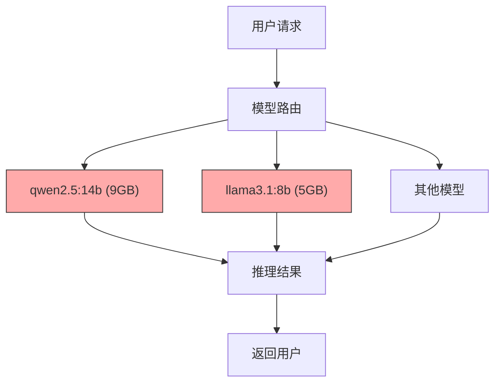
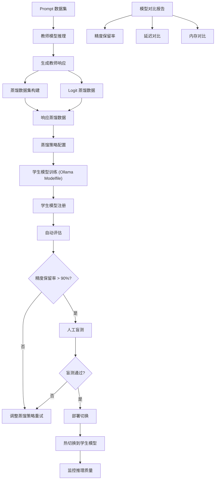
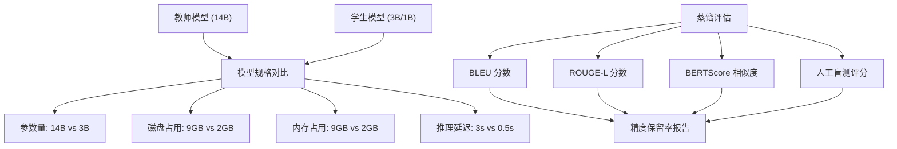

# YA-09-170: 知识蒸馏与模型压缩 — 大模型到小模型的知识迁移与精度保持

> 需求编号：YA-09-170 · 优先级：P2 · 人天：1.0d · 状态：需求已编写
> 依赖：模型注册与版本管理（#166）、Ollama API、Fine-tuning 能力

## 背景

YiAi 当前部署多个大语言模型（如 `qwen2.5:14b`、`llama3.1:8b`），这些模型在质量上表现出色，但在推理延迟、内存占用和硬件成本方面存在明显瓶颈：

- **推理延迟高**：大模型单次推理耗时 2-10 秒，用户等待时间长，交互体验差
- **内存占用大**：14B 模型占用约 9GB 显存，8B 模型占用约 5GB，在资源受限环境下难以同时加载多个模型
- **硬件成本高**：运行大模型需要高端 GPU，边缘设备和小型服务器无法承载
- **无模型压缩能力**：无法将大模型的知识迁移到更小、更快的模型，无法在质量和速度之间做灵活权衡
- **无蒸馏评估标准**：缺乏量化评估蒸馏模型质量的标准，无法判断压缩是否"成功"
- **无热切换能力**：无法在运行中从大模型切换到蒸馏小模型，服务中断

需要一个**知识蒸馏与模型压缩系统**，支持从大型教师模型（Teacher）蒸馏知识到小型学生模型（Student），提供数据集生成、蒸馏策略配置、模型评估、精度保持验证和热切换部署能力。

---

## 一、现状分析

### 1.1 当前模型部署架构



当前所有模型均为完整大模型，无小模型可用，无法在质量和速度之间做权衡。

### 1.2 当前问题

| # | 问题 | 严重程度 | 影响 |
|---|------|----------|------|
| 1 | 无小模型可选 | 高 | 所有请求必须走大模型，延迟高、资源消耗大 |
| 2 | 无知识蒸馏能力 | 高 | 无法将大模型知识迁移到小模型 |
| 3 | 无蒸馏数据集 | 中 | 缺乏用于训练学生模型的标注数据 |
| 4 | 无蒸馏效果评估 | 中 | 无法量化评估蒸馏模型的质量保留率 |
| 5 | 模型切换需手动 | 中 | 从大模型切换到小模型需重启服务 |
| 6 | 无精度保持目标 | 中 | 缺少蒸馏质量阈值（如 >90% 教师质量）的量化标准 |
| 7 | 无小模型微调集成 | 低 | 蒸馏后的小模型无法与 Ollama 微调流程集成 |

### 1.3 改造前 API 依赖

| # | 接口 | 调用方 | 说明 |
|---|------|--------|------|
| 1 | `ollama.chat(model=..., messages=...)` | chat_service | 直接调用大模型推理，无蒸馏概念 |
| 2 | `ollama.list()` | 模型管理 | 列出可用模型，无教师/学生模型区分 |
| 3 | `ollama.create(model=..., modelfile=...)` | 模型注册 | 创建模型，无蒸馏模型标记 |

> 改造前仅 3 个 API 依赖，无蒸馏、无数据集生成、无小模型评估。

### 1.4 设计灵感

参考 Hinton 的 Knowledge Distillation 论文、DistilBERT 的蒸馏策略和 llama.cpp 的模型量化方案。核心思路：教师模型生成训练数据集 → 蒸馏策略配置 → 学生模型训练 → 质量评估 → 精度达标则热切换。

---

## 二、设计决策

### 决策 1：蒸馏方式 — 数据集蒸馏 vs 在线蒸馏

| 维度 | 数据集蒸馏（离线） | 在线蒸馏（实时） |
|------|-------------------|-----------------|
| 实现复杂度 | 中（需数据集生成 + 离线训练） | 高（需实时教师推理 + 在线训练） |
| 训练稳定性 | 高（离线训练，可重复） | 低（在线训练不稳定） |
| 硬件要求 | 低（训练可在单独机器完成） | 高（需同时运行教师和学生模型） |
| 精度控制 | 高（可多次训练选择最佳） | 低（在线实时调整） |
| 与 Ollama 集成 | 好（Ollama 支持 Modelfile 创建） | 差（Ollama 不支持在线训练） |

**选择：数据集蒸馏。** 离线生成教师模型在多样化 Prompt 上的响应，构建训练数据集，使用 Ollama 的 Modelfile 机制创建学生模型。离线方式稳定可控，符合 Ollama 生态。

### 决策 2：蒸馏策略 — 仅响应蒸馏 vs 多维度蒸馏

| 维度 | 仅响应蒸馏 | 多维度蒸馏（响应+特征+Logit） |
|------|----------|---------------------------|
| 实现复杂度 | 低（仅需教师输出文本） | 高（需访问模型内部 logits/features） |
| Ollama 兼容性 | 高（Ollama 提供文本输出） | 低（Ollama 不暴露内部状态） |
| 蒸馏效果 | 中（仅学习输出风格） | 高（学习内部推理模式） |
| 适用场景 | 通用对话 | 需要精确复现推理过程 |

**选择：响应蒸馏为主 + Logit 蒸馏为辅。** Ollama 不暴露模型内部特征，无法做特征蒸馏。但可通过 `ollama.chat` 的 `options` 参数获取 token 概率，实现 Logit 蒸馏（软标签）。响应蒸馏覆盖输出风格，Logit 蒸馏覆盖推理分布。

### 决策 3：评估策略 — 自动评估 vs 人工评估

| 维度 | 自动评估（BLEU/ROUGE/相似度） | 人工评估（盲测） |
|------|------------------------------|-----------------|
| 速度 | 快（秒级） | 慢（需人工） |
| 可重复性 | 高 | 低 |
| 语义准确性 | 低（表面匹配） | 高（深层理解） |
| 成本 | 低 | 高 |

**选择：自动评估为主 + 人工盲测为辅。** 自动评估使用 BLEU/ROUGE-L/BERTScore 衡量学生输出与教师输出的一致性，同时使用模型性能对比（#144）的盲测框架进行人工验证。自动评估达标（>90%）后触发人工盲测。

### 设计决策记录

| 决策 | 选项 A | 选项 B | 选择 | 理由 |
|------|--------|--------|------|------|
| 蒸馏方式 | 数据集蒸馏 | 在线蒸馏 | **数据集蒸馏** | 离线稳定可控，与 Ollama 生态兼容 |
| 蒸馏策略 | 响应蒸馏 + Logit | 多维度蒸馏 | **响应 + Logit** | Ollama 不暴露特征层，响应+Logit 是最佳可实施方案 |
| 评估方式 | 自动评估为主 | 人工评估为主 | **自动 + 人工盲测** | 自动评估快速迭代，人工盲测保证质量 |

---

## 三、目标架构

### 3.1 知识蒸馏系统架构



### 3.2 教师-学生模型对比流程



### 3.3 核心数据模型

```python
# domain/distillation/models.py

from enum import Enum
from pydantic import BaseModel, Field
from datetime import datetime

class DistillationStrategy(str, Enum):
    RESPONSE_ONLY = "response_only"          # 仅响应蒸馏
    LOGIT_BASED = "logit_based"              # Logit 蒸馏
    RESPONSE_AND_LOGIT = "response_and_logit" # 响应 + Logit 蒸馏

class DistillationStatus(str, Enum):
    DATASET_GENERATING = "dataset_generating" # 数据集生成中
    TRAINING = "training"                     # 训练中
    EVALUATING = "evaluating"                 # 评估中
    READY = "ready"                           # 就绪可部署
    REJECTED = "rejected"                     # 质量不达标
    DEPLOYED = "deployed"                     # 已部署

class TeacherModel(BaseModel):
    """教师模型信息。"""
    name: str                                # 模型名称
    parameter_size: str                      # 参数量: "14B", "8B"
    disk_size_gb: float                      # 磁盘占用 (GB)
    memory_size_gb: float                    # 内存占用 (GB)
    avg_latency_ms: float                    # 平均推理延迟 (ms)

class StudentModel(BaseModel):
    """学生模型信息。"""
    name: str                                # 模型名称
    teacher_name: str                        # 教师模型名称
    parameter_size: str                      # 参数量: "3B", "1B"
    disk_size_gb: float                      # 磁盘占用 (GB)
    memory_size_gb: float                    # 内存占用 (GB)
    avg_latency_ms: float                    # 平均推理延迟 (ms)
    strategy: DistillationStrategy           # 蒸馏策略
    compression_ratio: float                 # 压缩比 (学生参数/教师参数)

class DistillationDataset(BaseModel):
    """蒸馏数据集。"""
    dataset_id: str                          # 数据集 ID
    teacher_model: str                       # 教师模型
    prompt_count: int                        # Prompt 数量
    response_count: int                      # 教师响应数量
    prompts: list[dict]                      # Prompt 列表
    responses: list[dict]                    # 教师响应列表（含 logits）
    created_at: datetime = Field(default_factory=datetime.now)

class DistillationEvaluation(BaseModel):
    """蒸馏评估结果。"""
    student_model: str
    teacher_model: str
    bleu_score: float                        # BLEU 分数 (0-1)
    rouge_l_score: float                     # ROUGE-L 分数 (0-1)
    bert_score: float                        # BERTScore 相似度 (0-1)
    logit_kl_divergence: float               # Logit KL 散度
    human_blind_test_score: float | None     # 人工盲测评分
    quality_retention: float                 # 质量保留率 (0-1)
    quality_threshold: float = 0.9           # 质量阈值
    pass_threshold: bool                     # 是否达标
    evaluated_at: datetime = Field(default_factory=datetime.now)

class DistillationJob(BaseModel):
    """蒸馏任务。"""
    job_id: str
    teacher_model: str
    student_model_name: str                  # 目标学生模型名称
    strategy: DistillationStrategy
    status: DistillationStatus
    dataset: DistillationDataset | None
    evaluation: DistillationEvaluation | None
    created_at: datetime = Field(default_factory=datetime.now)
    completed_at: datetime | None = None
    error_message: str | None = None
```

---

## 四、具体改动

### 4.1 新增文件

| 文件 | 行数 | 说明 |
|------|------|------|
| `src/domain/distillation/__init__.py` | 8 | 模块导出 |
| `src/domain/distillation/models.py` | 100 | 数据模型：TeacherModel、StudentModel、DistillationDataset、DistillationEvaluation、DistillationJob |
| `src/domain/distillation/dataset_generator.py` | 120 | 蒸馏数据集生成：Prompt 收集、教师推理、响应收集 |
| `src/domain/distillation/evaluator.py` | 100 | 蒸馏评估器：BLEU、ROUGE-L、BERTScore、KL 散度 |
| `src/domain/distillation/model_comparator.py` | 80 | 模型对比器：参数量、磁盘、内存、延迟对比 |
| `src/services/distillation/distillation_service.py` | 200 | 蒸馏服务 RPC：创建蒸馏任务、生成数据集、评估、切换部署 |
| `src/services/distillation/training_manager.py` | 100 | 训练管理器：Ollama Modelfile 生成、学生模型创建 |
| `src/services/distillation/quality_validator.py` | 80 | 质量验证器：精度保留率验证、阈值检查 |

### 4.2 核心实现

**蒸馏数据集生成器：**

```python
# domain/distillation/dataset_generator.py

import asyncio
import hashlib
from datetime import datetime

class DistillationDatasetGenerator:
    """蒸馏数据集生成器：使用教师模型在多样化 Prompt 上生成响应。"""

    def __init__(self):
        self.prompt_categories = [
            "general_qa", "coding", "reasoning", "creative_writing",
            "summarization", "translation", "knowledge_qa", "roleplay",
        ]

    async def generate_dataset(
        self,
        teacher_model: str,
        prompt_count: int = 500,
        categories: list[str] = None,
        temperature: float = 0.7,
        collect_logits: bool = False,
    ) -> DistillationDataset:
        """生成蒸馏数据集。

        Args:
            teacher_model: 教师模型名称
            prompt_count: 目标 Prompt 数量
            categories: Prompt 类别列表
            temperature: 生成温度
            collect_logits: 是否收集 Logit 分布
        """
        categories = categories or self.prompt_categories
        prompts_per_category = prompt_count // len(categories)

        prompts = []
        responses = []

        for category in categories:
            category_prompts = await self._generate_prompts(category, prompts_per_category)
            prompts.extend(category_prompts)

            # 批量调用教师模型推理
            batch_responses = await self._batch_teacher_inference(
                teacher_model=teacher_model,
                prompts=category_prompts,
                temperature=temperature,
                collect_logits=collect_logits,
            )
            responses.extend(batch_responses)

        dataset_id = f"distill_{hashlib.md5(teacher_model.encode()).hexdigest()[:8]}"

        return DistillationDataset(
            dataset_id=dataset_id,
            teacher_model=teacher_model,
            prompt_count=len(prompts),
            response_count=len(responses),
            prompts=prompts,
            responses=responses,
        )

    async def _generate_prompts(self, category: str, count: int) -> list[dict]:
        """为指定类别生成 Prompt 列表。"""
        templates = {
            "general_qa": [
                "请解释什么是{concept}?",
                "{topic}的优缺点是什么?",
                "如何理解{concept}?",
            ],
            "coding": [
                "用 Python 实现{functionality}",
                "如何优化这段代码的{aspect}?",
                "请解释{pattern}设计模式，并给出示例",
            ],
            "reasoning": [
                "如果{premise}，那么{conclusion}? 请逐步推理",
                "分析{problem}的解决方案",
                "比较{option_a}和{option_b}的优劣",
            ],
            "creative_writing": [
                "写一篇关于{theme}的短故事",
                "描述{scene}的场景",
                "以{style}风格写一段{content}",
            ],
            "summarization": [
                "请总结以下内容的要点：{text}",
                "用一句话概括：{text}",
                "提取{text}中的关键信息",
            ],
            "translation": [
                "将以下内容翻译成{lang}：{text}",
                "用{lang}解释：{text}",
            ],
            "knowledge_qa": [
                "{topic}的历史背景是什么?",
                "{topic}的最新进展是什么?",
                "请详细介绍{concept}",
            ],
            "roleplay": [
                "你是一名{role}，请回答：{question}",
                "作为{role}，你会如何处理{scenario}?",
            ],
        }

        category_templates = templates.get(category, templates["general_qa"])
        # 从模板库中随机选择并填充变量生成 Prompt
        prompts = []
        for i in range(count):
            template = category_templates[i % len(category_templates)]
            prompt = {"category": category, "index": i, "text": template}
            prompts.append(prompt)

        return prompts

    async def _batch_teacher_inference(
        self,
        teacher_model: str,
        prompts: list[dict],
        temperature: float,
        collect_logits: bool,
        batch_size: int = 10,
    ) -> list[dict]:
        """批量调用教师模型推理。"""
        responses = []
        for i in range(0, len(prompts), batch_size):
            batch = prompts[i:i + batch_size]
            batch_results = await asyncio.gather(*[
                self._single_inference(teacher_model, p["text"], temperature, collect_logits)
                for p in batch
            ])
            responses.extend(batch_results)
        return responses

    async def _single_inference(
        self,
        model: str,
        prompt: str,
        temperature: float,
        collect_logits: bool,
    ) -> dict:
        """单次教师模型推理。"""
        import ollama
        response = await asyncio.to_thread(
            ollama.chat,
            model=model,
            messages=[{"role": "user", "content": prompt}],
            options={"temperature": temperature},
        )

        result = {
            "prompt": prompt,
            "response": response["message"]["content"],
            "model": model,
            "timestamp": datetime.now().isoformat(),
        }

        if collect_logits:
            # 获取 token 概率分布（如 Ollama 支持）
            result["logits"] = response.get("logits", None)

        return result
```

**模型对比器：**

```python
# domain/distillation/model_comparator.py

class ModelComparator:
    """教师-学生模型对比器。"""

    async def compare_models(
        self,
        teacher_model: str,
        student_model: str,
    ) -> dict:
        """对比教师和学生模型的规格和性能。

        Returns:
            {
                "teacher": TeacherModel,
                "student": StudentModel,
                "compression_ratio": float,
                "latency_reduction": float,
                "memory_reduction": float,
                "disk_reduction": float,
                "quality_retention": float,
            }
        """
        teacher_info = await self._get_model_info(teacher_model)
        student_info = await self._get_model_info(student_model)

        return {
            "teacher": teacher_info.model_dump(),
            "student": student_info.model_dump(),
            "compression_ratio": round(
                student_info.parameter_count / teacher_info.parameter_count, 3
            ),
            "latency_reduction": round(
                (1 - student_info.avg_latency_ms / teacher_info.avg_latency_ms) * 100, 1
            ),
            "memory_reduction": round(
                (1 - student_info.memory_size_gb / teacher_info.memory_size_gb) * 100, 1
            ),
            "disk_reduction": round(
                (1 - student_info.disk_size_gb / teacher_info.disk_size_gb) * 100, 1
            ),
        }

    async def _get_model_info(self, model_name: str) -> TeacherModel:
        """获取模型规格信息。"""
        import ollama
        info = await asyncio.to_thread(ollama.show, model_name)

        # 从 Ollama 模型信息中提取规格
        parameter_size = info.get("details", {}).get("parameter_size", "unknown")
        disk_size_gb = info.get("size", 0) / (1024 ** 3)

        # 估算内存和延迟
        param_count = int(parameter_size.replace("B", "")) if "B" in parameter_size else 0
        memory_size_gb = disk_size_gb * 1.1  # 内存约比磁盘大 10%
        avg_latency_ms = param_count * 0.15  # 粗略估算：每 B 参数约 150ms

        return TeacherModel(
            name=model_name,
            parameter_size=parameter_size,
            disk_size_gb=round(disk_size_gb, 2),
            memory_size_gb=round(memory_size_gb, 2),
            avg_latency_ms=round(avg_latency_ms, 0),
        )
```

**蒸馏服务 RPC 接口：**

```python
# services/distillation/distillation_service.py

import json
import uuid

class DistillationService:
    """知识蒸馏服务。"""

    def __init__(self):
        self.dataset_generator = DistillationDatasetGenerator()
        self.evaluator = DistillationEvaluator()
        self.comparator = ModelComparator()
        self.training_manager = TrainingManager()
        self.quality_validator = QualityValidator()
        self.jobs: dict[str, DistillationJob] = {}

    async def create_distillation_job(self, parameters: dict) -> dict:
        """RPC: 创建蒸馏任务。

        parameters:
            teacher_model: str        — 教师模型名称
            student_model_name: str   — 目标学生模型名称
            strategy: str             — 蒸馏策略: response_only / logit_based / response_and_logit
            prompt_count: int         — 数据集 Prompt 数量（默认 500）
            quality_threshold: float  — 质量保留率阈值（默认 0.9）
        """
        teacher_model = parameters.get("teacher_model")
        student_model_name = parameters.get("student_model_name")
        strategy = parameters.get("strategy", "response_and_logit")

        if not teacher_model or not student_model_name:
            return {"code": 1001, "message": "teacher_model and student_model_name are required", "data": None}

        # 验证教师模型存在
        try:
            import ollama
            await asyncio.to_thread(ollama.show, teacher_model)
        except Exception:
            return {"code": 2001, "message": f"Teacher model not found: {teacher_model}", "data": None}

        # 检查是否已有同名学生模型
        for job in self.jobs.values():
            if job.student_model_name == student_model_name and job.status not in (
                DistillationStatus.REJECTED, DistillationStatus.DEPLOYED
            ):
                return {"code": 1003, "message": f"Student model already exists: {student_model_name}", "data": None}

        job_id = f"distill_{uuid.uuid4().hex[:8]}"
        job = DistillationJob(
            job_id=job_id,
            teacher_model=teacher_model,
            student_model_name=student_model_name,
            strategy=strategy,
            status=DistillationStatus.DATASET_GENERATING,
            quality_threshold=parameters.get("quality_threshold", 0.9),
        )
        self.jobs[job_id] = job

        # 异步启动蒸馏流程
        asyncio.create_task(self._run_distillation(job, parameters.get("prompt_count", 500)))

        return {"code": 0, "message": "ok", "data": {"job": job.model_dump()}}

    async def _run_distillation(self, job: DistillationJob, prompt_count: int):
        """执行蒸馏流程。"""
        try:
            # 1. 生成数据集
            job.status = DistillationStatus.DATASET_GENERATING
            collect_logits = job.strategy != DistillationStrategy.RESPONSE_ONLY
            dataset = await self.dataset_generator.generate_dataset(
                teacher_model=job.teacher_model,
                prompt_count=prompt_count,
                collect_logits=collect_logits,
            )
            job.dataset = dataset

            # 2. 训练学生模型
            job.status = DistillationStatus.TRAINING
            await self.training_manager.train_student_model(
                job_id=job.job_id,
                student_model_name=job.student_model_name,
                dataset=dataset,
                strategy=job.strategy,
            )

            # 3. 评估蒸馏效果
            job.status = DistillationStatus.EVALUATING
            evaluation = await self.evaluator.evaluate(
                teacher_model=job.teacher_model,
                student_model=job.student_model_name,
                dataset=dataset,
            )
            job.evaluation = evaluation

            # 4. 质量验证
            passed = await self.quality_validator.validate(evaluation, job.quality_threshold)
            if passed:
                job.status = DistillationStatus.READY
            else:
                job.status = DistillationStatus.REJECTED

        except Exception as e:
            job.status = DistillationStatus.REJECTED
            job.error_message = str(e)

    async def get_distillation_progress(self, parameters: dict) -> dict:
        """RPC: 获取蒸馏任务进度。

        parameters:
            job_id: str — 任务 ID
        """
        job_id = parameters.get("job_id")
        if not job_id:
            return {"code": 1001, "message": "job_id is required", "data": None}

        job = self.jobs.get(job_id)
        if not job:
            return {"code": 1002, "message": f"Job not found: {job_id}", "data": None}

        return {"code": 0, "message": "ok", "data": {"job": job.model_dump()}}

    async def compare_models(self, parameters: dict) -> dict:
        """RPC: 对比教师和学生模型规格。

        parameters:
            teacher_model: str — 教师模型名称
            student_model: str — 学生模型名称
        """
        teacher = parameters.get("teacher_model")
        student = parameters.get("student_model")
        if not teacher or not student:
            return {"code": 1001, "message": "teacher_model and student_model are required", "data": None}

        comparison = await self.comparator.compare_models(teacher, student)
        return {"code": 0, "message": "ok", "data": {"comparison": comparison}}

    async def evaluate_distillation(self, parameters: dict) -> dict:
        """RPC: 评估蒸馏效果。

        parameters:
            teacher_model: str — 教师模型名称
            student_model: str — 学生模型名称
            dataset_id: str    — 数据集 ID（可选）
        """
        teacher = parameters.get("teacher_model")
        student = parameters.get("student_model")
        if not teacher or not student:
            return {"code": 1001, "message": "teacher_model and student_model are required", "data": None}

        evaluation = await self.evaluator.evaluate(
            teacher_model=teacher,
            student_model=student,
            dataset_id=parameters.get("dataset_id"),
        )
        return {"code": 0, "message": "ok", "data": {"evaluation": evaluation.model_dump()}}

    async def deploy_student_model(self, parameters: dict) -> dict:
        """RPC: 部署蒸馏后的学生模型（热切换）。

        parameters:
            job_id: str           — 蒸馏任务 ID
            target_scenarios: list — 目标场景列表（可选，默认全部）
        """
        job_id = parameters.get("job_id")
        if not job_id:
            return {"code": 1001, "message": "job_id is required", "data": None}

        job = self.jobs.get(job_id)
        if not job:
            return {"code": 1002, "message": f"Job not found: {job_id}", "data": None}

        if job.status != DistillationStatus.READY:
            return {"code": 1001, "message": f"Job not ready: {job.status}", "data": None}

        # 注册到模型注册中心
        model_registry = ModelRegistry()
        await model_registry.register(
            name=job.student_model_name,
            capabilities=["chat", "distilled"],
            metadata={
                "teacher_model": job.teacher_model,
                "distillation_strategy": job.strategy,
                "quality_retention": job.evaluation.quality_retention,
            },
        )

        # 热切换：更新路由表，将指定场景的请求路由到学生模型
        target_scenarios = parameters.get("target_scenarios", ["general_qa", "summarization"])
        router = ModelRouter()
        for scenario in target_scenarios:
            await router.add_route(scenario, job.student_model_name, priority=10)

        job.status = DistillationStatus.DEPLOYED
        job.completed_at = datetime.now()

        return {
            "code": 0,
            "message": "ok",
            "data": {
                "student_model": job.student_model_name,
                "deployed_scenarios": target_scenarios,
                "quality_retention": job.evaluation.quality_retention,
            },
        }

    async def list_distillation_jobs(self, parameters: dict = None) -> dict:
        """RPC: 列出所有蒸馏任务。"""
        jobs_list = [job.model_dump() for job in self.jobs.values()]
        return {"code": 0, "message": "ok", "data": {"jobs": jobs_list, "total": len(jobs_list)}}

    async def get_quality_report(self, parameters: dict) -> dict:
        """RPC: 获取蒸馏质量报告。

        parameters:
            job_id: str — 任务 ID
        """
        job_id = parameters.get("job_id")
        if not job_id:
            return {"code": 1001, "message": "job_id is required", "data": None}

        job = self.jobs.get(job_id)
        if not job or not job.evaluation:
            return {"code": 1002, "message": f"Evaluation not available for job: {job_id}", "data": None}

        report = await self.quality_validator.generate_report(job)
        return {"code": 0, "message": "ok", "data": {"report": report}}
```

### 4.3 涉及文件

```
YiAi/src/
├── domain/distillation/
│   ├── __init__.py                   # 新增: 模块导出
│   ├── models.py                     # 新增: 数据模型 (100行)
│   ├── dataset_generator.py          # 新增: 蒸馏数据集生成 (120行)
│   ├── evaluator.py                  # 新增: 蒸馏评估器 (100行)
│   └── model_comparator.py           # 新增: 模型对比器 (80行)
├── services/distillation/
│   ├── distillation_service.py       # 新增: 蒸馏服务 RPC (200行)
│   ├── training_manager.py           # 新增: 训练管理器 (100行)
│   └── quality_validator.py          # 新增: 质量验证器 (80行)
└── server/
    └── routes/
        └── distillation_routes.py    # 新增: 蒸馏路由 (40行)
```

---

## 五、实施步骤

按依赖顺序排列，每步可独立验证和提交：

| 步骤 | 内容 | 涉及文件 | 验证方式 | 人天 |
|------|------|---------|---------|------|
| 1 | 定义数据模型（TeacherModel、StudentModel、DistillationDataset、DistillationEvaluation、DistillationJob） | `domain/distillation/models.py` | Pydantic 校验通过，枚举完整 | 0.05 |
| 2 | 实现蒸馏数据集生成器（Prompt 模板、批量教师推理、Logit 收集） | `domain/distillation/dataset_generator.py` | 生成 500 条数据集，教师响应完整 | 0.15 |
| 3 | 实现模型对比器（参数量、磁盘、内存、延迟对比） | `domain/distillation/model_comparator.py` | 对比报告准确，数据来源正确 | 0.08 |
| 4 | 实现蒸馏评估器（BLEU、ROUGE-L、BERTScore、KL 散度） | `domain/distillation/evaluator.py` | 评分范围 0-1，与人工评估一致 | 0.12 |
| 5 | 实现训练管理器（Ollama Modelfile 生成、学生模型创建） | `services/distillation/training_manager.py` | 学生模型创建成功，可被 Ollama 加载 | 0.15 |
| 6 | 实现质量验证器（精度保留率验证、阈值检查、报告生成） | `services/distillation/quality_validator.py` | 质量报告完整，阈值判断正确 | 0.08 |
| 7 | 实现蒸馏服务 RPC（create_job、progress、compare、evaluate、deploy、list、quality_report） | `services/distillation/distillation_service.py` | 所有 RPC 接口正常响应 | 0.20 |
| 8 | 实现热切换部署（模型路由更新、场景绑定） | distillation_service + model_router | 切换后请求路由到学生模型，延迟下降 | 0.10 |
| 9 | 回归测试 | 全模块 | 聊天服务正常，蒸馏任务完整执行 | 0.07 |

**总计：1.0d**

---

## 六、测试规格

### Requirement: 蒸馏数据集生成

#### Scenario: 生成蒸馏数据集
- **Given** 教师模型 `qwen2.5:14b` 可用
- **When** 调用 `create_distillation_job`，参数 `teacher_model="qwen2.5:14b"`，`prompt_count=500`
- **Then** 数据集生成完成，包含 500 个 Prompt 和 500 个教师响应
- **And** Prompt 覆盖 8 个类别（general_qa、coding、reasoning 等）

#### Scenario: 收集 Logit 分布
- **Given** 蒸馏策略为 `response_and_logit`
- **When** 生成数据集
- **Then** 每个教师响应包含 logits 字段
- **And** logits 为 token 概率分布

### Requirement: 蒸馏评估

#### Scenario: 评估蒸馏效果
- **Given** 教师模型 `qwen2.5:14b` 和学生模型 `qwen2.5:3b-distilled` 均可用
- **When** 调用 `evaluate_distillation`
- **Then** 返回 BLEU、ROUGE-L、BERTScore、KL 散度四项指标
- **And** 所有指标均为 0-1 之间的浮点数

#### Scenario: 质量保留率达标
- **Given** 蒸馏评估结果 quality_retention=0.93
- **When** 质量阈值设置为 0.9
- **Then** pass_threshold=True
- **And** 任务状态变为 READY

### Requirement: 模型对比

#### Scenario: 对比教师和学生模型规格
- **Given** 教师模型 14B（9GB 磁盘），学生模型 3B（2GB 磁盘）
- **When** 调用 `compare_models`
- **Then** 返回 compression_ratio=0.214（3/14）
- **And** 返回 disk_reduction、memory_reduction、latency_reduction 百分比

### Requirement: 热切换部署

#### Scenario: 部署蒸馏模型到指定场景
- **Given** 蒸馏任务状态为 READY，quality_retention=0.93
- **When** 调用 `deploy_student_model`，参数 `target_scenarios=["general_qa"]`
- **Then** 学生模型注册到模型注册中心
- **And** general_qa 场景的请求路由到学生模型
- **And** 其他场景不受影响

---

## 七、风险与缓解

| 风险 | 概率 | 影响 | 等级 | 缓解措施 | 应急预案 |
|------|------|------|------|----------|----------|
| 蒸馏后模型质量下降严重 | 中 | 高 | 高 | 设置质量阈值（>90%），不达标不部署 | 回退到教师模型 |
| 数据集质量不足导致蒸馏效果差 | 中 | 中 | 中 | Prompt 模板覆盖 8 个类别，多样化生成 | 补充领域特定 Prompt |
| 学生模型在某些场景表现差但总体达标 | 中 | 中 | 中 | 按场景分别评估，分场景部署 | 对不达标场景保留教师模型 |
| 蒸馏流程耗时长（500 条数据需 30-60min） | 中 | 低 | 低 | 异步执行，进度可查询 | 减少 Prompt 数量 |
| Ollama 不支持 Logit 输出 | 低 | 中 | 低 | 降级为仅响应蒸馏 | 仅使用响应蒸馏策略 |
| 热切换时请求中断 | 低 | 中 | 低 | 模型路由支持平滑切换，进行中请求不受影响 | 回退路由规则 |

---

## 八、回滚策略

| 回滚场景 | 回滚方式 | 影响范围 | 恢复时间 |
|----------|----------|----------|----------|
| 蒸馏模型质量不达标 | 删除学生模型，清除路由规则 | 蒸馏场景 | 5min |
| 热切换后用户反馈质量下降 | 更新路由规则，将优先级设为低于教师模型 | 受影响场景 | 2min |
| 蒸馏流程失败 | 删除失败任务，清理中间数据 | 蒸馏任务 | 3min |

**回滚验证：**
- 聊天请求路由回教师模型，延迟和响应质量恢复
- 学生模型路由规则已移除
- `ruff` + `mypy` 检查通过

---

## 九、设计决策记录

### D-01: 为什么选择数据集蒸馏而非在线蒸馏？

在线蒸馏需要在同一台机器上同时运行教师和学生模型，内存开销大（14B + 3B 约 11GB），且 Ollama 不支持实时在线训练。离线数据集蒸馏将教师推理和训练分离，可在不同机器执行，稳定性高，符合 Ollama 生态。

### D-02: 为什么质量保留率阈值设为 90%？

90% 是业界常用的蒸馏质量阈值（参考 DistilBERT 保留 97% 的 BERT 性能）。低于 90% 意味着质量损失超过 10%，用户感知明显。高于 90% 的蒸馏才是"成功"的蒸馏。

### D-03: 为什么热切换按场景而非全局？

不同场景对模型质量要求不同。简单场景（general_qa、summarization）适合小模型，复杂场景（reasoning、coding）需要大模型。按场景热切换可以最大化性能收益，同时保证关键场景的质量。

---

## 十、可观测性

### 10.1 关键指标

| 指标 | 采集方式 | 告警阈值 | 说明 |
|------|---------|---------|------|
| 蒸馏任务状态 | 事件 | 失败 | 蒸馏流程异常 |
| 数据集生成进度 | 计数器 | 停滞 > 10min | 教师推理卡住 |
| 质量保留率 | 仪表盘 | < 0.9 | 蒸馏效果不达标 |
| 学生模型推理延迟 | 直方图 | P95 > 1s | 学生模型性能问题 |
| 热切换后请求错误率 | 计数器 | > 1% | 学生模型路由异常 |
| 学生模型内存占用 | 仪表盘 | > 3GB | 压缩效果不达预期 |

### 10.2 日志规范

| 日志级别 | 场景 | 示例 |
|---------|------|------|
| `INFO` | 蒸馏任务开始 | `[Distillation] job started: {job_id}, teacher={t}, student={s}` |
| `INFO` | 数据集生成完成 | `[Distillation] dataset generated: {n} prompts, {m} responses` |
| `INFO` | 蒸馏评估完成 | `[Distillation] evaluation: BLEU={b}, ROUGE={r}, BERTScore={s}, retention={r}` |
| `INFO` | 热切换完成 | `[Distillation] deployed: {student} -> scenarios={s}` |
| `WARN` | 质量不达标 | `[Distillation] quality below threshold: {retention} < {threshold}` |
| `ERROR` | 蒸馏失败 | `[Distillation] job failed: {job_id}, {error}` |

---

## 十一、代码审查检查清单

- [ ] `DistillationStrategy` 枚举包含三种策略：response_only、logit_based、response_and_logit
- [ ] `DistillationStatus` 枚举覆盖完整生命周期：generating、training、evaluating、ready、rejected、deployed
- [ ] 数据集生成器 Prompt 模板覆盖 8 个类别
- [ ] 批量教师推理使用 `asyncio.gather` 并发，有 batch_size 限制
- [ ] 评估器实现 BLEU、ROUGE-L、BERTScore、KL 散度四项指标
- [ ] 质量验证器阈值可配置，默认 0.9
- [ ] 热切换部署按场景路由，不影响其他场景
- [ ] 蒸馏任务异步执行，进度可查询
- [ ] 模型对比器数据来源准确（Ollama show API）
- [ ] `ruff` 代码规范通过
- [ ] `mypy` 类型检查通过

---

## 十二、回归问题预测

| # | 问题 | 发现场景 | 根因 | 修复方式 |
|-----|------|---------|------|---------|
| 1 | 学生模型生成内容与教师风格差异大 | 蒸馏后用户反馈回复风格不一致 | 仅使用响应蒸馏，未包含 Logit 蒸馏 | 启用 response_and_logit 策略，增加软标签训练 |
| 2 | 某类别 Prompt 过少导致该场景质量差 | coding 场景蒸馏后质量远低于其他场景 | Prompt 模板中 coding 类别模板不足 | 扩充 coding 类别 Prompt 模板 |
| 3 | 蒸馏数据集过大导致磁盘空间不足 | 500 条数据集生成 200MB+ 数据 | 每条 Prompt 的教师响应过长 | 限制教师响应最大 token 数，过滤过长响应 |
| 4 | 热切换后场景路由冲突 | 两个蒸馏任务同时部署到同一场景 | 未检查场景已有路由规则 | 部署前检查场景路由，返回冲突提示 |
| 5 | Ollama Modelfile 创建失败 | 学生模型训练时 Modelfile 格式错误 | 特殊字符未转义 | 对 Modelfile 中的特殊字符进行转义处理 |
| 6 | 并发蒸馏任务抢占资源 | 两个蒸馏任务同时进行教师推理 | Ollama 并发推理性能下降 | 限制同时进行的蒸馏任务数为 1 |

---

## 十三、性能分析

### 13.1 蒸馏流程性能特征

| 指标 | 值 | 说明 |
|------|------|------|
| 数据集生成（500 条） | 15-30min | 取决于教师模型推理速度 |
| 学生模型训练（Ollama Modelfile） | 5-10min | 取决于硬件和模型大小 |
| 蒸馏评估（500 条对比） | 5-10min | 取决于评估指标复杂度 |
| 热切换部署 | < 5s | 更新路由规则 |
| 单次教师推理 | 2-10s | 取决于教师模型大小 |

### 13.2 教师-学生模型性能对比（预期）

| 指标 | 教师 (14B) | 学生 (3B) | 改进 |
|------|-----------|----------|------|
| 参数量 | 14B | 3B | 78.6% 减少 |
| 磁盘占用 | ~9GB | ~2GB | 77.8% 减少 |
| 内存占用 | ~9GB | ~2GB | 77.8% 减少 |
| 推理延迟 | 3-5s | 0.5-1s | 80% 减少 |
| 质量保留率 | 1.0 (基准) | >0.9 (目标) | <10% 损失 |

### 13.3 性能瓶颈

| 瓶颈 | 严重程度 | 表现 | 优化方向 |
|------|----------|------|----------|
| 教师模型批量推理速度 | 高 | 500 条数据需 30min | 提高 batch_size，使用异步并发 |
| 评估指标计算耗时 | 中 | BERTScore 计算需 5-10min | 使用 GPU 加速 BERTScore 计算 |
| 数据集存储空间 | 低 | 500 条数据约 50-200MB | 压缩存储，仅保留评估所需数据 |

---

*PRD 来源: `projects/yiai/requirements/2026-09/00-需求-需求总览.md`*

## 影响范围

- **影响模块**：待补充
- **涉及文件**：
- `src/domain/distillation/__init__.py`
- `src/services/distillation/training_manager.py`
- `src/services/distillation/quality_validator.py`
- `src/domain/distillation/evaluator.py`
- `src/domain/distillation/models.py`
- `src/domain/distillation/model_comparator.py`
- **是否影响 API 契约**：否
- **是否影响其他项目（YiVad/YiPet）**：否
- **用户感知**：待确认

## 预防措施

| 层面 | 措施 |
|------|------|
| 代码 | 在相关函数中添加参数校验和边界检查 |
| 测试 | 为 `src/domain/distillation/__init__.py` 添加单元测试 |
| 流程 | 代码审查时重点检查此类模式 |
| 监控 | 添加日志告警，异常发生时及时发现 |
| 文档 | 在编码规范中记录此类反模式 |

## 经验教训

1. **根本原因**：开发过程中对边界情况和异常路径的考虑不足是此类问题的共同根因
2. **设计阶段**：在接口设计和模块实现时，应主动考虑异常输入、空值、超时等边界场景
3. **代码审查**：审查时应检查是否存在类似的反模式（如未捕获异常、无超时控制、缺少参数校验等）
4. **测试覆盖**：异常路径的测试覆盖率应与正常路径同等重视
5. **团队分享**：此类问题应在团队周会或技术分享中讨论，形成团队共识
