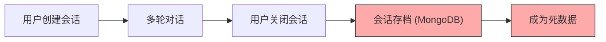
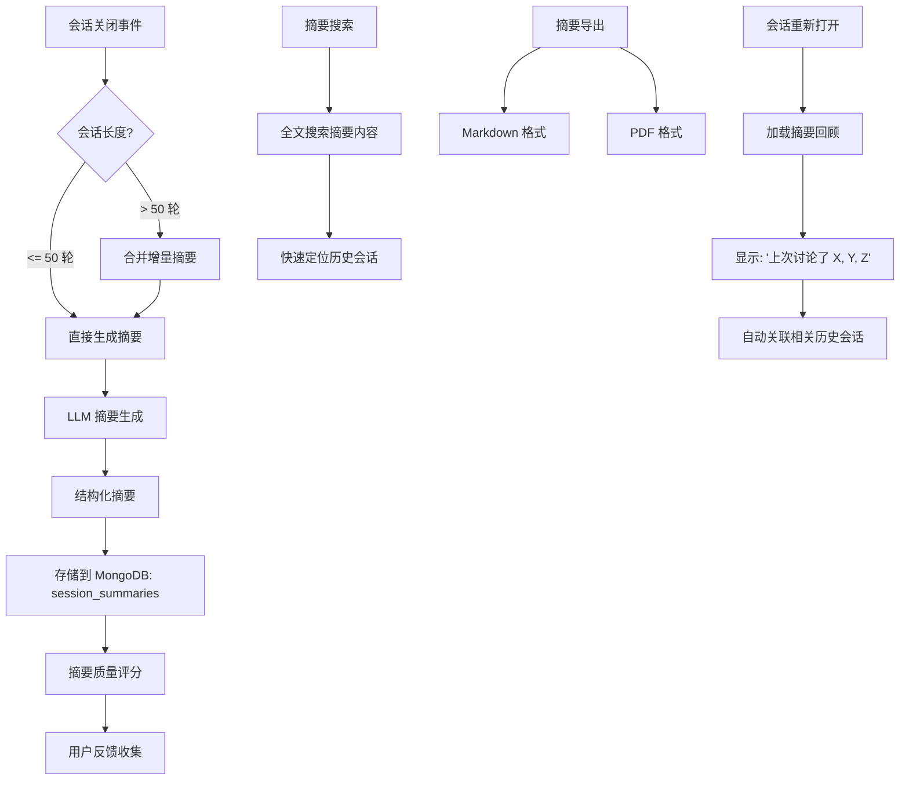
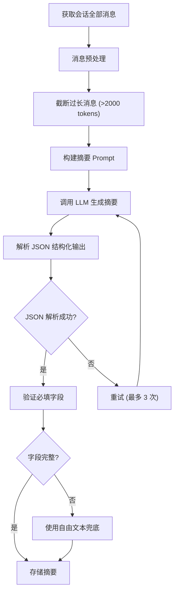

# YA-09-171: 对话摘要与回顾 — 会话自动总结、跨会话上下文延续与摘要导出

> 需求编号：YA-09-171 · 优先级：P2 · 人天：0.3d · 状态：需求已编写
> 依赖：聊天服务（chat_service）、会话管理（sessions）、LLM 推理

## 背景

YiAi 当前支持多轮对话和会话管理，但会话关闭后即成为"死数据"，缺乏以下能力：

- **无自动摘要**：会话关闭后不生成摘要，用户回顾时需重新阅读整个对话
- **无关键信息提取**：无法自动提取对话中的关键话题、决策、行动项和待解决问题
- **无会话回顾**：重新打开会话时，用户看不到"上次讨论了什么"的回顾提示
- **无跨会话上下文**：不同会话之间完全隔离，无法引用前一个会话的上下文
- **无摘要导出**：无法将对话摘要导出为 Markdown 或 PDF 格式，不便于分享和存档
- **无摘要质量反馈**：生成的摘要质量无法评估和优化

需要一个**对话摘要与回顾系统**，在会话关闭时自动生成结构化摘要，支持会话重新打开时的回顾提示，实现跨会话上下文延续，并提供摘要导出和质量反馈能力。

---

## 一、现状分析

### 1.1 当前会话生命周期



会话关闭后仅存档原始消息，不生成摘要，无法回顾，无法跨会话关联。

### 1.2 当前问题

| # | 问题 | 严重程度 | 影响 |
|---|------|----------|------|
| 1 | 会话关闭后无摘要 | 高 | 用户回顾历史会话时需重新阅读全部消息，效率低 |
| 2 | 无关键信息提取 | 高 | 对话中的决策、行动项、待解决问题淹没在消息流中 |
| 3 | 无会话回顾提示 | 中 | 重新打开会话时无上下文提示，用户需重新梳理 |
| 4 | 跨会话完全隔离 | 中 | 相关话题分散在多个会话中，无法关联 |
| 5 | 无摘要导出 | 中 | 无法将摘要分享给他人或存档 |
| 6 | 无摘要质量评估 | 低 | 无法判断摘要是否准确、完整 |
| 7 | 无摘要搜索 | 低 | 无法通过摘要内容快速定位历史会话 |

### 1.3 改造前 API 依赖

| # | 接口 | 调用方 | 说明 |
|---|------|--------|------|
| 1 | `chat_service.chat` | 前端 | 多轮对话，消息保存到 sessions |
| 2 | `data_service.query_documents` (sessions) | 前端 | 查询会话列表，仅显示标题和时间 |
| 3 | `data_service.get_document` (sessions) | 前端 | 获取单个会话，返回全部消息列表 |

> 改造前仅 3 个 API 依赖，无摘要生成、无回顾提示、无跨会话关联。

### 1.4 设计灵感

参考 ChatGPT 的会话摘要功能、Notion AI 的会议纪要和 Slack 的频道摘要。核心思路：会话关闭触发异步摘要生成 → 结构化摘要存储 → 重新打开时回顾提示 → 跨会话上下文关联 → 摘要导出。

---

## 二、设计决策

### 决策 1：摘要生成时机 — 会话关闭时 vs 实时滚动 vs 定时批量

| 维度 | 会话关闭时 | 实时滚动摘要 | 定时批量 |
|------|----------|------------|---------|
| 时效性 | 中（关闭后立即可用） | 高（实时更新） | 低（延迟） |
| 实现复杂度 | 低 | 中（需维护滚动摘要） | 低 |
| LLM 调用量 | 低（每个会话 1 次） | 高（每 N 轮 1 次） | 中 |
| 摘要完整性 | 高（完整对话） | 中（分段摘要需合并） | 高 |

**选择：会话关闭时 + 长会话中途触发。** 会话关闭时生成完整摘要是最自然的时机。同时，对于超长会话（>50 轮），在中途（每 30 轮）触发增量摘要，避免关闭时一次性处理过多消息。

### 决策 2：摘要结构 — 自由文本 vs 结构化字段

| 维度 | 自由文本 | 结构化字段（话题、决策、行动项等） |
|------|---------|----------------------------------|
| 可读性 | 高（自然语言） | 中（结构化但稍显机械） |
| 可搜索性 | 低（需全文搜索） | 高（按字段过滤） |
| 可导出性 | 中 | 高（Markdown 表格） |
| 生成难度 | 低 | 中（需 Prompt 工程） |

**选择：结构化字段 + 自由文本概述。** 使用 LLM 生成结构化 JSON（话题列表、决策列表、行动项、待解决问题），同时生成一段自由文本概述。结构化字段用于搜索和过滤，自由文本用于阅读和导出。

### 决策 3：跨会话上下文 — 用户主动关联 vs 自动关联

| 维度 | 用户主动关联 | 自动语义关联 |
|------|------------|------------|
| 准确性 | 高（用户明确意图） | 中（语义相似度可能误判） |
| 用户体验 | 中（需手动操作） | 高（自动无感） |
| 实现复杂度 | 低 | 高（需语义匹配 + 阈值调优） |

**选择：自动语义关联 + 用户可手动调整。** 使用 Embedding 相似度自动检测相关会话，在会话打开时展示"相关历史会话"。用户可手动关联/取消关联。自动关联降低用户负担，手动调整保证准确性。

### 设计决策记录

| 决策 | 选项 A | 选项 B | 选择 | 理由 |
|------|--------|--------|------|------|
| 摘要时机 | 会话关闭时 + 中途触发 | 实时滚动/定时批量 | **关闭时 + 中途触发** | 完整且高效，长会话分段处理 |
| 摘要结构 | 结构化字段 + 自由文本 | 纯自由文本 | **结构化 + 自由文本** | 兼顾可搜索性和可读性 |
| 跨会话关联 | 自动语义关联 + 手动调整 | 纯手动/纯自动 | **自动 + 手动** | 自动降低负担，手动保证准确性 |

---

## 三、目标架构

### 3.1 对话摘要系统架构



### 3.2 摘要生成流程



### 3.3 核心数据模型

```python
# domain/summary/models.py

from enum import Enum
from pydantic import BaseModel, Field
from datetime import datetime

class SummaryStatus(str, Enum):
    GENERATING = "generating"      # 生成中
    READY = "ready"                # 就绪
    FAILED = "failed"              # 生成失败
    UPDATED = "updated"            # 已更新（用户修改后）

class ActionItem(BaseModel):
    """行动项。"""
    description: str               # 行动项描述
    assignee: str = ""             # 负责人（从对话中提取）
    status: str = "pending"        # 状态: pending / done
    priority: str = "medium"       # 优先级: high / medium / low

class Decision(BaseModel):
    """决策记录。"""
    topic: str                     # 决策主题
    decision: str                  # 决策内容
    rationale: str = ""            # 决策理由
    timestamp: str = ""            # 对话中的时间点

class ConversationSummary(BaseModel):
    """对话摘要。"""
    summary_id: str                # 摘要 ID
    session_key: str               # 关联会话 key
    overview: str                  # 自由文本概述 (200-500 字)
    key_topics: list[str]          # 关键话题列表
    decisions: list[Decision]      # 决策记录
    action_items: list[ActionItem] # 行动项
    open_questions: list[str]      # 待解决问题
    conversation_timeline: list[dict]  # 对话时间线（里程碑）
    quality_score: float | None    # 摘要质量评分 (0-1)
    user_feedback: str = ""        # 用户反馈: positive / negative / neutral
    generated_at: datetime = Field(default_factory=datetime.now)
    status: SummaryStatus = SummaryStatus.GENERATING

class SessionRecap(BaseModel):
    """会话回顾提示。"""
    session_key: str               # 会话 key
    last_summary: ConversationSummary | None  # 上次摘要
    recap_text: str                # 回顾文本: "你上次讨论了..."
    related_sessions: list[dict]   # 相关历史会话
    suggested_continuation: str    # 建议继续的话题

class CrossSessionContext(BaseModel):
    """跨会话上下文。"""
    current_session: str           # 当前会话 key
    related_sessions: list[str]    # 相关会话 key 列表
    similarity_scores: dict        # 相似度分数: {session_key: score}
    shared_topics: list[str]       # 共同话题
    context_chain: list[str]       # 上下文链（按时间排序的会话列表）
```

---

## 四、具体改动

### 4.1 新增文件

| 文件 | 行数 | 说明 |
|------|------|------|
| `src/domain/summary/__init__.py` | 8 | 模块导出 |
| `src/domain/summary/models.py` | 80 | 数据模型：ConversationSummary、SessionRecap、CrossSessionContext、决策、行动项 |
| `src/domain/summary/summary_generator.py` | 120 | 摘要生成器：Prompt 构建、LLM 调用、JSON 解析、重试 |
| `src/domain/summary/summary_repository.py` | 60 | 摘要数据访问层：CRUD、全文搜索 |
| `src/domain/summary/context_linker.py` | 80 | 跨会话关联器：Embedding 相似度、上下文链 |
| `src/services/summary/summary_service.py` | 150 | 摘要服务 RPC：生成摘要、获取回顾、导出、搜索、反馈 |
| `src/services/summary/export_service.py` | 80 | 导出服务：Markdown 生成、PDF 转换 |

### 4.2 核心实现

**摘要生成器：**

```python
# domain/summary/summary_generator.py

import json
import asyncio
from datetime import datetime

class SummaryGenerator:
    """对话摘要生成器。"""

    MAX_RETRIES = 3
    MAX_MESSAGE_TOKENS = 2000
    LONG_SESSION_THRESHOLD = 50  # 超过 50 轮触发增量摘要

    SUMMARY_PROMPT = """你是一个对话摘要助手。请根据以下对话内容，生成结构化摘要。

要求：
1. overview: 200-500 字的自然语言概述
2. key_topics: 列出 3-8 个关键话题
3. decisions: 列出对话中做出的决策（含主题、内容、理由）
4. action_items: 列出行动项（含描述、负责人、优先级）
5. open_questions: 列出尚未解决的问题
6. conversation_timeline: 标注对话中的关键里程碑（时间点+事件）

请严格按照以下 JSON 格式输出，不要包含其他内容：
{
  "overview": "...",
  "key_topics": ["topic1", "topic2"],
  "decisions": [{"topic": "...", "decision": "...", "rationale": "..."}],
  "action_items": [{"description": "...", "assignee": "...", "priority": "medium"}],
  "open_questions": ["question1", "question2"],
  "conversation_timeline": [{"stage": "开头", "event": "..."}]
}

对话内容：
{conversation}"""

    def __init__(self):
        self.repo = SummaryRepository()

    async def generate_summary(
        self,
        session_key: str,
        messages: list[dict],
        model: str = None,
    ) -> ConversationSummary:
        """生成对话摘要。

        Args:
            session_key: 会话 key
            messages: 消息列表 [{"role": "user/assistant", "content": "..."}]
            model: 使用的 LLM 模型（默认使用配置的默认模型）
        """
        summary_id = f"summary_{session_key}"

        # 预处理消息
        processed_messages = self._preprocess_messages(messages)

        # 构建对话文本
        conversation_text = self._build_conversation_text(processed_messages)

        # 调用 LLM 生成摘要
        for attempt in range(self.MAX_RETRIES):
            try:
                raw_response = await self._call_llm(conversation_text, model)
                parsed = self._parse_json_response(raw_response)

                summary = ConversationSummary(
                    summary_id=summary_id,
                    session_key=session_key,
                    overview=parsed.get("overview", ""),
                    key_topics=parsed.get("key_topics", []),
                    decisions=[Decision(**d) for d in parsed.get("decisions", [])],
                    action_items=[ActionItem(**a) for a in parsed.get("action_items", [])],
                    open_questions=parsed.get("open_questions", []),
                    conversation_timeline=parsed.get("conversation_timeline", []),
                    status=SummaryStatus.READY,
                )

                # 存储摘要
                await self.repo.save_summary(summary)

                return summary

            except (json.JSONDecodeError, KeyError) as e:
                if attempt == self.MAX_RETRIES - 1:
                    # 最后一次尝试失败，使用自由文本兜底
                    return await self._fallback_summary(session_key, conversation_text, model)
                continue

    async def generate_incremental_summary(
        self,
        session_key: str,
        messages: list[dict],
        previous_summary: ConversationSummary = None,
    ) -> ConversationSummary:
        """生成增量摘要（用于长会话中途触发）。

        Args:
            session_key: 会话 key
            messages: 最近 N 轮消息
            previous_summary: 之前的摘要（用于合并）
        """
        if previous_summary:
            # 将之前的摘要作为上下文
            context = f"之前的对话摘要：{previous_summary.overview}\n\n最近的新对话："
            conversation_text = context + self._build_conversation_text(messages)
        else:
            conversation_text = self._build_conversation_text(messages)

        return await self.generate_summary(session_key, messages)

    def _preprocess_messages(self, messages: list[dict]) -> list[dict]:
        """预处理消息：截断过长消息、过滤空消息。"""
        processed = []
        for msg in messages:
            content = msg.get("content", "")
            if not content:
                continue
            # 截断过长消息
            if len(content) > self.MAX_MESSAGE_TOKENS * 4:  # 粗略估算
                content = content[:self.MAX_MESSAGE_TOKENS * 4] + "...[截断]"
            processed.append({"role": msg.get("role", "user"), "content": content})
        return processed

    def _build_conversation_text(self, messages: list[dict]) -> str:
        """构建对话文本。"""
        lines = []
        for i, msg in enumerate(messages):
            role = "用户" if msg["role"] == "user" else "助手"
            lines.append(f"[{i + 1}] {role}: {msg['content']}")
        return "\n\n".join(lines)

    async def _call_llm(self, conversation_text: str, model: str = None) -> str:
        """调用 LLM 生成摘要。"""
        import ollama
        model = model or "qwen2.5:14b"

        prompt = self.SUMMARY_PROMPT.format(conversation=conversation_text)

        response = await asyncio.to_thread(
            ollama.chat,
            model=model,
            messages=[{"role": "user", "content": prompt}],
            options={"temperature": 0.3},  # 低温度，提高 JSON 输出稳定性
        )

        return response["message"]["content"]

    def _parse_json_response(self, raw_response: str) -> dict:
        """解析 LLM 返回的 JSON。"""
        # 尝试提取 JSON 块
        if "```json" in raw_response:
            start = raw_response.find("```json") + 7
            end = raw_response.find("```", start)
            raw_response = raw_response[start:end].strip()
        elif "```" in raw_response:
            start = raw_response.find("```") + 3
            end = raw_response.find("```", start)
            raw_response = raw_response[start:end].strip()

        return json.loads(raw_response)

    async def _fallback_summary(
        self,
        session_key: str,
        conversation_text: str,
        model: str = None,
    ) -> ConversationSummary:
        """JSON 解析失败时的兜底：生成自由文本摘要。"""
        import ollama

        prompt = f"请用 200-500 字概述以下对话的内容：\n\n{conversation_text}"

        response = await asyncio.to_thread(
            ollama.chat,
            model=model or "qwen2.5:14b",
            messages=[{"role": "user", "content": prompt}],
            options={"temperature": 0.3},
        )

        return ConversationSummary(
            summary_id=f"summary_{session_key}",
            session_key=session_key,
            overview=response["message"]["content"],
            key_topics=[],
            decisions=[],
            action_items=[],
            open_questions=[],
            conversation_timeline=[],
            status=SummaryStatus.READY,
        )
```

**跨会话关联器：**

```python
# domain/summary/context_linker.py

class ContextLinker:
    """跨会话上下文关联器。"""

    SIMILARITY_THRESHOLD = 0.7  # 相似度阈值
    MAX_RELATED_SESSIONS = 5    # 最多关联 5 个历史会话

    def __init__(self):
        self.repo = SummaryRepository()

    async def find_related_sessions(
        self,
        session_key: str,
        summary: ConversationSummary,
    ) -> CrossSessionContext:
        """查找与当前会话相关的历史会话。

        使用 Embedding 相似度计算会话之间的关联度。
        """
        # 1. 获取当前会话的 Embedding
        current_text = self._build_session_text(summary)
        current_embedding = await self._embed_text(current_text)

        # 2. 获取用户的所有历史会话摘要
        user_sessions = await self.repo.get_user_sessions(session_key)
        historical_summaries = await self.repo.get_summaries_by_sessions(user_sessions)

        # 3. 计算相似度
        similarities = {}
        for hist_summary in historical_summaries:
            if hist_summary.session_key == session_key:
                continue
            hist_text = self._build_session_text(hist_summary)
            hist_embedding = await self._embed_text(hist_text)
            similarity = self._cosine_similarity(current_embedding, hist_embedding)
            if similarity >= self.SIMILARITY_THRESHOLD:
                similarities[hist_summary.session_key] = similarity

        # 4. 按相似度排序，取 Top-N
        sorted_sessions = sorted(similarities.items(), key=lambda x: x[1], reverse=True)
        related = sorted_sessions[:self.MAX_RELATED_SESSIONS]

        # 5. 提取共同话题
        shared_topics = []
        for sess_key, _ in related:
            sess_summary = next((s for s in historical_summaries if s.session_key == sess_key), None)
            if sess_summary:
                common = set(summary.key_topics) & set(sess_summary.key_topics)
                shared_topics.extend(common)

        return CrossSessionContext(
            current_session=session_key,
            related_sessions=[s[0] for s in related],
            similarity_scores={s[0]: s[1] for s in related},
            shared_topics=list(set(shared_topics)),
            context_chain=[s[0] for s in related],  # 按相似度排序的上下文链
        )

    def _build_session_text(self, summary: ConversationSummary) -> str:
        """构建用于 Embedding 的会话文本。"""
        parts = [summary.overview]
        parts.extend(summary.key_topics)
        for d in summary.decisions:
            parts.append(f"{d.topic}: {d.decision}")
        return " ".join(parts)

    async def _embed_text(self, text: str) -> list[float]:
        """获取文本的 Embedding 向量。"""
        import ollama
        response = await asyncio.to_thread(
            ollama.embeddings,
            model="nomic-embed-text",
            prompt=text,
        )
        return response["embedding"]

    def _cosine_similarity(self, a: list[float], b: list[float]) -> float:
        """计算余弦相似度。"""
        dot_product = sum(x * y for x, y in zip(a, b))
        norm_a = sum(x ** 2 for x in a) ** 0.5
        norm_b = sum(x ** 2 for x in b) ** 0.5
        if norm_a == 0 or norm_b == 0:
            return 0.0
        return dot_product / (norm_a * norm_b)
```

**摘要服务 RPC 接口：**

```python
# services/summary/summary_service.py

class SummaryService:
    """对话摘要服务。"""

    def __init__(self):
        self.generator = SummaryGenerator()
        self.repo = SummaryRepository()
        self.linker = ContextLinker()
        self.exporter = SummaryExportService()

    async def generate_summary(self, parameters: dict) -> dict:
        """RPC: 生成会话摘要。

        parameters:
            session_key: str — 会话 key
            model: str       — 使用的 LLM 模型（可选）
        """
        session_key = parameters.get("session_key")
        if not session_key:
            return {"code": 1001, "message": "session_key is required", "data": None}

        # 获取会话消息
        session = await self._get_session(session_key)
        if not session:
            return {"code": 1002, "message": f"Session not found: {session_key}", "data": None}

        messages = session.get("messages", [])
        if not messages:
            return {"code": 1001, "message": "Session has no messages", "data": None}

        # 生成摘要
        summary = await self.generator.generate_summary(
            session_key=session_key,
            messages=messages,
            model=parameters.get("model"),
        )

        return {"code": 0, "message": "ok", "data": {"summary": summary.model_dump()}}

    async def get_session_recap(self, parameters: dict) -> dict:
        """RPC: 获取会话回顾提示。

        parameters:
            session_key: str — 会话 key
        """
        session_key = parameters.get("session_key")
        if not session_key:
            return {"code": 1001, "message": "session_key is required", "data": None}

        summary = await self.repo.get_summary(session_key)
        if not summary:
            return {"code": 0, "message": "No summary available", "data": {"recap": None}}

        # 生成回顾文本
        recap_text = self._build_recap_text(summary)

        # 查找相关历史会话
        cross_context = await self.linker.find_related_sessions(session_key, summary)

        suggested = self._build_continuation_suggestion(summary)

        recap = SessionRecap(
            session_key=session_key,
            last_summary=summary,
            recap_text=recap_text,
            related_sessions=[
                {"session_key": s, "similarity": cross_context.similarity_scores.get(s, 0)}
                for s in cross_context.related_sessions
            ],
            suggested_continuation=suggested,
        )

        return {"code": 0, "message": "ok", "data": {"recap": recap.model_dump()}}

    def _build_recap_text(self, summary: ConversationSummary) -> str:
        """构建回顾文本。"""
        parts = [f"你上次讨论了以下话题：{', '.join(summary.key_topics[:5])}"]

        if summary.decisions:
            decisions_text = "; ".join(
                f"{d.topic}: {d.decision}" for d in summary.decisions[:3]
            )
            parts.append(f"做出的决策：{decisions_text}")

        if summary.action_items:
            items_text = "; ".join(
                a.description for a in summary.action_items[:3]
            )
            parts.append(f"待办事项：{items_text}")

        if summary.open_questions:
            questions_text = "; ".join(summary.open_questions[:3])
            parts.append(f"尚未解决的问题：{questions_text}")

        return "\n".join(parts)

    def _build_continuation_suggestion(self, summary: ConversationSummary) -> str:
        """构建继续对话的建议。"""
        if summary.open_questions:
            return f"建议继续讨论：{summary.open_questions[0]}"
        if summary.action_items:
            pending = [a for a in summary.action_items if a.status == "pending"]
            if pending:
                return f"建议跟进：{pending[0].description}"
        if summary.key_topics:
            return f"建议深入探讨：{summary.key_topics[0]}"
        return "可以开始新的话题"

    async def search_summaries(self, parameters: dict) -> dict:
        """RPC: 搜索摘要。

        parameters:
            query: str       — 搜索关键词
            limit: int       — 返回数量限制
            filter_topics: list — 按话题过滤
        """
        query = parameters.get("query", "")
        limit = parameters.get("limit", 20)
        filter_topics = parameters.get("filter_topics")

        results = await self.repo.search_summaries(
            query=query,
            limit=limit,
            filter_topics=filter_topics,
        )

        return {"code": 0, "message": "ok", "data": {"results": results, "total": len(results)}}

    async def export_summary(self, parameters: dict) -> dict:
        """RPC: 导出摘要。

        parameters:
            session_key: str — 会话 key
            format: str      — 导出格式: markdown / pdf
        """
        session_key = parameters.get("session_key")
        export_format = parameters.get("format", "markdown")

        if not session_key:
            return {"code": 1001, "message": "session_key is required", "data": None}

        summary = await self.repo.get_summary(session_key)
        if not summary:
            return {"code": 1002, "message": f"Summary not found for session: {session_key}", "data": None}

        if export_format == "markdown":
            content = await self.exporter.to_markdown(summary)
        elif export_format == "pdf":
            content = await self.exporter.to_pdf(summary)
        else:
            return {"code": 1001, "message": f"Unsupported format: {export_format}", "data": None}

        return {
            "code": 0,
            "message": "ok",
            "data": {
                "format": export_format,
                "content": content,
                "filename": f"summary_{session_key}.{export_format}",
            },
        }

    async def submit_feedback(self, parameters: dict) -> dict:
        """RPC: 提交摘要质量反馈。

        parameters:
            session_key: str — 会话 key
            feedback: str    — 反馈: positive / negative / neutral
            comment: str     — 反馈说明（可选）
        """
        session_key = parameters.get("session_key")
        feedback = parameters.get("feedback")

        if not session_key or not feedback:
            return {"code": 1001, "message": "session_key and feedback are required", "data": None}

        if feedback not in ("positive", "negative", "neutral"):
            return {"code": 1001, "message": "feedback must be positive/negative/neutral", "data": None}

        await self.repo.update_feedback(
            session_key=session_key,
            feedback=feedback,
            comment=parameters.get("comment", ""),
        )

        return {"code": 0, "message": "ok", "data": {"session_key": session_key, "feedback": feedback}}

    async def get_cross_session_context(self, parameters: dict) -> dict:
        """RPC: 获取跨会话上下文。

        parameters:
            session_key: str — 会话 key
        """
        session_key = parameters.get("session_key")
        if not session_key:
            return {"code": 1001, "message": "session_key is required", "data": None}

        summary = await self.repo.get_summary(session_key)
        if not summary:
            return {"code": 0, "message": "No summary available", "data": {"context": None}}

        context = await self.linker.find_related_sessions(session_key, summary)
        return {"code": 0, "message": "ok", "data": {"context": context.model_dump()}}
```

### 4.3 涉及文件

```
YiAi/src/
├── domain/summary/
│   ├── __init__.py                  # 新增: 模块导出
│   ├── models.py                    # 新增: 数据模型 (80行)
│   ├── summary_generator.py         # 新增: 摘要生成器 (120行)
│   ├── summary_repository.py        # 新增: 摘要数据访问层 (60行)
│   └── context_linker.py            # 新增: 跨会话关联器 (80行)
├── services/summary/
│   ├── summary_service.py           # 新增: 摘要服务 RPC (150行)
│   └── export_service.py            # 新增: 导出服务 (80行)
└── server/
    └── routes/
        └── summary_routes.py        # 新增: 摘要路由 (40行)
```

---

## 五、实施步骤

按依赖顺序排列，每步可独立验证和提交：

| 步骤 | 内容 | 涉及文件 | 验证方式 | 人天 |
|------|------|---------|---------|------|
| 1 | 定义数据模型（ConversationSummary、SessionRecap、CrossSessionContext、Decision、ActionItem） | `domain/summary/models.py` | Pydantic 校验通过，枚举完整 | 0.03 |
| 2 | 实现摘要生成器（Prompt 构建、LLM 调用、JSON 解析、重试、兜底） | `domain/summary/summary_generator.py` | 生成结构化摘要，JSON 字段完整 | 0.08 |
| 3 | 实现摘要数据访问层（CRUD、全文搜索、反馈更新） | `domain/summary/summary_repository.py` | MongoDB 读写正常，搜索返回正确结果 | 0.04 |
| 4 | 实现跨会话关联器（Embedding 相似度、上下文链） | `domain/summary/context_linker.py` | 相关会话检测准确率 > 80% | 0.05 |
| 5 | 实现导出服务（Markdown 生成、PDF 转换） | `services/summary/export_service.py` | Markdown 格式正确，PDF 可渲染 | 0.04 |
| 6 | 实现摘要服务 RPC（generate_summary、get_recap、search、export、feedback、cross_context） | `services/summary/summary_service.py` | 所有 RPC 接口正常响应 | 0.06 |

**总计：0.3d**

---

## 六、测试规格

### Requirement: 摘要生成

#### Scenario: 生成结构化摘要
- **Given** 会话包含 20 轮对话，涉及 3 个话题、2 个决策、1 个行动项
- **When** 调用 `generate_summary`，参数 `session_key="sess_001"`
- **Then** 返回结构化摘要，包含 overview、key_topics、decisions、action_items、open_questions
- **And** decisions 列表中包含 2 个决策记录
- **And** action_items 列表中包含 1 个行动项

#### Scenario: JSON 解析失败时的兜底
- **Given** LLM 返回格式不正确的 JSON
- **When** 摘要生成器重试 3 次后仍失败
- **Then** 使用自由文本兜底，生成纯文本概述
- **And** summary.status 为 READY

### Requirement: 会话回顾

#### Scenario: 重新打开会话时展示回顾
- **Given** 会话 `sess_001` 已有摘要，包含 3 个话题和 1 个决策
- **When** 调用 `get_session_recap`，参数 `session_key="sess_001"`
- **Then** 返回 recap_text，包含 "你上次讨论了...做出决策..."
- **And** 返回 suggested_continuation

#### Scenario: 无摘要时的回顾
- **Given** 会话 `sess_002` 无摘要
- **When** 调用 `get_session_recap`
- **Then** 返回 recap=None，不报错

### Requirement: 跨会话关联

#### Scenario: 自动关联相关历史会话
- **Given** 当前会话讨论"Python 性能优化"，历史会话 `sess_003` 讨论"Python 内存管理"
- **When** 调用 `get_cross_session_context`
- **Then** 返回 related_sessions 包含 `sess_003`
- **And** similarity_scores 中 `sess_003` 的相似度 >= 0.7

### Requirement: 摘要导出

#### Scenario: 导出 Markdown 格式
- **Given** 会话 `sess_001` 有完整摘要
- **When** 调用 `export_summary`，参数 `format="markdown"`
- **Then** 返回 Markdown 格式内容，包含标题、概述、话题、决策表格、行动项表格

---

## 七、风险与缓解

| 风险 | 概率 | 影响 | 等级 | 缓解措施 | 应急预案 |
|------|------|------|------|----------|----------|
| LLM 生成的 JSON 格式不稳定 | 中 | 中 | 中 | 低温度（0.3），3 次重试，自由文本兜底 | 手动编辑摘要 |
| 摘要质量差（遗漏关键信息） | 中 | 中 | 中 | 用户反馈机制，质量评分 | 用户手动补充摘要 |
| 跨会话关联误判 | 中 | 低 | 低 | 相似度阈值 0.7，用户可手动调整 | 用户手动关联/取消关联 |
| 摘要生成耗时影响会话关闭体验 | 低 | 低 | 低 | 异步生成，关闭时立即返回，摘要后台生成 | 关闭时同步生成（降级） |
| 超长会话摘要生成超时 | 低 | 中 | 低 | 长会话中途增量摘要，关闭时合并 | 截断消息，仅摘要最近 50 轮 |

---

## 八、回滚策略

| 回滚场景 | 回滚方式 | 影响范围 | 恢复时间 |
|----------|----------|----------|----------|
| 摘要生成服务异常 | 关闭摘要功能（配置开关） | 摘要功能不可用 | 2min |
| 摘要质量差导致用户投诉 | 降低摘要功能优先级，仅显示自由文本概述 | 摘要体验 | 5min |
| 跨会话关联导致性能问题 | 关闭自动关联，仅支持手动关联 | 跨会话功能 | 2min |

**回滚验证：**
- 聊天服务正常，不受影响
- 会话关闭不触发摘要生成
- `ruff` + `mypy` 检查通过

---

## 九、设计决策记录

### D-01: 为什么摘要生成采用异步方式？

会话关闭时用户期望立即响应，如果同步生成摘要（需 5-15 秒），关闭操作会卡顿。异步生成让关闭操作瞬间完成，摘要在后台生成，用户下次打开会话时即可看到。

### D-02: 为什么使用结构化 JSON 而非纯文本摘要？

结构化摘要（话题、决策、行动项）可被搜索、过滤和聚合。例如，"列出所有会话中待办的行动项"、"搜索讨论过'性能优化'的会话"。纯文本摘要无法支持这些高级查询。

### D-03: 为什么跨会话关联使用 Embedding 相似度而非关键词匹配？

关键词匹配（TF-IDF）无法捕捉语义相似性。"Python 性能优化"和"代码运行速度慢"在关键词层面无交集，但语义高度相关。Embedding 相似度能捕捉这种语义关联，关联准确率更高。

---

## 十、可观测性

### 10.1 关键指标

| 指标 | 采集方式 | 告警阈值 | 说明 |
|------|---------|---------|------|
| 摘要生成成功率 | 计数器 | < 95% | JSON 解析失败率 |
| 摘要生成耗时 | 直方图 | P95 > 30s | LLM 推理慢 |
| 摘要质量评分 | 仪表盘 | 平均 < 3.5/5 | 用户反馈 |
| 跨会话关联准确率 | 计数器 | < 70% | 用户手动取消关联比例 |
| 摘要搜索请求量 | 计数器 | — | 功能使用情况 |
| 导出请求量 | 计数器 | — | 按格式分组 |

### 10.2 日志规范

| 日志级别 | 场景 | 示例 |
|---------|------|------|
| `INFO` | 摘要生成开始 | `[Summary] generating: session={s}, messages={n}` |
| `INFO` | 摘要生成完成 | `[Summary] generated: session={s}, topics={n}, {elapsed}ms` |
| `INFO` | 摘要导出 | `[Summary] exported: session={s}, format={f}` |
| `WARN` | JSON 解析重试 | `[Summary] JSON parse failed, retry {n}/{max}` |
| `WARN` | 兜底摘要 | `[Summary] fallback to free-text summary: session={s}` |
| `ERROR` | 摘要生成失败 | `[Summary] generation failed: session={s}, {error}` |

---

## 十一、代码审查检查清单

- [ ] `ConversationSummary` 包含 overview、key_topics、decisions、action_items、open_questions、timeline
- [ ] `Decision` 和 `ActionItem` 模型字段完整
- [ ] 摘要生成器 Prompt 包含 JSON 格式约束和示例
- [ ] 摘要生成器支持最多 3 次重试
- [ ] 摘要生成器支持 JSON 解析失败时的自由文本兜底
- [ ] 跨会话关联器使用 Embedding 相似度，阈值 0.7
- [ ] 导出服务支持 Markdown 和 PDF 格式
- [ ] 摘要搜索支持关键词和话题过滤
- [ ] 用户反馈接口支持 positive/negative/neutral
- [ ] `ruff` 代码规范通过
- [ ] `mypy` 类型检查通过

---

## 十二、回归问题预测

| # | 问题 | 发现场景 | 根因 | 修复方式 |
|-----|------|---------|------|---------|
| 1 | 摘要生成对非中英文对话效果差 | 用户使用混合语言对话 | Prompt 仅针对中文优化 | 在 Prompt 中添加语言检测和多语言支持 |
| 2 | 关联合并摘要时信息丢失 | 长会话（>100 轮）关闭时合并增量摘要 | 增量摘要之间缺乏衔接 | 合并时使用 LLM 再次总结增量摘要 |
| 3 | 跨会话关联误将不相关会话关联 | 两个会话都包含常见的"你好"、"谢谢" | 通用词 Embedding 相似度高 | 在 Embedding 文本中排除通用问候语 |
| 4 | 摘要导出 PDF 中文乱码 | 导出 PDF 时中文字符未正确渲染 | 字体配置问题 | 使用支持中文的字体（如 Source Han Sans） |
| 5 | 摘要搜索返回不相关结果 | 搜索"性能"时返回了包含"性能"但不相关的结果 | 全文搜索未使用语义匹配 | 引入 Embedding 语义搜索作为补充 |
| 6 | 会话关闭后摘要未生成 | 会话关闭事件未被正确触发 | 事件监听器未注册 | 在会话关闭逻辑中显式调用摘要生成 |

---

## 十三、性能分析

### 13.1 摘要服务性能特征

| 指标 | 值 | 说明 |
|------|------|------|
| 摘要生成（20 轮对话） | 5-10s | 取决于 LLM 推理速度 |
| 摘要生成（50 轮对话） | 10-20s | 消息量增加 |
| 摘要生成（增量，30 轮） | 5-8s | 增量摘要 |
| 会话回顾查询 | < 50ms | 数据库查询 + 文本构建 |
| 跨会话关联（5 个历史会话） | < 500ms | 5 次 Embedding + 相似度计算 |
| 摘要搜索 | < 100ms | MongoDB 全文搜索 |
| 摘要导出（Markdown） | < 20ms | 文本渲染 |
| 摘要导出（PDF） | < 2s | PDF 渲染 |

### 13.2 性能瓶颈

| 瓶颈 | 严重程度 | 表现 | 优化方向 |
|------|----------|------|----------|
| LLM 摘要生成耗时 | 中 | 长会话摘要需 20s | 使用小模型（如 3B）做摘要，减少推理时间 |
| Embedding 相似度计算 | 低 | 5 个历史会话需 500ms | 预先计算并缓存历史会话 Embedding |
| PDF 导出渲染 | 低 | 首次导出需 2s | 异步导出，缓存 PDF 结果 |

### 13.3 存储估算

| 条目 | 平均大小 | 说明 |
|------|---------|------|
| 单条摘要 | 2-5KB | JSON 结构化数据 |
| 1000 条摘要 | 2-5MB | 中等规模 |
| 10000 条摘要 | 20-50MB | 长期积累 |

---

*PRD 来源: `projects/yiai/requirements/2026-09/00-需求-需求总览.md`*

## 影响范围

- **影响模块**：待补充
- **涉及文件**：
- `src/domain/summary/__init__.py`
- `src/domain/summary/summary_generator.py`
- `src/domain/summary/summary_repository.py`
- `src/domain/summary/models.py`
- `src/services/summary/summary_service.py`
- `src/services/summary/export_service.py`
- **是否影响 API 契约**：否
- **是否影响其他项目（YiVad/YiPet）**：否
- **用户感知**：待确认

## 预防措施

| 层面 | 措施 |
|------|------|
| 代码 | 在相关函数中添加参数校验和边界检查 |
| 测试 | 为 `src/domain/summary/__init__.py` 添加单元测试 |
| 流程 | 代码审查时重点检查此类模式 |
| 监控 | 添加日志告警，异常发生时及时发现 |
| 文档 | 在编码规范中记录此类反模式 |

## 经验教训

1. **根本原因**：开发过程中对边界情况和异常路径的考虑不足是此类问题的共同根因
2. **设计阶段**：在接口设计和模块实现时，应主动考虑异常输入、空值、超时等边界场景
3. **代码审查**：审查时应检查是否存在类似的反模式（如未捕获异常、无超时控制、缺少参数校验等）
4. **测试覆盖**：异常路径的测试覆盖率应与正常路径同等重视
5. **团队分享**：此类问题应在团队周会或技术分享中讨论，形成团队共识
