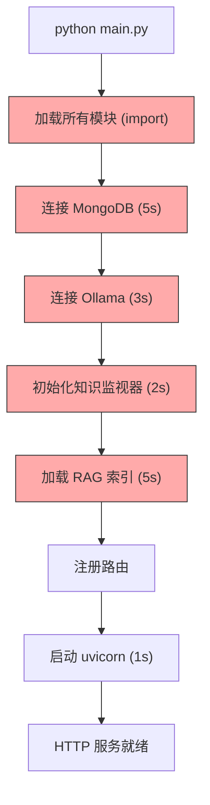
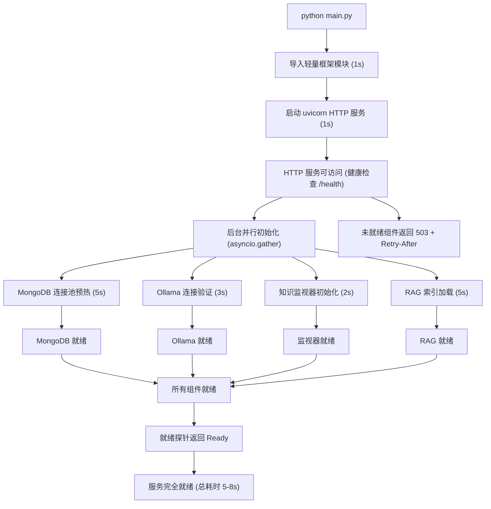
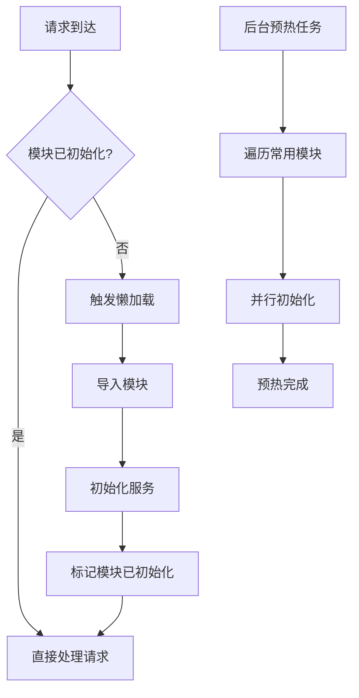

# YA-09-172: 冷启动优化 — FastAPI 启动加速、懒加载与并行初始化

> 需求编号：YA-09-172 · 优先级：P2 · 人天：0.3d · 状态：需求已编写
> 依赖：FastAPI 应用主体、服务模块注册、MongoDB 连接、Ollama 连接

## 背景

YiAi 当前启动流程为串行执行：加载所有模块 → 连接 MongoDB → 连接 Ollama → 初始化知识监视器 → 加载 RAG 索引 → 启动 HTTP 服务。整个启动过程耗时 15-30 秒，且存在以下问题：

- **启动耗时过长**：15-30 秒的启动时间在开发迭代中频繁重启时严重影响效率，在容器化部署时延长了 Pod 就绪时间
- **全量加载**：所有模块（包括不常用的）在启动时全部加载，大量 `import` 语句在启动阶段执行，阻塞事件循环
- **串行初始化**：MongoDB 连接、Ollama 连接、RAG 索引加载等独立组件串行初始化，未利用并行能力
- **无就绪探针**：启动期间 HTTP 服务不可用，无法区分"正在启动"和"已崩溃"，K8s 健康检查超时
- **无优雅降级**：某个组件初始化失败导致整个服务启动失败，无法部分可用
- **无启动基准**：缺乏启动时间基准测试，无法检测启动性能退化

需要一套**冷启动优化方案**，通过懒加载、并行初始化、连接池预热和就绪探针，将启动时间从 15-30 秒降至 5-10 秒，并支持优雅降级。

---

## 一、现状分析

### 1.1 当前启动流程



每个环节串行执行，总耗时 = 各环节耗时之和。启动期间 HTTP 服务不可用，健康检查返回失败。

### 1.2 当前问题

| # | 问题 | 严重程度 | 影响 |
|---|------|----------|------|
| 1 | 启动耗时 15-30s | 高 | 开发迭代慢，容器部署 Pod 就绪慢 |
| 2 | 全量模块加载 | 高 | 不常用模块的 import 拖慢启动 |
| 3 | 串行初始化 | 高 | 独立组件无法并行初始化 |
| 4 | 无就绪探针 | 中 | 健康检查在启动期间失败，K8s 误判崩溃 |
| 5 | 无优雅降级 | 中 | 单一组件失败导致整体启动失败 |
| 6 | 无启动基准 | 中 | 无法检测启动性能退化 |
| 7 | 连接池冷启动 | 低 | 前几个请求因连接池未预热而延迟高 |

### 1.3 改造前启动流程

```
main.py 执行
  → import domain/chat/models.py (所有模型)
  → import services/chat/chat_service.py (所有服务)
  → import services/rag/rag_service.py
  → import services/agent/agent_service.py
  → import services/data/data_service.py
  ... (所有其他服务)
  → MongoClient 连接 (5s)
  → ollama.list() 验证 (3s)
  → KnowledgeMonitor 初始化 (2s)
  → RAG 索引加载 (5s)
  → app.include_router() (所有路由)
  → uvicorn.run() (1s)
  → HTTP 服务就绪 (总计 15-30s)
```

### 1.4 设计灵感

参考 FastAPI 的 Lifespan 事件、Python 的 `importlib` 懒加载模式、K8s 的 readiness probe 和 Spring Boot 的懒初始化。核心思路：延迟加载 → 并行初始化 → 先启动 HTTP 再初始化组件 → 就绪探针。

---

## 二、设计决策

### 决策 1：懒加载策略 — 按需导入 vs 预导入 + 延迟初始化

| 维度 | 按需导入（import on first use） | 预导入 + 延迟初始化 |
|------|------------------------------|-------------------|
| 启动速度 | 快（仅导入框架代码） | 中（导入所有模块头，延迟初始化） |
| 首次请求延迟 | 高（首次请求触发 import） | 低（已导入，仅初始化） |
| 实现复杂度 | 低（Python importlib） | 中（需管理初始化状态） |
| 兼容性 | 高（Python 原生支持） | 高 |

**选择：预导入 + 延迟初始化。** 纯按需导入会导致首次请求延迟高（用户感知明显）。预导入模块头（仅导入类定义，不执行初始化），在首次使用时或后台初始化组件。兼顾启动速度和首次请求延迟。

### 决策 2：并行初始化 — asyncio.gather vs 线程池

| 维度 | asyncio.gather | 线程池 (ThreadPoolExecutor) |
|------|---------------|---------------------------|
| 适用场景 | 异步 I/O（MongoDB、HTTP） | 同步阻塞（Ollama、文件 I/O） |
| 实现复杂度 | 低 | 中 |
| 资源开销 | 低 | 中 |

**选择：asyncio.gather + 线程池混合。** MongoDB 连接等异步 I/O 使用 `asyncio.gather` 并行，Ollama 连接等同步阻塞使用 `run_in_executor` 在线程池中并行。两者混合使用，最大化并行效率。

### 决策 3：启动策略 — 先启动 HTTP 后初始化 vs 先初始化后启动 HTTP

| 维度 | 先启动 HTTP 后初始化 | 先初始化后启动 HTTP |
|------|--------------------|--------------------|
| 首次可访问时间 | 快（< 2s） | 慢（15-30s） |
| 就绪时间 | 慢（初始化完成） | 慢（与首次可访问相同） |
| 用户体验 | 好（立即可见健康检查通过） | 差（长时间无响应） |
| 优雅降级 | 好（未初始化组件返回 503） | 差（全部不可用） |

**选择：先启动 HTTP 后初始化。** HTTP 服务在 2 秒内启动，健康检查端点立即可用。组件在后台并行初始化，初始化中的组件返回 503（Service Unavailable）并携带重试建议。K8s readiness probe 在所有组件就绪后才标记 Pod 为 Ready。

### 设计决策记录

| 决策 | 选项 A | 选项 B | 选择 | 理由 |
|------|--------|--------|------|------|
| 懒加载策略 | 预导入 + 延迟初始化 | 按需导入 | **预导入 + 延迟初始化** | 避免首次请求延迟高 |
| 并行初始化 | asyncio.gather + 线程池 | 纯 asyncio | **混合模式** | 覆盖异步和同步初始化场景 |
| 启动策略 | 先启动 HTTP 后初始化 | 先初始化后启动 HTTP | **先启动 HTTP 后初始化** | 快速可访问，支持优雅降级 |

---

## 三、目标架构

### 3.1 优化后启动流程



### 3.2 懒加载模块架构



### 3.3 核心数据模型

```python
# domain/startup/models.py

from enum import Enum
from pydantic import BaseModel, Field
from datetime import datetime
import time

class ComponentStatus(str, Enum):
    PENDING = "pending"          # 待初始化
    INITIALIZING = "initializing" # 初始化中
    READY = "ready"              # 就绪
    DEGRADED = "degraded"        # 降级（部分功能不可用）
    FAILED = "failed"            # 初始化失败

class ComponentInfo(BaseModel):
    """组件信息。"""
    name: str                    # 组件名称: mongodb, ollama, rag, knowledge_monitor
    status: ComponentStatus      # 组件状态
    startup_duration_ms: float = 0.0  # 启动耗时 (ms)
    error_message: str = ""      # 错误信息
    retry_count: int = 0         # 重试次数
    dependencies: list[str] = [] # 依赖的其他组件

class StartupReport(BaseModel):
    """启动报告。"""
    total_startup_ms: float      # 总启动耗时
    http_ready_ms: float         # HTTP 服务就绪耗时
    components: list[ComponentInfo]  # 各组件状态
    bottleneck: str              # 启动瓶颈组件
    compared_to_baseline: float  # 与基准对比 (正数=变慢)
    started_at: datetime = Field(default_factory=datetime.now)

class LazyModule(BaseModel):
    """懒加载模块描述。"""
    module_path: str             # 模块路径: "services.chat.chat_service"
    class_name: str              # 类名: "ChatService"
    priority: int = 0            # 预热优先级: 0=高, 1=中, 2=低
    dependencies: list[str] = [] # 依赖模块
    initialized: bool = False    # 是否已初始化
    first_access_time: datetime | None = None  # 首次访问时间
```

---

## 四、具体改动

### 4.1 新增文件

| 文件 | 行数 | 说明 |
|------|------|------|
| `src/domain/startup/__init__.py` | 8 | 模块导出 |
| `src/domain/startup/models.py` | 60 | 数据模型：ComponentInfo、StartupReport、LazyModule |
| `src/domain/startup/lazy_loader.py` | 80 | 懒加载器：延迟导入、模块缓存、初始化状态管理 |
| `src/domain/startup/parallel_initializer.py` | 100 | 并行初始化器：asyncio.gather + 线程池混合 |
| `src/domain/startup/startup_benchmark.py` | 80 | 启动基准：计时、报告生成、退化检测 |
| `src/server/health/__init__.py` | 8 | 健康检查模块导出 |
| `src/server/health/health_service.py` | 80 | 健康检查服务：就绪探针、存活探针、组件状态 |

### 4.2 核心实现

**懒加载器：**

```python
# domain/startup/lazy_loader.py

import importlib
import time
from typing import Any

class LazyLoader:
    """模块懒加载器：延迟导入和初始化，减少启动时间。"""

    def __init__(self):
        self._modules: dict[str, LazyModule] = {}
        self._instances: dict[str, Any] = {}

    def register(
        self,
        module_path: str,
        class_name: str,
        priority: int = 1,
        dependencies: list[str] = None,
    ):
        """注册一个懒加载模块。

        Args:
            module_path: Python 模块路径
            class_name: 要实例化的类名
            priority: 预热优先级 (0=高, 1=中, 2=低)
            dependencies: 依赖的其他模块路径
        """
        key = f"{module_path}.{class_name}"
        self._modules[key] = LazyModule(
            module_path=module_path,
            class_name=class_name,
            priority=priority,
            dependencies=dependencies or [],
        )

    def get(self, module_path: str, class_name: str) -> Any:
        """获取模块实例（首次访问时懒加载）。

        Args:
            module_path: Python 模块路径
            class_name: 类名

        Returns:
            模块实例
        """
        key = f"{module_path}.{class_name}"

        if key in self._instances:
            return self._instances[key]

        # 懒加载：首次访问时导入和初始化
        start = time.time()

        module = importlib.import_module(module_path)
        cls = getattr(module, class_name)
        instance = cls()

        elapsed = (time.time() - start) * 1000

        self._instances[key] = instance

        if key in self._modules:
            self._modules[key].initialized = True
            self._modules[key].first_access_time = datetime.now()

        return instance

    def get_initialized(self, module_path: str, class_name: str) -> Any | None:
        """获取已初始化的模块实例（不触发懒加载）。"""
        key = f"{module_path}.{class_name}"
        return self._instances.get(key)

    def is_initialized(self, module_path: str, class_name: str) -> bool:
        """检查模块是否已初始化。"""
        key = f"{module_path}.{class_name}"
        return key in self._instances

    async def warmup(self, priority: int = None):
        """预热指定优先级的模块。

        Args:
            priority: 预热优先级，None 表示预热所有
        """
        modules_to_warm = [
            m for m in self._modules.values()
            if (priority is None or m.priority == priority) and not m.initialized
        ]

        # 按依赖关系排序
        sorted_modules = self._topological_sort(modules_to_warm)

        for module in sorted_modules:
            key = f"{module.module_path}.{module.class_name}"
            if key not in self._instances:
                self.get(module.module_path, module.class_name)

    def _topological_sort(self, modules: list[LazyModule]) -> list[LazyModule]:
        """按依赖关系拓扑排序。"""
        sorted_list = []
        visited = set()
        temp_visited = set()

        def visit(mod: LazyModule):
            key = f"{mod.module_path}.{mod.class_name}"
            if key in visited:
                return
            if key in temp_visited:
                return  # 循环依赖，跳过

            temp_visited.add(key)

            for dep_path in mod.dependencies:
                dep_mod = self._find_module(dep_path)
                if dep_mod:
                    visit(dep_mod)

            temp_visited.remove(key)
            visited.add(key)
            sorted_list.append(mod)

        for mod in modules:
            visit(mod)

        return sorted_list

    def _find_module(self, module_path: str) -> LazyModule | None:
        """通过模块路径查找 LazyModule。"""
        for key, mod in self._modules.items():
            if module_path in key:
                return mod
        return None
```

**并行初始化器：**

```python
# domain/startup/parallel_initializer.py

import asyncio
import time
from concurrent.futures import ThreadPoolExecutor

class ParallelInitializer:
    """并行初始化器：使用 asyncio.gather + 线程池并行初始化组件。"""

    def __init__(self):
        self.lazy_loader = LazyLoader()
        self.components: dict[str, ComponentInfo] = {}
        self._executor = ThreadPoolExecutor(max_workers=4)

    async def initialize_all(self, components: list[dict]) -> StartupReport:
        """并行初始化所有组件。

        Args:
            components: 组件列表，每个组件包含:
                - name: 组件名称
                - init_func: async callable 或 sync callable
                - is_async: 是否为异步初始化
                - dependencies: 依赖的组件名称列表

        Returns:
            StartupReport: 启动报告
        """
        start_time = time.time()

        # 初始化无依赖的组件
        independent = [c for c in components if not c.get("dependencies")]
        dependent = [c for c in components if c.get("dependencies")]

        # 并行初始化无依赖组件
        tasks = []
        for comp in independent:
            self.components[comp["name"]] = ComponentInfo(
                name=comp["name"],
                status=ComponentStatus.INITIALIZING,
            )
            tasks.append(self._init_component(comp))

        await asyncio.gather(*tasks, return_exceptions=True)

        # 初始化有依赖的组件（依赖已就绪后并行）
        ready_names = {c["name"] for c in independent}
        dep_tasks = []
        for comp in dependent:
            deps = set(comp.get("dependencies", []))
            if deps.issubset(ready_names):
                self.components[comp["name"]] = ComponentInfo(
                    name=comp["name"],
                    status=ComponentStatus.INITIALIZING,
                )
                dep_tasks.append(self._init_component(comp))

        if dep_tasks:
            await asyncio.gather(*dep_tasks, return_exceptions=True)

        total_elapsed = (time.time() - start_time) * 1000

        # 生成启动报告
        bottleneck = max(
            self.components.values(),
            key=lambda c: c.startup_duration_ms,
        ).name

        return StartupReport(
            total_startup_ms=total_elapsed,
            http_ready_ms=0,  # 由外部设置
            components=list(self.components.values()),
            bottleneck=bottleneck,
            compared_to_baseline=0,  # 由基准测试设置
        )

    async def _init_component(self, comp: dict):
        """初始化单个组件。"""
        name = comp["name"]
        start = time.time()

        try:
            if comp.get("is_async", True):
                await comp["init_func"]()
            else:
                await asyncio.get_event_loop().run_in_executor(
                    self._executor,
                    comp["init_func"],
                )

            elapsed = (time.time() - start) * 1000
            self.components[name].status = ComponentStatus.READY
            self.components[name].startup_duration_ms = elapsed

        except Exception as e:
            elapsed = (time.time() - start) * 1000
            self.components[name].status = ComponentStatus.FAILED
            self.components[name].startup_duration_ms = elapsed
            self.components[name].error_message = str(e)

    def get_component_status(self, name: str) -> ComponentStatus:
        """获取组件状态。"""
        comp = self.components.get(name)
        return comp.status if comp else ComponentStatus.PENDING

    def all_ready(self) -> bool:
        """检查所有组件是否就绪。"""
        return all(
            c.status == ComponentStatus.READY
            for c in self.components.values()
        )
```

**健康检查服务：**

```python
# server/health/health_service.py

class HealthService:
    """健康检查服务：提供就绪探针和存活探针。"""

    def __init__(self, initializer: ParallelInitializer):
        self.initializer = initializer
        self.start_time = time.time()

    def liveness(self) -> dict:
        """存活探针：检查进程是否存活。"""
        return {
            "status": "alive",
            "uptime_seconds": round(time.time() - self.start_time, 1),
        }

    def readiness(self) -> dict:
        """就绪探针：检查所有组件是否就绪。

        Returns:
            {
                "status": "ready" | "not_ready" | "degraded",
                "components": {name: status},
                "ready_components": int,
                "total_components": int,
            }
        """
        component_statuses = {}
        ready_count = 0
        failed_count = 0
        total = len(self.initializer.components)

        for name, comp in self.initializer.components.items():
            component_statuses[name] = {
                "status": comp.status,
                "duration_ms": comp.startup_duration_ms,
                "error": comp.error_message if comp.status == ComponentStatus.FAILED else None,
            }
            if comp.status == ComponentStatus.READY:
                ready_count += 1
            elif comp.status == ComponentStatus.FAILED:
                failed_count += 1

        if ready_count == total:
            overall_status = "ready"
        elif failed_count > 0 and ready_count > 0:
            overall_status = "degraded"
        else:
            overall_status = "not_ready"

        return {
            "status": overall_status,
            "components": component_statuses,
            "ready_components": ready_count,
            "total_components": total,
            "failed_components": failed_count,
        }

    def component_status(self, name: str) -> dict:
        """单个组件状态查询。"""
        comp = self.initializer.components.get(name)
        if not comp:
            return {"status": "unknown", "error": f"Component not found: {name}"}

        return {
            "name": comp.name,
            "status": comp.status,
            "duration_ms": comp.startup_duration_ms,
            "error": comp.error_message,
        }
```

**启动基准测试：**

```python
# domain/startup/startup_benchmark.py

import json
import os
from pathlib import Path

class StartupBenchmark:
    """启动基准测试：记录和比较启动时间。"""

    BASELINE_FILE = "data/startup_baseline.json"

    def __init__(self):
        self.baseline = self._load_baseline()

    def record(self, report: StartupReport):
        """记录本次启动时间。"""
        record = {
            "timestamp": datetime.now().isoformat(),
            "total_startup_ms": report.total_startup_ms,
            "http_ready_ms": report.http_ready_ms,
            "bottleneck": report.bottleneck,
            "components": {
                c.name: c.startup_duration_ms
                for c in report.components
            },
        }
        return record

    def compare_to_baseline(self, report: StartupReport) -> dict:
        """与基准对比，检测性能退化。"""
        if not self.baseline:
            return {"has_baseline": False, "message": "No baseline data"}

        baseline_total = self.baseline.get("total_startup_ms", 0)
        current_total = report.total_startup_ms

        diff_ms = current_total - baseline_total
        diff_percent = (diff_ms / baseline_total * 100) if baseline_total > 0 else 0

        degradation = diff_percent > 10  # 启动时间增加超过 10% 视为退化

        component_diffs = {}
        for name, comp in report.components.items():
            baseline_comp = self.baseline.get("components", {}).get(name, 0)
            current_comp = comp.startup_duration_ms
            if baseline_comp > 0:
                component_diffs[name] = {
                    "baseline_ms": baseline_comp,
                    "current_ms": current_comp,
                    "diff_ms": current_comp - baseline_comp,
                    "diff_percent": round((current_comp - baseline_comp) / baseline_comp * 100, 1),
                }

        return {
            "has_baseline": True,
            "baseline_total_ms": baseline_total,
            "current_total_ms": current_total,
            "diff_ms": diff_ms,
            "diff_percent": round(diff_percent, 1),
            "degradation_detected": degradation,
            "component_diffs": component_diffs,
        }

    def save_baseline(self, report: StartupReport):
        """保存新的启动基准。"""
        baseline = self.record(report)
        os.makedirs(os.path.dirname(self.BASELINE_FILE), exist_ok=True)
        with open(self.BASELINE_FILE, "w") as f:
            json.dump(baseline, f, indent=2)
        self.baseline = baseline

    def _load_baseline(self) -> dict | None:
        """加载已有的启动基准。"""
        if Path(self.BASELINE_FILE).exists():
            with open(self.BASELINE_FILE) as f:
                return json.load(f)
        return None
```

**优化后的 main.py 启动流程：**

```python
# main.py (优化后)

import asyncio
import time
from contextlib import asynccontextmanager
from fastapi import FastAPI
from domain.startup.lazy_loader import LazyLoader
from domain.startup.parallel_initializer import ParallelInitializer
from domain.startup.startup_benchmark import StartupBenchmark
from server.health.health_service import HealthService

# 全局懒加载器
lazy_loader = LazyLoader()
initializer = ParallelInitializer()
benchmark = StartupBenchmark()
health_service = HealthService(initializer)

# 注册懒加载模块（仅注册，不导入）
lazy_loader.register("services.chat.chat_service", "ChatService", priority=0)
lazy_loader.register("services.rag.rag_service", "RagService", priority=0)
lazy_loader.register("services.data.data_service", "DataService", priority=0)
lazy_loader.register("services.agent.agent_service", "AgentService", priority=1)
lazy_loader.register("services.knowledge.knowledge_service", "KnowledgeService", priority=1)
lazy_loader.register("services.rss.rss_service", "RssService", priority=2)
lazy_loader.register("services.wechat.wechat_service", "WechatService", priority=2)

@asynccontextmanager
async def lifespan(app: FastAPI):
    """FastAPI Lifespan: 管理启动和关闭。"""
    start_time = time.time()

    # 后台并行初始化组件
    components = [
        {
            "name": "mongodb",
            "init_func": init_mongodb,
            "is_async": True,
            "dependencies": [],
        },
        {
            "name": "ollama",
            "init_func": init_ollama,
            "is_async": False,
            "dependencies": [],
        },
        {
            "name": "knowledge_monitor",
            "init_func": init_knowledge_monitor,
            "is_async": True,
            "dependencies": ["mongodb"],
        },
        {
            "name": "rag_index",
            "init_func": init_rag_index,
            "is_async": True,
            "dependencies": ["mongodb", "ollama"],
        },
    ]

    asyncio.create_task(initializer.initialize_all(components))

    # 预热高优先级模块
    asyncio.create_task(lazy_loader.warmup(priority=0))

    http_ready_ms = (time.time() - start_time) * 1000

    yield  # 应用运行中

    # 关闭时清理
    await cleanup_resources()

app = FastAPI(lifespan=lifespan)

# 仅注册路由（路由处理函数中通过 lazy_loader 获取服务实例）
@app.get("/health/liveness")
def liveness():
    return health_service.liveness()

@app.get("/health/readiness")
def readiness():
    return health_service.readiness()

@app.get("/health/component/{name}")
def component_status(name: str):
    return health_service.component_status(name)

@app.post("/rpc")
async def rpc_handler(body: dict):
    """RPC 路由：通过懒加载器获取服务实例。"""
    module_name = body.get("module_name", "")
    method_name = body.get("method_name", "")
    parameters = body.get("parameters", {})

    # 从 module_name 解析模块路径和类名
    # 例如: "services.chat.chat_service" -> ChatService
    module_path = module_name
    class_name = _get_class_name(module_name)

    service = lazy_loader.get(module_path, class_name)
    method = getattr(service, method_name)
    return await method(parameters)
```

### 4.3 涉及文件

```
YiAi/
├── main.py                            # 修改: 使用 Lifespan + 懒加载 + 并行初始化
├── src/
│   ├── domain/startup/
│   │   ├── __init__.py                # 新增: 模块导出
│   │   ├── models.py                  # 新增: 数据模型 (60行)
│   │   ├── lazy_loader.py             # 新增: 懒加载器 (80行)
│   │   ├── parallel_initializer.py    # 新增: 并行初始化器 (100行)
│   │   └── startup_benchmark.py       # 新增: 启动基准 (80行)
│   ├── server/health/
│   │   ├── __init__.py                # 新增: 健康检查模块导出
│   │   └── health_service.py          # 新增: 健康检查服务 (80行)
│   └── server/
│       └── routes/
│           └── health_routes.py       # 新增: 健康检查路由 (40行)
├── data/
│   └── startup_baseline.json          # 新增: 启动基准数据
```

---

## 五、实施步骤

按依赖顺序排列，每步可独立验证和提交：

| 步骤 | 内容 | 涉及文件 | 验证方式 | 人天 |
|------|------|---------|---------|------|
| 1 | 定义数据模型（ComponentInfo、StartupReport、LazyModule） | `domain/startup/models.py` | Pydantic 校验通过 | 0.02 |
| 2 | 实现懒加载器（延迟导入、模块缓存、预热、拓扑排序） | `domain/startup/lazy_loader.py` | 懒加载模块首次访问时初始化，缓存命中 | 0.05 |
| 3 | 实现并行初始化器（asyncio.gather + 线程池、依赖管理） | `domain/startup/parallel_initializer.py` | MongoDB + Ollama 并行初始化，总耗时 < max(单独耗时) | 0.06 |
| 4 | 实现健康检查服务（存活探针、就绪探针、组件状态） | `server/health/health_service.py` | /health/liveness 返回 alive，/health/readiness 返回组件状态 | 0.04 |
| 5 | 实现启动基准测试（记录、比较、退化检测） | `domain/startup/startup_benchmark.py` | 启动时间记录到 JSON，退化检测正确 | 0.04 |
| 6 | 改造 main.py（Lifespan 事件、懒加载注册、路由适配） | `main.py` | HTTP 服务在 2s 内可访问，组件在后台初始化 | 0.06 |
| 7 | 回归测试 | 全模块 | 所有 RPC 接口正常，聊天/RAG 功能正常 | 0.03 |

**总计：0.3d**

---

## 六、测试规格

### Requirement: 启动加速

#### Scenario: HTTP 服务在 2 秒内可访问
- **Given** 应用启动
- **When** 在启动后 2 秒访问 `/health/liveness`
- **Then** 返回 `{"status": "alive"}`
- **And** HTTP 状态码为 200

#### Scenario: 组件并行初始化
- **Given** MongoDB 连接需要 5 秒，Ollama 连接需要 3 秒
- **When** 应用启动
- **Then** 两个组件并行初始化，总耗时 < 6 秒（而非串行的 8 秒）
- **And** 就绪探针在两个组件都就绪后返回 ready

### Requirement: 就绪探针

#### Scenario: 启动中就绪探针返回 not_ready
- **Given** 应用正在启动，RAG 索引尚未加载完成
- **When** 访问 `/health/readiness`
- **Then** 返回 `{"status": "not_ready"}`
- **And** 组件列表中 rag_index 状态为 initializing

#### Scenario: 所有组件就绪后返回 ready
- **Given** 所有组件初始化完成
- **When** 访问 `/health/readiness`
- **Then** 返回 `{"status": "ready"}`
- **And** ready_components = total_components

### Requirement: 优雅降级

#### Scenario: 非关键组件失败不影响服务
- **Given** Ollama 连接失败
- **When** 访问 `/health/readiness`
- **Then** 返回 `{"status": "degraded"}`
- **And** ollama 组件状态为 failed
- **And** 其他组件正常

#### Scenario: 未初始化模块返回 503
- **Given** RAG 模块尚未初始化
- **When** 调用 RAG 相关的 RPC 接口
- **Then** 返回 HTTP 503，Retry-After 头部建议 5 秒后重试

### Requirement: 启动基准

#### Scenario: 检测启动性能退化
- **Given** 基准启动时间为 5000ms
- **When** 本次启动时间为 6000ms（增加 20%）
- **Then** 返回 degradation_detected=True
- **And** diff_percent=20.0

---

## 七、风险与缓解

| 风险 | 概率 | 影响 | 等级 | 缓解措施 | 应急预案 |
|------|------|------|------|----------|----------|
| 懒加载导致首次请求延迟高 | 中 | 中 | 中 | 后台预热高优先级模块，首次请求前已完成初始化 | 对高优先级模块禁用懒加载 |
| 并行初始化资源竞争 | 低 | 中 | 低 | 限制并发数（max_workers=4），依赖管理 | 降级为串行初始化 |
| 循环依赖导致初始化死锁 | 低 | 高 | 中 | 拓扑排序检测循环依赖，记录警告 | 手动指定初始化顺序 |
| 健康检查误判 | 低 | 中 | 低 | 就绪探针检查所有关键组件，存活探针仅检查进程 | 手动验证组件状态 |
| 启动基准数据损坏 | 低 | 低 | 低 | JSON 格式校验，异常时忽略基准 | 重新生成基准数据 |

---

## 八、回滚策略

| 回滚场景 | 回滚方式 | 影响范围 | 恢复时间 |
|----------|----------|----------|----------|
| 懒加载导致功能异常 | 恢复全量导入的 main.py | 启动速度 | 2min |
| 并行初始化导致组件初始化顺序错乱 | 改为串行初始化（配置开关） | 启动速度 | 1min |
| 健康检查就绪探针误判 | 关闭就绪探针，仅保留存活探针 | K8s 部署 | 1min |

**回滚验证：**
- 所有 RPC 接口恢复正常
- 启动时间回到 15-30s
- `ruff` + `mypy` 检查通过

---

## 九、设计决策记录

### D-01: 为什么选择先启动 HTTP 后初始化组件？

传统模式（先初始化后启动 HTTP）导致启动期间服务完全不可用，K8s 健康检查超时（通常 30s）。先启动 HTTP 让健康检查端点在 2s 内可用，K8s 不会误杀 Pod。组件初始化在后台进行，就绪探针在所有组件就绪后标记 Pod 为 Ready。

### D-02: 为什么使用混合并行模式（asyncio + 线程池）？

MongoDB 驱动（Motor）是异步的，适合 `asyncio.gather`。Ollama 的 Python 客户端是同步阻塞的，需要使用线程池避免阻塞事件循环。混合模式充分利用两种并行能力，最大化初始化效率。

### D-03: 为什么预热高优先级模块？

聊天服务（ChatService）和 RAG 服务（RagService）是最高频使用的模块。在后台预热它们，用户首次请求时不需要等待懒加载。低优先级模块（如 RSS、企业微信）在首次使用时才加载，避免拖慢启动。

---

## 十、可观测性

### 10.1 关键指标

| 指标 | 采集方式 | 告警阈值 | 说明 |
|------|---------|---------|------|
| 总启动时间 | 计时器 | > 10000ms | 启动性能退化 |
| HTTP 就绪时间 | 计时器 | > 3000ms | HTTP 服务启动慢 |
| 各组件初始化耗时 | 直方图 | MongoDB > 8000ms, Ollama > 5000ms | 连接超时 |
| 就绪探针状态 | 事件 | 首次 ready 时间 > 30s | 组件初始化卡住 |
| 懒加载首次访问延迟 | 直方图 | P95 > 500ms | 懒加载影响用户体验 |
| 启动退化检测 | 事件 | 退化 > 10% | 启动性能退化 |

### 10.2 日志规范

| 日志级别 | 场景 | 示例 |
|---------|------|------|
| `INFO` | 启动开始 | `[Startup] starting YiAi v{version}` |
| `INFO` | HTTP 服务就绪 | `[Startup] HTTP ready in {ms}ms` |
| `INFO` | 组件初始化完成 | `[Startup] component ready: {name}, {ms}ms` |
| `INFO` | 所有组件就绪 | `[Startup] all components ready, total {ms}ms` |
| `WARN` | 组件初始化慢 | `[Startup] slow init: {name}, {ms}ms (threshold: {t}ms)` |
| `WARN` | 启动性能退化 | `[Startup] degradation detected: +{diff}%` |
| `ERROR` | 组件初始化失败 | `[Startup] init failed: {name}, {error}` |

---

## 十一、代码审查检查清单

- [ ] `LazyLoader` 支持注册、获取、预热、拓扑排序
- [ ] `LazyLoader.get()` 在首次访问时导入模块，之后命中缓存
- [ ] `ParallelInitializer` 支持 asyncio.gather + 线程池混合
- [ ] `ParallelInitializer` 正确处理依赖关系
- [ ] `HealthService.liveness()` 仅检查进程存活
- [ ] `HealthService.readiness()` 检查所有组件状态
- [ ] 未初始化组件返回 503 + Retry-After
- [ ] `StartupBenchmark` 记录和比较启动时间
- [ ] 退化检测阈值设置为 10%
- [ ] `main.py` 使用 Lifespan 事件管理启动和关闭
- [ ] `ruff` 代码规范通过
- [ ] `mypy` 类型检查通过

---

## 十二、回归问题预测

| # | 问题 | 发现场景 | 根因 | 修复方式 |
|-----|------|---------|------|---------|
| 1 | 懒加载模块在首次请求时超时 | 用户首次调用 RAG 搜索，等待 5s+ | 懒加载触发 LLM 模型加载（耗时） | 将 LLM 模型加载提前到预热阶段 |
| 2 | 并行初始化导致 MongoDB 连接失败 | MongoDB 连接池未就绪时 Ollama 已开始初始化 | 依赖声明不完整，Ollama 初始化依赖 MongoDB | 补充 Ollama 的依赖声明 |
| 3 | 就绪探针在 K8s 中返回 200 但组件未就绪 | 就绪探针逻辑有误 | 未检查所有组件状态 | 确保就绪探针检查所有关键组件 |
| 4 | 启动基准在新环境误报退化 | 首次部署到性能较差的机器 | 基准数据来自高性能机器 | 支持按环境分别保存基准数据 |
| 5 | 线程池耗尽导致初始化阻塞 | 所有同步组件同时在线程池中初始化 | max_workers 设置过小 | 增加 max_workers 或改为异步 |
| 6 | 模块预热与并行初始化冲突 | 预热和初始化同时操作同一资源 | 资源竞争 | 预热在初始化完成后执行 |

---

## 十三、性能分析

### 13.1 优化前后对比（预期）

| 指标 | 优化前 | 优化后 | 改进 |
|------|--------|--------|------|
| HTTP 服务可访问 | 15-30s | 1-2s | 93% 减少 |
| 全部组件就绪 | 15-30s | 5-8s | 67-73% 减少 |
| 首次请求延迟（已预热） | 50-100ms | 50-100ms | 不变 |
| 首次请求延迟（未预热） | — | 200-500ms | 新增（可接受） |
| 启动内存占用 | 正常 | 降低 10-20% | 懒加载减少初始内存 |

### 13.2 各组件初始化耗时分布

| 组件 | 优化前（串行） | 优化后（并行） | 说明 |
|------|-------------|-------------|------|
| MongoDB 连接 | 5s | 5s | 网络延迟，无法优化 |
| Ollama 连接 | 3s | 3s（并行） | 与 MongoDB 并行 |
| 知识监视器 | 2s（串行） | 2s（并行） | 依赖 MongoDB |
| RAG 索引加载 | 5s（串行） | 5s（并行） | 依赖 MongoDB + Ollama |
| 模块导入 | 3-5s | < 1s | 懒加载 |
| **总计** | **18-20s** | **5-8s** | **并行 + 懒加载** |

### 13.3 性能瓶颈

| 瓶颈 | 严重程度 | 表现 | 优化方向 |
|------|----------|------|----------|
| MongoDB 连接耗时 | 高 | 始终是最大瓶颈（5s） | MongoDB 连接池预热、DNS 缓存 |
| RAG 索引加载 | 中 | 大索引需 5-10s | 增量加载、索引缓存 |
| Ollama 连接验证 | 低 | 首次连接 3s | 健康检查而非全量验证 |

---

*PRD 来源: `projects/yiai/requirements/2026-09/00-需求-需求总览.md`*

## 影响范围

- **影响模块**：待补充
- **涉及文件**：
- `src/server/health/__init__.py`
- `src/domain/startup/__init__.py`
- `src/domain/startup/startup_benchmark.py`
- `src/server/health/health_service.py`
- `src/domain/startup/parallel_initializer.py`
- `src/domain/startup/lazy_loader.py`
- **是否影响 API 契约**：否
- **是否影响其他项目（YiVad/YiPet）**：否
- **用户感知**：待确认

## 预防措施

| 层面 | 措施 |
|------|------|
| 代码 | 在相关函数中添加参数校验和边界检查 |
| 测试 | 为 `src/server/health/__init__.py` 添加单元测试 |
| 流程 | 代码审查时重点检查此类模式 |
| 监控 | 添加日志告警，异常发生时及时发现 |
| 文档 | 在编码规范中记录此类反模式 |

## 经验教训

1. **根本原因**：开发过程中对边界情况和异常路径的考虑不足是此类问题的共同根因
2. **设计阶段**：在接口设计和模块实现时，应主动考虑异常输入、空值、超时等边界场景
3. **代码审查**：审查时应检查是否存在类似的反模式（如未捕获异常、无超时控制、缺少参数校验等）
4. **测试覆盖**：异常路径的测试覆盖率应与正常路径同等重视
5. **团队分享**：此类问题应在团队周会或技术分享中讨论，形成团队共识
