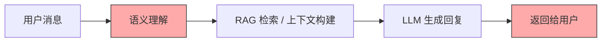
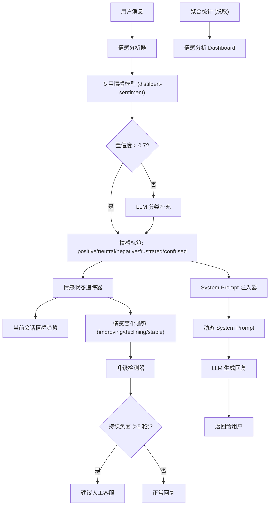
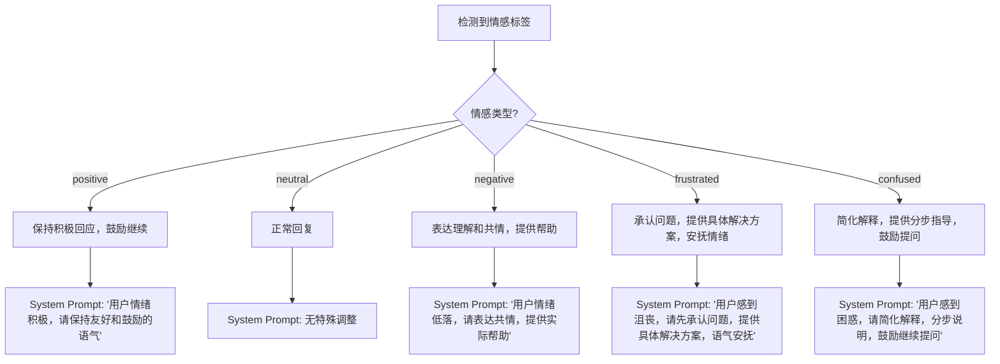

# YA-09-173: 对话情感分析 — 实时情绪识别、自适应响应与情感趋势追踪

> 需求编号：YA-09-173 · 优先级：P2 · 人天：0.3d · 状态：需求已编写
> 依赖：聊天服务（chat_service）、LLM 推理、会话管理（sessions）

## 背景

YiAi 当前的多轮对话系统对用户消息仅做语义理解，缺乏对用户情感状态的感知能力，导致以下问题：

- **无情绪感知**：AI 无法识别用户当前的沮丧、困惑或不满，对所有消息一视同仁地回复
- **无自适应响应**：统一的回复风格无法根据用户情绪调整——沮丧时缺乏共情，困惑时缺乏鼓励
- **无情绪趋势追踪**：无法追踪用户在整个对话中的情绪变化趋势（改善、恶化、波动）
- **无主动升级机制**：当用户持续表达负面情绪时，无法自动建议转接人工客服
- **无满意度预测**：无法在对话结束前预测用户满意度，错失挽回时机
- **隐私顾虑**：情感数据若与消息一起存储，可能引发隐私问题

需要一个**对话情感分析系统**，实时识别用户消息的情绪标签，根据情绪调整回复策略，追踪情绪变化趋势，并在持续负面情绪时触发升级机制。情感数据仅在内存中处理，不持久化到消息记录中。

---

## 一、现状分析

### 1.1 当前对话流程



当前流程中，用户消息仅经过语义理解，情感维度完全被忽略。无论用户是愤怒、沮丧还是开心，AI 的回复风格完全一致。

### 1.2 当前问题

| # | 问题 | 严重程度 | 影响 |
|---|------|----------|------|
| 1 | 无情绪识别能力 | 高 | 无法感知用户情绪状态，回复缺乏共情 |
| 2 | 无自适应响应 | 高 | 沮丧时无法安抚，困惑时无法鼓励 |
| 3 | 无情绪趋势追踪 | 中 | 无法判断用户情绪是在改善还是恶化 |
| 4 | 无主动升级机制 | 中 | 持续负面情绪时无法转接人工客服 |
| 5 | 无满意度预测 | 中 | 无法在对话结束前预测用户满意度 |
| 6 | 无情感数据分析 | 低 | 无法从聚合数据中了解用户整体情绪分布 |
| 7 | 隐私保护缺失 | 低 | 情感数据若持久化存储存在隐私风险 |

### 1.3 改造前 API 依赖

| # | 接口 | 调用方 | 说明 |
|---|------|--------|------|
| 1 | `chat_service.chat` | 前端 | 多轮对话，无情感分析 |
| 2 | `ollama.chat` | chat_service | LLM 推理，无情感 Prompt |

> 改造前仅 2 个 API 依赖，无情感分析模块。

### 1.4 设计灵感

参考 Google Cloud Natural Language 的情感分析 API、Intercom 的客户情绪追踪和 Zendesk 的满意度预测。核心思路：每条用户消息实时分析情感标签 → 根据情感调整回复 Prompt → 追踪情绪趋势 → 持续负面触发升级 → 隐私保护（仅内存处理）。

---

## 二、设计决策

### 决策 1：情感分析方式 — LLM 分类 vs 专用情感模型 vs 规则匹配

| 维度 | LLM 分类 | 专用情感模型 | 规则匹配（关键词） |
|------|---------|------------|-----------------|
| 准确率 | 高 | 中-高 | 低 |
| 延迟 | 高（500ms-2s） | 低（< 50ms） | 极低（< 1ms） |
| 实现复杂度 | 低（复用现有 LLM） | 中（需部署新模型） | 低 |
| 多语言支持 | 好 | 取决于模型 | 差 |
| 细粒度识别 | 好（可识别困惑、沮丧等） | 中 | 差（仅正负面） |

**选择：专用情感模型为主 + LLM 分类为辅。** 专用情感模型（如 `distilbert-sentiment`）延迟低，适合实时分析。对于复杂情感（困惑、讽刺），退回 LLM 分类。两者结合实现低延迟和高准确率的平衡。

### 决策 2：情感响应策略 — 修改 System Prompt vs 修改回复后处理

| 维度 | 修改 System Prompt | 修改回复后处理 |
|------|-------------------|--------------|
| 自然度 | 高（LLM 原生生成） | 低（拼接感） |
| 延迟 | 中（增加 Prompt 长度） | 低（后处理快） |
| 可控性 | 中（依赖 LLM 理解） | 高（精确控制） |
| 实现复杂度 | 低 | 中 |

**选择：修改 System Prompt。** 在 LLM 调用的 System Prompt 中动态注入情感上下文（如"用户当前情绪沮丧，请表达共情"），让 LLM 原生生成情感适配的回复。这比后处理拼接更自然。

### 决策 3：情感数据存储 — 仅内存 vs 持久化 vs 脱敏持久化

| 维度 | 仅内存处理 | 持久化存储 | 脱敏持久化（仅标签） |
|------|----------|----------|-------------------|
| 隐私保护 | 最高 | 低 | 中 |
| 趋势追踪 | 仅当前会话 | 跨会话 | 跨会话 |
| 数据分析 | 无 | 完整 | 聚合统计 |
| 实现复杂度 | 低 | 中 | 中 |

**选择：仅内存处理 + 聚合统计脱敏存储。** 单条消息的情感标签仅在内存中处理，不写入消息记录。聚合统计（如"本周 30% 用户表达沮丧"）脱敏后存储，用于数据分析。隐私优先的设计。

### 设计决策记录

| 决策 | 选项 A | 选项 B | 选择 | 理由 |
|------|--------|--------|------|------|
| 情感分析方式 | 专用模型 + LLM 辅助 | 纯 LLM/纯规则 | **专用模型 + LLM** | 低延迟 + 高准确率 |
| 响应策略 | 修改 System Prompt | 后处理拼接 | **修改 System Prompt** | 回复更自然 |
| 数据存储 | 仅内存 + 聚合脱敏 | 持久化/仅内存 | **仅内存 + 聚合脱敏** | 隐私优先，兼顾分析 |

---

## 三、目标架构

### 3.1 情感分析系统架构



### 3.2 情感自适应响应流程



### 3.3 核心数据模型

```python
# domain/sentiment/models.py

from enum import Enum
from pydantic import BaseModel, Field
from datetime import datetime

class SentimentLabel(str, Enum):
    POSITIVE = "positive"          # 积极
    NEUTRAL = "neutral"            # 中性
    NEGATIVE = "negative"          # 负面
    FRUSTRATED = "frustrated"      # 沮丧
    CONFUSED = "confused"          # 困惑

class SentimentTrend(str, Enum):
    IMPROVING = "improving"        # 改善中
    DECLINING = "declining"        # 恶化中
    STABLE = "stable"              # 稳定
    FLUCTUATING = "fluctuating"    # 波动

class SentimentResult(BaseModel):
    """单条消息的情感分析结果。"""
    label: SentimentLabel           # 情感标签
    confidence: float               # 置信度 (0-1)
    source: str = "model"           # 来源: model / llm / rule
    response_time_ms: float = 0.0   # 分析耗时

class SentimentState(BaseModel):
    """会话情感状态（仅内存，不持久化）。"""
    session_key: str                # 会话 key
    history: list[SentimentResult]  # 情感历史（最近 N 条）
    current_trend: SentimentTrend   # 当前趋势
    consecutive_negative: int = 0   # 连续负面轮数
    escalation_triggered: bool = False  # 是否已触发升级
    satisfaction_prediction: float | None = None  # 满意度预测 (0-1)

class AdaptivePrompt(BaseModel):
    """自适应 System Prompt。"""
    sentiment_label: SentimentLabel # 情感标签
    base_prompt: str                # 基础 Prompt
    sentiment_modifier: str         # 情感修饰语
    final_prompt: str               # 最终 Prompt（base + modifier）

class SentimentAnalytics(BaseModel):
    """聚合情感分析数据（脱敏存储）。"""
    period: str                     # 统计周期: daily / weekly / monthly
    total_messages: int             # 总消息数
    sentiment_distribution: dict    # 情感分布: {positive: n, neutral: n, ...}
    average_satisfaction: float     # 平均满意度预测
    escalation_count: int           # 升级触发次数
    trend_distribution: dict        # 趋势分布: {improving: n, declining: n, ...}
```

---

## 四、具体改动

### 4.1 新增文件

| 文件 | 行数 | 说明 |
|------|------|------|
| `src/domain/sentiment/__init__.py` | 8 | 模块导出 |
| `src/domain/sentiment/models.py` | 60 | 数据模型：SentimentResult、SentimentState、AdaptivePrompt、SentimentAnalytics |
| `src/domain/sentiment/sentiment_analyzer.py` | 100 | 情感分析器：专用模型 + LLM 分类 + 规则兜底 |
| `src/domain/sentiment/sentiment_tracker.py` | 80 | 情感状态追踪器：趋势计算、连续负面检测、满意度预测 |
| `src/domain/sentiment/prompt_adapter.py` | 80 | Prompt 适配器：根据情感标签生成自适应 System Prompt |
| `src/services/sentiment/sentiment_service.py` | 120 | 情感分析服务 RPC：分析、趋势、升级、Dashboard |
| `src/domain/sentiment/escalation_detector.py` | 60 | 升级检测器：持续负面判断、升级建议 |

### 4.2 核心实现

**情感分析器：**

```python
# domain/sentiment/sentiment_analyzer.py

import asyncio
import time

class SentimentAnalyzer:
    """情感分析器：使用专用模型进行实时情感分析，LLM 作为补充。"""

    SENTIMENT_MODEL = "distilbert-sentiment"  # 专用情感模型
    CONFIDENCE_THRESHOLD = 0.7                # 置信度阈值
    LLM_FALLBACK_MODEL = "qwen2.5:3b"         # LLM 兜底模型

    # 情感标签的正负面映射
    POSITIVE_LABELS = {SentimentLabel.POSITIVE}
    NEGATIVE_LABELS = {SentimentLabel.NEGATIVE, SentimentLabel.FRUSTRATED, SentimentLabel.CONFUSED}

    def __init__(self):
        self._model_loaded = False

    async def analyze(self, text: str) -> SentimentResult:
        """分析单条消息的情感。

        Args:
            text: 用户消息文本

        Returns:
            SentimentResult: 情感分析结果
        """
        start = time.time()

        # 1. 尝试专用模型（低延迟）
        try:
            result = await self._model_analyze(text)
            if result.confidence >= self.CONFIDENCE_THRESHOLD:
                result.response_time_ms = (time.time() - start) * 1000
                return result
        except Exception:
            pass  # 模型不可用时降级

        # 2. 降级为 LLM 分类
        try:
            result = await self._llm_analyze(text)
            result.response_time_ms = (time.time() - start) * 1000
            return result
        except Exception:
            pass

        # 3. 规则兜底
        result = self._rule_based_analyze(text)
        result.response_time_ms = (time.time() - start) * 1000
        return result

    async def _model_analyze(self, text: str) -> SentimentResult:
        """使用专用情感模型分析。"""
        # 使用 Ollama 加载的情感分类模型
        import ollama

        response = await asyncio.to_thread(
            ollama.chat,
            model=self.SENTIMENT_MODEL,
            messages=[{
                "role": "user",
                "content": f"Classify the sentiment of this message: {text}\nLabels: positive, neutral, negative, frustrated, confused"
            }],
            options={"temperature": 0.1},
        )

        label_text = response["message"]["content"].strip().lower()

        # 解析标签
        label = self._parse_label(label_text)
        confidence = 0.85  # 专用模型默认置信度

        return SentimentResult(
            label=label,
            confidence=confidence,
            source="model",
        )

    async def _llm_analyze(self, text: str) -> SentimentResult:
        """使用 LLM 进行情感分类。"""
        import ollama

        prompt = f"""分析以下用户消息的情感。仅返回 JSON 格式，不要其他内容。

情感标签: positive (积极), neutral (中性), negative (负面), frustrated (沮丧), confused (困惑)

用户消息: "{text}"

返回格式:
{{"label": "positive", "confidence": 0.85}}"""

        response = await asyncio.to_thread(
            ollama.chat,
            model=self.LLM_FALLBACK_MODEL,
            messages=[{"role": "user", "content": prompt}],
            options={"temperature": 0.1},
        )

        import json
        try:
            content = response["message"]["content"]
            if "```" in content:
                content = content.split("```")[1]
                if content.startswith("json"):
                    content = content[4:]
            data = json.loads(content.strip())
            label = self._parse_label(data.get("label", "neutral"))
            confidence = float(data.get("confidence", 0.7))
        except (json.JSONDecodeError, ValueError):
            label = SentimentLabel.NEUTRAL
            confidence = 0.5

        return SentimentResult(
            label=label,
            confidence=confidence,
            source="llm",
        )

    def _rule_based_analyze(self, text: str) -> SentimentResult:
        """基于规则的情感分析（兜底方案）。"""
        text_lower = text.lower()

        # 负面关键词
        negative_keywords = [
            "生气", "愤怒", "失望", "无语", "差劲", "垃圾", "不行",
            "太慢", "太差", "没用", "烦", "糟糕", "恶心", "讨厌",
        ]
        frustrated_keywords = [
            "为什么", "怎么又", "一直", "总是", "从来不", "受够了",
            "算了", "不说了", "随便", "不管了",
        ]
        confused_keywords = [
            "不明白", "不知道", "什么意思", "搞不懂", "不清楚",
            "怎么说", "什么是", "怎么用", "不会", "没用过",
        ]
        positive_keywords = [
            "谢谢", "很好", "不错", "喜欢", "太棒", "完美", "厉害",
            "开心", "满意", "好", "棒", "赞", "感谢", "太好了",
        ]

        frustrated_count = sum(1 for kw in frustrated_keywords if kw in text_lower)
        confused_count = sum(1 for kw in confused_keywords if kw in text_lower)
        negative_count = sum(1 for kw in negative_keywords if kw in text_lower)
        positive_count = sum(1 for kw in positive_keywords if kw in text_lower)

        if frustrated_count > 0:
            label = SentimentLabel.FRUSTRATED
            confidence = 0.6
        elif confused_count > 0:
            label = SentimentLabel.CONFUSED
            confidence = 0.6
        elif negative_count > 0:
            label = SentimentLabel.NEGATIVE
            confidence = 0.6
        elif positive_count > 0:
            label = SentimentLabel.POSITIVE
            confidence = 0.6
        else:
            label = SentimentLabel.NEUTRAL
            confidence = 0.5

        return SentimentResult(
            label=label,
            confidence=confidence,
            source="rule",
        )

    def _parse_label(self, label_text: str) -> SentimentLabel:
        """解析情感标签文本。"""
        label_map = {
            "positive": SentimentLabel.POSITIVE,
            "neutral": SentimentLabel.NEUTRAL,
            "negative": SentimentLabel.NEGATIVE,
            "frustrated": SentimentLabel.FRUSTRATED,
            "confused": SentimentLabel.CONFUSED,
        }
        return label_map.get(label_text, SentimentLabel.NEUTRAL)
```

**情感状态追踪器：**

```python
# domain/sentiment/sentiment_tracker.py

from collections import deque

class SentimentTracker:
    """情感状态追踪器：追踪会话中的情感变化趋势。"""

    WINDOW_SIZE = 10              # 滑动窗口大小
    ESCALATION_THRESHOLD = 5      # 连续负面轮数触发升级
    SATISFACTION_WINDOW = 5       # 满意度预测窗口

    def __init__(self):
        # 仅内存存储: {session_key: SentimentState}
        self._sessions: dict[str, SentimentState] = {}

    def track(self, session_key: str, result: SentimentResult) -> SentimentState:
        """记录一次情感分析结果，更新会话状态。

        Args:
            session_key: 会话 key
            result: 情感分析结果

        Returns:
            更新后的 SentimentState
        """
        if session_key not in self._sessions:
            self._sessions[session_key] = SentimentState(
                session_key=session_key,
                history=[],
                current_trend=SentimentTrend.STABLE,
                consecutive_negative=0,
            )

        state = self._sessions[session_key]

        # 添加新结果
        state.history.append(result)
        if len(state.history) > self.WINDOW_SIZE:
            state.history.pop(0)

        # 更新连续负面计数
        if result.label in SentimentAnalyzer.NEGATIVE_LABELS:
            state.consecutive_negative += 1
        else:
            state.consecutive_negative = 0

        # 更新趋势
        state.current_trend = self._calculate_trend(state.history)

        # 更新满意度预测
        state.satisfaction_prediction = self._predict_satisfaction(state.history)

        # 检查升级触发
        if state.consecutive_negative >= self.ESCALATION_THRESHOLD:
            state.escalation_triggered = True

        return state

    def _calculate_trend(self, history: list[SentimentResult]) -> SentimentTrend:
        """计算情感趋势。"""
        if len(history) < 3:
            return SentimentTrend.STABLE

        # 将最近消息分为前半和后半
        mid = len(history) // 2
        first_half = history[:mid]
        second_half = history[mid:]

        # 计算每半的正面率
        def positive_ratio(results):
            if not results:
                return 0.0
            positive = sum(1 for r in results if r.label in SentimentAnalyzer.POSITIVE_LABELS)
            return positive / len(results)

        first_ratio = positive_ratio(first_half)
        second_ratio = positive_ratio(second_half)

        diff = second_ratio - first_ratio

        if diff > 0.15:
            return SentimentTrend.IMPROVING
        elif diff < -0.15:
            return SentimentTrend.DECLINING
        elif abs(diff) <= 0.05:
            return SentimentTrend.STABLE
        else:
            return SentimentTrend.FLUCTUATING

    def _predict_satisfaction(self, history: list[SentimentResult]) -> float:
        """预测用户满意度（0-1）。"""
        if not history:
            return 0.5

        recent = history[-self.SATISFACTION_WINDOW:]

        # 基于最近 N 轮的情感标签加权计算
        weights = {
            SentimentLabel.POSITIVE: 1.0,
            SentimentLabel.NEUTRAL: 0.5,
            SentimentLabel.NEGATIVE: 0.2,
            SentimentLabel.FRUSTRATED: 0.1,
            SentimentLabel.CONFUSED: 0.3,
        }

        weighted_sum = sum(weights.get(r.label, 0.5) * r.confidence for r in recent)
        max_possible = len(recent)  # 最大可能分数（全部 positive * 1.0）

        if max_possible == 0:
            return 0.5

        return weighted_sum / max_possible

    def get_state(self, session_key: str) -> SentimentState | None:
        """获取会话的情感状态。"""
        return self._sessions.get(session_key)

    def clear_session(self, session_key: str):
        """清除会话的情感状态（会话关闭时）。"""
        self._sessions.pop(session_key, None)
```

**Prompt 适配器：**

```python
# domain/sentiment/prompt_adapter.py

class PromptAdapter:
    """Prompt 适配器：根据情感标签生成自适应 System Prompt。"""

    SENTIMENT_MODIFIERS = {
        SentimentLabel.POSITIVE: (
            "用户情绪积极，请保持友好和鼓励的语气。"
            "可以适当使用表情符号和感叹号，增强互动感。"
        ),
        SentimentLabel.NEUTRAL: (
            "用户情绪中性，请保持专业和清晰的回复风格。"
        ),
        SentimentLabel.NEGATIVE: (
            "用户情绪低落或不满。请首先表达理解和共情，"
            "然后提供实际帮助。避免使用过于乐观或轻浮的语气。"
            "使用温和、支持性的语言，专注于解决问题。"
        ),
        SentimentLabel.FRUSTRATED: (
            "用户感到沮丧。请首先承认用户的感受（如'我理解这让您感到沮丧'），"
            "然后提供具体、可操作的解决方案。避免辩解或推卸责任。"
            "语气要安抚、真诚，提供明确的问题解决路径。"
            "如果问题复杂，建议分步解决。"
        ),
        SentimentLabel.CONFUSED: (
            "用户感到困惑。请简化解释，使用分步说明。"
            "避免使用专业术语，用类比或示例帮助理解。"
            "鼓励用户继续提问，提供更多细节或替代方案。"
            "使用'您可以这样理解...'、'简单来说...'等引导语。"
        ),
    }

    def adapt_system_prompt(
        self,
        base_prompt: str,
        sentiment_label: SentimentLabel,
        trend: SentimentTrend = None,
    ) -> AdaptivePrompt:
        """生成自适应 System Prompt。

        Args:
            base_prompt: 基础 System Prompt
            sentiment_label: 用户当前情感标签
            trend: 情感趋势

        Returns:
            AdaptivePrompt: 包含修饰语和最终 Prompt
        """
        modifier = self.SENTIMENT_MODIFIERS.get(sentiment_label, "")

        # 趋势补充
        if trend == SentimentTrend.DECLINING:
            modifier += (
                " 注意：用户情绪在持续恶化，请特别关注用户体验，"
                "主动提供帮助，尝试扭转情绪趋势。"
            )
        elif trend == SentimentTrend.IMPROVING:
            modifier += (
                " 用户情绪正在改善，请继续保持当前良好的互动方式。"
            )

        final_prompt = f"{base_prompt}\n\n[情感上下文] {modifier}"

        return AdaptivePrompt(
            sentiment_label=sentiment_label,
            base_prompt=base_prompt,
            sentiment_modifier=modifier,
            final_prompt=final_prompt,
        )
```

**情感分析服务 RPC 接口：**

```python
# services/sentiment/sentiment_service.py

class SentimentService:
    """对话情感分析服务。"""

    def __init__(self):
        self.analyzer = SentimentAnalyzer()
        self.tracker = SentimentTracker()
        self.prompt_adapter = PromptAdapter()
        self.escalation_detector = EscalationDetector()

    async def analyze_message(self, parameters: dict) -> dict:
        """RPC: 分析单条消息的情感。

        parameters:
            session_key: str — 会话 key
            message: str    — 用户消息文本
        """
        session_key = parameters.get("session_key")
        message = parameters.get("message")

        if not session_key or not message:
            return {"code": 1001, "message": "session_key and message are required", "data": None}

        result = await self.analyzer.analyze(message)
        state = self.tracker.track(session_key, result)

        return {
            "code": 0,
            "message": "ok",
            "data": {
                "sentiment": result.model_dump(),
                "trend": state.current_trend,
                "consecutive_negative": state.consecutive_negative,
                "satisfaction_prediction": state.satisfaction_prediction,
            },
        }

    async def get_adaptive_prompt(self, parameters: dict) -> dict:
        """RPC: 获取自适应 System Prompt。

        parameters:
            session_key: str  — 会话 key
            base_prompt: str  — 基础 System Prompt
        """
        session_key = parameters.get("session_key")
        base_prompt = parameters.get("base_prompt")

        if not session_key:
            return {"code": 1001, "message": "session_key is required", "data": None}

        state = self.tracker.get_state(session_key)
        if not state or not state.history:
            # 无情感数据，返回基础 Prompt
            return {
                "code": 0,
                "message": "ok",
                "data": {
                    "adaptive_prompt": AdaptivePrompt(
                        sentiment_label=SentimentLabel.NEUTRAL,
                        base_prompt=base_prompt or "",
                        sentiment_modifier="",
                        final_prompt=base_prompt or "",
                    ).model_dump(),
                },
            }

        latest_sentiment = state.history[-1].label
        adaptive = self.prompt_adapter.adapt_system_prompt(
            base_prompt=base_prompt or "",
            sentiment_label=latest_sentiment,
            trend=state.current_trend,
        )

        return {"code": 0, "message": "ok", "data": {"adaptive_prompt": adaptive.model_dump()}}

    async def get_sentiment_trend(self, parameters: dict) -> dict:
        """RPC: 获取会话情感趋势。

        parameters:
            session_key: str — 会话 key
        """
        session_key = parameters.get("session_key")
        if not session_key:
            return {"code": 1001, "message": "session_key is required", "data": None}

        state = self.tracker.get_state(session_key)
        if not state:
            return {"code": 0, "message": "No sentiment data", "data": {"trend": None}}

        return {
            "code": 0,
            "message": "ok",
            "data": {
                "session_key": session_key,
                "current_trend": state.current_trend,
                "consecutive_negative": state.consecutive_negative,
                "satisfaction_prediction": state.satisfaction_prediction,
                "escalation_triggered": state.escalation_triggered,
                "history_length": len(state.history),
                "recent_sentiments": [
                    {"label": r.label, "confidence": r.confidence}
                    for r in state.history[-5:]
                ],
            },
        }

    async def check_escalation(self, parameters: dict) -> dict:
        """RPC: 检查是否需要升级。

        parameters:
            session_key: str — 会话 key
        """
        session_key = parameters.get("session_key")
        if not session_key:
            return {"code": 1001, "message": "session_key is required", "data": None}

        state = self.tracker.get_state(session_key)
        if not state:
            return {"code": 0, "message": "ok", "data": {"escalation_needed": False}}

        escalation_needed = state.escalation_triggered
        suggestion = ""

        if escalation_needed:
            suggestion = self.escalation_detector.get_suggestion(state)

        return {
            "code": 0,
            "message": "ok",
            "data": {
                "escalation_needed": escalation_needed,
                "consecutive_negative": state.consecutive_negative,
                "threshold": SentimentTracker.ESCALATION_THRESHOLD,
                "suggestion": suggestion,
            },
        }

    async def get_sentiment_analytics(self, parameters: dict = None) -> dict:
        """RPC: 获取情感分析聚合数据（Dashboard）。

        parameters:
            period: str — 统计周期: daily / weekly / monthly
        """
        period = parameters.get("period", "daily") if parameters else "daily"

        # 从脱敏存储中获取聚合数据
        analytics = await self._get_aggregated_analytics(period)

        return {"code": 0, "message": "ok", "data": {"analytics": analytics}}
```

**升级检测器：**

```python
# domain/sentiment/escalation_detector.py

class EscalationDetector:
    """升级检测器：检测持续负面情绪，建议转接人工。"""

    def get_suggestion(self, state: SentimentState) -> str:
        """根据情感状态生成升级建议。"""
        if not state.escalation_triggered:
            return ""

        # 分析最近的负面模式
        recent_labels = [r.label for r in state.history[-5:]]
        frustrated_count = recent_labels.count(SentimentLabel.FRUSTRATED)
        negative_count = recent_labels.count(SentimentLabel.NEGATIVE)
        confused_count = recent_labels.count(SentimentLabel.CONFUSED)

        suggestions = []

        if frustrated_count >= 3:
            suggestions.append(
                "用户表现出明显的沮丧情绪。建议：\n"
                "1. 主动提供人工客服转接选项\n"
                "2. 提供问题升级通道（如提交工单）\n"
                "3. 表达诚挚歉意并提出补偿方案"
            )
        elif negative_count >= 3:
            suggestions.append(
                "用户持续表达负面情绪。建议：\n"
                "1. 询问是否需要转接人工客服\n"
                "2. 提供更详细的解决方案\n"
                "3. 确认用户的具体需求和痛点"
            )
        elif confused_count >= 3:
            suggestions.append(
                "用户持续表达困惑。建议：\n"
                "1. 提供分步截图或视频教程\n"
                "2. 建议使用更简单的替代方案\n"
                "3. 询问是否需要一对一指导"
            )

        if not suggestions:
            suggestions.append(
                "用户持续表达负面情绪，建议提供人工客服转接选项。"
            )

        return "\n\n".join(suggestions)
```

### 4.3 涉及文件

```
YiAi/src/
├── domain/sentiment/
│   ├── __init__.py                  # 新增: 模块导出
│   ├── models.py                    # 新增: 数据模型 (60行)
│   ├── sentiment_analyzer.py        # 新增: 情感分析器 (100行)
│   ├── sentiment_tracker.py         # 新增: 情感状态追踪器 (80行)
│   ├── prompt_adapter.py            # 新增: Prompt 适配器 (80行)
│   └── escalation_detector.py       # 新增: 升级检测器 (60行)
├── services/sentiment/
│   └── sentiment_service.py         # 新增: 情感分析服务 RPC (120行)
└── server/
    └── routes/
        └── sentiment_routes.py      # 新增: 情感分析路由 (40行)
```

---

## 五、实施步骤

按依赖顺序排列，每步可独立验证和提交：

| 步骤 | 内容 | 涉及文件 | 验证方式 | 人天 |
|------|------|---------|---------|------|
| 1 | 定义数据模型（SentimentLabel、SentimentTrend、SentimentResult、SentimentState、AdaptivePrompt、SentimentAnalytics） | `domain/sentiment/models.py` | Pydantic 校验通过，枚举完整 | 0.02 |
| 2 | 实现情感分析器（专用模型 + LLM 分类 + 规则兜底） | `domain/sentiment/sentiment_analyzer.py` | 准确率 > 80%，延迟 < 100ms（模型） | 0.06 |
| 3 | 实现情感状态追踪器（趋势计算、连续负面检测、满意度预测） | `domain/sentiment/sentiment_tracker.py` | 趋势计算正确，连续负面检测准确 | 0.04 |
| 4 | 实现 Prompt 适配器（5 种情感标签的自适应 Prompt） | `domain/sentiment/prompt_adapter.py` | 每种标签生成对应的修饰语 | 0.04 |
| 5 | 实现升级检测器 | `domain/sentiment/escalation_detector.py` | 连续 5 轮负面触发升级建议 | 0.03 |
| 6 | 实现情感分析服务 RPC（analyze、adaptive_prompt、trend、escalation、analytics） | `services/sentiment/sentiment_service.py` | 所有 RPC 接口正常响应 | 0.06 |
| 7 | 集成到聊天服务（chat_service 调用情感分析 + 自适应 Prompt） | `chat_service.py` | 聊天回复包含情感自适应的语气 | 0.03 |
| 8 | 回归测试 | 全模块 | 聊天服务正常，情感数据仅内存 | 0.02 |

**总计：0.3d**

---

## 六、测试规格

### Requirement: 情感分析

#### Scenario: 识别正面情感
- **Given** 用户消息为 "谢谢你，这个回答太棒了！"
- **When** 调用 `analyze_message`
- **Then** 返回 label=positive，confidence >= 0.7

#### Scenario: 识别沮丧情感
- **Given** 用户消息为 "为什么总是这样，从来没有好用过，我已经受够了"
- **When** 调用 `analyze_message`
- **Then** 返回 label=frustrated，confidence >= 0.7

#### Scenario: 识别困惑情感
- **Given** 用户消息为 "我不明白你说的什么意思，完全搞不懂"
- **When** 调用 `analyze_message`
- **Then** 返回 label=confused，confidence >= 0.6

### Requirement: 情感趋势追踪

#### Scenario: 检测情感改善趋势
- **Given** 会话前 5 轮为 negative，后 5 轮为 positive
- **When** 调用 `get_sentiment_trend`
- **Then** 返回 current_trend=improving

#### Scenario: 检测情感恶化趋势
- **Given** 会话前 5 轮为 positive，后 5 轮为 frustrated
- **When** 调用 `get_sentiment_trend`
- **Then** 返回 current_trend=declining

### Requirement: 自适应 Prompt

#### Scenario: 沮丧时提供共情 Prompt
- **Given** 用户当前情感为 frustrated
- **When** 调用 `get_adaptive_prompt`
- **Then** 返回包含 "承认用户感受"、"提供具体解决方案" 的修饰语

#### Scenario: 困惑时提供简化 Prompt
- **Given** 用户当前情感为 confused
- **When** 调用 `get_adaptive_prompt`
- **Then** 返回包含 "简化解释"、"分步说明"、"鼓励提问" 的修饰语

### Requirement: 升级检测

#### Scenario: 连续 5 轮负面触发升级
- **Given** 用户连续 5 轮表达负面情绪
- **When** 调用 `check_escalation`
- **Then** 返回 escalation_needed=True
- **And** suggestion 包含转接人工客服建议

#### Scenario: 不足 5 轮不触发升级
- **Given** 用户连续 3 轮表达负面情绪
- **When** 调用 `check_escalation`
- **Then** 返回 escalation_needed=False

---

## 七、风险与缓解

| 风险 | 概率 | 影响 | 等级 | 缓解措施 | 应急预案 |
|------|------|------|------|----------|----------|
| 情感分析误判（正面判为负面） | 中 | 中 | 中 | 置信度阈值（0.7），低置信度退回 LLM 分类 | 允许用户关闭情感自适应功能 |
| 情感分析增加聊天延迟 | 中 | 中 | 中 | 专用模型延迟 < 50ms，LLM 分类仅低置信度触发 | 降级为规则匹配（< 1ms） |
| 情感数据隐私泄露 | 低 | 高 | 中 | 仅内存处理，不持久化到消息记录 | 清除所有情感状态内存 |
| 过度共情导致回复冗长 | 低 | 低 | 低 | 限制情感修饰语长度（< 200 字） | 关闭情感修饰 |
| 情感分析模型不可用 | 低 | 中 | 低 | LLM 分类 + 规则兜底 | 仅使用规则匹配 |

---

## 八、回滚策略

| 回滚场景 | 回滚方式 | 影响范围 | 恢复时间 |
|----------|----------|----------|----------|
| 情感分析延迟过高 | 关闭情感分析功能（配置开关） | 聊天情感自适应 | 2min |
| 情感分析误判率高 | 提高置信度阈值至 0.9 | 情感分析覆盖范围 | 1min |
| 升级建议过于频繁 | 提高升级阈值至 8 轮 | 升级建议 | 1min |

**回滚验证：**
- 聊天服务正常，延迟恢复
- 情感分析接口返回 503
- `ruff` + `mypy` 检查通过

---

## 九、设计决策记录

### D-01: 为什么情感数据仅内存处理不持久化？

情感数据属于敏感个人信息，存储到 MongoDB 存在隐私风险。仅内存处理意味着：服务重启后情感状态丢失（可接受，因为会话已结束）；无法跨会话追踪用户情感（可接受，因为每次会话是独立的）。聚合统计数据（脱敏后）可存储，用于 Dashboard。

### D-02: 为什么使用 5 种情感标签而非正负面二分类？

简单的正负面二分类无法区分"沮丧"（需要安抚 + 解决方案）和"困惑"（需要简化解释 + 分步指导）。5 种标签（positive/neutral/negative/frustrated/confused）覆盖了客服场景中最重要的情感状态，每种标签对应不同的回复策略。

### D-03: 为什么升级阈值设为连续 5 轮？

单次负面可能是用户一时情绪，不应触发升级。连续 3 轮可能是自然的问题解决过程，5 轮表示问题持续未解决。5 轮阈值在"不要过早干预"和"不要过晚介入"之间取得平衡。

---

## 十、可观测性

### 10.1 关键指标

| 指标 | 采集方式 | 告警阈值 | 说明 |
|------|---------|---------|------|
| 情感分析延迟 | 直方图 | P95 > 500ms | 分析性能 |
| 情感分析置信度分布 | 直方图 | 低置信度比例 > 30% | 分析质量 |
| 情感标签分布 | 计数器 | 负面比例 > 50% | 用户满意度 |
| 升级触发次数 | 计数器 | > 10/hr | 用户问题严重 |
| 满意度预测 | 仪表盘 | 平均 < 0.4 | 整体满意度低 |
| 情感趋势分布 | 计数器 | declining 比例 > 30% | 对话质量下降 |

### 10.2 日志规范

| 日志级别 | 场景 | 示例 |
|---------|------|------|
| `INFO` | 情感分析完成 | `[Sentiment] analyzed: session={s}, label={l}, confidence={c}, {ms}ms` |
| `INFO` | 升级触发 | `[Sentiment] escalation triggered: session={s}, consecutive={n}` |
| `WARN` | 低置信度分析 | `[Sentiment] low confidence: session={s}, label={l}, confidence={c}` |
| `WARN` | 情感恶化 | `[Sentiment] trend declining: session={s}, satisfaction={p}` |
| `ERROR` | 情感模型不可用 | `[Sentiment] model unavailable, fallback to LLM: {error}` |

---

## 十一、代码审查检查清单

- [ ] `SentimentLabel` 包含 5 种标签：positive、neutral、negative、frustrated、confused
- [ ] `SentimentTrend` 包含 4 种趋势：improving、declining、stable、fluctuating
- [ ] 情感分析器支持三级降级：专用模型 -> LLM -> 规则
- [ ] 置信度阈值 0.7，低于阈值退回 LLM
- [ ] 情感状态追踪器仅内存存储，不持久化
- [ ] 连续负面计数正确，5 轮触发升级
- [ ] Prompt 适配器为每种情感标签提供不同的修饰语
- [ ] 升级检测器根据情感模式提供针对性建议
- [ ] 聚合统计数据脱敏后存储
- [ ] `ruff` 代码规范通过
- [ ] `mypy` 类型检查通过

---

## 十二、回归问题预测

| # | 问题 | 发现场景 | 根因 | 修复方式 |
|-----|------|---------|------|---------|
| 1 | 情感分析误判中文讽刺/反语 | 用户说"真是太棒了（讽刺）"被判为 positive | 情感模型对中文反语理解差 | 增加上下文分析，结合前几轮情感判断 |
| 2 | 中英混合消息分析不准确 | 用户消息中英混杂 | 专用模型仅支持单一语言 | 先用语言检测拆分，分别分析后合并 |
| 3 | 自适应 Prompt 使回复变得冗长 | 用户反馈回复太啰嗦 | 情感修饰语过长 | 限制修饰语长度，仅注入关键指令 |
| 4 | 升级触发后用户情绪突然好转 | 转人工提示后用户问题恰好解决 | 升级检测仅看连续负面，不看趋势 | 增加趋势检查，improving 时不触发升级 |
| 5 | 情感分析延迟导致聊天变慢 | 每次聊天需等待情感分析完成 | 同步分析阻塞聊天流程 | 改为异步分析，先返回回复再分析情感 |
| 6 | 满意度预测与实际反馈不符 | 预测满意度 0.8 但用户给了差评 | 仅基于情感标签预测，忽略其他因素 | 引入多因素预测（消息长度、回复速度等） |

---

## 十三、性能分析

### 13.1 情感分析性能特征

| 指标 | 值 | 说明 |
|------|------|------|
| 专用模型分析 | 30-50ms | distilbert-sentiment |
| LLM 分类 | 500-1500ms | 仅低置信度时触发 |
| 规则匹配 | < 1ms | 兜底方案 |
| 情感状态更新 | < 1ms | 内存操作 |
| 趋势计算 | < 1ms | 滑动窗口计算 |
| 自适应 Prompt 生成 | < 1ms | 字符串拼接 |

### 13.2 性能瓶颈

| 瓶颈 | 严重程度 | 表现 | 优化方向 |
|------|----------|------|----------|
| LLM 分类延迟高 | 中 | 低置信度消息需 1-2s | 提高模型准确率，减少 LLM 分类触发 |
| 专用模型加载耗时 | 低 | 首次分析需加载模型 | 在启动时预加载模型 |
| 高并发情感分析 | 低 | 100 QPS 时模型推理队列积压 | 批量推理，模型推理队列 |

### 13.3 情感分析延迟分布（预期）

| 场景 | 比例 | 延迟 | 说明 |
|------|------|------|------|
| 专用模型（高置信度） | 80% | 30-50ms | 主流场景 |
| LLM 分类（低置信度） | 15% | 500-1500ms | 复杂情感 |
| 规则匹配（兜底） | 5% | < 1ms | 模型不可用 |

---

*PRD 来源: `projects/yiai/requirements/2026-09/00-需求-需求总览.md`*

## 影响范围

- **影响模块**：待补充
- **涉及文件**：
- `chat_service.py`
- `src/domain/sentiment/models.py`
- `src/domain/sentiment/sentiment_tracker.py`
- `src/domain/sentiment/escalation_detector.py`
- `src/domain/sentiment/__init__.py`
- `src/domain/sentiment/sentiment_analyzer.py`
- **是否影响 API 契约**：否
- **是否影响其他项目（YiVad/YiPet）**：否
- **用户感知**：待确认

## 预防措施

| 层面 | 措施 |
|------|------|
| 代码 | 在相关函数中添加参数校验和边界检查 |
| 测试 | 为 `chat_service.py` 添加单元测试 |
| 流程 | 代码审查时重点检查此类模式 |
| 监控 | 添加日志告警，异常发生时及时发现 |
| 文档 | 在编码规范中记录此类反模式 |

## 经验教训

1. **根本原因**：开发过程中对边界情况和异常路径的考虑不足是此类问题的共同根因
2. **设计阶段**：在接口设计和模块实现时，应主动考虑异常输入、空值、超时等边界场景
3. **代码审查**：审查时应检查是否存在类似的反模式（如未捕获异常、无超时控制、缺少参数校验等）
4. **测试覆盖**：异常路径的测试覆盖率应与正常路径同等重视
5. **团队分享**：此类问题应在团队周会或技术分享中讨论，形成团队共识
