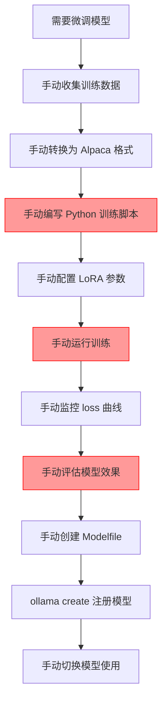
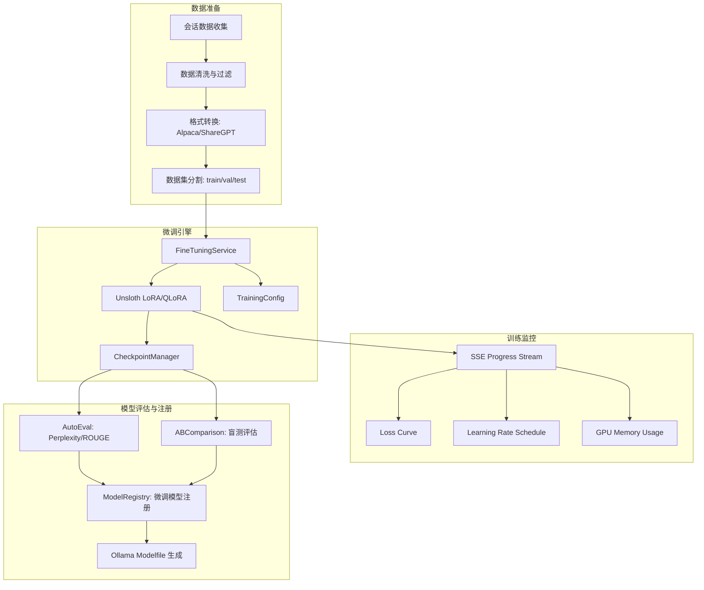
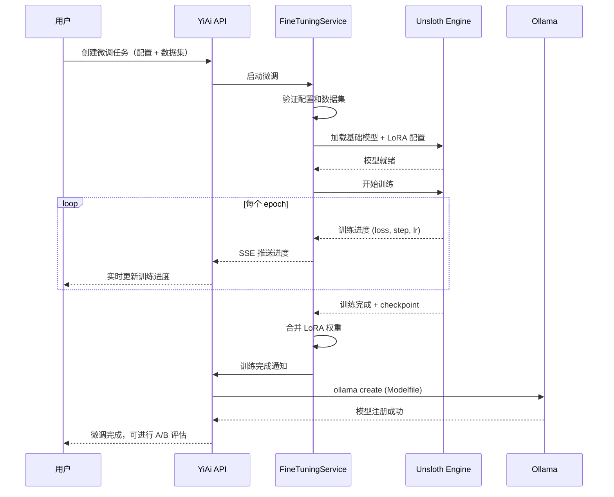

# YA-09-174: 参数高效微调 — LoRA/QLoRA 微调支持、数据集准备、训练监控、模型评估与注册

> 需求编号：YA-09-174 · 优先级：P2 · 人天：0.5d · 状态：需求已编写
> 依赖：YA-09-11（ModelRuntime 抽象层）、YA-09-166（模型注册与版本管理）

## 背景

### 问题陈述

当前 YiAi 使用 Ollama 管理的基础模型（如 qwen2.5、llama3.1 等）进行推理，但基础模型在特定领域（如代码审查、Bug 分析、知识库 RAG）的表现不如经过微调的专用模型：

1. **领域适配不足**：基础模型在特定任务（代码审查、Bug 分类）上准确性不足
2. **无法定制行为**：无法调整模型的回答风格、语气、专业领域偏好
3. **全量微调资源消耗大**：全量微调 7B 模型需要 40GB+ 显存，本地环境不可行
4. **无微调工作流**：缺乏从数据准备、训练、评估到部署的完整微调流程
5. **微调模型无管理**：微调后的模型无注册、版本管理、A/B 对比机制

**核心矛盾**：基础模型在通用任务上表现良好，但在特定领域任务上需要定制化能力，而全量微调资源消耗过大，需要参数高效微调（PEFT）方案。

### 影响范围

| # | 影响 | 严重程度 | 典型场景 |
|---|------|----------|----------|
| 1 | 领域任务准确性不足 | 高 | 代码审查中误判正常代码为 Bug |
| 2 | 无法定制模型行为 | 中 | 模型回答风格与团队规范不一致 |
| 3 | 全量微调资源不可行 | 高 | 本地 16GB 显存无法微调 7B 模型 |
| 4 | 无系统化微调流程 | 中 | 每次微调需要手动编写脚本 |
| 5 | 微调模型无版本管理 | 中 | 无法追踪哪个微调版本效果最好 |

### 挑战

| 挑战 | 说明 |
|------|------|
| Ollama 微调支持 | Ollama 原生不支持 LoRA 微调，需要通过 Modelfile 或外部工具 |
| 数据集准备 | 需要将对话数据转换为微调格式（Alpaca/ShareGPT 格式） |
| 训练资源限制 | 本地环境显存有限（通常 8-16GB），需要 QLoRA 4-bit 量化 |
| 训练监控 | 需要实时展示训练 loss、学习率、步数等指标 |
| 模型评估 | 微调后需要与基础模型进行 A/B 对比评估 |

---

## 一、现状分析

### 1.1 当前模型管理

```
YiAi 模型管理现状:
├── ModelRuntime 抽象层（YA-09-11）
│   ├── 统一的模型调用接口
│   ├── 支持 Ollama 后端
│   └── 模型列表查询
├── Ollama 模型管理
│   ├── ollama pull 下载模型
│   ├── ollama list 列出模型
│   └── ollama create 创建自定义模型（Modelfile）
├── 模型注册（YA-09-166 待实现）
│   └── 无正式注册机制
└── 微调流程
    ├── 无微调支持
    ├── 无数据集管理
    └── 无训练监控

缺失:
├── LoRA/QLoRA 微调引擎              # ❌ 不存在
├── 微调数据集准备工具                # ❌ 不存在
├── 训练配置管理                      # ❌ 不存在
├── 训练进度监控                      # ❌ 不存在
├── 模型评估框架                      # ❌ 不存在
├── 微调模型注册表                    # ❌ 不存在
├── A/B 对比评估                      # ❌ 不存在
└── 微调模型 Ollama 集成              # ❌ 不存在
```

### 1.2 微调场景需求

| 场景 | 基础模型 | 微调目标 | 数据量 | 预期提升 |
|------|----------|----------|--------|----------|
| 代码审查 | qwen2.5:7b | 提高 Bug 检测准确率 | 500+ 代码审查样本 | +15% |
| Bug 分类 | qwen2.5:7b | 自动分类 Bug 严重程度和类型 | 1000+ Bug 报告 | +20% |
| RAG 回答 | qwen2.5:7b | 改善知识库检索回答质量 | 500+ QA 对 | +10% |
| 会话总结 | qwen2.5:7b | 提高摘要生成质量 | 300+ 对话摘要 | +15% |

### 1.3 改造前微调流程



### 1.4 根因矩阵

| 症状 | 根因 | 触发条件 | 频率 |
|------|------|----------|------|
| 领域任务准确性低 | 基础模型未微调 | 代码审查/Bug 分析 | 持续 |
| 微调流程繁琐 | 无自动化工具 | 每次微调 | 偶发 |
| 训练资源不足 | 无 QLoRA 支持 | 本地环境 | 持续 |
| 无模型评估 | 无评估框架 | 微调后 | 每次微调 |
| 无版本管理 | 无注册表 | 多次微调 | 每次微调 |

---

## 二、设计决策

### 决策 1：微调引擎选择 — Ollama 原生 vs llama.cpp vs Unsloth vs MLX

| 选项 | Ollama 兼容 | 内存效率 | 易用性 | 平台支持 |
|------|------------|----------|--------|----------|
| Ollama 原生（Modelfile） | 最高 | 低 | 高 | 全部 |
| llama.cpp（原生 LoRA） | 高 | 高 | 中 | 全部 |
| Unsloth（Python） | 中 | 最高 | 中 | Linux/Mac |
| MLX（Apple Silicon） | 低 | 高 | 中 | Mac only |

**选择：Unsloth（主）+ Ollama Modelfile（集成）。** Unsloth 提供最佳的 LoRA/QLoRA 微调性能和内存效率，支持 4-bit 量化，在 16GB 显存下可微调 7B 模型。微调完成后通过 Modelfile 将 LoRA 权重合并到 Ollama 模型。

### 决策 2：数据集格式 — Alpaca vs ShareGPT vs 自定义

| 选项 | 通用性 | 工具支持 | 灵活性 |
|------|--------|----------|--------|
| Alpaca (instruction/input/output) | 高 | 高 | 中 |
| ShareGPT (conversations) | 高 | 高 | 高 |
| 自定义格式 | 低 | 低 | 高 |

**选择：Alpaca + ShareGPT 双格式。** 单轮对话/分类任务使用 Alpaca 格式（instruction/input/output），多轮对话使用 ShareGPT 格式（conversations 数组）。数据集准备工具自动从 YiAi 会话数据转换为目标格式。

### 决策 3：训练监控方式 — 文件日志 vs SSE 推送 vs WebSocket

| 选项 | 实时性 | 前端集成 | 实现复杂度 |
|------|--------|----------|-----------|
| 文件日志（轮询） | 低 | 中 | 低 |
| SSE 推送 | 高 | 高 | 中 |
| WebSocket 推送 | 高 | 高 | 中 |

**选择：SSE 推送。** YiAi 已有 SSE 基础设施（聊天流式响应），复用 SSE 推送训练进度（loss、步数、学习率、预估剩余时间）。前端通过 EventSource 接收实时更新。

### 决策 4：模型评估方式 — 自动指标 vs 人工评估 vs 混合

| 选项 | 客观性 | 成本 | 可重复性 |
|------|--------|------|----------|
| 自动指标（BLEU/ROUGE/Perplexity） | 中 | 低 | 高 |
| 人工评估（A/B 盲测） | 高 | 高 | 低 |
| 混合（自动指标 + 人工评估） | 高 | 中 | 高 |

**选择：混合。** 自动指标（Perplexity、ROUGE-L）提供客观基准，人工 A/B 盲测（YA-09-144 已实现）提供主观质量评估。两者结合全面评估微调效果。

### 设计决策记录

| 决策 | 选项 A | 选项 B | 选项 C | 选择 | 理由 |
|------|--------|--------|--------|------|------|
| 微调引擎 | Ollama | llama.cpp | Unsloth | **Unsloth** | 内存效率最高 |
| 数据集格式 | Alpaca | ShareGPT | 双格式 | **双格式** | 覆盖单轮/多轮 |
| 训练监控 | 文件日志 | SSE | WebSocket | **SSE** | 复用现有基础设施 |
| 评估方式 | 自动指标 | 人工评估 | 混合 | **混合** | 全面评估 |

---

## 三、目标架构

### 3.1 微调系统架构



### 3.2 微调执行流程



### 3.3 性能指标

| 指标 | 目标值 | 说明 |
|------|--------|------|
| 7B 模型 QLoRA 微调显存 | < 8GB | 4-bit 量化 |
| 13B 模型 QLoRA 微调显存 | < 16GB | 4-bit 量化 |
| 训练速度（7B, 4090） | > 5 tokens/s | Unsloth 优化 |
| 数据集准备 | < 10s | 1000 条数据转换 |
| 模型评估（自动指标） | < 30s | Perplexity + ROUGE |
| 微调模型注册 | < 30s | Modelfile 生成 + ollama create |

---

## 四、具体改动

### 4.1 微调服务

```python
# services/ai/fine_tuning_service.py (新增)

from dataclasses import dataclass
from typing import Optional, AsyncIterator
from enum import Enum

class FineTuningMethod(str, Enum):
    LORA = "lora"
    QLORA = "qlora"

class DatasetFormat(str, Enum):
    ALPACA = "alpaca"
    SHAREGPT = "sharegpt"

@dataclass
class TrainingConfig:
    base_model: str          # 基础模型名称
    method: FineTuningMethod
    lora_r: int = 16         # LoRA rank
    lora_alpha: int = 32     # LoRA alpha
    lora_dropout: float = 0.05
    learning_rate: float = 2e-4
    num_epochs: int = 3
    batch_size: int = 4
    gradient_accumulation_steps: int = 4
    max_seq_length: int = 2048
    warmup_ratio: float = 0.03
    use_4bit: bool = True    # QLoRA 4-bit 量化

@dataclass
class TrainingProgress:
    current_step: int
    total_steps: int
    epoch: int
    loss: float
    learning_rate: float
    gpu_memory_used: float   # GB
    estimated_time_remaining: str

class FineTuningService:
    def __init__(self, model_registry: ModelRegistry):
        self.registry = model_registry
        self._active_tasks: dict[str, TrainingTask] = {}

    async def prepare_dataset(
        self,
        source: str,           # 数据源: "sessions" | "bugs" | "custom"
        format: DatasetFormat,
        filters: Optional[dict] = None,
    ) -> DatasetInfo:
        """从数据源准备微调数据集"""
        raw_data = await self._collect_data(source, filters)
        cleaned = self._clean_data(raw_data)
        formatted = self._convert_format(cleaned, format)
        splits = self._split_dataset(formatted)
        return DatasetInfo(
            total_samples=len(formatted),
            train_samples=len(splits["train"]),
            val_samples=len(splits["val"]),
            test_samples=len(splits["test"]),
            format=format,
        )

    async def start_training(
        self,
        config: TrainingConfig,
        dataset_id: str,
    ) -> AsyncIterator[TrainingProgress]:
        """启动微调训练，通过 SSE 推送进度"""
        task_id = str(uuid.uuid4())
        task = TrainingTask(task_id, config, dataset_id)
        self._active_tasks[task_id] = task

        try:
            async for progress in self._run_unsloth_training(task):
                yield progress
        finally:
            del self._active_tasks[task_id]

    async def _run_unsloth_training(
        self, task: TrainingTask
    ) -> AsyncIterator[TrainingProgress]:
        """使用 Unsloth 执行 QLoRA 微调"""
        import subprocess
        import json

        cmd = [
            "python", "-m", "scripts.fine_tune",
            "--base_model", task.config.base_model,
            "--method", task.config.method,
            "--lora_r", str(task.config.lora_r),
            "--dataset", task.dataset_id,
            "--output_dir", f"models/fine_tuned/{task.task_id}",
        ]

        process = await asyncio.create_subprocess_exec(
            *cmd,
            stdout=subprocess.PIPE,
            stderr=subprocess.PIPE,
        )

        async for line in process.stdout:
            progress = json.loads(line)
            yield TrainingProgress(**progress)

        await process.wait()

    async def evaluate(
        self,
        model_id: str,
        base_model: str,
        test_dataset: str,
    ) -> EvaluationResult:
        """评估微调模型 vs 基础模型"""
        fine_tuned = await self.registry.get_model(model_id)
        base = await self.registry.get_model(base_model)

        perplexity_ft = await self._compute_perplexity(fine_tuned, test_dataset)
        perplexity_base = await self._compute_perplexity(base, test_dataset)
        rouge_ft = await self._compute_rouge(fine_tuned, test_dataset)
        rouge_base = await self._compute_rouge(base, test_dataset)

        return EvaluationResult(
            model_id=model_id,
            base_model=base_model,
            perplexity_improvement=(perplexity_base - perplexity_ft) / perplexity_base * 100,
            rouge_improvement=(rouge_ft - rouge_base) / rouge_base * 100,
        )

    async def export_to_ollama(
        self,
        model_id: str,
        model_name: str,
    ) -> str:
        """将微调模型导出为 Ollama 模型"""
        model = await self.registry.get_model(model_id)
        modelfile = self._generate_modelfile(model, model_name)
        modelfile_path = f"models/fine_tuned/{model_id}/Modelfile"

        with open(modelfile_path, "w") as f:
            f.write(modelfile)

        result = await asyncio.create_subprocess_exec(
            "ollama", "create", model_name, "-f", modelfile_path,
            stdout=asyncio.subprocess.PIPE,
        )
        await result.wait()

        return model_name
```

### 4.2 数据集准备工具

```python
# services/ai/dataset_preparation.py (新增)

class DatasetPreparationService:
    async def collect_from_sessions(
        self,
        filters: Optional[dict] = None,
    ) -> list[dict]:
        """从会话数据收集微调样本"""
        sessions = await self.data_service.query_documents(
            cname="sessions",
            filter=filters or {},
        )
        samples = []
        for session in sessions:
            for i, msg in enumerate(session.get("messages", [])):
                if msg["role"] == "user" and i + 1 < len(session["messages"]):
                    next_msg = session["messages"][i + 1]
                    if next_msg["role"] == "assistant":
                        samples.append({
                            "instruction": msg["content"],
                            "input": "",
                            "output": next_msg["content"],
                        })
        return samples

    async def collect_from_bugs(
        self,
        filters: Optional[dict] = None,
    ) -> list[dict]:
        """从 Bug 报告收集分类样本"""
        bugs = await self.data_service.query_documents(
            cname="bugs",
            filter=filters or {},
        )
        samples = []
        for bug in bugs:
            samples.append({
                "instruction": "请分析以下 Bug 报告的严重程度和类型",
                "input": f"标题: {bug.get('title', '')}\n描述: {bug.get('description', '')}",
                "output": f"严重程度: {bug.get('severity', '')}\n类型: {bug.get('type', '')}",
            })
        return samples

    def convert_to_alpaca(self, samples: list[dict]) -> list[dict]:
        """转换为 Alpaca 格式"""
        return [
            {
                "instruction": s["instruction"],
                "input": s.get("input", ""),
                "output": s["output"],
            }
            for s in samples
        ]

    def convert_to_sharegpt(self, samples: list[dict]) -> list[dict]:
        """转换为 ShareGPT 格式"""
        return [
            {
                "conversations": [
                    {"from": "human", "value": s["instruction"]},
                    {"from": "gpt", "value": s["output"]},
                ]
            }
            for s in samples
        ]
```

### 4.3 文件变更清单

| 文件 | 操作 | 说明 |
|------|------|------|
| `services/ai/fine_tuning_service.py` | 新增 | 微调服务主模块 |
| `services/ai/dataset_preparation.py` | 新增 | 数据集准备工具 |
| `services/ai/training_monitor.py` | 新增 | 训练监控（SSE 推送） |
| `services/ai/model_evaluation.py` | 新增 | 模型评估服务 |
| `services/ai/model_registry.py` | 修改 | 扩展微调模型注册 |
| `scripts/fine_tune.py` | 新增 | Unsloth 微调脚本 |
| `api/routes/fine_tuning.py` | 新增 | 微调 API 路由 |
| `api/routes/dataset.py` | 新增 | 数据集 API 路由 |
| `tests/test_fine_tuning.py` | 新增 | 微调服务测试 |
| `tests/test_dataset_preparation.py` | 新增 | 数据集准备测试 |

---

## 五、实施步骤

| 步骤 | 操作 | 路径 | 验证 | 人天 |
|------|------|------|------|------|
| 1 | 安装 Unsloth 依赖 | `requirements.txt` | `from unsloth import FastLanguageModel` | 0.05 |
| 2 | 实现数据集准备工具 | `services/ai/dataset_preparation.py` | 从会话/Bug 收集数据 | 0.1 |
| 3 | 实现 Unsloth 微调脚本 | `scripts/fine_tune.py` | QLoRA 微调 7B 模型 < 8GB | 0.1 |
| 4 | 实现 FineTuningService | `services/ai/fine_tuning_service.py` | 启动训练 + SSE 推送 | 0.1 |
| 5 | 实现模型评估 | `services/ai/model_evaluation.py` | Perplexity/ROUGE 计算 | 0.05 |
| 6 | 实现 Ollama 导出 | `FineTuningService.export_to_ollama` | Modelfile 生成 + ollama create | 0.05 |
| 7 | 实现 API 路由 | `api/routes/fine_tuning.py` | 创建/监控/评估 API | 0.05 |

**总人天：0.5d**

---

## 六、测试规格

### 场景 1：准备微调数据集

**GIVEN** 系统中有 500 条会话记录
**WHEN** 用户调用数据集准备 API（source=sessions, format=alpaca）
**THEN** 应生成 Alpaca 格式的数据集
**AND** 数据集应分割为 train/val/test（80/10/10）
**AND** 应返回数据集统计信息

### 场景 2：启动 QLoRA 微调

**GIVEN** 已准备好数据集，配置 QLoRA 微调 qwen2.5:7b
**WHEN** 用户调用启动微调 API
**THEN** 应开始微调训练
**AND** 应通过 SSE 推送训练进度（loss、step、lr）
**AND** 训练完成后应保存 checkpoint

### 场景 3：监控训练进度

**GIVEN** 微调训练正在进行中
**WHEN** 前端连接 SSE 端点
**THEN** 应实时接收训练进度数据
**AND** 应包含当前步数、总步数、loss、学习率
**AND** 应包含 GPU 显存使用量和预估剩余时间

### 场景 4：评估微调模型

**GIVEN** 微调训练已完成
**WHEN** 用户调用模型评估 API
**THEN** 应计算微调模型和基础模型的 Perplexity
**AND** 应计算 ROUGE-L 分数
**AND** 应返回微调相比基础模型的提升百分比

### 场景 5：导出到 Ollama

**GIVEN** 微调模型已通过评估
**WHEN** 用户调用导出 API（model_name="qwen2.5-code-review"）
**THEN** 应生成 Modelfile
**AND** 应调用 ollama create 注册模型
**AND** 模型应出现在 ollama list 中

### 场景 6：A/B 对比评估

**GIVEN** 微调模型已注册到 Ollama
**WHEN** 用户使用 A/B 盲测框架（YA-09-144）对比基础模型和微调模型
**THEN** 应对同一组测试问题分别调用两个模型
**AND** 应展示两个模型的回答供人工评估
**AND** 应记录评估结果

---

## 七、风险与缓解

| 风险 | 概率 | 影响 | 缓解措施 |
|------|------|------|----------|
| 本地显存不足以微调 7B 模型 | 中 | 高 | QLoRA 4-bit 量化将显存需求降至 6-8GB |
| Unsloth 与 Python 版本不兼容 | 低 | 中 | 提供 Docker 镜像，固定 Python 3.10 + CUDA 版本 |
| 训练时间过长（数小时） | 高 | 中 | 支持 checkpoint 断点续训，训练失败后可恢复 |
| 微调后模型性能不如基础模型 | 中 | 中 | 保留基础模型作为 fallback，微调模型需通过评估才可部署 |
| 数据集质量差导致微调效果差 | 中 | 高 | 提供数据质量检查工具，过滤低质量样本 |

---

## 八、回滚策略

| 场景 | 回滚操作 | 影响 |
|------|----------|------|
| 微调模型性能下降 | 回退到基础模型，移除微调模型 | 失去微调提升 |
| 训练过程异常 | 停止训练，从 checkpoint 恢复 | 训练进度丢失 |
| Unsloth 依赖问题 | 降级为 Ollama Modelfile 方式微调 | 微调效率下降 |
| 模型导出失败 | 手动创建 Modelfile 并注册 | 自动化流程中断 |

---

## 九、设计决策记录

### D-01：LoRA Rank 默认值

- **问题**：LoRA rank 的默认值
- **选项**：r=8、r=16、r=32、r=64
- **选择**：r=16
- **理由**：r=16 在大多数任务上提供足够的表达能力，同时保持参数效率；r=8 可能欠拟合，r=32/64 收益递减

### D-02：训练数据最小量

- **问题**：微调所需的最小训练样本数
- **选项**：100、500、1000、2000
- **选择**：500
- **理由**：500 条高质量样本通常足以在特定任务上看到明显提升，少于 100 条可能导致过拟合

### D-03：Checkpoint 保存策略

- **问题**：训练过程中 checkpoint 的保存策略
- **选项**：每个 epoch 保存、每 N 步保存、仅最佳 loss 保存
- **选择**：每个 epoch 保存 + 仅最佳 loss 保存
- **理由**：每个 epoch 保存支持断点续训，最佳 loss 保存用于最终部署

### D-04：微调模型命名规范

- **问题**：微调模型的命名规范
- **选项**：自由命名、base-model-task 格式、base-model-task-version 格式
- **选择**：base-model-task-version 格式（如 qwen2.5-code-review-v1）
- **理由**：命名规范包含基础模型、任务、版本信息，便于识别和管理

---

## 十、可观测性

### 指标

| 指标 | 类型 | 说明 |
|------|------|------|
| `yiai.fine_tuning.task_count` | Counter | 微调任务创建数 |
| `yiai.fine_tuning.task_duration` | Histogram | 微调任务耗时 |
| `yiai.fine_tuning.final_loss` | Gauge | 最终训练 loss |
| `yiai.fine_tuning.perplexity_improvement` | Gauge | 困惑度提升百分比 |
| `yiai.fine_tuning.dataset_size` | Histogram | 数据集大小 |
| `yiai.fine_tuning.gpu_memory_peak` | Gauge | GPU 显存峰值 |

### 告警

| 告警 | 条件 | 级别 |
|------|------|------|
| 训练 loss 不收敛 | 最后 10% 步数 loss 无下降 | WARNING |
| GPU 显存不足 | 可用显存 < 1GB | ERROR |
| 训练任务失败 | 任何训练任务失败 | ERROR |
| 微调模型性能下降 | Perplexity 高于基础模型 | WARNING |

---

## 十一、代码审查检查清单

- [ ] Unsloth 微调脚本支持 LoRA 和 QLoRA 两种模式
- [ ] 数据集准备工具支持从会话和 Bug 收集数据
- [ ] 数据集支持 Alpaca 和 ShareGPT 两种格式
- [ ] 数据集自动分割为 train/val/test
- [ ] 训练进度通过 SSE 实时推送（loss、step、lr、GPU 内存）
- [ ] 训练支持 checkpoint 保存和断点续训
- [ ] 模型评估计算 Perplexity 和 ROUGE-L
- [ ] 评估结果包含相比基础模型的提升百分比
- [ ] 微调模型通过 Modelfile 导出到 Ollama
- [ ] 微调模型注册到 ModelRegistry
- [ ] A/B 对比评估复用现有盲测框架
- [ ] 单元测试覆盖数据集准备、评估计算、Modelfile 生成

---

## 回归问题预测

| # | 预测问题 | 原因 | 验证方法 |
|---|---------|------|---------|
| 1 | Unsloth 微调脚本在 macOS (Apple Silicon) 上因 CUDA 依赖失败 | Unsloth 核心依赖 CUDA，macOS 上没有 CUDA，需要 MLX 或 CPU fallback | 在 macOS 上运行微调，验证有明确的错误提示或 MLX fallback |
| 2 | 数据集从会话收集时，消息内容包含 Markdown 代码块，Alpaca 格式的 JSON 序列化失败 | 消息内容中的代码块包含未转义的特殊字符，JSON 序列化时报错 | 收集包含代码块的会话数据，验证数据集准备成功 |
| 3 | 训练过程中 Ollama 服务因 GPU 显存被微调占用而无法响应推理请求 | 微调训练占用了全部 GPU 显存，Ollama 无法加载模型进行推理 | 微调训练期间尝试调用 Ollama API，验证有明确的错误提示或请求排队 |
| 4 | 微调模型导出时，LoRA 权重合并失败导致 Ollama 模型加载后输出乱码 | LoRA 权重合并过程中精度丢失或合并顺序错误 | 导出微调模型后使用相同 prompt 对比基础模型和微调模型的输出，验证微调模型输出正常 |
| 5 | 训练监控 SSE 推送的 loss 数据在训练初期波动剧烈，前端图表 Y 轴范围不合理导致 loss 曲线不可读 | 训练初期 loss 可能从 10+ 迅速下降到 1-2，固定的 Y 轴范围无法同时展示初始值和收敛值 | 启动微调训练，观察前端 loss 曲线，验证 Y 轴自适应调整 |
| 6 | 多个微调任务同时启动时，GPU 显存被超额分配，全部任务 OOM 失败 | 每个微调任务独立计算显存需求，未考虑全局 GPU 显存限制 | 同时启动 2 个微调任务，验证有显存检查和任务排队机制 |

---

## 性能分析

### 微调关键操作耗时

| 操作 | 耗时 | 说明 |
|------|------|------|
| 数据集准备（1000 条） | < 10s | 数据收集 + 格式转换 + 分割 |
| 模型加载（7B, QLoRA） | < 30s | 加载基础模型 + 4-bit 量化 |
| 训练（7B, 500 条, 3 epoch） | 30-60min | 取决于硬件（4090 约 30min） |
| Checkpoint 保存 | < 30s | 保存 LoRA 权重 |
| 模型评估（自动指标） | < 30s | Perplexity + ROUGE 计算 |
| LoRA 权重合并 | < 1min | 合并 LoRA 到基础模型 |
| Ollama 导出 | < 30s | Modelfile 生成 + ollama create |

### 显存预估

| 模型大小 | 方法 | 显存需求 | 推荐硬件 |
|----------|------|----------|----------|
| 1B-3B | LoRA | 4-6GB | RTX 3060 12GB |
| 7B | QLoRA (4-bit) | 6-8GB | RTX 4060 16GB / RTX 4090 |
| 7B | LoRA | 16-20GB | RTX 4090 24GB |
| 13B | QLoRA (4-bit) | 12-16GB | RTX 4090 24GB |
| 13B | LoRA | 32-40GB | A100 40GB |

### 对系统的影响

| 场景 | 系统影响 | 说明 |
|------|----------|------|
| 微调训练中 | GPU 被占用 | Ollama 推理可能受影响 |
| 数据集准备 | CPU 占用 | 不影响推理服务 |
| 模型评估 | GPU 短暂占用 | 评估期间暂停训练 |
| 模型导出 | CPU 占用 | 不影响推理服务 |

---

## 相关文档

- [ModelRuntime 抽象层](../11-需求-ModelRuntime抽象层性能基准.md) — 微调模型的运行时基础
- [模型注册与版本管理](../166-需求-模型注册与版本管理.md) — 微调模型的注册和版本管理
- [模型性能对比与盲测评估](../144-需求-模型性能对比与盲测评估.md) — A/B 对比评估框架

*PRD 来源: `projects/yiai/requirements/2026-09/174-需求-参数高效微调.md`*

## 影响范围

- **影响模块**：待补充
- **涉及文件**：
- 待补充
- **是否影响 API 契约**：否
- **是否影响其他项目（YiVad/YiPet）**：否
- **用户感知**：待确认

## 预防措施

| 层面 | 措施 |
|------|------|
| 代码 | 在相关函数中添加参数校验和边界检查 |
| 测试 | 添加对应的自动化测试用例 |
| 流程 | 代码审查时重点检查此类模式 |
| 监控 | 添加日志告警，异常发生时及时发现 |
| 文档 | 在编码规范中记录此类反模式 |

## 经验教训

1. **根本原因**：开发过程中对边界情况和异常路径的考虑不足是此类问题的共同根因
2. **设计阶段**：在接口设计和模块实现时，应主动考虑异常输入、空值、超时等边界场景
3. **代码审查**：审查时应检查是否存在类似的反模式（如未捕获异常、无超时控制、缺少参数校验等）
4. **测试覆盖**：异常路径的测试覆盖率应与正常路径同等重视
5. **团队分享**：此类问题应在团队周会或技术分享中讨论，形成团队共识
