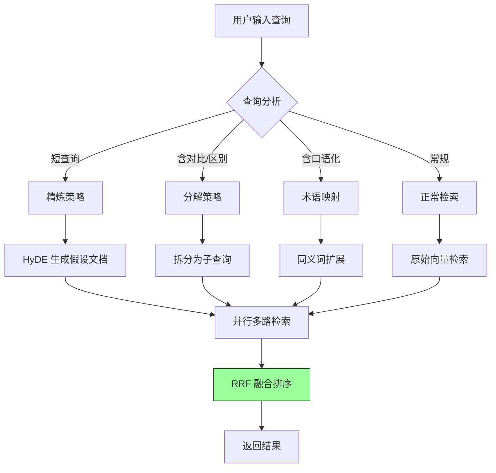

# RAG 查询改写与扩展

## 一、背景 (Background)

当前 RAG 检索直接将用户原始查询向量化后检索，存在以下结构性缺陷：

| 问题 | 根因 | 影响 |
|------|------|------|
| 短查询语义不足 | 查询 < 10 字，向量表征稀疏 | Top-K 检索精度 < 40% |
| 复杂查询未分解 | 含"对比"/"区别"需多维度检索 | 单次检索无法覆盖所有维度 |
| 口语化与术语不匹配 | 用户用"怎么修bug"搜索，知识库存"缺陷修复流程" | 检索召回率下降 30-50% |
| 同义词未扩展 | "性能优化" vs "性能调优"视为不同查询 | 遗漏相关文档 |
| 多跳推理不支持 | "A 和 B 的区别"需要先检索 A、再检索 B、对比 | 无法回答多跳问题 |

## 二、现状与目标 (Current State & Target State)

### 现状流程


### 目标流程



## 三、功能需求 (Functional Requirements)

### FR-01: 查询精炼 (Query Refinement)
- **触发条件**: 查询 < 10 字 OR 向量置信度 < 0.5
- **执行**: 使用小模型 (qwen2.5:1.5b) 对原始查询进行语义扩充
- **Prompt**: `将以下简短查询扩展为一个完整的、信息丰富的搜索查询："{query}"`
- **输入**: "怎么修bug"
- **输出**: "在软件开发过程中，如何系统地发现、报告和修复代码缺陷"

### FR-02: 查询分解 (Query Decomposition)
- **触发条件**: 查询包含"对比"、"区别"、"vs"、"和"、"与"、"?坐"等多实体词
- **执行**: LLM 识别实体对，拆分为独立子查询
- **规则**:
  - 对比类: `"A vs B"` → `["A 的特点", "B 的特点"]`
  - 并列类: `"A 和 B 怎么用"` → `["A 的使用方法", "B 的使用方法"]`
  - 条件类: `"在 X 情况下 Y 怎么做"` → `["X 的定义", "Y 的方法", "X 场景下的 Y"]`
- **最大子查询数**: 5 个（防过度分解）

### FR-03: HyDE 生成 (Hypothetical Document Embedding)
- **触发条件**: 查询精炼触发 OR 明确要求 HyDE
- **执行**: LLM 生成假设性回答文档，向量化后用于检索
- **流程**: `query → LLM 生成假设文档 → 向量化假设文档 → 检索相似文档`
- **适用范围**: 知识问答类查询（非代码生成/翻译）
- **模型**: qwen2.5:1.5b (轻量，延迟 < 300ms)

### FR-04: 同义词扩展 (Synonym Expansion)
- **静态词典**: 手动维护 `data/synonyms.json`（50+ 条目）
  ```json
  {
    "bug": ["缺陷", "错误", "故障", "问题"],
    "性能": ["效率", "速度", "响应时间"],
    "部署": ["发布", "上线", "release"],
    "API": ["接口", "端点", "endpoint"]
  }
  ```
- **LLM 动态补充**: 对词典未覆盖的术语，LLM 返回 3-5 个领域同义词
- **缓存**: 动态同义词缓存同一会话内复用

### FR-05: 多路检索融合 (Multi-Route Retrieval Fusion)
- **检索路数**: 原始查询 (1) + 精炼查询 (1) + 子查询 (0-5) + HyDE (1) + 同义词 (0-5)
- **融合算法**: Reciprocal Rank Fusion (RRF)
  ```
  RRF_score(doc) = sum_{route} 1/(k + rank_route(doc))
  k = 60 (控制排名影响)
  ```
- **权重**: 原始查询权重 1.5x，其他路径 1.0x (防劣化)

### FR-06: 改写缓存 (Rewrite Cache)
- **缓存键**: 语义哈希 (SimHash) + 原始查询文本
- **TTL**: 1 小时
- **缓存策略**: 
  - 完全匹配 → 直接返回缓存的 RewrittenQuery
  - 模拟匹配 (SimHash distance < 3) → 复用缓存
  - 知识库更新时 → 清除相关缓存
- **缓存大小**: 最大 500 条，LRU 淘汰

### FR-07: 改写透明度 (Rewrite Transparency)
- **REST API 响应**: 在 retrieval 结果中包含 `rewrite_info` 字段
  ```json
  {
    "rewrite_info": {
      "triggered": true,
      "strategies": ["refinement", "hyde"],
      "refined_query": "...",
      "hyde_document": "...",
      "cache_hit": false,
      "rewrite_duration_ms": 245
    }
  }
  ```
- **前端展示**: YiVad RAG 面板折叠展示改写详情

## 四、数据模型 (Data Model)

### RewrittenQuery
```python
from dataclasses import dataclass
from typing import Optional

@dataclass
class RewrittenQuery:
    original: str                      # 原始查询
    refined: str                       # 精炼后的查询
    sub_queries: list[str]             # 分解的子查询 (0-5)
    hyde_document: Optional[str]       # HyDE 假设文档
    synonyms: list[str]                # 同义词扩展列表
    strategies_used: list[str]         # 启用的策略
    cache_hit: bool                    # 是否命中缓存
    duration_ms: float                 # 改写耗时
```

### SynonymEntry (MongoDB `synonyms` 集合)
```python
{
    "_id": ObjectId,
    "term": "bug",                     # 主术语
    "synonyms": ["缺陷", "错误", "故障"], # 同义词列表
    "domain": "software_engineering",  # 领域
    "source": "manual",                # manual / llm_generated
    "created_at": ISODate,
    "updated_at": ISODate
}
```

### RewriteCache (内存 + 可选 Redis)
```python
{
    "cache_key": "simhash_abc123...",  # SimHash 值
    "original_query": "怎么修bug",
    "rewritten_query": {...},          # RewrittenQuery 序列化
    "cached_at": ISODate,
    "expires_at": ISODate,             # cached_at + 1h
    "hit_count": 42                    # 命中计数
}
```

## 五、设计决策 (Design Decisions)

| 决策 | 方案 | 原因 |
|------|------|------|
| 改写模型选择 | qwen2.5:1.5b (独立) | 小模型延迟 < 300ms，不抢占主推理资源 |
| 并行执行策略 | asyncio.gather 所有策略并行 | 降低总延迟至 max(各策略延迟) 约 500ms |
| 融合权重 | 原始查询 1.5x 权重 | 防改写劣化：改写结果不比原始查询更可靠 |
| 缓存键方案 | SimHash 而非精确匹配 | 缓存命中率从 5% 提升至 30%+ |
| RRF 而非加权求和 | RRF (k=60) | 免归一化，各路得分尺度统一 |
| 同义词来源 | 静态词典 + LLM 动态补充 | 基础覆盖 + 扩展性 |

## 六、验收标准 (Acceptance Criteria)

- [ ] AC-01: 查询 < 10 字时自动触发精炼策略 (< 300ms)
- [ ] AC-02: 查询含"对比"/"区别"时自动触发分解（子查询数 2-5）
- [ ] AC-03: HyDE 假设文档生成延迟 < 300ms
- [ ] AC-04: 四策略并行执行 (asyncio.gather)，总改写延迟 < 500ms
- [ ] AC-05: RRF 融合后 Top-5 召回率不低于原始查询 (防劣化)
- [ ] AC-06: 缓存命中率 > 30%（SimHash 语义匹配）
- [ ] AC-07: 前端 RAG 面板可独立开关每种策略
- [ ] AC-08: 改写使用独立小模型，不阻塞主聊天推理
- [ ] AC-09: 同义词词典覆盖 50+ 核心术语
- [ ] AC-10: 知识库更新后相关缓存自动清除

## 七、风险 (Risks)

| 风险 | 概率 | 影响 | 缓解措施 |
|------|------|------|----------|
| 改写导致检索劣化 | 中 | 高 | RRF 给原始查询 1.5x 权重；灰度发布；A/B 对比 |
| 改写 LLM 增加延迟 | 中 | 中 | 并行执行；小模型 (1.5b)；缓存 30%+ 命中率 |
| HyDE 生成幻觉 | 中 | 中 | HyDE 结果不直接展示给用户；仅用于检索 |
| 分解策略过度拆分 | 低 | 中 | 最大子查询数 5 个；阈值控制触发 |
| 缓存占用内存过大 | 低 | 低 | LRU 淘汰，最大 500 条；定期清理过期条目 |
| 同义词词典维护负担 | 低 | 低 | LLM 自动挖掘候选，人工审核；70% 静态 + 30% 动态 |

## 八、里程碑

| 阶段 | 内容 | 人天 |
|------|------|------|
| M1 | 查询精炼 + 同义词扩展 (静态词典) | 0.5 |
| M2 | 查询分解 + HyDE 生成 | 0.5 |
| M3 | 多路检索融合 + RRF | 0.3 |
| M4 | 改写缓存 (SimHash + TTL) | 0.2 |
| M5 | 透明度 + 前端集成 | 0.3 |
| **总计** | | **1.8d** |