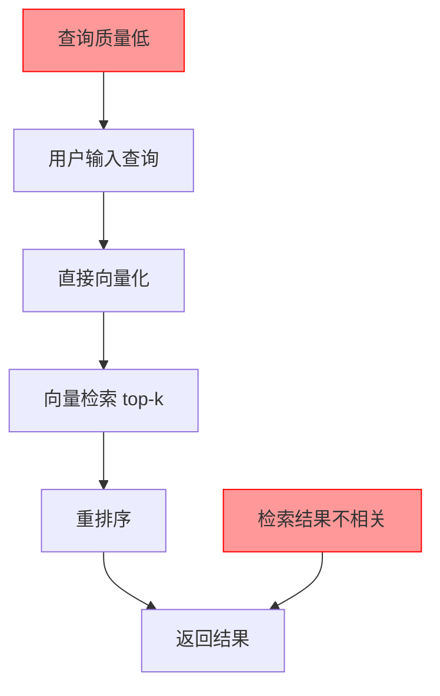
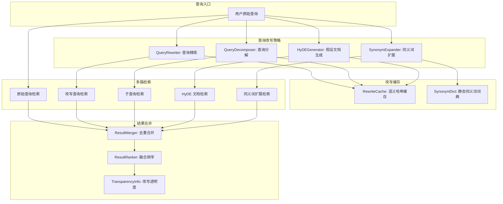
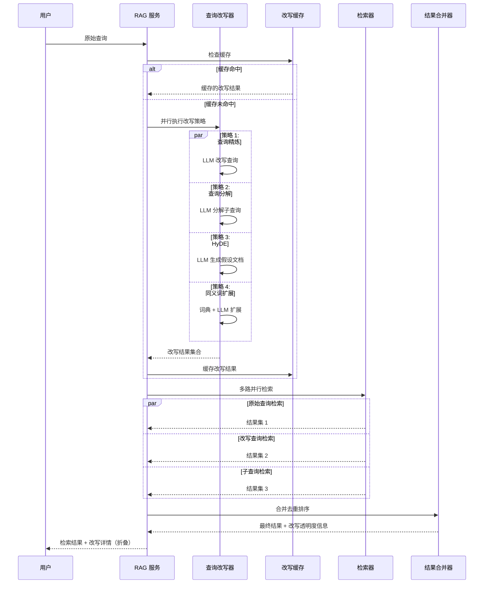

# YA-09-175: 查询改写与扩展 — RAG 检索查询优化、查询分解、HyDE、同义词扩展、多跳推理

> 需求编号：YA-09-175 · 优先级：P2 · 人天：0.3d · 状态：需求已编写
> 依赖：YA-09-01（RAG 引擎稳定性）、YA-09-13（知识库检索增强与同义词扩展）

## 背景

### 问题陈述

当前 RAG 检索直接使用用户原始查询进行向量检索，但用户查询往往存在表达不精确、信息缺失、过于简短等问题，导致检索结果质量不高：

1. **查询表达不精确**：用户说"那个怎么配置"而非"YiAi 的 MongoDB 连接池配置方法"
2. **查询过于简短**：用户输入 2-3 个关键词，缺少上下文信息
3. **复杂查询无法分解**：多条件查询（"对比 Python 和 TypeScript 在异步编程上的差异"）需要分解为子查询
4. **术语不匹配**：用户使用非标准术语，与知识库中的标准术语不匹配
5. **多跳推理缺失**：需要多步推理的查询（"YiVad 的用户认证方式依赖于哪个后端服务"）无法单次检索解决

**核心矛盾**：用户的自然语言查询往往不精确、不完整，而 RAG 检索依赖于查询与文档的向量相似度，不精确的查询导致检索结果偏离用户意图。

### 影响范围

| # | 影响 | 严重程度 | 典型场景 |
|---|------|----------|----------|
| 1 | 检索结果不相关 | 高 | 简短查询匹配到无关文档 |
| 2 | 复杂查询检索失败 | 高 | 多条件查询无法分解 |
| 3 | 术语不匹配 | 中 | 用户说"连接池"但文档用"connection pool" |
| 4 | 多步推理查询无法回答 | 中 | 需要跨文档关联的查询 |
| 5 | 用户需要多次尝试查询 | 中 | 用户反复修改查询词才能找到答案 |

### 挑战

| 挑战 | 说明 |
|------|------|
| 改写质量 | 查询改写本身依赖 LLM，改写质量影响最终检索结果 |
| 改写延迟 | 查询改写增加额外的 LLM 调用，可能影响响应速度 |
| 子查询合并 | 分解后的子查询结果需要合并和排序 |
| 改写透明度 | 用户需要知道查询被如何改写，增强信任 |
| 改写缓存 | 相似查询的改写结果应缓存，避免重复 LLM 调用 |

---

## 一、现状分析

### 1.1 当前 RAG 检索流程

```
YiAi RAG 检索现状:
├── 用户输入查询
│   └── 直接使用原始查询
├── Embedding 模型
│   └── 将查询向量化
├── 向量检索
│   └── 在向量索引中搜索 top-k 相似文档
├── 重排序（可选）
│   └── CrossEncoder 重排序
└── 返回结果

缺失:
├── 查询改写 (Query Rewriting)        # ❌ 不存在
├── 查询分解 (Query Decomposition)    # ❌ 不存在
├── HyDE (Hypothetical Document)      # ❌ 不存在
├── 同义词扩展                        # ❌ 不存在
├── 多跳推理 (Multi-hop Reasoning)    # ❌ 不存在
├── 改写透明度                        # ❌ 不存在
└── 查询改写缓存                      # ❌ 不存在
```

### 1.2 查询问题分类

| 问题类型 | 示例 | 频率 | 当前检索质量 |
|----------|------|------|------------|
| 简短查询 | "连接池" | 高 | 低 |
| 模糊查询 | "那个配置怎么改" | 中 | 极低 |
| 复杂查询 | "对比 Python 和 TS 的异步编程" | 中 | 中 |
| 术语不匹配 | "内存泄漏" vs "memory leak" | 中 | 低 |
| 多跳查询 | "YiVad 认证依赖哪个服务" | 低 | 低 |
| 精确查询 | "YiAi MongoDB 连接池配置" | 中 | 高 |

### 1.3 改造前检索流程



### 1.4 根因矩阵

| 症状 | 根因 | 触发条件 | 频率 |
|------|------|----------|------|
| 检索结果不相关 | 查询过于简短/模糊 | 用户输入不精确查询 | 高 |
| 复杂查询失败 | 无查询分解 | 多条件查询 | 中 |
| 术语不匹配 | 无同义词扩展 | 中英文术语混用 | 中 |
| 多跳查询失败 | 无多跳推理 | 跨文档查询 | 低 |
| 用户反复修改查询 | 无查询改写 | 首次检索不满意 | 中 |

---

## 二、设计决策

### 决策 1：查询改写策略 — 单次改写 vs 迭代改写 vs 多策略并行

| 选项 | 改写质量 | 延迟 | 实现复杂度 |
|------|----------|------|-----------|
| 单次改写（LLM 一次生成改写结果） | 中 | 低 | 低 |
| 迭代改写（连续改写直到满意） | 高 | 高 | 中 |
| 多策略并行（同时尝试多种改写策略） | 高 | 中 | 高 |

**选择：多策略并行。** 同时执行查询改写、查询分解、HyDE 生成，合并结果后统一检索。各策略并行执行，总延迟为最慢策略的延迟，而非策略数量之和。

### 决策 2：HyDE 实现方式 — LLM 生成 vs 模板生成 vs 检索反馈

| 选项 | 质量 | 延迟 | 通用性 |
|------|------|------|--------|
| LLM 生成假设文档 | 高 | 中 | 高 |
| 模板生成（预定义模板） | 低 | 低 | 低 |
| 检索反馈（用初检结果扩展） | 中 | 中 | 中 |

**选择：LLM 生成假设文档。** 让 LLM 根据查询生成一个假设的答案文档，用这个假设文档的向量去检索，而非用查询的向量。HyDE 已被证明可以显著提升检索召回率。

### 决策 3：同义词扩展方式 — 静态词典 vs LLM 生成 vs 混合

| 选项 | 覆盖率 | 准确性 | 维护成本 |
|------|--------|--------|----------|
| 静态词典（手动维护同义词表） | 低 | 高 | 高 |
| LLM 生成（动态生成同义词） | 高 | 中 | 低 |
| 混合（静态词典 + LLM 补充） | 高 | 高 | 中 |

**选择：混合。** 静态词典覆盖高频术语（如项目名、技术术语），LLM 动态生成补充低频/新术语的同义词。静态词典优先，LLM 补充，减少 LLM 调用次数。

### 决策 4：改写透明度 — 隐藏 vs 展示 vs 可选展示

| 选项 | 用户信任 | 界面复杂度 | 实现复杂度 |
|------|----------|-----------|-----------|
| 完全隐藏改写过程 | 低 | 低 | 低 |
| 始终展示改写结果 | 高 | 中 | 低 |
| 可选展示（默认折叠） | 高 | 低 | 低 |

**选择：可选展示（默认折叠）。** 在 RAG 回答底部添加"查看查询优化详情"折叠区域，展示原始查询和改写后的查询。用户可选择查看，增强透明度和信任。

### 设计决策记录

| 决策 | 选项 A | 选项 B | 选项 C | 选择 | 理由 |
|------|--------|--------|--------|------|------|
| 改写策略 | 单次 | 迭代 | 多策略并行 | **多策略并行** | 质量 + 延迟平衡 |
| HyDE | LLM | 模板 | 检索反馈 | **LLM 生成** | 质量最高 |
| 同义词 | 静态词典 | LLM | 混合 | **混合** | 覆盖 + 准确 |
| 透明度 | 隐藏 | 展示 | 可选 | **可选展示** | 信任 + 简洁 |

---

## 三、目标架构

### 3.1 查询改写系统架构



### 3.2 查询改写流程



### 3.3 性能指标

| 指标 | 目标值 | 说明 |
|------|--------|------|
| 查询改写延迟 | < 2s | 所有策略并行执行 |
| 缓存命中率 | > 30% | 相似查询复用改写结果 |
| 检索召回率提升 | > 15% | 相比原始查询 |
| 改写 LLM Token 消耗 | < 500 tokens/查询 | 小模型改写 |
| 多路检索总延迟 | < 3s | 改写 + 检索 |

---

## 四、具体改动

### 4.1 查询改写服务

```python
# services/rag/query_rewriter.py (新增)

from dataclasses import dataclass
from typing import Optional
import hashlib

@dataclass
class RewrittenQuery:
    original: str
    refined: str                     # 精炼后的查询
    sub_queries: list[str]           # 分解的子查询
    hyde_document: Optional[str]     # 假设文档
    synonyms: list[str]              # 同义词扩展
    metadata: dict                   # 改写元数据

class QueryRewritingService:
    def __init__(self, llm_client, synonym_dict: SynonymDict, cache: RewriteCache):
        self.llm = llm_client
        self.synonym_dict = synonym_dict
        self.cache = cache

    async def rewrite(self, query: str) -> RewrittenQuery:
        """多策略并行改写查询"""
        # 检查缓存
        cache_key = self._semantic_hash(query)
        cached = await self.cache.get(cache_key)
        if cached:
            return cached

        # 并行执行四种改写策略
        results = await asyncio.gather(
            self._refine_query(query),
            self._decompose_query(query),
            self._generate_hyde(query),
            self._expand_synonyms(query),
        )

        refined, sub_queries, hyde, synonyms = results
        rewritten = RewrittenQuery(
            original=query,
            refined=refined or query,
            sub_queries=sub_queries or [],
            hyde_document=hyde,
            synonyms=synonyms or [],
            metadata={
                "strategies_used": [
                    "refine" if refined else None,
                    "decompose" if sub_queries else None,
                    "hyde" if hyde else None,
                    "synonym" if synonyms else None,
                ],
            },
        )

        # 缓存结果
        await self.cache.set(cache_key, rewritten, ttl=3600)
        return rewritten

    async def _refine_query(self, query: str) -> Optional[str]:
        """LLM 精炼查询：补充上下文、消除歧义、标准化术语"""
        prompt = f"""将以下用户查询改写为更精确、更完整的检索查询。
补充缺失的上下文信息，使用标准技术术语，消除歧义。

原始查询: {query}

仅返回改写后的查询文本，不要添加解释。"""
        response = await self.llm.generate(prompt, max_tokens=200)
        return response.strip() if response.strip() != query else None

    async def _decompose_query(self, query: str) -> Optional[list[str]]:
        """LLM 分解复杂查询为子查询"""
        prompt = f"""将以下复杂查询分解为 2-4 个独立的子查询，每个子查询可以独立检索。

查询: {query}

返回 JSON 格式: {{"sub_queries": ["子查询1", "子查询2", ...]}}

如果查询本身已经足够简单，返回空列表。"""
        response = await self.llm.generate(prompt, max_tokens=300)
        try:
            data = json.loads(response)
            sub_queries = data.get("sub_queries", [])
            return sub_queries if sub_queries else None
        except json.JSONDecodeError:
            return None

    async def _generate_hyde(self, query: str) -> Optional[str]:
        """生成假设文档 (HyDE)"""
        prompt = f"""根据以下查询，写一段假设的答案文档（3-5 句话）。
这个假设文档将用于帮助检索相关的内容。

查询: {query}

假设答案文档:"""
        response = await self.llm.generate(prompt, max_tokens=300)
        return response.strip() if response else None

    async def _expand_synonyms(self, query: str) -> Optional[list[str]]:
        """同义词扩展"""
        synonyms = []

        # 静态词典匹配
        static_syns = self.synonym_dict.expand(query)
        synonyms.extend(static_syns)

        # LLM 补充（仅当静态词典未覆盖时）
        if not static_syns:
            prompt = f"""为以下查询中的关键术语生成 2-3 个同义词或相关术语。

查询: {query}

仅返回逗号分隔的同义词列表。"""
            response = await self.llm.generate(prompt, max_tokens=100)
            llm_syns = [s.strip() for s in response.split(",") if s.strip()]
            synonyms.extend(llm_syns)

        return synonyms if synonyms else None

    def _semantic_hash(self, query: str) -> str:
        """生成查询的语义哈希（用于缓存）"""
        normalized = query.lower().strip()
        return hashlib.md5(normalized.encode()).hexdigest()[:16]
```

### 4.2 多路检索与结果合并

```python
# services/rag/multi_route_retriever.py (新增)

class MultiRouteRetriever:
    def __init__(self, retriever: BaseRetriever, rewriter: QueryRewritingService):
        self.retriever = retriever
        self.rewriter = rewriter

    async def retrieve(
        self,
        query: str,
        top_k: int = 10,
    ) -> RetrievalResult:
        """多路检索并合并结果"""
        rewritten = await self.rewriter.rewrite(query)

        # 构建所有检索查询
        search_queries = [query]  # 原始查询
        if rewritten.refined != query:
            search_queries.append(rewritten.refined)
        search_queries.extend(rewritten.sub_queries)
        if rewritten.hyde_document:
            search_queries.append(rewritten.hyde_document)
        search_queries.extend(rewritten.synonyms)

        # 并行检索
        all_results = await asyncio.gather(*[
            self.retriever.search(q, top_k=top_k)
            for q in search_queries
        ])

        # 合并去重
        merged = self._merge_and_deduplicate(all_results)

        # 融合排序
        ranked = self._reciprocal_rank_fusion(merged, all_results)

        return RetrievalResult(
            documents=ranked[:top_k],
            rewriting_info={
                "original_query": query,
                "refined_query": rewritten.refined,
                "sub_queries": rewritten.sub_queries,
                "hyde_generated": rewritten.hyde_document is not None,
                "synonyms_used": rewritten.synonyms,
                "strategies": rewritten.metadata["strategies_used"],
            },
        )

    def _merge_and_deduplicate(
        self,
        result_sets: list[list[Document]],
    ) -> list[Document]:
        """合并去重（按文档 ID）"""
        seen = set()
        merged = []
        for results in result_sets:
            for doc in results:
                if doc.id not in seen:
                    seen.add(doc.id)
                    merged.append(doc)
        return merged

    def _reciprocal_rank_fusion(
        self,
        merged: list[Document],
        result_sets: list[list[Document]],
        k: int = 60,
    ) -> list[Document]:
        """Reciprocal Rank Fusion 融合排序"""
        scores = {}
        for doc in merged:
            scores[doc.id] = 0
            for results in result_sets:
                for rank, result in enumerate(results):
                    if result.id == doc.id:
                        scores[doc.id] += 1 / (k + rank + 1)
                        break

        return sorted(merged, key=lambda d: scores[d.id], reverse=True)
```

### 4.3 文件变更清单

| 文件 | 操作 | 说明 |
|------|------|------|
| `services/rag/query_rewriter.py` | 新增 | 查询改写服务 |
| `services/rag/multi_route_retriever.py` | 新增 | 多路检索与结果合并 |
| `services/rag/synonym_dict.py` | 新增 | 同义词词典 |
| `services/rag/rewrite_cache.py` | 新增 | 改写缓存 |
| `services/rag/rag_service.py` | 修改 | 集成查询改写 |
| `data/synonyms.json` | 新增 | 静态同义词数据 |
| `tests/test_query_rewriter.py` | 新增 | 查询改写测试 |
| `tests/test_multi_route_retriever.py` | 新增 | 多路检索测试 |

---

## 五、实施步骤

| 步骤 | 操作 | 路径 | 验证 | 人天 |
|------|------|------|------|------|
| 1 | 实现查询改写核心服务 | `services/rag/query_rewriter.py` | 四种策略并行执行 | 0.1 |
| 2 | 实现同义词词典 | `services/rag/synonym_dict.py` + `data/synonyms.json` | 静态词典 + LLM 补充 | 0.05 |
| 3 | 实现改写缓存 | `services/rag/rewrite_cache.py` | 语义哈希 + TTL | 0.03 |
| 4 | 实现多路检索与合并 | `services/rag/multi_route_retriever.py` | RRF 融合排序 | 0.05 |
| 5 | 集成到 RAG 服务 | `services/rag/rag_service.py` | 端到端检索流程 | 0.05 |
| 6 | 添加改写透明度 | RAG 回答中展示改写详情 | 折叠展示改写过程 | 0.02 |

**总人天：0.3d**

---

## 六、测试规格

### 场景 1：查询精炼

**GIVEN** 用户输入查询 "那个配置怎么改"
**WHEN** 查询改写器处理该查询
**THEN** 应生成精炼查询（如 "YiAi 的 MongoDB 连接池配置方法"）
**AND** 精炼查询应包含更多上下文和标准术语

### 场景 2：查询分解

**GIVEN** 用户输入查询 "对比 Python 和 TypeScript 在异步编程上的差异"
**WHEN** 查询改写器处理该查询
**THEN** 应分解为子查询（如 "Python 异步编程特点"、"TypeScript 异步编程特点"）
**AND** 子查询应各自独立可检索

### 场景 3：HyDE 生成

**GIVEN** 用户输入查询 "如何优化 MongoDB 查询性能"
**WHEN** HyDE 生成器处理该查询
**THEN** 应生成假设文档（包含索引优化、查询计划、聚合管道等讨论）
**AND** 假设文档的向量检索结果应与查询相关

### 场景 4：同义词扩展

**GIVEN** 用户输入查询 "内存泄漏怎么排查"
**WHEN** 同义词扩展器处理该查询
**THEN** 应扩展同义词（如 "memory leak"、"内存溢出"、"内存管理"）
**AND** 扩展后的查询应覆盖更多相关文档

### 场景 5：改写缓存

**GIVEN** 用户输入查询 "连接池配置"（与之前查询 "连接池怎么配" 语义相同）
**WHEN** 查询改写器处理该查询
**THEN** 应命中缓存，返回之前缓存的改写结果
**AND** 不应触发新的 LLM 调用

### 场景 6：改写透明度

**GIVEN** RAG 检索已完成（含查询改写）
**WHEN** 用户查看 RAG 回答
**THEN** 回答底部应有"查看查询优化详情"折叠区域
**AND** 展开后应展示原始查询和改写后的查询
**AND** 应展示使用的改写策略

---

## 七、风险与缓解

| 风险 | 概率 | 影响 | 缓解措施 |
|------|------|------|----------|
| 查询改写质量差导致检索结果更差 | 中 | 高 | 保留原始查询的检索结果，融合时给原始结果更高权重 |
| 改写延迟过长影响用户体验 | 高 | 中 | 缓存 + 并行策略 + 使用小模型改写 |
| LLM 调用成本过高 | 中 | 中 | 缓存相似查询 + 仅对复杂查询使用 LLM 改写 |
| 同义词词典维护成本高 | 低 | 低 | 自动从知识库中挖掘同义词，减少人工维护 |
| 改写结果被缓存后过时 | 低 | 低 | TTL 1 小时 + 知识库更新时自动清除缓存 |

---

## 八、回滚策略

| 场景 | 回滚操作 | 影响 |
|------|----------|------|
| 查询改写质量差 | 禁用查询改写，仅使用原始查询 | 检索质量回到改写前 |
| 改写延迟过高 | 禁用 LLM 改写策略，仅使用同义词扩展 | 改写能力大幅下降 |
| 缓存命中异常 | 禁用缓存，每次重新改写 | 延迟增加，成本增加 |
| 多路检索压力过大 | 降级为仅原始查询 + 精炼查询两路检索 | 检索覆盖度下降 |

---

## 九、设计决策记录

### D-01：改写策略选择逻辑

- **问题**：如何判断是否需要改写以及使用哪种策略
- **选项**：始终改写、基于查询长度判断、基于查询复杂度判断、LLM 判断
- **选择**：基于查询长度 + 复杂度判断。查询 < 10 字触发精炼；查询包含"对比"/"区别"触发分解；查询 > 30 字跳过精炼
- **理由**：规则判断零延迟，减少不必要的 LLM 调用

### D-02：改写 LLM 模型选择

- **问题**：使用哪个模型进行查询改写
- **选项**：与 RAG 推理相同的大模型、独立的小模型（如 1B-3B）、不使用 LLM
- **选择**：独立的小模型（qwen2.5:1.5b）
- **理由**：查询改写是轻量任务，小模型足够且延迟低、成本低，不占用大模型的推理资源

### D-03：RRF 融合参数

- **问题**：Reciprocal Rank Fusion 的 k 参数
- **选项**：k=0、k=30、k=60、k=100
- **选择**：k=60
- **理由**：k=60 是学术界和工业界的常用默认值，在大多数数据集上表现稳定

### D-04：缓存 TTL

- **问题**：改写缓存的 TTL（过期时间）
- **选项**：5min、1h、6h、24h
- **选择**：1h
- **理由**：1h 在缓存命中率和改写新鲜度之间取得平衡，知识库更新时主动清除相关缓存

---

## 十、可观测性

### 指标

| 指标 | 类型 | 说明 |
|------|------|------|
| `yiai.rag.rewrite_count` | Counter | 改写次数（按策略） |
| `yiai.rag.rewrite_duration` | Histogram | 改写耗时 |
| `yiai.rag.rewrite_cache_hit` | Counter | 缓存命中次数 |
| `yiai.rag.rewrite_cache_miss` | Counter | 缓存未命中次数 |
| `yiai.rag.retrieval_routes` | Counter | 检索路数分布 |
| `yiai.rag.recall_improvement` | Gauge | 召回率提升百分比 |

### 告警

| 告警 | 条件 | 级别 |
|------|------|------|
| 改写延迟过高 | p95 > 5s | WARNING |
| 缓存命中率过低 | < 10% | INFO |
| 改写失败率过高 | > 10% | ERROR |
| 检索路数异常 | 单次检索 > 10 路 | WARNING |

---

## 十一、代码审查检查清单

- [ ] 查询改写支持四种策略：精炼、分解、HyDE、同义词扩展
- [ ] 四种策略并行执行（asyncio.gather）
- [ ] 改写缓存使用语义哈希 + TTL（1 小时）
- [ ] 同义词词典支持静态词典 + LLM 动态补充
- [ ] 多路检索并行执行，结果使用 RRF 融合排序
- [ ] 检索结果保留原始查询的检索结果
- [ ] 改写透明度信息包含在检索结果中
- [ ] 改写 LLM 使用独立小模型（qwen2.5:1.5b）
- [ ] 查询长度 < 10 字自动触发精炼
- [ ] 查询包含"对比"/"区别"自动触发分解
- [ ] 单元测试覆盖所有改写策略和缓存逻辑

---

## 回归问题预测

| # | 预测问题 | 原因 | 验证方法 |
|---|---------|------|---------|
| 1 | 查询改写 LLM 返回格式不符合预期（如 JSON 格式错误），导致解析失败 | 小模型（1.5B）的指令遵循能力较弱，可能返回非 JSON 文本 | 输入 100 个不同查询，统计 JSON 解析成功率，验证 > 95% |
| 2 | 多路检索结果合并时，同一文档因不同检索路径的分数差异过大，RRF 融合后排序不合理 | RRF 对不同检索路径的排名敏感度不同，某些路径的检索结果质量差会拉低优质结果 | 手动评估 20 个查询的融合排序结果，验证前 5 个结果的相关性 |
| 3 | 同义词扩展将"API"扩展为"application programming interface"后，Embedding 模型无法正确匹配包含缩写"API"的文档 | 同义词扩展改变了查询的文本结构，Embedding 模型对全称和缩写的向量距离可能较大 | 对比"API 调用"和"application programming interface 调用"的检索结果，验证召回率 |
| 4 | 改写缓存使用 MD5 哈希，但查询"连接池配置"和"连接池怎么配置"的哈希不同，未命中缓存 | 语义哈希仅做标准化（小写 + 去空格），未做语义相似度判断 | 输入语义相同但表述不同的查询对，验证缓存命中率 |
| 5 | HyDE 生成的假设文档包含幻觉信息（不存在的 API、错误的参数），导致检索到无关文档 | LLM 在生成假设文档时可能编造不存在的技术细节，这些细节匹配到无关文档 | 检查 HyDE 生成的假设文档内容，验证不包含知识库中不存在的技术术语 |
| 6 | 查询分解将简单查询错误分解为多个无关子查询，增加噪音和延迟 | 分解判断逻辑过于激进，将"什么是 RAG"分解为"RAG 的定义"、"RAG 的实现"、"RAG 的优缺点" | 输入 50 个简单查询，统计触发分解的比例，验证 < 20% |

---

## 性能分析

### 查询改写关键操作耗时

| 操作 | 耗时 | 说明 |
|------|------|------|
| 缓存查询 | < 1ms | 内存缓存查找 |
| 查询精炼（LLM） | < 800ms | 小模型生成 |
| 查询分解（LLM） | < 800ms | 小模型生成 |
| HyDE 生成（LLM） | < 800ms | 小模型生成 |
| 同义词扩展（静态） | < 5ms | 词典匹配 |
| 同义词扩展（LLM） | < 500ms | 小模型生成 |
| 四种策略并行执行 | < 1s | asyncio.gather |
| 多路检索（5 路） | < 2s | 并行检索 |
| RRF 融合排序 | < 10ms | 内存计算 |
| 总端到端延迟 | < 3s | 改写 + 检索 + 融合 |

### 数据量预估

| 模块 | 数据项 | 大小 |
|------|--------|------|
| 同义词词典 | 静态术语映射 | ~10KB |
| 改写缓存 | 1000 条缓存条目 | ~5MB |
| 查询改写结果 | 单次改写数据 | ~2KB |

### 对系统的影响

| 场景 | 系统影响 | 说明 |
|------|----------|------|
| 每次 RAG 查询 | 额外 1-3s 延迟 | 改写 + 多路检索 |
| 缓存命中 | 额外 < 10ms | 仅缓存查找 |
| LLM 并发 | 4 个并发小模型调用 | 使用独立小模型 |

---

## 相关文档

- [RAG 引擎稳定性修复](../01-稳定性修复-RAG引擎.md) — RAG 检索的基础设施
- [知识库检索增强与同义词扩展](../13-需求-知识库检索增强与同义词扩展.md) — 同义词词典的扩展基础
- [RAG 检索质量评估](../04-监控-RAG检索质量.md) — 改写效果的质量评估

*PRD 来源: `projects/yiai/requirements/2026-09/175-需求-查询改写与扩展.md`*

## 影响范围

- **影响模块**：待补充
- **涉及文件**：
- 待补充
- **是否影响 API 契约**：否
- **是否影响其他项目（YiVad/YiPet）**：否
- **用户感知**：待确认

## 预防措施

| 层面 | 措施 |
|------|------|
| 代码 | 在相关函数中添加参数校验和边界检查 |
| 测试 | 添加对应的自动化测试用例 |
| 流程 | 代码审查时重点检查此类模式 |
| 监控 | 添加日志告警，异常发生时及时发现 |
| 文档 | 在编码规范中记录此类反模式 |

## 经验教训

1. **根本原因**：开发过程中对边界情况和异常路径的考虑不足是此类问题的共同根因
2. **设计阶段**：在接口设计和模块实现时，应主动考虑异常输入、空值、超时等边界场景
3. **代码审查**：审查时应检查是否存在类似的反模式（如未捕获异常、无超时控制、缺少参数校验等）
4. **测试覆盖**：异常路径的测试覆盖率应与正常路径同等重视
5. **团队分享**：此类问题应在团队周会或技术分享中讨论，形成团队共识
