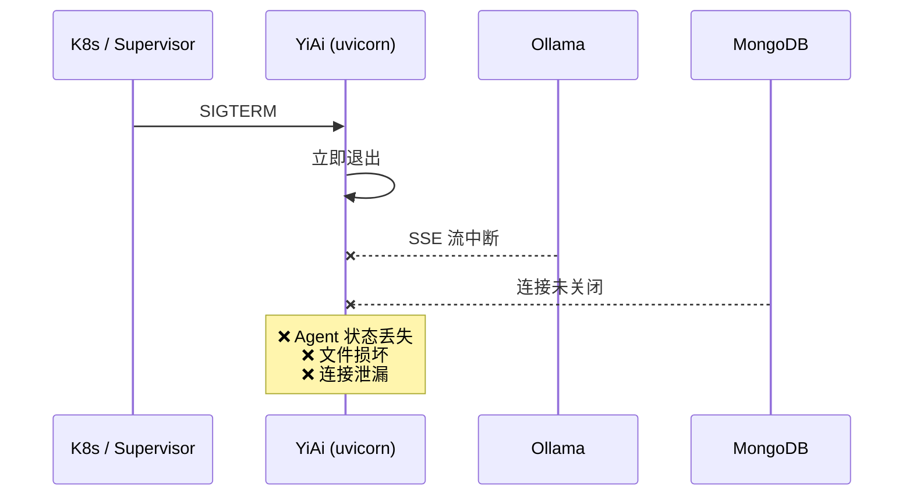
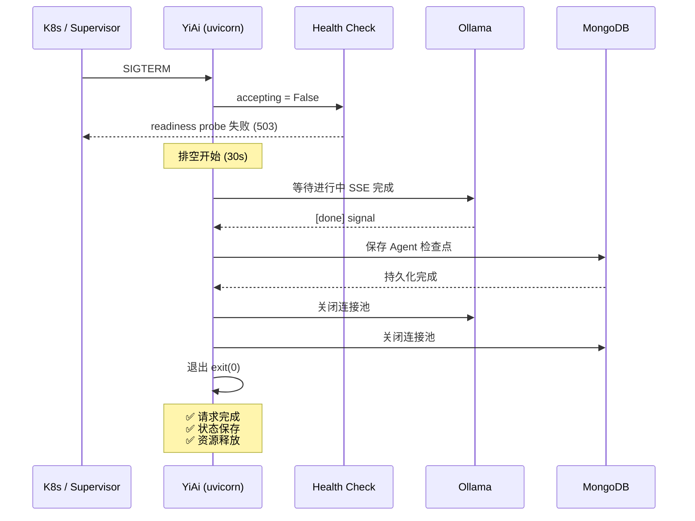

# 优雅关闭与状态保存

## 一、背景 (Background)

当前 YiAi 收到 SIGTERM 后立即退出，FastAPI + uvicorn 在接收到终止信号时直接关闭事件循环，导致以下问题：

| 问题 | 根因 | 用户影响 |
|------|------|---------|
| LLM 推理中断 | 进行中的 SSE 流未完成，uvicorn 强制关闭 | 用户看到半截回复，需重新提问 |
| Agent 上下文丢失 | 内存中的对话状态未持久化 | 重启后无法继续之前的 Agent 任务 |
| 文件写入损坏 | 文件未完全写入磁盘即退出 | 上传的文件损坏，需重新上传 |
| 连接泄漏 | MongoDB/Ollama 连接池未释放 | 连接泄漏，重启后连接数累加 |
| 新请求丢失 | 负载均衡器仍将请求路由到正在关闭的实例 | 用户请求返回 502 |

## 二、现状与目标 (Current State & Target State)

### 现状流程



### 目标流程



## 三、功能需求 (Functional Requirements)

### FR-01: 信号处理框架 (Signal Handler)
- **捕获信号**: SIGTERM (15), SIGINT (2)
- **双重信号保护**: 第一次信号进入优雅关闭；第二次信号立即强制退出
- **预停止钩子**: `on_shutdown` 事件处理器注册表
  ```python
  class GracefulShutdown:
      def __init__(self, app: FastAPI, drain_seconds: int = 30):
          self._app = app
          self._drain = drain_seconds
          self._shutting_down = False
          self._pre_stop_hooks: list[Callable] = []

      def register_hook(self, hook: Callable):
          self._pre_stop_hooks.append(hook)

      async def handle_signal(self, sig: signal.Signals):
          if self._shutting_down:
              logger.warning("Second signal received, forcing exit")
              sys.exit(1)
          self._shutting_down = True
          # Step 1: 拒绝新请求
          self._app.state.accepting = False
          # Step 2: 执行预停止钩子
          for hook in self._pre_stop_hooks:
              await hook()
          # Step 3: 等待排空
          await asyncio.sleep(self._drain)
          # Step 4: 保存 Agent 状态
          await self._save_agent_checkpoints()
          # Step 5: 关闭连接
          await self._close_connections()
          sys.exit(0)
  ```

### FR-02: 请求排空 (Request Draining)
- **排空机制**:
  1. `app.state.accepting = False` → 健康检查端点返回 503
  2. 新请求由中间件拦截，返回 `503 Service Unavailable` + `Retry-After: 30`
  3. 现有请求继续处理，等待完成或超时
- **排空超时**: 默认 30s，可通过 `SHUTDOWN_DRAIN_SECONDS` 环境变量配置
- **请求追踪**: `middleware/request_tracker.py` 使用 `asyncio.Semaphore` 追踪活跃请求数
  ```python
  class RequestTracker:
      def __init__(self):
          self._active_requests = 0
          self._lock = asyncio.Lock()

      async def enter(self): self._active_requests += 1
      async def exit(self): self._active_requests -= 1

      @property
      def active_count(self): return self._active_requests
  ```

### FR-03: SSE 连接优雅中断 (SSE Graceful Interruption)
- **中断信号**: 发送 `{"event": "done", "data": "shutdown"}` 后关闭 SSE 连接
- **客户端重连**: YiVad SSE 客户端收到 `done: shutdown` 事件后：
  - 显示 "服务维护中，正在自动重连..."
  - 使用指数退避重连 (1s, 2s, 4s, 8s, max 30s)
  - 连续 5 次失败后显示 "服务不可用"
- **排空原则**: 进行中的 SSE 流不超过 drain_seconds 时间

### FR-04: Agent 状态持久化 (Agent State Persistence)
- **检查点格式**: JSON 可序列化的对话上下文
  ```json
  {
    "session_id": "uuid",
    "agent_type": "bug_reporter",
    "context": {
      "current_step": "collecting_details",
      "collected_slots": {"title": "登录失败", "severity": "P1"},
      "history_messages": [...],
      "pending_tools": ["create_bug_report"]
    },
    "checkpoint_at": "2026-09-23T10:30:00Z",
    "status": "paused"
  }
  ```
- **存储**: MongoDB `agent_checkpoints` 集合
- **恢复**: 重启后检测 `status: paused` 的检查点，加载到 Agent 循环继续执行
- **清理**: 已完成的任务检查点 7 天后自动清理

### FR-05: 文件原子写入 (Atomic File Write)
- **实现**: 先写入临时文件 → fsync → rename
  ```python
  async def atomic_write(target_file: str, content: bytes):
      tmp_file = f"{target_file}.tmp.{uuid4().hex[:8]}"
      async with aiofiles.open(tmp_file, 'wb') as f:
          await f.write(content)
          await f.flush()
      os.replace(tmp_file, target_file)  # atomic on POSIX
  ```
- **清理**: 启动时扫描并清理 `.tmp.*` 残留文件

### FR-06: 健康检查状态转换 (Health Check Transition)
- **正常状态**: `GET /health` → `{"status": "healthy", "accepting": true}`
- **关闭中**: `GET /health` → `{"status": "shutting_down", "accepting": false, "active_requests": 3}`
- **就绪检查**: `GET /health/ready` → 关闭中返回 503

## 四、数据模型 (Data Model)

### agent_checkpoints 集合
```python
{
    "_id": ObjectId,
    "session_id": "uuid-v4",           # 会话 ID
    "agent_type": "bug_reporter",      # Agent 类型
    "user_id": "user_001",             # 用户 ID
    "context": {                       # Agent 上下文 (JSON)
        "current_step": "string",
        "collected_slots": {},
        "history_messages": [],
        "pending_tools": []
    },
    "checkpoint_at": ISODate,          # 检查点时间
    "status": "paused",                # paused / completed / expired
    "resumed_at": ISODate,             # 恢复时间 (nullable)
    "completed_at": ISODate,           # 完成时间 (nullable)
    "expires_at": ISODate              # checkpoint_at + 7d
}
```

### 配置参数 (config.yaml)
```yaml
shutdown:
  drain_seconds: 30           # 排空等待时间
  health_check_interval: 5    # 排空期间健康检查间隔
  force_exit_on_second_signal: true
agent:
  checkpoint_enabled: true
  checkpoint_ttl_days: 7
  auto_resume: true
```

## 五、设计决策 (Design Decisions)

| 决策 | 方案 | 原因 |
|------|------|------|
| 信号处理位置 | FastAPI lifespan 事件 + signal 模块 | 框架原生支持，无需额外依赖 |
| 请求追踪方式 | asyncio.Semaphore 计数 | 轻量，无需中间件开销 |
| Agent 上下文存储 | MongoDB (JSON 序列化) | 与现有数据层一致，支持查询 |
| 文件原子写入 | temp file + os.replace | POSIX 保证原子性，跨平台 |
| SSE 中断通知 | 自定义 event: "done" + data: "shutdown" | SSE 协议兼容，前端可解析 |
| K8s 集成 | preStop hook + terminationGracePeriodSeconds | K8s 原生支持 |

## 六、验收标准 (Acceptance Criteria)

- [ ] AC-01: SIGTERM 后 30s 内完成所有进行中的请求
- [ ] AC-02: 排空期间新请求返回 503 + Retry-After: 30
- [ ] AC-03: 第二次 SIGTERM 立即强制退出 (exit 1)
- [ ] AC-04: Agent 会话重启后从检查点恢复继续执行
- [ ] AC-05: SSE 流接收 `done: shutdown` 后前端自动重连
- [ ] AC-06: 文件写入使用临时文件 + rename 保证原子性
- [ ] AC-07: 启动时清理残留 `.tmp.*` 文件
- [ ] AC-08: MongoDB/Ollama 连接池正常关闭无泄漏
- [ ] AC-09: 健康检查在关闭期间返回 503
- [ ] AC-10: 前端重连指数退避 1s→2s→4s→8s→max 30s

## 七、风险 (Risks)

| 风险 | 概率 | 影响 | 缓解措施 |
|------|------|------|----------|
| 排空超时未完成所有请求 | 中 | 中 | 30s 超时后强制关闭，记录未完成的 session |
| Agent 检查点状态不一致 | 低 | 高 | 事务写入；恢复时验证检查点完整性 |
| 内存中未持久化的消息丢失 | 中 | 中 | 每次工具调用后自动保存检查点 (而非仅在 shutdown 时) |
| uvicorn 多 worker 信号处理冲突 | 低 | 中 | 单 worker 模式 (--workers 1)；若多 worker，主进程转发信号 |
| docker-compose stop_grace_period 不足 | 低 | 中 | 配置 `stop_grace_period: 35s` (drain + 5s buffer) |

## 八、里程碑

| 阶段 | 内容 | 人天 |
|------|------|------|
| M1 | 信号处理框架 + 请求排空 | 1.0 |
| M2 | Agent 检查点保存 + 恢复 | 1.0 |
| M3 | SSE 优雅中断 + 前端重连 | 0.5 |
| M4 | 文件原子写入 | 0.3 |
| M5 | Docker/K8s 集成 + 测试 | 0.2 |
| **总计** | | **3.0d** |