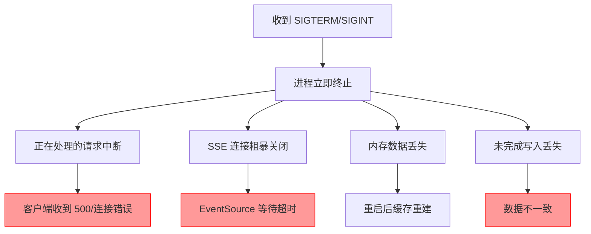
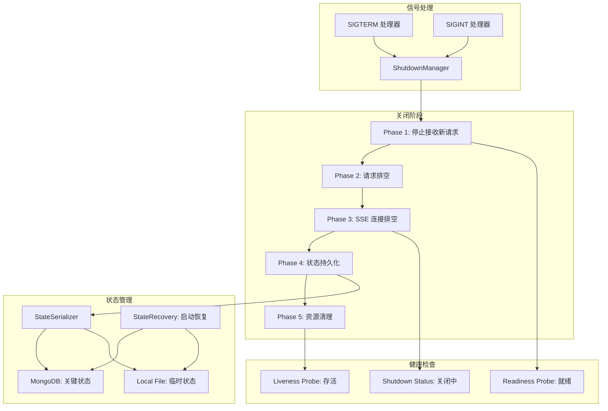
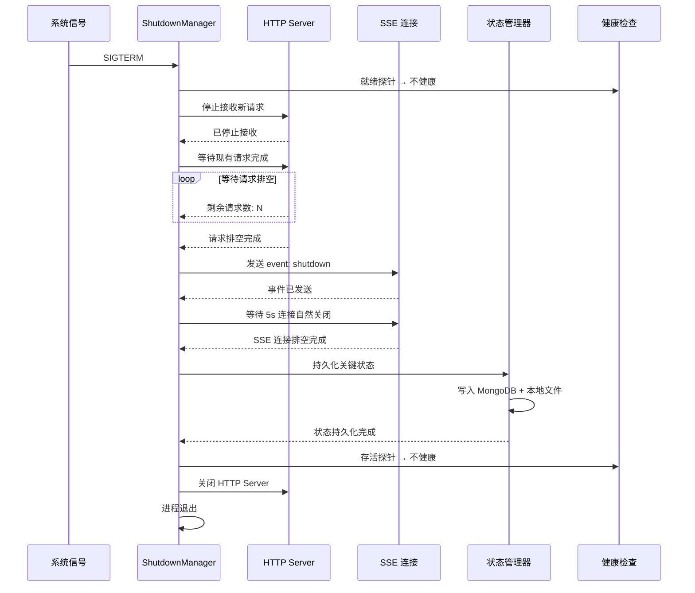

# YA-09-176: 优雅关闭与状态保存 — SIGTERM/SIGINT 处理、请求排空、SSE 连接排空、状态持久化与恢复

> 需求编号：YA-09-176 · 优先级：P2 · 人天：0.3d · 状态：需求已编写
> 依赖：YA-09-24（服务优雅关闭）、YA-09-16（服务健康检查与就绪探针）

## 背景

### 问题陈述

YiAi 当前在进程终止时（如 Ctrl+C、Docker 停止、系统重启）直接退出，导致以下问题：

1. **正在处理的请求中断**：用户正在进行的聊天/搜索请求被强制中断，SSE 连接被粗暴关闭
2. **数据丢失风险**：内存中的缓存数据、未持久化的配置变更、未完成的数据库写入可能丢失
3. **SSE 连接泄漏**：客户端 SSE 连接未被通知关闭，浏览器端持续等待直到超时
4. **服务重启后状态丢失**：重启后无法恢复关闭前的运行时状态（如 Agent 会话上下文、定时任务状态）
5. **健康检查未更新**：关闭期间健康检查仍返回正常，负载均衡器可能继续将流量路由到正在关闭的实例

**核心矛盾**：服务需要随时可以重启（部署、配置变更、异常恢复），但重启过程中不应丢失数据或中断正在进行的请求。

### 影响范围

| # | 影响 | 严重程度 | 典型场景 |
|---|------|----------|----------|
| 1 | 用户请求被中断 | 高 | 部署更新时正在聊天的用户收到连接错误 |
| 2 | 数据可能丢失 | 中 | 缓存中的配置变更未持久化 |
| 3 | SSE 连接泄漏 | 中 | 客户端 EventSource 持续等待直到超时 |
| 4 | 重启后状态丢失 | 中 | Agent 会话上下文丢失 |
| 5 | 健康检查未更新 | 中 | 负载均衡器路由流量到正在关闭的实例 |

### 挑战

| 挑战 | 说明 |
|------|------|
| SSE 连接排空 | SSE 连接是长连接，需要发送关闭事件通知客户端 |
| 优雅关闭超时 | 需要在合理时间内完成关闭（通常 < 30s），超时后强制退出 |
| 状态持久化粒度 | 哪些状态需要持久化、哪些可以丢弃需要精细控制 |
| 状态恢复 | 启动时恢复关闭前的状态，需要处理状态不一致的情况 |
| 多进程环境 | 如使用 Gunicorn/Uvicorn workers，关闭信号需要传播到所有 worker |

---

## 一、现状分析

### 1.1 当前关闭流程

```
YiAi 关闭流程现状:
├── 信号处理
│   ├── SIGTERM: 默认行为（立即终止）
│   ├── SIGINT: 默认行为（立即终止）
│   └── 无自定义信号处理器
├── 请求处理
│   ├── 正在处理的请求: 被强制中断
│   ├── 排队中的请求: 丢失
│   └── SSE 连接: 被粗暴关闭
├── 数据持久化
│   ├── MongoDB: 未完成的写入可能丢失
│   ├── 内存缓存: 丢失
│   └── 配置变更: 丢失（如未持久化到文件）
├── 状态保存
│   ├── 无状态保存机制
│   └── 无启动恢复机制
└── 健康检查
    └── 关闭期间不更新状态

缺失:
├── 自定义信号处理器                 # ❌ 不存在
├── 请求排空 (Drain)                 # ❌ 不存在
├── SSE 连接排空                     # ❌ 不存在
├── 状态持久化                       # ❌ 不存在
├── 启动恢复                         # ❌ 不存在
├── 关闭超时控制                     # ❌ 不存在
└── 关闭期间健康检查                 # ❌ 不存在
```

### 1.2 当前关闭影响分析

| 组件 | 关闭影响 | 严重程度 | 恢复方式 |
|------|----------|----------|----------|
| HTTP 请求 | 正在处理的请求被中断 | 高 | 客户端重试 |
| SSE 连接 | 连接被粗暴关闭 | 高 | 客户端自动重连 |
| MongoDB 写入 | 未完成的写入可能丢失 | 中 | 依赖 MongoDB 事务 |
| 内存缓存 | 全部丢失 | 低 | 重新构建缓存 |
| Ollama 连接 | 推理请求被中断 | 中 | 重启后恢复 |
| 定时任务 | 调度状态丢失 | 中 | 需要重新配置 |
| Agent 会话 | 上下文丢失 | 中 | 用户重新开始会话 |

### 1.3 改造前关闭流程



### 1.4 根因矩阵

| 症状 | 根因 | 触发条件 | 频率 |
|------|------|----------|------|
| 请求被中断 | 无请求排空 | 服务重启 | 每次部署 |
| SSE 连接泄漏 | 无 SSE 排空 | 服务重启 | 每次部署 |
| 数据丢失 | 无状态持久化 | 服务重启 | 每次部署 |
| 状态不可恢复 | 无启动恢复 | 服务重启 | 每次部署 |
| 健康检查不准确 | 无关闭期健康检查 | 服务关闭中 | 每次部署 |

---

## 二、设计决策

### 决策 1：关闭超时策略 — 固定超时 vs 动态超时 vs 无超时

| 选项 | 安全性 | 可用性 | 实现复杂度 |
|------|--------|--------|-----------|
| 固定超时（30s） | 中 | 高 | 低 |
| 动态超时（根据活跃请求数） | 高 | 中 | 中 |
| 无超时 | 低 | 低 | 低 |

**选择：固定超时（30s）+ 动态延长。** 默认 30s 关闭超时，如果仍有活跃的 SSE 连接，延长至连接自然关闭（最长 60s）。超时后强制关闭，确保服务不会无限等待。

### 决策 2：状态持久化方式 — 文件 vs MongoDB vs 两者

| 选项 | 持久性 | 恢复速度 | 一致性 |
|------|--------|----------|--------|
| 文件（JSON/Pickle） | 中 | 高 | 中 |
| MongoDB | 高 | 中 | 高 |
| 两者（关键状态 MongoDB + 临时状态文件） | 高 | 高 | 高 |

**选择：两者。** 关键状态（Agent 会话上下文、定时任务配置）持久化到 MongoDB。临时状态（缓存数据、请求计数）持久化到本地文件。启动时优先从 MongoDB 恢复，本地文件作为补充。

### 决策 3：SSE 连接排空方式 — 发送关闭事件 vs 等待自然关闭 vs 两者

| 选项 | 客户端体验 | 关闭速度 | 实现复杂度 |
|------|-----------|----------|-----------|
| 发送 `event: shutdown` 事件 | 高 | 快 | 低 |
| 等待所有 SSE 连接自然关闭 | 中 | 慢 | 低 |
| 两者（先发事件，再等待） | 高 | 中 | 低 |

**选择：两者。** 先向所有活跃 SSE 连接发送 `event: shutdown` 事件（客户端收到后自动重连），然后等待 5s 让客户端处理，超时后强制关闭连接。

### 决策 4：健康检查关闭策略 — 立即返回不健康 vs 渐进式 vs 延迟

| 选项 | 流量切换速度 | 请求丢失风险 | 实现复杂度 |
|------|------------|-------------|-----------|
| 立即返回不健康（503） | 快 | 低 | 低 |
| 渐进式（先返回降级，再返回不健康） | 中 | 低 | 中 |
| 延迟返回不健康 | 慢 | 高 | 低 |

**选择：渐进式。** 收到关闭信号后：立即将就绪探针设为不健康（停止接收新请求），存活探针保持健康（等待现有请求完成），关闭完成后存活探针也设为不健康。

### 设计决策记录

| 决策 | 选项 A | 选项 B | 选项 C | 选择 | 理由 |
|------|--------|--------|--------|------|------|
| 关闭超时 | 固定 30s | 动态 | 无超时 | **固定 + 动态延长** | 安全 + 灵活 |
| 状态持久化 | 文件 | MongoDB | 两者 | **两者** | 关键 + 临时 |
| SSE 排空 | 发送事件 | 等待 | 两者 | **两者** | 体验 + 速度 |
| 健康检查 | 立即不健康 | 渐进式 | 延迟 | **渐进式** | 平滑切换 |

---

## 三、目标架构

### 3.1 优雅关闭架构



### 3.2 优雅关闭时序



### 3.3 性能指标

| 指标 | 目标值 | 说明 |
|------|--------|------|
| 请求排空时间 | < 10s | 正常 HTTP 请求完成 |
| SSE 排空时间 | < 5s | 发送关闭事件 + 等待 |
| 状态持久化时间 | < 5s | MongoDB + 文件写入 |
| 总关闭时间 | < 30s | 所有阶段完成 |
| 启动恢复时间 | < 5s | 从 MongoDB/文件恢复状态 |

---

## 四、具体改动

### 4.1 优雅关闭管理器

```python
# core/shutdown_manager.py (新增)

import asyncio
import signal
import logging
from enum import Enum
from typing import Optional

logger = logging.getLogger(__name__)

class ShutdownPhase(Enum):
    IDLE = "idle"
    STOP_ACCEPTING = "stop_accepting"
    DRAINING_REQUESTS = "draining_requests"
    DRAINING_SSE = "draining_sse"
    PERSISTING_STATE = "persisting_state"
    CLEANING_UP = "cleaning_up"
    COMPLETED = "completed"

class ShutdownManager:
    def __init__(
        self,
        drain_timeout: float = 30.0,
        sse_drain_timeout: float = 5.0,
        state_persist_timeout: float = 5.0,
    ):
        self.drain_timeout = drain_timeout
        self.sse_drain_timeout = sse_drain_timeout
        self.state_persist_timeout = state_persist_timeout

        self._phase = ShutdownPhase.IDLE
        self._shutdown_event = asyncio.Event()
        self._active_requests: set[asyncio.Task] = set()
        self._sse_connections: list[asyncio.StreamWriter] = []
        self._is_ready = True
        self._is_alive = True

    @property
    def is_shutting_down(self) -> bool:
        return self._phase != ShutdownPhase.IDLE

    @property
    def is_ready(self) -> bool:
        return self._is_ready and not self.is_shutting_down

    @property
    def is_alive(self) -> bool:
        return self._is_alive

    def register_signal_handlers(self):
        """注册 POSIX 信号处理器"""
        loop = asyncio.get_event_loop()
        for sig in (signal.SIGTERM, signal.SIGINT):
            loop.add_signal_handler(
                sig,
                lambda s=sig: asyncio.create_task(self._handle_signal(s))
            )

    async def _handle_signal(self, sig: signal.Signals):
        """处理关闭信号"""
        logger.info(f"收到信号 {sig.name}，开始优雅关闭")

        try:
            await self.shutdown()
        except Exception as e:
            logger.error(f"优雅关闭失败: {e}")
            self._force_exit()

    async def shutdown(self):
        """执行五阶段优雅关闭"""
        # Phase 1: 停止接收新请求
        self._phase = ShutdownPhase.STOP_ACCEPTING
        self._is_ready = False
        logger.info("Phase 1: 停止接收新请求")

        # Phase 2: 请求排空
        self._phase = ShutdownPhase.DRAINING_REQUESTS
        logger.info(f"Phase 2: 排空 {len(self._active_requests)} 个活跃请求")
        try:
            await asyncio.wait_for(
                self._drain_requests(),
                timeout=self.drain_timeout,
            )
        except asyncio.TimeoutError:
            logger.warning("请求排空超时，强制关闭")

        # Phase 3: SSE 连接排空
        self._phase = ShutdownPhase.DRAINING_SSE
        logger.info(f"Phase 3: 排空 {len(self._sse_connections)} 个 SSE 连接")
        await self._drain_sse()

        # Phase 4: 状态持久化
        self._phase = ShutdownPhase.PERSISTING_STATE
        logger.info("Phase 4: 持久化状态")
        try:
            await asyncio.wait_for(
                self._persist_state(),
                timeout=self.state_persist_timeout,
            )
        except asyncio.TimeoutError:
            logger.warning("状态持久化超时")

        # Phase 5: 资源清理
        self._phase = ShutdownPhase.CLEANING_UP
        self._is_alive = False
        logger.info("Phase 5: 清理资源")
        await self._cleanup()

        self._phase = ShutdownPhase.COMPLETED
        logger.info("优雅关闭完成")

    async def _drain_requests(self):
        """等待所有活跃请求完成"""
        if self._active_requests:
            await asyncio.gather(*self._active_requests, return_exceptions=True)

    async def _drain_sse(self):
        """排空 SSE 连接"""
        # 发送关闭事件
        for writer in self._sse_connections:
            try:
                writer.write(b"event: shutdown\ndata: {}\n\n")
                await writer.drain()
            except Exception:
                pass

        # 等待客户端处理
        await asyncio.sleep(self.sse_drain_timeout)

        # 强制关闭连接
        for writer in self._sse_connections:
            try:
                writer.close()
            except Exception:
                pass

    async def _persist_state(self):
        """持久化运行时状态"""
        from services.state_persistence import StatePersistenceService
        await StatePersistenceService().save_all()

    async def _cleanup(self):
        """清理资源"""
        # 关闭 MongoDB 连接
        # 关闭 HTTP 客户端
        # 关闭 Ollama 连接
        pass

    def _force_exit(self):
        """强制退出"""
        logger.warning("强制退出")
        self._is_alive = False
        self._is_ready = False
        import sys
        sys.exit(1)
```

### 4.2 状态持久化服务

```python
# services/state_persistence.py (新增)

from dataclasses import dataclass, asdict
from typing import Any
import json
import os

@dataclass
class RuntimeState:
    """运行时状态快照"""
    timestamp: str
    version: str
    active_sessions: list[dict]       # Agent 会话上下文
    scheduled_tasks: list[dict]       # 定时任务状态
    knowledge_watcher_state: dict     # 知识监视器状态
    cache_stats: dict                 # 缓存统计
    request_counters: dict            # 请求计数器

class StatePersistenceService:
    STATE_FILE = "data/runtime_state.json"

    async def save_all(self):
        """保存所有运行时状态"""
        state = RuntimeState(
            timestamp=datetime.now().isoformat(),
            version="1.0",
            active_sessions=await self._collect_sessions(),
            scheduled_tasks=await self._collect_tasks(),
            knowledge_watcher_state=await self._collect_knowledge_state(),
            cache_stats=await self._collect_cache_stats(),
            request_counters=await self._collect_request_counters(),
        )

        # 保存到本地文件
        os.makedirs(os.path.dirname(self.STATE_FILE), exist_ok=True)
        with open(self.STATE_FILE, "w") as f:
            json.dump(asdict(state), f, indent=2, default=str)

        # 保存关键状态到 MongoDB
        await self._save_to_mongo(state)

    async def restore_all(self) -> Optional[RuntimeState]:
        """启动时恢复运行时状态"""
        # 优先从 MongoDB 恢复
        mongo_state = await self._restore_from_mongo()
        if mongo_state:
            return mongo_state

        # 降级到本地文件
        if os.path.exists(self.STATE_FILE):
            with open(self.STATE_FILE, "r") as f:
                data = json.load(f)
            return RuntimeState(**data)

        return None

    async def _save_to_mongo(self, state: RuntimeState):
        """保存关键状态到 MongoDB"""
        from data.repository import get_collection
        collection = get_collection("runtime_state")
        await collection.update_one(
            {"_id": "current"},
            {"$set": {
                "active_sessions": state.active_sessions,
                "scheduled_tasks": state.scheduled_tasks,
                "updated_at": state.timestamp,
            }},
            upsert=True,
        )

    async def _restore_from_mongo(self) -> Optional[RuntimeState]:
        """从 MongoDB 恢复状态"""
        from data.repository import get_collection
        collection = get_collection("runtime_state")
        doc = await collection.find_one({"_id": "current"})
        if doc:
            return RuntimeState(
                timestamp=doc.get("updated_at", ""),
                version="1.0",
                active_sessions=doc.get("active_sessions", []),
                scheduled_tasks=doc.get("scheduled_tasks", []),
                knowledge_watcher_state={},
                cache_stats={},
                request_counters={},
            )
        return None
```

### 4.3 文件变更清单

| 文件 | 操作 | 说明 |
|------|------|------|
| `core/shutdown_manager.py` | 新增 | 优雅关闭管理器 |
| `services/state_persistence.py` | 新增 | 状态持久化服务 |
| `services/health_check.py` | 修改 | 添加关闭期健康检查 |
| `main.py` | 修改 | 初始化 ShutdownManager |
| `api/middleware/request_tracker.py` | 新增 | 请求追踪中间件 |
| `api/middleware/sse_tracker.py` | 新增 | SSE 连接追踪中间件 |
| `tests/test_shutdown.py` | 新增 | 优雅关闭测试 |
| `tests/test_state_persistence.py` | 新增 | 状态持久化测试 |

---

## 五、实施步骤

| 步骤 | 操作 | 路径 | 验证 | 人天 |
|------|------|------|------|------|
| 1 | 实现 ShutdownManager | `core/shutdown_manager.py` | 五阶段优雅关闭 | 0.1 |
| 2 | 实现请求追踪中间件 | `api/middleware/request_tracker.py` | 追踪活跃请求数 | 0.03 |
| 3 | 实现 SSE 连接追踪 | `api/middleware/sse_tracker.py` | 追踪 SSE 连接 | 0.03 |
| 4 | 实现状态持久化服务 | `services/state_persistence.py` | 保存/恢复状态 | 0.05 |
| 5 | 实现启动恢复 | `main.py` | 启动时恢复状态 | 0.03 |
| 6 | 更新健康检查 | `services/health_check.py` | 关闭期健康检查 | 0.03 |
| 7 | 集成到 main.py | `main.py` | 注册信号处理器 | 0.03 |

**总人天：0.3d**

---

## 六、测试规格

### 场景 1：正常优雅关闭

**GIVEN** YiAi 正在运行，有 3 个活跃请求和 2 个 SSE 连接
**WHEN** 发送 SIGTERM 信号
**THEN** 应立即停止接收新请求
**AND** 应等待现有请求完成（最长 30s）
**AND** 应向 SSE 连接发送 event: shutdown
**AND** 应持久化运行时状态
**AND** 应正常退出

### 场景 2：关闭超时强制退出

**GIVEN** YiAi 正在运行，有 1 个请求已运行 60s
**WHEN** 发送 SIGTERM 信号
**THEN** 应在 30s 超时后强制关闭
**AND** 应记录超时警告日志
**AND** 应尽可能持久化状态

### 场景 3：SSE 连接排空

**GIVEN** YiAi 有 5 个活跃 SSE 连接
**WHEN** 收到关闭信号
**THEN** 应向每个 SSE 连接发送 event: shutdown
**AND** 应等待 5s 让客户端处理
**AND** 5s 后应强制关闭剩余连接

### 场景 4：状态持久化与恢复

**GIVEN** YiAi 关闭时保存了运行时状态
**WHEN** YiAi 重新启动
**THEN** 应从 MongoDB 恢复 Agent 会话上下文
**AND** 应从 MongoDB 恢复定时任务状态
**AND** 如 MongoDB 不可用，应从本地文件恢复

### 场景 5：健康检查关闭

**GIVEN** YiAi 收到关闭信号
**WHEN** 就绪探针被查询
**THEN** 应返回 503（不健康）
**WHEN** 存活探针被查询（关闭未完成时）
**THEN** 应返回 200（存活）
**WHEN** 存活探针被查询（关闭完成后）
**THEN** 应返回 503（不存活）

### 场景 6：双信号处理

**GIVEN** YiAi 正在执行优雅关闭
**WHEN** 再次收到 SIGTERM 或 SIGINT
**THEN** 应立即强制退出
**AND** 不应等待请求排空

---

## 七、风险与缓解

| 风险 | 概率 | 影响 | 缓解措施 |
|------|------|------|----------|
| 请求排空超时导致部分请求丢失 | 中 | 中 | 客户端重试机制 + 30s 超时 |
| 状态持久化时 MongoDB 不可用 | 低 | 中 | 降级到本地文件持久化 |
| SSE 客户端未处理 event: shutdown | 中 | 低 | 5s 后强制关闭，客户端需实现自动重连 |
| 状态恢复时数据不一致 | 低 | 中 | 恢复时校验数据完整性，不一致时丢弃 |
| 多进程环境信号传播 | 低 | 中 | Uvicorn 自动向所有 worker 传播 SIGTERM |

---

## 八、回滚策略

| 场景 | 回滚操作 | 影响 |
|------|----------|------|
| 优雅关闭导致启动变慢 | 禁用状态恢复，仅保留信号处理 | 失去状态恢复 |
| 请求排空超时过长 | 降低超时时间至 15s | 请求丢失风险增加 |
| 状态持久化失败 | 禁用状态持久化，仅保留请求排空 | 失去状态恢复 |
| 信号处理器异常 | 移除自定义信号处理器，恢复默认行为 | 失去优雅关闭 |

---

## 九、设计决策记录

### D-01：关闭超时默认值

- **问题**：请求排空的默认超时时间
- **选项**：10s、30s、60s、120s
- **选择**：30s
- **理由**：30s 足够大多数 HTTP 请求完成，Kubernetes 默认 terminationGracePeriodSeconds 也是 30s

### D-02：状态持久化文件路径

- **问题**：运行时状态文件的存储路径
- **选项**：`/tmp/yiai_state.json`、`data/runtime_state.json`、`~/.yiai/state.json`
- **选择**：`data/runtime_state.json`
- **理由**：与 YiAi 数据目录一致，便于备份和管理

### D-03：SSE 排空等待时间

- **问题**：发送 event: shutdown 后等待客户端的时间
- **选项**：1s、3s、5s、10s
- **选择**：5s
- **理由**：5s 足够客户端接收事件并开始重连，同时不会显著延长关闭时间

### D-04：双信号处理策略

- **问题**：优雅关闭期间收到第二个关闭信号的处理方式
- **选项**：忽略、排队、立即强制退出
- **选择**：立即强制退出
- **理由**：用户明确要求快速关闭（如 Docker 紧急停止），强制退出是最安全的选择

---

## 十、可观测性

### 指标

| 指标 | 类型 | 说明 |
|------|------|------|
| `yiai.shutdown.count` | Counter | 关闭次数（按信号类型） |
| `yiai.shutdown.duration` | Histogram | 关闭总耗时 |
| `yiai.shutdown.drain_duration` | Histogram | 请求排空耗时 |
| `yiai.shutdown.sse_drain_count` | Counter | SSE 连接排空数 |
| `yiai.shutdown.state_persist_duration` | Histogram | 状态持久化耗时 |
| `yiai.shutdown.timeout_count` | Counter | 关闭超时次数 |

### 告警

| 告警 | 条件 | 级别 |
|------|------|------|
| 关闭超时 | 关闭耗时 > 30s | WARNING |
| 状态持久化失败 | 状态保存失败 | ERROR |
| 启动恢复失败 | 状态恢复失败 | WARNING |
| 短时间内多次关闭 | 5min 内 > 3 次 | WARNING |

---

## 十一、代码审查检查清单

- [ ] ShutdownManager 注册 SIGTERM 和 SIGINT 信号处理器
- [ ] 五阶段优雅关闭：停止接收 → 请求排空 → SSE 排空 → 状态持久化 → 资源清理
- [ ] 请求排空超时 30s，超时后强制退出
- [ ] SSE 连接排空：发送 event: shutdown + 等待 5s
- [ ] 状态持久化：关键状态到 MongoDB + 临时状态到本地文件
- [ ] 启动恢复：优先 MongoDB，降级到本地文件
- [ ] 健康检查：就绪探针在关闭开始时变为不健康，存活探针在关闭完成时变为不健康
- [ ] 双信号处理：第二个信号触发强制退出
- [ ] 请求追踪中间件：追踪所有活跃请求
- [ ] SSE 连接追踪中间件：追踪所有活跃 SSE 连接
- [ ] 单元测试覆盖所有关闭阶段和超时场景

---

## 回归问题预测

| # | 预测问题 | 原因 | 验证方法 |
|---|---------|------|---------|
| 1 | 优雅关闭时持久化 Agent 会话上下文，但会话中的消息流（SSE）正在传输中，持久化的是不完整的上下文 | 状态持久化在 Phase 4 执行，但 SSE 连接的流式传输在 Phase 3 已中断，导致会话上下文不完整 | 在 SSE 流式传输过程中触发关闭，恢复后验证 Agent 会话上下文标记了不完整状态 |
| 2 | 启动恢复时从 MongoDB 读取的 Agent 会话引用了已删除的文档，恢复后会话无法正常继续 | 关闭时保存的会话引用了知识库文档 ID，但关闭期间文档可能被删除 | 恢复 Agent 会话时验证引用的文档是否存在，验证不存在的引用被标记为失效 |
| 3 | 请求排空时，某些请求使用了异步生成器（SSE），`asyncio.gather` 等待 SSE 请求完成但 SSE 是无限流 | 请求追踪中间件将 SSE 请求视为普通请求，但 SSE 请求的 Future 不会自然完成 | 在请求排空阶段，验证 SSE 请求被正确识别并跳过（由 Phase 3 专门处理） |
| 4 | 状态持久化写入本地文件时磁盘空间不足，json.dump 抛出 OSError 但未被捕获 | 本地文件写入未检查磁盘空间，写入失败时异常向上传播 | 模拟磁盘空间不足，验证状态持久化降级为仅 MongoDB 写入 |
| 5 | 多进程（Uvicorn workers）环境下，每个 worker 独立执行状态持久化，导致 MongoDB 中的状态被多次覆盖 | 每个 worker 都收到 SIGTERM 并独立执行 ShutdownManager，未进行协调 | 使用 2+ workers 启动，触发关闭，验证 MongoDB 中状态仅写入一次 |
| 6 | 启动恢复时，上一次关闭的状态文件损坏（如关闭时断电），json.load 抛出 JSONDecodeError | 状态文件写入过程中断电，文件不完整 | 模拟损坏的状态文件，验证启动恢复有 JSON 解析错误处理并降级 |

---

## 性能分析

### 优雅关闭关键操作耗时

| 操作 | 耗时 | 说明 |
|------|------|------|
| 停止接收新请求 | < 10ms | 设置就绪标志 |
| 请求排空（正常） | < 5s | 大部分请求在 1s 内完成 |
| 请求排空（有慢请求） | < 30s | 超时后强制退出 |
| SSE 发送事件 | < 10ms/连接 | 写入 event: shutdown |
| SSE 等待 | 5s | 固定等待 |
| 状态持久化（本地文件） | < 50ms | JSON 写入 |
| 状态持久化（MongoDB） | < 500ms | 网络写入 |
| 资源清理 | < 100ms | 关闭连接 |
| 总关闭时间（正常） | < 10s | 所有阶段 |
| 总关闭时间（最坏） | < 30s | 请求排空超时 |

### 数据量预估

| 模块 | 数据项 | 大小 |
|------|--------|------|
| 运行时状态文件 | Agent 会话 + 定时任务 + 缓存统计 | ~100KB |
| MongoDB 状态文档 | 关键状态快照 | ~50KB |
| 请求追踪集合 | 内存中的 Task 引用 | ~1KB |

### 对系统的影响

| 场景 | 系统影响 | 说明 |
|------|----------|------|
| 正常关闭 | 用户感知 < 10s 不可用 | 快速重启 |
| 有慢请求关闭 | 最长 30s 不可用 | 超时强制退出 |
| 启动恢复 | 额外 < 5s 启动时间 | 状态恢复 |

---

## 相关文档

- [服务优雅关闭](../24-需求-服务优雅关闭.md) — 优雅关闭的早期设计
- [服务健康检查与就绪探针](../16-需求-服务健康检查与就绪探针.md) — 健康检查的实现
- [Docker 多阶段构建](../40-需求-Docker多阶段构建.md) — 容器化部署的关闭考虑

*PRD 来源: `projects/yiai/requirements/2026-09/176-需求-优雅关闭与状态保存.md`*

## 影响范围

- **影响模块**：待补充
- **涉及文件**：
- `main.py`
- **是否影响 API 契约**：否
- **是否影响其他项目（YiVad/YiPet）**：否
- **用户感知**：待确认

## 预防措施

| 层面 | 措施 |
|------|------|
| 代码 | 在相关函数中添加参数校验和边界检查 |
| 测试 | 为 `main.py` 添加单元测试 |
| 流程 | 代码审查时重点检查此类模式 |
| 监控 | 添加日志告警，异常发生时及时发现 |
| 文档 | 在编码规范中记录此类反模式 |

## 经验教训

1. **根本原因**：开发过程中对边界情况和异常路径的考虑不足是此类问题的共同根因
2. **设计阶段**：在接口设计和模块实现时，应主动考虑异常输入、空值、超时等边界场景
3. **代码审查**：审查时应检查是否存在类似的反模式（如未捕获异常、无超时控制、缺少参数校验等）
4. **测试覆盖**：异常路径的测试覆盖率应与正常路径同等重视
5. **团队分享**：此类问题应在团队周会或技术分享中讨论，形成团队共识
