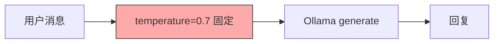
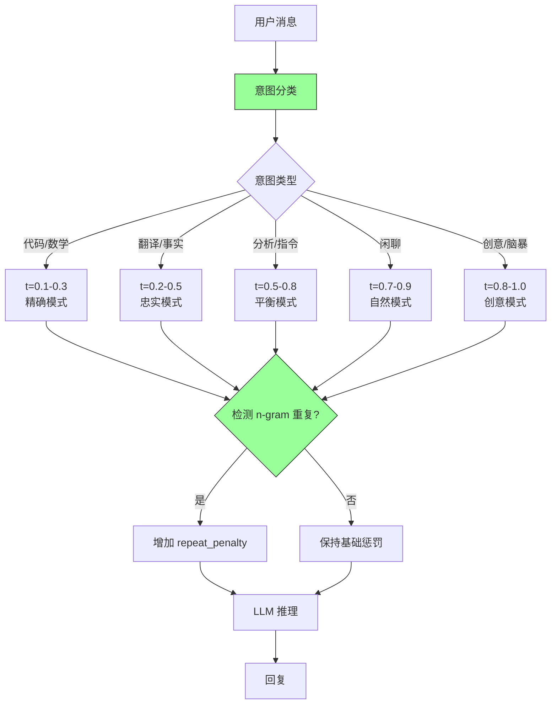

# 自适应温度采样

## 一、背景 (Background)

当前所有 LLM 推理请求使用固定 temperature=0.7，忽视请求意图差异，导致：

| 场景 | 期望 | 实际 (t=0.7) | 问题 |
|------|------|-------------|------|
| 代码生成 | 确定性、语法正确 | 中等随机性 | 出现语法错误、不一致的变量名 |
| 数学推理 | 精确、无幻觉 | 中等随机性 | 可能产生错误答案 |
| 创意写作 | 多样、有创意 | 保守 | 输出平庸、缺乏文采 |
| 翻译 | 忠实原文 | 中等随机性 | 可能出现意译偏差 |
| 闲聊 | 自然、多样化 | 中等 | 连续多轮后重复 |

此外，同一会话中连续生成相似回复（n-gram 重复），用户多次 Regenerate 得到相似回答。

## 二、现状与目标 (Current State & Target State)

### 现状：恒定温度



### 目标：自适应温度



## 三、功能需求 (Functional Requirements)

### FR-01: 意图分类器 (Intent Classifier)
- **10 种意图类型**:
  | 意图 | temperature | top_p | repeat_penalty | 适用场景 |
  |------|-------------|-------|-----------------|----------|
  | factual_qa | 0.2 | 0.9 | 1.05 | 事实问答、历史查询 |
  | code_generation | 0.1 | 0.95 | 1.0 | 生成代码、SQL |
  | creative_writing | 0.9 | 0.95 | 1.15 | 写诗、故事、文案 |
  | analysis | 0.5 | 0.9 | 1.05 | 数据分析、推理 |
  | translation | 0.3 | 0.95 | 1.0 | 中英互译 |
  | summarization | 0.4 | 0.9 | 1.05 | 文档摘要 |
  | brainstorming | 0.85 | 0.95 | 1.1 | 头脑风暴、创意 |
  | instruction | 0.4 | 0.9 | 1.05 | 执行指令、操作 |
  | chitchat | 0.8 | 0.95 | 1.1 | 闲聊、寒暄 |
  | unknown | 0.7 | 0.9 | 1.1 | 未识别意图 |

- **分类方式**: 优先关键词正则匹配 → 回退 LLM 小模型分类 (qwen2.5:1.5b)
- **分类延迟**: < 50ms (正则) / < 200ms (LLM)
- **置信度**: 正则 > 0.9; LLM < 0.7 回退到 unknown

### FR-02: 对话阶段感知 (Dialogue Phase Detection)
- **三阶段模型**:
  - **探索阶段 (Exploration)**: 对话初期，话题未收敛 → +0.1 temperature
  - **收敛阶段 (Convergence)**: 用户追问细节，需精确 → -0.1 temperature
  - **稳定阶段 (Stable)**: 常规对话，保持预设 → 不变
- **判断规则**:
  - 新会话 / 意图转移 → exploration
  - 连续 3 轮同一意图且每轮字数递增 → convergence
  - 其余 → stable

### FR-03: 自适应重复惩罚 (Adaptive Repeat Penalty)
- **检测指标**:
  - bigram 重复率 > 30% → 增加 penalty
  - trigram 重复率 > 20% → 大幅增加 penalty
  - 4-gram 完全重复 → 最大 penalty
- **调整算法**:
  ```python
  def adaptive_penalty(base_penalty: float, bigram_rate: float, trigram_rate: float):
      penalty = base_penalty
      if bigram_rate > 0.3:
          penalty += 0.05
      if trigram_rate > 0.2:
          penalty += 0.1
      if bigram_rate > 0.5:
          penalty += 0.1
      return min(penalty, 1.5)  # 上限 1.5
  ```
- **恢复**: 连续 3 轮 bigram_rate < 15% → 恢复基础惩罚

### FR-04: 用户手动覆盖 (User Override)
- **前端滑块**: 0-2 范围，标记 "精确"/"平衡"/"创意"
- **覆盖规则**: 用户手动设置后，不再自动调整 temperature
- **重置**: 新会话时清除手动设置
- **持久化**: 用户偏好存储到 localStorage

### FR-05: 效果追踪 (Effectiveness Tracking)
- **追踪指标**: temperature → 用户满意度 (feedback thumbs_up/down 率)
- **聚合**: 按意图 × 温度区间 每天聚合
- **存储**: MongoDB `temperature_analytics` 集合
- **分析**: 每周分析最优温度区间，调整预设表

## 四、数据模型 (Data Model)

### IntentCategory 枚举
```python
class IntentCategory(str, Enum):
    FACTUAL_QA = "factual_qa"
    CODE_GENERATION = "code_generation"
    CREATIVE_WRITING = "creative_writing"
    ANALYSIS = "analysis"
    TRANSLATION = "translation"
    SUMMARIZATION = "summarization"
    BRAINSTORMING = "brainstorming"
    INSTRUCTION = "instruction"
    CHITCHAT = "chitchat"
    UNKNOWN = "unknown"
```

### TemperaturePreset (Pydantic)
```python
class TemperaturePreset(BaseModel):
    intent: IntentCategory
    temperature: float = Field(ge=0.0, le=2.0)
    top_p: float = Field(ge=0.0, le=1.0)
    top_k: int = Field(ge=1, le=100)
    repeat_penalty: float = Field(ge=1.0, le=2.0)
    description: str
```

### DiversityMetrics (监控)
```python
class DiversityMetrics(BaseModel):
    bigram_repeat_rate: float     # 0.0-1.0
    trigram_repeat_rate: float
    avg_sentence_length: float
    distinct_2_gram_ratio: float  # Self-BLEU 简化版
    repetition_detected: bool
```

### temperature_analytics 集合
```python
{
    "_id": ObjectId,
    "date": "2026-09-23",
    "intent": "creative_writing",
    "temperature_bucket": "0.8-1.0",
    "total_requests": 150,
    "thumbs_up": 120,
    "thumbs_down": 8,
    "satisfaction_rate": 0.94,
    "avg_tokens": 342,
    "avg_repitition_score": 0.12
}
```

## 五、设计决策 (Design Decisions)

| 决策 | 方案 | 原因 |
|------|------|------|
| 意图分类优先级 | 正则 > LLM > unknown | 正则快且准确，LLM 兜底复杂意图 |
| 对话阶段调整幅度 | ±0.1 temperature | 避免频繁大幅调整导致输出不稳定 |
| 重复惩罚上限 | 1.5 | 超过 1.5 导致输出不自然 |
| 用户覆盖策略 | 手动覆盖优先，新会话重置 | 尊重用户意图，一个会话内一致性 |
| 效果追踪粒度 | 按天 × 意图 × 温度桶 | 足够聚合分析，避免数据稀疏 |

## 六、验收标准 (Acceptance Criteria)

- [ ] AC-01: 10 种意图正确分类，准确率 > 80%
- [ ] AC-02: 代码生成自动使用 t=0.1，创意写作使用 t=0.9
- [ ] AC-03: 对话阶段正确切换 (exploration → convergence → stable)
- [ ] AC-04: bigram 重复率 > 30% 时自动增加 repeat_penalty
- [ ] AC-05: 重复惩罚连续 3 轮正常后恢复基础值
- [ ] AC-06: 用户手动设置温度后不再自动调整
- [ ] AC-07: 意图分类延迟 < 200ms (LLM) / < 50ms (正则)
- [ ] AC-08: 前端滑块 0-2 实时显示 temperature 和标签
- [ ] AC-09: 效果追踪数据正确写入 temperature_analytics
- [ ] AC-10: 新会话清除用户手动设置

## 七、风险 (Risks)

| 风险 | 概率 | 影响 | 缓解措施 |
|------|------|------|----------|
| 意图分类错误导致温度不当 | 中 | 中 | 低置信度 (< 0.7) 回退 unknown；用户可覆盖 |
| 温度频繁调整导致输出不稳定 | 低 | 中 | 阶段调整幅度 ±0.1；相邻两轮差距 < 0.3 |
| 重复惩罚过高输出不自然 | 低 | 中 | 上限 1.5；正常时恢复至基础值 |
| 中文短文本重复检测不准确 | 中 | 低 | 短文本 (< 50 字) 放宽阈值 |
| 意图分类延迟影响体验 | 低 | 低 | 正则优先 (< 50ms)；LLM 仅兜底 |

## 八、里程碑

| 阶段 | 内容 | 人天 |
|------|------|------|
| M1 | 意图分类器 + 10 种预设表 | 0.1 |
| M2 | 对话阶段感知 | 0.05 |
| M3 | 自适应重复惩罚 | 0.05 |
| M4 | 用户覆盖 + 前端滑块集成 | 0.05 |
| M5 | 效果追踪 + 分析 | 0.05 |
| **总计** | | **0.3d** |