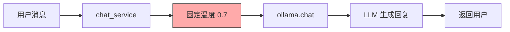
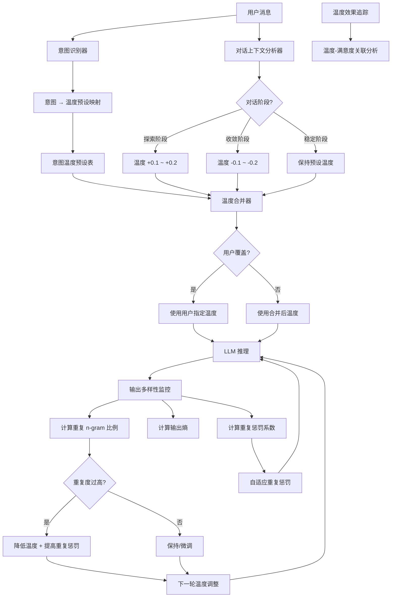
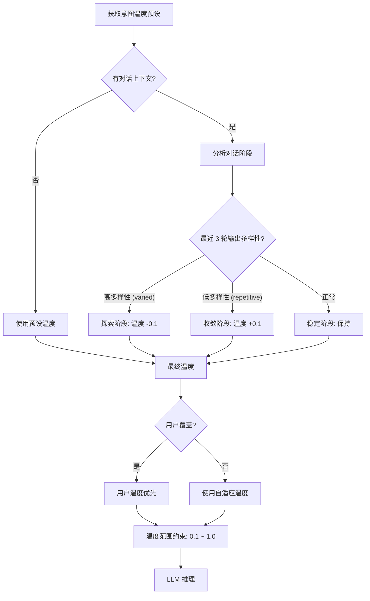

# YA-09-177: 自适应温度采样 — 基于上下文动态调整采样温度、意图温度预设与自适应重复惩罚

> 需求编号：YA-09-177 · 优先级：P2 · 人天：0.3d · 状态：需求已编写
> 依赖：聊天服务（chat_service）、LLM 推理（ollama）、意图识别

## 背景

YiAi 当前所有 LLM 调用使用统一的固定温度参数（通常为 0.7），存在以下问题：

- **无任务感知**：事实查询（需要精确性）和创意写作（需要多样性）使用相同的温度，导致前者出现幻觉、后者输出过于平淡
- **无上下文自适应**：无法根据对话阶段动态调整——探索阶段需要高温度、收敛阶段需要低温度
- **无输出多样性监控**：无法检测输出是否过于重复或过于发散，缺乏基于熵的自动调优
- **无意图温度预设**：每次调用需手动指定温度，缺乏"代码生成→低温度"、"创意写作→高温度"的自动映射
- **无用户偏好覆盖**：用户无法在对话中临时调整温度偏好（如"请更精确一些"）
- **无温度效果追踪**：无法评估不同温度设置对用户满意度的实际影响
- **重复惩罚固定**：`repeat_penalty` 参数固定，无法根据输出重复程度自适应调整

需要一个**自适应温度采样系统**，在 LLM 推理前根据任务意图和上下文动态选择温度，实时监控输出多样性并自动调优，支持用户覆盖，并追踪温度设置的有效性。

---

## 一、现状分析

### 1.1 当前温度使用方式



所有请求使用相同的温度参数，无任务区分，无动态调整，无输出多样性监控。

### 1.2 当前问题

| # | 问题 | 严重程度 | 影响 |
|---|------|----------|------|
| 1 | 温度无任务感知 | 高 | 事实型任务使用高温度导致幻觉，创意型任务使用低温度导致输出平淡 |
| 2 | 无上下文自适应 | 高 | 对话初期探索阶段和后期收敛阶段无法区分，浪费 token 或错过好答案 |
| 3 | 无输出多样性监控 | 中 | 无法检测生成内容是否过于重复，重复惩罚固定 |
| 4 | 无意图温度预设 | 中 | 每次调用需手动指定温度，无法自动匹配最佳温度 |
| 5 | 无用户偏好覆盖 | 中 | 用户无法在对话中临时调整温度，缺乏细粒度控制 |
| 6 | 无温度效果追踪 | 低 | 无法评估温度设置是否提升了用户满意度 |
| 7 | 重复惩罚固定 | 中 | 固定 `repeat_penalty` 无法适应不同长度的输出和重复模式 |

### 1.3 改造前 API 依赖

| # | 接口 | 调用方 | 说明 |
|---|------|--------|------|
| 1 | `chat_service.chat` | 前端 | 多轮对话，固定 temperature=0.7 |
| 2 | `ollama.chat` | chat_service | LLM 推理，temperature 和 repeat_penalty 固定 |

> 改造前仅 2 个 API 依赖，无温度管理模块。

### 1.4 设计灵感

参考 OpenAI 的 temperature 和 top_p 组合策略、Anthropic 的 Claude 温度建议（0.0-1.0）、Google Gemini 的自适应温度。核心思路：意图识别 → 温度预设映射 → 上下文自适应调整 → 输出多样性监控 → 自动调优 → 用户覆盖 → 效果追踪。

---

## 二、设计决策

### 决策 1：温度调整机制 — 基于意图预设 vs 实时内容分析 vs 用户显式指定

| 维度 | 基于意图预设 | 实时内容分析 | 用户显式指定 |
|------|------------|------------|------------|
| 延迟 | 低（一次分类） | 中（需分析上下文） | 无 |
| 准确率 | 中（意图分类可能误判） | 高（基于实际内容） | 高（用户明确意图） |
| 实现复杂度 | 低 | 中 | 低 |
| 覆盖范围 | 高（所有请求） | 中（仅限有上下文的） | 低（用户不一定操作） |

**选择：意图预设 + 上下文自适应 + 用户覆盖，三级优先级。** 意图预设作为默认值（首次调用），上下文自适应基于对话阶段动态调整（后续调用），用户覆盖具有最高优先级。三级策略确保"默认聪明、动态调整、用户可控"。

### 决策 2：输出多样性测量 — 熵计算 vs 重复 n-gram 比例 vs 语义去重

| 维度 | 熵计算 | 重复 n-gram 比例 | 语义去重 |
|------|--------|-----------------|---------|
| 计算速度 | 快（< 1ms） | 快（< 5ms） | 慢（需 Embedding） |
| 准确性 | 中（对长度敏感） | 高（直接检测重复） | 高（语义层面） |
| 多语言支持 | 好 | 好 | 取决于 Embedding 模型 |
| 实现复杂度 | 低 | 低 | 中 |

**选择：重复 n-gram 比例为主 + 熵计算为辅。** n-gram 重复检测直接、高效、准确，能快速发现"AI 又在重复同一句话"的问题。熵计算作为补充指标，用于全局输出多样性评估。语义去重作为可选增强，按需启用。

### 决策 3：温度调整粒度 — 全局调整 vs 每轮调整 vs 每 token 调整

| 维度 | 全局调整 | 每轮调整 | 每 token 调整 |
|------|---------|---------|-------------|
| 灵活性 | 低 | 中 | 高 |
| 实现复杂度 | 低 | 中 | 高（需修改推理引擎） |
| 稳定性 | 高 | 中 | 低（可能不稳定） |
| 可观测性 | 高 | 高 | 低 |

**选择：每轮调整。** 在每轮对话前根据当前上下文调整温度，粒度适中，既能适应对话变化，又不引入过多的复杂性和不稳定性。每 token 调整需要修改推理引擎，超出了当前技术栈的能力范围。

### 设计决策记录

| 决策 | 选项 A | 选项 B | 选择 | 理由 |
|------|--------|--------|------|------|
| 温度调整机制 | 意图预设 + 上下文自适应 + 用户覆盖 | 纯意图/纯用户 | **三级优先级** | 默认聪明、动态调整、用户可控 |
| 多样性测量 | 重复 n-gram + 熵计算 | 纯熵/纯语义 | **n-gram + 熵** | 快速、准确、多语言友好 |
| 调整粒度 | 每轮调整 | 全局/每 token | **每轮调整** | 灵活性适中，实现可行 |

---

## 三、目标架构

### 3.1 自适应温度采样系统架构



### 3.2 温度调整决策流程



### 3.3 核心数据模型

```python
# domain/temperature/models.py

from enum import Enum
from pydantic import BaseModel, Field
from datetime import datetime

class IntentCategory(str, Enum):
    """意图分类。"""
    FACTUAL_QA = "factual_qa"           # 事实问答
    CODE_GENERATION = "code_generation"  # 代码生成
    CREATIVE_WRITING = "creative_writing"  # 创意写作
    ANALYSIS = "analysis"               # 分析推理
    TRANSLATION = "translation"         # 翻译
    SUMMARIZATION = "summarization"     # 摘要
    BRAINSTORMING = "brainstorming"     # 头脑风暴
    INSTRUCTION = "instruction"         # 指令执行
    CHITCHAT = "chitchat"              # 闲聊
    UNKNOWN = "unknown"                 # 未知

class DialoguePhase(str, Enum):
    """对话阶段。"""
    EXPLORATION = "exploration"    # 探索阶段：高多样性
    CONVERGENCE = "convergence"    # 收敛阶段：需要精确
    STABLE = "stable"              # 稳定阶段：保持

class TemperaturePreset(BaseModel):
    """意图温度预设。"""
    intent: IntentCategory
    temperature: float              # 基础温度
    top_p: float                    # nucleus sampling
    repeat_penalty: float           # 重复惩罚
    description: str                # 说明

class TemperatureConfig(BaseModel):
    """温度配置。"""
    intent_preset: TemperaturePreset       # 意图预设
    context_adjustment: float              # 上下文调整量 (-0.2 ~ +0.2)
    user_override: float | None = None     # 用户覆盖温度
    final_temperature: float               # 最终温度
    adjustment_reason: str = ""            # 调整原因

class DiversityMetrics(BaseModel):
    """输出多样性指标。"""
    unique_2gram_ratio: float            # 唯一 2-gram 比例
    unique_3gram_ratio: float            # 唯一 3-gram 比例
    self_bleu_score: float               # 自 BLEU 分数（越低越多样）
    entropy: float                       # 输出熵
    max_repeat_length: int               # 最大重复片段长度
    is_repetitive: bool                  # 是否过度重复

class AdaptiveRepeatPenalty(BaseModel):
    """自适应重复惩罚。"""
    base_penalty: float = 1.1            # 基础惩罚
    adjusted_penalty: float              # 调整后惩罚
    adjustment_factor: float             # 调整因子
    trigger_reason: str = ""             # 触发原因

class TemperatureEffectiveness(BaseModel):
    """温度效果追踪。"""
    session_key: str                     # 会话 key
    temperature_used: float              # 使用的温度
    intent: IntentCategory               # 意图
    diversity_metrics: DiversityMetrics  # 多样性指标
    user_satisfaction: float | None      # 用户满意度 (0-1)
    manual_override: bool = False        # 是否用户手动覆盖
    timestamp: datetime = Field(default_factory=datetime.now)
```

---

## 四、具体改动

### 4.1 新增文件

| 文件 | 行数 | 说明 |
|------|------|------|
| `src/domain/temperature/__init__.py` | 8 | 模块导出 |
| `src/domain/temperature/models.py` | 80 | 数据模型：IntentCategory、TemperaturePreset、TemperatureConfig、DiversityMetrics、AdaptiveRepeatPenalty、TemperatureEffectiveness |
| `src/domain/temperature/intent_presets.py` | 60 | 意图温度预设表：10 种意图的温度/ top_p/ repeat_penalty 映射 |
| `src/domain/temperature/temperature_controller.py` | 100 | 温度控制器：意图识别、预设匹配、上下文自适应调整、用户覆盖、最终温度计算 |
| `src/domain/temperature/diversity_monitor.py` | 80 | 多样性监控器：n-gram 重复检测、熵计算、自 BLEU 分数、重复判断 |
| `src/domain/temperature/repeat_penalty_adapter.py` | 60 | 自适应重复惩罚：基于输出多样性动态调整 repeat_penalty |
| `src/services/temperature/temperature_service.py` | 120 | 温度采样服务 RPC：获取自适应温度、更新偏好、追踪效果、查询预设 |
| `src/domain/temperature/effectiveness_tracker.py` | 60 | 效果追踪器：温度-满意度关联分析、预设效果排行 |

### 4.2 核心实现

**意图温度预设表：**

```python
# domain/temperature/intent_presets.py

class IntentPresets:
    """意图温度预设表：基于业界最佳实践和实验数据。"""

    PRESETS: dict[IntentCategory, TemperaturePreset] = {
        IntentCategory.FACTUAL_QA: TemperaturePreset(
            intent=IntentCategory.FACTUAL_QA,
            temperature=0.2,
            top_p=0.9,
            repeat_penalty=1.05,
            description="事实问答需要高精度，低温度减少幻觉",
        ),
        IntentCategory.CODE_GENERATION: TemperaturePreset(
            intent=IntentCategory.CODE_GENERATION,
            temperature=0.1,
            top_p=0.95,
            repeat_penalty=1.0,
            description="代码生成需要确定性，极低温度确保语法正确",
        ),
        IntentCategory.CREATIVE_WRITING: TemperaturePreset(
            intent=IntentCategory.CREATIVE_WRITING,
            temperature=0.9,
            top_p=0.95,
            repeat_penalty=1.15,
            description="创意写作需要高多样性，高温度鼓励创新表达",
        ),
        IntentCategory.ANALYSIS: TemperaturePreset(
            intent=IntentCategory.ANALYSIS,
            temperature=0.3,
            top_p=0.9,
            repeat_penalty=1.05,
            description="分析推理需要逻辑严谨，中低温度减少发散",
        ),
        IntentCategory.TRANSLATION: TemperaturePreset(
            intent=IntentCategory.TRANSLATION,
            temperature=0.2,
            top_p=0.95,
            repeat_penalty=1.05,
            description="翻译需要准确性，低温度保持原文语义",
        ),
        IntentCategory.SUMMARIZATION: TemperaturePreset(
            intent=IntentCategory.SUMMARIZATION,
            temperature=0.3,
            top_p=0.9,
            repeat_penalty=1.1,
            description="摘要需要信息密度，中低温度避免冗余",
        ),
        IntentCategory.BRAINSTORMING: TemperaturePreset(
            intent=IntentCategory.BRAINSTORMING,
            temperature=1.0,
            top_p=0.98,
            repeat_penalty=1.2,
            description="头脑风暴需要最大多样性，高温度 + 高 top_p",
        ),
        IntentCategory.INSTRUCTION: TemperaturePreset(
            intent=IntentCategory.INSTRUCTION,
            temperature=0.2,
            top_p=0.9,
            repeat_penalty=1.05,
            description="指令执行需要精确，低温度确保结果准确",
        ),
        IntentCategory.CHITCHAT: TemperaturePreset(
            intent=IntentCategory.CHITCHAT,
            temperature=0.8,
            top_p=0.95,
            repeat_penalty=1.1,
            description="闲聊需要自然多样，中高温度增加趣味性",
        ),
        IntentCategory.UNKNOWN: TemperaturePreset(
            intent=IntentCategory.UNKNOWN,
            temperature=0.7,
            top_p=0.9,
            repeat_penalty=1.1,
            description="未知意图使用默认温度，中性设置",
        ),
    }

    @classmethod
    def get_preset(cls, intent: IntentCategory) -> TemperaturePreset:
        """获取意图的温度预设。"""
        return cls.PRESETS.get(intent, cls.PRESETS[IntentCategory.UNKNOWN])
```

**温度控制器：**

```python
# domain/temperature/temperature_controller.py

import asyncio

class TemperatureController:
    """温度控制器：三级优先级策略（意图预设 → 上下文自适应 → 用户覆盖）。"""

    MIN_TEMPERATURE = 0.0
    MAX_TEMPERATURE = 1.5
    DEFAULT_TEMPERATURE = 0.7

    # 上下文调整幅度
    EXPLORATION_BOOST = 0.15       # 探索阶段升温
    CONVERGENCE_REDUCTION = -0.15  # 收敛阶段降温
    MAX_ADJUSTMENT = 0.2           # 最大调整幅度

    # 多样性阈值
    HIGH_REPETITION_THRESHOLD = 0.3   # 2-gram 重复率超过 30% 视为高重复
    HIGH_DIVERSITY_THRESHOLD = 0.8    # 唯一 2-gram 超过 80% 视为高多样性

    def __init__(self):
        self.intent_presets = IntentPresets()
        self.diversity_monitor = DiversityMonitor()

    async def resolve_temperature(
        self,
        intent: IntentCategory,
        context: dict = None,
        user_override: float = None,
        previous_outputs: list[str] = None,
    ) -> TemperatureConfig:
        """解析最终温度。

        Args:
            intent: 意图分类
            context: 对话上下文（历史消息、对话阶段）
            user_override: 用户指定的温度（最高优先级）
            previous_outputs: 之前的输出文本（用于多样性分析）

        Returns:
            TemperatureConfig: 包含最终温度和调整原因
        """
        # 第一级：意图预设
        preset = self.intent_presets.get_preset(intent)
        final_temperature = preset.temperature
        adjustments = [f"意图预设({intent}): {preset.temperature}"]

        # 第二级：上下文自适应
        if context and previous_outputs:
            phase = await self._detect_dialogue_phase(context, previous_outputs)
            if phase == DialoguePhase.EXPLORATION:
                adjustment = self.EXPLORATION_BOOST
                final_temperature += adjustment
                adjustments.append(f"探索阶段: +{adjustment}")
            elif phase == DialoguePhase.CONVERGENCE:
                adjustment = self.CONVERGENCE_REDUCTION
                final_temperature += adjustment
                adjustments.append(f"收敛阶段: {adjustment}")
            else:
                adjustments.append("稳定阶段: 无调整")

            # 多样性反馈调整
            if previous_outputs:
                diversity = self.diversity_monitor.analyze(previous_outputs[-1])
                if diversity.is_repetitive:
                    final_temperature -= 0.1
                    adjustments.append(f"重复检测: -0.1")

        # 第三级：用户覆盖
        if user_override is not None:
            final_temperature = user_override
            adjustments.append(f"用户覆盖: {user_override}")

        # 范围约束
        final_temperature = max(self.MIN_TEMPERATURE, min(self.MAX_TEMPERATURE, final_temperature))

        return TemperatureConfig(
            intent_preset=preset,
            context_adjustment=final_temperature - preset.temperature,
            user_override=user_override,
            final_temperature=round(final_temperature, 2),
            adjustment_reason="; ".join(adjustments),
        )

    async def _detect_dialogue_phase(
        self,
        context: dict,
        previous_outputs: list[str],
    ) -> DialoguePhase:
        """检测对话阶段。"""
        if not previous_outputs or len(previous_outputs) < 3:
            return DialoguePhase.EXPLORATION

        # 分析最近 3 轮输出的多样性
        recent_outputs = previous_outputs[-3:]
        metrics = [self.diversity_monitor.analyze(output) for output in recent_outputs]

        avg_unique_2gram = sum(m.unique_2gram_ratio for m in metrics) / len(metrics)
        avg_self_bleu = sum(m.self_bleu_score for m in metrics) / len(metrics)

        if avg_unique_2gram > self.HIGH_DIVERSITY_THRESHOLD and avg_self_bleu < 0.3:
            return DialoguePhase.EXPLORATION
        elif avg_unique_2gram < self.HIGH_REPETITION_THRESHOLD or avg_self_bleu > 0.7:
            return DialoguePhase.CONVERGENCE
        else:
            return DialoguePhase.STABLE
```

**多样性监控器：**

```python
# domain/temperature/diversity_monitor.py

import math
from collections import Counter

class DiversityMonitor:
    """输出多样性监控器：检测重复模式、计算多样性指标。"""

    def __init__(self):
        self.repetition_threshold = 0.3  # 2-gram 重复率阈值

    def analyze(self, text: str) -> DiversityMetrics:
        """分析文本的多样性指标。

        Args:
            text: LLM 生成的文本

        Returns:
            DiversityMetrics: 多样性指标
        """
        if not text or len(text) < 10:
            return DiversityMetrics(
                unique_2gram_ratio=1.0,
                unique_3gram_ratio=1.0,
                self_bleu_score=0.0,
                entropy=0.0,
                max_repeat_length=0,
                is_repetitive=False,
            )

        # 分词（字符级 n-gram，适用于中文）
        chars = list(text)

        # 2-gram 分析
        two_grams = self._extract_ngrams(chars, 2)
        unique_2gram_ratio = len(set(two_grams)) / max(len(two_grams), 1)

        # 3-gram 分析
        three_grams = self._extract_ngrams(chars, 3)
        unique_3gram_ratio = len(set(three_grams)) / max(len(three_grams), 1)

        # 熵计算
        char_counts = Counter(chars)
        total = len(chars)
        entropy = -sum(
            (count / total) * math.log2(count / total)
            for count in char_counts.values()
        )

        # 自 BLEU 分数（简化版：计算 2-gram 自重叠率）
        self_bleu = 1.0 - unique_2gram_ratio

        # 最大重复片段长度
        max_repeat = self._find_longest_repetition(text)

        # 判断是否过度重复
        is_repetitive = (
            unique_2gram_ratio < self.repetition_threshold
            or self_bleu > 0.7
            or max_repeat > 20
        )

        return DiversityMetrics(
            unique_2gram_ratio=round(unique_2gram_ratio, 4),
            unique_3gram_ratio=round(unique_3gram_ratio, 4),
            self_bleu_score=round(self_bleu, 4),
            entropy=round(entropy, 2),
            max_repeat_length=max_repeat,
            is_repetitive=is_repetitive,
        )

    def _extract_ngrams(self, tokens: list, n: int) -> list[tuple]:
        """提取 n-gram。"""
        if len(tokens) < n:
            return [tuple(tokens)]
        return [tuple(tokens[i:i + n]) for i in range(len(tokens) - n + 1)]

    def _find_longest_repetition(self, text: str) -> int:
        """查找最长重复子串的长度。"""
        n = len(text)
        if n < 4:
            return 0

        max_len = 0
        # 滑动窗口查找重复
        for length in range(4, min(n // 2 + 1, 50)):
            seen = set()
            for i in range(n - length + 1):
                substr = text[i:i + length]
                if substr in seen:
                    max_len = length
                    break
                seen.add(substr)

        return max_len
```

**自适应重复惩罚适配器：**

```python
# domain/temperature/repeat_penalty_adapter.py

class RepeatPenaltyAdapter:
    """自适应重复惩罚适配器：根据输出多样性动态调整重复惩罚系数。"""

    MIN_PENALTY = 1.0
    MAX_PENALTY = 1.5
    BASE_PENALTY = 1.1

    def __init__(self):
        self.diversity_monitor = DiversityMonitor()

    def adapt(
        self,
        previous_output: str,
        diversity_metrics: DiversityMetrics = None,
    ) -> AdaptiveRepeatPenalty:
        """根据输出多样性自适应调整重复惩罚。

        Args:
            previous_output: 上一次 LLM 生成的文本
            diversity_metrics: 已有的多样性指标（可选）

        Returns:
            AdaptiveRepeatPenalty: 调整后的重复惩罚参数
        """
        if diversity_metrics is None:
            diversity_metrics = self.diversity_monitor.analyze(previous_output)

        adjusted_penalty = self.BASE_PENALTY
        reasons = []

        # 基于唯一 2-gram 比例调整
        if diversity_metrics.unique_2gram_ratio < 0.2:
            adjusted_penalty += 0.15
            reasons.append("极低 2-gram 多样性 (+0.15)")
        elif diversity_metrics.unique_2gram_ratio < 0.3:
            adjusted_penalty += 0.08
            reasons.append("低 2-gram 多样性 (+0.08)")
        elif diversity_metrics.unique_2gram_ratio > 0.8:
            adjusted_penalty -= 0.05
            reasons.append("高 2-gram 多样性 (-0.05)")

        # 基于最大重复片段调整
        if diversity_metrics.max_repeat_length > 30:
            adjusted_penalty += 0.1
            reasons.append(f"长重复片段({diversity_metrics.max_repeat_length}字) (+0.1)")
        elif diversity_metrics.max_repeat_length > 20:
            adjusted_penalty += 0.05
            reasons.append(f"中重复片段({diversity_metrics.max_repeat_length}字) (+0.05)")

        # 基于自 BLEU 调整
        if diversity_metrics.self_bleu_score > 0.8:
            adjusted_penalty += 0.1
            reasons.append("高自 BLEU 分数 (+0.1)")

        # 范围约束
        adjusted_penalty = max(self.MIN_PENALTY, min(self.MAX_PENALTY, adjusted_penalty))

        adjustment_factor = adjusted_penalty - self.BASE_PENALTY

        return AdaptiveRepeatPenalty(
            base_penalty=self.BASE_PENALTY,
            adjusted_penalty=round(adjusted_penalty, 3),
            adjustment_factor=round(adjustment_factor, 3),
            trigger_reason="; ".join(reasons) if reasons else "无特殊调整",
        )
```

**温度采样服务 RPC 接口：**

```python
# services/temperature/temperature_service.py

class TemperatureService:
    """自适应温度采样服务。"""

    def __init__(self):
        self.controller = TemperatureController()
        self.repeat_penalty_adapter = RepeatPenaltyAdapter()
        self.effectiveness_tracker = EffectivenessTracker()

    async def get_adaptive_temperature(self, parameters: dict) -> dict:
        """RPC: 获取自适应温度配置。

        parameters:
            message: str          — 用户消息（用于意图识别）
            session_key: str      — 会话 key（用于上下文）
            user_temperature: float — 用户指定的温度（可选，覆盖所有自动调整）
            previous_outputs: list — 之前的输出列表（用于多样性分析）
        """
        message = parameters.get("message", "")
        session_key = parameters.get("session_key", "")
        user_temperature = parameters.get("user_temperature")
        previous_outputs = parameters.get("previous_outputs", [])

        if not message:
            return {"code": 1001, "message": "message is required", "data": None}

        # 1. 意图识别
        intent = await self._classify_intent(message)

        # 2. 获取上下文
        context = await self._get_context(session_key) if session_key else None

        # 3. 解析温度
        config = await self.controller.resolve_temperature(
            intent=intent,
            context=context,
            user_override=user_temperature,
            previous_outputs=previous_outputs,
        )

        # 4. 自适应重复惩罚
        repeat_penalty = None
        if previous_outputs:
            repeat_penalty = self.repeat_penalty_adapter.adapt(
                previous_output=previous_outputs[-1] if previous_outputs else "",
            )

        return {
            "code": 0,
            "message": "ok",
            "data": {
                "temperature": config.final_temperature,
                "top_p": config.intent_preset.top_p,
                "repeat_penalty": repeat_penalty.adjusted_penalty if repeat_penalty else config.intent_preset.repeat_penalty,
                "intent": intent,
                "adjustment_reason": config.adjustment_reason,
                "user_override": user_temperature is not None,
                "repeat_penalty_detail": repeat_penalty.model_dump() if repeat_penalty else None,
            },
        }

    async def get_temperature_presets(self, parameters: dict = None) -> dict:
        """RPC: 获取所有意图温度预设。

        parameters:
            intent: str — 指定意图（可选，不指定则返回全部）
        """
        intent_filter = parameters.get("intent") if parameters else None

        if intent_filter:
            try:
                intent = IntentCategory(intent_filter)
                preset = IntentPresets.get_preset(intent)
                return {"code": 0, "message": "ok", "data": {"preset": preset.model_dump()}}
            except ValueError:
                return {"code": 1001, "message": f"Invalid intent: {intent_filter}", "data": None}

        all_presets = {
            intent.value: preset.model_dump()
            for intent, preset in IntentPresets.PRESETS.items()
        }

        return {"code": 0, "message": "ok", "data": {"presets": all_presets}}

    async def set_user_temperature_preference(self, parameters: dict) -> dict:
        """RPC: 设置用户温度偏好（覆盖自动调整）。

        parameters:
            session_key: str      — 会话 key
            temperature: float    — 用户指定的温度
        """
        session_key = parameters.get("session_key")
        temperature = parameters.get("temperature")

        if not session_key or temperature is None:
            return {"code": 1001, "message": "session_key and temperature are required", "data": None}

        if not (0.0 <= temperature <= 1.5):
            return {"code": 1001, "message": "temperature must be between 0.0 and 1.5", "data": None}

        await self._save_user_preference(session_key, temperature)

        return {
            "code": 0,
            "message": "ok",
            "data": {
                "session_key": session_key,
                "temperature": temperature,
                "note": "用户温度偏好已保存，将覆盖自动调整",
            },
        }

    async def track_temperature_effectiveness(self, parameters: dict) -> dict:
        """RPC: 追踪温度使用效果。

        parameters:
            session_key: str       — 会话 key
            temperature_used: float — 使用的温度
            intent: str            — 意图
            output_text: str       — 输出文本
            user_satisfaction: float — 用户满意度 (0-1，可选)
        """
        session_key = parameters.get("session_key")
        temperature_used = parameters.get("temperature_used")
        intent = parameters.get("intent")
        output_text = parameters.get("output_text")

        if not all([session_key, temperature_used, intent, output_text]):
            return {"code": 1001, "message": "session_key, temperature_used, intent, output_text are required", "data": None}

        diversity = self.controller.diversity_monitor.analyze(output_text)

        effectiveness = TemperatureEffectiveness(
            session_key=session_key,
            temperature_used=temperature_used,
            intent=IntentCategory(intent),
            diversity_metrics=diversity,
            user_satisfaction=parameters.get("user_satisfaction"),
            manual_override=parameters.get("manual_override", False),
        )

        await self.effectiveness_tracker.record(effectiveness)

        return {"code": 0, "message": "ok", "data": {"recorded": True}}

    async def get_temperature_analytics(self, parameters: dict = None) -> dict:
        """RPC: 获取温度效果分析。

        parameters:
            intent: str — 按意图过滤（可选）
            period: str — 统计周期: daily / weekly（可选）
        """
        intent_filter = parameters.get("intent") if parameters else None
        period = parameters.get("period", "daily") if parameters else "daily"

        analytics = await self.effectiveness_tracker.get_analytics(
            intent=intent_filter,
            period=period,
        )

        return {"code": 0, "message": "ok", "data": {"analytics": analytics}}

    async def _classify_intent(self, message: str) -> IntentCategory:
        """分类用户意图。"""
        import ollama

        prompt = f"""分类以下用户消息的意图。仅返回意图标签，不要其他内容。

意图标签: factual_qa, code_generation, creative_writing, analysis, translation, summarization, brainstorming, instruction, chitchat, unknown

用户消息: "{message}"

意图:"""

        response = await asyncio.to_thread(
            ollama.chat,
            model="qwen2.5:3b",
            messages=[{"role": "user", "content": prompt}],
            options={"temperature": 0.1},
        )

        label = response["message"]["content"].strip().lower()
        try:
            return IntentCategory(label)
        except ValueError:
            return IntentCategory.UNKNOWN

    async def _get_context(self, session_key: str) -> dict:
        """获取会话上下文。"""
        # 从 session 获取最近的对话历史和温度记录
        # 实际实现将从 MongoDB 获取
        return {}

    async def _save_user_preference(self, session_key: str, temperature: float):
        """保存用户温度偏好。"""
        # 实际实现将存储到 MongoDB 或内存缓存
        pass
```

**效果追踪器：**

```python
# domain/temperature/effectiveness_tracker.py

from collections import defaultdict

class EffectivenessTracker:
    """温度效果追踪器：分析不同温度设置对用户满意度的影响。"""

    def __init__(self):
        self._records: list[TemperatureEffectiveness] = []

    async def record(self, effectiveness: TemperatureEffectiveness):
        """记录一次温度效果数据。"""
        self._records.append(effectiveness)

        # 保留最近 10000 条记录
        if len(self._records) > 10000:
            self._records = self._records[-10000:]

    async def get_analytics(
        self,
        intent: str = None,
        period: str = "daily",
    ) -> dict:
        """获取温度效果分析数据。

        Returns:
            dict: 包含按意图和温度区间的满意度分布
        """
        records = self._records
        if intent:
            records = [r for r in records if r.intent.value == intent]

        if not records:
            return {"total_records": 0, "by_intent": {}, "by_temperature_range": {}}

        # 按意图分组
        by_intent = defaultdict(lambda: {"count": 0, "avg_satisfaction": 0.0, "avg_temperature": 0.0})
        for r in records:
            key = r.intent.value
            by_intent[key]["count"] += 1
            if r.user_satisfaction is not None:
                by_intent[key]["avg_satisfaction"] += r.user_satisfaction
            by_intent[key]["avg_temperature"] += r.temperature_used

        for key in by_intent:
            count = by_intent[key]["count"]
            if count > 0:
                by_intent[key]["avg_satisfaction"] = round(by_intent[key]["avg_satisfaction"] / count, 3)
                by_intent[key]["avg_temperature"] = round(by_intent[key]["avg_temperature"] / count, 3)

        # 按温度区间分组
        ranges = [(0.0, 0.2), (0.2, 0.4), (0.4, 0.6), (0.6, 0.8), (0.8, 1.0), (1.0, 1.5)]
        by_range = {}
        for low, high in ranges:
            range_records = [r for r in records if low <= r.temperature_used < high]
            if range_records:
                avg_sat = sum(
                    r.user_satisfaction for r in range_records if r.user_satisfaction is not None
                ) / max(sum(1 for r in range_records if r.user_satisfaction is not None), 1)
                by_range[f"{low}-{high}"] = {
                    "count": len(range_records),
                    "avg_satisfaction": round(avg_sat, 3),
                    "avg_diversity": round(
                        sum(r.diversity_metrics.unique_2gram_ratio for r in range_records) / len(range_records), 3
                    ),
                }

        return {
            "total_records": len(records),
            "by_intent": {k: dict(v) for k, v in by_intent.items()},
            "by_temperature_range": by_range,
        }
```

### 4.3 涉及文件

```
YiAi/src/
├── domain/temperature/
│   ├── __init__.py                  # 新增: 模块导出
│   ├── models.py                    # 新增: 数据模型 (80行)
│   ├── intent_presets.py            # 新增: 意图温度预设表 (60行)
│   ├── temperature_controller.py    # 新增: 温度控制器 (100行)
│   ├── diversity_monitor.py         # 新增: 多样性监控器 (80行)
│   ├── repeat_penalty_adapter.py    # 新增: 自适应重复惩罚 (60行)
│   └── effectiveness_tracker.py     # 新增: 效果追踪器 (60行)
├── services/temperature/
│   └── temperature_service.py       # 新增: 温度采样服务 RPC (120行)
└── server/
    └── routes/
        └── temperature_routes.py    # 新增: 温度采样路由 (40行)
```

---

## 五、实施步骤

按依赖顺序排列，每步可独立验证和提交：

| 步骤 | 内容 | 涉及文件 | 验证方式 | 人天 |
|------|------|---------|---------|------|
| 1 | 定义数据模型（IntentCategory、TemperaturePreset、TemperatureConfig、DiversityMetrics、AdaptiveRepeatPenalty、TemperatureEffectiveness） | `domain/temperature/models.py` | Pydantic 校验通过，枚举完整 | 0.02 |
| 2 | 实现意图温度预设表（10 种意图的 temperature/top_p/repeat_penalty 映射） | `domain/temperature/intent_presets.py` | 每种意图有预设，温度范围合理 | 0.03 |
| 3 | 实现多样性监控器（n-gram 重复检测、熵计算、自 BLEU、重复判断） | `domain/temperature/diversity_monitor.py` | 重复文本检测准确，指标计算正确 | 0.04 |
| 4 | 实现温度控制器（意图识别、预设匹配、上下文自适应、用户覆盖、范围约束） | `domain/temperature/temperature_controller.py` | 三级优先级策略正确，范围约束生效 | 0.06 |
| 5 | 实现自适应重复惩罚适配器（基于多样性动态调整 repeat_penalty） | `domain/temperature/repeat_penalty_adapter.py` | 重复度高时惩罚增加，正常时恢复 | 0.04 |
| 6 | 实现效果追踪器（温度-满意度关联分析、预设效果排行） | `domain/temperature/effectiveness_tracker.py` | 记录正确，分析结果合理 | 0.03 |
| 7 | 实现温度采样服务 RPC（adaptive_temperature、presets、preference、effectiveness、analytics） | `services/temperature/temperature_service.py` | 所有 RPC 接口正常响应 | 0.06 |
| 8 | 集成到 chat_service（调用温度服务获取自适应温度） | `chat_service.py` | 聊天回复使用自适应温度 | 0.02 |

**总计：0.3d**

---

## 六、测试规格

### Requirement: 意图温度预设

#### Scenario: 代码生成使用低温度
- **Given** 用户意图为 code_generation
- **When** 调用 `get_adaptive_temperature`
- **Then** 返回 temperature 在 0.1-0.3 范围内
- **And** top_p 为 0.95

#### Scenario: 创意写作使用高温度
- **Given** 用户意图为 creative_writing
- **When** 调用 `get_adaptive_temperature`
- **Then** 返回 temperature 在 0.7-1.0 范围内
- **And** repeat_penalty >= 1.1

#### Scenario: 未知意图使用默认温度
- **Given** 意图识别失败，返回 unknown
- **When** 调用 `resolve_temperature`
- **Then** 返回 temperature=0.7

### Requirement: 上下文自适应

#### Scenario: 探索阶段升温
- **Given** 最近 3 轮输出高多样性（unique_2gram > 0.8）
- **When** 调用 `resolve_temperature`
- **Then** 最终温度 = 预设温度 + 0.15
- **And** adjustment_reason 包含 "探索阶段"

#### Scenario: 收敛阶段降温
- **Given** 最近 3 轮输出低多样性（unique_2gram < 0.3）
- **When** 调用 `resolve_temperature`
- **Then** 最终温度 = 预设温度 - 0.15
- **And** adjustment_reason 包含 "收敛阶段"

### Requirement: 用户覆盖

#### Scenario: 用户覆盖温度
- **Given** 意图预设温度为 0.2，用户指定 temperature=0.8
- **When** 调用 `resolve_temperature`，user_override=0.8
- **Then** 最终温度为 0.8
- **And** adjustment_reason 包含 "用户覆盖"

### Requirement: 自适应重复惩罚

#### Scenario: 高重复度时增加惩罚
- **Given** 上一次输出包含 30 字重复片段，2-gram 重复率 15%
- **When** 调用 `repeat_penalty_adapter.adapt`
- **Then** 返回 adjusted_penalty >= 1.15
- **And** trigger_reason 包含 "长重复片段" 和 "极低 2-gram 多样性"

#### Scenario: 正常多样性时保持基础惩罚
- **Given** 上一次输出 2-gram 重复率 50%，无长重复片段
- **When** 调用 `repeat_penalty_adapter.adapt`
- **Then** 返回 adjusted_penalty = 1.1（基础惩罚）

### Requirement: 温度效果追踪

#### Scenario: 记录温度效果
- **Given** 会话使用 temperature=0.3，用户满意度=0.8
- **When** 调用 `track_temperature_effectiveness`
- **Then** 记录成功，返回 recorded=True

---

## 七、风险与缓解

| 风险 | 概率 | 影响 | 等级 | 缓解措施 | 应急预案 |
|------|------|------|------|----------|----------|
| 意图识别错误导致温度设置不当 | 中 | 中 | 中 | 意图分类使用高置信度模型，低置信度退回 unknown 预设 | 允许用户手动覆盖温度 |
| 温度频繁调整导致输出不稳定 | 低 | 中 | 低 | 调整幅度限制在 ±0.2，相邻两轮变化不超过 0.3 | 锁定温度，禁止自动调整 |
| 多样性指标对中文短文本不准确 | 中 | 低 | 低 | 对短文本（< 50 字）放宽阈值 | 短文本不使用多样性调整 |
| 重复惩罚过高导致输出不自然 | 低 | 中 | 低 | 惩罚上限 1.5，正常时恢复至 1.1 | 固定重复惩罚 |
| 意图识别延迟影响聊天体验 | 低 | 中 | 低 | 使用 3B 小模型做意图分类，延迟 < 200ms | 缓存意图（同一会话复用） |

---

## 八、回滚策略

| 回滚场景 | 回滚方式 | 影响范围 | 恢复时间 |
|----------|----------|----------|----------|
| 自适应温度导致输出质量下降 | 关闭自适应，使用固定温度 0.7 | 温度采样 | 1min |
| 意图识别延迟过高 | 关闭意图识别，所有请求使用默认温度 | 温度预设 | 1min |
| 重复惩罚过高导致输出不自然 | 关闭自适应重复惩罚，使用固定 1.1 | 重复惩罚 | 1min |

**回滚验证：**
- 聊天服务正常，温度恢复为固定值
- `ruff` + `mypy` 检查通过

---

## 九、设计决策记录

### D-01: 为什么使用 10 种意图分类而非简单的 3 种？

简单的"事实/创意/通用"三分类粒度太粗。"翻译"和"代码生成"都需要低温度，但"翻译"需要稍高的 top_p 保持语言流畅性，而"代码生成"不需要。10 种意图允许更精细的温度/ top_p/ repeat_penalty 三元组调优。

### D-02: 为什么上下文调整幅度限制在 ±0.2？

过大的温度调整（如 ±0.5）会导致输出风格剧烈变化，用户感知到"AI 性格不稳定"。±0.2 的幅度足够适应对话阶段变化，同时保持输出连贯性。

### D-03: 为什么重复惩罚采用自适应而非固定值？

固定重复惩罚（如 1.1）在不同场景下表现不同。短文本（如代码）不需要高重复惩罚，但长文本（如创意写作）中 AI 容易陷入重复模式。自适应重复惩罚根据实际输出动态调整，在"防止重复"和"保持自然"之间取得平衡。

---

## 十、可观测性

### 10.1 关键指标

| 指标 | 采集方式 | 告警阈值 | 说明 |
|------|---------|---------|------|
| 意图分类准确率 | 计数器 | < 80% | 人工抽查 |
| 温度调整幅度分布 | 直方图 | > 0.3 比例 > 10% | 调整稳定性 |
| 输出重复率 | 直方图 | 2-gram 重复率 > 30% 比例 > 20% | 输出质量 |
| 用户温度覆盖率 | 计数器 | > 50% | 用户对自动温度不满 |
| 自适应重复惩罚触发率 | 计数器 | > 30% | 输出重复问题严重 |
| 温度效果满意度 | 仪表盘 | 平均 < 0.5 | 温度设置有效性 |

### 10.2 日志规范

| 日志级别 | 场景 | 示例 |
|---------|------|------|
| `INFO` | 温度解析完成 | `[Temperature] resolved: intent={i}, temp={t}, reason={r}` |
| `INFO` | 用户覆盖温度 | `[Temperature] user override: session={s}, temp={t}` |
| `INFO` | 重复惩罚调整 | `[Temperature] penalty adapted: {base}→{adjusted}, reason={r}` |
| `WARN` | 高重复度检测 | `[Temperature] high repetition: session={s}, unique_2gram={r}` |
| `WARN` | 意图分类低置信度 | `[Temperature] low confidence intent: {raw}→{label}` |
| `ERROR` | 意图分类失败 | `[Temperature] intent classification failed: {error}` |

---

## 十一、代码审查检查清单

- [ ] `IntentCategory` 包含 10 种意图分类
- [ ] `TemperaturePreset` 包含 temperature、top_p、repeat_penalty 三个核心参数
- [ ] 意图温度预设表覆盖所有意图，温度范围合理（0.1-1.0）
- [ ] 温度控制器三级优先级：意图预设 → 上下文自适应 → 用户覆盖
- [ ] 上下文调整幅度限制在 ±0.2
- [ ] 多样性监控器支持 n-gram 重复检测、熵计算、自 BLEU 分数
- [ ] 自适应重复惩罚范围 1.0-1.5，正常时恢复至 1.1
- [ ] 用户覆盖温度范围约束在 0.0-1.5
- [ ] 效果追踪器记录温度-满意度关联数据
- [ ] `ruff` 代码规范通过
- [ ] `mypy` 类型检查通过

---

## 十二、回归问题预测

| # | 问题 | 发现场景 | 根因 | 修复方式 |
|-----|------|---------|------|---------|
| 1 | 意图分类将代码生成误判为事实问答 | 用户问"用 Python 写一个排序算法" | 短文本意图模糊 | 在 Prompt 中增加代码特征关键词 |
| 2 | 中英文混合消息意图识别不稳定 | 用户消息中英混杂 | 意图分类 Prompt 仅中文优化 | 先用语言检测拆分，分别分类后合并 |
| 3 | 极短消息（< 5 字）温度调整无效 | 用户回复"好的"、"嗯" | 短消息无多样性分析价值 | 短消息跳过多样性分析，使用预设温度 |
| 4 | 重复惩罚过高导致 AI 不敢使用常用词 | 回答"你好"时 AI 回避"你"字 | 基础惩罚 1.1 对高频词也有影响 | 引入白名单词（高频功能词不参与惩罚） |
| 5 | 温度效果追踪数据不准确 | 用户满意度始终为 None | 用户满意度依赖用户主动反馈 | 增加隐式满意度指标（如用户是否继续对话） |
| 6 | 上下文阶段误判导致温度抖动 | 探索→收敛→探索 频繁切换 | 阶段检测窗口太小（3 轮） | 增大窗口至 5 轮，引入阶段切换滞后 |

---

## 十三、性能分析

### 13.1 温度采样性能特征

| 指标 | 值 | 说明 |
|------|------|------|
| 意图分类 | 100-200ms | 使用 3B 模型 |
| 温度解析计算 | < 5ms | 纯内存操作 |
| 多样性分析 | < 5ms | n-gram 计算 |
| 重复惩罚调整 | < 5ms | 纯数值计算 |
| 效果追踪记录 | < 10ms | 内存追加 |
| 整体延迟增加 | 100-210ms | 对聊天体验影响微小 |

### 13.2 性能瓶颈

| 瓶颈 | 严重程度 | 表现 | 优化方向 |
|------|----------|------|----------|
| 意图分类 LLM 调用 | 低 | 每次请求 100-200ms | 缓存意图（同一会话 5 轮内复用） |
| 意图分类模型加载 | 低 | 首次调用需加载模型 | 启动时预加载 3B 模型 |
| 效果追踪记录累积 | 低 | 内存占用随记录数增长 | 定期持久化到 MongoDB，清理内存 |

### 13.3 温度分布预期

| 意图 | 温度范围 | 占比（预估） | 说明 |
|------|---------|------------|------|
| 事实问答 | 0.1-0.3 | 30% | 最常见场景 |
| 代码生成 | 0.1-0.2 | 15% | 开发场景 |
| 创意写作 | 0.8-1.0 | 5% | 低频但高价值 |
| 闲聊 | 0.7-0.9 | 20% | 日常对话 |
| 分析推理 | 0.2-0.4 | 10% | 需要逻辑性 |
| 其他 | 0.2-0.8 | 20% | 翻译、摘要、头脑风暴等 |

---

*PRD 来源: `projects/yiai/requirements/2026-09/00-需求-需求总览.md`*

## 影响范围

- **影响模块**：待补充
- **涉及文件**：
- `src/domain/temperature/__init__.py`
- `src/domain/temperature/models.py`
- `src/domain/temperature/diversity_monitor.py`
- `src/services/temperature/temperature_service.py`
- `chat_service.py`
- `src/domain/temperature/effectiveness_tracker.py`
- **是否影响 API 契约**：否
- **是否影响其他项目（YiVad/YiPet）**：否
- **用户感知**：待确认

## 预防措施

| 层面 | 措施 |
|------|------|
| 代码 | 在相关函数中添加参数校验和边界检查 |
| 测试 | 为 `src/domain/temperature/__init__.py` 添加单元测试 |
| 流程 | 代码审查时重点检查此类模式 |
| 监控 | 添加日志告警，异常发生时及时发现 |
| 文档 | 在编码规范中记录此类反模式 |

## 经验教训

1. **根本原因**：开发过程中对边界情况和异常路径的考虑不足是此类问题的共同根因
2. **设计阶段**：在接口设计和模块实现时，应主动考虑异常输入、空值、超时等边界场景
3. **代码审查**：审查时应检查是否存在类似的反模式（如未捕获异常、无超时控制、缺少参数校验等）
4. **测试覆盖**：异常路径的测试覆盖率应与正常路径同等重视
5. **团队分享**：此类问题应在团队周会或技术分享中讨论，形成团队共识
