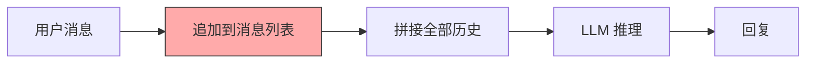
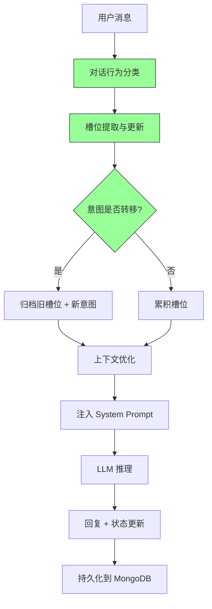

# 多轮对话状态追踪

## 一、背景 (Background)

当前 YiAi 将每条消息独立处理，仅拼接历史消息作为上下文，缺乏结构化对话理解：

| 问题 | 根因 | 用户影响 |
|------|------|---------|
| 无法逐步收集信息 | 无槽位机制，每次需用户重复描述 | "我刚说的 Bug 标题是登录失败，你怎么又问我标题？" |
| 意图转移无感知 | 用户切换话题后，LLM 仍使用旧上下文 | 回答牛头不对马嘴 |
| 对话行为未分类 | 所有消息同等对待，无差异化处理 | 确认/指令/澄清混为一谈 |
| 无状态持久化 | 所有理解结果仅存内存 | 页面刷新后丢失所有上下文 |

## 二、现状与目标 (Current State & Target State)

### 现状：无状态追踪



### 目标：结构化状态追踪



## 三、功能需求 (Functional Requirements)

### FR-01: 对话行为分类 (Dialogue Act Classification)
- **8 种行为标签**:
  | 行为 | 标识 | 示例 | 处理策略 |
  |------|------|------|---------|
  | 提问 | question | "FastAPI 怎么处理 CORS？" | 触发 RAG 检索 |
  | 指令 | command | "帮我创建一个 Bug 报告" | 触发 Agent 工具 |
  | 澄清 | clarification | "你刚才说的第二步具体怎么操作？" | 关联上文回答 |
  | 反馈 | feedback | "不对，应该是 POST 不是 GET" | 修正槽位值 |
  | 陈述 | statement | "我们团队使用 pnpm 管理依赖" | 提取用户事实 |
  | 问候 | greeting | "你好" / "早上好" | 简短回复 |
  | 确认 | confirmation | "对的" / "是的" / "不对" | 确认/否认待确认槽位 |
  | 未知 | unknown | 无法分类 | 常规处理 |

- **分类方式**: LLM 小模型 + JSON Schema 约束输出
- **延迟**: < 100ms

### FR-02: 槽位填充 (Slot Filling)
- **5 种槽位类型**:
  | 类型 | 标识 | 示例 | 提取方式 |
  |------|------|------|---------|
  | 实体 | entity | 人名、地名、产品名、项目名 | NER + LLM |
  | 偏好 | preference | "用中文回答"、"200 字以内" | LLM 结构化提取 |
  | 约束 | constraint | "只查 2026 年的数据"、"P0 优先级" | 正则 + LLM |
  | 时间 | temporal | "下周三之前"、"本月" | 正则预提取 + 解析 |
  | 数值 | numeric | "10 个并发连接"、"50MB 以内" | 正则 (含单位) |

- **槽位生命周期**:
  ```mermaid
  stateDiagram-v2
      [*] --> empty: 会话开始
      empty --> partial: LLM 提取到槽位
      partial --> confirmed: 用户确认
      partial --> partial: 用户补充更多信息
      partial --> corrected: 用户修正
      corrected --> partial: 再次提取
      confirmed --> [*]: 槽位使用完成
      partial --> archived: 意图转移
      archived --> [*]: 7 天后清理
  ```

- **槽位合并**: 新值覆盖旧值，同类型同名槽位合并

### FR-03: 意图转移检测 (Intent Shift Detection)
- **双重条件判断**:
  1. 语义相似度: 当前消息 vs 上一轮核心意图的 embedding 余弦相似度 < 0.5
  2. 槽位变化: 新提取槽位与现有槽位的重叠率 < 30%
- **同时满足** → 标记意图转移
- **转移后动作**:
  - 旧槽位标记 `status: archived`
  - 旧意图+槽位保存到历史
  - 新意图初始化空槽位
  - 前端显示 "检测到话题切换" 分割线

### FR-04: 状态持久化 (State Persistence)
- **存储位置**: MongoDB `dialogue_states` 集合
- **保存时机**: 每条用户消息处理后
- **恢复方式**: 前端传递 `session_key` → 后端加载最新状态
- **数据结构**:
  ```json
  {
    "session_key": "uuid",
    "current_intent": "bug_reporting",
    "dialogue_acts": ["question", "clarification"],
    "slots": {
      "title": {"value": "登录失败", "type": "entity", "status": "confirmed"},
      "severity": {"value": "P1", "type": "constraint", "status": "partial"}
    },
    "intent_history": [
      {"intent": "greeting", "archived_at": "2026-09-23T09:00:00Z"}
    ],
    "updated_at": "2026-09-23T09:05:00Z"
  }
  ```

### FR-05: 上下文优化 (Context Optimization)
- **问题**: 长对话消息列表过长，超出 LLM 上下文窗口
- **优化策略**:
  1. 生成对话状态摘要 (1-2 句概括当前状态)
  2. 仅注入当前活跃槽位 (非 archived)
  3. 保留最近 10 轮对话原文
  4. 更早的消息仅保留摘要
- **注入格式**:
  ```
  ## 当前对话状态
  - 意图: bug_reporting
  - 已收集信息: 标题=登录失败, 严重程度=P1
  - 待收集信息: 复现步骤, 期望结果

  ## 最近对话
  [user]: 我发现登录页面一直报错...
  [assistant]: 请描述具体的错误信息...
  ```

### FR-06: 前端状态面板 (Frontend State Panel)
- **位置**: 聊天页面侧边栏 / 折叠面板
- **展示内容**:
  - 当前意图标签 + 置信度
  - 已填充槽位 (key=value 列表)
  - 待填充槽位 (灰色占位)
  - 意图转移历史 (时间线)
- **交互**: 用户可点击槽位手动编辑/删除

## 四、数据模型 (Data Model)

### DialogueState (核心模型)
```python
class DialogueState(BaseModel):
    session_key: str
    current_intent: str
    dialogue_acts: list[DialogueAct]
    slots: dict[str, Slot]
    intent_history: list[IntentHistoryEntry]
    stage: DialogueStage  # opening/information_gathering/problem_solving/confirmation/closing
    created_at: datetime
    updated_at: datetime
```

### Slot
```python
class Slot(BaseModel):
    value: Any
    type: SlotType  # entity/preference/constraint/temporal/numeric
    status: SlotStatus  # partial/confirmed/corrected/archived
    confidence: float  # 0.0-1.0
    source_round: int  # 第几轮对话提取的
    updated_at: datetime
```

### dialogue_states 集合索引
```python
db.dialogue_states.create_index("session_key", unique=True)
db.dialogue_states.create_index("updated_at")
db.dialogue_states.create_index([("session_key", 1), ("current_intent", 1)])
```

## 五、设计决策 (Design Decisions)

| 决策 | 方案 | 原因 |
|------|------|------|
| 对话行为分类模型 | LLM 小模型 + JSON Schema | 8 分类准确率 > 80%，延迟 < 100ms |
| 槽位提取方式 | 正则预提取 + LLM 结构化提取 | 日期/数值类型正则精确；实体/偏好用 LLM 语义理解 |
| 意图转移判断 | 语义相似度 + 槽位重叠双重条件 | 防止同话题不同表述误判 |
| 状态持久化频率 | 每条消息处理后异步写入 | 实时性好，写入成本低 |
| 上下文优化触发 | 消息数 > 20 轮自动触发 | 平衡上下文窗口和 token 消耗 |

## 六、验收标准 (Acceptance Criteria)

- [ ] AC-01: 8 种对话行为正确分类，准确率 > 80%
- [ ] AC-02: 槽位提取含 5 种类型，准确率 > 75%
- [ ] AC-03: 多轮对话中槽位逐步累积填充
- [ ] AC-04: 意图转移双重条件正确触发
- [ ] AC-05: 意图转移后旧槽位自动归档
- [ ] AC-06: 跨会话 (刷新/重启) 状态可恢复
- [ ] AC-07: 上下文优化节省 token > 20%，关键信息不丢失
- [ ] AC-08: 前端状态面板实时显示槽位和意图
- [ ] AC-09: 用户可手动编辑/删除槽位
- [ ] AC-10: 行为分类延迟 < 100ms

## 七、风险 (Risks)

| 风险 | 概率 | 影响 | 缓解措施 |
|------|------|------|----------|
| 槽位提取错误(提取无关信息) | 中 | 中 | 置信度阈值 0.7；用户可手动删除 |
| 意图转移误判 | 中 | 中 | 双重条件；提高相似度阈值至 0.6 |
| 上下文优化丢失关键信息 | 中 | 高 | 状态摘要 + 槽位保留关键信息；可关闭优化 |
| 状态持久化性能开销 | 低 | 低 | 异步写入，不阻塞对话流程 |
| 对话行为分类延迟 | 低 | 低 | 使用 3B 小模型，延迟 < 100ms |

## 八、里程碑

| 阶段 | 内容 | 人天 |
|------|------|------|
| M1 | 对话行为分类器 | 0.05 |
| M2 | 槽位提取器 (正则 + LLM) | 0.08 |
| M3 | 意图转移检测 + 状态管理器 | 0.06 |
| M4 | 上下文优化器 | 0.05 |
| M5 | 持久化 + 前端面板集成 | 0.06 |
| **总计** | | **0.3d** |