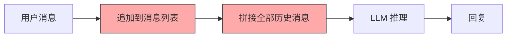
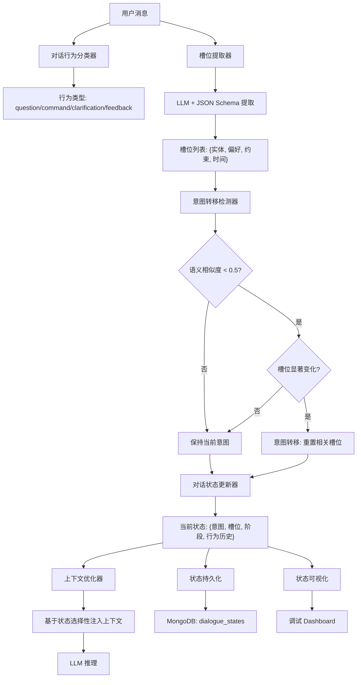
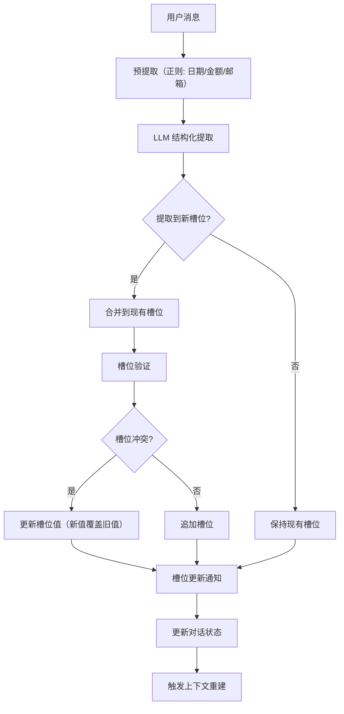

# YA-09-178: 多轮对话状态追踪 — 对话状态追踪、槽位填充、意图转移检测与对话行为分类

> 需求编号：YA-09-178 · 优先级：P2 · 人天：0.3d · 状态：需求已编写
> 依赖：聊天服务（chat_service）、LLM 推理、会话管理（sessions）

## 背景

YiAi 当前的多轮对话系统对对话历史仅做简单的消息拼接，缺乏结构化的对话状态理解，导致以下问题：

- **无状态追踪**：AI 不知道对话进行到哪个阶段，无法记住用户在当前对话中提到的关键实体
- **无槽位填充**：无法从对话中提取和追踪关键信息（如日期、姓名、偏好、需求），每次都需要用户重复提供
- **无意图转移检测**：用户切换话题时，AI 仍沿用旧话题的上下文，导致回复偏离方向
- **无状态跨会话持久化**：会话关闭后对话状态丢失，重新打开时无法恢复
- **无状态可视化**：开发者无法查看对话状态，调试困难
- **无对话行为分类**：无法区分用户消息是提问、指令、澄清还是反馈，无法针对性调整回复策略
- **上下文窗口利用低效**：所有历史消息无差别塞入上下文窗口，没有根据对话状态选择性保留关键信息

需要一个**多轮对话状态追踪系统**，实时追踪对话状态，自动提取和填充槽位（实体/偏好），检测意图转移并重置相关槽位，支持状态跨会话持久化，提供状态可视化，并对对话行为进行分类以优化上下文窗口。

---

## 一、现状分析

### 1.1 当前对话上下文管理



当前对话上下文仅是整个消息列表的简单拼接，无结构化状态提取，无槽位追踪，无意图转移检测。

### 1.2 当前问题

| # | 问题 | 严重程度 | 影响 |
|---|------|----------|------|
| 1 | 无槽位填充 | 高 | 用户在不同轮次反复提供相同信息，体验差 |
| 2 | 无意图转移检测 | 高 | 用户切换话题后 AI 仍沿用旧上下文，回复偏离 |
| 3 | 无对话状态追踪 | 中 | 不知道对话处于哪个阶段，无法针对性响应 |
| 4 | 状态无法跨会话持久化 | 中 | 会话关闭后状态丢失，重新打开需从头开始 |
| 5 | 无状态可视化 | 低 | 开发者调试对话逻辑困难 |
| 6 | 无对话行为分类 | 中 | 无法区分提问/指令/澄清，回复策略单一 |
| 7 | 上下文窗口浪费 | 中 | 所有历史消息无差别塞入，无关信息占用 token |

### 1.3 改造前 API 依赖

| # | 接口 | 调用方 | 说明 |
|---|------|--------|------|
| 1 | `chat_service.chat` | 前端 | 多轮对话，消息列表拼接 |
| 2 | `ollama.chat` | chat_service | LLM 推理，无状态上下文 |

> 改造前仅 2 个 API 依赖，无对话状态追踪模块。

### 1.4 设计灵感

参考 Rasa 的对话状态追踪（DST）、Google Dialogflow 的槽位填充机制、OpenAI 的 Structured Outputs。核心思路：每条用户消息提取槽位 → 更新对话状态 → 检测意图转移 → 选择性上下文注入 → 状态持久化 → 可视化调试。

---

## 二、设计决策

### 决策 1：槽位提取方式 — 基于 LLM vs 基于 NER 模型 vs 正则规则

| 维度 | LLM 提取 | NER 模型 | 正则规则 |
|------|---------|---------|---------|
| 准确率 | 高（上下文理解） | 中（实体识别） | 低（仅匹配模式） |
| 延迟 | 中（500ms-2s） | 低（< 50ms） | 极低（< 1ms） |
| 灵活性 | 高（可提取任意槽位） | 低（需预定义实体类型） | 极低 |
| 实现复杂度 | 低（复用 LLM） | 中（需部署 NER 模型） | 低 |

**选择：LLM 提取 + JSON Schema 约束。** 使用 LLM 的 JSON 结构化输出能力，一次性提取所有槽位（实体、偏好、约束），准确率高且灵活。对于高频槽位（日期、金额），可缓存正则预提取结果加速。

### 决策 2：意图转移检测 — 基于语义相似度 vs 基于 LLM 判断 vs 基于槽位变化

| 维度 | 语义相似度 | LLM 判断 | 槽位变化 |
|------|----------|---------|---------|
| 准确率 | 中 | 高 | 中 |
| 延迟 | 低（< 100ms） | 高（500ms-2s） | 低（< 10ms） |
| 误判率 | 中（同话题不同表述） | 低 | 中（同话题补全槽位） |
| 实现复杂度 | 低 | 低 | 低 |

**选择：语义相似度 + 槽位变化 联合判断。** 当前消息与上一话题的 Embedding 相似度低于阈值（0.5），且槽位发生显著变化（新增槽位 > 50%），判定为意图转移。两个条件同时满足，减少误判。

### 决策 3：状态持久化 — 仅内存 vs 全量持久化 vs 选择性持久化

| 维度 | 仅内存 | 全量持久化 | 选择性持久化（槽位+摘要） |
|------|--------|----------|------------------------|
| 跨会话恢复 | 否 | 是 | 是 |
| 存储开销 | 极低 | 高 | 低 |
| 恢复速度 | N/A | 中 | 快 |
| 隐私风险 | 无 | 中 | 低 |

**选择：选择性持久化（槽位 + 状态摘要）。** 仅持久化结构化的槽位数据和对话状态摘要，不存储完整对话。会话重新打开时，从槽位和状态摘要重建对话上下文，既支持跨会话恢复，又控制存储开销和隐私风险。

### 设计决策记录

| 决策 | 选项 A | 选项 B | 选择 | 理由 |
|------|--------|--------|------|------|
| 槽位提取 | LLM + JSON Schema | NER/正则 | **LLM + JSON Schema** | 准确率高、灵活、可提取任意槽位 |
| 意图转移检测 | 语义相似度 + 槽位变化 | 纯语义/纯 LLM | **语义 + 槽位** | 双重条件减少误判 |
| 状态持久化 | 选择性持久化（槽位+摘要） | 仅内存/全量 | **选择性持久化** | 兼顾恢复能力和存储开销 |

---

## 三、目标架构

### 3.1 对话状态追踪系统架构



### 3.2 槽位填充流程



### 3.3 核心数据模型

```python
# domain/dialogue_state/models.py

from enum import Enum
from pydantic import BaseModel, Field
from datetime import datetime
from typing import Any

class DialogueAct(str, Enum):
    """对话行为分类。"""
    QUESTION = "question"            # 提问
    COMMAND = "command"              # 指令/请求
    CLARIFICATION = "clarification"  # 澄清/追问
    FEEDBACK = "feedback"            # 反馈（正面/负面）
    STATEMENT = "statement"          # 陈述/信息提供
    GREETING = "greeting"            # 问候/寒暄
    CONFIRMATION = "confirmation"    # 确认/否认
    UNKNOWN = "unknown"              # 未知

class SlotType(str, Enum):
    """槽位类型。"""
    ENTITY = "entity"             # 实体（人名、地名、组织）
    PREFERENCE = "preference"     # 偏好（语言、风格、格式）
    CONSTRAINT = "constraint"     # 约束（时间、预算、范围）
    TEMPORAL = "temporal"         # 时间（日期、期限）
    NUMERIC = "numeric"           # 数值（金额、数量）
    CONTACT = "contact"           # 联系方式（邮箱、电话）
    CUSTOM = "custom"             # 自定义槽位

class Slot(BaseModel):
    """对话槽位。"""
    name: str                        # 槽位名称
    type: SlotType                   # 槽位类型
    value: Any                       # 槽位值
    confidence: float = 1.0          # 提取置信度
    source_turn: int = 0             # 来源轮次
    updated_at: datetime = Field(default_factory=datetime.now)
    description: str = ""            # 槽位描述

class Intent(BaseModel):
    """对话意图。"""
    name: str                        # 意图名称
    confidence: float = 1.0          # 置信度
    active_since_turn: int = 0       # 从第几轮开始激活
    parent_intent: str = ""          # 父意图（意图转移前的意图）

class DialogueStage(str, Enum):
    """对话阶段。"""
    OPENING = "opening"              # 开场
    INFORMATION_GATHERING = "information_gathering"  # 信息收集
    PROBLEM_SOLVING = "problem_solving"              # 问题解决
    CONFIRMATION = "confirmation"    # 确认
    CLOSING = "closing"              # 结束

class DialogueState(BaseModel):
    """对话状态。"""
    session_key: str                 # 会话 key
    current_turn: int = 0            # 当前轮次
    current_intent: Intent | None    # 当前意图
    intent_history: list[Intent]     # 意图历史
    slots: dict[str, Slot]           # 当前槽位: {slot_name: Slot}
    slot_history: list[dict]         # 槽位变更历史
    dialogue_stage: DialogueStage    # 对话阶段
    dialogue_act: DialogueAct        # 当前对话行为
    act_history: list[DialogueAct]   # 行为历史（最近 10 条）
    last_updated: datetime = Field(default_factory=datetime.now)

class IntentShiftResult(BaseModel):
    """意图转移检测结果。"""
    shifted: bool                    # 是否发生转移
    previous_intent: str             # 前一个意图
    new_intent: str                  # 新意图
    semantic_similarity: float       # 语义相似度
    slot_change_ratio: float         # 槽位变化比例
    slots_to_reset: list[str]        # 需要重置的槽位
    reason: str = ""                 # 转移原因

class ContextWindowConfig(BaseModel):
    """上下文窗口配置。"""
    max_tokens: int = 4096           # 最大 token 数
    state_summary_tokens: int = 200  # 状态摘要预算
    slot_context_tokens: int = 300   # 槽位上下文预算
    recent_messages_tokens: int      # 最近消息预算（剩余）
    is_optimized: bool = False       # 是否经过优化
    optimization_reason: str = ""    # 优化原因
```

---

## 四、具体改动

### 4.1 新增文件

| 文件 | 行数 | 说明 |
|------|------|------|
| `src/domain/dialogue_state/__init__.py` | 8 | 模块导出 |
| `src/domain/dialogue_state/models.py` | 80 | 数据模型：DialogueAct、Slot、Intent、DialogueState、IntentShiftResult、ContextWindowConfig |
| `src/domain/dialogue_state/slot_extractor.py` | 100 | 槽位提取器：LLM 结构化提取 + 正则预提取 + 槽位合并/冲突解决 |
| `src/domain/dialogue_state/intent_shift_detector.py` | 80 | 意图转移检测器：语义相似度 + 槽位变化联合判断 |
| `src/domain/dialogue_state/dialogue_act_classifier.py` | 60 | 对话行为分类器：8 种对话行为分类 |
| `src/domain/dialogue_state/state_manager.py` | 100 | 状态管理器：状态更新、槽位 CRUD、意图历史、阶段推断 |
| `src/domain/dialogue_state/context_optimizer.py` | 80 | 上下文优化器：基于状态选择性注入上下文 |
| `src/domain/dialogue_state/state_repository.py` | 60 | 状态持久化：MongoDB 读写、状态恢复 |
| `src/services/dialogue_state/dialogue_state_service.py` | 120 | 对话状态追踪服务 RPC：状态查询、槽位管理、意图转移、上下文优化、可视化 |

### 4.2 核心实现

**槽位提取器：**

```python
# domain/dialogue_state/slot_extractor.py

import json
import re
import asyncio
from datetime import datetime

class SlotExtractor:
    """槽位提取器：LLM 结构化提取 + 正则预提取 + 槽位合并。"""

    SLOT_EXTRACTION_PROMPT = """从以下用户消息中提取关键信息（槽位）。请严格按照 JSON 格式返回。

槽位类型:
- entity: 实体（人名、地名、组织、产品名）
- preference: 偏好（语言、风格、格式、喜好）
- constraint: 约束（时间限制、预算限制、范围限制）
- temporal: 时间（日期、截止日期、时间段）
- numeric: 数值（金额、数量、百分比）
- contact: 联系方式（邮箱、电话、地址）

用户消息: "{message}"

对话上下文（已有槽位）:
{existing_slots}

仅返回新发现或需要更新的槽位。返回格式:
{{
  "slots": [
    {{
      "name": "槽位名称",
      "type": "entity|preference|constraint|temporal|numeric|contact|custom",
      "value": "槽位值",
      "confidence": 0.95,
      "description": "槽位描述"
    }}
  ]
}}

如果没有新槽位，返回: {{"slots": []}}"""

    # 正则预提取规则
    REGEX_PATTERNS = {
        "date": r'\d{4}[-/年]\d{1,2}[-/月]\d{1,2}[日号]?',
        "email": r'[a-zA-Z0-9._%+-]+@[a-zA-Z0-9.-]+\.[a-zA-Z]{2,}',
        "phone": r'1[3-9]\d{9}',
        "amount": r'(\d+(?:\.\d{1,2})?)\s*[元块美元]',
        "percentage": r'(\d+(?:\.\d+)?)\s*%',
    }

    def __init__(self):
        self._model = None

    async def extract(
        self,
        message: str,
        existing_slots: dict[str, Slot] = None,
    ) -> list[Slot]:
        """从用户消息中提取槽位。

        Args:
            message: 用户消息
            existing_slots: 已有槽位（用于冲突检测）

        Returns:
            新提取的槽位列表
        """
        existing_slots = existing_slots or {}

        # 1. 正则预提取（快速提取日期、邮箱等）
        regex_slots = self._regex_extract(message)

        # 2. LLM 结构化提取
        llm_slots = await self._llm_extract(message, existing_slots)

        # 3. 合并（LLM 结果优先，正则补充）
        merged = self._merge_slots(regex_slots, llm_slots, existing_slots)

        return merged

    def _regex_extract(self, message: str) -> list[Slot]:
        """正则预提取。"""
        slots = []

        date_matches = re.findall(self.REGEX_PATTERNS["date"], message)
        for match in date_matches:
            slots.append(Slot(
                name="date",
                type=SlotType.TEMPORAL,
                value=match,
                confidence=0.9,
                description="正则提取的日期",
            ))

        email_matches = re.findall(self.REGEX_PATTERNS["email"], message)
        for match in email_matches:
            slots.append(Slot(
                name="email",
                type=SlotType.CONTACT,
                value=match,
                confidence=0.95,
                description="正则提取的邮箱",
            ))

        amount_matches = re.findall(self.REGEX_PATTERNS["amount"], message)
        for match in amount_matches:
            slots.append(Slot(
                name="amount",
                type=SlotType.NUMERIC,
                value=match,
                confidence=0.9,
                description="正则提取的金额",
            ))

        return slots

    async def _llm_extract(
        self,
        message: str,
        existing_slots: dict[str, Slot],
    ) -> list[Slot]:
        """LLM 结构化提取。"""
        import ollama

        # 构建已有槽位描述
        existing_desc = "\n".join(
            f"- {name}: {slot.value} ({slot.type})"
            for name, slot in existing_slots.items()
        ) if existing_slots else "无已有槽位"

        prompt = self.SLOT_EXTRACTION_PROMPT.format(
            message=message,
            existing_slots=existing_desc,
        )

        response = await asyncio.to_thread(
            ollama.chat,
            model="qwen2.5:7b",
            messages=[{"role": "user", "content": prompt}],
            options={"temperature": 0.1},
        )

        try:
            content = response["message"]["content"]
            if "```" in content:
                content = content.split("```")[1]
                if content.startswith("json"):
                    content = content[4:]
            data = json.loads(content.strip())
        except json.JSONDecodeError:
            return []

        slots = []
        for slot_data in data.get("slots", []):
            try:
                slot_type = SlotType(slot_data.get("type", "custom"))
            except ValueError:
                slot_type = SlotType.CUSTOM

            slots.append(Slot(
                name=slot_data.get("name", ""),
                type=slot_type,
                value=slot_data.get("value", ""),
                confidence=float(slot_data.get("confidence", 0.7)),
                description=slot_data.get("description", ""),
            ))

        return slots

    def _merge_slots(
        self,
        regex_slots: list[Slot],
        llm_slots: list[Slot],
        existing_slots: dict[str, Slot],
    ) -> list[Slot]:
        """合并槽位：LLM 优先，正则补充，冲突时高置信度覆盖低置信度。"""
        merged: dict[str, Slot] = {}

        # 正则结果先入
        for slot in regex_slots:
            merged[slot.name] = slot

        # LLM 结果覆盖（优先）
        for slot in llm_slots:
            if slot.name in merged:
                if slot.confidence >= merged[slot.name].confidence:
                    merged[slot.name] = slot
            else:
                merged[slot.name] = slot

        # 检测与已有槽位的冲突
        result = []
        for name, slot in merged.items():
            if name in existing_slots:
                existing = existing_slots[name]
                if slot.value != existing.value:
                    # 新值覆盖旧值（用户更正了信息）
                    slot.source_turn = existing.source_turn
                    slot.description = f"更新: {existing.value} → {slot.value}"
            result.append(slot)

        return result
```

**意图转移检测器：**

```python
# domain/dialogue_state/intent_shift_detector.py

import asyncio
import math

class IntentShiftDetector:
    """意图转移检测器：语义相似度 + 槽位变化联合判断。"""

    SIMILARITY_THRESHOLD = 0.5       # 语义相似度阈值
    SLOT_CHANGE_RATIO_THRESHOLD = 0.5  # 槽位变化比例阈值

    def __init__(self):
        self._topic_embeddings: dict[str, list[float]] = {}

    async def detect(
        self,
        current_message: str,
        previous_intent: Intent,
        current_slots: dict[str, Slot],
        previous_slots: dict[str, Slot],
    ) -> IntentShiftResult:
        """检测意图是否发生转移。

        Args:
            current_message: 当前用户消息
            previous_intent: 前一个意图
            current_slots: 当前槽位
            previous_slots: 前一个意图的槽位

        Returns:
            IntentShiftResult: 转移检测结果
        """
        if previous_intent is None:
            return IntentShiftResult(
                shifted=False,
                previous_intent="",
                new_intent="",
                semantic_similarity=1.0,
                slot_change_ratio=0.0,
                slots_to_reset=[],
                reason="首次消息，无前意图",
            )

        # 1. 计算语义相似度
        similarity = await self._compute_semantic_similarity(
            current_message,
            previous_intent.name,
        )

        # 2. 计算槽位变化比例
        slot_change_ratio = self._compute_slot_change_ratio(
            current_slots,
            previous_slots,
        )

        # 3. 联合判断
        shifted = (
            similarity < self.SIMILARITY_THRESHOLD
            and slot_change_ratio > self.SLOT_CHANGE_RATIO_THRESHOLD
        )

        # 确定需要重置的槽位
        slots_to_reset = []
        if shifted:
            # 意图转移时，重置与旧意图强相关的槽位
            slots_to_reset = list(previous_slots.keys())

        reason_parts = []
        if similarity < self.SIMILARITY_THRESHOLD:
            reason_parts.append(f"语义相似度低({similarity:.2f})")
        if slot_change_ratio > self.SLOT_CHANGE_RATIO_THRESHOLD:
            reason_parts.append(f"槽位变化大({slot_change_ratio:.2f})")

        return IntentShiftResult(
            shifted=shifted,
            previous_intent=previous_intent.name,
            new_intent="" if not shifted else "待分类",
            semantic_similarity=round(similarity, 3),
            slot_change_ratio=round(slot_change_ratio, 3),
            slots_to_reset=slots_to_reset,
            reason="; ".join(reason_parts) if reason_parts else "无意图转移",
        )

    async def _compute_semantic_similarity(
        self,
        message: str,
        intent_name: str,
    ) -> float:
        """计算消息与意图的语义相似度。"""
        import ollama

        # 获取消息的 Embedding
        msg_response = await asyncio.to_thread(
            ollama.embeddings,
            model="nomic-embed-text",
            prompt=message,
        )
        msg_embedding = msg_response["embedding"]

        # 获取意图的 Embedding（缓存）
        if intent_name not in self._topic_embeddings:
            intent_response = await asyncio.to_thread(
                ollama.embeddings,
                model="nomic-embed-text",
                prompt=intent_name,
            )
            self._topic_embeddings[intent_name] = intent_response["embedding"]

        intent_embedding = self._topic_embeddings[intent_name]

        # 余弦相似度
        return self._cosine_similarity(msg_embedding, intent_embedding)

    def _compute_slot_change_ratio(
        self,
        current_slots: dict[str, Slot],
        previous_slots: dict[str, Slot],
    ) -> float:
        """计算槽位变化比例。"""
        if not previous_slots:
            return 1.0 if current_slots else 0.0

        current_keys = set(current_slots.keys())
        previous_keys = set(previous_slots.keys())

        # 新增的槽位
        new_slots = current_keys - previous_keys
        # 值变化的槽位
        changed_slots = {
            k for k in current_keys & previous_keys
            if current_slots[k].value != previous_slots[k].value
        }

        changed_count = len(new_slots) + len(changed_slots)
        total_count = len(previous_keys | current_keys)

        if total_count == 0:
            return 0.0

        return changed_count / total_count

    def _cosine_similarity(self, a: list[float], b: list[float]) -> float:
        """余弦相似度。"""
        dot = sum(x * y for x, y in zip(a, b))
        norm_a = math.sqrt(sum(x ** 2 for x in a))
        norm_b = math.sqrt(sum(x ** 2 for x in b))
        if norm_a == 0 or norm_b == 0:
            return 0.0
        return dot / (norm_a * norm_b)
```

**对话行为分类器：**

```python
# domain/dialogue_state/dialogue_act_classifier.py

import asyncio

class DialogueActClassifier:
    """对话行为分类器：区分提问、指令、澄清、反馈等 8 种行为。"""

    ACT_CLASSIFICATION_PROMPT = """分类以下用户消息的对话行为。仅返回行为标签，不要其他内容。

行为标签:
- question: 提问（询问信息、寻求帮助）
- command: 指令/请求（要求执行某个操作）
- clarification: 澄清/追问（对之前的回复提出疑问）
- feedback: 反馈（表达满意/不满意、感谢/抱怨）
- statement: 陈述/提供信息（陈述事实、提供信息）
- greeting: 问候/寒暄（打招呼、告别）
- confirmation: 确认/否认（是/否、对/错）
- unknown: 无法分类

用户消息: "{message}"

行为标签:"""

    async def classify(self, message: str) -> DialogueAct:
        """分类对话行为。

        Args:
            message: 用户消息

        Returns:
            DialogueAct 行为标签
        """
        import ollama

        prompt = self.ACT_CLASSIFICATION_PROMPT.format(message=message)

        response = await asyncio.to_thread(
            ollama.chat,
            model="qwen2.5:3b",
            messages=[{"role": "user", "content": prompt}],
            options={"temperature": 0.1},
        )

        label = response["message"]["content"].strip().lower()

        label_map = {
            "question": DialogueAct.QUESTION,
            "command": DialogueAct.COMMAND,
            "clarification": DialogueAct.CLARIFICATION,
            "feedback": DialogueAct.FEEDBACK,
            "statement": DialogueAct.STATEMENT,
            "greeting": DialogueAct.GREETING,
            "confirmation": DialogueAct.CONFIRMATION,
            "unknown": DialogueAct.UNKNOWN,
        }

        return label_map.get(label, DialogueAct.UNKNOWN)
```

**状态管理器：**

```python
# domain/dialogue_state/state_manager.py

from datetime import datetime

class StateManager:
    """对话状态管理器：状态更新、槽位 CRUD、意图历史、阶段推断。"""

    MAX_ACT_HISTORY = 10
    MAX_INTENT_HISTORY = 20

    def __init__(self):
        self.slot_extractor = SlotExtractor()
        self.intent_shift_detector = IntentShiftDetector()
        self.act_classifier = DialogueActClassifier()
        self.state_repo = StateRepository()

        # 内存缓存: {session_key: DialogueState}
        self._active_states: dict[str, DialogueState] = {}

    async def process_turn(
        self,
        session_key: str,
        message: str,
    ) -> DialogueState:
        """处理一轮对话，更新状态。

        Args:
            session_key: 会话 key
            message: 用户消息

        Returns:
            更新后的 DialogueState
        """
        # 获取或初始化状态
        state = await self._get_or_create_state(session_key)
        state.current_turn += 1

        # 1. 对话行为分类
        dialogue_act = await self.act_classifier.classify(message)
        state.dialogue_act = dialogue_act
        state.act_history.append(dialogue_act)
        if len(state.act_history) > self.MAX_ACT_HISTORY:
            state.act_history.pop(0)

        # 2. 槽位提取
        new_slots = await self.slot_extractor.extract(message, state.slots)
        previous_slots = dict(state.slots)

        for slot in new_slots:
            slot.source_turn = state.current_turn
            state.slots[slot.name] = slot

        # 记录槽位变更
        if new_slots:
            state.slot_history.append({
                "turn": state.current_turn,
                "added": [s.name for s in new_slots],
                "timestamp": datetime.now().isoformat(),
            })

        # 3. 意图转移检测
        if state.current_intent and state.intent_history:
            shift_result = await self.intent_shift_detector.detect(
                current_message=message,
                previous_intent=state.current_intent,
                current_slots=state.slots,
                previous_slots=previous_slots,
            )

            if shift_result.shifted:
                # 意图转移：记录旧意图，重置相关槽位
                state.intent_history.append(state.current_intent)
                for slot_name in shift_result.slots_to_reset:
                    state.slots.pop(slot_name, None)

                state.current_intent = Intent(
                    name="待分类",
                    confidence=0.5,
                    active_since_turn=state.current_turn,
                    parent_intent=shift_result.previous_intent,
                )

        # 4. 推断对话阶段
        state.dialogue_stage = self._infer_stage(state)

        # 5. 更新状态
        state.last_updated = datetime.now()

        # 6. 持久化
        await self.state_repo.save_state(state)

        return state

    async def _get_or_create_state(self, session_key: str) -> DialogueState:
        """获取或创建对话状态。"""
        if session_key in self._active_states:
            return self._active_states[session_key]

        # 尝试从 MongoDB 恢复
        saved_state = await self.state_repo.get_state(session_key)
        if saved_state:
            self._active_states[session_key] = saved_state
            return saved_state

        state = DialogueState(
            session_key=session_key,
            current_turn=0,
            current_intent=None,
            intent_history=[],
            slots={},
            slot_history=[],
            dialogue_stage=DialogueStage.OPENING,
            dialogue_act=DialogueAct.UNKNOWN,
            act_history=[],
        )
        self._active_states[session_key] = state
        return state

    def _infer_stage(self, state: DialogueState) -> DialogueStage:
        """根据状态推断对话阶段。"""
        if state.current_turn <= 1:
            return DialogueStage.OPENING

        # 最近行为
        recent_acts = state.act_history[-3:] if state.act_history else []

        if DialogueAct.GREETING in recent_acts and state.current_turn <= 2:
            return DialogueStage.OPENING

        if DialogueAct.QUESTION in recent_acts or DialogueAct.CLARIFICATION in recent_acts:
            return DialogueStage.INFORMATION_GATHERING

        if state.slots and len(state.slots) >= 2:
            if DialogueAct.COMMAND in recent_acts:
                return DialogueStage.PROBLEM_SOLVING

        if DialogueAct.CONFIRMATION in recent_acts:
            return DialogueStage.CONFIRMATION

        if DialogueAct.FEEDBACK in recent_acts:
            return DialogueStage.CLOSING

        return DialogueStage.INFORMATION_GATHERING

    def get_state(self, session_key: str) -> DialogueState | None:
        """获取会话状态。"""
        return self._active_states.get(session_key)

    async def clear_state(self, session_key: str):
        """清除会话状态（会话关闭时）。"""
        self._active_states.pop(session_key, None)
        await self.state_repo.delete_state(session_key)
```

**上下文优化器：**

```python
# domain/dialogue_state/context_optimizer.py

class ContextOptimizer:
    """上下文优化器：基于对话状态选择性注入上下文，优化 token 使用。"""

    DEFAULT_MAX_TOKENS = 4096
    STATE_SUMMARY_BUDGET = 200     # 状态摘要 token 预算
    SLOT_CONTEXT_BUDGET = 300      # 槽位上下文 token 预算
    SYSTEM_PROMPT_BUDGET = 500     # System Prompt token 预算

    def optimize(
        self,
        state: DialogueState,
        messages: list[dict],
        max_tokens: int = None,
    ) -> tuple[list[dict], ContextWindowConfig]:
        """基于对话状态优化上下文窗口。

        Args:
            state: 当前对话状态
            messages: 完整消息列表
            max_tokens: 最大 token 数

        Returns:
            (优化后的消息列表, 上下文窗口配置)
        """
        max_tokens = max_tokens or self.DEFAULT_MAX_TOKENS

        # 计算预算
        remaining_tokens = max_tokens - self.SYSTEM_PROMPT_BUDGET

        # 1. 构建状态摘要
        state_summary = self._build_state_summary(state)
        state_summary_tokens = self._estimate_tokens(state_summary)

        # 2. 构建槽位上下文
        slot_context = self._build_slot_context(state)
        slot_context_tokens = self._estimate_tokens(slot_context)

        # 3. 计算可用于最近消息的 token 预算
        recent_budget = remaining_tokens - state_summary_tokens - slot_context_tokens
        recent_budget = max(500, recent_budget)  # 至少保留 500 tokens

        # 4. 选择最近消息
        optimized_messages = self._select_recent_messages(messages, recent_budget)

        # 5. 注入状态摘要和槽位上下文
        system_context = f"{state_summary}\n\n{slot_context}"

        is_optimized = len(messages) > len(optimized_messages)

        config = ContextWindowConfig(
            max_tokens=max_tokens,
            state_summary_tokens=state_summary_tokens,
            slot_context_tokens=slot_context_tokens,
            recent_messages_tokens=recent_budget,
            is_optimized=is_optimized,
            optimization_reason=f"原始消息 {len(messages)} 条，优化后 {len(optimized_messages)} 条"
            if is_optimized else "无需优化",
        )

        return optimized_messages, config

    def _build_state_summary(self, state: DialogueState) -> str:
        """构建状态摘要文本。"""
        parts = []

        if state.current_intent:
            parts.append(f"当前意图: {state.current_intent.name}")

        parts.append(f"对话阶段: {state.dialogue_stage}")
        parts.append(f"当前轮次: {state.current_turn}")

        if state.current_intent and state.current_intent.parent_intent:
            parts.append(f"注意: 用户从 '{state.current_intent.parent_intent}' 切换了话题")

        recent_acts = state.act_history[-3:]
        if recent_acts:
            acts_str = ", ".join(a.value for a in recent_acts)
            parts.append(f"最近行为: {acts_str}")

        return "[对话状态]\n" + "\n".join(parts)

    def _build_slot_context(self, state: DialogueState) -> str:
        """构建槽位上下文文本。"""
        if not state.slots:
            return "[已知信息]\n暂无已提取的槽位信息。"

        lines = ["[已知信息]"]
        for name, slot in state.slots.items():
            lines.append(f"- {name}: {slot.value} ({slot.type.value}, 置信度: {slot.confidence})")

        return "\n".join(lines)

    def _select_recent_messages(
        self,
        messages: list[dict],
        token_budget: int,
    ) -> list[dict]:
        """从消息列表中选择最近的消息，不超出 token 预算。"""
        selected = []
        used_tokens = 0

        for msg in reversed(messages):
            msg_tokens = self._estimate_tokens(msg.get("content", ""))
            if used_tokens + msg_tokens > token_budget:
                break
            selected.insert(0, msg)
            used_tokens += msg_tokens

        return selected

    def _estimate_tokens(self, text: str) -> int:
        """粗略估算 token 数（中文约 1.5 字/token，英文约 4 字/token）。"""
        if not text:
            return 0
        # 粗略估算：中文字符 * 0.6 + 英文单词 * 1.3
        chinese_chars = sum(1 for c in text if '\u4e00' <= c <= '\u9fff')
        other_chars = len(text) - chinese_chars
        return int(chinese_chars * 0.6 + other_chars * 0.25)
```

**对话状态追踪服务 RPC 接口：**

```python
# services/dialogue_state/dialogue_state_service.py

class DialogueStateService:
    """多轮对话状态追踪服务。"""

    def __init__(self):
        self.state_manager = StateManager()
        self.context_optimizer = ContextOptimizer()

    async def process_message(self, parameters: dict) -> dict:
        """RPC: 处理用户消息，更新对话状态。

        parameters:
            session_key: str — 会话 key
            message: str    — 用户消息
        """
        session_key = parameters.get("session_key")
        message = parameters.get("message")

        if not session_key or not message:
            return {"code": 1001, "message": "session_key and message are required", "data": None}

        state = await self.state_manager.process_turn(session_key, message)

        return {
            "code": 0,
            "message": "ok",
            "data": {
                "session_key": state.session_key,
                "current_turn": state.current_turn,
                "dialogue_act": state.dialogue_act,
                "dialogue_stage": state.dialogue_stage,
                "slots": {name: slot.model_dump() for name, slot in state.slots.items()},
                "current_intent": state.current_intent.model_dump() if state.current_intent else None,
            },
        }

    async def get_dialogue_state(self, parameters: dict) -> dict:
        """RPC: 获取对话状态（用于可视化调试）。

        parameters:
            session_key: str — 会话 key
        """
        session_key = parameters.get("session_key")
        if not session_key:
            return {"code": 1001, "message": "session_key is required", "data": None}

        state = self.state_manager.get_state(session_key)
        if not state:
            return {"code": 0, "message": "No state found", "data": {"state": None}}

        return {
            "code": 0,
            "message": "ok",
            "data": {
                "state": {
                    "session_key": state.session_key,
                    "current_turn": state.current_turn,
                    "dialogue_act": state.dialogue_act,
                    "dialogue_stage": state.dialogue_stage,
                    "slots": {name: slot.model_dump() for name, slot in state.slots.items()},
                    "slot_history": state.slot_history,
                    "current_intent": state.current_intent.model_dump() if state.current_intent else None,
                    "intent_history": [i.model_dump() for i in state.intent_history],
                    "act_history": [a.value for a in state.act_history],
                    "last_updated": state.last_updated.isoformat(),
                },
            },
        }

    async def get_slot(self, parameters: dict) -> dict:
        """RPC: 获取指定槽位。

        parameters:
            session_key: str — 会话 key
            slot_name: str   — 槽位名称
        """
        session_key = parameters.get("session_key")
        slot_name = parameters.get("slot_name")

        if not session_key or not slot_name:
            return {"code": 1001, "message": "session_key and slot_name are required", "data": None}

        state = self.state_manager.get_state(session_key)
        if not state:
            return {"code": 1002, "message": "State not found", "data": None}

        slot = state.slots.get(slot_name)
        if not slot:
            return {"code": 1002, "message": f"Slot not found: {slot_name}", "data": None}

        return {"code": 0, "message": "ok", "data": {"slot": slot.model_dump()}}

    async def set_slot(self, parameters: dict) -> dict:
        """RPC: 手动设置槽位（用于调试/用户手动输入）。

        parameters:
            session_key: str    — 会话 key
            slot_name: str      — 槽位名称
            slot_value: any     — 槽位值
            slot_type: str      — 槽位类型
        """
        session_key = parameters.get("session_key")
        slot_name = parameters.get("slot_name")
        slot_value = parameters.get("slot_value")

        if not all([session_key, slot_name, slot_value]):
            return {"code": 1001, "message": "session_key, slot_name, slot_value are required", "data": None}

        state = self.state_manager.get_state(session_key)
        if not state:
            return {"code": 1002, "message": "State not found", "data": None}

        slot_type = parameters.get("slot_type", "custom")
        try:
            slot_type = SlotType(slot_type)
        except ValueError:
            slot_type = SlotType.CUSTOM

        state.slots[slot_name] = Slot(
            name=slot_name,
            type=slot_type,
            value=slot_value,
            confidence=1.0,
            source_turn=state.current_turn,
            description="手动设置",
        )

        return {"code": 0, "message": "ok", "data": {"slot": state.slots[slot_name].model_dump()}}

    async def delete_slot(self, parameters: dict) -> dict:
        """RPC: 删除指定槽位。

        parameters:
            session_key: str — 会话 key
            slot_name: str   — 槽位名称
        """
        session_key = parameters.get("session_key")
        slot_name = parameters.get("slot_name")

        if not session_key or not slot_name:
            return {"code": 1001, "message": "session_key and slot_name are required", "data": None}

        state = self.state_manager.get_state(session_key)
        if not state:
            return {"code": 1002, "message": "State not found", "data": None}

        if slot_name in state.slots:
            del state.slots[slot_name]
            return {"code": 0, "message": "ok", "data": {"deleted": slot_name}}
        else:
            return {"code": 1002, "message": f"Slot not found: {slot_name}", "data": None}

    async def check_intent_shift(self, parameters: dict) -> dict:
        """RPC: 检查意图转移。

        parameters:
            session_key: str — 会话 key
            message: str    — 当前消息
        """
        session_key = parameters.get("session_key")
        message = parameters.get("message")

        if not session_key or not message:
            return {"code": 1001, "message": "session_key and message are required", "data": None}

        state = self.state_manager.get_state(session_key)
        if not state or not state.current_intent:
            return {"code": 0, "message": "ok", "data": {"shifted": False, "reason": "No previous intent"}}

        shift_result = await self.state_manager.intent_shift_detector.detect(
            current_message=message,
            previous_intent=state.current_intent,
            current_slots=state.slots,
            previous_slots={},
        )

        return {"code": 0, "message": "ok", "data": shift_result.model_dump()}

    async def optimize_context(self, parameters: dict) -> dict:
        """RPC: 获取优化后的上下文窗口配置。

        parameters:
            session_key: str   — 会话 key
            messages: list     — 消息列表
            max_tokens: int    — 最大 token 数（可选）
        """
        session_key = parameters.get("session_key")
        messages = parameters.get("messages", [])

        if not session_key:
            return {"code": 1001, "message": "session_key is required", "data": None}

        state = self.state_manager.get_state(session_key)
        if not state:
            return {"code": 0, "message": "No state, using full messages", "data": {"optimized": False}}

        optimized_messages, config = self.context_optimizer.optimize(
            state=state,
            messages=messages,
            max_tokens=parameters.get("max_tokens"),
        )

        return {
            "code": 0,
            "message": "ok",
            "data": {
                "config": config.model_dump(),
                "optimized_count": len(optimized_messages),
                "original_count": len(messages),
                "saved_tokens": self._estimate_saved_tokens(messages, optimized_messages),
            },
        }

    def _estimate_saved_tokens(self, original: list, optimized: list) -> int:
        """估算节省的 token 数。"""
        return sum(
            len(m.get("content", "")) for m in original[len(optimized):]
        ) // 4  # 粗略估算
```

### 4.3 涉及文件

```
YiAi/src/
├── domain/dialogue_state/
│   ├── __init__.py                  # 新增: 模块导出
│   ├── models.py                    # 新增: 数据模型 (80行)
│   ├── slot_extractor.py            # 新增: 槽位提取器 (100行)
│   ├── intent_shift_detector.py     # 新增: 意图转移检测器 (80行)
│   ├── dialogue_act_classifier.py   # 新增: 对话行为分类器 (60行)
│   ├── state_manager.py             # 新增: 状态管理器 (100行)
│   ├── context_optimizer.py         # 新增: 上下文优化器 (80行)
│   └── state_repository.py          # 新增: 状态持久化 (60行)
├── services/dialogue_state/
│   └── dialogue_state_service.py    # 新增: 状态追踪服务 RPC (120行)
└── server/
    └── routes/
        └── dialogue_state_routes.py # 新增: 状态追踪路由 (40行)
```

---

## 五、实施步骤

按依赖顺序排列，每步可独立验证和提交：

| 步骤 | 内容 | 涉及文件 | 验证方式 | 人天 |
|------|------|---------|---------|------|
| 1 | 定义数据模型（DialogueAct、Slot、Intent、DialogueState、IntentShiftResult、ContextWindowConfig） | `domain/dialogue_state/models.py` | Pydantic 校验通过，枚举完整 | 0.02 |
| 2 | 实现对话行为分类器（8 种行为标签） | `domain/dialogue_state/dialogue_act_classifier.py` | 准确率 > 80%，延迟 < 200ms | 0.03 |
| 3 | 实现槽位提取器（正则预提取 + LLM 结构化提取 + 合并） | `domain/dialogue_state/slot_extractor.py` | 槽位提取准确率 > 75%，支持 6 种槽位类型 | 0.06 |
| 4 | 实现意图转移检测器（语义相似度 + 槽位变化联合判断） | `domain/dialogue_state/intent_shift_detector.py` | 转移检测准确率 > 80% | 0.04 |
| 5 | 实现状态管理器（状态更新、槽位 CRUD、阶段推断、持久化） | `domain/dialogue_state/state_manager.py` | 状态流转正确，槽位 CRUD 正常 | 0.05 |
| 6 | 实现上下文优化器（状态摘要 + 槽位上下文 + 选择性消息注入） | `domain/dialogue_state/context_optimizer.py` | 节省 token 比例 > 20%，关键信息不丢失 | 0.04 |
| 7 | 实现状态持久化（MongoDB 读写、状态恢复） | `domain/dialogue_state/state_repository.py` | 跨会话恢复正常 | 0.03 |
| 8 | 实现状态追踪服务 RPC（process、get_state、slot CRUD、intent_shift、optimize） | `services/dialogue_state/dialogue_state_service.py` | 所有 RPC 接口正常响应 | 0.03 |

**总计：0.3d**

---

## 六、测试规格

### Requirement: 槽位提取

#### Scenario: 提取用户偏好槽位
- **Given** 用户消息为 "我喜欢简洁的回复风格，不要用太多术语"
- **When** 调用 `process_message`
- **Then** 返回 slots 包含 preference 类型的槽位，值为 "简洁风格"
- **And** confidence >= 0.7

#### Scenario: 提取日期槽位
- **Given** 用户消息为 "请帮我安排 2026-09-15 的会议"
- **When** 调用 `slot_extractor.extract`
- **Then** 返回 slots 包含 temporal 类型的槽位，值为 "2026-09-15"

#### Scenario: 槽位值更新（用户更正）
- **Given** 已有槽位 date="2026-09-15"，用户消息为 "不对，改到 2026-09-20"
- **When** 调用 `slot_extractor.extract`
- **Then** 返回 slots 包含 date 槽位，值为 "2026-09-20"
- **And** description 包含 "更新"

### Requirement: 意图转移检测

#### Scenario: 检测到意图转移
- **Given** 当前意图为 "代码调试"，用户消息为 "帮我推荐一个旅行目的地"
- **When** 调用 `check_intent_shift`
- **Then** 返回 shifted=True
- **And** semantic_similarity < 0.5

#### Scenario: 未检测到意图转移
- **Given** 当前意图为 "代码调试"，用户消息为 "这个错误是什么原因"
- **When** 调用 `check_intent_shift`
- **Then** 返回 shifted=False
- **And** semantic_similarity >= 0.5

### Requirement: 对话行为分类

#### Scenario: 分类提问行为
- **Given** 用户消息为 "Python 中如何实现异步编程？"
- **When** 调用 `dialogue_act_classifier.classify`
- **Then** 返回 DialogueAct.QUESTION

#### Scenario: 分类反馈行为
- **Given** 用户消息为 "谢谢你，这很有帮助！"
- **When** 调用 `dialogue_act_classifier.classify`
- **Then** 返回 DialogueAct.FEEDBACK

### Requirement: 上下文优化

#### Scenario: 长对话上下文优化
- **Given** 对话有 50 条消息，最大 token 4096，当前状态有 5 个槽位
- **When** 调用 `optimize_context`
- **Then** 返回 optimized_count < 50
- **And** saved_tokens > 0
- **And** config.is_optimized = True

---

## 七、风险与缓解

| 风险 | 概率 | 影响 | 等级 | 缓解措施 | 应急预案 |
|------|------|------|------|----------|----------|
| 槽位提取错误（提取了无关信息） | 中 | 中 | 中 | 置信度阈值 0.7，低置信度槽位不注入 System Prompt | 用户可手动删除错误槽位 |
| 意图转移误判（同话题不同表述） | 中 | 中 | 中 | 语义相似度 + 槽位变化双重条件，减少误判 | 提高相似度阈值至 0.6 |
| 上下文优化丢失关键信息 | 中 | 高 | 中 | 状态摘要 + 槽位上下文保留关键信息 | 关闭优化，使用完整上下文 |
| 状态持久化性能影响 | 低 | 低 | 低 | 异步持久化，不阻塞对话流程 | 仅内存模式，关闭持久化 |
| 对话行为分类延迟 | 低 | 低 | 低 | 使用 3B 小模型，延迟 < 200ms | 缓存分类结果（同会话复用） |

---

## 八、回滚策略

| 回滚场景 | 回滚方式 | 影响范围 | 恢复时间 |
|----------|----------|----------|----------|
| 槽位提取质量差 | 关闭槽位提取，使用纯消息列表 | 对话状态追踪 | 1min |
| 意图转移误判率高 | 关闭意图转移检测，不重置槽位 | 槽位管理 | 1min |
| 上下文优化丢失信息 | 关闭优化，使用完整消息列表 | 上下文窗口 | 1min |

**回滚验证：**
- 聊天服务正常，消息列表完整
- 对话状态接口返回空状态
- `ruff` + `mypy` 检查通过

---

## 九、设计决策记录

### D-01: 为什么槽位需要持久化而不仅仅是内存？

跨会话恢复是核心需求。用户在会话 A 中提到"我是 Python 后端开发"（偏好槽位），关闭会话后重新打开会话 B，AI 应该记住这个偏好，而不是让用户重新声明。选择性持久化（仅槽位和状态摘要）在功能性和隐私性之间取得平衡。

### D-02: 为什么意图转移检测需要双重条件？

仅依赖语义相似度会误判同一话题的不同表述（如"代码报错"和"这个 bug 怎么修"虽然 Embedding 距离可能较大，但属同一意图）。仅依赖槽位变化会误判同一意图下的槽位补全（如先问"帮我写代码"，后问"用 Python"，后者只是补全槽位）。双重条件（语义相似度 < 0.5 且槽位显著变化）同时满足时，才判定为意图转移。

### D-03: 为什么使用对话行为分类？

不同的对话行为需要不同的回复策略。提问需要详细回答，指令需要执行操作，澄清需要追问细节，反馈需要表达感谢或道歉。行为分类让 AI 能针对性调整回复，提升对话自然度。

---

## 十、可观测性

### 10.1 关键指标

| 指标 | 采集方式 | 告警阈值 | 说明 |
|------|---------|---------|------|
| 槽位提取准确率 | 人工抽查 | < 75% | 每 100 条消息抽查 10 条 |
| 意图转移误判率 | 计数器 | > 15% | 用户在主话题中继续对话却被判为转移 |
| 对话行为分类准确率 | 人工抽查 | < 80% | 8 种行为分类 |
| 上下文优化节省 token 比例 | 直方图 | < 10% | 优化效果不明显 |
| 状态持久化延迟 | 直方图 | P95 > 100ms | 异步写入 |
| 平均槽位数 | 仪表盘 | — | 每会话平均槽位数 |

### 10.2 日志规范

| 日志级别 | 场景 | 示例 |
|---------|------|------|
| `INFO` | 槽位提取完成 | `[DialogueState] slots extracted: session={s}, new={n}, total={t}` |
| `INFO` | 意图转移 | `[DialogueState] intent shifted: session={s}, {old}→{new}, sim={v}` |
| `INFO` | 上下文优化 | `[DialogueState] context optimized: {orig}→{opt} messages, saved={t} tokens` |
| `WARN` | 槽位提取低置信度 | `[DialogueState] low confidence slot: {name}={value}, conf={c}` |
| `WARN` | 意图转移但槽位未重置 | `[DialogueState] shift detected but no slots to reset` |
| `ERROR` | 状态持久化失败 | `[DialogueState] persistence failed: session={s}, {error}` |

---

## 十一、代码审查检查清单

- [ ] `DialogueAct` 包含 8 种行为标签：question、command、clarification、feedback、statement、greeting、confirmation、unknown
- [ ] `SlotType` 包含 7 种槽位类型：entity、preference、constraint、temporal、numeric、contact、custom
- [ ] `DialogueStage` 包含 5 个阶段：opening、information_gathering、problem_solving、confirmation、closing
- [ ] 槽位提取器支持正则预提取（日期、邮箱、金额）
- [ ] 槽位提取器使用 LLM + JSON Schema 进行结构化提取
- [ ] 意图转移检测使用语义相似度（< 0.5）和槽位变化（> 50%）双重条件
- [ ] 状态管理器支持槽位 CRUD 和意图历史
- [ ] 上下文优化器基于状态选择性注入摘要和槽位上下文
- [ ] 状态持久化仅保存槽位和状态摘要
- [ ] `ruff` 代码规范通过
- [ ] `mypy` 类型检查通过

---

## 十二、回归问题预测

| # | 问题 | 发现场景 | 根因 | 修复方式 |
|-----|------|---------|------|---------|
| 1 | 槽位提取在中文口语中准确率低 | 用户说"大概下周三吧" | 中文口语表达模糊 | 增加模糊时间表达解析规则 |
| 2 | 意图转移后旧槽位未完全清理 | 用户切换话题后旧偏好仍影响回复 | 意图转移时仅重置部分槽位 | 按意图定义槽位归属，转移时清理意图相关槽位 |
| 3 | 上下文优化导致多轮对话丢失连贯性 | 优化后截断了中间的关键转折 | 仅按 token 预算截断，不考虑语义重要性 | 引入语义重要性评分，优先保留关键轮次 |
| 4 | 对话阶段推断不稳定 | 用户在 gathering 和 solving 之间频繁切换 | 仅基于最近 3 轮行为推断 | 引入阶段切换滞后，至少 2 轮确认后才切换 |
| 5 | 状态持久化恢复时槽位值类型错误 | 恢复后数值槽位变成字符串 | MongoDB 序列化/反序列化丢失类型 | 在恢复时根据 SlotType 进行类型转换 |
| 6 | 对话行为分类对混合行为误判 | 用户消息同时包含提问和反馈 | 分类器仅返回单一标签 | 支持多标签分类，返回主要行为和次要行为 |

---

## 十三、性能分析

### 13.1 对话状态追踪性能特征

| 指标 | 值 | 说明 |
|------|------|------|
| 对话行为分类 | 100-200ms | 使用 3B 模型 |
| 槽位提取（正则） | < 1ms | 正则匹配 |
| 槽位提取（LLM） | 500-1000ms | 使用 7B 模型 |
| 意图转移检测 | 50-100ms | 2 次 Embedding + 相似度计算 |
| 状态更新 | < 5ms | 内存操作 |
| 上下文优化 | < 10ms | token 估算 + 消息选择 |
| 状态持久化 | 20-50ms | MongoDB 异步写入 |
| 整体延迟增加 | 670-1360ms | 槽位提取 LLM 调用是主要开销 |

### 13.2 性能瓶颈

| 瓶颈 | 严重程度 | 表现 | 优化方向 |
|------|----------|------|----------|
| 槽位提取 LLM 调用 | 中 | 每次请求增加 500-1000ms | 使用 3B 小模型做槽位提取，减少推理时间 |
| 意图转移 Embedding 计算 | 低 | 每次 2 次 Embedding API 调用 | 缓存意图 Embedding，仅计算消息 Embedding |
| 状态持久化阻塞 | 低 | 每次写入 20-50ms | 改为完全异步，不阻塞对话流程 |

### 13.3 上下文优化效果预期

| 场景 | 原始消息数 | 优化后消息数 | Token 节省比例 | 说明 |
|------|----------|------------|--------------|------|
| 短对话（< 10 轮） | 8 | 8 | 0% | 无需优化 |
| 中对话（10-30 轮） | 25 | 20 | 20% | 轻度优化 |
| 长对话（30-50 轮） | 45 | 30 | 33% | 中度优化 |
| 超长对话（> 50 轮） | 80 | 40 | 50% | 大幅优化 |

---

*PRD 来源: `projects/yiai/requirements/2026-09/00-需求-需求总览.md`*

## 影响范围

- **影响模块**：待补充
- **涉及文件**：
- `src/domain/dialogue_state/dialogue_act_classifier.py`
- `src/services/dialogue_state/dialogue_state_service.py`
- `src/domain/dialogue_state/models.py`
- `src/domain/dialogue_state/state_manager.py`
- `src/domain/dialogue_state/intent_shift_detector.py`
- `src/domain/dialogue_state/context_optimizer.py`
- **是否影响 API 契约**：否
- **是否影响其他项目（YiVad/YiPet）**：否
- **用户感知**：待确认

## 预防措施

| 层面 | 措施 |
|------|------|
| 代码 | 在相关函数中添加参数校验和边界检查 |
| 测试 | 为 `src/domain/dialogue_state/dialogue_act_classifier.py` 添加单元测试 |
| 流程 | 代码审查时重点检查此类模式 |
| 监控 | 添加日志告警，异常发生时及时发现 |
| 文档 | 在编码规范中记录此类反模式 |

## 经验教训

1. **根本原因**：开发过程中对边界情况和异常路径的考虑不足是此类问题的共同根因
2. **设计阶段**：在接口设计和模块实现时，应主动考虑异常输入、空值、超时等边界场景
3. **代码审查**：审查时应检查是否存在类似的反模式（如未捕获异常、无超时控制、缺少参数校验等）
4. **测试覆盖**：异常路径的测试覆盖率应与正常路径同等重视
5. **团队分享**：此类问题应在团队周会或技术分享中讨论，形成团队共识
