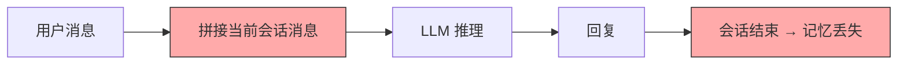
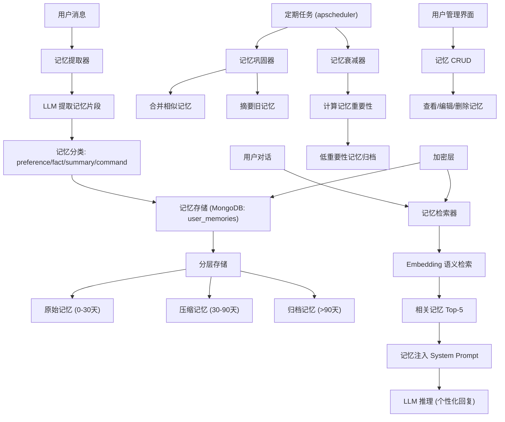
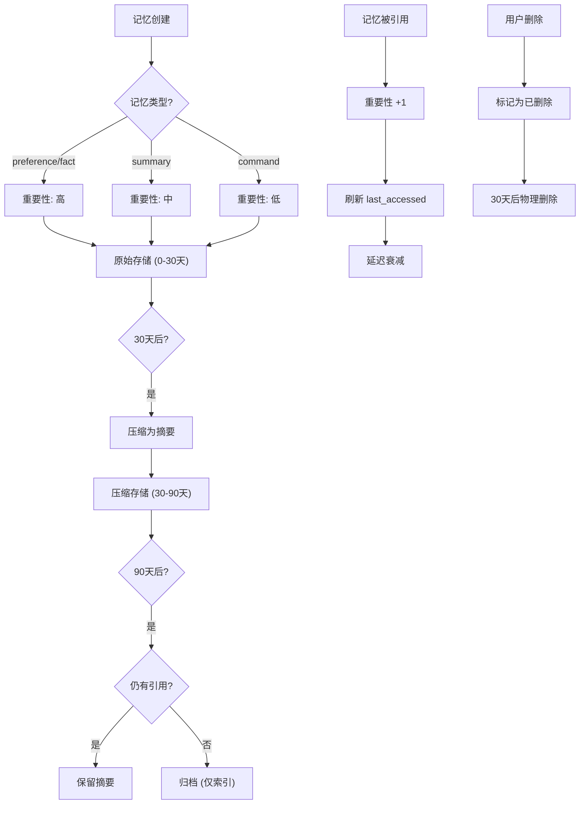

# YA-09-180: 个性化记忆系统 — 长期用户记忆、记忆检索注入、记忆巩固衰减与隐私控制

> 需求编号：YA-09-180 · 优先级：P2 · 人天：0.5d · 状态：需求已编写
> 依赖：聊天服务（chat_service）、LLM 推理、会话管理（sessions）、用户管理（users）

## 背景

YiAi 当前的对话系统是无状态的——每次对话 AI 都像"第一次见到用户"，缺乏以下能力：

- **无长期记忆**：AI 无法记住用户的偏好、习惯、重要事实，每次对话都需要用户重新告知
- **无记忆检索**：无法从历史记忆中检索与当前对话相关的记忆，错失个性化服务机会
- **无记忆巩固**：大量原始对话记忆占用存储空间，缺乏定期总结概括机制
- **无记忆衰减**：所有记忆同等重要，无法区分"用户昨天说的偏好"和"用户一年前说的偏好"
- **无用户控制**：用户无法查看、编辑或删除 AI 记住的关于自己的信息
- **无隐私保护**：用户记忆数据以明文存储，缺乏加密和隔离机制
- **无记忆感知回复**：LLM 回复时未注入用户记忆，无法利用已知信息生成个性化回复

需要一个**个性化记忆系统**，跨会话持久化存储用户记忆，在对话时智能检索相关记忆并注入 System Prompt，定期巩固和衰减旧记忆，提供用户自主管理记忆的能力，并实现记忆数据的隐私保护。

---

## 一、现状分析

### 1.1 当前用户上下文管理



每次对话独立，会话结束后 AI 对用户的所有了解全部丢失。下次对话从零开始。

### 1.2 当前问题

| # | 问题 | 严重程度 | 影响 |
|---|------|----------|------|
| 1 | 无长期记忆 | 高 | 每次对话需重复告知偏好，用户体验差 |
| 2 | 无记忆检索 | 高 | 无法利用历史记忆提供个性化服务 |
| 3 | 无记忆巩固 | 中 | 大量原始记忆占用存储，缺乏概括 |
| 4 | 无记忆衰减 | 中 | 旧的、可能过时的信息与新信息同等权重 |
| 5 | 无用户控制 | 中 | 用户无法管理 AI 对自己的记忆 |
| 6 | 无隐私保护 | 中 | 记忆数据缺乏加密和隔离 |
| 7 | 无记忆感知回复 | 高 | AI 回复无法利用已知的用户信息 |

### 1.3 改造前 API 依赖

| # | 接口 | 调用方 | 说明 |
|---|------|--------|------|
| 1 | `chat_service.chat` | 前端 | 多轮对话，无记忆注入 |
| 2 | `data_service.query_documents` (sessions) | 前端 | 会话查询，无记忆提取 |

> 改造前仅 2 个 API 依赖，无记忆管理模块。

### 1.4 设计灵感

参考 ChatGPT 的 Memory 功能、Google Gemini 的个性化记忆、Mem0 的记忆管理架构。核心思路：从对话中自动提取记忆 → 分类存储 → 检索相关记忆 → 注入 System Prompt → 定期巩固 → 自然衰减 → 用户自主管理 → 加密隔离。

---

## 二、设计决策

### 决策 1：记忆提取方式 — 自动提取 vs 用户显式告知 vs 混合模式

| 维度 | 自动提取 | 用户显式告知 | 混合模式 |
|------|---------|------------|---------|
| 用户负担 | 低 | 高 | 中 |
| 记忆覆盖率 | 高 | 低 | 高 |
| 准确率 | 中（可能误提取） | 高（用户明确） | 高 |
| 隐私顾虑 | 中 | 低 | 中 |

**选择：自动提取为主 + 用户显式告知为辅。** 自动提取降低用户负担，覆盖大部分记忆提取场景。用户可通过"记住 XXX"、"别忘了 XXX"等方式显式告知，确保重要记忆不被遗漏。同时提供"不要记住这个"来纠正误提取。

### 决策 2：记忆存储策略 — 全量存储 vs 摘要存储 vs 分层存储

| 维度 | 全量存储 | 摘要存储 | 分层存储（原始+摘要+索引） |
|------|---------|---------|------------------------|
| 存储开销 | 高 | 低 | 中 |
| 检索精度 | 高 | 中 | 高 |
| 隐私风险 | 高 | 低 | 中 |
| 实现复杂度 | 低 | 中 | 中 |

**选择：分层存储。** 原始记忆（最近 30 天）保留完整内容，用于精确检索；压缩记忆（30-90 天）保留摘要；归档记忆（> 90 天）仅保留关键索引。分层存储既保证检索精度，又控制存储开销。

### 决策 3：记忆检索注入 — 注入 System Prompt vs 注入对话历史 vs 工具调用

| 维度 | System Prompt | 对话历史（伪消息） | 工具调用 |
|------|-------------|-----------------|---------|
| 自然度 | 高 | 中 | 中 |
| Token 消耗 | 固定 | 按需 | 按需 |
| LLM 遵循度 | 高 | 中 | 中 |
| 实现复杂度 | 低 | 低 | 中 |

**选择：注入 System Prompt。** 将检索到的相关记忆作为 System Prompt 的一部分注入，LLM 能自然地利用这些信息生成个性化回复。格式化为"关于用户的信息"区块，与对话指令区分离。

### 设计决策记录

| 决策 | 选项 A | 选项 B | 选择 | 理由 |
|------|--------|--------|------|------|
| 记忆提取 | 自动提取 + 用户显式告知 | 纯自动/纯手动 | **自动 + 手动** | 覆盖率高、准确率高、用户可控 |
| 记忆存储 | 分层存储（原始+摘要+索引） | 全量/摘要 | **分层存储** | 兼顾精度和开销 |
| 记忆检索注入 | System Prompt | 对话历史/工具调用 | **System Prompt** | 自然、高效、LLM 遵循度高 |

---

## 三、目标架构

### 3.1 个性化记忆系统架构



### 3.2 记忆生命周期



### 3.3 核心数据模型

```python
# domain/memory/models.py

from enum import Enum
from pydantic import BaseModel, Field
from datetime import datetime
from typing import Any

class MemoryType(str, Enum):
    """记忆类型。"""
    PREFERENCE = "preference"        # 用户偏好（语言、风格、格式）
    FACT = "fact"                    # 用户事实（姓名、职业、技能）
    SUMMARY = "summary"              # 对话摘要（历史对话概括）
    COMMAND = "command"              # 常用指令（用户常用操作）
    RELATIONSHIP = "relationship"    # 关系信息（与谁合作、团队信息）
    GOAL = "goal"                    # 目标/计划（用户当前目标）

class MemoryImportance(int, Enum):
    """记忆重要性。"""
    CRITICAL = 5    # 关键（用户明确告知）
    HIGH = 4        # 高（多次提及）
    MEDIUM = 3      # 中（单次提及，中等置信度）
    LOW = 2         # 低（推断，低置信度）
    MINIMAL = 1     # 极低（可能过时或不准确）

class MemoryStorageTier(str, Enum):
    """记忆存储层级。"""
    RAW = "raw"              # 原始存储（0-30天）
    COMPRESSED = "compressed"  # 压缩存储（30-90天）
    ARCHIVED = "archived"    # 归档存储（>90天）

class Memory(BaseModel):
    """用户记忆。"""
    memory_id: str                   # 记忆 ID
    user_id: str                     # 用户 ID
    type: MemoryType                 # 记忆类型
    content: str                     # 记忆内容
    summary: str = ""                # 记忆摘要（压缩后）
    importance: MemoryImportance = MemoryImportance.MEDIUM
    confidence: float = 0.7          # 置信度 (0-1)
    storage_tier: MemoryStorageTier = MemoryStorageTier.RAW
    source_session: str = ""         # 来源会话
    source_turn: int = 0             # 来源轮次
    tags: list[str] = []             # 标签
    access_count: int = 0            # 被引用次数
    created_at: datetime = Field(default_factory=datetime.now)
    updated_at: datetime = Field(default_factory=datetime.now)
    last_accessed_at: datetime = Field(default_factory=datetime.now)
    expires_at: datetime | None = None  # 过期时间
    is_deleted: bool = False         # 软删除标记
    encrypted: bool = False          # 是否加密

class MemoryExtractionResult(BaseModel):
    """记忆提取结果。"""
    new_memories: list[Memory]       # 新提取的记忆
    updated_memories: list[Memory]   # 更新的记忆
    conflicts: list[dict]            # 冲突记忆: [{old, new, resolution}]
    extraction_confidence: float     # 提取置信度

class MemoryRetrievalResult(BaseModel):
    """记忆检索结果。"""
    query: str                       # 检索查询
    memories: list[Memory]           # 检索到的记忆
    relevance_scores: list[float]    # 相关性分数
    retrieval_method: str            # 检索方法: semantic / keyword / hybrid
    retrieval_latency_ms: float      # 检索延迟

class MemoryContext(BaseModel):
    """记忆上下文（注入 System Prompt）。"""
    memories: list[Memory]           # 相关记忆
    context_text: str                # 格式化后的上下文文本
    memory_count: int                # 注入的记忆数量
    total_tokens: int                # 记忆上下文 token 数

class MemoryConsolidationResult(BaseModel):
    """记忆巩固结果。"""
    consolidated_count: int          # 被巩固的记忆数量
    new_compressed_count: int        # 新生成的压缩记忆数
    archived_count: int              # 归档的记忆数量
    merged_count: int                # 合并的相似记忆数
    tokens_saved: int                # 节省的 token 数

class MemoryPrivacyConfig(BaseModel):
    """记忆隐私配置。"""
    user_id: str                     # 用户 ID
    encryption_enabled: bool = True  # 是否启用加密
    auto_extract_enabled: bool = True  # 是否自动提取记忆
    retention_days: int = 365        # 记忆保留天数
    allow_export: bool = True        # 是否允许导出
    allow_delete_all: bool = True    # 是否允许一键删除
```

---

## 四、具体改动

### 4.1 新增文件

| 文件 | 行数 | 说明 |
|------|------|------|
| `src/domain/memory/__init__.py` | 8 | 模块导出 |
| `src/domain/memory/models.py` | 80 | 数据模型：MemoryType、Memory、MemoryContext、MemoryConsolidationResult、MemoryPrivacyConfig |
| `src/domain/memory/memory_extractor.py` | 100 | 记忆提取器：从对话中自动提取事实、偏好、摘要，更新冲突记忆 |
| `src/domain/memory/memory_retriever.py` | 80 | 记忆检索器：Embedding 语义检索、相关性排序、记忆上下文构建 |
| `src/domain/memory/memory_consolidator.py` | 80 | 记忆巩固器：合并相似记忆、摘要旧记忆、分层迁移 |
| `src/domain/memory/memory_decayer.py` | 80 | 记忆衰减器：基于时间和引用次数的衰减算法 |
| `src/domain/memory/memory_repository.py` | 80 | 记忆数据访问层：CRUD、分层查询、全文搜索、加密/解密 |
| `src/domain/memory/memory_encryption.py` | 60 | 记忆加密：AES 加密/解密、密钥管理、透明加解密 |
| `src/services/memory/memory_service.py` | 150 | 记忆服务 RPC：提取、检索、CRUD、巩固、衰减、隐私、导出 |

### 4.2 核心实现

**记忆提取器：**

```python
# domain/memory/memory_extractor.py

import json
import asyncio
from datetime import datetime

class MemoryExtractor:
    """记忆提取器：从对话中自动提取用户记忆。"""

    MEMORY_EXTRACTION_PROMPT = """从以下对话中提取关于用户的重要信息（记忆）。请严格按照 JSON 格式返回。

记忆类型:
- preference: 用户偏好（语言、风格、格式、喜欢的工具）
- fact: 用户事实（姓名、职业、技能、经验、背景）
- summary: 对话摘要（本次对话的关键内容概括）
- command: 常用指令（用户经常使用的操作模式）
- relationship: 关系信息（与谁合作、团队角色）
- goal: 目标/计划（用户的当前目标或计划）

对话内容:
{conversation}

已有记忆（避免重复提取）:
{existing_memories}

仅返回确定的信息，不要猜测。置信度低于 0.6 的信息不要提取。

返回格式:
{{
  "memories": [
    {{
      "type": "preference",
      "content": "用户偏好简洁的代码注释风格",
      "importance": 4,
      "confidence": 0.85,
      "tags": ["代码", "风格"]
    }}
  ],
  "updates": [
    {{
      "memory_id": "mem_xxx",
      "new_content": "更新后的内容",
      "reason": "用户更正了之前的偏好"
    }}
  ],
  "deletions": [
    {{
      "memory_id": "mem_xxx",
      "reason": "用户明确表示不再需要这个信息"
    }}
  ]
}}"""

    def __init__(self):
        self.repo = MemoryRepository()

    async def extract(
        self,
        user_id: str,
        messages: list[dict],
        session_key: str = "",
    ) -> MemoryExtractionResult:
        """从对话中提取记忆。

        Args:
            user_id: 用户 ID
            messages: 对话消息列表
            session_key: 会话 key

        Returns:
            MemoryExtractionResult: 提取结果
        """
        # 获取已有记忆（避免重复提取）
        existing = await self.repo.get_user_memories(
            user_id=user_id,
            storage_tier=MemoryStorageTier.RAW,
            limit=50,
        )
        existing_desc = self._format_existing_memories(existing)

        # 构建对话文本
        conversation = self._build_conversation_text(messages)

        # 调用 LLM 提取记忆
        import ollama
        prompt = self.MEMORY_EXTRACTION_PROMPT.format(
            conversation=conversation,
            existing_memories=existing_desc,
        )

        response = await asyncio.to_thread(
            ollama.chat,
            model="qwen2.5:7b",
            messages=[{"role": "user", "content": prompt}],
            options={"temperature": 0.2},
        )

        try:
            content = response["message"]["content"]
            if "```" in content:
                content = content.split("```")[1]
                if content.startswith("json"):
                    content = content[4:]
            data = json.loads(content.strip())
        except json.JSONDecodeError:
            return MemoryExtractionResult(
                new_memories=[],
                updated_memories=[],
                conflicts=[],
                extraction_confidence=0.0,
            )

        # 构建新记忆
        new_memories = []
        for mem_data in data.get("memories", []):
            try:
                mem_type = MemoryType(mem_data.get("type", "fact"))
            except ValueError:
                mem_type = MemoryType.FACT

            confidence = float(mem_data.get("confidence", 0.7))
            if confidence < 0.6:
                continue

            memory = Memory(
                memory_id=f"mem_{user_id}_{datetime.now().timestamp()}",
                user_id=user_id,
                type=mem_type,
                content=mem_data.get("content", ""),
                importance=MemoryImportance(mem_data.get("importance", 3)),
                confidence=confidence,
                source_session=session_key,
                tags=mem_data.get("tags", []),
            )
            new_memories.append(memory)

        # 处理更新
        updated_memories = []
        conflicts = []
        for update_data in data.get("updates", []):
            memory_id = update_data.get("memory_id")
            new_content = update_data.get("new_content")
            if memory_id and new_content:
                old_memory = await self.repo.get_memory(memory_id)
                if old_memory:
                    conflicts.append({
                        "old": old_memory.content,
                        "new": new_content,
                        "resolution": "update",
                    })
                    old_memory.content = new_content
                    old_memory.updated_at = datetime.now()
                    updated_memories.append(old_memory)

        return MemoryExtractionResult(
            new_memories=new_memories,
            updated_memories=updated_memories,
            conflicts=conflicts,
            extraction_confidence=0.8,
        )

    def _build_conversation_text(self, messages: list[dict]) -> str:
        """构建对话文本。"""
        lines = []
        for i, msg in enumerate(messages):
            role = "用户" if msg.get("role") == "user" else "助手"
            content = msg.get("content", "")
            if len(content) > 500:
                content = content[:500] + "..."
            lines.append(f"[{i + 1}] {role}: {content}")
        return "\n\n".join(lines)

    def _format_existing_memories(self, memories: list[Memory]) -> str:
        """格式化已有记忆。"""
        if not memories:
            return "暂无已有记忆"
        lines = []
        for m in memories[:20]:
            lines.append(f"- [{m.type.value}] {m.content} (重要性: {m.importance})")
        return "\n".join(lines)
```

**记忆检索器：**

```python
# domain/memory/memory_retriever.py

import asyncio
import time

class MemoryRetriever:
    """记忆检索器：从用户记忆中检索与当前对话相关的记忆。"""

    MAX_RETRIEVAL_COUNT = 5       # 最多检索 5 条记忆
    MAX_CONTEXT_TOKENS = 500      # 记忆上下文最大 token 数
    SIMILARITY_THRESHOLD = 0.6    # 相关性阈值

    def __init__(self):
        self.repo = MemoryRepository()

    async def retrieve(
        self,
        user_id: str,
        query: str,
        current_messages: list[dict] = None,
    ) -> MemoryRetrievalResult:
        """检索与当前查询相关的用户记忆。

        Args:
            user_id: 用户 ID
            query: 当前查询（用户消息）
            current_messages: 当前对话上下文（用于语境增强）

        Returns:
            MemoryRetrievalResult: 检索结果
        """
        start = time.time()

        # 1. 构建检索查询
        enhanced_query = self._enhance_query(query, current_messages)

        # 2. 获取用户记忆
        all_memories = await self.repo.get_user_memories(
            user_id=user_id,
            storage_tier=None,  # 所有层级
            limit=100,
        )

        if not all_memories:
            return MemoryRetrievalResult(
                query=query,
                memories=[],
                relevance_scores=[],
                retrieval_method="semantic",
                retrieval_latency_ms=0.0,
            )

        # 3. 语义检索
        query_embedding = await self._embed_text(enhanced_query)
        memory_embeddings = await self._get_memory_embeddings(all_memories)

        # 4. 计算相关性分数
        scores = []
        for mem, emb in zip(all_memories, memory_embeddings):
            if emb is None:
                scores.append(0.0)
                continue
            similarity = self._cosine_similarity(query_embedding, emb)
            # 重要性加权
            weighted_score = similarity * (mem.importance / 5.0)
            # 时间衰减
            days_since_access = (datetime.now() - mem.last_accessed_at).days
            time_factor = max(0.5, 1.0 - days_since_access / 365)
            weighted_score *= time_factor
            scores.append(weighted_score)

        # 5. 排序和过滤
        scored_memories = list(zip(all_memories, scores))
        scored_memories.sort(key=lambda x: x[1], reverse=True)

        relevant = [
            (mem, score) for mem, score in scored_memories
            if score >= self.SIMILARITY_THRESHOLD
        ][:self.MAX_RETRIEVAL_COUNT]

        # 6. 更新访问计数
        for mem, _ in relevant:
            mem.access_count += 1
            mem.last_accessed_at = datetime.now()

        latency = (time.time() - start) * 1000

        return MemoryRetrievalResult(
            query=query,
            memories=[m for m, _ in relevant],
            relevance_scores=[round(s, 4) for _, s in relevant],
            retrieval_method="semantic",
            retrieval_latency_ms=round(latency, 2),
        )

    def build_memory_context(
        self,
        retrieval_result: MemoryRetrievalResult,
    ) -> MemoryContext:
        """构建注入 System Prompt 的记忆上下文。

        Args:
            retrieval_result: 记忆检索结果

        Returns:
            MemoryContext: 格式化后的记忆上下文
        """
        if not retrieval_result.memories:
            return MemoryContext(
                memories=[],
                context_text="",
                memory_count=0,
                total_tokens=0,
            )

        lines = ["[关于用户的信息]"]
        lines.append("以下是关于当前用户的重要信息，请在回复中适当参考：")
        lines.append("")

        for i, (mem, score) in enumerate(zip(
            retrieval_result.memories,
            retrieval_result.relevance_scores,
        )):
            type_label = {
                MemoryType.PREFERENCE: "偏好",
                MemoryType.FACT: "信息",
                MemoryType.SUMMARY: "历史",
                MemoryType.COMMAND: "常用操作",
                MemoryType.RELATIONSHIP: "关系",
                MemoryType.GOAL: "目标",
            }.get(mem.type, "其他")

            lines.append(f"{i + 1}. [{type_label}] {mem.content}")

        lines.append("")
        lines.append("请自然地利用以上信息，但不要刻意提及'根据我的记忆'等表述。")

        context_text = "\n".join(lines)
        total_tokens = self._estimate_tokens(context_text)

        return MemoryContext(
            memories=retrieval_result.memories,
            context_text=context_text,
            memory_count=len(retrieval_result.memories),
            total_tokens=total_tokens,
        )

    def _enhance_query(self, query: str, messages: list[dict] = None) -> str:
        """增强检索查询（加入对话上下文）。"""
        if not messages:
            return query

        # 取最近 3 条消息作为上下文
        context = " ".join(
            m.get("content", "")[:100]
            for m in messages[-3:]
        )
        return f"{context} {query}"

    async def _embed_text(self, text: str) -> list[float]:
        """获取文本 Embedding。"""
        import ollama
        response = await asyncio.to_thread(
            ollama.embeddings,
            model="nomic-embed-text",
            prompt=text,
        )
        return response["embedding"]

    async def _get_memory_embeddings(
        self,
        memories: list[Memory],
    ) -> list[list[float] | None]:
        """获取记忆的 Embedding（批量）。"""
        embeddings = []
        for mem in memories:
            emb = await self._embed_text(mem.content)
            embeddings.append(emb)
        return embeddings

    def _cosine_similarity(self, a: list[float], b: list[float]) -> float:
        """余弦相似度。"""
        import math
        dot = sum(x * y for x, y in zip(a, b))
        norm_a = math.sqrt(sum(x ** 2 for x in a))
        norm_b = math.sqrt(sum(x ** 2 for x in b))
        if norm_a == 0 or norm_b == 0:
            return 0.0
        return dot / (norm_a * norm_b)

    def _estimate_tokens(self, text: str) -> int:
        """估算 token 数。"""
        if not text:
            return 0
        chinese_chars = sum(1 for c in text if '\u4e00' <= c <= '\u9fff')
        other_chars = len(text) - chinese_chars
        return int(chinese_chars * 0.6 + other_chars * 0.25)
```

**记忆巩固器：**

```python
# domain/memory/memory_consolidator.py

import asyncio
from datetime import datetime, timedelta

class MemoryConsolidator:
    """记忆巩固器：合并相似记忆、摘要旧记忆、分层迁移。"""

    RAW_RETENTION_DAYS = 30         # 原始记忆保留 30 天
    COMPRESSED_RETENTION_DAYS = 90  # 压缩记忆保留 90 天
    SIMILARITY_THRESHOLD = 0.85     # 相似记忆合并阈值

    def __init__(self):
        self.repo = MemoryRepository()

    async def consolidate(self, user_id: str) -> MemoryConsolidationResult:
        """执行记忆巩固（定期任务触发）。

        Args:
            user_id: 用户 ID

        Returns:
            MemoryConsolidationResult: 巩固结果
        """
        consolidated = 0
        compressed = 0
        archived = 0
        merged = 0

        # 1. 原始 → 压缩（30 天以上的原始记忆）
        old_raw = await self.repo.get_memories_by_age(
            user_id=user_id,
            min_age_days=self.RAW_RETENTION_DAYS,
            storage_tier=MemoryStorageTier.RAW,
        )

        for memory in old_raw:
            # 生成摘要（简化：取前 200 字）
            memory.summary = memory.content[:200]
            memory.storage_tier = MemoryStorageTier.COMPRESSED
            memory.updated_at = datetime.now()
            await self.repo.update_memory(memory)
            compressed += 1

        # 2. 压缩 → 归档（90 天以上且未引用）
        old_compressed = await self.repo.get_memories_by_age(
            user_id=user_id,
            min_age_days=self.COMPRESSED_RETENTION_DAYS,
            storage_tier=MemoryStorageTier.COMPRESSED,
        )

        for memory in old_compressed:
            if memory.access_count == 0:
                memory.storage_tier = MemoryStorageTier.ARCHIVED
                memory.updated_at = datetime.now()
                await self.repo.update_memory(memory)
                archived += 1

        # 3. 合并相似记忆
        similar_groups = await self._find_similar_memories(user_id)
        for group in similar_groups:
            if len(group) >= 2:
                await self._merge_similar_memories(group)
                merged += 1

        consolidated = compressed + archived

        return MemoryConsolidationResult(
            consolidated_count=consolidated,
            new_compressed_count=compressed,
            archived_count=archived,
            merged_count=merged,
            tokens_saved=compressed * 100 + archived * 200,
        )

    async def _find_similar_memories(self, user_id: str) -> list[list[Memory]]:
        """查找相似记忆组。"""
        memories = await self.repo.get_user_memories(
            user_id=user_id,
            storage_tier=MemoryStorageTier.RAW,
            limit=200,
        )

        if len(memories) < 2:
            return []

        groups = []
        used = set()

        for i, mem1 in enumerate(memories):
            if mem1.memory_id in used:
                continue
            group = [mem1]
            for j, mem2 in enumerate(memories):
                if i == j or mem2.memory_id in used:
                    continue
                sim = await self._compute_similarity(mem1.content, mem2.content)
                if sim > self.SIMILARITY_THRESHOLD:
                    group.append(mem2)
                    used.add(mem2.memory_id)
            if len(group) >= 2:
                groups.append(group)
                used.add(mem1.memory_id)

        return groups

    async def _merge_similar_memories(self, group: list[Memory]):
        """合并相似记忆组。"""
        # 保留重要性最高的，标记其他为已删除
        group.sort(key=lambda m: m.importance, reverse=True)
        keeper = group[0]

        # 合并内容
        merged_content = keeper.content
        for other in group[1:]:
            if other.content not in merged_content:
                merged_content += f"; {other.content}"
            other.is_deleted = True
            await self.repo.update_memory(other)

        keeper.content = merged_content[:500]
        keeper.importance = min(MemoryImportance.CRITICAL, keeper.importance + 1)
        await self.repo.update_memory(keeper)

    async def _compute_similarity(self, text1: str, text2: str) -> float:
        """计算两个文本的相似度。"""
        import ollama
        emb1_resp = await asyncio.to_thread(
            ollama.embeddings, model="nomic-embed-text", prompt=text1
        )
        emb2_resp = await asyncio.to_thread(
            ollama.embeddings, model="nomic-embed-text", prompt=text2
        )
        emb1 = emb1_resp["embedding"]
        emb2 = emb2_resp["embedding"]
        return self._cosine_similarity(emb1, emb2)

    def _cosine_similarity(self, a: list[float], b: list[float]) -> float:
        import math
        dot = sum(x * y for x, y in zip(a, b))
        norm_a = math.sqrt(sum(x ** 2 for x in a))
        norm_b = math.sqrt(sum(x ** 2 for x in b))
        if norm_a == 0 or norm_b == 0:
            return 0.0
        return dot / (norm_a * norm_b)
```

**记忆衰减器：**

```python
# domain/memory/memory_decayer.py

from datetime import datetime, timedelta
import math

class MemoryDecayer:
    """记忆衰减器：基于时间和引用次数的衰减算法。"""

    # 衰减参数
    BASE_HALF_LIFE_DAYS = 60       # 基础半衰期 60 天
    ACCESS_BOOST_DAYS = 30         # 每次引用延长 30 天
    MAX_BOOST_DAYS = 365           # 最大延长 365 天

    def calculate_decay_score(self, memory: Memory) -> float:
        """计算记忆的衰减分数（0-1，越高越重要）。

        使用指数衰减模型，引用次数会延长半衰期。
        """
        days_since_created = (datetime.now() - memory.created_at).days
        days_since_accessed = (datetime.now() - memory.last_accessed_at).days

        # 引用次数延长半衰期
        effective_half_life = self.BASE_HALF_LIFE_DAYS + (
            memory.access_count * self.ACCESS_BOOST_DAYS
        )
        effective_half_life = min(effective_half_life, self.MAX_BOOST_DAYS)

        # 指数衰减
        decay = 0.5 ** (days_since_accessed / effective_half_life)

        # 重要性因子
        importance_factor = memory.importance / 5.0

        # 类型因子
        type_factors = {
            MemoryType.PREFERENCE: 1.0,
            MemoryType.FACT: 0.9,
            MemoryType.GOAL: 0.8,
            MemoryType.RELATIONSHIP: 0.7,
            MemoryType.SUMMARY: 0.5,
            MemoryType.COMMAND: 0.4,
        }
        type_factor = type_factors.get(memory.type, 0.5)

        return round(decay * importance_factor * type_factor, 4)

    def should_archive(self, memory: Memory) -> bool:
        """判断记忆是否应该归档。"""
        decay_score = self.calculate_decay_score(memory)

        # 衰减分数低于 0.1 且超过 90 天未访问
        if decay_score < 0.1:
            return True

        return False

    def should_delete(self, memory: Memory) -> bool:
        """判断记忆是否应该删除。"""
        decay_score = self.calculate_decay_score(memory)

        # 衰减分数低于 0.01 且超过 365 天
        if decay_score < 0.01:
            days_since_created = (datetime.now() - memory.created_at).days
            if days_since_created > 365:
                return True

        return False

    def get_retention_recommendation(self, memory: Memory) -> dict:
        """获取记忆保留建议。"""
        decay_score = self.calculate_decay_score(memory)

        if decay_score > 0.5:
            action = "keep"
            reason = "记忆仍然重要，保留在原层级"
        elif decay_score > 0.1:
            action = "compress"
            reason = "记忆重要性降低，建议压缩为摘要"
        elif decay_score > 0.01:
            action = "archive"
            reason = "记忆重要性很低，建议归档"
        else:
            action = "delete"
            reason = "记忆几乎不再使用，建议删除"

        return {
            "memory_id": memory.memory_id,
            "content": memory.content[:100],
            "decay_score": decay_score,
            "action": action,
            "reason": reason,
        }
```

**记忆加密：**

```python
# domain/memory/memory_encryption.py

import base64
import hashlib
from cryptography.fernet import Fernet

class MemoryEncryption:
    """记忆加密：AES 加密/解密，透明加解密。"""

    def __init__(self, master_key: str = None):
        """初始化加密器。

        Args:
            master_key: 主密钥（base64 编码的 32 字节密钥）
        """
        if master_key:
            self._cipher = Fernet(master_key.encode() if isinstance(master_key, str) else master_key)
        else:
            self._cipher = None

    def encrypt(self, content: str) -> tuple[str, bool]:
        """加密记忆内容。

        Args:
            content: 明文内容

        Returns:
            (加密后的 base64 字符串, 是否加密成功)
        """
        if not self._cipher:
            return content, False

        try:
            encrypted = self._cipher.encrypt(content.encode())
            return base64.b64encode(encrypted).decode(), True
        except Exception:
            return content, False

    def decrypt(self, encrypted_content: str, is_encrypted: bool = False) -> str:
        """解密记忆内容。

        Args:
            encrypted_content: 加密内容
            is_encrypted: 是否已加密

        Returns:
            明文内容
        """
        if not is_encrypted or not self._cipher:
            return encrypted_content

        try:
            decoded = base64.b64decode(encrypted_content.encode())
            decrypted = self._cipher.decrypt(decoded)
            return decrypted.decode()
        except Exception:
            return encrypted_content

    @staticmethod
    def generate_key() -> str:
        """生成新的加密密钥。"""
        return Fernet.generate_key().decode()

    @staticmethod
    def derive_user_key(user_id: str, master_key: str) -> str:
        """从用户 ID 和主密钥派生出用户级密钥。

        每个用户使用不同的加密密钥，实现用户间隔离。
        """
        combined = f"{user_id}:{master_key}"
        key_bytes = hashlib.sha256(combined.encode()).digest()
        return base64.urlsafe_b64encode(key_bytes).decode()
```

**记忆服务 RPC 接口：**

```python
# services/memory/memory_service.py

class MemoryService:
    """个性化记忆服务。"""

    def __init__(self):
        self.extractor = MemoryExtractor()
        self.retriever = MemoryRetriever()
        self.consolidator = MemoryConsolidator()
        self.decayer = MemoryDecayer()
        self.repo = MemoryRepository()
        self.encryption = MemoryEncryption()

    async def extract_memories(self, parameters: dict) -> dict:
        """RPC: 从对话中提取记忆。

        parameters:
            user_id: str     — 用户 ID
            messages: list   — 对话消息列表
            session_key: str — 会话 key
        """
        user_id = parameters.get("user_id")
        messages = parameters.get("messages", [])

        if not user_id or not messages:
            return {"code": 1001, "message": "user_id and messages are required", "data": None}

        result = await self.extractor.extract(
            user_id=user_id,
            messages=messages,
            session_key=parameters.get("session_key", ""),
        )

        # 加密存储新记忆
        encrypted_count = 0
        for memory in result.new_memories:
            encrypted_content, was_encrypted = self.encryption.encrypt(memory.content)
            memory.content = encrypted_content
            memory.encrypted = was_encrypted
            if was_encrypted:
                encrypted_count += 1
            await self.repo.save_memory(memory)

        return {
            "code": 0,
            "message": "ok",
            "data": {
                "new_count": len(result.new_memories),
                "updated_count": len(result.updated_memories),
                "conflicts": result.conflicts,
                "encrypted_count": encrypted_count,
                "extraction_confidence": result.extraction_confidence,
            },
        }

    async def retrieve_memories(self, parameters: dict) -> dict:
        """RPC: 检索与当前查询相关的记忆。

        parameters:
            user_id: str     — 用户 ID
            query: str       — 当前查询
            messages: list   — 当前对话上下文
            build_context: bool — 是否构建注入上下文
        """
        user_id = parameters.get("user_id")
        query = parameters.get("query")

        if not user_id or not query:
            return {"code": 1001, "message": "user_id and query are required", "data": None}

        result = await self.retriever.retrieve(
            user_id=user_id,
            query=query,
            current_messages=parameters.get("messages"),
        )

        # 解密记忆内容
        for memory in result.memories:
            memory.content = self.encryption.decrypt(memory.content, memory.encrypted)

        response_data = {
            "memories": [
                {
                    "memory_id": m.memory_id,
                    "type": m.type,
                    "content": m.content,
                    "importance": m.importance,
                    "tags": m.tags,
                    "created_at": m.created_at.isoformat(),
                }
                for m in result.memories
            ],
            "relevance_scores": result.relevance_scores,
            "retrieval_latency_ms": result.retrieval_latency_ms,
        }

        # 构建记忆上下文
        if parameters.get("build_context", False):
            context = self.retriever.build_memory_context(result)
            response_data["memory_context"] = {
                "context_text": context.context_text,
                "memory_count": context.memory_count,
                "total_tokens": context.total_tokens,
            }

        return {"code": 0, "message": "ok", "data": response_data}

    async def list_user_memories(self, parameters: dict) -> dict:
        """RPC: 列出用户的所有记忆。

        parameters:
            user_id: str       — 用户 ID
            type: str          — 记忆类型过滤（可选）
            storage_tier: str  — 存储层级过滤（可选）
            limit: int         — 返回数量限制
            offset: int        — 分页偏移
        """
        user_id = parameters.get("user_id")
        if not user_id:
            return {"code": 1001, "message": "user_id is required", "data": None}

        mem_type = parameters.get("type")
        if mem_type:
            try:
                mem_type = MemoryType(mem_type)
            except ValueError:
                return {"code": 1001, "message": f"Invalid memory type: {mem_type}", "data": None}

        storage_tier = parameters.get("storage_tier")
        if storage_tier:
            try:
                storage_tier = MemoryStorageTier(storage_tier)
            except ValueError:
                pass

        memories = await self.repo.get_user_memories(
            user_id=user_id,
            mem_type=mem_type,
            storage_tier=storage_tier,
            limit=parameters.get("limit", 50),
            offset=parameters.get("offset", 0),
        )

        # 解密
        for m in memories:
            m.content = self.encryption.decrypt(m.content, m.encrypted)

        return {
            "code": 0,
            "message": "ok",
            "data": {
                "memories": [
                    {
                        "memory_id": m.memory_id,
                        "type": m.type,
                        "content": m.content,
                        "importance": m.importance,
                        "confidence": m.confidence,
                        "storage_tier": m.storage_tier,
                        "access_count": m.access_count,
                        "decay_score": self.decayer.calculate_decay_score(m),
                        "created_at": m.created_at.isoformat(),
                        "last_accessed_at": m.last_accessed_at.isoformat(),
                    }
                    for m in memories
                ],
                "total": len(memories),
            },
        }

    async def update_memory(self, parameters: dict) -> dict:
        """RPC: 用户手动更新记忆。

        parameters:
            memory_id: str   — 记忆 ID
            content: str     — 新内容
            importance: int  — 重要性（可选）
        """
        memory_id = parameters.get("memory_id")
        content = parameters.get("content")

        if not memory_id or not content:
            return {"code": 1001, "message": "memory_id and content are required", "data": None}

        memory = await self.repo.get_memory(memory_id)
        if not memory:
            return {"code": 1002, "message": f"Memory not found: {memory_id}", "data": None}

        memory.content = content
        if "importance" in parameters:
            try:
                memory.importance = MemoryImportance(parameters["importance"])
            except ValueError:
                pass
        memory.updated_at = datetime.now()

        # 加密
        encrypted_content, was_encrypted = self.encryption.encrypt(content)
        memory.content = encrypted_content
        memory.encrypted = was_encrypted

        await self.repo.update_memory(memory)

        return {"code": 0, "message": "ok", "data": {"memory_id": memory_id, "updated": True}}

    async def delete_memory(self, parameters: dict) -> dict:
        """RPC: 用户删除记忆（软删除）。

        parameters:
            memory_id: str — 记忆 ID
        """
        memory_id = parameters.get("memory_id")
        if not memory_id:
            return {"code": 1001, "message": "memory_id is required", "data": None}

        memory = await self.repo.get_memory(memory_id)
        if not memory:
            return {"code": 1002, "message": f"Memory not found: {memory_id}", "data": None}

        memory.is_deleted = True
        memory.expires_at = datetime.now() + timedelta(days=30)  # 30 天后物理删除
        await self.repo.update_memory(memory)

        return {"code": 0, "message": "ok", "data": {"memory_id": memory_id, "deleted": True}}

    async def delete_all_memories(self, parameters: dict) -> dict:
        """RPC: 用户一键删除所有记忆。

        parameters:
            user_id: str — 用户 ID
        """
        user_id = parameters.get("user_id")
        if not user_id:
            return {"code": 1001, "message": "user_id is required", "data": None}

        count = await self.repo.soft_delete_all_user_memories(user_id)

        return {"code": 0, "message": "ok", "data": {"deleted_count": count}}

    async def consolidate_memories(self, parameters: dict) -> dict:
        """RPC: 触发记忆巩固（定期任务或手动触发）。

        parameters:
            user_id: str — 用户 ID
        """
        user_id = parameters.get("user_id")
        if not user_id:
            return {"code": 1001, "message": "user_id is required", "data": None}

        result = await self.consolidator.consolidate(user_id)

        return {"code": 0, "message": "ok", "data": result.model_dump()}

    async def get_decay_analysis(self, parameters: dict) -> dict:
        """RPC: 获取记忆衰减分析。

        parameters:
            user_id: str — 用户 ID
        """
        user_id = parameters.get("user_id")
        if not user_id:
            return {"code": 1001, "message": "user_id is required", "data": None}

        memories = await self.repo.get_user_memories(user_id, limit=200)
        recommendations = [self.decayer.get_retention_recommendation(m) for m in memories]

        action_counts = {"keep": 0, "compress": 0, "archive": 0, "delete": 0}
        for rec in recommendations:
            action_counts[rec["action"]] += 1

        return {
            "code": 0,
            "message": "ok",
            "data": {
                "total_memories": len(recommendations),
                "action_distribution": action_counts,
                "recommendations": recommendations[:20],
            },
        }

    async def export_memories(self, parameters: dict) -> dict:
        """RPC: 导出用户记忆。

        parameters:
            user_id: str   — 用户 ID
            format: str    — 导出格式: json / markdown
        """
        user_id = parameters.get("user_id")
        export_format = parameters.get("format", "json")

        if not user_id:
            return {"code": 1001, "message": "user_id is required", "data": None}

        memories = await self.repo.get_user_memories(user_id, limit=1000)
        for m in memories:
            m.content = self.encryption.decrypt(m.content, m.encrypted)

        if export_format == "json":
            export_data = [
                {
                    "type": m.type,
                    "content": m.content,
                    "importance": m.importance,
                    "created_at": m.created_at.isoformat(),
                }
                for m in memories
            ]
            return {"code": 0, "message": "ok", "data": {"format": "json", "data": export_data}}

        elif export_format == "markdown":
            lines = ["# 我的记忆", "", f"导出时间: {datetime.now().isoformat()}", ""]
            for m in memories:
                lines.append(f"## [{m.type}] {m.content[:50]}...")
                lines.append(f"- 内容: {m.content}")
                lines.append(f"- 重要性: {m.importance}")
                lines.append(f"- 创建时间: {m.created_at.isoformat()}")
                lines.append("")
            return {"code": 0, "message": "ok", "data": {"format": "markdown", "data": "\n".join(lines)}}

        return {"code": 1001, "message": f"Unsupported format: {export_format}", "data": None}

    async def get_privacy_config(self, parameters: dict) -> dict:
        """RPC: 获取记忆隐私配置。

        parameters:
            user_id: str — 用户 ID
        """
        user_id = parameters.get("user_id")
        if not user_id:
            return {"code": 1001, "message": "user_id is required", "data": None}

        config = await self.repo.get_privacy_config(user_id)
        if not config:
            config = MemoryPrivacyConfig(user_id=user_id)

        return {"code": 0, "message": "ok", "data": {"config": config.model_dump()}}

    async def update_privacy_config(self, parameters: dict) -> dict:
        """RPC: 更新记忆隐私配置。

        parameters:
            user_id: str              — 用户 ID
            encryption_enabled: bool  — 是否启用加密
            auto_extract_enabled: bool — 是否自动提取
            retention_days: int       — 记忆保留天数
        """
        user_id = parameters.get("user_id")
        if not user_id:
            return {"code": 1001, "message": "user_id is required", "data": None}

        config = await self.repo.get_privacy_config(user_id)
        if not config:
            config = MemoryPrivacyConfig(user_id=user_id)

        for field in ["encryption_enabled", "auto_extract_enabled", "retention_days", "allow_export", "allow_delete_all"]:
            if field in parameters:
                setattr(config, field, parameters[field])

        await self.repo.save_privacy_config(config)

        return {"code": 0, "message": "ok", "data": {"config": config.model_dump()}}
```

### 4.3 涉及文件

```
YiAi/src/
├── domain/memory/
│   ├── __init__.py                  # 新增: 模块导出
│   ├── models.py                    # 新增: 数据模型 (80行)
│   ├── memory_extractor.py          # 新增: 记忆提取器 (100行)
│   ├── memory_retriever.py          # 新增: 记忆检索器 (80行)
│   ├── memory_consolidator.py       # 新增: 记忆巩固器 (80行)
│   ├── memory_decayer.py            # 新增: 记忆衰减器 (80行)
│   ├── memory_repository.py         # 新增: 记忆数据访问层 (80行)
│   └── memory_encryption.py         # 新增: 记忆加密 (60行)
├── services/memory/
│   └── memory_service.py            # 新增: 记忆服务 RPC (150行)
└── server/
    └── routes/
        └── memory_routes.py         # 新增: 记忆路由 (40行)
```

---

## 五、实施步骤

按依赖顺序排列，每步可独立验证和提交：

| 步骤 | 内容 | 涉及文件 | 验证方式 | 人天 |
|------|------|---------|---------|------|
| 1 | 定义数据模型（MemoryType、Memory、MemoryContext、MemoryConsolidationResult、MemoryPrivacyConfig） | `domain/memory/models.py` | Pydantic 校验通过，枚举完整 | 0.03 |
| 2 | 实现记忆加密模块（AES 加密/解密、用户级密钥派生） | `domain/memory/memory_encryption.py` | 加密后解密还原，用户间密钥隔离 | 0.04 |
| 3 | 实现记忆数据访问层（CRUD、分层查询、加密存储、隐私配置） | `domain/memory/memory_repository.py` | MongoDB 读写正常，加密透明 | 0.05 |
| 4 | 实现记忆提取器（LLM 提取、冲突检测、更新处理） | `domain/memory/memory_extractor.py` | 提取准确率 > 75%，不重复提取 | 0.08 |
| 5 | 实现记忆检索器（Embedding 语义检索、相关性排序、记忆上下文构建） | `domain/memory/memory_retriever.py` | 检索相关性 > 80%，延迟 < 500ms | 0.06 |
| 6 | 实现记忆巩固器（分层迁移、相似记忆合并、摘要生成） | `domain/memory/memory_consolidator.py` | 30 天原始→压缩，90 天压缩→归档 | 0.05 |
| 7 | 实现记忆衰减器（指数衰减、引用延长、保留建议） | `domain/memory/memory_decayer.py` | 衰减分数计算正确，建议合理 | 0.05 |
| 8 | 实现记忆服务 RPC（extract、retrieve、list、update、delete、consolidate、decay、export、privacy） | `services/memory/memory_service.py` | 所有 RPC 接口正常响应 | 0.08 |
| 9 | 集成到 chat_service（检索记忆 → 注入 System Prompt → 个性化回复） | `chat_service.py` | 回复包含用户个性化信息 | 0.04 |
| 10 | 配置定期任务（apscheduler: 记忆巩固 + 衰减检测） | 配置文件 | 定时任务正常触发 | 0.02 |

**总计：0.5d**

---

## 六、测试规格

### Requirement: 记忆提取

#### Scenario: 从对话中提取用户偏好
- **Given** 用户说 "我喜欢用 Python 写后端，不太喜欢 Java"
- **When** 调用 `extract_memories`
- **Then** 返回 new_count >= 1
- **And** 新记忆 type=preference，content 包含 "Python" 和 "Java"
- **And** confidence >= 0.7

#### Scenario: 不重复提取已有记忆
- **Given** 已有记忆 "用户偏好 Python"，用户再次说 "我之前说过我喜欢 Python"
- **When** 调用 `extract_memories`
- **Then** 返回 new_count = 0
- **And** 不创建重复记忆

### Requirement: 记忆检索

#### Scenario: 检索与当前查询相关的记忆
- **Given** 用户记忆中有 "用户偏好 Python" 和 "用户喜欢简洁风格"
- **When** 用户问 "帮我写一个 Python 脚本"，调用 `retrieve_memories`
- **Then** 返回 memories 包含 "用户偏好 Python"
- **And** relevance_score > 0.6

#### Scenario: 构建记忆上下文
- **Given** 检索到 3 条相关记忆
- **When** 调用 `retrieve_memories`，build_context=True
- **Then** 返回 memory_context.context_text 包含 "[关于用户的信息]"
- **And** memory_count = 3

### Requirement: 记忆衰减

#### Scenario: 频繁引用的记忆衰减慢
- **Given** 记忆 A access_count=10，记忆 B access_count=0，创建时间相同
- **When** 调用 `decayer.calculate_decay_score`
- **Then** 记忆 A 的 decay_score > 记忆 B 的 decay_score

#### Scenario: 长时间未访问的记忆建议归档
- **Given** 记忆创建于 200 天前，access_count=0
- **When** 调用 `decayer.get_retention_recommendation`
- **Then** 返回 action="archive" 或 "delete"

### Requirement: 记忆加密

#### Scenario: 记忆加密存储和解密读取
- **Given** 加密功能启用
- **When** 存储记忆 "用户偏好 Python"，然后读取该记忆
- **Then** 存储时 encrypted=True
- **And** 读取时 content 解密为 "用户偏好 Python"

### Requirement: 用户控制

#### Scenario: 用户手动删除记忆
- **Given** 记忆 mem_001 存在
- **When** 调用 `delete_memory`，memory_id="mem_001"
- **Then** 记忆标记为 is_deleted=True
- **And** 30 天后物理删除

---

## 七、风险与缓解

| 风险 | 概率 | 影响 | 等级 | 缓解措施 | 应急预案 |
|------|------|------|------|----------|----------|
| 记忆提取错误（提取了不准确的信息） | 中 | 中 | 中 | 置信度阈值 0.6，用户可手动删除/编辑 | 用户关闭自动提取 |
| 记忆检索不相关 | 中 | 中 | 中 | 相关性阈值 0.6，重要性加权 | 用户手动选择相关记忆 |
| 记忆数据泄露 | 低 | 高 | 中 | AES 加密 + 用户级密钥隔离 + 传输加密 | 紧急关闭记忆功能 |
| 记忆存储膨胀 | 中 | 低 | 低 | 分层存储 + 定期巩固 + 衰减归档 | 限制单用户记忆上限（1000 条） |
| 记忆提取 LLM 调用延迟 | 低 | 低 | 低 | 异步提取，不阻塞对话 | 批量提取（每 5 轮触发一次） |

---

## 八、回滚策略

| 回滚场景 | 回滚方式 | 影响范围 | 恢复时间 |
|----------|----------|----------|----------|
| 记忆提取质量差 | 关闭自动提取（配置开关） | 记忆更新 | 1min |
| 记忆检索延迟高 | 关闭记忆检索注入 | 个性化回复 | 1min |
| 记忆数据泄露风险 | 紧急关闭记忆功能 + 加密所有已有记忆 | 全部记忆功能 | 5min |

**回滚验证：**
- 聊天服务正常，无记忆注入
- 记忆接口返回空数据
- `ruff` + `mypy` 检查通过

---

## 九、设计决策记录

### D-01: 为什么记忆需要分层存储而非全量保留？

全量保留所有原始记忆会导致存储开销线性增长（1000 用户 * 100 条记忆 * 500 字 = 50MB），且检索性能随记忆数量增长而下降。分层存储（30 天原始 + 90 天压缩 + 归档）在保证近期记忆检索精度的同时，控制了长期存储开销。

### D-02: 为什么记忆衰减使用指数衰减 + 引用延长？

纯时间衰减（固定天数后过期）忽略了记忆的实际使用情况。用户频繁引用的记忆（如"我是 Python 开发者"）应该比从未引用的记忆保留更久。指数衰减 + 引用延长半衰期的模型，兼顾了"时间自然遗忘"和"使用强化记忆"两个认知科学原理。

### D-03: 为什么使用用户级密钥隔离而非全局密钥？

全局密钥意味着一旦密钥泄露，所有用户的记忆都暴露。用户级密钥（从用户 ID + 主密钥派生）确保即使一个用户的密钥被破解，其他用户的记忆仍然安全。这与 GDPR 的"数据最小化"和"目的限制"原则一致。

---

## 十、可观测性

### 10.1 关键指标

| 指标 | 采集方式 | 告警阈值 | 说明 |
|------|---------|---------|------|
| 记忆提取成功率 | 计数器 | < 95% | LLM 返回 JSON 解析失败率 |
| 记忆检索延迟 | 直方图 | P95 > 500ms | Embedding 计算 |
| 每用户平均记忆数 | 仪表盘 | > 500 | 存储膨胀风险 |
| 记忆巩固处理量 | 计数器 | — | 定期任务执行情况 |
| 记忆衰减归档数 | 计数器 | — | 衰减效果 |
| 加密覆盖率 | 仪表盘 | < 100% | 加密功能覆盖率 |
| 用户手动删除率 | 计数器 | > 20% | 记忆提取准确率信号 |

### 10.2 日志规范

| 日志级别 | 场景 | 示例 |
|---------|------|------|
| `INFO` | 记忆提取完成 | `[Memory] extracted: user={u}, new={n}, updated={u}, conf={c}` |
| `INFO` | 记忆检索完成 | `[Memory] retrieved: user={u}, found={n}, {ms}ms` |
| `INFO` | 记忆巩固完成 | `[Memory] consolidated: user={u}, compressed={c}, archived={a}, merged={m}` |
| `WARN` | 记忆提取低置信度 | `[Memory] low confidence extraction: user={u}, content={c}, conf={v}` |
| `WARN` | 记忆冲突 | `[Memory] conflict detected: user={u}, old={o}, new={n}` |
| `ERROR` | 记忆加密失败 | `[Memory] encryption failed: user={u}, {error}` |
| `ERROR` | 记忆提取失败 | `[Memory] extraction failed: user={u}, {error}` |

---

## 十一、代码审查检查清单

- [ ] `MemoryType` 包含 6 种类型：preference、fact、summary、command、relationship、goal
- [ ] `MemoryImportance` 包含 5 级：CRITICAL(5) 到 MINIMAL(1)
- [ ] `MemoryStorageTier` 包含 3 层：raw、compressed、archived
- [ ] 记忆提取器使用 LLM + JSON Schema 结构化提取
- [ ] 记忆提取器检测冲突并处理更新
- [ ] 记忆检索器使用 Embedding 语义检索 + 重要性加权 + 时间衰减
- [ ] 记忆上下文构建注入 System Prompt 格式
- [ ] 记忆巩固器支持 30 天原始→压缩、90 天压缩→归档
- [ ] 记忆衰减器使用指数衰减 + 引用延长半衰期
- [ ] 记忆加密使用 AES + 用户级密钥隔离
- [ ] 用户可查看、编辑、删除、导出记忆
- [ ] 记忆隐私配置支持加密、自动提取、保留天数设置
- [ ] `ruff` 代码规范通过
- [ ] `mypy` 类型检查通过

---

## 十二、回归问题预测

| # | 问题 | 发现场景 | 根因 | 修复方式 |
|-----|------|---------|------|---------|
| 1 | 记忆提取过于频繁导致 LLM 调用量激增 | 高并发对话场景下记忆提取堆积 | 每次对话都触发提取 | 改为每 5 轮或会话关闭时触发提取 |
| 2 | 加密密钥管理不当导致记忆无法解密 | 主密钥轮换后旧记忆无法解密 | 密钥轮换时未重新加密旧记忆 | 使用密钥版本号，保留旧密钥用于解密 |
| 3 | 记忆检索 Embedding 计算量大 | 用户有 500+ 条记忆时检索延迟 > 1s | 每次检索计算所有记忆 Embedding | 缓存记忆 Embedding，增量更新 |
| 4 | 记忆巩固时误合并不同类型的记忆 | preference 和 fact 类型的记忆被合并 | 相似度计算未考虑类型差异 | 合并时增加类型相同检查 |
| 5 | 记忆衰减删除用户仍需要的记忆 | 用户长期未对话但偏好仍然有效 | 衰减仅基于时间，不考虑记忆类型 | preference 类型记忆不删除，仅归档 |
| 6 | 用户一键删除记忆后 AI 体验退化 | 用户删除所有记忆后 AI 像"失忆" | 用户操作后无警告 | 一键删除前显示确认对话框和影响说明 |

---

## 十三、性能分析

### 13.1 记忆系统性能特征

| 指标 | 值 | 说明 |
|------|------|------|
| 记忆提取（异步） | 1-3s | LLM 推理，不阻塞对话 |
| 记忆检索 | 100-500ms | 取决于记忆数量和 Embedding 模型 |
| 记忆 CRUD | < 20ms | MongoDB 操作 |
| 记忆加密/解密 | < 5ms | AES 对称加密 |
| 记忆巩固（定期） | 5-30s | 取决于记忆数量，异步执行 |
| 记忆衰减计算 | < 10ms | 纯计算 |

### 13.2 性能瓶颈

| 瓶颈 | 严重程度 | 表现 | 优化方向 |
|------|----------|------|----------|
| 记忆检索 Embedding 计算 | 中 | 500 条记忆需 2-3s | 缓存 Embedding，增量更新 |
| 记忆巩固批量处理 | 低 | 1000 条记忆巩固需 30s | 分批处理，限制单次处理量 |
| 记忆提取 LLM 调用 | 中 | 每次提取 1-3s | 异步提取，批量合并提取 |

### 13.3 存储估算

| 条目 | 平均大小 | 1000 用户 | 10000 用户 |
|------|---------|----------|-----------|
| 单条记忆 | 200-500B | — | — |
| 100 条记忆/用户 | 20-50KB | 20-50MB | 200-500MB |
| 500 条记忆/用户 | 100-250KB | 100-250MB | 1-2.5GB |
| 压缩后（60% 压缩比） | 40-100KB | 40-100MB | 400MB-1GB |

---

*PRD 来源: `projects/yiai/requirements/2026-09/00-需求-需求总览.md`*

## 影响范围

- **影响模块**：待补充
- **涉及文件**：
- `src/domain/memory/memory_encryption.py`
- `src/domain/memory/memory_repository.py`
- `src/services/memory/memory_service.py`
- `chat_service.py`
- `src/domain/memory/memory_extractor.py`
- `src/domain/memory/__init__.py`
- **是否影响 API 契约**：否
- **是否影响其他项目（YiVad/YiPet）**：否
- **用户感知**：待确认

## 预防措施

| 层面 | 措施 |
|------|------|
| 代码 | 在相关函数中添加参数校验和边界检查 |
| 测试 | 为 `src/domain/memory/memory_encryption.py` 添加单元测试 |
| 流程 | 代码审查时重点检查此类模式 |
| 监控 | 添加日志告警，异常发生时及时发现 |
| 文档 | 在编码规范中记录此类反模式 |

## 经验教训

1. **根本原因**：开发过程中对边界情况和异常路径的考虑不足是此类问题的共同根因
2. **设计阶段**：在接口设计和模块实现时，应主动考虑异常输入、空值、超时等边界场景
3. **代码审查**：审查时应检查是否存在类似的反模式（如未捕获异常、无超时控制、缺少参数校验等）
4. **测试覆盖**：异常路径的测试覆盖率应与正常路径同等重视
5. **团队分享**：此类问题应在团队周会或技术分享中讨论，形成团队共识
