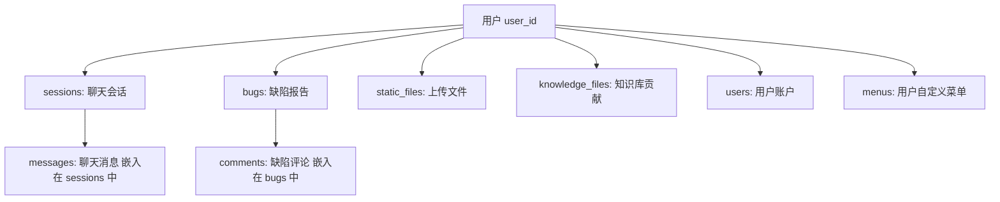
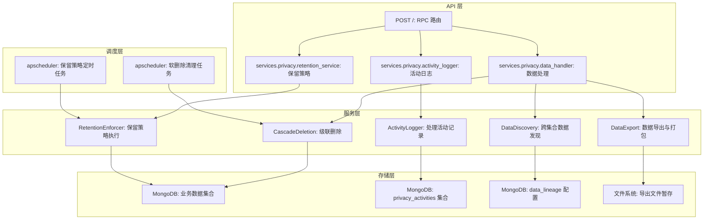
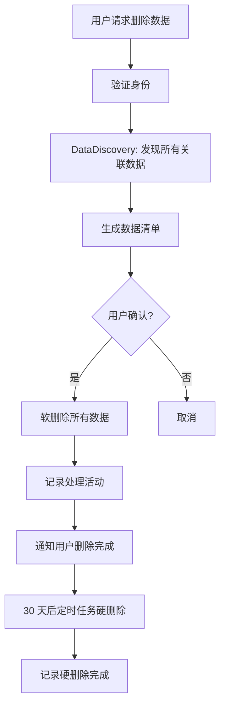

# YA-09-181: 数据导出与合规删除 — GDPR 合规数据导出、级联删除、数据保留策略与处理活动日志

> 需求编号：YA-09-181 · 优先级：P2 · 人天：0.3d · 状态：需求已编写
> 依赖：YA-09-70（GDPR 数据清除）、YA-09-05（审计日志）

## 背景

### 问题陈述

YiAi 作为所有前端项目的数据后端，存储了大量用户数据（聊天消息、会话、文件、知识库查询记录等）。当前缺乏系统化的 GDPR 合规工具，存在以下问题：

1. **无数据导出功能**：用户无法获取自己的数据副本，违反数据可携带权
2. **无数据删除功能**：用户无法请求删除数据，违反被遗忘权
3. **无数据保留策略**：数据无限期保留，缺乏自动清理机制
4. **无处理活动日志**：无法追溯数据的处理历史
5. **跨集合数据无法关联**：用户数据分散在多个 MongoDB 集合中，无法统一发现
6. **删除不完整**：删除用户数据时可能遗漏关联数据（级联删除不完整）

**核心矛盾**：用户数据分散在 6+ 个 MongoDB 集合中（sessions、bugs、static_files、knowledge_files、users、menus），需要跨集合的数据发现和级联删除机制。

### 影响范围

| # | 影响 | 严重程度 | 典型场景 |
|---|------|----------|----------|
| 1 | 无法导出用户数据 | 高 | 用户行使数据可携带权 |
| 2 | 无法删除用户数据 | 高 | 用户行使被遗忘权 |
| 3 | 数据无限期保留 | 中 | 存储空间持续增长 |
| 4 | 处理活动不可追溯 | 中 | 合规审计 |
| 5 | 删除不完整 | 高 | 用户数据残留 |

### 挑战

| 挑战 | 说明 |
|------|------|
| 跨集合数据发现 | 需要扫描所有集合，找出与用户关联的所有数据 |
| 级联删除 | 删除用户数据时需确保关联数据同步删除 |
| 数据保留策略 | 需要区分不同数据类型的不同保留期限 |
| 导出格式 | 需要结构化 JSON 格式便于数据可携带 |
| 处理活动日志 | 需要记录所有数据处理活动以满足合规审计 |

---

## 一、现状分析

### 1.1 当前数据管理现状

```
现有功能:
├── YA-09-70 GDPR 数据清除（基础功能）
│   ├── 简单的用户数据删除
│   └── 无数据发现/导出
├── YA-09-05 审计日志
│   ├── 操作日志记录
│   └── 无数据处理活动日志
├── 数据保留
│   └── 无自动清理策略

缺失:
├── 跨集合数据发现          # ❌ 不存在
├── 结构化数据导出          # ❌ 不存在
├── 级联删除机制            # ❌ 不存在
├── 数据保留策略引擎        # ❌ 不存在
├── 处理活动日志            # ❌ 不存在
├── 被遗忘权工作流          # ❌ 不存在
└── 合规报告生成            # ❌ 不存在
```

### 1.2 用户数据分布



### 1.3 根因矩阵

| 症状 | 根因 | 触发条件 | 频率 |
|------|------|----------|------|
| 无法导出数据 | 无跨集合数据发现和导出 | 用户请求数据导出 | 低 |
| 无法删除数据 | 无级联删除机制 | 用户请求数据删除 | 低 |
| 数据无限期保留 | 无数据保留策略 | 系统运行中 | 高 |
| 处理活动不可追溯 | 无处理活动日志 | 合规审计 | 中 |
| 删除不完整 | 无跨集合关联 | 删除操作 | 中 |

---

## 二、设计决策

### 决策 1：数据发现方式 — 按用户 ID 遍历 vs 数据血缘图 vs 预建索引

| 选项 | 查询效率 | 完整性 | 维护成本 |
|------|----------|--------|----------|
| 按用户 ID 遍历所有集合 | 低 | 高 | 低 |
| 数据血缘图（元数据驱动） | 高 | 高 | 中 |
| 预建索引（user_data_index 集合） | 最高 | 中 | 高 |

**选择：数据血缘图（元数据驱动）。** 在 `data_lineage` 配置中定义每个集合的用户关联字段，数据发现时根据配置自动扫描。新增集合时只需更新配置，无需修改代码。比遍历所有集合更高效（只扫描有用户关联的集合），比预建索引维护成本低。

### 决策 2：导出格式 — 单一 JSON vs 分类 JSON vs MongoDB dump

| 选项 | 可读性 | 可移植性 | 实现复杂度 |
|------|--------|----------|-----------|
| 单一 JSON 文件 | 中 | 高 | 低 |
| 分类 JSON（按集合） | 高 | 高 | 中 |
| MongoDB dump（BSON） | 低 | 低 | 低 |

**选择：分类 JSON + 元数据 manifest。** 按集合分类导出为独立 JSON 文件，打包为 ZIP 归档。manifest.json 包含导出时间、数据版本、集合概览。用户可单独查看每个集合的数据。

### 决策 3：删除策略 — 直接删除 vs 软删除 vs 软删除 + 定期清理

| 选项 | 可恢复性 | 存储效率 | 合规性 |
|------|----------|----------|--------|
| 直接删除 | 否 | 高 | 满足 |
| 软删除（标记删除） | 是 | 中 | 不满足 |
| 软删除 + 定期清理 | 是 | 中 | 满足 |

**选择：软删除（标记）+ 30 天后硬删除。** 删除操作先标记 `deleted: true` 和 `deleted_at` 时间戳，30 天后由定时任务真正删除。满足 GDPR 要求的同时提供后悔期（30 天内可恢复）。

### 决策 4：数据保留策略 — 统一期限 vs 分类期限 vs 分类期限 + 用户可配置

| 选项 | 灵活性 | 存储效率 | 复杂度 |
|------|--------|----------|--------|
| 统一期限（如 365 天） | 低 | 中 | 低 |
| 分类期限（按数据类型） | 高 | 高 | 中 |
| 分类期限 + 用户可配置 | 最高 | 最高 | 高 |

**选择：分类期限。** 不同数据类型有不同的保留需求：聊天消息 90 天、上传文件 365 天、审计日志 3 年、已删除数据 30 天。通过配置文件定义保留策略，定时任务自动清理过期数据。

### 设计决策记录

| 决策 | 选项 A | 选项 B | 选项 C | 选择 | 理由 |
|------|--------|--------|--------|------|------|
| 数据发现 | 遍历集合 | 血缘图 | 预建索引 | **血缘图** | 灵活 + 高效 |
| 导出格式 | 单一 JSON | 分类 JSON | MongoDB dump | **分类 JSON + ZIP** | 结构清晰 |
| 删除策略 | 直接删除 | 软删除 | 软删除 + 清理 | **软删除 + 30 天清理** | 合规 + 后悔期 |
| 保留策略 | 统一期限 | 分类期限 | 分类 + 可配置 | **分类期限** | 按需保留 |

---

## 三、目标架构

### 3.1 数据合规系统架构



### 3.2 被遗忘权工作流



### 3.3 性能指标

| 指标 | 改造前 | 改造后 |
|------|--------|--------|
| 数据发现（单用户） | N/A | < 500ms（扫描 6 个集合） |
| 数据导出（单用户） | N/A | < 2s（含 ZIP 打包） |
| 级联删除（单用户） | N/A | < 1s（软删除） |
| 保留策略执行 | 无 | 每日定时任务 |
| 处理活动日志写入 | 无 | < 5ms（异步写入） |

---

## 四、具体改动

### 4.1 数据血缘配置

```python
# services/privacy/data_lineage.py (新增)

DATA_LINEAGE_CONFIG = {
    "sessions": {
        "user_field": "user_id",
        "description": "聊天会话",
        "retention_days": 90,
        "cascade": {
            "embedded": ["messages"],  # 嵌入文档中的用户消息
        }
    },
    "bugs": {
        "user_field": "reporter_id",
        "description": "缺陷报告",
        "retention_days": 365,
        "cascade": {
            "references": {
                "bugs.comments": {
                    "user_field": "author_id",
                    "description": "缺陷评论",
                }
            }
        }
    },
    "static_files": {
        "user_field": "uploader_id",
        "description": "上传文件",
        "retention_days": 365,
        "cascade": {}
    },
    "knowledge_files": {
        "user_field": "contributor_id",
        "description": "知识库贡献",
        "retention_days": None,  # 永久保留
        "cascade": {}
    },
    "users": {
        "user_field": "_id",
        "description": "用户账户",
        "retention_days": None,  # 永久保留
        "cascade": {
            "references": {
                "menus": {
                    "user_field": "creator_id",
                    "description": "用户自定义菜单",
                }
            }
        }
    },
}
```

### 4.2 数据发现与导出服务

```python
# services/privacy/data_handler.py (新增)

import json
import zipfile
import io
from datetime import datetime, timedelta
from typing import Dict, List, Any, Optional
from motor.motor_asyncio import AsyncIOMotorDatabase
from .data_lineage import DATA_LINEAGE_CONFIG

class DataDiscovery:
    """跨集合数据发现服务"""

    def __init__(self, db: AsyncIOMotorDatabase):
        self.db = db
        self.lineage = DATA_LINEAGE_CONFIG

    async def discover_user_data(self, user_id: str) -> Dict[str, Any]:
        """发现用户在所有集合中的数据"""
        result = {
            "user_id": user_id,
            "discovery_time": datetime.utcnow().isoformat(),
            "collections": {},
        }

        for collection_name, config in self.lineage.items():
            user_field = config["user_field"]
            collection = self.db[collection_name]

            # 查询用户数据
            cursor = collection.find({user_field: user_id})
            documents = await cursor.to_list(length=None)

            if documents:
                # 处理 ObjectId 序列化
                serialized = []
                for doc in documents:
                    doc["_id"] = str(doc["_id"])
                    serialized.append(doc)

                result["collections"][collection_name] = {
                    "count": len(serialized),
                    "documents": serialized,
                    "description": config["description"],
                }

                # 处理级联引用
                for ref_col, ref_config in config.get("cascade", {}).get("references", {}).items():
                    ref_user_field = ref_config["user_field"]
                    ref_cursor = self.db[ref_col].find({ref_user_field: user_id})
                    ref_docs = await ref_cursor.to_list(length=None)
                    if ref_docs:
                        for doc in ref_docs:
                            doc["_id"] = str(doc["_id"])
                        result["collections"][ref_col] = {
                            "count": len(ref_docs),
                            "documents": ref_docs,
                            "description": ref_config["description"],
                        }

        return result

    async def export_user_data(self, user_id: str) -> bytes:
        """导出用户数据为 ZIP 文件"""
        data = await self.discover_user_data(user_id)

        # 创建 ZIP 文件
        zip_buffer = io.BytesIO()
        with zipfile.ZipFile(zip_buffer, 'w', zipfile.ZIP_DEFLATED) as zf:
            # 写入 manifest
            manifest = {
                "export_time": data["discovery_time"],
                "user_id": data["user_id"],
                "collections": {
                    name: {"count": info["count"], "description": info["description"]}
                    for name, info in data["collections"].items()
                },
            }
            zf.writestr("manifest.json", json.dumps(manifest, indent=2, ensure_ascii=False))

            # 按集合写入独立 JSON 文件
            for collection_name, info in data["collections"].items():
                filename = f"{collection_name}.json"
                content = json.dumps(info["documents"], indent=2, ensure_ascii=False)
                zf.writestr(filename, content.encode('utf-8'))

        zip_buffer.seek(0)
        return zip_buffer.getvalue()


class CascadeDeletion:
    """级联删除服务"""

    def __init__(self, db: AsyncIOMotorDatabase):
        self.db = db
        self.lineage = DATA_LINEAGE_CONFIG

    async def soft_delete_user_data(self, user_id: str) -> Dict[str, int]:
        """软删除用户所有数据"""
        deleted_counts = {}
        now = datetime.utcnow()

        for collection_name, config in self.lineage.items():
            user_field = config["user_field"]
            collection = self.db[collection_name]

            result = await collection.update_many(
                {user_field: user_id, "deleted": {"$ne": True}},
                {"$set": {"deleted": True, "deleted_at": now}}
            )
            deleted_counts[collection_name] = result.modified_count

            # 级联删除引用集合
            for ref_col, ref_config in config.get("cascade", {}).get("references", {}).items():
                ref_user_field = ref_config["user_field"]
                ref_result = await self.db[ref_col].update_many(
                    {ref_user_field: user_id, "deleted": {"$ne": True}},
                    {"$set": {"deleted": True, "deleted_at": now}}
                )
                deleted_counts[ref_col] = ref_result.modified_count

        return deleted_counts

    async def hard_delete_expired_data(self) -> Dict[str, int]:
        """硬删除超过保留期的已删除数据"""
        deleted_counts = {}
        cutoff = datetime.utcnow() - timedelta(days=30)

        for collection_name in self.lineage.keys():
            collection = self.db[collection_name]
            result = await collection.delete_many({
                "deleted": True,
                "deleted_at": {"$lt": cutoff}
            })
            deleted_counts[collection_name] = result.deleted_count

        return deleted_counts

    async def restore_user_data(self, user_id: str) -> Dict[str, int]:
        """恢复 30 天内软删除的用户数据"""
        restored_counts = {}
        for collection_name, config in self.lineage.items():
            user_field = config["user_field"]
            collection = self.db[collection_name]
            result = await collection.update_many(
                {user_field: user_id, "deleted": True},
                {"$unset": {"deleted": "", "deleted_at": ""}}
            )
            restored_counts[collection_name] = result.modified_count
        return restored_counts


class RetentionEnforcer:
    """数据保留策略执行器"""

    def __init__(self, db: AsyncIOMotorDatabase):
        self.db = db
        self.lineage = DATA_LINEAGE_CONFIG

    async def enforce_retention_policies(self) -> Dict[str, int]:
        """执行数据保留策略"""
        cleaned_counts = {}
        now = datetime.utcnow()

        for collection_name, config in self.lineage.items():
            retention_days = config.get("retention_days")
            if retention_days is None:
                continue  # 永久保留

            cutoff = now - timedelta(days=retention_days)
            collection = self.db[collection_name]

            # 删除超过保留期的数据（非软删除的旧数据）
            result = await collection.delete_many({
                "created_at": {"$lt": cutoff},
                "deleted": {"$ne": True},  # 不处理已软删除的
            })
            cleaned_counts[collection_name] = result.deleted_count

        return cleaned_counts
```

### 4.3 处理活动日志

```python
# services/privacy/activity_logger.py (新增)

from datetime import datetime
from typing import Dict, Any, Optional
from motor.motor_asyncio import AsyncIOMotorDatabase

class ActivityLogger:
    """数据处理活动记录器"""

    ACTIVITY_TYPES = [
        "data_export",           # 数据导出
        "data_deletion",         # 数据删除
        "data_restore",          # 数据恢复
        "consent_change",        # 同意变更
        "retention_enforcement", # 保留策略执行
        "data_access",           # 数据访问
        "data_discovery",        # 数据发现
    ]

    def __init__(self, db: AsyncIOMotorDatabase):
        self.db = db
        self.collection = db["privacy_activities"]

    async def log_activity(
        self,
        activity_type: str,
        user_id: str,
        details: Dict[str, Any],
        request_id: Optional[str] = None,
        ip_address: Optional[str] = None,
    ) -> str:
        """记录数据处理活动"""
        if activity_type not in self.ACTIVITY_TYPES:
            raise ValueError(f"Unknown activity type: {activity_type}")

        document = {
            "activity_type": activity_type,
            "user_id": user_id,
            "details": details,
            "request_id": request_id,
            "ip_address": ip_address,
            "timestamp": datetime.utcnow(),
        }

        result = await self.collection.insert_one(document)
        return str(result.inserted_id)

    async def query_activities(
        self,
        user_id: Optional[str] = None,
        activity_type: Optional[str] = None,
        start_date: Optional[datetime] = None,
        end_date: Optional[datetime] = None,
        limit: int = 100,
        skip: int = 0,
    ) -> Dict[str, Any]:
        """查询处理活动记录"""
        filter_query = {}
        if user_id:
            filter_query["user_id"] = user_id
        if activity_type:
            filter_query["activity_type"] = activity_type
        if start_date or end_date:
            filter_query["timestamp"] = {}
            if start_date:
                filter_query["timestamp"]["$gte"] = start_date
            if end_date:
                filter_query["timestamp"]["$lte"] = end_date

        total = await self.collection.count_documents(filter_query)
        cursor = self.collection.find(filter_query).sort("timestamp", -1).skip(skip).limit(limit)
        activities = await cursor.to_list(length=limit)

        # 序列化 ObjectId
        for activity in activities:
            activity["_id"] = str(activity["_id"])

        return {
            "total": total,
            "items": activities,
            "limit": limit,
            "skip": skip,
        }
```

### 4.4 文件变更清单

| 文件 | 操作 | 说明 |
|------|------|------|
| `services/privacy/__init__.py` | 新增 | 隐私模块初始化 |
| `services/privacy/data_lineage.py` | 新增 | 数据血缘配置 |
| `services/privacy/data_handler.py` | 新增 | 数据发现/导出/删除服务 |
| `services/privacy/activity_logger.py` | 新增 | 处理活动日志服务 |
| `services/privacy/retention_service.py` | 新增 | 保留策略执行服务 |
| `services/privacy/rpc_handler.py` | 新增 | RPC 路由处理器 |
| `main.py` | 修改 | 注册隐私模块路由和定时任务 |
| `tests/test_privacy_handler.py` | 新增 | 隐私服务单元测试 |

---

## 五、实施步骤

| 步骤 | 操作 | 路径 | 验证 | 人天 |
|------|------|------|------|------|
| 1 | 定义数据血缘配置 | `data_lineage.py` | 所有集合的用户关联字段正确 | 0.02 |
| 2 | 实现数据发现服务 | `data_handler.py` | 跨集合扫描返回完整数据 | 0.05 |
| 3 | 实现数据导出服务 | `data_handler.py` | ZIP 文件包含所有集合的 JSON | 0.04 |
| 4 | 实现级联删除服务 | `data_handler.py` | 软删除用户所有关联数据 | 0.05 |
| 5 | 实现保留策略执行器 | `retention_service.py` | 定时清理过期数据 | 0.04 |
| 6 | 实现处理活动日志 | `activity_logger.py` | 活动记录完整可查询 | 0.03 |
| 7 | 实现 RPC 路由处理器 | `rpc_handler.py` | RPC 信封正确路由 | 0.03 |
| 8 | 注册定时任务 | `main.py` | apscheduler 定时任务正常运行 | 0.02 |
| 9 | 编写单元测试 | `test_privacy_handler.py` | 测试覆盖率 > 80% | 0.02 |

**总人天：0.3d**

---

## 六、测试规格

### 场景 1：数据发现

**GIVEN** 用户 `user_001` 在 sessions 中有 3 个会话，在 bugs 中有 2 个缺陷报告
**WHEN** 调用 `discover_user_data("user_001")`
**THEN** 返回的数据应包含 sessions 集合（3 个文档）和 bugs 集合（2 个文档）
**AND** 每个文档的 `_id` 应序列化为字符串

### 场景 2：数据导出

**GIVEN** 用户 `user_001` 有 sessions 和 bugs 数据
**WHEN** 调用 `export_user_data("user_001")`
**THEN** 返回的 ZIP 文件应包含 manifest.json、sessions.json、bugs.json
**AND** manifest.json 应包含导出时间和集合概览
**AND** 每个 JSON 文件应包含完整文档数据

### 场景 3：级联删除

**GIVEN** 用户 `user_001` 在 sessions 中有数据，在 bugs 中有数据，在 bugs.comments 中有评论
**WHEN** 调用 `soft_delete_user_data("user_001")`
**THEN** sessions 中的用户文档应标记 `deleted: true`
**AND** bugs 中的用户文档应标记 `deleted: true`
**AND** bugs.comments 中的用户评论应标记 `deleted: true`
**AND** 返回的删除计数应正确

### 场景 4：数据恢复

**GIVEN** 用户 `user_001` 的数据在 10 天前被软删除
**WHEN** 调用 `restore_user_data("user_001")`
**THEN** 所有标记为 `deleted: true` 的文档应恢复（移除 `deleted` 和 `deleted_at` 字段）
**AND** 返回的恢复计数应正确

### 场景 5：保留策略执行

**GIVEN** sessions 集合中有 50 个会话，其中 20 个创建于 100 天前（超过 90 天保留期）
**WHEN** 执行 `enforce_retention_policies()`
**THEN** 20 个超过保留期的会话应被删除
**AND** 永久保留的集合（users、knowledge_files）不受影响
**AND** 已软删除的文档不受影响

### 场景 6：处理活动日志

**GIVEN** 用户数据导出完成
**WHEN** 调用 `log_activity("data_export", "user_001", {"collections": ["sessions", "bugs"]})`
**THEN** privacy_activities 集合中应新增一条记录
**AND** 记录应包含 activity_type、user_id、details、timestamp
**AND** 查询该用户的活动日志应返回该记录

---

## 七、风险与缓解

| 风险 | 概率 | 影响 | 缓解措施 |
|------|------|------|----------|
| 大量数据导出导致内存溢出 | 中 | 高 | 使用流式导出，分批读取 MongoDB 数据 |
| 级联删除遗漏关联数据 | 中 | 高 | 数据血缘配置覆盖所有集合，单元测试验证 |
| 定时任务与业务操作冲突 | 低 | 中 | 定时任务在低峰期执行（凌晨 3 点） |
| 软删除后数据恢复窗口过短 | 中 | 低 | 30 天恢复窗口，可配置 |

---

## 八、回滚策略

| 场景 | 回滚操作 | 影响 |
|------|----------|------|
| 数据导出功能异常 | 禁用导出 API，返回功能维护中 | 失去导出功能 |
| 级联删除误删数据 | 30 天内可通过 restore 恢复 | 数据可恢复 |
| 保留策略误删数据 | 从备份中恢复数据 | 依赖备份 |

---

## 九、设计决策记录

### D-01：数据发现方式

- **问题**：如何发现用户在所有集合中的数据
- **选项**：遍历所有集合、数据血缘图、预建索引
- **选择**：数据血缘图（元数据驱动）
- **理由**：配置化、可扩展，新增集合只需更新配置

### D-02：删除策略

- **问题**：删除操作是直接删除还是软删除
- **选项**：直接删除、软删除、软删除 + 定期清理
- **选择**：软删除 + 30 天定期清理
- **理由**：满足 GDPR 要求的同时提供后悔期

### D-03：导出格式

- **问题**：数据导出使用什么格式
- **选项**：单一 JSON、分类 JSON、MongoDB dump
- **选择**：分类 JSON + ZIP 打包
- **理由**：结构清晰、可移植、便于用户查看

### D-04：保留策略粒度

- **问题**：数据保留策略的粒度
- **选项**：统一期限、分类期限、分类期限 + 用户可配置
- **选择**：分类期限
- **理由**：不同数据类型有不同的合规和业务需求

---

## 十、可观测性

### 指标

| 指标 | 类型 | 说明 |
|------|------|------|
| `yiai.privacy.discovery_duration_ms` | Histogram | 数据发现耗时 |
| `yiai.privacy.export_duration_ms` | Histogram | 数据导出耗时 |
| `yiai.privacy.export_size_bytes` | Histogram | 导出文件大小 |
| `yiai.privacy.soft_delete_count` | Counter | 软删除次数 |
| `yiai.privacy.hard_delete_count` | Counter | 硬删除次数 |
| `yiai.privacy.retention_cleaned` | Counter | 保留策略清理文档数 |
| `yiai.privacy.activities_logged` | Counter | 活动日志记录数 |

### 告警

| 告警 | 条件 | 级别 |
|------|------|------|
| 数据发现超时 | 单用户发现 > 5s | WARNING |
| 导出失败 | 导出操作抛出异常 | ERROR |
| 级联删除遗漏 | 删除计数与发现计数不一致 | ERROR |
| 定时任务失败 | 保留策略任务执行失败 | WARNING |

---

## 十一、代码审查检查清单

- [ ] 数据血缘配置覆盖所有用户数据集合
- [ ] 数据发现服务正确处理 MongoDB ObjectId 序列化
- [ ] 数据导出使用流式处理，避免大数据集内存溢出
- [ ] ZIP 打包使用标准库 zipfile，兼容性良好
- [ ] 级联删除正确处理嵌入文档（如 sessions.messages）
- [ ] 软删除使用 `update_many` 确保原子性
- [ ] 硬删除定时任务有幂等性保护
- [ ] 数据恢复功能恢复所有关联数据
- [ ] 保留策略正确处理 `None` 值（永久保留）
- [ ] 处理活动日志异步写入，不阻塞主流程
- [ ] RPC 路由处理器参数验证完整
- [ ] 单元测试覆盖所有服务方法

---

## 回归问题预测

| # | 预测问题 | 原因 | 验证方法 |
|---|---------|------|---------|
| 1 | 用户数据导出时，sessions 集合中的 `messages` 是嵌入文档数组，导出后 JSON 文件过大，ZIP 打包时内存溢出 | 嵌入文档 messages 可能包含大量消息（>10000 条），一次性加载到内存导致 OOM | 使用 MongoDB 的 `batch_size` 分批读取，导出时限制单个集合文档数（如最多 10000 条），超出部分在 manifest 中标注 |
| 2 | 级联删除时，`bugs.comments` 中的评论作者 ID 与 `reporter_id` 不同，导致评论未被软删除，数据残留 | 缺陷报告的报告者（reporter_id）和评论者（author_id）是不同字段，仅按 reporter_id 软删除会遗漏评论 | 在数据血缘配置中为 bugs 添加 `cascade.references` 配置，额外按 `author_id` 软删除评论 |
| 3 | 硬删除定时任务在 MongoDB 主节点故障切换时执行，部分数据在主节点上已删除但从节点未同步，导致数据不一致 | MongoDB 复制集故障切换期间，写入操作可能在旧主节点上执行但未复制到新主节点 | 硬删除操作使用 `writeConcern: "majority"` 确保写入多数节点确认；定时任务执行前检查 MongoDB 连接状态 |
| 4 | 保留策略执行时，`created_at` 字段在某些旧文档中不存在，导致这些文档被跳过，永远不被清理 | 旧数据在创建时未设置 `created_at` 字段，`$lt` 查询无法匹配 | 在保留策略执行前运行数据修复脚本，为缺少 `created_at` 的文档补充默认值（基于 `_id` 中的时间戳） |
| 5 | 处理活动日志的 `privacy_activities` 集合无限增长，一段时间后（>1 年）文档数量过大，查询变慢 | 活动日志未设置保留策略，每次数据操作都新增记录 | 为 `privacy_activities` 集合设置 TTL 索引（360 天），自动删除过期日志 |
| 6 | 数据导出 ZIP 文件生成后，文件暂存在服务器磁盘上，如果用户未下载（请求超时），文件残留占用磁盘空间 | 导出文件是临时生成的，如果 HTTP 响应中断，文件未清理 | 导出文件使用临时目录，设置 1 小时 TTL 自动清理；或使用内存中的 BytesIO 对象（小文件），避免磁盘残留 |

---

## 性能分析

### 各操作耗时

| 阶段 | 预估耗时 | 说明 |
|------|----------|------|
| 数据发现（单用户） | 100-500ms | 并行扫描 6 个集合 |
| 数据导出（单用户） | 500-2000ms | 含 ZIP 打包 |
| 级联删除（软删除） | 50-200ms | update_many 批量操作 |
| 硬删除定时任务 | 1-5s | 取决于过期数据量 |
| 保留策略执行 | 1-5s | 取决于过期数据量 |
| 处理活动日志 | 1-5ms | 异步写入 |

### 内存影响

| 操作 | 内存使用 | 说明 |
|------|----------|------|
| 数据导出 | 取决于用户数据量 | 使用流式处理控制内存 |
| ZIP 打包 | 取决于数据量 | 使用 BytesIO 内存缓冲区 |
| 定时任务 | < 50MB | 单次批量操作 |

### 对 API 响应的影响

| 端点 | 影响 | 说明 |
|------|------|------|
| 数据发现 | < 500ms | 并行数据库查询 |
| 数据导出 | < 2s | 异步处理，可返回 task_id |
| 数据删除 | < 1s | 软删除操作 |
| 活动日志查询 | < 200ms | 分页查询 |

## 影响范围

- **影响模块**：待补充
- **涉及文件**：
- `test_privacy_handler.py`
- `activity_logger.py`
- `data_handler.py`
- `data_lineage.py`
- `rpc_handler.py`
- `main.py`
- **是否影响 API 契约**：否
- **是否影响其他项目（YiVad/YiPet）**：否
- **用户感知**：待确认

## 预防措施

| 层面 | 措施 |
|------|------|
| 代码 | 在相关函数中添加参数校验和边界检查 |
| 测试 | 为 `test_privacy_handler.py` 添加单元测试 |
| 流程 | 代码审查时重点检查此类模式 |
| 监控 | 添加日志告警，异常发生时及时发现 |
| 文档 | 在编码规范中记录此类反模式 |

## 经验教训

1. **根本原因**：开发过程中对边界情况和异常路径的考虑不足是此类问题的共同根因
2. **设计阶段**：在接口设计和模块实现时，应主动考虑异常输入、空值、超时等边界场景
3. **代码审查**：审查时应检查是否存在类似的反模式（如未捕获异常、无超时控制、缺少参数校验等）
4. **测试覆盖**：异常路径的测试覆盖率应与正常路径同等重视
5. **团队分享**：此类问题应在团队周会或技术分享中讨论，形成团队共识
