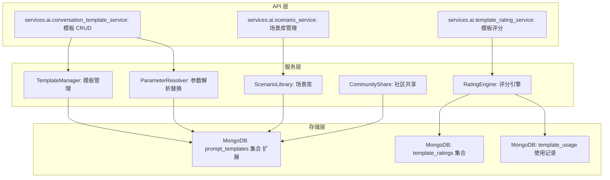
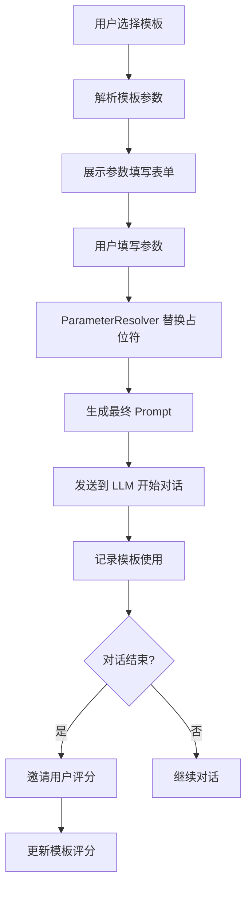

# YA-09-182: 对话模板与场景库 — 预置对话模板、场景分类、模板参数与社区共享

> 需求编号：YA-09-182 · 优先级：P2 · 人天：0.3d · 状态：需求已编写
> 依赖：YA-09-15（LLM Prompt 模板管理）

## 背景

### 问题陈述

AI 对话的质量很大程度上取决于初始 Prompt 的质量。用户常常不知道如何开始一段有效的 AI 对话，导致反复尝试和低效交互。当前存在以下问题：

1. **无模板引导**：用户从空白对话开始，不知道如何描述需求
2. **场景覆盖不全**：缺乏针对不同场景（代码审查、头脑风暴、写作等）的专用模板
3. **模板不可参数化**：无法在模板中预定义变量，用户需要手动修改
4. **无模板共享**：优秀模板无法在团队或社区中共享
5. **无模板效果评估**：无法知道哪些模板更有效
6. **快速启动缺失**：从模板创建对话的流程不够流畅

**核心矛盾**：好的 Prompt 工程需要专业知识，但大多数用户不具备这种能力，需要模板系统来降低门槛。

### 影响范围

| # | 影响 | 严重程度 | 典型场景 |
|---|------|----------|----------|
| 1 | 对话质量不稳定 | 中 | 用户随意输入导致 AI 回答质量差 |
| 2 | 场景覆盖不全 | 中 | 特定场景（如代码审查）缺乏专用模板 |
| 3 | 模板无法复用 | 中 | 优秀 Prompt 经验无法沉淀 |
| 4 | 模板无法共享 | 低 | 团队间无法共享最佳实践 |
| 5 | 模板效果不可评估 | 低 | 不知道哪些模板最有效 |

### 挑战

| 挑战 | 说明 |
|------|------|
| 模板参数化 | 需要支持 `{{variable}}` 占位符替换 |
| 模板版本管理 | 模板可能被修改，需要版本追踪 |
| 模板效果评估 | 需要定义评估指标（使用次数、平均评分、对话长度） |
| 社区共享 | 需要审核机制防止低质量模板泛滥 |
| 与现有 Prompt 模板系统集成 | YA-09-15 已有 Prompt 模板管理，需要扩展 |

---

## 一、现状分析

### 1.1 当前模板能力

```
现有功能:
├── YA-09-15 Prompt 模板管理
│   ├── 模板 CRUD
│   ├── 模板版本控制
│   └── 无场景分类
├── 聊天服务
│   ├── 自由对话
│   └── 无模板快速启动

缺失:
├── 场景库（5 大场景）      # ❌ 不存在
├── 模板参数化              # ❌ 不存在
├── 模板社区共享            # ❌ 不存在
├── 模板效果评分            # ❌ 不存在
├── 模板快速启动            # ❌ 不存在
└── 模板使用统计            # ❌ 不存在
```

### 1.2 根因矩阵

| 症状 | 根因 | 触发条件 | 频率 |
|------|------|----------|------|
| 对话质量不稳定 | 无模板引导 | 新对话开始 | 高 |
| 场景覆盖不全 | 无场景库 | 特定需求 | 中 |
| 模板无法复用 | 无参数化模板 | 创建对话 | 中 |
| 模板无法共享 | 无社区功能 | 发现优秀模板 | 低 |
| 模板效果不可评估 | 无评分系统 | 模板选择 | 中 |

---

## 二、设计决策

### 决策 1：模板存储 — 嵌入 Prompt 模板系统 vs 独立集合 vs 两者

| 选项 | 复用性 | 维护成本 | 扩展性 |
|------|--------|----------|--------|
| 扩展 YA-09-15 Prompt 模板集合 | 高 | 低 | 中 |
| 独立 conversation_templates 集合 | 低 | 高 | 高 |
| 两者（扩展 + 独立场景库） | 最高 | 中 | 最高 |

**选择：扩展 YA-09-15 Prompt 模板集合。** YA-09-15 已有模板 CRUD 和版本管理，对话模板是 Prompt 模板的子类型。通过添加 `template_type: "conversation"` 字段区分，添加 `scenario`、`parameters`、`is_community` 等字段扩展功能。

### 决策 2：模板参数化 — 固定占位符 vs 变量替换 vs Jinja2 模板

| 选项 | 灵活性 | 安全性 | 实现复杂度 |
|------|--------|--------|-----------|
| 固定占位符（`{{name}}`） | 低 | 高 | 低 |
| 变量替换（自定义语法） | 中 | 高 | 中 |
| Jinja2 模板引擎 | 最高 | 低 | 高 |

**选择：固定占位符 `{{variable_name}}`。** 使用简单的正则替换 `\{\{(\w+)\}\}` 提取变量名，用户填写后替换。避免使用 Jinja2（有沙箱逃逸风险），且对于对话模板场景，简单的占位符已足够。

### 决策 3：场景分类 — 5 大场景 vs 自定义标签 vs 两者

| 选项 | 导航效率 | 灵活性 | 实现复杂度 |
|------|----------|--------|-----------|
| 5 大场景（固定） | 高 | 低 | 低 |
| 自定义标签 | 中 | 高 | 中 |
| 5 大场景 + 自定义标签 | 最高 | 最高 | 中 |

**选择：5 大固定场景 + 自定义标签。** 固定场景（code_review/brainstorming/debugging/writing/planning）提供标准化导航，自定义标签允许细分。

### 决策 4：模板效果评估 — 使用次数 vs 多维评分 vs 机器学习

| 选项 | 准确性 | 实现复杂度 | 冷启动 |
|------|--------|-----------|--------|
| 使用次数 | 低 | 低 | 好 |
| 多维评分（使用次数 + 评分 + 对话长度） | 中 | 中 | 中 |
| 机器学习（基于对话质量） | 高 | 高 | 差 |

**选择：多维评分。** 综合使用次数（40%）、用户评分（30%）、平均对话长度（20%）、模板完成率（10%）计算综合评分。使用次数和评分加权避免冷启动问题。

### 设计决策记录

| 决策 | 选项 A | 选项 B | 选项 C | 选择 | 理由 |
|------|--------|--------|--------|------|------|
| 模板存储 | 扩展 Prompt 集合 | 独立集合 | 两者 | **扩展 Prompt 集合** | 复用现有系统 |
| 参数化 | 固定占位符 | 变量替换 | Jinja2 | **固定占位符** | 安全 + 简单 |
| 场景分类 | 5 大场景 | 自定义标签 | 两者 | **5 场景 + 标签** | 导航 + 灵活 |
| 效果评估 | 使用次数 | 多维评分 | 机器学习 | **多维评分** | 平衡准确与复杂度 |

---

## 三、目标架构

### 3.1 对话模板系统架构



### 3.2 模板快速启动流程



### 3.3 性能指标

| 指标 | 改造前 | 改造后 |
|------|--------|--------|
| 模板列表查询 | N/A | < 100ms |
| 参数解析替换 | N/A | < 1ms |
| 评分计算 | N/A | < 50ms |
| 模板使用记录 | N/A | < 5ms（异步） |

---

## 四、具体改动

### 4.1 模板数据模型扩展

```python
# services/ai/conversation_template_service.py (新增)

from typing import List, Optional, Dict, Any
from datetime import datetime
from pydantic import BaseModel, Field

class TemplateParameter(BaseModel):
    """模板参数定义"""
    name: str                          # 参数名
    label: str                         # 显示标签
    type: str = "string"              # 参数类型: string/number/select/multiline
    required: bool = True             # 是否必填
    default: Optional[str] = None     # 默认值
    placeholder: Optional[str] = None # 输入提示
    options: Optional[List[str]] = None  # select 类型的选项

class ConversationTemplate(BaseModel):
    """对话模板"""
    id: Optional[str] = None
    name: str                          # 模板名称
    description: str                   # 模板描述
    template_type: str = "conversation"  # 区分 Prompt 模板
    scenario: str                      # 场景: code_review/brainstorming/debugging/writing/planning
    tags: List[str] = []              # 自定义标签
    icon: str = "💬"                  # 图标
    system_prompt: str                # 系统提示词（可含 {{variable}} 占位符）
    user_prompt_template: str         # 用户提示词模板（可含 {{variable}} 占位符）
    parameters: List[TemplateParameter] = []  # 模板参数定义
    is_community: bool = False        # 是否社区共享
    is_builtin: bool = False          # 是否内置模板
    author_id: Optional[str] = None   # 作者
    version: int = 1                  # 版本号
    usage_count: int = 0             # 使用次数
    avg_rating: float = 0.0          # 平均评分
    created_at: datetime = Field(default_factory=datetime.utcnow)
    updated_at: datetime = Field(default_factory=datetime.utcnow)

# 5 大场景定义
SCENARIOS = {
    "code_review": {
        "name": "代码审查",
        "icon": "🔍",
        "description": "代码质量审查、安全检查、性能优化建议",
    },
    "brainstorming": {
        "name": "头脑风暴",
        "icon": "💡",
        "description": "创意发散、方案探索、问题分析",
    },
    "debugging": {
        "name": "调试排错",
        "icon": "🐛",
        "description": "错误诊断、日志分析、问题定位",
    },
    "writing": {
        "name": "写作助手",
        "icon": "✍️",
        "description": "文档撰写、内容优化、翻译润色",
    },
    "planning": {
        "name": "规划管理",
        "icon": "📋",
        "description": "项目规划、任务分解、时间管理",
    },
}
```

### 4.2 模板管理服务

```python
# services/ai/conversation_template_service.py (续)

import re
from typing import List, Optional, Dict, Tuple
from motor.motor_asyncio import AsyncIOMotorDatabase

class ParameterResolver:
    """模板参数解析器"""

    PLACEHOLDER_PATTERN = re.compile(r'\{\{(\w+)\}\}')

    @classmethod
    def extract_parameters(cls, template_text: str) -> List[str]:
        """从模板文本中提取参数名"""
        return list(set(cls.PLACEHOLDER_PATTERN.findall(template_text)))

    @classmethod
    def resolve(cls, template_text: str, params: Dict[str, str]) -> Tuple[str, List[str]]:
        """替换模板中的占位符"""
        missing = []
        def replacer(match):
            var_name = match.group(1)
            if var_name in params:
                return params[var_name]
            missing.append(var_name)
            return match.group(0)  # 保留原占位符

        result = cls.PLACEHOLDER_PATTERN.sub(replacer, template_text)
        return result, missing


class ConversationTemplateManager:
    """对话模板管理器"""

    def __init__(self, db: AsyncIOMotorDatabase):
        self.db = db
        self.collection = db["prompt_templates"]

    async def list_templates(
        self,
        scenario: Optional[str] = None,
        tags: Optional[List[str]] = None,
        is_community: Optional[bool] = None,
        search: Optional[str] = None,
        sort_by: str = "usage_count",
        limit: int = 50,
        skip: int = 0,
    ) -> Dict[str, Any]:
        """查询模板列表"""
        filter_query = {"template_type": "conversation"}

        if scenario:
            filter_query["scenario"] = scenario
        if tags:
            filter_query["tags"] = {"$all": tags}
        if is_community is not None:
            filter_query["is_community"] = is_community
        if search:
            filter_query["$or"] = [
                {"name": {"$regex": search, "$options": "i"}},
                {"description": {"$regex": search, "$options": "i"}},
            ]

        total = await self.collection.count_documents(filter_query)
        sort_field = sort_by if sort_by in ["usage_count", "avg_rating", "created_at", "name"] else "usage_count"
        cursor = self.collection.find(filter_query).sort(sort_field, -1).skip(skip).limit(limit)
        templates = await cursor.to_list(length=limit)

        return {"total": total, "items": templates, "limit": limit, "skip": skip}

    async def get_template(self, template_id: str) -> Optional[Dict]:
        """获取模板详情"""
        from bson import ObjectId
        return await self.collection.find_one({
            "_id": ObjectId(template_id),
            "template_type": "conversation",
        })

    async def create_template(self, template: ConversationTemplate) -> str:
        """创建模板"""
        # 从模板文本中提取参数
        all_text = template.system_prompt + "\n" + template.user_prompt_template
        extracted_params = ParameterResolver.extract_parameters(all_text)

        # 匹配参数定义
        defined_params = {p.name for p in template.parameters}
        missing_defs = set(extracted_params) - defined_params
        if missing_defs:
            raise ValueError(f"Template references undefined parameters: {missing_defs}")

        doc = template.dict(exclude={"id"})
        result = await self.collection.insert_one(doc)
        return str(result.inserted_id)

    async def resolve_and_start(
        self, template_id: str, params: Dict[str, str]
    ) -> Tuple[str, str]:
        """解析模板参数并返回 system_prompt 和 user_prompt"""
        template = await self.get_template(template_id)
        if not template:
            raise ValueError("Template not found")

        system_prompt, missing_sys = ParameterResolver.resolve(
            template["system_prompt"], params
        )
        user_prompt, missing_usr = ParameterResolver.resolve(
            template["user_prompt_template"], params
        )

        missing = missing_sys + missing_usr
        if missing:
            raise ValueError(f"Missing required parameters: {missing}")

        # 更新使用次数
        from bson import ObjectId
        await self.collection.update_one(
            {"_id": ObjectId(template_id)},
            {"$inc": {"usage_count": 1}}
        )

        return system_prompt, user_prompt

    async def update_template(self, template_id: str, updates: Dict) -> bool:
        """更新模板"""
        from bson import ObjectId
        updates["updated_at"] = datetime.utcnow()
        result = await self.collection.update_one(
            {"_id": ObjectId(template_id), "template_type": "conversation"},
            {"$set": updates}
        )
        return result.modified_count > 0

    async def delete_template(self, template_id: str) -> bool:
        """删除模板（软删除）"""
        from bson import ObjectId
        result = await self.collection.update_one(
            {"_id": ObjectId(template_id), "template_type": "conversation"},
            {"$set": {"deleted": True, "deleted_at": datetime.utcnow()}}
        )
        return result.modified_count > 0

    async def share_to_community(self, template_id: str) -> bool:
        """分享模板到社区"""
        return await self.update_template(template_id, {"is_community": True})

    async def get_scenarios(self) -> Dict[str, Any]:
        """获取场景列表及每个场景的模板数量"""
        scenarios = []
        for key, info in SCENARIOS.items():
            count = await self.collection.count_documents({
                "template_type": "conversation",
                "scenario": key,
                "deleted": {"$ne": True},
            })
            scenarios.append({**info, "key": key, "template_count": count})
        return {"scenarios": scenarios}
```

### 4.3 模板评分服务

```python
# services/ai/template_rating_service.py (新增)

from typing import Dict, Any
from datetime import datetime
from motor.motor_asyncio import AsyncIOMotorDatabase

class TemplateRatingEngine:
    """模板评分引擎"""

    WEIGHTS = {
        "usage_count": 0.40,       # 使用次数
        "user_rating": 0.30,       # 用户评分
        "avg_conversation_length": 0.20,  # 平均对话长度
        "completion_rate": 0.10,   # 完成率
    }

    def __init__(self, db: AsyncIOMotorDatabase):
        self.db = db
        self.ratings = db["template_ratings"]
        self.usage = db["template_usage"]

    async def rate_template(self, template_id: str, user_id: str, score: int, comment: str = "") -> Dict:
        """用户评分"""
        from bson import ObjectId

        if score < 1 or score > 5:
            raise ValueError("Score must be between 1 and 5")

        rating_doc = {
            "template_id": template_id,
            "user_id": user_id,
            "score": score,
            "comment": comment,
            "created_at": datetime.utcnow(),
        }

        # upsert 用户评分
        await self.ratings.update_one(
            {"template_id": template_id, "user_id": user_id},
            {"$set": rating_doc},
            upsert=True,
        )

        # 更新模板平均评分
        await self._update_avg_rating(template_id)

        return rating_doc

    async def _update_avg_rating(self, template_id: str) -> None:
        """更新模板平均评分"""
        from bson import ObjectId

        pipeline = [
            {"$match": {"template_id": template_id}},
            {"$group": {"_id": None, "avg": {"$avg": "$score"}, "count": {"$sum": 1}}},
        ]
        result = await self.ratings.aggregate(pipeline).to_list(length=1)
        if result:
            await self.db["prompt_templates"].update_one(
                {"_id": ObjectId(template_id)},
                {"$set": {"avg_rating": round(result[0]["avg"], 2), "rating_count": result[0]["count"]}}
            )

    async def record_usage(self, template_id: str, user_id: str, conversation_length: int, completed: bool) -> None:
        """记录模板使用"""
        await self.usage.insert_one({
            "template_id": template_id,
            "user_id": user_id,
            "conversation_length": conversation_length,
            "completed": completed,
            "timestamp": datetime.utcnow(),
        })

    async def calculate_effectiveness_score(self, template_id: str) -> float:
        """计算模板综合效果评分"""
        from bson import ObjectId

        # 获取使用统计
        usage_count = await self.usage.count_documents({"template_id": template_id})

        # 获取用户评分
        rating_pipeline = [
            {"$match": {"template_id": template_id}},
            {"$group": {"_id": None, "avg": {"$avg": "$score"}}},
        ]
        rating_result = await self.ratings.aggregate(rating_pipeline).to_list(length=1)
        avg_rating = rating_result[0]["avg"] if rating_result else 0

        # 获取平均对话长度
        length_pipeline = [
            {"$match": {"template_id": template_id}},
            {"$group": {"_id": None, "avg": {"$avg": "$conversation_length"}}},
        ]
        length_result = await self.usage.aggregate(length_pipeline).to_list(length=1)
        avg_length = length_result[0]["avg"] if length_result else 0

        # 获取完成率
        completed_count = await self.usage.count_documents({"template_id": template_id, "completed": True})
        completion_rate = completed_count / max(usage_count, 1)

        # 归一化计算
        usage_score = min(usage_count / 100, 1.0)  # 0-100 映射到 0-1
        rating_score = avg_rating / 5.0             # 0-5 映射到 0-1
        length_score = min(avg_length / 20, 1.0)   # 0-20 映射到 0-1

        score = (
            usage_score * self.WEIGHTS["usage_count"] +
            rating_score * self.WEIGHTS["user_rating"] +
            length_score * self.WEIGHTS["avg_conversation_length"] +
            completion_rate * self.WEIGHTS["completion_rate"]
        ) * 100

        return round(score, 2)
```

### 4.4 内置模板数据

```python
# services/ai/builtin_templates.py (新增)

BUILTIN_TEMPLATES = [
    {
        "name": "代码审查助手",
        "description": "对代码进行全面的质量审查，包括安全性、性能、可维护性",
        "scenario": "code_review",
        "tags": ["代码审查", "安全", "性能"],
        "icon": "🔍",
        "system_prompt": "你是一位资深代码审查专家。请对以下代码进行全面分析，包括代码质量、安全性、性能、可维护性等方面。",
        "user_prompt_template": "请审查以下 {{language}} 代码：\n\n```{{language}}\n{{code}}\n```\n\n审查重点：{{focus_areas}}",
        "parameters": [
            {"name": "language", "label": "编程语言", "type": "select", "required": True, "options": ["Python", "JavaScript", "TypeScript", "Go", "Rust", "Java"]},
            {"name": "code", "label": "代码内容", "type": "multiline", "required": True, "placeholder": "粘贴需要审查的代码"},
            {"name": "focus_areas", "label": "审查重点", "type": "string", "default": "代码质量、安全性、性能"},
        ],
        "is_builtin": True,
        "is_community": True,
    },
    {
        "name": "头脑风暴助手",
        "description": "围绕特定主题进行创意发散和方案探索",
        "scenario": "brainstorming",
        "tags": ["创意", "方案", "探索"],
        "icon": "💡",
        "system_prompt": "你是一位创意顾问。请帮助用户进行头脑风暴，提供多样化的视角和创意方案。",
        "user_prompt_template": "我想围绕以下主题进行头脑风暴：\n\n主题：{{topic}}\n\n背景：{{context}}\n\n期望的创意数量：{{count}}\n\n约束条件：{{constraints}}",
        "parameters": [
            {"name": "topic", "label": "主题", "type": "string", "required": True},
            {"name": "context", "label": "背景信息", "type": "multiline", "required": False},
            {"name": "count", "label": "创意数量", "type": "select", "default": "5", "options": ["3", "5", "10", "20"]},
            {"name": "constraints", "label": "约束条件", "type": "string", "default": "无特殊限制"},
        ],
        "is_builtin": True,
        "is_community": True,
    },
    {
        "name": "Bug 调试助手",
        "description": "帮助诊断和修复代码中的 Bug，分析错误日志",
        "scenario": "debugging",
        "tags": ["调试", "Bug", "错误"],
        "icon": "🐛",
        "system_prompt": "你是一位资深调试专家。请帮助分析错误信息，定位问题根因，并提供修复方案。",
        "user_prompt_template": "我遇到了以下问题：\n\n错误信息：{{error_message}}\n\n相关代码：\n```{{language}}\n{{code}}\n```\n\n环境信息：{{environment}}",
        "parameters": [
            {"name": "error_message", "label": "错误信息", "type": "multiline", "required": True},
            {"name": "language", "label": "编程语言", "type": "select", "required": True, "options": ["Python", "JavaScript", "TypeScript", "Go", "Rust", "Java"]},
            {"name": "code", "label": "相关代码", "type": "multiline", "required": False},
            {"name": "environment", "label": "环境信息", "type": "string", "default": "本地开发环境"},
        ],
        "is_builtin": True,
        "is_community": True,
    },
    {
        "name": "技术文档撰写",
        "description": "撰写技术文档、API 文档、设计文档",
        "scenario": "writing",
        "tags": ["文档", "技术写作", "API"],
        "icon": "📝",
        "system_prompt": "你是一位技术文档撰写专家。请帮助撰写清晰、准确、结构化的技术文档。",
        "user_prompt_template": "请帮我撰写以下文档：\n\n文档类型：{{doc_type}}\n\n主题：{{topic}}\n\n目标读者：{{audience}}\n\n关键要点：{{key_points}}",
        "parameters": [
            {"name": "doc_type", "label": "文档类型", "type": "select", "required": True, "options": ["API 文档", "设计文档", "用户手册", "README", "发布说明"]},
            {"name": "topic", "label": "主题", "type": "string", "required": True},
            {"name": "audience", "label": "目标读者", "type": "select", "default": "开发者", "options": ["开发者", "产品经理", "终端用户", "运维人员"]},
            {"name": "key_points", "label": "关键要点", "type": "multiline", "required": False},
        ],
        "is_builtin": True,
        "is_community": True,
    },
    {
        "name": "项目规划助手",
        "description": "帮助制定项目计划、任务分解、里程碑设置",
        "scenario": "planning",
        "tags": ["项目管理", "规划", "任务"],
        "icon": "📋",
        "system_prompt": "你是一位项目管理专家。请帮助用户制定详细的项目规划，包括任务分解、时间估算、风险识别。",
        "user_prompt_template": "请帮我规划以下项目：\n\n项目名称：{{project_name}}\n\n项目目标：{{goal}}\n\n团队规模：{{team_size}}\n\n时间周期：{{timeline}}\n\n技术栈：{{tech_stack}}",
        "parameters": [
            {"name": "project_name", "label": "项目名称", "type": "string", "required": True},
            {"name": "goal", "label": "项目目标", "type": "multiline", "required": True},
            {"name": "team_size", "label": "团队规模", "type": "string", "default": "3-5 人"},
            {"name": "timeline", "label": "时间周期", "type": "string", "default": "4 周"},
            {"name": "tech_stack", "label": "技术栈", "type": "string", "required": False},
        ],
        "is_builtin": True,
        "is_community": True,
    },
]
```

### 4.5 文件变更清单

| 文件 | 操作 | 说明 |
|------|------|------|
| `services/ai/conversation_template_service.py` | 新增 | 对话模板管理服务 |
| `services/ai/template_rating_service.py` | 新增 | 模板评分服务 |
| `services/ai/builtin_templates.py` | 新增 | 内置模板数据 |
| `services/ai/template_rpc_handler.py` | 新增 | RPC 路由处理器 |
| `services/ai/prompt_template_service.py` | 修改 | 扩展支持 conversation 类型 |
| `main.py` | 修改 | 注册模板模块路由 + 初始化内置模板 |
| `tests/test_conversation_template.py` | 新增 | 模板服务单元测试 |

---

## 五、实施步骤

| 步骤 | 操作 | 路径 | 验证 | 人天 |
|------|------|------|------|------|
| 1 | 定义模板数据模型 | `conversation_template_service.py` | Pydantic 模型验证通过 | 0.02 |
| 2 | 实现参数解析器 | `conversation_template_service.py` | 占位符提取和替换正确 | 0.02 |
| 3 | 实现模板 CRUD 服务 | `conversation_template_service.py` | 创建/查询/更新/删除正常 | 0.05 |
| 4 | 实现模板评分服务 | `template_rating_service.py` | 评分写入和计算正确 | 0.04 |
| 5 | 创建内置模板数据 | `builtin_templates.py` | 5 个场景模板数据完整 | 0.03 |
| 6 | 实现场景库查询 | `conversation_template_service.py` | 场景列表和模板数量正确 | 0.02 |
| 7 | 实现 RPC 路由处理器 | `template_rpc_handler.py` | RPC 信封正确路由 | 0.03 |
| 8 | 扩展 Prompt 模板系统 | `prompt_template_service.py` | 向后兼容 | 0.03 |
| 9 | 初始化内置模板 | `main.py` | 启动时自动导入内置模板 | 0.02 |
| 10 | 编写单元测试 | `test_conversation_template.py` | 覆盖率 > 80% | 0.04 |

**总人天：0.3d**

---

## 六、测试规格

### 场景 1：从模板创建对话

**GIVEN** 数据库中存在"代码审查助手"模板
**WHEN** 调用 `resolve_and_start(template_id, {"language": "Python", "code": "print('hello')", "focus_areas": "安全性"})`
**THEN** 返回的 system_prompt 应包含"资深代码审查专家"
**AND** 返回的 user_prompt 应包含替换后的 Python 代码和审查重点
**AND** 模板的 usage_count 应 +1

### 场景 2：参数缺失处理

**GIVEN** "代码审查助手"模板要求 `language` 和 `code` 参数
**WHEN** 调用 `resolve_and_start(template_id, {"language": "Python"})`（缺少 `code`）
**THEN** 应抛出 ValueError，提示缺少 `code` 参数
**AND** 模板的 usage_count 不应增加

### 场景 3：场景库查询

**GIVEN** 数据库中有 3 个 code_review 模板、2 个 brainstorming 模板
**WHEN** 调用 `get_scenarios()`
**THEN** 返回 5 个场景，每个场景包含 template_count
**AND** code_review 场景的 template_count 为 3
**AND** brainstorming 场景的 template_count 为 2

### 场景 4：模板评分

**GIVEN** 用户使用模板完成对话后
**WHEN** 用户评分为 4 分，并记录使用（对话长度 15，已完成）
**THEN** 评分记录应写入 template_ratings 集合
**AND** 模板的 avg_rating 应更新
**AND** 综合效果评分应正确计算

### 场景 5：社区共享

**GIVEN** 用户创建了一个自定义模板
**WHEN** 调用 `share_to_community(template_id)`
**THEN** 模板的 `is_community` 应变为 True
**AND** 其他用户查询社区模板时可以看到该模板

### 场景 6：模板搜索

**GIVEN** 数据库中有 10 个模板，其中 2 个名称包含"代码"
**WHEN** 调用 `list_templates(search="代码")`
**THEN** 仅返回 2 个名称或描述包含"代码"的模板
**AND** 返回结果按 usage_count 降序排列

---

## 七、风险与缓解

| 风险 | 概率 | 影响 | 缓解措施 |
|------|------|------|----------|
| 模板参数注入攻击 | 低 | 高 | 使用正则替换而非模板引擎，不执行代码 |
| 社区模板内容不当 | 中 | 中 | 社区模板需审核，内置敏感词过滤 |
| 评分系统被刷分 | 低 | 中 | 同一用户对同一模板只能评分一次（upsert） |
| 内置模板与用户模板冲突 | 低 | 低 | 内置模板使用 `is_builtin: True` 标记，不可删除 |

---

## 八、回滚策略

| 场景 | 回滚操作 | 影响 |
|------|----------|------|
| 模板功能异常 | 禁用模板 API，仅保留自由对话 | 失去模板功能 |
| 评分系统错误 | 清空评分数据，重新计算 | 评分数据丢失 |
| 社区模板质量问题 | 关闭社区共享功能 | 无法分享模板 |

---

## 九、设计决策记录

### D-01：模板存储方式

- **问题**：对话模板是独立存储还是扩展现有 Prompt 模板系统
- **选项**：独立集合、扩展 Prompt 模板集合、两者
- **选择**：扩展 Prompt 模板集合
- **理由**：复用现有 CRUD 和版本管理，减少代码重复

### D-02：参数化方式

- **问题**：模板参数化使用什么技术
- **选项**：固定占位符、变量替换、Jinja2
- **选择**：固定占位符 `{{variable}}`
- **理由**：简单安全，满足对话模板场景需求

### D-03：场景分类

- **问题**：模板场景如何分类
- **选项**：5 大场景、自定义标签、两者
- **选择**：5 大场景 + 自定义标签
- **理由**：固定场景提供标准化导航，标签提供灵活性

### D-04：内置模板数量

- **问题**：系统应内置多少模板
- **选项**：无内置、5 个（每场景 1 个）、15+ 个
- **选择**：5 个（每场景 1 个）
- **理由**：覆盖 5 大场景，每个场景 1 个高质量模板，不增加维护负担

---

## 十、可观测性

### 指标

| 指标 | 类型 | 说明 |
|------|------|------|
| `yiai.template.create_count` | Counter | 模板创建次数 |
| `yiai.template.usage_count` | Counter | 模板使用次数 |
| `yiai.template.rating_count` | Counter | 模板评分次数 |
| `yiai.template.resolve_duration_ms` | Histogram | 参数解析耗时 |
| `yiai.template.list_duration_ms` | Histogram | 模板列表查询耗时 |

### 告警

| 告警 | 条件 | 级别 |
|------|------|------|
| 模板解析失败 | 参数解析失败率 > 10% | WARNING |
| 模板查询慢 | list 查询 > 500ms | WARNING |
| 评分异常 | 某模板短时间内评分突增 | WARNING |

---

## 十一、代码审查检查清单

- [ ] 模板参数提取使用正则表达式，正确匹配 `{{variable}}` 格式
- [ ] 参数替换时检查缺失参数，抛出明确错误
- [ ] 模板 CRUD 操作使用 MongoDB 事务保证原子性
- [ ] 内置模板在应用启动时自动导入，使用 `is_builtin` 标记
- [ ] 用户评分使用 upsert，同一用户同一模板只能有一个评分
- [ ] 综合效果评分计算逻辑正确，归一化处理合理
- [ ] 场景列表查询包含模板数量，使用聚合管道
- [ ] 社区模板有审核标记，未审核的社区模板不公开
- [ ] RPC 路由处理器参数验证完整
- [ ] 向后兼容 YA-09-15 Prompt 模板系统
- [ ] 单元测试覆盖所有服务方法

---

## 回归问题预测

| # | 预测问题 | 原因 | 验证方法 |
|---|---------|------|---------|
| 1 | 模板参数 `{{code}}` 包含特殊字符（如 `{{` 和 `}}`），正则替换时错误匹配，导致部分占位符被替换，部分保留 | 用户输入的代码中包含 `{{variable}}` 格式的字符串（如 Vue 模板语法），正则表达式会错误匹配这些内容 | 在参数替换前对用户输入值进行转义处理（将 `{{` 替换为 `{ {` 或使用占位符标记），替换时精确匹配 |
| 2 | 内置模板在应用启动时导入，如果数据库连接失败，导入失败导致应用启动失败 | `main.py` 启动时同步执行内置模板导入，数据库未就绪时抛出异常 | 内置模板导入使用异步重试机制（最多 3 次重试，间隔 5 秒），导入失败不影响应用启动 |
| 3 | 模板使用次数 `usage_count` 使用 `$inc` 原子操作，但并发场景下评分计算读取的 `usage_count` 可能不是最新值 | 评分计算是读取-计算-写入的非原子操作，并发时可能出现竞态 | 使用 MongoDB 的 `$inc` 和聚合管道实时计算评分，而非缓存值；评分计算使用 `findOneAndUpdate` 原子操作 |
| 4 | 社区模板共享后，原作者修改模板内容，已使用该模板的对话不受影响，但新用户看到的是修改后的版本，可能导致预期不一致 | 模板内容修改后，之前基于该模板创建的对话不受影响，但模板版本号递增，用户可能困惑 | 模板内容修改时自动递增版本号，前端显示"模板已更新到 v2"，用户可选择使用新版本或旧版本 |
| 5 | 参数类型为 `multiline` 时，用户输入包含换行符的内容，替换到模板中后格式混乱 | 多行文本替换到模板中时，替换逻辑未保留换行符，导致 system_prompt 或 user_prompt 格式错误 | 在参数替换时保留原始换行符，不进行额外的 trim 或格式化处理 |
| 6 | 模板评分中的 `avg_conversation_length` 使用 `$avg` 聚合，但某些对话长度异常（如 1 条消息或 10000 条消息），导致平均值失真 | 对话长度分布可能呈现长尾分布，极端值影响平均值 | 在计算平均对话长度时使用截尾均值（去除最高和最低 5%），或使用中位数替代平均值 |

---

## 性能分析

### 各操作耗时

| 阶段 | 预估耗时 | 说明 |
|------|----------|------|
| 模板列表查询 | < 100ms | MongoDB 查询 + 排序 |
| 参数提取 | < 1ms | 正则表达式 |
| 参数替换 | < 1ms | 字符串替换 |
| 模板评分写入 | < 5ms | MongoDB upsert |
| 效果评分计算 | < 50ms | 聚合管道 |
| 内置模板导入 | < 100ms | 5 个模板批量 upsert |

### 内存影响

| 操作 | 内存使用 | 说明 |
|------|----------|------|
| 模板列表（50 个） | < 500KB | JSON 文档 |
| 参数解析 | < 10KB | 字符串操作 |
| 评分计算 | < 100KB | 聚合结果 |

### 对 API 响应的影响

| 端点 | 影响 | 说明 |
|------|------|------|
| 模板列表 | < 100ms | 分页查询 |
| 场景列表 | < 50ms | 聚合计数 |
| 模板解析 | < 1ms | 纯字符串操作 |
| 模板评分 | < 5ms | 异步写入 |

## 影响范围

- **影响模块**：待补充
- **涉及文件**：
- `template_rpc_handler.py`
- `conversation_template_service.py`
- `prompt_template_service.py`
- `builtin_templates.py`
- `template_rating_service.py`
- `test_conversation_template.py`
- **是否影响 API 契约**：否
- **是否影响其他项目（YiVad/YiPet）**：否
- **用户感知**：待确认

## 预防措施

| 层面 | 措施 |
|------|------|
| 代码 | 在相关函数中添加参数校验和边界检查 |
| 测试 | 为 `template_rpc_handler.py` 添加单元测试 |
| 流程 | 代码审查时重点检查此类模式 |
| 监控 | 添加日志告警，异常发生时及时发现 |
| 文档 | 在编码规范中记录此类反模式 |

## 经验教训

1. **根本原因**：开发过程中对边界情况和异常路径的考虑不足是此类问题的共同根因
2. **设计阶段**：在接口设计和模块实现时，应主动考虑异常输入、空值、超时等边界场景
3. **代码审查**：审查时应检查是否存在类似的反模式（如未捕获异常、无超时控制、缺少参数校验等）
4. **测试覆盖**：异常路径的测试覆盖率应与正常路径同等重视
5. **团队分享**：此类问题应在团队周会或技术分享中讨论，形成团队共识
