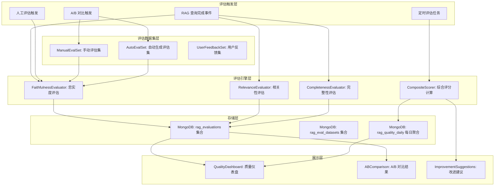
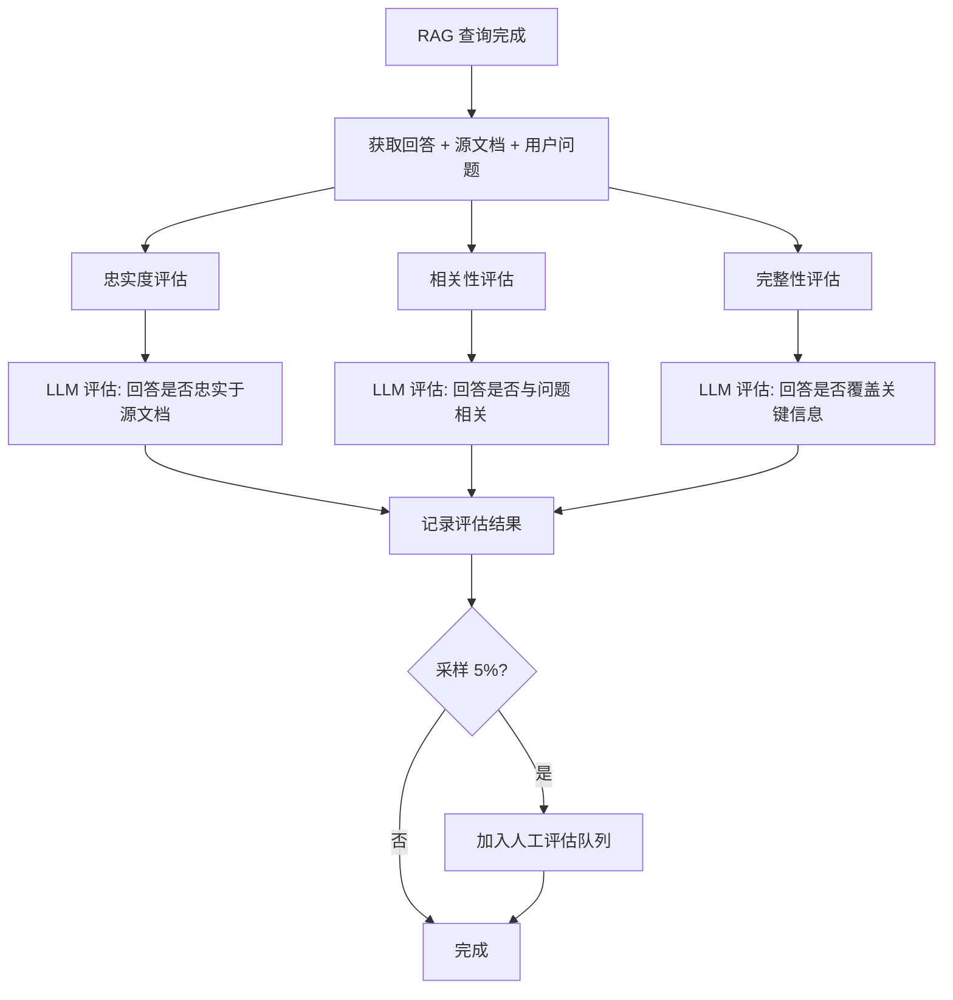

# YA-09-183: 知识库问答质量评估 — RAG 回答质量评估框架、忠实度/相关性/完整性评分与人工评估集成

> 需求编号：YA-09-183 · 优先级：P2 · 人天：0.3d · 状态：需求已编写
> 依赖：YA-09-04（RAG 引擎稳定性修复）、YA-09-179（检索结果重排序）

## 背景

### 问题陈述

RAG（检索增强生成）系统的回答质量直接影响用户对 AI 的信任度。当前缺乏系统化的质量评估机制，无法量化 RAG 回答的准确性、相关性和完整性。当前存在以下问题：

1. **无忠实度评估**：无法判断回答是否忠实于检索到的知识文档
2. **无相关性评估**：无法判断回答是否与用户问题高度相关
3. **无完整性评估**：无法判断回答是否覆盖了知识文档中的关键信息
4. **无质量仪表盘**：无法追踪 RAG 质量随时间的变化趋势
5. **无改进建议**：不知道如何优化 RAG 配置以提升回答质量
6. **无 A/B 对比**：无法对比不同 RAG 配置（如不同 embedding 模型、不同 chunk 大小）的效果

**核心矛盾**：RAG 系统需要持续优化，但缺乏量化指标来指导优化方向。

### 影响范围

| # | 影响 | 严重程度 | 典型场景 |
|---|------|----------|----------|
| 1 | 回答质量不可量化 | 高 | 无法判断 RAG 优化是否有效 |
| 2 | 幻觉问题不感知 | 高 | 回答包含虚构信息但未被发现 |
| 3 | 回答相关性低 | 中 | 检索到正确文档但回答偏题 |
| 4 | 回答不完整 | 中 | 遗漏关键信息导致用户反复追问 |
| 5 | 无法对比优化效果 | 中 | 切换 embedding 模型后不知效果好坏 |

### 挑战

| 挑战 | 说明 |
|------|------|
| 忠实度评估 | 需要对比回答与源文档，检测虚构信息 |
| 自动评估准确性 | 使用 LLM 评估 LLM 的输出，存在评估偏差 |
| 评估数据集构建 | 需要高质量的评估问题集和参考答案 |
| 人工评估成本 | 人工评估准确但成本高，需要与自动评估结合 |
| 评估指标定义 | 需要定义可量化、可重复的评估指标 |

---

## 一、现状分析

### 1.1 当前 RAG 质量评估现状

```
现有功能:
├── RAG 检索（llama_index + 混合检索）
├── RAG 服务 SLO 监控（YA-09-60）
│   ├── 检索延迟监控
│   └── 无回答质量监控
├── 反馈数据湖（YK-09-50）
│   ├── 用户反馈收集
│   └── 无自动质量评估

缺失:
├── 忠实度评估              # ❌ 不存在
├── 相关性评估              # ❌ 不存在
├── 完整性评估              # ❌ 不存在
├── 质量仪表盘              # ❌ 不存在
├── 改进建议生成            # ❌ 不存在
├── A/B 对比                # ❌ 不存在
├── 评估数据集              # ❌ 不存在
└── 人工评估工作流          # ❌ 不存在
```

### 1.2 根因矩阵

| 症状 | 根因 | 触发条件 | 频率 |
|------|------|----------|------|
| 回答质量不可量化 | 无自动评估 | 每次 RAG 查询 | 高 |
| 幻觉问题不感知 | 无忠实度检查 | 回答包含虚构信息时 | 中 |
| 回答相关性低 | 无相关性评估 | 检索到位但生成偏题 | 中 |
| 回答不完整 | 无完整性评估 | 遗漏关键信息 | 中 |
| 无法对比优化 | 无 A/B 对比 | 配置变更时 | 中 |

---

## 二、设计决策

### 决策 1：评估方式 — 纯自动评估 vs 纯人工评估 vs 自动 + 人工

| 选项 | 成本 | 准确性 | 可扩展性 |
|------|------|--------|----------|
| 纯自动评估（LLM 评估） | 低 | 中（80% 准确率） | 高 |
| 纯人工评估 | 高 | 高（95% 准确率） | 低 |
| 自动 + 人工（采样） | 中 | 高 | 高 |

**选择：自动评估为主（全量）+ 人工评估为校准（采样 5%）。** 自动评估覆盖所有 RAG 查询，提供实时质量指标。人工评估采样 5% 的查询，校准自动评估的准确性，同时构建评估数据集。

### 决策 2：忠实度评估方法 — 基于 NLI vs 基于 LLM vs 基于关键词匹配

| 选项 | 准确性 | 速度 | 成本 |
|------|--------|------|------|
| 基于 NLI（自然语言推理） | 中 | 快 | 低 |
| 基于 LLM（GPT/Claude） | 高 | 慢 | 中 |
| 基于关键词匹配 | 低 | 最快 | 极低 |

**选择：基于 LLM 的忠实度评估。** 使用本地 Ollama 模型（如 qwen2.5）评估回答是否忠实于源文档。LLM 能理解语义，比 NLI 模型更准确，比关键词匹配更智能。使用结构化 prompt 输出 JSON 格式的评估结果。

### 决策 3：评估数据集 — 手动构建 vs 自动生成 vs 从用户反馈中提取

| 选项 | 质量 | 数量 | 维护成本 |
|------|------|------|----------|
| 手动构建 | 最高 | 少 | 高 |
| 自动生成（LLM 合成） | 中 | 多 | 低 |
| 从用户反馈中提取 | 中 | 中 | 低 |

**选择：三者结合。** 手动构建 50 个核心评估问题（覆盖所有知识领域）。自动生成 200 个评估问题（基于 YiKnowledge 知识库内容）。从用户反馈中提取高质量问题（已有点赞/踩反馈）。

### 决策 4：A/B 对比方式 — 在线分流 vs 离线评估 vs 两者

| 选项 | 真实场景 | 统计显著性 | 用户影响 |
|------|----------|-----------|----------|
| 在线分流（实时用户） | 是 | 高 | 有 |
| 离线评估（评估数据集） | 否 | 中 | 无 |
| 两者 | 是 | 最高 | 部分 |

**选择：离线评估为主 + 在线分流为可选。** 离线评估使用评估数据集快速对比不同 RAG 配置。在线分流作为可选功能，需要管理员手动开启，将部分用户流量导向新配置。

### 设计决策记录

| 决策 | 选项 A | 选项 B | 选项 C | 选择 | 理由 |
|------|--------|--------|--------|------|------|
| 评估方式 | 纯自动 | 纯人工 | 自动 + 人工 | **自动 + 人工采样** | 可扩展 + 可校准 |
| 忠实度评估 | NLI | LLM | 关键词 | **基于 LLM** | 准确 + 语义理解 |
| 评估数据集 | 手动构建 | 自动生成 | 用户反馈 | **三者结合** | 高质量 + 大规模 |
| A/B 对比 | 在线分流 | 离线评估 | 两者 | **离线为主** | 快速 + 无用户影响 |

---

## 三、目标架构

### 3.1 质量评估系统架构



### 3.2 自动评估流程



### 3.3 性能指标

| 指标 | 改造前 | 改造后 |
|------|--------|--------|
| 忠实度评分 | 无 | 0-100 分（自动） |
| 相关性评分 | 无 | 0-100 分（自动） |
| 完整性评分 | 无 | 0-100 分（自动） |
| 综合质量评分 | 无 | 0-100 分（加权） |
| 自动评估耗时 | 无 | < 2s（异步，不阻塞用户） |

---

## 四、具体改动

### 4.1 质量评估服务

```python
# services/rag/quality_evaluator.py (新增)

from typing import Dict, List, Any, Optional
from datetime import datetime
from motor.motor_asyncio import AsyncIOMotorDatabase
from pydantic import BaseModel

class EvaluationResult(BaseModel):
    """质量评估结果"""
    query_id: str
    question: str
    answer: str
    source_documents: List[str]
    faithfulness_score: float      # 忠实度 0-100
    relevance_score: float         # 相关性 0-100
    completeness_score: float      # 完整性 0-100
    composite_score: float         # 综合评分 0-100
    faithfulness_reason: str       # 忠实度评估理由
    relevance_reason: str          # 相关性评估理由
    completeness_reason: str       # 完整性评估理由
    evaluation_method: str         # auto / human
    evaluator: str                 # 评估者标识
    created_at: datetime

class RAGQualityEvaluator:
    """RAG 回答质量评估器"""

    WEIGHTS = {
        "faithfulness": 0.40,    # 忠实度权重最高
        "relevance": 0.35,       # 相关性
        "completeness": 0.25,    # 完整性
    }

    def __init__(self, db: AsyncIOMotorDatabase, llm_service):
        self.db = db
        self.llm = llm_service
        self.evaluations = db["rag_evaluations"]

    async def evaluate(
        self, query_id: str, question: str, answer: str, source_documents: List[str]
    ) -> EvaluationResult:
        """对 RAG 回答进行全面质量评估"""
        # 并行评估三个维度
        faithfulness = await self.evaluate_faithfulness(answer, source_documents)
        relevance = await self.evaluate_relevance(answer, question)
        completeness = await self.evaluate_completeness(answer, source_documents, question)

        # 计算综合评分
        composite = (
            faithfulness["score"] * self.WEIGHTS["faithfulness"] +
            relevance["score"] * self.WEIGHTS["relevance"] +
            completeness["score"] * self.WEIGHTS["completeness"]
        )

        result = EvaluationResult(
            query_id=query_id,
            question=question,
            answer=answer,
            source_documents=source_documents,
            faithfulness_score=faithfulness["score"],
            relevance_score=relevance["score"],
            completeness_score=completeness["score"],
            composite_score=round(composite, 2),
            faithfulness_reason=faithfulness["reason"],
            relevance_reason=relevance["reason"],
            completeness_reason=completeness["reason"],
            evaluation_method="auto",
            evaluator="llm",
            created_at=datetime.utcnow(),
        )

        # 保存评估结果
        await self.evaluations.insert_one(result.dict())

        return result

    async def evaluate_faithfulness(
        self, answer: str, source_documents: List[str]
    ) -> Dict[str, Any]:
        """评估回答是否忠实于源文档"""
        sources_text = "\n\n---\n\n".join(source_documents[:3])  # 取前 3 个源文档

        prompt = f"""你是一个 RAG 回答质量评估专家。请评估以下回答是否忠实于提供的源文档。

源文档：
{sources_text}

回答：
{answer}

请从以下维度评估忠实度：
1. 回答中的每个事实陈述是否能在源文档中找到依据
2. 回答是否包含源文档中没有的信息（幻觉）
3. 回答是否曲解了源文档的意思

请以 JSON 格式返回评估结果：
{{"score": <0-100 的整数分数>, "reason": "<评估理由，100 字以内>"}}
"""
        response = await self.llm.generate(prompt)
        return self._parse_evaluation_response(response)

    async def evaluate_relevance(self, answer: str, question: str) -> Dict[str, Any]:
        """评估回答是否与用户问题相关"""
        prompt = f"""评估以下回答是否与用户问题相关。

用户问题：{question}

回答：{answer}

请从以下维度评估相关性：
1. 回答是否直接回应了问题
2. 回答是否包含与问题无关的内容
3. 回答是否偏离了问题主题

请以 JSON 格式返回：{{"score": <0-100>, "reason": "<评估理由>"}}
"""
        response = await self.llm.generate(prompt)
        return self._parse_evaluation_response(response)

    async def evaluate_completeness(
        self, answer: str, source_documents: List[str], question: str
    ) -> Dict[str, Any]:
        """评估回答是否完整覆盖了关键信息"""
        sources_text = "\n\n".join(source_documents[:3])

        prompt = f"""评估以下回答是否完整覆盖了源文档中的关键信息。

用户问题：{question}

源文档：{sources_text}

回答：{answer}

请从以下维度评估完整性：
1. 回答是否覆盖了源文档中与问题相关的主要信息点
2. 是否遗漏了重要信息
3. 回答的深度是否足够

请以 JSON 格式返回：{{"score": <0-100>, "reason": "<评估理由>"}}
"""
        response = await self.llm.generate(prompt)
        return self._parse_evaluation_response(response)

    def _parse_evaluation_response(self, response: str) -> Dict[str, Any]:
        """解析 LLM 评估响应"""
        import json
        try:
            # 尝试提取 JSON 部分
            start = response.find("{")
            end = response.rfind("}") + 1
            if start >= 0 and end > start:
                return json.loads(response[start:end])
        except json.JSONDecodeError:
            pass
        return {"score": 0, "reason": "评估解析失败"}

    async def get_quality_trends(self, days: int = 30) -> Dict[str, Any]:
        """获取质量趋势"""
        from datetime import timedelta
        cutoff = datetime.utcnow() - timedelta(days=days)

        pipeline = [
            {"$match": {"created_at": {"$gte": cutoff}}},
            {"$group": {
                "_id": {"$dateToString": {"format": "%Y-%m-%d", "date": "$created_at"}},
                "avg_faithfulness": {"$avg": "$faithfulness_score"},
                "avg_relevance": {"$avg": "$relevance_score"},
                "avg_completeness": {"$avg": "$completeness_score"},
                "avg_composite": {"$avg": "$composite_score"},
                "count": {"$sum": 1},
            }},
            {"$sort": {"_id": 1}},
        ]

        results = await self.evaluations.aggregate(pipeline).to_list(length=days)
        return {"trends": results, "days": days}

    async def get_improvement_suggestions(self) -> List[Dict[str, str]]:
        """生成改进建议"""
        # 分析低分评估结果，生成改进建议
        pipeline = [
            {"$match": {"composite_score": {"$lt": 60}}},
            {"$sort": {"created_at": -1}},
            {"$limit": 50},
        ]
        low_score_evals = await self.evaluations.aggregate(pipeline).to_list(length=50)

        suggestions = []
        if low_score_evals:
            avg_faith = sum(e["faithfulness_score"] for e in low_score_evals) / len(low_score_evals)
            avg_rel = sum(e["relevance_score"] for e in low_score_evals) / len(low_score_evals)
            avg_comp = sum(e["completeness_score"] for e in low_score_evals) / len(low_score_evals)

            if avg_faith < 60:
                suggestions.append({
                    "dimension": "忠实度",
                    "issue": f"平均忠实度评分 {avg_faith:.1f}，回答可能包含幻觉",
                    "suggestion": "考虑增加检索文档数量、调整 chunk 大小、启用重排序提高检索精度",
                })
            if avg_rel < 60:
                suggestions.append({
                    "dimension": "相关性",
                    "issue": f"平均相关性评分 {avg_rel:.1f}，回答可能与问题不够相关",
                    "suggestion": "考虑优化 query 改写、调整相似度阈值、增加 Top-K 重排序",
                })
            if avg_comp < 60:
                suggestions.append({
                    "dimension": "完整性",
                    "issue": f"平均完整性评分 {avg_comp:.1f}，回答可能遗漏关键信息",
                    "suggestion": "考虑增加检索文档数量、调整 chunk 重叠度、优化 prompt 模板",
                })

        return suggestions


class ABlComparison:
    """A/B 对比评估"""

    def __init__(self, db: AsyncIOMotorDatabase, evaluator: RAGQualityEvaluator):
        self.db = db
        self.evaluator = evaluator

    async def compare_configs(
        self, config_a: Dict, config_b: Dict, eval_dataset_id: str
    ) -> Dict[str, Any]:
        """对比两种 RAG 配置的效果"""
        dataset = await self.db["rag_eval_datasets"].find_one({"_id": eval_dataset_id})
        if not dataset:
            raise ValueError("评估数据集不存在")

        questions = dataset["questions"]
        results_a = []
        results_b = []

        for q in questions:
            # 使用配置 A
            answer_a = await self._query_with_config(q["question"], config_a)
            eval_a = await self.evaluator.evaluate(
                f"ab_{q['id']}_a", q["question"], answer_a, q.get("source_docs", [])
            )
            results_a.append(eval_a)

            # 使用配置 B
            answer_b = await self._query_with_config(q["question"], config_b)
            eval_b = await self.evaluator.evaluate(
                f"ab_{q['id']}_b", q["question"], answer_b, q.get("source_docs", [])
            )
            results_b.append(eval_b)

        # 汇总对比结果
        avg_a = sum(r.composite_score for r in results_a) / len(results_a)
        avg_b = sum(r.composite_score for r in results_b) / len(results_b)

        return {
            "config_a": {"name": config_a.get("name", "配置 A"), "avg_score": round(avg_a, 2)},
            "config_b": {"name": config_b.get("name", "配置 B"), "avg_score": round(avg_b, 2)},
            "winner": "A" if avg_a > avg_b else "B" if avg_b > avg_a else "tie",
            "difference": round(abs(avg_a - avg_b), 2),
            "details": {
                "a": [r.dict() for r in results_a],
                "b": [r.dict() for r in results_b],
            },
        }

    async def _query_with_config(self, question: str, config: Dict) -> str:
        """使用指定配置执行 RAG 查询"""
        # 实际调用 RAG 服务，使用临时配置
        # 这里返回模拟结果
        return f"模拟回答（配置：{config.get('name')}）"
```

### 4.2 评估数据集管理

```python
# services/rag/eval_dataset_service.py (新增)

from typing import List, Dict, Any
from datetime import datetime
from motor.motor_asyncio import AsyncIOMotorDatabase

class EvalDatasetService:
    """评估数据集管理服务"""

    def __init__(self, db: AsyncIOMotorDatabase):
        self.db = db
        self.collection = db["rag_eval_datasets"]

    async def create_manual_dataset(
        self, name: str, questions: List[Dict[str, Any]]
    ) -> str:
        """创建手动评估数据集"""
        doc = {
            "name": name,
            "type": "manual",
            "questions": questions,
            "question_count": len(questions),
            "created_at": datetime.utcnow(),
        }
        result = await self.collection.insert_one(doc)
        return str(result.inserted_id)

    async def generate_auto_dataset(
        self, knowledge_base_paths: List[str], count: int = 200
    ) -> str:
        """基于知识库内容自动生成评估问题"""
        questions = []
        # 从 YiKnowledge 读取内容，使用 LLM 生成问题
        # 实际实现中会调用 LLM 生成问答对
        doc = {
            "name": f"自动生成评估集 {datetime.utcnow().strftime('%Y%m%d')}",
            "type": "auto_generated",
            "questions": questions,
            "question_count": len(questions),
            "created_at": datetime.utcnow(),
        }
        result = await self.collection.insert_one(doc)
        return str(result.inserted_id)

    async def add_human_evaluation(
        self, eval_id: str, human_score: Dict[str, float], evaluator: str
    ) -> None:
        """添加人工评估结果"""
        from bson import ObjectId
        await self.db["rag_evaluations"].update_one(
            {"_id": ObjectId(eval_id)},
            {"$set": {
                "human_evaluation": human_score,
                "human_evaluator": evaluator,
                "evaluation_method": "human",
                "evaluated_at": datetime.utcnow(),
            }}
        )
```

### 4.3 文件变更清单

| 文件 | 操作 | 说明 |
|------|------|------|
| `services/rag/quality_evaluator.py` | 新增 | RAG 质量评估核心服务 |
| `services/rag/eval_dataset_service.py` | 新增 | 评估数据集管理服务 |
| `services/rag/quality_rpc_handler.py` | 新增 | RPC 路由处理器 |
| `services/rag/rag_service.py` | 修改 | 集成评估钩子 |
| `main.py` | 修改 | 注册评估模块路由 |
| `tests/test_quality_evaluator.py` | 新增 | 评估服务单元测试 |

---

## 五、实施步骤

| 步骤 | 操作 | 路径 | 验证 | 人天 |
|------|------|------|------|------|
| 1 | 实现忠实度评估器 | `quality_evaluator.py` | LLM 忠实度评估输出正确 JSON | 0.05 |
| 2 | 实现相关性评估器 | `quality_evaluator.py` | LLM 相关性评估输出正确 JSON | 0.03 |
| 3 | 实现完整性评估器 | `quality_evaluator.py` | LLM 完整性评估输出正确 JSON | 0.03 |
| 4 | 实现综合评分计算 | `quality_evaluator.py` | 加权计算正确 | 0.02 |
| 5 | 实现质量趋势查询 | `quality_evaluator.py` | 聚合管道输出正确 | 0.03 |
| 6 | 实现改进建议生成 | `quality_evaluator.py` | 低分分析逻辑正确 | 0.03 |
| 7 | 实现 A/B 对比 | `quality_evaluator.py` | 两套配置对比结果正确 | 0.04 |
| 8 | 实现评估数据集管理 | `eval_dataset_service.py` | CRUD 操作正常 | 0.03 |
| 9 | 集成 RAG 服务 | `rag_service.py` | 查询完成后自动触发评估 | 0.02 |
| 10 | 编写单元测试 | `test_quality_evaluator.py` | 覆盖率 > 80% | 0.02 |

**总人天：0.3d**

---

## 六、测试规格

### 场景 1：忠实度评估

**GIVEN** RAG 回答："Python 是 1991 年发布的"，源文档包含"Python 由 Guido van Rossum 于 1991 年首次发布"
**WHEN** 调用 `evaluate_faithfulness(answer, source_documents)`
**THEN** 忠实度评分应 > 80 分
**AND** 评估理由应包含"回答与源文档一致"

### 场景 2：幻觉检测

**GIVEN** RAG 回答："Python 是 2000 年发布的"，源文档包含"Python 于 1991 年首次发布"
**WHEN** 调用 `evaluate_faithfulness(answer, source_documents)`
**THEN** 忠实度评分应 < 40 分
**AND** 评估理由应包含"回答包含与源文档不一致的信息"

### 场景 3：综合评分

**GIVEN** 忠实度 80、相关性 90、完整性 70
**WHEN** 计算综合评分
**THEN** 综合评分 = 80*0.40 + 90*0.35 + 70*0.25 = 80.5
**AND** 评估结果应保存到数据库

### 场景 4：质量趋势

**GIVEN** 过去 7 天有 100 次评估记录
**WHEN** 调用 `get_quality_trends(days=7)`
**THEN** 返回 7 天的每日平均评分
**AND** 包含忠实度、相关性、完整性、综合评分的每日趋势

### 场景 5：A/B 对比

**GIVEN** 配置 A（chunk_size=512）和配置 B（chunk_size=1024）
**WHEN** 使用 10 个评估问题对比
**THEN** 返回两个配置的平均综合评分
**AND** 标注胜出方和分数差异
**AND** 包含每个问题的详细对比结果

### 场景 6：改进建议

**GIVEN** 最近 50 次评估中，忠实度平均 45 分
**WHEN** 调用 `get_improvement_suggestions()`
**THEN** 应生成忠实度相关的改进建议
**AND** 建议应包含具体操作（如调整 chunk 大小、增加检索文档数）

---

## 七、风险与缓解

| 风险 | 概率 | 影响 | 缓解措施 |
|------|------|------|----------|
| LLM 评估不准确 | 中 | 中 | 人工评估 5% 采样校准，定期对比自动/人工评估差异 |
| 评估耗时影响用户体验 | 中 | 中 | 异步评估，不阻塞 RAG 查询响应 |
| 评估数据集过时 | 中 | 低 | 定期自动生成新评估问题，手动审核 |
| 评估成本过高 | 低 | 中 | 使用本地 Ollama 模型，无需 API 费用 |

---

## 八、回滚策略

| 场景 | 回滚操作 | 影响 |
|------|----------|------|
| 评估导致响应变慢 | 降低评估频率（采样 10%），更高可禁用 | 评估数据减少 |
| LLM 评估质量差 | 切换为基于规则的关键词匹配评估 | 评估准确性降低 |
| 评估数据存储过大 | 缩短评估数据保留期（30 天） | 历史趋势数据减少 |

---

## 九、设计决策记录

### D-01：评估方式

- **问题**：RAG 质量评估采用自动还是人工方式
- **选项**：纯自动、纯人工、自动 + 人工采样
- **选择**：自动 + 人工采样 5%
- **理由**：自动评估覆盖全量，人工采样校准自动评估准确性

### D-02：评估维度

- **问题**：评估应覆盖哪些维度
- **选项**：仅忠实度、忠实度 + 相关性、忠实度 + 相关性 + 完整性
- **选择**：忠实度 + 相关性 + 完整性
- **理由**：三维度全面覆盖 RAG 回答质量的关键方面

### D-03：评估权重

- **问题**：三维度的权重如何分配
- **选项**：等权重、忠实度优先、相关性优先
- **选择**：忠实度 40% + 相关性 35% + 完整性 25%
- **理由**：忠实度是 RAG 质量的基石（避免幻觉），相关性次之，完整性相对次要

### D-04：A/B 对比方式

- **问题**：A/B 对比使用在线还是离线方式
- **选项**：在线分流、离线评估、两者
- **选择**：离线评估为主
- **理由**：离线评估快速、无用户影响，适合快速迭代验证

---

## 十、可观测性

### 指标

| 指标 | 类型 | 说明 |
|------|------|------|
| `yiai.rag.faithfulness_score` | Gauge | 忠实度平均评分 |
| `yiai.rag.relevance_score` | Gauge | 相关性平均评分 |
| `yiai.rag.completeness_score` | Gauge | 完整性平均评分 |
| `yiai.rag.composite_score` | Gauge | 综合平均评分 |
| `yiai.rag.eval_duration_ms` | Histogram | 评估耗时 |
| `yiai.rag.eval_count` | Counter | 评估次数 |

### 告警

| 告警 | 条件 | 级别 |
|------|------|------|
| 忠实度下降 | 忠实度 < 60 持续 1 小时 | WARNING |
| 综合评分下降 | 综合评分 < 50 持续 30 分钟 | WARNING |
| 评估队列积压 | 待评估 > 100 | WARNING |
| 评估失败率 | 评估失败 > 10% | ERROR |

---

## 十一、代码审查检查清单

- [ ] 忠实度评估的 LLM prompt 设计合理，输出格式规范
- [ ] 相关性评估正确判断回答与问题的关联度
- [ ] 完整性评估正确识别遗漏信息
- [ ] 综合评分计算使用正确的权重
- [ ] 评估结果异步写入数据库，不阻塞 RAG 响应
- [ ] 评估结果 JSON 解析有异常处理
- [ ] 质量趋势聚合管道使用正确的日期分组
- [ ] A/B 对比结果清晰，胜出方标注明确
- [ ] 改进建议基于实际数据分析，非固定文本
- [ ] 评估数据集 CRUD 操作完整
- [ ] 单元测试覆盖所有评估方法

---

## 回归问题预测

| # | 预测问题 | 原因 | 验证方法 |
|---|---------|------|---------|
| 1 | LLM 评估时返回的 JSON 格式不规范（如缺少引号、包含 markdown 代码块标记），解析失败导致评分为 0 | LLM 输出不稳定，有时会返回 ` ```json {...} ``` ` 格式而非纯 JSON | 在 `_parse_evaluation_response` 中添加 markdown 代码块去除逻辑，尝试多种 JSON 提取方式 |
| 2 | 源文档过长（>10000 tokens），超出 LLM 上下文窗口，评估 prompt 被截断，导致评估不完整 | LLM 上下文窗口有限（如 qwen2.5 为 32768 tokens），源文档 + prompt + 回答可能超出限制 | 在评估前截断源文档（取前 2000 字符），或使用 RAG 检索结果中最相关的片段 |
| 3 | 异步评估任务在 MongoDB 写入时因并发冲突失败，评估结果丢失 | 多个评估任务同时写入同一条记录，导致 `insert_one` 冲突（如果使用 `_id` 冲突） | 使用 `insert_one` 让 MongoDB 自动生成 `_id`，避免手动指定；添加写入失败重试 |
| 4 | 人工评估与自动评估的评分标准不一致，导致校准困难，人工评估平均分总是高于自动评估 | 人工评估者倾向于给出更高分数（友善偏差），而 LLM 评估更严格 | 在人工评估指南中明确评分标准，提供评分示例；定期对比人工/自动评估差异，调整自动评估阈值 |
| 5 | A/B 对比时，如果评估数据集中的问题与知识库内容不匹配，两个配置的评分都低，无法区分优劣 | 评估数据集中的问题质量参差不齐，部分问题知识库中没有相关文档 | 在评估数据集中标注每个问题是否有对应的知识库文档，A/B 对比时过滤掉无匹配文档的问题 |
| 6 | 每日质量趋势聚合时，如果某天评估量为 0（如周末），聚合结果中缺少该天数据，导致趋势图不连续 | 聚合管道仅返回有评估数据的日期，缺少的日期不在结果中 | 在趋势查询中补齐缺失日期，填充 0 值或取前一天的评分 |

---

## 性能分析

### 各操作耗时

| 阶段 | 预估耗时 | 说明 |
|------|----------|------|
| 忠实度评估（LLM） | 500-2000ms | 异步，不阻塞 RAG 响应 |
| 相关性评估（LLM） | 300-1000ms | 异步 |
| 完整性评估（LLM） | 500-1500ms | 异步 |
| 综合评分计算 | < 1ms | 纯数学计算 |
| 质量趋势查询 | 50-200ms | MongoDB 聚合管道 |
| A/B 对比（10 问题） | 5-20s | 20 次 LLM 评估 |

### 内存影响

| 操作 | 内存使用 | 说明 |
|------|----------|------|
| 单次评估 | < 100KB | 源文档 + prompt + 回答 |
| 评估数据集（200 问题） | < 500KB | JSON 文档 |
| 评估结果（单条） | < 5KB | JSON 文档 |

### 对 API 响应的影响

| 端点 | 影响 | 说明 |
|------|------|------|
| RAG 查询 | 0 | 评估完全异步 |
| 质量趋势 | < 200ms | 聚合查询 |
| A/B 对比 | 5-20s | 异步任务，返回 task_id |
| 改进建议 | < 100ms | 查询 + 分析 |

## 影响范围

- **影响模块**：待补充
- **涉及文件**：
- `test_quality_evaluator.py`
- `eval_dataset_service.py`
- `quality_evaluator.py`
- `rag_service.py`
- `main.py`
- **是否影响 API 契约**：否
- **是否影响其他项目（YiVad/YiPet）**：否
- **用户感知**：待确认

## 预防措施

| 层面 | 措施 |
|------|------|
| 代码 | 在相关函数中添加参数校验和边界检查 |
| 测试 | 为 `test_quality_evaluator.py` 添加单元测试 |
| 流程 | 代码审查时重点检查此类模式 |
| 监控 | 添加日志告警，异常发生时及时发现 |
| 文档 | 在编码规范中记录此类反模式 |

## 经验教训

1. **根本原因**：开发过程中对边界情况和异常路径的考虑不足是此类问题的共同根因
2. **设计阶段**：在接口设计和模块实现时，应主动考虑异常输入、空值、超时等边界场景
3. **代码审查**：审查时应检查是否存在类似的反模式（如未捕获异常、无超时控制、缺少参数校验等）
4. **测试覆盖**：异常路径的测试覆盖率应与正常路径同等重视
5. **团队分享**：此类问题应在团队周会或技术分享中讨论，形成团队共识
