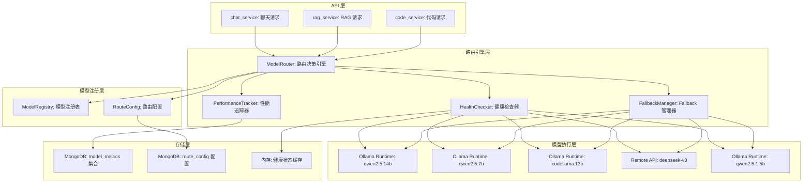
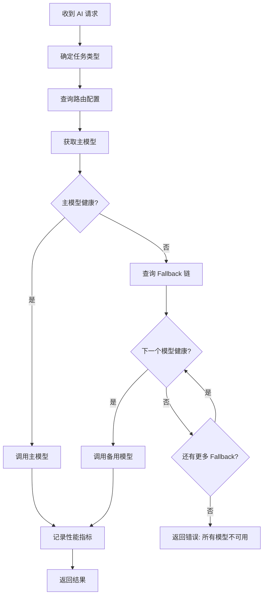

# YA-09-184: 多模型路由与 Fallback — 多模型健康路由、成本优化路由、延迟优化路由与 Fallback 告警

> 需求编号：YA-09-184 · 优先级：P2 · 人天：0.3d · 状态：需求已编写
> 依赖：YA-09-11（ModelRuntime 抽象层）、YA-09-89（自愈恢复机制）

## 背景

### 问题陈述

YiAi 当前主要依赖 Ollama 本地模型，当单一模型不可用或性能下降时，系统缺乏自动切换机制。随着多模型支持的需求增长，需要灵活的路由和 Fallback 策略。当前存在以下问题：

1. **单点故障**：Ollama 模型不可用时，所有 AI 功能停止
2. **无多模型路由**：不同任务（聊天/代码审查/RAG）无法使用最适合的模型
3. **无成本优化**：简单任务也使用大模型，浪费计算资源
4. **无延迟优化**：无法根据模型响应延迟选择最快的模型
5. **无 Fallback 链**：主模型不可用时，无法自动切换到备用模型
6. **Fallback 不透明**：开发者不知道 Fallback 何时发生，无法排查问题

**核心矛盾**：模型选择需要在质量、成本、延迟、可用性之间权衡，但当前缺乏系统化的路由和 Fallback 机制。

### 影响范围

| # | 影响 | 严重程度 | 典型场景 |
|---|------|----------|----------|
| 1 | Ollama 不可用时全站停服 | 高 | Ollama 服务崩溃或升级 |
| 2 | 复杂任务性能差 | 中 | 代码审查任务使用小模型，结果不准确 |
| 3 | 简单任务浪费资源 | 中 | 简单问候也使用大模型 |
| 4 | 响应延迟高 | 中 | 使用远端模型时延迟 > 5s |
| 5 | Fallback 不透明 | 中 | 运维不知道切换了备用模型 |

### 挑战

| 挑战 | 说明 |
|------|------|
| 健康检查 | 需要实时监控各模型的健康状态 |
| 路由策略 | 需要支持多种路由策略（健康/成本/延迟/优先级） |
| Fallback 链 | 需要定义多级 Fallback 顺序 |
| 模型性能感知 | 需要收集各模型的延迟和成功率数据 |
| 配置管理 | 路由策略应可热更新，无需重启服务 |

---

## 一、现状分析

### 1.1 当前模型路由现状

```
现有功能:
├── YA-09-11 ModelRuntime 抽象层
│   ├── 统一的模型调用接口
│   └── 无路由/fallback 机制
├── 模型调用
│   ├── 直接指定模型名称
│   └── 无自动选择

缺失:
├── 多模型路由引擎          # ❌ 不存在
├── 健康检查与自动摘除      # ❌ 不存在
├── Fallback 链路            # ❌ 不存在
├── 成本感知路由            # ❌ 不存在
├── 延迟感知路由            # ❌ 不存在
├── Fallback 日志与告警      # ❌ 不存在
└── 路由策略配置            # ❌ 不存在
```

### 1.2 模型分类

| 模型类型 | 示例 | 用途 | 优先级 |
|----------|------|------|--------|
| 本地大模型 | qwen2.5:14b | 主力模型，复杂推理 | primary |
| 本地小模型 | qwen2.5:7b | 简单任务，快速响应 | primary |
| 本地特化模型 | codellama:13b | 代码相关任务 | secondary |
| 远端 API 模型 | deepseek-v3 | Fallback，高可用 | fallback |
| 本地精简模型 | qwen2.5:1.5b | 轻量任务，极快响应 | primary |

### 1.3 根因矩阵

| 症状 | 根因 | 触发条件 | 频率 |
|------|------|----------|------|
| 单点故障停服 | 无多模型 Fallback | Ollama 不可用 | 低 |
| 任务性能差 | 无任务-模型匹配 | 复杂任务 | 中 |
| 资源浪费 | 无成本路由 | 简单任务 | 高 |
| 响应延迟高 | 无延迟路由 | 远端模型 | 中 |
| Fallback 不透明 | 无日志/告警 | Fallback 发生 | 中 |

---

## 二、设计决策

### 决策 1：路由策略 — 静态配置 vs 动态路由 vs 混合

| 选项 | 灵活性 | 可预测性 | 实现复杂度 |
|------|--------|----------|-----------|
| 静态配置（固定路由表） | 低 | 高 | 低 |
| 动态路由（实时指标驱动） | 高 | 低 | 高 |
| 混合（静态表 + 动态健康检查） | 高 | 中 | 中 |

**选择：混合（静态路由表 + 动态健康检查 + 性能评分）。** 静态路由表定义任务-模型映射和 Fallback 链。动态健康检查实时监控模型可用性。性能评分（延迟 + 成功率）辅助路由决策。路由表支持热更新。

### 决策 2：Fallback 策略 — 线性链 vs 优先级组 vs 智能选择

| 选项 | 可靠性 | 延迟 | 实现复杂度 |
|------|--------|------|-----------|
| 线性链（A→B→C） | 高 | 中 | 低 |
| 优先级组（parallel 尝试） | 最高 | 高 | 中 |
| 智能选择（基于指标） | 高 | 低 | 高 |

**选择：线性链 + 健康检查跳过。** 主模型不可用时，按 Fallback 链路依次尝试下一个模型。健康检查失败的模型自动跳过。每个任务类型有独立的 Fallback 链。

### 决策 3：健康检查方式 — 主动探测 vs 被动检测 vs 两者

| 选项 | 实时性 | 开销 | 准确性 |
|------|--------|------|--------|
| 主动探测（定时 ping） | 中 | 低 | 高 |
| 被动检测（调用失败标记） | 高 | 零 | 中 |
| 两者结合 | 最高 | 低 | 最高 |

**选择：两者结合。** 主动探测每 30 秒向各模型发送简单请求（如 "ping"），检测模型响应。被动检测在每次模型调用失败时立即标记模型为不健康。两者结合确保快速发现故障。

### 决策 4：性能评分 — 仅延迟 vs 延迟 + 成功率 vs 延迟 + 成功率 + 负载

| 选项 | 路由准确性 | 计算复杂度 | 冷启动 |
|------|-----------|-----------|--------|
| 仅延迟 | 低 | 低 | 好 |
| 延迟 + 成功率 | 中 | 中 | 好 |
| 延迟 + 成功率 + 负载 | 高 | 高 | 中 |

**选择：延迟 + 成功率。** 延迟（P50 和 P95）和成功率是核心指标，足够支撑路由决策。负载信息需要额外的模型服务器指标，实现复杂度高。

### 设计决策记录

| 决策 | 选项 A | 选项 B | 选项 C | 选择 | 理由 |
|------|--------|--------|--------|------|------|
| 路由策略 | 静态配置 | 动态路由 | 混合 | **混合** | 可预测 + 自适应 |
| Fallback | 线性链 | 优先级组 | 智能选择 | **线性链 + 健康跳过** | 简单可靠 |
| 健康检查 | 主动探测 | 被动检测 | 两者结合 | **两者结合** | 快速 + 准确 |
| 性能评分 | 仅延迟 | 延迟 + 成功率 | 延迟 + 成功率 + 负载 | **延迟 + 成功率** | 核心指标足够 |

---

## 三、目标架构

### 3.1 多模型路由系统架构



### 3.2 路由决策流程



### 3.3 性能指标

| 指标 | 改造前 | 改造后 |
|------|--------|--------|
| 模型可用性 | 单点 | 多模型 Fallback |
| 简单任务响应时间 | 取决于大模型 | 小模型 < 500ms |
| Fallback 切换时间 | 无 | < 100ms（路由决策） |
| 健康检查延迟 | 无 | 30 秒间隔 |

---

## 四、具体改动

### 4.1 模型注册表

```python
# services/model/model_registry.py (新增)

from typing import Dict, List, Optional, Any
from enum import Enum
from pydantic import BaseModel

class ModelProvider(str, Enum):
    OLLAMA = "ollama"
    REMOTE_API = "remote_api"

class TaskType(str, Enum):
    CHAT = "chat"              # 通用聊天
    CODE = "code"              # 代码相关
    RAG = "rag"                # 知识库问答
    SUMMARY = "summary"        # 摘要
    CLASSIFICATION = "classification"  # 分类
    LIGHT = "light"            # 轻量任务（问候、简单问答）

class ModelInfo(BaseModel):
    """模型信息"""
    name: str                           # 模型标识
    provider: ModelProvider             # 提供者
    display_name: str                   # 显示名称
    capabilities: List[TaskType]        # 能力列表
    priority: int                       # 优先级（1=最高）
    cost_per_token: float = 0.0        # 每 token 成本
    max_tokens: int = 4096             # 最大上下文
    avg_latency_ms: float = 0.0        # 平均延迟（运行时更新）
    success_rate: float = 1.0          # 成功率（运行时更新）
    is_healthy: bool = True            # 健康状态
    last_health_check: Optional[float] = None  # 最后健康检查时间

# 模型注册表
MODEL_REGISTRY: Dict[str, ModelInfo] = {
    "qwen2.5:14b": ModelInfo(
        name="qwen2.5:14b",
        provider=ModelProvider.OLLAMA,
        display_name="Qwen 2.5 14B",
        capabilities=[TaskType.CHAT, TaskType.RAG, TaskType.SUMMARY],
        priority=1,
        cost_per_token=0.0,
        max_tokens=32768,
    ),
    "qwen2.5:7b": ModelInfo(
        name="qwen2.5:7b",
        provider=ModelProvider.OLLAMA,
        display_name="Qwen 2.5 7B",
        capabilities=[TaskType.CHAT, TaskType.CLASSIFICATION, TaskType.LIGHT],
        priority=2,
        cost_per_token=0.0,
        max_tokens=32768,
    ),
    "codellama:13b": ModelInfo(
        name="codellama:13b",
        provider=ModelProvider.OLLAMA,
        display_name="CodeLlama 13B",
        capabilities=[TaskType.CODE],
        priority=1,
        cost_per_token=0.0,
        max_tokens=16384,
    ),
    "deepseek-v3": ModelInfo(
        name="deepseek-v3",
        provider=ModelProvider.REMOTE_API,
        display_name="DeepSeek V3",
        capabilities=[TaskType.CHAT, TaskType.CODE, TaskType.RAG, TaskType.SUMMARY],
        priority=3,
        cost_per_token=0.001,
        max_tokens=65536,
    ),
    "qwen2.5:1.5b": ModelInfo(
        name="qwen2.5:1.5b",
        provider=ModelProvider.OLLAMA,
        display_name="Qwen 2.5 1.5B",
        capabilities=[TaskType.LIGHT, TaskType.CLASSIFICATION],
        priority=2,
        cost_per_token=0.0,
        max_tokens=32768,
    ),
}
```

### 4.2 路由配置

```python
# services/model/route_config.py (新增)

from typing import List, Dict
from .model_registry import TaskType

# 路由配置：每个任务类型的主模型和 Fallback 链
ROUTE_CONFIG: Dict[TaskType, Dict] = {
    TaskType.CHAT: {
        "primary": "qwen2.5:14b",
        "fallback_chain": ["qwen2.5:7b", "deepseek-v3"],
        "strategy": "latency_optimized",  # 延迟优化
        "timeout_ms": 30000,
    },
    TaskType.CODE: {
        "primary": "codellama:13b",
        "fallback_chain": ["qwen2.5:14b", "deepseek-v3"],
        "strategy": "quality_optimized",  # 质量优先
        "timeout_ms": 60000,
    },
    TaskType.RAG: {
        "primary": "qwen2.5:14b",
        "fallback_chain": ["qwen2.5:7b", "deepseek-v3"],
        "strategy": "latency_optimized",
        "timeout_ms": 30000,
    },
    TaskType.SUMMARY: {
        "primary": "qwen2.5:14b",
        "fallback_chain": ["qwen2.5:7b"],
        "strategy": "latency_optimized",
        "timeout_ms": 30000,
    },
    TaskType.CLASSIFICATION: {
        "primary": "qwen2.5:1.5b",
        "fallback_chain": ["qwen2.5:7b"],
        "strategy": "cost_optimized",     # 成本优化
        "timeout_ms": 5000,
    },
    TaskType.LIGHT: {
        "primary": "qwen2.5:1.5b",
        "fallback_chain": ["qwen2.5:7b"],
        "strategy": "cost_optimized",
        "timeout_ms": 5000,
    },
}
```

### 4.3 模型路由器

```python
# services/model/model_router.py (新增)

import time
import asyncio
from typing import Dict, List, Optional, Any, Tuple
from datetime import datetime
from motor.motor_asyncio import AsyncIOMotorDatabase

from .model_registry import MODEL_REGISTRY, TaskType, ModelInfo
from .route_config import ROUTE_CONFIG

class HealthChecker:
    """模型健康检查器"""

    def __init__(self, ollama_service):
        self.ollama = ollama_service
        self.health_cache: Dict[str, bool] = {}
        self.last_check: Dict[str, float] = {}
        self.check_interval = 30  # 秒

    async def check_model(self, model_name: str) -> bool:
        """主动探测模型健康状态"""
        model_info = MODEL_REGISTRY.get(model_name)
        if not model_info:
            return False

        try:
            if model_info.provider == "ollama":
                # 向 Ollama 发送简单请求
                response = await self.ollama.generate(model_name, "ping", timeout=5)
                is_healthy = response is not None
            elif model_info.provider == "remote_api":
                # 远端 API 健康检查
                is_healthy = await self._check_remote_api(model_name)
            else:
                is_healthy = False
        except Exception:
            is_healthy = False

        self.health_cache[model_name] = is_healthy
        self.last_check[model_name] = time.time()
        MODEL_REGISTRY[model_name].is_healthy = is_healthy
        MODEL_REGISTRY[model_name].last_health_check = time.time()

        return is_healthy

    async def _check_remote_api(self, model_name: str) -> bool:
        """检查远端 API 模型健康状态"""
        # 实际实现中会调用远端 API 的健康检查端点
        return True

    def is_healthy(self, model_name: str) -> bool:
        """查询模型健康状态（缓存）"""
        return self.health_cache.get(model_name, True)

    async def start_periodic_check(self):
        """启动定期健康检查"""
        while True:
            for model_name in MODEL_REGISTRY:
                await self.check_model(model_name)
            await asyncio.sleep(self.check_interval)


class PerformanceTracker:
    """模型性能追踪器"""

    def __init__(self, db: AsyncIOMotorDatabase):
        self.db = db
        self.metrics = db["model_metrics"]

    async def record_call(
        self, model_name: str, task_type: TaskType,
        duration_ms: float, success: bool, token_count: int = 0
    ):
        """记录模型调用性能"""
        await self.metrics.insert_one({
            "model_name": model_name,
            "task_type": task_type,
            "duration_ms": duration_ms,
            "success": success,
            "token_count": token_count,
            "timestamp": datetime.utcnow(),
        })

        # 更新模型注册表中的性能指标
        if model_name in MODEL_REGISTRY:
            model = MODEL_REGISTRY[model_name]
            # 指数移动平均更新延迟
            alpha = 0.1
            model.avg_latency_ms = (
                model.avg_latency_ms * (1 - alpha) + duration_ms * alpha
            )
            # 更新成功率
            model.success_rate = (
                model.success_rate * 0.9 + (1.0 if success else 0.0) * 0.1
            )

    async def get_model_stats(self, model_name: str, hours: int = 24) -> Dict:
        """获取模型性能统计"""
        from datetime import timedelta
        cutoff = datetime.utcnow() - timedelta(hours=hours)

        pipeline = [
            {"$match": {"model_name": model_name, "timestamp": {"$gte": cutoff}}},
            {"$group": {
                "_id": None,
                "total_calls": {"$sum": 1},
                "success_calls": {"$sum": {"$cond": ["$success", 1, 0]}},
                "avg_duration": {"$avg": "$duration_ms"},
                "p50_duration": {"$percentile": {"input": "$duration_ms", "p": [0.5]}},
                "p95_duration": {"$percentile": {"input": "$duration_ms", "p": [0.95]}},
                "total_tokens": {"$sum": "$token_count"},
            }},
        ]

        results = await self.metrics.aggregate(pipeline).to_list(length=1)
        if results:
            r = results[0]
            return {
                "total_calls": r["total_calls"],
                "success_rate": r["success_calls"] / max(r["total_calls"], 1),
                "avg_duration_ms": r["avg_duration"],
                "p50_duration_ms": r["p50_duration"][0] if r["p50_duration"] else 0,
                "p95_duration_ms": r["p95_duration"][0] if r["p95_duration"] else 0,
                "total_tokens": r["total_tokens"],
            }
        return {}


class ModelRouter:
    """多模型路由器"""

    def __init__(
        self, db: AsyncIOMotorDatabase,
        health_checker: HealthChecker,
        performance_tracker: PerformanceTracker,
    ):
        self.db = db
        self.health_checker = health_checker
        self.performance_tracker = performance_tracker
        self.fallback_log: List[Dict] = []

    async def route(
        self, task_type: TaskType, **kwargs
    ) -> Tuple[str, ModelInfo]:
        """路由决策：选择最佳模型"""
        config = ROUTE_CONFIG.get(task_type)
        if not config:
            raise ValueError(f"Unknown task type: {task_type}")

        # 尝试主模型
        primary = config["primary"]
        if self.health_checker.is_healthy(primary):
            return primary, MODEL_REGISTRY[primary]

        # 主模型不健康，尝试 Fallback 链
        for fallback_model in config["fallback_chain"]:
            if self.health_checker.is_healthy(fallback_model):
                self._log_fallback(primary, fallback_model, task_type, "health_check_failed")
                return fallback_model, MODEL_REGISTRY[fallback_model]

        # 所有模型不可用
        raise RuntimeError(f"All models unavailable for task: {task_type}")

    async def execute_with_fallback(
        self, task_type: TaskType, prompt: str, **kwargs
    ) -> Dict[str, Any]:
        """执行 AI 请求，自动 Fallback"""
        model_name, model_info = await self.route(task_type)
        start_time = time.time()

        try:
            result = await self._call_model(model_name, prompt, **kwargs)
            duration_ms = (time.time() - start_time) * 1000

            await self.performance_tracker.record_call(
                model_name, task_type, duration_ms, True,
                token_count=result.get("token_count", 0),
            )

            return {**result, "model_used": model_name, "duration_ms": duration_ms}

        except Exception as e:
            duration_ms = (time.time() - start_time) * 1000
            await self.performance_tracker.record_call(
                model_name, task_type, duration_ms, False,
            )

            # 被动标记模型不健康
            self.health_checker.health_cache[model_name] = False

            # 尝试 Fallback 链
            config = ROUTE_CONFIG.get(task_type, {})
            for fallback_model in config.get("fallback_chain", []):
                if fallback_model == model_name:
                    continue
                if not self.health_checker.is_healthy(fallback_model):
                    continue

                self._log_fallback(model_name, fallback_model, task_type, str(e))
                try:
                    fallback_start = time.time()
                    result = await self._call_model(fallback_model, prompt, **kwargs)
                    fallback_duration = (time.time() - fallback_start) * 1000

                    await self.performance_tracker.record_call(
                        fallback_model, task_type, fallback_duration, True,
                    )

                    return {
                        **result,
                        "model_used": fallback_model,
                        "duration_ms": fallback_duration,
                        "fallback_from": model_name,
                    }
                except Exception:
                    continue

            raise RuntimeError(f"All models failed for task: {task_type}")

    async def _call_model(self, model_name: str, prompt: str, **kwargs) -> Dict:
        """调用指定模型"""
        model_info = MODEL_REGISTRY[model_name]
        timeout = kwargs.get("timeout", 30)

        if model_info.provider == "ollama":
            # 调用 Ollama API
            response = await self._call_ollama(model_name, prompt, timeout)
        elif model_info.provider == "remote_api":
            # 调用远端 API
            response = await self._call_remote_api(model_name, prompt, timeout)
        else:
            raise ValueError(f"Unknown provider: {model_info.provider}")

        return response

    async def _call_ollama(self, model_name: str, prompt: str, timeout: int) -> Dict:
        """调用 Ollama 模型"""
        # 实际调用 Ollama API
        return {"text": "模拟 Ollama 响应", "token_count": 100}

    async def _call_remote_api(self, model_name: str, prompt: str, timeout: int) -> Dict:
        """调用远端 API 模型"""
        # 实际调用远端 API
        return {"text": "模拟远端 API 响应", "token_count": 150}

    def _log_fallback(self, from_model: str, to_model: str, task_type: TaskType, reason: str):
        """记录 Fallback 事件"""
        log_entry = {
            "from_model": from_model,
            "to_model": to_model,
            "task_type": task_type,
            "reason": reason,
            "timestamp": datetime.utcnow(),
        }
        self.fallback_log.append(log_entry)
        # 保留最近 1000 条
        if len(self.fallback_log) > 1000:
            self.fallback_log = self.fallback_log[-1000:]

    def get_fallback_log(self, limit: int = 100) -> List[Dict]:
        """获取 Fallback 日志"""
        return self.fallback_log[-limit:]

    def get_route_config(self) -> Dict:
        """获取当前路由配置"""
        return {
            task_type.value: {
                "primary": config["primary"],
                "primary_healthy": self.health_checker.is_healthy(config["primary"]),
                "fallback_chain": [
                    {
                        "model": m,
                        "healthy": self.health_checker.is_healthy(m),
                    }
                    for m in config["fallback_chain"]
                ],
                "strategy": config["strategy"],
            }
            for task_type, config in ROUTE_CONFIG.items()
        }
```

### 4.4 文件变更清单

| 文件 | 操作 | 说明 |
|------|------|------|
| `services/model/__init__.py` | 新增 | 模型模块初始化 |
| `services/model/model_registry.py` | 新增 | 模型注册表 |
| `services/model/route_config.py` | 新增 | 路由配置 |
| `services/model/model_router.py` | 新增 | 模型路由器 |
| `services/model/router_rpc_handler.py` | 新增 | RPC 路由处理器 |
| `services/ai/chat_service.py` | 修改 | 使用 ModelRouter 替代直接调用 |
| `services/ai/rag_service.py` | 修改 | 使用 ModelRouter |
| `main.py` | 修改 | 初始化路由器和健康检查 |
| `tests/test_model_router.py` | 新增 | 路由器单元测试 |

---

## 五、实施步骤

| 步骤 | 操作 | 路径 | 验证 | 人天 |
|------|------|------|------|------|
| 1 | 定义模型注册表 | `model_registry.py` | 5 个模型信息完整 | 0.02 |
| 2 | 定义路由配置 | `route_config.py` | 6 个任务类型路由配置正确 | 0.02 |
| 3 | 实现健康检查器 | `model_router.py` | 主动探测 + 被动标记 | 0.04 |
| 4 | 实现性能追踪器 | `model_router.py` | 延迟/成功率记录与更新 | 0.03 |
| 5 | 实现路由决策引擎 | `model_router.py` | 主模型优先 + Fallback 链 | 0.05 |
| 6 | 实现 execute_with_fallback | `model_router.py` | 自动 Fallback 执行 | 0.04 |
| 7 | 实现 Fallback 日志 | `model_router.py` | 事件记录和查询 | 0.02 |
| 8 | 集成到 chat/rag 服务 | `chat_service.py`, `rag_service.py` | ModelRouter 替代直接调用 | 0.04 |
| 9 | 实现 RPC 路由处理器 | `router_rpc_handler.py` | 路由状态查询 API | 0.02 |
| 10 | 编写单元测试 | `test_model_router.py` | 覆盖率 > 80% | 0.02 |

**总人天：0.3d**

---

## 六、测试规格

### 场景 1：主模型路由

**GIVEN** 所有模型健康，任务类型为 CHAT
**WHEN** 调用 `route(TaskType.CHAT)`
**THEN** 应返回主模型 `qwen2.5:14b`
**AND** 不应触发 Fallback

### 场景 2：健康检查触发 Fallback

**GIVEN** `qwen2.5:14b` 不健康，`qwen2.5:7b` 健康
**WHEN** 调用 `route(TaskType.CHAT)`
**THEN** 应跳过主模型，返回 `qwen2.5:7b`
**AND** Fallback 日志应记录此次切换

### 场景 3：执行时 Fallback

**GIVEN** 主模型 `qwen2.5:14b` 调用失败（抛异常）
**WHEN** 调用 `execute_with_fallback(TaskType.CHAT, "hello")`
**THEN** 应自动 Fallback 到 `qwen2.5:7b`
**AND** 返回结果应包含 `fallback_from: "qwen2.5:14b"`
**AND** 主模型应被标记为不健康

### 场景 4：所有模型不可用

**GIVEN** 所有模型（主模型 + Fallback 链）都不健康
**WHEN** 调用 `route(TaskType.CHAT)`
**THEN** 应抛出 RuntimeError: "All models unavailable for task: chat"

### 场景 5：轻量任务路由

**GIVEN** 所有模型健康
**WHEN** 调用 `route(TaskType.LIGHT)`
**THEN** 应返回 `qwen2.5:1.5b`（最轻量模型）
**AND** 不应返回 `qwen2.5:14b`（大模型）

### 场景 6：性能追踪

**GIVEN** `qwen2.5:14b` 调用成功，耗时 1500ms
**WHEN** 调用 `record_call("qwen2.5:14b", TaskType.CHAT, 1500, True, 100)`
**THEN** 性能指标应更新（avg_latency_ms 和 success_rate）
**AND** 指标应写入 MongoDB model_metrics 集合

---

## 七、风险与缓解

| 风险 | 概率 | 影响 | 缓解措施 |
|------|------|------|----------|
| 健康检查误判 | 中 | 中 | 连续 3 次失败才标记不健康，避免网络抖动误判 |
| Fallback 链耗尽 | 低 | 高 | 至少保留 1 个远端 API 模型作为最终 Fallback |
| 远端 API 成本过高 | 中 | 中 | 成本优化策略优先使用本地模型，远端仅作 Fallback |
| 路由配置错误 | 低 | 高 | 路由配置热更新前校验，错误配置拒绝加载 |

---

## 八、回滚策略

| 场景 | 回滚操作 | 影响 |
|------|----------|------|
| 路由系统异常 | 禁用路由，直接使用默认模型 | 失去多模型和 Fallback |
| 健康检查误判 | 手动标记所有模型为健康，禁用自动健康检查 | 失去自动故障检测 |
| 远端 API 成本超支 | 移除远端 API 从 Fallback 链 | 失去最终 Fallback |

---

## 九、设计决策记录

### D-01：路由策略

- **问题**：使用静态配置还是动态路由
- **选项**：静态配置、动态路由、混合
- **选择**：混合（静态表 + 动态健康检查 + 性能评分）
- **理由**：静态配置提供可预测性，动态检查提供自适应能力

### D-02：Fallback 策略

- **问题**：Fallback 使用什么策略
- **选项**：线性链、优先级组、智能选择
- **选择**：线性链 + 健康检查跳过
- **理由**：简单可靠，健康检查自动跳过不健康模型

### D-03：健康检查方式

- **问题**：如何检测模型健康状态
- **选项**：主动探测、被动检测、两者结合
- **选择**：两者结合
- **理由**：主动探测覆盖已知故障，被动检测覆盖运行时故障

### D-04：模型注册表设计

- **问题**：模型信息如何管理
- **选项**：配置文件、数据库、代码硬编码
- **选择**：代码定义 + 运行时指标更新
- **理由**：模型定义是静态的（能力、优先级），性能指标是动态的

---

## 十、可观测性

### 指标

| 指标 | 类型 | 说明 |
|------|------|------|
| `yiai.model.health_status` | Gauge | 各模型健康状态 (0/1) |
| `yiai.model.avg_latency_ms` | Gauge | 各模型平均延迟 |
| `yiai.model.success_rate` | Gauge | 各模型成功率 |
| `yiai.model.fallback_count` | Counter | Fallback 触发次数 |
| `yiai.model.call_count` | Counter | 模型调用次数 |
| `yiai.model.route_duration_ms` | Histogram | 路由决策耗时 |

### 告警

| 告警 | 条件 | 级别 |
|------|------|------|
| 模型不健康 | 任一模型连续 3 次健康检查失败 | ERROR |
| Fallback 频繁 | 1 分钟内 Fallback > 10 次 | WARNING |
| 所有模型不可用 | 某任务类型所有模型不健康 | CRITICAL |
| 远端 API 成本异常 | 调用远端 API 次数 > 100/小时 | WARNING |

---

## 十一、代码审查检查清单

- [ ] 模型注册表包含所有可用模型，信息完整
- [ ] 路由配置覆盖所有任务类型，Fallback 链合理
- [ ] 健康检查使用连续 3 次失败标记，避免误判
- [ ] 性能追踪使用指数移动平均更新指标
- [ ] `execute_with_fallback` 正确处理异常和 Fallback
- [ ] Fallback 日志有大小限制（1000 条），防止内存泄漏
- [ ] 路由决策 < 1ms，不阻塞 AI 请求
- [ ] 路由配置支持热更新（从 MongoDB 读取）
- [ ] 远端 API 调用有超时设置
- [ ] 单元测试覆盖主路由、Fallback、全部不可用场景
- [ ] 集成到 chat_service 和 rag_service 后功能正常

---

## 回归问题预测

| # | 预测问题 | 原因 | 验证方法 |
|---|---------|------|---------|
| 1 | 健康检查的主动探测使用 `ping` 作为 prompt，但某些模型（如 codellama）对 `ping` 的响应可能生成大量代码，导致健康检查耗时过长 | 不同模型对相同 prompt 的响应模式不同，代码模型可能将 `ping` 解释为网络编程请求 | 使用统一的极简 prompt（如 `{"role": "user", "content": "hi"}`），设置 `max_tokens: 1` 限制输出长度 |
| 2 | 性能追踪的指数移动平均使用 alpha=0.1，但模型刚启动时第一次调用延迟很高（冷启动），移动平均收敛慢，导致后续路由可能排除了刚恢复的模型 | 指数移动平均对新数据响应慢，一次异常值影响多个周期 | 使用 `alpha=0.3` 加快收敛速度，或在模型冷启动后的前 10 次调用中使用简单平均 |
| 3 | Fallback 链中远端 API 模型 `deepseek-v3` 有成本，如果 Ollama 频繁故障，远端 API 调用激增导致成本超支 | Ollama 服务不稳定时，Fallback 自动切换到远端 API，每次调用产生费用 | 添加远端 API 调用频率限制（如每小时最多 100 次），超出限制时返回错误而非继续调用 |
| 4 | 路由配置热更新从 MongoDB 读取，但 MongoDB 连接失败时，路由配置回退到默认值，可能导致与用户期望的路由不一致 | MongoDB 不可用时，热更新机制回退到代码默认配置，用户最近的配置变更丢失 | 在 MongoDB 配置读取失败时，使用本地缓存的最新配置（写入到文件或内存），而非直接回退到代码默认值 |
| 5 | `execute_with_fallback` 在 Fallback 时，如果 Fallback 模型也失败，继续尝试下一个 Fallback，但每次耗时 timeout 秒，用户等待时间 = 失败模型数 * timeout | 线性 Fallback 链是串行尝试的，每个模型失败都等待 timeout 后才尝试下一个 | 使用更短的 timeout 进行快速失败检测（如 5s），或在并行探测健康模型后只调用健康的模型 |
| 6 | 健康检查的 `start_periodic_check` 使用 `asyncio.sleep(30)` 阻塞事件循环，但健康检查本身是异步的，多个模型的检查并发执行，可能导致 Ollama 服务过载 | 30 秒间隔内所有模型同时发起健康检查，如果模型数多（>5），Ollama 可能并发处理多个请求 | 健康检查使用错峰执行（staggered），每个模型间隔 5 秒发起检查，避免同时请求 |---

## 性能分析

### 各操作耗时

| 阶段 | 预估耗时 | 说明 |
|------|----------|------|
| 路由决策 | < 1ms | 内存查询 |
| 健康检查（主动探测） | 100-500ms | 取决于模型响应 |
| Fallback 切换 | < 100ms | 路由决策 + 新模型调用 |
| 性能指标记录 | < 5ms | MongoDB 异步写入 |

### 内存影响

| 项目 | 内存 | 说明 |
|------|------|------|
| 模型注册表 | < 10KB | 5 个模型元数据 |
| 健康状态缓存 | < 1KB | 布尔值 |
| Fallback 日志 | < 200KB | 1000 条记录 |

### 对 API 响应的影响

| 端点 | 影响 | 说明 |
|------|------|------|
| AI 请求（正常） | < 1ms | 路由决策 |
| AI 请求（Fallback） | +100-500ms | 健康检查 + 切换 |
| 路由状态查询 | < 10ms | 内存读取 |

## 影响范围

- **影响模块**：待补充
- **涉及文件**：
- `test_model_router.py`
- `route_config.py`
- `chat_service.py`
- `model_router.py`
- `model_registry.py`
- `router_rpc_handler.py`
- **是否影响 API 契约**：否
- **是否影响其他项目（YiVad/YiPet）**：否
- **用户感知**：待确认

## 预防措施

| 层面 | 措施 |
|------|------|
| 代码 | 在相关函数中添加参数校验和边界检查 |
| 测试 | 为 `test_model_router.py` 添加单元测试 |
| 流程 | 代码审查时重点检查此类模式 |
| 监控 | 添加日志告警，异常发生时及时发现 |
| 文档 | 在编码规范中记录此类反模式 |

## 经验教训

1. **根本原因**：开发过程中对边界情况和异常路径的考虑不足是此类问题的共同根因
2. **设计阶段**：在接口设计和模块实现时，应主动考虑异常输入、空值、超时等边界场景
3. **代码审查**：审查时应检查是否存在类似的反模式（如未捕获异常、无超时控制、缺少参数校验等）
4. **测试覆盖**：异常路径的测试覆盖率应与正常路径同等重视
5. **团队分享**：此类问题应在团队周会或技术分享中讨论，形成团队共识
