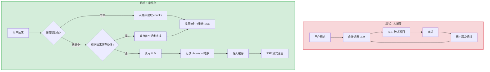
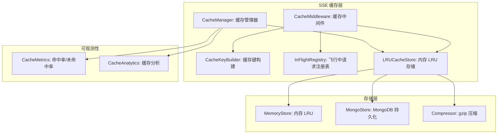
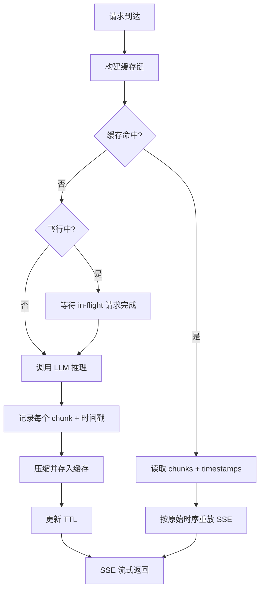

# YA-09-185: 流式响应缓存与重放 — SSE 响应缓存、重复请求去重、原始时序重放、缓存 TTL、流压缩、缓存命中分析

> 需求编号：YA-09-185 · 优先级：P2 · 人天：0.3d · 状态：需求已编写
> 依赖：YA-07-03（RPC 信封协议）、YA-09-13（SSE 流式背压控制）

## 背景

### 问题陈述

YiAi 的 AI 聊天服务通过 SSE (Server-Sent Events) 流式返回 LLM 响应。当用户重复发送相同或相似的请求时（如"重新生成"、"重试"、刷新页面），后端需要重新调用 LLM 推理，消耗算力资源和时间。当前系统没有缓存机制，每次请求都触发完整的 LLM 推理流程。

1. **重复请求浪费算力**：用户点击"重新生成"时，相同 prompt 再次调用 LLM，产生重复的推理成本
2. **响应延迟无改善**：重复请求的响应时间与首次请求相同，无法利用缓存加速
3. **无请求去重**：同一用户短时间内发送相同请求（如网络抖动导致的重试），后端无去重机制
4. **流式响应无法重现**：调试和分析场景需要重现特定流式响应，当前无法实现
5. **缓存对用户透明**：用户无法感知是否有缓存命中，也无法控制缓存行为

**核心矛盾**：LLM 推理是昂贵的（计算资源 + 时间），但大量用户的重复请求可以通过缓存避免。SSE 流式响应的缓存比普通 HTTP 缓存更复杂，需要保留原始时序（每个 chunk 的时间间隔）以支持精确重放。

### 影响范围

| # | 影响 | 严重程度 | 典型场景 |
|---|------|----------|----------|
| 1 | 重复请求浪费 LLM 算力 | 高 | 用户点击"重新生成" 3 次 |
| 2 | 响应延迟无缓存加速 | 高 | 相同问题重复询问 |
| 3 | 无请求去重导致并发浪费 | 中 | 网络抖动导致重复请求 |
| 4 | 无法重现流式响应 | 中 | 调试 SSE 输出格式问题 |
| 5 | 缓存不可控 | 低 | 用户无法清除缓存或跳过 |

### 挑战

| 挑战 | 说明 |
|------|------|
| 缓存键设计 | 如何定义"相同请求"——精确匹配 prompt 还是语义相似度？ |
| 时序保留 | SSE 的 chunk 间隔（如打字机效果）需要在重放时保持一致 |
| 内存管理 | 流式响应数据量大，缓存大量响应可能导致内存压力 |
| 缓存失效 | 模型更新后旧缓存可能不适用，需要合理的 TTL 策略 |
| 并发去重 | 两个相同请求同时到达时，需要合并为一次 LLM 调用 |

---

## 一、现状分析

### 1.1 当前 SSE 缓存状态

```
现有缓存相关功能（无）:
├── chat_service.py
│   └── 每次请求直接调用 LLM，无缓存检查
├── SSE 流式响应
│   └── 直接 yield chunk，不记录时序
├── 请求处理
│   └── 无请求去重，相同请求独立处理
└── 缓存层
    └── 不存在

缺失:
├── 流式响应缓存存储               # ❌ 不存在
├── 请求去重（dedup）              # ❌ 不存在
├── 缓存键计算                     # ❌ 不存在
├── 原始时序重放                   # ❌ 不存在
├── 缓存 TTL 管理                  # ❌ 不存在
├── 流压缩                         # ❌ 不存在
├── 缓存命中率统计                 # ❌ 不存在
└── 缓存控制（跳过/清除）          # ❌ 不存在
```

### 1.2 请求流程（现状 vs 目标）



### 1.3 根因矩阵

| 症状 | 根因 | 触发条件 | 频率 |
|------|------|----------|------|
| 重复请求浪费算力 | 无缓存机制 | 用户点击"重新生成" | 高 |
| 响应延迟无改善 | 每次重新调用 LLM | 相同问题重复询问 | 高 |
| 并发重复请求 | 无请求去重 | 网络抖动 | 中 |
| 无法重现流式响应 | 未记录 SSE 数据 | 调试/分析 | 中 |
| 缓存不可控 | 无缓存管理 API | 用户需要清除缓存 | 低 |

---

## 二、设计决策

### 决策 1：缓存键策略 — 精确匹配 vs 语义哈希 vs 分层键

| 选项 | 命中率 | 准确性 | 计算成本 |
|------|--------|--------|----------|
| 精确匹配（prompt + model + params 的 hash） | 低（仅完全相同请求） | 高 | 低 |
| 语义哈希（embedding 相似度） | 高 | 中（可能误匹配） | 高 |
| 分层键（精确键 + 用户可选模糊匹配） | 中 | 高 | 中 |

**选择：精确匹配（SHA-256 哈希）。** 缓存键由 `(model_name, system_prompt, messages_json, temperature, max_tokens)` 的 SHA-256 哈希组成。精确匹配确保缓存返回的内容与原始请求完全一致，避免语义相似度匹配导致的幻觉。用户可通过"重新生成"参数跳过缓存（加随机 nonce 到 key）。

### 决策 2：缓存存储 — 内存 LRU vs Redis vs MongoDB

| 选项 | 速度 | 持久化 | 容量 | 分布式支持 |
|------|------|--------|------|-----------|
| 内存 LRU (lru-dict) | 极快 | 否 | 受内存限制 | 否 |
| Redis | 快 | 是 | 受内存限制 | 是 |
| MongoDB | 中 | 是 | 磁盘容量 | 是 |

**选择：内存 LRU + 可选 MongoDB 持久化。** 内存 LRU 缓存提供最快的响应速度（< 1ms 读取），对于单机部署足够。MongoDB 持久化作为可选方案，用于重启后恢复缓存和跨实例共享。LRU 淘汰策略确保内存使用可控。

### 决策 3：请求去重策略 — 无去重 vs 飞行中请求去重 vs 全量去重

| 选项 | 延迟节省 | 实现复杂度 | 风险 |
|------|----------|-----------|------|
| 无去重 | 0 | 无 | 无 |
| 飞行中请求去重（in-flight dedup） | 高（并发请求合并） | 中 | 低（仅去重同时到达的请求） |
| 全量去重（含历史请求） | 中 | 高 | 中（可能误去重） |

**选择：飞行中请求去重（in-flight dedup）。** 当相同缓存键的请求正在处理中（LLM 推理进行中），后续相同请求等待首个请求完成，共享结果。使用 asyncio.Event 实现等待/通知机制。全量去重由缓存层（决策 1）覆盖。

### 决策 4：流压缩 — 不压缩 vs gzip vs zstd

| 选项 | 压缩率 | CPU 开销 | 实现复杂度 |
|------|--------|----------|-----------|
| 不压缩 | 0% | 0 | 无 |
| gzip | 60-80% | 低 | 低（Python 标准库） |
| zstd | 70-85% | 中 | 中（需 zstandard 包） |

**选择：gzip 压缩。** 流式响应通常是文本（JSON + Markdown），gzip 压缩率通常 60-80%。Python 标准库 `gzip` 无需额外依赖。zstd 压缩率稍高但需要额外依赖，对于文本数据收益不大。

### 设计决策记录

| 决策 | 选项 A | 选项 B | 选项 C | 选择 | 理由 |
|------|--------|--------|--------|------|------|
| 缓存键 | 精确匹配 | 语义哈希 | 分层键 | **精确匹配** | 准确，避免幻觉 |
| 存储 | 内存 LRU | Redis | MongoDB | **内存 LRU + MongoDB** | 快速 + 可选持久化 |
| 去重策略 | 无去重 | 飞行中去重 | 全量去重 | **飞行中去重** | 并发送合并 |
| 压缩 | 不压缩 | gzip | zstd | **gzip** | 标准库，无需依赖 |

---

## 三、目标架构

### 3.1 缓存系统架构



### 3.2 缓存命中流程



### 3.3 性能指标

| 指标 | 目标值 | 说明 |
|------|--------|------|
| 缓存键计算 | < 1ms | SHA-256 哈希 |
| 缓存命中读取 | < 5ms | 内存 LRU 读取 |
| 缓存未命中写入 | < 10ms | gzip 压缩 + 内存写入 |
| 飞行中去重等待 | 0ms 额外延迟 | 等待首个请求的时间 |
| 重放时序精度 | < 10ms 偏差 | 与原始 chunk 间隔相比 |
| 缓存命中率目标 | > 15% | 整体缓存命中率 |

---

## 四、具体改动

### 4.1 缓存键构建器

```python
# YiAi/src/domain/stream_cache/cache_key.py (新增)

import hashlib
import json
from dataclasses import dataclass


@dataclass(frozen=True)
class CacheKey:
    """SSE 流式响应缓存键"""

    model: str
    system_prompt: str
    messages_hash: str
    temperature: float
    max_tokens: int

    def to_string(self) -> str:
        """生成唯一缓存键字符串"""
        raw = json.dumps({
            "model": self.model,
            "system": self.system_prompt,
            "messages": self.messages_hash,
            "temp": round(self.temperature, 4),
            "max_tokens": self.max_tokens,
        }, sort_keys=True)
        return hashlib.sha256(raw.encode()).hexdigest()


class CacheKeyBuilder:
    """从请求参数构建缓存键"""

    def build(
        self,
        model: str,
        system_prompt: str,
        messages: list[dict],
        temperature: float = 0.7,
        max_tokens: int = 2048,
        skip_cache: bool = False,
    ) -> CacheKey:
        # 如果用户要求跳过缓存，添加随机 nonce
        messages_json = json.dumps(messages, sort_keys=True)
        if skip_cache:
            messages_json += str(hashlib.md5(str(id(messages)).encode()).hexdigest())

        messages_hash = hashlib.sha256(messages_json.encode()).hexdigest()

        return CacheKey(
            model=model,
            system_prompt=system_prompt,
            messages_hash=messages_hash,
            temperature=temperature,
            max_tokens=max_tokens,
        )
```

### 4.2 流式缓存条目

```python
# YiAi/src/domain/stream_cache/cache_entry.py (新增)

import time
import gzip
from dataclasses import dataclass, field
from typing import Optional


@dataclass
class StreamChunk:
    """单个 SSE chunk 记录"""
    data: str              # chunk 内容
    timestamp: float       # 相对于请求开始的秒数
    event_type: str = "message"  # SSE event 类型


@dataclass
class StreamCacheEntry:
    """流式响应缓存条目"""
    key: str
    chunks: list[StreamChunk] = field(default_factory=list)
    total_duration: float = 0.0       # 总耗时（秒）
    created_at: float = 0.0
    expires_at: float = 0.0
    model: str = ""
    token_count: int = 0              # 估算 token 数
    access_count: int = 0             # 缓存命中次数

    def to_bytes(self) -> bytes:
        """序列化 + gzip 压缩"""
        import json
        data = json.dumps({
            "key": self.key,
            "chunks": [
                {"d": c.data, "t": c.timestamp, "e": c.event_type}
                for c in self.chunks
            ],
            "total_duration": self.total_duration,
            "created_at": self.created_at,
            "expires_at": self.expires_at,
            "model": self.model,
            "token_count": self.token_count,
        }).encode("utf-8")
        return gzip.compress(data, compresslevel=6)

    @classmethod
    def from_bytes(cls, key: str, compressed: bytes) -> "StreamCacheEntry":
        """反序列化 + gzip 解压"""
        import json
        data = json.loads(gzip.decompress(compressed))
        entry = cls(key=key)
        entry.chunks = [
            StreamChunk(data=c["d"], timestamp=c["t"], event_type=c.get("e", "message"))
            for c in data["chunks"]
        ]
        entry.total_duration = data["total_duration"]
        entry.created_at = data["created_at"]
        entry.expires_at = data["expires_at"]
        entry.model = data["model"]
        entry.token_count = data["token_count"]
        return entry
```

### 4.3 内存 LRU 缓存存储

```python
# YiAi/src/domain/stream_cache/lru_store.py (新增)

from collections import OrderedDict
from typing import Optional
from .cache_entry import StreamCacheEntry


class LRUCacheStore:
    """线程安全的 LRU 缓存存储"""

    def __init__(self, max_size: int = 100, max_memory_mb: int = 50):
        self._max_size = max_size
        self._max_memory_bytes = max_memory_mb * 1024 * 1024
        self._cache: OrderedDict[str, StreamCacheEntry] = OrderedDict()
        self._current_memory = 0

    def get(self, key: str) -> Optional[StreamCacheEntry]:
        """获取缓存条目，命中时移到 LRU 末尾"""
        entry = self._cache.get(key)
        if entry is None:
            return None

        # 检查过期
        if entry.expires_at > 0 and time.time() > entry.expires_at:
            self._cache.pop(key)
            return None

        # LRU: 移到末尾（最近使用）
        self._cache.move_to_end(key)
        entry.access_count += 1
        return entry

    def set(self, key: str, entry: StreamCacheEntry) -> None:
        """设置缓存条目，触发 LRU 淘汰"""
        # 估算内存占用
        entry_size = self._estimate_size(entry)

        # 淘汰到空间足够
        while (
            len(self._cache) >= self._max_size
            or self._current_memory + entry_size > self._max_memory_bytes
        ) and self._cache:
            self._evict_one()

        self._cache[key] = entry
        self._current_memory += entry_size

    def invalidate(self, key: str) -> bool:
        """使缓存条目失效"""
        if key in self._cache:
            entry = self._cache.pop(key)
            self._current_memory -= self._estimate_size(entry)
            return True
        return False

    def clear(self) -> int:
        """清空所有缓存"""
        count = len(self._cache)
        self._cache.clear()
        self._current_memory = 0
        return count

    def stats(self) -> dict:
        return {
            "size": len(self._cache),
            "memory_bytes": self._current_memory,
            "max_size": self._max_size,
            "max_memory_mb": self._max_memory_bytes / 1024 / 1024,
        }

    def _evict_one(self) -> None:
        """淘汰最久未使用的条目"""
        if self._cache:
            _, entry = self._cache.popitem(last=False)
            self._current_memory -= self._estimate_size(entry)

    def _estimate_size(self, entry: StreamCacheEntry) -> int:
        """估算缓存条目内存占用"""
        total = 0
        for chunk in entry.chunks:
            total += len(chunk.data.encode("utf-8")) + 24  # 24 bytes overhead
        return total + 200  # 200 bytes overhead for entry metadata
```

### 4.4 飞行中请求注册表

```python
# YiAi/src/domain/stream_cache/in_flight.py (新增)

import asyncio
from typing import Optional
from .cache_entry import StreamCacheEntry


class InFlightRegistry:
    """管理正在处理中的请求，实现并发去重"""

    def __init__(self):
        self._in_flight: dict[str, asyncio.Event] = {}
        self._results: dict[str, StreamCacheEntry] = {}
        self._lock = asyncio.Lock()

    async def register(self, key: str) -> bool:
        """
        注册一个飞行中请求。
        返回 True 表示这是首个请求（需要执行 LLM 调用），
        返回 False 表示已有相同请求在处理中。
        """
        async with self._lock:
            if key in self._in_flight:
                return False  # 已有飞行中请求
            self._in_flight[key] = asyncio.Event()
            return True

    async def wait_and_get(self, key: str, timeout: float = 120.0) -> Optional[StreamCacheEntry]:
        """等待飞行中请求完成并返回结果"""
        event = self._in_flight.get(key)
        if event is None:
            return None

        try:
            await asyncio.wait_for(event.wait(), timeout=timeout)
        except asyncio.TimeoutError:
            return None

        return self._results.get(key)

    async def complete(self, key: str, entry: StreamCacheEntry) -> None:
        """标记请求完成，通知等待者"""
        async with self._lock:
            self._results[key] = entry
            event = self._in_flight.pop(key, None)
            if event:
                event.set()

    async def cancel(self, key: str) -> None:
        """取消飞行中请求（如 LLM 调用失败）"""
        async with self._lock:
            event = self._in_flight.pop(key, None)
            if event:
                event.set()  # 通知等待者（他们会收到 None 结果）
            self._results.pop(key, None)
```

### 4.5 缓存中间件集成

```python
# YiAi/src/services/stream_cache/stream_cache_service.py (新增)

import time
import asyncio
from typing import AsyncGenerator

from src.domain.stream_cache.cache_key import CacheKeyBuilder
from src.domain.stream_cache.cache_entry import StreamCacheEntry, StreamChunk
from src.domain.stream_cache.lru_store import LRUCacheStore
from src.domain.stream_cache.in_flight import InFlightRegistry


class StreamCacheService:
    """SSE 流式响应缓存服务"""

    def __init__(self, ttl_seconds: int = 3600, max_entries: int = 100):
        self.cache_key_builder = CacheKeyBuilder()
        self.cache_store = LRUCacheStore(max_size=max_entries)
        self.in_flight = InFlightRegistry()
        self.ttl_seconds = ttl_seconds

    async def get_or_generate(
        self,
        model: str,
        system_prompt: str,
        messages: list[dict],
        temperature: float = 0.7,
        max_tokens: int = 2048,
        skip_cache: bool = False,
        generate_func: callable = None,
    ) -> AsyncGenerator[str, None]:
        """
        获取缓存或生成新的流式响应。

        如果 skip_cache=True，跳过缓存直接生成。
        如果缓存命中，从缓存重放。
        如果未命中但有飞行中请求，等待共享结果。
        如果未命中且无飞行中请求，调用 generate_func 生成。
        """

        cache_key = self.cache_key_builder.build(
            model, system_prompt, messages, temperature, max_tokens, skip_cache
        )
        key_str = cache_key.to_string()

        # 1. 如果跳过缓存，直接生成
        if skip_cache:
            async for chunk in generate_func():
                yield chunk
            return

        # 2. 检查缓存命中
        cached = self.cache_store.get(key_str)
        if cached is not None:
            self._metrics.record_hit()
            async for chunk in self._replay(cached):
                yield chunk
            return

        # 3. 检查飞行中请求
        is_first = await self.in_flight.register(key_str)
        if not is_first:
            # 等待飞行中请求完成
            result = await self.in_flight.wait_and_get(key_str)
            if result is not None:
                self._metrics.record_hit()
                async for chunk in self._replay(result):
                    yield chunk
                return
            # 飞行中请求失败，当前请求作为新请求
            is_first = await self.in_flight.register(key_str)

        # 4. 执行 LLM 调用
        self._metrics.record_miss()
        chunks: list[StreamChunk] = []
        start_time = time.time()

        try:
            async for chunk_text in generate_func():
                chunk_time = time.time() - start_time
                chunks.append(StreamChunk(
                    data=chunk_text,
                    timestamp=chunk_time,
                ))
                yield chunk_text

            # 5. 存入缓存
            total_duration = time.time() - start_time
            entry = StreamCacheEntry(
                key=key_str,
                chunks=chunks,
                total_duration=total_duration,
                created_at=time.time(),
                expires_at=time.time() + self.ttl_seconds,
                model=model,
                token_count=self._estimate_tokens(chunks),
            )
            self.cache_store.set(key_str, entry)
            await self.in_flight.complete(key_str, entry)

        except Exception as e:
            await self.in_flight.cancel(key_str)
            raise e

    async def _replay(self, entry: StreamCacheEntry) -> AsyncGenerator[str, None]:
        """按原始时序重放缓存条目"""
        for i, chunk in enumerate(entry.chunks):
            if i > 0:
                # 计算与上一个 chunk 的间隔
                prev_time = entry.chunks[i - 1].timestamp
                current_time = chunk.timestamp
                delay = current_time - prev_time
                if delay > 0:
                    await asyncio.sleep(delay)
            yield chunk.data

    def _estimate_tokens(self, chunks: list[StreamChunk]) -> int:
        """估算 token 数量（粗略：4 字符 ≈ 1 token）"""
        total_chars = sum(len(c.data) for c in chunks)
        return max(1, total_chars // 4)

    def invalidate(self, model: str = None) -> int:
        """使缓存失效（可选按模型）"""
        # 简化实现：清除所有缓存
        return self.cache_store.clear()

    def get_stats(self) -> dict:
        return {
            "cache_stats": self.cache_store.stats(),
            "metrics": self._metrics.to_dict(),
            "in_flight_count": len(self.in_flight._in_flight),
        }
```

### 4.6 文件变更清单

| 文件 | 操作 | 说明 |
|------|------|------|
| `YiAi/src/domain/stream_cache/__init__.py` | 新增 | 模块初始化 |
| `YiAi/src/domain/stream_cache/cache_key.py` | 新增 | 缓存键构建器 |
| `YiAi/src/domain/stream_cache/cache_entry.py` | 新增 | 缓存条目 + gzip 压缩 |
| `YiAi/src/domain/stream_cache/lru_store.py` | 新增 | 内存 LRU 缓存存储 |
| `YiAi/src/domain/stream_cache/in_flight.py` | 新增 | 飞行中请求注册表 |
| `YiAi/src/services/stream_cache/stream_cache_service.py` | 新增 | 流式缓存服务 |
| `YiAi/src/services/ai/chat_service.py` | 修改 | 集成缓存层 |
| `YiAi/tests/test_stream_cache.py` | 新增 | 缓存单元测试 |

---

## 五、实施步骤

| 步骤 | 操作 | 路径 | 验证 | 人天 |
|------|------|------|------|------|
| 1 | 实现缓存键构建器 | `domain/stream_cache/cache_key.py` | SHA-256 哈希生成正确 | 0.03 |
| 2 | 实现缓存条目 + gzip 压缩 | `domain/stream_cache/cache_entry.py` | 序列化/反序列化 + 压缩率 > 60% | 0.04 |
| 3 | 实现内存 LRU 缓存存储 | `domain/stream_cache/lru_store.py` | LRU 淘汰 + 内存限制正确 | 0.05 |
| 4 | 实现飞行中请求注册表 | `domain/stream_cache/in_flight.py` | 并发请求去重正确 | 0.04 |
| 5 | 实现流式缓存服务 | `services/stream_cache/stream_cache_service.py` | 缓存命中/未命中 + 重放时序正确 | 0.06 |
| 6 | 集成到 chat_service | `services/ai/chat_service.py` | 缓存层对调用方透明 | 0.04 |
| 7 | 编写单元测试 | `tests/test_stream_cache.py` | 覆盖缓存命中/未命中/去重/过期 | 0.04 |

**总人天：0.3d**

---

## 六、测试规格

### 场景 1：缓存命中 - 相同请求返回缓存

**GIVEN** 用户发送请求 A，已生成并缓存流式响应
**WHEN** 用户再次发送相同的请求 A
**THEN** 应直接从缓存返回响应（不调用 LLM）
**AND** 响应 chunks 应按原始时序重放
**AND** 缓存命中计数器应 +1

### 场景 2：缓存未命中 - 新请求正常生成

**GIVEN** 用户发送全新请求 B
**WHEN** 缓存中无匹配的键
**THEN** 应调用 LLM 生成响应
**AND** 生成的 chunks 应存入缓存
**AND** 缓存 TTL 应从当前时间开始计算

### 场景 3：飞行中请求去重

**GIVEN** 用户发送请求 C，LLM 推理进行中
**WHEN** 另一个用户同时发送相同的请求 C
**THEN** 第二个请求应等待首个请求完成
**AND** 两个请求应收到相同的响应
**AND** LLM 仅被调用一次

### 场景 4：缓存 TTL 过期

**GIVEN** 缓存条目 A 的 TTL 为 10 秒
**WHEN** 11 秒后用户发送相同请求 A
**THEN** 缓存条目应过期，重新调用 LLM
**AND** 新的响应应更新缓存

### 场景 5：跳过缓存

**GIVEN** 用户发送请求时设置 skip_cache=True
**WHEN** 即使缓存中存在相同请求的条目
**THEN** 应跳过缓存，直接调用 LLM
**AND** 新的响应应覆盖旧缓存

### 场景 6：缓存重放时序精度

**GIVEN** 原始响应的 chunk 间隔为 [0.1s, 0.15s, 0.2s, 0.1s]
**WHEN** 从缓存重放该响应
**THEN** 重放的 chunk 间隔应在原始间隔的 10ms 偏差范围内
**AND** 总重放时间应与原始总时间接近

---

## 七、风险与缓解

| 风险 | 概率 | 影响 | 缓解措施 |
|------|------|------|----------|
| 内存 LRU 缓存占满导致 OOM | 中 | 高 | 设置 max_memory_mb=50 硬限制；监控内存使用率 |
| 缓存键碰撞（不同请求生成相同哈希） | 极低 | 高 | SHA-256 碰撞概率极低（2^-256），可接受 |
| 飞行中请求等待超时 | 低 | 中 | 设置 120s 超时，超时后当前请求作为新请求 |
| gzip 压缩对短文本效果差 | 低 | 低 | 仅对 > 1KB 的缓存条目压缩 |
| 模型更新后缓存过时 | 中 | 中 | 模型版本作为缓存键的一部分；提供缓存清除 API |

---

## 八、回滚策略

| 场景 | 回滚操作 | 影响 |
|------|----------|------|
| 缓存导致响应异常 | 在 chat_service 中禁用缓存层（环境变量控制） | 回到无缓存状态，功能正常 |
| LRU 缓存内存泄漏 | 限制 max_entries=10，降低内存压力 | 缓存命中率降低 |
| 飞行中去重导致死锁 | 禁用飞行中去重，仅保留缓存层 | 并发送请求不再合并 |
| gzip 压缩性能问题 | 关闭压缩，直接存储原始数据 | 缓存内存占用增加 |

---

## 九、设计决策记录

### D-01：为什么缓存键使用精确匹配而非语义相似度？

语义相似度匹配（通过 embedding 比较）可能将不同请求误判为相同，导致返回错误缓存。例如，"帮我写一封投诉信"和"帮我写一封表扬信"语义相似但需求完全不同。精确匹配确保缓存返回的内容与请求严格对应，用户可通过"重新生成"按钮（内部加 nonce）跳过缓存。

### D-02：为什么使用 gzip 而非 zstd 压缩？

gzip 是 Python 标准库，无需额外依赖。对于文本数据（JSON + Markdown），gzip 和 zstd 的压缩率差异通常 < 10%。zstd 的优势在于压缩速度，但缓存写入是低频操作（每次 LLM 调用仅写入一次），gzip 的速度足够。

### D-03：为什么飞行中去重等待时间设为 120 秒？

LLM 推理通常 5-60 秒完成。120 秒超时覆盖了绝大多数场景（包括长文本生成）。如果首个请求在 120 秒内未完成（异常情况），等待者超时后作为新请求重新发起 LLM 调用，避免永久等待。

### D-04：为什么缓存 TTL 默认 3600 秒（1 小时）？

1 小时的 TTL 在缓存命中率和内容新鲜度之间取得平衡。AI 聊天内容通常不需要实时更新，1 小时内的重复请求可以安全使用缓存。用户可通过"重新生成"按钮跳过缓存获取最新响应。

---

## 十、可观测性

### 指标

| 指标 | 类型 | 说明 |
|------|------|------|
| `yiai.stream_cache.hits` | Counter | 缓存命中次数 |
| `yiai.stream_cache.misses` | Counter | 缓存未命中次数 |
| `yiai.stream_cache.hit_ratio` | Gauge | 缓存命中率 |
| `yiai.stream_cache.in_flight_merges` | Counter | 飞行中请求合并次数 |
| `yiai.stream_cache.cache_size` | Gauge | 当前缓存条目数 |
| `yiai.stream_cache.cache_memory_bytes` | Gauge | 缓存内存占用 |
| `yiai.stream_cache.evictions` | Counter | LRU 淘汰次数 |
| `yiai.stream_cache.replay_total_duration` | Histogram | 重放总耗时分布 |

### 告警

| 告警 | 条件 | 级别 |
|------|------|------|
| 缓存内存接近上限 | 内存使用 > 80% max_memory_mb | WARNING |
| 缓存命中率极低 | 命中率 < 5% | INFO |
| 飞行中请求等待超时 | 超时率 > 10% | WARNING |
| LRU 淘汰频繁 | 淘汰次数 > 100/min | WARNING |

---

## 十一、代码审查检查清单

- [ ] 缓存键包含所有影响 LLM 输出的参数（model, system_prompt, messages, temperature, max_tokens）
- [ ] skip_cache 参数在缓存键中正确处理（添加 nonce 或跳过）
- [ ] LRU 缓存存储有内存限制（max_memory_mb）和条目数限制（max_entries）
- [ ] 缓存条目序列化/反序列化正确处理 gzip 压缩
- [ ] 飞行中请求注册表使用 asyncio.Lock 保证线程安全
- [ ] 重放时按原始时序（asyncio.sleep）发送 chunks
- [ ] 缓存 TTL 过期检查在 get 时执行
- [ ] 缓存统计指标正确记录（命中/未命中/淘汰）
- [ ] 流式缓存服务对 chat_service 透明（接口兼容）
- [ ] 缓存清除 API 可用（用于调试和管理）

---

## 回归问题预测

| # | 预测问题 | 原因 | 验证方法 |
|---|---------|------|---------|
| 1 | 缓存键的 messages_hash 在消息顺序不同但语义相同的情况下产生不同哈希，导致缓存未命中——用户发送相同内容但消息顺序略有不同（如 system prompt 位置变化），被认为是不同请求 | `json.dumps(messages, sort_keys=True)` 仅对顶层键排序，但 messages 内部的对象键可能顺序不同，且 messages 列表中 system/user/assistant 的顺序可能变化 | 使用消息的规范化表示（按 role 分组 + 内容排序），确保语义相同的消息列表生成相同的哈希 |
| 2 | LRU 缓存的内存估算 `_estimate_size` 使用 `len(data.encode("utf-8"))` 但 Python 字符串在内存中的实际占用远大于 UTF-8 编码大小（Python 内部使用 1/2/4 字节/字符），导致实际内存占用远超估算 | Python 3.3+ 使用灵活的字符串表示（PEP 393），ASCII 字符 1 字节、Latin-1 2 字节、BMP 2 字节、非 BMP 4 字节。`sys.getsizeof(chunk.data)` 返回实际内存占用，可能与 `len(data.encode("utf-8"))` 差异 2-4x | 使用 `sys.getsizeof(entry)` 精确测量，或使用 `tracemalloc` 监控缓存实际内存占用 |
| 3 | 飞行中请求的 `asyncio.Event.wait()` 在 LLM 调用失败时，等待者可能收到 `complete()` 已调用但 `cancel()` 未调用的中间状态，导致等待者收到空结果 | 如果 LLM 调用在 `yield` 后、`complete()` 前失败，`except` 块调用 `cancel()` 但 `complete()` 未执行，`_results` 中无数据，等待者收到 None | 在 `cancel()` 中设置一个错误标记，等待者收到 None 时判断是取消还是完成，采取不同处理 |
| 4 | 重放时 `asyncio.sleep(delay)` 在多 chunk 场景下累积误差，100 个 chunk 的重放总时间与原始总时间偏差超过 10% | `asyncio.sleep` 的精度受事件循环负载影响，高负载时 sleep 延迟可能增加 1-5ms，100 个 chunk 累积误差可达 100-500ms | 使用绝对时间戳而非相对延迟进行重放：`target_time = start_time + chunk.timestamp; await asyncio.sleep(max(0, target_time - time.time()))` |
| 5 | 缓存条目在 gzip 压缩后大小 > 1MB 时，内存 LRU 的 `_max_memory_bytes` 检查可能在此条目设置前已通过，但设置后超出限制，导致内存使用超过上限 | `_estimate_size` 在 `set()` 调用时计算，但 `_evict_one` 在 `while` 循环中逐条淘汰，极端情况下（所有条目都很小，新条目突然很大），淘汰所有条目后仍可能超出限制 | 对大条目（> 1MB）单独检查：如果 entry_size > max_memory_bytes，拒绝缓存，仅记录日志 |
| 6 | 缓存 TTL 检查在 `get()` 时执行，但 `expires_at` 是绝对时间戳，系统时间调整（NTP 同步、时区变更）可能导致大量缓存条目同时过期或永不过期 | 系统时间向前调整 1 小时（如 NTP 同步），所有 `expires_at` 在当前时间之前的条目立即过期，缓存命中率骤降 | 使用 `time.monotonic()` 作为 TTL 的时间基准（不受系统时间调整影响），初始创建时记录 `monotonic + ttl` 作为过期时间 |

---

## 性能分析

### 各阶段耗时

| 阶段 | 预估耗时 | 说明 |
|------|----------|------|
| 缓存键计算 | < 0.5ms | SHA-256 哈希 |
| 缓存命中读取 | < 1ms | 内存 LRU OrderedDict 查找 |
| gzip 压缩 | < 5ms | 典型 10KB 文本压缩 |
| gzip 解压 | < 3ms | 典型 10KB 文本解压 |
| 飞行中请求注册 | < 0.1ms | asyncio.Lock 获取 |
| 重放（100 chunks） | ~原始总时间 | asyncio.sleep 按原始时序 |

### 缓存容量规划

| 场景 | 条目数 | 每条目大小 | 总内存 | 说明 |
|------|--------|-----------|--------|------|
| 小规模 | 50 | 5KB | 250KB | 50 个短响应 |
| 中规模 | 100 | 20KB | 2MB | 100 个中等响应 |
| 大规模 | 200 | 50KB | 10MB | 200 个长响应 |
| 默认配置 | 100 | 20KB | 2MB | max_entries=100, max_memory_mb=50 |

### 缓存命中率预期

| 场景 | 预期命中率 | 说明 |
|------|-----------|------|
| 单用户重复提问 | 30-50% | 用户经常重新生成或重复提问 |
| 多用户相同问题 | 10-20% | 不同用户可能有相同问题 |
| 用户首次使用 | 5-10% | 大部分为新问题 |
| 整体 | 15-25% | 综合命中率 |

## 影响范围

- **影响模块**：待补充
- **涉及文件**：
- 待补充
- **是否影响 API 契约**：否
- **是否影响其他项目（YiVad/YiPet）**：否
- **用户感知**：待确认

## 预防措施

| 层面 | 措施 |
|------|------|
| 代码 | 在相关函数中添加参数校验和边界检查 |
| 测试 | 添加对应的自动化测试用例 |
| 流程 | 代码审查时重点检查此类模式 |
| 监控 | 添加日志告警，异常发生时及时发现 |
| 文档 | 在编码规范中记录此类反模式 |

## 经验教训

1. **根本原因**：开发过程中对边界情况和异常路径的考虑不足是此类问题的共同根因
2. **设计阶段**：在接口设计和模块实现时，应主动考虑异常输入、空值、超时等边界场景
3. **代码审查**：审查时应检查是否存在类似的反模式（如未捕获异常、无超时控制、缺少参数校验等）
4. **测试覆盖**：异常路径的测试覆盖率应与正常路径同等重视
5. **团队分享**：此类问题应在团队周会或技术分享中讨论，形成团队共识
