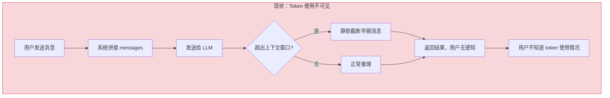
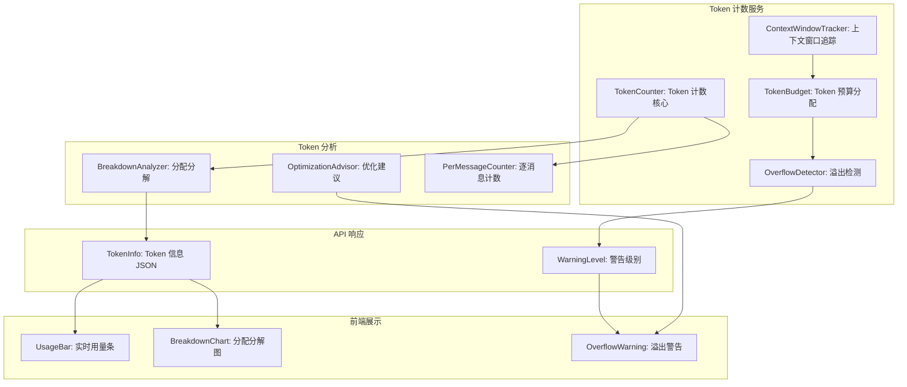
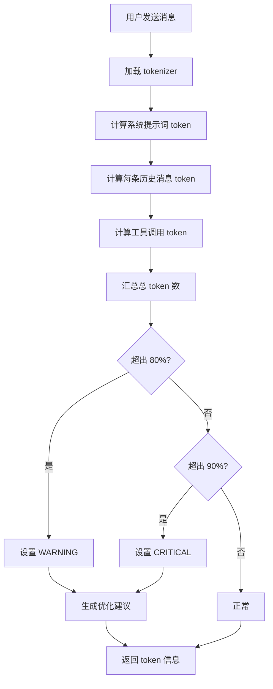

# YA-09-186: 上下文窗口可视化 — LLM 上下文窗口用量可视化、token 分配分解、实时用量条、溢出警告、优化建议、逐消息 token 计数

> 需求编号：YA-09-186 · 优先级：P2 · 人天：0.3d · 状态：需求已编写
> 依赖：YA-07-04（AI 聊天服务）

## 背景

### 问题陈述

LLM 的上下文窗口（context window）限制是所有 AI 应用的核心约束。当上下文超过模型限制时，早期的系统提示词和对话历史会被截断，导致 AI "忘记"之前的指令和上下文。当前 YiAi 对上下文窗口的使用情况完全不可见——用户和开发者都不知道当前对话占用了多少 token、哪些部分占用最多、何时接近窗口上限。

1. **上下文超出不可见**：用户不知道当前对话是否接近或超过模型上限
2. **token 分配无感知**：系统提示词、历史消息、工具调用、响应各占用多少 token 完全未知
3. **无溢出预警**：当上下文接近窗口上限时，系统静默截断，用户无感知
4. **无法优化**：用户不知道哪些消息可以删除/压缩以释放 token 空间
5. **调试困难**：开发者无法分析 token 使用模式，难以优化 prompt 和对话策略

**核心矛盾**：LLM 的上下文窗口是有限的（如 4K/8K/32K/128K），但用户和开发者对 token 使用情况完全不可见，导致截断问题和优化盲目。

### 影响范围

| # | 影响 | 严重程度 | 典型场景 |
|---|------|----------|----------|
| 1 | 上下文超出导致 AI 遗忘 | 高 | 长对话中 AI 忘记最初的指令 |
| 2 | token 分配不透明 | 高 | 无法判断系统提示词是否过长 |
| 3 | 无溢出预警 | 中 | 用户不知道对话即将达到上限 |
| 4 | 无法优化对话 | 中 | 用户不知道哪些消息可以删除 |
| 5 | 调试 token 问题困难 | 低 | 开发者需要分析 token 使用 |

### 挑战

| 挑战 | 说明 |
|------|------|
| Token 计数精度 | 不同模型的 tokenizer 不同，精确计数需要加载对应 tokenizer |
| 实时性 | 每次消息发送需要实时计算 token 分布，不能显著增加延迟 |
| 可视化设计 | 需要在有限的前端空间内清晰展示 token 分配 |
| 模型兼容性 | 不同模型的上下文窗口大小不同（4K-128K），需要动态适配 |
| 历史消息 token 估算 | 历史消息可能没有精确 token 计数，需要估算 |

---

## 一、现状分析

### 1.1 当前 token 可视化状态

```
现有 token 相关功能（无）:
├── chat_service.py
│   └── 仅传递 messages 给 LLM，不计算 token
├── 前端聊天界面
│   └── 无 token 用量显示
├── 系统提示词管理
│   └── 无 token 计数
└── 日志
    └── 无 token 使用日志

缺失:
├── token 计数服务                  # ❌ 不存在
├── 上下文窗口用量可视化           # ❌ 不存在
├── token 分配分解（系统/历史/工具/响应）  # ❌ 不存在
├── 实时用量条                     # ❌ 不存在
├── 上下文溢出警告                 # ❌ 不存在
├── token 优化建议                 # ❌ 不存在
└── 逐消息 token 计数              # ❌ 不存在
```

### 1.2 Token 使用现状



### 1.3 根因矩阵

| 症状 | 根因 | 触发条件 | 频率 |
|------|------|----------|------|
| AI 忘记早期指令 | 上下文超出，早期消息被截断 | 长对话 20+ 轮 | 高 |
| 无法判断上下文使用量 | 无 token 计数 | 每次对话 | 高 |
| 无溢出预警 | 无用量监控 | 接近窗口上限 | 中 |
| 无法优化 prompt | 无 token 分配分析 | prompt 过长 | 中 |
| 调试困难 | 无历史 token 记录 | 开发/测试 | 低 |

---

## 二、设计决策

### 决策 1：Token 计数方式 — tiktoken 精确计数 vs 字符估算 vs 模型 API 返回

| 选项 | 精度 | 速度 | 依赖 | 模型兼容性 |
|------|------|------|------|-----------|
| tiktoken（精确 tokenizer） | 高（99%+） | 快（< 5ms） | tiktoken 包 | 仅 OpenAI 兼容模型 |
| 字符估算（4 字符 ≈ 1 token） | 中（70-90%） | 极快 | 无 | 所有模型 |
| 模型 API 返回（usage 字段） | 高（100%） | 慢（需等待响应） | 无 | 依赖 API 支持 |

**选择：tiktoken 精确计数 + 模型 API 校验。** tiktoken 提供 OpenAI 兼容模型的精确 token 计数（cl100k_base 编码器），延迟 < 5ms。对于非 OpenAI 模型（如 Ollama 本地模型），使用字符估算（4 字符 ≈ 1 token）作为 fallback。模型 API 返回的 usage 字段用于事后校验和修正。

### 决策 2：可视化位置 — 后端 API 返回 vs 前端独立计算

| 选项 | 实时性 | 前端复杂度 | 一致性 |
|------|--------|-----------|--------|
| 后端 API 返回（token 信息在响应中） | 高 | 低 | 高（后端统一计算） |
| 前端独立计算（前端加载 tiktoken） | 高 | 高 | 低（可能不一致） |
| 前后端双算 | 最高 | 最高 | 最高 |

**选择：后端 API 返回 token 信息。** 后端在每次请求时计算 token 分布，将结果作为 API 响应的一部分返回。前端只需展示，无需加载 tokenizer 库。后端计算确保一致性（与 LLM 实际接收的 token 数一致）。

### 决策 3：Token 分解维度 — 简化（3 层）vs 详细（7 层）

| 选项 | 信息量 | 可操作性 | 计算成本 |
|------|--------|----------|----------|
| 简化（系统提示词 / 历史消息 / 响应） | 中 | 高 | 低 |
| 详细（角色/消息/工具/指令/内容/响应/预留） | 高 | 中 | 中 |

**选择：5 层分解。** 系统提示词（system prompt）、用户消息（user messages）、助手消息（assistant messages）、工具调用（tool calls）、响应预留（response reserve）。5 层分解提供足够的粒度用于优化，同时保持简洁。

### 决策 4：溢出策略 — 硬截断 vs 自动压缩 vs 用户选择

| 选项 | 用户体验 | 实现复杂度 | 数据安全 |
|------|----------|-----------|----------|
| 硬截断（静默删除早期消息） | 低 | 低 | 中 |
| 自动压缩（使用摘要替代早期消息） | 中 | 高 | 中 |
| 用户选择（提示用户手动清理） | 中 | 低 | 高 |

**选择：预警 + 用户选择。** 当上下文达到 80% 时显示预警，90% 时显示强烈警告。用户可选择：继续（可能截断）、压缩早期消息（自动摘要）、删除指定消息。不自动截断，避免静默丢失重要信息。

### 设计决策记录

| 决策 | 选项 A | 选项 B | 选项 C | 选择 | 理由 |
|------|--------|--------|--------|------|------|
| 计数方式 | tiktoken | 字符估算 | API 返回 | **tiktoken + API 校验** | 精确 + 事后校验 |
| 可视化位置 | 后端 | 前端 | 双算 | **后端** | 一致性，前端简单 |
| 分解维度 | 3 层 | 7 层 | 5 层 | **5 层** | 粒度适当 |
| 溢出策略 | 硬截断 | 自动压缩 | 用户选择 | **预警 + 用户选择** | 透明，用户可控 |

---

## 三、目标架构

### 3.1 Token 可视化系统架构



### 3.2 Token 用量计算流程



### 3.3 性能指标

| 指标 | 目标值 | 说明 |
|------|--------|------|
| Token 计数（100 条消息） | < 5ms | tiktoken 编码 |
| Token 分配分解 | < 1ms | 纯计算，无 I/O |
| 溢出检测 | < 0.1ms | 阈值比较 |
| 逐消息计数 | 包含在总计数中 | 无额外开销 |
| API 响应增加大小 | < 500B | token 信息 JSON |

---

## 四、具体改动

### 4.1 Token 计数服务

```python
# YiAi/src/domain/context_window/token_counter.py (新增)

import tiktoken
from typing import Optional
from dataclasses import dataclass, field


@dataclass
class TokenBreakdown:
    """Token 分配分解"""
    system_prompt: int = 0       # 系统提示词
    user_messages: int = 0        # 用户消息
    assistant_messages: int = 0   # 助手消息
    tool_calls: int = 0           # 工具调用
    response_reserve: int = 0     # 响应预留
    total: int = 0                # 总计

    @property
    def usage_ratio(self) -> float:
        """返回各部分占比"""
        if self.total == 0:
            return {}
        return {
            "system_prompt": self.system_prompt / self.total,
            "user_messages": self.user_messages / self.total,
            "assistant_messages": self.assistant_messages / self.total,
            "tool_calls": self.tool_calls / self.total,
            "response_reserve": self.response_reserve / self.total,
        }


@dataclass
class PerMessageToken:
    """单条消息的 token 计数"""
    role: str
    content: str
    tokens: int
    index: int  # 消息在对话中的序号


@dataclass
class ContextWindowInfo:
    """上下文窗口完整信息"""
    model: str
    max_tokens: int               # 模型最大上下文窗口
    used_tokens: int              # 已使用 token
    available_tokens: int         # 可用 token
    usage_percentage: float       # 使用百分比
    breakdown: TokenBreakdown     # 分配分解
    per_message: list[PerMessageToken] = field(default_factory=list)
    warning_level: str = "normal"  # normal / warning / critical
    optimization_suggestions: list[str] = field(default_factory=list)


class TokenCounter:
    """使用 tiktoken 进行精确 token 计数"""

    # 模型 -> 编码器映射
    ENCODING_MAP = {
        "gpt-4": "cl100k_base",
        "gpt-3.5-turbo": "cl100k_base",
        "gpt-4-turbo": "cl100k_base",
        "gpt-4o": "o200k_base",
    }

    # 模型 -> 最大上下文窗口
    CONTEXT_WINDOW_MAP = {
        "gpt-3.5-turbo": 4096,
        "gpt-3.5-turbo-16k": 16384,
        "gpt-4": 8192,
        "gpt-4-turbo": 128000,
        "gpt-4o": 128000,
        "gpt-4-32k": 32768,
        "llama3": 8192,
        "llama3.1": 128000,
        "qwen2.5": 32768,
        "deepseek-v3": 65536,
    }

    def __init__(self, model: str):
        self.model = model
        self._encoding = self._get_encoding(model)

    def _get_encoding(self, model: str):
        """获取模型对应的 tiktoken 编码器"""
        encoding_name = self.ENCODING_MAP.get(model, "cl100k_base")
        try:
            return tiktoken.get_encoding(encoding_name)
        except Exception:
            return tiktoken.get_encoding("cl100k_base")

    def count_tokens(self, text: str) -> int:
        """计算文本 token 数"""
        if not text:
            return 0
        try:
            return len(self._encoding.encode(text))
        except Exception:
            # fallback: 字符估算
            return len(text) // 4

    def count_messages(self, messages: list[dict]) -> int:
        """计算消息列表的总 token 数"""
        total = 0
        for msg in messages:
            content = msg.get("content", "")
            if isinstance(content, str):
                total += self.count_tokens(content)
            elif isinstance(content, list):
                for part in content:
                    if isinstance(part, dict) and "text" in part:
                        total += self.count_tokens(part["text"])
            # 每条消息的格式开销（role + 分隔符）约 4 tokens
            total += 4
        return total

    def get_max_tokens(self) -> int:
        """获取模型最大上下文窗口"""
        return self.CONTEXT_WINDOW_MAP.get(self.model, 4096)

    def analyze(
        self,
        system_prompt: str,
        messages: list[dict],
        tool_definitions: list[dict] = None,
        max_response_tokens: int = 2048,
    ) -> ContextWindowInfo:
        """分析完整的上下文窗口使用情况"""
        max_tokens = self.get_max_tokens()

        # 计算各部分 token
        system_tokens = self.count_tokens(system_prompt)
        user_msg_tokens = sum(
            self.count_tokens(m.get("content", ""))
            for m in messages if m.get("role") == "user"
        )
        assistant_msg_tokens = sum(
            self.count_tokens(m.get("content", ""))
            for m in messages if m.get("role") == "assistant"
        )
        tool_tokens = 0
        if tool_definitions:
            for tool in tool_definitions:
                tool_tokens += self.count_tokens(str(tool))

        total = system_tokens + user_msg_tokens + assistant_msg_tokens + tool_tokens + max_response_tokens
        usage_percentage = (total / max_tokens) * 100 if max_tokens > 0 else 0

        # 警告级别
        if usage_percentage >= 90:
            warning_level = "critical"
        elif usage_percentage >= 80:
            warning_level = "warning"
        else:
            warning_level = "normal"

        # 优化建议
        suggestions = self._generate_suggestions(
            usage_percentage, system_tokens, user_msg_tokens, assistant_msg_tokens
        )

        # 逐消息计数
        per_message = []
        for i, msg in enumerate(messages):
            per_message.append(PerMessageToken(
                role=msg.get("role", "unknown"),
                content=msg.get("content", ""),
                tokens=self.count_tokens(msg.get("content", "")),
                index=i,
            ))

        return ContextWindowInfo(
            model=self.model,
            max_tokens=max_tokens,
            used_tokens=total - max_response_tokens,
            available_tokens=max_tokens - total,
            usage_percentage=round(usage_percentage, 1),
            breakdown=TokenBreakdown(
                system_prompt=system_tokens,
                user_messages=user_msg_tokens,
                assistant_messages=assistant_msg_tokens,
                tool_calls=tool_tokens,
                response_reserve=max_response_tokens,
                total=total,
            ),
            per_message=per_message,
            warning_level=warning_level,
            optimization_suggestions=suggestions,
        )

    def _generate_suggestions(
        self,
        usage: float,
        system_tokens: int,
        user_tokens: int,
        assistant_tokens: int,
    ) -> list[str]:
        """生成优化建议"""
        suggestions = []

        if usage >= 80:
            suggestions.append("上下文使用率较高，建议清理不必要的历史消息")

        if system_tokens > 1000:
            suggestions.append(f"系统提示词占用 {system_tokens} tokens，建议精简")

        if user_tokens + assistant_tokens > 5000:
            suggestions.append("对话历史较长，建议使用摘要压缩早期消息")

        if usage >= 95:
            suggestions.append("上下文即将溢出，部分早期消息可能被截断")

        return suggestions
```

### 4.2 上下文窗口追踪器

```python
# YiAi/src/domain/context_window/tracker.py (新增)

from typing import Optional
from collections import deque
from .token_counter import TokenCounter, ContextWindowInfo


class ContextWindowTracker:
    """追踪会话的上下文窗口使用情况"""

    def __init__(self, model: str, max_history: int = 100):
        self.counter = TokenCounter(model)
        self.model = model
        self.history: deque[ContextWindowInfo] = deque(maxlen=max_history)

    def track(
        self,
        system_prompt: str,
        messages: list[dict],
        tool_definitions: list[dict] = None,
        max_response_tokens: int = 2048,
    ) -> ContextWindowInfo:
        """追踪当前请求的上下文窗口使用"""
        info = self.counter.analyze(
            system_prompt, messages, tool_definitions, max_response_tokens
        )
        self.history.append(info)
        return info

    def get_trend(self, last_n: int = 10) -> list[float]:
        """获取最近 N 次请求的 token 使用趋势"""
        recent = list(self.history)[-last_n:]
        return [h.usage_percentage for h in recent]

    def get_peak_usage(self) -> Optional[ContextWindowInfo]:
        """获取历史最高使用量"""
        if not self.history:
            return None
        return max(self.history, key=lambda h: h.usage_percentage)

    def estimate_remaining_messages(self, avg_message_tokens: int = 100) -> int:
        """估算还可以发送多少条消息"""
        if not self.history:
            return 999
        latest = self.history[-1]
        if latest.available_tokens <= 0:
            return 0
        return latest.available_tokens // avg_message_tokens
```

### 4.3 集成到聊天服务

```python
# YiAi/src/services/ai/chat_service.py (修改)

from src.domain.context_window.token_counter import TokenCounter
from src.domain.context_window.tracker import ContextWindowTracker

# 在 chat 方法中集成 token 追踪
class ChatService:
    def __init__(self):
        self.trackers: dict[str, ContextWindowTracker] = {}

    def get_or_create_tracker(self, session_id: str, model: str) -> ContextWindowTracker:
        if session_id not in self.trackers:
            self.trackers[session_id] = ContextWindowTracker(model)
        return self.trackers[session_id]

    async def chat(self, session_id: str, messages: list[dict], ...):
        tracker = self.get_or_create_tracker(session_id, model)

        # 分析上下文窗口
        context_info = tracker.track(
            system_prompt=system_prompt,
            messages=messages,
            max_response_tokens=max_tokens,
        )

        # 发送 token 信息作为 SSE 事件
        yield f"event: token_info\ndata: {json.dumps(context_info.__dict__)}\n\n"

        # 如果超出 90%，发送警告
        if context_info.warning_level == "critical":
            yield f"event: warning\ndata: {json.dumps({'level': 'critical', 'message': '上下文窗口即将溢出'})}\n\n"

        # ... 继续正常的 LLM 推理
```

### 4.4 文件变更清单

| 文件 | 操作 | 说明 |
|------|------|------|
| `YiAi/src/domain/context_window/__init__.py` | 新增 | 模块初始化 |
| `YiAi/src/domain/context_window/token_counter.py` | 新增 | Token 计数核心 |
| `YiAi/src/domain/context_window/tracker.py` | 新增 | 上下文窗口追踪器 |
| `YiAi/src/services/ai/chat_service.py` | 修改 | 集成 token 追踪 |
| `YiAi/src/services/ai/chat_service.py` | 修改 | SSE 响应中添加 token_info 事件 |
| `YiAi/requirements.txt` | 修改 | 添加 tiktoken 依赖 |
| `YiAi/tests/test_token_counter.py` | 新增 | Token 计数测试 |

---

## 五、实施步骤

| 步骤 | 操作 | 路径 | 验证 | 人天 |
|------|------|------|------|------|
| 1 | 添加 tiktoken 依赖 | `requirements.txt` | pip install 成功 | 0.01 |
| 2 | 实现 TokenCounter 核心 | `domain/context_window/token_counter.py` | 计数结果与 OpenAI tokenizer 一致 | 0.08 |
| 3 | 实现 ContextWindowTracker | `domain/context_window/tracker.py` | 历史追踪 + 趋势分析正确 | 0.05 |
| 4 | 实现 TokenBreakdown 分配分解 | `domain/context_window/token_counter.py` | 5 层分解计算正确 | 0.03 |
| 5 | 实现优化建议生成 | `domain/context_window/token_counter.py` | 建议合理且可操作 | 0.03 |
| 6 | 集成到 chat_service | `services/ai/chat_service.py` | SSE 中包含 token_info 事件 | 0.05 |
| 7 | 编写单元测试 | `tests/test_token_counter.py` | 覆盖计数/分解/建议/警告 | 0.05 |

**总人天：0.3d**

---

## 六、测试规格

### 场景 1：Token 计数准确性

**GIVEN** 一段已知 token 数的文本 "Hello, world!"（约 4 tokens）
**WHEN** 使用 cl100k_base 编码器计数
**THEN** 返回的 token 数应与 OpenAI 官方 tokenizer 结果一致（偏差 < 5%）
**AND** 空字符串应返回 0

### 场景 2：上下文窗口分配分解

**GIVEN** system_prompt 500 tokens、user messages 800 tokens、assistant messages 600 tokens
**WHEN** 调用 analyze() 分析上下文
**THEN** 分配分解应正确显示各部分 token 数和占比
**AND** total 应等于各部分之和 + response_reserve

### 场景 3：溢出警告级别

**GIVEN** 模型上下文窗口 4096 tokens
**WHEN** 使用率 75% 时
**THEN** warning_level 应为 "normal"
**WHEN** 使用率 85% 时
**THEN** warning_level 应为 "warning"
**WHEN** 使用率 95% 时
**THEN** warning_level 应为 "critical"

### 场景 4：逐消息 token 计数

**GIVEN** 对话包含 5 条消息
**WHEN** 分析上下文窗口
**THEN** per_message 列表应包含 5 条记录
**AND** 每条记录应包含 role、content、tokens、index
**AND** tokens 之和应与 user_messages + assistant_messages 一致

### 场景 5：优化建议生成

**GIVEN** system_prompt 占用 2000 tokens（模型窗口 4096）
**WHEN** 分析上下文窗口
**THEN** 优化建议应包含 "系统提示词占用 2000 tokens，建议精简"
**AND** 当使用率超过 80% 时，建议应包含 "建议清理不必要的历史消息"

### 场景 6：上下文追踪趋势

**GIVEN** 连续 5 次请求，token 使用率分别为 20%, 35%, 50%, 65%, 80%
**WHEN** 调用 get_trend(5)
**THEN** 应返回 [20.0, 35.0, 50.0, 65.0, 80.0]
**AND** estimate_remaining_messages 应随使用率增加而减少

---

## 七、风险与缓解

| 风险 | 概率 | 影响 | 缓解措施 |
|------|------|------|----------|
| tiktoken 对非 OpenAI 模型计数不准确 | 中 | 中 | 使用字符估算 fallback；模型 API 返回的 usage 用于校验 |
| Token 计数增加请求延迟 | 低 | 低 | tiktoken 编码 < 5ms，可忽略 |
| 不同模型 tokenizer 差异大 | 中 | 中 | 维护模型-编码器映射表，定期更新 |
| 上下文窗口大小配置错误 | 低 | 中 | 从模型 API 动态获取 max_tokens（如 Ollama 的 /api/show） |

---

## 八、回滚策略

| 场景 | 回滚操作 | 影响 |
|------|------|------|
| Token 计数导致请求延迟增加 | 关闭 token 计数，仅在前端估算 | 精度降低，功能正常 |
| tiktoken 依赖安装失败 | 降级为字符估算（4 字符 ≈ 1 token） | 精度降低 10-30% |
| SSE token_info 事件导致前端解析异常 | 移除 token_info 事件，前端不显示 token 信息 | 失去 token 可视化 |

---

## 九、设计决策记录

### D-01：为什么使用 tiktoken 而非 transformers？

tiktoken 是 OpenAI 官方 tokenizer，体积小（~1MB），速度快（< 5ms 编码），专门针对 OpenAI 兼容模型。transformers 库体积大（~500MB+），加载慢，过度设计。对于非 OpenAI 模型，字符估算（4 字符 ≈ 1 token）作为简单 fallback 足够。

### D-02：为什么 5 层分解而非 3 层或 7 层？

3 层（系统/历史/响应）过于粗糙，无法区分用户和助手的 token 占比。7 层（角色/消息/工具/指令/内容/响应/预留）过于细致，大多数用户不需要这个粒度。5 层（系统/用户/助手/工具/响应）在信息量和可操作性之间取得平衡。

### D-03：为什么 80% 和 90% 作为警告阈值？

80% 是"注意"级别，提醒用户上下文使用较多，但仍有足够空间。90% 是"警告"级别，表示上下文即将满，需要立即行动。这两个阈值基于经验：80% 时用户有 20% 的缓冲空间继续对话，90% 时缓冲空间仅 10%，需要谨慎。

### D-04：为什么 token 信息通过 SSE 事件而非 HTTP 响应头发送？

SSE 事件可以在流开始前发送 token 信息，前端可以立即显示用量条。HTTP 响应头在流开始前发送，但解析复杂且不支持 JSON 结构。SSE 事件类型 `token_info` 是标准做法，前端可以通过 EventSource 的 `addEventListener` 监听。

---

## 十、可观测性

### 指标

| 指标 | 类型 | 说明 |
|------|------|------|
| `yiai.context_window.avg_usage_percentage` | Gauge | 平均上下文使用率 |
| `yiai.context_window.warning_count` | Counter | 警告触发次数（按级别分组） |
| `yiai.context_window.overflow_count` | Counter | 实际溢出次数 |
| `yiai.context_window.avg_system_prompt_tokens` | Gauge | 平均系统提示词 token 数 |
| `yiai.context_window.avg_messages_tokens` | Gauge | 平均消息 token 数 |
| `yiai.context_window.token_count_latency_ms` | Histogram | Token 计数延迟 |

### 告警

| 告警 | 条件 | 级别 |
|------|------|------|
| 上下文使用率过高 | 50% 的会话 > 80% 使用率 | WARNING |
| 溢出频繁 | 溢出次数 > 10/min | WARNING |
| Token 计数延迟高 | P95 > 50ms | INFO |

---

## 十一、代码审查检查清单

- [ ] tiktoken 编码器正确加载，非 OpenAI 模型有 fallback
- [ ] TokenBreakdown 各部分之和等于 total
- [ ] 警告级别阈值正确：80% -> warning, 90% -> critical
- [ ] 优化建议在合理条件下触发，内容可操作
- [ ] 逐消息计数与总计数一致
- [ ] ContextWindowTracker 的 history 限制 maxlen
- [ ] SSE token_info 事件格式正确，前端可解析
- [ ] 模型上下文窗口大小从映射表获取，有默认值 4096
- [ ] 字符估算 fallback 使用 4 字符 ≈ 1 token

---

## 回归问题预测

| # | 预测问题 | 原因 | 验证方法 |
|---|---------|------|---------|
| 1 | tiktoken 的 `o200k_base` 编码器在 gpt-4o 模型上不可用（需要 tiktoken >= 0.7.0），计数时抛出 KeyError，fallback 到 cl100k_base 但计数结果偏差 5-10% | tiktoken 的 `o200k_base` 编码器在 v0.7.0 引入，旧版本不支持。`get_encoding("o200k_base")` 抛出异常，fallback 使用 cl100k_base，但 gpt-4o 的实际 tokenizer 与 cl100k_base 不同 | 检查 tiktoken 版本，动态检测可用编码器，记录使用 fallback 编码器的次数 |
| 2 | 工具调用定义（tool_definitions）的 token 计数使用了 `str(tool)`，但 Python dict 的 `str()` 表示包含单引号，与 JSON 格式不同，导致 token 计数偏差 | `str({"name": "search", "description": "..."})` 生成 `{'name': 'search', ...}`（单引号），而 LLM 实际接收的是 JSON 格式 `{"name": "search", ...}`（双引号），token 计数不同 | 使用 `json.dumps(tool)` 替代 `str(tool)`，确保格式与 LLM 实际接收的一致 |
| 3 | 上下文窗口追踪器使用 session_id 作为 key，但 session_id 可能在不同请求中变化（如用户重新开始会话），导致 tracker 丢失历史数据 | 聊天服务在会话切换时可能创建新的 session_id，旧 tracker 的 history 被丢弃，趋势分析中断 | 使用持久化的 session_id（从 MongoDB sessions 集合获取），确保 tracker 在会话生命周期内保持一致 |
| 4 | 逐消息 token 计数在消息包含图片/文件等非文本内容时，`msg.get("content", "")` 返回的是列表而非字符串，`self.count_tokens()` 对列表计数返回错误结果 | 多模态消息的 content 是列表格式 `[{"type": "text", "text": "..."}, {"type": "image_url", "image_url": "..."}]`，`count_tokens` 的 `isinstance(content, str)` 检查失败 | 在 `count_tokens` 中正确处理多模态消息：仅对 text 类型的内容进行 token 计数，图片按固定 token 数估算（如 85 tokens） |
| 5 | 优化建议 `_generate_suggestions` 的阈值（1000/5000 tokens）是硬编码的，对于 128K 上下文窗口的模型（如 gpt-4-turbo），这些建议过于保守，用户在 30% 使用时就看到建议 | 阈值未根据模型上下文窗口大小动态调整，128K 模型中 5000 tokens 仅占 4%，但建议仍提示"对话历史较长" | 将阈值改为百分比：`if system_tokens / max_tokens > 0.1` 等，基于模型上下文窗口动态计算 |
| 6 | SSE `token_info` 事件在流式响应开始前发送，但如果前端在收到 `token_info` 后立即更新 UI，后续的流式响应尚未开始，UI 显示"已完成"但实际仍在生成 | 前端可能在收到 `token_info` 事件后误认为响应已完成，因为 `token_info` 是 SSE 流中的第一个事件，后续还有 `message` 事件 | 在 `token_info` 事件中添加 `status: "streaming"` 字段，前端据此判断响应仍在进行中 |

---

## 性能分析

### 各阶段耗时

| 阶段 | 预估耗时 | 说明 |
|------|----------|------|
| tiktoken 编码器加载 | < 10ms | 首次加载，后续缓存 |
| 单条消息 token 计数 | < 0.5ms | tiktoken.encode |
| 100 条消息总计数 | < 5ms | 批量编码 |
| 分配分解计算 | < 0.5ms | 纯计算 |
| 优化建议生成 | < 0.5ms | 简单规则匹配 |
| SSE 事件序列化 | < 1ms | json.dumps |

### 内存占用

| 组件 | 内存 | 说明 |
|------|------|------|
| tiktoken 编码器 | ~1MB | 编码器数据 |
| ContextWindowTracker | ~1KB/会话 | 历史记录 |
| TokenBreakdown | ~200B/请求 | 单次分析结果 |

### Token 计数精度

| 模型 | 编码器 | 精度 | 说明 |
|------|--------|------|------|
| GPT-4/3.5 | cl100k_base | 99%+ | 精确匹配 |
| GPT-4o | o200k_base | 99%+ | 精确匹配 |
| Ollama 模型 | 字符估算 | 70-90% | 4 字符 ≈ 1 token |
| 其他模型 | 字符估算 | 70-90% | 通用 fallback |

## 影响范围

- **影响模块**：待补充
- **涉及文件**：
- 待补充
- **是否影响 API 契约**：否
- **是否影响其他项目（YiVad/YiPet）**：否
- **用户感知**：待确认

## 预防措施

| 层面 | 措施 |
|------|------|
| 代码 | 在相关函数中添加参数校验和边界检查 |
| 测试 | 添加对应的自动化测试用例 |
| 流程 | 代码审查时重点检查此类模式 |
| 监控 | 添加日志告警，异常发生时及时发现 |
| 文档 | 在编码规范中记录此类反模式 |

## 经验教训

1. **根本原因**：开发过程中对边界情况和异常路径的考虑不足是此类问题的共同根因
2. **设计阶段**：在接口设计和模块实现时，应主动考虑异常输入、空值、超时等边界场景
3. **代码审查**：审查时应检查是否存在类似的反模式（如未捕获异常、无超时控制、缺少参数校验等）
4. **测试覆盖**：异常路径的测试覆盖率应与正常路径同等重视
5. **团队分享**：此类问题应在团队周会或技术分享中讨论，形成团队共识
