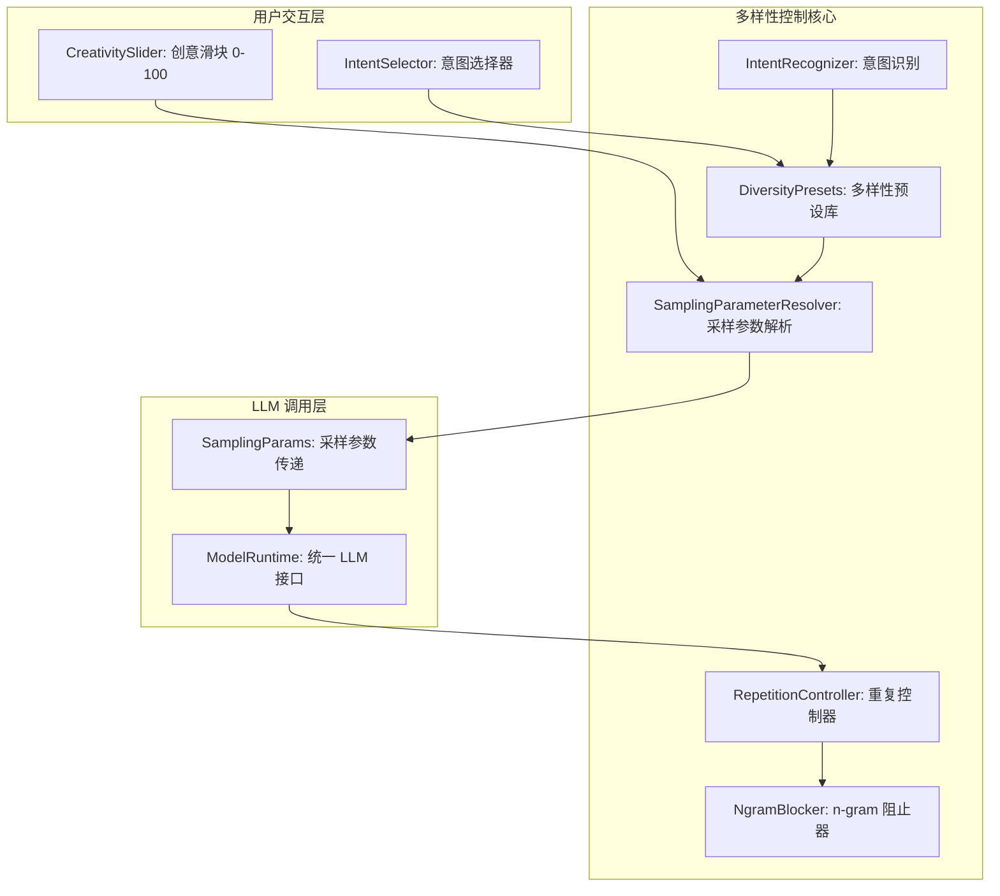
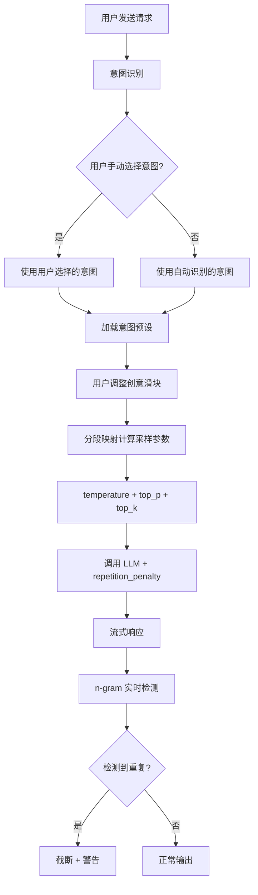

# YA-09-187: 响应多样性控制 — LLM 响应多样性控制、重复惩罚调优、n-gram 阻止、多样性采样、创意滑块、按意图预设

> 需求编号：YA-09-187 · 优先级：P2 · 人天：0.3d · 状态：需求已编写
> 依赖：YA-07-04（AI 聊天服务）、YA-08-14（ModelRuntime 抽象层）

## 背景

### 问题陈述

LLM 的响应质量高度依赖于采样参数（temperature、top_p、top_k、repetition_penalty 等）。当前 YiAi 使用固定的默认参数（temperature=0.7），所有场景使用相同的采样策略。这导致以下问题：

1. **创意场景多样性不足**：文学创作、头脑风暴等场景需要高多样性，但固定参数限制了创意
2. **事实场景幻觉风险**：代码生成、事实查询等场景需要低多样性（确定性），但固定参数增加了幻觉风险
3. **重复内容问题**：LLM 在长文本生成中经常重复相同短语或陷入循环，无重复惩罚机制
4. **用户无法控制创意程度**：用户无法在"严格精确"和"天马行空"之间调节
5. **不同意图无适配**：翻译、代码、写作、分析等不同意图需要不同的采样策略，当前无区分

**核心矛盾**：LLM 的采样参数是控制响应质量的关键杠杆，但当前系统将其视为固定配置，缺乏场景化的多样性控制。用户需要简单的"创意滑块"来控制响应风格，而非理解晦涩的 temperature/top_p 参数。

### 影响范围

| # | 影响 | 严重程度 | 典型场景 |
|---|------|----------|----------|
| 1 | 创意场景多样性不足 | 高 | 文学创作时 AI 回答千篇一律 |
| 2 | 事实场景幻觉风险 | 高 | 代码生成时 AI 产生不存在的 API |
| 3 | 重复内容循环 | 中 | 长文本生成中 AI 不断重复相同段落 |
| 4 | 用户无法控制创意 | 中 | 用户想要更有创意的回答但不知道如何调整 |
| 5 | 不同意图无适配 | 中 | 翻译和代码生成使用相同的采样参数 |

### 挑战

| 挑战 | 说明 |
|------|------|
| 参数抽象 | 将 temperature/top_p/top_k/repetition_penalty 等参数抽象为简单的"创意滑块" |
| 意图识别 | 自动识别用户意图（创作/事实/代码/分析）并应用对应预设 |
| 重复惩罚 | 不同 LLM 后端对 repetition_penalty 的支持不同，需统一接口 |
| n-gram 阻止 | 部分 LLM 不支持 n-gram 阻止，需在应用层实现后处理 |
| 参数组合 | temperature 和 top_p 的交互复杂，需要合理的默认组合 |

---

## 一、现状分析

### 1.1 当前采样参数状态

```
现有采样参数配置（固定默认值）:
├── chat_service.py
│   └── temperature=0.7（硬编码）
│   └── 无 top_p、top_k、repetition_penalty
├── ModelRuntime 抽象层
│   └── 无采样参数统一接口
├── 前端聊天界面
│   └── 无创意控制 UI
└── 意图识别
    └── 无意图识别和预设

缺失:
├── 创意滑块（0-100）              # ❌ 不存在
├── 重复惩罚机制                   # ❌ 不存在
├── n-gram 阻止                    # ❌ 不存在
├── 多样性采样（nucleus/top-k）    # ❌ 不存在
├── 按意图预设                     # ❌ 不存在
└── 参数组合优化                   # ❌ 不存在
```

### 1.2 响应多样性控制（现状 vs 目标）

```mermaid
graph TD
    subgraph Current["现状：固定参数"]
        C1[用户请求] --> C2[固定 temperature=0.7]
        C2 --> C3[LLM 推理]
        C3 --> C4[所有场景相同策略]
        C4 --> C5[创意不足 / 事实幻觉 / 重复循环]
    end

    subgraph Target["目标：多样性控制"]
        T1[用户请求] --> T2[意图识别]
        T2 --> T3[加载意图预设]
        T3 --> T4[用户创意滑块调整]
        T4 --> T5[计算采样参数]
        T5 --> T6[LLM 推理 + 重复惩罚]
        T6 --> T7[n-gram 后处理]
        T7 --> T8[多样性响应]
    end

    style Current fill:#f8d7da,stroke:#dc3545
    style Target fill:#d4edda,stroke:#28a745
```



### 1.3 根因矩阵

| 症状 | 根因 | 触发条件 | 频率 |
|------|------|----------|------|
| 创意不足 | temperature 固定过低 | 创作场景 | 高 |
| 事实幻觉 | temperature 固定过高 | 事实/代码场景 | 高 |
| 重复循环 | 无 repetition_penalty | 长文本生成 | 中 |
| 无法控制创意 | 无用户可调参数 | 用户需要不同风格 | 中 |
| 无场景适配 | 无意图识别 | 不同任务类型 | 中 |

---

## 二、设计决策

### 决策 1：创意滑块映射 — 线性映射 vs 分段映射 vs 预设切换

| 选项 | 用户体验 | 参数精度 | 实现复杂度 |
|------|----------|----------|-----------|
| 线性映射（0-100 -> temperature 0-2） | 简单 | 中 | 低 |
| 分段映射（不同区间映射不同参数组合） | 好 | 高 | 中 |
| 预设切换（几个固定档位） | 简单 | 低 | 低 |

**选择：分段映射。** 将 0-100 的创意滑块分为 5 个区间，每个区间映射不同的 temperature + top_p + top_k 组合。例如 0-20（精确模式）使用 temperature=0.1, top_p=0.1；80-100（创意模式）使用 temperature=1.5, top_p=0.95。分段映射比线性映射更合理，因为 temperature 的效果是非线性的。

### 决策 2：重复惩罚 — 模型原生 vs 应用层实现

| 选项 | 效果 | 兼容性 | 延迟 |
|------|------|--------|------|
| 模型原生（repetition_penalty 参数） | 好 | 低（仅部分模型支持） | 低 |
| 应用层实现（后处理去重） | 中 | 高（所有模型） | 中 |
| 混合（优先原生，fallback 应用层） | 好 | 高 | 中 |

**选择：混合方案。** 优先使用模型原生的 repetition_penalty 参数（Ollama、OpenAI 均支持）。对于不支持的模型，在应用层实现 n-gram 阻止：检测重复的 n-gram（n=3-5），在生成过程中阻止已出现的 n-gram 序列。

### 决策 3：意图预设 — 手动选择 vs 自动识别 vs 混合

| 选项 | 准确性 | 用户体验 | 实现复杂度 |
|------|--------|----------|-----------|
| 手动选择（用户选择意图） | 100% | 中（多一步操作） | 低 |
| 自动识别（基于用户消息识别意图） | 70-90% | 高（无额外操作） | 中 |
| 混合（自动识别 + 用户可覆盖） | 高 | 高 | 中 |

**选择：混合方案。** 默认自动识别用户意图（基于关键词和模式匹配），自动应用对应预设。用户可以在 UI 中手动覆盖意图选择。自动识别覆盖 80% 场景，手动覆盖处理剩余 20%。

### 决策 4：n-gram 阻止 — 生成时阻止 vs 后处理过滤

| 选项 | 实时性 | 效果 | 实现复杂度 |
|------|--------|------|-----------|
| 生成时阻止（修改 logits） | 高（从源头阻止） | 好 | 高（需修改推理逻辑） |
| 后处理过滤（检测并替换） | 中 | 中（可能已生成部分重复） | 低 |

**选择：后处理过滤（流式检测）。** 在流式响应中实时检测重复的 n-gram 序列。当检测到 3-gram 以上重复时，截断流并发送警告。生成时阻止需要修改 LLM 推理逻辑（修改 logits），对自托管模型可行但不适用于 API 调用。后处理对所有模型通用。

### 设计决策记录

| 决策 | 选项 A | 选项 B | 选项 C | 选择 | 理由 |
|------|--------|--------|--------|------|------|
| 创意滑块 | 线性映射 | 分段映射 | 预设切换 | **分段映射** | 非线性效果，分段更合理 |
| 重复惩罚 | 原生 | 应用层 | 混合 | **混合** | 原生优先 + 通用 fallback |
| 意图预设 | 手动 | 自动 | 混合 | **混合** | 自动识别 + 手动覆盖 |
| n-gram 阻止 | 生成时阻止 | 后处理 | — | **后处理** | 通用，无需修改推理 |

---

## 三、目标架构

### 3.1 多样性控制系统架构



### 3.2 多样性控制流程



### 3.3 性能指标

| 指标 | 目标值 | 说明 |
|------|--------|------|
| 意图识别 | < 5ms | 关键词匹配 |
| 采样参数计算 | < 1ms | 分段映射查表 |
| n-gram 检测 | < 1ms/chunk | 滑动窗口检测 |
| 重复惩罚应用 | < 5ms | 原生参数传递 |
| 创意滑块 UI 响应 | < 16ms | 60fps 拖动 |

---

## 四、具体改动

### 4.1 多样性预设库

```python
# YiAi/src/domain/diversity/presets.py (新增)

from dataclasses import dataclass
from enum import Enum


class IntentType(str, Enum):
    CREATIVE = "creative"        # 创意写作
    FACTUAL = "factual"          # 事实查询
    CODE = "code"                # 代码生成
    ANALYSIS = "analysis"        # 分析推理
    TRANSLATION = "translation"  # 翻译
    CHAT = "chat"                # 闲聊
    CUSTOM = "custom"            # 自定义


@dataclass
class SamplingParams:
    temperature: float
    top_p: float
    top_k: int
    repetition_penalty: float
    frequency_penalty: float = 0.0
    presence_penalty: float = 0.0
    min_p: float = 0.0

    def to_dict(self) -> dict:
        return {
            "temperature": self.temperature,
            "top_p": self.top_p,
            "top_k": self.top_k,
            "repeat_penalty": self.repetition_penalty,
            "frequency_penalty": self.frequency_penalty,
            "presence_penalty": self.presence_penalty,
        }


@dataclass
class DiversityPreset:
    intent: IntentType
    name: str
    description: str
    # 创意滑块 0 和 100 对应的参数
    precise_params: SamplingParams    # 滑块 0（精确）
    creative_params: SamplingParams   # 滑块 100（创意）
    # 默认滑块位置
    default_slider: int = 50


# 预设库
DIVERSITY_PRESETS: dict[IntentType, DiversityPreset] = {
    IntentType.CREATIVE: DiversityPreset(
        intent=IntentType.CREATIVE,
        name="创意写作",
        description="文学创作、头脑风暴、故事续写",
        precise_params=SamplingParams(
            temperature=0.8, top_p=0.9, top_k=50, repetition_penalty=1.1,
        ),
        creative_params=SamplingParams(
            temperature=1.5, top_p=0.98, top_k=100, repetition_penalty=1.05,
        ),
        default_slider=70,
    ),
    IntentType.FACTUAL: DiversityPreset(
        intent=IntentType.FACTUAL,
        name="事实查询",
        description="知识问答、事实核查、数据查询",
        precise_params=SamplingParams(
            temperature=0.1, top_p=0.1, top_k=1, repetition_penalty=1.0,
        ),
        creative_params=SamplingParams(
            temperature=0.4, top_p=0.5, top_k=10, repetition_penalty=1.0,
        ),
        default_slider=20,
    ),
    IntentType.CODE: DiversityPreset(
        intent=IntentType.CODE,
        name="代码生成",
        description="编写代码、调试、代码审查",
        precise_params=SamplingParams(
            temperature=0.0, top_p=0.1, top_k=1, repetition_penalty=1.0,
        ),
        creative_params=SamplingParams(
            temperature=0.3, top_p=0.3, top_k=5, repetition_penalty=1.0,
        ),
        default_slider=10,
    ),
    IntentType.ANALYSIS: DiversityPreset(
        intent=IntentType.ANALYSIS,
        name="分析推理",
        description="数据分析、逻辑推理、问题诊断",
        precise_params=SamplingParams(
            temperature=0.2, top_p=0.3, top_k=5, repetition_penalty=1.0,
        ),
        creative_params=SamplingParams(
            temperature=0.6, top_p=0.7, top_k=20, repetition_penalty=1.05,
        ),
        default_slider=30,
    ),
    IntentType.TRANSLATION: DiversityPreset(
        intent=IntentType.TRANSLATION,
        name="翻译",
        description="多语言翻译、本地化",
        precise_params=SamplingParams(
            temperature=0.1, top_p=0.2, top_k=3, repetition_penalty=1.0,
        ),
        creative_params=SamplingParams(
            temperature=0.5, top_p=0.6, top_k=15, repetition_penalty=1.0,
        ),
        default_slider=20,
    ),
    IntentType.CHAT: DiversityPreset(
        intent=IntentType.CHAT,
        name="闲聊",
        description="日常对话、闲聊、情感交流",
        precise_params=SamplingParams(
            temperature=0.5, top_p=0.8, top_k=30, repetition_penalty=1.1,
        ),
        creative_params=SamplingParams(
            temperature=1.2, top_p=0.95, top_k=80, repetition_penalty=1.05,
        ),
        default_slider=60,
    ),
}
```

### 4.2 采样参数解析器

```python
# YiAi/src/domain/diversity/sampling_resolver.py (新增)

from .presets import (
    IntentType, DiversityPreset, SamplingParams, DIVERSITY_PRESETS
)


class SamplingParameterResolver:
    """根据意图和创意滑块计算采样参数"""

    def resolve(
        self,
        intent: IntentType,
        creativity_slider: int = 50,
    ) -> SamplingParams:
        """
        根据意图和创意滑块（0-100）计算采样参数。

        创意滑块区间:
        0-20: 精确模式（接近 precise_params）
        21-40: 保守模式
        41-60: 平衡模式
        61-80: 开放模式
        81-100: 创意模式（接近 creative_params）
        """
        preset = DIVERSITY_PRESETS.get(intent, DIVERSITY_PRESETS[IntentType.CHAT])
        creativity = max(0, min(100, creativity_slider))

        # 分段映射权重
        # 0 -> 0%, 100 -> 100%
        weight = self._sigmoid_weight(creativity / 100)

        precise = preset.precise_params
        creative = preset.creative_params

        return SamplingParams(
            temperature=self._interpolate(precise.temperature, creative.temperature, weight),
            top_p=self._interpolate(precise.top_p, creative.top_p, weight),
            top_k=int(self._interpolate(precise.top_k, creative.top_k, weight)),
            repetition_penalty=self._interpolate(
                precise.repetition_penalty, creative.repetition_penalty, weight
            ),
            frequency_penalty=self._interpolate(
                precise.frequency_penalty, creative.frequency_penalty, weight
            ),
            presence_penalty=self._interpolate(
                precise.presence_penalty, creative.presence_penalty, weight
            ),
        )

    def _sigmoid_weight(self, x: float) -> float:
        """Sigmoid 映射：中间区间变化快，两端变化慢"""
        # 将 x 映射到 sigmoid 的 -6 到 6 区间
        z = (x - 0.5) * 12
        import math
        return 1 / (1 + math.exp(-z))

    def _interpolate(self, a: float, b: float, weight: float) -> float:
        """线性插值"""
        return a + (b - a) * weight

    def get_preset(self, intent: IntentType) -> DiversityPreset:
        return DIVERSITY_PRESETS.get(intent, DIVERSITY_PRESETS[IntentType.CHAT])
```

### 4.3 意图识别器

```python
# YiAi/src/domain/diversity/intent_recognizer.py (新增)

import re
from .presets import IntentType


class IntentRecognizer:
    """基于关键词和模式匹配的意图识别"""

    # 意图关键词模式
    PATTERNS: dict[IntentType, list[str]] = {
        IntentType.CREATIVE: [
            r"写(?:一[篇个]|故事|诗|小说|剧本|文案)",
            r"创作|创意|想象|虚构|编造",
            r"以.*风格|模仿.*写作",
            r"头脑风暴|brainstorm",
            r"续写|改写|润色.*文",
        ],
        IntentType.FACTUAL: [
            r"什么是|是谁|何时|在哪里|为什么",
            r"定义|解释.*概念|百科",
            r"事实|真相|数据|统计",
            r"列举|有哪些|列出",
            r"wiki|百科|知识",
        ],
        IntentType.CODE: [
            r"代码|编程|写.*函数|写.*类",
            r"bug|错误|报错|调试|debug",
            r"python|javascript|java|golang|rust|typescript",
            r"算法|api|接口|sdk|npm|pip",
            r"优化.*性能|重构|review",
            r"```|import |from |def |class |const |let |var |function",
        ],
        IntentType.ANALYSIS: [
            r"分析|推理|诊断|评估",
            r"比较|对比|优缺点",
            r"总结|归纳|概括",
            r"原因|影响|后果",
            r"策略|方案|建议|措施",
        ],
        IntentType.TRANSLATION: [
            r"翻译|translate|译成",
            r"用.*说|用.*写",
            r"中译|英译|日译",
            r"localization|本地化",
        ],
    }

    def recognize(self, messages: list[dict]) -> IntentType:
        """识别用户意图"""
        # 取最后一条用户消息
        user_messages = [m for m in messages if m.get("role") == "user"]
        if not user_messages:
            return IntentType.CHAT

        last_message = user_messages[-1].get("content", "").lower()
        if not isinstance(last_message, str):
            last_message = ""

        scores: dict[IntentType, int] = {}

        for intent, patterns in self.PATTERNS.items():
            score = 0
            for pattern in patterns:
                if re.search(pattern, last_message):
                    score += 1
            scores[intent] = score

        # 返回最高分意图
        if scores:
            best = max(scores, key=scores.get)
            if scores[best] > 0:
                return best

        return IntentType.CHAT

    def recognize_with_confidence(self, messages: list[dict]) -> dict[IntentType, float]:
        """识别意图并返回各意图的置信度"""
        user_messages = [m for m in messages if m.get("role") == "user"]
        if not user_messages:
            return {IntentType.CHAT: 1.0}

        last_message = user_messages[-1].get("content", "").lower()
        if not isinstance(last_message, str):
            last_message = ""

        scores: dict[IntentType, int] = {}
        for intent, patterns in self.PATTERNS.items():
            score = sum(1 for p in patterns if re.search(p, last_message))
            scores[intent] = score

        total = sum(scores.values()) or 1
        return {
            intent: score / total
            for intent, score in scores.items()
        }
```

### 4.4 n-gram 阻止器

```python
# YiAi/src/domain/diversity/ngram_blocker.py (新增)

from collections import deque
from typing import Generator


class NgramBlocker:
    """流式 n-gram 重复检测与阻止"""

    def __init__(self, n: int = 3, max_repeat: int = 3):
        self.n = n                    # n-gram 大小
        self.max_repeat = max_repeat  # 允许的最大重复次数
        self._buffer: deque[str] = deque(maxlen=n * 10)
        self._ngram_counts: dict[str, int] = {}
        self._total_chunks = 0
        self._blocked_chunks = 0

    def process_stream(
        self, chunks: Generator[str, None, None]
    ) -> Generator[str, None, None]:
        """处理流式响应，检测并阻止重复 n-gram"""
        for chunk in chunks:
            self._total_chunks += 1

            # 添加到缓冲区
            chars = list(chunk)
            for char in chars:
                self._buffer.append(char)

            # 检测 n-gram 重复
            if self._detect_repetition():
                self._blocked_chunks += 1
                # 发送截断信号
                yield "\n\n[检测到重复内容，已截断]"
                return

            yield chunk

    def _detect_repetition(self) -> bool:
        """检测最近的内容是否包含重复的 n-gram"""
        if len(self._buffer) < self.n * 2:
            return False

        # 提取最近的 n-gram
        buffer_str = "".join(self._buffer)
        recent_ngram = buffer_str[-self.n:]

        # 检查在之前的内容中出现的次数
        count = 0
        for i in range(len(buffer_str) - self.n * 2):
            if buffer_str[i:i + self.n] == recent_ngram:
                count += 1

        return count >= self.max_repeat

    def get_stats(self) -> dict:
        return {
            "total_chunks": self._total_chunks,
            "blocked_chunks": self._blocked_chunks,
            "blocked_ratio": self._blocked_chunks / max(1, self._total_chunks),
        }
```

### 4.5 集成到聊天服务

```python
# YiAi/src/services/ai/chat_service.py (修改)

from src.domain.diversity.intent_recognizer import IntentRecognizer
from src.domain.diversity.sampling_resolver import SamplingParameterResolver
from src.domain.diversity.ngram_blocker import NgramBlocker
from src.domain.diversity.presets import IntentType

class ChatService:
    def __init__(self):
        self.intent_recognizer = IntentRecognizer()
        self.sampling_resolver = SamplingParameterResolver()

    async def chat(
        self,
        messages: list[dict],
        intent: str = None,
        creativity_slider: int = 50,
        enable_ngram_block: bool = True,
        **kwargs,
    ):
        # 1. 识别意图
        if intent:
            intent_type = IntentType(intent)
        else:
            intent_type = self.intent_recognizer.recognize(messages)

        # 2. 计算采样参数
        sampling_params = self.sampling_resolver.resolve(
            intent_type, creativity_slider
        )

        # 3. 调用 LLM（带采样参数）
        llm_params = {
            **kwargs,
            **sampling_params.to_dict(),
        }

        # 4. 流式响应 + n-gram 阻止
        if enable_ngram_block and creativity_slider < 60:
            # 仅在精确/保守模式下启用 n-gram 阻止
            # 创意模式下允许重复
            blocker = NgramBlocker(n=3, max_repeat=3)
            raw_stream = self._call_llm_stream(messages, llm_params)

            # 发送意图信息
            yield f"event: diversity_info\ndata: {json.dumps({'intent': intent_type.value, 'creativity': creativity_slider})}\n\n"

            for chunk in blocker.process_stream(raw_stream):
                yield chunk
        else:
            raw_stream = self._call_llm_stream(messages, llm_params)
            for chunk in raw_stream:
                yield chunk
```

### 4.6 文件变更清单

| 文件 | 操作 | 说明 |
|------|------|------|
| `YiAi/src/domain/diversity/__init__.py` | 新增 | 模块初始化 |
| `YiAi/src/domain/diversity/presets.py` | 新增 | 多样性预设库 |
| `YiAi/src/domain/diversity/sampling_resolver.py` | 新增 | 采样参数解析器 |
| `YiAi/src/domain/diversity/intent_recognizer.py` | 新增 | 意图识别器 |
| `YiAi/src/domain/diversity/ngram_blocker.py` | 新增 | n-gram 阻止器 |
| `YiAi/src/services/ai/chat_service.py` | 修改 | 集成多样性控制 |
| `YiAi/tests/test_diversity.py` | 新增 | 多样性控制测试 |

---

## 五、实施步骤

| 步骤 | 操作 | 路径 | 验证 | 人天 |
|------|------|------|------|------|
| 1 | 定义 6 种意图预设 | `domain/diversity/presets.py` | 每种意图有合理的参数范围 | 0.04 |
| 2 | 实现分段映射解析器 | `domain/diversity/sampling_resolver.py` | 滑块 0/50/100 映射正确 | 0.04 |
| 3 | 实现意图识别器 | `domain/diversity/intent_recognizer.py` | 6 种意图识别准确率 > 70% | 0.05 |
| 4 | 实现 n-gram 阻止器 | `domain/diversity/ngram_blocker.py` | 重复检测 + 截断正确 | 0.04 |
| 5 | 集成到 chat_service | `services/ai/chat_service.py` | 意图识别 + 参数传递 + 阻止 | 0.05 |
| 6 | 添加 SSE 事件 | `services/ai/chat_service.py` | diversity_info 事件正确 | 0.03 |
| 7 | 编写单元测试 | `tests/test_diversity.py` | 覆盖预设/解析/识别/阻止 | 0.05 |

**总人天：0.3d**

---

## 六、测试规格

### 场景 1：创意滑块映射

**GIVEN** 意图为 "创意写作"，创意滑块 0
**WHEN** 计算采样参数
**THEN** temperature 应接近 precise_params（0.8）
**AND** 创意滑块 100 时 temperature 应接近 creative_params（1.5）
**AND** 创意滑块 50 时 temperature 应在两者之间

### 场景 2：意图自动识别

**GIVEN** 用户消息 "帮我写一个 Python 函数来排序列表"
**WHEN** 意图识别器分析
**THEN** 应识别为 CODE 意图
**AND** 自动应用代码生成的预设参数

### 场景 3：重复内容检测

**GIVEN** LLM 流式输出 "hello world hello world hello world hello world"
**WHEN** n-gram 阻止器检测（3-gram, max_repeat=3）
**THEN** 应在第 4 次 "hello world" 时触发截断
**AND** 流式输出应包含 "[检测到重复内容，已截断]"

### 场景 4：创意模式不阻止重复

**GIVEN** 创意滑块 80，n-gram 阻止已启用
**WHEN** LLM 输出重复内容（如诗歌中的反复）
**THEN** 不应触发 n-gram 阻止
**AND** 重复内容正常输出

### 场景 5：意图手动覆盖

**GIVEN** 用户明确选择意图为 "翻译"
**WHEN** 用户消息为 "hello world"
**THEN** 应使用翻译意图的预设参数
**AND** 即使自动识别为 CHAT，也应使用手动选择的意图

### 场景 6：Sigmoid 权重映射

**GIVEN** 创意滑块 0, 25, 50, 75, 100
**WHEN** 使用 sigmoid 映射计算权重
**THEN** 滑块 0 的权重应接近 0
**AND** 滑块 100 的权重应接近 1
**AND** 滑块 50 的权重应为 0.5
**AND** 中间区间（25-75）的权重变化速度应大于两端

---

## 七、风险与缓解

| 风险 | 概率 | 影响 | 缓解措施 |
|------|------|------|----------|
| 意图识别错误导致不合适的采样参数 | 中 | 中 | 提供手动覆盖选项；显示当前识别意图 |
| n-gram 阻止误判（正常内容被截断） | 中 | 中 | 仅在精确/保守模式下启用；设置合理的 max_repeat |
| 某些 LLM 后端不支持 repetition_penalty | 中 | 低 | 应用层 n-gram 阻止作为通用 fallback |
| 创意滑块映射过于激进/保守 | 低 | 低 | 预设参数可配置，支持用户自定义 |

---

## 八、回滚策略

| 场景 | 回滚操作 | 影响 |
|------|------|------|
| 意图识别导致用户体验差 | 关闭自动识别，恢复默认 CHAT 意图 | 失去自动适配，用户需手动选择 |
| n-gram 阻止误判频繁 | 关闭 n-gram 阻止，仅保留 repetition_penalty | 可能继续出现重复 |
| 采样参数导致 LLM 输出异常 | 回退到固定 temperature=0.7 | 失去多样性控制 |
| 性能下降 | 关闭意图识别和 n-gram 阻止 | 功能正常，失去高级特性 |

---

## 九、设计决策记录

### D-01：为什么使用 Sigmoid 映射而非线性映射？

线性映射（如 temperature = 0.0 + 2.0 * slider/100）在滑块两端和中间的感知变化相同，但用户期望滑块在中间区域有更精细的控制。Sigmoid 映射在中间区域（25-75）变化速度快，两端变化慢，符合用户对"微调"的期望。

### D-02：为什么 n-gram 阻止仅在精确/保守模式下启用？

创意模式下，重复内容可能是故意的（如诗歌中的反复修辞、强调）。在精确/保守模式下（代码生成、事实查询），重复内容通常是 bug（LLM 陷入循环）。因此在创意滑块 < 60 时启用 n-gram 阻止。

### D-03：为什么意图识别使用关键词匹配而非 ML 分类？

关键词匹配简单、快速（< 5ms）、可解释、无外部依赖。ML 分类需要训练模型、加载推理，增加系统复杂度和延迟。对于 6 种意图的分类，关键词匹配的准确率（70-90%）已经足够。用户可手动覆盖不准确的识别结果。

### D-04：为什么 6 种意图预设的默认滑块位置不同？

不同意图的"最佳"创意程度不同。代码生成需要精确（默认滑块 10），创意写作需要开放（默认滑块 70），闲聊需要平衡（默认滑块 60）。默认滑块反映该意图的典型需求，用户可在此基础上调整。

---

## 十、可观测性

### 指标

| 指标 | 类型 | 说明 |
|------|------|------|
| `yiai.diversity.intent_distribution` | Histogram | 各意图分布 |
| `yiai.diversity.avg_creativity_slider` | Gauge | 平均创意滑块位置 |
| `yiai.diversity.ngram_blocks` | Counter | n-gram 阻止次数 |
| `yiai.diversity.intent_override_rate` | Gauge | 手动覆盖意图的比例 |
| `yiai.diversity.repetition_penalty_applied` | Counter | 重复惩罚应用次数 |
| `yiai.diversity.intent_recognition_latency_ms` | Histogram | 意图识别延迟 |

### 告警

| 告警 | 条件 | 级别 |
|------|------|------|
| n-gram 阻止频繁 | 阻止率 > 10% | WARNING |
| 意图识别回退率高 | 回退到 CHAT > 50% | INFO |
| 创意滑块始终为默认值 | 变化率 < 5% | INFO |

---

## 十一、代码审查检查清单

- [ ] 6 种意图预设的参数范围合理（temperature: 0.0-1.5）
- [ ] 创意滑块 0-100 映射到正确的参数范围
- [ ] Sigmoid 权重在 0 和 100 时分别接近 0 和 1
- [ ] 意图识别器覆盖所有 6 种意图的正则模式
- [ ] n-gram 阻止器仅在 creativity_slider < 60 时启用
- [ ] 重复惩罚优先使用模型原生参数
- [ ] diversity_info SSE 事件包含 intent 和 creativity 字段
- [ ] 用户手动选择意图时覆盖自动识别结果
- [ ] 采样参数通过 ModelRuntime 统一接口传递

---

## 回归问题预测

| # | 预测问题 | 原因 | 验证方法 |
|---|---------|------|---------|
| 1 | 意图识别器中 `re.search(pattern, last_message)` 的 `last_message` 可能包含 Markdown 代码块标记（如 ```python），导致 CODE 意图的 `r"```"` 模式始终匹配，任何包含代码引用的消息都被识别为 CODE | 用户消息中引用代码片段（如 "这段代码 ```print('hello')``` 有什么问题？"），`r"```"` 模式匹配到代码块标记，意图被误识别为 CODE 而非 ANALYSIS | 对 `r"```"` 模式增加额外条件：仅在代码块内容包含编程关键词（import/def/class 等）时加分 |
| 2 | Sigmoid 权重在 temperature=0.0 且 weight=0.0 时，`_interpolate(0.0, 0.3, 0.0)` 返回 0.0，但某些 LLM 后端（如 Ollama）不接受 temperature=0.0，会将其视为 1.0 或抛出错误 | temperature 的最小值因后端而异：OpenAI 接受 0.0，Ollama 要求 > 0.0（最小 0.01），某些后端要求 >= 0.01 | 在后处理中将 temperature clamp 到 [0.01, 2.0]，确保所有后端可接受 |
| 3 | n-gram 阻止器的 `_detect_repetition` 使用 `buffer_str[-self.n:]` 提取最近 n-gram，但 buffer 包含中文字符，`len()` 返回字符数而非视觉长度，中文 n-gram 的语义重复检测不准确 | 中文文本中，3-gram "你好吗" 的重复检测基于字符而非语义，"你好吗你好吗" 会被检测为重复但 "你好吗 你好吗"（含空格）不会 | 对中文文本使用分词后的 token 序列进行 n-gram 检测，而非字符级别 |
| 4 | 意图预设的 `top_k=1` 在代码生成场景中，某些 LLM 后端（如 Ollama）的最小 top_k 为 1，但 top_k=1 等同于 greedy decoding，可能产生退化输出 | top_k=1 时，LLM 每步仅选择概率最高的 token，缺乏多样性，代码生成可能陷入退化（如无限生成注释） | 将代码生成的 precise_params top_k 从 1 改为 2，保留最小多样性 |
| 5 | 用户同时使用意图选择和创意滑块时，如果手动选择翻译意图但滑块设为 100，翻译质量严重下降——高 temperature 导致翻译不忠实于原文 | 翻译任务的 creative_params temperature=0.5，但用户可能手动将滑块推到 100，temperature 接近 0.5，翻译质量仍可接受。但用户如果选择代码意图且滑块 100，temperature=0.3 仍较低 | 对每种意图的 maximum temperature 进行硬限制，创意滑块 100 时 temperature 不超过该意图的合理上限 |
| 6 | n-gram 阻止器在流式响应中检测到重复后调用 `return` 终止生成器，但上层代码（chat_service）可能期望生成器正常结束，导致 SSE 连接未正确关闭 | 生成器的 `return` 语句在 Python 3.7+ 中会抛出 `StopIteration`，但 `async for` 循环中 `return` 的行为与同步生成器不同，可能导致 `StopAsyncIteration` 未正确传播 | 使用 `break` 替代 `return` 终止循环，确保生成器正常结束；或发送 SSE `done` 事件后正常退出 |

---

## 性能分析

### 各阶段耗时

| 阶段 | 预估耗时 | 说明 |
|------|----------|------|
| 意图识别 | < 5ms | 正则匹配 6 组模式 |
| 预设加载 | < 0.5ms | 字典查找 |
| 采样参数计算 | < 1ms | Sigmoid + 插值 |
| n-gram 检测（每 chunk） | < 0.5ms | 滑动窗口检测 |
| repetition_penalty 传递 | < 0.1ms | 参数添加到请求体 |

### 内存占用

| 组件 | 内存 | 说明 |
|------|------|------|
| DIVERSITY_PRESETS | ~2KB | 6 个预设常量 |
| IntentRecognizer | ~5KB | 正则模式编译缓存 |
| NgramBlocker | ~1KB | 滑动窗口缓冲区 |
| SamplingParameterResolver | ~1KB | 无状态 |

### 意图识别准确率预估

| 意图 | 预期准确率 | 常见误识别 |
|------|-----------|-----------|
| CODE | 90% | 包含代码引用的分析问题 -> CODE |
| TRANSLATION | 85% | "用中文说" = 翻译 vs 闲聊 |
| CREATIVE | 80% | "写一个分析报告" = 创意 vs 分析 |
| FACTUAL | 85% | 包含"为什么"的创意问题 -> FACTUAL |
| ANALYSIS | 75% | 与 FACTUAL 边界模糊 |
| CHAT | 90% | 默认回退，准确率高 |

## 影响范围

- **影响模块**：待补充
- **涉及文件**：
- 待补充
- **是否影响 API 契约**：否
- **是否影响其他项目（YiVad/YiPet）**：否
- **用户感知**：待确认

## 预防措施

| 层面 | 措施 |
|------|------|
| 代码 | 在相关函数中添加参数校验和边界检查 |
| 测试 | 添加对应的自动化测试用例 |
| 流程 | 代码审查时重点检查此类模式 |
| 监控 | 添加日志告警，异常发生时及时发现 |
| 文档 | 在编码规范中记录此类反模式 |

## 经验教训

1. **根本原因**：开发过程中对边界情况和异常路径的考虑不足是此类问题的共同根因
2. **设计阶段**：在接口设计和模块实现时，应主动考虑异常输入、空值、超时等边界场景
3. **代码审查**：审查时应检查是否存在类似的反模式（如未捕获异常、无超时控制、缺少参数校验等）
4. **测试覆盖**：异常路径的测试覆盖率应与正常路径同等重视
5. **团队分享**：此类问题应在团队周会或技术分享中讨论，形成团队共识
