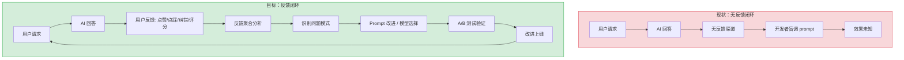
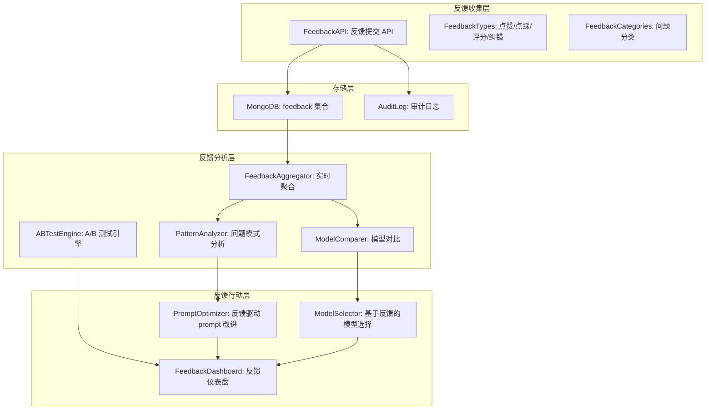
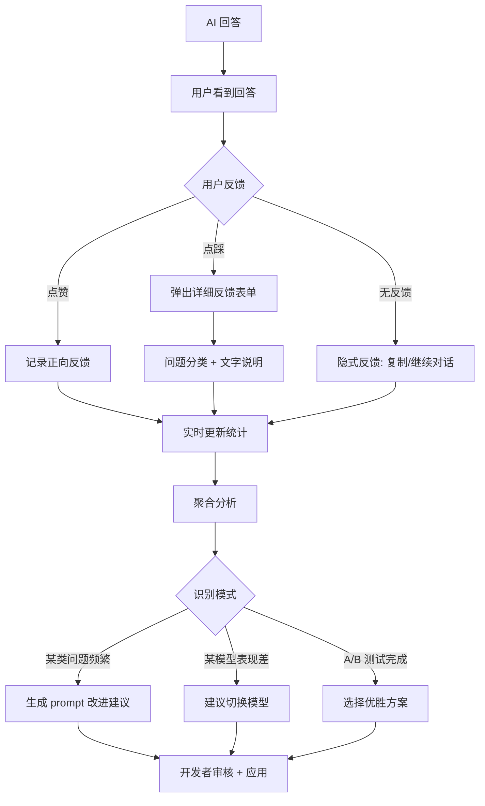

# YA-09-188: 用户反馈闭环 — 系统化反馈收集与利用、反馈类型、反馈聚合分析、反馈驱动 prompt 改进、基于反馈的模型选择、反馈仪表盘、A/B 测试集成

> 需求编号：YA-09-188 · 优先级：P2 · 人天：0.3d · 状态：需求已编写
> 依赖：YA-07-04（AI 聊天服务）、YA-09-05（审计日志）

## 背景

### 问题陈述

YiAi 的 AI 聊天服务当前缺乏系统化的用户反馈机制。用户对 AI 回答的质量没有任何反馈渠道，开发和运维团队无法了解 AI 的真实表现。这导致以下问题：

1. **无反馈渠道**：用户无法对 AI 回答进行评价（满意/不满意/纠错），好回答无法强化，差回答无法改进
2. **Prompt 改进无数据支撑**：系统提示词的优化完全依赖开发者的直觉，缺乏用户反馈数据支撑
3. **模型选择无依据**：不同模型（GPT-4/llama3/qwen）的效果无法通过用户反馈量化比较
4. **无法发现系统性问题**：某些类型的请求（如特定领域、特定语言）的失败模式无法被系统性发现
5. **无 A/B 测试能力**：无法对比不同 prompt 或模型的效果，改进缺乏实验验证

**核心矛盾**：AI 系统的质量改进需要数据驱动的反馈闭环，但当前系统缺少反馈收集、聚合、分析和行动的全链路机制。

### 影响范围

| # | 影响 | 严重程度 | 典型场景 |
|---|------|----------|----------|
| 1 | 无用户反馈渠道 | 高 | 用户收到差回答但无法反馈 |
| 2 | Prompt 改进无数据支撑 | 高 | 开发者随意修改 prompt，效果未知 |
| 3 | 模型选择无依据 | 中 | 不知道 GPT-4 和 llama3 哪个更适合当前场景 |
| 4 | 无法发现系统性问题 | 中 | 某类问题持续失败但无人知晓 |
| 5 | 无 A/B 测试能力 | 低 | 改进无法实验验证 |

### 挑战

| 挑战 | 说明 |
|------|------|
| 反馈收集 | 用户反馈意愿低，需要设计低摩擦的反馈机制 |
| 反馈稀疏性 | 大部分对话无反馈，需要处理稀疏数据 |
| 反馈偏差 | 不满意的用户更可能反馈（负面偏差），需要校准 |
| 反馈到行动 | 如何将反馈转化为具体的 prompt 改进或模型选择 |
| 隐私 | 反馈关联的对话内容可能包含敏感信息 |

---

## 一、现状分析

### 1.1 当前反馈状态

```
现有反馈相关功能（无）:
├── chat_service.py
│   └── 无反馈收集接口
├── 前端聊天界面
│   └── 无点赞/点踩/纠错按钮
├── 数据层
│   └── 无反馈数据存储
├── 分析
│   └── 无反馈聚合分析
└── Prompt 管理
    └── 无反馈驱动的改进流程

缺失:
├── 反馈收集 API                  # ❌ 不存在
├── 反馈类型（点赞/评分/纠错）    # ❌ 不存在
├── 反馈聚合分析                  # ❌ 不存在
├── 反馈驱动的 prompt 改进        # ❌ 不存在
├── 基于反馈的模型选择            # ❌ 不存在
├── 反馈仪表盘                   # ❌ 不存在
├── A/B 测试集成                 # ❌ 不存在
└── 反馈数据存储                  # ❌ 不存在
```

### 1.2 反馈闭环（现状 vs 目标）



### 1.3 根因矩阵

| 症状 | 根因 | 触发条件 | 频率 |
|------|------|----------|------|
| 无反馈渠道 | 未实现反馈收集 | 用户想评价 AI 回答 | 高 |
| Prompt 改进盲目 | 无数据支撑 | 开发者优化 prompt | 高 |
| 模型选择无依据 | 无反馈对比 | 切换模型 | 中 |
| 无法发现系统性问题 | 无聚合分析 | 某类问题持续出现 | 中 |
| 改进无实验验证 | 无 A/B 测试 | 上线改进 | 低 |

---

## 二、设计决策

### 决策 1：反馈类型 — 简单 vs 详细 vs 分层

| 选项 | 用户摩擦 | 信息量 | 完成率 |
|------|----------|--------|--------|
| 简单（仅点赞/点踩） | 极低 | 低 | 高（> 10%） |
| 详细（评分 + 分类 + 文字） | 高 | 高 | 低（< 2%） |
| 分层（点赞/点踩 + 可选详细反馈） | 低 | 中 | 中（5-10%） |

**选择：分层反馈。** 默认展示点赞/点踩按钮（一键操作，摩擦极低）。点踩后弹出可选详细反馈（问题分类 + 文字说明）。分层设计平衡了反馈收集率和信息量：大多数用户给出简单反馈，少数有强烈意愿的用户提供详细反馈。

### 决策 2：反馈存储 — MongoDB 独立集合 vs 嵌入会话 vs 日志

| 选项 | 查询效率 | 分析能力 | 存储成本 |
|------|----------|----------|----------|
| 独立集合（feedback） | 高 | 高 | 低（每条 < 1KB） |
| 嵌入会话（sessions 中） | 低 | 中 | 低 |
| 仅日志 | 极低 | 低 | 极低 |

**选择：MongoDB 独立集合 + 审计日志。** 独立集合 `feedback` 便于聚合查询和分析。同时将反馈事件写入审计日志，确保可追溯。反馈数据量小（每条 < 1KB），独立集合的存储成本可忽略。

### 决策 3：反馈分析 — 实时 vs 定时批处理 vs 手动

| 选项 | 实时性 | 计算成本 | 实现复杂度 |
|------|--------|----------|-----------|
| 实时（每次反馈后立即更新统计） | 高 | 低 | 低 |
| 定时批处理（每小时/每天聚合一次） | 中 | 低 | 中 |
| 手动（按需查询） | 低 | 极低 | 低 |

**选择：实时 + 定时批处理。** 简单指标（点赞率、评分均值）实时更新。复杂分析（按意图/模型/时间段的聚合）定时批处理（每小时）。实时更新确保仪表盘数据及时，批处理确保复杂分析的性能。

### 决策 4：A/B 测试 — 简单分流 vs 全功能平台 vs 不实现

| 选项 | 功能 | 实现复杂度 | 统计可信度 |
|------|------|-----------|-----------|
| 简单分流（基于 session_id 哈希） | 基础 | 低 | 中 |
| 全功能平台（如 LaunchDarkly） | 完整 | 高 | 高 |
| 不实现 A/B 测试 | 无 | 无 | 无 |

**选择：简单分流（基于 session_id 哈希）。** 使用 session_id 的哈希值末位将流量分为 A/B 两组（如 0-4 为 A 组，5-9 为 B 组）。每组使用不同的 prompt 模板或模型。通过对比两组反馈指标评估改进效果。不引入外部依赖，实现简单。

### 设计决策记录

| 决策 | 选项 A | 选项 B | 选项 C | 选择 | 理由 |
|------|--------|--------|--------|------|------|
| 反馈类型 | 简单 | 详细 | 分层 | **分层** | 低摩擦 + 高信息量 |
| 存储 | 独立集合 | 嵌入会话 | 日志 | **独立集合 + 日志** | 查询高效 + 可追溯 |
| 分析 | 实时 | 定时批处理 | 手动 | **实时 + 批处理** | 及时 + 性能 |
| A/B 测试 | 简单分流 | 全功能平台 | 不实现 | **简单分流** | 够用，无外部依赖 |

---

## 三、目标架构

### 3.1 反馈系统架构



### 3.2 反馈闭环流程



### 3.3 性能指标

| 指标 | 目标值 | 说明 |
|------|--------|------|
| 反馈提交 | < 10ms | API 写入 MongoDB |
| 实时统计更新 | < 5ms | 内存计数器更新 |
| 聚合分析（每小时） | < 1s | MongoDB 聚合查询 |
| 反馈仪表盘加载 | < 500ms | 数据查询 + 渲染 |
| A/B 测试分流 | < 1ms | 哈希计算 |

---

## 四、具体改动

### 4.1 反馈数据模型

```python
# YiAi/src/domain/feedback/models.py (新增)

from dataclasses import dataclass, field
from enum import Enum
from typing import Optional
from datetime import datetime


class FeedbackType(str, Enum):
    THUMBS_UP = "thumbs_up"        # 点赞
    THUMBS_DOWN = "thumbs_down"    # 点踩
    RATING = "rating"              # 评分 (1-5)
    CORRECTION = "correction"      # 纠错


class FeedbackCategory(str, Enum):
    INCORRECT = "incorrect"            # 事实错误
    IRRELEVANT = "irrelevant"          # 不相关
    INCOMPLETE = "incomplete"          # 不完整
    REPETITIVE = "repetitive"          # 重复
    FORMAT_ISSUE = "format_issue"      # 格式问题
    TOO_LONG = "too_long"              # 过长
    TOO_SHORT = "too_short"            # 过短
    TOO_GENERIC = "too_generic"        # 过于通用
    HALLUCINATION = "hallucination"    # 幻觉
    BIAS = "bias"                      # 偏见
    OTHER = "other"                    # 其他


@dataclass
class Feedback:
    """用户反馈数据模型"""
    feedback_id: str
    session_id: str
    message_id: str              # 被评价的 AI 消息 ID
    user_id: Optional[str]
    feedback_type: FeedbackType
    rating: Optional[int] = None  # 1-5 评分
    category: Optional[FeedbackCategory] = None
    comment: Optional[str] = None  # 文字说明
    correction: Optional[str] = None  # 纠错内容
    # 上下文
    intent: Optional[str] = None
    model: Optional[str] = None
    prompt_version: Optional[str] = None
    ab_group: Optional[str] = None
    # 隐式反馈
    implicit_signals: dict = field(default_factory=dict)
    # 时间戳
    created_at: str = field(default_factory=lambda: datetime.utcnow().isoformat())
    processed: bool = False

    def to_mongo_doc(self) -> dict:
        return {
            "feedback_id": self.feedback_id,
            "session_id": self.session_id,
            "message_id": self.message_id,
            "user_id": self.user_id,
            "feedback_type": self.feedback_type.value,
            "rating": self.rating,
            "category": self.category.value if self.category else None,
            "comment": self.comment,
            "correction": self.correction,
            "intent": self.intent,
            "model": self.model,
            "prompt_version": self.prompt_version,
            "ab_group": self.ab_group,
            "implicit_signals": self.implicit_signals,
            "created_at": self.created_at,
            "processed": self.processed,
        }


@dataclass
class FeedbackStats:
    """反馈统计"""
    total_feedback: int = 0
    thumbs_up: int = 0
    thumbs_down: int = 0
    avg_rating: float = 0.0
    # 按模型
    by_model: dict[str, dict] = field(default_factory=dict)
    # 按意图
    by_intent: dict[str, dict] = field(default_factory=dict)
    # 按分类
    by_category: dict[str, int] = field(default_factory=dict)
    # 趋势
    daily_trend: list[dict] = field(default_factory=list)

    @property
    def satisfaction_rate(self) -> float:
        total = self.thumbs_up + self.thumbs_down
        if total == 0:
            return 0.0
        return self.thumbs_up / total
```

### 4.2 反馈收集服务

```python
# YiAi/src/services/feedback/feedback_service.py (新增)

import uuid
from datetime import datetime, timedelta
from typing import Optional
from motor.motor_asyncio import AsyncIOMotorDatabase

from src.domain.feedback.models import (
    Feedback, FeedbackType, FeedbackCategory, FeedbackStats
)


class FeedbackService:
    """用户反馈收集与分析服务"""

    def __init__(self, db: AsyncIOMotorDatabase):
        self.db = db
        self.collection = db["feedback"]
        # 内存计数器（实时快速统计）
        self._realtime_stats = FeedbackStats()

    async def submit_feedback(
        self,
        session_id: str,
        message_id: str,
        feedback_type: FeedbackType,
        rating: Optional[int] = None,
        category: Optional[FeedbackCategory] = None,
        comment: Optional[str] = None,
        correction: Optional[str] = None,
        intent: Optional[str] = None,
        model: Optional[str] = None,
        prompt_version: Optional[str] = None,
        ab_group: Optional[str] = None,
        user_id: Optional[str] = None,
    ) -> Feedback:
        """提交用户反馈"""
        feedback = Feedback(
            feedback_id=str(uuid.uuid4()),
            session_id=session_id,
            message_id=message_id,
            user_id=user_id,
            feedback_type=feedback_type,
            rating=rating,
            category=category,
            comment=comment,
            correction=correction,
            intent=intent,
            model=model,
            prompt_version=prompt_version,
            ab_group=ab_group,
        )

        # 写入 MongoDB
        await self.collection.insert_one(feedback.to_mongo_doc())

        # 更新实时统计
        self._update_realtime_stats(feedback)

        return feedback

    async def record_implicit_feedback(
        self,
        session_id: str,
        message_id: str,
        signal_type: str,  # "copy", "continue", "regenerate", "share"
        model: Optional[str] = None,
    ) -> None:
        """记录隐式反馈（复制/继续对话/重新生成/分享）"""
        await self.collection.update_one(
            {"message_id": message_id},
            {
                "$inc": {f"implicit_signals.{signal_type}": 1},
                "$setOnInsert": {
                    "feedback_id": str(uuid.uuid4()),
                    "session_id": session_id,
                    "message_id": message_id,
                    "feedback_type": "implicit",
                    "model": model,
                    "created_at": datetime.utcnow().isoformat(),
                },
            },
            upsert=True,
        )

    def _update_realtime_stats(self, feedback: Feedback) -> None:
        """更新实时统计"""
        self._realtime_stats.total_feedback += 1
        if feedback.feedback_type == FeedbackType.THUMBS_UP:
            self._realtime_stats.thumbs_up += 1
        elif feedback.feedback_type == FeedbackType.THUMBS_DOWN:
            self._realtime_stats.thumbs_down += 1
        if feedback.rating:
            n = self._realtime_stats.total_feedback
            old = self._realtime_stats.avg_rating
            self._realtime_stats.avg_rating = (old * (n - 1) + feedback.rating) / n

    async def get_stats(
        self,
        model: Optional[str] = None,
        intent: Optional[str] = None,
        days: int = 30,
    ) -> FeedbackStats:
        """获取反馈统计"""
        since = (datetime.utcnow() - timedelta(days=days)).isoformat()

        match_filter = {"created_at": {"$gte": since}}
        if model:
            match_filter["model"] = model
        if intent:
            match_filter["intent"] = intent

        pipeline = [
            {"$match": match_filter},
            {"$group": {
                "_id": None,
                "total": {"$sum": 1},
                "thumbs_up": {"$sum": {"$cond": [{"$eq": ["$feedback_type", "thumbs_up"]}, 1, 0]}},
                "thumbs_down": {"$sum": {"$cond": [{"$eq": ["$feedback_type", "thumbs_down"]}, 1, 0]}},
                "avg_rating": {"$avg": "$rating"},
            }},
        ]

        result = await self.collection.aggregate(pipeline).to_list(1)
        if not result:
            return FeedbackStats()

        r = result[0]
        stats = FeedbackStats(
            total_feedback=r.get("total", 0),
            thumbs_up=r.get("thumbs_up", 0),
            thumbs_down=r.get("thumbs_down", 0),
            avg_rating=round(r.get("avg_rating", 0) or 0, 2),
        )

        # 按模型分组
        stats.by_model = await self._group_by("model", since)
        # 按意图分组
        stats.by_intent = await self._group_by("intent", since)
        # 按分类分组
        stats.by_category = await self._group_by_category(since)

        return stats

    async def _group_by(self, field: str, since: str) -> dict:
        pipeline = [
            {"$match": {"created_at": {"$gte": since}}},
            {"$group": {
                "_id": f"${field}",
                "total": {"$sum": 1},
                "thumbs_up": {"$sum": {"$cond": [{"$eq": ["$feedback_type", "thumbs_up"]}, 1, 0]}},
                "thumbs_down": {"$sum": {"$cond": [{"$eq": ["$feedback_type", "thumbs_down"]}, 1, 0]}},
            }},
        ]
        results = await self.collection.aggregate(pipeline).to_list(100)
        return {
            r["_id"] or "unknown": {
                "total": r["total"],
                "thumbs_up": r["thumbs_up"],
                "thumbs_down": r["thumbs_down"],
                "satisfaction": r["thumbs_up"] / max(1, r["thumbs_up"] + r["thumbs_down"]),
            }
            for r in results
        }

    async def _group_by_category(self, since: str) -> dict[str, int]:
        pipeline = [
            {"$match": {"created_at": {"$gte": since}, "category": {"$ne": None}}},
            {"$group": {"_id": "$category", "count": {"$sum": 1}}},
            {"$sort": {"count": -1}},
        ]
        results = await self.collection.aggregate(pipeline).to_list(100)
        return {r["_id"]: r["count"] for r in results}

    async def get_trend(self, days: int = 30) -> list[dict]:
        """获取每日反馈趋势"""
        since = (datetime.utcnow() - timedelta(days=days)).strftime("%Y-%m-%d")

        pipeline = [
            {"$match": {"created_at": {"$gte": since}}},
            {"$group": {
                "_id": {"$substr": ["$created_at", 0, 10]},
                "total": {"$sum": 1},
                "thumbs_up": {"$sum": {"$cond": [{"$eq": ["$feedback_type", "thumbs_up"]}, 1, 0]}},
                "thumbs_down": {"$sum": {"$cond": [{"$eq": ["$feedback_type", "thumbs_down"]}, 1, 0]}},
            }},
            {"$sort": {"_id": 1}},
        ]

        results = await self.collection.aggregate(pipeline).to_list(365)
        return results
```

### 4.3 A/B 测试引擎

```python
# YiAi/src/domain/feedback/ab_test.py (新增)

import hashlib
from dataclasses import dataclass
from typing import Optional


@dataclass
class ABTestConfig:
    """A/B 测试配置"""
    test_id: str
    name: str
    description: str
    # 分流规则
    split_ratio: float = 0.5  # A 组占比（0-1）
    # 变量
    variant_a: dict            # A 组配置（如 {"prompt_version": "v1", "model": "gpt-4"}）
    variant_b: dict            # B 组配置
    # 状态
    enabled: bool = True
    start_time: Optional[str] = None
    end_time: Optional[str] = None


class ABTestEngine:
    """A/B 测试分流引擎"""

    @staticmethod
    def assign_group(session_id: str, test_id: str, split_ratio: float = 0.5) -> str:
        """
        基于 session_id 哈希将用户分配到 A 或 B 组。

        使用 SHA-256 哈希的末位十六进制数字进行分流。
        0-7 的十六进制数字对应 A 组，8-f 对应 B 组（8/16 = 0.5）。
        """
        hash_input = f"{test_id}:{session_id}"
        hash_hex = hashlib.sha256(hash_input.encode()).hexdigest()
        last_digit = int(hash_hex[-1], 16)

        if last_digit < int(split_ratio * 16):
            return "A"
        return "B"

    @staticmethod
    def get_variant(
        session_id: str,
        test_config: ABTestConfig,
    ) -> dict:
        """获取当前会话的变体配置"""
        if not test_config.enabled:
            return test_config.variant_a

        group = ABTestEngine.assign_group(
            session_id, test_config.test_id, test_config.split_ratio
        )
        return test_config.variant_a if group == "A" else test_config.variant_b

    @staticmethod
    def get_group_label(
        session_id: str,
        test_config: ABTestConfig,
    ) -> str:
        """获取当前会话的分组标签"""
        if not test_config.enabled:
            return "control"
        return ABTestEngine.assign_group(
            session_id, test_config.test_id, test_config.split_ratio
        )
```

### 4.4 反馈驱动的 Prompt 改进

```python
# YiAi/src/domain/feedback/prompt_optimizer.py (新增)

from typing import Optional
from motor.motor_asyncio import AsyncIOMotorDatabase
from .models import FeedbackCategory


class PromptOptimizer:
    """基于反馈数据生成 prompt 改进建议"""

    def __init__(self, db: AsyncIOMotorDatabase):
        self.db = db

    async def generate_improvement_suggestions(
        self,
        prompt_version: str,
        min_samples: int = 10,
        low_satisfaction_threshold: float = 0.6,
    ) -> list[dict]:
        """生成 prompt 改进建议"""
        suggestions = []

        # 1. 分析最频繁的负面反馈分类
        top_categories = await self._get_top_negative_categories(prompt_version)
        for cat, count in top_categories:
            if count >= min_samples:
                suggestions.append({
                    "type": "category_issue",
                    "category": cat,
                    "count": count,
                    "suggestion": self._category_to_suggestion(cat),
                    "priority": "high" if count >= min_samples * 2 else "medium",
                })

        # 2. 分析低满意度意图
        low_intents = await self._get_low_satisfaction_intents(
            prompt_version, low_satisfaction_threshold
        )
        for intent, rate in low_intents:
            suggestions.append({
                "type": "intent_issue",
                "intent": intent,
                "satisfaction_rate": rate,
                "suggestion": f"意图 '{intent}' 的满意度较低（{rate:.0%}），建议优化该意图的 prompt 模板",
                "priority": "high" if rate < 0.4 else "medium",
            })

        return suggestions

    async def _get_top_negative_categories(
        self, prompt_version: str, limit: int = 5
    ) -> list[tuple[str, int]]:
        """获取最频繁的负面反馈分类"""
        pipeline = [
            {"$match": {
                "prompt_version": prompt_version,
                "feedback_type": "thumbs_down",
                "category": {"$ne": None},
            }},
            {"$group": {"_id": "$category", "count": {"$sum": 1}}},
            {"$sort": {"count": -1}},
            {"$limit": limit},
        ]
        results = await self.db["feedback"].aggregate(pipeline).to_list(limit)
        return [(r["_id"], r["count"]) for r in results]

    async def _get_low_satisfaction_intents(
        self, prompt_version: str, threshold: float
    ) -> list[tuple[str, float]]:
        """获取低满意度意图"""
        pipeline = [
            {"$match": {"prompt_version": prompt_version}},
            {"$group": {
                "_id": "$intent",
                "total": {"$sum": 1},
                "thumbs_up": {"$sum": {"$cond": [{"$eq": ["$feedback_type", "thumbs_up"]}, 1, 0]}},
                "thumbs_down": {"$sum": {"$cond": [{"$eq": ["$feedback_type", "thumbs_down"]}, 1, 0]}},
            }},
        ]
        results = await self.db["feedback"].aggregate(pipeline).to_list(100)

        low = []
        for r in results:
            total = r["thumbs_up"] + r["thumbs_down"]
            if total >= 10:
                rate = r["thumbs_up"] / total
                if rate < threshold:
                    low.append((r["_id"] or "unknown", rate))
        return sorted(low, key=lambda x: x[1])

    def _category_to_suggestion(self, category: str) -> str:
        """将反馈分类映射为改进建议"""
        suggestions = {
            "incorrect": "检查知识库中相关事实的准确性，添加更精确的上下文",
            "irrelevant": "优化 prompt 中的指令，确保回答聚焦于用户问题",
            "incomplete": "在 prompt 中要求 AI 提供更全面的回答，覆盖多个方面",
            "repetitive": "调整 repetition_penalty 参数，或在 prompt 中明确要求避免重复",
            "format_issue": "在 prompt 中明确输出格式要求（如 Markdown、表格、列表）",
            "hallucination": "添加 '如果不确定，请明确说明' 的指令，降低 temperature",
            "too_generic": "在 prompt 中要求 AI 提供具体、详细的回答，而非泛泛之谈",
        }
        return suggestions.get(category, f"分析 '{category}' 分类的反馈，优化对应 prompt 部分")
```

### 4.5 反馈仪表盘 API

```python
# YiAi/src/services/feedback/dashboard_service.py (新增)

from motor.motor_asyncio import AsyncIOMotorDatabase
from datetime import datetime, timedelta


class FeedbackDashboardService:
    """反馈仪表盘数据服务"""

    def __init__(self, db: AsyncIOMotorDatabase):
        self.db = db

    async def get_dashboard_data(self, days: int = 30) -> dict:
        """获取仪表盘核心数据"""
        since = (datetime.utcnow() - timedelta(days=days)).isoformat()

        # 并行查询各项指标
        overview = await self._get_overview(since)
        trend = await self._get_daily_trend(since)
        by_model = await self._get_model_comparison(since)
        by_intent = await self._get_intent_comparison(since)
        top_issues = await self._get_top_issues(since)
        feedback_rate = await self._get_feedback_rate(since)

        return {
            "overview": overview,
            "trend": trend,
            "by_model": by_model,
            "by_intent": by_intent,
            "top_issues": top_issues,
            "feedback_rate": feedback_rate,
            "generated_at": datetime.utcnow().isoformat(),
        }

    async def _get_overview(self, since: str) -> dict:
        pipeline = [
            {"$match": {"created_at": {"$gte": since}}},
            {"$group": {
                "_id": None,
                "total": {"$sum": 1},
                "thumbs_up": {"$sum": {"$cond": [{"$eq": ["$feedback_type", "thumbs_up"]}, 1, 0]}},
                "thumbs_down": {"$sum": {"$cond": [{"$eq": ["$feedback_type", "thumbs_down"]}, 1, 0]}},
                "avg_rating": {"$avg": "$rating"},
                "with_comment": {"$sum": {"$cond": [{"$ne": ["$comment", None]}, 1, 0]}},
            }},
        ]
        result = await self.db["feedback"].aggregate(pipeline).to_list(1)
        if not result:
            return {"total": 0, "thumbs_up": 0, "thumbs_down": 0}
        r = result[0]
        return {
            "total": r["total"],
            "thumbs_up": r["thumbs_up"],
            "thumbs_down": r["thumbs_down"],
            "satisfaction_rate": round(
                r["thumbs_up"] / max(1, r["thumbs_up"] + r["thumbs_down"]), 3
            ),
            "avg_rating": round(r.get("avg_rating", 0) or 0, 2),
            "comment_rate": round(r["with_comment"] / max(1, r["total"]), 3),
        }

    async def _get_daily_trend(self, since: str) -> list:
        pipeline = [
            {"$match": {"created_at": {"$gte": since}}},
            {"$group": {
                "_id": {"$substr": ["$created_at", 0, 10]},
                "total": {"$sum": 1},
                "thumbs_up": {"$sum": {"$cond": [{"$eq": ["$feedback_type", "thumbs_up"]}, 1, 0]}},
                "thumbs_down": {"$sum": {"$cond": [{"$eq": ["$feedback_type", "thumbs_down"]}, 1, 0]}},
            }},
            {"$sort": {"_id": 1}},
        ]
        return await self.db["feedback"].aggregate(pipeline).to_list(365)

    async def _get_model_comparison(self, since: str) -> list:
        pipeline = [
            {"$match": {"created_at": {"$gte": since}}},
            {"$group": {
                "_id": "$model",
                "total": {"$sum": 1},
                "thumbs_up": {"$sum": {"$cond": [{"$eq": ["$feedback_type", "thumbs_up"]}, 1, 0]}},
                "thumbs_down": {"$sum": {"$cond": [{"$eq": ["$feedback_type", "thumbs_down"]}, 1, 0]}},
                "avg_rating": {"$avg": "$rating"},
            }},
            {"$sort": {"total": -1}},
        ]
        results = await self.db["feedback"].aggregate(pipeline).to_list(50)
        return [
            {
                "model": r["_id"] or "unknown",
                "total": r["total"],
                "satisfaction": round(
                    r["thumbs_up"] / max(1, r["thumbs_up"] + r["thumbs_down"]), 3
                ),
                "avg_rating": round(r.get("avg_rating", 0) or 0, 2),
            }
            for r in results
        ]

    async def _get_intent_comparison(self, since: str) -> list:
        pipeline = [
            {"$match": {"created_at": {"$gte": since}}},
            {"$group": {
                "_id": "$intent",
                "total": {"$sum": 1},
                "thumbs_up": {"$sum": {"$cond": [{"$eq": ["$feedback_type", "thumbs_up"]}, 1, 0]}},
                "thumbs_down": {"$sum": {"$cond": [{"$eq": ["$feedback_type", "thumbs_down"]}, 1, 0]}},
            }},
            {"$sort": {"total": -1}},
        ]
        results = await self.db["feedback"].aggregate(pipeline).to_list(50)
        return [
            {
                "intent": r["_id"] or "unknown",
                "total": r["total"],
                "satisfaction": round(
                    r["thumbs_up"] / max(1, r["thumbs_up"] + r["thumbs_down"]), 3
                ),
            }
            for r in results
        ]

    async def _get_top_issues(self, since: str) -> list:
        pipeline = [
            {"$match": {
                "created_at": {"$gte": since},
                "feedback_type": "thumbs_down",
                "category": {"$ne": None},
            }},
            {"$group": {"_id": "$category", "count": {"$sum": 1}}},
            {"$sort": {"count": -1}},
            {"$limit": 10},
        ]
        return await self.db["feedback"].aggregate(pipeline).to_list(10)

    async def _get_feedback_rate(self, since: str) -> dict:
        """计算反馈率：有反馈的对话 / 总对话"""
        pipeline = [
            {"$match": {"created_at": {"$gte": since}}},
            {"$group": {"_id": "$session_id"}},
            {"$count": "sessions_with_feedback"},
        ]
        result = await self.db["feedback"].aggregate(pipeline).to_list(1)
        return {
            "sessions_with_feedback": result[0]["sessions_with_feedback"] if result else 0,
        }
```

### 4.6 文件变更清单

| 文件 | 操作 | 说明 |
|------|------|------|
| `YiAi/src/domain/feedback/__init__.py` | 新增 | 模块初始化 |
| `YiAi/src/domain/feedback/models.py` | 新增 | 反馈数据模型 |
| `YiAi/src/domain/feedback/ab_test.py` | 新增 | A/B 测试引擎 |
| `YiAi/src/domain/feedback/prompt_optimizer.py` | 新增 | 反馈驱动 prompt 改进 |
| `YiAi/src/services/feedback/feedback_service.py` | 新增 | 反馈收集与分析服务 |
| `YiAi/src/services/feedback/dashboard_service.py` | 新增 | 反馈仪表盘服务 |
| `YiAi/src/services/feedback/__init__.py` | 新增 | 服务模块初始化 |
| `YiAi/src/services/ai/chat_service.py` | 修改 | SSE 响应中添加 message_id 用于反馈关联 |
| `YiAi/tests/test_feedback.py` | 新增 | 反馈系统测试 |

---

## 五、实施步骤

| 步骤 | 操作 | 路径 | 验证 | 人天 |
|------|------|------|------|------|
| 1 | 定义反馈数据模型 | `domain/feedback/models.py` | 数据模型完整，MongoDB 文档可序列化 | 0.03 |
| 2 | 实现反馈收集 API | `services/feedback/feedback_service.py` | 提交反馈 + 写入 MongoDB 正常 | 0.05 |
| 3 | 实现反馈聚合分析 | `services/feedback/feedback_service.py` | 按模型/意图/分类聚合正确 | 0.04 |
| 4 | 实现 A/B 测试引擎 | `domain/feedback/ab_test.py` | 分流稳定，同一 session 始终同组 | 0.03 |
| 5 | 实现 Prompt 优化建议 | `domain/feedback/prompt_optimizer.py` | 基于反馈生成合理建议 | 0.04 |
| 6 | 实现反馈仪表盘 | `services/feedback/dashboard_service.py` | 仪表盘数据完整且正确 | 0.04 |
| 7 | 集成到 chat_service | `services/ai/chat_service.py` | SSE 中包含 message_id | 0.03 |
| 8 | 编写单元测试 | `tests/test_feedback.py` | 覆盖提交/统计/AB 分流/建议 | 0.04 |

**总人天：0.3d**

---

## 六、测试规格

### 场景 1：提交点赞反馈

**GIVEN** 用户收到 AI 回答，message_id 为 "msg-001"
**WHEN** 用户点击点赞按钮
**THEN** 系统应创建 Feedback 记录，feedback_type 为 "thumbs_up"
**AND** 记录应包含 session_id、message_id、model、intent
**AND** 实时统计的 thumbs_up 计数应 +1

### 场景 2：提交点踩 + 详细反馈

**GIVEN** 用户收到 AI 回答，message_id 为 "msg-002"
**WHEN** 用户点击点踩，选择分类 "incorrect"，填写评论 "答案中的日期错误"
**THEN** 系统应创建 Feedback 记录，包含 category="incorrect" 和 comment="答案中的日期错误"
**AND** 实时统计的 thumbs_down 计数应 +1

### 场景 3：反馈聚合分析

**GIVEN** 过去 30 天有 100 条反馈，其中 70 条点赞、30 条点踩
**WHEN** 调用 get_stats(days=30)
**THEN** 返回的 satisfaction_rate 应为 0.7
**AND** by_model 应包含各模型的满意度
**AND** by_category 应按点踩分类排序

### 场景 4：A/B 测试分流

**GIVEN** A/B 测试配置 split_ratio=0.5，session_id="session-abc"
**WHEN** 调用 assign_group("session-abc", "test-001")
**THEN** 应返回 "A" 或 "B"
**AND** 相同 session_id 多次调用应返回相同结果
**AND** 分流比例应在大量样本中接近 50:50

### 场景 5：Prompt 改进建议

**GIVEN** prompt_version="v1"，有 20 条点踩反馈，其中 10 条分类为 "hallucination"
**WHEN** 调用 generate_improvement_suggestions("v1")
**THEN** 应返回包含 "hallucination" 问题的建议
**AND** 建议应包含具体的改进方向（如 "添加 '如果不确定请明确说明' 的指令"）

### 场景 6：隐式反馈记录

**GIVEN** 用户复制了 AI 回答的内容
**WHEN** 前端调用 record_implicit_feedback(message_id, "copy")
**THEN** 系统应记录隐式反馈（implicit_signals.copy += 1）
**AND** 如果 message_id 没有显式反馈记录，应创建新记录

---

## 七、风险与缓解

| 风险 | 概率 | 影响 | 缓解措施 |
|------|------|------|----------|
| 用户反馈率低（< 5%） | 高 | 中 | 设计低摩擦 UI（一键点赞）；分析隐式反馈补充 |
| 负面偏差（不满意的用户更可能反馈） | 高 | 中 | 同时分析隐式反馈（复制/继续对话）校准满意度 |
| 反馈数据包含敏感信息 | 中 | 高 | 评论字段脱敏；定期清理旧反馈数据 |
| A/B 测试分流不均 | 低 | 低 | 使用 SHA-256 哈希确保均匀分布 |

---

## 八、回滚策略

| 场景 | 回滚操作 | 影响 |
|------|------|------|
| 反馈收集导致 MongoDB 写入压力 | 降低反馈写入频率（批量写入） | 反馈数据可能有延迟 |
| A/B 测试导致用户体验问题 | 关闭 A/B 测试，所有用户使用默认配置 | 失去实验对比能力 |
| 仪表盘查询性能差 | 增加查询缓存（TTL 5min），减少实时查询 | 仪表盘数据有 5 分钟延迟 |
| 反馈数据隐私问题 | 紧急清理 feedback 集合中的敏感字段 | 部分反馈数据丢失 |

---

## 九、设计决策记录

### D-01：为什么使用分层反馈而非简单点赞/点踩？

纯粹点赞/点踩无法区分问题类型，开发者不知道"为什么"用户不满意。分层设计在用户点踩后弹出分类选择（问题类型），收集结构化信息用于分析。分层设计的关键是保持步骤简单（点踩 -> 选择分类 -> 可选评论），每步都可在 2 秒内完成。

### D-02：为什么 A/B 测试使用 session_id 哈希而非随机分配？

session_id 哈希确保同一会话始终分配到同一组，避免用户在对话中切换组导致体验不一致。SHA-256 哈希的均匀分布特性确保大样本下分流比例接近配置值。无需额外的用户-组映射存储，无状态分流。

### D-03：为什么反馈仪表盘使用 MongoDB 聚合而非实时计算？

MongoDB 聚合管道在数据库层完成计算，比应用层加载数据后计算更高效。对于 30 天内的数据（通常 < 10000 条），聚合查询 < 500ms。未来数据量增长时，可引入预聚合表（每小时更新一次）。

### D-04：为什么隐式反馈与显式反馈分开存储？

隐式反馈（复制、继续对话、重新生成）的信号含义与显式反馈（点赞、点踩）不同。复制可能表示回答有用，但重新生成可能表示不满意。隐式反馈作为辅助信号，不直接计入满意度计算，但用于校准显式反馈的偏差。

---

## 十、可观测性

### 指标

| 指标 | 类型 | 说明 |
|------|------|------|
| `yiai.feedback.total` | Counter | 反馈总数（按类型分组） |
| `yiai.feedback.satisfaction_rate` | Gauge | 整体满意度（点赞/总反馈） |
| `yiai.feedback.avg_rating` | Gauge | 平均评分 |
| `yiai.feedback.feedback_rate` | Gauge | 反馈率（有反馈的对话/总对话） |
| `yiai.feedback.top_negative_category` | Gauge | 最频繁的负面反馈分类 |
| `yiai.feedback.submit_latency_ms` | Histogram | 反馈提交延迟 |
| `yiai.feedback.ab_test_active` | Gauge | 活跃的 A/B 测试数量 |

### 告警

| 告警 | 条件 | 级别 |
|------|------|------|
| 满意度骤降 | 满意度下降 > 20%（24h 内） | WARNING |
| 反馈率异常低 | 反馈率 < 2% | INFO |
| 某模型满意度极低 | 某模型满意度 < 50% | WARNING |
| 某分类问题激增 | 单分类点踩数 > 100/天 | WARNING |

---

## 十一、代码审查检查清单

- [ ] 反馈数据模型包含所有必要字段（session_id, message_id, feedback_type, model 等）
- [ ] 反馈写入使用 MongoDB insert_one，有错误处理
- [ ] 实时统计更新使用内存计数器（非阻塞）
- [ ] A/B 测试分流使用 SHA-256 哈希，同一 session 始终同组
- [ ] MongoDB 聚合查询使用索引（created_at, model, intent, feedback_type）
- [ ] 隐式反馈与显式反馈分开存储和处理
- [ ] 仪表盘数据查询有合理的默认时间范围（30 天）
- [ ] message_id 在 SSE 响应中发送，前端可关联反馈
- [ ] 反馈数据不包含完整对话内容（仅 message_id 关联）

---

## 回归问题预测

| # | 预测问题 | 原因 | 验证方法 |
|---|---------|------|---------|
| 1 | message_id 在 SSE 流式响应中通过 `event: message_id` 发送，但前端可能在流开始前就渲染了消息组件，message_id 事件到达时消息已渲染，无法关联反馈按钮 | SSE 流式响应中 message_id 事件在第一个 chunk 之前发送，但前端 EventSource 的事件处理是异步的，存在竞态条件 | 在 SSE 响应的第一个 chunk 中包含 message_id（如 `data: {"message_id": "xxx", "chunk": "..."}`），确保前端在渲染第一个 chunk 时已获得 message_id |
| 2 | A/B 测试的 `split_ratio` 在 float 精度下，`int(0.5 * 16)` 等于 8，但 `int(0.33 * 16)` 等于 5（而非 5.28），分流比例偏差随 split_ratio 增大 | Python 的 `int(0.33 * 16)` 等于 5（截断），实际分流比例为 5/16=31.25% 而非 33%，split_ratio 的精度受限于 16 个桶 | 使用 `round(split_ratio * 16)` 替代 `int()`，确保四舍五入到最接近的桶数 |
| 3 | 反馈仪表盘的 `_get_feedback_rate` 仅统计了有反馈的 session 数，但 "总对话" 需要从 sessions 集合查询，两个集合的数据可能不同步 | feedback 集合和 sessions 集合的 session_id 可能不一致（如 session 被删除但 feedback 保留），或 sessions 集合中缺少某些 session（如匿名对话） | 在 feedback 集合中维护一个独立的 `sessions_with_messages` 计数器（通过聊天服务每次消息发送时更新），不依赖 sessions 集合 |
| 4 | PromptOptimizer 的 `_category_to_suggestion` 映射是硬编码的，当新增反馈分类时，映射表未更新，新分类的改进建议为空 | 开发者新增 FeedbackCategory 枚举值（如 "TOO_FAST"），但 `_category_to_suggestion` 字典未同步更新，新分类走到 default 分支 | 将分类-建议映射改为配置文件或数据库存储，与 FeedbackCategory 枚举解耦 |
| 5 | 实时统计 `_realtime_stats` 是内存中的单例对象，在多进程部署（如 gunicorn workers）中，每个 worker 有独立的计数器，统计不一致 | FastAPI 使用 uvicorn workers 多进程部署，每个 worker 有独立的 `FeedbackService` 实例和 `_realtime_stats`，API 请求路由到不同 worker 时统计不完整 | 将实时统计改为从 MongoDB 读取（`$count` 查询），或使用 Redis 作为共享计数器，或使用 MongoDB 的 `$inc` 操作原子更新统计文档 |
| 6 | 隐式反馈的 `upsert` 操作在 message_id 首次出现时创建 `feedback_type: "implicit"` 的记录，但后续用户提交显式反馈（thumbs_up）时，隐式反馈记录被覆盖或产生冲突 | `record_implicit_feedback` 使用 `upsert=True`，如果 message_id 已存在，仅 `$inc` 更新 implicit_signals。但 `submit_feedback` 使用 `insert_one`，如果 message_id 已存在（隐式反馈记录），会抛出 DuplicateKeyError | 在 message_id 上创建唯一索引，`submit_feedback` 使用 `update_one` + `upsert` 替代 `insert_one`，合并显式反馈和隐式反馈 |

---

## 性能分析

### 各阶段耗时

| 阶段 | 预估耗时 | 说明 |
|------|----------|------|
| 反馈提交 | < 5ms | MongoDB insert_one |
| 实时统计更新 | < 0.5ms | 内存计数器 |
| 聚合查询（30 天） | < 500ms | MongoDB 聚合管道 |
| 趋势查询（30 天） | < 200ms | 按日分组聚合 |
| A/B 分流 | < 0.5ms | SHA-256 哈希 |
| Prompt 改进建议 | < 500ms | 多条件聚合查询 |

### 存储预估

| 数据 | 每条大小 | 月增长（1000 次对话）|
|------|----------|----------------------|
| 显式反馈 | ~500B | ~50KB（10% 反馈率） |
| 隐式反馈 | ~200B | ~200KB |
| 月度总存储 | — | ~250KB |

### 查询性能优化

| 优化 | 预期收益 | 说明 |
|------|---------|------|
| MongoDB 索引 | 查询加速 10-100x | 在 created_at, model, feedback_type, intent 上创建索引 |
| 内存计数器 | 实时统计 < 1ms | 高频读取的统计使用内存计数器 |
| 查询结果缓存 | 仪表盘加载 < 50ms | 5 分钟 TTL 缓存仪表盘数据 |
| 聚合查询限制 | 避免慢查询 | 限制聚合结果数量（top 50），限制时间范围（默认 30 天） |

## 影响范围

- **影响模块**：待补充
- **涉及文件**：
- 待补充
- **是否影响 API 契约**：否
- **是否影响其他项目（YiVad/YiPet）**：否
- **用户感知**：待确认

## 预防措施

| 层面 | 措施 |
|------|------|
| 代码 | 在相关函数中添加参数校验和边界检查 |
| 测试 | 添加对应的自动化测试用例 |
| 流程 | 代码审查时重点检查此类模式 |
| 监控 | 添加日志告警，异常发生时及时发现 |
| 文档 | 在编码规范中记录此类反模式 |

## 经验教训

1. **根本原因**：开发过程中对边界情况和异常路径的考虑不足是此类问题的共同根因
2. **设计阶段**：在接口设计和模块实现时，应主动考虑异常输入、空值、超时等边界场景
3. **代码审查**：审查时应检查是否存在类似的反模式（如未捕获异常、无超时控制、缺少参数校验等）
4. **测试覆盖**：异常路径的测试覆盖率应与正常路径同等重视
5. **团队分享**：此类问题应在团队周会或技术分享中讨论，形成团队共识
