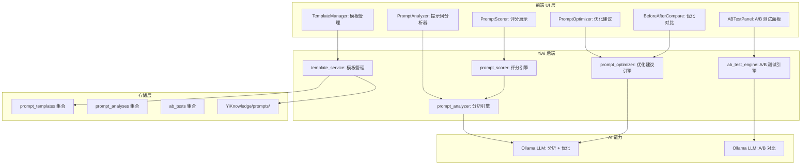
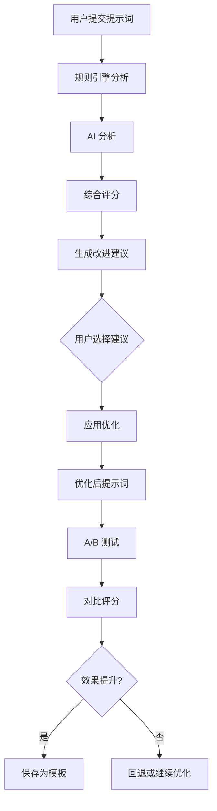

# YA-09-189: 智能提示词优化器 — 提示词分析、改进建议、A/B 测试、评分、模板优化

> 需求编号：YA-09-189 · 优先级：P2 · 人天：0.3d · 状态：需求已编写
> 依赖：YA-09-73（Prompt 历史管理）

## 背景

### 问题陈述

YiAi 作为 AI 后端的核心价值在于高质量地处理用户请求，而提示词（Prompt）是决定 AI 输出质量的关键因素。当前系统提示词的管理和优化存在以下问题：

1. **提示词质量不可见**：不知道当前提示词的效果如何，缺乏量化评估
2. **优化无方向**：不清楚提示词的具体问题在哪里（清晰度、特异性、结构）
3. **改进无验证**：修改提示词后无法确认效果是否提升
4. **最佳实践缺失**：团队缺乏提示词优化的方法论和工具支持
5. **模板难以维护**：系统提示词模板散落在代码中，版本管理困难

**核心矛盾**：提示词质量直接影响 AI 服务质量，但当前缺乏系统化的提示词分析、优化和评估工具。

### 影响范围

| # | 影响 | 严重程度 | 典型场景 |
|---|------|----------|----------|
| 1 | AI 输出质量不稳定 | 高 | 提示词缺陷导致 AI 回答偏差 |
| 2 | 提示词优化无方向 | 中 | 不知道如何改进提示词 |
| 3 | 改进效果无法验证 | 中 | 修改后无法确认效果提升 |
| 4 | 知识无法沉淀 | 中 | 好的提示词经验无法复用 |

### 挑战

| 挑战 | 说明 |
|------|------|
| 提示词质量评估 | 提示词"好坏"的量化标准是什么 |
| A/B 测试设计 | 如何公平对比两个提示词版本 |
| 元分析质量 | 用 AI 分析 AI 提示词质量，可能产生偏见 |
| 模板版本管理 | 提示词模板的版本控制和回滚 |

---

## 一、现状分析

### 1.1 当前提示词管理现状

```
现有提示词管理:
├── 系统提示词
│   ├── 硬编码在代码中
│   ├── 无版本管理
│   └── 无效果评估
├── 用户提示词
│   ├── 自由输入
│   └── 无优化建议
│
缺失:
├── 提示词质量分析          # ❌ 不存在
├── 改进建议生成            # ❌ 不存在
├── A/B 测试框架            # ❌ 不存在
├── 提示词评分系统          # ❌ 不存在
├── 模板优化引擎            # ❌ 不存在
├── 优化前后对比            # ❌ 不存在
└── 最佳实践知识库          # ❌ 不存在
```

### 1.2 提示词分析维度

| 维度 | 评估标准 | 权重 |
|------|----------|------|
| 清晰度 (Clarity) | 指令是否明确，无歧义 | 30% |
| 特异性 (Specificity) | 是否包含具体要求和约束 | 25% |
| 结构 (Structure) | 是否有逻辑分段和层次 | 20% |
| 完整性 (Completeness) | 是否覆盖所有必要信息 | 15% |
| 简洁性 (Conciseness) | 是否避免冗余和重复 | 10% |

### 1.3 根因矩阵

| 症状 | 根因 | 触发条件 | 频率 |
|------|------|----------|------|
| 输出质量不稳定 | 提示词质量不均 | 使用不同提示词 | 高 |
| 优化无方向 | 无质量评估 | 需要优化时 | 高 |
| 改进无法验证 | 无 A/B 测试 | 修改提示词后 | 中 |
| 经验无法复用 | 无模板系统 | 团队协作时 | 中 |

---

## 二、设计决策

### 决策 1：提示词分析方式 — 规则引擎 vs AI 分析 vs 混合

| 选项 | 客观性 | 覆盖度 | 实现复杂度 |
|------|--------|--------|-----------|
| 规则引擎（静态分析） | 高 | 中 | 低 |
| AI 分析（LLM 评估） | 中 | 高 | 中 |
| 混合（规则 + AI） | 高 | 高 | 中 |

**选择：混合模式。** 规则引擎检查可量化的指标（长度、分段数、是否包含示例、是否指定输出格式），AI 分析评估语义层面的质量（清晰度、特异性、是否有歧义）。两者结合提供全面评估。

### 决策 2：A/B 测试 — 在线分流 vs 离线对比 vs 用户评分

| 选项 | 统计显著性 | 实现复杂度 | 用户体验影响 |
|------|-----------|-----------|-------------|
| 在线分流（随机分配版本） | 高 | 中 | 无 |
| 离线对比（相同输入对比输出） | 中 | 低 | 无 |
| 用户评分（人工打分） | 高 | 低 | 中 |

**选择：离线对比 + 用户评分。** 使用一组标准测试问题（10-20 个），分别用版本 A 和版本 B 的提示词生成回答，AI 自动对比输出质量。同时提供人工评分入口，收集用户反馈。

### 决策 3：提示词评分算法 — 加权平均 vs 最低分 vs 综合评分

| 选项 | 公平性 | 可解释性 | 实现复杂度 |
|------|--------|----------|-----------|
| 加权平均 | 中 | 高 | 低 |
| 最低分制（短板决定） | 中 | 高 | 低 |
| 综合评分（加权 + 惩罚） | 高 | 中 | 中 |

**选择：综合评分。** 基础分为加权平均，对严重缺陷（如缺少关键指令）施加惩罚分。评分范围 0-100，附带各维度得分和具体改进建议。

### 决策 4：模板存储 — 代码文件 vs 数据库 vs 文件系统 + 数据库

| 选项 | 版本控制 | 可编辑性 | 性能 |
|------|----------|----------|------|
| 代码文件（Python 文件） | Git 原生 | 低（需部署） | 高 |
| 数据库（MongoDB） | 需自行实现 | 高（在线编辑） | 中 |
| 文件系统 + 数据库 | Git + 在线编辑 | 高 | 高 |

**选择：文件系统 + 数据库。** 提示词模板存储在 YiKnowledge 文件系统中（享受 Git 版本控制），同时缓存到 MongoDB 供运行时查询。前端可在线编辑，修改后写入文件系统并触发 Git 提交。

### 设计决策记录

| 决策 | 选项 A | 选项 B | 选项 C | 选择 | 理由 |
|------|--------|--------|--------|------|------|
| 分析方式 | 规则引擎 | AI 分析 | 混合 | **混合** | 全面评估 |
| A/B 测试 | 在线分流 | 离线对比 | 用户评分 | **离线 + 用户评分** | 低影响 |
| 评分算法 | 加权平均 | 最低分 | 综合评分 | **综合评分** | 公平 + 可解释 |
| 模板存储 | 代码文件 | 数据库 | 文件+数据库 | **文件+数据库** | 版本控制 + 在线编辑 |

---

## 三、目标架构

### 3.1 提示词优化器系统架构



### 3.2 提示词优化流程



### 3.3 性能指标

| 指标 | 目标值 | 说明 |
|------|--------|------|
| 规则分析耗时 | < 10ms | 纯文本分析 |
| AI 分析耗时 | < 3s | LLM 推理 |
| 优化建议生成 | < 5s | LLM 推理 |
| A/B 对比耗时 | < 10s | 2 次 LLM 推理 |
| 评分计算 | < 100ms | 综合评分 |

---

## 四、具体改动

### 4.1 提示词分析引擎

```python
# src/domain/prompt/prompt_analyzer.py (新增)

"""提示词分析引擎——规则 + AI 双模分析。"""

import re
from typing import Optional
from dataclasses import dataclass, field
from src.shared.logging import get_logger

logger = get_logger(__name__)


@dataclass
class PromptAnalysis:
    """提示词分析结果。"""
    clarity_score: float = 0.0       # 清晰度 0-100
    specificity_score: float = 0.0   # 特异性 0-100
    structure_score: float = 0.0     # 结构 0-100
    completeness_score: float = 0.0  # 完整性 0-100
    conciseness_score: float = 0.0   # 简洁性 0-100
    overall_score: float = 0.0       # 综合评分 0-100

    # 规则检查结果
    has_examples: bool = False
    has_output_format: bool = False
    has_role_definition: bool = False
    has_constraints: bool = False
    section_count: int = 0
    word_count: int = 0
    avg_sentence_length: float = 0.0

    # AI 分析结果
    ai_issues: list[dict] = field(default_factory=list)
    ai_suggestions: list[dict] = field(default_factory=list)

    # 改进建议
    suggestions: list[str] = field(default_factory=list)


class RuleBasedAnalyzer:
    """基于规则的提示词静态分析。"""

    def analyze(self, prompt: str) -> dict:
        """分析提示词的结构特征。"""
        words = prompt.split()
        sentences = re.split(r'[.!?。！？]+', prompt)
        sentences = [s.strip() for s in sentences if s.strip()]

        sections = re.split(r'\n#{1,3}\s+', prompt)
        section_count = len(sections) - 1 if len(sections) > 1 else 0

        return {
            'has_examples': bool(re.search(r'(例如|比如|示例|example|e\.g\.)', prompt, re.I)),
            'has_output_format': bool(re.search(r'(输出格式|返回格式|格式要求|输出应为|以.*格式)', prompt)),
            'has_role_definition': bool(re.search(r'(你是|你是一个|作为|扮演|role|你是.*专家)', prompt)),
            'has_constraints': bool(re.search(r'(不要|禁止|必须|只能|最多|最少|限制|constraint)', prompt, re.I)),
            'section_count': section_count,
            'word_count': len(words),
            'avg_sentence_length': sum(len(s.split()) for s in sentences) / max(len(sentences), 1),
        }


class AIAnalyzer:
    """基于 AI 的提示词语义分析。"""

    def __init__(self, llm_client):
        self._llm = llm_client

    async def analyze(self, prompt: str) -> dict:
        """使用 AI 分析提示词质量。"""
        analysis_prompt = f"""请分析以下提示词的质量，从以下维度评估（每项 0-100 分）：

1. 清晰度 (Clarity)：指令是否明确，无歧义
2. 特异性 (Specificity)：是否包含具体要求和约束
3. 结构 (Structure)：是否有逻辑分段和层次
4. 完整性 (Completeness)：是否覆盖所有必要信息
5. 简洁性 (Conciseness)：是否避免冗余和重复

对每个维度，指出具体问题和改进建议。

提示词：
---
{prompt}
---

请以 JSON 格式返回分析结果：
{{
  "scores": {{ "clarity": 0, "specificity": 0, "structure": 0, "completeness": 0, "conciseness": 0 }},
  "issues": [{{ "dimension": "", "description": "", "severity": "high/medium/low" }}],
  "suggestions": [{{ "dimension": "", "suggestion": "", "expected_improvement": 0 }}]
}}
"""
        try:
            response = await self._llm.generate(analysis_prompt)
            import json
            return json.loads(response)
        except Exception as e:
            logger.warning(f"AI 提示词分析失败: {e}")
            return {'scores': {}, 'issues': [], 'suggestions': []}


class PromptAnalyzer:
    """提示词分析引擎——规则 + AI 双模分析。"""

    WEIGHTS = {
        'clarity': 0.30,
        'specificity': 0.25,
        'structure': 0.20,
        'completeness': 0.15,
        'conciseness': 0.10,
    }

    def __init__(self, llm_client):
        self._rule_analyzer = RuleBasedAnalyzer()
        self._ai_analyzer = AIAnalyzer(llm_client)

    async def analyze(self, prompt: str) -> PromptAnalysis:
        """分析提示词质量。"""
        # 规则分析
        rule_result = self._rule_analyzer.analyze(prompt)

        # AI 分析
        ai_result = await self._ai_analyzer.analyze(prompt)

        # 综合评分
        scores = {}
        for dim in self.WEIGHTS:
            rule_score = self._calculate_rule_score(dim, rule_result)
            ai_score = ai_result.get('scores', {}).get(dim, 50)
            # 规则和 AI 各占 50%
            scores[dim] = rule_score * 0.5 + ai_score * 0.5

        overall = sum(scores[dim] * weight for dim, weight in self.WEIGHTS.items())

        # 惩罚分：严重缺陷
        penalty = 0
        if not rule_result['has_role_definition'] and len(prompt) > 100:
            penalty += 10
        if not rule_result['has_output_format'] and len(prompt) > 200:
            penalty += 5

        overall = max(0, overall - penalty)

        return PromptAnalysis(
            clarity_score=scores['clarity'],
            specificity_score=scores['specificity'],
            structure_score=scores['structure'],
            completeness_score=scores['completeness'],
            conciseness_score=scores['conciseness'],
            overall_score=overall,
            has_examples=rule_result['has_examples'],
            has_output_format=rule_result['has_output_format'],
            has_role_definition=rule_result['has_role_definition'],
            has_constraints=rule_result['has_constraints'],
            section_count=rule_result['section_count'],
            word_count=rule_result['word_count'],
            avg_sentence_length=rule_result['avg_sentence_length'],
            ai_issues=ai_result.get('issues', []),
            ai_suggestions=ai_result.get('suggestions', []),
            suggestions=self._generate_suggestions(rule_result, ai_result),
        )

    def _calculate_rule_score(self, dimension: str, rule_result: dict) -> float:
        """根据规则检查结果计算维度得分。"""
        if dimension == 'clarity':
            score = 50
            if rule_result['has_role_definition']: score += 20
            if rule_result['avg_sentence_length'] < 30: score += 15
            if rule_result['avg_sentence_length'] < 20: score += 15
            return min(100, score)

        if dimension == 'specificity':
            score = 50
            if rule_result['has_examples']: score += 20
            if rule_result['has_constraints']: score += 15
            if rule_result['has_output_format']: score += 15
            return min(100, score)

        if dimension == 'structure':
            score = 40
            if rule_result['section_count'] >= 2: score += 20
            if rule_result['section_count'] >= 4: score += 20
            if rule_result['section_count'] >= 6: score += 20
            return min(100, score)

        if dimension == 'completeness':
            score = 40
            if rule_result['has_role_definition']: score += 15
            if rule_result['has_examples']: score += 15
            if rule_result['has_output_format']: score += 15
            if rule_result['has_constraints']: score += 15
            return min(100, score)

        if dimension == 'conciseness':
            score = 60
            if rule_result['word_count'] < 500: score += 20
            if rule_result['word_count'] < 200: score += 20
            return min(100, score)

        return 50

    def _generate_suggestions(self, rule_result: dict, ai_result: dict) -> list[str]:
        """生成改进建议。"""
        suggestions = []

        if not rule_result['has_role_definition']:
            suggestions.append('添加角色定义（如"你是一个专业的..."），帮助 AI 理解视角和语气')
        if not rule_result['has_examples']:
            suggestions.append('添加示例（如"例如：..."），帮助 AI 理解期望的输出格式')
        if not rule_result['has_output_format']:
            suggestions.append('明确输出格式要求（如"以 JSON 格式返回"），减少格式偏差')
        if not rule_result['has_constraints']:
            suggestions.append('添加约束条件（如"不要..."、"必须..."），限制 AI 的输出范围')
        if rule_result['section_count'] < 2:
            suggestions.append('将提示词分段（使用 ## 标题），提高可读性和结构清晰度')
        if rule_result['avg_sentence_length'] > 30:
            suggestions.append('缩短句子长度（当前平均 {:.0f} 词），提高可读性'.format(rule_result['avg_sentence_length']))

        for s in ai_result.get('suggestions', []):
            if s.get('suggestion'):
                suggestions.append(s['suggestion'])

        return suggestions
```

### 4.2 提示词优化器

```python
# src/domain/prompt/prompt_optimizer.py (新增)

"""提示词优化器——AI 辅助的提示词改进。"""

from src.shared.logging import get_logger

logger = get_logger(__name__)


class PromptOptimizer:
    """AI 辅助的提示词优化器。"""

    def __init__(self, llm_client):
        self._llm = llm_client

    async def optimize(self, prompt: str, focus_areas: list[str] = None) -> dict:
        """优化提示词。

        Args:
            prompt: 原始提示词
            focus_areas: 重点优化的维度列表

        Returns:
            {
                'optimized_prompt': str,
                'changes': [{ 'type': '', 'description': '', 'before': '', 'after': '' }],
                'improvement_summary': str,
            }
        """
        focus_str = '全面优化'
        if focus_areas:
            focus_str = '重点优化以下维度：' + ', '.join(focus_areas)

        optimize_prompt = f"""请优化以下提示词。{focus_str}。

优化原则：
1. 保持原意不变
2. 提高清晰度和特异性
3. 添加角色定义（如缺失）
4. 添加输出格式要求（如缺失）
5. 添加约束条件和示例
6. 优化结构和分段

原始提示词：
---
{prompt}
---

请以 JSON 格式返回优化结果：
{{
  "optimized_prompt": "优化后的完整提示词",
  "changes": [
    {{ "type": "added/modified/restructured", "description": "改动说明", "before": "原文", "after": "优化后" }}
  ],
  "improvement_summary": "改进总结"
}}
"""
        try:
            response = await self._llm.generate(optimize_prompt)
            import json
            return json.loads(response)
        except Exception as e:
            logger.error(f"提示词优化失败: {e}")
            return {'optimized_prompt': prompt, 'changes': [], 'improvement_summary': '优化失败'}

    async def compare_versions(self, prompt_a: str, prompt_b: str, test_inputs: list[str]) -> dict:
        """A/B 测试对比两个提示词版本。

        使用相同的测试输入，分别用两个提示词生成输出，AI 对比输出质量。
        """
        results = []

        for test_input in test_inputs:
            # 使用版本 A 生成
            output_a = await self._llm.generate(f"{prompt_a}\n\n输入：{test_input}")
            # 使用版本 B 生成
            output_b = await self._llm.generate(f"{prompt_b}\n\n输入：{test_input}")

            # AI 对比两个输出
            compare_prompt = f"""请对比以下两个 AI 输出，判断哪个更好。

测试输入：{test_input}

输出 A：{output_a}

输出 B：{output_b}

请以 JSON 格式返回：
{{
  "winner": "A/B/tie",
  "reason": "判断理由",
  "score_a": 0-100,
  "score_b": 0-100
}}
"""
            comparison = await self._llm.generate(compare_prompt)
            import json
            results.append({'input': test_input, 'output_a': output_a, 'output_b': output_b, 'comparison': json.loads(comparison)})

        # 统计胜负
        wins_a = sum(1 for r in results if r['comparison'].get('winner') == 'A')
        wins_b = sum(1 for r in results if r['comparison'].get('winner') == 'B')
        ties = sum(1 for r in results if r['comparison'].get('winner') == 'tie')

        return {
            'results': results,
            'summary': {
                'total_tests': len(test_inputs),
                'a_wins': wins_a,
                'b_wins': wins_b,
                'ties': ties,
                'a_avg_score': sum(r['comparison'].get('score_a', 0) for r in results) / len(results),
                'b_avg_score': sum(r['comparison'].get('score_b', 0) for r in results) / len(results),
                'winner': 'A' if wins_a > wins_b else ('B' if wins_b > wins_a else 'tie'),
            },
        }
```

### 4.3 文件变更清单

| 文件 | 操作 | 说明 |
|------|------|------|
| `src/domain/prompt/prompt_analyzer.py` | 新增 | 提示词分析引擎 |
| `src/domain/prompt/prompt_optimizer.py` | 新增 | 提示词优化器 |
| `src/domain/prompt/ab_test_engine.py` | 新增 | A/B 测试引擎 |
| `src/domain/prompt/prompt_scorer.py` | 新增 | 评分引擎 |
| `src/domain/prompt/template_service.py` | 新增 | 模板管理服务 |
| `src/services/prompt/prompt_optimization_service.py` | 新增 | 优化 RPC 接口 |
| `tests/domain/prompt/test_prompt_analyzer.py` | 新增 | 分析器测试 |
| `tests/domain/prompt/test_prompt_optimizer.py` | 新增 | 优化器测试 |

---

## 五、实施步骤

| 步骤 | 操作 | 路径 | 验证 | 人天 |
|------|------|------|------|------|
| 1 | 实现规则分析器 | `prompt_analyzer.py` | 规则检查正确 | 0.04 |
| 2 | 实现 AI 分析器 | `prompt_analyzer.py` | AI 分析结果合理 | 0.05 |
| 3 | 实现综合评分 | `prompt_analyzer.py` + `prompt_scorer.py` | 评分准确 | 0.04 |
| 4 | 实现优化建议引擎 | `prompt_optimizer.py` | 优化后提示词质量提升 | 0.06 |
| 5 | 实现 A/B 测试引擎 | `ab_test_engine.py` | 对比结果正确 | 0.05 |
| 6 | 实现模板管理服务 | `template_service.py` | 模板 CRUD | 0.03 |
| 7 | 实现 RPC 接口 | `prompt_optimization_service.py` | 接口可调用 | 0.02 |
| 8 | 编写测试 | `tests/domain/prompt/` | 覆盖率 > 80% | 0.01 |

**总人天：0.3d**

---

## 六、测试规格

### 场景 1：提示词分析

**GIVEN** 提示词内容为"帮我写一篇关于 AI 的文章"
**WHEN** 调用 `prompt_analyzer.analyze(prompt)`
**THEN** 返回分析结果，清晰度、特异性、结构得分较低
**AND** 建议列表包含"添加角色定义"、"添加输出格式要求"、"添加示例"

### 场景 2：提示词优化

**GIVEN** 提示词"帮我写一篇关于 AI 的文章"
**WHEN** 调用 `prompt_optimizer.optimize(prompt, ['specificity', 'structure'])`
**THEN** 返回优化后提示词，包含角色定义、输出格式、分段结构
**AND** 返回改动列表（added/modified/restructured）
**AND** 优化后提示词的分析得分高于原始

### 场景 3：A/B 测试

**GIVEN** 提示词 A（原始）和提示词 B（优化后），3 个测试输入
**WHEN** 调用 `prompt_optimizer.compare_versions(prompt_a, prompt_b, test_inputs)`
**THEN** 返回 3 个测试用例的对比结果
**AND** 每个用例包含评分和胜负判断
**AND** 汇总结果包含 B 的胜率

### 场景 4：提示词评分

**GIVEN** 提示词包含角色定义、示例、输出格式、约束条件
**WHEN** 计算评分
**THEN** 综合评分 > 70
**AND** 各维度得分均 > 60

### 场景 5：模板管理

**GIVEN** 用户创建提示词模板"代码审查助手"
**WHEN** 保存模板并发布
**THEN** 模板写入 YiKnowledge 文件系统
**AND** 缓存到 MongoDB
**AND** 其他用户可查看和使用该模板

### 场景 6：优化前后对比

**GIVEN** 原始提示词和优化后提示词
**WHEN** 用户查看"优化前后对比"
**THEN** 显示两个版本的 diff 视图
**AND** 显示分析得分对比（雷达图）
**AND** 高亮具体改动位置

---

## 七、风险与缓解

| 风险 | 概率 | 影响 | 缓解措施 |
|------|------|------|----------|
| AI 分析质量不稳定 | 中 | 中 | 规则分析作为基础保障，AI 分析结果标注"仅供参考" |
| A/B 测试样本不足 | 中 | 中 | 提供 10 个标准测试问题，支持用户自定义测试集 |
| 优化后提示词偏离原意 | 中 | 中 | 保留原始提示词，优化结果需人工审核确认 |
| 模板文件与数据库不一致 | 低 | 中 | 模板修改时同步更新文件和数据库，定期校验 |

---

## 八、回滚策略

| 场景 | 回滚操作 | 影响 |
|------|----------|------|
| 分析器异常 | 返回基础规则分析结果 | 失去 AI 分析 |
| 优化器异常 | 返回原始提示词 + 通用建议 | 失去 AI 优化 |
| A/B 测试异常 | 降级为手动对比 | 失去自动对比 |
| 模板损坏 | 从 Git 历史恢复模板文件 | 模板恢复 |

---

## 九、设计决策记录

### D-01：规则 vs AI 分析权重

- **问题**：规则分析和 AI 分析在综合评分中各占多少权重
- **选项**：规则 100%、AI 100%、各 50%、规则 70% AI 30%
- **选择**：各 50%
- **理由**：规则分析客观但覆盖有限，AI 分析全面但可能不稳定。各 50% 平衡客观性和覆盖度。

### D-02：A/B 测试标准测试集

- **问题**：使用什么作为 A/B 测试的标准测试问题
- **选项**：固定 10 个通用问题、用户自定义、按领域分类
- **选择**：固定 10 个通用问题 + 用户可自定义
- **理由**：固定问题确保可比性，用户自定义问题贴近实际场景。

### D-03：优化建议的自动化程度

- **问题**：优化建议是否自动应用
- **选项**：全自动、半自动（需确认）、全手动
- **选择**：半自动（需用户确认每项改动）
- **理由**：AI 优化可能存在偏差，人工确认确保质量。提供"一键应用所有建议"的快捷选项。

### D-04：模板版本管理

- **问题**：模板修改后如何管理版本
- **选项**：Git 版本控制、数据库版本记录、两者结合
- **选择**：Git 版本控制（YiKnowledge 文件系统）
- **理由**：模板存储在 YiKnowledge 中，修改自动触发 Git 提交。版本历史通过 Git log 查看，回滚通过 Git revert。

---

## 十、可观测性

### 指标

| 指标 | 类型 | 说明 |
|------|------|------|
| `yiai.prompt.analysis_total` | Counter | 分析次数 |
| `yiai.prompt.optimization_total` | Counter | 优化次数 |
| `yiai.prompt.ab_test_total` | Counter | A/B 测试次数 |
| `yiai.prompt.avg_score` | Gauge | 平均提示词评分 |
| `yiai.prompt.optimization_improvement` | Histogram | 优化后评分提升幅度 |
| `yiai.prompt.analysis_duration_ms` | Histogram | 分析耗时 |

### 告警

| 告警 | 条件 | 级别 |
|------|------|------|
| AI 分析连续失败 | 连续 5 次 AI 分析失败 | WARNING |
| 平均提示词评分过低 | 平均评分 < 40 | INFO |
| 优化效果下降 | 优化后评分提升 < 5 分 | INFO |

---

## 十一、代码审查检查清单

- [ ] 规则分析器覆盖所有 5 个维度
- [ ] AI 分析器使用结构化 prompt 确保 JSON 输出
- [ ] 综合评分正确计算加权平均和惩罚分
- [ ] 优化器保持原意不变
- [ ] A/B 测试使用相同测试输入
- [ ] 模板服务支持文件系统 + 数据库双写
- [ ] 分析结果包含可操作的建议
- [ ] 优化前后对比显示 diff 视图
- [ ] 测试覆盖分析器、优化器、评分器

---

## 回归问题预测

| # | 预测问题 | 原因 | 验证方法 |
|---|---------|------|---------|
| 1 | AI 分析器返回的 JSON 格式不正确（如 LLM 输出包含额外文本），json.loads 抛出异常 | LLM 输出可能包含 markdown 代码块标记或解释性文本 | 使用正则提取 JSON 部分，添加 try-except 和 fallback |
| 2 | 规则分析器对中文提示词分析不准确（如句子分割、字数统计） | 中文分词和英文空格分割不同，`split()` 对中文无效 | 使用 `len(prompt)` 代替 `len(prompt.split())` 统计中文字符数，中文句子使用 `[。！？]` 分割 |
| 3 | A/B 测试中，LLM 对两个输出的评分存在位置偏见（总是认为第一个更好） | LLM 的位置偏见（primacy/recency bias） | 随机交换 A/B 顺序，取两次对比的平均结果 |
| 4 | 提示词优化后，`optimized_prompt` 长度可能远超原始提示词（如添加了大量示例和约束），token 消耗增加 | 优化器倾向添加内容，可能导致 token 使用量翻倍 | 优化时设置 token 上限参数，提示优化器"保持简洁" |
| 5 | 模板文件写入 YiKnowledge 文件系统时，文件权限问题导致写入失败 | YiAi 进程用户可能没有 YiKnowledge 目录的写权限 | 写入前检查目录权限，失败时仅写入数据库并告警 |
| 6 | 规则分析器的评分函数中，某些维度（如 completeness）使用了与其他维度相同的检查项（has_role_definition），导致评分冗余 | 多个维度共享相同的检查项，评分可能高度相关 | 减少维度间的共享检查项，确保每个维度的评分独立 |

---

## 性能分析

### 各操作耗时

| 阶段 | 预估耗时 | 说明 |
|------|----------|------|
| 规则分析 | < 10ms | 纯文本正则匹配 |
| AI 分析 | < 3s | LLM 推理 |
| 优化建议生成 | < 5s | LLM 推理 |
| A/B 测试（10 个问题） | < 30s | 20 次 LLM 推理 + 10 次对比 |
| 评分计算 | < 100ms | 加权计算 |

### 文件体积预估

| 文件 | 大小 | 说明 |
|------|------|------|
| `src/domain/prompt/prompt_analyzer.py` | ~6KB | 分析引擎 |
| `src/domain/prompt/prompt_optimizer.py` | ~4KB | 优化器 |
| `src/domain/prompt/ab_test_engine.py` | ~3KB | A/B 测试引擎 |
| `src/domain/prompt/prompt_scorer.py` | ~2KB | 评分引擎 |
| `src/domain/prompt/template_service.py` | ~3KB | 模板管理 |
| `src/services/prompt/prompt_optimization_service.py` | ~2KB | RPC 接口 |

## 影响范围

- **影响模块**：待补充
- **涉及文件**：
- `src/domain/prompt/ab_test_engine.py`
- `prompt_analyzer.py`
- `src/domain/prompt/prompt_scorer.py`
- `src/domain/prompt/prompt_analyzer.py`
- `prompt_optimization_service.py`
- `ab_test_engine.py`
- **是否影响 API 契约**：否
- **是否影响其他项目（YiVad/YiPet）**：否
- **用户感知**：待确认

## 预防措施

| 层面 | 措施 |
|------|------|
| 代码 | 在相关函数中添加参数校验和边界检查 |
| 测试 | 为 `src/domain/prompt/ab_test_engine.py` 添加单元测试 |
| 流程 | 代码审查时重点检查此类模式 |
| 监控 | 添加日志告警，异常发生时及时发现 |
| 文档 | 在编码规范中记录此类反模式 |

## 经验教训

1. **根本原因**：开发过程中对边界情况和异常路径的考虑不足是此类问题的共同根因
2. **设计阶段**：在接口设计和模块实现时，应主动考虑异常输入、空值、超时等边界场景
3. **代码审查**：审查时应检查是否存在类似的反模式（如未捕获异常、无超时控制、缺少参数校验等）
4. **测试覆盖**：异常路径的测试覆盖率应与正常路径同等重视
5. **团队分享**：此类问题应在团队周会或技术分享中讨论，形成团队共识
