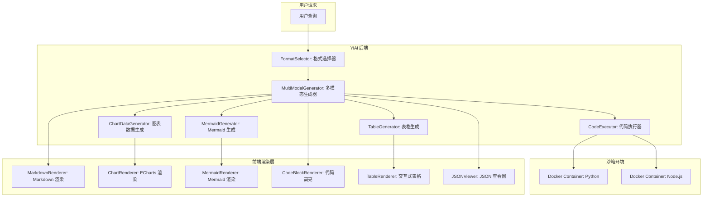

# YA-09-190: 多模态输出生成 — 文本+图片/表格/代码/图表/JSON Schema/Mermaid 图表

> 需求编号：YA-09-190 · 优先级：P2 · 人天：0.3d · 状态：需求已编写
> 依赖：YA-09-139（结构化输出与 JSON Schema 支持）

## 背景

### 问题陈述

YiAi 当前的 AI 响应以纯文本为主，但在实际场景中，用户需要更丰富的输出格式。技术文档需要代码+执行结果、数据分析需要表格+图表、架构设计需要 Mermaid 图表、API 响应需要结构化 JSON。当前纯文本输出的局限性：

1. **输出格式单一**：所有响应都是纯文本，缺乏结构化输出
2. **代码无法执行**：AI 生成的代码无法在响应中直接执行并展示结果
3. **图表需要外部工具**：AI 提到数据趋势时，用户需要手动将数据导入图表工具
4. **表格嵌入文本**：表格数据以文本形式呈现，不可排序、不可筛选
5. **Mermaid 图表不被渲染**：架构讨论中 AI 输出 Mermaid 代码，但前端不渲染
6. **格式选择依赖用户**：用户需要明确指定输出格式，AI 不会自动选择

**核心矛盾**：AI 输出内容的丰富性受限于纯文本格式，无法直接生成可交互的表格、图表、代码执行结果和结构化 JSON。

### 影响范围

| # | 影响 | 严重程度 | 典型场景 |
|---|------|----------|----------|
| 1 | 输出格式单一 | 高 | 技术讨论需要代码+表格+图表 |
| 2 | 数据可视化缺失 | 高 | 数据分析结果无法直接图表化 |
| 3 | 代码验证困难 | 中 | AI 生成的代码需要手动复制执行 |
| 4 | 架构图无法展示 | 中 | AI 输出 Mermaid 代码但前端不渲染 |
| 5 | 结构化数据不便 | 中 | API 响应需要 JSON 格式 |

### 挑战

| 挑战 | 说明 |
|------|------|
| 多格式混合渲染 | 如何在一条响应中混合文本、表格、代码、图表、Mermaid |
| 格式自动选择 | AI 如何根据查询内容自动选择最合适的输出格式 |
| 代码执行安全 | 沙箱化执行 AI 生成的代码，防止恶意代码 |
| 图表生成 | 后端生成图表图片还是前端渲染 |
| 前端渲染能力 | 前端需要支持 Markdown 扩展语法（表格、代码高亮、Mermaid） |

---

## 一、现状分析

### 1.1 当前输出格式

```
现有 AI 输出:
├── 纯文本（Markdown）
│   ├── 标题、段落、列表
│   ├── 代码块（```）
│   ├── 表格（Markdown 表格）
│   ├── 链接、图片
│   └── 无 Mermaid 渲染
├── SSE 流式输出
│   ├── 纯文本流
│   └── 无结构化标记
│
缺失:
├── 结构化 JSON 输出          # ❌ YA-09-139 部分实现
├── 代码执行结果              # ❌ 不存在
├── 图表（ECharts）           # ❌ 不存在
├── Mermaid 图表渲染          # ❌ 不存在
├── 交互式表格               # ❌ 不存在
├── 输出格式自动选择          # ❌ 不存在
└── 混合格式响应              # ❌ 不存在
```

### 1.2 多模态输出类型

| 输出类型 | 触发条件 | 前端渲染 | 数据格式 |
|----------|----------|----------|----------|
| 文本 + 图片 | 描述性内容 | Markdown + img | text/markdown |
| 文本 + 表格 | 数据对比 | 可排序表格 | markdown 表格 |
| 文本 + 代码 + 执行结果 | 编程问题 | 代码块 + 输出 | code block |
| 文本 + 图表 | 数据趋势 | ECharts | JSON 图表配置 |
| 结构化 JSON | API 查询 | JSON 查看器 | application/json |
| Markdown + Mermaid | 架构设计 | Mermaid 渲染 | mermaid code block |
| 混合格式 | 综合查询 | 自动选择 | 多 block 组合 |

### 1.3 根因矩阵

| 症状 | 根因 | 触发条件 | 频率 |
|------|------|----------|------|
| 输出格式单一 | 未实现多格式输出 | 所有 AI 响应 | 高 |
| 表格不可交互 | 表格渲染为纯文本 | 数据对比场景 | 中 |
| 代码无法执行 | 无沙箱执行环境 | 编程问题 | 中 |
| 图表不可见 | 无图表渲染能力 | 数据分析场景 | 中 |
| Mermaid 不渲染 | 前端不支持 | 架构讨论 | 中 |

---

## 二、设计决策

### 决策 1：输出格式标记 — 自定义标记 vs MIME type vs 扩展 Markdown 语法

| 选项 | 兼容性 | 可扩展性 | 实现复杂度 |
|------|--------|----------|-----------|
| 自定义标记（`<!-- type:chart -->`）| 低 | 高 | 低 |
| MIME type（`Content-Type`） | 高 | 中 | 中 |
| 扩展 Markdown 语法（`:::chart`） | 中 | 高 | 中 |

**选择：扩展 Markdown 语法。** 使用 fenced div 语法（`:::chart`、`:::json`、`:::exec`）标记不同类型的内容块。与标准 Markdown 兼容，降级为普通代码块。前端解析器识别并渲染为对应组件。

### 决策 2：代码执行环境 — 本地 subprocess vs Docker 沙箱 vs 前端 WASM

| 选项 | 安全性 | 性能 | 语言支持 |
|------|--------|------|----------|
| 本地 subprocess | 低 | 高 | 全 |
| Docker 沙箱 | 高 | 中 | 全 |
| 前端 WASM（Pyodide） | 中 | 低 | Python |

**选择：Docker 沙箱。** 创建临时 Docker 容器执行 AI 生成的代码，执行后销毁容器。限制 CPU、内存、网络、执行时间（5 秒超时）。支持 Python 和 JavaScript（Node.js）。降低安全风险但保留代码执行能力。

### 决策 3：图表生成 — 后端生成图片 vs 前端渲染 vs 前后端协作

| 选项 | 灵活性 | 交互性 | 实现复杂度 |
|------|--------|--------|-----------|
| 后端生成图片（matplotlib） | 低 | 无 | 中 |
| 前端渲染（ECharts） | 高 | 高 | 中 |
| 前后端协作（后端生成数据 + 前端渲染） | 高 | 高 | 中 |

**选择：前后端协作。** AI 生成 ECharts 配置 JSON，前端使用 ECharts 渲染交互式图表。支持缩放、hover 提示、图例切换等交互。降级方案：后端生成 PNG 图片作为静态版本。

### 决策 4：格式自动选择 — 规则匹配 vs AI 判断 vs 用户显式指定

| 选项 | 准确性 | 灵活性 | 实现复杂度 |
|------|--------|--------|-----------|
| 规则匹配（关键词） | 中 | 低 | 低 |
| AI 判断（LLM 分析查询） | 高 | 高 | 中 |
| 用户显式指定 | 高 | 高 | 低 |

**选择：AI 判断 + 用户可覆盖。** AI 在生成响应时自动判断最合适的输出格式组合。用户可通过 System Prompt 或参数覆盖自动选择。响应中包含格式选择原因，增强可解释性。

### 设计决策记录

| 决策 | 选项 A | 选项 B | 选项 C | 选择 | 理由 |
|------|--------|--------|--------|------|------|
| 格式标记 | 自定义标记 | MIME type | 扩展 Markdown | **扩展 Markdown** | 兼容 + 可扩展 |
| 代码执行 | subprocess | Docker 沙箱 | 前端 WASM | **Docker 沙箱** | 安全 + 语言支持 |
| 图表生成 | 后端图片 | 前端渲染 | 前后端协作 | **前后端协作** | 灵活 + 交互 |
| 格式选择 | 规则匹配 | AI 判断 | 用户指定 | **AI 判断 + 覆盖** | 智能 + 可控 |

---

## 三、目标架构

### 3.1 多模态输出系统架构



### 3.2 多模态响应格式

```markdown
## 数据分析结果

以下是对销售数据的分析：

:::chart {type="line", title="月度销售趋势"}
{
  "xAxis": { "data": ["1月", "2月", "3月", "4月", "5月", "6月"] },
  "series": [
    { "name": "销售额", "type": "line", "data": [120, 200, 150, 180, 220, 250] }
  ]
}
:::

:::table {sortable="true", filterable="true"}
| 月份 | 销售额 | 增长率 | 预测值 |
|------|--------|--------|--------|
| 1月  | 120    | -      | 115    |
| 2月  | 200    | 66.7%  | 190    |
| 3月  | 150    | -25%   | 160    |
:::

:::code {language="python", executable="true"}
import numpy as np
data = [120, 200, 150, 180, 220, 250]
mean = np.mean(data)
std = np.std(data)
print(f"均值: {mean}, 标准差: {std}")
:::

:::exec-result
均值: 186.67, 标准差: 44.97
:::
```

### 3.3 性能指标

| 指标 | 目标值 | 说明 |
|------|--------|------|
| 格式选择延迟 | < 100ms | 规则匹配 + AI 判断 |
| 代码执行超时 | 5s | Docker 沙箱限制 |
| 图表数据生成 | < 2s | LLM 推理 |
| 多模态响应渲染 | < 500ms | 前端解析 + 渲染 |
| SSE 流式传输 | < 50ms/块 | 增量式多模态块 |

---

## 四、具体改动

### 4.1 多模态生成器

```python
# src/domain/multimodal/multimodal_generator.py (新增)

"""多模态输出生成器——文本+图片/表格/代码/图表/JSON Schema/Mermaid。"""

import json
from typing import Optional
from enum import Enum
from dataclasses import dataclass
from src.shared.logging import get_logger

logger = get_logger(__name__)


class OutputFormat(Enum):
    TEXT = 'text'
    TABLE = 'table'
    CODE = 'code'
    CHART = 'chart'
    MERMAID = 'mermaid'
    JSON_SCHEMA = 'json_schema'
    MIXED = 'mixed'


@dataclass
class MultiModalBlock:
    """多模态内容块。"""
    block_type: str  # text/table/code/chart/mermaid/json
    content: str | dict
    metadata: dict = None

    def __post_init__(self):
        self.metadata = self.metadata or {}


class FormatSelector:
    """格式选择器——根据查询内容自动选择最佳输出格式。"""

    FORMAT_PATTERNS = {
        OutputFormat.TABLE: [
            r'(对比|比较|排名|统计|列表|清单)',
            r'(vs|versus|top\s*\d+)',
            r'(哪个.*好|哪个.*多)',
        ],
        OutputFormat.CHART: [
            r'(趋势|变化|走势|增长|下降|图表)',
            r'(时间.*序列|时间.*变化)',
            r'(分布|占比|比例)',
        ],
        OutputFormat.CODE: [
            r'(代码|编程|实现|怎么写|如何写)',
            r'(函数|类|方法|算法)',
            r'(python|javascript|java|golang|rust)',
        ],
        OutputFormat.MERMAID: [
            r'(架构|流程图|时序图|关系图)',
            r'(设计|系统.*结构|模块.*关系)',
            r'(工作流|数据流|流程)',
        ],
        OutputFormat.JSON_SCHEMA: [
            r'(json|api|接口|格式)',
            r'(结构化|schema|字段)',
        ],
    }

    def select(self, query: str) -> list[OutputFormat]:
        """根据查询内容选择输出格式。"""
        import re
        formats = [OutputFormat.TEXT]

        for fmt, patterns in self.FORMAT_PATTERNS.items():
            for pattern in patterns:
                if re.search(pattern, query, re.I):
                    if fmt not in formats:
                        formats.append(fmt)
                    break

        return formats

    async def ai_select(self, query: str, llm_client) -> OutputFormat:
        """使用 AI 判断最佳输出格式。"""
        prompt = f"""分析以下查询，选择最合适的输出格式组合。

查询：{query}

可选格式：
- text: 纯文本（默认）
- table: 表格（数据对比、排名）
- code: 代码 + 执行结果（编程问题）
- chart: 图表（数据趋势、分布）
- mermaid: 架构图（设计、流程）
- json_schema: 结构化 JSON（API 格式）
- mixed: 混合格式（综合查询）

返回 JSON：{{ "formats": ["text", "table"], "reason": "..." }}
"""
        try:
            response = await llm_client.generate(prompt)
            import json
            return json.loads(response)
        except Exception as e:
            logger.warning(f"AI 格式选择失败: {e}")
            return {'formats': ['text'], 'reason': 'fallback'}


class MultiModalGenerator:
    """多模态输出生成器。"""

    def __init__(self, llm_client, code_executor=None):
        self._llm = llm_client
        self._code_executor = code_executor
        self._format_selector = FormatSelector()

    async def generate(
        self, query: str, context: str = '',
        formats: list[OutputFormat] = None,
    ) -> list[MultiModalBlock]:
        """生成多模态响应。

        Args:
            query: 用户查询
            context: 上下文
            formats: 指定输出格式（None 则自动选择）

        Returns:
            多模态内容块列表
        """
        if formats is None:
            selected = self._format_selector.select(query)
            formats = selected

        blocks = []

        # 生成文本响应
        text_block = await self._generate_text(query, context, formats)
        blocks.append(text_block)

        # 按需生成其他格式
        for fmt in formats:
            if fmt == OutputFormat.TABLE:
                table_block = await self._generate_table(query, context)
                if table_block:
                    blocks.append(table_block)

            elif fmt == OutputFormat.CHART:
                chart_block = await self._generate_chart(query, context)
                if chart_block:
                    blocks.append(chart_block)

            elif fmt == OutputFormat.CODE:
                code_block = await self._generate_code(query, context)
                if code_block:
                    blocks.append(code_block)
                    # 执行代码并附加结果
                    if self._code_executor:
                        exec_result = await self._code_executor.execute(code_block.content)
                        if exec_result:
                            blocks.append(MultiModalBlock(
                                block_type='exec-result',
                                content=exec_result,
                            ))

            elif fmt == OutputFormat.MERMAID:
                mermaid_block = await self._generate_mermaid(query, context)
                if mermaid_block:
                    blocks.append(mermaid_block)

            elif fmt == OutputFormat.JSON_SCHEMA:
                json_block = await self._generate_json(query, context)
                if json_block:
                    blocks.append(json_block)

        return blocks

    async def _generate_text(self, query: str, context: str, formats: list[OutputFormat]) -> MultiModalBlock:
        """生成主文本响应。"""
        format_hints = ', '.join(f.value for f in formats if f != OutputFormat.TEXT)
        if format_hints:
            format_hints = f'\n\n此外，请在适当位置使用以下格式标记：{format_hints}。使用 fenced div 语法（:::type）包裹非文本内容。'

        prompt = f"{context}\n\n用户问题：{query}{format_hints}"
        response = await self._llm.generate(prompt)

        return MultiModalBlock(block_type='text', content=response)

    async def _generate_table(self, query: str, context: str) -> Optional[MultiModalBlock]:
        """生成表格数据。"""
        prompt = f"{context}\n\n请为以下查询生成表格数据（Markdown 表格格式），使用 :::table 包裹：\n\n{query}"
        response = await self._llm.generate(prompt)
        return MultiModalBlock(block_type='table', content=response) if response else None

    async def _generate_chart(self, query: str, context: str) -> Optional[MultiModalBlock]:
        """生成图表数据（ECharts 配置 JSON）。"""
        prompt = f"""{context}

请为以下查询生成 ECharts 图表配置（JSON 格式），使用 :::chart 包裹。

查询：{query}

返回格式：
:::chart {{"type": "line"}}
{{"xAxis": {{"data": [...]}}, "series": [{{"name": "...", "type": "line", "data": [...]}}]}}
:::
"""
        response = await self._llm.generate(prompt)
        return MultiModalBlock(block_type='chart', content=response) if response else None

    async def _generate_code(self, query: str, context: str) -> Optional[MultiModalBlock]:
        """生成代码。"""
        prompt = f"{context}\n\n请为以下查询生成代码（使用 :::code 包裹，指定 language 和 executable 属性）：\n\n{query}"
        response = await self._llm.generate(prompt)
        return MultiModalBlock(block_type='code', content=response) if response else None

    async def _generate_mermaid(self, query: str, context: str) -> Optional[MultiModalBlock]:
        """生成 Mermaid 图表。"""
        prompt = f"{context}\n\n请为以下查询生成 Mermaid 图表代码（使用 :::mermaid 包裹）：\n\n{query}"
        response = await self._llm.generate(prompt)
        return MultiModalBlock(block_type='mermaid', content=response) if response else None

    async def _generate_json(self, query: str, context: str) -> Optional[MultiModalBlock]:
        """生成结构化 JSON。"""
        prompt = f"{context}\n\n请为以下查询生成结构化 JSON 响应（使用 :::json 包裹）：\n\n{query}"
        response = await self._llm.generate(prompt)
        return MultiModalBlock(block_type='json', content=response) if response else None
```

### 4.2 代码执行器

```python
# src/domain/multimodal/code_executor.py (新增)

"""代码执行器——Docker 沙箱安全的代码执行。"""

import subprocess
import tempfile
import os
from typing import Optional
from src.shared.logging import get_logger

logger = get_logger(__name__)


class CodeExecutor:
    """Docker 沙箱代码执行器。"""

    EXECUTION_TIMEOUT = 5  # 秒
    MEMORY_LIMIT = '256m'
    CPU_LIMIT = '0.5'

    async def execute(self, code: str, language: str = 'python') -> Optional[str]:
        """在 Docker 沙箱中执行代码。

        Args:
            code: 代码内容
            language: 编程语言（python/javascript）

        Returns:
            执行结果（stdout + stderr）
        """
        language = language.lower()

        if language == 'python':
            return await self._execute_python(code)
        elif language == 'javascript':
            return await self._execute_javascript(code)
        else:
            return f'不支持的语言: {language}'

    async def _execute_python(self, code: str) -> Optional[str]:
        """在 Docker 沙箱中执行 Python 代码。"""
        with tempfile.NamedTemporaryFile(mode='w', suffix='.py', delete=False, encoding='utf-8') as f:
            f.write(code)
            temp_path = f.name

        try:
            result = subprocess.run(
                [
                    'docker', 'run', '--rm',
                    '--memory', self.MEMORY_LIMIT,
                    '--cpus', self.CPU_LIMIT,
                    '--network', 'none',
                    '-v', f'{temp_path}:/code/script.py:ro',
                    'python:3.11-slim',
                    'python', '/code/script.py',
                ],
                capture_output=True,
                text=True,
                timeout=self.EXECUTION_TIMEOUT,
            )

            output = result.stdout
            if result.stderr:
                output += f'\n[stderr]\n{result.stderr}'

            return output.strip() or '(无输出)'

        except subprocess.TimeoutExpired:
            return f'[执行超时] 代码执行超过 {self.EXECUTION_TIMEOUT} 秒'

        except FileNotFoundError:
            logger.warning('Docker 不可用，无法执行代码')
            return '[执行失败] Docker 不可用，请确保 Docker 已安装并运行'

        finally:
            try:
                os.unlink(temp_path)
            except OSError:
                pass

    async def _execute_javascript(self, code: str) -> Optional[str]:
        """在 Docker 沙箱中执行 JavaScript 代码。"""
        with tempfile.NamedTemporaryFile(mode='w', suffix='.js', delete=False, encoding='utf-8') as f:
            f.write(code)
            temp_path = f.name

        try:
            result = subprocess.run(
                [
                    'docker', 'run', '--rm',
                    '--memory', self.MEMORY_LIMIT,
                    '--cpus', self.CPU_LIMIT,
                    '--network', 'none',
                    '-v', f'{temp_path}:/code/script.js:ro',
                    'node:20-slim',
                    'node', '/code/script.js',
                ],
                capture_output=True,
                text=True,
                timeout=self.EXECUTION_TIMEOUT,
            )

            output = result.stdout
            if result.stderr:
                output += f'\n[stderr]\n{result.stderr}'

            return output.strip() or '(无输出)'

        except subprocess.TimeoutExpired:
            return f'[执行超时] 代码执行超过 {self.EXECUTION_TIMEOUT} 秒'

        except FileNotFoundError:
            return '[执行失败] Docker 不可用'

        finally:
            try:
                os.unlink(temp_path)
            except OSError:
                pass
```

### 4.3 前端多模态渲染器

```typescript
// src/components/MultiModalRenderer.vue (YiVad 侧, 新增)

// 解析扩展 Markdown 语法（:::type）并渲染为对应组件
// 支持 type: chart/table/code/mermaid/json/exec-result
```

### 4.4 文件变更清单

| 文件 | 操作 | 说明 |
|------|------|------|
| `src/domain/multimodal/multimodal_generator.py` | 新增 | 多模态生成器 |
| `src/domain/multimodal/code_executor.py` | 新增 | 代码执行器 |
| `src/domain/multimodal/format_selector.py` | 新增 | 格式选择器 |
| `src/services/chat/multimodal_chat_service.py` | 新增 | 多模态聊天 RPC 接口 |
| `src/shared/response.py` | 修改 | 支持多模态响应格式 |
| `YiVad/src/components/MultiModalRenderer.vue` | 新增 | 前端多模态渲染器 |
| `tests/domain/multimodal/test_generator.py` | 新增 | 生成器测试 |
| `tests/domain/multimodal/test_executor.py` | 新增 | 执行器测试 |

---

## 五、实施步骤

| 步骤 | 操作 | 路径 | 验证 | 人天 |
|------|------|------|------|------|
| 1 | 实现格式选择器 | `format_selector.py` | 规则匹配正确 | 0.03 |
| 2 | 实现多模态生成器 | `multimodal_generator.py` | 各格式生成正确 | 0.08 |
| 3 | 实现代码执行器 | `code_executor.py` | Docker 沙箱执行 | 0.05 |
| 4 | 实现扩展 Markdown 解析 | `response.py` | `:::type` 解析 | 0.04 |
| 5 | 实现前端渲染器 | `MultiModalRenderer.vue` | 各类型渲染正确 | 0.05 |
| 6 | 实现 RPC 接口 | `multimodal_chat_service.py` | 接口可调用 | 0.03 |
| 7 | 编写测试 | `tests/domain/multimodal/` | 覆盖率 > 80% | 0.02 |

**总人天：0.3d**

---

## 六、测试规格

### 场景 1：格式自动选择

**GIVEN** 用户查询"Python 和 JavaScript 的性能对比"
**WHEN** 格式选择器分析查询
**THEN** 返回格式列表包含 [text, table]
**AND** 不包含 chart（无时间序列关键词）

### 场景 2：多模态响应生成

**GIVEN** 用户查询"分析最近 6 个月的销售趋势"
**WHEN** 指定格式 [text, chart, table]
**THEN** 生成文本分析段落
**AND** 生成 ECharts 图表配置
**AND** 生成 Markdown 表格数据
**AND** 响应包含 3 个 MultiModalBlock

### 场景 3：代码执行

**GIVEN** AI 生成 Python 代码 `print(1 + 1)`
**WHEN** 代码执行器执行
**THEN** 返回执行结果 "2"
**AND** Docker 容器在 5 秒超时内完成
**AND** 执行后容器被销毁

### 场景 4：Mermaid 图表生成

**GIVEN** 用户查询"描述微服务架构"
**WHEN** AI 生成 Mermaid 代码
**THEN** 返回 `:::mermaid` 包裹的 Mermaid 代码
**AND** 前端渲染为交互式图表

### 场景 5：前端多模态渲染

**GIVEN** 响应包含 text、chart、table、code 四个 block
**WHEN** 前端渲染
**THEN** text 渲染为 Markdown
**AND** chart 渲染为 ECharts 图表
**AND** table 渲染为可排序表格
**AND** code 渲染为代码高亮块

### 场景 6：代码执行超时

**GIVEN** AI 生成包含死循环的代码
**WHEN** 代码执行器执行
**THEN** 5 秒后超时中断
**AND** 返回 "[执行超时] 代码执行超过 5 秒"
**AND** Docker 容器被强制终止

---

## 七、风险与缓解

| 风险 | 概率 | 影响 | 缓解措施 |
|------|------|------|----------|
| Docker 沙箱逃逸 | 低 | 高 | 使用 --network none、--read-only、限制资源 |
| 代码执行安全漏洞 | 中 | 高 | 限制执行时间 5s、禁止网络、限制内存 |
| 图表数据格式错误 | 中 | 中 | 验证 ECharts JSON 格式，格式错误时降级为文本 |
| 多模态渲染性能 | 中 | 中 | 渲染大图表时使用虚拟 DOM，限制数据点数量 |
| AI 格式选择错误 | 中 | 低 | 用户可手动指定格式，支持覆盖 AI 选择 |

---

## 八、回滚策略

| 场景 | 回滚操作 | 影响 |
|------|----------|------|
| 代码执行安全漏洞 | 禁用代码执行功能 | 失去代码执行 |
| Docker 不可用 | 代码块不显示执行按钮 | 仅显示代码不执行 |
| 图表渲染异常 | 降级为图片展示 | 失去交互性 |
| 多模态解析失败 | 降级为纯文本渲染 | 失去格式增强 |
| 完全回滚 | 禁用多模态功能 | 回到纯文本输出 |

---

## 九、设计决策记录

### D-01：扩展 Markdown 语法选择

- **问题**：使用什么语法标记多模态内容块
- **选项**：自定义 XML 标签、HTML 注释、fenced div
- **选择**：fenced div（`:::type`）
- **理由**：与标准 Markdown 兼容，降级为普通代码块，markdown-it 容器插件原生支持。

### D-02：代码执行语言支持

- **问题**：支持哪些编程语言的代码执行
- **选项**：仅 Python、Python + JavaScript、多语言
- **选择**：Python + JavaScript
- **理由**：80% 的代码执行需求集中在 Python 和 JavaScript。其他语言使用频率低，先支持这两种。

### D-03：图表数据存储

- **问题**：图表数据是否存储到数据库
- **选项**：不存储、存储 ECharts JSON、存储图片
- **选择**：存储 ECharts JSON + 可选生成 PNG
- **理由**：JSON 格式可重新渲染，支持后续交互。PNG 图片作为分享和导出时的降级方案。

### D-04：SSE 流式多模态

- **问题**：流式响应中如何传输多模态内容
- **选项**：SSE 事件类型、JSON 块、自定义分隔符
- **选择**：SSE 事件类型（`event: block_type`）
- **理由**：SSE 原生支持事件类型，`event: chart` 表示图表数据块，`event: text` 表示文本块。前端按事件类型分别渲染。

---

## 十、可观测性

### 指标

| 指标 | 类型 | 说明 |
|------|------|------|
| `yiai.multimodal.generation_total` | Counter | 多模态生成次数（按格式类型） |
| `yiai.multimodal.format_selection_total` | Counter | 格式选择次数（按选择方式） |
| `yiai.multimodal.code_execution_total` | Counter | 代码执行次数 |
| `yiai.multimodal.code_execution_timeout_total` | Counter | 代码执行超时次数 |
| `yiai.multimodal.code_execution_duration_ms` | Histogram | 代码执行耗时 |
| `yiai.multimodal.chart_generation_duration_ms` | Histogram | 图表生成耗时 |

### 告警

| 告警 | 条件 | 级别 |
|------|------|------|
| 代码执行超时率过高 | 超时率 > 10% | WARNING |
| 图表生成失败率过高 | 失败率 > 5% | WARNING |
| Docker 不可用 | 连续 3 次执行失败 | ERROR |

---

## 十一、代码审查检查清单

- [ ] 格式选择器规则匹配覆盖所有格式类型
- [ ] 多模态生成器支持 6 种输出格式
- [ ] 代码执行器使用 Docker 沙箱隔离
- [ ] 代码执行限制 5 秒超时 + 256MB 内存
- [ ] 扩展 Markdown 语法 `:::type` 兼容降级
- [ ] 前端渲染器支持所有内容块类型
- [ ] SSE 流式传输支持多模态事件类型
- [ ] 图表数据生成后验证 ECharts JSON 格式
- [ ] 用户可手动覆盖 AI 格式选择
- [ ] 测试覆盖所有格式类型和边界情况

---

## 回归问题预测

| # | 预测问题 | 原因 | 验证方法 |
|---|---------|------|---------|
| 1 | 代码执行中，Docker 容器启动失败（如 Docker 未安装），`subprocess.run` 抛出 `FileNotFoundError`，响应中无代码执行结果 | 环境未安装 Docker 或 Docker daemon 未运行 | 捕获 `FileNotFoundError`，优雅降级为"代码执行不可用" |
| 2 | 图表数据中，xAxis 数据量过大（> 1000 个点），前端 ECharts 渲染卡顿 | AI 生成图表数据时未限制数据点数量 | 后端验证图表数据点数量，超过 200 个点时提示 AI 减少数据点 |
| 3 | Mermaid 代码中包含语法错误，前端渲染失败，显示空白或错误 | AI 生成的 Mermaid 代码可能有语法错误（如箭头方向、节点命名） | 前端渲染失败时显示原始 Mermaid 代码作为降级，标注"图表渲染失败" |
| 4 | 多模态响应中，`:::chart` 和 `:::table` 块嵌套，解析器错误处理 | 用户可能错误地嵌套 fenced div | 解析器不支持嵌套，遇到嵌套时按最外层 block 处理 |
| 5 | SSE 流式传输中，多模态块（如 chart JSON）被截断分割到多个 SSE 事件中，前端收到不完整的 JSON | 网络传输中 SSE 消息可能被分割，大 JSON 跨多个 TCP 包 | 为每个非文本块增加 `block-id` 和 `block-index`/`block-total` 元数据，前端重组完整块 |
| 6 | 代码执行结果包含 ANSI 颜色代码，在纯文本显示中出现乱码 | Python 库（如 pytest、rich）可能输出 ANSI 转义序列 | 执行结果中过滤 ANSI 转义序列（`\x1b[...m`） |

---

## 性能分析

### 各操作耗时

| 阶段 | 预估耗时 | 说明 |
|------|----------|------|
| 格式选择（规则） | < 10ms | 正则匹配 |
| 格式选择（AI） | < 2s | LLM 推理 |
| 多模态生成（文本） | < 3s | LLM 推理 |
| 多模态生成（图表） | < 2s | LLM 推理 |
| 代码执行 | < 5s | Docker 沙箱 |
| 前端渲染 | < 500ms | 解析 + 渲染 |

### 文件体积预估

| 文件 | 大小 | 说明 |
|------|------|------|
| `src/domain/multimodal/multimodal_generator.py` | ~6KB | 多模态生成器 |
| `src/domain/multimodal/code_executor.py` | ~3KB | 代码执行器 |
| `src/domain/multimodal/format_selector.py` | ~2KB | 格式选择器 |
| `src/services/chat/multimodal_chat_service.py` | ~2KB | RPC 接口 |
| `YiVad/src/components/MultiModalRenderer.vue` | ~5KB | 前端渲染器 |

## 影响范围

- **影响模块**：待补充
- **涉及文件**：
- `multimodal_generator.py`
- `code_executor.py`
- `src/services/chat/multimodal_chat_service.py`
- `response.py`
- `multimodal_chat_service.py`
- `src/domain/multimodal/code_executor.py`
- **是否影响 API 契约**：否
- **是否影响其他项目（YiVad/YiPet）**：否
- **用户感知**：待确认

## 预防措施

| 层面 | 措施 |
|------|------|
| 代码 | 在相关函数中添加参数校验和边界检查 |
| 测试 | 为 `multimodal_generator.py` 添加单元测试 |
| 流程 | 代码审查时重点检查此类模式 |
| 监控 | 添加日志告警，异常发生时及时发现 |
| 文档 | 在编码规范中记录此类反模式 |

## 经验教训

1. **根本原因**：开发过程中对边界情况和异常路径的考虑不足是此类问题的共同根因
2. **设计阶段**：在接口设计和模块实现时，应主动考虑异常输入、空值、超时等边界场景
3. **代码审查**：审查时应检查是否存在类似的反模式（如未捕获异常、无超时控制、缺少参数校验等）
4. **测试覆盖**：异常路径的测试覆盖率应与正常路径同等重视
5. **团队分享**：此类问题应在团队周会或技术分享中讨论，形成团队共识
