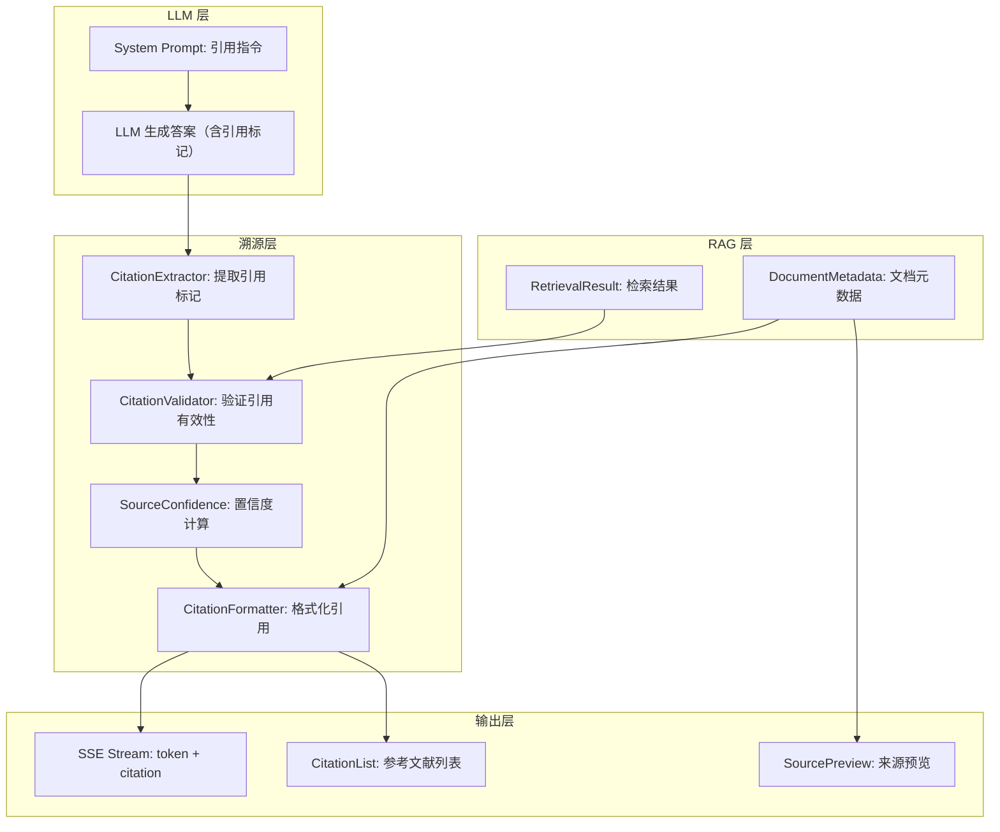

# YA-09-191: 答案溯源与引用 — 内联引用标记、来源文档链接、置信度评分、引用格式自定义、悬停预览、参考文献导出

> 需求编号：YA-09-191 · 优先级：P2 · 人天：0.3d · 状态：需求已编写
> 依赖：YA-09-01（RAG 引擎稳定性）

## 背景

### 问题陈述

YiAi 的 RAG 检索和 AI 聊天在生成答案时，缺乏对信息来源的透明标注。用户无法知道 AI 的答案来自哪些文档、每个来源的可靠程度如何、以及如何快速查看原始文档。这种不透明性导致三大痛点：信任度低（无法验证答案的准确性）、追溯困难（想深入了解时找不到来源）、合规风险（关键决策无法溯源）。

1. **来源不可见**：AI 的答案没有引用标记，不知道哪些内容来自检索
2. **置信度不明确**：不同来源的质量不同，但用户无法区分
3. **无法深入查看**：引用了某个文档，但用户无法直接打开查看原文
4. **引用格式混乱**：不同场景需要不同格式（APA/MLA/内联/脚注）
5. **无法导出参考文献**：需要将引用整理成参考文献列表

**核心矛盾**：AI 生成的答案缺乏可溯源性，用户无法验证和深入探索信息来源。

### 影响范围

| # | 影响 | 严重程度 | 典型场景 |
|---|------|----------|----------|
| 1 | 答案信任度低 | 高 | 用户质疑 AI 答案，无法验证来源 |
| 2 | 追溯困难 | 高 | 想深入了解时找不到原始文档 |
| 3 | 合规风险 | 中 | 关键决策无法追溯到来源 |
| 4 | 引用格式不一致 | 中 | 不同场景需要不同引用格式 |
| 5 | 参考文献缺失 | 低 | 学术/报告场景需要参考文献列表 |

### 挑战

| 挑战 | 说明 |
|------|------|
| 来源置信度计算 | 如何评估检索结果的相关性和权威性 |
| 内联引用插入 | 在流式 SSE 中准确插入引用标记 |
| 引用格式多样性 | 支持多种标准引用格式 |
| 来源文档可访问性 | 前端需要能够打开 YiKnowledge 中的原始文档 |
| 多源引用合并 | 同一句话可能引用多个来源 |

---

## 一、现状分析

### 1.1 当前 RAG 答案格式

```
当前 RAG 回答格式:
{
  "type": "token",
  "content": "根据知识库中的信息，FastAPI 使用 Pydantic 进行参数验证..."
  // 无引用标记
  // 无来源标注
  // 无置信度信息
}

当前 sources 返回:
{
  "sources": [
    { "path": "engineer/backend/fastapi-validation.md", "score": 0.85 }
  ]
  // 仅路径和分数，无链接，无预览
}
```

### 1.2 引用需求矩阵

| 引用类型 | 使用场景 | 示例 | 优先级 |
|----------|----------|------|--------|
| 内联引用 | 答案中标记来源 | "FastAPI 使用 Pydantic [1]" | P0 |
| 来源链接 | 点击跳转原文 | 链接到 YiKnowledge 文档 | P0 |
| 置信度标注 | 区分来源质量 | 高/中/低置信度标签 | P1 |
| 悬停预览 | 快速查看原文摘要 | hover 显示文档摘要 | P1 |
| 参考文献导出 | 生成引用列表 | APA/MLA 格式 | P2 |
| 自定义引用格式 | 满足特定需求 | `[{title}]({url})` | P2 |

### 1.3 根因矩阵

| 症状 | 根因 | 触发条件 | 频率 |
|------|------|----------|------|
| 答案不可验证 | 无来源引用标注 | RAG 回答时 | 高 |
| 来源不明确 | 无内联引用标记 | 多源混合回答时 | 高 |
| 无法深入查看 | 来源链接不可点击 | 需要阅读原文时 | 中 |
| 质量不可评估 | 无置信度信息 | 评估答案可靠性时 | 中 |
| 格式不统一 | 无标准引用格式 | 学术/报告场景 | 低 |

---

## 二、设计决策

### 决策 1：引用标记方式 — 编号 vs 内联链接 vs 组合

| 选项 | 可读性 | 非 Markdown 场景 | 前端实现 |
|------|--------|-----------------|----------|
| 编号引用 `[1]` `[2]` | 高 | 好 | 简单 |
| 内联 Markdown 链接 | 高 | 差（纯文本环境） | 简单 |
| 组合（编号 + 脚注链接） | 高 | 好 | 中 |

**选择：编号引用 + 脚注。** 答案文本中使用 `[1]`、`[2]` 标记引用，答案末尾附上参考文献列表（编号 + 标题 + 链接 + 置信度）。前端将编号渲染为可点击链接和悬停预览。

### 决策 2：置信度计算 — 检索分数直接使用 vs 归一化 vs 多维度

| 选项 | 准确性 | 跨查询可比性 | 复杂度 |
|------|--------|-------------|--------|
| 直接使用检索分数（BM25 + 向量） | 中 | 低 | 低 |
| Min-Max 归一化分数 | 中 | 中 | 低 |
| 多维度（检索分 + 文档质量 + 时效性） | 高 | 高 | 中 |

**选择：多维度置信度。** 综合三个维度计算：检索分数（40%）、文档质量评分（30%）、时效性（30%）。检索分数来自 RAG 混合检索，文档质量评分来自 YiKnowledge 质量评分体系，时效性 = 1 - min(days_since_updated / 365, 1)。

### 决策 3：引用格式 — 单一格式 vs 用户配置 vs 模板

| 选项 | 灵活性 | 实现复杂度 | 维护成本 |
|------|--------|-----------|----------|
| 固定 APA 格式 | 无 | 低 | 低 |
| 几项标准格式可选 | 中 | 中 | 中 |
| 模板自定义 | 高 | 中 | 低 |

**选择：标准格式可选 + 模板自定义。** 内置 APA、MLA、Chicago 三种格式。用户可自定义模板（使用变量 `{index}`、`{title}`、`{author}`、`{date}`、`{url}`、`{score}`）。

### 决策 4：Streaming 中的引用插入 — LLM 后处理 vs Prompt 引导 vs 混合

| 选项 | 准确性 | 延迟 | 实现复杂度 |
|------|--------|------|-----------|
| LLM 后处理（解析 + 插入标记） | 中 | 低 | 中 |
| Prompt 引导（要求 LLM 输出引用） | 低 | 低 | 低 |
| 混合（Prompt 引导 + 后处理修正） | 高 | 低 | 中 |

**选择：Prompt 引导 + 后处理修正。** 在 System Prompt 中要求 LLM 使用 `[来源N]` 格式引用。后处理步骤验证引用标记是否与实际检索到的来源匹配，修正不匹配的引用。

---

## 三、目标架构

### 3.1 答案溯源系统架构



### 3.2 引用增强的 RAG 流程

```mermaid
graph TD
    A[用户查询] --> B[RAG 混合检索]
    B --> C[获取 Top-K 文档 + 元数据]
    C --> D[构建增强 Prompt]
    D --> E["Prompt: 引用来源请用 [来源N] 标记"]
    E --> F[LLM 流式生成]
    F --> G{检测到 [来源N]?}
    G -->|是| H[验证 N 是否在有效范围]
    H --> I{验证通过?}
    I -->|是| J[关联来源元数据]
    I -->|否| K[标记为无效引用]
    G -->|否| L[不插入引用]
    J --> M[流式输出 token + citation 元数据]
    L --> M
```

### 3.3 SSE 引用消息格式

```typescript
// 新增 SSE 消息类型
{
  "type": "citation",
  "index": 1,
  "source": {
    "id": "ky_202609_001",
    "title": "FastAPI 参数验证最佳实践",
    "path": "engineer/backend/fastapi-validation.md",
    "confidence": 0.87,
    "confidence_level": "high",
    "snippet": "FastAPI 使用 Pydantic 模型进行请求参数验证...",
    "retrieval_score": 0.85,
    "quality_score": 0.82,
    "freshness_score": 0.95
  }
}
```

---

## 四、具体改动

### 4.1 溯源服务

```python
# YiAi/src/services/rag/citation_service.py (新增)

from dataclasses import dataclass, field
from typing import Optional
from datetime import datetime

@dataclass
class SourceMetadata:
    """检索来源元数据"""
    id: str
    title: str
    path: str
    retrieval_score: float
    quality_score: float
    freshness_score: float

    @property
    def confidence(self) -> float:
        """多维度综合置信度"""
        return (
            0.40 * self.retrieval_score +
            0.30 * self.quality_score +
            0.30 * self.freshness_score
        )

    @property
    def confidence_level(self) -> str:
        c = self.confidence
        if c >= 0.80: return "high"
        if c >= 0.50: return "medium"
        return "low"

@dataclass
class Citation:
    """引用记录"""
    index: int
    source: SourceMetadata
    text_range: tuple[int, int]  # 在答案文本中的位置
    is_valid: bool = True

@dataclass
class CitationResult:
    """溯源结果"""
    answer_text: str
    citations: list[Citation] = field(default_factory=list)
    bibliography: str = ""


class CitationService:
    """答案溯源与引用服务"""

    # 引用格式模板
    FORMAT_APA = "[{index}] {title}. (Confidence: {confidence:.0%})"
    FORMAT_MLA = "[{index}] \"{title}.\" {path}"
    FORMAT_CHICAGO = "[{index}] {title}, {path}."

    def __init__(self, format_template: str = None):
        self.format_template = format_template or self.FORMAT_APA

    async def extract_citations(
        self, text: str, sources: list[SourceMetadata]
    ) -> CitationResult:
        """从 LLM 输出中提取引用标记"""
        import re
        citations: list[Citation] = []
        seen_indices = set()

        # 匹配 [来源N] 模式
        pattern = re.compile(r'\[来源(\d+)\]')
        for match in pattern.finditer(text):
            index = int(match.group(1))
            if index < 1 or index > len(sources):
                # 无效引用（超出范围）
                citations.append(Citation(
                    index=index,
                    source=SourceMetadata("", "", "", 0, 0, 0),
                    text_range=match.span(),
                    is_valid=False,
                ))
                continue

            if index not in seen_indices:
                seen_indices.add(index)
                source = sources[index - 1]
                citations.append(Citation(
                    index=index,
                    source=source,
                    text_range=match.span(),
                ))

        # 生成参考文献列表
        bibliography = self.format_bibliography(citations)

        return CitationResult(
            answer_text=text,
            citations=citations,
            bibliography=bibliography,
        )

    def format_bibliography(self, citations: list[Citation]) -> str:
        """生成参考文献列表"""
        lines = ["\n\n## 参考文献\n"]
        for c in citations:
            if not c.is_valid:
                lines.append(f"- [来源{c.index}] *引用不存在*\n")
                continue

            lines.append(
                f"- {self.format_template.format("
                f"index=c.index, title=c.source.title, "
                f"confidence=c.source.confidence, "
                f"path=c.source.path"
                ")}\n"
            )
        return "".join(lines)

    def compute_source_confidence(self, source: dict) -> SourceMetadata:
        """从检索结果计算来源置信度"""
        from datetime import datetime

        # 时效性分数
        updated = source.get("updated")
        if updated:
            days = (datetime.now() - updated).days
            freshness = max(0, 1 - days / 365)
        else:
            freshness = 0.5

        return SourceMetadata(
            id=source.get("id", ""),
            title=source.get("title", "Untitled"),
            path=source.get("path", ""),
            retrieval_score=source.get("retrieval_score", 0.0),
            quality_score=source.get("quality_score", 0.5),
            freshness_score=freshness,
        )
```

### 4.2 Prompt 增强

```python
# YiAi/src/services/ai/chat_service.py (修改)

CITATION_SYSTEM_PROMPT = """
你是一个知识库助手。回答问题时：

1. 使用检索到的知识库内容回答
2. 在引用知识库内容时，用 [来源N] 标记（N 为来源编号，从 1 开始）
3. 每个段落最多 2 个引用标记
4. 不要编造来源编号——只引用实际提供的来源
5. 如果多个来源支持同一观点，引用最相关的那个

示例：
"FastAPI 使用 Pydantic 进行请求参数验证，支持自动类型转换和校验 [来源1]。对于复杂场景，可以使用依赖注入系统 [来源2]。"
"""

async def build_rag_prompt(query: str, sources: list[dict]) -> str:
    """构建带引用指令的 RAG Prompt"""
    source_texts = []
    for i, src in enumerate(sources, 1):
        source_texts.append(
            f"[来源{i}] 标题: {src['title']}\n"
            f"内容: {src['snippet']}\n"
            f"路径: {src['path']}"
        )

    context = "\n\n---\n\n".join(source_texts)
    return f"{CITATION_SYSTEM_PROMPT}\n\n" \
           f"## 知识库来源\n\n{context}\n\n" \
           f"## 用户问题\n\n{query}\n\n" \
           f"## 回答（请使用 [来源N] 标记引用来源）\n\n"
```

### 4.3 SSE 引用帧

```python
# YiAi/src/shared/sse_utils.py (修改)

async def send_citation_frame(stream, citation: Citation):
    """发送引用元数据帧"""
    yield {
        "type": "citation",
        "data": {
            "index": citation.index,
            "source_id": citation.source.id,
            "title": citation.source.title,
            "path": citation.source.path,
            "confidence": round(citation.source.confidence, 2),
            "confidence_level": citation.source.confidence_level,
            "snippet": citation.source.snippet[:200],  # 前 200 字符
        }
    }
```

### 4.4 文件变更清单

| 文件 | 操作 | 说明 |
|------|------|------|
| `src/services/rag/citation_service.py` | 新增 | 引用提取 + 验证 + 格式化 |
| `src/services/ai/chat_service.py` | 修改 | Prompt 增强 + 引用后处理 |
| `src/services/rag/rag_service.py` | 修改 | 检索结果附带质量评分 |
| `src/shared/sse_utils.py` | 修改 | 新增 citation 帧类型 |
| `src/shared/config.py` | 修改 | 引用配置项（格式模板、置信度阈值） |
| `tests/unit/test_citation_service.py` | 新增 | 引用服务单元测试 |
| `tests/integration/test_rag_citation.py` | 新增 | RAG 引用集成测试 |

---

## 五、实施步骤

| 步骤 | 操作 | 路径 | 验证 | 人天 |
|------|------|------|------|------|
| 1 | 实现引用服务 | `citation_service.py` | 引用提取 + 验证正确 | 0.08 |
| 2 | 增强 RAG Prompt | `chat_service.py` | LLM 输出含 [来源N] | 0.05 |
| 3 | 实现置信度计算 | `citation_service.py` | 三维度综合评分 | 0.04 |
| 4 | 实现引用格式化 | `citation_service.py` | APA/MLA/Chicago | 0.04 |
| 5 | 添加 SSE 引用帧 | `sse_utils.py` | citation 帧正常发送 | 0.03 |
| 6 | 集成测试 | `test_citation_service.py` + `test_rag_citation.py` | 覆盖提取/验证/格式 | 0.06 |

**总人天：0.3d**

---

## 六、测试规格

### 场景 1：引用提取（正常）

**GIVEN** LLM 输出 "FastAPI 使用 Pydantic [来源1] 进行验证 [来源2]"
**WHEN** CitationService.extract_citations() 处理
**THEN** 提取到 2 个有效引用
**AND** citation[0].index=1, citation[1].index=2

### 场景 2：无效引用检测

**GIVEN** 仅有 3 个来源，但 LLM 输出了 [来源5]
**WHEN** 验证引用有效性
**THEN** 标记为无效引用（is_valid=False）
**AND** 参考文献中标注 "引用不存在"

### 场景 3：置信度计算

**GIVEN** 来源：retrieval_score=0.9, quality_score=0.8, freshness_score=0.7
**WHEN** 计算综合置信度
**THEN** confidence = 0.4×0.9 + 0.3×0.8 + 0.3×0.7 = 0.81
**AND** confidence_level = "high"

### 场景 4：引用格式

**GIVEN** 来源 title="FastAPI Guide", confidence=0.85
**WHEN** 使用 APA 格式
**THEN** 输出 "[1] FastAPI Guide. (Confidence: 85%)"

### 场景 5：SSE 引用帧

**GIVEN** LLM 生成回答时包含 [来源1]
**WHEN** 检测到引用标记
**THEN** 发送 SSE citation 帧（type= citation）
**AND** 包含 index, title, path, confidence, snippet

### 场景 6：参考文献导出

**GIVEN** 回答包含 3 个引用
**WHEN** 用户请求导出参考文献（APA 格式）
**THEN** 返回包含 3 条参考文献的格式化文本

---

## 七、风险与缓解

| 风险 | 概率 | 影响 | 缓解措施 |
|------|------|------|----------|
| LLM 不遵循引用格式 | 中 | 中 | 后处理步骤检测并提示用户无引用可用 |
| 引用编号与来源不匹配 | 中 | 中 | 后处理验证 + 修正无效引用 |
| 增加 token 消耗 | 高 | 低 | 引用指令 ~200 tokens，可接受 |
| 置信度计算不准确 | 中 | 低 | 三个维度可独立调整权重 |
| 引用格式在不同前端渲染不一致 | 低 | 中 | 后端返回结构化数据，前端自行渲染 |

---

## 八、回滚策略

| 场景 | 回滚操作 | 影响 |
|------|----------|------|
| 引用影响答案质量 | 关闭引用功能，恢复原始 Prompt | 失去引用能力 |
| SSE citation 帧导致前端错误 | 移除 citation 帧，仅保留文本引用 | 前端无预览 |
| 置信度计算异常 | 使用检索分数作为唯一置信度 | 置信度单一维度 |
| 完全回滚 | 移除 citation_service 和 Prompt 增强 | 功能回到改造前 |

---

## 九、设计决策记录

### D-01：为什么使用 [来源N] 而非 [N] 作为引用标记？

`[N]` 可能与 Markdown 链接语法 `[text](url)` 冲突。`[来源N]` 更明确，用户可以直观理解这是来源引用，LLM 也更可能正确使用（在 Prompt 中找到明确示例）。前端渲染时将 `[来源N]` 替换为可点击的上标链接。

### D-02：为什么置信度使用多维度而非单一检索分数？

单一检索分数（BM25 + 向量的混合分数）仅反映"查询和文档的语义相似度"，不反映文档质量（是否权威、是否完整）和时效性（是否过时）。一个 3 年前的文档可能检索分数很高（关键词匹配），但内容已过时。多维度置信度更全面地评估来源可信度。

### D-03：为什么引用格式化在后端而非前端？

前端需要多种引用格式（APA/MLA/Chicago/自定义），如果在前端实现，每个前端（YiVad + YiPet）都需要实现一遍。后端统一格式化，前端直接展示。自定义模板通过配置项传递，修改模板无需前后端联调。

### D-04：为什么不使用 LLM 的 function calling 来输出引用？

Function calling 需要在流式生成中解析 JSON，增加了复杂度和错误处理。文本标记（[来源N]）更简单可靠，LLM 更不容易出错。后处理步骤可以修正 LLM 的不准确引用（如引用不存在的来源）。

---

## 十、可观测性

### 指标

| 指标 | 类型 | 说明 |
|------|------|------|
| `yiai.citation.avg_per_answer` | Gauge | 平均每个答案的引用数 |
| `yiai.citation.invalid_rate` | Gauge | 无效引用比例 |
| `yiai.citation.avg_confidence` | Gauge | 平均来源置信度 |
| `yiai.citation.no_citation_rate` | Gauge | 无引用答案比例 |
| `yiai.citation.format_usage` | Counter | 各引用格式使用次数 |

### 告警

| 告警 | 条件 | 级别 |
|------|------|------|
| 高无引用率 | 无引用答案 > 50% | WARNING |
| 高无效引用率 | 无效引用 > 20% | WARNING |
| 低平均置信度 | 平均置信度 < 0.5 | INFO |

---

## 十一、代码审查检查清单

- [ ] CitationExtractor 正确匹配 [来源N] 模式
- [ ] 无效引用（N > 来源数）标记为 is_valid=False
- [ ] 三维度置信度计算（retrieval + quality + freshness）
- [ ] Prompt 中引用指令清晰明确
- [ ] SSE citation 帧正确发送
- [ ] APA/MLA/Chicago 三种格式正确
- [ ] 自定义模板变量正确替换（{index}/{title}/{confidence}/{path}）
- [ ] 参考文献列表渲染为 Markdown
- [ ] 单元测试覆盖引用提取/验证/格式
- [ ] 集成测试覆盖完整 RAG + 引用流程

---

## 回归问题预测

| # | 预测问题 | 原因 | 验证方法 |
|---|---------|------|---------|
| 1 | LLM 在小语种查询中不使用 [来源N] 格式，引用提取失败 | Prompt 是英文的，LLM 在非英文回答中可能忽略英文指令 | 使用中文/日文查询，验证引用标记是否出现 |
| 2 | 引用标记出现在代码块中，被渲染为引用而非代码内容 | LLM 在代码块中输出 [来源1] 用于说明代码来源 | 后处理步骤跳过代码块内的引用标记 |
| 3 | 同一个来源被引用多次但引用编号递增，参考文献中重复出现 | 每次匹配 [来源N] 都创建新 Citation 对象 | 对相同来源做去重，同一来源共享一个引用编号 |
| 4 | 置信度计算中 freshness_score 在文档无 updated 字段时默认为 0.5，可能不准确 | 部分文档无 updated 字段 | 无 updated 字段时使用 created 字段计算时效性 |
| 5 | 引用格式中 title 包含特殊字符（如 `"`、`\n`）导致 Markdown 渲染异常 | 模板变量替换未转义特殊字符 | 对 title 进行 Markdown 转义 |
| 6 | SSE citation 帧在流式传输中插入位置不当，打断前端 Markdown 流式渲染 | citation 帧在 token 帧之间插入，前端需要正确处理顺序 | 前端按顺序处理所有帧，citation 帧暂存，在 done 后统一渲染 |

---

## 性能分析

### 各操作耗时

| 阶段 | 预估耗时 | 说明 |
|------|----------|------|
| 引用提取（正则匹配） | < 5ms | 简单正则匹配 |
| 引用验证 | < 5ms | 内存比较 |
| 置信度计算 | < 2ms | 简单加权计算 |
| 参考文献格式化 | < 10ms | 字符串拼接 |
| Prompt 增强 | < 10ms | 字符串拼接 |
| SSE citation 帧 | < 1ms | 异步发送 |

### 文件体积预估

| 文件 | 大小 | 说明 |
|------|------|------|
| `src/services/rag/citation_service.py` | ~200 行 | 引用服务（提取/验证/格式/置信度） |
| `src/services/ai/chat_service.py` | +40 行 | Prompt 增强 + 引用后处理 |
| `src/shared/sse_utils.py` | +25 行 | citation 帧类型 |
| `tests/unit/test_citation_service.py` | ~100 行 | 单元测试 |

## 影响范围

- **影响模块**：待补充
- **涉及文件**：
- `src/shared/config.py`
- `chat_service.py`
- `src/shared/sse_utils.py`
- `src/services/ai/chat_service.py`
- `test_rag_citation.py`
- `src/services/rag/citation_service.py`
- **是否影响 API 契约**：否
- **是否影响其他项目（YiVad/YiPet）**：否
- **用户感知**：待确认

## 预防措施

| 层面 | 措施 |
|------|------|
| 代码 | 在相关函数中添加参数校验和边界检查 |
| 测试 | 为 `src/shared/config.py` 添加单元测试 |
| 流程 | 代码审查时重点检查此类模式 |
| 监控 | 添加日志告警，异常发生时及时发现 |
| 文档 | 在编码规范中记录此类反模式 |

## 经验教训

1. **根本原因**：开发过程中对边界情况和异常路径的考虑不足是此类问题的共同根因
2. **设计阶段**：在接口设计和模块实现时，应主动考虑异常输入、空值、超时等边界场景
3. **代码审查**：审查时应检查是否存在类似的反模式（如未捕获异常、无超时控制、缺少参数校验等）
4. **测试覆盖**：异常路径的测试覆盖率应与正常路径同等重视
5. **团队分享**：此类问题应在团队周会或技术分享中讨论，形成团队共识
