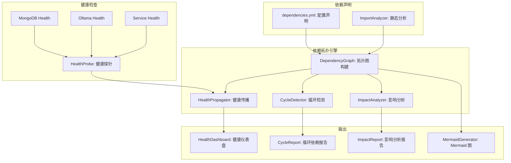
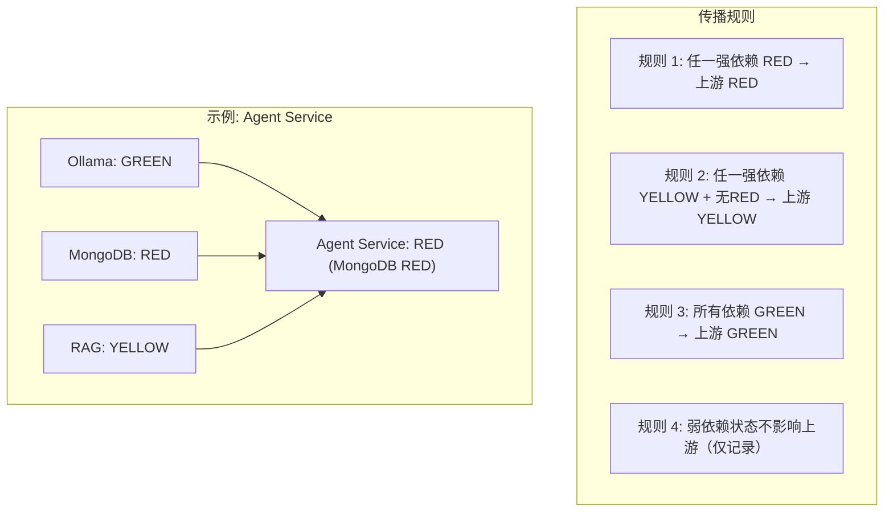

# YA-09-192: 服务依赖拓扑图 — 依赖关系可视化、健康状态传播、依赖健康评分、循环依赖检测、影响分析、拓扑图导出

> 需求编号：YA-09-192 · 优先级：P2 · 人天：0.3d · 状态：需求已编写
> 依赖：YA-09-16（服务健康检查与就绪探针）

## 背景

### 问题陈述

YiAi 作为 YrY 单体仓库的唯一后端，依赖 4 个外部服务（MongoDB、Ollama、llama_index、apscheduler）和多个内部模块（Domain 层、Service 层、Shared 层）。当某个依赖故障时，开发者和运维人员难以快速判断影响范围。当前缺乏服务依赖的可视化拓扑，故障排查依赖经验和个人记忆：

1. **依赖关系不可见**：不知道哪个服务依赖哪个服务，故障影响范围不可知
2. **健康状态不传播**：子依赖故障后，上级服务的健康状态不自动更新
3. **循环依赖不可检测**：可能存在的模块循环依赖无法自动发现
4. **影响分析困难**：当需要升级或关闭某个服务时，不知道会影响哪些服务
5. **拓扑结构无文档**：依赖关系依赖开发者记忆和代码阅读，无可视化文档

**核心矛盾**：服务依赖关系是系统架构的核心知识，但当前仅存在于代码和开发者记忆中，缺乏可视化、可查询的依赖拓扑。

### 影响范围

| # | 影响 | 严重程度 | 典型场景 |
|---|------|----------|----------|
| 1 | 故障排查效率低 | 高 | MongoDB 故障后不知道哪些 API 受影响 |
| 2 | 变更影响未知 | 高 | 升级 Ollama 前不确定影响范围 |
| 3 | 架构认知门槛高 | 中 | 新人需要阅读大量代码才能理解依赖关系 |
| 4 | 循环依赖隐患 | 中 | 隐式循环依赖导致启动顺序问题 |
| 5 | 无拓扑文档 | 中 | 依赖关系需要手动维护文档 |

### 挑战

| 挑战 | 说明 |
|------|------|
| 依赖发现 | 自动发现 vs 手动声明服务依赖关系 |
| 健康状态传播 | 下游故障如何影响上游健康状态的计算规则 |
| 循环依赖检测 | 静态分析 import 还是运行时检测 |
| 拓扑可视化 | 使用什么方式渲染（Mermaid/ECharts/D3.js） |
| 实时性 | 健康状态更新频率与系统开销的平衡 |

---

## 一、现状分析

### 1.1 当前依赖管理现状

```
当前依赖关系管理:
├── 代码中的 import 语句（隐式依赖）
├── CLAUDE.md 架构文档（文本描述）
├── 开发者个人记忆
└── 故障时的 ad-hoc 排查

缺失:
├── 依赖关系显式声明
├── 依赖拓扑可视化
├── 健康状态自动传播
├── 循环依赖自动检测
├── 变更影响自动分析
└── 拓扑图导出
```

### 1.2 YiAi 核心依赖关系

| 服务 | 依赖 | 依赖类型 | 故障影响 |
|------|------|----------|----------|
| `chat_service` | Ollama + MongoDB | 强依赖 | 聊天功能完全不可用 |
| `rag_service` | Ollama + MongoDB + llama_index | 强依赖 | RAG 检索不可用 |
| `agent_service` | Ollama + MongoDB + RAG + Knowledge Watcher | 强依赖 | Agent 循环不可用 |
| `data_service` | MongoDB | 强依赖 | CRUD 操作不可用 |
| `knowledge_service` | Knowledge Watcher + MongoDB | 弱依赖 | 知识同步延迟 |
| `audit_service` | MongoDB | 弱依赖 | 审计日志丢失 |
| `code_health_service` | 文件系统 | 强依赖 | 代码分析不可用 |

### 1.3 根因矩阵

| 症状 | 根因 | 触发条件 | 频率 |
|------|------|----------|------|
| 故障排查效率低 | 无依赖拓扑可视化 | 外部服务故障时 | 中 |
| 变更影响未知 | 无自动影响分析 | 升级/重启依赖时 | 中 |
| 架构认知门槛高 | 依赖关系隐式 | 新人接手时 | 中 |
| 循环依赖隐患 | 无自动检测 | 模块重构时 | 低 |
| 文档维护成本高 | 依赖关系无自动同步 | 架构变更时 | 高 |

---

## 二、设计决策

### 决策 1：依赖声明方式 — 代码注解 vs 配置文件 vs 自动发现

| 选项 | 准确性 | 维护成本 | 灵活性 |
|------|--------|----------|--------|
| 代码注解（装饰器） | 高 | 中 | 高 |
| 配置文件（YAML/JSON） | 高 | 低 | 高 |
| 自动发现（静态分析 import） | 中 | 极低 | 低 |

**选择：配置文件 + 自动发现补充。** 核心依赖关系通过 YAML 配置显式声明，Python 文件间的 import 关系通过静态分析自动生成。配置文件是"权威数据源"，自动发现用于验证和补充。

### 决策 2：健康状态传播 — 二元健康 vs 多级健康 vs 加权传播

| 选项 | 精细度 | 计算复杂度 | 误报率 |
|------|--------|-----------|--------|
| 二元（健康/不健康） | 低 | 低 | 高 |
| 多级（绿/黄/红） | 中 | 低 | 中 |
| 加权传播（0-100 数字） | 高 | 中 | 低 |

**选择：多级健康状态传播。** 健康（green）、降级（yellow/partial）、不可用（red/down）。传播规则：任一强依赖为 red → 上游为 red；任一强依赖为 yellow 且无 red → 上游为 yellow；所有依赖为 green → 上游为 green。

### 决策 3：拓扑可视化 — 服务端生成图片 vs 前端渲染 vs 导出 Mermaid

| 选项 | 交互性 | 可嵌入性 | 实现复杂度 |
|------|--------|----------|-----------|
| 服务端生成 PNG/SVG | 低 | 高 | 中 |
| 前端 ECharts/D3.js | 高 | 低 | 中 |
| 导出 Mermaid 代码 | 中 | 高 | 低 |

**选择：后端生成 Mermaid + 前端渲染。** 后端生成 Mermaid 图代码，前端使用 mermaid.js 渲染为可交互图表。同时支持导出为 SVG/PNG。Mermaid 代码可嵌入 Markdown 文档。

### 决策 4：循环依赖检测 — 构建时 vs 启动时 vs 按需

| 选项 | 及时性 | 性能影响 | 覆盖范围 |
|------|--------|----------|----------|
| 构建时（CI） | 最早 | 无运行时影响 | 全部 |
| 启动时 | 中 | 增加启动时间 | 运行时 |
| 按需（API 调用时） | 晚 | 无 | API 调用时 |

**选择：启动时 + 按需。** 启动时检测并记录 WARNING 日志。按需 API（`GET /dependency/cycles`）返回所有循环依赖。CI 中可集成静态分析（`import-linter`）。

---

## 三、目标架构

### 3.1 服务依赖拓扑系统架构



### 3.2 健康状态传播规则



### 3.3 依赖健康评分

```
服务健康评分 = 自身健康 × 0.3 + 依赖健康均值 × 0.7

自身健康: 健康检查响应 (0/1)
依赖健康均值: 所有强依赖健康评分的平均值

评分 ≥ 0.8 → GREEN
0.5 ≤ 评分 < 0.8 → YELLOW
评分 < 0.5 → RED
```

---

## 四、具体改动

### 4.1 依赖配置文件

```yaml
# YiAi/config/dependencies.yml (新增)

services:
  chat_service:
    name: "AI Chat Service"
    description: "SSE 流式聊天服务"
    dependencies:
      - name: ollama
        type: strong
        description: "LLM 推理引擎"
        health_endpoint: "http://localhost:11434/api/tags"
      - name: mongodb
        type: strong
        description: "会话/消息持久化"

  rag_service:
    name: "RAG Retrieval Service"
    dependencies:
      - name: ollama
        type: strong
        description: "Embedding 模型"
      - name: mongodb
        type: strong
        description: "文档元数据 + 向量索引"
      - name: llama_index
        type: strong
        description: "混合检索框架"

  agent_service:
    name: "Agent Loop Service"
    dependencies:
      - name: ollama
        type: strong
      - name: mongodb
        type: strong
      - name: rag_service
        type: strong
        description: "RAG 检索结果作为上下文"

  data_service:
    name: "Data CRUD Service"
    dependencies:
      - name: mongodb
        type: strong

  knowledge_service:
    name: "Knowledge Sync Service"
    dependencies:
      - name: knowledge_watcher
        type: strong
      - name: mongodb
        type: weak
        description: "同步延迟可接受"

  audit_service:
    name: "Audit Log Service"
    dependencies:
      - name: mongodb
        type: weak
        description: "审计日志异步写入"

external_services:
  mongodb:
    name: "MongoDB"
    health_endpoint: null  # 通过 Motor ping 检查
    health_check: "mongodb_ping"

  ollama:
    name: "Ollama"
    health_endpoint: "http://localhost:11434/api/tags"
    health_check: "http_get"

  llama_index:
    name: "llama_index"
    health_check: "import_check"
```

### 4.2 依赖拓扑引擎

```python
# YiAi/src/domain/dependency/topology.py (新增)

from dataclasses import dataclass, field
from enum import Enum
from typing import Optional
import yaml
from collections import defaultdict, deque

class HealthStatus(Enum):
    GREEN = "green"
    YELLOW = "yellow"
    RED = "red"
    UNKNOWN = "unknown"

class DependencyType(Enum):
    STRONG = "strong"
    WEAK = "weak"

@dataclass
class ServiceNode:
    name: str
    display_name: str
    description: str = ""
    dependencies: list["DependencyEdge"] = field(default_factory=list)
    dependents: list[str] = field(default_factory=list)
    health: HealthStatus = HealthStatus.UNKNOWN
    health_score: float = 0.0

@dataclass
class DependencyEdge:
    source: str
    target: str
    dep_type: DependencyType
    description: str = ""

@dataclass
class CycleInfo:
    services: list[str]
    path: str  # "A → B → C → A"

@dataclass
class ImpactAnalysis:
    service: str
    direct_impact: list[str]
    indirect_impact: list[str]
    affected_apis: list[str]


class DependencyGraph:
    """服务依赖拓扑图"""

    def __init__(self, config_path: str = "config/dependencies.yml"):
        self.nodes: dict[str, ServiceNode] = {}
        self._load_config(config_path)

    def _load_config(self, config_path: str):
        with open(config_path) as f:
            config = yaml.safe_load(f)

        # 加载外部服务节点
        for name, svc in config.get("external_services", {}).items():
            self.nodes[name] = ServiceNode(
                name=name, display_name=svc["name"])

        # 加载服务节点和依赖边
        for name, svc in config.get("services", {}).items():
            node = ServiceNode(
                name=name,
                display_name=svc["name"],
                description=svc.get("description", ""),
            )
            for dep in svc.get("dependencies", []):
                edge = DependencyEdge(
                    source=name,
                    target=dep["name"],
                    dep_type=DependencyType(dep["type"]),
                    description=dep.get("description", ""),
                )
                node.dependencies.append(edge)

                # 反向记录 dependents
                if dep["name"] not in self.nodes:
                    self.nodes[dep["name"]] = ServiceNode(
                        name=dep["name"], display_name=dep["name"])
                self.nodes[dep["name"]].dependents.append(name)

            self.nodes[name] = node

    def propagate_health(self, health_data: dict[str, HealthStatus]):
        """传播健康状态"""
        # 设置外部服务健康状态
        for name, status in health_data.items():
            if name in self.nodes:
                self.nodes[name].health = status

        # 拓扑排序后传播
        order = self._topological_sort()
        for name in reversed(order):
            node = self.nodes.get(name)
            if not node or not node.dependencies:
                continue

            strong_deps = [d for d in node.dependencies
                          if d.dep_type == DependencyType.STRONG]
            dep_statuses = [
                self.nodes[d.target].health for d in strong_deps
                if d.target in self.nodes
            ]

            if not dep_statuses:
                continue

            if any(s == HealthStatus.RED for s in dep_statuses):
                node.health = HealthStatus.RED
            elif any(s == HealthStatus.YELLOW for s in dep_statuses):
                node.health = HealthStatus.YELLOW
            else:
                node.health = HealthStatus.GREEN

            # 计算健康评分
            scores = [1.0 if s == HealthStatus.GREEN else
                      0.5 if s == HealthStatus.YELLOW else 0.0
                      for s in dep_statuses]
            dep_avg = sum(scores) / len(scores)
            self_score = 1.0 if node.health == HealthStatus.GREEN else \
                         0.5 if node.health == HealthStatus.YELLOW else 0.0
            node.health_score = self_score * 0.3 + dep_avg * 0.7

    def detect_cycles(self) -> list[CycleInfo]:
        """检测循环依赖（DFS + 路径记录）"""
        cycles: list[CycleInfo] = []
        visited = set()
        rec_stack = set()
        path: list[str] = []

        def dfs(node_name: str):
            if node_name in rec_stack:
                cycle_start = path.index(node_name)
                cycle = path[cycle_start:] + [node_name]
                cycles.append(CycleInfo(
                    services=cycle[:-1],
                    path=" → ".join(cycle),
                ))
                return
            if node_name in visited or node_name not in self.nodes:
                return

            visited.add(node_name)
            rec_stack.add(node_name)
            path.append(node_name)

            for dep in self.nodes[node_name].dependencies:
                dfs(dep.target)

            path.pop()
            rec_stack.discard(node_name)

        for name in self.nodes:
            if name not in visited:
                dfs(name)

        return cycles

    def analyze_impact(self, service_name: str) -> ImpactAnalysis:
        """分析某个服务故障的影响范围"""
        direct = []
        indirect = set()

        # 直接依赖方（谁直接依赖我）
        if service_name in self.nodes:
            direct = self.nodes[service_name].dependents[:]

        # 间接依赖方（BFS 向上传播）
        queue = deque(direct)
        while queue:
            current = queue.popleft()
            if current in self.nodes:
                for dep in self.nodes[current].dependents:
                    if dep not in indirect and dep not in direct:
                        indirect.add(dep)
                        queue.append(dep)

        return ImpactAnalysis(
            service=service_name,
            direct_impact=direct,
            indirect_impact=list(indirect),
            affected_apis=[],  # 需要从 API 注册信息中填充
        )

    def _topological_sort(self) -> list[str]:
        """拓扑排序（Kahn's algorithm）"""
        in_degree = defaultdict(int)
        for node in self.nodes.values():
            for dep in node.dependencies:
                in_degree[dep.target] += 1

        queue = deque([n for n in self.nodes if in_degree[n] == 0])
        result = []

        while queue:
            node = queue.popleft()
            result.append(node)
            for dep in self.nodes[node].dependencies:
                in_degree[dep.target] -= 1
                if in_degree[dep.target] == 0:
                    queue.append(dep.target)

        return result

    def to_mermaid(self) -> str:
        """生成 Mermaid 图代码"""
        lines = ["graph TD"]
        status_style = {
            HealthStatus.GREEN: "fill:#d4edda,stroke:#28a745",
            HealthStatus.YELLOW: "fill:#fff3cd,stroke:#ffc107",
            HealthStatus.RED: "fill:#f8d7da,stroke:#dc3545",
            HealthStatus.UNKNOWN: "fill:#e2e3e5,stroke:#6c757d",
        }

        for name, node in self.nodes.items():
            style = status_style.get(node.health, status_style[HealthStatus.UNKNOWN])
            lines.append(f"    {name}[\"{node.display_name}\"]")
            lines.append(f"    style {name} {style}")

        for name, node in self.nodes.items():
            for dep in node.dependencies:
                style = "stroke-dasharray: 5 5;" if dep.dep_type == DependencyType.WEAK else ""
                lines.append(f"    {name} -->|{dep.dep_type.value}| {dep.target}")

        return "\n".join(lines)
```

### 4.3 文件变更清单

| 文件 | 操作 | 说明 |
|------|------|------|
| `config/dependencies.yml` | 新增 | 服务依赖声明配置 |
| `src/domain/dependency/__init__.py` | 新增 | 模块初始化 |
| `src/domain/dependency/topology.py` | 新增 | 依赖拓扑引擎 |
| `src/services/dependency_service.py` | 新增 | 依赖服务 API |
| `src/server/routes/dependency_routes.py` | 新增 | 依赖 API 端点 |
| `src/server/rpc_router.py` | 修改 | 注册 dependency 模块 |
| `tests/unit/test_topology.py` | 新增 | 拓扑引擎测试 |
| `tests/integration/test_dependency_api.py` | 新增 | API 集成测试 |

---

## 五、实施步骤

| 步骤 | 操作 | 路径 | 验证 | 人天 |
|------|------|------|------|------|
| 1 | 编写依赖声明配置 | `config/dependencies.yml` | YAML 格式正确 | 0.03 |
| 2 | 实现拓扑引擎 | `topology.py` | 拓扑排序 + 循环检测 | 0.08 |
| 3 | 实现健康状态传播 | `topology.py` propagate_health | Green→Yellow→Red 正确 | 0.05 |
| 4 | 实现影响分析 | `topology.py` analyze_impact | 1-hop + N-hop 正确 | 0.04 |
| 5 | 实现 Mermaid 导出 | `topology.py` to_mermaid | 图表渲染正确 | 0.03 |
| 6 | 实现 API 端点 | `dependency_routes.py` | GET 拓扑/健康/循环/影响 | 0.04 |
| 7 | 编写测试 | `test_topology.py` + `test_dependency_api.py` | 覆盖核心逻辑 | 0.03 |

**总人天：0.3d**

---

## 六、测试规格

### 场景 1：依赖拓扑图

**GIVEN** 服务依赖配置已加载
**WHEN** 请求 `/dependency/topology`
**THEN** 返回所有服务节点和依赖边
**AND** 返回 Mermaid 图代码

### 场景 2：健康状态传播

**GIVEN** MongoDB 状态为 RED，Ollama 状态为 GREEN
**WHEN** 执行健康状态传播
**THEN** `data_service` → RED（强依赖 MongoDB）
**AND** `chat_service` → RED（强依赖 MongoDB）
**AND** `audit_service` → YELLOW（弱依赖 MongoDB）

### 场景 3：循环依赖检测

**GIVEN** `A → B → C → A` 循环依赖
**WHEN** 调用 detect_cycles()
**THEN** 返回 1 个循环：`A → B → C → A`

### 场景 4：影响分析

**GIVEN** MongoDB 服务
**WHEN** 分析 MongoDB 故障影响
**THEN** 直接受影响：`data_service`, `chat_service`, `rag_service`, `agent_service`
**AND** 间接受影响：`agent_service` 的用户（通过 `chat_service`）

### 场景 5：Mermaid 导出

**GIVEN** 依赖拓扑图已构建
**WHEN** 调用 to_mermaid()
**THEN** 返回有效的 Mermaid 图代码
**AND** 每个节点的健康状态用颜色区分

### 场景 6：拓扑排序

**GIVEN** 服务依赖 DAG
**WHEN** 执行拓扑排序
**THEN** 返回合理的启动顺序（依赖在前，依赖方在后）

---

## 七、风险与缓解

| 风险 | 概率 | 影响 | 缓解措施 |
|------|------|------|----------|
| 配置文件与实际代码不一致 | 中 | 中 | 静态分析 import 补充 + CI 校验 |
| 大依赖图渲染慢 | 低 | 低 | 支持子图过滤（仅强依赖/仅某服务） |
| 循环依赖导致拓扑排序失败 | 中 | 中 | 检测并报告循环，不阻断拓扑构建 |
| 健康状态更新开销 | 低 | 低 | 健康状态缓存 30s，避免频繁检查 |

---

## 八、回滚策略

| 场景 | 回滚操作 | 影响 |
|------|----------|------|
| 配置格式错误 | 修正 YAML 格式 | 服务重启即可 |
| 拓扑图渲染异常 | 返回 JSON 数据（降级为非可视化） | 失去可视化 |
| 健康传播误报 | 调整阈值（YELLOW 阈值提高） | 告警减少 |
| 完全回滚 | 移除 dependency 模块 | 功能回到改造前 |

---

## 九、设计决策记录

### D-01：为什么选择配置文件而非自动发现？

自动发现（静态分析 import 语句）可以发现 Python 模块间的依赖，但无法区分"强依赖"和"弱依赖"——例如 `audit_service` 弱依赖 MongoDB（异步写入失败不影响主流程），但 import 分析只会显示依赖存在。配置文件允许开发者显式声明依赖类型和描述，提供更准确的语义信息。

### D-02：为什么健康状态传播中弱依赖不影响上游？

弱依赖（如审计日志依赖 MongoDB）的故障不应导致主服务标记为不可用。如果审计日志写入失败但聊天功能正常，`chat_service` 不应该是 RED。弱依赖仅在健康仪表盘中标记，不参与健康传播。

### D-03：为什么使用 Mermaid 而非 ECharts/D3.js？

Mermaid 是 Markdown 原生支持的图表语言，生成的代码可直接嵌入到 YiKnowledge、CLAUDE.md 和 GitHub 中。不需要前端渲染库，降低依赖。对于需要交互的场景（如点击节点查看详情），前端可使用 mermaid.js 渲染并添加事件监听。

### D-04：为什么健康评分使用加权公式（自身 30% + 依赖 70%）？

服务的可用性更多取决于其依赖的可用性（70%），而非自身代码的可用性（30%）。因为 YiAi 的服务层代码是薄层（主要是路由和编排），核心逻辑在 Domain 层和外部依赖中。如果某个服务自身代码有问题但依赖正常，影响范围有限。

---

## 十、可观测性

### 指标

| 指标 | 类型 | 说明 |
|------|------|------|
| `yiai.dependency.total_services` | Gauge | 服务总数 |
| `yiai.dependency.healthy_services` | Gauge | 健康服务数 |
| `yiai.dependency.degraded_services` | Gauge | 降级服务数 |
| `yiai.dependency.down_services` | Gauge | 不可用服务数 |
| `yiai.dependency.cycle_count` | Gauge | 循环依赖数 |
| `yiai.dependency.avg_deps_per_service` | Gauge | 平均每个服务的依赖数 |

### 告警

| 告警 | 条件 | 级别 |
|------|------|------|
| 服务不可用 | 任一核心服务为 RED | CRITICAL |
| 服务降级 | 任一核心服务为 YELLOW | WARNING |
| 循环依赖 | cycle_count > 0 | WARNING |
| 高扇出依赖 | 单服务依赖 > 5 个强依赖 | INFO |

---

## 十一、代码审查检查清单

- [ ] 依赖配置文件 YAML 格式正确
- [ ] 拓扑排序算法正确（Kahn 算法）
- [ ] 循环检测正确（DFS + 路径记录）
- [ ] 健康传播规则：强依赖 RED → 上游 RED
- [ ] 健康传播规则：弱依赖不影响上游
- [ ] 影响分析覆盖直接 + 间接（BFS 传播）
- [ ] Mermaid 导出格式正确
- [ ] API 端点在 rpc_router 中注册
- [ ] 单元测试覆盖拓扑构建/排序/检测/传播
- [ ] 集成测试覆盖完整 API

---

## 回归问题预测

| # | 预测问题 | 原因 | 验证方法 |
|---|---------|------|---------|
| 1 | 配置文件中的服务名称与代码中的 module_name 不一致 | 手动维护的配置文件与代码实际路径脱节 | CI 中对比配置中的名称与 services/ 目录下的模块名称 |
| 2 | 外部服务（Ollama/MongoDB）健康检查超时导致依赖拓扑中所有服务标记为 RED | 健康检查超时被解释为服务不可用 | 健康检查设置合理超时（3s），连接超时与业务不可用区分 |
| 3 | 循环依赖检测在大型依赖图中性能差（O(V+E) × V） | DFS 对每个节点执行一次，大型图可能耗时 | 缓存检测结果，仅在依赖配置变更时重新检测 |
| 4 | Mermaid 导出的图中弱依赖虚线在某些渲染器中不显示 | 不同的 Mermaid 渲染器对虚线支持不一致 | 为弱依赖添加额外的视觉标记（如 `|weak|` 标签） |
| 5 | 拓扑排序在存在循环依赖时失败，但循环检测应先于排序执行 | 循环依赖破坏 DAG 结构，Kahn 算法无法处理 | 排序前先检测循环，如有循环则排除循环中的一条边后排序 |
| 6 | 健康传播中外部服务的健康状态缓存过期，但缓存未刷新 | 外部服务健康检查每 30s 一次，缓存可能滞后 | 在健康传播时检查缓存时间，超过 60s 强制刷新 |

---

## 性能分析

### 各操作耗时

| 阶段 | 预估耗时 | 说明 |
|------|----------|------|
| 配置加载 + 拓扑构建 | < 10ms | YAML 解析 + 图构建 |
| 拓扑排序 | < 5ms | Kahn 算法 |
| 循环检测 | < 10ms | DFS × V 节点 |
| 健康传播 | < 50ms | 含对外部服务的健康检查 |
| 影响分析 | < 10ms | BFS 传播 |
| Mermaid 导出 | < 5ms | 字符串拼接 |

### 文件体积预估

| 文件 | 大小 | 说明 |
|------|------|------|
| `config/dependencies.yml` | ~1KB | 依赖声明 |
| `src/domain/dependency/topology.py` | ~250 行 | 拓扑引擎 |
| `src/services/dependency_service.py` | ~100 行 | API 服务 |
| `src/server/routes/dependency_routes.py` | ~60 行 | API 端点 |
| `tests/unit/test_topology.py` | ~120 行 | 单元测试 |

## 影响范围

- **影响模块**：待补充
- **涉及文件**：
- `src/services/dependency_service.py`
- `test_topology.py`
- `src/server/routes/dependency_routes.py`
- `test_dependency_api.py`
- `src/server/rpc_router.py`
- `topology.py`
- **是否影响 API 契约**：否
- **是否影响其他项目（YiVad/YiPet）**：否
- **用户感知**：待确认

## 预防措施

| 层面 | 措施 |
|------|------|
| 代码 | 在相关函数中添加参数校验和边界检查 |
| 测试 | 为 `src/services/dependency_service.py` 添加单元测试 |
| 流程 | 代码审查时重点检查此类模式 |
| 监控 | 添加日志告警，异常发生时及时发现 |
| 文档 | 在编码规范中记录此类反模式 |

## 经验教训

1. **根本原因**：开发过程中对边界情况和异常路径的考虑不足是此类问题的共同根因
2. **设计阶段**：在接口设计和模块实现时，应主动考虑异常输入、空值、超时等边界场景
3. **代码审查**：审查时应检查是否存在类似的反模式（如未捕获异常、无超时控制、缺少参数校验等）
4. **测试覆盖**：异常路径的测试覆盖率应与正常路径同等重视
5. **团队分享**：此类问题应在团队周会或技术分享中讨论，形成团队共识
