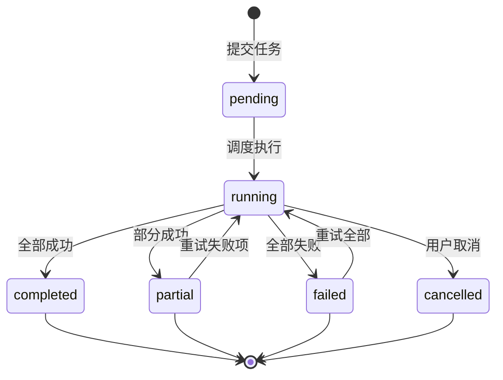
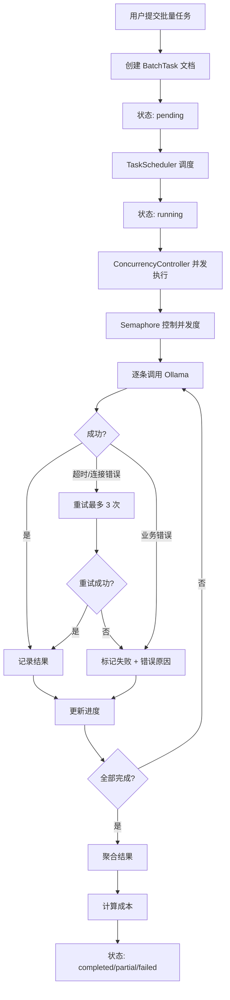

# YA-09-193: 批量推理与离线处理 — 批量 LLM 推理、任务提交与进度、并发控制、结果聚合、成本估算、任务调度、历史与重试

> 需求编号：YA-09-193 · 优先级：P2 · 人天：0.3d · 状态：需求已编写
> 依赖：YA-09-03（Agent 可靠性 — asyncio.timeout 超时保护）、YA-09-12（API 限流与并发控制）

## 背景

### 问题陈述

YiAi 当前仅支持实时推理（同步请求-响应或 SSE 流式），无法处理批量推理场景。当用户需要处理大量数据时——如对 100 个 Issue 进行分类、对 500 个文档生成摘要、对 1000 条评论进行情感分析——只能逐条调用 API，效率极低且无法追踪整体进度：

1. **逐条调用效率低**：100 条数据的处理需要串行调用 100 次，耗时 = 单次耗时 × 100
2. **进度不可追踪**：不知道当前处理了多少条、成功多少条、失败多少条
3. **并发不可控**：没有并发控制机制，可能过载 Ollama 服务
4. **成本不可估算**：不知道批量任务消耗了多少 token，成本不可知
5. **失败无法重试**：中途失败的任务需要手动重新提交

**核心矛盾**：批量数据处理是常见需求，但 YiAi 缺乏批量推理能力，用户被迫手动逐条处理或使用外部工具。

### 影响范围

| # | 影响 | 严重程度 | 典型场景 |
|---|------|----------|----------|
| 1 | 批量处理效率低 | 高 | 对 100+ Issue 自动分类 |
| 2 | 进度不可见 | 高 | 批量任务运行中不知还剩多少 |
| 3 | 并发不可控 | 高 | 无限制并发导致 Ollama 过载 |
| 4 | 成本不可知 | 中 | 批量任务 token 消耗未知 |
| 5 | 失败无法恢复 | 中 | 批量任务中途失败需重新开始 |

### 挑战

| 挑战 | 说明 |
|------|------|
| Ollama 并发限制 | Ollama 默认单模型并发有限，批量子任务需控制并发度 |
| 任务持久化 | 任务状态需持久化到 MongoDB，支持服务重启后恢复 |
| 进度反馈 | 前端如何实时获取任务进度（轮询 vs WebSocket vs SSE）|
| 失败重试策略 | 哪些失败可重试、重试次数和间隔 |
| 成本计算 | 如何估算 Ollama token 消耗和成本 |

---

## 一、现状分析

### 1.1 当前批量处理现状

```
当前批量处理流程:
用户有 100 个 Issue 需要分类
  │ 手动逐条调用 chat_service.chat
  ▼
每次调用: 发送 Issue 内容 → 等待 LLM 响应 → 解析分类结果
  │ 串行处理，100 次调用
  ▼
手动记录结果
  │ Excel/Notion 中记录分类结果
  ▼
处理过程中无进度反馈
  │ 不知道已处理多少条
  ▼
某条失败需要重新调用
  │ 记住是第几条失败
  总耗时: 100 × 3s = 300s (5 分钟)
```

### 1.2 批量推理场景矩阵

| 场景 | 数据量 | 单条耗时 | 并发需求 | 优先级 |
|------|--------|----------|----------|--------|
| Issue 自动分类 | 10-200 | ~2s | 是 | 高 |
| 文档摘要生成 | 50-500 | ~3s | 是 | 高 |
| 评论情感分析 | 100-1000 | ~1s | 是 | 中 |
| 代码审查批量 | 10-50 | ~5s | 否 | 中 |
| 翻译批量 | 50-200 | ~2s | 是 | 中 |

### 1.3 根因矩阵

| 症状 | 根因 | 触发条件 | 频率 |
|------|------|----------|------|
| 处理效率低 | 无批量并发机制 | 数据量 > 10 条时 | 高 |
| 进度不可见 | 无任务进度追踪 | 批量任务运行中 | 高 |
| 并发不可控 | 无限流和并发控制 | 用户同时提交多个请求 | 中 |
| 成本不可知 | 无 token 统计 | 需要评估成本时 | 中 |
| 失败无法恢复 | 无任务持久化和重试 | 网络故障/服务重启 | 中 |

---

## 二、设计决策

### 决策 1：批量任务架构 — 同步批量 vs 异步任务 vs 消息队列

| 选项 | 延迟 | 可靠性 | 实现复杂度 |
|------|------|--------|-----------|
| 同步批量（一次请求处理全部） | 高（超时风险） | 低 | 低 |
| 异步任务（提交 → 轮询状态） | 中 | 中 | 中 |
| 消息队列（Celery/RQ） | 中 | 高 | 高 |

**选择：异步任务（自实现轻量任务管理）。** 用户提交批量任务 → 返回 task_id → 后台异步执行 → 前端轮询进度。不引入消息队列（Celery/RQ），使用 asyncio + MongoDB 持久化任务状态。YiAi 当前规模不需要消息队列。

### 决策 2：并发控制 — 固定并发数 vs 自适应并发 vs 用户指定

| 选项 | 资源利用 | 安全性 | 灵活性 |
|------|----------|--------|--------|
| 固定并发数（默认 3） | 中 | 高 | 低 |
| 自适应（根据 Ollama 负载） | 高 | 中 | 中 |
| 用户指定（1-10） | 中 | 低（用户可能过高） | 高 |

**选择：用户指定 + 系统上限。** 用户创建批量任务时可指定并发数（1-5），系统硬限制最大 5。默认并发数为 3。Ollama 默认的并发能力有限，保持低并发避免超时。

### 决策 3：进度反馈 — 轮询 vs WebSocket vs SSE

| 选项 | 实时性 | 实现复杂度 | 兼容性 |
|------|--------|-----------|--------|
| 轮询（前端每 2s 查询） | 低 | 低 | 高 |
| WebSocket | 高 | 中 | 中 |
| SSE（服务端推送） | 高 | 低 | 高 |

**选择：轮询 + SSE 可选。** 默认前端每 2 秒轮询任务状态（`GET /batch-task/{id}/status`）。长任务可选择 SSE 订阅进度更新。轮询简单可靠，SSE 用于需要实时反馈的场景。

### 决策 4：重试策略 — 不重试 vs 全部重试 vs 仅超时重试

| 选项 | 可靠性 | 资源浪费 | 适用场景 |
|------|--------|----------|----------|
| 不重试 | 低 | 无 | — |
| 全部重试（失败即重试） | 中 | 高 | 瞬时故障 |
| 仅超时重试 + 业务错误不重试 | 高 | 低 | 大多数场景 |

**选择：仅超时重试 + 业务错误不重试。** 超时（asyncio.TimeoutError）和连接错误（ConnectionError）自动重试最多 3 次，间隔 1s/2s/4s。业务错误（LLM 返回格式不正确、内容审核不通过）不重试，直接标记为失败。

---

## 三、目标架构

### 3.1 批量推理系统架构

```mermaid
graph TD
    subgraph "API 层"
        A1[POST /batch-task/submit: 提交任务]
        A2[GET /batch-task/{id}/status: 查询状态]
        A3[GET /batch-task/{id}/results: 获取结果]
        A4[POST /batch-task/{id}/retry-failed: 重试失败项]
    end

    subgraph "任务管理"
        B1[BatchTaskManager: 任务管理器]
        B2[TaskScheduler: 任务调度]
        B3[ConcurrencyController: 并发控制]
        B4[ProgressTracker: 进度追踪]
        B5[CostEstimator: 成本估算]
    end

    subgraph "执行层"
        C1[Ollama LLM: 推理引擎]
        C2[RetryHandler: 重试处理]
    end

    subgraph "持久化"
        D1[MongoDB batch_tasks: 任务数据]
        D2[MongoDB batch_results: 结果数据]
    end

    A1 --> B1
    A2 --> B4
    A3 --> D2
    B1 --> B2
    B2 --> B3
    B3 --> C1
    C1 --> C2
    B3 --> B4
    B5 --> B1
    B2 --> D1
    B2 --> D2
```

### 3.2 批量任务状态机



### 3.3 任务执行流程



---

## 四、具体改动

### 4.1 批量任务数据模型

```python
# YiAi/src/domain/batch/models.py (新增)

from dataclasses import dataclass, field
from enum import Enum
from typing import Optional
from datetime import datetime

class BatchTaskStatus(str, Enum):
    PENDING = "pending"
    RUNNING = "running"
    COMPLETED = "completed"
    PARTIAL = "partial"
    FAILED = "failed"
    CANCELLED = "cancelled"

@dataclass
class BatchTask:
    id: str
    name: str
    status: BatchTaskStatus = BatchTaskStatus.PENDING
    # 子任务数据列表
    items: list[dict] = field(default_factory=list)
    # 每个子任务的 prompt 模板
    prompt_template: str = ""
    # 并发数
    concurrency: int = 3
    # 进度
    total_items: int = 0
    completed_items: int = 0
    failed_items: int = 0
    # 结果
    results: list[dict] = field(default_factory=list)
    # 成本
    estimated_tokens: int = 0
    actual_tokens: int = 0
    estimated_cost: float = 0.0
    # 时间
    created_at: datetime = field(default_factory=datetime.utcnow)
    started_at: Optional[datetime] = None
    completed_at: Optional[datetime] = None
    # 重试配置
    max_retries: int = 3
    retry_delays: list[int] = field(
        default_factory=lambda: [1, 2, 4])  # 秒

@dataclass
class BatchItemResult:
    index: int  # 在原始列表中的位置
    input_data: dict
    output: Optional[str] = None
    status: str = "pending"  # pending/running/success/failed/skipped
    error: Optional[str] = None
    tokens_used: int = 0
    retry_count: int = 0
    duration_ms: int = 0
```

### 4.2 批量任务管理器

```python
# YiAi/src/services/batch/batch_service.py (新增)

import asyncio
import time
from typing import Optional
from datetime import datetime
from motor.motor_asyncio import AsyncIOMotorDatabase

from src.domain.batch.models import (
    BatchTask, BatchItemResult, BatchTaskStatus)

class BatchTaskManager:
    """批量任务管理器"""

    def __init__(self, db: AsyncIOMotorDatabase):
        self.db = db
        self._running_tasks: dict[str, asyncio.Task] = {}
        self._semaphore = asyncio.Semaphore(3)  # 全局最多 3 个批量任务
        self.MAX_CONCURRENT_ITEMS = 5  # 单个批量任务内最大并发

    async def submit_task(self, task: BatchTask) -> BatchTask:
        """提交批量任务"""
        task.total_items = len(task.items)
        await self.db.batch_tasks.insert_one(task.__dict__)
        # 异步启动执行
        asyncio.create_task(self._execute_task(task.id))
        return task

    async def get_status(self, task_id: str) -> Optional[BatchTask]:
        """查询任务状态"""
        doc = await self.db.batch_tasks.find_one({"id": task_id})
        return BatchTask(**doc) if doc else None

    async def cancel_task(self, task_id: str) -> bool:
        """取消任务"""
        task = self._running_tasks.get(task_id)
        if task and not task.done():
            task.cancel()
            await self.db.batch_tasks.update_one(
                {"id": task_id},
                {"$set": {"status": BatchTaskStatus.CANCELLED}}
            )
            return True
        return False

    async def _execute_task(self, task_id: str):
        """后台执行批量任务"""
        async with self._semaphore:
            doc = await self.db.batch_tasks.find_one({"id": task_id})
            if not doc:
                return

            task = BatchTask(**doc)
            task.status = BatchTaskStatus.RUNNING
            task.started_at = datetime.utcnow()

            await self.db.batch_tasks.update_one(
                {"id": task_id},
                {"$set": {
                    "status": task.status,
                    "started_at": task.started_at,
                }}
            )

            # 并发控制
            sem = asyncio.Semaphore(
                min(task.concurrency, self.MAX_CONCURRENT_ITEMS))

            async def process_item(index: int, item: dict):
                async with sem:
                    return await self._process_single_item(
                        task, index, item)

            # 并发执行所有子任务
            tasks = [
                process_item(i, item)
                for i, item in enumerate(task.items)
            ]
            results = await asyncio.gather(*tasks, return_exceptions=True)

            # 聚合结果
            for i, result in enumerate(results):
                if isinstance(result, Exception):
                    task.failed_items += 1
                    task.results.append(BatchItemResult(
                        index=i,
                        input_data=task.items[i],
                        status="failed",
                        error=str(result),
                    ).__dict__)
                else:
                    task.results.append(result.__dict__)
                    if result.status == "success":
                        task.completed_items += 1
                    else:
                        task.failed_items += 1

            # 更新最终状态
            if task.failed_items == 0:
                task.status = BatchTaskStatus.COMPLETED
            elif task.completed_items == 0:
                task.status = BatchTaskStatus.FAILED
            else:
                task.status = BatchTaskStatus.PARTIAL

            task.completed_at = datetime.utcnow()
            await self.db.batch_tasks.update_one(
                {"id": task_id},
                {"$set": task.__dict__}
            )

    async def _process_single_item(
        self, task: BatchTask, index: int, item: dict
    ) -> BatchItemResult:
        """处理单个子任务"""
        result = BatchItemResult(index=index, input_data=item)
        start_time = time.time()

        for attempt in range(task.max_retries + 1):
            try:
                # 替换 prompt 模板中的变量
                prompt = task.prompt_template.format(**item)

                # 调用 Ollama（30s 超时）
                async with asyncio.timeout(30):
                    response = await self._call_ollama(prompt)

                result.output = response["text"]
                result.tokens_used = response.get("tokens", 0)
                result.status = "success"
                result.retry_count = attempt
                break

            except asyncio.TimeoutError:
                if attempt < task.max_retries:
                    delay = task.retry_delays[min(attempt, len(task.retry_delays) - 1)]
                    await asyncio.sleep(delay)
                    continue
                result.status = "failed"
                result.error = f"超时（已重试 {task.max_retries} 次）"

            except ConnectionError as e:
                if attempt < task.max_retries:
                    delay = task.retry_delays[min(attempt, len(task.retry_delays) - 1)]
                    await asyncio.sleep(delay)
                    continue
                result.status = "failed"
                result.error = f"连接错误: {str(e)}"

            except Exception as e:
                result.status = "failed"
                result.error = str(e)
                break

        result.duration_ms = int((time.time() - start_time) * 1000)
        return result

    async def _call_ollama(self, prompt: str) -> dict:
        """调用 Ollama（含 token 统计）"""
        import aiohttp
        async with aiohttp.ClientSession() as session:
            async with session.post(
                "http://localhost:11434/api/generate",
                json={"model": "qwen2.5:7b", "prompt": prompt, "stream": False}
            ) as resp:
                data = await resp.json()
                return {
                    "text": data.get("response", ""),
                    "tokens": data.get("eval_count", 0),
                }

    def estimate_cost(self, prompt: str) -> float:
        """估算单次调用的成本"""
        prompt_tokens = len(prompt) // 4  # 保守估算
        # 假设输出 tokens = prompt tokens * 0.5
        total_tokens = prompt_tokens * 1.5
        # 假设 0.001 元/1K tokens
        return total_tokens / 1000 * 0.001
```

### 4.3 文件变更清单

| 文件 | 操作 | 说明 |
|------|------|------|
| `src/domain/batch/__init__.py` | 新增 | 模块初始化 |
| `src/domain/batch/models.py` | 新增 | 批量任务数据模型 |
| `src/services/batch/batch_service.py` | 新增 | 批量任务管理器 |
| `src/server/routes/batch_routes.py` | 新增 | 批量任务 API 端点 |
| `src/server/rpc_router.py` | 修改 | 注册 batch 模块 |
| `src/shared/config.py` | 修改 | 批量任务配置（最大并发/超时） |
| `tests/unit/test_batch_models.py` | 新增 | 数据模型测试 |
| `tests/integration/test_batch_service.py` | 新增 | 批量任务集成测试 |

---

## 五、实施步骤

| 步骤 | 操作 | 路径 | 验证 | 人天 |
|------|------|------|------|------|
| 1 | 定义数据模型 | `models.py` | 状态机正确 | 0.03 |
| 2 | 实现任务管理器 | `batch_service.py` | 提交/执行/轮询 | 0.1 |
| 3 | 实现并发控制 | `batch_service.py` Semaphore | 并发度控制正确 | 0.04 |
| 4 | 实现重试逻辑 | `batch_service.py` 指数退避 | 超时重试 3 次 | 0.04 |
| 5 | 实现成本估算 | `batch_service.py` estimate_cost | token 估算合理 | 0.02 |
| 6 | 实现 API 端点 | `batch_routes.py` | submit/status/results | 0.04 |
| 7 | 编写测试 | `test_batch_*.py` | 覆盖状态机/并发/重试 | 0.03 |

**总人天：0.3d**

---

## 六、测试规格

### 场景 1：提交批量任务

**GIVEN** 用户有 10 个 Issue 需要分类
**WHEN** 提交批量任务：prompt_template="分类以下 Issue: {title}\n{description}"
**THEN** 返回 task_id
**AND** 任务状态为 pending
**AND** total_items = 10

### 场景 2：任务执行与进度

**GIVEN** 批量任务已提交，10 个子任务
**WHEN** 轮询任务状态
**THEN** 状态从 pending → running
**AND** completed_items 逐渐增加（0 → 1 → 2 → ...）
**WHEN** 全部完成
**THEN** 状态变为 completed
**AND** completed_items = 10, failed_items = 0

### 场景 3：并发控制

**GIVEN** 批量任务 concurrency=2，10 个子任务
**WHEN** 任务开始执行
**THEN** 同时最多 2 个子任务在执行
**AND** 当一个子任务完成后，下一个子任务立即开始

### 场景 4：超时重试

**GIVEN** 第 3 个子任务调用 Ollama 超时（30s）
**WHEN** 超时触发
**THEN** 自动重试（延迟 1s）
**WHEN** 重试后仍超时 → 重试第 2 次（延迟 2s）→ 第 3 次（延迟 4s）
**WHEN** 3 次重试后仍超时
**THEN** 该子任务标记为 failed，错误信息 "超时（已重试 3 次）"

### 场景 5：部分成功

**GIVEN** 10 个子任务，2 个因内容审核失败（业务错误）
**WHEN** 全部子任务执行完毕
**THEN** 状态变为 partial
**AND** completed_items = 8, failed_items = 2
**AND** 失败子任务带有错误原因

### 场景 6：任务取消

**GIVEN** 批量任务运行中，已处理 5/10
**WHEN** 用户点击取消
**THEN** 剩余 5 个未开始的子任务标记为 skipped
**AND** 任务状态变为 cancelled
**AND** 已完成的 5 个结果保留

---

## 七、风险与缓解

| 风险 | 概率 | 影响 | 缓解措施 |
|------|------|------|----------|
| Ollama 并发过载 | 中 | 高 | 硬限制最大并发 5，Semaphore 控制 |
| 服务重启丢失运行中任务 | 中 | 中 | 任务状态持久化到 MongoDB，重启后恢复 pending/running 任务 |
| 内存占用过大（大量子任务） | 中 | 中 | 限制单个批量任务最多 500 个子任务 |
| Token 成本不可控 | 中 | 低 | 提交时估算成本，超过预算时提示 |
| 超长任务堵塞其他请求 | 低 | 中 | 全局 Semaphore(3) 限制并发批量任务数 |

---

## 八、回滚策略

| 场景 | 回滚操作 | 影响 |
|------|----------|------|
| 批量任务管理器异常 | 停止接受新批量任务，等待运行中任务完成 | 新任务无法提交 |
| Ollama 过载 | 降低并发上限（5 → 2），取消低优先级任务 | 处理速度变慢 |
| 成本估算严重偏差 | 标记估算为"仅供参考"，不阻止任务提交 | 成本信息不准确 |
| 完全回滚 | 移除 batch 模块，保留历史数据 | 功能回到改造前 |

---

## 九、设计决策记录

### D-01：为什么不引入消息队列（Celery/RQ）？

YiAi 当前的批量处理规模（单任务最多 500 子任务，并发 3-5）不需要消息队列。自实现的异步任务管理器（asyncio + Semaphore + MongoDB 持久化）足够处理当前规模。引入 Celery 需要 Redis/RabbitMQ 作为 broker，增加运维复杂度。后续如果批量任务规模增长（单任务 5000+ 子任务），可升级为消息队列架构。

### D-02：为什么重试仅针对超时和连接错误？

业务错误（如 LLM 返回格式不正确、内容被审核拦截）重试大概率仍然失败，浪费 token。超时和连接错误是瞬时故障，重试有很大概率成功。指数退避（1s/2s/4s）避免重试风暴。

### D-03：为什么进度反馈默认使用轮询而非 SSE/WebSocket？

批量任务是低频操作（每天可能只有几次），2 秒轮询间隔的开销极小（一次 MongoDB 查询 < 10ms）。SSE/WebSocket 需要维护长连接，增加了前端和服务器的复杂性。对于确有实时需求的场景（如 > 100 个子任务），后续可添加 SSE 支持。

### D-04：为什么单个批量任务限制最大 500 个子任务？

500 个子任务在并发度为 3 时，预计耗时 = 500/3 × 3s = 500s（约 8 分钟），在可接受范围内。超过 500 个建议拆分为多个批量任务。限制也防止了极端情况下的内存溢出。

---

## 十、可观测性

### 指标

| 指标 | 类型 | 说明 |
|------|------|------|
| `yiai.batch.tasks_submitted` | Counter | 批量任务提交总数 |
| `yiai.batch.tasks_completed` | Counter | 批量任务完成数 |
| `yiai.batch.avg_completion_time` | Histogram | 平均任务完成时间 |
| `yiai.batch.item_success_rate` | Gauge | 子任务成功率 |
| `yiai.batch.concurrent_tasks` | Gauge | 当前并发批量任务数 |
| `yiai.batch.total_tokens_used` | Counter | 批量任务 token 消耗 |
| `yiai.batch.retry_count` | Counter | 总重试次数 |

### 告警

| 告警 | 条件 | 级别 |
|------|------|------|
| 子任务失败率过高 | 失败率 > 30% | WARNING |
| 重试率过高 | 重试率 > 20% | WARNING |
| 批量任务排队过长 | pending 任务 > 5 | INFO |
| 单任务耗时过长 | 单任务 > 30min | INFO |

---

## 十一、代码审查检查清单

- [ ] 批量任务状态机正确（pending → running → completed/partial/failed/cancelled）
- [ ] Semaphore 控制并发度正确
- [ ] 超时/连接错误重试 3 次（1s/2s/4s 退避）
- [ ] 业务错误不重试
- [ ] 任务状态持久化到 MongoDB
- [ ] 服务重启后恢复 running/pending 任务
- [ ] 成本估算公式合理（prompt tokens + estimated output tokens）
- [ ] 单个批量任务最多 500 个子任务
- [ ] 全局最多 3 个并发批量任务
- [ ] API 端点注册到 rpc_router

---

## 回归问题预测

| # | 预测问题 | 原因 | 验证方法 |
|---|---------|------|---------|
| 1 | 服务重启后，running 状态的任务恢复执行时，已完成和未完成的子任务无法区分 | 任务结果部分写入，重启后无法确定哪些已执行 | 每个子任务独立持久化状态（pending/running/done），重启后跳过已完成的 |
| 2 | Ollama 并发限制导致 Semaphore 未真正控制并发，多个子任务同时等待 Ollama | Ollama 内部的请求队列可能与 Semaphore 冲突，实际并发度高于预期 | 监控 Ollama 日志中的并发请求数，验证实际并发度 |
| 3 | 批量任务结果全部写入 MongoDB 时，文档大小超过 16MB 限制 | 100 个子任务 × 每个结果 5KB = 500KB，但 500 个 × 10KB = 5MB，接近限制 | 结果超过 1000 条时分页存储，或压缩结果内容 |
| 4 | Prompt 模板中使用 `{variable}` 语法，当输入数据中无此变量时，Python format 抛出 KeyError | 用户提供的 prompt 模板变量名与数据字段名不匹配 | 使用 `string.Template` 的 safe_substitute 替代 .format，缺失变量保留原文 |
| 5 | 取消任务时，正在 Ollama 处理中的子任务未被取消，继续消耗资源 | asyncio.Task.cancel() 抛出 CancelledError，但 Ollama API 调用已发出 | 取消时记录 cancel 标记，子任务完成后检查标记并丢弃结果 |
| 6 | 成本估算中假设输出 tokens = 输入 tokens × 0.5，但对于某些场景（如摘要）输出远小于输入 | 不同场景的输入/输出比例差异大 | 提供手动设置预估输出倍数（默认 0.5），用户可根据任务类型调整 |

---

## 性能分析

### 各操作耗时

| 阶段 | 预估耗时 | 说明 |
|------|----------|------|
| 提交任务 | < 50ms | MongoDB 写入 |
| 状态查询 | < 10ms | MongoDB 单文档查询 |
| 单子任务执行 | 1-5s | Ollama LLM 推理 |
| 重试延迟 | 1s/2s/4s | 指数退避 |
| 结果聚合 | < 100ms | 结果写入 MongoDB |
| 成本估算 | < 10ms | 简单公式计算 |

### 文件体积预估

| 文件 | 大小 | 说明 |
|------|------|------|
| `src/domain/batch/models.py` | ~80 行 | 数据模型 |
| `src/services/batch/batch_service.py` | ~250 行 | 任务管理器 |
| `src/server/routes/batch_routes.py` | ~80 行 | API 端点 |
| `tests/unit/test_batch_models.py` | ~60 行 | 模型测试 |
| `tests/integration/test_batch_service.py` | ~100 行 | 集成测试 |

## 影响范围

- **影响模块**：待补充
- **涉及文件**：
- `batch_routes.py`
- `src/shared/config.py`
- `src/domain/batch/models.py`
- `src/server/rpc_router.py`
- `src/services/batch/batch_service.py`
- `src/domain/batch/__init__.py`
- **是否影响 API 契约**：否
- **是否影响其他项目（YiVad/YiPet）**：否
- **用户感知**：待确认

## 预防措施

| 层面 | 措施 |
|------|------|
| 代码 | 在相关函数中添加参数校验和边界检查 |
| 测试 | 为 `batch_routes.py` 添加单元测试 |
| 流程 | 代码审查时重点检查此类模式 |
| 监控 | 添加日志告警，异常发生时及时发现 |
| 文档 | 在编码规范中记录此类反模式 |

## 经验教训

1. **根本原因**：开发过程中对边界情况和异常路径的考虑不足是此类问题的共同根因
2. **设计阶段**：在接口设计和模块实现时，应主动考虑异常输入、空值、超时等边界场景
3. **代码审查**：审查时应检查是否存在类似的反模式（如未捕获异常、无超时控制、缺少参数校验等）
4. **测试覆盖**：异常路径的测试覆盖率应与正常路径同等重视
5. **团队分享**：此类问题应在团队周会或技术分享中讨论，形成团队共识
