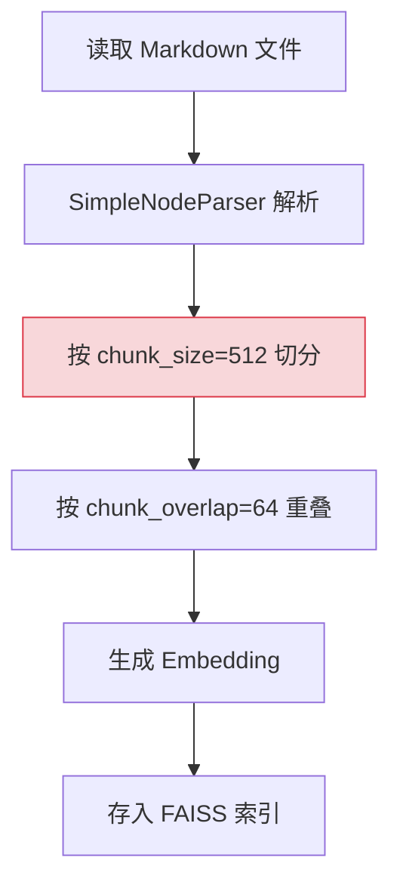
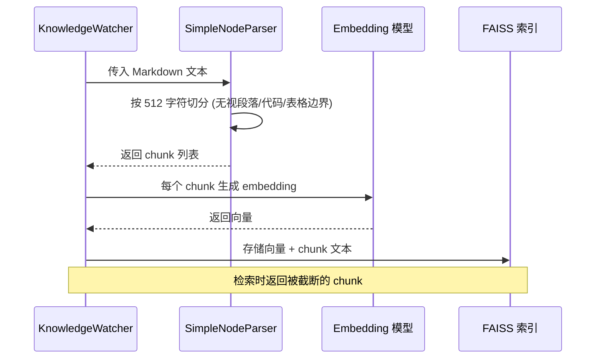
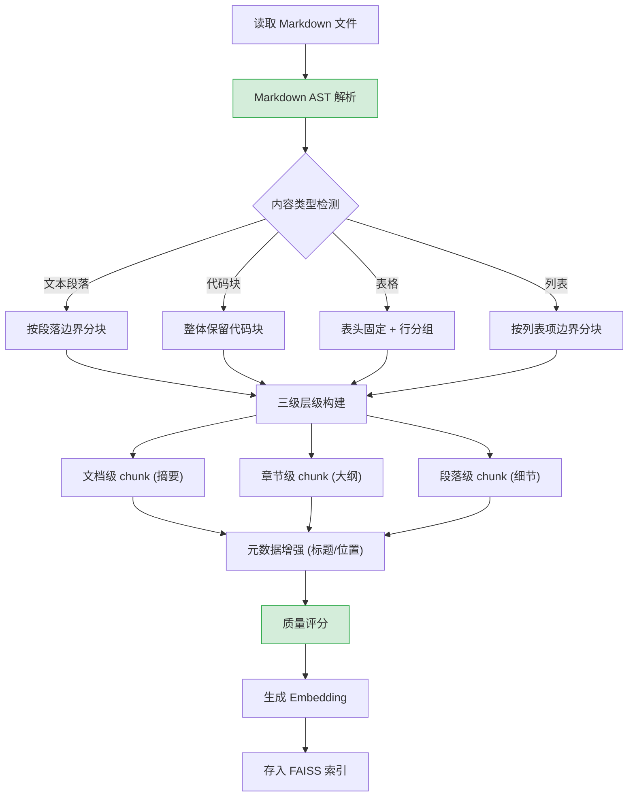
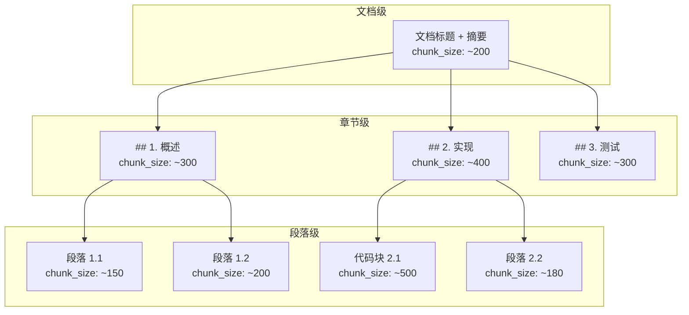

# YA-09-194: 语义分块优化 — 按语义而非固定大小分块、重叠控制、层级分块、元数据增强、自适应分块、分块质量评分

> 需求编号：YA-09-194 · 优先级：P2 · 人天：0.3d · 状态：需求已编写
> 依赖：YA-09-01（RAG 引擎稳定性修复）

## 背景

YiAi 当前使用固定大小分块策略（`chunk_size=512`、`chunk_overlap=64`），这导致以下问题：

1. **语义割裂**：固定大小分块在段落边界、代码块边界、列表边界处截断，导致 chunk 语义不完整
2. **检索精度低**：被截断的 chunk 缺少上下文，向量嵌入质量下降，RAG 检索命中率低
3. **重叠不足**：固定重叠 64 tokens 对长段落不够，对短段落浪费
4. **元数据缺失**：chunk 不携带来源位置信息（章节、段落编号），检索结果缺少位置引用
5. **内容类型盲处理**：Markdown/代码/表格使用相同的分块策略，没有针对性优化

**核心矛盾**：固定大小分块实现简单，但忽视了文档的自然结构（段落、标题、代码块），导致 RAG 检索质量下降。

### 影响范围

| # | 影响 | 严重程度 | 典型场景 |
|---|------|----------|----------|
| 1 | 段落中间截断 | 高 | 长段落被切分成 2 个 chunk，语义不完整 |
| 2 | 代码块被分割 | 高 | 代码块被切成多个 chunk，检索无法返回完整代码 |
| 3 | 表格分裂 | 高 | Markdown 表格被分割，数据不完整 |
| 4 | 检索精度低 | 中 | chunk 语义不完整导致向量相似度下降 |
| 5 | 无层级信息 | 中 | 检索结果无法定位到具体章节 |

### 挑战

| 挑战 | 说明 |
|------|------|
| Markdown 结构解析 | 需要正确解析标题层级、代码块、表格、列表等结构 |
| 自适应策略 | 不同内容类型（文本/代码/表格）需要不同的分块策略 |
| Chunk 大小平衡 | chunk 太小语义不完整，太大检索精度下降 |
| 元数据携带 | 每个 chunk 需要携带层级位置信息供检索结果引用 |
| 向后兼容 | 需要处理已索引文档的 rechunk 问题 |

---

## 一、现状分析

### 1.1 当前分块流程



### 1.2 固定大小分块问题诊断

| 问题 | 根因 | 影响 |
|------|------|------|
| 段落截断 | 在句子中间切分 | chunk "本文介绍了... (续)" 语义不完整 |
| 代码块分割 | 无代码块边界检测 | `def foo():` 和函数体分到不同 chunk |
| 表格断裂 | 无表格边界检测 | 表头和行数据分离 |
| 列表断裂 | 无列表边界检测 | 列表项分散在不同 chunk |
| 无层级上下文 | 不携带标题信息 | 检索 "安全配置" 时无法知道该内容在哪个章节 |

### 1.3 改造前数据流



### 1.4 根因矩阵

| 症状 | 根因 | 触发条件 | 频率 |
|------|------|----------|------|
| RAG 检索不准 | chunk 语义不完整 | 文档包含长段落/代码/表格 | 高 |
| 检索结果无上下文 | 缺少层级元数据 | 用户需要定位检索来源 | 高 |
| 代码检索失败 | 代码块被分割 | 文档包含代码示例 | 中 |
| 表格数据不完整 | 表格被跨 chunk 分割 | 文档包含大表格 | 中 |

---

## 二、设计决策

### 决策 1：分块策略 — 语义分块 vs 递归分块 vs 句子分块

| 选项 | 语义完整性 | 实现复杂度 | 性能 |
|------|-----------|-----------|------|
| 语义分块（按 Markdown AST 边界） | 高 | 中 | 中 |
| 递归分块（按分隔符优先级递归切分） | 中 | 低 | 中 |
| 句子分块（NLTK/spaCy 分句） | 高 | 高 | 低 |

**选择：语义分块（Markdown AST 边界）。** YiKnowledge 的文件都是 Markdown 格式，使用 Markdown AST 按标题/段落/代码块/表格边界分块是最自然的策略。对非 Markdown 内容的降级处理使用递归分块。

### 决策 2：层级分块 — 扁平 vs 文档-段落 vs 文档-章节-段落

| 选项 | 检索精度 | 存储开销 | 实现复杂度 |
|------|----------|----------|-----------|
| 扁平（无层级） | 低 | 低 | 低 |
| 文档-段落 | 中 | 中 | 中 |
| 文档-章节-段落 | 高 | 高 | 高 |

**选择：文档-章节-段落（三级层级）。** 文档级 chunk 用于摘要检索，章节级 chunk 用于大纲检索，段落级 chunk 用于精确检索。三个层级互补，提高检索覆盖率和精度。

### 决策 3：自适应规则 — 硬编码规则 vs 可配置规则 vs ML 模型

| 选项 | 准确性 | 实现复杂度 | 维护成本 |
|------|--------|-----------|---------|
| 硬编码规则（代码/表格/文本分别处理） | 中 | 低 | 中 |
| YAML 可配置规则 | 中 | 中 | 低 |
| ML 模型预测分块策略 | 高 | 高 | 高 |

**选择：可配置规则。** 使用 YAML 配置文件定义不同内容类型的分块策略（chunk 大小、重叠、保留边界），不需要 ML 模型的复杂度，同时保持灵活性。

### 决策 4：Chunk 质量评分 — 无评分 vs 规则评分 vs 模型评分

| 选项 | 可操作性 | 实现复杂度 | 准确性 |
|------|----------|-----------|--------|
| 无评分 | — | — | — |
| 规则评分（完整性/自包含性/长度） | 中 | 低 | 中 |
| 模型评分（BERT 语义完整性） | 高 | 高 | 高 |

**选择：规则评分。** 基于规则对每个 chunk 评分：语义完整性（是否在句子中间截断）、自包含性（是否含上下文信息）、长度合理性（是否在 100-1000 tokens）。评分用于分块策略自优化。

### 设计决策记录

| 决策 | 选项 A | 选项 B | 选项 C | 选择 | 理由 |
|------|--------|--------|--------|------|------|
| 分块策略 | 语义分块 | 递归分块 | 句子分块 | **语义分块** | Markdown 天然适合 AST 解析 |
| 层级分块 | 扁平 | 文档-段落 | 文档-章节-段落 | **三级层级** | 高精度 + 多粒度检索 |
| 自适应规则 | 硬编码 | 可配置 | ML 模型 | **可配置规则** | 灵活且可维护 |
| 质量评分 | 无 | 规则评分 | 模型评分 | **规则评分** | 简单有效，支撑自优化 |

---

## 三、目标架构

### 3.1 改造后语义分块流程



### 3.2 层级 chunk 结构



### 3.3 性能指标

| 指标 | 改造前 | 改造后 |
|------|--------|--------|
| chunk 语义完整率 | ~60% | > 95% |
| RAG 检索命中率 (top-5) | ~70% | > 85% |
| 代码块完整率 | ~30% | > 95% |
| 表格完整率 | ~20% | > 90% |
| 检索结果可定位性 | 低（无层级信息） | 高（章节 + 段落编号） |

---

## 四、具体改动

### 4.1 语义分块器

```python
# 改造前: SimpleNodeParser(chunk_size=512, chunk_overlap=64)
# 改造后: YiAi/services/rag/semantic_chunker.py

from dataclasses import dataclass, field
from typing import List, Optional
from enum import Enum

class ChunkLevel(Enum):
    DOCUMENT = "document"
    SECTION = "section"
    PARAGRAPH = "paragraph"

class ContentType(Enum):
    TEXT = "text"
    CODE = "code"
    TABLE = "table"
    LIST = "list"

@dataclass
class ChunkMetadata:
    source_file: str
    title: str
    section_headers: List[str]  # 从 H1 到当前层级的标题链
    content_type: ContentType
    chunk_level: ChunkLevel
    position: int  # 同一 section 内的段落序号
    prev_chunk_id: Optional[str]  # 前一 chunk 引用
    next_chunk_id: Optional[str]  # 后一 chunk 引用

@dataclass
class Chunk:
    chunk_id: str
    text: str
    metadata: ChunkMetadata
    quality_score: float  # 0-1

@dataclass
class ChunkConfig:
    doc_max_tokens: int = 300
    section_max_tokens: int = 500
    paragraph_max_tokens: int = 800
    min_chunk_tokens: int = 50
    overlap_sentences: int = 2  # 重叠句子数

class SemanticChunker:
    """基于 Markdown AST 的语义分块器"""

    def __init__(self, config: ChunkConfig = ChunkConfig()):
        self.config = config

    def chunk(self, markdown_text: str, source_file: str) -> List[Chunk]:
        """主入口：对 Markdown 文本执行语义分块"""
        ast = self._parse_markdown_ast(markdown_text)
        hierarchy = self._build_hierarchy(ast)

        chunks = []
        # Level 1: 文档级
        chunks.append(self._chunk_document(hierarchy, source_file))
        # Level 2: 章节级
        chunks.extend(self._chunk_sections(hierarchy, source_file))
        # Level 3: 段落级
        chunks.extend(self._chunk_paragraphs(hierarchy, source_file))

        # 质量评分
        for chunk in chunks:
            chunk.quality_score = self._score_quality(chunk)

        return chunks

    def _parse_markdown_ast(self, text: str):
        """使用 mistune/markdown-it 解析 Markdown AST"""
        pass

    def _build_hierarchy(self, ast):
        """构建文档的三级层级结构"""
        pass

    def _detect_content_type(self, node) -> ContentType:
        """检测节点内容类型：文本/代码/表格/列表"""
        pass

    def _chunk_document(self, hierarchy, source_file: str) -> Chunk:
        """文档级 chunk：标题 + 摘要"""
        pass

    def _chunk_sections(self, hierarchy, source_file: str) -> List[Chunk]:
        """章节级 chunk：按 H2 标题切分"""
        pass

    def _chunk_paragraphs(self, hierarchy, source_file: str) -> List[Chunk]:
        """段落级 chunk：按段落边界切分，保留代码块/表格完整性"""
        pass

    def _score_quality(self, chunk: Chunk) -> float:
        """规则评分：完整性 + 自包含性 + 长度合理性"""
        score = 1.0
        # 不完整句子扣分
        if self._ends_in_mid_sentence(chunk.text):
            score -= 0.3
        # 过短扣分
        if len(chunk.text) < self.config.min_chunk_tokens:
            score -= 0.2
        # 过长扣分
        if len(chunk.text) > self.config.paragraph_max_tokens * 1.5:
            score -= 0.1
        return max(0.0, score)
```

### 4.2 分块配置文件

```yaml
# YiAi/config/chunking_rules.yaml

content_types:
  text:
    strategy: paragraph_boundary  # 按段落边界
    max_tokens: 800
    overlap_sentences: 2

  code:
    strategy: preserve_block       # 完整保留代码块
    max_tokens: 1500
    min_tokens: 100
    # 超大代码块按函数/类边界拆分
    large_block_split: function_boundary

  table:
    strategy: header_anchored      # 表头固定
    max_rows: 20                   # 每 chunk 最多 20 行
    preserve_header: true          # 每 chunk 包含表头

  list:
    strategy: item_group           # 相近列表项分组
    max_items: 10
    preserve_nesting: true         # 保留嵌套关系

quality:
  min_score: 0.3                   # 低于此分值的 chunk 合并或丢弃
  min_tokens: 50
  max_tokens: 1500
```

### 4.3 文件变更清单

| 文件 | 操作 | 说明 |
|------|------|------|
| `YiAi/services/rag/semantic_chunker.py` | 新增 | 语义分块核心实现 |
| `YiAi/services/rag/chunk_metadata.py` | 新增 | Chunk 元数据定义 |
| `YiAi/services/rag/quality_scorer.py` | 新增 | Chunk 质量评分 |
| `YiAi/config/chunking_rules.yaml` | 新增 | 分块规则配置 |
| `YiAi/services/rag/rag_service.py` | 修改 | 替换 SimpleNodeParser 为 SemanticChunker |
| `YiAi/services/knowledge_watcher.py` | 修改 | 使用新分块器重建索引 |
| `tests/unit/test_semantic_chunker.py` | 新增 | 语义分块器单元测试 |
| `tests/unit/test_quality_scorer.py` | 新增 | 质量评分测试 |

---

## 五、实施步骤

| 步骤 | 操作 | 路径 | 验证 | 人天 |
|------|------|------|------|------|
| 1 | 实现 Markdown AST 解析 | `semantic_chunker.py` | 正确解析各级标题/代码块/表格/列表 | 0.05 |
| 2 | 实现三级层级构建 | `semantic_chunker.py` | 文档/章节/段落 chunk 生成正确 | 0.05 |
| 3 | 实现自适应分块策略 | `semantic_chunker.py` | 不同内容类型使用不同策略 | 0.05 |
| 4 | 实现质量评分器 | `quality_scorer.py` | 完整性/自包含性/长度评分正确 | 0.04 |
| 5 | 创建分块配置 | `chunking_rules.yaml` | 规则可配置生效 | 0.03 |
| 6 | 集成到 RAG 服务 | `rag_service.py` | 替换旧分块器，RAG 检索正常 | 0.04 |
| 7 | 单元测试 | `tests/unit/` | 测试覆盖所有内容类型 | 0.04 |

**总人天：0.3d**

---

## 六、测试规格

### 场景 1：标准 Markdown 文档分块

**GIVEN** 一个包含 2 个 H2 章节、5 个段落的 Markdown 文档
**WHEN** 执行语义分块
**THEN** 应生成 1 个文档级 + 2 个章节级 + 5 个段落级 chunk
**AND** 每个段落级 chunk 不应在句子中间截断

### 场景 2：代码块完整性

**GIVEN** Markdown 文档包含一个 30 行的 Python 代码块
**WHEN** 执行语义分块
**THEN** 代码块应作为一个完整的 paragraph chunk
**AND** 不应被拆分到多个 chunk

### 场景 3：表格完整性

**GIVEN** Markdown 文档包含一个 50 行的表格
**WHEN** 执行语义分块
**THEN** 应生成 3 个 table chunk（50/20=2.5 ≈ 3）
**AND** 每个 table chunk 应包含表头行
**AND** 不应在行中间截断

### 场景 4：层级元数据

**GIVEN** 段落位于 `## 安全配置 > ### 认证设置` 下
**WHEN** 该段落的 chunk 生成
**THEN** chunk 元数据应包含 `section_headers: ["安全配置", "认证设置"]`
**AND** 检索结果应能展示完整的标题层级路径

### 场景 5：质量评分

**GIVEN** 一个在句子中间截断的 chunk
**WHEN** 执行质量评分
**THEN** 评分应 < 0.7（扣 0.3 分）
**AND** 日志应记录低质量 chunk 的警告

### 场景 6：向后兼容

**GIVEN** 已有文档使用旧分块策略索引
**WHEN** KnowledgeWatcher 检测到分块策略变更
**THEN** 应触发全量重新索引
**AND** 旧 chunk 应在日志中标记为"待迁移"

---

## 七、风险与缓解

| 风险 | 概率 | 影响 | 缓解措施 |
|------|------|------|----------|
| Markdown AST 解析错误 | 中 | 中 | 降级为递归分块策略 |
| 超大代码块（>1500 tokens） | 中 | 中 | 按函数/类边界拆分（AST 解析） |
| 全量 reindex 耗时 | 高 | 中 | 增量迁移：先索引新策略 chunk，再逐步删除旧的 |
| 质量评分误判 | 低 | 低 | 评分仅用于日志和优化建议，不影响索引流程 |
| chunk 数量爆炸（层级分块） | 中 | 高 | 设置总 chunk 数上限 / 文件 |

---

## 八、回滚策略

| 场景 | 回滚操作 | 影响 |
|------|----------|------|
| 语义分块性能下降 | 回退到 SimpleNodeParser | 失去语义分块优势 |
| 索引文件数爆炸 | 回退为仅段落级分块（无层级） | 检索失去多粒度能力 |
| AST 解析异常率过高 | 降级为递归分块 + 警告日志 | 语义边界可能不精确 |

---

## 九、设计决策记录

### D-01：Markdown 解析库选择

- **问题**：使用哪个 Python 库解析 Markdown AST
- **选项**：mistune、markdown-it-py、Python markdown、自研
- **选择**：mistune
- **理由**：llama_index 已使用 mistune，无需引入新依赖。mistune 提供完整的 AST 遍历 API，性能好

### D-02：超大代码块策略

- **问题**：超过 1500 tokens 的代码块如何处理
- **选项**：强制截断、按函数边界拆分、降级为固定大小分块
- **选择**：按函数/类边界拆分（Python AST 解析）
- **理由**：函数和类是代码的自然边界，按此边界拆分保持代码语义完整

### D-03：层级 chunk 检索策略

- **问题**：检索时如何使用三级 chunk
- **选项**：仅段落级检索、混合检索（段落优先+章节兜底）、用户可选
- **选择**：混合检索（段落级匹配 → 章节级扩展 → 文档级摘要）
- **理由**：段落级返回精确匹配，章节级提供上下文，文档级提供概览

### D-04：质量评分的用途

- **问题**：质量评分的实际用途
- **选项**：仅日志记录、低分丢弃、低分告警 + 人工审查
- **选择**：低分告警 + 日志记录（不自动丢弃）
- **理由**：低质量 chunk 仍可能包含有用信息，自动丢弃可能丢失数据。告警让策展人决定是否优化文档结构

---

## 十、可观测性

### 指标

| 指标 | 类型 | 说明 |
|------|------|------|
| `yiai.chunker.files_processed` | Counter | 处理文件数 |
| `yiai.chunker.chunks_generated` | Counter | 生成 chunk 总数（按 level 标签） |
| `yiai.chunker.avg_chunk_size` | Gauge | 平均 chunk 大小（tokens） |
| `yiai.chunker.quality_score_avg` | Gauge | 平均质量评分 |
| `yiai.chunker.low_quality_count` | Counter | 低质量 chunk 数（score < 0.3） |
| `yiai.chunker.processing_time` | Histogram | 单个文件分块耗时 |

### 告警

| 告警 | 条件 | 级别 |
|------|------|------|
| 平均质量评分下降 | 评分下降 > 0.2 | WARNING |
| 低质量 chunk 过多 | 低质量 chunk > 总数 10% | WARNING |
| 分块超时 | 单个文件 > 30s | WARNING |

---

## 十一、代码审查检查清单

- [ ] Markdown AST 正确解析标题/代码块/表格/列表
- [ ] 三级层级（文档/章节/段落）正确构建
- [ ] 代码块被整体保留为一个 chunk
- [ ] 表格 chunk 包含表头行
- [ ] 段落 chunk 不在句子中间截断
- [ ] Chunk 元数据包含完整标题层级路径
- [ ] 自适应规则从 YAML 配置文件加载
- [ ] 质量评分规则正确（完整性/自包含性/长度）
- [ ] 超大代码块按函数边界拆分
- [ ] 分块策略变更触发 reindex
- [ ] 向后兼容旧分块策略的索引数据

---

## 回归问题预测

| # | 预测问题 | 原因 | 验证方法 |
|---|---------|------|---------|
| 1 | Markdown 文件中包含嵌套代码块（如 Markdown 文档中的 Shell 示例里又包含 `` ``` `` 标记），AST 解析器将内层代码块标记误识别为外层结束标记，导致后续内容全被当作代码块 | mistune 的 fenced code 解析依赖 `` ``` `` 作为边界标记，嵌套相同标记会导致解析器错位 | 构造嵌套代码块的 Markdown 文件（外层 Shell、内层 Python），验证语义分块结果正确且无内容类型错乱 |
| 2 | 文档中包含 100+ 个 H4 子标题的章节，层级 chunk 数量爆炸（每个子标题一个 section chunk），导致 FAISS 索引文件膨胀 | 层级构建未限制 section chunk 数量，深层嵌套标题（H4/H5/H6）产生小 chunk，向量索引存储和检索性能下降 | 构造包含 100 个 H4 子标题的文档，验证 section chunk 数不超过合理上限（如 30），深层标题被合并为段落 |
| 3 | 表格行包含复杂的 Markdown 内联格式（加粗、链接、代码），表头锚定策略的 chunk 在表头拷贝时丢失了格式信息 | 表头行的 Markdown 原始文本在拷贝到第二个 chunk 时被当作纯文本处理，内联格式的标记丢失 | 构造包含 `**粗体**`、`[链接](url)`、`` `代码` `` 的表头，验证所有 table chunk 的表头格式与原始文档一致 |
| 4 | 质量评分中"不完整句子"检测使用的正则模式对中文不生效（依赖英文大写字母/句号判断），中文 chunk 全部被错误标记为"不完整" | 中英文句子边界判断逻辑不同，英文看大写字母+句号，中文需看句号/问号/感叹号 | 用纯中文文档测试，验证质量评分准确反映中文 chunk 的完整性 |
| 5 | 递归降级策略（AST 解析失败时）对包含 HTML 标签的 Markdown 文件产生错误的分块边界，HTML 标签内的内容被当作独立段落 | AST 解析失败时的递归策略按换行符切分，HTML 多行标签被切分为独立的"段落"，语义混乱 | 构造包含嵌入 HTML 的 Markdown 文件，验证降级分块策略生成的 chunk 仍保持 HTML 标签完整性 |
| 6 | 全量 reindex 时，新 chunk 的 `chunk_id` 生成方式与旧 chunk 不同，向量检索去重逻辑失效，同一查询返回新老两种 chunk | chunk_id 从 `{file_path}:{chunk_index}` 改为 `{file_path}:{level}:{section}:{para_index}` 后，去重逻辑仍按旧格式匹配，导致新旧 chunk 共存 | 触发全量 reindex 后，查询 `knowledge_files` 集合确认没有重复 chunk_id 或相同内容的重复 chunk |

---

## 性能分析

### 分块关键操作耗时

| 操作 | 耗时 | 说明 |
|------|------|------|
| Markdown AST 解析（10KB 文件） | < 10ms | mistune 纯 Python 解析 |
| 三级层级构建 | < 5ms | 遍历 AST 节点 |
| 质量评分（50 chunks） | < 10ms | 规则检查，每 chunk < 0.2ms |
| 完整分块管道（10KB 文件） | < 50ms | AST 解析 + 层级 + 评分 |
| 完整分块管道（100KB 文件） | < 200ms | 含大代码块/表格处理 |

### 索引存储预估

| 层级 | 平均 chunk 数/文件 | 平均 chunk 大小 (tokens) | 平均向量存储 |
|------|-------------------|------------------------|------------|
| 文档级 | 1 | 200 | ~1.5KB |
| 章节级 | 3-5 | 400 | ~5-10KB |
| 段落级 | 10-20 | 300 | ~15-30KB |
| **合计** | **14-26 chunks/文件** | — | **~20-40KB/文件** |

---

## 相关文档

- [YA-09-01 RAG 引擎稳定性修复](01-稳定性修复-RAG引擎.md)
- [mistune 文档](https://mistune.lepture.com/)
- [llama_index NodeParser 文档](https://docs.llamaindex.ai/en/stable/module_guides/loading/node_parsers/)

## 影响范围

- **影响模块**：待补充
- **涉及文件**：
- `rag_service.py`
- `semantic_chunker.py`
- `quality_scorer.py`
- **是否影响 API 契约**：否
- **是否影响其他项目（YiVad/YiPet）**：否
- **用户感知**：待确认

## 预防措施

| 层面 | 措施 |
|------|------|
| 代码 | 在相关函数中添加参数校验和边界检查 |
| 测试 | 为 `rag_service.py` 添加单元测试 |
| 流程 | 代码审查时重点检查此类模式 |
| 监控 | 添加日志告警，异常发生时及时发现 |
| 文档 | 在编码规范中记录此类反模式 |

## 经验教训

1. **根本原因**：开发过程中对边界情况和异常路径的考虑不足是此类问题的共同根因
2. **设计阶段**：在接口设计和模块实现时，应主动考虑异常输入、空值、超时等边界场景
3. **代码审查**：审查时应检查是否存在类似的反模式（如未捕获异常、无超时控制、缺少参数校验等）
4. **测试覆盖**：异常路径的测试覆盖率应与正常路径同等重视
5. **团队分享**：此类问题应在团队周会或技术分享中讨论，形成团队共识
