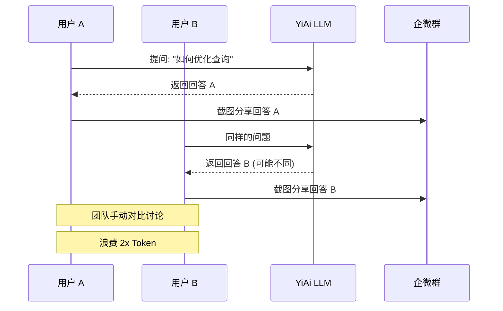
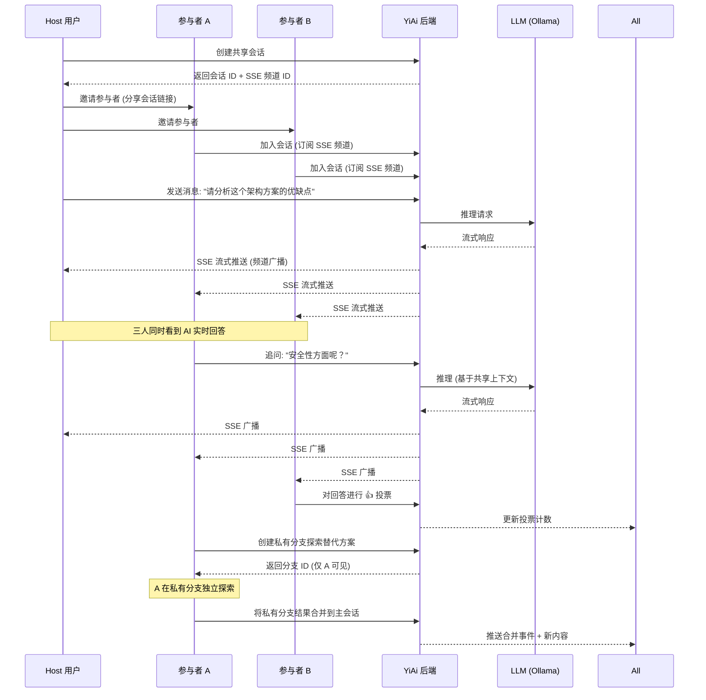

# YA-09-195: 实时协作推理 — 共享 LLM 会话、轮流发言管理、共享上下文构建、响应投票、协作 Prompt 优化

> 需求编号：YA-09-195 · 优先级：P2 · 人天：0.3d · 状态：需求已编写
> 依赖：YA-09-46（WebSocket 实时通信，若存在）/ SSE 流式会话

## 背景

当前 YiAi 的 LLM 会话是完全隔离的——每个用户拥有独立的会话上下文和历史记录。这导致团队协作场景下的两大痛点：

1. **AI 辅助决策不透明**：当团队使用 AI 进行技术决策、代码审查或需求分析时，每个人独立与 AI 对话，产生不一致甚至矛盾的 AI 建议。团队无法共享 AI 的推理过程和结论
2. **Prompt Engineering 孤岛**：团队成员各自调试 Prompt，好的 Prompt 无法实时共享和协作优化。团队的 Prompt Engineering 知识无法积累和传递

**核心矛盾**：AI 推理过程应该是团队可共享、可讨论、可优化的协作资产，但当前会话隔离架构造就了"AI 孤岛"。

### 影响范围

| # | 影响 | 严重程度 | 典型场景 |
|---|------|----------|----------|
| 1 | AI 建议矛盾 | 高 | 团队各自问 AI 同一问题得到不同回答 |
| 2 | Prompt 无法共享 | 高 | 好的 Prompt 策略无法在团队中传播 |
| 3 | AI 辅助决策无共识 | 中 | 无法就 AI 的建议达成团队共识 |
| 4 | 协作效率低 | 中 | 每次需要截图/复制粘贴分享 AI 对话 |
| 5 | 重复提问浪费 Token | 中 | 多人问 AI 相同问题，消耗成倍 Token |

### 挑战

| 挑战 | 说明 |
|------|------|
| 实时同步 | 多用户同时查看和交互同一个 LLM 会话 |
| 轮流发言 | 同时发消息时的顺序和冲突管理 |
| 上下文管理 | 共享上下文中哪些是公共的、哪些是私有的 |
| 响应投票 | 如何对 AI 的多个候选回答进行投票 |
| SSE 复用 | 如何让多个用户订阅同一个 SSE 流 |

---

## 一、现状分析

### 1.1 当前团队 AI 使用模式

```
团队成员 A
  │ 打开 YiVad AI 聊天
  │ 输入: "如何优化这个数据库查询？"
  │ AI 返回建议 A
  └─ 截图分享到企微群

团队成员 B
  │ 打开 YiVad AI 聊天
  │ 输入: "同样的问题，数据库查询优化"
  │ AI 返回建议 B（可能不同）
  └─ 截图分享到企微群

团队讨论
  │ 对比两个 AI 回答
  │ 手动合并最佳方案
  └─ Token 消耗: 2x
```

### 1.2 当前可用能力

| 能力 | 可用性 | 限制 |
|------|--------|------|
| 独立 AI 会话 | ✅ | 仅个人可见 |
| 会话分享（截图/复制） | ⚠️ | 手动操作，不可交互 |
| 多人同时与 AI 对话 | ❌ | 会话隔离 |
| AI 回答投票 | ❌ | 无机制 |
| 协作 Prompt 优化 | ❌ | 各自为政 |

### 1.3 改造前数据流



### 1.4 根因矩阵

| 症状 | 根因 | 触发条件 | 频率 |
|------|------|----------|------|
| AI 回答不一致 | 会话隔离，上下文独立 | 多人问相同问题 | 高 |
| Prompt 重复调试 | 无协作共享机制 | 团队各自优化 Prompt | 高 |
| 无法共识决策 | 无投票机制 | 需要 AI 辅助决策 | 中 |
| Token 浪费 | 重复提问 | 多人问相似问题 | 高 |
| 协作效率低 | 无共享会话 | 团队 AI 协作 | 中 |

---

## 二、设计决策

### 决策 1：共享会话模型 — 单主会话 vs 多分支 vs 共享主+私分支

| 选项 | 灵活性 | 复杂度 | 适用场景 |
|------|--------|--------|---------|
| 单主会话（所有人共享同一上下文） | 低 | 低 | 简单讨论 |
| 多分支（每人可创建分支） | 高 | 高 | 复杂探索 |
| 共享主 + 私有分支 | 高 | 中 | 协作+个人空间 |

**选择：共享主 + 私有分支。** 共享主会话是所有参与者可见的公共上下文。参与者可以在主会话的任何点创建私有分支进行独立探索，然后将有价值的结果合并回主会话。兼顾协作和个人探索。

### 决策 2：轮流发言管理 — 自由发言 vs 队列制 vs 主持人制

| 选项 | 流畅性 | 有序性 | 实现复杂度 |
|------|--------|--------|-----------|
| 自由发言（无限制） | 高 | 低 | 低 |
| 队列制（排队发言） | 低 | 高 | 中 |
| 主持人制（host 控制发言权） | 中 | 高 | 中 |

**选择：自由发言 + 发言锁定。** 默认自由发言（与 AI 对话本就异步）。当多人同时输入时，系统不阻止，但建议"发言中"状态（类似 typing indicator）。对于正式讨论场景，host 可启用发言锁定。

### 决策 3：实时同步协议 — SSE 广播 vs WebSocket vs 轮询

| 选项 | 实时性 | 实现复杂度 | 兼容性 |
|------|--------|-----------|--------|
| SSE 广播（多路复用） | 高 | 中 | 高 |
| WebSocket | 最高 | 高 | 中 |
| 轮询（3s 间隔） | 低 | 低 | 高 |

**选择：SSE 广播（多路复用）。** YiAi 已有 SSE 实现用于聊天流式响应。改造 SSE 为多订户模式：创建会话时生成 SSE 频道 ID，参与者订阅同一频道的 SSE 流。无需引入 WebSocket 新基础设施。

### 决策 4：上下文边界 — 全共享 vs 仅消息共享 vs 可配置

| 选项 | 隐私性 | 协作价值 | 实现难度 |
|------|--------|----------|---------|
| 全共享（所有上下文可见） | 低 | 高 | 低 |
| 仅消息共享（System Prompt 私有） | 中 | 中 | 中 |
| 可配置（标记公开/私有上下文） | 高 | 高 | 中 |

**选择：可配置。** 参与者可见：公共消息历史、公共 System Prompt。参与者不可见：个人私有分支、个人"草稿"消息。Host 可标记某些上下文为仅 Host 可见。

### 设计决策记录

| 决策 | 选项 A | 选项 B | 选项 C | 选择 | 理由 |
|------|--------|--------|--------|------|------|
| 会话模型 | 单主会话 | 多分支 | 共享主+私分支 | **共享主+私分支** | 协作+个人空间兼顾 |
| 发言管理 | 自由 | 队列 | 主持人 | **自由+锁定** | 默认自由，正式场景可选 |
| 同步协议 | SSE 广播 | WebSocket | 轮询 | **SSE 广播** | 复用现有基础设施 |
| 上下文边界 | 全共享 | 仅消息 | 可配置 | **可配置** | 灵活适配不同场景 |

---

## 三、目标架构

### 3.1 改造后协作推理流程



### 3.2 共享会话数据结构

```mermaid
graph TD
    subgraph Session["共享会话"]
        A[Session ID]
        B[Host ID]
        C[Participants {}]
        D[Shared Context]
        E[Message History]
        F[Votes Map]
        G[Private Branches {}]
    end

    subgraph Message["消息"]
        H[message_id]
        I[author_id]
        J[content]
        K[role: user/assistant/system]
        L[visibility: shared/private]
        M[timestamp]
        N[parent_message_id]
    end

    subgraph Vote["投票"]
        O[message_id]
        P[user_id → vote: up/down/neutral]
        Q[comment]
    end

    E --> Message
    F --> Vote
    G --> PrivateBranch
```

### 3.3 性能指标

| 指标 | 改造前 | 改造后 |
|------|--------|--------|
| 团队 AI 协作方式 | 截图分享 | 实时共享会话 |
| Google Token 消耗 | N 人 × T tokens | 1 × T tokens (共享上下文) |
| Prompt 优化速度 | 各自试错 | 协作迭代 |
| 决策共识达成率 | 低 | 高 (投票机制) |

---

## 四、具体改动

### 4.1 共享会话服务

```python
# 改造前: 会话仅单用户绑定
# 改造后: YiAi/services/ai/collab_session_service.py

from dataclasses import dataclass, field
from typing import Dict, List, Optional, Set
from enum import Enum
import asyncio
import uuid

class Visibility(Enum):
    SHARED = "shared"       # 所有参与者可见
    PRIVATE = "private"     # 仅作者可见

class VoteValue(Enum):
    UP = "up"
    DOWN = "down"
    NEUTRAL = "neutral"

@dataclass
class Participant:
    user_id: str
    display_name: str
    joined_at: str
    is_host: bool = False
    is_typing: bool = False

@dataclass
class CollabMessage:
    message_id: str
    author_id: str
    role: str  # user / assistant / system
    content: str
    visibility: Visibility = Visibility.SHARED
    timestamp: str = field(default_factory=lambda: datetime.now().isoformat())
    parent_message_id: Optional[str] = None

@dataclass
class CollabSession:
    session_id: str
    host_id: str
    title: str
    participants: Dict[str, Participant] = field(default_factory=dict)
    messages: List[CollabMessage] = field(default_factory=list)
    votes: Dict[str, Dict[str, VoteValue]] = field(default_factory=dict)
    private_branches: Dict[str, 'PrivateBranch'] = field(default_factory=dict)
    sse_channel_id: str = field(default_factory=lambda: str(uuid.uuid4()))
    is_locked: bool = False

class CollabSessionService:
    """共享会话管理服务"""

    def __init__(self):
        self._sessions: Dict[str, CollabSession] = {}
        self._sse_channels: Dict[str, List[asyncio.Queue]] = {}  # SSE 多订户队列

    async def create_session(
        self, host_id: str, title: str, initial_context: str = ""
    ) -> CollabSession:
        """Host 创建共享会话"""
        session = CollabSession(
            session_id=str(uuid.uuid4()),
            host_id=host_id,
            title=title,
        )
        session.participants[host_id] = Participant(
            user_id=host_id, display_name="", joined_at="", is_host=True
        )
        if initial_context:
            session.messages.append(CollabMessage(
                message_id=str(uuid.uuid4()),
                author_id=host_id,
                role="system",
                content=initial_context,
            ))
        self._sessions[session.session_id] = session
        self._sse_channels[session.sse_channel_id] = []
        return session

    async def join_session(self, session_id: str, user_id: str) -> SSEStream:
        """参与者加入会话并订阅 SSE 流"""
        session = self._get_session(session_id)
        session.participants[user_id] = Participant(
            user_id=user_id, display_name="", joined_at=""
        )
        # 创建个人 SSE 队列
        queue = asyncio.Queue()
        self._sse_channels[session.sse_channel_id].append(queue)
        return self._create_sse_stream(queue, session)

    async def send_message(
        self, session_id: str, user_id: str, content: str,
        visibility: Visibility = Visibility.SHARED
    ) -> None:
        """发送消息到共享会话，触发 LLM 推理"""
        session = self._get_session(session_id)
        if session.is_locked and user_id != session.host_id:
            raise PermissionError("会话已被锁定，仅 Host 可发言")

        msg = CollabMessage(
            message_id=str(uuid.uuid4()),
            author_id=user_id,
            role="user",
            content=content,
            visibility=visibility,
        )
        session.messages.append(msg)
        await self._broadcast(session, {"type": "message", "data": msg})

        # 触发 LLM 推理（使用共享上下文）
        await self._infer_and_broadcast(session)

    async def vote(
        self, session_id: str, user_id: str, message_id: str, value: VoteValue
    ) -> None:
        """对 AI 回答投票"""
        session = self._get_session(session_id)
        if message_id not in session.votes:
            session.votes[message_id] = {}
        session.votes[message_id][user_id] = value
        await self._broadcast(session, {
            "type": "vote_update",
            "data": {"message_id": message_id, "votes": session.votes[message_id]}
        })

    async def create_private_branch(
        self, session_id: str, user_id: str, fork_point: str
    ) -> str:
        """从共享会话的某个点创建私有分支"""
        pass

    async def merge_branch(
        self, session_id: str, user_id: str, branch_id: str
    ) -> None:
        """将私有分支的结果合并回共享主会话"""
        pass

    async def _broadcast(self, session: CollabSession, event: dict) -> None:
        """向所有 SSE 订户广播事件"""
        queues = self._sse_channels.get(session.sse_channel_id, [])
        for queue in queues:
            await queue.put(event)

    async def _infer_and_broadcast(self, session: CollabSession) -> None:
        """LLM 推理并广播流式回答"""
        shared_context = [m for m in session.messages if m.visibility == Visibility.SHARED]
        # 流式调用 LLM，每个 token 推送给所有订户
        async for token in self._llm_stream(shared_context):
            await self._broadcast(session, {"type": "token", "data": token})
```

### 4.2 文件变更清单

| 文件 | 操作 | 说明 |
|------|------|------|
| `YiAi/services/ai/collab_session_service.py` | 新增 | 共享会话管理核心服务 |
| `YiAi/services/ai/sse_multicast.py` | 新增 | SSE 多播引擎（多订户） |
| `YiAi/services/ai/vote_service.py` | 新增 | 投票服务 |
| `YiAi/services/ai/private_branch_service.py` | 新增 | 私有分支管理 |
| `YiAi/routers/collab.py` | 新增 | 协作推理路由 |
| `YiAi/models/collab_session.py` | 新增 | 共享会话 MongoDB 模型 |
| `tests/unit/test_collab_session.py` | 新增 | 共享会话测试 |
| `tests/unit/test_sse_multicast.py` | 新增 | SSE 多播测试 |

---

## 五、实施步骤

| 步骤 | 操作 | 路径 | 验证 | 人天 |
|------|------|------|------|------|
| 1 | 实现共享会话数据模型 | `collab_session_service.py` | 会话创建/加入/离开 | 0.05 |
| 2 | 实现 SSE 多播引擎 | `sse_multicast.py` | 多客户端同时收到流 | 0.05 |
| 3 | 实现投票服务 | `vote_service.py` | 投票计数和广播 | 0.03 |
| 4 | 实现私有分支管理 | `private_branch_service.py` | 创建分支/合并分支 | 0.05 |
| 5 | 创建协作路由 | `routers/collab.py` | API 端点正常工作 | 0.04 |
| 6 | 集成到现有 SSE 基础设施 | 扩展现有 SSE | 流式回答多播 | 0.04 |
| 7 | 单元测试 | `tests/unit/` | 完整协作流程测试 | 0.04 |

**总人天：0.3d**

---

## 六、测试规格

### 场景 1：创建和加入共享会话

**GIVEN** Host 用户创建一个共享会话
**WHEN** 2 个参与者通过会话 ID 加入
**THEN** 所有参与者应在参与者列表中可见
**AND** 每个参与者应收到参与者加入事件

### 场景 2：共享消息和 LLM 推理

**GIVEN** 3 个用户已加入共享会话
**WHEN** Host 发送消息"分析这个架构方案"
**THEN** LLM 开始推理，SSE 流应推送给所有 3 个用户
**AND** 所有用户应看到相同的 AI 回答

### 场景 3：发言锁定

**GIVEN** Host 启用发言锁定
**WHEN** 参与者 A 尝试发送消息
**THEN** 应返回"会话已锁定"错误
**AND** Host 仍可正常发言

### 场景 4：AI 回答投票

**GIVEN** AI 已返回一个回答
**WHEN** 3 个参与者分别投 👍、👍、👎
**THEN** 投票计数应为 2 up、1 down
**AND** 所有参与者应看到实时更新的投票结果

### 场景 5：私有分支

**GIVEN** 共享会话有 10 条消息
**WHEN** 参与者 A 在第 5 条消息处创建私有分支
**AND** 在分支中发送 3 条消息
**THEN** 仅参与者 A 可见分支内容
**AND** Host 和参与者 B 看不到分支

### 场景 6：合并私有分支

**GIVEN** 参与者 A 的私有分支包含有价值的探索结果
**WHEN** 参与者 A 将分支合并到主会话
**THEN** 分支消息应追加到主会话末尾
**AND** 应标注来源为"A 的探索结果"
**AND** 所有参与者应收到合并事件

---

## 七、风险与缓解

| 风险 | 概率 | 影响 | 缓解措施 |
|------|------|------|----------|
| SSE 流冲突（多人同时发消息） | 中 | 中 | 消息队列 + 推理排队 |
| 上下文窗口溢出 | 中 | 高 | 上下文窗口监控 + 自动压缩历史 |
| 恶意参与者注入有害 Prompt | 低 | 高 | Host 可踢出参与者 + 消息审核 |
| SSE 连接泄漏 | 中 | 中 | 心跳检测 + 超时断开 |
| 私有分支数据隔离失败 | 低 | 高 | 分支查询时强制校验 owner |

---

## 八、回滚策略

| 场景 | 回滚操作 | 影响 |
|------|----------|------|
| SSE 多播性能问题 | 降级为轮询模式（3s 间隔） | 实时性下降 |
| 共享会话导致 Token 超量 | 限制会话最大消息数 | 长会话需新建 |
| 私有分支隔离失败 | 禁用私有分支功能 | 失去个人探索空间 |

---

## 九、设计决策记录

### D-01：SSE 多播实现

- **问题**：如何在现有 SSE 基础上实现多订户广播
- **选项**：每个连接独立 SSE / asyncio.Queue 多播 / Redis Pub/Sub
- **选择**：asyncio.Queue 多播
- **理由**：单进程场景足够，无需 Redis 额外依赖。每个 SSE 频道维护一个 Queue 列表，广播时向所有 Queue 发送事件

### D-02：上下文窗口管理

- **问题**：共享会话的 LLM 上下文窗口溢出时如何处理
- **选项**：截断旧消息、总结压缩、拒绝新消息
- **选择**：总结压缩（自动压缩旧消息为摘要）
- **理由**：完全截断旧消息会丢失上下文，总结压缩保留关键信息同时释放窗口空间

### D-03：最大参与者数

- **问题**：共享会话最多允许多少参与者
- **选项**：5 人、10 人、20 人、不限
- **选择**：10 人
- **理由**：超过 10 人的协作场景混乱且不实用。技术上限受 SSE 连接数影响

### D-04：投票机制

- **问题**：投票的影响
- **选项**：仅可视化、影响 AI 回答（强化学习）、触发重新推理
- **选择**：仅可视化（当前阶段）
- **理由**：投票影响 AI 回答（RLHF）是高级功能，当前阶段先实现可视化和统计，为后续 RLHF 提供数据基础

---

## 十、可观测性

### 指标

| 指标 | 类型 | 说明 |
|------|------|------|
| `yiai.collab.sessions.active` | Gauge | 活跃共享会话数 |
| `yiai.collab.participants.total` | Gauge | 总参与者数 |
| `yiai.collab.messages.sent` | Counter | 共享会话消息数 |
| `yiai.collab.votes.cast` | Counter | 投票次数 |
| `yiai.collab.branches.created` | Counter | 私有分支创建数 |
| `yiai.collab.sse.connections` | Gauge | SSE 连接数 |
| `yiai.collab.llm.token_usage` | Counter | 共享会话 Token 消耗 |

### 告警

| 告警 | 条件 | 级别 |
|------|------|------|
| SSE 连接泄漏 | 无心跳连接 > 30 | WARNING |
| 上下文窗口告警 | 使用率 > 80% | WARNING |
| 参与者异常退出 | 1min 内 > 3 人退出 | INFO |

---

## 十一、代码审查检查清单

- [ ] 共享会话创建/加入/离开流程正确
- [ ] SSE 多播：所有订户同时收到流式回答
- [ ] 发言锁定：Host 可控制发言权
- [ ] 投票：实时计数广播
- [ ] 私有分支：仅创建者可见
- [ ] 分支合并：合并到主会话并通知所有人
- [ ] 参与者退出时 SSE 连接正确清理
- [ ] 上下文窗口溢出时自动压缩
- [ ] 会话关闭时所有 SSE 连接断开
- [ ] 权限校验：仅 Host 可踢人/锁定/关闭
- [ ] 参与者加入时同步当前消息历史

---

## 回归问题预测

| # | 预测问题 | 原因 | 验证方法 |
|---|---------|------|---------|
| 1 | 多用户同时发消息时，LLM 推理排队串行执行，第二个用户的请求在队列中等待期该间去 SSE 流未正确区分两个请求的 token 归属 | SSE 广播事件中缺少 `correlation_id`，两个并发的推理 token 混合在一起，客户端无法区分"这个词来自哪个问题的回答" | 3 个用户同时发送消息，验证每个客户端收到的 token 事件包含正确的 `correlation_id`，客户端能正确归属到对应的问题 |
| 2 | 私有分支合并到主会话时，分支消息的 `timestamp` 早于主会话最新消息，按时间排序后插入中间位置，破坏了主会话的对话连续性 | 合并时直接按 `timestamp` 排序导致历史消息穿插，读者看到的对话跳来跳去 | 创建私有分支后发送 3 条消息，等 5 分钟再合并，验证分支消息被追加到末尾而非插入中间 |
| 3 | SSE 连接在用户关闭标签页时未正确清理，`_sse_channels` 中的 Queue 对象累积导致内存泄漏和死订阅数量膨胀 | 关闭标签页时不触发正常的断开逻辑，后台检测超时才行清理，但超时时间设置过长 | 打开 5 个标签页加入同一会话后全部关闭，等待 1 分钟，验证 `_sse_channels` 中的 Queue 数量降为 0 |
| 4 | 上下文压缩（总结旧消息为摘要）时，总结中丢失了重要的代码片段和表格数据，后续推理基于不准确的摘要给出错误回答 | 文本摘要模型对结构化数据（代码/表格）的压缩能力有限，丢失具体数值和代码逻辑 | 在共享会话中发送包含代码和表格的消息超过上下文窗口的 80%，触发压缩后验证 AI 后续回答仍能引用正确的代码和表格数据 |
| 5 | 投票功能中，投完票后用户刷新页面，投票记录丢失（未持久化到 MongoDB） | 投票数据仅存储在内存的 `CollabSession.votes` 字典中，未写入数据库 | 投票后刷新页面重新加入会话，验证之前的投票记录仍然显示 |
| 6 | Host 踢出参与者后，被踢者仍能通过缓存的 `session_id` 重新加入会话 | 踢出操作仅从 `participants` 字典中移除，未在会话级别维护被踢出用户黑名单 | 被踢后，用同一 `session_id` 调用 join API，验证收到"已被禁止加入"错误 |

---

## 性能分析

### 协作推理关键操作耗时

| 操作 | 耗时 | 说明 |
|------|------|------|
| 创建会话 | < 50ms | 内存分配 + MongoDB 写入 |
| 加入会话 | < 30ms | 创建 SSE Queue + 推送历史 |
| 发送消息（排队） | < 10ms | 消息入队 |
| SSE token 广播 | < 5ms/token | asyncio.Queue.put() |
| LLM 推理（共享上下文） | 取决于模型 | 与单用户会话相同 |
| 投票 | < 5ms | 内存更新 + 广播 |

### 资源消耗预估

| 场景 | SSE 连接数 | 内存 | Token |
|------|----------|------|-------|
| 3 人协作 | 3 | ~5MB | 共享（1x 而非 3x） |
| 10 人协作 | 10 | ~15MB | 共享（1x 而非 10x） |

---

## 相关文档

- [YA-09-13 SSE 流式背压控制](13-需求-SSE流式背压控制与缓冲策略.md)
- [MDN - Server-Sent Events](https://developer.mozilla.org/en-US/docs/Web/API/Server-sent_events)
- [Google AI - Collaborative Prompt Engineering](https://ai.google.dev/)

## 影响范围

- **影响模块**：待补充
- **涉及文件**：
- `vote_service.py`
- `private_branch_service.py`
- `collab_session_service.py`
- `sse_multicast.py`
- **是否影响 API 契约**：否
- **是否影响其他项目（YiVad/YiPet）**：否
- **用户感知**：待确认

## 预防措施

| 层面 | 措施 |
|------|------|
| 代码 | 在相关函数中添加参数校验和边界检查 |
| 测试 | 为 `vote_service.py` 添加单元测试 |
| 流程 | 代码审查时重点检查此类模式 |
| 监控 | 添加日志告警，异常发生时及时发现 |
| 文档 | 在编码规范中记录此类反模式 |

## 经验教训

1. **根本原因**：开发过程中对边界情况和异常路径的考虑不足是此类问题的共同根因
2. **设计阶段**：在接口设计和模块实现时，应主动考虑异常输入、空值、超时等边界场景
3. **代码审查**：审查时应检查是否存在类似的反模式（如未捕获异常、无超时控制、缺少参数校验等）
4. **测试覆盖**：异常路径的测试覆盖率应与正常路径同等重视
5. **团队分享**：此类问题应在团队周会或技术分享中讨论，形成团队共识
