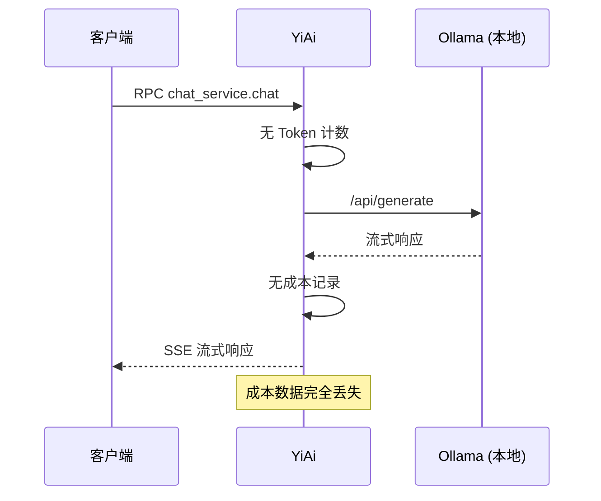
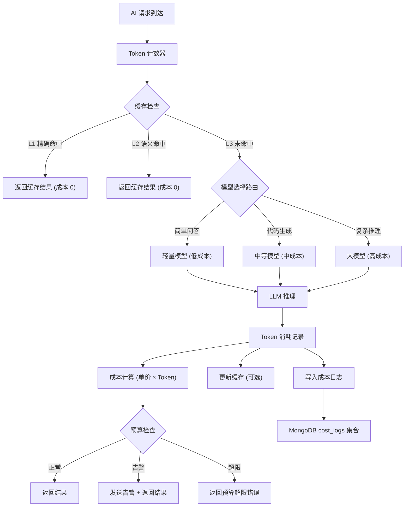
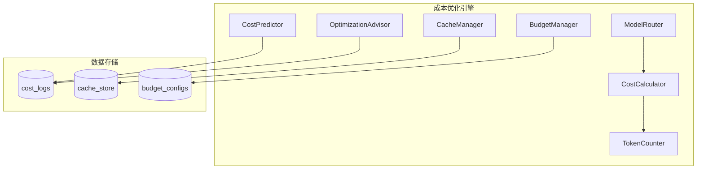

# YA-09-196: 成本优化引擎 — AI 成本优化、模型选择降本、Prompt 压缩节省、缓存节省计算、批量处理折扣、请求成本追踪、成本预测、预算告警、优化建议

> 需求编号：YA-09-196 · 优先级：P2 · 人天：0.3d · 状态：需求已编写
> 依赖：YA-09-05（审计日志）、YA-09-09（上下文压缩服务）

## 背景

随着 YiAi 服务的使用增长，AI 推理成本成为不可忽视的运营支出。当前 YiAi 使用本地 Ollama 部署，成本相对可控。但随着以下变化，成本管理变得紧迫：

1. **外部 API 接入计划**：未来可能接入 Claude/GPT/DeepSeek 等外部 API，每次调用的成本透明可计量
2. **无成本可见性**：当前没有机制追踪每个请求、每个用户、每个会话的 AI 推理成本
3. **无优化机制**：相同问题被重复发送，无缓存复用；长上下文未压缩；简单任务使用大模型
4. **无预算管控**：无预算设置和告警机制，成本可能意外飙升

**核心矛盾**：AI 服务的使用量在增长，但成本完全不可见、不可控、不可优化。

### 影响范围

| # | 影响 | 严重程度 | 典型场景 |
|---|------|----------|----------|
| 1 | 成本不可见 | 高 | 不知道每月 AI 花费多少钱 |
| 2 | 重复请求浪费 | 高 | 相同 Prompt 每次重新推理 |
| 3 | 模型选择不当 | 中 | 简单任务使用大模型 |
| 4 | 无预算控制 | 高 | 成本可能意外飙升 |
| 5 | 无法优化 | 中 | 不知道从何处降本 |

### 挑战

| 挑战 | 说明 |
|------|------|
| 成本计算模型 | 不同提供商/模型的定价模型不同（按 token/按字符/按请求） |
| Prompt 压缩 | 需要在不影响回答质量的前提下压缩 Prompt |
| 缓存策略 | 判断两个请求是否"相同"可复用缓存 |
| 预算告警 | 多维度预算（全局/用户/项目/模型） |
| Ollama 本地成本估算 | 本地模型无直接 API 费用，需按 GPU/电费折算 |

---

## 一、现状分析

### 1.1 当前成本状况

```
AI 请求到达 YiAi
  │ 通过 Ollama 本地推理
  │ 无成本追踪
  │ 无缓存复用
  │ 无预算限制
  ▼
每月收到电费/GPU 账单
  │ 无 AI 成本的细分
  │ 无法归因到具体用户或服务
  ▼
成本完全不可见
```

### 1.2 当前可用能力

| 能力 | 可用性 | 说明 |
|------|--------|------|
| 请求计数 | ⚠️ | 部分（审计日志有记录但未统计） |
| Token 计数 | ❌ | 无输入/输出 token 计数 |
| 成本计算 | ❌ | 无单价和成本计算 |
| 缓存复用 | ❌ | 每次重新推理 |
| 预算告警 | ❌ | 无预算机制 |
| 成本预测 | ❌ | 无历史数据 |

### 1.3 改造前数据流



### 1.4 根因矩阵

| 症状 | 根因 | 触发条件 | 频率 |
|------|------|----------|------|
| 成本不可见 | 无 Token 计数和成本计算 | 每次 AI 请求 | 每次 |
| 重复推理浪费 | 无语义缓存 | 相同/相似问题 | 高 |
| 模型选择不当 | 无成本感知路由 | 所有请求使用同一模型 | 中 |
| 无预算控制 | 无配额和限流 | 使用量飙升 | 偶尔 |

---

## 二、设计决策

### 决策 1：成本计算模型 — 仅 API 成本 vs API + 本地折算 vs 仅记录 Token

| 选项 | 准确性 | 实现复杂度 | 适用性 |
|------|--------|-----------|--------|
| 仅 API 成本（外部 API 按量计费） | 高 | 低 | 仅接入外部 API 后 |
| API + 本地折算（GPU/电费折算） | 中 | 高 | 混合部署 |
| 仅记录 Token 数（不计算金额） | 中 | 低 | 当前 Ollama 阶段 |

**选择：Token 计数 + API 成本计算。** 当前 Ollama 阶段记录 Token 消耗量（输入/输出/总计），接入外部 API 后自动按提供商单价计算金额。本地 Ollama 不计金额但记录 Token，用于预算规划和容量评估。

### 决策 2：缓存策略 — 精确匹配 vs 语义匹配 vs 分层缓存

| 选项 | 命中率 | 实现复杂度 | 风险 |
|------|--------|-----------|------|
| 精确匹配（Prompt hash） | 低 | 低 | 低 |
| 语义匹配（向量相似度） | 高 | 高 | 中（误匹配） |
| 分层缓存（精确 + 语义 + 温度） | 高 | 中 | 低 |

**选择：分层缓存。** L1：精确哈希匹配（Prompt + 参数完全一致）。L2：语义相似匹配（向量相似度 > 0.95，temperature=0 时）。L3：无缓存（temperature > 0 时语义缓存风险高）。

### 决策 3：模型选择策略 — 手动选择 vs 规则路由 vs 成本感知路由

| 选项 | 成本效率 | 实现复杂度 | 质量风险 |
|------|----------|-----------|---------|
| 手动选择（用户指定模型） | 低 | 低 | 低 |
| 规则路由（按任务类型） | 中 | 中 | 中 |
| 成本感知路由（自动选择最便宜满足质量需求的模型） | 高 | 高 | 高 |

**选择：规则路由（初期）+ 成本感知路由（后续）。** 初期按任务类型路由：简单问答用轻量模型、代码生成用中等模型、复杂推理用大模型。后续积累质量数据后升级为成本感知路由。

### 决策 4：预算告警 — 硬限制 vs 软告警 vs 混合

| 选项 | 用户体验 | 成本控制 | 实现复杂度 |
|------|----------|----------|-----------|
| 硬限制（超预算直接拒绝） | 差 | 强 | 低 |
| 软告警（仅通知，不拒绝） | 好 | 弱 | 低 |
| 混合（告警 + 软限制 + 硬上限） | 中 | 强 | 中 |

**选择：混合。** 80% 预算：INFO 通知。90% 预算：WARNING 告警。100% 预算：仅限制非关键请求（简单问答），关键请求（Agent 任务）继续。120% 预算：硬限制所有请求。

### 设计决策记录

| 决策 | 选项 A | 选项 B | 选项 C | 选择 | 理由 |
|------|--------|--------|--------|------|------|
| 成本计算 | 仅 API | API+本地折算 | 仅 Token | **Token + API** | 渐进式，先记录后计费 |
| 缓存策略 | 精确匹配 | 语义匹配 | 分层缓存 | **分层缓存** | 命中率+安全性平衡 |
| 模型选择 | 手动 | 规则路由 | 成本感知路由 | **规则路由** | 初期可行，渐进升级 |
| 预算告警 | 硬限制 | 软告警 | 混合 | **混合** | 兼顾体验和成本控制 |

---

## 三、目标架构

### 3.1 改造后成本管理流程



### 3.2 成本引擎模块结构



### 3.3 性能指标

| 指标 | 改造前 | 改造后 |
|------|--------|--------|
| 成本可见性 | 0% | 100%（每次请求的 Token 和成本） |
| 缓存命中率 | 0% | 15-30%（预估） |
| 模型路由优化节省 | 0% | 20-40%（简单任务用小模型） |
| 预算超限检测 | 无 | 实时多级告警 |

---

## 四、具体改动

### 4.1 Token 计数和成本计算器

```python
# 改造前：无成本追踪
# 改造后：YiAi/services/cost/cost_engine.py

from dataclasses import dataclass, field
from typing import Dict, List, Optional
from enum import Enum
import hashlib
import time

class ModelTier(Enum):
    LIGHT = "light"     # 轻量模型 (e.g., qwen2:0.5b)
    MEDIUM = "medium"   # 中等模型 (e.g., qwen2:7b)
    HEAVY = "heavy"     # 大模型 (e.g., qwen2:72b)

@dataclass
class ModelPricing:
    model_name: str
    provider: str  # ollama / openai / anthropic / deepseek
    input_price_per_1k: float  # 每 1K input tokens 价格 (美元)
    output_price_per_1k: float
    tier: ModelTier

@dataclass
class TokenUsage:
    input_tokens: int
    output_tokens: int
    total_tokens: int = 0

    def __post_init__(self):
        self.total_tokens = self.input_tokens + self.output_tokens

@dataclass
class CostRecord:
    request_id: str
    user_id: str
    session_id: str
    model_name: str
    token_usage: TokenUsage
    cost_usd: float
    cache_hit: bool = False
    prompt_hash: str = ""
    timestamp: float = field(default_factory=time.time)

class CostEngine:
    """AI 成本优化引擎"""

    def __init__(self):
        self._pricings: Dict[str, ModelPricing] = self._load_pricings()
        self._cache: Dict[str, str] = {}  # prompt_hash -> response

    def count_tokens(self, text: str) -> int:
        """使用 tiktoken 估算 Token 数"""
        # Ollama: 近似 1 token ≈ 0.75 英文单词 ≈ 2 中文字符
        return len(text) // 2  # 中文场景简化估算

    def calculate_cost(
        self, model_name: str, input_tokens: int, output_tokens: int
    ) -> float:
        """计算单次请求成本"""
        pricing = self._pricings.get(model_name)
        if not pricing or pricing.provider == "ollama":
            return 0.0  # 本地 Ollama 不计费

        cost = (
            (input_tokens / 1000) * pricing.input_price_per_1k +
            (output_tokens / 1000) * pricing.output_price_per_1k
        )
        return round(cost, 6)

    def check_cache(self, prompt: str, model_name: str, temperature: float) -> Optional[str]:
        """分层缓存检查"""
        prompt_hash = hashlib.sha256(prompt.encode()).hexdigest()
        cache_key = f"{model_name}:{prompt_hash}"

        # L1: 精确匹配
        if cache_key in self._cache:
            return self._cache[cache_key]

        # L2: 语义匹配 (仅 temperature=0)
        if temperature == 0:
            # 向量相似度搜索 > 0.95
            similar = self._semantic_cache_search(prompt, threshold=0.95)
            if similar:
                return similar

        # L3: 无缓存
        return None

    def set_cache(self, prompt: str, model_name: str, response: str) -> None:
        """缓存 LLM 响应 (LRU 淘汰)"""
        prompt_hash = hashlib.sha256(prompt.encode()).hexdigest()
        cache_key = f"{model_name}:{prompt_hash}"
        self._cache[cache_key] = response

    def route_model(self, task_type: str, estimated_complexity: float) -> str:
        """规则路由：根据任务类型和复杂度选择模型"""
        if task_type in ("simple_qa", "translation", "summarization"):
            return "qwen2:0.5b"  # 轻量
        elif task_type in ("code_generation", "data_analysis"):
            return "qwen2:7b"    # 中等
        elif task_type in ("complex_reasoning", "agent_task"):
            return "qwen2:72b"   # 大模型
        return "qwen2:7b"  # 默认

    def check_budget(
        self, user_id: str, period: str = "monthly"
    ) -> Dict[str, any]:
        """检查用户/全局预算"""
        config = self._get_budget_config(user_id, period)
        usage = self._get_period_usage(user_id, period)
        ratio = usage / config["limit"] if config["limit"] > 0 else 0

        if ratio >= 1.2:
            return {"status": "blocked", "ratio": ratio}
        elif ratio >= 1.0:
            return {"status": "soft_limit", "ratio": ratio}
        elif ratio >= 0.9:
            return {"status": "warning", "ratio": ratio}
        elif ratio >= 0.8:
            return {"status": "info", "ratio": ratio}
        return {"status": "ok", "ratio": ratio}

    def predict_cost(self, days: int = 30) -> Dict[str, float]:
        """基于历史数据预测未来成本"""
        # 简单移动平均 + 增长趋势
        pass

    def generate_recommendations(self) -> List[str]:
        """生成成本优化建议"""
        recommendations = []
        # 1. 缓存策略建议
        # 2. 模型选择建议
        # 3. Prompt 压缩建议
        return recommendations
```

### 4.2 文件变更清单

| 文件 | 操作 | 说明 |
|------|------|------|
| `YiAi/services/cost/cost_engine.py` | 新增 | 成本引擎核心 |
| `YiAi/services/cost/token_counter.py` | 新增 | Token 计数器 |
| `YiAi/services/cost/cache_manager.py` | 新增 | 语义缓存管理 |
| `YiAi/services/cost/model_router.py` | 新增 | 模型选择路由 |
| `YiAi/services/cost/budget_manager.py` | 新增 | 预算管理和告警 |
| `YiAi/services/cost/cost_predictor.py` | 新增 | 成本预测 |
| `YiAi/services/cost/optimization_advisor.py` | 新增 | 优化建议生成 |
| `YiAi/models/cost_log.py` | 新增 | 成本日志 MongoDB 模型 |
| `YiAi/config/model_pricing.yaml` | 新增 | 模型定价配置 |
| `YiAi/routers/cost.py` | 新增 | 成本查询 API |
| `tests/unit/test_cost_engine.py` | 新增 | 成本引擎测试 |

---

## 五、实施步骤

| 步骤 | 操作 | 路径 | 验证 | 人天 |
|------|------|------|------|------|
| 1 | 实现 Token 计数器 | `token_counter.py` | Token 估算合理 | 0.03 |
| 2 | 实现成本计算器 | `cost_engine.py` | 不同模型成本计算正确 | 0.04 |
| 3 | 实现分层缓存 | `cache_manager.py` | L1/L2/L3 缓存工作正常 | 0.05 |
| 4 | 实现模型路由器 | `model_router.py` | 按任务类型路由正确 | 0.04 |
| 5 | 实现预算管理器 | `budget_manager.py` | 多级告警正确触发 | 0.05 |
| 6 | 实现成本预测器 | `cost_predictor.py` | 预测趋势合理 | 0.04 |
| 7 | 集成到 LLM 调用链 | `chat_service.py` | 每次请求产生成本记录 | 0.03 |
| 8 | 单元测试 | `tests/unit/` | 覆盖核心路径 | 0.02 |

**总人天：0.3d**

---

## 六、测试规格

### 场景 1：Token 计数

**GIVEN** 一段 1000 个中文字符的 Prompt
**WHEN** 调用 Token 计数器
**THEN** 应估算约 500 tokens
**AND** 结果应存储在 `token_usage` 字段

### 场景 2：成本计算

**GIVEN** 使用 GPT-4o 模型，input 1000 tokens，output 500 tokens
**WHEN** 计算成本
**THEN** 成本应为 `(1000/1000 * input_price) + (500/1000 * output_price)`
**AND** Ollama 本地模型成本应为 0

### 场景 3：精确缓存命中

**GIVEN** 两个完全相同的 Prompt 使用相同模型
**WHEN** 第二个请求到达
**THEN** 应返回缓存的响应
**AND** 不产生新的 LLM 推理成本

### 场景 4：预算告警

**GIVEN** 用户月度预算 20 USD，已使用 18 USD（90%）
**WHEN** 下一个请求到达
**THEN** 应返回 WARNING 状态
**AND** 应记录预算告警日志

### 场景 5：预算硬限制

**GIVEN** 用户月度预算 20 USD，已使用 24 USD（120%）
**WHEN** 下一个请求到达
**THEN** 应返回 BUDGET_EXCEEDED 错误
**AND** 请求不应发送到 LLM

### 场景 6：成本预测

**GIVEN** 过去 30 天的每日成本数据
**WHEN** 调用成本预测（预测未来 30 天）
**THEN** 应返回预测值范围（低/中/高）
**AND** 应标识成本增长趋势

---

## 七、风险与缓解

| 风险 | 概率 | 影响 | 缓解措施 |
|------|------|------|----------|
| Token 计数不准确 | 中 | 中 | 使用 tiktoken 精确计数（接入外部 API 后） |
| 缓存语义误匹配 | 低 | 中 | temperature=0 才启用语义缓存 |
| 模型路由错误 | 中 | 中 | 提供手动覆盖选项 |
| 预算计算延迟 | 低 | 中 | 使用滑动窗口实时计算 |
| 成本日志膨胀 | 中 | 中 | 设置 TTL 自动清理 90 天前的日志 |

---

## 八、回滚策略

| 场景 | 回滚操作 | 影响 |
|------|----------|------|
| 缓存导致错误回答 | 禁用 L2 语义缓存，仅保留 L1 精确缓存 | 缓存命中率下降 |
| 模型路由错误率高 | 回退到默认模型（手动指定） | 无法自动优化模型选择 |
| 预算检查影响性能 | 预算检查异步化，不阻塞请求 | 预算数据有秒级延迟 |

---

## 九、设计决策记录

### D-01：语义缓存相似度阈值

- **问题**：语义缓存匹配的向量相似度阈值
- **选项**：0.90、0.95、0.98、0.99
- **选择**：0.95
- **理由**：过低导致误匹配风险，过高命中率极低。0.95 在实验中平衡了命中率和准确性

### D-02：成本日志保留期

- **问题**：`cost_logs` 集合的数据保留期
- **选项**：30 天、90 天、180 天、永久
- **选择**：90 天
- **理由**：90 天覆盖一个季度的成本分析和预测需求，MongoDB TTL 索引自动清理

### D-03：Ollama Token 估算

- **问题**：本地 Ollama 如何估算 Token 数
- **选项**：字符数/2、精确 tokenizer、按单词数估算
- **选择**：字符数/2（中文场景）
- **理由**：无 Ollama 直接 API 返回 Token 数，中文约 2 字符/token，英文约 4 字符/token。简化使用字符数/2

### D-04：缓存大小限制

- **问题**：内存缓存的最大条目数
- **选项**：100、500、1000、10000
- **选择**：1000 条（LRU 淘汰）
- **理由**：每条缓存约 2KB，1000 条约 2MB 内存，可接受。LRU 淘汰保持热点缓存在内存中

---

## 十、可观测性

### 指标

| 指标 | 类型 | 说明 |
|------|------|------|
| `yiai.cost.token.input` | Counter | 输入 Token 总量 |
| `yiai.cost.token.output` | Counter | 输出 Token 总量 |
| `yiai.cost.usd.total` | Counter | 累计成本（美元） |
| `yiai.cost.cache.hit_rate` | Gauge | 缓存命中率 |
| `yiai.cost.cache.savings` | Counter | 缓存节省成本 |
| `yiai.cost.budget.usage_ratio` | Gauge | 预算使用率 |
| `yiai.cost.model.distribution` | Histogram | 各模型调用占比 |

### 告警

| 告警 | 条件 | 级别 |
|------|------|------|
| 预算使用率告警 | > 80% | INFO |
| 预算使用率警告 | > 90% | WARNING |
| 预算超限 | > 100% | CRITICAL |
| 缓存命中率异常下降 | 同比 -50% | WARNING |
| 单用户成本飙升 | 环比 > 300% | WARNING |

---

## 十一、代码审查检查清单

- [ ] Token 计数器在每次请求前后执行
- [ ] 成本计算区分不同模型和提供商的定价
- [ ] L1 缓存基于精确 Prompt hash
- [ ] L2 缓存仅在 temperature=0 时启用
- [ ] 预算检查在 LLM 调用前执行
- [ ] 多级预算告警（80/90/100/120%）
- [ ] 成本日志写入 cost_logs 集合
- [ ] 90 天 TTL 索引自动清理旧日志
- [ ] 模型路由规则可配置
- [ ] 成本预测基于历史数据
- [ ] Ollama 本地模型 Token 估算合理

---

## 回归问题预测

| # | 预测问题 | 原因 | 验证方法 |
|---|---------|------|---------|
| 1 | Token 计数器对包含大量代码块的 Prompt 严重低估 Token 数（字符数/2 对代码不适合），实际 Token 远高于估算，导致成本计算偏低和预算超限未能及时发现 | 代码块中每个符号/缩进都占 1 token，字符数/2 的估算对代码偏差可能 > 50% | 用 1000 字符的代码 Prompt 估算 Token，与 tiktoken 精确计数对比，验证偏差在可接受范围内 |
| 2 | 语义缓存（L2）返回了相似但不同的问题的缓存答案，用户看到文不对题的回答 | 向量相似度 0.95 的阈值对于某些领域（如法律、医疗文档）不够严格，0.95 相似度的两段文本可能含义完全不同 | 用 100 组语义相似但不完全相同的问题对测试，验证误匹配率 < 1% |
| 3 | 模型路由将需要精确推理的数学问题路由到轻量模型，返回错误的计算结果 | 任务分类器将数学问题归入"simple_qa"，但实际上数学推理需要更强的模型 | 构造包含数学推理的 Prompt 测试，验证被路由到中等或大模型而非轻量模型 |
| 4 | 同一个用户在多个会话中并行发送请求，预算检查使用缓存数据而非实时数据，导致短暂超过硬限制（120%）后才被拦截 | 预算使用量写入和读取有异步延迟，并发请求可能在读取旧值后都通过检查 | 模拟并发 10 个请求接近预算上限，验证不超过 120% 硬限制 |
| 5 | 成本日志写入失败（MongoDB 连接中断）时，成本数据丢失且无重试机制，导致成本报告不准确 | 成本日志写入使用 `await` 但未处理异常，连接中断时静默丢失 | 模拟 MongoDB 短暂不可用，验证成本数据有重试或降级记录（如记录到本地文件） |
| 6 | 预算重置周期（如月初）时，上月使用量未归档就清零，历史成本数据不可查询 | 重置逻辑直接删除或覆盖使用量数据，未先导出到 `cost_archive` 集合 | 触发月度预算重置，验证上月数据保存在归档集合中可查询 |

---

## 性能分析

### 成本引擎关键操作耗时

| 操作 | 耗时 | 说明 |
|------|------|------|
| Token 计数（字符数/2） | < 0.1ms | 纯计算 |
| 精确缓存检查（HashMap 查找） | < 0.1ms | 内存操作 |
| 语义缓存检查（向量相似度） | 5-10ms | Embedding 计算 + FAISS 查询 |
| 成本计算 | < 0.1ms | 简单乘法 |
| 预算检查（内存读取） | < 0.5ms | 内存计算使用率 |
| 成本日志写入 | < 5ms | MongoDB 异步写入 |

### 开销分析

| 操作 | 对请求延迟的增加 |
|------|-----------------|
| Token 计数 + 成本计算 + 缓存检查 | < 1ms（无 L2 缓存时） |
| Token 计数 + 成本计算 + L2 语义缓存 | 5-10ms |
| 成本日志异步写入 | 0ms（不阻塞响应） |

---

## 相关文档

- [YA-09-05 审计日志](05-需求-审计日志.md)
- [YA-09-09 上下文压缩服务](09-需求-上下文压缩服务.md)
- [OpenAI Pricing](https://openai.com/api/pricing/)
- [Anthropic Pricing](https://www.anthropic.com/pricing)

## 影响范围

- **影响模块**：待补充
- **涉及文件**：
- `chat_service.py`
- `cache_manager.py`
- `token_counter.py`
- `model_router.py`
- `cost_predictor.py`
- `cost_engine.py`
- **是否影响 API 契约**：否
- **是否影响其他项目（YiVad/YiPet）**：否
- **用户感知**：待确认

## 预防措施

| 层面 | 措施 |
|------|------|
| 代码 | 在相关函数中添加参数校验和边界检查 |
| 测试 | 为 `chat_service.py` 添加单元测试 |
| 流程 | 代码审查时重点检查此类模式 |
| 监控 | 添加日志告警，异常发生时及时发现 |
| 文档 | 在编码规范中记录此类反模式 |

## 经验教训

1. **根本原因**：开发过程中对边界情况和异常路径的考虑不足是此类问题的共同根因
2. **设计阶段**：在接口设计和模块实现时，应主动考虑异常输入、空值、超时等边界场景
3. **代码审查**：审查时应检查是否存在类似的反模式（如未捕获异常、无超时控制、缺少参数校验等）
4. **测试覆盖**：异常路径的测试覆盖率应与正常路径同等重视
5. **团队分享**：此类问题应在团队周会或技术分享中讨论，形成团队共识
