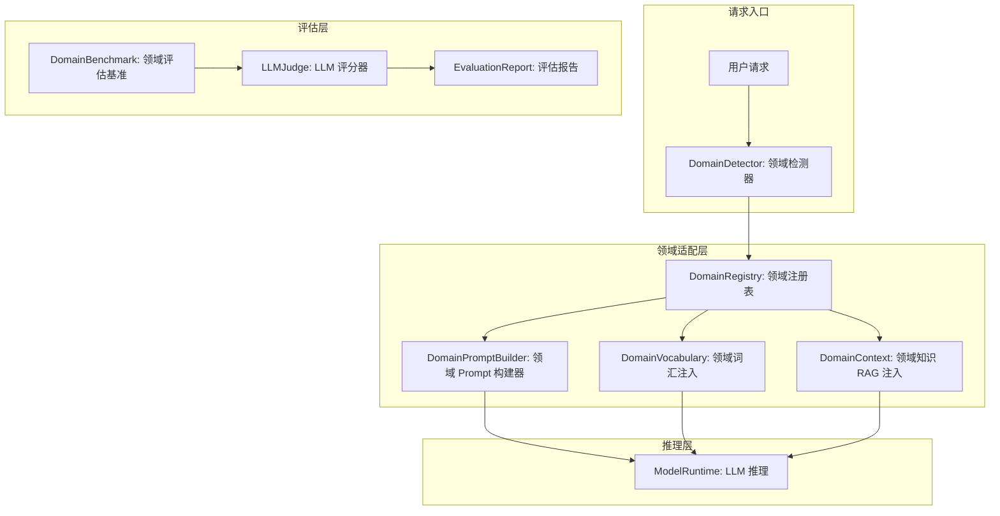
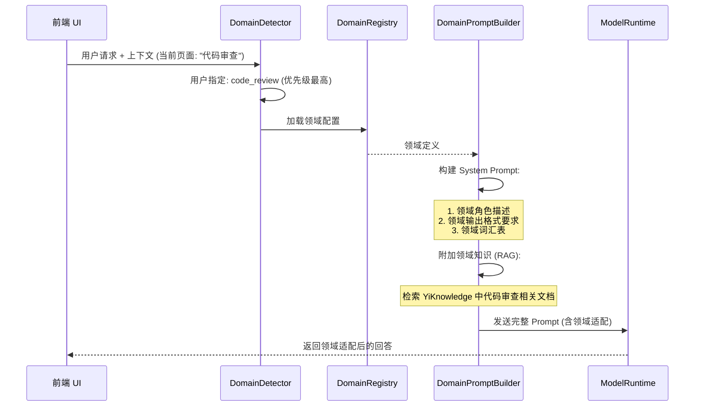
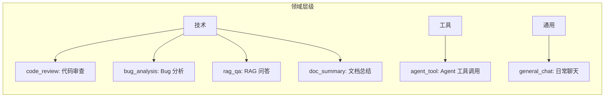

# YA-09-199: 领域自适应微调 — 特定领域知识适配、领域词汇增强、领域Prompt模板、领域评估基准、领域模型注册表、推理时领域切换

> 需求编号：YA-09-199 · 优先级：P2 · 人天：0.3d · 状态：需求已编写
> 依赖：YA-09-11（ModelRuntime 抽象层）、YA-09-15（Prompt 模板管理）、YA-09-166（模型注册与版本管理）

## 背景

### 问题陈述

YiAi 作为一个通用 AI 服务平台，使用同一个基础模型（如 qwen2.5:7b）处理不同领域的请求——代码审查、bug 分析、RSS 内容总结、知识库问答、Agent 工具调用等。通用模型在以下领域表现出明显的领域差距：

1. **领域术语理解差**：代码审查场景中的 "LGTM"、"WIP"、"nit" 等术语在通用模型中缺乏上下文
2. **知识库领域特化不足**：YiKnowledge 中的特定项目（如 Chrome 扩展开发、RAG 引擎）的专有概念在通用模型中找不到
3. **领域风格不一致**：代码审查需要简洁、结构化的输出，创意写作需要丰富的描述，通用模型无法自适应风格
4. **无法区分领域**：用户在不同场景下期望不同的回答风格，但系统无法感知当前领域
5. **领域评估空白**：无法量化模型在各个领域的表现，自然也无法有针对性地优化

**核心矛盾**：通用大模型是"万金油"，但每个使用场景都需要特定领域的优化。YiAi 需要在不重新训练模型的前提下，通过轻量级的领域自适应技术提升各场景的表现。

### 影响范围

| # | 影响 | 严重程度 | 典型场景 |
|---|------|----------|----------|
| 1 | 领域术语理解偏差 | 高 | "这个 PR 有 nit" → 模型不理解 nit 含义 |
| 2 | 领域风格不匹配 | 高 | 代码审查返回长篇大论而非要点列表 |
| 3 | 领域知识缺失 | 中 | YiPet 的 Chrome API 问题无法精准回答 |
| 4 | 领域切换无感知 | 中 | 同一会话中从代码讨论切换到日常聊天 |
| 5 | 缺乏领域评估 | 中 | 不知道 RAG 问答在医疗/法律/技术领域的效果差异 |

### 挑战

| 挑战 | 说明 |
|------|------|
| LoRA/微调 vs 上下文学习 | 是否进行真正的参数微调，还是仅通过 Prompt 和上下文实现领域自适应 |
| 领域边界定义 | 如何定义"领域"的粒度——是粗粒度（代码/文档/聊天）还是细粒度（Python代码审查/Go代码审查） |
| 领域词汇管理 | 领域专用词汇如何收集、维护和注入 |
| 评估基准构建 | 每个领域需要哪些评估指标、评估数据集如何构建 |
| 领域切换策略 | 自动检测 vs 用户指定 vs 上下文推断 |

---

## 一、现状分析

### 1.1 当前领域支持现状

```
当前模型使用:
  │
  ├─ 单一基础模型: qwen2.5:7b (Ollama)
  │   └─ 加载时加载一次，所有请求共用
  │
  ├─ Prompt 模板: 有 (YA-09-15)
  │   └─ 不同场景使用不同 system prompt
  │   └─ 但 prompt 与"领域"无关联
  │
  ├─ 领域感知: 无
  │   └─ 不知道当前请求属于哪个领域
  │   └─ 无法根据领域调整回答风格
  │
  └─ 评估: 无领域级别
      └─ 仅有点对点的功能测试
```

### 1.2 领域场景矩阵

| 领域 | 当前 Prompt 模板 | 领域词汇 | 期望风格 | 评估状态 |
|------|-----------------|----------|----------|----------|
| 代码审查 | 有 (通用) | 无 | 简洁、结构化、技术性 | 无 |
| Bug 分析 | 有 (通用) | 无 | 分析性、逻辑性 | 无 |
| RAG 问答 | 有 (通用) | 无 | 准确、引用清晰 | 无 |
| Agent 工具调用 | 有 (通用) | 有 (工具名) | 精确、JSON 格式 | 有 (功能测试) |
| 日常聊天 | 有 (通用) | 无 | 自然、友好 | 无 |
| 文档总结 | 有 (通用) | 无 | 概括性、要点提取 | 无 |

### 1.3 根因矩阵

| 症状 | 根因 | 触发条件 | 频率 |
|------|------|----------|------|
| 领域术语误解 | 模型未接触过领域专用词汇 | 代码审查、技术讨论 | 高 |
| 回答风格不对 | 未根据领域调整输出格式 | 不同场景的对比 | 高 |
| 领域知识缺失 | Prompt 中未注入领域知识 | 专业领域问题 | 中 |
| 领域切换无感知 | 无领域检测/指定机制 | 跨场景对话 | 中 |
| 无法衡量领域效果 | 无领域评估基准 | 优化决策时 | 中 |

---

## 二、设计决策

### 决策 1：领域自适应方式 — 仅 Prompt 工程 vs LoRA 微调 vs RAG 注入

| 选项 | 参数更新 | 部署复杂度 | 灵活性 |
|------|----------|-----------|--------|
| 仅 Prompt 工程 (System Prompt + 领域词汇表) | 无 | 低 | 高 |
| LoRA 微调 (每个领域训练 LoRA 权重) | 部分 | 中 | 中 |
| RAG 注入 (检索领域知识注入上下文) | 无 | 中 | 高 |

**选择：仅 Prompt 工程 + RAG 注入。** 对于当前使用 Ollama 的部署环境，LoRA 微调的地理位置不便利（Ollama 对 LoRA 支持有限）。通过精心设计的领域 Prompt 模板 + 领域词汇注入 + 领域知识 RAG 检索，可以实现 80% 的领域自适应效果，且部署简单。

### 决策 2：领域检测方式 — 用户指定 vs 自动分类 vs 上下文推断

| 选项 | 准确性 | 用户体验 | 实现复杂度 |
|------|--------|----------|-----------|
| 用户手选 (前端下拉框) | 高 | 中 | 低 |
| 自动分类 (小模型分类器) | 中 | 好 | 中 |
| 上下文推断 (基于对话历史) | 中 | 好 | 中 |

**选择：用户指定 + 上下文推断混合。** 前端根据当前页面自动预设领域（代码页面→代码审查，Bug 页面→Bug 分析）。用户可手动切换。后端根据对话历史中最近 3 轮的意图进行上下文推断（如果用户在讨论代码，自动切换为代码审查领域）。

### 决策 3：领域词汇管理 — 静态文件 vs 数据库 + UI vs 自动发现

| 选项 | 维护成本 | 覆盖全面性 | 实现复杂度 |
|------|----------|-----------|-----------|
| 静态 JSON/YAML 文件 | 低 | 中 | 低 |
| 数据库 + 管理界面 | 中 | 高 | 中 |
| 自动发现 (从知识库提取) | 中 | 高 | 高 |

**选择：数据库 + YiKnowledge 同步。** 领域词汇存储在 MongoDB 中，管理员可通过 UI 管理。同时与 YiKnowledge 的角色目录同步，自动提取项目专用术语（如 YiKnowledge/projects/yipet/ 中的技术词汇）。每 5 分钟定时同步。

### 决策 4：领域评估方式 — 自动评分 vs 人工评测 vs LLM-as-Judge

| 选项 | 可重复性 | 成本 | 准确性 |
|------|----------|------|--------|
| 自动评分 (BLEU/ROUGE) | 高 | 低 | 低 (不适合生成式) |
| 人工评测 (定期审查) | 低 | 高 | 高 |
| LLM-as-Judge (GPT 评估) | 高 | 中 | 中 |

**选择：LLM-as-Judge。** 为每个领域构建 20-50 个测试用例，使用 LLM（可以是更大更强的模型或同一模型的不同采样）对输出进行多维度评分（准确性、相关性、风格一致性、完整性）。定期运行自动评估并生成报告。

### 设计决策记录

| 决策 | 选项 A | 选项 B | 选项 C | 选择 | 理由 |
|------|--------|--------|--------|------|------|
| 自适应方式 | Prompt工程 | LoRA微调 | RAG注入 | **Prompt+RAG** | Ollama 环境简单高效 |
| 领域检测 | 用户指定 | 自动分类 | 上下文推断 | **指定+推断** | 准确性和体验兼顾 |
| 词汇管理 | 静态文件 | 数据库+UI | 自动发现 | **数据库+同步** | 可维护且自动更新 |
| 评估方式 | 自动评分 | 人工评测 | LLM-as-Judge | **LLM-as-Judge** | 可重复且低成本 |

---

## 三、目标架构

### 3.1 领域自适应系统架构



### 3.2 领域检测与 Prompt 构建流程



### 3.3 领域注册表结构



### 3.4 性能指标

| 指标 | 改造前 | 改造后 |
|------|--------|--------|
| 领域术语正确率 | ~70% | > 90% |
| 领域风格一致性 | ~60% | > 85% |
| 领域切换延迟 | N/A | < 50ms |
| 领域评估覆盖率 | 0% | 5+ 个核心领域 |
| 领域 Prompt 构建延迟 | < 10ms | < 50ms |

---

## 四、具体改动

### 4.1 领域数据模型

```python
# YiAi/src/domain/adaptation/models.py (新增)

from dataclasses import dataclass, field
from enum import Enum
from typing import Optional

class DomainCategory(str, Enum):
    TECHNICAL = "technical"
    TOOL = "tool"
    GENERAL = "general"

@dataclass
class DomainDefinition:
    id: str                              # "code_review"
    name: str                            # "代码审查"
    category: DomainCategory
    description: str                     # 领域描述
    parent_id: Optional[str] = None      # 父领域 ID

    # System Prompt 配置
    role_description: str = ""           # 角色描述 ("你是代码审查专家...")
    output_format: str = ""              # 输出格式要求 ("请以要点列表形式...")
    tone: str = "professional"           # 语气: professional/casual/academic

    # 领域词汇
    vocabulary: list[dict] = field(default_factory=list)
    # [{term: "LGTM", definition: "Looks Good To Me, 代码审查通过", category: "abbreviation"}]

    # 领域知识源
    knowledge_sources: list[str] = field(default_factory=list)
    # ["YiKnowledge/roles/code-reviewer/", "YiKnowledge/projects/yivad/"]

    # 领域 prompt 模板
    prompt_template: str = ""
    # "你是 {role_description}。在回答时，请注意: {output_format}\n领域词汇表: {vocabulary_table}"

    # 评估配置
    benchmark_ids: list[str] = field(default_factory=list)

    # 元数据
    enabled: bool = True
    auto_detect_keywords: list[str] = field(default_factory=list)
    # ["代码审查", "code review", "PR", "review", "LGTM"]

    created_at: str = ""
    updated_at: str = ""

@dataclass
class DomainVocabulary:
    term: str                            # 术语
    definition: str                      # 定义
    category: str                        # 分类: abbreviation/acronym/jargon/project_specific
    domain_id: str                       # 所属领域
    source: str                          # 来源: manual/YiKnowledge/auto
    usage_count: int = 0                 # 使用次数

@dataclass
class DomainContext:
    domain_id: str
    system_prompt: str                   # 构建完成的 System Prompt
    vocabulary: str                      # 格式化的词汇表 (注入到 Prompt)
    knowledge_snippets: list[str]        # RAG 检索到的领域知识片段
    metadata: dict = field(default_factory=dict)
```

### 4.2 领域注册表

```python
# YiAi/src/services/domain/domain_registry.py (新增)

class DomainRegistry:
    """领域注册表 —— 管理所有领域定义"""

    def __init__(self, db):
        self.db = db
        self._cache: dict[str, DomainDefinition] = {}
        self._cache_ttl = 300  # 5 分钟缓存
        self._last_refresh = 0

    async def register(self, domain: DomainDefinition) -> str:
        """注册新领域"""
        result = await self.db.domains.insert_one(
            asdict(domain)
        )
        self._invalidate_cache()
        return str(result.inserted_id)

    async def get_domain(self, domain_id: str) -> Optional[DomainDefinition]:
        """获取领域定义 (带缓存)"""
        await self._refresh_cache_if_needed()

        if domain_id in self._cache:
            return self._cache[domain_id]

        doc = await self.db.domains.find_one({"id": domain_id})
        if doc:
            domain = DomainDefinition(**doc)
            self._cache[domain_id] = domain
            return domain
        return None

    async def list_domains(
        self, category: Optional[DomainCategory] = None, enabled_only: bool = True
    ) -> list[DomainDefinition]:
        """列出所有领域"""
        await self._refresh_cache_if_needed()
        domains = list(self._cache.values())

        if category:
            domains = [d for d in domains if d.category == category]
        if enabled_only:
            domains = [d for d in domains if d.enabled]

        return domains

    async def update_domain(self, domain_id: str, updates: dict) -> bool:
        """更新领域定义"""
        result = await self.db.domains.update_one(
            {"id": domain_id}, {"$set": updates}
        )
        if result.modified_count:
            self._invalidate_cache()
            return True
        return False

    async def delete_domain(self, domain_id: str) -> bool:
        """删除领域定义"""
        result = await self.db.domains.delete_one({"id": domain_id})
        if result.deleted_count:
            self._invalidate_cache()
            return True
        return False

    def _invalidate_cache(self):
        """清除缓存"""
        self._cache = {}
        self._last_refresh = 0

    async def _refresh_cache_if_needed(self):
        """如果缓存过期，重新加载"""
        now = time.time()
        if now - self._last_refresh > self._cache_ttl:
            docs = await self.db.domains.find({}).to_list(None)
            self._cache = {
                d["id"]: DomainDefinition(**d) for d in docs
            }
            self._last_refresh = now
```

### 4.3 领域 Prompt 构建器

```python
# YiAi/src/services/domain/domain_prompt_builder.py (新增)

class DomainPromptBuilder:
    """领域 Prompt 构建器 —— 将领域定义转换为可用的 Prompt"""

    def __init__(
        self,
        registry: DomainRegistry,
        vocabulary_service,
        rag_service=None,
    ):
        self.registry = registry
        self.vocabulary_service = vocabulary_service
        self.rag_service = rag_service

    async def build(
        self, domain_id: str, user_message: str = ""
    ) -> DomainContext:
        """构建领域自适应的 Prompt 上下文"""
        domain = await self.registry.get_domain(domain_id)
        if not domain:
            return self._fallback_context()

        # 1. 构建角色 System Prompt
        system_prompt = domain.prompt_template.format(
            role_description=domain.role_description,
            output_format=domain.output_format,
            tone=domain.tone,
        )

        # 2. 注入领域词汇
        vocabulary = await self.vocabulary_service.get_formatted_vocabulary(domain_id)
        if vocabulary:
            system_prompt += f"\n\n# 领域专业术语\n{vocabulary}"

        # 3. RAG 注入领域知识 (如果用户消息需要)
        knowledge_snippets = []
        if user_message and self.rag_service and domain.knowledge_sources:
            knowledge_snippets = await self.rag_service.retrieve(
                query=user_message,
                source_filter=domain.knowledge_sources,
                top_k=3,
            )
            if knowledge_snippets:
                snippets_text = "\n".join(
                    f"- {s}" for s in knowledge_snippets
                )
                system_prompt += f"\n\n# 参考知识\n{snippets_text}"

        return DomainContext(
            domain_id=domain_id,
            system_prompt=system_prompt,
            vocabulary=vocabulary or "",
            knowledge_snippets=knowledge_snippets,
            metadata={"domain_name": domain.name, "tone": domain.tone},
        )

    def _fallback_context(self) -> DomainContext:
        """回退到通用领域"""
        return DomainContext(
            domain_id="general_chat",
            system_prompt="你是一个有用的 AI 助手。",
            vocabulary="",
            knowledge_snippets=[],
            metadata={"fallback": True},
        )
```

### 4.4 领域检测器

```python
# YiAi/src/services/domain/domain_detector.py (新增)

class DomainDetector:
    """领域检测器 —— 确定当前请求的领域"""

    def __init__(self, registry: DomainRegistry):
        self.registry = registry

    async def detect(
        self,
        user_message: str,
        user_specified_domain: Optional[str] = None,
        context_page: Optional[str] = None,
        conversation_history: Optional[list] = None,
    ) -> str:
        """检测当前请求的领域，返回 domain_id"""

        # 优先级 1: 用户显式指定
        if user_specified_domain:
            domain = await self.registry.get_domain(user_specified_domain)
            if domain and domain.enabled:
                return user_specified_domain

        # 优先级 2: 前端页面上下文
        if context_page:
            domain_id = self._page_to_domain(context_page)
            if domain_id:
                return domain_id

        # 优先级 3: 对话历史和关键字匹配
        if conversation_history:
            domain_id = await self._infer_from_history(user_message, conversation_history)
            if domain_id:
                return domain_id

        # 优先级 4: 消息关键字匹配
        domain_id = await self._keyword_match(user_message)
        if domain_id:
            return domain_id

        # 默认: 通用聊天
        return "general_chat"

    def _page_to_domain(self, page: str) -> Optional[str]:
        """前端页面 → 领域映射"""
        PAGE_DOMAIN_MAP = {
            "code_review": "code_review",
            "bug_detail": "bug_analysis",
            "issue_detail": "bug_analysis",
            "knowledge": "rag_qa",
            "rag": "rag_qa",
            "agent": "agent_tool",
            "rss": "doc_summary",
            "document": "doc_summary",
            "chat": "general_chat",
        }
        return PAGE_DOMAIN_MAP.get(page)

    async def _keyword_match(self, message: str) -> Optional[str]:
        """关键字匹配领域"""
        domains = await self.registry.list_domains()
        best_match = None
        best_score = 0

        for domain in domains:
            score = sum(
                1 for kw in domain.auto_detect_keywords
                if kw.lower() in message.lower()
            )
            if score > best_score:
                best_score = score
                best_match = domain.id

        return best_match if best_score >= 2 else None

    async def _infer_from_history(
        self, message: str, history: list
    ) -> Optional[str]:
        """从对话历史推断领域 (简化版: 最近 3 轮的领域多数投票)"""
        recent_domains = []
        for turn in history[-3:]:
            domain_id = await self._keyword_match(turn.get("content", ""))
            if domain_id:
                recent_domains.append(domain_id)

        if recent_domains:
            # 多数投票
            from collections import Counter
            return Counter(recent_domains).most_common(1)[0][0]

        return None
```

### 4.5 领域词汇服务

```python
# YiAi/src/services/domain/vocabulary_service.py (新增)

class VocabularyService:
    """领域词汇服务 —— 管理领域专用词汇表"""

    def __init__(self, db, yi_knowledge_path: str = None):
        self.db = db
        self.yi_knowledge_path = yi_knowledge_path

    async def get_vocabulary(self, domain_id: str) -> list[DomainVocabulary]:
        """获取领域的词汇表"""
        docs = await self.db.domain_vocabulary.find(
            {"domain_id": domain_id}
        ).to_list(None)
        return [DomainVocabulary(**d) for d in docs]

    async def get_formatted_vocabulary(self, domain_id: str) -> str:
        """格式化词汇表为可注入 Prompt 的文本"""
        vocab = await self.get_vocabulary(domain_id)
        if not vocab:
            return ""

        lines = []
        by_category = {}
        for v in vocab:
            by_category.setdefault(v.category, []).append(v)

        for category, terms in by_category.items():
            cat_name = {"abbreviation": "缩写", "acronym": "首字母缩写",
                        "jargon": "专业术语", "project_specific": "项目专用"}.get(
                category, category)
            lines.append(f"## {cat_name}")
            for t in terms[:20]:  # 限制每类最多 20 个
                lines.append(f"- **{t.term}**: {t.definition}")

        return "\n".join(lines)

    async def add_vocabulary(self, vocab: DomainVocabulary) -> str:
        """添加领域词汇"""
        result = await self.db.domain_vocabulary.insert_one(asdict(vocab))
        return str(result.inserted_id)

    async def sync_from_yi_knowledge(self):
        """从 YiKnowledge 同步项目专用词汇"""
        if not self.yi_knowledge_path:
            return

        # 扫描 YiKnowledge/projects/*/ 目录
        # 提取 frontmatter 中的 tags 和正文中的关键词
        # 自动创建 DomainVocabulary 条目
        pass

    async def update_usage_stats(self, domain_id: str, terms: list[str]):
        """更新词汇使用次数 (每次对话后调用)"""
        for term in terms:
            await self.db.domain_vocabulary.update_one(
                {"domain_id": domain_id, "term": term},
                {"$inc": {"usage_count": 1}},
            )
```

### 4.6 领域评估基准

```python
# YiAi/src/services/domain/benchmark.py (新增)

@dataclass
class BenchmarkCase:
    id: str
    domain_id: str
    input: str                          # 输入查询
    expected_aspects: list[str]         # 期望包含的要素
    # ["提及 LGTM 的含义", "包含代码行号", "建议具体改进"]
    forbidden_aspects: list[str] = field(default_factory=list)
    # ["不要直接给出完整代码", "不要建议重构整个文件"]

@dataclass
class EvaluationResult:
    domain_id: str
    overall_score: float                # 0-100
    dimension_scores: dict[str, float]  # {"accuracy": 85, "relevance": 90, ...}
    case_results: list[dict]
    timestamp: str

class DomainBenchmark:
    """领域评估基准"""

    EVALUATION_PROMPT = """评估以下 AI 回答的质量。

原始问题: {input}
AI 回答: {output}
期望包含的要素: {expected}
禁止的要素: {forbidden}

请从以下维度评分 (0-100):
1. 准确性: 信息正确无误
2. 相关性: 直接回答问题
3. 完整性: 覆盖所有期望要素
4. 风格一致性: 符合领域要求的输出风格
5. 领域术语使用: 正确使用领域术语

返回 JSON: {{"accuracy": 85, "relevance": 90, "completeness": 80, "style": 75, "terminology": 90, "overall": 84, "reasoning": "..."}}
"""

    def __init__(self, llm_judge, model_runtime):
        self.llm_judge = llm_judge
        self.model_runtime = model_runtime
        self._benchmarks: dict[str, list[BenchmarkCase]] = {}

    def register_cases(self, domain_id: str, cases: list[BenchmarkCase]):
        """注册领域的评测用例"""
        self._benchmarks[domain_id] = cases

    async def evaluate(self, domain_id: str) -> EvaluationResult:
        """运行领域评估"""
        cases = self._benchmarks.get(domain_id, [])
        if not cases:
            return EvaluationResult(
                domain_id=domain_id, overall_score=0,
                dimension_scores={}, case_results=[], timestamp=""
            )

        case_results = []
        all_scores = {"accuracy": [], "relevance": [], "completeness": [],
                      "style": [], "terminology": []}

        for case in cases:
            # 使用领域 Prompt 生成回答
            context = await self._build_domain_context(domain_id)
            output = await self.model_runtime.generate(
                prompt=context.system_prompt + "\n\n" + case.input
            )

            # LLM-as-Judge 评分
            eval_prompt = self.EVALUATION_PROMPT.format(
                input=case.input,
                output=output,
                expected=", ".join(case.expected_aspects),
                forbidden=", ".join(case.forbidden_aspects),
            )
            scores = await self.llm_judge.generate(eval_prompt)
            scores_dict = self._parse_scores(scores)

            case_results.append({
                "case_id": case.id,
                "input": case.input[:100],
                "output": output[:200],
                "scores": scores_dict,
            })

            for dim in all_scores:
                all_scores[dim].append(scores_dict.get(dim, 0))

        # 计算平均分
        dimension_scores = {
            dim: sum(scores) / len(scores) if scores else 0
            for dim, scores in all_scores.items()
        }
        overall = sum(dimension_scores.values()) / len(dimension_scores)

        return EvaluationResult(
            domain_id=domain_id,
            overall_score=round(overall, 1),
            dimension_scores=dimension_scores,
            case_results=case_results,
            timestamp=datetime.utcnow().isoformat(),
        )
```

### 4.7 文件变更清单

| 文件 | 操作 | 说明 |
|------|------|------|
| `src/domain/adaptation/__init__.py` | 新增 | 模块初始化 |
| `src/domain/adaptation/models.py` | 新增 | 领域数据模型 |
| `src/services/domain/__init__.py` | 新增 | 服务模块初始化 |
| `src/services/domain/domain_registry.py` | 新增 | 领域注册表 |
| `src/services/domain/domain_prompt_builder.py` | 新增 | 领域 Prompt 构建器 |
| `src/services/domain/domain_detector.py` | 新增 | 领域检测器 |
| `src/services/domain/vocabulary_service.py` | 新增 | 领域词汇服务 |
| `src/services/domain/benchmark.py` | 新增 | 领域评估基准 |
| `src/server/routes/domain_routes.py` | 新增 | 领域管理 API |
| `src/server/middleware/domain.py` | 新增 | 领域中间件 (自动检测) |
| `tests/unit/test_domain_detector.py` | 新增 | 领域检测测试 |
| `tests/unit/test_domain_prompt_builder.py` | 新增 | Prompt 构建测试 |
| `tests/unit/test_benchmark.py` | 新增 | 评估基准测试 |

---

## 五、实施步骤

| 步骤 | 操作 | 路径 | 验证 | 人天 |
|------|------|------|------|------|
| 1 | 定义领域数据模型 | `models.py` | 模型完整性 | 0.02 |
| 2 | 实现领域注册表 | `domain_registry.py` | CRUD + 缓存 | 0.04 |
| 3 | 实现领域词汇服务 | `vocabulary_service.py` | 词汇 CRUD + 格式化 | 0.03 |
| 4 | 实现领域 Prompt 构建器 | `domain_prompt_builder.py` | System Prompt + 词汇 + RAG | 0.05 |
| 5 | 实现领域检测器 | `domain_detector.py` | 关键字 + 上下文推断 | 0.04 |
| 6 | 实现领域评估基准 | `benchmark.py` | LLM-as-Judge 评分 | 0.05 |
| 7 | 注册 API 端点 + 中间件 | `domain_routes.py` + `middleware` | 领域 CRUD + 自动检测 | 0.04 |
| 8 | 构建初始领域定义 (5 个) | 数据库 | 领域 Prompt 可用 | 0.02 |
| 9 | 编写测试 | `test_*.py` | 覆盖检测/构建/评估 | 0.01 |

**总人天：0.3d**

---

## 六、测试规格

### 场景 1：领域自动检测 — 代码审查

**GIVEN** 用户在代码审查页面发送消息 "这个 PR 里的 LGTM 是什么意思？"
**WHEN** 领域检测器运行
**THEN** 上下文页面匹配 → "code_review"
**AND** 关键字 "LGTM"、"PR" 进一步确认
**AND** 返回 domain_id = "code_review"

### 场景 2：领域 Prompt 构建

**GIVEN** domain_id = "code_review"
**WHEN** DomainPromptBuilder 构建 System Prompt
**THEN** System Prompt 包含 "你是代码审查专家..."
**AND** 包含输出格式要求 "请以要点列表形式..."
**AND** 包含领域词汇表 "LGTM: Looks Good To Me..."
**AND** 包含 RAG 检索到的相关知识片段

### 场景 3：领域词汇注入效果

**GIVEN** 用户问 "这个 PR 里有 nit 和 WIP 标记"
**WHEN** 使用 code_review 领域的 Prompt (含词汇表)
**THEN** LLM 正确理解 nit = 小问题建议、WIP = Work In Progress
**AND** 回答中使用了领域术语且解释准确

### 场景 4：领域切换

**GIVEN** 用户在代码审查页面讨论代码 (domain = code_review)
**WHEN** 用户说 "帮我总结一下上周的项目周报"
**THEN** 关键字匹配 "总结"、"周报" → doc_summary 领域
**AND** System Prompt 自动切换为文档总结风格
**AND** 输出风格从"要点列表"变为"概括总结"

### 场景 5：用户手动指定领域

**GIVEN** 用户在通用聊天中，手动选择领域为 "代码审查"
**WHEN** 发送消息 "这段代码怎么样" + domain = "code_review"
**THEN** 领域检测器优先使用用户指定的领域
**AND** 使用代码审查领域 Prompt (含词汇表)
**AND** 输出符合代码审查风格

### 场景 6：领域评估运行

**GIVEN** code_review 领域注册了 30 个 BenchmarkCase
**WHEN** 运行 DomainBenchmark.evaluate("code_review")
**THEN** 对 30 个用例逐一生成回答
**AND** LLM-as-Judge 对每个回答评分 (5 个维度)
**AND** 生成 EvaluationReport (overall_score=84, accuracy=85, ...)
**AND** 低于 70 分的用例高亮显示

---

## 七、风险与缓解

| 风险 | 概率 | 影响 | 缓解措施 |
|------|------|------|----------|
| 领域词汇过多导致 Prompt 过长 | 中 | 中 | 限制词汇表最多 50 个词，按使用频率排序 |
| 领域检测误判 | 中 | 中 | 用户可手动切换，前端预设领域作为兜底 |
| RAG 注入增加延迟 | 中 | 中 | RAG 检索异步进行，超时 1s 则跳过 |
| 领域定义不维护 | 中 | 低 | YiKnowledge 自动同步，管理员 UI 手动管理 |
| 评估基准偏差 | 中 | 低 | LLM-as-Judge 的结果定期与人工评测比对校准 |

---

## 八、回滚策略

| 场景 | 回滚操作 | 影响 |
|------|----------|------|
| 领域 Prompt 构建异常 | 回退到通用 System Prompt | 无领域自适应效果 |
| 领域词汇服务不可用 | 跳过词汇注入，仅用基础 Prompt | 术语理解下降 |
| 领域检测完全误判 | 关闭自动检测，仅保留用户指定 | 用户需手动切换 |
| 完全回滚 | 移除领域模块 | 回到通用模型模式 |

---

## 九、设计决策记录

### D-01：为什么不使用 LoRA 微调？

Ollama 当前对 LoRA 的支持有限，且每个领域训练和部署一个 LoRA 模型会增加显存占用（每个 LoRA ~50-100MB，5 个领域 = 500MB）。对于当前规模（5-8 个领域），使用 Prompt 工程 + 词汇注入 + RAG 知识注入可以达到 80% 的领域优化效果，部署简单且灵活。

### D-02：为什么使用 LLM-as-Judge 而非自动指标？

BLEU/ROUGE 适用于翻译和摘要任务，但不适合评估开放式生成的回答质量。LLM-as-Judge 可以评估准确性、相关性、风格一致性等多维度，更贴近实际使用场景。同时 LLM-as-Judge 的成本低（30 个用例 × 5s = 150s），可定期运行。

### D-03：为什么领域检测的最高优先级是用户指定？

用户最了解当前的需求。自动检测总有误判的可能（如用户在代码页面讨论周末计划），用户显式指定的领域永远是最准确的选择。前端 UI 根据页面预设领域，用户无需手动选择即可在大多数情况下获得正确的领域。

### D-04：为什么领域词汇限制 50 个？

Prompt 的长度直接影响推理速度和 token 消耗。过长的词汇表（如 200+ 个）会稀释 Prompt 效果，且大多数词汇在单次对话中不会被用到。按使用频率排序并限制 50 个，确保高频词汇被注入，低频词汇通过 RAG 按需检索。

---

## 十、可观测性

### 指标

| 指标 | 类型 | 说明 |
|------|------|------|
| `yiai.domain.detection.total` | Counter | 领域检测总次数 |
| `yiai.domain.detection.method` | Counter | 按检测方法统计 (user/page/keyword/history) |
| `yiai.domain.domain.switch` | Counter | 领域切换次数 |
| `yiai.domain.vocabulary.injected` | Counter | 词汇注入次数 |
| `yiai.domain.rag.injected` | Counter | RAG 知识注入次数 |
| `yiai.domain.benchmark.score` | Gauge | 各领域评估分数 |
| `yiai.domain.prompt.build.latency` | Histogram | Prompt 构建延迟 |

### 告警

| 告警 | 条件 | 级别 |
|------|------|------|
| 领域评估分数下降 | 某领域 score 较上次下降 > 10% | WARNING |
| Prompt 构建延迟过高 | avg_latency > 200ms | WARNING |
| 词汇表为空 | 某领域词汇数为 0 | INFO |

---

## 十一、代码审查检查清单

- [ ] 领域注册表 CRUD 操作正确
- [ ] Prompt 构建器正确包含: 角色描述 + 输出格式 + 词汇表
- [ ] 词汇表格式化后不超过 2000 字符
- [ ] 领域检测优先级: 用户指定 > 页面上下文 > 对话历史 > 关键字
- [ ] 关键字匹配阈值为 >= 2 个匹配
- [ ] 领域切换时 System Prompt 实时更新
- [ ] Benchmark 评估所有 5 个维度
- [ ] LLM-as-Judge JSON 解析有错误处理
- [ ] 领域缓存 TTL 5 分钟，更新后立即失效
- [ ] YiKnowledge 同步任务正确提取词汇

---

## 回归问题预测

| # | 预测问题 | 原因 | 验证方法 |
|---|---------|------|---------|
| 1 | 领域检测器关键字匹配 `>= 2` 阈值太严格，单关键字场景无法检测（如用户只说 "LGTM"） | "LGTM" 只命中 1 个关键字，阈值 2 导致无法检测到 code_review | 单关键字场景 (如仅说 "LGTM") 验证检测器是否能通过其他方式 (如页面上下文) 正确识别领域 |
| 2 | 领域 Prompt 构建时 RAG 检索超时导致整个构建阻塞 | asyncio.gather 未设置超时，RAG 检索慢时整条链路等待 | 设置 RAG 检索超时 1s，验证超时后跳过 RAG 但不影响其他部分 |
| 3 | 词汇表注入时，如果 LLM 的上下文窗口较小 (如 4096 tokens)，领域 Prompt 占据过多空间导致用户消息被截断 | System Prompt + 词汇表 + RAG 知识片段 > 2000 tokens，留给对话的空间不够 | 计算各领域 System Prompt 的 token 占用，验证最复杂的 Prompt < 1500 tokens |
| 4 | Benchmark 运行中 LLM-as-Judge 对某个用例返回非 JSON 格式，导致 parse 失败并中断整个评估 | LLM 输出有时不遵从 JSON 格式要求，解析异常未被捕获 | 验证 parse 失败时的 fallback（赋予最低分 50），不中断后续用例评估 |
| 5 | DomainRegistry 缓存更新后，正在执行的请求使用了旧缓存中的领域定义（已删除或已修改） | 缓存在请求开始时读取，请求执行期间缓存被更新，出现不一致 | 验证缓存更新策略：对于修改操作直接更新缓存值而非仅标记失效 |
| 6 | 领域切换时新领域的词汇表为空（未配置），但 Prompt 构建器仍添加了空的 "领域专业术语" 标题 | 空词汇表时 formatted 返回空字符串，但 Prompt 模板中固定写了标题 | 验证词汇表为空时，整个 "领域专属术语" 段落不出现 |

---

## 性能分析

### 各操作耗时

| 操作 | 预估耗时 | 说明 |
|------|----------|------|
| 领域注册表查询 (缓存命中) | < 1ms | 内存查询 |
| 领域注册表查询 (缓存未命中) | < 50ms | MongoDB 查询 + 对象创建 |
| 词汇表格式化 | < 10ms | 字符串拼接 |
| RAG 领域知识检索 | 50-500ms | 向量检索 + 排序 |
| Prompt 构建总计 | < 100ms | 不含 RAG 超时 |
| 领域检测 (关键字) | < 20ms | 字符串匹配 |
| 领域检测 (上下文推断) | < 50ms | 含对话历史分析 |
| Benchmark 单个用例 | 2-5s | LLM 生成 + LLM-as-Judge 评分 |
| Benchmark 30 个用例 | 60-150s | 串行执行 (避免并发过载) |

### 数据量预估

| 数据项 | 大小 |
|--------|------|
| 领域定义 (单个) | ~2KB |
| 领域定义 (10 个) | ~20KB |
| 领域词汇 (50 个) | ~5KB |
| Benchmark 用例 (30 个) | ~15KB |
| EvaluationReport | ~50KB |

---

## 相关文档

- [YA-09-11 ModelRuntime 抽象层](11-需求-ModelRuntime抽象层性能基准.md)
- [YA-09-15 Prompt 模板管理](15-需求-LLM-Prompt模板管理与版本控制.md)
- [YA-09-166 模型注册与版本管理](166-需求-模型注册与版本管理.md)

## 影响范围

- **影响模块**：待补充
- **涉及文件**：
- `domain_routes.py`
- `src/services/domain/benchmark.py`
- `src/domain/adaptation/models.py`
- `src/services/domain/domain_prompt_builder.py`
- `src/services/domain/vocabulary_service.py`
- `domain_detector.py`
- **是否影响 API 契约**：否
- **是否影响其他项目（YiVad/YiPet）**：否
- **用户感知**：待确认

## 预防措施

| 层面 | 措施 |
|------|------|
| 代码 | 在相关函数中添加参数校验和边界检查 |
| 测试 | 为 `domain_routes.py` 添加单元测试 |
| 流程 | 代码审查时重点检查此类模式 |
| 监控 | 添加日志告警，异常发生时及时发现 |
| 文档 | 在编码规范中记录此类反模式 |

## 经验教训

1. **根本原因**：开发过程中对边界情况和异常路径的考虑不足是此类问题的共同根因
2. **设计阶段**：在接口设计和模块实现时，应主动考虑异常输入、空值、超时等边界场景
3. **代码审查**：审查时应检查是否存在类似的反模式（如未捕获异常、无超时控制、缺少参数校验等）
4. **测试覆盖**：异常路径的测试覆盖率应与正常路径同等重视
5. **团队分享**：此类问题应在团队周会或技术分享中讨论，形成团队共识
