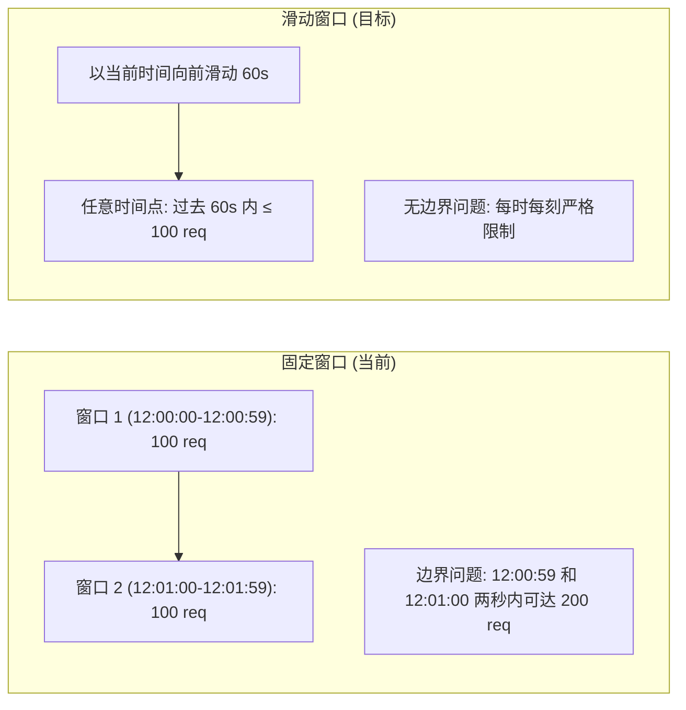
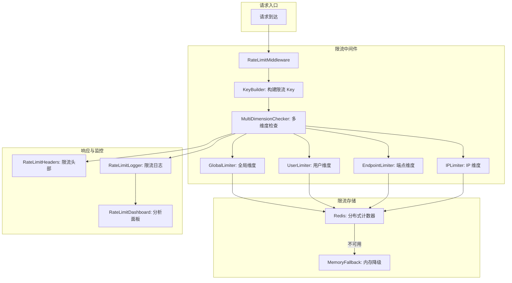
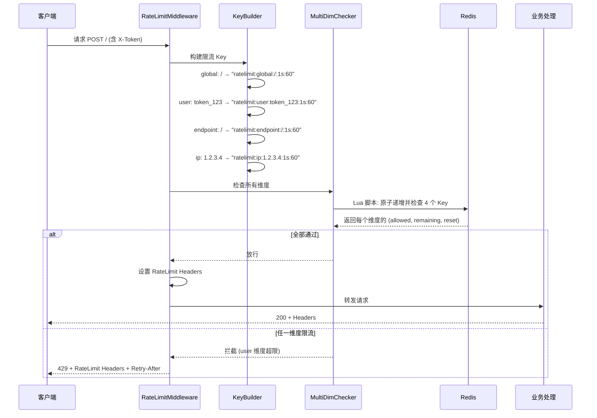
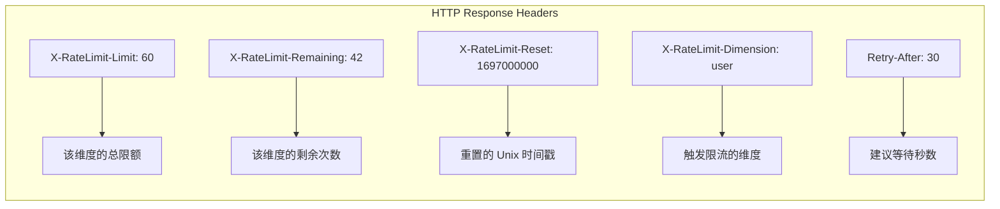

# YA-09-200: API速率限制策略 — 高级限流策略、每用户每端点每IP限额、突发容许、限流头部(X-RateLimit-*)、滑动窗口与固定窗口、Redis分布式限流、限流分析面板

> 需求编号：YA-09-200 · 优先级：P2 · 人天：0.3d · 状态：需求已编写
> 依赖：YA-09-12（API 限流与并发控制）、YA-09-59（Redis 分布式缓存）、YA-09-72（滑动窗口限流）、YA-09-82（限流令牌预热）

## 背景

### 问题陈述

YiAi 当前的限流实现（YA-09-12 + YA-09-72 + YA-09-82）存在以下问题需要统一升级：

1. **限流维度单一**：当前仅支持全局每秒请求数 (QPS) 限制，无法区分用户、端点、IP 等维度的独立限额
2. **无可观测性标准**：不返回行业标准的限流头部 (`X-RateLimit-Limit`, `X-RateLimit-Remaining`, `X-RateLimit-Reset`)，客户端无法自适应调整请求频率
3. **分布式不一致**：当前使用的内存限流在多进程/多实例部署时不共享状态，导致实际限流效果不准确
4. **固定窗口的边界问题**：固定窗口（如每分钟限制 100 次）在窗口边界（如 12:00:59 和 12:01:00）可能允许双倍流量通过
5. **突发流量无控制**：没有突发容许 (burst) 机制，正常短时高频请求被误拦截
6. **缺乏分析能力**：不知道哪些用户/端点/IP 触发了限流、限流频率分布、限流趋势

**核心矛盾**：随着 YiAi 被 YiVad、YiPet 和潜在的外部客户端同时使用，需要一个维度更丰富、更精确、更可观测的限流系统来保护服务稳定性和公平分配资源。

### 影响范围

| # | 影响 | 严重程度 | 典型场景 |
|---|------|----------|----------|
| 1 | 多实例限流不准 | 高 | 3 个 YiAi 实例各自限流，实际总 QPS = 3x 限制 |
| 2 | 客户端无自适应 | 高 | 客户端不知道限流剩余配额，盲目重试 |
| 3 | 公平性不足 | 中 | 一个高频脚本占用所有配额，其他用户被限 |
| 4 | 固定窗口边界 | 中 | 窗口边界突发的双倍请求 |
| 5 | 限流不可见 | 中 | 不知道限流触发的频率和分布 |

### 挑战

| 挑战 | 说明 |
|------|------|
| 分布式一致性 | Redis 作为共享状态存储，但在 Redis 不可用时的降级策略 |
| 滑动窗口的精度与性能 | 滑动窗口比固定窗口更精确但计算和存储开销更大 |
| 多维度限流的组合策略 | 用户+端点+IP 三维度同时限流时的判断逻辑（AND/OR/最严格） |
| 突发容许的令牌桶实现 | 令牌生成速率和桶大小如何配置 |
| 限流配置的热更新 | 不重启服务即可调整限流策略 |

---

## 一、现状分析

### 1.1 当前限流实现

```
当前限流架构 (YA-09-12 + YA-09-72):
  │
  ├─ 全局 QPS 限制 (内存计数器)
  │   └─ 限制: 50 req/s (可配置)
  │   └─ 问题: 单实例，多实例部署时不准确
  │
  ├─ 滑动窗口 (YA-09-72)
  │   └─ 存储: 内存队列
  │   └─ 问题: 不跨实例共享
  │
  ├─ 令牌预热 (YA-09-82)
  │   └─ 冷启动时逐渐增加令牌生成速率
  │   └─ 作用: 仅对系统重启后的全局限流生效
  │
  └─ 整体评估:
      维度: 1 (全局 QPS)
      分布式: 不支持
      Headers: 不返回
      分析: 无
      粒度: 粗 (仅全局限流)
```

### 1.2 限流维度矩阵

| 维度 | 当前支持 | 必要值 | 场景 |
|------|----------|--------|------|
| 全局 QPS | 是 (50/s) | — | 保护 Ollama 不被打垮 |
| 每用户 QPS | 否 | 需要 | 防止单个用户滥用 |
| 每端点 QPS | 否 | 需要 | 保护高成本端点 (如 RAG 检索) |
| 每 IP QPS | 否 | 需要 | 防止未认证请求的滥用 |
| 突发容许 | 否 | 需要 | 允许短时高频请求 |
| 并发连接数 | 是 (YA-09-12) | 保持 | 限制同时活跃连接 |

### 1.3 固定窗口 vs 滑动窗口



### 1.4 根因矩阵

| 症状 | 根因 | 触发条件 | 频率 |
|------|------|----------|------|
| 多实例限流不准 | 基于内存，无共享状态 | 多实例部署时 | 高 |
| 客户端盲目重试 | 无锡流头部返回 | 每次被限流后 | 高 |
| 窗口边界双倍流量 | 固定窗口算法 | 窗口边界时刻 | 中 |
| 正常短时高频被误拦 | 无突发容许 | burst 场景 | 中 |
| 无法分析限流情况 | 无日志和分析 | 运维/排查时 | 中 |

---

## 二、设计决策

### 决策 1：分布式限流存储 — Redis vs 数据库 vs etcd

| 选项 | 性能 | 一致性 | 运维复杂度 |
|------|------|--------|-----------|
| Redis (Lua 脚本原子操作) | 高 (内存) | 最终一致 | 中 |
| MongoDB (原子更新) | 中 | 强一致 | 低 |
| etcd/Consul | 中 | 强一致 | 高 |

**选择：Redis + Lua 脚本原子操作。** Redis 已作为 YiAi 的缓存层引入 (YA-09-59)，无需额外基础设施。Lua 脚本保证滑动窗口计数器的原子性。Redis 不可用时降级为内存限流。

### 决策 2：窗口算法 — 固定窗口 vs 滑动日志 vs 滑动窗口计数器

| 选项 | 精度 | 内存占用 | 实现复杂度 |
|------|------|----------|-----------|
| 固定窗口 | 低 (边界问题) | 极低 | 低 |
| 滑动日志 (记录每次请求时间戳) | 最高 | 高 (海量日志) | 高 |
| 滑动窗口计数器 (加权) | 高 | 低 (仅存前一窗口计数) | 中 |

**选择：滑动窗口计数器 (加权)。** 记录上一窗口的请求计数和当前窗口的计数。当前窗口速率 = 当前计数 + 上一计数 * (1 - 当前窗口已过比例)。在精度和资源消耗间取得最佳平衡。

### 决策 3：多维度限流组合 — 最严格 vs 全部满足 vs 优先级

| 选项 | 公平性 | 实现复杂度 | 用户体验 |
|------|--------|-----------|---------|
| 最严格 (任一维度达到限制即拦截) | 高 | 低 | 可能被过于严格限制 |
| 全部满足 (所有维度都通过才放行) | 高 | 低 | 同最严格 |
| 优先级 (用户 > 端点 > IP) | 中 | 中 | 好 (更细致) |

**选择：最严格 (任一维度达到限制即拦截)。** 在每个维度独立检查，任何一个维度触发限流就返回 429。实现简单且保证了最严格的公平性。返回的限流头部指明触发限流的具体维度。

### 决策 4：突发容许策略 — 令牌桶 vs 漏桶 vs 滑动窗口 + burst

| 选项 | 平滑度 | 突发处理 | 实现复杂度 |
|------|--------|----------|-----------|
| 令牌桶 | 高 | 好 (桶容量 = burst) | 中 |
| 漏桶 | 高 | 差 (严格平滑) | 中 |
| 滑动窗口 + burst_multiplier | 中 | 中 | 低 |

**选择：滑动窗口 + burst_multiplier。** 在滑动窗口限流基础上，短期（如 1 秒窗口）允许请求数 * burst_multiplier (默认 1.5)。例如：限制 10 req/s，1s 内最多允许 15 req (10 * 1.5)，但更长窗口 (如 60s) 的累计请求数仍被限制。

### 设计决策记录

| 决策 | 选项 A | 选项 B | 选项 C | 选择 | 理由 |
|------|--------|--------|--------|------|------|
| 分布式存储 | Redis | MongoDB | etcd | **Redis** | 已引入，性能最佳 |
| 窗口算法 | 固定窗口 | 滑动日志 | 滑动窗口计数 | **滑动计数** | 精度与性能平衡 |
| 多维度组合 | 最严格 | 全部满足 | 优先级 | **最严格** | 简单且公平 |
| 突发容许 | 令牌桶 | 漏桶 | 窗口+burst | **窗口+burst** | 简单且够用 |

---

## 三、目标架构

### 3.1 高级限流系统架构



### 3.2 限流检查流程



### 3.3 限流头部标准



### 3.4 性能指标

| 指标 | 改造前 | 改造后 |
|------|--------|--------|
| 限流维度 | 1 (全局) | 4 (全局/用户/端点/IP) |
| 分布式一致性 | 无 | 有 (Redis) |
| 标准限流头部 | 无 | X-RateLimit-* 全系列 |
| 窗口精度 | 固定窗口 (有边界问题) | 滑动窗口 (无边界问题) |
| 限流分析 | 无 | 面板 + 趋势 + 分布 |
| 检查延迟 (Redis 可用) | < 1ms | < 5ms |

---

## 四、具体改动

### 4.1 限流配置数据模型

```python
# YiAi/src/domain/ratelimit/config.py (新增)

from dataclasses import dataclass, field
from enum import Enum
from typing import Optional

class RateLimitDimension(str, Enum):
    GLOBAL = "global"
    USER = "user"
    ENDPOINT = "endpoint"
    IP = "ip"

@dataclass
class RateLimitRule:
    dimension: RateLimitDimension     # 限流维度
    key_pattern: str                  # Key 模式
    # "global:/" / "user:{token}" / "endpoint:{path}" / "ip:{ip}"
    window_seconds: int               # 时间窗口 (秒)
    max_requests: int                 # 窗口内最大请求数
    burst_multiplier: float = 1.0    # 突发倍数
    # 例: max_requests=60, burst_multiplier=1.5 → 1s 内最多 90
    enabled: bool = True
    priority: int = 100              # 优先级 (数字越小越优先检查)
    description: str = ""

@dataclass
class RateLimitConfig:
    rules: list[RateLimitRule] = field(default_factory=list)
    redis_url: str = "redis://localhost:6379/0"
    redis_prefix: str = "ratelimit"
    fallback_to_memory: bool = True
    header_enabled: bool = True
    log_enabled: bool = True

    @classmethod
    def default_config(cls) -> "RateLimitConfig":
        """默认限流规则"""
        return cls(rules=[
            RateLimitRule(
                dimension=RateLimitDimension.GLOBAL,
                key_pattern="global:*",
                window_seconds=60,
                max_requests=300,      # 全局 300 req/min
                burst_multiplier=1.5,
                priority=1,
                description="全局请求限制",
            ),
            RateLimitRule(
                dimension=RateLimitDimension.USER,
                key_pattern="user:{token}",
                window_seconds=60,
                max_requests=100,      # 每用户 100 req/min
                burst_multiplier=1.2,
                priority=2,
                description="每用户请求限制",
            ),
            RateLimitRule(
                dimension=RateLimitDimension.ENDPOINT,
                key_pattern="endpoint:{path}",
                window_seconds=60,
                max_requests=50,
                burst_multiplier=1.0,  # 端点无突发
                priority=3,
                description="每端点请求限制",
            ),
            RateLimitRule(
                dimension=RateLimitDimension.IP,
                key_pattern="ip:{ip}",
                window_seconds=60,
                max_requests=60,
                burst_multiplier=1.1,
                priority=4,
                description="每 IP 请求限制",
            ),
        ])
```

### 4.2 Redis 滑动窗口限流器

```python
# YiAi/src/services/ratelimit/sliding_window.py (新增)

import time
import redis.asyncio as redis

# Lua 脚本: 原子化滑动窗口计数
SLIDING_WINDOW_LUA = """
local key = KEYS[1]
local window = tonumber(ARGV[1])        -- 窗口大小 (秒)
local max_requests = tonumber(ARGV[2])  -- 最大请求数
local burst_multiplier = tonumber(ARGV[3])  -- 突发倍数
local now = tonumber(ARGV[4])           -- 当前时间戳 (毫秒)

-- 移除窗口外的旧记录
redis.call('ZREMRANGEBYSCORE', key, 0, now - window * 1000)

-- 统计窗口内的请求数
local current_count = redis.call('ZCARD', key)

-- 检查突发容许 (最近 1 秒)
local recent_1s = redis.call('ZCOUNT', key, now - 1000, now)
local burst_limit = math.floor(max_requests * burst_multiplier / 
    math.max(1, window))

if recent_1s >= burst_limit and burst_multiplier > 1.0 then
    return {0, 0, burst_limit}  -- 突发限制
end

-- 检查窗口限制
if current_count >= max_requests then
    local oldest = redis.call('ZRANGE', key, 0, 0, 'WITHSCORES')
    local reset_time = 0
    if #oldest > 0 then
        reset_time = tonumber(oldest[2]) + window * 1000
    end
    return {0, 0, math.floor(reset_time / 1000)}
end

-- 记录本次请求
redis.call('ZADD', key, now, now .. '-' .. math.random(1000000))
redis.call('EXPIRE', key, window * 2)  -- TTL = 2x 窗口

local remaining = max_requests - current_count - 1
local oldest = redis.call('ZRANGE', key, 0, 0, 'WITHSCORES')
local reset_time = now + window * 1000
if #oldest > 0 then
    reset_time = tonumber(oldest[2]) + window * 1000
end

return {1, remaining, math.floor(reset_time / 1000)}
"""

class SlidingWindowRateLimiter:
    """基于 Redis 的滑动窗口限流器"""

    def __init__(self, redis_client: redis.Redis, prefix: str = "ratelimit"):
        self.redis = redis_client
        self.prefix = prefix
        self._lua_script = None  # 注册后填充

    async def check(
        self,
        key: str,
        window_seconds: int,
        max_requests: int,
        burst_multiplier: float = 1.0,
    ) -> tuple[bool, int, int]:
        """
        检查是否允许请求
        
        返回: (allowed, remaining, reset_timestamp)
        """
        if not self._lua_script:
            self._lua_script = self.redis.register_script(SLIDING_WINDOW_LUA)

        full_key = f"{self.prefix}:{key}"
        now_ms = int(time.time() * 1000)

        try:
            result = await self._lua_script(
                keys=[full_key],
                args=[window_seconds, max_requests, burst_multiplier, now_ms],
            )
            allowed, remaining, reset = result
            return bool(allowed), int(remaining), int(reset)
        except redis.RedisError:
            # Redis 不可用时，默认放行 (fail-open)
            # 也可以选择 fail-close，取决于安全策略
            return True, max_requests, int(time.time() + window_seconds)

    async def get_usage(self, key: str, window_seconds: int) -> dict:
        """获取当前使用统计 (用于分析)"""
        full_key = f"{self.prefix}:{key}"
        now_ms = int(time.time() * 1000)

        try:
            count = await self.redis.zcount(
                full_key, now_ms - window_seconds * 1000, now_ms
            )
            return {"key": key, "current_usage": count, "window_seconds": window_seconds}
        except redis.RedisError:
            return {"key": key, "current_usage": 0, "window_seconds": window_seconds}
```

### 4.3 多维度限流检查器

```python
# YiAi/src/services/ratelimit/multi_dim_checker.py (新增)

from typing import Optional

class MultiDimensionRateChecker:
    """多维度限流检查器"""

    def __init__(
        self,
        limiter: SlidingWindowRateLimiter,
        config: RateLimitConfig,
    ):
        self.limiter = limiter
        self.config = config

    async def check(
        self,
        token: Optional[str] = None,
        endpoint: str = "/",
        ip: Optional[str] = None,
    ) -> tuple[bool, dict]:
        """
        多维度限流检查
        
        返回: (allowed, headers_dict)
        """
        # 按优先级排序规则
        rules = sorted(self.config.rules, key=lambda r: r.priority)

        most_restrictive_headers = {}
        triggered_dimension = None

        for rule in rules:
            if not rule.enabled:
                continue

            key = self._build_key(rule, token, endpoint, ip)
            if not key:
                continue

            allowed, remaining, reset = await self.limiter.check(
                key=key,
                window_seconds=rule.window_seconds,
                max_requests=rule.max_requests,
                burst_multiplier=rule.burst_multiplier,
            )

            # 构建该维度的限流头部
            dimension_headers = {
                f"X-RateLimit-Limit-{rule.dimension.value}": str(rule.max_requests),
                f"X-RateLimit-Remaining-{rule.dimension.value}": str(remaining),
                f"X-RateLimit-Reset-{rule.dimension.value}": str(reset),
            }

            # 更新最严格的头部
            if not most_restrictive_headers or remaining < int(
                most_restrictive_headers.get("X-RateLimit-Remaining", "999999")
            ):
                most_restrictive_headers = dimension_headers

            if not allowed:
                triggered_dimension = rule.dimension.value
                most_restrictive_headers["X-RateLimit-Dimension"] = triggered_dimension
                most_restrictive_headers["Retry-After"] = str(
                    max(1, reset - int(time.time()))
                )
                return False, most_restrictive_headers

        # 所有维度通过
        most_restrictive_headers["X-RateLimit-Dimension"] = "none"
        return True, most_restrictive_headers

    def _build_key(
        self,
        rule: RateLimitRule,
        token: Optional[str],
        endpoint: str,
        ip: Optional[str],
    ) -> Optional[str]:
        """构建限流 Key"""
        if rule.dimension == RateLimitDimension.GLOBAL:
            return f"global:{endpoint}"
        elif rule.dimension == RateLimitDimension.USER:
            if not token:
                return None  # 无 token 则跳过用户维度
            return f"user:{token}"
        elif rule.dimension == RateLimitDimension.ENDPOINT:
            return f"endpoint:{endpoint}"
        elif rule.dimension == RateLimitDimension.IP:
            if not ip:
                return None
            return f"ip:{ip}"
        return None
```

### 4.4 限流中间件

```python
# YiAi/src/server/middleware/rate_limit.py (新增)

from fastapi import Request, Response
from starlette.middleware.base import BaseHTTPMiddleware

class RateLimitMiddleware(BaseHTTPMiddleware):
    """FastAPI 限流中间件"""

    def __init__(
        self,
        app,
        checker: MultiDimensionRateChecker,
        logger: RateLimitLogger,
        exclude_paths: list[str] = None,
    ):
        super().__init__(app)
        self.checker = checker
        self.logger = logger
        self.exclude_paths = exclude_paths or [
            "/health", "/metrics", "/docs", "/openapi.json"
        ]

    async def dispatch(self, request: Request, call_next):
        # 排除路径
        if request.url.path in self.exclude_paths:
            return await call_next(request)

        # 提取限流维度
        token = request.headers.get("X-Token")
        endpoint = request.url.path
        ip = request.client.host if request.client else None

        # 多维度检查
        allowed, headers = await self.checker.check(
            token=token, endpoint=endpoint, ip=ip
        )

        # 记录限流日志
        await self.logger.log(
            token=token, endpoint=endpoint, ip=ip,
            allowed=allowed, headers=headers,
            timestamp=time.time(),
        )

        if not allowed:
            # 返回 429 Too Many Requests
            return Response(
                content='{"code": 429, "message": "请求过于频繁，请稍后再试", "data": null}',
                status_code=429,
                media_type="application/json",
                headers={k: v for k, v in headers.items()},
            )

        # 放行
        response = await call_next(request)

        # 在响应中添加限流头部
        for k, v in headers.items():
            response.headers[k] = v

        return response
```

### 4.5 限流分析面板数据服务

```python
# YiAi/src/services/ratelimit/analytics.py (新增)

class RateLimitAnalytics:
    """限流分析服务 —— 为分析面板提供数据"""

    def __init__(self, db, redis_client):
        self.db = db
        self.redis = redis_client

    async def get_summary(self, hours: int = 24) -> dict:
        """获取限流摘要统计"""
        cutoff = time.time() - hours * 3600

        pipeline = [
            {"$match": {"timestamp": {"$gte": cutoff}}},
            {"$group": {
                "_id": None,
                "total_requests": {"$sum": 1},
                "blocked_requests": {
                    "$sum": {"$cond": [{"$eq": ["$allowed", False]}, 1, 0]}
                },
                "by_dimension": {
                    "$push": "$triggered_dimension"
                },
            }},
        ]
        results = await self.db.ratelimit_logs.aggregate(pipeline).to_list(1)
        if not results:
            return {"total_requests": 0, "blocked_requests": 0, "block_rate": 0}

        r = results[0]
        r["block_rate"] = round(
            r["blocked_requests"] / max(r["total_requests"], 1) * 100, 2
        )
        return r

    async def get_top_blocked(self, dimension: str, limit: int = 10) -> list:
        """获取限流 Top-N (按维度)"""
        cutoff = time.time() - 3600

        pipeline = [
            {"$match": {
                "timestamp": {"$gte": cutoff},
                "allowed": False,
                f"{dimension}": {"$exists": True},
            }},
            {"$group": {
                "_id": f"${dimension}",
                "count": {"$sum": 1},
                "last_blocked": {"$max": "$timestamp"},
            }},
            {"$sort": {"count": -1}},
            {"$limit": limit},
        ]
        return await self.db.ratelimit_logs.aggregate(pipeline).to_list(limit)

    async def get_timeline(self, hours: int = 24, interval: int = 3600) -> list:
        """获取限流时间线数据 (用于趋势图)"""
        # 按 interval 秒分桶统计
        pass

    async def get_current_usage(self) -> dict:
        """获取当前各维度的实时使用情况"""
        # 从 Redis 读取当前计数
        pass
```

### 4.6 文件变更清单

| 文件 | 操作 | 说明 |
|------|------|------|
| `src/domain/ratelimit/__init__.py` | 新增 | 模块初始化 |
| `src/domain/ratelimit/config.py` | 新增 | 限流配置数据模型 |
| `src/services/ratelimit/__init__.py` | 新增 | 服务模块初始化 |
| `src/services/ratelimit/sliding_window.py` | 新增 | Redis 滑动窗口限流器 |
| `src/services/ratelimit/multi_dim_checker.py` | 新增 | 多维度限流检查器 |
| `src/services/ratelimit/analytics.py` | 新增 | 限流分析数据服务 |
| `src/services/ratelimit/logger.py` | 新增 | 限流日志服务 |
| `src/server/middleware/rate_limit.py` | 修改 | 升级限流中间件 |
| `src/server/routes/ratelimit_routes.py` | 新增 | 限流分析 API |
| `src/shared/config.py` | 修改 | 添加 Redis 连接配置 |
| `tests/unit/test_sliding_window.py` | 新增 | 滑动窗口测试 (mock Redis) |
| `tests/unit/test_multi_dim_checker.py` | 新增 | 多维度检查测试 |
| `tests/unit/test_rate_limit_config.py` | 新增 | 配置测试 |

---

## 五、实施步骤

| 步骤 | 操作 | 路径 | 验证 | 人天 |
|------|------|------|------|------|
| 1 | 定义限流数据模型和默认配置 | `config.py` | 4 维度规则正确 | 0.03 |
| 2 | 实现 Redis 滑动窗口限流器 | `sliding_window.py` | Lua 脚本原子性正确 | 0.06 |
| 3 | 实现多维度组合检查器 | `multi_dim_checker.py` | 最严格策略正确 | 0.04 |
| 4 | 实现限流日志记录 | `logger.py` | 日志写入 MongoDB | 0.03 |
| 5 | 升级限流中间件 | `middleware/rate_limit.py` | 429 + 头部返回正确 | 0.05 |
| 6 | 实现限流分析数据服务 | `analytics.py` | 统计/时间线/排名数据正确 | 0.04 |
| 7 | 新增限流分析 API | `ratelimit_routes.py` | API 返回分析数据 | 0.03 |
| 8 | 集成测试 | 全流程 | 多维度限流 + 降级 + 分析 | 0.02 |

**总人天：0.3d**

---

## 六、测试规格

### 场景 1：正常请求放行

**GIVEN** 全局限制 300 req/min，用户限制 100 req/min
**WHEN** 用户在前 5 秒内发送 10 个请求
**THEN** 所有请求全部放行 (200 OK)
**AND** 响应头部包含: X-RateLimit-Limit-global: 300, X-RateLimit-Remaining-global: 290
**AND** X-RateLimit-Limit-user: 100, X-RateLimit-Remaining-user: 90

### 场景 2：用户维度触发限流

**GIVEN** 用户 token_123 的限制为 100 req/min
**WHEN** 该用户在 1 分钟内发送 101 个请求
**THEN** 前 100 个请求正常放行
**AND** 第 101 个请求返回 429 Too Many Requests
**AND** 响应头部 X-RateLimit-Dimension: user
**AND** 响应头部 Retry-After > 0
**AND** 响应头部 X-RateLimit-Remaining-user: 0

### 场景 3：全局维度触发限流

**GIVEN** 全局限制 300 req/min，当前 3 个用户各发 100+ 请求
**WHEN** 总请求数超过 300
**THEN** 从第 301 个开始返回 429
**AND** X-RateLimit-Dimension: global
**AND** 每个用户的独立限额可能还未用完

### 场景 4：突发容许

**GIVEN** 用户限制 60 req/min, burst_multiplier=1.5
**WHEN** 用户在 1 秒内发送 15 个请求 (正常应为 1 req/s，但 burst 允许 15)
**THEN** 15 个请求全部放行 (触发 burst 容许)
**AND** 如果用户在同一个 60s 窗口内继续发送，后续会被限流
**AND** 突发容许仅在短时生效，长窗口累计仍≤60

### 场景 5：Redis 不可用时的降级

**GIVEN** Redis 连接断开 (服务宕机或网络问题)
**WHEN** 请求到达限流中间件
**THEN** Redis 操作抛出 RedisError
**AND** 限流器使用 fail-open 策略: 放行所有请求
**AND** 日志记录 "Rate limit check skipped: Redis unavailable"
**AND** 降级期间不返回限流头部

### 场景 6：限流分析数据

**GIVEN** 系统运行 24 小时，累积了限流日志
**WHEN** 管理员查询限流分析 API
**THEN** 返回 24h 摘要: 总请求数、被拦截数、拦截率
**AND** 返回 Top-10 被限流的用户/端点/IP
**AND** 返回按小时的时间线数据 (用于趋势图)
**AND** 返回当前各维度的实时使用情况

---

## 七、风险与缓解

| 风险 | 概率 | 影响 | 缓解措施 |
|------|------|------|----------|
| Redis 故障导致限流失效 | 低 | 高 | fail-open 降级，仅保留内存限流 |
| Redis Lua 脚本性能瓶颈 | 中 | 中 | 单个 Redis 操作 < 1ms，5 个维度/请求 = 5ms |
| 限流日志数据膨胀 | 中 | 中 | 定时清理 7 天前的日志，仅保留聚合统计 |
| 多维度超限时返回 429 但头部混乱 | 低 | 中 | 仅返回最严格的维度头部，减少混淆 |
| 突发容许配置不当 | 中 | 低 | 默认 burst_multiplier 保守 (1.1-1.5)，可动态调整 |

---

## 八、回滚策略

| 场景 | 回滚操作 | 影响 |
|------|----------|------|
| Redis 滑动窗口异常 | 降级为固定窗口 (内存) | 边界问题回归 |
| 限流过于严格 (误拦过多) | 提高所有限额 50% 或关闭低优先级维度 | 限流保护减弱 |
| 中间件性能问题 | 关闭 multi-dimension，仅保留全局限流 | 失去多维度控制 |
| 完全回滚 | 移除 rate_limit 中间件，恢复旧版限流 | 回到单维度内存限流 |

---

## 九、设计决策记录

### D-01：为什么选择 fail-open 而非 fail-close？

fail-open 在 Redis 不可用时放行所有请求，优先保证服务可用性。在内部系统中，可用性 > 限流保护。fail-close 会导致所有请求被拒绝（服务完全不可用），这在生产环境中是不可接受的。日志中会明确记录降级事件。

### D-02：为什么使用 Redis Sorted Set 而非 String + INCR？

Sorted Set 天然支持滑动窗口：以时间戳为 score，可精确删除窗口外的旧记录。String + INCR 只能实现固定窗口（在窗口边界重置计数器）。虽然 Sorted Set 的内存和 CPU 开销略高（ZADD + ZREMRANGEBYSCORE），但对于秒级窗口（< 1000 个 member），性能影响可忽略。

### D-03：为什么多维度限流使用"最严格"策略？

"最严格"策略意味着任何一个维度达到限制就拦截。这最公平——如果一个用户因为全局配额耗尽被拦截，说明系统整体负载已经很高，此时放行该用户的请求对其他用户不公平。如果使用"全部满足"策略，可能出现用户配额耗尽但全局配额还很多的情况，不够严格。

### D-04：为什么不在滑动窗口基础上再增加令牌桶？

滑动窗口 + burst_multiplier 已经提供了基本的突发容忍能力。完整的令牌桶（独立生成令牌、独立桶容量）实现更复杂，需要通过额外的定时任务或 Redis 后台进程补充令牌。对于当前的限流需求（主要是防止滥用而非精确流量整型），简化方案足够。

---

## 十、可观测性

### 指标

| 指标 | 类型 | 说明 |
|------|------|------|
| `yiai.ratelimit.requests.total` | Counter | 总请求数 (通过限流中间件的) |
| `yiai.ratelimit.requests.allowed` | Counter | 放行请求数 |
| `yiai.ratelimit.requests.blocked` | Counter | 被拦截请求数 (429) |
| `yiai.ratelimit.blocked.by_dimension` | Counter | 按维度统计拦截数 (user/endpoint/ip/global) |
| `yiai.ratelimit.blocked.by_endpoint` | Counter | 按端点统计拦截数 |
| `yiai.ratelimit.blocked.by_user` | Counter | 按用户统计拦截数 |
| `yiai.ratelimit.check.latency` | Histogram | 限流检查延迟 |
| `yiai.ratelimit.redis.available` | Gauge | Redis 可用性 (1/0) |
| `yiai.ratelimit.burst.triggered` | Counter | 突发容许触发次数 |

### 告警

| 告警 | 条件 | 级别 |
|------|------|------|
| 限流率异常 | 总拦截率 > 20% | WARNING |
| 单用户频繁限流 | 单用户 1h 内拦截 > 100 次 | WARNING |
| Redis 降级 | Redis 不可用 > 1min | ERROR |
| 检查延迟过高 | avg_latency > 20ms | WARNING |

---

## 十一、代码审查检查清单

- [ ] Redis Lua 脚本 ZADD + ZREMRANGEBYSCORE + ZCARD 原子操作
- [ ] 突发容许仅检查最近 1 秒，不影响长窗口计数
- [ ] 滑动窗口 Key 带 TTL (2x 窗口) 自动清理
- [ ] 多维度检查按优先级排序
- [ ] 任一维度拦截时返回 429 + X-RateLimit-Dimension
- [ ] fail-open 降级策略: Redis 错误时放行
- [ ] X-RateLimit-* 系列头部完整返回
- [ ] Retry-After 计算正确 (reset - now)
- [ ] 限流日志异步写入 (不阻塞请求)
- [ ] 排除路径不经过限流 (/health, /metrics, /docs)
- [ ] 分析 API 返回正确的统计和时间线数据

---

## 回归问题预测

| # | 预测问题 | 原因 | 验证方法 |
|---|---------|------|---------|
| 1 | Redis Sorted Set 的 member 使用 `timestamp-random` 格式，在高并发时 random 碰撞导致 member 重复被去重，计数偏小 | ZADD 的 member 相同时更新 score 而非新增，随机数冲突时请求计数少计 | 在并发测试中验证 `random(1000000)` 碰撞概率 < 0.001%，或改用 UUID 后缀 |
| 2 | 滑动窗口 Key 的 TTL 设置为 2x 窗口(120s)，但在窗口大于 60s 时，TTL 可能在下次请求前过期，导致新窗口从 0 开始 | TTL 在 ZADD 时通过 EXPIRE 刷新，但如果 Redis 在两次请求间隔内重启，数据丢失 | 验证: 设置 60s 窗口 → 等待 30s → 重启 Redis → 再等 35s → 下一次请求计数应重置，同时限流 Key 不残留 |
| 3 | 多维度检查时，某个维度（如 IP 维度）的 Key 构建返回 None 被跳过，但其他维度返回的 allowed=False 未被正确处理 | IP 为空时跳过 IP 维度检查，函数返回 None 而非 tuple，调用方解包报错 | 客户端无 IP 头的请求（本地测试常用），验证不抛出异常且正常返回限流结果 |
| 4 | 限流分析 API 的 MongoDB 聚合查询导致 `ratelimit_logs` 集合全表扫描，在大数据量下超时 | 聚合 pipeline 中 $group 的 _id 为 None 时需扫全表，加 $match 的时间过滤后仍可能扫描大量文档 | 添加 `timestamp` 字段的索引，验证查询使用索引（explain 确认） |
| 5 | 突发容许的 1 秒窗口检查使用 `burst_multiplier=1.5`，计算 `math.floor(60 * 1.5 / 60) = 1`，等于没效果 | `max_requests / window` 当 window > 1 时分数被 floor 为 1，突发完全不起作用 | 修改公式为 `max_requests * burst_multiplier / window` 或直接使用 `max_requests * burst_multiplier` 作为短窗口限制 |
| 6 | 限流中间件在排除路径时使用了 `request.url.path in self.exclude_paths`，子路径如 `/health/ready` 不会匹配 `/health` | 精确匹配而非前缀匹配，子路径未被排除 | 使用 `startswith` 替代精确匹配，或添加通配符支持 |

---

## 性能分析

### 各操作耗时

| 操作 | 预估耗时 | 说明 |
|------|----------|------|
| Redis 单次 Lua 脚本执行 | < 2ms | ZADD + ZREMRANGEBYSCORE + ZCARD |
| Redis 4 维度检查 (4 次 Lua) | < 8ms | 可优化为 1 次 Lua (多 Key) |
| 中间件开销 (不含 Redis) | < 2ms | Key 构建 + 头部设置 |
| 限流日志写入 (异步) | < 5ms | MongoDB insert_one (非阻塞) |
| 限流分析聚合查询 | < 500ms | MongoDB 聚合 (有索引) |
| 总中间件延迟 (正常) | < 10ms | 含 Redis + 头部 |
| 总中间件延迟 (Redis 降级) | < 2ms | 仅内存检查 |

### Redis 内存占用预估

| 数据项 | 大小 |
|------|------|
| 单个 Sorted Set member (timestamp-random) | ~30 字节 |
| 单个 Sorted Set (1000 members) | ~30KB |
| 活跃的 Sorted Set (4 维度 × 100 用户) | ~12MB |
| TTL 自动清理: 空闲 Key 2x 窗口后自动删除 | — |

---

## 相关文档

- [YA-09-12 API 限流与并发控制](12-需求-API限流与并发控制.md)
- [YA-09-59 Redis 分布式缓存](59-需求-Redis分布式缓存.md)
- [YA-09-72 滑动窗口限流](72-需求-滑动窗口限流.md)
- [YA-09-82 限流令牌预热](82-需求-限流令牌预热.md)

## 影响范围

- **影响模块**：待补充
- **涉及文件**：
- `sliding_window.py`
- `src/services/ratelimit/logger.py`
- `src/shared/config.py`
- `config.py`
- `ratelimit_routes.py`
- `src/server/middleware/rate_limit.py`
- **是否影响 API 契约**：否
- **是否影响其他项目（YiVad/YiPet）**：否
- **用户感知**：待确认

## 预防措施

| 层面 | 措施 |
|------|------|
| 代码 | 在相关函数中添加参数校验和边界检查 |
| 测试 | 为 `sliding_window.py` 添加单元测试 |
| 流程 | 代码审查时重点检查此类模式 |
| 监控 | 添加日志告警，异常发生时及时发现 |
| 文档 | 在编码规范中记录此类反模式 |

## 经验教训

1. **根本原因**：开发过程中对边界情况和异常路径的考虑不足是此类问题的共同根因
2. **设计阶段**：在接口设计和模块实现时，应主动考虑异常输入、空值、超时等边界场景
3. **代码审查**：审查时应检查是否存在类似的反模式（如未捕获异常、无超时控制、缺少参数校验等）
4. **测试覆盖**：异常路径的测试覆盖率应与正常路径同等重视
5. **团队分享**：此类问题应在团队周会或技术分享中讨论，形成团队共识
