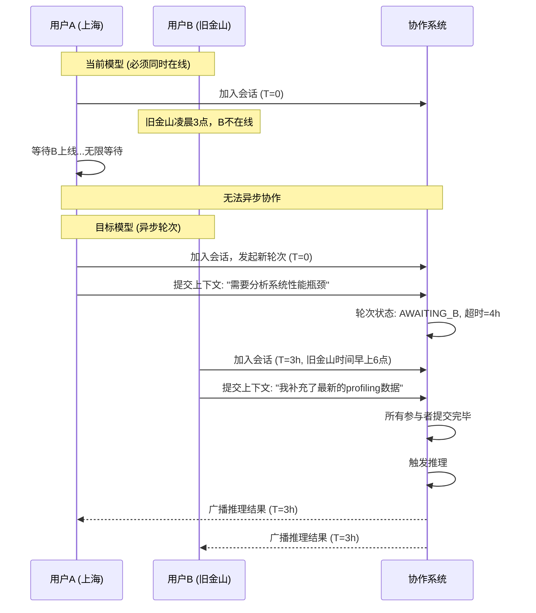
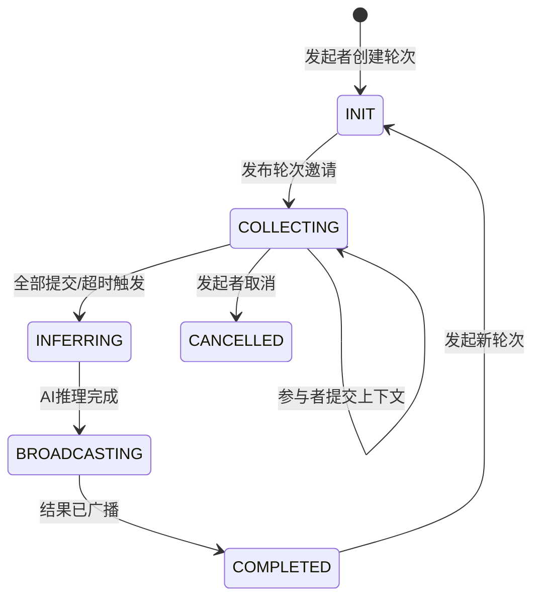
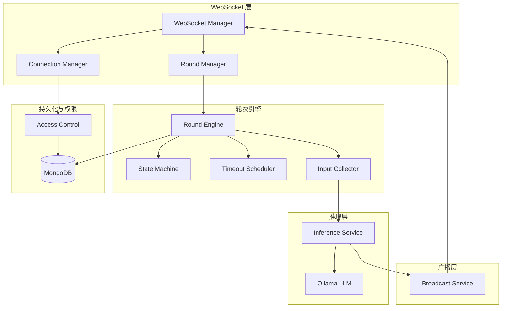
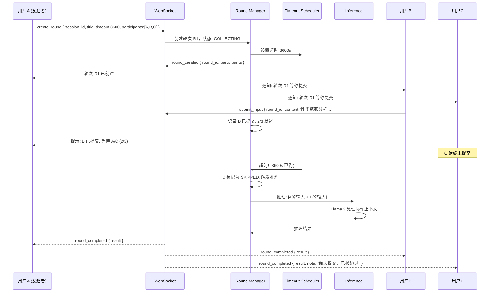

# YA-09-201: 实时协作推理 — 多用户共享推理会话、异步轮次模型、每用户异步贡献上下文、所有输入就绪或超时后 AI 响应、结果通过 WebSocket 广播、会话持久化、访问控制

> 需求编号：YA-09-201 · 优先级：P2 · 人天：0.3d · 状态：需求已编写
> 依赖：YA-09-195（实时协作推理 — 基础版本）、YA-09-12（WebSocket 基础设施）

## 背景

### 问题陈述

YA-09-195 实现了基础的实时协作推理，允许多个用户连接同一个推理会话并观看 AI 的流式输出。但该版本存在以下关键缺陷需要升级解决：

1. **无轮次控制**：任何用户都可以随时发送消息打断 AI 响应，导致上下文碎片化。缺乏结构化的"收集输入 → 推理 → 响应"轮次模型
2. **同步等待模式**：所有用户必须同时在线等待 AI 响应，不支持异步贡献上下文（一个用户留下问题，另一个用户几小时后再补充信息）
3. **超时策略缺失**：如果某个用户承诺提供输入但迟迟不发送，会话会无限期挂起，没有超时机制自动触发推理
4. **访问控制粗粒度**：仅支持"公开/私有"两种模式，无法指定哪些用户有权参与或查看
5. **会话无持久化上下文**：会话的推理上下文仅在内存中，服务重启后丢失，无法跨会话保存讨论进展

**核心矛盾**：真实协作场景中用户的时间线是异步的（产品经理发需求 → 开发者补充技术细节 → 半天后 AI 做分析），当前的同步模型无法支持这种自然的异步协作模式。

### 影响范围

| # | 影响 | 严重程度 | 典型场景 |
|---|------|----------|----------|
| 1 | 无法异步协作 | 高 | 跨时区团队，用户时间不一致 |
| 2 | 会话无限挂起 | 高 | 缺少超时机制导致 Bug |
| 3 | 访问控制不足 | 中 | 敏感项目会话无角色控制 |
| 4 | 服务重启丢失上下文 | 中 | 持久化缺失 |
| 5 | 用户体验差 | 中 | 刚输入就被别人打断 |

### 挑战

| 挑战 | 说明 |
|------|------|
| 异步轮次状态机 | 轮次生命周期管理（等待输入 → 收集完毕 → 推理中 → 已完成）|
| 超时策略设计 | 多人参与时，部分用户已提交、部分未提交的超时处理 |
| WebSocket 连接状态管理 | 用户断线时的轮次状态更新和重新加入 |
| 访问控制粒度 | 会话级 vs 轮次级权限分离 |
| 持久化与恢复 | 会话上下文序列化到 MongoDB，服务重启后恢复 |

---

## 一、现状分析

### 1.1 当前协作推理流程（YA-09-195）

```
当前协作推理模型 (YA-09-195):
  │
  ├─ 会话创建
  │   └─ POST /collab/create → 返回 session_id
  │
  ├─ 用户加入
  │   └─ WebSocket /ws/collab/{session_id}
  │   └─ 所有已连接用户实时看到消息
  │
  ├─ 推理触发
  │   └─ 任意用户发送消息 → AI 立即响应
  │   └─ AI 响应期间其他用户消息被缓存
  │
  └─ 整体评估:
      ✅ 多用户连接到同一会话
      ✅ WebSocket 实时广播
      ❌ 无结构化轮次模型
      ❌ 无异步贡献（必须同时在线）
      ❌ 无超时策略
      ❌ 无访问控制
      ❌ 无持久化（纯内存）
```

### 1.2 轮次模型缺失的影响

```
时间轴 (当前模型):
  User A: ──发送消息──→ AI响应─────→ 等待中
  User B: ───────────发送消息──→ 打断AI──→ 上下文混乱
  User C: ────────────────────────发送消息────→ 更混乱

时间轴 (目标模型):
  ROUND 1: [收集窗口] ────→ [推理] ────→ [广播结果]
  User A: ──提交输入──┤
  User B: ─────提交输入──┤                    ├──等待 ROUND 2
  User C: ──────────────超时(自动跳过)──┤
```

### 1.3 异步贡献时间轴对比



### 1.4 根因矩阵

| 症状 | 根因 | 触发条件 | 频率 |
|------|------|----------|------|
| 异步协作无法进行 | 无结构化轮次 + 无超时 | 跨时区协作 | 高 |
| 上下文碎片化 | 无输入收集阶段 | 多人同时输入 | 高 |
| 会话无限等待 | 无超时机制 | 用户离开前未提交 | 中 |
| 敏感会话安全性 | 无角色控制 | 项目敏感信息 | 中 |
| 重启后会话丢失 | 纯内存存储 | 服务维护/部署 | 中 |

---

## 二、设计决策

### 决策 1：轮次触发策略 — 全收集模式 vs 多数就绪模式 vs 混合

| 选项 | 效率 | 公平性 | 实现复杂度 |
|------|------|--------|-----------|
| 全部就绪 (所有人提交后才推理) | 低 | 高 | 低 |
| 多数就绪 (N/2+1 提交后推理) | 高 | 中 | 中 |
| 超时+全部就绪混合 | 高 | 高 | 高 |

**选择：超时 + 全部就绪混合。** 默认等待所有参与者提交后触发推理。同时设置轮次超时时间（默认 1 小时，可配置），超时后自动使用已提交的输入触发推理，未提交的用户标记为 "skipped"。创建轮次时，发起者可选择"严格模式"（必须所有人提交）或"宽松模式"（超时自动触发）。

### 决策 2：访问控制 — 无控制 vs 参与者白名单 vs 角色权限

| 选项 | 安全性 | 灵活性 | 实现复杂度 |
|------|--------|--------|-----------|
| 无控制 (公开/私有) | 低 | 高 | 低 |
| 参与者白名单 (token 列表) | 中 | 中 | 中 |
| 角色权限 (owner/collaborator/viewer) | 高 | 高 | 中 |

**选择：角色权限 (owner/collaborator/viewer)。** owner 拥有完全控制权（创建轮次、邀请/移除成员、结束会话），collaborator 可以提交输入和查看结果，viewer 只能查看但不可提交输入。权限粒度与常见协作工具（Google Docs、Notion）一致，用户心智模型清晰。

### 决策 3：持久化策略 — JSON 快照 vs 事件溯源 vs 增量条目

| 选项 | 恢复速度 | 存储效率 | 实现复杂度 |
|------|----------|----------|-----------|
| JSON 快照 (每轮次一个文档) | 高 | 中 | 低 |
| 事件溯源 (记录所有操作) | 低 (需重放) | 高 | 高 |
| 增量条目 | 中 | 高 | 中 |

**选择：JSON 快照。** 每个轮次结束后将完整状态（参与者、输入内容、AI 响应、时间戳）序列化为一个 MongoDB 文档。存储在 `collab_sessions` 和 `collab_rounds` 集合中。简单、易恢复、易查询。事件溯源对于低频协作场景来说过于复杂。

### 决策 4：WebSocket 断线处理 — 立即移除 vs 宽限期 vs 自动重连

| 选项 | 一致性 | 用户体验 | 实现复杂度 |
|------|--------|----------|-----------|
| 立即标记离线 | 高 | 差 (误断线) | 低 |
| 宽限期 (30s 内重连算在线) | 高 | 好 | 中 |
| 自动重连 (客户端无限重试) | 中 | 最好 | 高 |

**选择：宽限期 30 秒。** 用户 WebSocket 断线后 30 秒内重新连接，自动恢复到断开前的状态（仍在轮次中，无需重新提交）。超过 30 秒标记为离线，如果该轮次正在等待该用户，分情况处理：宽松模式超时后跳过，严格模式等待用户重新上线或管理员强制触发。

### 设计决策记录

| 决策 | 选项 A | 选项 B | 选项 C | 选择 | 理由 |
|------|--------|--------|--------|------|------|
| 轮次触发 | 全部就绪 | 多数就绪 | 混合 | **混合** | 最灵活 |
| 访问控制 | 公开/私有 | 白名单 | 角色权限 | **角色权限** | 标准模型 |
| 持久化 | JSON快照 | 事件溯源 | 增量 | **JSON快照** | 简单可靠 |
| 断线处理 | 立即移除 | 宽限期 | 自动重连 | **宽限期** | 平衡体验 |

---

## 三、目标架构

### 3.1 协作推理轮次生命周期



### 3.2 目标协作推理架构



### 3.3 异步协作完整流程



### 3.4 性能指标

| 指标 | 改造前 | 改造后 |
|------|--------|--------|
| 协作模式 | 同步（必须同时在线） | 异步轮次（可跨时区） |
| 轮次超时管理 | 无（无限制等待） | 可配置超时（默认 1h） |
| 访问控制 | 公开/私有 | 3 角色（owner/collaborator/viewer） |
| 会话持久化 | 内存 | MongoDB (服务重启不丢失) |
| 断线恢复 | 手动重连 | 30s 宽限期自动恢复 |
| 最大参与者 | 无限制 | 10 人（可配置） |

---

## 四、具体改动

### 4.1 轮次数据模型

```python
# YiAi/src/domain/collab/models.py (修改/新增)

from dataclasses import dataclass, field
from enum import Enum
from datetime import datetime
from typing import Optional

class RoundStatus(str, Enum):
    INIT = "init"              # 轮次已创建，待发布
    COLLECTING = "collecting"  # 收集中，等待参与者提交
    INFERRING = "inferring"    # 推理中
    COMPLETED = "completed"    # 已完成
    CANCELLED = "cancelled"    # 已取消
    TIMEOUT = "timeout"        # 已超时

class ParticipantStatus(str, Enum):
    PENDING = "pending"        # 等待提交
    SUBMITTED = "submitted"    # 已提交
    SKIPPED = "skipped"        # 超时跳过
    DECLINED = "declined"      # 主动拒绝

class SessionRole(str, Enum):
    OWNER = "owner"
    COLLABORATOR = "collaborator"
    VIEWER = "viewer"

@dataclass
class CollabSession:
    session_id: str
    title: str
    created_by: str           # 创建者 token
    created_at: datetime
    updated_at: datetime
    status: str = "active"    # active / archived
    members: dict[str, SessionRole] = field(default_factory=dict)
    # { "token_xxx": "owner", "token_yyy": "collaborator" }
    current_round_id: Optional[str] = None
    round_history: list[str] = field(default_factory=list)  # 历史轮次ID列表

@dataclass
class RoundInput:
    user_token: str
    content: str
    submitted_at: datetime
    metadata: dict = field(default_factory=dict)  # 附加元数据

@dataclass
class CollabRound:
    round_id: str
    session_id: str
    title: str
    created_by: str
    created_at: datetime
    status: RoundStatus = RoundStatus.INIT
    participants: dict[str, ParticipantStatus] = field(default_factory=dict)
    # { "token_xxx": "submitted", "token_yyy": "pending" }
    inputs: list[RoundInput] = field(default_factory=list)
    ai_response: Optional[str] = None
    timeout_seconds: int = 3600      # 默认 1 小时
    strict_mode: bool = False        # 严格模式：必须所有人提交
    completed_at: Optional[datetime] = None
    ai_model: str = "llama3"         # 使用的模型

    def all_submitted(self) -> bool:
        """检查是否所有参与者都已提交"""
        pending = [u for u, s in self.participants.items()
                   if s == ParticipantStatus.PENDING]
        return len(pending) == 0

    def ready_to_infer(self) -> bool:
        """判断是否可以触发推理"""
        if self.strict_mode:
            return self.all_submitted()
        # 宽松模式：至少有一人提交即可
        submitted = [u for u, s in self.participants.items()
                     if s == ParticipantStatus.SUBMITTED]
        return len(submitted) > 0
```

### 4.2 Round Manager 核心服务

```python
# YiAi/src/services/collab/round_manager.py (新增)

import asyncio
from datetime import datetime, timedelta

class RoundManager:
    """协作轮次管理器"""

    def __init__(self, db, ws_manager, inference_service):
        self.db = db
        self.ws_manager = ws_manager
        self.inference = inference_service
        self._timeout_tasks: dict[str, asyncio.Task] = {}
        self._rounds: dict[str, CollabRound] = {}  # 内存缓存

    async def create_round(
        self,
        session_id: str,
        creator_token: str,
        title: str,
        participants: list[str],
        timeout_seconds: int = 3600,
        strict_mode: bool = False,
    ) -> CollabRound:
        """创建新的协作轮次"""
        session = await self._get_session(session_id)
        if not session:
            raise ValueError(f"会话 {session_id} 不存在")

        # 权限检查：只有 owner 和 collaborator 可创建轮次
        role = session.members.get(creator_token)
        if role not in (SessionRole.OWNER, SessionRole.COLLABORATOR):
            raise PermissionError("无权限创建轮次")

        round_id = f"round_{session_id}_{len(session.round_history) + 1}"

        round_obj = CollabRound(
            round_id=round_id,
            session_id=session_id,
            title=title,
            created_by=creator_token,
            created_at=datetime.utcnow(),
            status=RoundStatus.COLLECTING,
            participants={p: ParticipantStatus.PENDING for p in participants},
            timeout_seconds=timeout_seconds,
            strict_mode=strict_mode,
        )

        # 持久化
        await self._save_round(round_obj)
        self._rounds[round_id] = round_obj

        # 更新会话
        session.current_round_id = round_id
        await self._save_session(session)

        # 通知所有参与者
        await self.ws_manager.broadcast(
            session_id,
            event="round_created",
            data={
                "round_id": round_id,
                "title": title,
                "timeout_seconds": timeout_seconds,
                "participants": participants,
                "strict_mode": strict_mode,
            },
        )

        # 启动超时计时器
        self._start_timeout(round_id, timeout_seconds)

        return round_obj

    async def submit_input(
        self,
        round_id: str,
        user_token: str,
        content: str,
        metadata: dict = None,
    ) -> bool:
        """参与者提交输入"""
        round_obj = self._rounds.get(round_id)
        if not round_obj:
            round_obj = await self._load_round(round_id)
            if not round_obj:
                raise ValueError(f"轮次 {round_id} 不存在")

        if round_obj.status != RoundStatus.COLLECTING:
            raise ValueError(f"轮次状态为 {round_obj.status}，不可提交")

        if user_token not in round_obj.participants:
            raise PermissionError("你不是该轮次的参与者")

        if round_obj.participants[user_token] == ParticipantStatus.SUBMITTED:
            raise ValueError("你已经提交过了")

        # 记录输入
        round_obj.inputs.append(RoundInput(
            user_token=user_token,
            content=content,
            submitted_at=datetime.utcnow(),
            metadata=metadata or {},
        ))
        round_obj.participants[user_token] = ParticipantStatus.SUBMITTED

        await self._save_round(round_obj)

        # 广播提交状态
        await self.ws_manager.broadcast(
            round_obj.session_id,
            event="input_submitted",
            data={
                "round_id": round_id,
                "user_token": user_token,
                "submitted_count": len(round_obj.inputs),
                "total_count": len(round_obj.participants),
            },
        )

        # 检查是否触发推理
        if round_obj.ready_to_infer():
            await self._trigger_inference(round_id)

        return True

    async def _trigger_inference(self, round_id: str):
        """触发 AI 推理"""
        round_obj = self._rounds[round_id]
        round_obj.status = RoundStatus.INFERRING
        await self._save_round(round_obj)

        # 取消超时计时器
        self._cancel_timeout(round_id)

        # 组合所有输入作为推理上下文
        context = self._build_context(round_obj)

        # 广播: 推理开始
        await self.ws_manager.broadcast(
            round_obj.session_id,
            event="inference_started",
            data={"round_id": round_id},
        )

        # 执行推理
        try:
            response = await self.inference.infer(
                prompt=context,
                model=round_obj.ai_model,
                on_token=self._stream_token(round_id),
            )

            round_obj.ai_response = response
            round_obj.status = RoundStatus.COMPLETED
            round_obj.completed_at = datetime.utcnow()
        except Exception as e:
            round_obj.status = RoundStatus.CANCELLED
            await self.ws_manager.broadcast(
                round_obj.session_id,
                event="inference_failed",
                data={"round_id": round_id, "error": str(e)},
            )
            return

        await self._save_round(round_obj)

        # 广播: 推理完成
        await self.ws_manager.broadcast(
            round_obj.session_id,
            event="round_completed",
            data={
                "round_id": round_id,
                "response": round_obj.ai_response,
                "participants_summary": {
                    u: s.value for u, s in round_obj.participants.items()
                },
            },
        )

    def _build_context(self, round_obj: CollabRound) -> str:
        """将多人输入组合为推理上下文"""
        parts = [f"## 协作轮次: {round_obj.title}\n"]
        parts.append("以下是各参与者的贡献内容:\n")

        for i, input_item in enumerate(round_obj.inputs, 1):
            parts.append(f"### 参与者 {i} ({input_item.user_token})")
            parts.append(input_item.content)
            parts.append("")

        parts.append("请综合以上所有参与者的输入，给出完整的分析和回答。")
        parts.append("注意整合不同视角，识别冲突并给出平衡的建议。")

        return "\n".join(parts)

    def _stream_token(self, round_id: str):
        """流式输出回调"""
        async def callback(token: str):
            await self.ws_manager.broadcast(
                self._rounds[round_id].session_id,
                event="inference_token",
                data={"round_id": round_id, "token": token},
            )
        return callback

    async def handle_timeout(self, round_id: str):
        """处理轮次超时"""
        round_obj = self._rounds.get(round_id)
        if not round_obj:
            return

        if round_obj.status != RoundStatus.COLLECTING:
            return

        # 标记未提交用户为 skipped
        for user, status in round_obj.participants.items():
            if status == ParticipantStatus.PENDING:
                round_obj.participants[user] = ParticipantStatus.SKIPPED

        # 宽松模式: 有至少一个输入则触发推理
        if not round_obj.strict_mode and len(round_obj.inputs) > 0:
            await self._trigger_inference(round_id)
        else:
            # 严格模式或无输入: 标记为超时
            round_obj.status = RoundStatus.TIMEOUT
            round_obj.completed_at = datetime.utcnow()
            await self._save_round(round_obj)
            await self.ws_manager.broadcast(
                round_obj.session_id,
                event="round_timeout",
                data={"round_id": round_id},
            )

    def _start_timeout(self, round_id: str, seconds: int):
        """启动超时计时器"""
        async def timeout_coro():
            await asyncio.sleep(seconds)
            await self.handle_timeout(round_id)

        self._timeout_tasks[round_id] = asyncio.create_task(timeout_coro())

    def _cancel_timeout(self, round_id: str):
        """取消超时计时器"""
        task = self._timeout_tasks.pop(round_id, None)
        if task and not task.done():
            task.cancel()
```

### 4.3 访问控制服务

```python
# YiAi/src/services/collab/access_control.py (新增)

class AccessControl:
    """协作会话访问控制"""

    def __init__(self, db):
        self.db = db

    async def check_permission(
        self,
        session_id: str,
        user_token: str,
        required_role: SessionRole,
    ) -> bool:
        """检查用户是否有指定权限"""
        session = await self._get_session(session_id)
        if not session:
            return False

        user_role = session.members.get(user_token, SessionRole.VIEWER)

        role_hierarchy = {
            SessionRole.OWNER: 3,
            SessionRole.COLLABORATOR: 2,
            SessionRole.VIEWER: 1,
        }

        return role_hierarchy.get(user_role, 0) >= role_hierarchy.get(required_role, 0)

    async def add_member(
        self,
        session_id: str,
        operator_token: str,
        target_token: str,
        role: SessionRole,
    ) -> bool:
        """添加成员（仅 owner 可操作）"""
        if not await self.check_permission(session_id, operator_token, SessionRole.OWNER):
            raise PermissionError("仅 owner 可添加成员")

        session = await self._get_session(session_id)
        session.members[target_token] = role
        await self._save_session(session)
        return True

    async def remove_member(
        self,
        session_id: str,
        operator_token: str,
        target_token: str,
    ) -> bool:
        """移除成员（仅 owner 可操作）"""
        if target_token == operator_token:
            raise ValueError("不能移除自己")

        if not await self.check_permission(session_id, operator_token, SessionRole.OWNER):
            raise PermissionError("仅 owner 可移除成员")

        session = await self._get_session(session_id)
        if target_token not in session.members:
            raise ValueError("目标用户不在会话中")

        del session.members[target_token]
        await self._save_session(session)
        return True
```

### 4.4 文件变更清单

| 文件 | 操作 | 说明 |
|------|------|------|
| `src/domain/collab/__init__.py` | 新增 | 协作模块初始化 |
| `src/domain/collab/models.py` | 新增 | 会话/轮次/权限数据模型 |
| `src/services/collab/__init__.py` | 新增 | 服务模块初始化 |
| `src/services/collab/round_manager.py` | 新增 | 轮次管理核心服务 |
| `src/services/collab/access_control.py` | 新增 | 角色权限控制服务 |
| `src/services/collab/persistence.py` | 新增 | MongoDB 持久化服务 |
| `src/services/collab/ws_handler.py` | 修改 | WebSocket 消息路由 (升级) |
| `src/server/routes/collab_routes.py` | 修改 | 新增轮次/权限 API |
| `tests/unit/test_round_manager.py` | 新增 | 轮次管理测试 |
| `tests/unit/test_access_control.py` | 新增 | 访问控制测试 |
| `tests/integration/test_collab_flow.py` | 新增 | 协作流程集成测试 |

---

## 五、实施步骤

| 步骤 | 操作 | 路径 | 验证 | 人天 |
|------|------|------|------|------|
| 1 | 定义数据模型和状态机 | `models.py` | 5 种状态 + 4 种参与者状态 | 0.03 |
| 2 | 实现轮次管理器核心 | `round_manager.py` | 创建/提交/推理/超时流程正确 | 0.08 |
| 3 | 实现访问控制 | `access_control.py` | 3 角色权限检查正确 | 0.04 |
| 4 | 实现 MongoDB 持久化 | `persistence.py` | 轮次/会话 CRUD | 0.04 |
| 5 | 升级 WebSocket 消息路由 | `ws_handler.py` | 新增消息类型路由 | 0.04 |
| 6 | 新增 REST API | `collab_routes.py` | CRUD + 权限管理 API | 0.04 |
| 7 | 集成测试 | 全流程 | 异步协作端到端 | 0.03 |

**总人天：0.3d**

---

## 六、测试规格

### 场景 1：正常异步协作流程

**GIVEN** 会话有 3 个参与者 (A/B/C)，轮次超时 3600s  
**WHEN** A 创建轮次 → B 提交输入 → C 提交输入  
**THEN** 所有提交后自动触发推理  
**AND** 推理结果广播给 A/B/C  
**AND** 轮次状态 = COMPLETED  
**AND** 会话的 round_history 增加 1 条记录  

### 场景 2：超时自动触发

**GIVEN** 轮次宽松模式、2 个参与者 (A/B)，超时 10s  
**WHEN** A 提交输入、B 超过 10s 未提交  
**THEN** 超时后自动触发推理（使用 A 的输入）  
**AND** B 标记为 SKIPPED  
**AND** 通知 B "你已错过本轮"  
**AND** 推理结果广播给 A  

### 场景 3：严格模式超时

**GIVEN** 轮次严格模式、2 个参与者 (A/B)，超时 10s  
**WHEN** A 提交、B 超时未提交  
**THEN** 轮次状态 = TIMEOUT（不触发推理）  
**AND** 通知所有参与者 "严格模式轮次因未全部提交而超时"  

### 场景 4：权限控制

**GIVEN** 会话 owner=token_A, collaborator=token_B, viewer=token_C  
**WHEN** C 尝试创建轮次  
**THEN** 返回 403 PermissionError  
**WHEN** B 尝试移除成员  
**THEN** 返回 403（仅 owner 可移除）  
**WHEN** A 添加成员 D 为 collaborator  
**THEN** 成功，D 获得 collaborator 权限  

### 场景 5：WebSocket 断线重连

**GIVEN** 轮次 COLLECTING 中，B 的 WebSocket 断开  
**WHEN** B 在 30s 内重新连接  
**THEN** B 恢复到轮次参与者列表，状态仍为 PENDING  
**AND** B 可以正常提交输入  
**WHEN** B 在 30s 后重新连接  
**THEN** B 标记为离线（宽松模式超时 SKIPPED，严格模式等待）  

### 场景 6：轮次持久化与恢复

**GIVEN** 轮次 COMPLETED 并持久化到 MongoDB  
**WHEN** 服务重启  
**THEN** 重启后加载 round_history 正确  
**AND** 新加入的成员可以查看历史轮次的结果  
**AND** 可以基于历史轮次发起新轮次  

---

## 七、风险与缓解

| 风险 | 概率 | 影响 | 缓解措施 |
|------|------|------|----------|
| 超时任务内存泄漏 | 中 | 中 | `_cancel_timeout` 及时取消已完成轮次的计时器 |
| WebSocket 广播风暴 | 中 | 中 | token 级流式输出合并（批量发送而非每 token 广播） |
| MongoDB 写入瓶颈 | 低 | 中 | 高频状态变更使用内存缓存，定时批量持久化 |
| 大上下文（多人长文本）超 Ollama 限制 | 中 | 高 | 输入长度限制（每人 4000 字符） + 上下文截断 |
| 并发创建轮次竞态 | 低 | 中 | 使用 MongoDB 原子操作（find_one_and_update）防止多轮次同时活跃 |

---

## 八、回滚策略

| 场景 | 回滚操作 | 影响 |
|------|----------|------|
| 轮次状态机 Bug | 降级为无轮次模式（回退到 YA-09-195 的即时推理） | 异步协作功能不可用 |
| WebSocket 压力过大 | 限制同时活跃会话数为 10 | 新会话排队等待 |
| 持久化性能问题 | 关闭实时持久化，仅内存运行 | 服务重启丢失进行中轮次 |
| 完全回滚 | 关闭协作功能路由 | 协作推理不可用 |

---

## 九、设计决策记录

### D-01：为什么选择异步轮次模型而非实时聊天模型？

实时聊天模型（如 Slack）适用于快速讨论，但不适用于深度协作推理。AI 推理需要结构化的上下文，碎片化的闲聊输入会降低推理质量。轮次模型强制了"收集 → 推理 → 响应"的节奏，确保 AI 收到的上下文是完整的、经过思考的，而非碎片化的。异步特性进一步使跨时区协作成为可能。

### D-02：为什么默认超时设置为 1 小时？

1 小时覆盖了两种典型场景：(1) 团队成员在 1 小时内都有可能上线查看并提交（即使跨 1-2 个时区），(2) 复杂问题需要思考时间但不太可能超过 1 小时。超时时间可配置（范围 300s-86400s），让发起者根据实际需求调整。

### D-03：为什么断线宽限期是 30 秒而非 60 秒或 5 秒？

30 秒足以覆盖网络抖动、浏览器切换 Tab 后 WebSocket 休眠恢复、无线的临时断连。5 秒太短可能导致正常的网络波动被当作断线；60 秒太长导致其他参与者等待时间过长。30 秒是行业常见值（类似于 WebSocket 心跳间隔的 2-3 倍）。

### D-04：为什么不实现"部分推理"（每收到一个输入就推一次，然后逐步精炼）？

部分推理（progressive inference）在输入不完整时产生的结果可能误导性地偏向早期输入。一个包含 3 人视角的完整推理比 3 次基于 1 人视角的推理更有价值。等待所有输入就绪再进行一次完整推理，对思考质量和用户心智负担来说都是更好的选择。

---

## 十、可观测性

### 指标

| 指标 | 类型 | 说明 |
|------|------|------|
| `yiai.collab.session.active` | Gauge | 活跃会话数 |
| `yiai.collab.round.created` | Counter | 创建轮次总数 |
| `yiai.collab.round.completed` | Counter | 完成轮次数 |
| `yiai.collab.round.timeout` | Counter | 超时轮次数 |
| `yiai.collab.input.submitted` | Counter | 用户提交输入总数 |
| `yiai.collab.input.avg_size` | Histogram | 平均输入长度 |
| `yiai.collab.ws.connections` | Gauge | 当前 WebSocket 连接数 |
| `yiai.collab.ws.disconnects` | Counter | 断线次数 |
| `yiai.collab.inference.duration` | Histogram | 推理耗时分布 |

### 告警

| 告警 | 条件 | 级别 |
|------|------|------|
| 大量轮次超时 | 1h 内超时 > 30% | WARNING |
| WebSocket 连接异常 | 断线率 > 50%/min | WARNING |
| 推理耗时过长 | p95 > 60s | WARNING |
| 高失败率 | 推理失败 > 20% | ERROR |

---

## 十一、代码审查检查清单

- [ ] 轮次状态机 5 种状态 + 合法转换验证
- [ ] 参与者状态 4 种 + 超时正确的 SKIPPED 标记
- [ ] 宽松模式 ready_to_infer() 至少 1 人提交
- [ ] 严格模式 ready_to_infer() 所有人提交
- [ ] asyncio.Task 超时正确取消（cancel + done 检查）
- [ ] WebSocket 广播使用 broadcast 而非逐个发送
- [ ] 权限检查在创建轮次/提交输入/管理成员前
- [ ] 角色层级 OWNER=3, COLLABORATOR=2, VIEWER=1
- [ ] MongoDB 文档使用原子操作避免竞态
- [ ] 上下文构建正确组合多人输入
- [ ] 宽限期重连恢复正确（30s timeout）

---

## 回归问题预测

| # | 预测问题 | 原因 | 验证方法 |
|---|---------|------|---------|
| 1 | 轮次 `ready_to_infer()` 在宽松模式下，当所有参与者都是 SKIPPED (无人提交) 时仍然返回 True，因为 submitted 列表为空导致 `len(submitted) > 0` 为 False，但 `all_submitted()` 返回 True（无 PENDING 状态） | `all_submitted()` 检查无 PENDING 状态，全 SKIPPED 时返回 True，触发推理但无实际输入 | 模拟全部 SKIPPED 场景，验证宽松模式不触发推理，严格模式正确标记为 TIMEOUT |
| 2 | `asyncio.create_task(timeout_coro())` 创建的任务在 `_trigger_inference` 中 `_cancel_timeout` 后，任务可能已经在 `await asyncio.sleep(seconds)` 中且即将执行 `handle_timeout`，取消后 `handle_timeout` 的 status 检查不变，但 `_cancel_timeout` 调用 `task.cancel()` 后 `asyncio.CancelledError` 可能被 `handle_timeout` 内部捕获 | asyncio.Task 被取消后在第一个 await 点抛出 CancelledError，但 `handle_timeout` 没有 try-except 保护，CancelledError 可能未被处理 | 验证取消超时任务后无 CancelledError 警告日志 |
| 3 | 同一会话中同时存在两个 COLLECTING 状态的轮次（并发创建），`session.current_round_id` 被后者覆盖，但前者仍处于活跃超时倒计时中 | `create_round` 未检查 `session.current_round_id` 是否已存在活跃轮次 | 并发创建两个轮次（同一会话），验证第二个创建被拒绝或第一个被自动取消 |
| 4 | 多用户同时提交输入时，`round_obj.inputs.append()` 和 `round_obj.participants[user_token] = ...` 是内存操作，可能产生竞态（Python GIL 在 await 点释放） | `submit_input` 多次并发调用时，共享 `round_obj` 的 list 和 dict 可能不是你看到的最终状态。但由于 asyncio 是单线程协作式，不存在真正的并行竞态 | 2 人同时提交，验证 inputs 列表包含 2 条且 participants 状态正确（asyncio 单线程协作式下应自动安全） |
| 5 | 持久化 `_save_round` 在 `submit_input` 中每次提交都写入 MongoDB，高频率提交（10 人同时提交）导致 10 次 MongoDB 写入，可能触发 MongoDB 写入压力 | 高频写入 + round 文档较大（包含所有历史输入），MongoDB 单文档更新可能成为瓶颈 | 验证 10 人同时提交的延迟，考虑合并写入（如 5s 内的多次提交合并为一次保存） |
| 6 | 断线宽限期 30 秒内用户重连，系统基于 `user_token` 识别同一用户，但 WebSocket 的 session cookie 可能不同（浏览器新 tab 打开），导致用户被认为是"新用户"而非"重连用户" | `ws_handler` 通过 WebSocket 连接对象的 token 属性识别用户，重连后的新 WebSocket 对象如果 token 相同应视为同一用户 | 浏览器开新 tab 重新连接同一会话，验证不被当作新用户且保持原轮次参与状态 |

---

## 性能分析

### 关键操作耗时

| 操作 | 预估耗时 | 说明 |
|------|----------|------|
| 创建轮次 | < 50ms | MongoDB insert + 广播 |
| 提交输入 | < 20ms | 状态更新 + 广播 |
| 超时处理 | < 50ms | 状态转换 + 广播 |
| 上下文构建 | < 5ms | 字符串拼接 |
| AI 推理 | 5-60s | 取决于模型和上下文长度 |
| WebSocket 广播 (10 连接) | < 20ms | asyncio 并发发送 |
| MongoDB 持久化 (单个轮次) | < 30ms | insert/update one |

### 内存预估

| 组件 | 内存占用 | 说明 |
|------|----------|------|
| 活跃会话 (10 个) | ~5 KB | _rounds 字典缓存 |
| 轮次输入缓存 (10 人 * 4KB) | ~40 KB | 文本内容 |
| WebSocket 连接 (50 个) | ~5 MB | 每连接 ~100KB |
| asyncio 超时任务 (10 个) | ~5 KB | 轻量协程 |

### 扩展性

| 并发度 | 瓶颈 | 解决方案 |
|------|------|----------|
| 10 活跃会话 | 无 | 当前设计 |
| 50 活跃会话 | WebSocket 广播延迟 | 批量发送、连接池 |
| 200 活跃会话 | asyncio 单线程 | 多进程 + Redis Pub/Sub |

---

## 相关文档

- [YA-09-195 实时协作推理（基础版本）](195-需求-实时协作推理.md)
- [YA-09-12 API 限流与并发控制](12-需求-API限流与并发控制.md)
- [WebSocket 协议规范](https://datatracker.ietf.org/doc/html/rfc6455)
- [asyncio Task 管理](https://docs.python.org/3/library/asyncio-task.html)

## 影响范围

- **影响模块**：待补充
- **涉及文件**：
- `access_control.py`
- `ws_handler.py`
- `src/services/collab/__init__.py`
- `src/services/collab/persistence.py`
- `src/services/collab/round_manager.py`
- `src/domain/collab/models.py`
- **是否影响 API 契约**：否
- **是否影响其他项目（YiVad/YiPet）**：否
- **用户感知**：待确认

## 预防措施

| 层面 | 措施 |
|------|------|
| 代码 | 在相关函数中添加参数校验和边界检查 |
| 测试 | 为 `access_control.py` 添加单元测试 |
| 流程 | 代码审查时重点检查此类模式 |
| 监控 | 添加日志告警，异常发生时及时发现 |
| 文档 | 在编码规范中记录此类反模式 |

## 经验教训

1. **根本原因**：开发过程中对边界情况和异常路径的考虑不足是此类问题的共同根因
2. **设计阶段**：在接口设计和模块实现时，应主动考虑异常输入、空值、超时等边界场景
3. **代码审查**：审查时应检查是否存在类似的反模式（如未捕获异常、无超时控制、缺少参数校验等）
4. **测试覆盖**：异常路径的测试覆盖率应与正常路径同等重视
5. **团队分享**：此类问题应在团队周会或技术分享中讨论，形成团队共识
