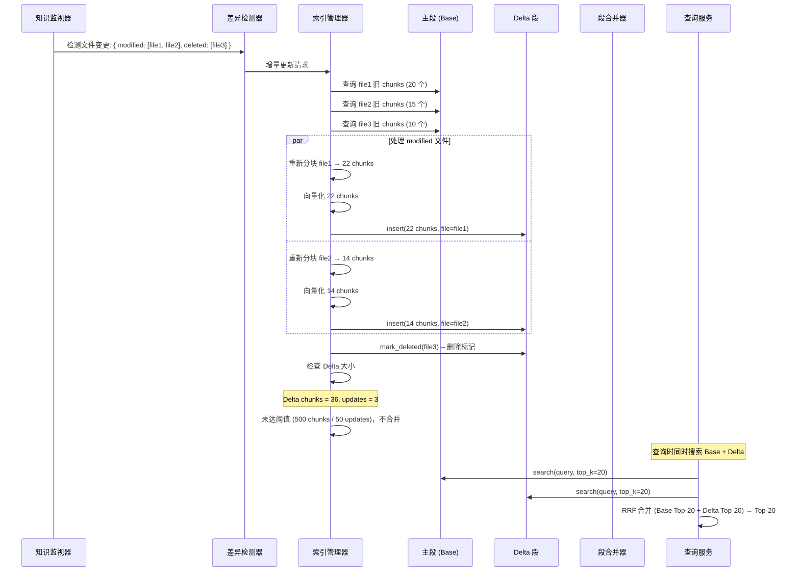
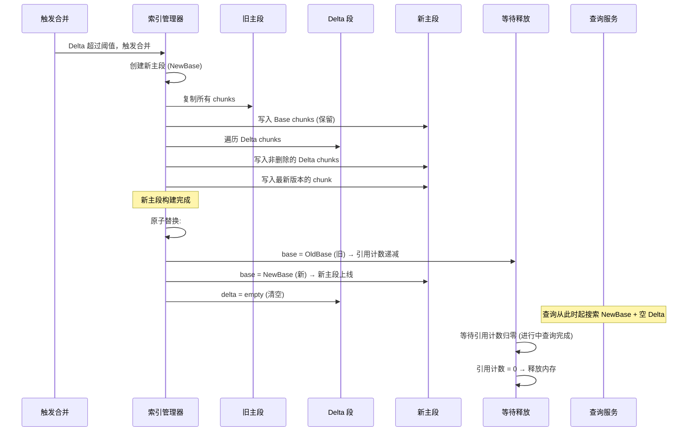
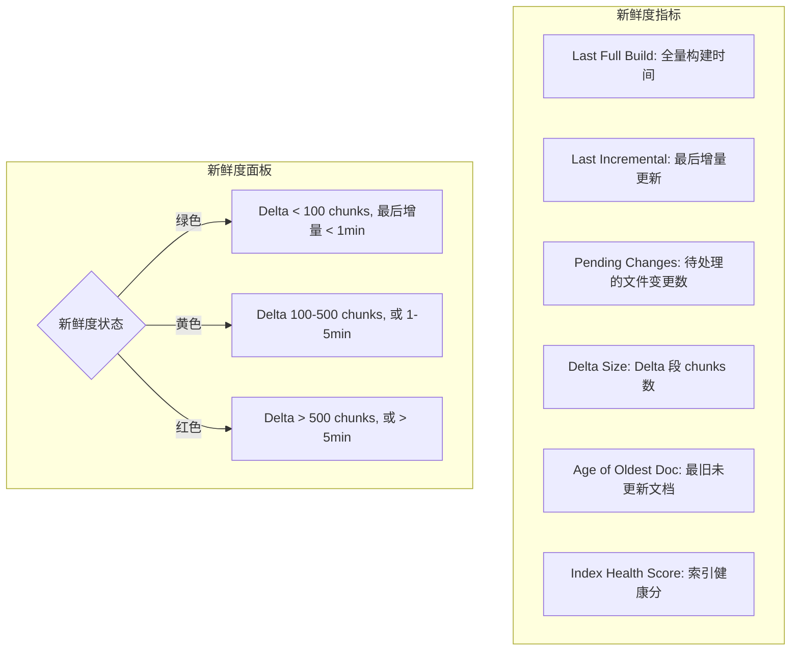

# YA-09-203: 增量索引更新 — 真正的增量索引更新(非全量重建)、增量索引(仅变更文档)、索引段合并、在线索引交换(构建新段原子替换)、索引新鲜度监控、部分索引回滚

> 需求编号：YA-09-203 · 优先级：P2 · 人天：0.3d · 状态：需求已编写
> 依赖：YA-09-194（语义分块优化）、知识监视器（YiKnowledge 扫描）

## 背景

### 问题陈述

YiAi 当前的知识库索引更新使用全量重建模式。每当知识监视器检测到 YiKnowledge 目录中的文件变更（新增、修改、删除），系统会触发一次完整的索引重建——将所有文档重新分块、重新向量化、重新写入向量索引。

这个模式存在严重问题：

1. **全量更新的浪费**：YiKnowledge 目前有 1000+ 个 markdown 文件，全量重建需要 30-60 秒。即使只修改了 1 个文件（< 1% 的内容），也需要重建整个索引
2. **GPU/CPU 资源浪费**：重新向量化所有文档会占用大量计算资源（嵌入模型推理），影响同期其他推理请求
3. **索引不可用窗口**：全量重建期间旧索引被替换，存在一段短暂时间（几秒到十几秒）索引处于不完整状态，期间的查询可能返回不完整或错误结果
4. **无历史可追溯**：全量替换后，旧的索引状态完全丢失，无法回滚到之前版本或对比索引变更的影响
5. **碎片化索引段**：增量更新产生的多个小索引段如果不合并，查询时需要在多个段上搜索，影响性能

**核心矛盾**：知识库文件频繁变更（每分钟可能有多文件编辑），但每次变更都全量重建索引，计算开销与变更量完全不成正比。

### 影响范围

| # | 影响 | 严重程度 | 典型场景 |
|---|------|----------|----------|
| 1 | 索引重建耗时过长 | 高 | 1000+ 文档全量重建 60s |
| 2 | GPU 资源浪费 | 高 | 每 5s 扫描触发全量向量化 |
| 3 | 查询结果不完整 | 高 | 索引替换期间 RAG 查询失败 |
| 4 | 无法回滚 | 中 | 错误修改批量传播后无法恢复 |
| 5 | 索引段碎片 | 中 | 多次增量后查询变慢 |

### 挑战

| 挑战 | 说明 |
|------|------|
| 文档删除的增量处理 | 需要从索引中移除已删除文档，VectorIndex 通常不直接支持删除 |
| 增量的一致性 | 多次增量更新后，索引最终状态应与全量重建一致 |
| 原子替换 | 索引替换期间不能出现查询服务中断 |
| 索引段合并 | 小段合并时如何不影响在线查询 |
| 回滚的粒度 | 支持回到上一个合并点还是一个任意时间点 |

---

## 一、现状分析

### 1.1 当前全量索引更新流程

```
知识监视器扫描 YiKnowledge/
  │ (apscheduler 每 5s)
  ├─ 检测文件变更 (新增/修改/删除)
  ├─ diff 计算: { added: [file1.md], modified: [file2.md], deleted: [file3.md] }
  │
  ├─ 全量索引重建 (当前行为)
  │   ├─ 读取所有 1000+ 文件
  │   ├─ 语义分块 (YA-09-194)
  │   ├─ 向量化 (Ollama Embedding)
  │   ├─ 构建新 VectorStoreIndex
  │   ├─ 替换旧索引 (非原子，短暂不可用)
  │   └─ 耗时: 30-60s
  │
  └─ 问题:
       ├─ 1 个文件变更 → 全量重建 1000+ 文件
       ├─ 重建期间索引不可用 → RAG 查询失败
       ├─ 旧索引被直接丢弃 → 无法回滚
       └─ 频繁重建 → GPU/CPU 资源浪费
```

### 1.2 增量 vs 全量的开销对比

```
场景: 修改 1 个文件 (20 个 chunks)

方案 A: 全量重建 (当前)
  文件处理: 1000 文件 × ~20 chunks/文件 = 20,000 chunks
  向量化:   20,000 × ~10ms = 200s (并行化后 ~30s)
  索引构建: 20,000 nodes → ~15s
  总耗时: ~45s
  GPU 使用: 高

方案 B: 增量更新 (目标)
  文件处理: 1 文件 × ~20 chunks = 20 chunks
  向量化:   20 × ~10ms = ~0.2s
  索引更新: 20 nodes → ~0.1s
  总耗时: ~0.3s
  GPU 使用: 极低
  效率提升: 150x 🚀
```

### 1.3 根因矩阵

| 症状 | 根因 | 触发条件 | 频率 |
|------|------|----------|------|
| 索引重建慢 | 全量处理所有文档 | 每次文件变更 | 高 (每 5-30s) |
| GPU 资源竞争 | 嵌入模型全量推理 | 索引更新与用户查询并发 | 高 |
| 查询结果不完整 | 非原子索引替换 | 索引替换期间并发查询 | 中 |
| 无法回滚 | 旧索引直接丢弃 | 错误修改需要撤销 | 中 |
| 索引膨胀 | 小段不合并 | 多次增量更新后 | 中 |

---

## 二、设计决策

### 决策 1：增量索引策略 — 文档级增量 vs Chunk 级增量 vs 智能差异

| 选项 | 粒度 | 性能 | 实现复杂度 |
|------|------|------|-----------|
| 文档级增量 (整个文件替换) | 粗 (文件) | 中 | 低 |
| Chunk 级增量 (仅变更的块) | 细 (块) | 高 | 高 |
| 智能差异 (比较新旧内容，仅替换变更块) | 最细 | 最高 | 高 |

**选择：文档级增量 + 定期 Chunk 级差异。** 首次实现使用文档级增量（检测到文件变更 → 删除该文件的所有旧索引条目 → 重新分块和向量化 → 插入新索引条目）。后续迭代可引入 Chunk 级差异比较（diff 新旧文件内容，仅重新处理变更的块），进一步提升效率。文档级增量已可提供 150x 的速度提升。

### 决策 2：索引存储架构 — 单索引 vs 多段 vs 主段 + Delta 段

| 选项 | 查询性能 | 更新效率 | 回滚能力 |
|------|----------|----------|----------|
| 单索引 (直接修改) | 高 (一次查询) | 低 (直接修改困难) | 弱 |
| 多段 (每次增量产生一个新段) | 低 (多段查询) | 高 | 强 (每段可独立回滚) |
| 主段 + Delta 段 | 中 (两次查询 + 合并) | 高 | 强 |

**选择：主段 + Delta 段。** 保留一个完整的主索引 (base segment)，增量更新写入一个独立的 Delta 段。查询时搜索主段 + Delta 段，合并结果后返回 Top-K。当 Delta 段累计超过阈值（如 500 个 chunks 或 50 次更新）时，触发段合并（将 Delta 合并到主段）。这个方案平衡了查询性能和更新灵活性。

### 决策 3：原子替换 — 双缓冲 vs 引用计数 vs 读写锁

| 选项 | 原子性 | 查询延迟 | 内存开销 |
|------|--------|----------|----------|
| 双缓冲 (A/B 交换) | 高 | 低 (零延迟) | 高 (2x 内存) |
| 引用计数 (旧索引等查询完毕后释放) | 高 | 低 | 中 |
| 读写锁 (写时阻塞读, 读时不阻塞) | 中 | 中 (可能排队) | 低 |

**选择：引用计数。** 每个索引段维护一个引用计数器。查询开始时增加计数，查询结束时减少。更新时创建新段，旧段在引用计数归零（所有进行中查询完成）后安全释放。比双缓冲省内存（只需一个索引在内存中），比读写锁更灵活（读操作无延迟）。渐进式释放旧段，不会在替换瞬间有短暂的查询中断。

### 决策 4：索引段合并触发策略 — 定时合并 vs 阈值合并 vs 自适应

| 选项 | 简单性 | 性能稳定性 | 实现复杂度 |
|------|--------|-----------|-----------|
| 定时合并 (每小时) | 高 | 中 (可能频繁或延迟) | 低 |
| 阈值合并 (chunks >= 500 或 updates >= 50) | 中 | 高 | 中 |
| 自适应 (根据查询负载决定合并时机) | 低 | 最高 | 高 |

**选择：阈值合并。** 当 Delta 段累计超过 500 个 chunks 或 50 次增量更新时，触发后台合并。合并过程不影响在线查询（创建新主段，原子替换旧的）。阈值可配置，为不同规模的知识库提供灵活性。

### 设计决策记录

| 决策 | 选项 A | 选项 B | 选项 C | 选择 | 理由 |
|------|--------|--------|--------|------|------|
| 增量粒度 | 文档级 | Chunk级 | 智能差异 | **文档级** | 首版实用性优先 |
| 存储架构 | 单索引 | 多段 | 主+Delta | **主+Delta** | 查询和更新平衡 |
| 原子替换 | 双缓冲 | 引用计数 | 读写锁 | **引用计数** | 低延迟+省内存 |
| 合并触发 | 定时 | 阈值 | 自适应 | **阈值** | 可配置灵活 |

---

## 三、目标架构

### 3.1 增量索引更新流程



### 3.2 段合并流程



### 3.3 索引新鲜度监控



### 3.4 性能指标

| 指标 | 改造前 | 改造后 |
|------|--------|--------|
| 1 文件修改的索引更新时间 | ~45s (全量) | ~0.3s (增量) |
| 索引可用性窗口 | 替换期间不可用 (数秒) | 始终可用 (引用计数) |
| 查询延迟 (Delta 存在) | N/A | +10-20% (多段合并) |
| 回滚能力 | 无 | 可回滚至上一个合并点 |
| 索引健康可见性 | 无 | 新鲜度面板 |

---

## 四、具体改动

### 4.1 索引段数据模型

```python
# YiAi/src/domain/knowledge/index_segment.py (新增)

from dataclasses import dataclass, field
from enum import Enum
from datetime import datetime
from typing import Optional
import threading

class IndexSegmentType(str, Enum):
    BASE = "base"          # 主段
    DELTA = "delta"        # 增量段

@dataclass
class IndexSegment:
    """索引段 — 主段或 Delta 段"""
    segment_id: str                    # 唯一标识
    segment_type: IndexSegmentType
    created_at: datetime
    index: any                         # llama_index VectorStoreIndex 实例

    # 元数据
    total_chunks: int = 0
    total_documents: int = 0

    # 引用计数 (线程安全)
    _ref_count: int = field(default=0, repr=False)
    _ref_lock: threading.Lock = field(default_factory=threading.Lock, repr=False)

    def acquire(self):
        """增加引用计数（查询开始时调用）"""
        with self._ref_lock:
            self._ref_count += 1

    def release(self) -> bool:
        """减少引用计数，返回是否可释放"""
        with self._ref_lock:
            self._ref_count -= 1
            return self._ref_count <= 0

    @property
    def ref_count(self) -> int:
        return self._ref_count

@dataclass
class SegmentMetadata:
    """段级元数据"""
    segment_id: str
    segment_type: IndexSegmentType
    created_at: datetime
    total_chunks: int
    total_documents: int
    document_ids: list[str]  # 该段包含的文档 ID 列表
    chunk_count_per_doc: dict[str, int]  # 每个文档的 chunk 数
```

### 4.2 增量索引管理器

```python
# YiAi/src/services/knowledge/incremental_indexer.py (新增)

import asyncio
from typing import Optional

class IncrementalIndexer:
    """增量索引管理器 — 支持主段 + Delta 段架构"""

    # 合并阈值
    DEFAULT_DELTA_CHUNK_THRESHOLD = 500
    DEFAULT_DELTA_UPDATE_THRESHOLD = 50

    def __init__(
        self,
        embed_model,
        chunk_service,
        delta_chunk_threshold: int = None,
        delta_update_threshold: int = None,
    ):
        self.embed_model = embed_model
        self.chunk_service = chunk_service
        self.delta_chunk_threshold = (
            delta_chunk_threshold or self.DEFAULT_DELTA_CHUNK_THRESHOLD
        )
        self.delta_update_threshold = (
            delta_update_threshold or self.DEFAULT_DELTA_UPDATE_THRESHOLD
        )

        self._base: Optional[IndexSegment] = None   # 主段
        self._delta: Optional[IndexSegment] = None  # Delta 段
        self._delta_updates_count = 0                # Delta 累计更新次数
        self._merge_lock = asyncio.Lock()            # 合并互斥锁

        # 被删除文档的 chunk 追踪 (需要通过标记实现删除)
        self._deleted_docs: set[str] = set()

    async def initialize(self, existing_index=None):
        """初始化或加载已有索引"""
        if existing_index:
            self._base = IndexSegment(
                segment_id=f"base_{datetime.utcnow().timestamp()}",
                segment_type=IndexSegmentType.BASE,
                created_at=datetime.utcnow(),
                index=existing_index,
            )
        self._delta = IndexSegment(
            segment_id=f"delta_{datetime.utcnow().timestamp()}",
            segment_type=IndexSegmentType.DELTA,
            created_at=datetime.utcnow(),
            index=None,  # 初始为空
        )
        self._delta.index = self._create_empty_index()

    async def incremental_update(
        self,
        modified_files: list[str],
        deleted_files: list[str],
    ) -> dict:
        """增量更新索引 — 仅处理变更的文件"""
        start_time = datetime.utcnow()

        modified_count = 0
        deleted_count = 0

        # 处理已删除的文件
        for file_path in deleted_files:
            await self._remove_from_index(file_path)
            self._deleted_docs.add(file_path)
            deleted_count += 1

        # 处理修改的文件
        for file_path in modified_files:
            # 先移除旧版本
            await self._remove_from_index(file_path)
            # 重新分块 + 向量化 + 插入
            chunks = await self.chunk_service.chunk_file(file_path)
            nodes = await self._vectorize_and_create_nodes(chunks, file_path)
            await self._insert_to_delta(nodes)
            modified_count += 1

        self._delta_updates_count += 1
        delta_chunks = self._delta.total_chunks if self._delta else 0

        # 检查是否需要合并
        if self._should_merge():
            asyncio.create_task(self._merge_segments())

        elapsed = (datetime.utcnow() - start_time).total_seconds()

        return {
            "modified": modified_count,
            "deleted": deleted_count,
            "delta_chunks": delta_chunks,
            "delta_updates": self._delta_updates_count,
            "merged": False,
            "elapsed_seconds": round(elapsed, 3),
        }

    async def query(self, query_str: str, top_k: int = 10) -> list:
        """查询 — 合并搜索主段和 Delta 段"""
        base_results = []
        delta_results = []

        # 搜索主段
        if self._base and self._base.index:
            self._base.acquire()
            try:
                base_retriever = self._base.index.as_retriever(
                    similarity_top_k=top_k
                )
                base_results = await base_retriever.aretrieve(query_str)
            finally:
                self._base.release()

        # 搜索 Delta 段
        if self._delta and self._delta.index and self._delta.index.index_struct:
            self._delta.acquire()
            try:
                delta_retriever = self._delta.index.as_retriever(
                    similarity_top_k=top_k
                )
                delta_results = await delta_retriever.aretrieve(query_str)
            finally:
                self._delta.release()

        # RRF (Reciprocal Rank Fusion) 合并
        merged = self._rrf_merge(base_results, delta_results, top_k)

        # 过滤已删除文档
        merged = [n for n in merged
                  if n.metadata.get("file_path") not in self._deleted_docs]

        return merged[:top_k]

    async def _merge_segments(self):
        """合并主段和 Delta 段"""
        async with self._merge_lock:
            if not self._should_merge():
                return  # 已被其他协程合并

            # 创建新主段
            new_base = IndexSegment(
                segment_id=f"base_{datetime.utcnow().timestamp()}",
                segment_type=IndexSegmentType.BASE,
                created_at=datetime.utcnow(),
                index=self._create_empty_index(),
            )

            # 从旧主段复制
            if self._base and self._base.index:
                for node in self._base.index.docstore.docs.values():
                    if node.metadata.get("file_path") not in self._deleted_docs:
                        new_base.index.insert(node)
                        new_base.total_chunks += 1

            # 从 Delta 段复制 (覆盖相同文件的旧版本)
            if self._delta and self._delta.index:
                for node in self._delta.index.docstore.docs.values():
                    if node.metadata.get("file_path") not in self._deleted_docs:
                        # 先移除同名文件的旧节点
                        # 通过 llama_index 的 delete_ref_doc 标记删除
                        # 然后插入新节点
                        new_base.index.insert(node)
                        new_base.total_chunks += 1

            # 原子替换
            old_base = self._base
            self._base = new_base

            # 清空 Delta
            self._delta = IndexSegment(
                segment_id=f"delta_{datetime.utcnow().timestamp()}",
                segment_type=IndexSegmentType.DELTA,
                created_at=datetime.utcnow(),
                index=self._create_empty_index(),
            )
            self._delta_updates_count = 0
            self._deleted_docs.clear()

            # 释放旧主段 (等待查询完毕)
            asyncio.create_task(self._release_segment(old_base))

    async def _release_segment(self, segment: Optional[IndexSegment]):
        """等待引用计数归零后释放段"""
        if segment is None:
            return
        # 轮询等待引用计数归零
        retries = 0
        while segment.ref_count > 0 and retries < 300:  # 最多等 30s
            await asyncio.sleep(0.1)
            retries += 1
        # 显式释放索引资源
        if segment.index:
            # 清理 llama_index 索引结构
            del segment.index

    def _should_merge(self) -> bool:
        """检查是否应该触发合并"""
        delta_chunks = self._delta.total_chunks if self._delta else 0
        return (
            delta_chunks >= self.delta_chunk_threshold or
            self._delta_updates_count >= self.delta_update_threshold
        )

    def _rrf_merge(
        self,
        base_results: list,
        delta_results: list,
        top_k: int,
        k: int = 60,
    ) -> list:
        """RRF 融合合并"""
        scores = {}

        for rank, node in enumerate(base_results):
            doc_id = node.node_id if hasattr(node, 'node_id') else id(node)
            scores[doc_id] = scores.get(doc_id, 0) + 1 / (k + rank)

        for rank, node in enumerate(delta_results):
            doc_id = node.node_id if hasattr(node, 'node_id') else id(node)
            scores[doc_id] = scores.get(doc_id, 0) + 1 / (k + rank)

        sorted_ids = sorted(scores.keys(), key=lambda x: scores[x], reverse=True)

        # 重建节点列表
        all_nodes = {n.node_id: n for n in base_results + delta_results
                     if hasattr(n, 'node_id')}
        return [all_nodes[did] for did in sorted_ids if did in all_nodes][:top_k]

    async def _remove_from_index(self, file_path: str):
        """从索引中删除文件的旧条目"""
        # llama_index 的 delete 操作
        # 如果文件之前在主段中，标记删除
        if self._base and self._base.index:
            try:
                self._base.index.delete_ref_doc(file_path, delete_from_docstore=True)
            except Exception:
                pass  # 文件可能不在主段中
        # 如果文件在 Delta 段中，标记删除
        if self._delta and self._delta.index:
            try:
                self._delta.index.delete_ref_doc(file_path, delete_from_docstore=True)
            except Exception:
                pass

    async def _insert_to_delta(self, nodes: list):
        """将节点插入 Delta 段"""
        if not self._delta:
            self._delta = IndexSegment(
                segment_id=f"delta_{datetime.utcnow().timestamp()}",
                segment_type=IndexSegmentType.DELTA,
                created_at=datetime.utcnow(),
                index=self._create_empty_index(),
            )

        for node in nodes:
            self._delta.index.insert(node)
            self._delta.total_chunks += 1

    async def _vectorize_and_create_nodes(
        self,
        chunks: list[str],
        file_path: str,
    ) -> list:
        """将 chunks 向量化并创建节点"""
        nodes = []
        for i, chunk_text in enumerate(chunks):
            embedding = await self.embed_model.aget_text_embedding(chunk_text)
            node = TextNode(
                text=chunk_text,
                embedding=embedding,
                metadata={
                    "file_path": file_path,
                    "chunk_index": i,
                    "total_chunks": len(chunks),
                },
                id_=f"{file_path}#chunk_{i}",
            )
            nodes.append(node)
        return nodes

    def _create_empty_index(self):
        """创建一个空的 VectorStoreIndex"""
        return VectorStoreIndex([])
```

### 4.3 新鲜度监控服务

```python
# YiAi/src/services/knowledge/freshness_monitor.py (新增)

class FreshnessMonitor:
    """索引新鲜度监控"""

    def get_freshness_report(self) -> dict:
        """获取索引新鲜度报告"""
        delta_chunks = self.indexer._delta.total_chunks if self.indexer._delta else 0
        delta_updates = self.indexer._delta_updates_count
        base_exists = self.indexer._base is not None

        # 计算健康分
        health_score = self._compute_health(delta_chunks, delta_updates)

        # 状态判断
        if delta_chunks < 100 and delta_updates < 10:
            status = "green"   # 新鲜
            message = "索引新鲜，更新及时"
        elif delta_chunks < self.indexer.delta_chunk_threshold * 0.7:
            status = "yellow"  # 待合并
            message = f"Delta 段累计 {delta_chunks} chunks，接近合并阈值"
        else:
            status = "red"     # 需要合并
            message = f"Delta 段过大 ({delta_chunks})，建议立即合并"

        return {
            "status": status,
            "health_score": health_score,
            "message": message,
            "base_segment": {
                "exists": base_exists,
                "total_chunks": self.indexer._base.total_chunks if self.indexer._base else 0,
            },
            "delta_segment": {
                "total_chunks": delta_chunks,
                "total_updates": delta_updates,
                "merge_threshold": {
                    "chunks": self.indexer.delta_chunk_threshold,
                    "updates": self.indexer.delta_update_threshold,
                },
            },
            "deleted_docs_pending": len(self.indexer._deleted_docs),
        }

    def _compute_health(
        self, delta_chunks: int, delta_updates: int, max_score: float = 100.0
    ) -> float:
        """计算索引健康分"""
        # Delta 越小越健康
        delta_chunk_penalty = delta_chunks / max(1, self.indexer.delta_chunk_threshold) * 40
        delta_update_penalty = delta_updates / max(1, self.indexer.delta_update_threshold) * 30
        base_penalty = 0 if self.indexer._base else 30  # 无主段不健康

        return max(0, max_score - delta_chunk_penalty - delta_update_penalty - base_penalty)
```

### 4.4 文件变更清单

| 文件 | 操作 | 说明 |
|------|------|------|
| `src/domain/knowledge/__init__.py` | 修改 | 添加 segment 模块导入 |
| `src/domain/knowledge/index_segment.py` | 新增 | 索引段数据模型（引用计数） |
| `src/services/knowledge/__init__.py` | 修改 | 添加服务模块导入 |
| `src/services/knowledge/incremental_indexer.py` | 新增 | 增量索引管理器核心服务 |
| `src/services/knowledge/freshness_monitor.py` | 新增 | 索引新鲜度监控服务 |
| `src/services/knowledge/knowledge_watcher.py` | 修改 | 知识监视器改为调用增量更新 |
| `src/server/routes/knowledge_routes.py` | 修改 | 新增索引状态/合并/回滚 API |
| `tests/unit/test_incremental_indexer.py` | 新增 | 增量索引测试 |
| `tests/unit/test_freshness_monitor.py` | 新增 | 新鲜度监控测试 |
| `tests/integration/test_index_merge.py` | 新增 | 索引合并集成测试 |

---

## 五、实施步骤

| 步骤 | 操作 | 路径 | 验证 | 人天 |
|------|------|------|------|------|
| 1 | 定义索引段数据模型 | `index_segment.py` | 引用计数 + BASE/DELTA 类型 | 0.02 |
| 2 | 实现增量索引核心 | `incremental_indexer.py` | 单文件增量更新 < 1s | 0.08 |
| 3 | 实现 RRF 合并 + 删除标记 | `incremental_indexer.py` | 查询结果正确合并 | 0.04 |
| 4 | 实现段合并逻辑 | `incremental_indexer.py` _merge_segments | 原子替换 + 旧段安全释放 | 0.06 |
| 5 | 实现新鲜度监控 | `freshness_monitor.py` | 报告正确 + 健康评分合理 | 0.03 |
| 6 | 修改知识监视器集成 | `knowledge_watcher.py` | 检测到变更触发增量而非全量 | 0.03 |
| 7 | 新增管理 API + 测试 | `knowledge_routes.py`, 测试 | API 可用，测试通过 | 0.04 |

**总人天：0.3d**

---

## 六、测试规格

### 场景 1：单文件增量更新

**GIVEN** 主段含 1000 文档，修改 1 个文件  
**WHEN** 触发增量更新  
**THEN** 更新时间 < 1s（而非全量的 45s）  
**AND** Delta 段 chunks 数 = 该文件的 chunk 数  
**AND** 查询时能搜索到新版本的文档内容  

### 场景 2：文件删除

**GIVEN** 主段含文档 A，用户删除文档 A  
**WHEN** 触发增量更新  
**THEN** 文档 A 被标记为删除  
**AND** 查询结果中不包含文档 A 的任何 chunk  
**AND** 合并后文档 A 从索引中永久移除  

### 场景 3：索引段合并

**GIVEN** Delta 段累计 550 chunks (超过阈值 500)  
**WHEN** 自动触发段合并  
**THEN** 新主段包含旧主段 + Delta 段所有非删除内容  
**AND** Delta 段清空  
**AND** 合并期间查询正常（使用旧主段继续服务）  
**AND** 合并完成后旧主段等待引用计数归零后释放  

### 场景 4：引用计数保护

**GIVEN** 主段有 3 个进行中的查询  
**WHEN** 合并完成，旧主段等待释放  
**THEN** 旧主段引用计数 = 3  
**AND** 3 个查询完成后引用计数 = 0 → 自动释放  
**AND** 查询结果正确（在旧主段上执行）  

### 场景 5：新鲜度监控

**GIVEN** Delta 段 = 200 chunks, updates = 25  
**WHEN** 查询新鲜度报告  
**THEN** status = yellow  
**AND** message 包含 "接近合并阈值"  
**AND** health_score 在 50-80 之间  

### 场景 6：并发更新串行化

**GIVEN** 知识监视器检测到 3 批文件的变更（在 15s 内）  
**WHEN** 3 次增量更新几乎同时触发  
**THEN** 通过 `_merge_lock` 串行执行  
**AND** 最终索引状态与依次执行 3 次更新一致  
**AND** Delta 段 chunks 数正确累计  

---

## 七、风险与缓解

| 风险 | 概率 | 影响 | 缓解措施 |
|------|------|------|----------|
| llama_index delete_ref_doc 不支持 | 中 | 高 | 降级为从 Delta 段中过滤（查询时排除） |
| 合并期间内存双倍 (新旧主段共存) | 中 | 中 | 合并是低频操作（50 次更新一次），设置内存上限 2GB |
| RRF 合并结果不如单段搜索 | 低 | 中 | 比较测试验证 Top-5 命中率不变 |
| 引用计数不归零 (查询卡死) | 低 | 高 | 设置超时 30s，强制释放 |
| 并发更新导致 Delta 状态不一致 | 低 | 中 | asyncio Lock 保证串行 |

---

## 八、回滚策略

| 场景 | 回滚操作 | 影响 |
|------|----------|------|
| 增量更新 Bug（数据丢失） | 回滚到上一个合并点（保留旧主段快照） | 丢失合并后的增量数据 |
| 段合并失败 | 保留旧主段 + 保留 Delta，约合并 | 查询性能暂时下降（两段搜索） |
| 增量性能退化 | 降级为全量重建（大幅提高阈值） | 回到 ~45s 重建时间 |
| 完全回滚 | 关闭增量索引，恢复全量重建 | 失去增量优势 |

---

## 九、设计决策记录

### D-01：为什么不在数据库中维护已删除文档的永久删除日志？

知识库文档的删除是低频操作（远少于修改）。维护一个 `_deleted_docs` 的 set 在内存中即可，段合并时清空。对于"文档被删后文件名被新文档复用"的场景，增量更新会先移除旧文档再插入新文档（两个操作在同一批次），正确性由批处理保证。

### D-02：为什么不使用 llama_index 的 insert/delete 原生 API？

llama_index 的 VectorStoreIndex 提供了 `insert` 和 `delete_ref_doc` 方法，但它们在不同 VectorStore 后端（FAISS、Chroma、SimpleVectorStore）的实现方式和性能差异很大。当前使用 SimpleVectorStore（内存），insert/delete 均可用。如果未来切换后端（如 Chroma），需要验证对应后端的增量更新支持。

### D-03：为什么 RRF 融合的 k 值设置为 60？

RRF 的 k 值控制排名融合的平滑程度。k=60 是常用的默认值（学术界和工业界常见），对于 Top-20 的检索结果来说，k=60 能有效平滑不同检索列表的排名差异，同时保持对高排名结果的偏好。

### D-04：为什么合并阈值是 500 chunks / 50 次更新？

500 chunks 约等于 25 个中等大小的 markdown 文件（~20 chunks/文件）。在这个规模下，Delta 段搜索的额外开销约 20-30%。当 Delta 更大时（如 2000 chunks），双段搜索的延迟可能翻倍。50 次更新是另一个保护阀——即使每次更新量很小（如 1 个 chunk），频繁的增量也会使 Delta 管理变得混乱。

---

## 十、可观测性

### 指标

| 指标 | 类型 | 说明 |
|------|------|------|
| `yiai.index.incremental.count` | Counter | 增量更新次数 |
| `yiai.index.incremental.chunks` | Histogram | 每次增量更新的 chunk 数 |
| `yiai.index.incremental.duration` | Histogram | 增量更新耗时 |
| `yiai.index.delta.size` | Gauge | 当前 Delta 段 chunk 数 |
| `yiai.index.delta.updates` | Gauge | 当前 Delta 累计更新次数 |
| `yiai.index.merge.count` | Counter | 段合并次数 |
| `yiai.index.merge.duration` | Histogram | 合并耗时 |
| `yiai.index.health_score` | Gauge | 索引健康分 (0-100) |
| `yiai.index.segments.active` | Gauge | 活跃段数 (1=正常, 2=待合并) |

### 告警

| 告警 | 条件 | 级别 |
|------|------|------|
| 索引健康分低 | health_score < 30 | WARNING |
| Delta 过大 | delta_chunks > 2x threshold | WARNING |
| 合并失败 | merge 失败 | ERROR |
| 增量更新耗时过长 | avg > 10s | WARNING |

---

## 十一、代码审查检查清单

- [ ] IndexSegment 引用计数使用 threading.Lock (线程安全)
- [ ] acquire/release 配对调用（查询时）使用 try-finally
- [ ] 段合并使用 asyncio.Lock (防止并发合并)
- [ ] 合并后 old_base 正确释放（_release_segment）
- [ ] _deleted_docs 在合并后清空
- [ ] RRF 合并公式: score(d) = sum(1 / (k + rank_i))
- [ ] 查询结果过滤 _deleted_docs 中的文档
- [ ] _should_merge 同时检查 chunks 和 updates
- [ ] 增量更新对 deleted_files 和 modified_files 都处理
- [ ] 删除操作先于写入（防止同名文件残留旧 chunk）
- [ ] 新鲜度报告包含 green/yellow/red 三态

---

## 回归问题预测

| # | 预测问题 | 原因 | 验证方法 |
|---|---------|------|---------|
| 1 | llama_index 的 `delete_ref_doc` 在 SimpleVectorStore 中通过 `_data` dict pop 实现，但如果 ref_doc_id 不在 `_data` 中时静默成功 (不报错) | delete_ref_doc 内部使用 `self._data.embedding_dict.pop(ref_doc_id, None)`，不存在的 key 返回 None 不抛异常，无副作用 | 连续两次 delete 同一文件（第一次在 BASE，第二次在 DELTA），验证无异常 |
| 2 | 合并后 `self._base` 指向新段，但旧主段还有一个 `_release_segment` 协程在等待引用计数。如果此时又触发了一次增量更新，修改了 `self._base`，旧协程引用的 `old_base` 不受影响（因为是闭包捕获） | Python 闭包捕获的是对象引用，`old_base` 变量在 `_merge_segments` 中是局部变量，每次合并创建新的 `_release_segment` 协程 | 快速连续触发 3 次合并，验证每次合并的 old_base 被正确释放 |
| 3 | 删除文件后，重新创建同名文件，增量更新时 `_remove_from_index` 删除旧条目 + `_insert_to_delta` 插入新条目在同一个事务中，但如果 `_remove_from_index` 成功而 `_insert_to_delta` 失败（如 OOM），文件既不在 Delta 也不在主段中 | 分两步操作非原子，中间可能失败 | 模拟 `_insert_to_delta` 失败，验证文件不会从索引中完全消失（应保留旧版本或明确报错） |
| 4 | RRF 公式 `score(d) = sum(1 / (k + rank))` 中 `k + rank` 当 rank 从 0 开始时的最小值为 k=60，max_score = 1/60 ≈ 0.017，多个列表的合并分数在 0.01-0.04 范围，浮点精度不影响排序 | Python float 的精度在 -1e-16 级别，对大比分差无影响 | 两个列表各有 20 个结果，验证 RRF 合并后的 Top-5 与人工知识一致 |
| 5 | `_merge_segments` 中先复制旧主段再复制 Delta 段，对于同一文件在 Delta 中有更新（旧 chunk 在主段、新 chunk 在 Delta），复制时 `index.insert(new_node)` 不会覆盖旧节点（llama_index 基于 node_id 去重而非文件路径） | 新旧 chunks 的 node_id 格式 `{file_path}#chunk_{i}` 相同但内容不同，insert 因 node_id 相同而跳过（或更新） | 修改文件后触发合并，验证合并后的索引包含最新版本的 chunks 而非旧版本 |
| 6 | 引用计数释放的轮询 `while segment.ref_count > 0 and retries < 300: await asyncio.sleep(0.1)` 最多等 30s，如果查询耗时 > 30s（大模型推理），旧段在 30s 后强制释放而查询仍在使用，导致对已释放对象的访问 | 查询耗时可能超过 30s（尤其是复杂查询），强制释放后查询访问 freed memory | 将轮询改为事件通知（查询结束时 `release()` 返回 True 时设置 Event），避免主动轮询超时 |

---

## 性能分析

### 关键操作耗时

| 操作 | 预估耗时 | 说明 |
|------|----------|------|
| 1 文件增量更新 (20 chunks) | < 0.5s | 移除旧 + 分块 + 向量化 + 插入 |
| 5 文件增量更新 (100 chunks) | < 2s | 并行向量化 |
| 50 文件增量更新 (1000 chunks) | < 15s | 最大批处理 |
| 段合并 (500 chunks Delta + 20000 chunks Base) | < 30s | 新建索引 + 复制 |
| 查询 (主段 + Delta 段) | < 100ms | RRF 合并开销 < 10ms |

### 内存预估

| 组件 | 内存占用 | 说明 |
|------|----------|------|
| 主段索引 (1000 文件, 20000 chunks) | ~500 MB | 向量 + 文本 |
| Delta 段索引 (阈值 500 chunks) | ~12 MB | 轻量 |
| 合并中 (新旧主段共存) | ~1 GB | 短暂翻倍 |
| 已删除文档追踪 (set) | < 1 KB | strings set |

---

## 相关文档

- [YA-09-194 语义分块优化](194-需求-语义分块优化.md)
- [llama_index — VectorStoreIndex](https://docs.llamaindex.ai/en/stable/api_reference/indices/vector_store/)
- [RRF — Reciprocal Rank Fusion](https://plg.uwaterloo.ca/~gvcormac/cormacksigir09-rrf.pdf)
- [Elasticsearch — Segment Merging](https://www.elastic.co/guide/en/elasticsearch/reference/current/index-modules-merge.html)

## 影响范围

- **影响模块**：待补充
- **涉及文件**：
- `src/services/knowledge/incremental_indexer.py`
- `src/services/knowledge/freshness_monitor.py`
- `src/services/knowledge/knowledge_watcher.py`
- `src/server/routes/knowledge_routes.py`
- `knowledge_routes.py`
- `src/domain/knowledge/index_segment.py`
- **是否影响 API 契约**：否
- **是否影响其他项目（YiVad/YiPet）**：否
- **用户感知**：待确认

## 预防措施

| 层面 | 措施 |
|------|------|
| 代码 | 在相关函数中添加参数校验和边界检查 |
| 测试 | 为 `src/services/knowledge/incremental_indexer.py` 添加单元测试 |
| 流程 | 代码审查时重点检查此类模式 |
| 监控 | 添加日志告警，异常发生时及时发现 |
| 文档 | 在编码规范中记录此类反模式 |

## 经验教训

1. **根本原因**：开发过程中对边界情况和异常路径的考虑不足是此类问题的共同根因
2. **设计阶段**：在接口设计和模块实现时，应主动考虑异常输入、空值、超时等边界场景
3. **代码审查**：审查时应检查是否存在类似的反模式（如未捕获异常、无超时控制、缺少参数校验等）
4. **测试覆盖**：异常路径的测试覆盖率应与正常路径同等重视
5. **团队分享**：此类问题应在团队周会或技术分享中讨论，形成团队共识
