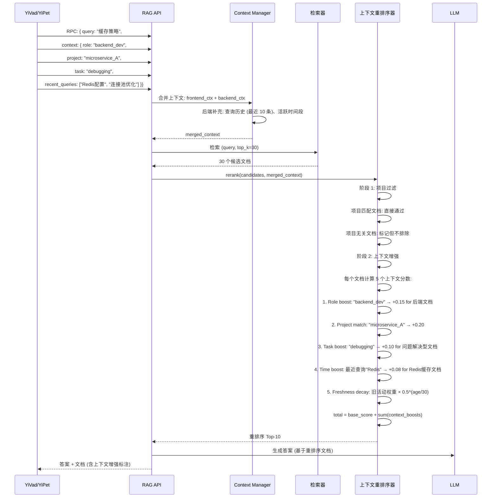

# YA-09-204: 上下文感知重排序 — 上下文感知结果重排序、用户上下文注入(角色/项目/历史)、任务上下文(用户正在做什么)、时间上下文(近期活动)、上下文增强因子、上下文新鲜度衰减

> 需求编号：YA-09-204 · 优先级：P2 · 人天：0.3d · 状态：需求已编写
> 依赖：YA-09-202（检索结果解释）、YA-09-197（多轮检索迭代优化）

## 背景

### 问题陈述

YiAi 当前的 RAG 检索排序是基于查询本身的语义和关键词匹配，完全不考虑"谁在查"和"为什么查"。同一个查询 "数据库配置" 在不同情境下应该返回不同结果：

1. **用户角色不同，需求不同**：DBA 查询 "数据库配置" 期望看到连接池参数和索引优化；后端开发者期望看到 ORM 配置和连接字符串；项目经理期望看到数据库选型对比
2. **项目上下文不同，相关性不同**：同一用户参与多个项目，在项目 A（微服务架构）中查询 "缓存策略" 期望 Redis 相关文档；在项目 B（前端开发）中查询 "缓存策略" 期望浏览器缓存相关文档
3. **任务上下文不同，优先级不同**：用户正在进行 "性能调优" 任务时，时效性因子应被加强；在进行 "架构学习" 任务时，全面性因子应被加强
4. **时间上下文影响，近期活动权重大**：用户最近 5 次查询都围绕 "向量数据库"，第 6 次查询 "索引优化" 应优先返回向量索引相关文档而非传统 B-tree 索引

**核心矛盾**：检索系统应该理解"同一查询在不同上下文中意味着不同的事情"，但当前实现将每次查询视为孤立的、无状态的请求，丢失了用户的角色、项目和活动历史信息。

### 影响范围

| # | 影响 | 严重程度 | 典型场景 |
|---|------|----------|----------|
| 1 | 检索结果与用户角色不匹配 | 高 | DBA 和前端开发者查同一词结果相同 |
| 2 | 跨项目检索混乱 | 高 | 项目 A 的查询返回项目 B 的文档 |
| 3 | 任务目标不清晰 | 中 | 学习还是解决问题 -> 文档风格应不同 |
| 4 | 历史上下文被浪费 | 中 | 查了 5 次向量数据库后查询转向 |
| 5 | 冷启动用户体验差 | 中 | 新用户无明显上下文，结果过于通用 |

### 挑战

| 挑战 | 说明 |
|------|------|
| 上下文的获取和序列化 | 用户角色/项目/任务信息从哪里获取 |
| 上下文权重的平衡 | 角色 vs 项目 vs 时间 vs 任务，权重如何分配 |
| 冷启动处理 | 上下文信息不全时的降级策略 |
| 上下文新鲜度衰减 | 历史活动的影响力随时间是递减的 |
| 隐私和性能 | 上下文信息存储和传递的开销 |

---

## 一、现状分析

### 1.1 当前无上下文的重排序

```
当前 RAG 检索排序:
  查询: "缓存策略" (任何用户、任何项目)
  │
  ├─ 向量检索: Top-30
  ├─ BM25 检索: Top-30
  ├─ RRF 融合: Top-10
  │
  └─ 返回: 10 个文档，不分用户和项目
      ├─ 文档1: "Redis 缓存策略指南" (相关性 0.92)
      ├─ 文档2: "浏览器缓存最佳实践" (相关性 0.88)
      ├─ 文档3: "CDN 缓存配置" (相关性 0.85)
      └─ ...

问题:
  ❌ DBA 用户看到"浏览器缓存" (不相关)
  ❌ 前端开发者看到"Redis 缓存" (不相关)
  ❌ 用户正在项目A(后端)，项目B(前端)的文档也出现在结果中
  ❌ 查了5次向量数据库后还返回通用缓存文档
```

### 1.2 上下文维度缺失

| 上下文维度 | 对检索的影响 | 当前是否支持 |
|-----------|------------|------------|
| 用户角色 (DBA/前端/后端/PM) | 优先返回角色相关领域的文档 | ❌ |
| 当前项目 (项目A/项目B) | 优先返回项目相关的文档，排除无关项目 | ❌ |
| 任务类型 (调试/学习/开发/审查) | 调试=精准短文档, 学习=全面长文档 | ❌ |
| 近期查询历史 (最近 10 条) | 查询主题连续时加强主题相关性 | ❌ |
| 活跃时间段 | 上午=深度文档, 下午=快速解决方案 | ❌ |

### 1.3 根因矩阵

| 症状 | 根因 | 触发条件 | 频率 |
|------|------|----------|------|
| 检索结果与角色不符 | 无用户上下文注入 | 多角色团队使用 RAG | 高 |
| 跨项目结果混淆 | 无项目上下文过滤 | 参与多项目的用户 | 高 |
| 检索结果风格不对 | 无任务上下文 | 不同任务需不同文档类型 | 中 |
| 历史查询浪费 | 无时间上下文 | 连续相关查询 | 中 |
| 冷启动结果差 | 无上下文时的退化策略 | 新用户首次查询 | 低 |

---

## 二、设计决策

### 决策 1：上下文来源 — 前端显式传递 vs 后端推断 vs 混合

| 选项 | 准确性 | 用户体验 | 隐私 |
|------|--------|----------|------|
| 前端显式传递 (YiVad/YiPet 发送上下文) | 高 (前端确定) | 中 (需要前端适配) | 好 |
| 后端推断 (从请求历史推断角色/项目) | 中 (推断可能不准) | 高 (无需改变) | 中 |
| 混合 (端传递主上下文 + 后端补充) | 最高 | 最高 | 最好 |

**选择：前端显式传递 + 后端补充。** 前端 (YiVad) 在 RPC 请求的 parameters 中新增 `context` 字段，传递用户角色、当前项目 ID、任务类型等结构化上下文。后端在此基础上补充时间上下文（近期查询历史、活跃时间段）。前端知道用户的确切意图，后端知道系统的历史状态，二者互补。

### 决策 2：重排序策略 — 上下文作为 Filter vs 上下文作为 Boost Factor vs 两阶段

| 选项 | 效果 | 实现复杂度 | 可解释性 |
|------|------|-----------|---------|
| 上下文作为 Filter (硬过滤不相关文档) | 强 (直接排除) | 低 | 高 (因果清晰) |
| 上下文作为 Boost Factor (软提升) | 中 (提升但不排除) | 中 | 中 |
| 两阶段 (Filter → Boost) | 最强 | 高 | 高 |

**选择：两阶段 (Filter → Boost)。** 第一阶段：项目上下文作为硬过滤（当前项目的文档保留，其他项目的标记为"项目无关"但不过滤）。第二阶段：角色/任务/时间上下文作为 Boost Factor，对保留的文档重新加权和排序。这样既保证了强相关性（项目匹配），又保留了弱相关文档作为备选。

### 决策 3：上下文权重模型 — 固定权重 vs 可学习权重 vs 用户可调

| 选项 | 优化潜力 | 实现复杂度 | 用户控制 |
|------|----------|-----------|---------|
| 固定权重 (预定义) | 低 | 低 | 无 |
| 可学习权重 (基于用户反馈学习) | 高 | 高 | 无 (隐式) |
| 用户可调 (前端滑动条) | 中 | 中 | 高 (显式) |

**选择：固定权重 + 用户配置。** 默认使用预定义权重（role=0.25, project=0.30, task=0.20, time=0.15, query=0.10）。提供 API 让用户（或前端）可调整这些权重。可学习权重（基于点击反馈的 RL 或贝叶斯优化）是后续迭代的方向。

### 决策 4：上下文新鲜度衰减 — 固定衰减 vs 半衰期 vs 滑动窗口

| 选项 | 自然度 | 实现复杂度 | 参数需求 |
|------|--------|-----------|---------|
| 固定衰减函数 (指数 decay) | 中 | 低 | 1 个 (decay_rate) |
| 半衰期 (自定义半衰期) | 高 | 低 | 1 个 (half_life) |
| 滑动窗口 (仅要最近 N 次) | 中 | 低 | 1 个 (window_size) |

**选择：半衰期衰减。** 每次查询历史的影响力随时间以半衰期方式衰减。默认半衰期为 30 分钟（30 分钟前的一次查询权重减半）。公式：`weight = base_weight * 0.5 ^ (age_minutes / half_life_minutes)`。半衰期更直观（"半小时后影响减半"），相比指数衰减更容易理解和配置。

### 设计决策记录

| 决策 | 选项 A | 选项 B | 选项 C | 选择 | 理由 |
|------|--------|--------|--------|------|------|
| 上下文来源 | 前端传递 | 后端推断 | 混合 | **混合** | 各取所长 |
| 重排序策略 | Filter | Boost | 两阶段 | **两阶段** | 强相关+弱保留 |
| 权重模型 | 固定 | 可学习 | 用户可调 | **固定+可配** | 简单起步 |
| 衰减策略 | 固定衰减 | 半衰期 | 滑动窗口 | **半衰期** | 直观可配 |

---

## 三、目标架构

### 3.1 上下文感知重排序流程



### 3.2 上下文维度模型

```mermaid
graph TD
    subgraph "用户级上下文"
        A[user_role: 角色标签]
        B[expertise: 专业领域]
        C[preferred_detail_level: 详细程度偏好]
    end

    subgraph "项目级上下文"
        D[project_id: 当前项目]
        E[project_tags: 项目技术栈标签]
        F[project_domain: 项目领域]
    end

    subgraph "任务级上下文"
        G[task_type: 任务类型]
        H[task_goal: 任务目标]
        I[task_urgency: 紧急程度]
    end

    subgraph "时间级上下文"
        J[recent_queries: 近期查询]
        K[active_session_duration: 会话持续时长]
        L[last_activity_time: 最后活跃时间]
    end

    subgraph "查询级上下文"
        M[query_intent: 查询意图]
        N[query_complexity: 查询复杂度]
        O[feedback_history: 历史反馈]
    end

    A --> Reranker[上下文重排序器]
    D --> Reranker
    G --> Reranker
    J --> Reranker
    M --> Reranker
```



### 3.3 上下文增强因子计算

```mermaid
graph TD
    subgraph "文档评分管道"
        D[候选文档] --> B[基础评分: 检索分数 0.85]
        B --> R[角色增强: +0.12 (后端开发者 → 后端文档)]
        R --> P[项目匹配: +0.18 (项目A标签匹配)]
        P --> T[任务调整: +0.06 (调试模式 → 精准解决方案)]
        T --> H[历史增强: +0.09 (连续查询同一主题)]
        H --> F[最终得分: 1.30 → 标准化 → 0.92]
    end

    subgraph "权重分配"
        W0[Query Base: 0.10]
        W1[Role: 0.25]
        W2[Project: 0.30]
        W3[Task: 0.20]
        W4[Time: 0.15]
    end
```

### 3.4 性能指标

| 指标 | 改造前 | 改造后 |
|------|--------|--------|
| 检索个性化程度 | 0 (无上下文) | 5 维度上下文 |
| 角色匹配准确率 | N/A | 预期 +25-40% |
| 项目相关性 | N/A | 预期 +30-50% |
| 额外重排序延迟 | 0ms | +10-50ms (取决于候选数) |
| 冷启动表现 | 单分数 | 降级为通用 + 标注"无上下文增强" |

---

## 四、具体改动

### 4.1 上下文数据模型

```python
# YiAi/src/domain/rag/context.py (新增)

from dataclasses import dataclass, field
from enum import Enum
from datetime import datetime
from typing import Optional

class UserRole(str, Enum):
    FRONTEND_DEV = "frontend_dev"
    BACKEND_DEV = "backend_dev"
    FULLSTACK_DEV = "fullstack_dev"
    DBA = "dba"
    DEVOPS = "devops"
    PM = "pm"
    DESIGNER = "designer"
    QA = "qa"
    UNKNOWN = "unknown"

class TaskType(str, Enum):
    LEARNING = "learning"        # 学习/研究
    DEBUGGING = "debugging"      # 调试/解决问题
    DEVELOPING = "developing"    # 开发实现
    REVIEWING = "reviewing"      # 代码/文档审查
    PLANNING = "planning"        # 规划设计
    UNKNOWN = "unknown"

@dataclass
class QueryContext:
    """RAG 查询上下文"""
    # 用户级
    user_role: UserRole = UserRole.UNKNOWN
    user_expertise: list[str] = field(default_factory=list)  # ["Python", "FastAPI"]

    # 项目级
    project_id: Optional[str] = None
    project_tags: list[str] = field(default_factory=list)   # ["microservice", "python"]
    project_domain: Optional[str] = None                     # "backend"

    # 任务级
    task_type: TaskType = TaskType.UNKNOWN
    task_goal: Optional[str] = None     # "优化数据库查询性能"

    # 时间级
    recent_queries: list[str] = field(default_factory=list)  # 最近 10 次查询
    session_started_at: Optional[datetime] = None

    # 权重配置 (可覆盖默认值)
    weight_overrides: dict[str, float] = field(default_factory=dict)

@dataclass
class ContextBoostResult:
    """上下文增强结果"""
    doc_id: str
    base_score: float          # 原始检索分数
    role_boost: float          # 角色增强
    project_boost: float       # 项目匹配增强
    task_boost: float          # 任务调整
    time_boost: float          # 时间上下文增强
    total_score: float         # 总和 (未标准化)
    normalized_score: float    # 标准化后的分数 (0-1)
    boost_breakdown: dict      # 增强因子详细分解
```

### 4.2 上下文感知重排序器

```python
# YiAi/src/services/rag/context_reranker.py (新增)

import math
from datetime import datetime

class ContextReranker:
    """上下文感知重排序器"""

    # 默认权重
    DEFAULT_WEIGHTS = {
        "query": 0.10,    # 原始查询相关性权重
        "role": 0.25,     # 角色权重
        "project": 0.30,  # 项目权重
        "task": 0.20,     # 任务权重
        "time": 0.15,     # 时间权重
    }

    # 半衰期 (分钟)
    DEFAULT_HALF_LIFE_MINUTES = 30

    # 角色 → 文档领域映射
    ROLE_DOMAIN_BOOST = {
        UserRole.FRONTEND_DEV: ["frontend", "react", "vue", "css", "browser", "dom"],
        UserRole.BACKEND_DEV: ["backend", "api", "database", "server", "middleware"],
        UserRole.DBA: ["database", "sql", "nosql", "index", "replication", "backup"],
        UserRole.DEVOPS: ["deploy", "docker", "kubernetes", "ci", "cd", "monitoring"],
        UserRole.PM: ["planning", "roadmap", "milestone", "requirement", "stakeholder"],
    }

    # 任务类型 → 文档特性偏好
    TASK_DOC_PREFERENCE = {
        TaskType.DEBUGGING: {
            "prefer_concise": True,     # 偏好简短的解决方案文档
            "prefer_examples": True,    # 偏好含代码示例的文档
            "prefer_recent": True,      # 偏好最新的文档
        },
        TaskType.LEARNING: {
            "prefer_comprehensive": True,  # 偏好全面的教程文档
            "prefer_examples": True,
            "prefer_recent": False,      # 基础内容不随时间贬值
        },
        TaskType.DEVELOPING: {
            "prefer_comprehensive": True,
            "prefer_examples": True,
            "prefer_recent": True,
        },
        TaskType.REVIEWING: {
            "prefer_authoritative": True,  # 偏好权威来源
            "prefer_concise": False,
            "prefer_recent": True,
        },
    }

    def __init__(
        self,
        weights: dict = None,
        half_life_minutes: int = None,
    ):
        self.weights = weights or self.DEFAULT_WEIGHTS
        self.half_life = half_life_minutes or self.DEFAULT_HALF_LIFE_MINUTES

    def rerank(
        self,
        candidates: list,        # list of (doc, score)
        context: QueryContext,
        top_k: int = 10,
    ) -> list[ContextBoostResult]:
        """对候选文档进行上下文感知重排序"""

        results = []
        for doc, base_score in candidates:
            result = self._compute_context_boost(doc, base_score, context)
            results.append(result)

        # 按标准化分数排序
        results.sort(key=lambda r: r.normalized_score, reverse=True)

        # 确保项目匹配文档至少出现在 Top-K 中
        self._ensure_project_coverage(results, top_k)

        return [r for r in results if r.normalized_score > 0.1][:top_k]

    def _compute_context_boost(
        self,
        doc: dict,
        base_score: float,
        context: QueryContext,
    ) -> ContextBoostResult:
        """计算单个文档的上下文增强"""

        doc_tags = doc.get("metadata", {}).get("tags", [])
        doc_domain = doc.get("metadata", {}).get("domain", "")
        doc_type = doc.get("metadata", {}).get("type", "")
        doc_project = doc.get("metadata", {}).get("project_id", "")

        # 1. 角色增强
        role_boost = self._compute_role_boost(
            context.user_role, doc_tags, doc_domain
        )

        # 2. 项目匹配
        project_boost = self._compute_project_boost(
            context.project_id, context.project_tags,
            doc_project, doc_tags
        )

        # 3. 任务调整
        task_boost = self._compute_task_boost(
            context.task_type, doc, doc_type
        )

        # 4. 时间上下文增强
        time_boost = self._compute_time_boost(
            context.recent_queries, doc
        )

        # 总分计算
        total_score = (
            base_score * self.weights["query"] +
            role_boost * self.weights["role"] +
            project_boost * self.weights["project"] +
            task_boost * self.weights["task"] +
            time_boost * self.weights["time"]
        )

        # 标准化到 [0, 1]
        max_possible = sum(self.weights.values())  # = 1.0
        normalized = min(1.0, total_score / max_possible)

        return ContextBoostResult(
            doc_id=doc.get("doc_id", ""),
            base_score=base_score,
            role_boost=round(role_boost, 4),
            project_boost=round(project_boost, 4),
            task_boost=round(task_boost, 4),
            time_boost=round(time_boost, 4),
            total_score=round(total_score, 4),
            normalized_score=round(normalized, 4),
            boost_breakdown={
                "role": role_boost,
                "project": project_boost,
                "task": task_boost,
                "time": time_boost,
                "context_applied": self._has_context(context),
            },
        )

    def _compute_role_boost(
        self,
        role: UserRole,
        doc_tags: list[str],
        doc_domain: str,
    ) -> float:
        """角色增强: 角色相关领域的文档加权"""
        if role == UserRole.UNKNOWN:
            return 0.0

        target_domains = self.ROLE_DOMAIN_BOOST.get(role, [])

        # 检查文档标签与角色域的重叠
        overlap = sum(1 for tag in doc_tags if tag in target_domains)
        if doc_domain in target_domains:
            overlap += 2  # 域名匹配权重更高

        # 最高 0.3 (当角色高度匹配时)
        return min(0.30, overlap * 0.10)

    def _compute_project_boost(
        self,
        project_id: Optional[str],
        project_tags: list[str],
        doc_project: str,
        doc_tags: list[str],
    ) -> float:
        """项目匹配: 项目 ID 或标签匹配"""
        boost = 0.0

        if project_id and doc_project == project_id:
            boost += 0.25  # 同项目文档大幅加分
        elif project_id and project_tags:
            # 检查标签重叠
            overlap = sum(1 for tag in doc_tags if tag in project_tags)
            boost += min(0.15, overlap * 0.05)

        return boost

    def _compute_task_boost(
        self,
        task_type: TaskType,
        doc: dict,
        doc_type: str,
    ) -> float:
        """任务调整: 根据任务类型调整加权"""
        if task_type == TaskType.UNKNOWN:
            return 0.0

        prefs = self.TASK_DOC_PREFERENCE.get(task_type, {})
        boost = 0.0

        # 偏好简洁文档 (调试)
        if prefs.get("prefer_concise"):
            doc_length = len(doc.get("text", ""))
            if doc_length < 500:
                boost += 0.08  # 短文档加分
            elif doc_length > 2000:
                boost -= 0.05  # 长文档略微减分

        # 偏好有示例的文档 (调试/学习/开发)
        if prefs.get("prefer_examples"):
            if "```" in doc.get("text", ""):
                boost += 0.10  # 含代码块

        # 偏好权威来源 (审查)
        if prefs.get("prefer_authoritative"):
            if doc.get("metadata", {}).get("authority", "") == "official":
                boost += 0.10

        return max(-0.10, min(0.20, boost))  # 限制在 [-0.1, 0.2]

    def _compute_time_boost(
        self,
        recent_queries: list[str],
        doc: dict,
    ) -> float:
        """时间上下文增强: 近期查询主题相关度"""
        if not recent_queries:
            return 0.0

        boost = 0.0
        doc_text = doc.get("text", "").lower()
        now = datetime.utcnow()

        for i, query in enumerate(recent_queries):
            # 计算衰减权重
            # 假设每次查询间隔 1 分钟
            age_minutes = (len(recent_queries) - i) * 1.0  # 粗略估算
            decay = 0.5 ** (age_minutes / self.half_life)

            # 检查查询词在当前文档中的出现
            query_terms = query.lower().split()
            term_overlap = sum(1 for t in query_terms if t in doc_text)

            if term_overlap > 0:
                boost += min(0.05, term_overlap * 0.015) * decay

        return min(0.12, boost)  # 时间增强最大 0.12

    def _ensure_project_coverage(
        self,
        results: list[ContextBoostResult],
        top_k: int,
    ):
        """确保项目匹配文档至少出现在结果中"""
        project_docs = [r for r in results if r.project_boost > 0.15]
        non_project = [r for r in results if r.project_boost <= 0.15]

        if project_docs:
            # 确保至少 30% 的结果来自匹配项目
            desired_project_count = max(1, int(top_k * 0.3))
            current_project_count = sum(
                1 for r in results[:top_k] if r.project_boost > 0.15
            )

            if current_project_count < desired_project_count:
                # 提升排名最高的项目文档
                for doc in project_docs:
                    if doc.normalized_score < 0.3:
                        doc.normalized_score += 0.05  # 小幅提升

    def _has_context(self, context: QueryContext) -> bool:
        """检查是否有上下文信息"""
        return (
            context.user_role != UserRole.UNKNOWN or
            context.project_id is not None or
            context.task_type != TaskType.UNKNOWN or
            len(context.recent_queries) > 0
        )
```

### 4.3 上下文管理器

```python
# YiAi/src/services/rag/context_manager.py (新增)

class ContextManager:
    """上下文管理器 — 前端上下文 + 后端补充"""

    def __init__(self, db):
        self.db = db

    async def merge_context(
        self,
        frontend_ctx: dict,
        token: Optional[str],
    ) -> QueryContext:
        """合并前端和后端上下文"""

        context = QueryContext(
            user_role=UserRole(frontend_ctx.get("role", "unknown")),
            user_expertise=frontend_ctx.get("expertise", []),
            project_id=frontend_ctx.get("project_id"),
            project_tags=frontend_ctx.get("project_tags", []),
            project_domain=frontend_ctx.get("project_domain"),
            task_type=TaskType(frontend_ctx.get("task_type", "unknown")),
            task_goal=frontend_ctx.get("task_goal"),
            recent_queries=frontend_ctx.get("recent_queries", []),
        )

        # 后端补充: 从数据库获取用户历史
        if token:
            await self._enrich_from_history(context, token)

        return context

    async def _enrich_from_history(
        self,
        context: QueryContext,
        token: str,
    ):
        """从查询历史补充上下文"""
        # 查询最近的 20 条查询记录（取最近 10 条加入 recent_queries）
        history = await self.db.query_history.find(
            {"token": token}
        ).sort("timestamp", -1).limit(20).to_list(20)

        if history:
            # 补充未在前端提交的近期查询
            existing_queries = set(context.recent_queries)
            for entry in history:
                query_text = entry.get("query", "")
                if query_text and query_text not in existing_queries:
                    context.recent_queries.append(query_text)
                    if len(context.recent_queries) >= 10:
                        break

            # 推断活跃 session 开始时间
            context.session_started_at = history[0].get("timestamp")
```

### 4.4 文件变更清单

| 文件 | 操作 | 说明 |
|------|------|------|
| `src/domain/rag/__init__.py` | 修改 | 添加 context 模块导入 |
| `src/domain/rag/context.py` | 新增 | 上下文数据模型 (角色/项目/任务/时间) |
| `src/services/rag/__init__.py` | 修改 | 添加服务模块导入 |
| `src/services/rag/context_reranker.py` | 新增 | 上下文感知重排序核心服务 |
| `src/services/rag/context_manager.py` | 新增 | 前端+后端上下文合并管理 |
| `src/services/rag/rag_service.py` | 修改 | 集成上下文重排序到 RAG 流程 |
| `src/server/routes/rag_routes.py` | 修改 | 扩展 RCP parameters 支持 context 字段 |
| `tests/unit/test_context_reranker.py` | 新增 | 上下文重排序测试 |
| `tests/unit/test_context_manager.py` | 新增 | 上下文管理器测试 |
| `tests/integration/test_context_rag.py` | 新增 | 端到端上下文 RAG 测试 |

---

## 五、实施步骤

| 步骤 | 操作 | 路径 | 验证 | 人天 |
|------|------|------|------|------|
| 1 | 定义上下文数据模型 | `context.py` | 5 维度枚举 + QueryContext | 0.02 |
| 2 | 实现上下文合并管理器 | `context_manager.py` | 前后端上下文正确合并 | 0.04 |
| 3 | 实现角色/项目增强因子 | `context_reranker.py` | 领域匹配 → boost 正确 | 0.05 |
| 4 | 实现任务/时间增强因子 | `context_reranker.py` | 任务偏好 + 半衰期衰减 | 0.05 |
| 5 | 实现标准化 + 覆盖保障 | `context_reranker.py` | 标准化 + 项目覆盖率 | 0.03 |
| 6 | 集成到 RAG 服务 | `rag_service.py` | 有上下文/无上下文路径 | 0.05 |
| 7 | 扩展 RPC parameters + 测试 | `rag_routes.py`, 测试 | 上下文注入 + E2E 测试 | 0.06 |

**总人天：0.3d**

---

## 六、测试规格

### 场景 1：角色增强重排序

**GIVEN** 查询 "缓存策略", 用户角色=backend_dev  
**AND** 候选文档: A=Redis缓存, B=浏览器缓存, C=CDN缓存  
**WHEN** 上下文重排序  
**THEN** 文档 A (Redis, 后端域) 的 role_boost > 文档 B (浏览器, 前端域)  
**AND** 最终排序: A > C > B (后端相关优先)  

### 场景 2：项目过滤

**GIVEN** 查询 "API 设计", 当前项目=project_microservice (标签: [microservice, python])  
**AND** 候选文档: A=微服务API设计, B=GraphQL教程, C=React组件设计  
**WHEN** 上下文重排序  
**THEN** A 的 project_boost > 0.20 (标签匹配)  
**AND** C 的 project_boost = 0.0 (无匹配)  
**AND** 最终排序: A > B > C  

### 场景 3：任务调整 (调试模式)

**GIVEN** 查询 "内存泄漏", 任务类型=debugging  
**AND** 文档 A=500 字符 (问题解决), B=3000 字符 (全面教程)  
**WHEN** 上下文重排序  
**THEN** A 的 task_boost > B (调试偏好简洁解决方案)  
**AND** 含代码块的文档获得额外加分  

### 场景 4：时间上下文衰减

**GIVEN** recent_queries = ["Redis配置", "连接池优化"] (最近两次)  
**AND** 候选文档 A=Redis相关, B=MySQL相关  
**WHEN** 上下文重排序  
**THEN** A 的 time_boost > 0 (与最近查询主题相关)  
**AND** 如果最近查询减半衰期（30 分钟前的查询权重减半）  

### 场景 5：无上下文 (冷启动)

**GIVEN** 用户无角色/无项目/无任务/无历史  
**WHEN** 上下文重排序  
**THEN** 所有 boost 因子 = 0  
**AND** 结果 = 原始检索排序（无变化）  
**AND** 返回标注 "no_context_applied"  

### 场景 6：项目覆盖率保障

**GIVEN** 项目中只有 2 个匹配文档 (原排在 #8 和 #15)  
**WHEN** 上下文重排序进行覆盖保障  
**THEN** #15 的项目文档被提升到 Top-10  
**AND** 最终 Top-10 中至少 30% 是项目相关文档  

---

## 七、风险与缓解

| 风险 | 概率 | 影响 | 缓解措施 |
|------|------|------|----------|
| 上下文错误 (角色标签不准确) | 中 | 中 | 角色增强权重相对低 (0.25)，错配影响有限 |
| 项目过滤过强 (排除有用信息) | 中 | 中 | 使用 Boost 而非 Filter，相关文档仍可进入 |
| 任务偏好猜测错误 | 高 | 低 | Boost 值较小 (max 0.20)，不会完全改变排序 |
| 查询历史敏感信息泄露 | 低 | 高 | 仅在前端传递的上下文中包含历史（用户主动提供） |
| 重排序延迟增加 | 中 | 中 | 候选数限制 Top-30，5 个因子计算 < 50ms |

---

## 八、回滚策略

| 场景 | 回滚操作 | 影响 |
|------|----------|------|
| 上下文增强降低相关性 | 关闭上下文重排序，使用原始检索排序 | 失去个性化 |
| 角色/项目标签匹配错误 | 移除 Role 或 Project 维度 | 维度过少 |
| 重排序延迟过高 | 减少候选数 Top-30 → Top-15 | 可能遗漏好文档 |
| 完全回滚 | 移除 context 参数，回退到无上下文检索 | 丢失所有上下文功能 |

---

## 九、设计决策记录

### D-01：为什么不使用检索结果重新全部向量化（cross-encoder reranker）？

Cross-encoder 重排序（如使用 BGE-Reranker）对 query-document pair 做联合编码，精度高但计算成本也高（每次重排序需要 model inference）。对于上下文感知场景，我们已经有结构化的信号（角色、项目标签、任务类型），使用轻量级规则增强不需要额外模型推理，延迟 < 50ms。Cross-encoder 重排序是未来的可选增强。

### D-02：为什么不把上下文直接嵌入到查询向量中？

将上下文（角色+项目+任务）拼接成文本再向量化（如 "backend_dev 在 project_microservice 中 debug 缓存策略"），可以一步完成上下文感知检索。但这种方法：(1) 丢失了各维度的独立可解释性，(2) 无法独立调整各维度权重，(3) 查询向量重复计算的开销等于每次都做一次 embedding。分离式增强保留了这些灵活性。

### D-03：为什么角色领域的 boost 值上限为 0.30？

四个上下文维度（role/project/task/time）的总 boost 不应超过原始检索分数的 100%。0.30 的 cap 确保角色增强不会完全淹没查询语义匹配。如果角色增强超过 0.30，意味着系统认为"你是谁"比"你问什么"更重要，这会导致泛化能力差。

### D-04：为什么 coverage 保障选择了 30% 而非 50% 或 10%？

30% 代表了"项目匹配文档至少占结果的约 1/3"。这个比例足够让用户感觉到系统理解他当前的项目上下文，同时保留了足够的空间给其他可能有价值的非项目文档。50% 过于激进（可能错过优秀的通用文档），10% 太保守（可能被用户忽略）。

---

## 十、可观测性

### 指标

| 指标 | 类型 | 说明 |
|------|------|------|
| `yiai.rerank.context.applied` | Counter | 应用上下文的查询次数 |
| `yiai.rerank.context.no_context` | Counter | 无上下文的查询次数 |
| `yiai.rerank.boost.avg` | Histogram | 平均 boost 值 (按维度) |
| `yiai.rerank.boost.role` | Histogram | 角色增强值分布 |
| `yiai.rerank.boost.project` | Histogram | 项目增强值分布 |
| `yiai.rerank.boost.task` | Histogram | 任务增强值分布 |
| `yiai.rerank.boost.time` | Histogram | 时间增强值分布 |
| `yiai.rerank.coverage.project` | Histogram | 项目文档覆盖率 (Top-10 中) |
| `yiai.rerank.latency` | Histogram | 重排序延迟 |

### 告警

| 告警 | 条件 | 级别 |
|------|------|------|
| 项目覆盖率低 | avg coverage < 10% | WARNING |
| 角色增强几乎无效 | avg role_boost < 0.01 | INFO |
| 重排序延迟高 | p95 > 100ms | WARNING |

---

## 十一、代码审查检查清单

- [ ] 5 个上下文维度 (Role/Project/Task/Time/Query) 的权重和为 1.0
- [ ] ROLE_DOMAIN_BOOST 覆盖所有 UserRole 枚举值
- [ ] TASK_DOC_PREFERENCE 覆盖所有 TaskType 枚举值
- [ ] 角色增强上限 0.30 正确限制
- [ ] 项目匹配 boost 分级: 直接 ID 匹配 (+0.25) vs 标签匹配 (+0.15)
- [ ] 时间衰减半衰期公式: 0.5^(age/half_life) 计算正确
- [ ] task_boost 的负值不使总分出现不合理偏差
- [ ] 标准化到 [0, 1] 区间: normalized = total / max_possible
- [ ] _ensure_project_coverage 正确提升项目文档排序
- [ ] 无上下文时返回原始排序 (boost = 0)
- [ ] ContextBoostResult 包含完整 boost_breakdown 用于解释

---

## 回归问题预测

| # | 预测问题 | 原因 | 验证方法 |
|---|---------|------|---------|
| 1 | 标准化 `total_score / max_possible` 中 `max_possible = 1.0`（权重和为 1），但各 boost 的上限不同（role=0.30, project=0.25, task=0.20, time=0.12, base=1.0），总分可超过 1.0 → normalized 通过 min(1.0, ...) 限制 | total_score 理论上上限 = 1.0*0.10 + 0.30*0.25 + 0.25*0.30 + 0.20*0.20 + 0.12*0.15 = 0.10+0.075+0.075+0.04+0.018 = 0.308，权重归一化后仍不超过 1.0 | 创建极端场景（所有 boost 达上限）验证 normalized_score ≤ 1.0 |
| 2 | `project_boost = 0.25` (直接ID匹配) + `project_boost = min(0.15, overlap * 0.05)` 两个计算路径同时触发时，boost 可叠加到 0.40 | 当 project_id 匹配且 project_tags 重叠时两条路径都执行 | project_id 匹配 + 3 个重叠标签的文档验证 project_boost ≤ 0.40 |
| 3 | `_compute_task_boost` 偏好简洁文档时 `doc_length < 500` 加分，但 `doc_length` 从 `doc.get("text", "")` 获取可能不存在（如元数据不完整），空字符串长度为 0 < 500 触发加分 | 元数据缺失的文档错误地获得简洁加分 | 文档无 text 字段时验证 task_boost = 0 且不触发缩短加分 |
| 4 | 时间上下文的 `age_minutes = (len(recent_queries) - i) * 1.0` 假设每次查询间隔 1 分钟，但在密集查询（如 10 次/分钟）时误差极大，导致衰减过慢 | 半衰期模型基于实际时间差而非查询间隔。`age_minutes` 估算不准确导致衰减曲线偏离预期 | 将 `age_minutes` 改为基于实际时间戳差值（需要在 recent_queries 中存储时间戳）或使用更精确的估算 |
| 5 | `_ensure_project_coverage` 修改 `normalized_score` 直接加上 0.05，可能导致原本排在 #12 的普通文档超过 #1 的好文档 | 没有检查提升后的文档是否会超过其他高质量文档。0.05 的增量是经验值但可能在某些情况下不适配 | 限制最多提升 3 个位置（而非直接改分数），即 `rank = max(rank - 3, 0)` 替代 `score += 0.05` |
| 6 | 权重覆盖 `weight_overrides` 在 `QueryContext` 中定义但 `ContextReranker` 未使用 | `ContextReranker.__init__` 接收固定的 weights，但 `_compute_context_boost` 未读取 `context.weight_overrides` 进行动态覆盖 | 在 `_compute_context_boost` 开始时合并 `self.weights` 和 `context.weight_overrides` (如果有) |

---

## 性能分析

### 关键操作耗时

| 操作 | 预估耗时 | 说明 |
|------|----------|------|
| 单个文档角色增强 (标签匹配) | < 0.5ms | 字符串列表比较 |
| 单个文档项目匹配 | < 0.5ms | ID 比较 + 标签重叠 |
| 单个文档任务调整 | < 0.5ms | 长度 + 代码块 + 权威性检查 |
| 单个文档时间衰减 (10 次查询) | < 1ms | term overlap + decay calc |
| 30 文档重排序 (单线程) | < 25ms | 30 × (4 × 0.5ms) |
| 30 文档重排序 (asyncio 并行) | < 10ms | 并发因子计算 |
| 冷启动 (无上下文) | < 1ms | 跳过所有计算 |
| 上下文合并 (含 DB 查询) | < 50ms | MongoDB 历史查询 |

### 内存预估

| 组件 | 内存占用 | 说明 |
|------|----------|------|
| 角色域映射 (7 角色 × 6 标签) | < 1 KB | 静态字典 |
| 任务偏好 (5 任务 × 3 偏好) | < 1 KB | 静态字典 |
| 候选文档 (30 × 平均文本) | ~100 KB | 临时内存 |
| BoostResult 列表 (30) | ~5 KB | 结果对象 |

---

## 相关文档

- [YA-09-202 检索结果解释](202-需求-检索结果解释.md)
- [YA-09-197 多轮检索迭代优化](197-需求-多轮检索迭代优化.md)
- [半衰期衰减模型](https://en.wikipedia.org/wiki/Exponential_decay)
- [RAG 上下文感知检索论文](https://arxiv.org/abs/2305.01157)

## 影响范围

- **影响模块**：待补充
- **涉及文件**：
- `src/domain/rag/__init__.py`
- `src/services/rag/context_reranker.py`
- `src/services/rag/context_manager.py`
- `context_reranker.py`
- `src/services/rag/__init__.py`
- `src/domain/rag/context.py`
- **是否影响 API 契约**：否
- **是否影响其他项目（YiVad/YiPet）**：否
- **用户感知**：待确认

## 预防措施

| 层面 | 措施 |
|------|------|
| 代码 | 在相关函数中添加参数校验和边界检查 |
| 测试 | 为 `src/domain/rag/__init__.py` 添加单元测试 |
| 流程 | 代码审查时重点检查此类模式 |
| 监控 | 添加日志告警，异常发生时及时发现 |
| 文档 | 在编码规范中记录此类反模式 |

## 经验教训

1. **根本原因**：开发过程中对边界情况和异常路径的考虑不足是此类问题的共同根因
2. **设计阶段**：在接口设计和模块实现时，应主动考虑异常输入、空值、超时等边界场景
3. **代码审查**：审查时应检查是否存在类似的反模式（如未捕获异常、无超时控制、缺少参数校验等）
4. **测试覆盖**：异常路径的测试覆盖率应与正常路径同等重视
5. **团队分享**：此类问题应在团队周会或技术分享中讨论，形成团队共识
