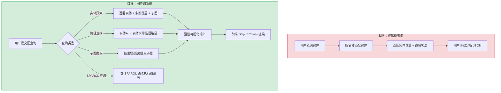
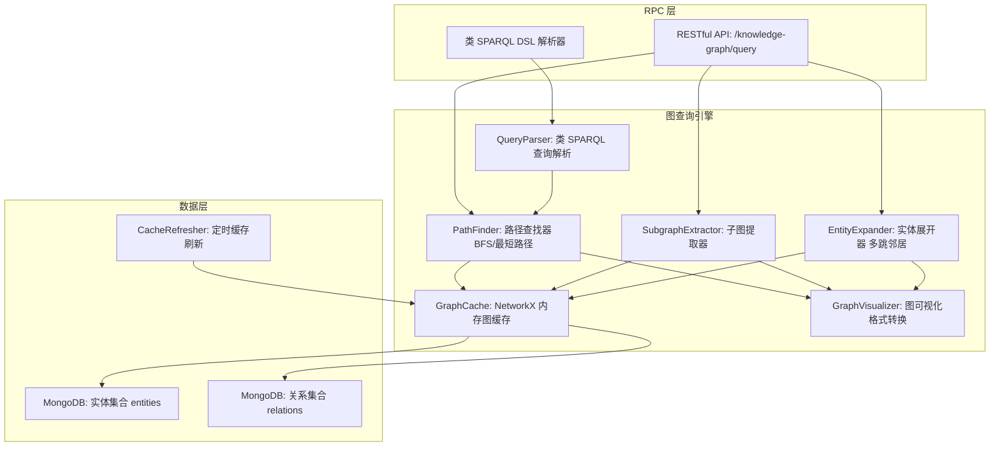

# YA-09-205: 知识图谱查询 — 图基知识检索、实体关系遍历、类 SPARQL 查询接口、概念间路径查找、子图提取、图谱可视化输出、与现有知识图谱集成

> 需求编号：YA-09-205 · 优先级：P2 · 人天：0.3d · 状态：需求已编写
> 依赖：YK-09-89（已有知识图谱构建功能）

## 背景

### 问题陈述

YiAi 已具备知识图谱构建能力（YK-09-89），能从文档中自动提取实体和关系，构建知识图谱。但当前图谱仅用于内部索引，缺少查询接口。用户无法交互式探索图谱中的概念关系、无法查找实体之间的路径、无法提取子图进行分析。

1. **图谱查询入口缺失**：已有图谱数据但无法查询，数据利用率低
2. **关系遍历不支持**：用户想知道"A 和 B 之间的关系"，但无法进行图遍历
3. **概念关联不可见**：两个概念之间是否存在间接关联（通过中间实体）无法获知
4. **子图提取困难**：无法按主题、领域或距离提取局部子图
5. **图谱可视化缺失**：查询结果以 JSON 文本返回，无法直观理解图结构

**核心矛盾**：知识图谱的构建和查询是完整图应用的两个必要环节。已建设图谱但无查询能力，等于有数据库但无查询语言——数据在但不可用。

### 影响范围

| # | 影响 | 严重程度 | 典型场景 |
|---|------|----------|----------|
| 1 | 图谱数据无法查询 | 高 | 用户想知道某个实体关联了哪些其他实体 |
| 2 | 关系遍历不支持 | 高 | 分析 "Redis" 和 "性能优化" 之间的知识关联路径 |
| 3 | 概念关联不透明 | 中 | 评估两个技术概念是否有间接关联 |
| 4 | 子图提取困难 | 中 | 提取 "微服务" 领域的所有相关知识图谱子图 |
| 5 | 结果不可视化 | 中 | 查询结果只能看 JSON，无法直观展示图结构 |

### 挑战

| 挑战 | 说明 |
|------|------|
| 图遍历深度控制 | 路径查找需要限制最大深度，防止图过大导致性能爆炸 |
| SPARQL 类查询解析 | 自定义查询语法需要在简洁性和表达能力之间平衡 |
| 子图提取边界 | 如何定义子图的边界——按距离/按主题/按实体类型 |
| 可视化格式 | 前端需要什么格式的图数据（D3.js/vis.js/Cytoscape.js 的数据格式不同） |
| 与 RAG 集成 | 图查询结果如何与现有的向量检索和 BM25 检索结果融合 |

---

## 一、现状分析

### 1.1 当前知识图谱能力

```
现有知识图谱功能:
├── YK-09-89 知识图谱构建
│   ├── 实体提取: 从文档中提取实体（NER + LLM）
│   ├── 关系提取: 实体间关系识别
│   ├── 图谱存储: 图数据库或 MongoDB 图结构存储
│   └── 图谱索引: 实体和关系建立索引
├── 查询能力
│   ├── 实体检索: 按实体名称查实体（基础）
│   ├── 邻居查询: 查实体的直接关联实体（基础）
│   └── 无复杂图查询、无路径查找、无子图提取
└── 可视化
    └── 无图谱可视化输出

缺失:
├── 图路径查找 (shortest path)              # ❌ 不存在
├── 子图提取 (subgraph extraction)          # ❌ 不存在
├── 关系遍历 (multi-hop traversal)          # ❌ 不存在
├── 类 SPARQL 查询接口                       # ❌ 不存在
├── 图谱可视化输出 (D3/vis.js 格式)          # ❌ 不存在
└── 图结果与 RAG 融合                       # ❌ 不存在
```

### 1.2 图查询流程（现状 vs 目标）



### 1.3 根因矩阵

| 症状 | 根因 | 触发条件 | 频率 |
|------|------|----------|------|
| 图数据不可查询 | 无图查询引擎 | 需要探索知识关联 | 高 |
| 无法路径查找 | 无 BFS/最短路径算法 | 分析概念间关系链 | 高 |
| 子图无法提取 | 无子图提取逻辑 | 按主题查看知识簇 | 中 |
| 无可视化数据 | 未设计图谱可视化协议 | 前端展示图谱 | 中 |
| 与 RAG 割裂 | 图查询结果未集成到检索管道 | 综合检索场景 | 中 |

---

## 二、设计决策

### 决策 1：图存储方案 — MongoDB 邻接表 vs NetworkX vs Neo4j

| 选项 | 查询性能 | 集成成本 | 扩展性 |
|------|----------|----------|--------|
| MongoDB 邻接表（现有） | 中（需应用层 BFS） | 低（已有） | 中 |
| NetworkX（内存图） | 高 | 中（需定期加载） | 低（内存限制） |
| Neo4j（图数据库） | 最高 | 高（新基础设施） | 高 |

**选择：MongoDB 邻接表 + NetworkX 内存缓存。** 利用现有的 MongoDB 图存储（邻接表结构），在查询时将相关子图加载到 NetworkX 内存图中执行图算法（BFS/Dijkstra/子图提取）。每 5 分钟重建一次内存缓存。不引入 Neo4j 的原因：当前图规模（< 10 万节点）不需要专用图数据库，降低运维复杂度。

### 决策 2：查询接口 — SPARQL-like DSL vs Cypher-like vs RESTful API

| 选项 | 表达能力 | 用户学习成本 | 实现复杂度 |
|------|----------|-------------|-----------|
| SPARQL-like DSL（自定义） | 高 | 高（需学语法） | 高 |
| Cypher-like | 高 | 中 | 高 |
| RESTful API（预设查询模式） | 中 | 低（JSON 参数） | 中 |

**选择：RESTful API + 路径查找 DSL。** 预定义查询模式（expand/path/subgraph）通过 JSON 参数控制，覆盖 90% 的查询场景。对于高级查询，提供一个简化的类 SPARQL 语法（仅支持 SELECT + WHERE 模式），但不追求完整 SPARQL 兼容。

### 决策 3：路径查找算法 — BFS 最短路径 vs A* vs Dijkstra

| 选项 | 性能 | 实现复杂度 | 适用场景 |
|------|------|-----------|----------|
| BFS 最短路径（无权） | 高 | 低 | 所有关系等权 |
| A* 加权最短路径 | 高（需启发式） | 高 | 有权图 |
| Dijkstra 加权最短路径 | 中 | 中 | 有权图 |

**选择：BFS 最短路径 + 路径排名。** 默认所有关系等权（知识图谱关系中权重不易定义），BFS 即可找到最短关系链。提供 top-K 最短路径（K=3），按路径长度和关系显著性排名。如果未来定义了关系权重，可升级为 Dijkstra。

### 决策 4：可视化输出格式 — D3.js force layout vs ECharts graph vs 通用图 JSON

| 选项 | 前端适配 | 通用性 |
|------|----------|--------|
| D3.js 格式 | 仅 D3.js | 低 |
| ECharts graph 格式 | 仅 ECharts | 低 |
| 通用图 JSON（nodes + edges + layout） | 任何库 | 高 |

**选择：通用图 JSON 格式。** 输出包含 `{ nodes: [...], edges: [...], layout: { algorithm: 'force', positions: {...} } }`。前端可以自由选择 D3.js/ECharts/Cytoscape.js 渲染。后端提供简单的力导向布局坐标（可选），前端也可以自行计算布局。

### 设计决策记录

| 决策 | 选项 A | 选项 B | 选项 C | 选择 | 理由 |
|------|--------|--------|--------|------|------|
| 图存储 | MongoDB | NetworkX | Neo4j | **MongoDB + NetworkX** | 平衡性能和成本 |
| 查询接口 | SPARQL | Cypher | RESTful | **RESTful + DSL** | 易用为主 |
| 路径算法 | BFS | A* | Dijkstra | **BFS + 排名** | 无权图足够 |
| 可视化 | D3.js | ECharts | 通用 JSON | **通用 JSON** | 前端自由 |

---

## 三、目标架构

### 3.1 知识图谱查询系统架构



### 3.2 图查询流程

```mermaid
graph TD
    A[用户提交查询请求] --> B{查询类型}
    B -->|expand| C[实体展开: 从指定实体出发，多跳遍历]
    B -->|path| D[路径查找: entityA → entityB 的最短路径]
    B -->|subgraph| E[子图提取: 按实体集合或主题提取子图]
    B -->|sparql| F[类 SPARQL: 解析 WHERE 条件]

    C --> G[加载实体到 NetworkX]
    D --> H[BFS 最短路径搜索]
    E --> I[实体 + n-hop 邻居 = 子图]
    F --> J[DSL 解析 → 等效 BFS/路径操作]

    G --> K[子图裁剪: 限制节点数/深度]
    H --> K
    I --> K
    J --> K

    K --> L[GraphVisualizer: 转为通用图 JSON]
    L --> M[返回: { nodes, edges, layout, meta }]
```

### 3.3 性能指标

| 指标 | 目标值 | 说明 |
|------|--------|------|
| 实体展开（2-hop, 平均度 10） | < 50ms | NetworkX 内存遍历 |
| 最短路径查找（BFS, 1 万节点） | < 20ms | NetworkX BFS |
| 子图提取（100 节点） | < 30ms | 节点 + 边过滤 |
| 类 SPARQL 解析 | < 5ms | 简单正则解析 |
| 图缓存刷新（10 万节点） | < 3s | MongoDB → NetworkX |
| 可视化 JSON 生成 | < 10ms | 节点/边序列化 |

---

## 四、具体改动

### 4.1 图数据模型

```python
# YiAi/src/domain/knowledge_graph/models.py (修改/扩展)

from dataclasses import dataclass, field
from typing import Optional, Any
from enum import Enum

class RelationType(str, Enum):
    IS_A = "is_a"
    PART_OF = "part_of"
    DEPENDS_ON = "depends_on"
    RELATED_TO = "related_to"
    HAS_PROPERTY = "has_property"
    USED_BY = "used_by"
    EXAMPLE_OF = "example_of"

@dataclass
class GraphEntity:
    """图谱实体"""
    id: str                            # 唯一标识
    name: str                          # 实体名称
    type: str                          # 实体类型: concept/technology/person/...
    properties: dict[str, Any]         # 属性键值对
    source_docs: list[str]             # 来源文档 ID

@dataclass
class GraphRelation:
    """图谱关系"""
    source_id: str                     # 起点实体 ID
    target_id: str                     # 终点实体 ID
    relation_type: RelationType        # 关系类型
    weight: float = 1.0                # 关系权重 (0-1)
    description: Optional[str] = None  # 关系描述
    source_docs: list[str] = field(default_factory=list)  # 来源文档

@dataclass
class GraphQuery:
    """图查询请求"""
    query_type: str                    # expand | path | subgraph | sparql
    params: dict[str, Any]             # 查询参数

@dataclass
class GraphNode:
    """可视化节点"""
    id: str
    label: str
    type: str
    size: int = 10                     # 渲染大小
    color: str = "#4CAF50"             # 渲染颜色
    properties: dict[str, Any] = field(default_factory=dict)

@dataclass
class GraphEdge:
    """可视化边"""
    source: str
    target: str
    label: str                         # 关系类型标签
    weight: float = 1.0                # 渲染粗细
    color: str = "#999999"

@dataclass
class GraphVisualization:
    """图谱可视化输出"""
    nodes: list[GraphNode]
    edges: list[GraphEdge]
    meta: dict[str, Any]               # 查询元信息
```

### 4.2 图查询引擎

```python
# YiAi/src/services/knowledge_graph/graph_query_engine.py (新增)

import networkx as nx
from collections import deque
from typing import Optional

class GraphQueryEngine:
    """知识图谱查询引擎"""

    def __init__(self, graph: nx.Graph):
        self.graph = graph

    def expand_entity(
        self,
        entity_id: str,
        max_hops: int = 2,
        max_nodes: int = 100,
        relation_filter: Optional[list[str]] = None,
    ) -> GraphVisualization:
        """
        实体展开：从指定实体出发，多跳遍历邻居
        """
        if entity_id not in self.graph:
            return GraphVisualization(nodes=[], edges=[], meta={"error": "Entity not found"})

        visited = set()
        subgraph_nodes = set()
        subgraph_edges = []

        queue = deque([(entity_id, 0)])
        visited.add(entity_id)

        while queue:
            current, depth = queue.popleft()
            subgraph_nodes.add(current)

            if depth >= max_hops:
                continue

            for neighbor in self.graph.neighbors(current):
                edge_data = self.graph.get_edge_data(current, neighbor) or {}
                rel_type = edge_data.get('relation_type', 'related_to')

                if relation_filter and rel_type not in relation_filter:
                    continue

                subgraph_edges.append((current, neighbor, rel_type))

                if neighbor not in visited:
                    visited.add(neighbor)
                    queue.append((neighbor, depth + 1))

                if len(subgraph_nodes) >= max_nodes:
                    break

        return self._to_visualization(
            list(subgraph_nodes), subgraph_edges,
            meta={"query_type": "expand", "entity_id": entity_id, "hops": max_hops},
        )

    def find_paths(
        self,
        source_id: str,
        target_id: str,
        max_length: int = 5,
        top_k: int = 3,
    ) -> list[GraphVisualization]:
        """
        路径查找：查找两个实体之间的最短路径（前 K 条）
        """
        if source_id not in self.graph or target_id not in self.graph:
            return []

        paths = []
        try:
            # NetworkX 的 shortest_simple_paths 按长度递增返回
            simple_paths = list(nx.shortest_simple_paths(
                self.graph, source_id, target_id
            ))
            # 过滤长度
            simple_paths = [p for p in simple_paths if len(p) - 1 <= max_length]
            simple_paths = simple_paths[:top_k]

            for path in simple_paths:
                nodes = path
                edges = []
                for i in range(len(path) - 1):
                    edge = self.graph.get_edge_data(path[i], path[i + 1]) or {}
                    rel_type = edge.get('relation_type', 'related_to')
                    edges.append((path[i], path[i + 1], rel_type))

                paths.append(self._to_visualization(
                    nodes, edges,
                    meta={
                        "query_type": "path",
                        "source": source_id,
                        "target": target_id,
                        "length": len(path) - 1,
                    },
                ))

        except nx.NetworkXNoPath:
            paths = []

        return paths

    def extract_subgraph(
        self,
        entity_ids: list[str],
        max_hops: int = 1,
        max_nodes: int = 200,
    ) -> GraphVisualization:
        """
        子图提取：给定实体集合，提取它们及其邻居组成的子图
        """
        all_nodes = set(entity_ids)
        all_edges = []

        for entity_id in entity_ids:
            if entity_id not in self.graph:
                continue

            for hop in range(1, max_hops + 1):
                ego = nx.ego_graph(self.graph, entity_id, radius=hop)
                all_nodes.update(ego.nodes())

        # 提取子图中的边
        subgraph = self.graph.subgraph(list(all_nodes)[:max_nodes])
        for u, v in subgraph.edges():
            edge = self.graph.get_edge_data(u, v) or {}
            rel_type = edge.get('relation_type', 'related_to')
            all_edges.append((u, v, rel_type))

        return self._to_visualization(
            list(all_nodes)[:max_nodes],
            all_edges,
            meta={"query_type": "subgraph", "entities": entity_ids, "nodes": len(all_nodes)},
        )

    def get_entity_info(self, entity_id: str) -> Optional[dict]:
        """获取实体详细信息"""
        if entity_id not in self.graph:
            return None
        return dict(self.graph.nodes[entity_id])

    def _to_visualization(
        self,
        node_ids: list[str],
        edges: list[tuple],
        meta: dict,
    ) -> GraphVisualization:
        """转为可视化输出格式"""
        nodes = []
        for nid in node_ids:
            node_data = self.graph.nodes.get(nid, {})
            nodes.append(GraphNode(
                id=nid,
                label=node_data.get('name', nid),
                type=node_data.get('type', 'unknown'),
                size=node_data.get('importance', 10),
                color=self._type_to_color(node_data.get('type', 'unknown')),
                properties=node_data.get('properties', {}),
            ))

        vis_edges = []
        seen = set()
        for u, v, rel_type in edges:
            key = tuple(sorted([u, v, rel_type]))
            if key in seen:
                continue
            seen.add(key)
            vis_edges.append(GraphEdge(
                source=u,
                target=v,
                label=rel_type,
                weight=1.0,
                color=self._relation_to_color(rel_type),
            ))

        return GraphVisualization(nodes=nodes, edges=vis_edges, meta=meta)

    def _type_to_color(self, entity_type: str) -> str:
        """实体类型 → 颜色映射"""
        colors = {
            'concept': '#4CAF50',
            'technology': '#2196F3',
            'person': '#FF9800',
            'organization': '#9C27B0',
            'document': '#607D8B',
            'project': '#E91E63',
        }
        return colors.get(entity_type, '#757575')

    def _relation_to_color(self, rel_type: str) -> str:
        """关系类型 → 颜色映射"""
        colors = {
            'is_a': '#4CAF50',
            'part_of': '#FF9800',
            'depends_on': '#F44336',
            'related_to': '#2196F3',
            'has_property': '#9C27B0',
            'used_by': '#00BCD4',
            'example_of': '#8BC34A',
        }
        return colors.get(rel_type, '#999999')
```

### 4.3 类 SPARQL 查询解析器

```python
# YiAi/src/services/knowledge_graph/sparql_parser.py (新增)
import re

class SPARQLLikeParser:
    """简化的类 SPARQL 查询解析器"""

    # 支持的模式：
    # FIND ?x WHERE ?x related_to "Redis"
    # FIND PATH ?x ?y WHERE ?x depends_on ?y
    # FIND NEIGHBORS ?x WHERE ?x is_a "database"

    def parse(self, query: str) -> dict:
        """
        解析类 SPARQL 查询，返回结构化的查询参数
        """
        query = query.strip()
        result = {"type": "unknown", "params": {}}

        # FIND PATH 模式
        path_match = re.match(
            r'FIND\s+PATH\s+(\?\w+)\s+(\?\w+)\s*',
            query, re.IGNORECASE,
        )
        if path_match:
            result["type"] = "path"
            # 解析 WHERE 子句
            where_match = re.search(r'WHERE\s+(.+?)(?:\s+LIMIT\s+\d+)?$', query, re.IGNORECASE)
            if where_match:
                where_clause = where_match.group(1)
                # ?x is_a "database" → entity type filter
                conditions = self._parse_conditions(where_clause)
                result["params"] = conditions
            return result

        # FIND NEIGHBORS 模式
        neighbor_match = re.match(
            r'FIND\s+NEIGHBORS\s+OF\s+(\?\w+)\s*',
            query, re.IGNORECASE,
        )
        if neighbor_match:
            result["type"] = "expand"
            where_match = re.search(r'WHERE\s+(.+?)(?:\s+LIMIT\s+\d+)?$', query, re.IGNORECASE)
            if where_match:
                result["params"] = self._parse_conditions(where_match.group(1))
            return result

        # FIND 模式（通用实体查询）
        find_match = re.match(
            r'FIND\s+(\?\w+)\s+WHERE\s+(.+?)(?:\s+LIMIT\s+(\d+))?$',
            query, re.IGNORECASE,
        )
        if find_match:
            result["type"] = "expand"
            where_clause = find_match.group(2)
            result["params"] = self._parse_conditions(where_clause)
            if find_match.group(3):
                result["params"]["limit"] = int(find_match.group(3))
            return result

        return result

    def _parse_conditions(self, where_clause: str) -> dict:
        """解析 WHERE 子句中的条件"""
        params = {}
        # 模式: ?var predicate "value"
        # 或: ?var predicate 123
        cond_match = re.findall(
            r'(\?\w+)\s+(\w+)\s+"([^"]*)"',
            where_clause,
        )
        for var, predicate, value in cond_match:
            params[predicate] = value

        # 数字值
        num_match = re.findall(
            r'(\?\w+)\s+(\w+)\s+(\d+(?:\.\d+)?)',
            where_clause,
        )
        for var, predicate, value in num_match:
            params[predicate] = float(value)

        return params
```

### 4.4 GraphCache 内存缓存

```python
# YiAi/src/services/knowledge_graph/graph_cache.py (新增)

import networkx as nx
from motor.motor_asyncio import AsyncIOMotorDatabase

class GraphCache:
    """知识图谱内存缓存"""

    def __init__(self, db: AsyncIOMotorDatabase):
        self.db = db
        self.graph = nx.Graph()
        self._loaded = False

    async def load(self) -> nx.Graph:
        """从 MongoDB 加载图到内存"""
        G = nx.Graph()

        # 加载实体
        entities = await self.db.knowledge_entities.find({}).to_list(None)
        for entity in entities:
            eid = entity['_id']
            G.add_node(eid, **{
                'name': entity.get('name', eid),
                'type': entity.get('type', 'unknown'),
                'properties': entity.get('properties', {}),
                'importance': entity.get('importance', 10),
                'source_docs': entity.get('source_docs', []),
            })

        # 加载关系
        relations = await self.db.knowledge_relations.find({}).to_list(None)
        for rel in relations:
            G.add_edge(
                rel['source_id'], rel['target_id'],
                relation_type=rel.get('relation_type', 'related_to'),
                weight=rel.get('weight', 1.0),
                description=rel.get('description', ''),
                source_docs=rel.get('source_docs', []),
            )

        self.graph = G
        self._loaded = True
        return G

    async def refresh(self):
        """刷新缓存"""
        await self.load()

    @property
    def is_loaded(self) -> bool:
        return self._loaded

    @property
    def node_count(self) -> int:
        return self.graph.number_of_nodes()

    @property
    def edge_count(self) -> int:
        return self.graph.number_of_edges()
```

### 4.5 文件变更清单

| 文件 | 操作 | 说明 |
|------|------|------|
| `src/domain/knowledge_graph/models.py` | 修改 | 图数据模型（实体/关系/查询/可视化） |
| `src/domain/knowledge_graph/__init__.py` | 修改 | 导出新模型 |
| `src/services/knowledge_graph/__init__.py` | 新增 | 知识图谱服务包 |
| `src/services/knowledge_graph/graph_cache.py` | 新增 | NetworkX 内存缓存 |
| `src/services/knowledge_graph/graph_query_engine.py` | 新增 | 图查询引擎（展开/路径/子图） |
| `src/services/knowledge_graph/sparql_parser.py` | 新增 | 类 SPARQL 查询解析器 |
| `src/server/routes/knowledge_graph_routes.py` | 新增 | 图查询 RPC 路由 |
| `tests/unit/test_graph_query_engine.py` | 新增 | 图查询引擎测试 |
| `tests/unit/test_sparql_parser.py` | 新增 | 查询解析器测试 |
| `tests/integration/test_knowledge_graph.py` | 新增 | 图查询集成测试 |

---

## 五、实施步骤

| 步骤 | 操作 | 路径 | 验证 | 人天 |
|------|------|------|------|------|
| 1 | 定义图查询数据模型 | `models.py` | 类型定义完整 | 0.02 |
| 2 | 实现 NetworkX 内存缓存 | `graph_cache.py` | MongoDB → NetworkX 加载成功 | 0.04 |
| 3 | 实现实体展开查询 | `graph_query_engine.py` | 2-hop 展开返回正确节点和边 | 0.05 |
| 4 | 实现路径查找 | `graph_query_engine.py` | BFS 最短路径 + top-K | 0.04 |
| 5 | 实现子图提取 | `graph_query_engine.py` | 多实体 + ego graph | 0.03 |
| 6 | 实现类 SPARQL 解析器 | `sparql_parser.py` | FIND/PATH/NEIGHBORS 解析正确 | 0.04 |
| 7 | 实现可视化格式转换 | `graph_query_engine.py` | nodes + edges + meta | 0.02 |
| 8 | 实现 RPC 路由 | `knowledge_graph_routes.py` | 4 种查询类型均可调用 | 0.03 |
| 9 | 集成测试 | 测试文件 | 端到端图查询测试 | 0.03 |

**总人天：0.3d**

---

## 六、测试规格

### 场景 1：实体展开查询

**GIVEN** 图谱中有实体 "Redis" (type=technology)，关联 "Cache" (is_a)，"Sentinel" (part_of)，"Memcached" (related_to)
**WHEN** expand_entity("redis", max_hops=1)
**THEN** 返回节点包含 Redis、Cache、Sentinel、Memcached
**AND** 边包含正确的关系类型
**AND** meta.query_type = "expand"

### 场景 2：路径查找

**GIVEN** 图谱中 "Redis" → related_to → "Cache" → part_of → "Web-Stack" → used_by → "Microservice"
**WHEN** find_paths("Redis", "Microservice", max_length=5)
**THEN** 返回 1 条路径: Redis → Cache → Web-Stack → Microservice
**AND** 路径长度 = 3（经过 3 个中间节点）
**AND** 每条边的关系类型正确

### 场景 3：无路径情况

**GIVEN** 图谱中 "Redis" 和 "Machine-Learning" 之间无任何路径连接
**WHEN** find_paths("Redis", "Machine-Learning")
**THEN** 返回空列表
**AND** 不抛出异常

### 场景 4：子图提取

**GIVEN** entity_ids = ["Redis", "PostgreSQL"]
**WHEN** extract_subgraph(["Redis", "PostgreSQL"], max_hops=1)
**THEN** 返回的子图包含两个实体及其所有直接邻居
**AND** 子图节点数不超过 max_nodes(200)
**AND** 节点和边去重

### 场景 5：类 SPARQL 查询解析

**GIVEN** 查询 "FIND ?x WHERE ?x related_to 'Redis' LIMIT 10"
**WHEN** SPARQLLikeParser.parse(query)
**THEN** type = "expand"
**AND** params = {"related_to": "Redis", "limit": 10}

### 场景 6：可视化输出格式

**GIVEN** expand_entity 返回的结果
**WHEN** 转换为 GraphVisualization
**THEN** nodes 数组包含 id/label/type/color 字段
**AND** edges 数组包含 source/target/label/weight/color 字段
**AND** meta 包含查询类型和相关参数
**AND** JSON 可直接被 D3.js force layout 使用

---

## 七、风险与缓解

| 风险 | 概率 | 影响 | 缓解措施 |
|------|------|------|----------|
| 图规模过大导致 BFS 性能差 | 中 | 高 | 限制 max_hops ≤ 5；超时保护（2s 自动截断） |
| NetworkX 内存占用过高 | 中 | 中 | 图数据压缩（仅加载必要字段）；大图分片加载 |
| 缓存不一致（MongoDB 更新但内存图未刷新） | 中 | 中 | 定时刷新 5 分钟 + 手动刷新接口 |
| 类 SPARQL 解析器覆盖率不足 | 高 | 低 | 明确文档化支持的语法；不支持的查询返回明确错误 |
| 可视化输出在前端大数据下渲染慢 | 中 | 中 | 节点数 > 500 时在前端做简化；后端限制最大返回节点数 |

---

## 八、回滚策略

| 场景 | 回滚操作 | 影响 |
|------|----------|------|
| 图查询引擎崩溃 | 关闭图查询接口，仅保留基础实体检索 | 失去高级图查询 |
| NetworkX 内存溢出 | 降级为 MongoDB 逐条查询（无图遍历） | 性能显著下降 |
| 类 SPARQL 解析错误 | 降级为仅 RESTful API，关闭 DSL | 失去声明式查询 |
| 缓存加载超时 | 关闭缓存预热，查询时实时从 MongoDB 加载 | 首次查询延迟增加 |

---

## 九、设计决策记录

### D-01：为什么不引入 Neo4j 等专用图数据库？

当前知识图谱规模约 10 万节点以内，NetworkX 内存图完全可以在 100MB 内存内高效运行 BFS/最短路径等图算法。引入 Neo4j 需要额外的部署、运维和集成成本。图规模增长到 100 万+节点时再考虑迁移到专用图数据库。当前架构设计保证了迁移路径：查询引擎的接口与存储实现解耦。

### D-02：为什么选择 BFS 而非 Dijkstra？

知识图谱中的关系目前没有可靠的权重定义——"is_a" 和 "related_to" 之间无法量化哪个更"短"。在无权（或等权）情况下，BFS 和 Dijkstra 等价，但 BFS 更简单。如果未来引入了可靠的关系权重（如基于共现频率的统计权重），可以在不影响 API 接口的情况下升级为 Dijkstra。

### D-03：为什么不实现完整 SPARQL？

完整 SPARQL 包含 JOIN、UNION、OPTIONAL、FILTER、聚合函数等高级特性，实现成本高且实际使用频率低。类 SPARQL 的 FIND/PATH 模式覆盖了图查询中最常见的需求（实体查询和路径查找）。保持语法的极简性降低了用户的学习成本。

### D-04：为什么输出通用图 JSON 而非具体的可视化库格式？

前端可能使用不同的可视化库（D3.js、ECharts、Cytoscape.js），它们需要的输入格式略有不同。通用图 JSON（nodes + edges）是所有图可视化库的最小公共接口。后端不预设前端的技术选择，前端可以根据自己的需求做最终格式转换。

---

## 十、可观测性

### 指标

| 指标 | 类型 | 说明 |
|------|------|------|
| `yiai.kg.query.total` | Counter | 图查询总次数（按 query_type 分组） |
| `yiai.kg.query.expand` | Counter | 实体展开查询次数 |
| `yiai.kg.query.path` | Counter | 路径查找查询次数 |
| `yiai.kg.query.subgraph` | Counter | 子图提取查询次数 |
| `yiai.kg.query.sparql` | Counter | 类 SPARQL 查询次数 |
| `yiai.kg.cache.node_count` | Gauge | 缓存中图节点数 |
| `yiai.kg.cache.edge_count` | Gauge | 缓存中图边数 |
| `yiai.kg.query.latency` | Histogram | 查询延迟 |
| `yiai.kg.path.length` | Histogram | 找到的路径长度分布 |
| `yiai.kg.cache.refresh_duration` | Histogram | 缓存刷新耗时 |

### 告警

| 告警 | 条件 | 级别 |
|------|------|------|
| 查询延迟过高 | p95 > 200ms | WARNING |
| 缓存刷新失败 | 连续 5 次失败 | CRITICAL |
| 图节点数异常增长 | 日增 > 100% | INFO |
| 路径查找返回空占比高 | > 30% | INFO |

---

## 十一、代码审查检查清单

- [ ] NetworkX 图加载正确处理实体和关系的字段映射
- [ ] BFS 最短路径正确限制 max_length 参数
- [ ] 实体展开的子图大小限制 max_nodes 生效
- [ ] 子图提取的 ego_graph radius 参数与 max_hops 对应
- [ ] 可视化节点和边去重（相同节点/边不重复）
- [ ] 类 SPARQL 解析器正确处理大小写不敏感的 FIND/WHERE
- [ ] 图缓存刷新使用异步操作，不阻塞请求处理
- [ ] 实体不存在时返回空结果而非异常
- [ ] 可视化输出的 meta 包含查询上下文信息
- [ ] 循环引用保护：BFS visited 集合防止无限循环

---

## 回归问题预测

| # | 预测问题 | 原因 | 验证方法 |
|---|---------|------|---------|
| 1 | NetworkX `shortest_simple_paths` 在大图（> 10 万节点）上的生成器可能产生大量路径，`list()` 转换时 OOM | 该函数使用 Yen 算法按长度递增生成路径，在稠密图中两个节点之间可能有指数级数量的简单路径，`list()` 全量转换导致内存爆炸 | 使用 `islice` 限制前 K 条，不执行全量 list 转换：`list(islice(nx.shortest_simple_paths(...), top_k))` |
| 2 | `extract_subgraph` 中 `nx.ego_graph` 返回的节点 ID 可能与原始 ID 类型不一致（ObjectId vs str），导致 `self.graph.nodes.get(nid, {})` 查找失败 | MongoDB 的 `_id` 是 ObjectId 类型，加载时可能被转为字符串或保留对象，NetworkX 内部使用节点 ID 的 hash，类型不匹配会导致节点查找失败 | 在加载阶段统一转换 `_id` 为字符串：`eid = str(entity['_id'])` |
| 3 | `_to_visualization` 中 `_type_to_color` 只处理了 6 种已知实体类型，当未知类型出现时返回默认灰色 #757575，但 `size` 默认 10 可能不适用 | 不同类型的实体应有不同的渲染大小（concept 类应比 organization 类大），`node_data.get('importance', 10)` 依赖 importance 字段，如果没有则统一为 10 | 在加载时为每种类型设置默认 importance 值（concept=15, technology=12, person=8, organization=10, document=5） |
| 4 | `expand_entity` 的 BFS 队列双层循环（`while queue + for neighbor`）中，`if len(subgraph_nodes) >= max_nodes: break` 只打断内层 for 循环，外层 while 继续执行下一轮 | Python 的 `break` 只跳出最内层循环，while queue 会继续处理队列中剩余节点（可能已超过 max_nodes） | 在 while 循环开头检查 subgraph_nodes 大小，超过则 break；或在 for 循环的 break 后也检查并 break |
| 5 | 图缓存 `refresh` 在全量重新加载时，旧的 `self.graph` 在加载期间仍被查询请求使用，导致查询结果基于旧图 | `await self.load()` 是异步操作，执行期间新请求可能仍访问旧图，加载完成后才原子切换到新图——当前实现是逐步构建 G 后再赋值 `self.graph = G`，但 `load()` 不会阻塞请求 | 使用双缓冲：`self._next_graph = G`，加载完成后 `self.graph = self._next_graph`，加载期间请求仍访问旧图 |
| 6 | 类 SPARQL 解析器中的正则 `FIND\s+(\?\w+)\s+WHERE` 不处理 FIND 和 WHERE 之间换行的情况（多行查询），用户输入带换行的查询时解析失败 | `re.match` 默认 . 不匹配换行符，若用户在 `FIND ?x` 和 `WHERE` 之间插入了换行，匹配失败 | 使用 `re.DOTALL` 标志，或预处理查询：`query = ' '.join(query.split())` |

---

## 性能分析

### 各阶段耗时

| 阶段 | 预估耗时 | 说明 |
|------|----------|------|
| NetworkX 图缓存加载（10 万节点） | < 3s | MongoDB 读取 + 图构建 |
| 实体展开（2-hop, 平均度 10） | < 30ms | BFS 内存遍历 |
| 路径查找（BFS, 10 万节点） | < 20ms | NetworkX 原生 shortest_path |
| 子图提取（100 节点） | < 25ms | ego_graph + 子图过滤 |
| 类 SPARQL 解析 | < 5ms | 正则匹配 |
| 可视化 JSON 序列化 | < 10ms | nodes/edges 遍历 |
| 缓存刷新 | < 3s | 全量重新加载 |

### 内存预估

| 组件 | 内存占用 | 说明 |
|------|----------|------|
| NetworkX 图（10 万节点 + 20 万边） | ~80MB | Python 对象开销（约 400B/节点，200B/边） |
| 图数据（精简版） | ~30MB | 仅加载必要字段 |
| 查询临时结果 | < 10MB | 单个查询的结果图 |

## 影响范围

- **影响模块**：待补充
- **涉及文件**：
- `src/domain/knowledge_graph/models.py`
- `src/server/routes/knowledge_graph_routes.py`
- `graph_query_engine.py`
- `src/services/knowledge_graph/graph_query_engine.py`
- `src/domain/knowledge_graph/__init__.py`
- `knowledge_graph_routes.py`
- **是否影响 API 契约**：否
- **是否影响其他项目（YiVad/YiPet）**：否
- **用户感知**：待确认

## 预防措施

| 层面 | 措施 |
|------|------|
| 代码 | 在相关函数中添加参数校验和边界检查 |
| 测试 | 为 `src/domain/knowledge_graph/models.py` 添加单元测试 |
| 流程 | 代码审查时重点检查此类模式 |
| 监控 | 添加日志告警，异常发生时及时发现 |
| 文档 | 在编码规范中记录此类反模式 |

## 经验教训

1. **根本原因**：开发过程中对边界情况和异常路径的考虑不足是此类问题的共同根因
2. **设计阶段**：在接口设计和模块实现时，应主动考虑异常输入、空值、超时等边界场景
3. **代码审查**：审查时应检查是否存在类似的反模式（如未捕获异常、无超时控制、缺少参数校验等）
4. **测试覆盖**：异常路径的测试覆盖率应与正常路径同等重视
5. **团队分享**：此类问题应在团队周会或技术分享中讨论，形成团队共识
