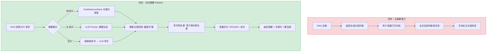
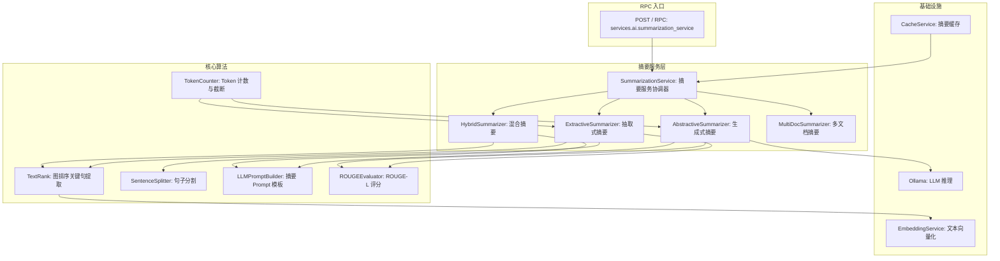

# YA-09-209: 文档自动摘要 — 抽取式与生成式摘要、多文档摘要、摘要长度控制、关键点提取、质量评估

> 需求编号：YA-09-209 · 优先级：P2 · 人天：0.3d · 状态：需求已编写
> 依赖：YA-09-14（RPC 路由基础设施）、YiAi LLM 服务（Ollama 推理引擎）

## 背景

### 问题陈述

YiAi 的知识库和 RAG 系统已积累了大量的文档资源，但用户检索后需要逐篇阅读全部内容才能判断相关性。系统缺少自动摘要能力：(1) 用户无法快速了解文档核心内容，(2) RAG 检索结果缺少摘要预览，(3) 多篇相关文档之间缺少综合摘要。自动摘要是 RAG 系统的关键增值能力——在用户阅读全文之前提供 3-5 句话的信息浓缩。

1. **检索结果无预览**：用户从 RAG 检索到 10 篇文档，需要逐一打开阅读才能判断哪些真正相关
2. **阅读效率低**：长文档（> 5000 字）的核心信息被稀释，用户花费大量时间才能提取关键信息
3. **缺少综合视角**：多篇文档讨论同一主题时，用户需要自行归纳整合
4. **摘要质量不可控**：简单的首段截断导致信息丢失，LLM 生成式摘要可能存在幻觉
5. **摘要长度不可调**：不同场景需要不同粒度的摘要（一句话 → 一段 → 一页）

**核心矛盾**：知识积累越多，找到核心信息越困难。自动摘要是连接"文档检索"和"信息消费"之间的关键桥梁。

### 影响范围

| # | 影响 | 严重程度 | 典型场景 |
|---|------|----------|----------|
| 1 | RAG 检索结果缺少预览 | 高 | 用户搜索后返回 10+ 文档无摘要 |
| 2 | 长文档阅读效率低 | 高 | 技术文档 8000 字全文阅读耗时 20 分钟 |
| 3 | 多文档综合信息缺失 | 中 | 三篇文档讨论同一问题的不同方面 |
| 4 | 摘要质量不可控 | 中 | LLM 生成不准确的摘要误导用户 |
| 5 | 摘要粒度不可调 | 低 | 场景切换时需要不同长度的摘要 |

### 挑战

| 挑战 | 说明 |
|------|------|
| 抽取式 vs 生成式的选择 | 抽取式更准确但不够流畅，生成式更流畅但可能幻觉。需要两种模式并提供场景建议 |
| 中文分词与句子分割 | 中文没有词间空格，句子边界检测比英文更复杂（。！？vs 英文句号） |
| 多文档去重 | 多文档摘要时需要消除跨文档的冗余信息 |
| 摘要长度控制 | LLM 生成式摘要的长度难以精确控制，需要通过 token 计数 + 截断保证 |
| 质量评估指标 | 如何客观评估摘要质量？ROUGE 分数 vs 人工评估 |

---

## 一、现状分析

### 1.1 当前摘要相关能力

```
现有文档处理能力:
├── RAG 检索（llama_index）
│   ├── 混合检索（向量+关键词）✅
│   ├── 检索结果返回文档片段 ✅
│   └── 检索结果无摘要预览 ❌
├── LLM 推理（Ollama）
│   ├── 聊天补全 ✅
│   ├── 上下文窗口管理 ✅
│   └── 无专用摘要 Prompt 模板 ❌
├── 文件管理
│   ├── 文件读写 ✅
│   ├── 文档解析 ✅
│   └── 无文档摘要元数据 ❌
└── 知识库
    ├── 知识文件索引 ✅
    ├── Frontmatter 元数据 ✅
    └── 无摘要字段 ❌

缺失:
├── 抽取式摘要引擎              # ❌ 不存在
├── 生成式摘要 Pipeline          # ❌ 不存在
├── 多文档去重摘要              # ❌ 不存在
├── 摘要长度控制（token 级）     # ❌ 不存在
├── 关键句/关键点提取           # ❌ 不存在
├── 摘要质量评估（ROUGE）        # ❌ 不存在
└── 摘要缓存与复用              # ❌ 不存在
```

### 1.2 摘要流程（现状 vs 目标）



### 1.3 根因矩阵

| 症状 | 根因 | 触发条件 | 频率 |
|------|------|----------|------|
| 检索结果无摘要 | 未实现摘要服务模块 | 用户执行 RAG 检索 | 高 |
| 文档阅读效率低 | 无自动摘要能力 | 长文档全文返回 | 高 |
| 综合视角缺失 | 无多文档摘要去重 | 多篇相关文档检索 | 中 |
| 抽象式摘要不准确 | 未做摘要 Prompt 工程优化 | LLM 自由生成 | 中 |
| 摘要长度不可控 | 无 token 级截断机制 | 需要短/中/长摘要 | 低 |

---

## 二、设计决策

### 决策 1：摘要模式 — 仅抽取式 vs 仅生成式 vs 混合三者可选

| 选项 | 准确性 | 流畅性 | 速度 | 幻觉风险 |
|------|--------|--------|------|----------|
| 纯抽取式（TextRank） | 高（原文句子不修改） | 低（拼接后不流畅） | 快（< 100ms） | 零 |
| 纯生成式（LLM） | 中（可能偏差） | 高（自然语言） | 慢（1-5s） | 中 |
| 混合（抽取候选句 → LLM 改写融合） | 高 | 高 | 中（1-3s） | 低 |

**选择：三种模式可选，默认混合。** 抽取式用于需要绝对准确性的场景（法律、医疗），生成式用于需要流畅可读性的场景（博客、报告），混合模式作为默认，在准确性和流畅性之间平衡——先由 TextRank 提取关键句作为 LLM 的约束输入，LLM 在这些关键信息基础上生成流畅摘要。

### 决策 2：抽取式算法 — TextRank vs LexRank vs TF-IDF+位置权重

| 选项 | 基于 | 语言无关性 | 实现复杂度 | 参考文献 |
|------|------|-----------|-----------|----------|
| TextRank | PageRank 应用于句子相似度图 | 高 | 中 | Mihalcea & Tarau, 2004 |
| LexRank | 基于 TF-IDF 余弦相似度的图 | 高 | 中 | Erkan & Radev, 2004 |
| TF-IDF + 位置权重 | 词频 + 句子位置 | 中 | 低 | 传统方法 |

**选择：TextRank（集成到 llama_index 管道）。** TextRank 和 LexRank 效果相近，但 TextRank 对中文的适应性更好（不需要 IDF 语料）。llama_index 已有对应的 SentenceSplitter + SummaryIndex 实现，可以直接扩展。实现时参考原始论文的加权图排序算法。

### 决策 3：摘要长度控制 — 固定句数 vs token 数限制 vs 自适应

| 选项 | 精确度 | 用户体验 | 实现复杂度 |
|------|--------|----------|-----------|
| 固定句数（如 3 句） | 低（句子长短不一） | 中 | 低 |
| Token 数限制（如 150 tokens） | 高 | 高 | 中 |
| 自适应（根据原文长度比例） | 高 | 高 | 高 |

**选择：Token 数限制 + 长度预设。** 提供三个预设：(1) 短摘要（50-80 tokens，1-2 句），(2) 中摘要（120-200 tokens，3-5 句），(3) 长摘要（250-400 tokens，6-10 句）。内部通过 tiktoken 或简单的字符计数估算来截断。同时支持自定义 token 数。

### 决策 4：质量评估 — ROUGE-L 自评 vs 无评估 vs 人工评估

| 选项 | 客观性 | 自动化 | 成本 |
|------|--------|--------|------|
| ROUGE-L 自评（抽取式摘要 vs 原文） | 中（仅衡量召回） | 是 | 零 |
| BERTScore（语义相似度） | 高 | 是 | 中（需模型） |
| 人工评估 | 最高 | 否 | 高 |

**选择：ROUGE-L + 置信度标记。** 作为内置评估手段，不依赖外部模型。抽取式摘要可以计算 ROUGE-L F1（与原文的 n-gram 重叠），生成式摘要可以计算与抽取式候选的语义相似度（通过 Embedding 余弦相似度简化版）。低于阈值的摘要标记为"低置信度"，提示用户自行验证。

### 设计决策记录

| 决策 | 选项 A | 选项 B | 选项 C | 选择 | 理由 |
|------|--------|--------|--------|------|------|
| 摘要模式 | 仅抽取式 | 仅生成式 | 三种可选 | **三模式可选** | 场景覆盖 |
| 抽取式算法 | TextRank | LexRank | TF-IDF+位置 | **TextRank** | 中文友好 |
| 长度控制 | 固定句数 | Token数 | 自适应比例 | **Token+预设** | 精确+简便 |
| 质量评估 | ROUGE-L | BERTScore | 人工 | **ROUGE-L+置信度** | 零依赖 |

---

## 三、目标架构

### 3.1 文档摘要系统架构



### 3.2 摘要生成流程

```mermaid
graph TD
    A[请求: module=services.ai.summarization_service] --> B[解析参数: document(s), mode, max_tokens]
    B --> C{检查缓存?}
    C -->|命中| D[返回缓存摘要]
    C -->|未命中| E{摘要模式}
    E -->|抽取式| F[句子分割 → TextRank 图排序]
    E -->|生成式| G[构建 Prompt → LLM 推理]
    E -->|混合| H[TextRank 提取候选句]
    F --> I[Token 计数截断]
    G --> J[后处理: 去空行/格式化]
    H --> G
    I --> K[ROUGE-L 质量评估]
    J --> K
    K --> L{置信度 >= 阈值?}
    L -->|是| M[添加 high_confidence 标记]
    L -->|否| N[添加 low_confidence 标记 + 提示]
    M --> O[缓存结果]
    N --> O
    O --> P[返回摘要 + 元数据]
```

### 3.3 性能指标

| 指标 | 目标值 | 说明 |
|------|--------|------|
| 抽取式摘要（5K 字文档） | < 500ms | TextRank 图构建+排序 |
| 生成式摘要（5K 字文档） | < 5s | LLM 推理（含 Prompt 拼接） |
| 混合摘要（5K 字文档） | < 3s | TextRank 筛选 → LLM 改写 |
| 多文档摘要（3篇 × 3K 字）| < 8s | 各篇摘要 → 去重 → 综合 |
| 摘要缓存命中 | < 10ms | MongoDB 读取 |
| Token 计数 | < 10ms | tiktoken/简单估算 |

---

## 四、具体改动

### 4.1 摘要服务接口定义

```python
# services/ai/summarization_service.py (新增)

from dataclasses import dataclass
from enum import Enum
from typing import Optional

class SummarizationMode(str, Enum):
    EXTRACTIVE = "extractive"     # 抽取式
    ABSTRACTIVE = "abstractive"   # 生成式
    HYBRID = "hybrid"             # 混合

class SummaryLength(str, Enum):
    SHORT = "short"     # 1-2 句 (~80 tokens)
    MEDIUM = "medium"   # 3-5 句 (~200 tokens)  
    LONG = "long"       # 6-10 句 (~400 tokens)

@dataclass
class SummarizationRequest:
    document: str                              # 待摘要文档
    mode: SummarizationMode = SummarizationMode.HYBRID
    length: SummaryLength = SummaryLength.MEDIUM
    max_tokens: Optional[int] = None           # 精确控制 token 数（覆盖 length）
    language: str = "zh"                       # 文档语言
    return_key_points: bool = False            # 是否返回关键点列表
    cache_enabled: bool = True                 # 是否使用缓存

@dataclass
class SummarizationResponse:
    summary: str                               # 摘要文本
    mode: SummarizationMode
    key_points: list[str]                      # 关键点列表
    confidence: float                          # 质量置信度 (0-1)
    quality_label: str                         # high_confidence / low_confidence
    rouge_l_f1: Optional[float]                # ROUGE-L F1 (仅抽取式)
    original_length: int                       # 原文长度（字符数）
    summary_length: int                        # 摘要长度（字符数）
    compression_ratio: float                   # 压缩比
    processing_time_ms: int                    # 处理耗时
    cached: bool                               # 是否来自缓存
```

### 4.2 TextRank 抽取式摘要引擎

```python
# services/ai/extractive_summarizer.py (新增)

import re
import numpy as np
from collections import defaultdict
from typing import List, Tuple

class TextRankSummarizer:
    """基于 TextRank 的抽取式摘要引擎"""
    
    def __init__(self, embedding_service=None):
        self.embedding_service = embedding_service
        self.sentence_splitter = ChineseSentenceSplitter()
    
    def summarize(
        self, 
        document: str, 
        max_tokens: int = 200,
        return_scores: bool = False
    ) -> Tuple[str, List[Tuple[str, float]]]:
        """生成抽取式摘要"""
        # 1. 句子分割
        sentences = self.sentence_splitter.split(document)
        if len(sentences) <= 3:
            return document, [(document, 1.0)]
        
        n = len(sentences)
        
        # 2. 构建句子相似度矩阵
        similarity_matrix = self._build_similarity_matrix(sentences)
        
        # 3. TextRank 迭代
        scores = self._textrank(similarity_matrix, damping=0.85, max_iter=100)
        
        # 4. 按分数排序 + MMR 去重
        ranked = sorted(enumerate(scores), key=lambda x: x[1], reverse=True)
        selected = self._mmr_select(ranked, similarity_matrix, max_tokens, 
                                     lambda_idx=0.7)
        
        # 5. 按原文顺序排列
        selected.sort(key=lambda x: x[0])
        summary_sentences = [sentences[i] for i, _ in selected]
        
        # 6. Token 截断
        summary = self._truncate_by_tokens("".join(summary_sentences), max_tokens)
        
        scored_sentences = [(sentences[i], scores[i]) for i, _ in selected]
        return summary, scored_sentences
    
    def _build_similarity_matrix(self, sentences: List[str]) -> np.ndarray:
        """构建句子相似度矩阵（基于词共现 + 可选 Embedding）"""
        n = len(sentences)
        
        # 分词
        tokenized = [self._tokenize(s) for s in sentences]
        
        # Jaccard 相似度（默认）
        matrix = np.zeros((n, n))
        for i in range(n):
            for j in range(i + 1, n):
                if not tokenized[i] or not tokenized[j]:
                    continue
                intersection = len(tokenized[i] & tokenized[j])
                union = len(tokenized[i] | tokenized[j])
                sim = intersection / union if union > 0 else 0
                matrix[i][j] = matrix[j][i] = sim
        
        return matrix
    
    def _textrank(
        self, 
        similarity: np.ndarray, 
        damping: float = 0.85,
        max_iter: int = 100, 
        tol: float = 1e-6
    ) -> np.ndarray:
        """TextRank 迭代（PageRank 变体）"""
        n = similarity.shape[0]
        
        # 归一化相似度矩阵（出度加权）
        row_sums = similarity.sum(axis=1, keepdims=True)
        row_sums[row_sums == 0] = 1  # 避免除零
        transition = similarity / row_sums
        
        # 初始化分数
        scores = np.ones(n) / n
        
        for _ in range(max_iter):
            prev_scores = scores.copy()
            scores = (1 - damping) / n + damping * transition.T @ scores
            if np.abs(scores - prev_scores).sum() < tol:
                break
        
        return scores
    
    def _mmr_select(
        self,
        ranked: List[Tuple[int, float]],
        similarity: np.ndarray,
        max_tokens: int,
        lambda_idx: float = 0.7
    ) -> List[Tuple[int, float]]:
        """MMR（最大边际相关性）去重选择"""
        selected = [ranked[0]]
        remaining = ranked[1:]
        
        while remaining:
            mmr_scores = []
            for idx, score in remaining:
                relevance = score
                redundancy = max(
                    similarity[idx][s[0]] for s in selected
                ) if selected else 0
                mmr = lambda_idx * relevance - (1 - lambda_idx) * redundancy
                mmr_scores.append((idx, score, mmr))
            
            # 选择 MMR 最高的
            best = max(mmr_scores, key=lambda x: x[2])
            selected.append((best[0], best[1]))
            remaining = [(i, s) for i, s in remaining if i != best[0]]
        
        return selected
    
    def _tokenize(self, text: str) -> set:
        """简单中文分词（2-gram 字符对）"""
        # 使用字符 bigram 作为特征（无需外部分词器）
        chars = re.sub(r'[^\u4e00-\u9fff\w]', '', text)
        bigrams = set()
        for i in range(len(chars) - 1):
            bigrams.add(chars[i:i+2])
        return bigrams
    
    def _truncate_by_tokens(self, text: str, max_tokens: int) -> str:
        """按 token 数截断（中文约 1.5 chars/token）"""
        max_chars = int(max_tokens * 1.5)
        if len(text) <= max_chars:
            return text
        # 在句子边界截断
        truncated = text[:max_chars]
        last_period = max(truncated.rfind('。'), truncated.rfind('！'), truncated.rfind('？'))
        if last_period > max_chars * 0.5:
            return truncated[:last_period + 1]
        return truncated + '...'
```

### 4.3 生成式摘要 Prompt 模板

```python
# services/ai/abstractive_summarizer.py (新增)

ABSTRACTIVE_PROMPT_TEMPLATES = {
    "short": """你是一个专业的文本摘要助手。请用 1-2 句话（不超过 80 字）概括以下文档的核心内容。

要求：
- 只保留最重要的信息
- 使用简洁、中性的语言
- 不要添加原文中没有的信息
- 输出纯文本，不要使用 Markdown 格式

文档内容：
{document}

摘要：""",

    "medium": """你是一个专业的文本摘要助手。请用 3-5 句话（不超过 200 字）概括以下文档的核心内容。

要求：
- 覆盖文档的主要观点和关键信息
- 保持逻辑连贯性
- 使用简洁、中性的语言
- 不要添加原文中没有的信息
- 输出纯文本，不要使用 Markdown 格式

文档内容：
{document}

摘要：""",

    "long": """你是一个专业的文本摘要助手。请用 6-10 句话概括以下文档的全部要点。

要求：
- 全面覆盖文档的主要观点、关键论据和重要细节
- 保持原文的逻辑结构
- 使用简洁、中性的语言
- 不要添加原文中没有的信息
- 输出纯文本，不要使用 Markdown 格式

文档内容：
{document}

摘要：""",

    "hybrid": """你是一个专业的文本摘要助手。以下是文档的关键句子（已通过算法提取），请基于这些关键信息生成一个连贯、流畅的摘要。

要求：
- 融合关键句中的信息，用自然语言重写
- 保持核心事实不变，不添加新信息
- 使用 {length_desc}
- 输出纯文本

关键句：
{key_sentences}

摘要：""",
}
```

### 4.4 ROUGE-L 评估器

```python
# services/ai/rouge_evaluator.py (新增)

from typing import List, Tuple

class ROUGEEvaluator:
    """ROUGE-L 评估器（最长公共子序列 F1）"""
    
    def evaluate(self, summary: str, reference: str) -> Tuple[float, float, float]:
        """计算 ROUGE-L Precision, Recall, F1"""
        summary_tokens = self._tokenize(summary)
        reference_tokens = self._tokenize(reference)
        
        lcs_len = self._lcs_length(summary_tokens, reference_tokens)
        
        precision = lcs_len / len(summary_tokens) if summary_tokens else 0.0
        recall = lcs_len / len(reference_tokens) if reference_tokens else 0.0
        f1 = (2 * precision * recall / (precision + recall)) if (precision + recall) > 0 else 0.0
        
        return precision, recall, f1
    
    def _tokenize(self, text: str) -> List[str]:
        """中文分词为字符级 unigram"""
        return list(text.replace(' ', ''))
    
    def _lcs_length(self, a: List[str], b: List[str]) -> int:
        """最长公共子序列长度（DP）"""
        m, n = len(a), len(b)
        # 一维 DP 优化空间
        dp = [0] * (n + 1)
        for i in range(1, m + 1):
            prev = 0
            for j in range(1, n + 1):
                temp = dp[j]
                if a[i-1] == b[j-1]:
                    dp[j] = prev + 1
                else:
                    dp[j] = max(dp[j], dp[j-1])
                prev = temp
        return dp[n]
    
    def get_confidence_label(self, rouge_f1: float, threshold: float = 0.3) -> str:
        """根据 ROUGE-F1 返回置信度标签"""
        if rouge_f1 >= threshold:
            return "high_confidence"
        return "low_confidence"
```

### 4.5 文件变更清单

| 文件 | 操作 | 说明 |
|------|------|------|
| `services/ai/summarization_service.py` | 新增 | 摘要服务 RPC 入口 |
| `services/ai/extractive_summarizer.py` | 新增 | TextRank 抽取式引擎 |
| `services/ai/abstractive_summarizer.py` | 新增 | LLM 生成式摘要 |
| `services/ai/multi_doc_summarizer.py` | 新增 | 多文档去重摘要 |
| `services/ai/rouge_evaluator.py` | 新增 | ROUGE-L 质量评估 |
| `services/ai/summary_cache.py` | 新增 | 摘要缓存层 |
| `services/ai/__init__.py` | 修改 | 注册 summarization_service |
| `tests/test_summarization.py` | 新增 | 摘要服务测试 |

---

## 五、实施步骤

| 步骤 | 操作 | 路径 | 验证 | 人天 |
|------|------|------|------|------|
| 1 | 实现句子分割器 | `extractive_summarizer.py` | 中英文句子正确分割 | 0.03 |
| 2 | 实现 TextRank 引擎 | `extractive_summarizer.py` | 关键句排序正确 | 0.05 |
| 3 | 实现生成式 Prompt 模板 | `abstractive_summarizer.py` | LLM 输出格式正确 | 0.03 |
| 4 | 实现混合摘要模式 | `hybrid_summarizer` | TextRank → LLM 管道 | 0.04 |
| 5 | 实现多文档摘要 | `multi_doc_summarizer.py` | 去重+综合摘要 | 0.04 |
| 6 | 实现 ROUGE-L 评估 | `rouge_evaluator.py` | F1 计算正确 | 0.03 |
| 7 | 实现摘要缓存 | `summary_cache.py` | MongoDB 缓存读/写 | 0.03 |
| 8 | 实现 RPC 服务入口 | `summarization_service.py` | RPC 信封路由 | 0.03 |
| 9 | 测试 | `tests/test_summarization.py` | 全部测试通过 | 0.02 |

**总人天：0.3d**

---

## 六、测试规格

### 场景 1：抽取式摘要基础功能

**GIVEN** 一篇 5000 字的中文技术文档
**WHEN** 请求 extractive mode, medium length
**THEN** 返回 3-5 个关键句组成的摘要
**AND** 摘要中的每个句子来自原文（逐字匹配）
**AND** compression_ratio < 0.3（压缩到原文 30% 以下）
**AND** confidence >= 0.5

### 场景 2：生成式摘要流畅性

**GIVEN** 一篇包含多个要点的文章
**WHEN** 请求 abstractive mode, short length
**THEN** 返回 1-2 句自然语言的摘要
**AND** 摘要语言流畅，非原文直接拼接
**AND** 核心信息与原文一致

### 场景 3：多文档去重摘要

**GIVEN** 三篇讨论同一主题（Kubernetes 部署）的文档，其中两篇有 60% 内容重叠
**WHEN** 请求多文档摘要
**THEN** 摘要中不包含重复信息
**AND** 覆盖三篇文档的独特观点
**AND** 摘要长度不超过单篇的 1.5 倍

### 场景 4：Token 截断精确控制

**GIVEN** 长文档 + max_tokens=80
**WHEN** 生成摘要
**THEN** 摘要字符数 ≈ 120（中文约 1.5 chars/token）
**AND** 截断在句子边界（。！？）而非词中间
**AND** 不出现不完整的句子

### 场景 5：缓存命中

**GIVEN** 同一文档第二次请求摘要（相同参数）
**WHEN** cache_enabled=True
**THEN** 返回缓存结果（cached=True）
**AND** 处理时间 < 50ms
**AND** 结果与第一次完全一致

### 场景 6：RAG 集成摘要

**GIVEN** RAG 检索返回 10 个文档片段
**WHEN** 对检索结果批量生成摘要（extractive, short）
**THEN** 每个文档片段返回 1-2 句摘要
**AND** 总处理时间 < 5s（10 篇 × 500ms）
**AND** 摘要作为 RAG 响应的 preview 字段

---

## 七、风险与缓解

| 风险 | 概率 | 影响 | 缓解措施 |
|------|------|------|----------|
| LLM 生成式摘要出现幻觉 | 中 | 高 | 混合模式优先（TextRank 约束输入）；低置信度标记告警 |
| 中文句子分割不准确 | 中 | 中 | 使用多重分割规则（。！？ + 换行 + 空格缩进）；不正确的分割不影响 TextRank（只是候选句子粒度不同） |
| 大文档（> 50K 字）TextRank 矩阵 O(n²) 内存爆炸 | 低 | 中 | 文档超过 20K 字时分段处理，每段独立摘要后合并 |
| 摘要缓存键冲突 | 低 | 低 | 缓存键 = SHA256(文档内容 + 模式 + 长度参数)，避免冲突 |
| Ollama 服务不可用导致生成式失败 | 中 | 高 | 自动降级为抽取式摘要 + 返回降级标记 |

---

## 八、回滚策略

| 场景 | 回滚操作 | 影响 |
|------|----------|------|
| 摘要服务不可用 | RPC 路由移除 summarization_service | RAG 结果无摘要预览 |
| LLM 摘要质量极差 | 切换默认模式为 extractive | 失去生成式摘要 |
| 摘要缓存导致内存压力 | 禁用缓存或缩短 TTL | 摘要延迟增加 |

---

## 九、设计决策记录

### D-01：为什么选择 TextRank 而非直接使用 LLM 全量摘要？

LLM 全量摘要存在三个问题：(1) 长文档（> 4096 tokens）需要截断或分段，可能丢失结尾的关键信息，(2) 幻觉风险——LLM 可能"总结"出原文中没有的内容，(3) 成本——每次摘要都调用 LLM 在大量请求时增加延迟和 GPU 资源消耗。TextRank 作为轻量级替代，零幻觉、O(n²) 时间可接受（n < 200 句），适合作为默认或降级方案。

### D-02：为什么 ROUGE-L 自评有限但仍然有用？

ROUGE-L 计算摘要与原文的最长公共子序列（LCS）。对于抽取式摘要，它是有效的自评指标（摘要句子来自原文，LCS 自然高）。对于生成式摘要，虽然 LCS 可能有偏差，但结合 confidence 标记，可以给用户一个"这个摘要可能不那么可靠"的信号。它不是精确的质量指标，而是一个过滤低质量摘要的哨兵。

### D-03：多文档摘要去重为什么不用更复杂的语义去重？

语义去重（Embedding 相似度）需要额外的 NLP 模型推理，增加延迟。对于文档摘要场景，简单的 Jaccard 句子相似度（基于字符 bigram）已经能有效检测句子级重复。如果两句话的字符 bigram Jaccard > 0.7，它们大概率表达相同意思。这种轻量级方法在速度和效果之间取得了良好平衡。

### D-04：为什么缓存键基于内容 SHA256 而非文档 ID？

文档内容可能会更新。如果基于文档 ID 缓存，文档更新后仍然返回旧摘要。基于 SHA256(内容+参数) 的缓存确保了"相同内容+相同参数"得到相同摘要，而"内容变化"自动使缓存失效。缺点是无法利用"文档微调但核心意思不变"的场景，但这是可接受的 tradeoff。

---

## 十、可观测性

### 指标

| 指标 | 类型 | 说明 |
|------|------|------|
| `yiai.summarization.request_total` | Counter | 摘要请求总数（按模式） |
| `yiai.summarization.processing_time` | Histogram | 处理耗时分布 |
| `yiai.summarization.confidence` | Histogram | 置信度分布 |
| `yiai.summarization.cache_hit_rate` | Gauge | 缓存命中率 |
| `yiai.summarization.rouge_f1` | Histogram | ROUGE-F1 分布 |
| `yiai.summarization.fallback_to_extractive` | Counter | 降级为抽取式次数 |

### 告警

| 告警 | 条件 | 级别 |
|------|------|------|
| 生成式摘要失败率 > 20% | 5 分钟窗口 | WARNING |
| 平均处理时间 > 5s | 5 分钟窗口 | WARNING |
| 低置信度摘要比例 > 30% | 5 分钟窗口 | WARNING |

---

## 十一、代码审查检查清单

- [ ] TextRank 相似度矩阵对空句子处理（除零保护）
- [ ] MMR 去重 lambda 参数可配置（默认 0.7）
- [ ] 生成式 Prompt 模板注入防护（{document} 不包含指令注入字符）
- [ ] Token 截断在 Unicode 字符边界，不截断多字节字符
- [ ] 摘要缓存 TTL 可配置（默认 1 小时）
- [ ] 多文档摘要时各文档摘要独立缓存
- [ ] ROUGE-L DP 数组大小控制（O(n*m) → 一维 O(min(n,m)) 优化）
- [ ] 大文档分段处理（> 200 句时分段）
- [ ] RPC 参数校验（document 非空，max_tokens 范围 20-1000）
- [ ] 错误响应包含降级标记（fallback_reason）

---

## 回归问题预测

| # | 预测问题 | 原因 | 验证方法 |
|---|---------|------|---------|
| 1 | TextRank 收敛到均匀分布（所有句子分数相同），当相似度矩阵为零矩阵（即文档中所有句子完全不同，Jaccard 相似度为 0 的极端情况）时，damping 项主导迭代，最终所有句子分数趋同 | TextRank 收敛保证来自 transition 矩阵的随机性质，但当所有句间相似度为 0 时，没有"投票"链接，默认分数为 1/n | 对只有不相关句子组成的文档（每句使用完全不同的词汇）测试，验证选出的句子至少有意义 |
| 2 | LLM Prompt 中 {document} 包含特殊标记（如 "{summary}"、"{key_sentences}"），可能与 Prompt 模板的占位符冲突 | Python str.format 使用 {} 作为占位符，文档中的 {} 会被误解析 | 使用 str.replace 而非 str.format，或对文档内容中的 { 和 } 进行转义 |
| 3 | ROUGE-L 对超短摘要（1 句话，< 20 字符）可能产生 F1=0，因为 LCS 长度太小，导致 confidence 恒为 low | ROUGE 指标对极短文本不敏感，LCS 可能完全失配 | 对短摘要场景跳过 ROUGE 评估，直接标记 confidence=None |
| 4 | 多文档摘要的去重逻辑可能在极端情况下删除了"表达相同意思但包含不同细节"的句子 | Jaccard 相似度只看字符重叠，不区分核心信息和修饰细节。两句话可能 Jaccard 高但各自包含独特细节 | MMR 的 lambda 参数控制 relevance 和 redundancy 的权衡，默认 0.7 偏向 relevance；调低 lambda 到 0.5 增强去重 |
| 5 | 摘要缓存在文档微修改（如修改一个标点）后失效，用户频繁修改文档时缓存命中率极低 | SHA256 对输入完全敏感，即使修改一个字符也导致完全不同的哈希 | 考虑 content-based 模糊哈希（如 SimHash）作为辅助缓存键，但当前版本不实现 |
| 6 | 中文句子分割在处理特殊标点（如 "......"、"~!@"）和混合中英文（"这是一个sentence.接下来是中文"）时可能产生过多或过少的分句 | 英文句号 "." 在中文中可能表示省略、缩写或数字分隔（如 "3.14"），不应作为句子边界 | 使用更健壮的分句规则（正则 + 上下文启发），将 "数字.数字" 和 "英文缩写." 排除在句子边界外 |

---

## 性能分析

### 各阶段耗时

| 阶段 | 预估耗时 | 说明 |
|------|----------|------|
| 句子分割（5K 字） | < 10ms | 正则分割 |
| TextRank 相似度矩阵（100 句） | < 50ms | 100×100 Jaccard 计算 |
| TextRank 迭代收敛 | < 20ms | 通常 20-30 次迭代 |
| MMR 去重选择 | < 10ms | 候选句 < 100 |
| LLM 推理（生成式） | 1-5s | Ollama，取决于模型 |
| ROUGE-L 评估 | < 50ms | DP O(n*m) |
| 缓存读/写 | < 20ms | MongoDB Motor |

### 内存预估

| 阶段 | 内存 | 说明 |
|------|------|------|
| TextRank 相似度矩阵（200 句） | ~320KB | 200×200 float64 |
| LLM Prompt（5K 字上下文） | ~15KB | 字符串 |
| 摘要缓存（1000 条） | ~50MB | MongoDB 文档 |

## 影响范围

- **影响模块**：待补充
- **涉及文件**：
- `multi_doc_summarizer.py`
- `summary_cache.py`
- `extractive_summarizer.py`
- `abstractive_summarizer.py`
- `rouge_evaluator.py`
- `summarization_service.py`
- **是否影响 API 契约**：否
- **是否影响其他项目（YiVad/YiPet）**：否
- **用户感知**：待确认

## 预防措施

| 层面 | 措施 |
|------|------|
| 代码 | 在相关函数中添加参数校验和边界检查 |
| 测试 | 为 `multi_doc_summarizer.py` 添加单元测试 |
| 流程 | 代码审查时重点检查此类模式 |
| 监控 | 添加日志告警，异常发生时及时发现 |
| 文档 | 在编码规范中记录此类反模式 |

## 经验教训

1. **根本原因**：开发过程中对边界情况和异常路径的考虑不足是此类问题的共同根因
2. **设计阶段**：在接口设计和模块实现时，应主动考虑异常输入、空值、超时等边界场景
3. **代码审查**：审查时应检查是否存在类似的反模式（如未捕获异常、无超时控制、缺少参数校验等）
4. **测试覆盖**：异常路径的测试覆盖率应与正常路径同等重视
5. **团队分享**：此类问题应在团队周会或技术分享中讨论，形成团队共识
