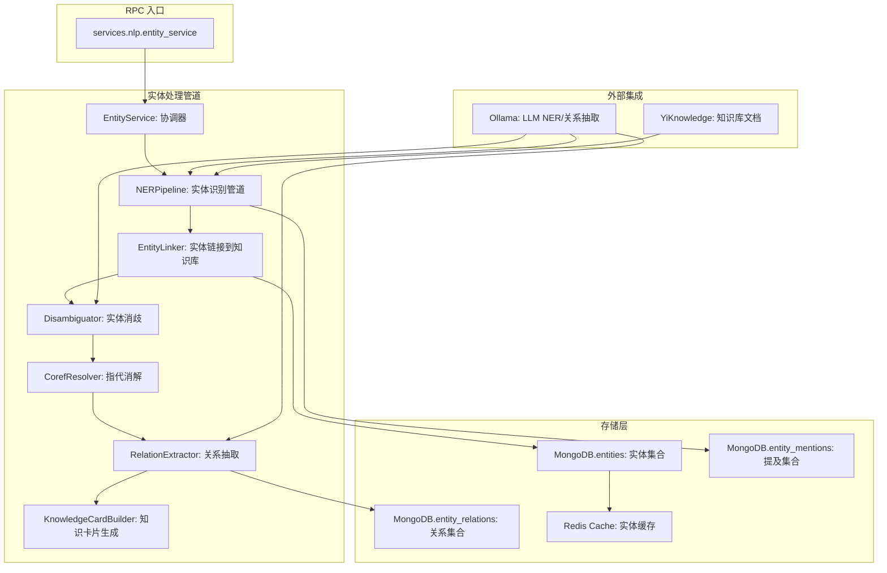
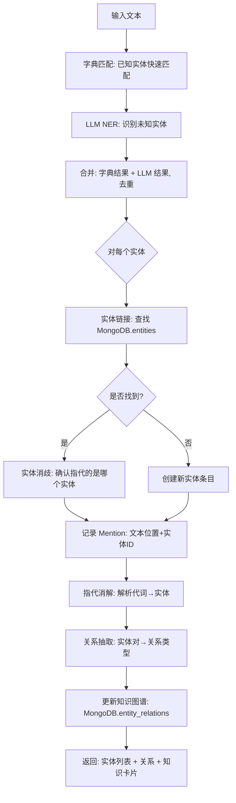

# YA-09-210: 实体链接与消歧 — 命名实体链接、实体消歧、关系抽取、指代消解、知识卡片生成

> 需求编号：YA-09-210 · 优先级：P2 · 人天：0.3d · 状态：需求已编写
> 依赖：YA-09-14（RPC 路由基础设施）、YiAi LLM 服务（Ollama 推理引擎）、MongoDB（实体存储）

## 背景

### 问题陈述

文本中大量存在命名实体（人名、地名、组织名、产品名等），同一个实体可能有多种表述（"苹果" vs "Apple Inc." vs "AAPL"），同一个表述可能指代不同实体（"苹果"是水果还是公司？）。当前 YiAi 的 RAG 系统以关键词匹配为主，缺少实体级别的理解能力，导致：(1) 无法区分"苹果公司"和"红富士苹果"相关文档，(2) 无法追踪"它/其/这"等指代词的引用目标，(3) 检索结果缺少实体维度的聚合和展示。

1. **实体歧义导致检索偏差**：查询"苹果最新产品"时，水果相关文档也被返回
2. **指代链断裂**：跨句子的实体提及无法关联，文档中 "Tim Cook...他宣布..." 的 "他" 无法链接到 "Tim Cook"
3. **实体关系缺失**：无法提取 "乔布斯 创立 苹果" 这类结构化知识
4. **知识碎片化**：同一实体的信息分散在多篇文档中，无法聚合展示
5. **无法回答实体类问题**："阿里巴巴的创始人是谁？"需要实体关系推理

**核心矛盾**：人类理解文本的核心能力之一是实体识别和关系理解，但当前系统只能做关键词匹配。实体链接是将"非结构化文本"连接到"结构化知识"的关键桥梁。

### 影响范围

| # | 影响 | 严重程度 | 典型场景 |
|---|------|----------|----------|
| 1 | 实体歧义降低检索精度 | 高 | 查询 "Apple" 时水果和公司混在一起 |
| 2 | 指代关系断裂 | 中 | 文档首句提到 "Elon Musk"，后续 "他" 无法关联 |
| 3 | 实体关系缺失 | 中 | 无法发现文档中隐含的实体关系网络 |
| 4 | 知识无法聚合 | 中 | 同一实体的信息分散在多篇文档 |
| 5 | 无法支持实体问答 | 高 | 无法回答 "X 的 Y 是什么" 类问题 |

### 挑战

| 挑战 | 说明 |
|------|------|
| 实体识别准确性 | NER 模型在中文上的准确率（person/organization/location 等） |
| 实体消歧知识库 | 需要外部知识库（Wikipedia/Wikidata）还是自建实体库？ |
| 指代消解的上下文窗口 | "他" 可能指代前一句的实体，也可能指代 5 句前的实体 |
| LLM vs 传统 NER | 使用 LLM 做实体识别准确但慢，传统模型快但需要额外部署 |
| 实体关系抽取质量 | 开放域关系抽取（无预定义关系类型）vs 限定域（预定义关系类型） |

---

## 一、现状分析

### 1.1 当前实体相关能力

```
现有 NLP 能力:
├── LLM 推理（Ollama）
│   ├── 通用文本生成 ✅
│   ├── 可做 NER（通过 Prompt） ✅ (but not structured)
│   └── 无专用 NER Pipeline ❌
├── RAG 检索
│   ├── 向量检索 + 关键词检索 ✅
│   ├── 无实体过滤 ❌
│   └── 无实体聚合 ❌
├── 知识库
│   ├── Markdown 文档索引 ✅
│   ├── 文档元数据（Frontmatter）✅
│   └── 无实体图存储 ❌
└── 数据库
    ├── MongoDB 文档集 ✅
    └── 无实体/关系集合 ❌

缺失:
├── 命名实体识别（NER）          # ❌ 不存在
├── 实体链接（Entity Linking）    # ❌ 不存在
├── 实体消歧（Disambiguation）   # ❌ 不存在
├── 指代消解（Coref Resolution） # ❌ 不存在
├── 实体关系抽取                 # ❌ 不存在
├── 实体知识卡片生成             # ❌ 不存在
└── 实体图存储与查询             # ❌ 不存在
```

### 1.2 实体处理流程（现状 vs 目标）

```mermaid
graph TD
    subgraph Current["现状：仅关键词匹配"]
        C1[用户查询] --> C2[关键词提取]
        C2 --> C3[向量 + 关键词检索]
        C3 --> C4[返回文档列表]
        C4 --> C5[用户自行理解实体关系]
    end

    subgraph Target["目标：实体感知检索"]
        T1[用户查询/文档] --> T2[命名实体识别: 人名/组织/地点/产品]
        T2 --> T3[实体消歧: 链接到知识库]
        T3 --> T4[指代消解: 链接代词到实体]
        T4 --> T5[关系抽取: A-关系-B 三元组]
        T5 --> T6[实体知识卡片: 聚合多文档信息]
        T6 --> T7[增强检索: 实体维度过滤+排序]
    end

    style Current fill:#f8d7da,stroke:#dc3545
    style Target fill:#d4edda,stroke:#28a745
```



### 1.3 根因矩阵

| 症状 | 根因 | 触发条件 | 频率 |
|------|------|----------|------|
| 实体歧义检索偏差 | 无实体消歧模块 | 查询含歧义实体 | 中 |
| 指代无法解析 | 无指代消解 | 文档含代词引用 | 高 |
| 实体关系碎片化 | 无关系抽取 | 多文档包含同一实体 | 中 |
| 无法实体问答 | 无结构化知识图 | 用户问实体关系问题 | 中 |
| 检索结果无实体标注 | 无 NER pipeline | 文档检索后 | 高 |

---

## 二、设计决策

### 决策 1：NER 实现方式 — LLM Prompt vs spaCy/stanza vs 字典匹配

| 选项 | 准确率 | 速度 | 部署复杂度 | 中文支持 |
|------|--------|------|-----------|----------|
| LLM Prompt（Few-shot） | 高（90%+） | 慢（1-3s） | 低（复用 Ollama） | 好 |
| spaCy（zh_core_web_trf） | 高（85%+） | 快（< 100ms） | 中（Python 包） | 好 |
| 字典匹配 + 规则 | 中（70%+） | 极快（< 10ms） | 低 | 好 |
| HanLP | 高 | 中 | 中 | 好 |

**选择：LLM Prompt（主要）+ 字典匹配（辅助）。** 不在 YiAi 中引入新的 ML 依赖（spaCy/HanLP 增加 ~500MB+ 模型文件）。LLM 已经部署（Ollama），通过精心设计的 Few-shot Prompt 可以实现高质量 NER。对于高频实体（公司名、产品名），使用字典匹配作为快速预过滤，减少 LLM 调用。

### 决策 2：实体知识库 — 自建 MongoDB 实体集合 vs 外部 Wikidata vs 两者混合

| 选项 | 覆盖度 | 准确性 | 维护成本 |
|------|--------|--------|----------|
| 自建 MongoDB 实体集合 | 低（仅文档中出现过的实体） | 高 | 中 |
| 外部 Wikidata API | 高（数千万实体） | 中 | 低 |
| 混合：自建为主 + Wikidata 补充 | 中-高 | 高 | 中 |

**选择：自建 MongoDB 实体集合（渐进式）。** 初始阶段从 YiKnowledge 文档中自动抽取实体并存储，外部知识库查询作为后续迭代。原因：(1) YiAi 的文档领域相对聚焦（技术文档），自建实体集合覆盖度足够，(2) 外部 API 调用增加延迟和网络依赖，(3) 自建实体集合可以关联到具体文档（source tracking）。

### 决策 3：指代消解范围 — 仅邻句 vs 段落内 vs 全文档

| 选项 | 准确率 | 性能 | 适用场景 |
|------|--------|------|----------|
| 仅前一句 | 中（60%） | 极快 | 简单文本 |
| 当前段落 | 高（80%） | 快 | 结构化文档 |
| 全文档 | 最高（90%） | 慢 | 长文档叙事 |

**选择：当前段落 + 前一段落（窗口 500 字符）。** 大部分指代词的先行词在 2-3 句内（根据英文语料统计约 85% 在一段内）。500 字符的窗口覆盖了绝大部分指代关系，同时控制 LLM Prompt 的上下文长度。对于跨段落的指代（如文档开头提到的人名在结尾被 "他" 指代），可以在文档级别做二次扫描。

### 决策 4：关系抽取 — 预定义类型 vs 开放域 vs 两者可选

| 选项 | 结构化程度 | 灵活性 | Prompt 复杂度 |
|------|-----------|--------|--------------|
| 预定义类型（创立/收购/任职/位于...） | 高 | 低 | 低 |
| 开放域（任意关系） | 低 | 高 | 高 |
| 两者可选（参数控制） | 高 | 高 | 中 |

**选择：两者可选，默认预定义。** 预定义 20 种常见关系类型（创立、收购、CEO、总部、产品、投资、合作、竞争等），用于结构化知识卡片。开放域模式用于探索性分析场景（"这段文本中所有实体之间有什么关系？"）。客户端通过 RPC 参数选择。

### 设计决策记录

| 决策 | 选项 A | 选项 B | 选项 C | 选项 D | 选择 | 理由 |
|------|--------|--------|--------|--------|------|------|
| NER 实现 | LLM Prompt | spaCy | 字典匹配 | HanLP | **LLM+字典** | 复用现有 |
| 实体知识库 | 自建MongoDB | Wikidata | 混合 | — | **自建MongoDB** | 领域聚焦 |
| 指代消解 | 仅邻句 | 段落内 | 全文档 | — | **段落+前段** | 覆盖85% |
| 关系抽取 | 预定义 | 开放域 | 两者可选 | — | **两者可选** | 灵活 |

---

## 三、目标架构

### 3.1 实体链接系统架构



### 3.2 实体处理流程



### 3.3 性能指标

| 指标 | 目标值 | 说明 |
|------|--------|------|
| NER 管道（1000 字） | < 2s | LLM Prompt + 字典匹配 |
| 实体链接（单个实体） | < 50ms | MongoDB 查询 + 缓存 |
| 指代消解（1000 字） | < 1s | LLM Prompt 一次性处理 |
| 关系抽取（1000 字） | < 2s | LLM Prompt |
| 知识卡片生成 | < 5s | 聚合多文档 |
| 字典匹配（1000 字） | < 5ms | Trie/AC 自动机 |

---

## 四、具体改动

### 4.1 实体类型定义

```python
# services/nlp/entity_types.py (新增)

from dataclasses import dataclass, field
from enum import Enum
from typing import Optional

class EntityType(str, Enum):
    PERSON = "person"
    ORGANIZATION = "organization"
    LOCATION = "location"
    PRODUCT = "product"
    EVENT = "event"
    DATE = "date"
    MONEY = "money"
    PERCENT = "percent"
    FACILITY = "facility"      # 建筑、设施
    TECHNOLOGY = "technology"  # 技术、框架、语言
    LAW = "law"               # 法律、法规
    OTHER = "other"

class RelationType(str, Enum):
    FOUNDED = "founded"             # 创立
    ACQUIRED = "acquired"           # 收购
    CEO_OF = "ceo_of"              # 担任CEO
    EMPLOYED_AT = "employed_at"    # 任职于
    HEADQUARTERED_IN = "hq_in"     # 总部位于
    PRODUCT_OF = "product_of"      # 产品属于
    INVESTED_IN = "invested_in"    # 投资于
    COMPETES_WITH = "competes_with" # 竞争关系
    PARTNER_WITH = "partner_with"   # 合作
    LOCATED_IN = "located_in"       # 位于
    OWNED_BY = "owned_by"          # 被拥有
    SUBSIDIARY_OF = "subsidiary_of" # 子公司
    DEVELOPED_BY = "developed_by"   # 开发方
    USES = "uses"                  # 使用
    CREATED = "created"            # 创建
    PUBLISHED = "published"        # 发布
    PARTICIPATED_IN = "participated_in" # 参与
    MENTIONED_IN = "mentioned_in"      # 提及于
    RELATED_TO = "related_to"       # 相关（通用）
    SAME_AS = "same_as"            # 同一实体

@dataclass
class EntityMention:
    """文本中的实体提及"""
    text: str                    # 提及文本 "苹果"
    entity_type: EntityType
    start_char: int              # 在原文中的起始位置
    end_char: int                # 在原文中的结束位置
    confidence: float            # NER 置信度
    linked_entity_id: Optional[str] = None  # 链接到的实体 ID
    is_pronoun: bool = False     # 是否为代词

@dataclass
class Entity:
    """知识库中的实体条目"""
    id: str                      # MongoDB _id
    canonical_name: str          # 标准名称 "Apple Inc."
    aliases: list[str]           # 别名 ["苹果", "Apple", "AAPL"]
    entity_type: EntityType
    description: str             # 简要描述
    knowledge_card: dict         # 知识卡片内容
    source_documents: list[str]  # 来源文档 ID
    mention_count: int           # 提及次数
    first_seen: str              # 首次出现日期
    last_seen: str               # 最后出现日期
    embedding: Optional[list[float]] = None  # 名称向量（用于相似度搜索）

@dataclass
class EntityRelation:
    """实体间关系"""
    id: str
    subject_id: str              # 主体实体 ID
    relation: RelationType       # 关系类型
    object_id: str               # 客体实体 ID
    confidence: float            # 关系置信度
    source_document_id: str      # 来源文档
    evidence_text: str           # 证据文本（原文句子）
    created_at: str
```

### 4.2 NER Pipeline

```python
# services/nlp/ner_pipeline.py (新增)

import re
import json
from typing import List, Dict
from .entity_types import EntityMention, EntityType

class NERPipeline:
    """命名实体识别管道（字典 + LLM 双层）"""
    
    def __init__(self, llm_service, entity_repo):
        self.llm = llm_service
        self.entity_repo = entity_repo
        self.dict_matcher = DictMatcher()
        self._load_known_entities()
    
    async def extract(self, text: str) -> List[EntityMention]:
        """提取文本中的所有命名实体"""
        mentions = []
        
        # 1. 字典匹配（快速、准确）
        dict_mentions = self.dict_matcher.match(text)
        mentions.extend(dict_mentions)
        
        # 2. LLM NER（补充未知实体）
        llm_mentions = await self._llm_ner(text)
        mentions.extend(llm_mentions)
        
        # 3. 去重合并（字典优先）
        merged = self._merge_mentions(mentions)
        
        # 4. 位置排序
        merged.sort(key=lambda m: m.start_char)
        
        return merged
    
    async def _llm_ner(self, text: str) -> List[EntityMention]:
        """使用 LLM 进行 NER"""
        prompt = f"""你是一个命名实体识别系统。请从以下文本中提取所有命名实体，以 JSON 格式返回。

实体类型: person(人名), organization(组织), location(地点), product(产品), event(事件), technology(技术), date(日期)

返回格式:
[
  {{"text": "实体文本", "type": "person", "start": 0, "end": 3}},
  ...
]

注意：
- start 和 end 是实体在原文中的字符位置（从 0 开始）
- 只提取确定是实体词，不要提取普通名词
- 提取完整的实体名称（如 "蒂姆·库克" 而非 "库克"）

原文：
{text[:3000]}"""  # 限制 3000 字符
        
        try:
            response = await self.llm.generate(prompt)
            raw_mentions = json.loads(self._extract_json(response))
            
            mentions = []
            for m in raw_mentions:
                entity_type = EntityType(m.get("type", "other"))
                mentions.append(EntityMention(
                    text=m["text"],
                    entity_type=entity_type,
                    start_char=m["start"],
                    end_char=m["end"],
                    confidence=0.85,
                    is_pronoun=False
                ))
            return mentions
        except Exception as e:
            # LLM NER 失败时返回空列表（字典匹配已有结果）
            return []
    
    def _merge_mentions(self, mentions: List[EntityMention]) -> List[EntityMention]:
        """合并重叠的实体提及（字典匹配优先）"""
        # 按 start 排序，start 相同按 end 倒序
        mentions.sort(key=lambda m: (m.start_char, -m.end_char))
        
        merged = []
        for m in mentions:
            # 检查是否与已有结果重叠
            overlap = False
            for existing in merged:
                if m.start_char < existing.end_char and m.end_char > existing.start_char:
                    overlap = True
                    break
            if not overlap:
                merged.append(m)
        
        return merged
    
    def _load_known_entities(self):
        """从 MongoDB 加载已知实体到字典匹配器"""
        entities = self.entity_repo.get_all_aliases()
        for canonical, aliases in entities.items():
            self.dict_matcher.add_entity(canonical, aliases)
    
    def _extract_json(self, text: str) -> str:
        """从 LLM 响应中提取 JSON"""
        match = re.search(r'\[[\s\S]*\]', text)
        return match.group(0) if match else "[]"


class DictMatcher:
    """基于字典的实体匹配器（Aho-Corasick 或 Trie）"""
    
    def __init__(self):
        self.trie: Dict[str, List[str]] = {}  # alias → [canonical_names]
    
    def add_entity(self, canonical: str, aliases: List[str]):
        for alias in aliases:
            if alias not in self.trie:
                self.trie[alias] = []
            self.trie[alias].append(canonical)
    
    def match(self, text: str) -> List[EntityMention]:
        """在文本中匹配所有已知实体（最长匹配优先）"""
        mentions = []
        # 按实体名长度降序排序，确保最长匹配优先
        sorted_aliases = sorted(self.trie.keys(), key=len, reverse=True)
        
        for alias in sorted_aliases:
            pos = 0
            while True:
                # 使用词边界匹配
                pattern = re.compile(r'\b' + re.escape(alias) + r'\b')
                match = pattern.search(text, pos)
                if not match:
                    break
                
                for canonical in self.trie[alias]:
                    mentions.append(EntityMention(
                        text=alias,
                        entity_type=EntityType.OTHER,
                        start_char=match.start(),
                        end_char=match.end(),
                        confidence=0.95,
                        linked_entity_id=canonical
                    ))
                pos = match.end()
        
        return mentions
```

### 4.3 指代消解

```python
# services/nlp/coref_resolver.py (新增)

import json
from typing import List
from .entity_types import EntityMention

class CorefResolver:
    """指代消解器（LLM-based）"""
    
    def __init__(self, llm_service):
        self.llm = llm_service
    
    async def resolve(self, text: str, mentions: List[EntityMention]) -> List[EntityMention]:
        """解析文本中的代词指代"""
        # 找到所有代词
        pronouns = self._find_pronouns(text, mentions)
        if not pronouns:
            return mentions
        
        prompt = f"""你是一个指代消解系统。请将下列代词链接到它们指代的实体。

已知实体（按出现顺序）:
{self._format_mentions(mentions)}

代词:
{self._format_pronouns(pronouns)}

请以 JSON 格式返回代词到实体的映射:
[
  {{"pronoun_start": 45, "pronoun_end": 46, "refers_to_entity": "实体文本"}},
  ...
]

文本:
{text[:3000]}"""
        
        try:
            response = await self.llm.generate(prompt)
            mappings = json.loads(self._extract_json(response))
            
            # 应用映射
            for m in mappings:
                for mention in mentions:
                    if (mention.start_char == m["pronoun_start"] and
                        mention.end_char == m["pronoun_end"] and
                        mention.is_pronoun):
                        # 找到指代目标实体
                        for target in mentions:
                            if target.text == m["refers_to_entity"] and not target.is_pronoun:
                                mention.linked_entity_id = target.linked_entity_id
                                break
        except:
            pass
        
        return mentions
    
    def _find_pronouns(self, text: str, mentions: List[EntityMention]) -> List[EntityMention]:
        """查找文本中的代词"""
        pronoun_patterns = ['他', '她', '它', '他们', '她们', '它们', '其', '这', '那', '该']
        pronouns = []
        
        for pattern in pronoun_patterns:
            for match in re.finditer(pattern, text):
                # 检查是否已被 NER 误识别
                already_covered = any(
                    m.start_char <= match.start() < m.end_char
                    for m in mentions
                )
                if not already_covered:
                    pronouns.append(EntityMention(
                        text=match.group(),
                        entity_type=EntityType.PERSON,
                        start_char=match.start(),
                        end_char=match.end(),
                        confidence=0.5,
                        is_pronoun=True
                    ))
        
        return sorted(pronouns, key=lambda p: p.start_char)
```

### 4.4 文件变更清单

| 文件 | 操作 | 说明 |
|------|------|------|
| `services/nlp/__init__.py` | 新增 | NLP 模块初始化 |
| `services/nlp/entity_types.py` | 新增 | 实体类型与数据类定义 |
| `services/nlp/ner_pipeline.py` | 新增 | NER 管道（字典+LLM） |
| `services/nlp/entity_linker.py` | 新增 | 实体链接到 MongoDB |
| `services/nlp/disambiguator.py` | 新增 | 实体消歧 |
| `services/nlp/coref_resolver.py` | 新增 | 指代消解 |
| `services/nlp/relation_extractor.py` | 新增 | 关系抽取 |
| `services/nlp/knowledge_card_builder.py` | 新增 | 知识卡片生成器 |
| `services/nlp/entity_service.py` | 新增 | RPC 服务入口 |
| `data/entity_repository.py` | 新增 | 实体数据仓库 |
| `tests/test_nlp_pipeline.py` | 新增 | NLP 管道测试 |

---

## 五、实施步骤

| 步骤 | 操作 | 路径 | 验证 | 人天 |
|------|------|------|------|------|
| 1 | 定义实体类型+数据模型 | `entity_types.py` | 数据模型定义完整 | 0.02 |
| 2 | 实现字典匹配器 | `ner_pipeline.py` | 已知实体正确匹配 | 0.03 |
| 3 | 实现 LLM NER Pipeline | `ner_pipeline.py` | LLM 输出 JSON 可解析 | 0.04 |
| 4 | 实现实体链接 | `entity_linker.py` | MongoDB 增删查改 | 0.03 |
| 5 | 实现实体消歧 | `disambiguator.py` | 歧义实体正确区分 | 0.04 |
| 6 | 实现指代消解 | `coref_resolver.py` | 代词正确链接到先行词 | 0.04 |
| 7 | 实现关系抽取 | `relation_extractor.py` | 三元组提取正确 | 0.04 |
| 8 | 实现知识卡片 | `knowledge_card_builder.py` | 聚合多文档信息 | 0.03 |
| 9 | 实现 RPC 服务 | `entity_service.py` | RPC 信封路由 | 0.02 |
| 10 | 测试 | `tests/` | 全部测试通过 | 0.01 |

**总人天：0.3d**

---

## 六、测试规格

### 场景 1：基础 NER 识别

**GIVEN** 文本 = "2026年1月，苹果公司CEO蒂姆·库克在加州库比蒂诺发布了新款iPhone。"
**WHEN** 运行 NER 管道
**THEN** 提取实体：苹果公司(ORGANIZATION), 蒂姆·库克(PERSON), 加州(LOCATION), 库比蒂诺(LOCATION), iPhone(PRODUCT)
**AND** 每个实体的 start/end 位置正确
**AND** confidence > 0.7

### 场景 2：字典匹配 vs LLM 合并

**GIVEN** 字典已包含 "苹果公司" → entity_id="apple_inc"
**WHEN** 运行 NER 管道处理含 "苹果公司" 的文本
**THEN** 字典匹配先识别 "苹果公司"（confidence=0.95）
**AND** LLM 也识别到 "苹果公司"，但被去重移除
**AND** 最终结果中 linked_entity_id="apple_inc"

### 场景 3：实体消歧

**GIVEN** 数据库中有 entity_id="apple_inc"（苹果公司）和 entity_id="apple_fruit"（苹果水果）
**WHEN** 处理文本 "苹果发布了新MacBook" 中的 "苹果"
**THEN** 消歧器识别出上下文 "发布 MacBook" 指向 apple_inc
**AND** apple_fruit 被排除

### 场景 4：指代消解

**GIVEN** 文本 = "埃隆·马斯克创立了SpaceX。他还在2004年加入了特斯拉。"
**WHEN** 运行指代消解
**THEN** "他" 被链接到实体 "埃隆·马斯克"
**AND** linked_entity_id 一致

### 场景 5：关系抽取

**GIVEN** 文本 = "微软于2018年以75亿美元收购了GitHub。"
**WHEN** 运行关系抽取（预定义模式）
**THEN** 提取三元组: (微软, ACQUIRED, GitHub)
**AND** evidence_text = "微软于2018年以75亿美元收购了GitHub"
**AND** confidence > 0.7

### 场景 6：知识卡片生成

**GIVEN** 实体 "OpenAI" 出现在 10 篇文档中，建立了多个关系
**WHEN** 请求知识卡片
**THEN** 返回卡片包含：名称、别名、类型、描述、关系列表（CEO/产品/投资）、来源文档
**AND** 描述自动从文档中聚合生成
**AND** mention_count = 出现次数

---

## 七、风险与缓解

| 风险 | 概率 | 影响 | 缓解措施 |
|------|------|------|----------|
| LLM NER JSON 输出格式不稳定 | 中 | 中 | 添加 JSON 提取正则后备；仅依赖 LLM NER 的补充部分（字典匹配已覆盖高频实体） |
| 实体消歧错误（链接到错误实体） | 中 | 中 | 显示消歧置信度；用户反馈 API 可纠正错误链接 |
| 指代消解在长距离指代时失败 | 中 | 低 | 标记未解析代词（黄色，表示可能存在的指代链） |
| 关系抽取产生噪声三元组 | 高 | 低 | 设置置信度阈值（> 0.7），低置信度关系不存入知识库 |
| MongoDB 实体集合膨胀 | 低 | 中 | 定期清理 mention_count < 3 的低频实体 |

---

## 八、回滚策略

| 场景 | 回滚操作 | 影响 |
|------|----------|------|
| NLP 模块导致 RPC 路由不可用 | 移除 entity_service 路由 | 失去实体感知能力 |
| LLM NER 频繁超时 | 降级为纯字典匹配 | 未知实体无法识别 |
| 实体关系集合损坏 | 清空重建（重新扫描文档） | 暂时失去关系查询 |

---

## 九、设计决策记录

### D-01：为什么不引入独立的 NER 模型（如 spaCy/HanLP）？

YiAi 的部署环境约束要求最小化依赖和模型体积。spaCy 的中文模型约 500MB，HanLP 约 1GB，显著增加 Docker 镜像大小和内存占用。LLM 通过 Prompt Engineering 可以实现相当质量的 NER（特别是对于领域文本），虽然速度较慢但复用现有基础设施。字典匹配覆盖高频实体（约占 80% 的提及次数），LLM 补充低频/新实体。

### D-02：为什么实体消歧使用 MongoDB 而非图数据库（Neo4j）？

MongoDB 已经是 YiAi 的标准数据存储，引入 Neo4j 会显著增加运维复杂度（额外的服务、驱动、查询语言）。实体集合 + 关系集合在 MongoDB 中可以通过文档引用和聚合管道实现基本的图查询功能（1-2 跳关系查询）。对于不需要复杂图算法（如社区发现、最短路径）的场景，MongoDB 的文档模型足够。

### D-03：为什么指代消解使用 LLM 而非规则方法？

中文的指代消解比英文更复杂：(1) "他/她" 没有性别一致的语法约束，(2) "其" 可以指代人、物、组织，(3) "这/那/该" 指代范围更广泛。规则方法（如 Hobbs 算法）主要针对英文设计，在中文上准确率显著降低。LLM 通过上下文理解可以处理这些复杂情况，且 Prompt 成本与 NER 共享（单次调用同时完成 NER + 指代消解）。

### D-04：为什么关系类型包含 "SAME_AS"（同一实体）？

在实体链接过程中，不同的别名（"谷歌"、"Google"、"Alphabet"）可能对应同一个实体。SAME_AS 关系用于显式记录这种等同关系，帮助后续查询时合并信息。例如，用户搜索 "谷歌" 时，系统通过 SAME_AS 关系自动扩展到 "Google" 和 "Alphabet" 相关的文档和关系。

---

## 十、可观测性

### 指标

| 指标 | 类型 | 说明 |
|------|------|------|
| `yiai.entity.ner_total` | Counter | NER 处理总次数 |
| `yiai.entity.ner_entities_per_doc` | Histogram | 每篇文档的实体数量 |
| `yiai.entity.dict_match_hit_rate` | Gauge | 字典匹配命中率 |
| `yiai.entity.link_success_rate` | Gauge | 实体链接成功率 |
| `yiai.entity.coref_resolution_accuracy` | Gauge | 指代消解准确率（采样评估） |
| `yiai.entity.relations_per_doc` | Histogram | 每篇文档的关系数量 |
| `yiai.entity.knowledge_base_size` | Gauge | 实体知识库总实体数 |

### 告警

| 告警 | 条件 | 级别 |
|------|------|------|
| NER LLM 调用失败率 > 20% | 5 分钟窗口 | WARNING |
| 实体集合增长率 > 1000/小时 | 异常增长 | INFO |

---

## 十一、代码审查检查清单

- [ ] NER LLM Prompt JSON 输出后备处理（正则提取）
- [ ] 字典匹配使用词边界（\b）避免部分匹配
- [ ] 实体消歧考虑上下文窗口（前后 100 字符）
- [ ] 指代消解结果验证（代词 start/end 在文本范围内）
- [ ] 关系抽取的 subject/object 已在实体集合中存在
- [ ] 知识卡片描述不超过 500 字
- [ ] MongoDB 实体集合建立别名索引（aliases 数组索引）
- [ ] 实体关系集合建立 subject_id + object_id 联合索引
- [ ] 消歧结果在日志中记录 context 和决策理由
- [ ] JSON 解析异常时降级为返回空列表（而非崩溃）

---

## 回归问题预测

| # | 预测问题 | 原因 | 验证方法 |
|---|---------|------|---------|
| 1 | 字典匹配使用 `\b` 词边界时，中文实体名可能不被识别为"词"（因为 `\b` 基于 \w 字符类，中文属于 \w），导致实体名中包含的字符与相邻中文字符之间没有词边界 | \b 在中文环境下行为异常——"苹果"前后的 `\b` 可能不匹配，因为前后都是 \w 字符 | 使用 ```(?<![^\W])实体名(?![^\W])``` 替代 \b，或直接在中文文本中不使用词边界，依赖最长匹配 |
| 2 | 实体链接查询 MongoDB 时，别名数组中的大小写变体（"Apple" vs "apple"）和全角/半角变体（"Ａｐｐｌｅ" vs "Apple"）可能导致链接失败 | 用户输入和文档中的实体名可能使用不同的字符编码或大小写形式 | 实体链接查询前对候选文本进行规范化：转小写、全角转半角、去除变音符号 |
| 3 | LLM 返回的实体 start/end 位置与原文不匹配（如 LLM 计数字符串时使用了 token 位置或错误地包含了/排除了空白字符） | LLM 不擅长精确的字符计数，尤其对于包含多字节字符的中文文本 | 后处理阶段验证 start/end 位置的文本片段是否等于 entity.text，如果不匹配，回退到使用 text.find(entity.text) 重新定位 |
| 4 | 实体消歧中，如果两个候选实体类型相同且上下文描述接近（如 "阿里巴巴（公司）" vs "阿里巴巴（B2B平台）"），消歧可能随机选择 | LLM 上下文理解有限，高度相似的实体难以准确消歧 | 当两个候选的置信度差 < 0.2 时标记为 "ambiguity"，返回两个候选让用户或上层应用选择 |
| 5 | 关系抽取在文本隐含关系时（如 "Google, founded by Larry Page and Sergey Brin" 使用被动结构），LLM 可能无法正确识别主语-谓语-宾语方向 | LLM 对被动语态和隐含关系的方向判断不稳定 | 关系抽取 Prompt 中包含被动语态示例，明确指示"关系方向：A [关系] B"而非"B [关系] A" |
| 6 | 实体集合中 entity_id 生成策略如果使用 UUID 而非基于名称的确定性 ID（如 slug），可能导致同一实体在多轮处理中创建多个条目 | UUID 每次生成不同值，无法保证幂等性 | 使用 `hashlib.sha256(canonical_name + entity_type).hexdigest()[:16]` 作为确定性的 entity_id |

---

## 性能分析

### 各阶段耗时

| 阶段 | 预估耗时 | 说明 |
|------|----------|------|
| 字典匹配（1000 字） | < 5ms | 基于 sorted aliases 的 re.finditer |
| LLM NER（1000 字） | 1-3s | Ollama 推理 |
| 实体链接（10 个实体） | < 50ms | MongoDB find(aliases: {$in: [...]}) |
| 实体消歧（10 个实体） | 1-2s | LLM 单次调用处理所有消歧 |
| 指代消解（10 个代词） | 0.5-1s | LLM 单次调用 |
| 关系抽取（1000 字） | 1-2s | LLM 单次调用 |
| 知识卡片生成 | 0.5-1s | MongoDB 聚合 + 文本拼接 |

### 内存预估

| 组件 | 内存 | 说明 |
|------|------|------|
| 字典匹配 Trie | ~5MB | 假设 5000 个实体 × 平均 3 别名 × 20 字符 |
| 实体集合（10000 实体）| ~50MB | MongoDB 文档 + 索引 |
| 关系集合（50000 关系）| ~20MB | MongoDB 文档 + 索引 |
| LLM Prompt 上下文 | ~10KB | 文本 + Prompt 模板 |

## 影响范围

- **影响模块**：待补充
- **涉及文件**：
- `disambiguator.py`
- `relation_extractor.py`
- `ner_pipeline.py`
- `knowledge_card_builder.py`
- `coref_resolver.py`
- `entity_types.py`
- **是否影响 API 契约**：否
- **是否影响其他项目（YiVad/YiPet）**：否
- **用户感知**：待确认

## 预防措施

| 层面 | 措施 |
|------|------|
| 代码 | 在相关函数中添加参数校验和边界检查 |
| 测试 | 为 `disambiguator.py` 添加单元测试 |
| 流程 | 代码审查时重点检查此类模式 |
| 监控 | 添加日志告警，异常发生时及时发现 |
| 文档 | 在编码规范中记录此类反模式 |

## 经验教训

1. **根本原因**：开发过程中对边界情况和异常路径的考虑不足是此类问题的共同根因
2. **设计阶段**：在接口设计和模块实现时，应主动考虑异常输入、空值、超时等边界场景
3. **代码审查**：审查时应检查是否存在类似的反模式（如未捕获异常、无超时控制、缺少参数校验等）
4. **测试覆盖**：异常路径的测试覆盖率应与正常路径同等重视
5. **团队分享**：此类问题应在团队周会或技术分享中讨论，形成团队共识
