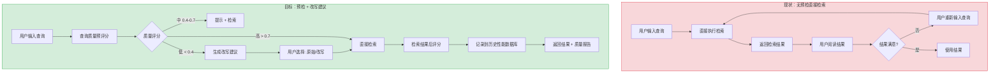
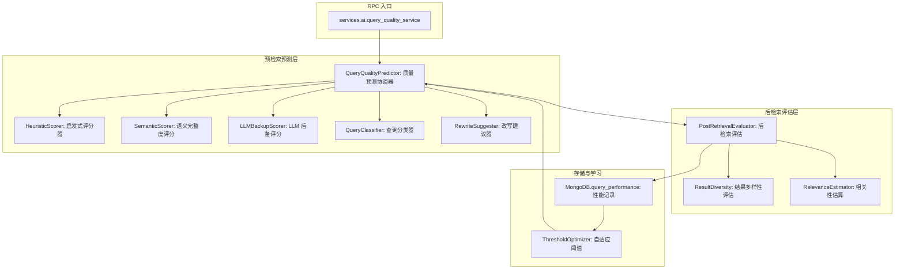
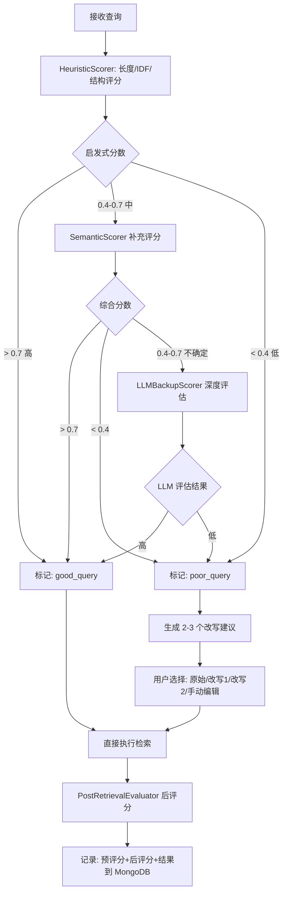

# YA-09-211: 查询性能预测 — 预检索性能预测、质量预估、查询改写、置信度评分、历史性能库

> 需求编号：YA-09-211 · 优先级：P2 · 人天：0.3d · 状态：需求已编写
> 依赖：YA-09-14（RPC 路由基础设施）、YiAi RAG 检索服务、llama_index

## 背景

### 问题陈述

RAG 系统的检索质量高度依赖查询质量。一个模糊的查询（如"那个东西怎么用"）注定得不到好结果，但用户直到看到检索结果才意识到问题。当前系统缺少预检索质量评估能力：(1) 用户不知道自己的查询会不会得到好结果，(2) 系统不做任何查询质量检查就直接检索，(3) 无法在检索前给出查询改写建议，(4) 缺乏历史数据来学习"什么样的查询能得到好结果"。

1. **盲目检索**：系统对所有查询一视同仁，即使明显不可能得到好结果
2. **用户反馈滞后**：用户需要阅读检索结果后才能判断查询质量，浪费时间和计算资源
3. **无法提前优化**：系统不能在检索前提示用户"你的查询可能不够具体，试试这样改写"
4. **缺少查询难度量化**：无法区分"这个查询本身就难"和"知识库缺少相关文档"
5. **无法从历史学习**：没有积累"好查询 vs 坏查询"的数据，无法持续改进

**核心矛盾**：检索是昂贵的（向量搜索 + LLM 推理），但质量检查几乎是免费的。在检索前投入少量计算做质量预测，可以节省大量无效检索，并引导用户提出更好的查询。

### 影响范围

| # | 影响 | 严重程度 | 典型场景 |
|---|------|----------|----------|
| 1 | 无效查询浪费资源 | 高 | 单字查询"bug"返回大量无关结果 |
| 2 | 用户对检索质量无预期 | 中 | 检索结果差但用户不知道是查询问题还是知识库问题 |
| 3 | 无法引导用户优化查询 | 高 | 用户反复尝试不同措辞但不知道改进方向 |
| 4 | 缺少查询质量数据 | 中 | 无法回答"用户的平均查询质量如何" |
| 5 | 重复查询同样浪费 | 中 | 同样的模糊查询被不同用户多次执行 |

### 挑战

| 挑战 | 说明 |
|------|------|
| 预测准确性 | 预检索预测是不精确的——最终判断来自检索结果，预预测可能误导 |
| 中文查询的特殊性 | 中文查询可能很短（2-3 个字），短查询的预测信息量少 |
| 领域特异性 | "好查询"的定义因知识库内容而异，需要自适应 |
| 实时性要求 | 预测必须在 100ms 内完成，否则失去"预检索"的意义 |
| 冷启动 | 初始阶段没有历史数据，无法使用监督学习方法 |

---

## 一、现状分析

### 1.1 当前查询质量相关能力

```
现有查询相关能力:
├── RAG 检索
│   ├── 混合检索（向量+关键词）✅
│   ├── 检索结果返回 ✅
│   ├── 无预检索质量评估 ❌
│   └── 无查询改写建议 ❌
├── 查询处理
│   ├── 查询接收（通过 RPC）✅
│   ├── 无查询分析 ❌
│   └── 无查询分类 ❌
├── 数据存储
│   ├── 知识文档 ✅
│   ├── 会话记录 ✅
│   └── 无查询性能记录 ❌
└── LLM 服务
    ├── 可做查询分析 ✅
    └── 无专用查询评估 Prompt ❌

缺失:
├── 查询质量预评分                # ❌ 不存在
├── 查询分类（事实型/观点型/过程型） # ❌ 不存在
├── 查询改写建议                  # ❌ 不存在
├── 检索结果质量后评分            # ❌ 不存在
├── 历史查询性能数据库            # ❌ 不存在
├── 查询-结果匹配度评估           # ❌ 不存在
└── 自适应质量阈值                # ❌ 不存在
```

### 1.2 查询流程（现状 vs 目标）



### 1.3 根因矩阵

| 症状 | 根因 | 触发条件 | 频率 |
|------|------|----------|------|
| 无效查询直接检索 | 无预检索质量评估 | 用户输入模糊查询 | 高 |
| 用户不知查询好坏 | 无质量反馈机制 | 检索后 | 中 |
| 无法引导用户 | 无查询改写建议 | 用户反复尝试 | 中 |
| 缺乏统计基础 | 无历史查询性能记录 | 做系统分析 | 中 |
| 质量阈值不可知 | 无自适应阈值 | 知识库内容变化后 | 低 |

---

## 二、设计决策

### 决策 1：预测方法 — 启发式规则 vs 统计模型 vs LLM 评估

| 选项 | 准确率 | 速度 | 冷启动 | 可解释性 |
|------|--------|------|--------|----------|
| 启发式规则（查询长度、词性、IDF 等） | 中（60-70%） | 极快（< 5ms） | 即用 | 高 |
| 统计模型（LightGBM/XGBoost） | 高（75-85%） | 快（< 20ms） | 需训练数据 | 低 |
| LLM 评估（Prompt） | 高（80-90%） | 慢（1-2s） | 即用 | 中 |
| 混合（启发式 + LLM 异常检测） | 高（85%+） | 中（大多数 < 5ms，异常时 1-2s） | 即用 | 高 |

**选择：启发式规则（默认） + LLM 补充评估（边界情况）。** 大多数查询可以通过轻量级规则快速评分：(1) 长度，(2) 是否包含问句结构，(3) 平均 IDF，(4) 是否包含专属名词，(5) 语义完整度。只有评分处于"不确定"区间（0.3-0.6）时才调用 LLM 做深度评估。这样 80% 的查询耗时 < 5ms，20% 的边界查询耗时 1-2s。

### 决策 2：查询质量维度 — 单一分数 vs 多维评分

| 选项 | 用户友好度 | 诊断能力 | 实现复杂度 |
|------|-----------|----------|-----------|
| 单一总分（0-100） | 高 | 低 | 低 |
| 多维雷达图（具体性/完整度/可回答性/聚焦度） | 高 | 高 | 中 |
| 多标签分类（好的/模糊的/太短的/太宽泛的） | 中 | 中 | 中 |

**选择：总分 + 分类标签 + 可选多维详情。** 默认返回一个 0-1 的总分和分类标签（如 "查询过于简短" / "查询范围可能太宽"），让用户快速理解问题。详情 API 返回四个维度的分解分数，供前端渲染雷达图或仪表盘。

### 决策 3：查询改写策略 — 仅提示 vs 自动改写 vs 交互式建议

| 选项 | 用户体验 | 准确性 | 控制权 |
|------|----------|--------|--------|
| 仅提示（"你的查询太短了"） | 低 | 高 | 用户完全控制 |
| 自动改写（静默执行） | 高 | 低（可能偏离用户意图） | 用户无控制 |
| 交互式建议（"试试这样：..."） | 高 | 高 | 用户选择 |

**选择：交互式建议。** 当查询质量低于阈值时，系统生成 2-3 个改写建议。用户可以选择使用原始查询（忽略建议）、选择某个改写建议、或基于某个建议手动编辑。这种方式既帮助了用户，又保持了用户对查询意图的完全控制。

### 决策 4：历史数据存储 — MongoDB 集合 vs 日志文件 vs 时序数据库

| 选项 | 查询能力 | 存储开销 | 分析便利性 |
|------|----------|----------|-----------|
| MongoDB 集合 | 高（聚合管道） | 中（每条 ~1KB） | 高 |
| 日志文件（JSON 行） | 低 | 低 | 低 |
| 时序数据库 | 高 | 中 | 中 |

**选择：MongoDB 集合 `query_performance`。** 每条记录包含：查询文本哈希、质量预评分、检索后评分、耗时、结果数量、用户反馈。建立日期索引用于周期性聚合，建立查询哈希索引用于重复查询检测。TTL 索引 90 天后自动清理。

### 设计决策记录

| 决策 | 选项 A | 选项 B | 选项 C | 选项 D | 选择 | 理由 |
|------|--------|--------|--------|--------|------|------|
| 预测方法 | 启发式 | 统计模型 | LLM | 混合 | **混合** | 快+准 |
| 评分维度 | 单一分数 | 多维雷达图 | 多标签 | — | **总分+标签+可选详情** | 渐进信息 |
| 改写策略 | 仅提示 | 自动改写 | 交互建议 | — | **交互建议** | 用户控制 |
| 历史存储 | MongoDB | 日志 | 时序DB | — | **MongoDB+TTL** | 统一存储 |

---

## 三、目标架构

### 3.1 查询性能预测系统架构



### 3.2 查询预测与改写流程



### 3.3 性能指标

| 指标 | 目标值 | 说明 |
|------|--------|------|
| 启发式评分 | < 5ms | 纯 Python 计算 |
| 语义完整度评分 | < 20ms | Embedding 向量相似度 |
| LLM 后备评分 | < 2s | Ollama 推理（仅边界查询） |
| 改写建议生成 | < 3s | LLM 推理 |
| 后检索评估 | < 50ms | 结果统计 |
| 历史记录写入 | < 10ms | MongoDB 异步 |

---

## 四、具体改动

### 4.1 查询质量类型定义

```python
# services/ai/query_quality_types.py (新增)

from dataclasses import dataclass, field
from enum import Enum
from typing import Optional

class QueryQualityLabel(str, Enum):
    EXCELLENT = "excellent"     # 优秀：具体、明确、可回答
    GOOD = "good"               # 良好：基本清晰
    FAIR = "fair"               # 一般：可能需要细化
    POOR = "poor"               # 差：太简短/太宽泛/太模糊
    UNKNOWN = "unknown"         # 无法判断

class QueryCategory(str, Enum):
    FACTUAL = "factual"         # 事实型："Kubernetes 最新版本是什么"
    PROCEDURAL = "procedural"   # 过程型："如何在 AWS 上部署 EKS"
    CONCEPTUAL = "conceptual"   # 概念型："什么是微服务架构"
    COMPARATIVE = "comparative" # 对比型："Docker vs Podman 区别"
    TROUBLESHOOTING = "troubleshooting"  # 排查型："Pod 一直 Pending 怎么办"
    OTHER = "other"

@dataclass
class QueryQualityScore:
    query: str
    overall_score: float            # 0-1 总分
    label: QueryQualityLabel
    category: QueryCategory
    
    # 维度分（0-1）
    specificity: float              # 具体性：是否包含具体实体/概念
    completeness: float             # 完整度：语义是否完整
    answerability: float            # 可回答性：预计知识库能否回答
    focus: float                    # 聚焦度：查询范围是否合理
    
    # 元信息
    query_length: int               # 查询长度（字符数）
    has_entity: bool                # 是否包含命名实体
    avg_idf: Optional[float]        # 查询词的平均 IDF
    estimated_recall: Optional[float] # 预估召回量

@dataclass
class RewriteSuggestion:
    rewritten_query: str            # 改写后的查询
    improvement: str                # 改进说明
    score_improvement: float        # 预期质量提升 (0-1)

@dataclass
class QueryQualityResponse:
    score: QueryQualityScore
    suggestions: list[RewriteSuggestion]
    should_rewrite: bool            # 是否建议改写
    retrieve_directly: bool         # 是否可以直接检索
    processing_time_ms: int
    llm_used: bool                  # 是否使用了 LLM 后备评估

@dataclass
class PostRetrievalScore:
    query_hash: str
    pre_score: float                # 预评分
    post_score: float               # 后评分
    result_count: int               # 返回结果数
    top_score: float                # 最高相似度分数
    avg_score: float                # 平均相似度分数
    diversity_score: float          # 结果多样性 (0-1)
    timestamp: str
```

### 4.2 启发式评分器

```python
# services/ai/heuristic_scorer.py (新增)

import re
import math
from typing import Optional, Dict
from .query_quality_types import QueryQualityScore, QueryQualityLabel, QueryCategory

class HeuristicScorer:
    """基于启发式规则的查询质量评分器"""
    
    # 中文停用词（高频无意义词）
    STOP_WORDS = {
        '的', '了', '在', '是', '我', '有', '和', '就', '不', '人', '都', '一',
        '一个', '上', '也', '很', '到', '说', '要', '去', '你', '会', '着',
        '没有', '看', '好', '自己', '这', '他', '她', '它', '们', '那', '什么',
        '怎么', '为什么', '哪个', '哪里', '这个', '那个', '这些', '那些'
    }
    
    # 模糊词（降低评分）
    VAGUE_WORDS = {
        '东西', '那个', '这个', '问题', '事情', '情况', '怎么', '怎么办',
        '有问题', '不行', '不对', '不好使', '用不了', '出错了', '报错',
        '帮忙', '求助', '问一下', '谁知道', '有没有人'
    }
    
    def score(self, query: str, idf_scores: Optional[Dict[str, float]] = None) -> QueryQualityScore:
        """计算查询质量评分"""
        query_clean = query.strip()
        length = len(query_clean)
        
        # 1. 具体性评分（是否包含具体实体/概念）
        specificity = self._score_specificity(query_clean)
        
        # 2. 完整度评分（语义是否完整）
        completeness = self._score_completeness(query_clean)
        
        # 3. 聚焦度评分（查询范围是否合理）
        focus = self._score_focus(query_clean)
        
        # 4. 可回答性（基于 IDF 估算）
        avg_idf = self._calc_avg_idf(query_clean, idf_scores) if idf_scores else None
        answerability = self._score_answerability(query_clean, avg_idf)
        
        # 5. 分类
        category = self._classify(query_clean)
        
        # 综合评分（加权平均）
        weights = {'specificity': 0.35, 'completeness': 0.25, 'focus': 0.15, 'answerability': 0.25}
        overall = (
            specificity * weights['specificity'] +
            completeness * weights['completeness'] +
            focus * weights['focus'] +
            answerability * weights['answerability']
        )
        
        # 快捷调整：极短查询额外惩罚
        if length < 5:
            overall *= 0.5
        elif length < 10:
            overall *= 0.7
        
        # 确定标签
        label = self._to_label(overall)
        
        return QueryQualityScore(
            query=query,
            overall_score=round(overall, 3),
            label=label,
            category=category,
            specificity=round(specificity, 3),
            completeness=round(completeness, 3),
            answerability=round(answerability, 3),
            focus=round(focus, 3),
            query_length=length,
            has_entity=self._has_entity(query_clean),
            avg_idf=round(avg_idf, 3) if avg_idf else None,
            estimated_recall=None,
        )
    
    def _score_specificity(self, query: str) -> float:
        """评估查询的具体性"""
        score = 0.5  # 基准
        
        # 长度加分
        if len(query) >= 30:
            score += 0.2
        elif len(query) >= 15:
            score += 0.1
        
        # 命名实体加分（大写英文词、专有名词模式）
        entity_patterns = [
            r'[A-Z][a-z]+',        # PascalCase
            r'[A-Z]+',             # 缩略词
            r'[\u4e00-\u9fff]{2,4}[公司|系统|平台|框架|语言|协议]',  # 中文组织/产品
        ]
        for pattern in entity_patterns:
            if re.search(pattern, query):
                score += 0.1
                break
        
        # 模糊词减分
        for word in self.VAGUE_WORDS:
            if word in query:
                score -= 0.15
                break
        
        return max(0, min(1, score))
    
    def _score_completeness(self, query: str) -> float:
        """评估语义完整度"""
        score = 0.3
        
        # 包含问句结构
        if any(kw in query for kw in ['什么是', '如何', '怎么', '为什么', '哪个', '多少', '?', '？']):
            score += 0.3
        
        # 包含动词（有行为/动作）
        if re.search(r'[\u4e00-\u9fff]*(部署|配置|安装|使用|实现|解决|优化|排查|设计|开发|测试|监控|管理)', query):
            score += 0.2
        
        # 足够的长度
        if len(query) >= 20:
            score += 0.2
        elif len(query) >= 10:
            score += 0.1
        
        return max(0, min(1, score))
    
    def _score_focus(self, query: str) -> float:
        """评估聚焦度（太宽泛 → 低分，太窄 → 也可能低）"""
        # 检查范围指示词
        broad_indicators = ['所有', '全部', '各种', '任何', '整个', '整体', '综述', '汇总']
        narrow_indicators = ['具体', '特定', '某个', '精确']
        
        broad_count = sum(1 for w in broad_indicators if w in query)
        narrow_count = sum(1 for w in narrow_indicators if w in query)
        
        if broad_count > 0:
            return 0.3  # 太宽泛
        elif len(query) < 5:
            return 0.2  # 太短无法判断
        elif narrow_count > 0 and len(query) >= 10:
            return 0.9  # 具体且聚焦
        else:
            return 0.6  # 默认
    
    def _score_answerability(self, query: str, avg_idf: Optional[float]) -> float:
        """预估可回答性"""
        if avg_idf is None:
            return 0.5
        
        # 高 IDF 意味着查询词在知识库中比较稀有，可能更容易匹配到相关文档
        # 但也可能意味着知识库中没有相关内容
        if avg_idf > 5:
            return 0.7
        elif avg_idf > 3:
            return 0.6
        elif avg_idf > 1:
            return 0.5
        else:
            return 0.3  # 低 IDF = 查询词太常见
    
    def _calc_avg_idf(self, query: str, idf_scores: Dict[str, float]) -> float:
        """计算查询词的平均 IDF"""
        # 简单分词：按字符 bigram
        chars = re.sub(r'[^\u4e00-\u9fff\w]', '', query)
        bigrams = [chars[i:i+2] for i in range(len(chars)-1)]
        if not bigrams:
            return 0.0
        
        scores = [idf_scores.get(bg, 0.0) for bg in bigrams]
        return sum(scores) / len(scores)
    
    def _has_entity(self, query: str) -> bool:
        """判断查询是否包含命名实体"""
        # 简化版：检查专有名词模式
        patterns = [
            r'[A-Z][a-zA-Z]+',      # 英文专有名词
            r'[A-Z]{2,}',            # 缩略词
        ]
        return any(re.search(p, query) for p in patterns)
    
    def _classify(self, query: str) -> QueryCategory:
        """分类查询类型"""
        if any(kw in query for kw in ['如何', '怎么', '怎样', '步骤', '教程', '指南']):
            return QueryCategory.PROCEDURAL
        if any(kw in query for kw in ['什么是', '是什么', '定义', '概念']):
            return QueryCategory.CONCEPTUAL
        if any(kw in query for kw in ['区别', '对比', '比较', 'vs', 'VS', '还是']):
            return QueryCategory.COMPARATIVE
        if any(kw in query for kw in ['报错', '错误', '失败', '不行', '出问题', 'bug', 'Bug']):
            return QueryCategory.TROUBLESHOOTING
        if any(kw in query for kw in ['什么', '哪个', '谁', '多少', '?', '？']):
            return QueryCategory.FACTUAL
        return QueryCategory.OTHER
    
    def _to_label(self, score: float) -> QueryQualityLabel:
        if score >= 0.75:
            return QueryQualityLabel.EXCELLENT
        elif score >= 0.6:
            return QueryQualityLabel.GOOD
        elif score >= 0.35:
            return QueryQualityLabel.FAIR
        else:
            return QueryQualityLabel.POOR
```

### 4.3 改写建议生成器

```python
# services/ai/rewrite_suggester.py (新增)

import json
from typing import List
from .query_quality_types import RewriteSuggestion, QueryQualityScore

class RewriteSuggester:
    """查询改写建议生成器"""
    
    def __init__(self, llm_service):
        self.llm = llm_service
    
    async def suggest(self, query: str, score: QueryQualityScore) -> List[RewriteSuggestion]:
        """生成查询改写建议"""
        prompt = f"""你是一个查询优化助手。用户的原始查询质量评分为 {score.overall_score}/1.0（{score.label}）。

问题维度分析:
- 具体性: {score.specificity}/1.0（是否包含具体实体/概念）
- 完整度: {score.completeness}/1.0（语义是否完整）
- 聚焦度: {score.focus}/1.0（查询范围是否合理）

请生成 2-3 个改写建议，使查询更具体、更完整、更容易得到准确的检索结果。

返回 JSON 格式:
[
  {{"rewritten": "改写后的查询", "improvement": "改进了什么（10字内）", "gain": 0.3}},
  ...
]

原始查询: {query}"""
        
        try:
            response = await self.llm.generate(prompt)
            raw = json.loads(self._extract_json(response))
            
            suggestions = []
            for item in raw[:3]:
                suggestions.append(RewriteSuggestion(
                    rewritten_query=item["rewritten"],
                    improvement=item["improvement"],
                    score_improvement=item["gain"],
                ))
            return suggestions
        except:
            return []
    
    def _extract_json(self, text: str) -> str:
        import re
        match = re.search(r'\[[\s\S]*\]', text)
        return match.group(0) if match else "[]"
```

### 4.4 后检索评估器

```python
# services/ai/post_retrieval_evaluator.py (新增)

import hashlib
from typing import List, Any
from .query_quality_types import PostRetrievalScore

class PostRetrievalEvaluator:
    """检索后质量评估"""
    
    def evaluate(
        self,
        query: str,
        pre_score: float,
        results: List[Any],  # RAG 检索结果
        similarity_scores: List[float],  # 各结果的相似度分数
    ) -> PostRetrievalScore:
        """评估检索结果质量"""
        query_hash = hashlib.sha256(query.encode()).hexdigest()[:16]
        
        result_count = len(results)
        
        if similarity_scores:
            top_score = max(similarity_scores)
            avg_score = sum(similarity_scores) / len(similarity_scores)
        else:
            top_score = 0.0
            avg_score = 0.0
        
        # 多样性评估（相邻结果的内容差异）
        diversity = self._calc_diversity(results)
        
        # 后评分综合（主要看 top_score 和 result_count）
        post_score = self._calc_post_score(top_score, avg_score, result_count, diversity)
        
        return PostRetrievalScore(
            query_hash=query_hash,
            pre_score=pre_score,
            post_score=round(post_score, 3),
            result_count=result_count,
            top_score=round(top_score, 3),
            avg_score=round(avg_score, 3),
            diversity_score=round(diversity, 3),
            timestamp=datetime.utcnow().isoformat(),
        )
    
    def _calc_diversity(self, results: List[Any]) -> float:
        """计算检索结果的多样性（基于字符 bigram Jaccard）"""
        if len(results) < 2:
            return 1.0
        
        texts = [getattr(r, 'text', str(r))[:500] for r in results]
        diversities = []
        
        for i in range(len(texts) - 1):
            for j in range(i + 1, min(i + 3, len(texts))):
                bigrams_i = set(texts[i][k:k+2] for k in range(len(texts[i])-1))
                bigrams_j = set(texts[j][k:k+2] for k in range(len(texts[j])-1))
                union = len(bigrams_i | bigrams_j)
                if union > 0:
                    jaccard = len(bigrams_i & bigrams_j) / union
                    diversities.append(1 - jaccard)  # 1 - 相似度 = 多样性
        
        return sum(diversities) / len(diversities) if diversities else 1.0
    
    def _calc_post_score(
        self, top_score: float, avg_score: float, 
        result_count: int, diversity: float
    ) -> float:
        """计算后评分"""
        # 结果数量过少 → 低
        if result_count == 0:
            return 0.0
        count_factor = min(result_count / 5, 1.0)  # 5 个以上满分
        
        # top_score 是最重要的因素
        score = (top_score * 0.5 + avg_score * 0.2 + count_factor * 0.15 + diversity * 0.15)
        return max(0, min(1, score))
```

### 4.5 文件变更清单

| 文件 | 操作 | 说明 |
|------|------|------|
| `services/ai/query_quality_types.py` | 新增 | 查询质量类型定义 |
| `services/ai/heuristic_scorer.py` | 新增 | 启发式评分器 |
| `services/ai/semantic_scorer.py` | 新增 | 语义完整度评分 |
| `services/ai/rewrite_suggester.py` | 新增 | 改写建议生成 |
| `services/ai/post_retrieval_evaluator.py` | 新增 | 后检索评估 |
| `services/ai/query_quality_service.py` | 新增 | RPC 服务入口 |
| `data/query_performance_repo.py` | 新增 | 历史性能数据仓库 |
| `services/ai/__init__.py` | 修改 | 注册 query_quality_service |
| `tests/test_query_quality.py` | 新增 | 查询质量测试 |

---

## 五、实施步骤

| 步骤 | 操作 | 路径 | 验证 | 人天 |
|------|------|------|------|------|
| 1 | 定义类型 | `query_quality_types.py` | 数据类定义完整 | 0.02 |
| 2 | 实现启发式评分 | `heuristic_scorer.py` | 多维度规则计算正确 | 0.05 |
| 3 | 实现语义评分 | `semantic_scorer.py` | Embedding 相似度评分 | 0.03 |
| 4 | 实现 LLM 后备评估 | `query_quality_service.py` | 边界查询深度评估 | 0.03 |
| 5 | 实现改写建议 | `rewrite_suggester.py` | LLM 生成改写建议 | 0.03 |
| 6 | 实现后检索评估 | `post_retrieval_evaluator.py` | post_score 计算合理 | 0.03 |
| 7 | 实现历史存储 | `query_performance_repo.py` | MongoDB 读写 + TTL | 0.03 |
| 8 | 实现 RPC 服务 | `query_quality_service.py` | RPC 信封路由 | 0.02 |
| 9 | 集成到 RAG 管道 | rag pipeline 调用 | 预检→检索→后评 | 0.04 |
| 10 | 测试 | `tests/` | 全部测试通过 | 0.02 |

**总人天：0.3d**

---

## 六、测试规格

### 场景 1：高质量查询评分

**GIVEN** 查询 = "Kubernetes 中 Pod 一直处于 Pending 状态如何排查和解决"
**WHEN** 启发式评分
**THEN** overall_score > 0.7（分类：GOOD/EXCELLENT）
**AND** specificity > 0.6（有具体实体和技术术语）
**AND** completeness > 0.7（语义完整）
**AND** category = TROUBLESHOOTING

### 场景 2：低质量查询评分

**GIVEN** 查询 = "那个东西怎么用"
**WHEN** 启发式评分
**THEN** overall_score < 0.4（分类：POOR）
**AND** specificity < 0.3（极度模糊）
**AND** label = POOR
**AND** should_rewrite = True

### 场景 3：改写建议生成

**GIVEN** 低质量查询 "报了错怎么办"
**WHEN** 生成改写建议
**THEN** 返回 2-3 个改写建议
**AND** 每个建议包含 rewritten_query + improvement + score_improvement
**AND** 改写后的查询更具体（如 "Python Flask 应用报 500 Internal Server Error 如何排查"）

### 场景 4：混合评分策略

**GIVEN** 查询 = "微服务"（极短，处于边界区间 0.3-0.6）
**WHEN** 启发式评分 = 0.45 → 触发 SemanticScorer
**THEN** 综合评分后确定 to_label
**AND** 如果仍在 0.3-0.7 → 触发 LLM 深度评估
**AND** 最终评分在合理范围内

### 场景 5：后检索评估

**GIVEN** 检索返回 8 个结果，top_score=0.92, avg_score=0.65, diversity=0.7
**WHEN** 后检索评估
**THEN** post_score > 0.6
**AND** 结果写入 query_performance 集合
**AND** pre_score 和 post_score 都在记录中

### 场景 6：重复查询优化

**GIVEN** 之前执行过同样的查询，后评分 = 0.2（检索结果差）
**WHEN** 再次执行相同查询
**THEN** 系统从历史记录中检测到该查询历史上效果不佳
**AND** 预先提供改写建议（基于历史记录，不重复低质量检索）

---

## 七、风险与缓解

| 风险 | 概率 | 影响 | 缓解措施 |
|------|------|------|----------|
| 启发式评分误判高质量查询 | 中 | 中 | 低分查询仍执行检索（非阻塞），但显示质量提示 |
| 改写建议偏离用户意图 | 中 | 中 | 始终保留原始查询选项；用户可手动编辑 |
| 历史数据库膨胀 | 低 | 低 | TTL 索引自动清理 90 天前记录 |
| 冷启动无 IDF 数据 | 高 | 中 | 初始阶段使用默认 IDF 值，随知识库增长自动更新 |
| LLM 改写建议过于自由 | 中 | 低 | Prompt 中约束"保持原始查询的核心意图不变" |

---

## 八、回滚策略

| 场景 | 回滚操作 | 影响 |
|------|----------|------|
| 质量预测阻塞检索 | 跳过预检索检查（pass-through 模式） | 失去预测功能 |
| 改写建议质量差 | 禁用改写建议功能 | 仅显示质量评分 |
| 历史数据库异常 | 清空 query_performance 集合 | 失去历史参考 |

---

## 九、设计决策记录

### D-01：为什么选择启发式规则作为主要评分方法？

预检索性能预测的核心约束是速度——预测本身不能比检索更慢，否则失去了"预检"的价值。启发式规则的 4 个维度（具体性/完整度/聚焦度/可回答性）可以通过纯 Python 字符串操作和简单统计在 < 5ms 内完成。相比之下，LLM 评估需要 1-2s，统计模型需要特征提取 + 推理。80% 的查询可以通过启发式规则准确判断，只有边界情况需要更复杂的评估。

### D-02：为什么不直接用 LLM 做所有评估（更快更简单）？

虽然 LLM 的 Prompt Engineering 简单，但每次查询都调用 LLM 会产生两个问题：(1) 延迟——1-2s 的额外等待时间在每次检索前都是负担，累积体验差，(2) 成本——高频率的查询会导致 GPU 资源竞争（与聊天/摘要/其他服务共享 Ollama）。混合策略在准确性和成本之间取得平衡。

### D-03：为什么改写建议是"建议"而非"自动应用"？

自动改写查询剥夺了用户的信息自主权。即使用户的原始查询质量不高，它可能包含了用户独特的视角或上下文（如内行术语、团队约定缩写），自动改写可能丢失这些隐含信息。交互式建议让用户成为最终决策者，系统扮演"助手"而非"替代者"角色。

### D-04：为什么后检索评估需要多样性指标？

高相似度的结果如果内容重复，对用户的价值有限。例如，10 个结果每个都是同一篇文档的不同片段——top_score 高但实际上是冗余信息。多样性指标捕捉了检索结果之间的内容差异，确保系统不仅返回"相关内容"还返回"不同角度的内容"。多样性 + 相关性 = 信息增益最大化。

---

## 十、可观测性

### 指标

| 指标 | 类型 | 说明 |
|------|------|------|
| `yiai.qpp.predict_total` | Counter | 质量预测总次数 |
| `yiai.qpp.query_score_distribution` | Histogram | 查询评分分布 |
| `yiai.qpp.rewrite_suggestion_rate` | Gauge | 改写建议触发率 |
| `yiai.qpp.llm_fallback_rate` | Gauge | LLM 后备评估触发率 |
| `yiai.qpp.pre_vs_post_score_gap` | Histogram | 预评分与后评分差异分布 |
| `yiai.qpp.avg_result_count_by_score` | Histogram | 不同评分段的平均结果数 |
| `yiai.qpp.history_db_size` | Gauge | 历史数据库记录数 |

### 告警

| 告警 | 条件 | 级别 |
|------|------|------|
| 低质量查询比例 > 50% | 5 分钟窗口 | INFO |
| 预/后评分差异 > 0.5 持续 | 10 分钟窗口 | WARNING（评分模型可能漂移） |
| 历史数据库写入失败率 > 5% | 5 分钟窗口 | WARNING |

---

## 十一、代码审查检查清单

- [ ] 启发式评分不依赖任何外部 API（纯 Python 计算）
- [ ] 模糊词表和停用词表可通过配置文件更新（非硬编码）
- [ ] LLM 后备评分仅在启发式分数在 [0.35, 0.65] 区间触发
- [ ] 改写建议去重（避免生成相同的改写）
- [ ] 后检索评分的 diversity 计算使用采样（避免 O(n²) 全量比较）
- [ ] 查询哈希用于重复检测（相同查询 + 相同参数 = 相同哈希）
- [ ] MongoDB TTL 索引正确设置（90 天）
- [ ] 查询评分对空字符串和超长字符串有合理处理
- [ ] 改写建议的最大数量 = 3（避免信息过载）

---

## 回归问题预测

| # | 预测问题 | 原因 | 验证方法 |
|---|---------|------|---------|
| 1 | 启发式评分中 `_calc_avg_idf` 依赖外部传入的 idf_scores 字典，当字典为空或缺失低频词时，avg_idf 可能为 0，导致 answerability 评分偏低 | 冷启动时 idf_scores 可能不存在或不完整 | 测试 idf_scores=None 和 idf_scores={} 两种情况，验证 answerability 使用默认值 0.5 |
| 2 | `_score_focus` 中 broad_indicators 包含"所有"，但查询"列出所有支持的数据库类型"中的"所有"不是范围指示词，而是精确限定词 | 基于关键词的规则容易误判上下文 | 对包含"所有"的多种查询进行测试，调整 broad_indicators 或添加上下文排除规则 |
| 3 | 改写建议 Prompt 中的 `gain` 估计值可能出现负数（如 LLM 认为改写后更差）或大于 1.0 的超常值 | LLM 对分数的估计不精确 | 对 gain 值做 clamp(gain, 0.0, 1.0)，并设置最小 gain 阈值（0.1），低于阈值的建议不返回 |
| 4 | diversity 计算中对相邻结果的字符 bigram Jaccard 可能因结果数量少（1-2 个）而失真，diversity 恒为 1.0 | 仅 1 个结果时循环跳过，返回 1.0；2 个结果时仅有 1 对比较 | 对 result_count < 3 的情况标记 diversity 为 None（不适用），在后评分中降低 diversity 权重 |
| 5 | 查询哈希 SHA256[:16] 在大量查询时存在碰撞风险（虽然极低），碰撞导致两个不同查询共享历史性能记录 | 16 字符十六进制 SHA256 = 64 bits，在 2^32 个查询后碰撞概率约 50%（生日悖论） | 使用完整 SHA256（64 字符）作为查询哈希，或使用 SHA256[:16] + 查询长度作为复合键 |
| 6 | 启发式评分中的 entity 检测正则 `[A-Z][a-z]+` 会匹配到普通英文单词（如 "Hello", "World"），将其误判为命名实体 | 英文大小写正则区分度不足，无法区分"Apple"（公司）和"apple"（普通词） | 增加常见英文单词排除列表，或只在大写字母 >= 2 个连续的情况下触发 |

---

## 性能分析

### 各阶段耗时

| 阶段 | 预估耗时 | 说明 |
|------|----------|------|
| 启发式评分（所有维度） | < 3ms | 正则 + 字符串匹配 |
| IDF 计算（查询词） | < 2ms | 字典查找 |
| 语义完整度评分 | < 20ms | Embedding 向量（如触发） |
| LLM 后备评估 | 1-2s | Ollama（仅边界查询） |
| 改写建议生成 | 1-3s | LLM（仅低质量查询） |
| 后检索评估 | < 30ms | 统计 + diversity 计算 |
| MongoDB 写入 | < 10ms | 异步 |

### 内存预估

| 组件 | 内存 | 说明 |
|------|------|------|
| 启发式规则字典 | < 1KB | 停用词/模糊词表 |
| IDF 字典 | ~2MB | 假设 100K 个 bigram 条目 |
| 查询历史缓存 | ~10MB | 最近 1000 条查询 |

## 影响范围

- **影响模块**：待补充
- **涉及文件**：
- `semantic_scorer.py`
- `query_quality_service.py`
- `rewrite_suggester.py`
- `heuristic_scorer.py`
- `post_retrieval_evaluator.py`
- `query_performance_repo.py`
- **是否影响 API 契约**：否
- **是否影响其他项目（YiVad/YiPet）**：否
- **用户感知**：待确认

## 预防措施

| 层面 | 措施 |
|------|------|
| 代码 | 在相关函数中添加参数校验和边界检查 |
| 测试 | 为 `semantic_scorer.py` 添加单元测试 |
| 流程 | 代码审查时重点检查此类模式 |
| 监控 | 添加日志告警，异常发生时及时发现 |
| 文档 | 在编码规范中记录此类反模式 |

## 经验教训

1. **根本原因**：开发过程中对边界情况和异常路径的考虑不足是此类问题的共同根因
2. **设计阶段**：在接口设计和模块实现时，应主动考虑异常输入、空值、超时等边界场景
3. **代码审查**：审查时应检查是否存在类似的反模式（如未捕获异常、无超时控制、缺少参数校验等）
4. **测试覆盖**：异常路径的测试覆盖率应与正常路径同等重视
5. **团队分享**：此类问题应在团队周会或技术分享中讨论，形成团队共识
