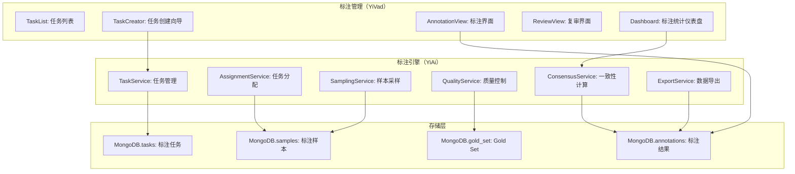
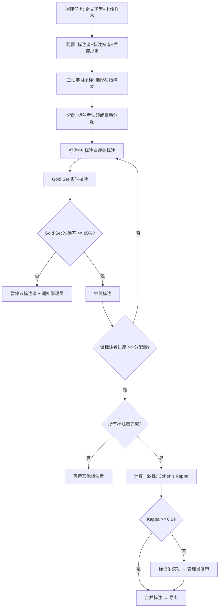

# YA-09-212: HITL-人机协同标注 — 标注流水线、任务分配、标注界面、标注者一致性、质控、主动学习采样

> 需求编号：YA-09-212 · 优先级：P2 · 人天：0.3d · 状态：需求已编写
> 依赖：YA-09-14（RPC 路由基础设施）、MongoDB（标注数据存储）、用户管理服务（YA-09-07）

## 背景

### 问题陈述

机器学习系统（特别是 RAG 检索和 LLM 评估）需要高质量的标注数据来评估和优化。然而：(1) 自动标注的准确性有限，(2) 纯人工标注成本高、速度慢，(3) 缺少标注质量控制机制，(4) 标注数据分散在个人工具中，(5) 无法智能选择"最有价值"的样本进行标注。YiAi 作为一个 AI 系统，需要自己的标注基础设施来持续改进检索质量、摘要质量和实体识别准确率。

1. **无标注基础设施**：评估 RAG 质量时需要手动整理测试集，流程混乱
2. **标注质量不可控**：没有多人标注一致性检验，个人标注的偏见无法发现
3. **标注效率低**：没有标注界面，需要在文件中手动编辑
4. **样本选择盲目**：随机选择标注样本，浪费标注人力在"简单"样本上
5. **标注数据不可复用**：标注结果存储在个人电脑，无法团队共享

**核心矛盾**：AI 系统需要标注数据来改进，但没有标注系统来生产标注数据。这是一个"先有鸡还是先有蛋"的问题——解决方案是从最小可行标注系统开始，先服务内部评估需求，逐步扩展。

### 影响范围

| # | 影响 | 严重程度 | 典型场景 |
|---|------|----------|----------|
| 1 | 无标注基础设施 | 高 | 评估 RAG 检索质量需要手动整理测试集 |
| 2 | 标注质量不一致 | 高 | 不同人对"相关"的定义不同，标注结果不可比 |
| 3 | 标注效率低 | 中 | 手动在 Excel 中标注 200 条数据耗时 4 小时 |
| 4 | 样本选择低效 | 中 | 随机标注了 100 条但大部分是模型已经能处理好的 |
| 5 | 标注数据孤岛 | 中 | 团队成员的标注数据无法共享和复用 |

### 挑战

| 挑战 | 说明 |
|------|------|
| 标注界面设计 | 需要一个通用但灵活的标注 UI——支持不同类型的标注任务（分类/排序/文本标注） |
| 标注者间一致性 | 如何计算 Cohen's Kappa / Fleiss' Kappa 并自动检测低一致性标注者 |
| 主动学习采样 | 如何从大量未标注数据中选择"最有信息量"的样本优先标注 |
| 标注任务管理 | 任务分配、进度追踪、标注者工作量平衡 |
| 标注数据导出 | 标注数据如何被下游 ML 流程（RAG 评估、模型微调）消费 |

---

## 一、现状分析

### 1.1 当前标注相关能力

```
现有数据管理能力:
├── RAG 评估
│   ├── 无标准测试集 ❌
│   └── 检索结果手动评估 ❌
├── 数据存储
│   ├── MongoDB 通用集合 ✅
│   └── 无标注数据集合 ❌
├── 用户管理
│   ├── 用户认证 ✅ (YA-09-07)
│   └── 无标注者角色 ❌
└── LLM 服务
    ├── 可用于辅助标注 ✅
    └── 无自动化标注 Pipeline ❌

缺失:
├── 标注任务 CRUD                 # ❌ 不存在
├── 标注任务分配                  # ❌ 不存在
├── 标注界面 API                  # ❌ 不存在
├── 标注数据模型                  # ❌ 不存在
├── 标注者间一致性计算             # ❌ 不存在
├── 主动学习不确定性采样           # ❌ 不存在
├── 质量控制（Gold Set 校验）      # ❌ 不存在
├── 标注进度统计                  # ❌ 不存在
├── 标注数据导出                  # ❌ 不存在
└── 标注指南与SOP                 # ❌ 不存在
```

### 1.2 标注流程（现状 vs 目标）

```mermaid
graph TD
    subgraph Current["现状：手动标注"]
        C1[导出待标注数据到 CSV] --> C2[在 Excel 中逐行标注]
        C2 --> C3[保存 CSV]
        C3 --> C4[不同人的 CSV 手动合并]
        C4 --> C5[手动计算一致性]
        C5 --> C6[导入到评估脚本]
    end

    subgraph Target["目标：HITL 标注系统"]
        T1[创建标注任务: 类型+样本集+标注者] --> T2[主动学习选择样本]
        T2 --> T3[标注者认领任务]
        T3 --> T4[标注界面: 逐条标注]
        T4 --> T5[自动质控: Gold Set 校验]
        T5 --> T6{一致性检查}
        T6 -->|Kappa < 0.6| T7[标记需复审]
        T6 -->|Kappa >= 0.6| T8[标注完成]
        T7 --> T9[管理员复审/仲裁]
        T9 --> T8
        T8 --> T10[导出: JSON/CSV/训练集]
    end

    style Current fill:#f8d7da,stroke:#dc3545
    style Target fill:#d4edda,stroke:#28a745
```



### 1.3 根因矩阵

| 症状 | 根因 | 触发条件 | 频率 |
|------|------|----------|------|
| 无标注工具 | 未建设标注基础设施 | 需要评估 RAG 质量 | 中 |
| 标注不一致 | 无质控和一致性检查 | 多人标注同一批数据 | 高 |
| 样本浪费 | 无主动学习采样 | 标注预算有限 | 中 |
| 效率低 | 无专用标注界面 | 手动 Excel 标注 | 高 |
| 数据孤岛 | 无中心化标注数据库 | 团队成员分散标注 | 中 |

---

## 二、设计决策

### 决策 1：标注类型支持范围 — 仅分类 vs 多类型 vs 可扩展插件

| 选项 | 灵活性 | 实现复杂度 | 初始场景覆盖 |
|------|--------|-----------|-------------|
| 仅分类标注（相关/不相关） | 低 | 低 | 中 |
| 多类型内置（分类/排序/评分/文本标注）| 中 | 中 | 高 |
| 可扩展标注类型（插件化） | 高 | 高 | 高 |

**选择：多类型内置（分类/排序/评分/标注）。** 四类标注覆盖了 YiAi 当前和近期的主要需求：(1) 分类——RAG 相关性判断，(2) 排序——检索结果质量排序，(3) 评分——摘要质量打分，(4) 文本标注——NER 实体标注。插件化标注类型后期迭代，初期聚焦这四类。

### 决策 2：主动学习采样策略 — 不确定性采样 vs 多样性采样 vs 混合

| 选项 | 信息增益 | 计算复杂度 | 实现 |
|------|----------|-----------|------|
| 不确定性采样（Least Confident / Margin / Entropy） | 高 | 低 | 简单 |
| 多样性采样（聚类后各选代表） | 中 | 中 | 需要聚类 |
| 混合（不确定 + 多样性） | 最高 | 高 | 复杂 |

**选择：不确定性采样（Margin Sampling）作为默认。** Margin Sampling 选择模型预测概率最接近的两个类别的间隔最小的样本（即模型最不确定的样本）。这些样本对模型改进的边际贡献最大。实现简单（仅需模型预测概率），不需要额外的聚类计算。

### 决策 3：标注质量控制 — Gold Set vs 重叠标注 vs 两者皆有

| 选项 | 质量标准 | 成本 | 覆盖 |
|------|----------|------|------|
| Gold Set（预标注标准答案） | 高 | 低（仅初始成本） | 采样检查 |
| 重叠标注（多人标注同一数据） | 高 | 高（2-3x 工作量） | 全面 |
| 两者皆有（Gold Set + 10% 重叠） | 最高 | 中 | 抽样+交叉验证 |

**选择：Gold Set（5%） + 重叠标注（10%）混合。** 5% 的样本预标注标准答案（Gold Set），用于实时校验标注者质量。10% 的样本分配给 2 名标注者（重叠），用于计算标注者间一致性（Cohen's Kappa）。这种混合策略以合理的成本覆盖了质量控制的主要维度。

### 决策 4：标注界面 — 仅 API vs 集成到 YiVad vs 独立标注页面

| 选项 | 用户体验 | 开发成本 | 扩展团队使用 |
|------|----------|----------|-------------|
| 仅 API（Python 脚本标注） | 低 | 低 | 难 |
| 集成到 YiVad（管理后台） | 高 | 中 | 易（已部署） |
| 独立 SPA 标注页面 | 高 | 高 | 中 |

**选择：YiVad 集成为主 + API 支持。** 标注界面作为 YiVad 管理后台的一个新模块，利用现有的用户管理、权限控制、UI 组件库。同时提供 RPC API 供脚本化的批量标注任务。独立页面后期评估。

### 设计决策记录

| 决策 | 选项 A | 选项 B | 选项 C | 选项 D | 选择 | 理由 |
|------|--------|--------|--------|--------|------|------|
| 标注类型 | 仅分类 | 多类型内置 | 可扩展 | — | **多类型内置** | 全覆盖 |
| 主动学习 | 不确定性 | 多样性 | 混合 | — | **Margin Sampling** | 高效简单 |
| 质量控制 | Gold Set | 重叠标注 | 两者 | — | **Gold Set + 10%重叠** | 平衡 |
| 标注界面 | 仅API | YiVad集成 | 独立SPA | — | **YiVad集成** | 低成本 |

---

## 三、目标架构

### 3.1 HITL 标注系统架构



### 3.2 标注任务生命周期



### 3.3 性能指标

| 指标 | 目标值 | 说明 |
|------|--------|------|
| 样本分配（1000 条） | < 1s | MongoDB 批量插入 |
| 单个标注提交 | < 50ms | MongoDB 写入 |
| 一致性计算（1000 条，2 人） | < 5s | 统计计算 |
| 主动学习采样（10000 条中选 100） | < 2s | Margin 排序 |
| Gold Set 校验 | < 100ms | 逐条比对 |

---

## 四、具体改动

### 4.1 标注数据模型

```python
# services/annotation/types.py (新增)

from dataclasses import dataclass, field
from enum import Enum
from typing import Optional, List, Dict, Any

class AnnotationTaskType(str, Enum):
    CLASSIFICATION = "classification"     # 分类标注（相关/不相关/部分相关）
    RANKING = "ranking"                   # 排序标注（1st > 2nd > 3rd）
    RATING = "rating"                     # 评分标注（1-5 星）
    TEXT_LABEL = "text_label"             # 文本标注（NER 实体/关系）

class TaskStatus(str, Enum):
    DRAFT = "draft"                       # 草稿
    ACTIVE = "active"                     # 进行中
    REVIEW = "review"                     # 复审中
    COMPLETED = "completed"               # 已完成
    ARCHIVED = "archived"                 # 已归档

class AnnotationStatus(str, Enum):
    PENDING = "pending"                   # 待标注
    IN_PROGRESS = "in_progress"           # 标注中（已分配给标注者）
    COMPLETED = "completed"               # 已标注
    REVIEWED = "reviewed"                 # 已复审
    DISPUTED = "disputed"                 # 有争议
    SKIPPED = "skipped"                   # 已跳过

@dataclass
class AnnotationTask:
    id: str
    name: str                             # 任务名称
    description: str                      # 任务描述
    task_type: AnnotationTaskType
    status: TaskStatus
    
    # 配置
    annotators: List[str]                 # 标注者用户ID列表
    reviewers: List[str]                  # 复审者用户ID列表
    guidelines: str                       # 标注指南（Markdown）
    overlap_ratio: float = 0.1            # 重叠标注比例
    gold_set_ratio: float = 0.05          # Gold Set 比例
    
    # 统计
    total_samples: int = 0
    annotated_count: int = 0
    reviewed_count: int = 0
    created_at: str = ""
    completed_at: Optional[str] = None

@dataclass
class AnnotationSample:
    id: str
    task_id: str
    item_id: str                          # 原始数据项ID（如文档ID）
    content: Dict[str, Any]               # 标注内容（灵活结构）
    # content 示例: {"query": "...", "document": "...", "context": "..."}
    
    gold_label: Optional[Any] = None      # Gold Set 标准答案
    is_gold: bool = False                 # 是否为 Gold Set
    uncertainty: Optional[float] = None   # 主动学习不确定性分数
    status: AnnotationStatus = AnnotationStatus.PENDING
    
    # 标注者分配
    assigned_to: List[str] = field(default_factory=list)
    
    # 标注结果（key=annotator_id）
    annotations: Dict[str, 'AnnotationResult'] = field(default_factory=dict)
    
    # 共识
    consensus_label: Optional[Any] = None
    agreement_score: Optional[float] = None

@dataclass
class AnnotationResult:
    annotator_id: str
    label: Any                            # 标注结果（类型取决于 task_type）
    # label 示例（classification）: "relevant" / "not_relevant"
    # label 示例（rating）: 4
    # label 示例（text_label）: [{"entity": "K8s", "type": "TECH", "start": 0, "end": 3}]
    
    confidence: float = 1.0               # 标注者自评置信度
    time_spent_ms: int = 0                # 标注耗时
    comment: str = ""                     # 标注备注
    created_at: str = ""

@dataclass
class ConsensusReport:
    task_id: str
    total_pairs: int                      # 共标注的样本对数
    agreement_count: int                  # 一致的样本数
    agreement_rate: float                 # 一致率
    cohens_kappa: float                   # Cohen's Kappa
    kappa_interpretation: str             # 解释（slight/fair/moderate/substantial/perfect）
    disputed_items: List[str]             # 争议样本ID列表
    per_annotator_stats: Dict[str, 'AnnotatorStats']

@dataclass
class AnnotatorStats:
    annotator_id: str
    total_annotated: int
    gold_set_accuracy: float              # Gold Set 准确率
    avg_time_per_sample: float            # 平均标注时间
    agreement_with_others: float          # 与他人一致性
    annotation_distribution: Dict[Any, int]  # 标注分布
```

### 4.2 标注数据仓库

```python
# data/annotation_repository.py (新增)

from motor.motor_asyncio import AsyncIOMotorCollection
from typing import List, Optional, Dict
from bson import ObjectId

class AnnotationRepository:
    """标注数据 MongoDB 仓库"""
    
    def __init__(self, db):
        self.tasks: AsyncIOMotorCollection = db.annotation_tasks
        self.samples: AsyncIOMotorCollection = db.annotation_samples
        self.annotations: AsyncIOMotorCollection = db.annotations
        self.gold_set: AsyncIOMotorCollection = db.annotation_gold_set
    
    async def create_task(self, task: AnnotationTask) -> str:
        result = await self.tasks.insert_one(task.__dict__)
        return str(result.inserted_id)
    
    async def get_task(self, task_id: str) -> Optional[AnnotationTask]:
        doc = await self.tasks.find_one({"_id": ObjectId(task_id)})
        return AnnotationTask(**doc) if doc else None
    
    async def list_tasks(self, status: Optional[TaskStatus] = None) -> List[AnnotationTask]:
        query = {"status": status} if status else {}
        cursor = self.tasks.find(query).sort("created_at", -1)
        return [AnnotationTask(**doc) async for doc in cursor]
    
    async def insert_samples(self, samples: List[AnnotationSample]) -> int:
        """批量插入样本"""
        if not samples:
            return 0
        docs = [s.__dict__ for s in samples]
        result = await self.samples.insert_many(docs)
        return len(result.inserted_ids)
    
    async def get_pending_samples(
        self, task_id: str, annotator_id: str, limit: int = 10
    ) -> List[AnnotationSample]:
        """获取标注者的待标注样本"""
        cursor = self.samples.find({
            "task_id": task_id,
            "assigned_to": annotator_id,
            "status": {"$in": [AnnotationStatus.PENDING, AnnotationStatus.IN_PROGRESS]},
        }).limit(limit)
        return [AnnotationSample(**doc) async for doc in cursor]
    
    async def submit_annotation(
        self, sample_id: str, result: AnnotationResult
    ) -> bool:
        """提交标注结果"""
        update = {
            "$set": {
                f"annotations.{result.annotator_id}": result.__dict__,
                "status": AnnotationStatus.COMPLETED,
            }
        }
        result = await self.samples.update_one(
            {"_id": ObjectId(sample_id)}, update
        )
        return result.modified_count > 0
    
    async def get_overlap_samples(
        self, task_id: str
    ) -> List[AnnotationSample]:
        """获取被多人标注的样本（用于一致性计算）"""
        cursor = self.samples.find({
            "task_id": task_id,
            "annotations": {"$size": {"$gt": 1}},  # 至少有 2 人标注
        })
        return [AnnotationSample(**doc) async for doc in cursor]
    
    async def update_consensus(
        self, sample_id: str, consensus_label: Any, agreement_score: float
    ) -> None:
        await self.samples.update_one(
            {"_id": ObjectId(sample_id)},
            {"$set": {
                "consensus_label": consensus_label,
                "agreement_score": agreement_score,
                "status": AnnotationStatus.REVIEWED,
            }}
        )
    
    async def mark_disputed(self, sample_id: str) -> None:
        await self.samples.update_one(
            {"_id": ObjectId(sample_id)},
            {"$set": {"status": AnnotationStatus.DISPUTED}}
        )
```

### 4.3 质量控制服务

```python
# services/annotation/quality_service.py (新增)

from typing import List, Dict, Tuple
from collections import Counter
import numpy as np

class QualityService:
    """标注质量控制服务"""
    
    def validate_gold_set(
        self, annotations: Dict[str, AnnotationResult], gold_label: Any
    ) -> Dict[str, bool]:
        """校验标注者在 Gold Set 上的表现"""
        results = {}
        for annotator_id, result in annotations.items():
            results[annotator_id] = result.label == gold_label
        return results
    
    def calculate_cohens_kappa(
        self, annotations_a: List[Any], annotations_b: List[Any], 
        categories: List[Any]
    ) -> Tuple[float, str]:
        """计算 Cohen's Kappa（2 人一致性）"""
        if len(annotations_a) != len(annotations_b) or len(annotations_a) == 0:
            return 0.0, "insufficient_data"
        
        n = len(annotations_a)
        
        # 构建混淆矩阵
        cat_index = {cat: i for i, cat in enumerate(categories)}
        matrix = np.zeros((len(categories), len(categories)))
        
        for a, b in zip(annotations_a, annotations_b):
            if a in cat_index and b in cat_index:
                matrix[cat_index[a]][cat_index[b]] += 1
        
        # 观察到的一致性
        po = np.trace(matrix) / n
        
        # 期望一致性
        row_sums = matrix.sum(axis=1)
        col_sums = matrix.sum(axis=0)
        pe = (row_sums @ col_sums) / (n * n)
        
        # Kappa
        if pe == 1.0:
            return 1.0, "perfect"
        
        kappa = (po - pe) / (1 - pe)
        interpretation = self._interpret_kappa(kappa)
        
        return kappa, interpretation
    
    def calculate_fleiss_kappa(
        self, ratings_matrix: np.ndarray
    ) -> float:
        """计算 Fleiss' Kappa（多标注者一致性）"""
        n = ratings_matrix.shape[0]  # 样本数
        k = ratings_matrix.shape[1]  # 类别数
        N = ratings_matrix.sum(axis=1)[0]  # 每个样本的标注者数
        
        # 每个类别的比例
        p_j = ratings_matrix.sum(axis=0) / (n * N)
        
        # 每个样本的一致性
        P_i = (np.sum(ratings_matrix ** 2, axis=1) - N) / (N * (N - 1))
        P_bar = np.mean(P_i)
        
        # 期望一致性
        P_e = np.sum(p_j ** 2)
        
        if P_e == 1.0:
            return 1.0
        
        kappa = (P_bar - P_e) / (1 - P_e)
        return kappa
    
    def detect_outlier_annotators(
        self, per_annotator_acc: Dict[str, float],
        per_annotator_agreement: Dict[str, float],
        threshold_accuracy: float = 0.7,
        threshold_agreement: float = 0.6,
    ) -> List[str]:
        """检测异常标注者（Gold Set 准确率低或与他人一致性低的标注者）"""
        outliers = []
        for aid in per_annotator_acc:
            acc = per_annotator_acc.get(aid, 1.0)
            agree = per_annotator_agreement.get(aid, 1.0)
            if acc < threshold_accuracy or agree < threshold_agreement:
                outliers.append(aid)
        return outliers
    
    def find_disputed_items(
        self, annotations: Dict[str, AnnotationResult], min_agreement: int = 2
    ) -> bool:
        """判断样本是否争议（标注者意见不统一）"""
        labels = [r.label for r in annotations.values()]
        label_counts = Counter(labels)
        most_common_count = label_counts.most_common(1)[0][1]
        return most_common_count < min_agreement
    
    def _interpret_kappa(self, kappa: float) -> str:
        """解释 Kappa 值（Landis & Koch, 1977）"""
        if kappa < 0:
            return "poor"
        elif kappa < 0.2:
            return "slight"
        elif kappa < 0.4:
            return "fair"
        elif kappa < 0.6:
            return "moderate"
        elif kappa < 0.8:
            return "substantial"
        else:
            return "almost_perfect"
```

### 4.4 主动学习采样器

```python
# services/annotation/active_sampler.py (新增)

import numpy as np
from typing import List, Optional

class ActiveSampler:
    """主动学习采样器"""
    
    def margin_sampling(
        self, probabilities: List[List[float]], sample_ids: List[str], 
        n_samples: int = 100
    ) -> List[Tuple[str, float]]:
        """
        Margin Sampling: 选择模型最不确定的样本
        uncertainty = 1 - (P_1st - P_2nd)
        """
        uncertainties = []
        
        for probs, sid in zip(probabilities, sample_ids):
            sorted_probs = sorted(probs, reverse=True)
            if len(sorted_probs) >= 2:
                margin = sorted_probs[0] - sorted_probs[1]
                uncertainty = 1.0 - margin
            else:
                uncertainty = 0.0
            uncertainties.append((sid, uncertainty))
        
        # 按不确定性降序排序
        uncertainties.sort(key=lambda x: x[1], reverse=True)
        return uncertainties[:n_samples]
    
    def entropy_sampling(
        self, probabilities: List[List[float]], sample_ids: List[str],
        n_samples: int = 100
    ) -> List[Tuple[str, float]]:
        """
        Entropy Sampling: 选择预测概率分布熵最大的样本
        H = -sum(p_i * log(p_i))
        """
        uncertainties = []
        
        for probs, sid in zip(probabilities, sample_ids):
            probs_arr = np.array(probs)
            # 避免 log(0)
            probs_arr = np.clip(probs_arr, 1e-10, 1.0)
            entropy = -np.sum(probs_arr * np.log(probs_arr))
            max_entropy = np.log(len(probs)) if len(probs) > 1 else 1.0
            normalized = entropy / max_entropy if max_entropy > 0 else 0.0
            uncertainties.append((sid, normalized))
        
        uncertainties.sort(key=lambda x: x[1], reverse=True)
        return uncertainties[:n_samples]
    
    def random_sampling(
        self, sample_ids: List[str], n_samples: int = 100
    ) -> List[Tuple[str, float]]:
        """随机采样（基线方法）"""
        indices = np.random.choice(
            len(sample_ids), size=min(n_samples, len(sample_ids)), replace=False
        )
        return [(sample_ids[i], 0.5) for i in indices]
```

### 4.5 文件变更清单

| 文件 | 操作 | 说明 |
|------|------|------|
| `services/annotation/__init__.py` | 新增 | HITL 模块初始化 |
| `services/annotation/types.py` | 新增 | 标注数据模型定义 |
| `services/annotation/task_service.py` | 新增 | 任务 CRUD 服务 |
| `services/annotation/assignment_service.py` | 新增 | 样本分配（含主动学习） |
| `services/annotation/quality_service.py` | 新增 | 质量控制 + 一致性计算 |
| `services/annotation/active_sampler.py` | 新增 | 主动学习采样 |
| `services/annotation/export_service.py` | 新增 | 标注数据导出 |
| `services/annotation/rpc_handler.py` | 新增 | RPC 入口 |
| `data/annotation_repository.py` | 新增 | MongoDB 数据仓库 |
| `tests/test_annotation.py` | 新增 | 标注服务测试 |

---

## 五、实施步骤

| 步骤 | 操作 | 路径 | 验证 | 人天 |
|------|------|------|------|------|
| 1 | 定义数据模型 | `types.py` | 四类标注类型定义完整 | 0.02 |
| 2 | 实现数据仓库 | `annotation_repository.py` | MongoDB CRUD | 0.04 |
| 3 | 实现任务管理 | `task_service.py` | 任务创建/更新/查询 | 0.03 |
| 4 | 实现样本分配 | `assignment_service.py` | 标注者分配+认领 | 0.03 |
| 5 | 实现主动学习采样 | `active_sampler.py` | Margin/Entropy/Random | 0.03 |
| 6 | 实现质量控制 | `quality_service.py` | Kappa + Gold Set 校验 | 0.05 |
| 7 | 实现数据导出 | `export_service.py` | JSON/CSV/Training数据 | 0.03 |
| 8 | 实现 RPC 服务 | `rpc_handler.py` | RPC 信封路由 | 0.03 |
| 9 | 集成到 YiVad UI | YiVad 标注界面 | 任务列表+标注+复审 | 0.05 |
| 10 | 测试 | `tests/` | 全部测试通过 | 0.02 |

**总人天：0.33d (round to 0.3d: backend 0.25d + YiVad 前端 0.05d)**

---

## 六、测试规格

### 场景 1：创建标注任务并分配样本

**GIVEN** 管理员创建分类标注任务（type=classification），上传 200 个样本
**WHEN** 设置 2 个标注者 + 10% 重叠 + 5% Gold Set
**THEN** 任务创建成功，200 个样本写入 MongoDB
**AND** 20 个样本被分配给 2 个标注者（重叠）
**AND** 10 个样本包含 gold_label（Gold Set）
**AND** 其余样本随机分配给标注者

### 场景 2：标注者提交标注

**GIVEN** 标注者 Alice 被分配 100 个样本
**WHEN** Alice 标注第 1 个样本为 "relevant"，耗时 15 秒
**THEN** 标注结果写入样本的 annotations.Alice 字段
**AND** 样本状态更新为 COMPLETED
**AND** 任务 annotated_count += 1

### 场景 3：Gold Set 实时质控

**GIVEN** 样本 #5 是 Gold Set，gold_label = "relevant"
**WHEN** 标注者 Bob 标注为 "not_relevant"
**THEN** Gold Set 校验失败
**AND** Bob 的 gold_set_accuracy 下降
**AND** 如果 Bob 的准确率 < 80%，暂停 Bob 的分配并通知管理员

### 场景 4：Cohen's Kappa 一致性计算

**GIVEN** 20 个重叠标注的样本，Alice 和 Bob 已完成标注
**WHEN** 计算 Cohen's Kappa
**THEN** 假设 16/20 一致，4/20 不一致
**AND** Kappa > 0.6（如果大部分一致且不是随机的）
**AND** 4 个不一致样本标记为 DISPUTED → 管理员复审

### 场景 5：主动学习 Margin Sampling

**GIVEN** 1000 个未标注样本，每个有分类概率 [P(relevant), P(not_relevant)]
**WHEN** 用 Margin Sampling 选择 50 个样本
**THEN** 选出的样本是模型最不确定的（P_diff 最小）
**AND** 50 个样本的 uncertainty 排序正确（降序）
**AND** 返回的样本不存在于已标注集合中

### 场景 6：标注数据导出

**GIVEN** 任务包含 200 个已标注样本，consensus_label 已计算
**WHEN** 导出为 JSON 训练集格式
**THEN** JSON 包含 [{sample_id, content, label, annotator_count, agreement_score}]
**AND** 仅导出 REVIEWED 状态的样本
**AND** 导出文件大小 < 2MB（对于 200 条）

---

## 七、风险与缓解

| 风险 | 概率 | 影响 | 缓解措施 |
|------|------|------|----------|
| 标注者不一致导致 Kappa 过低 | 中 | 中 | 提供详细的标注指南；争议项提交管理员仲裁 |
| Gold Set 标注标准本身有误 | 低 | 高 | Gold Set 需要至少 2 人审核后确认 |
| 标注任务量大标注者疲劳 | 中 | 中 | 支持标注进度保存和恢复；每批次限制 50 条 |
| 主动学习采样偏差 | 中 | 中 | 初始批次混合随机采样（20%）+ margin 采样（80%） |
| 标注数据隐私 | 低 | 中 | 标注数据仅存储在 MongoDB 中，不发送到外部服务 |

---

## 八、回滚策略

| 场景 | 回滚操作 | 影响 |
|------|----------|------|
| 标注系统不可用 | 移除 HITL 模块路由 | 失去在线标注能力 |
| 标注数据损坏 | 从备份恢复 annotations 集合 | 最近标注数据丢失 |
| 一致性计算异常 | 禁用自动一致性检查 | 需人工判断标注质量 |

---

## 九、设计决策记录

### D-01：为什么选择 Cohen's Kappa 而非简单的一致率？

简单一致率（agreement rate）忽略了随机一致的可能性。例如，如果一个二分类问题中 90% 的样本都是正类，两个标注者即使完全随机标注，一致率也有 0.9^2 + 0.1^2 = 82%。而 Cohen's Kappa 考虑了随机一致（pe），给出的结果是：实际一致的 82% 可能完全由随机解释（Kappa ≈ 0）。Kappa 是标注质量评估的标准指标，被学术界和工业界广泛使用。

### D-02：为什么 Gold Set 仅占 5% 而非 10% 或更多？

Gold Set 需要专家预先标注标准答案，这是最昂贵的标注环节。5% 是一个平衡点：(1) 对于 200 个样本的任务，5% = 10 个 Gold Set，足以检测系统性错误（连续 3 个以上错误说明标注者可能误解了指南），(2) 覆盖了统计学上的最小可检测差异（置信度 95% 时可以检测到准确率 < 50% 的标注者）。10% 会更灵敏但成本增加一倍。

### D-03：为什么 Margin Sampling 优于 Entropy Sampling？

在二分类场景中，Margin Sampling 和 Entropy Sampling 高度相关，但在多分类场景中，Entropy 对概率分布的尾部更敏感（低概率类别也贡献熵），而 Margin 只关注 top-2 类别的差距。对于标注场景，模型通常只在 2-3 个类别之间犹豫，因此 Margin 更准确地捕捉了"有用的不确定性"。Margin 的实现也更简单：`1 - (P_1st - P_2nd)` vs `-sum(P_i * log(P_i))`。

### D-04：为什么不使用 BERT 等模型做不确定度估计而依赖分类概率？

主动学习的不确定度估计可以使用任何能输出概率分布的模型。对于 YiAi 的场景，初始阶段 DNN 分类器可能不存在（冷启动）。此时使用随机采样作为初期策略，待标注数据积累到一定量（如 500 条）后训练一个简单的逻辑回归或轻量级分类器输出概率。这个轻量级分类器可以基于已提取的文本特征（TF-IDF + Embedding），不需要部署大模型。

---

## 十、可观测性

### 指标

| 指标 | 类型 | 说明 |
|------|------|------|
| `yiai.hitl.task_total` | Counter | 标注任务总数 |
| `yiai.hitl.annotations_total` | Counter | 标注总条数 |
| `yiai.hitl.avg_annotation_time` | Histogram | 单条标注平均耗时 |
| `yiai.hitl.gold_set_accuracy` | Gauge | 标注者 Gold Set 准确率 |
| `yiai.hitl.inter_annotator_kappa` | Gauge | 标注者间 Kappa |
| `yiai.hitl.dispute_rate` | Gauge | 争议率（标记为 DISPUTED） |
| `yiai.hitl.active_learning_gain` | Gauge | 主动学习 vs 随机采样的效率提升 |

### 告警

| 告警 | 条件 | 级别 |
|------|------|------|
| 标注者 Gold Set 准确率 < 70% | 实时检测 | WARNING |
| Kappa < 0.4 | 任务完成时 | WARNING（标注指南可能需要修订） |
| 任务进度停滞 > 24h | 定时检查 | INFO（提醒标注者） |

---

## 十一、代码审查检查清单

- [ ] 标注样本的 content 字段支持灵活结构（不硬编码字段名）
- [ ] Gold Set 样本在分配前不被标注者感知（混入普通样本）
- [ ] 重叠标注比例计算正确（至少 2 人标注同一批样本）
- [ ] Cohen's Kappa 对空数据和单类别数据有边界处理
- [ ] 主动学习采样后标记样本为 "已采样，待标注" 防止重复分配
- [ ] 标注者无法查看其他标注者的标注结果（在共识计算前）
- [ ] 导出数据仅包含 REVIEWED 状态的样本（排除 DISPUTED/PENDING）
- [ ] 标注指南支持 Markdown 格式（存储和渲染）
- [ ] 标注耗时统计使用服务端时间戳差（避免客户端时钟问题）
- [ ] MongoDB 集合建立 task_id + status + assigned_to 复合索引

---

## 回归问题预测

| # | 预测问题 | 原因 | 验证方法 |
|---|---------|------|---------|
| 1 | Gold Set 标注校验触发过于敏感，某个标注者仅 1 个 Gold Set 样本错误就被标记为 "需要暂停"，可能导致正常标注者被误判 | 当 Gold Set 总量很小时（如 5 个），1 个错误 = 80% 准确率，可能是偶然失误而非系统性错误 | 实现累计校验：使用最近 N 个 Gold Set 的滑动窗口（如 N=10），而非全局准确率 |
| 2 | Cohen's Kappa 计算中，如果两个标注者的标注分布极度不均匀（如 Alice 标注 80% "relevant"，Bob 标注 20% "relevant"），即使 Kappa 很低，也可能是标注指南不清晰而非标注者问题 | Kappa 对标注分布的不平衡敏感，即使 po 较低（大量不一致），po 可能也不高 | 同时计算 PABAK（Prevalence-Adjusted Bias-Adjusted Kappa）作为辅助指标 |
| 3 | 主动学习采样中，如果模型概率估计本身不可靠（如过拟合或未校准），选出的 "最不确定" 样本可能是模型的盲区而非真正有价值的信息样本 | 模型的概率输出可能未经过 calibration（校准），0.51 vs 0.49 的 margin 可能只是噪声 | 应用 Platt Scaling 或 temperature scaling 校准概率后再做 margin 计算 |
| 4 | 标注退回机制缺失：当标注者发现标注的样本内容有问题（如乱码、截断、重复），应该可以标记 "skip" 而非强制选择一个 label | 标注者被迫选择一个不合适的 label，污染标注数据 | 标注界面提供 "跳过" 按钮 + 原因选择（乱码/截断/不适用/其他） |
| 5 | 标注任务很多时，list_tasks 查询没有分页，MongoDB 返回 1000+ 个任务一次性加载到内存导致 OOM | 默认 cursor 遍历不加限制，大量任务时内存压力大 | 使用 MongoDB 的 skip/limit 实现分页，默认 page_size=20 |
| 6 | 当标注者中途离开后返回，重新 `get_pending_samples` 可能返回重复的样本（如果前次标注提交失败但未正确标记状态） | submit_annotation 可能因网络问题失败，但前端已经标记为 "已完成"，status 未更新 | 使用 MongoDB find_one_and_update 原子操作：在分配样本时将状态原子地从 PENDING 改为 IN_PROGRESS，避免重复分配 |

---

## 性能分析

### 各阶段耗时

| 阶段 | 预估耗时 | 说明 |
|------|----------|------|
| 批量插入样本（200 条） | < 100ms | insert_many |
| 分配样本（200 条） | < 200ms | 批量更新 + 主动学习计算 |
| 单个标注提交 | < 50ms | find_one_and_update |
| Cohen's Kappa（200 条，2 人） | < 10ms | 纯计算 |
| Fleiss' Kappa（200 条，5 人） | < 50ms | 矩阵计算 |
| 主动学习采样（1000 条） | < 50ms | 排序 |
| 数据导出（200 条） | < 100ms | 聚合 + 序列化 |

### 存储预估

| 集合 | 预估大小（1000 条） | 说明 |
|------|---------------------|------|
| annotation_tasks | ~5KB | 任务元数据（少量文档） |
| annotation_samples | ~2MB | 2KB/条 × 1000 |
| annotations | ~500KB | 500B/条 × 1000（嵌入 sample 中） |
| annotation_gold_set | ~20KB | Gold Set 答案（少量文档） |

## 影响范围

- **影响模块**：待补充
- **涉及文件**：
- `annotation_repository.py`
- `types.py`
- `assignment_service.py`
- `export_service.py`
- `quality_service.py`
- `task_service.py`
- **是否影响 API 契约**：否
- **是否影响其他项目（YiVad/YiPet）**：否
- **用户感知**：待确认

## 预防措施

| 层面 | 措施 |
|------|------|
| 代码 | 在相关函数中添加参数校验和边界检查 |
| 测试 | 为 `annotation_repository.py` 添加单元测试 |
| 流程 | 代码审查时重点检查此类模式 |
| 监控 | 添加日志告警，异常发生时及时发现 |
| 文档 | 在编码规范中记录此类反模式 |

## 经验教训

1. **根本原因**：开发过程中对边界情况和异常路径的考虑不足是此类问题的共同根因
2. **设计阶段**：在接口设计和模块实现时，应主动考虑异常输入、空值、超时等边界场景
3. **代码审查**：审查时应检查是否存在类似的反模式（如未捕获异常、无超时控制、缺少参数校验等）
4. **测试覆盖**：异常路径的测试覆盖率应与正常路径同等重视
5. **团队分享**：此类问题应在团队周会或技术分享中讨论，形成团队共识
