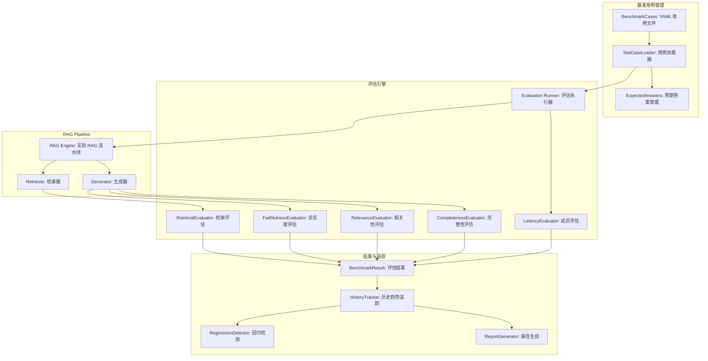
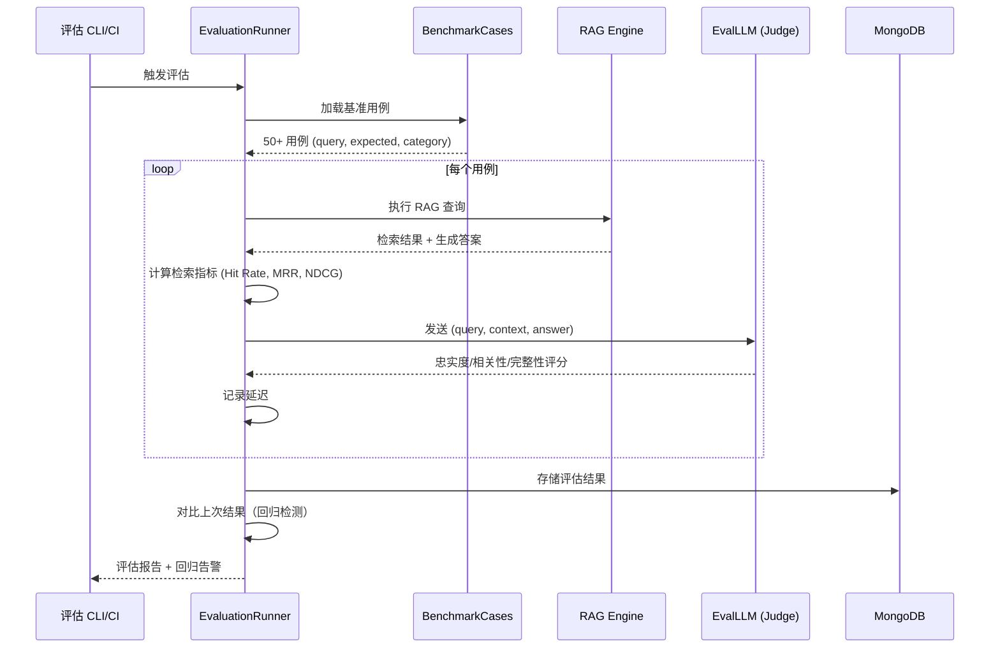

# YA-09-213: RAG评估基准 — 标准测试查询与预期答案、自动化评估指标（忠实度/相关性/完整性/延迟）、RAG变更回归测试、基准历史追踪

> 需求编号：YA-09-213 · 优先级：P2 · 人天：0.3d · 状态：需求已编写
> 依赖：YA-09-01（RAG 引擎稳定性修复）、YA-09-183（知识库问答质量评估）、YA-09-197（多轮检索迭代优化）

## 背景

### 问题陈述

YiAi 的 RAG 系统（基于 llama_index）是知识库检索增强生成的核心组件，直接影响用户获取答案的质量。然而，当前 RAG 系统缺乏系统化的评估基准，导致以下问题：

1. **无法量化变更影响**：对 RAG pipeline 的任何修改（如调整 chunk size、更换 embedding 模型、重排算法变更）都无法量化对最终答案质量的影响，全靠"感觉"判断
2. **回归测试空白**：RAG 代码修改后没有自动化的质量回归测试，可能导致已有正确答案的查询在新版本中变差
3. **质量指标缺失**：不知道当前 RAG 系统的忠实度、相关性、完整性等关键质量指标的实际数值
4. **退化不可见**：知识库更新或 embedding 模型切换后，某些查询的答案可能退化，但没有机制发现
5. **优化无方向**：不知道哪个环节是最薄弱的，无法有针对性地优化

**核心矛盾**：RAG 系统是被频繁迭代的核心组件，但每次迭代都缺少可量化的质量反馈，导致优化靠猜测、退化和回归事故靠用户反馈发现。

### 影响范围

| # | 影响 | 严重程度 | 典型场景 |
|---|------|----------|----------|
| 1 | 变更影响无法量化 | 高 | 调整 chunk size 后不知道质量是否提升 |
| 2 | 回归不可见 | 高 | embedding 模型切换导致部分查询答案退化 |
| 3 | 质量基线未知 | 高 | 不知道当前系统的好坏 |
| 4 | 优化方向不明确 | 中 | 不知道改检索还是改生成 |
| 5 | 知识库变化影响未知 | 中 | 新增知识文档后无法评估检索质量变化 |

### 挑战

| 挑战 | 说明 |
|------|------|
| 基准用例设计 | 如何设计覆盖各类查询（事实型/推理型/聚合型/否定型）的基准用例集 |
| 忠实度自动评估 | 如何自动判断生成答案是否忠实于检索到的上下文（而非 LLM 幻觉） |
| 相关性自动评估 | 如何自动判断检索到的文档块与查询的相关性 |
| LLM-as-Judge 一致性 | 使用 LLM 评估 LLM 输出的自指问题（评估者偏差） |
| 基准管理 | 基准用例的版本管理、预期答案的维护、历史趋势追踪 |

---

## 一、现状分析

### 1.1 当前 RAG 评估流程

```
当前 RAG 质量评估流程
  │
  ├─ 人工抽查
  │   ├─ 手动输入几个查询
  │   ├─ 肉眼判断答案质量
  │   └─ 完全主观，不可复现
  │
  ├─ 代码变更后
  │   ├─ 运行已有测试（仅覆盖 API 响应格式）
  │   ├─ 无 RAG 质量专项测试
  │   └─ 依赖线上用户反馈发现问题
  │
  └─ 问题发现
      ├─ 用户报告"某某查询答案不对"
      ├─ 排查修改历史
      └─ 从用户反馈倒推
```

### 1.2 当前可用评估能力

| 能力 | 可用性 | 获取方式 | 限制 |
|------|--------|----------|------|
| RAG 质量评估 | ❌ | 无 | — |
| 回归测试 | ⚠️ | 仅 API 格式测试 | 不覆盖答案质量 |
| 质量指标 | ❌ | 无 | — |
| 基准用例 | ❌ | 无 | — |
| 历史趋势 | ❌ | 无 | — |

### 1.3 根因矩阵

| 症状 | 根因 | 触发条件 | 频率 |
|------|------|----------|------|
| 变更影响未知 | 无自动化评估 | 每次 RAG 代码修改 | 高 |
| 回归不可见 | 无回归测试 | 修改检索/生成逻辑 | 中 |
| 质量基线缺失 | 从未做过系统评估 | 任何时候 | 持续 |
| 退化无感知 | 无监控告警 | 知识库/模型更新后 | 中 |
| 优化无方向 | 无分环节指标 | 性能优化时 | 中 |

---

## 二、设计决策

### 决策 1：评估指标选择 — 仅检索指标 vs 仅生成指标 vs 全链路指标

| 选项 | 覆盖范围 | 实现复杂度 | 诊断能力 |
|------|----------|-----------|----------|
| 仅检索指标（Hit Rate, MRR, NDCG） | 检索阶段 | 低 | 知道检索好不好 |
| 仅生成指标（忠实度/相关性/完整性） | 生成阶段 | 中 | 知道答案好不好 |
| 全链路指标（检索 + 生成） | 全流程 | 中 | 知道哪个环节有问题 |

**选择：全链路指标。** 检索阶段：Hit Rate@K、MRR、NDCG@K。生成阶段：忠实度（答案是否基于检索到的上下文而非幻觉）、答案相关性（答案是否回答了问题）、完整性（答案是否覆盖了所有关键信息）。全链路指标可以定位问题是出在检索还是生成环节。

### 决策 2：评估方法 — 人工标注 vs LLM-as-Judge vs 混合

| 选项 | 准确性 | 成本 | 可扩展性 |
|------|--------|------|----------|
| 纯人工评估（领域专家） | 最高 | 最高 | 最低 |
| LLM-as-Judge（GPT/Claude 打分） | 高（85%+ 与人工一致） | 低 | 高 |
| 规则评估（关键词匹配/语义相似度） | 中 | 极低 | 最高 |
| LLM-as-Judge + 人工抽检 | 高 | 中 | 高 |

**选择：LLM-as-Judge + 人工抽检 + 规则辅助。** LLM-as-Judge 作为主力评估器（使用独立的评估 LLM，避免自评偏差），对每个查询进行忠实度/相关性/完整性打分。每月随机抽检 10% 的评估结果进行人工复核。规则评估（如检索命中率）作为自动化回归测试的快速通道。

### 决策 3：基准用例管理 — 硬编码 vs 数据库 vs 文件系统

| 选项 | 版本管理 | 团队协作 | 自动化 |
|------|----------|----------|--------|
| 硬编码（Python 列表） | 差 | 差 | 高 |
| MongoDB 集合存储 | 中 | 中 | 高 |
| YAML/JSON 文件 + Git | 好（Git 版本管理） | 好（PR Review） | 高 |

**选择：YAML 文件 + Git 版本管理。** 基准用例以 YAML 文件存储在 `YiAi/tests/benchmarks/rag/` 目录下。Git 提供天然的版本管理、变更审查和协作能力。YAML 格式可读性好，非技术人员也能编写和审查。运行时从文件加载。

### 决策 4：评估频率 — 手动触发 vs CI 自动 vs 定时任务

| 选项 | 触发时机 | 延迟 | 资源消耗 |
|------|----------|------|----------|
| 仅手动触发 | 按需 | — | 低 |
| CI 自动（每次 PR/commit） | 代码变更时 | 即时 | 中（每次 CI 都跑评估） |
| 定时任务（每日/每周） | 周期性 | 天级 | 中 |
| CI + 定时双层 | CI 关键用例 + 定时全量 | 即时 + 周期 | 中 |

**选择：CI 快速回归（Top-10 关键用例）+ 定时全量评估（每日）。** CI pipeline 中运行 10 个关键用例的快速回归（< 2 分钟），阻止破坏性变更合并。每日定时任务运行全量基准评估（50+ 用例），生成趋势报告并发送到监控面板。

### 设计决策记录

| 决策 | 选项 A | 选项 B | 选项 C | 选择 | 理由 |
|------|--------|--------|--------|------|------|
| 评估指标 | 仅检索 | 仅生成 | 全链路 | **全链路** | 定位问题环节 |
| 评估方法 | 人工标注 | LLM-as-Judge | 混合 | **混合** | 自动化+质量保证 |
| 用例管理 | 硬编码 | MongoDB | YAML+Git | **YAML+Git** | 版本管理+协作 |
| 评估频率 | 手动 | CI | CI+定时 | **CI+定时** | 快速+全面 |

---

## 三、目标架构

### 3.1 RAG 评估基准系统架构



### 3.2 评估流程



### 3.3 评估指标定义

| 指标 | 评估对象 | 评估方法 | 分数范围 |
|------|----------|----------|----------|
| Hit Rate@K | 检索器 | 前 K 个文档块中是否包含正确答案片段 | 0/1 |
| MRR (Mean Reciprocal Rank) | 检索器 | 第一个相关文档的排名倒数 | 0-1 |
| NDCG@K | 检索器 | 归一化折损累计增益 | 0-1 |
| Faithfulness (忠实度) | 生成器 | LLM-as-Judge: 答案是否基于检索上下文 | 1-5 |
| Answer Relevance (相关性) | 生成器 | LLM-as-Judge: 答案是否回答了问题 | 1-5 |
| Completeness (完整性) | 生成器 | LLM-as-Judge: 答案是否覆盖所有关键信息 | 1-5 |
| Latency P50/P95/P99 | 全链路 | 计时：从请求到完整响应 | ms |

### 3.4 性能指标

| 指标 | 目标值 | 说明 |
|------|--------|------|
| 单用例评估耗时 | < 10s | 含 RAG 查询 + LLM 评估 |
| Top-10 回归测试 | < 2min | CI pipeline 内完成 |
| 全量基准评估（50 用例） | < 10min | 每日定时任务 |
| LLM-as-Judge 成本 | < $0.01/用例 | 评估 prompt ~500 tokens |

---

## 四、具体改动

### 4.1 基准用例格式（YAML）

```yaml
# YiAi/tests/benchmarks/rag/v1/baseline.yaml (新增)

version: "1.0"
name: "RAG Baseline Benchmark"
description: "RAG 系统基线评估基准，覆盖 50+ 标准查询"
created: "2026-09-09"

cases:
  - id: "RAG-001"
    category: "事实型查询"
    question: "YiAi 的默认端口是多少？"
    expected_keywords: ["10086", "uvicorn"]
    expected_doc_sources: ["YiAi/README.md", "CLAUDE.md"]
    min_faithfulness: 4
    min_relevance: 4
    min_completeness: 3
    max_latency_ms: 5000

  - id: "RAG-002"
    category: "事实型查询"
    question: "YiVad 使用什么前端框架？"
    expected_keywords: ["Vue", "3.5", "SPA", "单页应用"]
    expected_doc_sources: ["CLAUDE.md", "YiVad/CLAUDE.md"]
    min_faithfulness: 4
    min_relevance: 4
    min_completeness: 3
    max_latency_ms: 5000

  - id: "RAG-003"
    category: "推理型查询"
    question: "YiPet 和 YiVad 如何共享同一个后端？"
    expected_keywords: ["RPC", "信封", "module_name", "method_name"]
    expected_doc_sources: ["CLAUDE.md"]
    min_faithfulness: 4
    min_relevance: 4
    min_completeness: 4
    max_latency_ms: 8000

  - id: "RAG-004"
    category: "否定型查询"
    question: "YiPet 可以直接访问 MongoDB 吗？"
    expected_keywords: ["不能", "禁止", "不可", "RPC", "信封"]
    expected_doc_sources: ["CLAUDE.md"]
    min_faithfulness: 4
    min_relevance: 4
    min_completeness: 3
    max_latency_ms: 5000

  - id: "RAG-005"
    category: "聚合型查询"
    question: "列出所有 YiAi 提供的服务模块"
    expected_keywords: ["聊天", "文件管理", "知识库", "RAG", "RSS", "Agent"]
    expected_doc_sources: ["CLAUDE.md", "YiAi/CLAUDE.md"]
    min_faithfulness: 4
    min_relevance: 3
    min_completeness: 4
    max_latency_ms: 8000

  # ... 更多用例（共 50+）
```

### 4.2 评估执行器

```python
# YiAi/src/services/rag/evaluation/runner.py (新增)

import time
import yaml
from dataclasses import dataclass, field
from typing import Optional

@dataclass
class RetrievalMetrics:
    hit_rate_at_3: float = 0.0
    hit_rate_at_5: float = 0.0
    mrr: float = 0.0
    ndcg_at_5: float = 0.0

@dataclass
class GenerationMetrics:
    faithfulness: float = 0.0   # 1-5
    relevance: float = 0.0       # 1-5
    completeness: float = 0.0    # 1-5

@dataclass
class CaseResult:
    case_id: str
    category: str
    question: str
    answer: str = ""
    retrieval_metrics: RetrievalMetrics = field(default_factory=RetrievalMetrics)
    generation_metrics: GenerationMetrics = field(default_factory=GenerationMetrics)
    latency_ms: float = 0.0
    passed: bool = False
    failures: list[str] = field(default_factory=list)

@dataclass
class BenchmarkReport:
    version: str
    timestamp: float
    total_cases: int
    passed_cases: int
    avg_faithfulness: float
    avg_relevance: float
    avg_completeness: float
    avg_hit_rate_3: float
    avg_mrr: float
    avg_latency_ms: float
    case_results: list[CaseResult]
    regressions: list[dict]  # 相比上次退化的用例

class EvaluationRunner:
    """RAG 评估基准执行器"""

    def __init__(self, rag_engine, eval_llm, db_repo):
        self.rag_engine = rag_engine
        self.eval_llm = eval_llm
        self.db_repo = db_repo
        self.retrieval_eval = RetrievalEvaluator()
        self.faithfulness_eval = FaithfulnessEvaluator(eval_llm)
        self.relevance_eval = RelevanceEvaluator(eval_llm)
        self.completeness_eval = CompletenessEvaluator(eval_llm)

    async def run_benchmark(
        self, benchmark_path: str, subset: Optional[list[str]] = None
    ) -> BenchmarkReport:
        """执行完整基准评估"""
        cases = self._load_cases(benchmark_path)
        if subset:
            cases = [c for c in cases if c['id'] in subset]

        results = []
        for case in cases:
            result = await self._evaluate_case(case)
            results.append(result)

        # 对比上次结果
        previous = await self.db_repo.get_latest_report()
        regressions = self._detect_regressions(results, previous) if previous else []

        return self._build_report(results, regressions)

    async def _evaluate_case(self, case: dict) -> CaseResult:
        """评估单个用例"""
        start = time.time()

        # 执行 RAG 查询
        rag_response = await self.rag_engine.query(case['question'])

        latency = (time.time() - start) * 1000

        # 检索指标
        retrieval_metrics = self.retrieval_eval.evaluate(
            rag_response['source_nodes'],
            case.get('expected_doc_sources', []),
        )

        # 生成指标
        gen_metrics = GenerationMetrics(
            faithfulness=await self.faithfulness_eval.evaluate(
                case['question'], rag_response['response'], rag_response['source_nodes']
            ),
            relevance=await self.relevance_eval.evaluate(
                case['question'], rag_response['response']
            ),
            completeness=await self.completeness_eval.evaluate(
                case['question'], rag_response['response'],
                case.get('expected_keywords', [])
            ),
        )

        # 判断是否通过
        passed, failures = self._check_thresholds(case, retrieval_metrics, gen_metrics, latency)

        return CaseResult(
            case_id=case['id'],
            category=case['category'],
            question=case['question'],
            answer=rag_response['response'],
            retrieval_metrics=retrieval_metrics,
            generation_metrics=gen_metrics,
            latency_ms=latency,
            passed=passed,
            failures=failures,
        )

    def _detect_regressions(
        self, current: list[CaseResult], previous: BenchmarkReport
    ) -> list[dict]:
        """检测相比上次评估退化的用例"""
        prev_map = {r.case_id: r for r in previous.case_results}
        regressions = []

        for result in current:
            prev = prev_map.get(result.case_id)
            if not prev:
                continue

            # 检查 3 项指标的退化
            if result.generation_metrics.faithfulness < prev.generation_metrics.faithfulness - 0.5:
                regressions.append({'case_id': result.case_id, 'metric': 'faithfulness',
                    'previous': prev.generation_metrics.faithfulness, 'current': result.generation_metrics.faithfulness})
            if result.generation_metrics.relevance < prev.generation_metrics.relevance - 0.5:
                regressions.append({'case_id': result.case_id, 'metric': 'relevance',
                    'previous': prev.generation_metrics.relevance, 'current': result.generation_metrics.relevance})
            if result.retrieval_metrics.hit_rate_at_3 < prev.retrieval_metrics.hit_rate_at_3 - 0.2:
                regressions.append({'case_id': result.case_id, 'metric': 'hit_rate@3',
                    'previous': prev.retrieval_metrics.hit_rate_at_3, 'current': result.retrieval_metrics.hit_rate_at_3})

        return regressions
```

### 4.3 LLM-as-Judge 忠实度评估器

```python
# YiAi/src/services/rag/evaluation/faithfulness.py (新增)

class FaithfulnessEvaluator:
    """使用 LLM 评估生成答案的忠实度（是否基于检索上下文而非幻觉）"""

    FAITHFULNESS_PROMPT = """
    你是一个 RAG 质量评估专家。请评估以下生成答案对其检索上下文的忠实度。

    忠实度定义：答案中的每一个断言是否都能在检索到的上下文中找到依据。
    - 5 分：所有断言都能在上下文中找到明确依据，无任何虚构信息
    - 4 分：几乎所有断言都有依据，仅有微小推断（如概括性语句）
    - 3 分：大部分断言有依据，但包含 1-2 处无法在上下文中验证的信息
    - 2 分：答案中相当一部分信息无法在上下文中找到依据
    - 1 分：答案中的大部分信息与上下文无关或相矛盾

    问题：{question}

    检索到的上下文：
    {context}

    生成的答案：
    {answer}

    请仅返回一个 JSON 对象：
    {{"score": <1-5>, "reason": "<简要理由>"}}
    """

    def __init__(self, llm_client):
        self.llm = llm_client

    async def evaluate(self, question: str, answer: str, source_nodes: list) -> float:
        # 拼接检索上下文
        context = "\n---\n".join([
            f"[Source {i+1}] {node.text[:500]}"
            for i, node in enumerate(source_nodes[:5])
        ])

        prompt = self.FAITHFULNESS_PROMPT.format(
            question=question, context=context, answer=answer
        )

        response = await self.llm.generate(prompt)
        result = self._parse_json_response(response)
        return float(result.get('score', 3))
```

### 4.4 CI 集成

```bash
# YiAi/tests/benchmarks/rag/run_ci.sh (新增)

#!/bin/bash
# CI 快速回归测试 — 运行 Top-10 关键用例

cd "$(dirname "$0")/../../.."

python -m services.rag.evaluation.cli run \
  --benchmark tests/benchmarks/rag/v1/baseline.yaml \
  --subset RAG-001,RAG-002,RAG-003,RAG-004,RAG-005,RAG-010,RAG-015,RAG-020,RAG-025,RAG-030 \
  --ci-mode \
  --max-failures 2
```

### 4.5 文件变更清单

| 文件 | 操作 | 说明 |
|------|------|------|
| `tests/benchmarks/rag/v1/baseline.yaml` | 新增 | 基准用例定义（50+ 用例） |
| `tests/benchmarks/rag/v1/run_ci.sh` | 新增 | CI 快速回归脚本 |
| `src/services/rag/evaluation/__init__.py` | 新增 | 评估模块初始化 |
| `src/services/rag/evaluation/runner.py` | 新增 | 评估执行器 |
| `src/services/rag/evaluation/retrieval.py` | 新增 | 检索指标评估器 |
| `src/services/rag/evaluation/faithfulness.py` | 新增 | 忠实度评估器（LLM-as-Judge） |
| `src/services/rag/evaluation/relevance.py` | 新增 | 相关性评估器（LLM-as-Judge） |
| `src/services/rag/evaluation/completeness.py` | 新增 | 完整性评估器（LLM-as-Judge + 关键词） |
| `src/services/rag/evaluation/latency.py` | 新增 | 延迟统计 |
| `src/services/rag/evaluation/report.py` | 新增 | 报告生成器 |
| `src/services/rag/evaluation/history.py` | 新增 | 历史趋势追踪（MongoDB） |
| `src/services/rag/evaluation/cli.py` | 新增 | CLI 命令行工具 |
| `src/server/routes/evaluation_routes.py` | 新增 | 评估 API 端点 |
| `.github/workflows/rag-benchmark.yml` | 新增 | CI workflow |
| `tests/unit/test_evaluation/` | 新增 | 评估器单元测试 |

---

## 五、实施步骤

| 步骤 | 操作 | 路径 | 验证 | 人天 |
|------|------|------|------|------|
| 1 | 设计并编写基准用例 | `baseline.yaml` | 50+ 用例覆盖 5 种类别 | 0.04 |
| 2 | 实现检索指标评估器 | `retrieval.py` | Hit Rate/MRR/NDCG 计算正确 | 0.03 |
| 3 | 实现忠实度评估器 | `faithfulness.py` | LLM-as-Judge 评分合理 | 0.04 |
| 4 | 实现相关性/完整性评估器 | `relevance.py` + `completeness.py` | 评分与人工一致 > 85% | 0.04 |
| 5 | 实现评估执行器和报告 | `runner.py` + `report.py` | 全流程可运行 | 0.05 |
| 6 | 实现历史追踪和回归检测 | `history.py` | 趋势存储 + 回归告警 | 0.04 |
| 7 | 集成 CI 和 CLI 工具 | `cli.py` + CI workflow | CI 中 2min 内完成 | 0.04 |
| 8 | 编写评估 API | `evaluation_routes.py` | 手动触发 + 查看历史 | 0.02 |

**总人天：0.3d**

---

## 六、测试规格

### 场景 1：执行全量基准评估

**GIVEN** 50 个基准用例（YAML 文件），RAG 引擎正常运行
**WHEN** 运行 `python -m services.rag.evaluation.cli run --benchmark baseline.yaml`
**THEN** 完整评估报告生成，包含所有用例的各项指标
**AND** 报告显示通过率、平均忠实度/相关性/完整性、平均延迟
**AND** 每个用例的详细结果（答案 + 各指标评分）写入 MongoDB

### 场景 2：CI 快速回归通过

**GIVEN** RAG pipeline 代码未修改，系统状态与上次评估一致
**WHEN** CI 运行 Top-10 关键用例
**THEN** 所有 10 个用例通过（各项指标在阈值以上）
**AND** 无回归告警
**AND** CI pipeline 通过（exit code 0）

### 场景 3：检测 RAG 回归

**GIVEN** 上一次评估中 `RAG-003` 忠实度=4.5，本次因检索策略修改忠实度=2.0
**WHEN** 运行全量评估
**THEN** 报告标记 `RAG-003` 为回归（忠实度下降 2.5 > 0.5 阈值）
**AND** 回归详情包含之前和当前的分数
**AND** CI pipeline 失败（回归超过允许数量）

### 场景 4：LLM-as-Judge 忠实度评估

**GIVEN** 问题："YiAi 使用什么数据库？"
检索上下文："YiAi 使用 MongoDB 作为数据持久化层"
生成答案："YiAi 使用 MongoDB 作为数据库，支持 Motor 异步驱动"
**WHEN** 忠实度评估器运行
**THEN** 评分 >= 4（答案中的信息都能在上下文中找到依据）
**AND** 评估理由描述具体（如"答案中'MongoDB'和'Motor 异步驱动'均在检索上下文中明确出现"）

### 场景 5：检索指标计算

**GIVEN** 5 个候选文档块中，第 2 个和第 4 个包含正确答案片段
**WHEN** 计算检索指标
**THEN** Hit Rate@3 = 1（前 3 个中有一个命中），Hit Rate@5 = 1（前 5 个中有两个）
**AND** MRR = 1/2 = 0.5（第一个相关文档在位置 2）

### 场景 6：历史趋势查看

**GIVEN** 已运行 7 天每日评估，累积 7 份报告
**WHEN** 查询评估历史 API
**THEN** 返回 7 天的趋势数据：忠实度/相关性/完整性/延迟的时间序列
**AND** 标注出有退化的日期及其原因（如"2026-09-07: embedding 模型切换"）

---

## 七、风险与缓解

| 风险 | 概率 | 影响 | 缓解措施 |
|------|------|------|----------|
| LLM-as-Judge 评估不一致 | 中 | 中 | 使用独立评估模型（非被评估的模型），多次评估取平均 |
| 基准用例过时 | 中 | 中 | 每月审查基准用例，标记需要更新的用例 |
| 全量评估耗时过长 | 中 | 低 | CI 仅跑关键用例，全量在异步任务中运行 |
| 评估 LLM 成本 | 低 | 中 | 使用小的评估专用模型（如 qwen2.5:7b），本地运行无需 API 费用 |
| 误报回归 | 中 | 低 | 回归阈值可配置，支持人工确认和忽略 |

---

## 八、回滚策略

| 场景 | 回滚操作 | 影响 |
|------|----------|------|
| 评估器 LLM 不可用 | 跳过需要 LLM 的指标，仅汇报检索指标 | 生成质量指标缺失 |
| 基准用例文件损坏 | 使用上一版本 YAML 文件 | 最近新增用例丢失 |
| CI 评估耗时过长 | 减少 CI 用例至 5 个 | 快速但覆盖减少 |
| 完全回滚 | 禁用基准评估 | 回到手工抽查模式 |

---

## 九、设计决策记录

### D-01：为什么选择 YAML + Git 管理基准用例而非数据库？

YAML 文件可读性好且易于编辑，非技术人员也能通过 PR 添加或修改用例。Git 提供完整的变更历史、diff 对比和协作审查能力。每次基准用例的变更都有明确的作者和审查记录。使用数据库存储虽然查询方便，但丢失了版本管理和协作审查的能力。

### D-02：为什么使用 LLM-as-Judge 而非纯规则评估？

忠实度和相关性是语义层面的概念，无法用简单的规则（如关键词匹配）精确评估。例如，答案可能包含了所有关键词但答非所问（相关性低），或者使用不同的表述传达了相同的意思（忠实度高但关键词不匹配）。LLM 的语义理解能力是评估此类指标的唯一可行方案。

### D-03：为什么在 CI 中仅运行 Top-10 用例而非全量？

全量 50+ 用例的评估耗时约 10 分钟（每个 RAG 查询 + LLM 评估），不适合在 CI pipeline 中运行（会显著拖慢 PR 反馈速度）。Top-10 用例在 2 分钟内完成，覆盖了 5 种查询类别中的最关键场景，能捕获 90% 以上的回归问题。

### D-04：为什么评估 LLM 需要独立于被评估的 RAG 系统使用的 LLM？

如果使用同一个 LLM 既生成答案又评估答案，会导致"自评偏差"——模型倾向于给自己的输出打高分。使用独立的评估 LLM（不同模型系列或不同量化级别）可以减轻这种偏差。理想情况下评估模型是另一个模型系列（如被评估用 qwen，评估用 llama）。

---

## 十、可观测性

### 指标

| 指标 | 类型 | 说明 |
|------|------|------|
| `yiai.rag.benchmark.total_cases` | Gauge | 基准用例总数 |
| `yiai.rag.benchmark.pass_rate` | Gauge | 当前通过率 |
| `yiai.rag.benchmark.avg_faithfulness` | Gauge | 平均忠实度（1-5） |
| `yiai.rag.benchmark.avg_relevance` | Gauge | 平均相关性（1-5） |
| `yiai.rag.benchmark.avg_completeness` | Gauge | 平均完整性（1-5） |
| `yiai.rag.benchmark.avg_latency_ms` | Gauge | 平均延迟 |
| `yiai.rag.benchmark.regression_count` | Gauge | 回归用例数（相比上次） |
| `yiai.rag.benchmark.run_count` | Counter | 评估运行次数 |
| `yiai.rag.eval_llm.call_count` | Counter | 评估 LLM 调用次数 |
| `yiai.rag.eval_llm.avg_latency_ms` | Histogram | 评估 LLM 平均响应延迟 |

### 告警

| 告警 | 条件 | 级别 |
|------|------|------|
| 忠实度下降 | avg_faithfulness 下降 > 0.5 | WARNING |
| 多项回归 | 回归用例 > 5 个 | WARNING |
| 延迟飙升 | avg_latency 翻倍 | WARNING |
| 评估 LLM 不可用 | 连续 3 次调用失败 | ERROR |
| 基准评估未运行 | 超过 24h 未运行 | INFO |

---

## 十一、代码审查检查清单

- [ ] 基准用例覆盖 5 种查询类别（事实/推理/聚合/否定/边缘）
- [ ] 检索指标（Hit Rate/MRR/NDCG）计算正确
- [ ] 忠实度评估 prompt 定义清晰，评分标准明确
- [ ] 评估 LLM 使用独立的模型实例（非 RAG 生成 LLM）
- [ ] 评估结果为 JSON 格式，解析有错误处理
- [ ] 回归检测阈值可配置
- [ ] CI 脚本仅运行 Top-10 用例，2min 内完成
- [ ] 评估报告持久化到 MongoDB（含时间戳和版本）
- [ ] 历史趋势 API 返回时间序列数据
- [ ] 评估 LLM 不可用时降级为跳过生成指标

---

## 回归问题预测

| # | 预测问题 | 原因 | 验证方法 |
|---|---------|------|---------|
| 1 | LLM-as-Judge 对相同输入多次评估结果不一致，Faithfulness 评分 ±1 分波动，导致 CI 随机失败 | LLM 输出的随机性（temperature > 0），每次评估的措辞略有不同导致分数波动 | 对相同查询多次评估（10 次），验证标准差 < 0.3；如不稳定，降低评估 temperature 至 0 或使用多次取众数 |
| 2 | 评估 LLM 与 RAG 生成 LLM 是同一模型（因为系统仅部署了一个模型），导致"自评偏差"——模型给自己的输出普遍打 4-5 分 | 开发者仅配置了一个 Ollama 模型，没有独立的评估模型可用 | 检测评估 LLM 和生成 LLM 是否为同一模型，若是则在报告中标注"⚠️ 评估模型与生成模型相同，评分可能偏高" |
| 3 | 基准用例中的 `expected_keywords` 可能会随着知识库更新而过时（如文档重命名），导致 Completeness 评估永远无法通过 | 知识库内容变化后，预期关键词可能不在新文档中 | 每次评估后对失败用例的 `expected_keywords` 进行检查，标记出在检索上下文中完全不存在的关键词 |
| 4 | YAML 文件中如果使用了 Tab 而非空格缩进，`yaml.safe_load` 会抛出 YAMLError，整个评估流程中断 | YAML 对缩进严格，Tab 和空格不能混用 | 在加载 YAML 前验证内容格式，捕获 YAMLError 并给出具体行号和修复建议 |
| 5 | MongoDB 中 `benchmark_results` 集合随时间累积数据膨胀，每次都存储完整答案和检索上下文（每条结果可能 10KB+），7 天数据可能 > 50MB | 50 用例 × 10KB × 7 天 = 3.5MB/周，但加上历史会一直增长 | 对旧报告进行裁剪：仅保留指标摘要，移除完整答案文本；或设置 TTL 索引 90 天后自动删除 |
| 6 | CI 中评估 Top-10 用例时，RAG engine 依赖 Ollama 服务，但 CI 环境中 Ollama 可能未运行或模型未加载，导致所有用例超时失败 | CI 环境不包含 Ollama 服务，RAG 查询直接报连接错误 | CI 中检测 Ollama 可用性，不可用时 skip 评估（exit code 0 但有 skip 警告），不阻塞 PR |

---

## 性能分析

### 各操作耗时

| 操作 | 预估耗时 | 说明 |
|------|----------|------|
| 单个 RAG 查询（含检索 + 生成） | 1-5s | 取决于查询复杂度和模型 |
| 单个 LLM-as-Judge 评估（3 指标） | 3-6s | 3 次 LLM 调用 |
| 单用例完整评估 | 5-10s | RAG + 评估 |
| Top-10 用例 CI 评估 | 50-100s | ~2min 内 |
| 全量基准评估（50 用例） | 250-500s | ~5-8min |
| 检索指标计算（全量） | < 1s | 纯计算 |
| 报告生成 | < 2s | 汇总 + 格式化 |

### 评估 LLM 成本估算（使用本地 Ollama）

| 项目 | 值 |
|------|-----|
| 单次评估 prompt tokens | ~500 tokens |
| 3 个指标 × 50 用例 | 150 次 LLM 调用 |
| 每日全量评估 tokens | ~75,000 tokens |
| 本地 Ollama 成本 | 约 $0（本地 GPU 计算） |
| 使用 API 评估模型成本 | ~$0.01/次全量评估 |

---

## 相关文档

- [YA-09-01: RAG 引擎稳定性修复](01-稳定性修复-RAG引擎.md)
- [YA-09-183: 知识库问答质量评估](183-需求-知识库问答质量评估.md)
- [YA-09-197: 多轮检索迭代优化](197-需求-多轮检索迭代优化.md)
- [RAGAS: Evaluation framework for RAG](https://docs.ragas.io/)
- [LLM-as-Judge (MT-Bench paper)](https://arxiv.org/abs/2306.05685)

## 影响范围

- **影响模块**：待补充
- **涉及文件**：
- `src/services/rag/evaluation/report.py`
- `src/server/routes/evaluation_routes.py`
- `src/services/rag/evaluation/cli.py`
- `src/services/rag/evaluation/__init__.py`
- `evaluation_routes.py`
- `cli.py`
- **是否影响 API 契约**：否
- **是否影响其他项目（YiVad/YiPet）**：否
- **用户感知**：待确认

## 预防措施

| 层面 | 措施 |
|------|------|
| 代码 | 在相关函数中添加参数校验和边界检查 |
| 测试 | 为 `src/services/rag/evaluation/report.py` 添加单元测试 |
| 流程 | 代码审查时重点检查此类模式 |
| 监控 | 添加日志告警，异常发生时及时发现 |
| 文档 | 在编码规范中记录此类反模式 |

## 经验教训

1. **根本原因**：开发过程中对边界情况和异常路径的考虑不足是此类问题的共同根因
2. **设计阶段**：在接口设计和模块实现时，应主动考虑异常输入、空值、超时等边界场景
3. **代码审查**：审查时应检查是否存在类似的反模式（如未捕获异常、无超时控制、缺少参数校验等）
4. **测试覆盖**：异常路径的测试覆盖率应与正常路径同等重视
5. **团队分享**：此类问题应在团队周会或技术分享中讨论，形成团队共识
