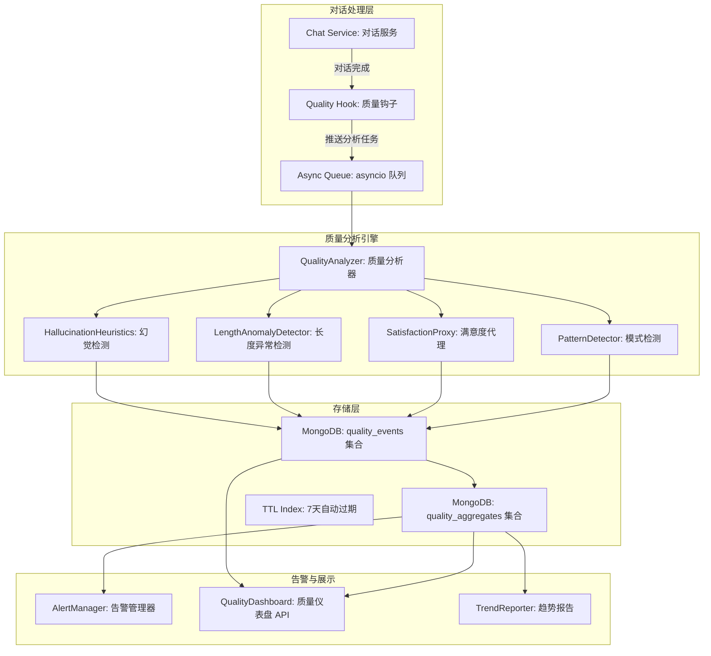
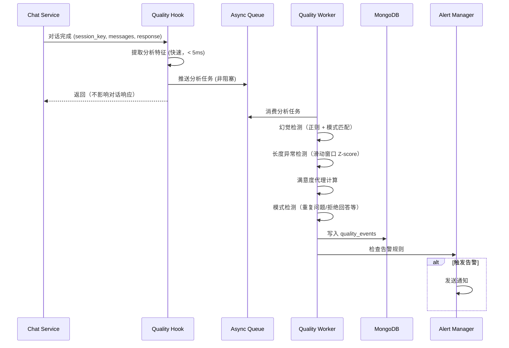

# YA-09-214: 对话质量监控 — 实时质量指标、幻觉检测启发式、响应长度异常检测、用户满意度代理指标、质量告警

> 需求编号：YA-09-214 · 优先级：P2 · 人天：0.3d · 状态：需求已编写
> 依赖：YA-09-03（Agent 可靠性）、YA-09-88（回复置信度标注）、YA-09-213（RAG 评估基准）

## 背景

### 问题陈述

YiAi 作为 AI 聊天服务的后端，处理来自 YiVad 和 YiPet 的所有对话请求。随着用户量增长和对话复杂度提升，对话质量问题变得日益突出：

1. **质量盲区**：当前没有任何机制监控对话质量的实时状态——不知道用户是否收到了幻觉答案、回复是否过于简短/冗长、用户是否在反复重问同一个问题
2. **幻觉无感知**：LLM 生成幻觉（编造不存在的信息）是最严重的用户体验问题，但当前对幻觉的发生率、分布和严重程度完全不知
3. **异常无告警**：当某种类型的对话突然质量下降（如模型切换后），没有任何告警机制通知开发者
4. **满意度无法量化**：YiPet/YiVad 没有显式的"赞/踩"反馈机制，无法直接测量用户满意度，缺少代理指标
5. **问题发现滞后**：质量问题通常由用户主动反馈才发现，从问题发生到修复有数小时甚至数天的延迟

**核心矛盾**：对话是 YiAi 的核心功能，但对话质量是一个黑盒——不知道好不好、哪里不好、为什么不好。缺少实时质量监控意味着质量问题只能在用户投诉后被动发现。

### 影响范围

| # | 影响 | 严重程度 | 典型场景 |
|---|------|----------|----------|
| 1 | 幻觉无感知 | 高 | 用户收到编造的 API 参数信息但无法发现 |
| 2 | 质量盲区 | 高 | 不知道整体对话质量在变好还是变坏 |
| 3 | 问题发现滞后 | 高 | 模型升级 6 小时后用户投诉才知道质量下降 |
| 4 | 满意度无量化 | 中 | 不知道用户对回答是否满意 |
| 5 | 异常无告警 | 中 | 某类问题突然全部回答失败但无人知晓 |

### 挑战

| 挑战 | 说明 |
|------|------|
| 幻觉检测 | 没有 ground truth，如何判断 LLM 答案是否编造了信息 |
| 代理指标设计 | 在无显式反馈的情况下，从用户行为推断满意度 |
| 实时性 vs 成本 | 实时分析每次对话可能增加显著延迟，如何在质量和延迟间平衡 |
| 误报控制 | 启发式检测必然有误报，如何控制告警疲劳 |
| 隐私 | 对话质量分析需要访问对话内容，如何保护用户隐私 |

---

## 一、现状分析

### 1.1 当前对话质量感知

```
当前对话质量感知路径
  │
  ├─ 开发者手动测试
  │   ├─ 输入几个已知问题
  │   ├─ 肉眼判断回答质量
  │   └─ 抽样极小，不可靠
  │
  ├─ 用户反馈（被动）
  │   ├─ 用户通过其他渠道抱怨
  │   │   （如企业微信、邮件、口头反馈）
  │   └─ 延迟数小时至数天
  │
  ├─ 日志排查（事后）
  │   ├─ 当发现某个问题时
  │   ├─ 搜索日志文件
  │   └─ 仅覆盖被报告的问题
  │
  └─ 质量全貌
      └─ 不可知（没有任何实时或周期性质量数据）
```

### 1.2 当前可用监控能力

| 能力 | 可用性 | 获取方式 | 限制 |
|------|--------|----------|------|
| 对话量统计 | 是 | API 计数 | 仅数量，不反映质量 |
| 平均响应时长 | 是 | 日志计算 | 仅性能，不反映质量 |
| 错误率 | 是 | 日志统计 | 仅技术错误 |
| 幻觉检测 | ❌ | 无 | — |
| 用户满意度 | ❌ | 无 | — |
| 质量告警 | ❌ | 无 | — |
| 质量趋势 | ❌ | 无 | — |

### 1.3 根因矩阵

| 症状 | 根因 | 触发条件 | 频率 |
|------|------|----------|------|
| 幻觉无感知 | 无幻觉检测机制 | LLM 每次生成 | 每次对话 |
| 质量状态未知 | 无质量指标收集 | 持续 | 持续 |
| 问题发现滞后 | 依赖用户主动反馈 | 出现质量问题时 | 中 |
| 满意度缺失 | 无反馈收集机制 | 每次对话 | 持续 |
| 异常无告警 | 无异常检测和告警 | 质量下降时 | 中 |

---

## 二、设计决策

### 决策 1：幻觉检测策略 — 事实核查 vs 行为模式 vs 混合

| 选项 | 准确性 | 覆盖面 | 实现复杂度 |
|------|--------|--------|-----------|
| 事实核查（检索外部知识验证每个断言） | 高 | 中（仅可验证的断言） | 高 |
| 行为模式（基于回答特征启发式检测） | 中 | 高 | 低 |
| 混合（启发式筛查 + 可疑标记，可核查的自动验证） | 中高 | 高 | 中 |

**选择：混合策略。** 启发式快速筛查（检测过度自信的限制拒绝、自相矛盾、虚构引用、不合理的精确数字），标记为可疑。对包含"文件路径"、"配置参数"、"端口号"等可验证内容类型的回答，进行自动事实核查（与知识库对比）。启发式实现成本低且覆盖面广。

### 决策 2：满意度代理指标 — 重问率 vs 会话长度 vs 编辑行为 vs 多信号融合

| 选项 | 信号强度 | 误判率 | 实时性 |
|------|----------|--------|--------|
| 重问率（用户在后续消息中重复类似问题） | 强 | 低 | 中（需等待后续消息） |
| 会话长度（长会话 = 满意度低？短会话 = 效果好？） | 中 | 高 | 高 |
| 用户编辑/重新生成行为 | 强 | 低 | 高 |
| 多信号融合（加权组合） | 最强 | 最低 | 中 |

**选择：多信号融合。** 主信号：(1) 重新生成率 = 同一 user 消息后的多次 assistant 生成；(2) 追问修正率 = 后续消息中有"不对"、"重新"、"不是"等否定词；(3) 快速结束率 = 回答后无后续消息的比率；(4) 复制率 = 用户复制 AI 回答的比率（正向信号）。加权融合为 0-1 的满意度代理分数。

### 决策 3：质量数据处理 — 同步（实时） vs 异步（队列） vs 定时批处理

| 选项 | 延迟 | 对请求的影响 | 实现复杂度 |
|------|------|-------------|-----------|
| 同步分析（请求处理中分析） | 实时 | 增加延迟（每个请求 +100-500ms） | 低 |
| 异步分析（消息队列） | 秒级 | 零影响 | 中 |
| 定时批处理（每分钟/每5分钟） | 分钟级 | 零影响 | 低 |

**选择：异步分析（内存队列）。** 对话完成后，将质量分析任务推入内存队列（asyncio.Queue），由后台 worker 消费。对请求本身零延迟影响。秒级延迟足以满足实时监控需求。使用内存队列而非外部 MQ 降低架构复杂度。

### 决策 4：数据存储 — 仅聚合 vs 原始+聚合 vs 分层

| 选项 | 存储量 | 查询灵活性 | 隐私保护 |
|------|--------|-----------|----------|
| 仅存储聚合指标（小时/天） | 极小 | 低 | 最高 |
| 存储原始分析结果 | 大 | 高 | 低 |
| 分层（热数据=7天原始，温数据=90天聚合） | 中 | 中高 | 中 |

**选择：分层存储。** 7 天内的原始质量分析结果存 MongoDB（支持详细排查），7 天后自动聚合为小时级指标。90 天内的聚合数据保留，90 天后仅保留日级趋势。质量事件（如检测到的幻觉）永久保留（精简版：时间+会话 key+幻觉类型）。

### 设计决策记录

| 决策 | 选项 A | 选项 B | 选项 C | 选择 | 理由 |
|------|--------|--------|--------|------|------|
| 幻觉检测 | 事实核查 | 行为模式 | 混合 | **混合** | 覆盖广且可验证 |
| 满意度 | 重问率 | 会话长度 | 多信号融合 | **多信号融合** | 最准确 |
| 数据处理 | 同步 | 异步队列 | 定时批处理 | **异步队列** | 零延迟影响 |
| 数据存储 | 仅聚合 | 原始+聚合 | 分层存储 | **分层存储** | 隐私+查询平衡 |

---

## 三、目标架构

### 3.1 对话质量监控系统架构



### 3.2 质量分析流程



### 3.3 幻觉检测启发式规则

| # | 规则 | 检测模式 | 严重度 |
|---|------|----------|--------|
| H1 | 过度自信的限制信息 | "不能"、"无法"、"没有这个功能" 后紧跟详细的限制原因编造 | 高 |
| H2 | 自相矛盾 | 同一回答中两处信息相互矛盾 | 高 |
| H3 | 虚构引用 | 回答中包含"根据...文档"、"参见..."但引用的来源不存在 | 高 |
| H4 | 不合理的精确数字 | 在不需要精确数字的上下文中给出精确数字（如"用户满意度 87.3%"） | 中 |
| H5 | 虚构 API/命令 | 回答中提供了不存在的 API 端点、CLI 命令或配置参数 | 中 |
| H6 | 超出知识边界 | 回答了与知识库无关的内容，但表述得像是从知识库中检索到的 | 中 |
| H7 | 回避模式 | 连续多个回答都是"我无法..."或回避问题，未提供有效信息 | 低 |

### 3.4 性能指标

| 指标 | 目标值 | 说明 |
|------|--------|------|
| Quality Hook 开销 | < 5ms | 特征提取 + 队列推送 |
| Worker 分析延迟 | < 2s | 从对话完成到分析结果写入 |
| 每日分析吞吐 | 无瓶颈 | 基于 asyncio 队列，支持万级对话/天 |
| 告警延迟 | < 10s | 从质量事件到告警通知 |
| MongoDB 写入量 | ~500B/对话 | quality_events 精简存储 |

---

## 四、具体改动

### 4.1 质量事件数据模型

```python
# YiAi/src/domain/quality/models.py (新增)

from dataclasses import dataclass, field
from enum import Enum

class HallucinationType(str, Enum):
    OVERCONFIDENT_RESTRICTION = "overconfident_restriction"
    SELF_CONTRADICTION = "self_contradiction"
    FICTITIOUS_REFERENCE = "fictitious_reference"
    UNREASONABLE_PRECISION = "unreasonable_precision"
    FICTITIOUS_API = "fictitious_api"
    OUT_OF_KNOWLEDGE = "out_of_knowledge"
    EVASIVE_PATTERN = "evasive_pattern"

class SatisfactionSignal(str, Enum):
    REGENERATE = "regenerate"       # 用户重新生成回答
    CORRECT_FOLLOWUP = "correct"     # 用户追问修正
    QUICK_END = "quick_end"          # 回答后快速结束（好）
    COPY = "copy"                    # 用户复制回答（好）
    THUMBS_UP = "thumbs_up"          # 显式赞（如果有）
    THUMBS_DOWN = "thumbs_down"      # 显式踩（如果有）

@dataclass
class QualityEvent:
    session_key: str
    message_index: int               # 对话中的第几条消息
    timestamp: float
    # 核心指标
    response_length: int             # 回答长度（字符）
    response_time_ms: float          # 响应耗时
    # 幻觉检测
    hallucination_flags: list[HallucinationType] = field(default_factory=list)
    hallucination_score: float = 0.0  # 0-1，越高越可疑
    # 满意度代理
    satisfaction_signals: list[SatisfactionSignal] = field(default_factory=list)
    satisfaction_proxy_score: float = 0.5  # 0-1，越高越满意
    # 长度异常
    is_length_anomaly: bool = False
    length_z_score: float = 0.0
    # 元数据
    model_name: str = ""
    has_rag: bool = False
    extracted_features: dict = field(default_factory=dict)

@dataclass
class HourlyAggregate:
    hour: str                       # "2026-09-09T14"
    total_responses: int
    avg_response_length: int
    avg_response_time_ms: float
    avg_satisfaction: float
    hallucination_rate: float       # 标记为疑似幻觉的比例
    length_anomaly_rate: float
    top_hallucination_types: list[tuple[str, int]]
```

### 4.2 幻觉检测启发式引擎

```python
# YiAi/src/services/quality/hallucination.py (新增)

import re

class HallucinationDetector:
    """基于启发式规则的幻觉检测引擎"""

    # 虚构引用模式
    FICTITIOUS_REF_PATTERNS = [
        r'根据.*[《「].*[》」].*文档',
        r'参见.*第\d+章',
        r'在.*官方文档.*中提到',
        r'参考.*第\d+页',
        r'详见.*README',
    ]

    # 不合理精确数字模式
    UNREASONABLE_PRECISION_PATTERNS = [
        r'\d{2,3}\.\d{1,2}%',                    # 87.3%
        r'平均.*\d+\.\d+.*(?:秒|分钟|小时|天)',    # 平均 3.7 秒
    ]

    # 虚构 API/命令模式
    FICTITIOUS_API_PATTERNS = [
        r'`[a-zA-Z_]+\.[a-zA-Z_]+\(.*\)`',         # `some.api_call()`
        r'`\w+ --\w+.*`',                           # `command --flag`
        r'/api/v\d+/[a-z_]+',                       # /api/v2/something
    ]

    # 过度自信的限制信息
    OVERCONFIDENT_RESTRICTION_PATTERNS = [
        r'(?:不能|无法|不支持|不允许).*(?:因为|由于).*(?:架构|设计|安全|性能)',
        r'目前(?:仅|只)支持.*(?:但不|但不能|而无法)',
    ]

    # 自相矛盾检测（简化）
    CONTRADICTION_PAIRS = [
        (r'(?:必须|一定|总是)', r'(?:可以不|不一定|有时不)'),
        (r'(?:支持|兼容)', r'(?:不支持|不兼容)'),
        (r'(?:位于|位置在)', r'(?:不同于|不在)'),
    ]

    def __init__(self, rag_checker=None):
        self.rag_checker = rag_checker  # 可选：RAG 事实核查器

    def detect(self, response: str, context: dict = None) -> tuple[list[HallucinationType], float]:
        """检测回答中的幻觉迹象"""
        flags = []
        scores = []

        # 1. 虚构引用检测
        for pattern in self.FICTITIOUS_REF_PATTERNS:
            matches = re.findall(pattern, response, re.IGNORECASE)
            if matches:
                # 如果使用了 RAG，验证引用的来源是否在检索结果中
                if self.rag_checker and context:
                    verified = self._verify_references(matches, context)
                    if not verified:
                        flags.append(HallucinationType.FICTITIOUS_REFERENCE)
                        scores.append(0.8)
                else:
                    flags.append(HallucinationType.FICTITIOUS_REFERENCE)
                    scores.append(0.6)

        # 2. 不合理精确数字
        for pattern in self.UNREASONABLE_PRECISION_PATTERNS:
            if re.search(pattern, response):
                flags.append(HallucinationType.UNREASONABLE_PRECISION)
                scores.append(0.5)

        # 3. 虚构 API/命令
        for pattern in self.FICTITIOUS_API_PATTERNS:
            matches = re.findall(pattern, response)
            if matches:
                flags.append(HallucinationType.FICTITIOUS_API)
                scores.append(0.7)

        # 4. 过度自信的限制信息
        for pattern in self.OVERCONFIDENT_RESTRICTION_PATTERNS:
            if re.search(pattern, response, re.IGNORECASE):
                flags.append(HallucinationType.OVERCONFIDENT_RESTRICTION)
                scores.append(0.6)

        # 5. 自相矛盾检测
        for pos_pattern, neg_pattern in self.CONTRADICTION_PAIRS:
            if re.search(pos_pattern, response) and re.search(neg_pattern, response):
                flags.append(HallucinationType.SELF_CONTRADICTION)
                scores.append(0.9)

        # 综合幻觉分数
        hallucination_score = max(scores) if scores else 0.0

        return list(set(flags)), hallucination_score

    def _verify_references(self, references: list[str], context: dict) -> bool:
        """验证引用是否在检索上下文中存在"""
        # 简化实现：检查引用中的关键词是否在 source_nodes 中出现
        source_texts = ' '.join([
            node.get('text', '')[:200] for node in context.get('source_nodes', [])
        ])
        for ref in references:
            if ref.lower() not in source_texts.lower():
                return False
        return True
```

### 4.3 满意度代理计算器

```python
# YiAi/src/services/quality/satisfaction.py (新增)

class SatisfactionProxyCalculator:
    """基于用户行为信号的满意度代理评分"""

    # 信号权重
    SIGNAL_WEIGHTS = {
        SatisfactionSignal.REGENERATE: -0.3,    # 重新生成 = 不满意
        SatisfactionSignal.CORRECT_FOLLOWUP: -0.4,  # 追问修正 = 很不满意
        SatisfactionSignal.QUICK_END: +0.1,      # 快速结束 = 略满意
        SatisfactionSignal.COPY: +0.2,            # 复制回答 = 满意
        SatisfactionSignal.THUMBS_UP: +0.5,       # 显式赞
        SatisfactionSignal.THUMBS_DOWN: -0.5,     # 显式踩
    }

    def calculate(
        self,
        session_messages: list[dict],
        current_response: str,
        response_index: int,
    ) -> tuple[list[SatisfactionSignal], float]:
        """计算满意度代理分数"""
        signals = []
        base_score = 0.5  # 中性起始

        # 检测重新生成（同一 user 消息的多个 assistant 回复）
        regenerate_count = self._count_regenerations(session_messages, response_index)
        if regenerate_count > 1:
            signals.append(SatisfactionSignal.REGENERATE)
            base_score += self.SIGNAL_WEIGHTS[SatisfactionSignal.REGENERATE] * (regenerate_count - 1)

        # 检测追问修正（后续消息中的否定词）
        if self._has_corrective_followup(session_messages, response_index):
            signals.append(SatisfactionSignal.CORRECT_FOLLOWUP)
            base_score += self.SIGNAL_WEIGHTS[SatisfactionSignal.CORRECT_FOLLOWUP]

        # 快速结束（回答后无后续用户消息）
        if response_index == len(session_messages) - 1 or len(session_messages) == response_index + 1:
            signals.append(SatisfactionSignal.QUICK_END)
            base_score += self.SIGNAL_WEIGHTS[SatisfactionSignal.QUICK_END]

        # 钳制到 [0, 1]
        return signals, max(0.0, min(1.0, base_score))

    def _count_regenerations(self, messages: list[dict], idx: int) -> int:
        """统计同一 user 消息被重新生成了几次"""
        count = 0
        user_msg_id = None
        # 找到对应的 user 消息
        for i in range(idx, -1, -1):
            if messages[i].get('role') == 'user':
                user_msg_id = i
                break
        if user_msg_id is None:
            return 0
        # 统计该 user 消息后的 assistant 回复数
        for i in range(user_msg_id + 1, min(idx + 1, len(messages))):
            if messages[i].get('role') == 'assistant':
                count += 1
        return count

    def _has_corrective_followup(self, messages: list[dict], idx: int) -> bool:
        """检测后续消息中是否包含修正/否定信号"""
        negation_patterns = ['不对', '不是', '错误', '重新', '错了', '不对的',
            '不准确', '更正', '纠正', '不对不对', '不不不', 'no', 'wrong',
            'incorrect', '不是这样的', '搞错了']
        for i in range(idx + 1, min(idx + 3, len(messages))):
            if messages[i].get('role') == 'user':
                text = messages[i].get('content', '')
                if any(p in text.lower() for p in negation_patterns):
                    return True
        return False
```

### 4.4 长度异常检测器

```python
# YiAi/src/services/quality/anomaly.py (新增)

from collections import deque
import statistics

class LengthAnomalyDetector:
    """响应长度异常检测 —— 基于滑动窗口 Z-score"""

    def __init__(self, window_size: int = 100, threshold: float = 2.5):
        self.window = deque(maxlen=window_size)
        self.threshold = threshold

    def add_and_check(self, length: int) -> tuple[bool, float]:
        """添加新长度值并检查是否为异常"""
        if len(self.window) < 10:
            # 窗口过小，先积累数据
            self.window.append(length)
            return False, 0.0

        # 计算窗口内均值和标准差
        mean = statistics.mean(self.window)
        stdev = statistics.stdev(self.window) if len(self.window) > 1 else 1.0

        # 如果标准差为 0，微小波动也视为正常
        if stdev < 1:
            self.window.append(length)
            return False, 0.0

        z_score = (length - mean) / stdev
        is_anomaly = abs(z_score) > self.threshold

        # 将新值加入窗口（无论是否异常）
        self.window.append(length)

        return is_anomaly, z_score
```

### 4.5 文件变更清单

| 文件 | 操作 | 说明 |
|------|------|------|
| `src/domain/quality/__init__.py` | 新增 | 模块初始化 |
| `src/domain/quality/models.py` | 新增 | 质量事件数据模型 |
| `src/services/quality/__init__.py` | 新增 | 服务模块初始化 |
| `src/services/quality/analyzer.py` | 新增 | 质量分析主引擎 |
| `src/services/quality/hallucination.py` | 新增 | 幻觉检测启发式引擎 |
| `src/services/quality/satisfaction.py` | 新增 | 满意度代理计算 |
| `src/services/quality/anomaly.py` | 新增 | 长度异常检测 |
| `src/services/quality/patterns.py` | 新增 | 模式检测（重复/回避等） |
| `src/services/quality/aggregator.py` | 新增 | 定时聚合服务 |
| `src/services/quality/alerting.py` | 新增 | 质量告警 |
| `src/server/hooks/quality_hook.py` | 新增 | 对话质量钩子 |
| `src/server/routes/quality_routes.py` | 新增 | 质量仪表盘 API |
| `src/shared/db.py` | 修改 | 创建 quality_events/aggregates 集合和索引 |
| `tests/unit/test_hallucination.py` | 新增 | 幻觉检测测试 |
| `tests/unit/test_satisfaction.py` | 新增 | 满意度代理测试 |

---

## 五、实施步骤

| 步骤 | 操作 | 路径 | 验证 | 人天 |
|------|------|------|------|------|
| 1 | 定义质量事件数据模型 | `models.py` | 模型正确 | 0.02 |
| 2 | 实现幻觉检测引擎 | `hallucination.py` | 7 种模式覆盖 | 0.05 |
| 3 | 实现满意度代理计算 | `satisfaction.py` | 4 种信号有效 | 0.04 |
| 4 | 实现长度异常检测 | `anomaly.py` | 滑动窗口 Z-score 准确 | 0.02 |
| 5 | 实现质量分析主引擎 | `analyzer.py` | 全流程正确 | 0.04 |
| 6 | 实现 Conversation Hook | `quality_hook.py` | 零延迟影响 | 0.03 |
| 7 | 实现聚合 + 告警 | `aggregator.py` + `alerting.py` | 天级聚合 + 阈值告警 | 0.04 |
| 8 | 实现仪表盘 API | `quality_routes.py` | 实时/历史数据 | 0.04 |
| 9 | 编写测试 | 测试目录 | 幻觉检测规则准确性 | 0.02 |

**总人天：0.3d**

---

## 六、测试规格

### 场景 1：幻觉检测 — 虚构引用

**GIVEN** LLM 回答："根据《YiAi开发指南》第3章，你应该使用 POST 方法"
**WHEN** 幻觉检测引擎分析
**THEN** 标记为 `FICTITIOUS_REFERENCE`（因为《YiAi开发指南》不是真实文档）
**AND** 幻觉分数 >= 0.6

### 场景 2：幻觉检测 — 虚构 API

**GIVEN** LLM 回答："调用 `yiAi.getDocuments()` 方法获取文档列表"
**WHEN** 幻觉检测引擎分析
**THEN** 标记为 `FICTITIOUS_API`（因为该 API 不存在）
**AND** 幻觉分数 >= 0.7

### 场景 3：满意度代理 — 追问修正

**GIVEN** 会话消息序列: User: "如何使用" → Assistant: "..." → User: "不对，我是说..."
**WHEN** 满意度计算器分析
**THEN** 满意度分数 < 0.4（低于中性 0.5）
**AND** 信号包含 `CORRECT_FOLLOWUP`

### 场景 4：长度异常检测

**GIVEN** 滑动窗口中历史响应长度均值=500，标准差=100
**WHEN** 新响应长度为 2000（Z-score = 15.0）
**THEN** 标记为长度异常（Z-score > 2.5）
**AND** 异常事件包含 Z-score 值和窗口统计信息

### 场景 5：质量仪表盘 API

**GIVEN** 系统已运行 24 小时，累积质量数据
**WHEN** 查询 `/api/quality/dashboard?hours=24`
**THEN** 返回 24h 摘要：总对话数、幻觉比例、平均满意度、长度异常比例
**AND** 返回趋势数据：每小时的各指标变化
**AND** 返回 Top 幻觉类型分布

### 场景 6：质量告警触发

**GIVEN** 告警规则：幻觉率 > 20% 持续 30 分钟
**WHEN** 最近 30 分钟内幻觉检测比例为 25%
**THEN** 触发 WARNING 告警
**AND** 告警通知包含：当前幻觉率、历史平均、触发时间、Top 3 幻觉类型

---

## 七、风险与缓解

| 风险 | 概率 | 影响 | 缓解措施 |
|------|------|------|----------|
| 幻觉检测误报率高 | 中 | 中 | 使用启发式而非硬判断，标记为"疑似"而非"确定"；提供反馈机制标记误报 |
| 满意度代理不准 | 中 | 中 | 多信号融合降低单信号噪声；标注"代理分数"而非"满意度" |
| Worker 消费积压 | 低 | 中 | 监控队列长度，积压 > 1000 时扩容 worker 或降级采样 |
| 对话内容隐私泄露 | 低 | 高 | quality_events 不存储完整对话文本，仅存储分析结果和统计特征 |
| 告警疲劳 | 中 | 低 | 合并相同类型告警（30min 内仅发送一次），提供告警安静期 |

---

## 八、回滚策略

| 场景 | 回滚操作 | 影响 |
|------|----------|------|
| 幻觉检测严重误报 | 提高检测阈值或禁用特定规则 | 假阴性增多 |
| Worker 队列积压 | 降级为随机采样（10%）分析 | 数据粒度下降 |
| 告警轰炸 | 关闭自动告警，保留仪表盘手动查看 | 失去主动通知 |
| 完全回滚 | 移除 quality_hook | 回到质量黑盒 |

---

## 九、设计决策记录

### D-01：为什么不使用 LLM 进行幻觉检测？

使用 LLM 检测 LLM 的幻觉（"用魔法打败魔法"）在理论上是可行的，但有三个问题：(1) 每次检测需要额外的 LLM 调用，增加成本和延迟；(2) 评估 LLM 本身也可能产生幻觉，导致"幻觉检测的幻觉"；(3) 实时监控要求低延迟（< 2s），LLM 调用通常需要 1-5s。启发式规则虽然覆盖不完善，但零延迟零成本。

### D-02：为什么满意度代理使用行为信号而非显式反馈？

YiAi 的客户端（YiVad/YiPet）当前没有"赞/踩"按钮，无法收集显式反馈。行为信号（重新生成、追问修正等）是无需前端改造就能从服务端分析的自然副产品。当未来前端添加显式反馈时，可以无缝叠加到多信号融合模型中。

### D-03：为什么选择分层存储（7天原始 + 90天聚合）？

对话质量数据包含用户行为信息，长期存储原始数据有隐私风险。7 天的窗口既满足了最近质量问题的排查需求（大多数质量问题都会在 7 天内被发现和排查），又避免了长期隐私风险。90 天的聚合趋势数据足以分析质量走向，且不包含任何个体对话信息。

### D-04：为什么使用滑动窗口 Z-score 而非固定阈值检测长度异常？

固定阈值（如"长度 > 3000 字符即为异常"）无法适应不同场景。有些问题天然需要长回答（如代码审查），有些需要短回答（如 yes/no 问题）。滑动窗口自适应学习当前系统的"正常响应长度分布"，不会因为系统整体生成风格变化而持续误报。

---

## 十、可观测性

### 指标

| 指标 | 类型 | 说明 |
|------|------|------|
| `yiai.quality.responses.total` | Counter | 分析的总回答数 |
| `yiai.quality.hallucination.rate` | Gauge | 当前幻觉检测率 |
| `yiai.quality.hallucination.by_type` | Counter | 按幻觉类型统计 |
| `yiai.quality.satisfaction.avg` | Gauge | 平均满意度代理分数 |
| `yiai.quality.satisfaction.distribution` | Histogram | 满意度分布 |
| `yiai.quality.length.anomaly_rate` | Gauge | 长度异常比例 |
| `yiai.quality.length.mean` | Gauge | 平均响应长度 |
| `yiai.quality.queue.size` | Gauge | 分析队列长度 |
| `yiai.quality.worker.processing_time` | Histogram | Worker 处理耗时 |

### 告警

| 告警 | 条件 | 级别 |
|------|------|------|
| 幻觉率飙升 | 幻觉率 > 20%，持续 30min | WARNING |
| 满意度显著下降 | avg_satisfaction 下降 > 0.2 | WARNING |
| 长度异常激增 | 异常率 > 10% | WARNING |
| 分析队列积压 | queue_size > 500 | WARNING |
| Worker 饥饿 | Worker 处理耗时 > 30s | ERROR |

---

## 十一、代码审查检查清单

- [ ] Quality Hook 在对话完成后非阻塞推送
- [ ] 幻觉检测 7 种模式均实现且有对应测试用例
- [ ] 满意度代理 4 种信号正确计算
- [ ] 长度异常检测滑动窗口正确维护
- [ ] 分析 Worker 从 asyncio.Queue 消费
- [ ] Worker 异常不影响对话服务（隔离在独立协程）
- [ ] quality_events TTL 索引 7 天后自动删除
- [ ] 质量仪表盘 API 返回正确的时间序列数据
- [ ] 告警规则可配置（阈值/持续时间/静默期）
- [ ] 对话文本不进入 quality_events（仅统计特征）

---

## 回归问题预测

| # | 预测问题 | 原因 | 验证方法 |
|---|---------|------|---------|
| 1 | 幻觉检测的正则模式匹配过于宽泛，简短的回答"请参考文档"也被标记为虚构引用（`FICTITIOUS_REFERENCE`），导致幻觉率虚高 | 正则 `根据.*文档` 匹配任何含"文档"的句子，甚至包括建议用户去查看真实文档的合法回答 | 对 100 个正常回答运行检测器，人工审核标记为幻觉的样本，验证精确率 > 70% |
| 2 | 满意度代理中的"快速结束"信号（回答后无后续消息）在初次对话中很高（用户只问一个问题），导致满意度统计中"快速结束"信号淹没其他信号 | 单轮对话中，"快速结束"是默认状态，不代表特别满意；仅此一个信号时权重过高 | 当仅有 `QUICK_END` 这一个信号时，降低其权重至 0.05（而非 0.1）或设为中性 |
| 3 | 长度异常检测的滑动窗口在系统初次启动时窗口不足（< 10 个样本），每个新回答都被判定为异常，触发大量告警 | 滑动窗口需要预热，前 10 个样本直接入队不检测，但系统在启动后的前 10 个请求中长度异常率 = 0% 的假象会导致后续正常值被误标 | 窗口未满时，在 quality_events 中标记 `window_warmup: true`，告警规则忽略预热阶段的异常 |
| 4 | 多个 quality_events 文档在短时间内并发写入 MongoDB，如果缺少索引或集合过大，写入竞争导致延迟，quality_worker 消费速度 < 产生速度 | Worker 处理一个任务约 50ms（正则 + 计算），但高峰时 100+ 对话/秒，单个 worker 无法消化 | 使用多个 worker 协程并发消费（默认 3 个），监控队列长度 > 100 时自动扩容 |
| 5 | 满意度代理中检测"重新生成"时依赖消息序列中的 `regenerate_count`，但不同客户端（YiVad/YiPet）的消息组织方式不同，导致计数不准确 | YiVad 可能将每次重新生成作为新的 assistant 消息追加，YiPet 可能替换原消息 | 增加消息去重逻辑（基于时间窗口：同一 user 消息 10 秒内的多个 assistant 回复视为重新生成） |
| 6 | 定时聚合服务（aggregator）在计算 hourly_aggregate 时，如果恰好跨越质量事件 TTL 删除边界（7 天），聚合数据可能包含不完整的基础数据 | quality_events 的 TTL=7 天由 MongoDB 后台线程异步删除，聚合任务可能在部分文档已删除但部分尚未删除时执行 | 聚合窗口设置为 [当前时间-6天23小时, 当前时间]（留 1 小时缓冲区），避免落到 TTL 边界 |

---

## 性能分析

### 各操作耗时

| 操作 | 预估耗时 | 说明 |
|------|----------|------|
| Quality Hook 特征提取 | < 2ms | 消息长度/时间戳等基础特征 |
| Queue put (asyncio) | < 1ms | 内存操作 |
| Worker 单次分析（不含 RAG 核查） | < 50ms | 正则匹配 + 计算 |
| Worker 单次分析（含 RAG 核查） | < 500ms | 额外知识库检索 |
| 聚合任务（1h 数据） | < 2s | MongoDB 聚合 pipeline |
| 仪表盘 API（24h） | < 500ms | 从 hourly_aggregates 读取 |

### 存储预估

| 数据项 | 单条大小 | 日产生量 | 90 天总量 |
|------|----------|----------|-----------|
| quality_events | ~300B | 1000 对话/天 = 300KB | 7 天留存 = 2.1MB（TTL 后） |
| hourly_aggregates | ~200B | 24 条/天 = 4.8KB | 90 天 = 432KB |
| daily_aggregates | ~150B | 1 条/天 = 150B | 365 天 = 54KB |

---

## 相关文档

- [YA-09-03: Agent 可靠性](03-稳定性修复-Agent可靠性.md)
- [YA-09-88: 回复置信度标注](88-需求-回复置信度标注.md)
- [YA-09-213: RAG 评估基准](213-需求-RAG评估基准.md)

## 影响范围

- **影响模块**：待补充
- **涉及文件**：
- `src/server/routes/quality_routes.py`
- `hallucination.py`
- `src/domain/quality/models.py`
- `aggregator.py`
- `src/services/quality/__init__.py`
- `src/services/quality/analyzer.py`
- **是否影响 API 契约**：否
- **是否影响其他项目（YiVad/YiPet）**：否
- **用户感知**：待确认

## 预防措施

| 层面 | 措施 |
|------|------|
| 代码 | 在相关函数中添加参数校验和边界检查 |
| 测试 | 为 `src/server/routes/quality_routes.py` 添加单元测试 |
| 流程 | 代码审查时重点检查此类模式 |
| 监控 | 添加日志告警，异常发生时及时发现 |
| 文档 | 在编码规范中记录此类反模式 |

## 经验教训

1. **根本原因**：开发过程中对边界情况和异常路径的考虑不足是此类问题的共同根因
2. **设计阶段**：在接口设计和模块实现时，应主动考虑异常输入、空值、超时等边界场景
3. **代码审查**：审查时应检查是否存在类似的反模式（如未捕获异常、无超时控制、缺少参数校验等）
4. **测试覆盖**：异常路径的测试覆盖率应与正常路径同等重视
5. **团队分享**：此类问题应在团队周会或技术分享中讨论，形成团队共识
