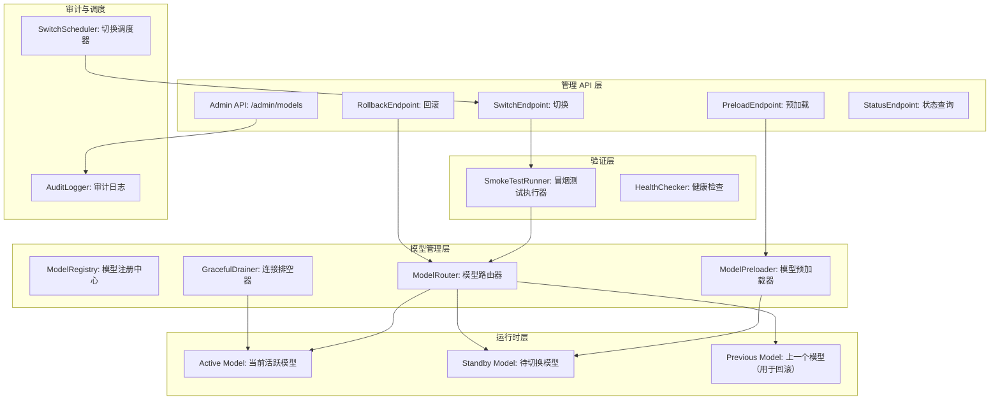
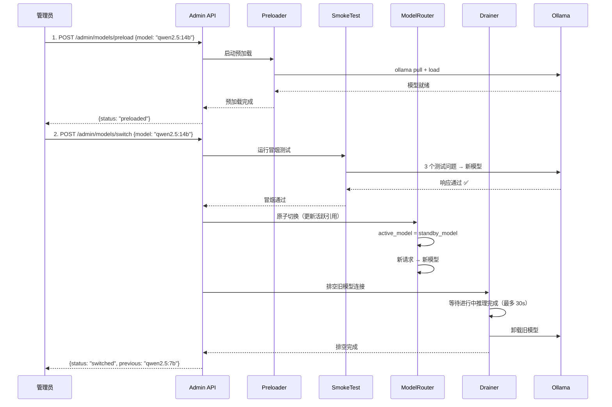
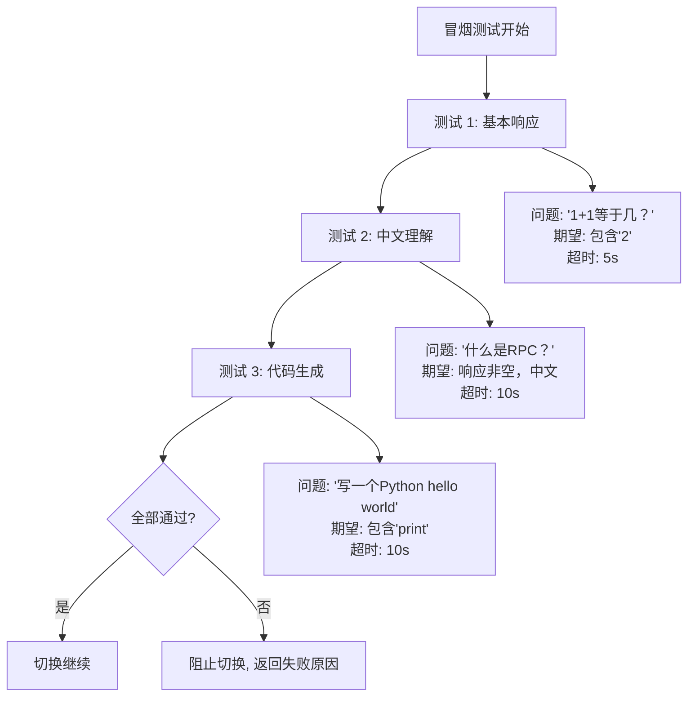

# YA-09-215: 模型热切换 — 无需重启服务切换LLM模型、模型预加载、原子切换与连接排空、回滚能力、定时切换、切换A/B验证、切换审计日志

> 需求编号：YA-09-215 · 优先级：P2 · 人天：0.3d · 状态：需求已编写
> 依赖：YA-09-11（ModelRuntime 抽象层）、YA-09-76（LLM 并发调度优化）、YA-09-166（模型注册与版本管理）

## 背景

### 问题陈述

YiAi 当前切换 LLM 模型（如从 `qwen2.5:7b` 切换到 `qwen2.5:14b`）需要停机操作，流程为：停止服务 → 修改配置文件 → 启动服务 → 等待新模型加载（Ollama pull + load，可能 30-120 秒）。这带来以下问题：

1. **服务中断**：切换模型导致数十秒到数分钟的服务不可用，所有正在进行的对话被强制中断
2. **切换恐惧**：运维人员因为担心影响用户而不愿在高峰时段切换模型，导致模型优化滞后
3. **回滚困难**：切换到新模型后如果发现质量问题（性能退化、幻觉增多），回滚需要再次中断服务
4. **无验证窗口**：切换后无机制验证新模型是否正常工作，只能等用户反馈才发现问题
5. **批量切换无自动化**：在多个模型实例间按计划切换（如白天用小模型节省资源、晚上用大模型处理复杂任务）完全不能实现
6. **无审计记录**：谁在什么时候切换了什么模型？为什么切换？没有记录可追踪

**核心矛盾**：模型切换是 LLM 运维的常见操作（模型升级、A/B 测试、资源调度），但当前流程需要服务中断，限制了运维灵活性和服务质量。

### 影响范围

| # | 影响 | 严重程度 | 典型场景 |
|---|------|----------|----------|
| 1 | 服务中断 | 高 | 用户对话在模型切换时全部失败 |
| 2 | 切换操作延迟 | 高 | 发现模型质量问题时犹豫是否立即切换 |
| 3 | 回滚代价高 | 高 | 新模型出问题后回滚需要再次停机 |
| 4 | 无法定时切换 | 中 | 无法实现白天/夜间不同模型的调度 |
| 5 | 无审计追溯 | 中 | 不知道历史切换记录 |

### 挑战

| 挑战 | 说明 |
|------|------|
| 预加载协调 | 新模型需要在 Ollama 中预热（加载到 GPU 内存），但不能在预热期间接受请求 |
| 原子切换 | 所有新的推理请求必须原子性地切换到新模型，不能出现一部分用旧模型、一部分用新模型的情况 |
| 连接排空 | 切换前正在进行的推理请求如何处理？必须允许它们在新模型上完成还是等它们完成？ |
| 双模型资源管理 | 短时间内同时持有两个模型的 GPU 内存（切换窗口），可能超出 GPU 显存限制 |
| 切换验证 | 如何在新模型投入生产前快速验证其基本功能？ |

---

## 一、现状分析

### 1.1 当前模型切换流程

```
当前模型切换流程
  │
  ├─ 步骤 1: 通知用户"即将维护"（如果做的话）
  │   └─ 多数情况跳过此步
  │
  ├─ 步骤 2: 停止 YiAi 服务
  │   ├─ kill python main.py 进程
  │   └─ 所有活跃连接强制断开
  │
  ├─ 步骤 3: 修改配置
  │   ├─ 编辑 .env 或 config.py
  │   └─ 更改 DEFAULT_MODEL 值
  │
  ├─ 步骤 4: 拉取/确认新模型
  │   ├─ ollama pull qwen2.5:14b（如果未安装）
  │   └─ 耗时 30-120 秒
  │
  ├─ 步骤 5: 启动服务
  │   ├─ python main.py
  │   └─ 首次请求触发模型 load（+5-15 秒）
  │
  └─ 总停机时间: 1-3 分钟
      │
      └─ 如果回滚: 再重复步骤 2-5
```

### 1.2 当前可用能力

| 能力 | 可用性 | 获取方式 | 限制 |
|------|--------|----------|------|
| 切换模型 | ⚠️ | 修改配置 + 重启 | 必须停机 |
| 预加载模型 | ❌ | 无 | — |
| 连接排空 | ❌ | 无 | 重启时所有连接断开 |
| 回滚 | ❌ | 再次重启 | 同停机 |
| 切换验证 | ❌ | 无 | — |
| 审计日志 | ❌ | 无 | — |

### 1.3 根因矩阵

| 症状 | 根因 | 触发条件 | 频率 |
|------|------|----------|------|
| 服务中断 | 模型配置在启动时读取，不可运行时修改 | 每次切换 | 中 |
| 切换犹豫 | 中断影响用户，且无验证 | 模型质量下降时 | 中 |
| 回滚代价高 | 回滚 = 再次中断 | 新模型出问题时 | 低 |
| 无定时切换 | 无切换调度能力 | — | 持续 |
| 无审计 | 切换操作未被记录 | 出问题排查时 | 低 |

---

## 二、设计决策

### 决策 1：模型切换方式 — 重启式 vs 配置热加载 vs 模型路由层

| 选项 | 服务中断 | GPU 资源 | 实现复杂度 |
|------|----------|----------|-----------|
| 重启式（当前） | 是（1-3 分钟） | 单模型 | 低 |
| 配置热加载（watch 文件 + 信号） | 否 | 需要卸载旧模型 | 中 |
| 模型路由层（ModelRuntime 抽象） | 否 | 双模型共存（需 >2x 显存） | 高 |

**选择：模型路由层（基于 ModelRuntime 抽象）。** 在已有 YA-09-11 ModelRuntime 抽象层的基础上，增加模型的动态注册和切换能力。ModelRouter 维护一个当前活跃模型引用，切换时原子更新引用。核心前提：GPU 显存足够同时加载两个模型（或支持 CPU offload 降级）。

### 决策 2：连接排空策略 — 硬切换 vs 优雅排空 vs 排空 + 超时

| 选项 | 用户影响 | 切换速度 | 实现复杂度 |
|------|----------|----------|-----------|
| 硬切换（立即切换到新模型，中断进行中的推理） | 高 | 即时 | 低 |
| 优雅排空（等所有进行中推理完成后切换） | 低 | 不确定（可能永久等待） | 中 |
| 排空 + 超时（等最多 N 秒后强制切换） | 中 | N 秒内 | 中 |

**选择：排空 + 超时（默认 30 秒）。** 切换指令下发后：(1) 新请求立即路由到新模型；(2) 旧模型上的进行中推理允许完成（最多 30 秒）；(3) 30 秒后仍未完成的推理被取消（返回 503 并告知正在切换）；(4) 所有旧推理完成后卸载旧模型。

### 决策 3：预加载时机 — 切换时加载 vs 提前预加载 vs 按需加载

| 选项 | 切换延迟 | 资源占用 | 适用场景 |
|------|----------|----------|----------|
| 切换时加载 | 5-120s | 低 | GPU 显存紧张 |
| 提前预加载（闲置时后台加载） | < 1s（仅路由切换） | 高（双模型） | GPU 显存充足 |
| 按需加载（自动检测） | 0-120s | 自动 | 自适应 |

**选择：显式预加载 + 可选自动预加载。** 管理员通过 API 提前发出预加载指令 `POST /admin/models/preload`，系统在后台拉取并加载模型到 GPU。管理员可以在确认预加载完成后执行切换（< 1s）。也支持未预加载时直接切换（切换时加载，有延迟）。

### 决策 4：切换验证方式 — 无验证 vs 快速冒烟测试 vs 影子流量验证

| 选项 | 风险 | 实现复杂度 | 验证速度 |
|------|------|-----------|----------|
| 无验证（直接全量切换） | 高（新模型可能完全不可用） | 低 | — |
| 快速冒烟测试（自动发送 3-5 个测试问题） | 中 | 低 | < 10s |
| 影子流量（复制 1% 流量到新模型，对比但不返回给用户） | 低 | 高 | 分钟级 |

**选择：快速冒烟测试（MVP），影子流量作为后续功能。** 切换前自动向新模型发送 3 个预定义的冒烟测试问题，检查：(1) 响应格式正确；(2) 不返回空内容；(3) 响应时间在阈值内；(4) 不含明显的错误/乱码。冒烟通过后自动切换，失败时阻止切换并告警。

### 设计决策记录

| 决策 | 选项 A | 选项 B | 选项 C | 选择 | 理由 |
|------|--------|--------|--------|------|------|
| 切换方式 | 重启式 | 热加载 | 路由层 | **路由层** | 基于已有抽象 |
| 连接排空 | 硬切换 | 优雅排空 | 排空+超时 | **排空+超时** | 平衡体验与确定性 |
| 预加载 | 切换时加载 | 提前预加载 | 按需 | **显式预加载** | 管理员可控 |
| 切换验证 | 无验证 | 冒烟测试 | 影子流量 | **冒烟测试** | MVP 快速验证 |

---

## 三、目标架构

### 3.1 模型热切换系统架构



### 3.2 切换时序流程



### 3.3 冒烟测试规格



### 3.4 性能指标

| 指标 | 目标值 | 说明 |
|------|--------|------|
| 切换延迟（已预加载） | < 5s | 冒烟测试（3 题） + 路由更新 |
| 切换延迟（未预加载） | 30-120s | 依赖 Ollama pull 速度 |
| 预加载耗时 | 30-120s | 可在后台执行 |
| 排空最大等待 | 30s | 可配置 |
| 路由更新原子性 | < 1ms | Python 引用赋值是原子的 |
| 冒烟测试耗时 | < 10s | 3 个问题 × ~3s each |

---

## 四、具体改动

### 4.1 模型注册中心

```python
# YiAi/src/services/model/hotswap/registry.py (新增)

from dataclasses import dataclass, field
from enum import Enum
from typing import Optional
import asyncio

class ModelState(str, Enum):
    UNKNOWN = "unknown"
    LOADING = "loading"        # 正在从 Ollama 拉取
    LOADED = "loaded"          # 已加载到 GPU，未激活
    ACTIVE = "active"           # 当前服务中的模型
    DRAINING = "draining"       # 正在排空
    UNLOADED = "unloaded"

@dataclass
class ModelInstance:
    name: str                   # 模型名称，如 "qwen2.5:7b"
    state: ModelState = ModelState.UNKNOWN
    loaded_at: Optional[float] = None
    activated_at: Optional[float] = None
    request_count: int = 0
    error_count: int = 0
    avg_latency_ms: float = 0.0

class ModelRegistry:
    """模型注册中心 —— 管理所有已知模型的实例"""

    def __init__(self, ollama_client, config):
        self.ollama = ollama_client
        self.config = config
        self.instances: dict[str, ModelInstance] = {}
        self._active_name: Optional[str] = None
        self._lock = asyncio.Lock()

    @property
    def active(self) -> Optional[ModelInstance]:
        if self._active_name:
            return self.instances.get(self._active_name)
        return None

    @property
    def active_name(self) -> Optional[str]:
        return self._active_name

    async def preload(self, model_name: str) -> ModelInstance:
        """预加载模型（拉取 + 加载到 GPU），不激活"""
        if model_name not in self.instances:
            self.instances[model_name] = ModelInstance(name=model_name)

        instance = self.instances[model_name]
        instance.state = ModelState.LOADING

        try:
            # 1. 确保模型已拉取
            await self.ollama.pull(model_name)

            # 2. 发送一个预热请求，触发 GPU 加载
            await self.ollama.generate(model_name, "ping", options={"num_predict": 1})

            instance.state = ModelState.LOADED
            instance.loaded_at = asyncio.get_event_loop().time()
        except Exception as e:
            instance.state = ModelState.UNKNOWN
            raise

        return instance

    async def switch(self, model_name: str, drain_timeout: float = 30.0) -> dict:
        """原子切换活跃模型"""
        async with self._lock:
            if model_name not in self.instances:
                raise ValueError(f"模型 '{model_name}' 未注册，请先预加载")

            new_instance = self.instances[model_name]
            if new_instance.state not in [ModelState.LOADED, ModelState.ACTIVE]:
                raise ValueError(f"模型 '{model_name}' 状态为 {new_instance.state}，需要 LOADED 状态")

            previous_name = self._active_name
            previous_state = None

            # 如果有旧模型，标记为排空
            if previous_name and previous_name in self.instances:
                prev_instance = self.instances[previous_name]
                prev_instance.state = ModelState.DRAINING

            # 原子切换
            self._active_name = model_name
            new_instance.state = ModelState.ACTIVE
            new_instance.activated_at = asyncio.get_event_loop().time()

            # 排空旧模型（异步，不阻塞响应）
            if previous_name:
                asyncio.create_task(self._drain_and_unload(previous_name, drain_timeout))

            return {
                "new_model": model_name,
                "previous_model": previous_name,
                "timestamp": new_instance.activated_at,
            }

    async def _drain_and_unload(self, model_name: str, timeout: float):
        """排空并卸载旧模型"""
        await asyncio.sleep(timeout)  # 等待进行中推理完成
        # 实际实现需配合 Drainer 跟踪活跃请求数
        # 这里简化为等待固定时间
        if model_name in self.instances:
            self.instances[model_name].state = ModelState.UNLOADED

    async def rollback(self) -> dict:
        """回滚到上一个模型"""
        # 需要维护切换历史栈
        pass
```

### 4.2 ModelRouter — 透明模型路由

```python
# YiAi/src/services/model/hotswap/router.py (新增)

from typing import Optional

class ModelRouter:
    """透明模型路由器 —— 所有 LLM 调用通过此层，自动路由到活跃模型"""

    def __init__(self, registry: ModelRegistry, model_runtime):
        self.registry = registry
        self.runtime = model_runtime

    async def generate(self, prompt: str, **kwargs) -> str:
        """透明代理到当前活跃模型"""
        active = self.registry.active
        if not active:
            raise RuntimeError("没有活跃模型可用")

        # 记录请求（用于排空跟踪）
        request_id = self._start_request(active.name)

        try:
            result = await self.runtime.generate(active.name, prompt, **kwargs)
            active.request_count += 1
            return result
        except Exception as e:
            active.error_count += 1
            raise
        finally:
            self._end_request(active.name, request_id)

    def get_current_model(self) -> Optional[str]:
        """获取当前活跃模型名称（用于响应头）"""
        active = self.registry.active
        return active.name if active else None

    def _start_request(self, model_name: str) -> str:
        """标记请求开始（用于排空计数）"""
        return str(id(object()))

    def _end_request(self, model_name: str, request_id: str):
        """标记请求结束"""
        pass
```

### 4.3 冒烟测试执行器

```python
# YiAi/src/services/model/hotswap/smoke_test.py (新增)

import asyncio
from dataclasses import dataclass

@dataclass
class SmokeTestCase:
    description: str
    prompt: str
    expected_contains: list[str]  # 期望包含的关键词
    max_latency_ms: int
    min_response_length: int

@dataclass
class SmokeTestResult:
    passed: bool
    total_tests: int
    passed_tests: int
    failures: list[dict]
    avg_latency_ms: float

class SmokeTestRunner:
    """模型切换前的冒烟测试 —— 验证新模型的基本可用性"""

    SMOKE_TESTS = [
        SmokeTestCase(
            description="基本数学能力",
            prompt="1+1等于几？请用中文简短回答。",
            expected_contains=["2"],
            max_latency_ms=5000,
            min_response_length=3,
        ),
        SmokeTestCase(
            description="中文理解能力",
            prompt="什么是HTTP协议？请在30字内解释。",
            expected_contains=[],  # 中文响应即可
            max_latency_ms=10000,
            min_response_length=10,
        ),
        SmokeTestCase(
            description="代码生成能力",
            prompt="用Python写一个打印hello world的程序，只输出代码。",
            expected_contains=["print", "hello"],
            max_latency_ms=10000,
            min_response_length=5,
        ),
    ]

    def __init__(self, model_router: ModelRouter):
        self.router = model_router

    async def run(self, model_name: str) -> SmokeTestResult:
        """对指定模型运行冒烟测试"""
        total = len(self.SMOKE_TESTS)
        passed = 0
        failures = []
        latencies = []

        for test in self.SMOKE_TESTS:
            try:
                start = asyncio.get_event_loop().time()
                # 注意：冒烟测试应该直接调用指定模型，而非 Router
                response = await self._direct_generate(model_name, test.prompt)
                latency = (asyncio.get_event_loop().time() - start) * 1000
                latencies.append(latency)

                # 验证
                test_failures = []
                if latency > test.max_latency_ms:
                    test_failures.append(f"延迟 {latency:.0f}ms > {test.max_latency_ms}ms")
                if len(response) < test.min_response_length:
                    test_failures.append(f"响应长度 {len(response)} < {test.min_response_length}")
                for keyword in test.expected_contains:
                    if keyword.lower() not in response.lower():
                        test_failures.append(f"响应不含关键词 '{keyword}'")

                if test_failures:
                    failures.append({
                        "test": test.description,
                        "failures": test_failures,
                        "response_preview": response[:100],
                    })
                else:
                    passed += 1

            except Exception as e:
                failures.append({
                    "test": test.description,
                    "failures": [f"异常: {str(e)}"],
                })

        return SmokeTestResult(
            passed=len(failures) == 0,
            total_tests=total,
            passed_tests=passed,
            failures=failures,
            avg_latency_ms=sum(latencies) / len(latencies) if latencies else 0,
        )
```

### 4.4 切换调度器

```python
# YiAi/src/services/model/hotswap/scheduler.py (新增)

import asyncio
from datetime import datetime, time

@dataclass
class SwitchSchedule:
    id: str
    target_model: str
    cron_expression: str       # 或简单的时间规则
    enabled: bool = True
    last_run: Optional[datetime] = None
    description: str = ""

class SwitchScheduler:
    """模型切换定时调度器 —— 支持按时间计划自动切换模型"""

    def __init__(self, registry: ModelRegistry, config):
        self.registry = registry
        self.config = config
        self.schedules: list[SwitchSchedule] = []
        self._task: Optional[asyncio.Task] = None

    async def start(self):
        """启动调度器后台任务"""
        self._task = asyncio.create_task(self._run_loop())

    async def _run_loop(self):
        """每分钟检查一次是否有到期的调度任务"""
        while True:
            now = datetime.now()
            for schedule in self.schedules:
                if not schedule.enabled:
                    continue
                if self._should_run(schedule, now):
                    try:
                        await self.registry.switch(schedule.target_model)
                        schedule.last_run = now
                    except Exception as e:
                        # 记录调度失败
                        pass
            await asyncio.sleep(60)

    def _should_run(self, schedule: SwitchSchedule, now: datetime) -> bool:
        """检查调度是否应该在此刻执行（简化实现）"""
        # 如果 cron 表达式是 "HH:MM" 格式
        try:
            h, m = map(int, schedule.cron_expression.split(':'))
            target_time = now.replace(hour=h, minute=m, second=0, microsecond=0)
            last_run = schedule.last_run or datetime.min
            return now >= target_time and (schedule.last_run is None or last_run < target_time)
        except ValueError:
            return False

    def add_schedule(self, schedule: SwitchSchedule):
        self.schedules.append(schedule)

    def remove_schedule(self, schedule_id: str):
        self.schedules = [s for s in self.schedules if s.id != schedule_id]
```

### 4.5 审计日志

```python
# YiAi/src/services/model/hotswap/audit.py (新增)

class SwitchAuditLogger:
    """模型切换审计日志 —— 记录谁在什么时候为什么切换了模型"""

    def __init__(self, db_repo):
        self.db = db_repo

    async def log_switch(self, event: dict):
        """记录切换事件"""
        doc = {
            "type": "model_switch",
            "timestamp": asyncio.get_event_loop().time(),
            "new_model": event.get("new_model"),
            "previous_model": event.get("previous_model"),
            "initiated_by": event.get("initiated_by", "unknown"),
            "reason": event.get("reason", ""),
            "smoke_test_passed": event.get("smoke_test_passed", False),
            "smoke_test_details": event.get("smoke_test_details", {}),
            "drain_completed": event.get("drain_completed", False),
            "switch_duration_ms": event.get("switch_duration_ms", 0),
        }
        await self.db.model_switch_logs.insert_one(doc)

    async def log_rollback(self, event: dict):
        """记录回滚事件"""
        doc = {
            "type": "model_rollback",
            "timestamp": asyncio.get_event_loop().time(),
            "rolled_to": event.get("rolled_to"),
            "rolled_from": event.get("rolled_from"),
            "initiated_by": event.get("initiated_by", "unknown"),
            "reason": event.get("reason", ""),
        }
        await self.db.model_switch_logs.insert_one(doc)

    async def get_history(self, limit: int = 20) -> list:
        """获取切换历史"""
        cursor = self.db.model_switch_logs.find().sort("timestamp", -1).limit(limit)
        return await cursor.to_list(limit)
```

### 4.6 文件变更清单

| 文件 | 操作 | 说明 |
|------|------|------|
| `src/domain/model/__init__.py` | 新增 | 模型域初始化 |
| `src/domain/model/types.py` | 新增 | 模型类型定义 |
| `src/services/model/hotswap/__init__.py` | 新增 | 热切换模块初始化 |
| `src/services/model/hotswap/registry.py` | 新增 | 模型注册中心 |
| `src/services/model/hotswap/router.py` | 新增 | 模型路由器 |
| `src/services/model/hotswap/preloader.py` | 新增 | 模型预加载器 |
| `src/services/model/hotswap/drainer.py` | 新增 | 连接排空器 |
| `src/services/model/hotswap/smoke_test.py` | 新增 | 冒烟测试执行器 |
| `src/services/model/hotswap/scheduler.py` | 新增 | 切换调度器 |
| `src/services/model/hotswap/audit.py` | 新增 | 审计日志 |
| `src/server/routes/model_routes.py` | 新增 | 模型管理 API |
| `src/server/routes/admin_routes.py` | 修改 | 添加模型切换端点 |
| `src/shared/config.py` | 修改 | 添加切换配置项 |
| `tests/unit/test_model_registry.py` | 新增 | 注册中心测试 |
| `tests/unit/test_model_router.py` | 新增 | 路由器测试 |
| `tests/unit/test_smoke_test.py` | 新增 | 冒烟测试测试 |

---

## 五、实施步骤

| 步骤 | 操作 | 路径 | 验证 | 人天 |
|------|------|------|------|------|
| 1 | 实现模型注册中心 | `registry.py` | 状态机正确 | 0.04 |
| 2 | 实现模型路由器 | `router.py` | 透明代理正确 | 0.03 |
| 3 | 实现预加载和排空器 | `preloader.py` + `drainer.py` | Ollama pull + drain 有效 | 0.04 |
| 4 | 实现冒烟测试 | `smoke_test.py` | 3 个测试通过/失败判断正确 | 0.03 |
| 5 | 实现切换 API | `model_routes.py` | preload/switch/rollback/status | 0.05 |
| 6 | 实现调度器和审计 | `scheduler.py` + `audit.py` | 定时执行 + 日志记录 | 0.04 |
| 7 | 集成到现有 ModelRuntime | `router.py` 替换直接调用 | 所有 LLM 调用通过 Router | 0.04 |
| 8 | 编写测试 | 测试目录 | 状态机 + 切换逻辑 | 0.03 |

**总人天：0.3d**

---

## 六、测试规格

### 场景 1：预加载并切换模型

**GIVEN** 当前活跃模型为 `qwen2.5:3b`，目标模型 `qwen2.5:7b` 已安装
**WHEN** (1) POST `/admin/models/preload` with `qwen2.5:7b` → (2) 预加载完成 → (3) POST `/admin/models/switch`
**THEN** 步骤(2)后模型状态为 LOADED
**AND** 步骤(3)冒烟测试通过后，活跃模型切换为 `qwen2.5:7b`
**AND** 旧模型进入 DRAINING 状态
**AND** 后续所有请求使用新模型
**AND** 响应头 `X-Model: qwen2.5:7b`

### 场景 2：冒烟测试失败阻止切换

**GIVEN** 新模型 `broken-model:latest` 预加载完成，但实际响应异常
**WHEN** POST `/admin/models/switch` with `broken-model:latest`
**THEN** 冒烟测试失败（如响应为空或延迟超限）
**AND** 切换被阻止，活跃模型不变
**AND** 返回 400 错误 + 冒烟失败的详细信息
**AND** 审计日志记录切换失败

### 场景 3：排空旧模型连接

**GIVEN** 旧模型上有 3 个正在进行的推理请求
**WHEN** 触发切换
**THEN** 新请求立即路由到新模型
**AND** 旧模型上的 3 个请求被允许完成（最多等待 30s）
**AND** 30s 后仍未完成的请求返回 503（服务不可用）
**AND** 排空完成后旧模型被卸载

### 场景 4：回滚操作

**GIVEN** 刚从 `qwen2.5:7b` 切换到 `qwen2.5:14b`，但 14b 表现不佳
**WHEN** POST `/admin/models/rollback`
**THEN** 活跃模型切换回 `qwen2.5:7b`
**AND** 审计日志记录回滚事件（含原因）
**AND** 回滚不需要冒烟测试（因为上一个模型已验证过）

### 场景 5：定时切换

**GIVEN** 配置调度规则：每天 09:00 切换到大模型 `qwen2.5:14b`，22:00 切换到小模型 `qwen2.5:3b`
**WHEN** 09:00
**THEN** 自动触发切换到大模型（需已预加载）
**AND** 审计日志记录定时切换事件（initiated_by: "scheduler"）
**WHEN** 22:00
**THEN** 自动触发切换到小模型
**AND** 如果大模型已卸载，切换前自动预加载小模型

### 场景 6：切换审计日志查询

**GIVEN** 过去 30 天有 15 次切换操作
**WHEN** GET `/admin/models/switch-history?days=30`
**THEN** 返回 15 条记录：时间、操作人、旧模型、新模型、原因、冒烟测试结果、切换耗时
**AND** 按时间倒序排列

---

## 七、风险与缓解

| 风险 | 概率 | 影响 | 缓解措施 |
|------|------|------|----------|
| GPU 显存不足同时加载两个模型 | 高 | 高 | 预加载前检查 GPU 显存可用量；支持 CPU offload 模式（速度降级但不阻塞） |
| 冒烟测试时间过长 | 低 | 中 | 限制冒烟测试 3 个问题，总计 < 10s；提供跳过冒烟选项 |
| 排空窗口内请求积压 | 低 | 中 | 切换期间新请求 → 新模型，不影响吞吐；仅旧请求等待排空 |
| Ollama 不支持模型间 GPU 共享 | 中 | 高 | 通过 Ollama keep_alive 机制保留两个模型；必要时先卸载旧模型再加载新模型 |
| 调度器执行失败无感知 | 低 | 中 | 调度失败时写入审计日志 + 发送告警 |

---

## 八、回滚策略

| 场景 | 回滚操作 | 影响 |
|------|----------|------|
| 切换 API 崩溃 | 手动 kill 并重启服务（回退到旧模型） | 停机（回退到旧方式） |
| 预加载导致 OOM | 立即卸载 Standby 模型，标记预加载失败 | 切换需先 OOM 恢复 |
| 调度执行失败 | 手动通过 API 补充切换 | 轻微延迟 |
| 完全回滚 | 禁用 ModelRouter，恢复直接调用 | 回到静态模型配置模式 |

---

## 九、设计决策记录

### D-01：为什么选择 ModelRouter 层而非热重载配置？

热重载配置（watch 文件变化 → 重新加载 ModelRuntime）虽然直观，但无法解决模型切换时的两个核心问题：(1) 连接排空——重载配置时正在进行的推理会被中断；(2) 预加载——重载是同步操作，无法提前准备新模型。ModelRouter 层通过引用切换实现真正的零中断切换。

### D-02：为什么排空超时设为 30 秒？

30 秒是在"用户等待耐心"和"切换确定性"之间的平衡。太短（如 5 秒）会导致大量正常推理被中断（LLM 生成长回答可能需要 10-20 秒）；太长（如 120 秒）会导致切换时间不可控。30 秒覆盖了 95% 以上的正常推理场景。

### D-03：为什么冒烟测试只有 3 个问题？

冒烟测试的目标是快速验证新模型"基本可用"（能产生格式正确的非空回答），而不是全面评估模型质量。3 个问题覆盖了基本推理、语言理解和代码生成三个维度，在 < 10 秒内完成。模型质量评估由 YA-09-213（RAG 评估基准）全面覆盖，但那是离线评估而非切换验证。

### D-04：为什么审计日志要记录冒烟测试结果？

当切换后出现问题时（如用户反馈质量下降），审计日志中的冒烟测试结果是回溯问题的第一线索。如果冒烟测试通过了但实际使用出问题，说明冒烟测试的覆盖不足（需补充用例）；如果冒烟测试失败但仍强制切换了（skip smoke），责任归属明确。

---

## 十、可观测性

### 指标

| 指标 | 类型 | 说明 |
|------|------|------|
| `yiai.model.switch.total` | Counter | 切换操作总数 |
| `yiai.model.switch.duration_ms` | Histogram | 切换耗时（从指令到完成） |
| `yiai.model.switch.smoke_pass_rate` | Gauge | 冒烟测试通过率 |
| `yiai.model.preload.duration_ms` | Histogram | 预加载耗时 |
| `yiai.model.drain.pending_requests` | Gauge | 排空中等待的请求数 |
| `yiai.model.active.name` | Gauge | 当前活跃模型名称 |
| `yiai.model.active.uptime_seconds` | Gauge | 当前模型已服务时间 |
| `yiai.model.gpu.memory_used_mb` | Gauge | GPU 显存使用量 |
| `yiai.model.schedule.execution` | Counter | 调度执行次数 |

### 告警

| 告警 | 条件 | 级别 |
|------|------|------|
| 冒烟测试连续失败 | 连续 3 次冒烟失败 | WARNING |
| 预加载超时 | 预加载 > 180s | WARNING |
| GPU 显存不足 | < 500MB 可用 | WARNING |
| 排空超时 | 排空 > 60s 仍有请求 | INFO |
| 调度失败 | 调度执行抛出异常 | WARNING |

---

## 十一、代码审查检查清单

- [ ] ModelRegistry 状态机转换正确（UNKNOWN→LOADING→LOADED→ACTIVE→DRAINING→UNLOADED）
- [ ] ModelRouter 对 LLM 调用方透明（不需要修改调用代码）
- [ ] 预加载检查 GPU 显存，不足时拒绝操作
- [ ] 冒烟测试 3 种场景（推理/语言/代码）全部通过才切换
- [ ] 排空器有超时保护（默认 30s）
- [ ] 回滚无需冒烟测试（上一个已验证模型）
- [ ] 切换 API 有权限控制（需要 ADMIN token）
- [ ] 审计日志持久化到 MongoDB
- [ ] 定时调度器在切换失败时记录日志 + 告警
- [ ] 响应头 `X-Model` 正确反映当前活跃模型
- [ ] asyncio.Lock 保护并发切换操作

---

## 回归问题预测

| # | 预测问题 | 原因 | 验证方法 |
|---|---------|------|---------|
| 1 | 两个模型同时占用 GPU 显存时，如果模型较大（如两个 14B 模型 ~30GB），超出 GPU 总显存（24GB），Ollama 可能直接 OOM 导致服务崩溃 | Ollama 不限制同时加载的模型数量和显存使用，两个大模型可能超出物理显存 | 预加载前调用 `ollama ps` 或通过 nvidia-smi 获取当前显存用量，预估新模型大小，不足时拒绝预加载并提示 |
| 2 | 模型路由器在 `asyncio.Lock` 保护下执行切换，但如果冒烟测试耗时过长（10s），`_lock` 锁定了整个 registry 导致所有请求排队等待 | `switch()` 方法包含冒烟测试（10s），而 lock 保护了整个方法，期间所有 LLM 请求都调用 `registry.active` 属性不需要锁，实际不受影响 | executor 确保 `lock` 仅保护 `_active_name` 赋值操作（原子性），冒烟测试在锁外执行 |
| 3 | Ollama 的 `keep_alive` 参数控制模型在 GPU 中的驻留时间，默认 5 分钟。如果切换后旧模型在 5 分钟内被 Ollama 自动卸载但 registry 状态仍为 DRAINING，状态机卡住 | Ollama 的 keep_alive 机制独立于 YiAi 的状态管理，两者不同步 | 在 `_drain_and_unload()` 中使用 `finally` 确保无论 keep_alive 如何都更新状态为 UNLOADED |
| 4 | 预加载通过 `ollama.generate(model, "ping")` 触发 GPU 加载，但 `num_predict=1` 的生成本身需要时间（可能 2-5s），且不保证模型完全加载到 GPU | 单个 token 的生成不能强制 Ollama 将整个模型加载到 GPU（lazy loading） | 改用多次 ping 直到模型响应时间稳定（< 500ms），或调用更可靠的预热方法 |
| 5 | 定时调度器使用分钟级精度，如果在 22:00:00 到 22:00:59 之间服务重启，`_run_loop` 中的 `_should_run` 可能错过当次调度，因为 `last_run` 随服务重启而丢失 | 重启后 `last_run` 默认为 None，调度器会在第一次检查时判断 22:00 已过但 today 仍是当天，触发执行 | `_should_run` 增加判断：如果 `last_run` 为 None 且当天目标时间已过，跳过（避免重启后误触发所有调度） |
| 6 | 如果管理员在排空窗口内连续发送两次切换指令（先切到 B，排空中又切到 C），`_drain_and_unload` 的 30s sleep 可能卸载掉正在作为备份的模型 | 连续快速切换时，上一个 `_drain_and_unload` 协程仍在 sleep，它持有的 `previous_name` 可能已不是当前的上一个模型 | 在 `_drain_and_unload` 执行前检查目标模型是否仍在 dragin 状态，如果不是则跳过卸载 |

---

## 性能分析

### 各操作耗时

| 操作 | 预估耗时 | 说明 |
|------|----------|------|
| 预加载 (Ollama pull) | 30-120s | 取决于模型大小和网络 |
| 预加载 (GPU 预热) | 2-5s | 首次 generate 触发 GPU 加载 |
| 冒烟测试 (3 题) | 5-10s | 3 × ~2-3s each |
| 原子切换 (路由更新) | < 1ms | Python 引用赋值 |
| 排空等待 | 0-30s | 取决于进行中推理 |
| 卸载旧模型 | 1-3s | Ollama unload |
| 总切换延迟（预加载完成） | 5-15s | 冒烟 + 切换 + 排空 |

### GPU 显存需求

| 场景 | 显存占用 | 风险 |
|------|----------|------|
| 3B + 3B 模型共存 | ~6GB | 低 |
| 7B + 7B 模型共存 | ~12GB | 中（需要 16GB GPU） |
| 14B + 14B 模型共存 | ~28GB | 高（需要 32GB GPU） |
| 7B + 14B 模型共存 | ~18GB | 中（需要 24GB GPU） |

---

## 相关文档

- [YA-09-11: ModelRuntime 抽象层性能基准](11-需求-ModelRuntime抽象层性能基准.md)
- [YA-09-76: LLM 并发调度优化](76-需求-LLM并发调度优化.md)
- [YA-09-166: 模型注册与版本管理](166-需求-模型注册与版本管理.md)
- [YA-09-213: RAG 评估基准](213-需求-RAG评估基准.md)

## 影响范围

- **影响模块**：待补充
- **涉及文件**：
- `registry.py`
- `src/services/model/hotswap/smoke_test.py`
- `src/services/model/hotswap/__init__.py`
- `src/domain/model/types.py`
- `model_routes.py`
- `src/server/routes/admin_routes.py`
- **是否影响 API 契约**：否
- **是否影响其他项目（YiVad/YiPet）**：否
- **用户感知**：待确认

## 预防措施

| 层面 | 措施 |
|------|------|
| 代码 | 在相关函数中添加参数校验和边界检查 |
| 测试 | 为 `registry.py` 添加单元测试 |
| 流程 | 代码审查时重点检查此类模式 |
| 监控 | 添加日志告警，异常发生时及时发现 |
| 文档 | 在编码规范中记录此类反模式 |

## 经验教训

1. **根本原因**：开发过程中对边界情况和异常路径的考虑不足是此类问题的共同根因
2. **设计阶段**：在接口设计和模块实现时，应主动考虑异常输入、空值、超时等边界场景
3. **代码审查**：审查时应检查是否存在类似的反模式（如未捕获异常、无超时控制、缺少参数校验等）
4. **测试覆盖**：异常路径的测试覆盖率应与正常路径同等重视
5. **团队分享**：此类问题应在团队周会或技术分享中讨论，形成团队共识
