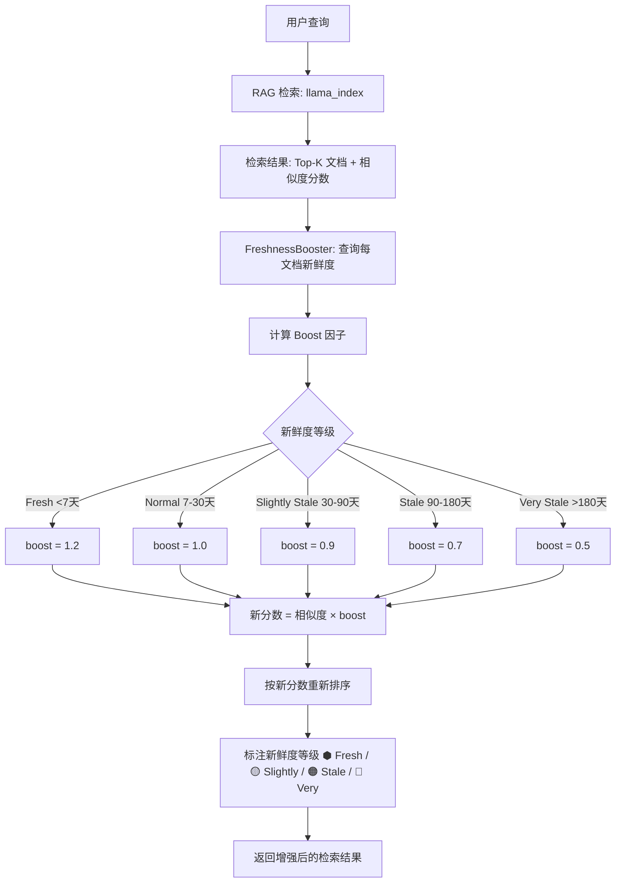

# YA-09-216: 知识新鲜度管理 — 文档过时评分、自动重索引更新内容、新鲜度感知检索增强、新鲜度仪表盘、过时内容告警

> 需求编号：YA-09-216 · 优先级：P2 · 人天：0.3d · 状态：需求已编写
> 依赖：YA-09-01（RAG 引擎稳定性修复）、YA-09-208（时间感知检索）、YA-09-213（RAG 评估基准）

## 背景

### 问题陈述

YiAi 的知识库（基于 YiKnowledge markdown 目录树）通过知识监视器（apscheduler 每 5 秒轮询）扫描文件变更并更新 MongoDB 和向量索引。然而，当前系统对所有文档一视同仁，不考虑文档的新鲜度。这导致：

1. **过时内容未被标记**：半年前编写的文档可能与当前实现不一致，但检索时与新鲜文档平等竞争，可能返回过时信息
2. **更新频率无感知**：不知道哪些文档长期未更新，哪些需要审查
3. **新鲜度不影响检索排序**：RAG 检索时没有"越新的文档越可信"的机制，过时文档可能与新鲜文档同分
4. **内容退化不可见**：文档内容随时间推移退化（API 变更、配置更新），但无监控无告警
5. **被动重索引**：仅在文件变更时重索引，不会因为关联文档更新而重索引

**核心矛盾**：知识库是动态变化的（项目在演进，文档在更新），但 RAG 检索将所有文档等同对待。缺乏新鲜度管理意味着用户可能从过时文档中获取到错误信息，而开发者不知道哪些文档需要审查。

### 影响范围

| # | 影响 | 严重程度 | 典型场景 |
|---|------|----------|----------|
| 1 | 过时文档污染检索结果 | 高 | 用户查询"YiAi 端口"得到旧版本文档的"10086"但已改为"8080" |
| 2 | 文档维护缺失 | 中 | 半年前写的架构文档与当前实现不一致 |
| 3 | 检索质量退化 | 中 | 新人依赖 RAG 获取信息，但信息已过时 |
| 4 | 无过时告警 | 中 | 核心文档过期无通知 |
| 5 | 关联更新遗漏 | 低 | 修改模块A文档后，依赖A的模块B文档未同步更新 |

### 挑战

| 挑战 | 说明 |
|------|------|
| 过时评分模型 | 如何定义一个文档"过时"？基于时间？基于内容一致性？基于引用关系？ |
| 新鲜度与相关性的权衡 | 新鲜度 vs 语义相关性在检索排序中如何权衡？权重多少？ |
| 自动重索引 | 如何检测文档内容变化？文件修改时间不够（touch 命令） |
| 关联文档传播 | 一个文档更新后如何找到所有引用它的文档并调整其新鲜度 |
| 过时阈值 | 不同类别的文档过时速度不同（API 文档 1 个月可能过时，架构文档 6 个月仍有效） |

---

## 一、现状分析

### 1.1 当前文档生命周期

```
当前知识库文档生命周期
  │
  ├─ 创建阶段
  │   └─ 编写文档 → 提交到 YiKnowledge → 知识监视器检测 → 索引
  │
  ├─ 活跃阶段
  │   └─ 定期更新文档 → 监视器检测 mtime 变化 → 重索引
  │
  ├─ 休眠阶段
  │   └─ 文档长期不更新 → 仍在索引中 → 检索时正常返回
  │   └─ 问题：内容已过时但检索分数不降低
  │
  └─ 废弃阶段
      └─ 文档被删除 → 监视器检测 → 从索引中移除
      └─ （但没人发现文档过时，就不会删除）
```

### 1.2 当前可用能力

| 能力 | 可用性 | 获取方式 | 限制 |
|------|--------|----------|------|
| 文档索引 | 是 | 知识监视器自动 | 仅基于文件 mtime 触发 |
| 文档 mtime 记录 | 是 | MongoDB knowledge_files | 仅文件修改时间 |
| 检索排序 | 是 | llama_index 语义相似度 | 不考虑新鲜度 |
| 过时检测 | ❌ | 无 | — |
| 重索引 | ⚠️ | 仅在 mtime 变化时 | 不检测内容变化 |
| 新鲜度仪表盘 | ❌ | 无 | — |

### 1.3 根因矩阵

| 症状 | 根因 | 触发条件 | 频率 |
|------|------|----------|------|
| 过时文档漏出 | 检索不考虑新鲜度 | RAG 检索时 | 每次检索 |
| 文档维护不可见 | 无过时评分 | 文档更新后 | 持续 |
| 内容退化无感知 | 无一致性验证 | 代码修改但文档未更新 | 低 |
| 关联过时 | 无引用追踪 | A 文档更新后 B 文档未同步 | 低 |
| 重索引遗漏 | 仅依赖 mtime | touch 或 git checkout 不改变内容 | 低 |

---

## 二、设计决策

### 决策 1：过时评分模型 — 纯时间 vs 时间+内容 vs 多因子

| 选项 | 准确性 | 实现复杂度 | 误判率 |
|------|--------|-----------|--------|
| 纯时间衰减（指数衰减） | 低 | 极低 | 高 |
| 时间 + 更新频率 | 中 | 低 | 中 |
| 多因子（时间 + 内容哈希 + 引用新鲜度 + 人工标注） | 高 | 中 | 低 |

**选择：多因子评分模型。** 过时分数 (Staleness Score) = 时间衰减 (40%) + 内容稳定性 (30%) + 引用新鲜度 (20%) + 人工审查标记 (10%)。时间衰减基于文档 frontmatter 的 `updated` 字段；内容稳定性基于文档内容哈希变化频率；引用新鲜度基于文档引用的其他文档的平均新鲜度；人工审查标记为手动标注"已验证/需审查/已过时"。

### 决策 2：新鲜度增强检索 — 预排序过滤 vs 重排序调整 vs 元数据标注

| 选项 | 实现复杂度 | 用户可见性 | 灵活性 |
|------|-----------|-----------|--------|
| 预排序过滤（新鲜度 < 阈值的文档直接排除） | 低 | 不透明（用户不知道哪些被过滤） | 低 |
| 重排序调整（在相似度分数上叠加新鲜度权重） | 中 | 透明（最终排序含新鲜度） | 高 |
| 元数据标注（在检索结果中标注新鲜度评分） | 低 | 透明 | 中 |

**选择：重排序调整 + 元数据标注。** 检索结果返回后，对每个文档的相似度分数乘以新鲜度 boost 因子：(1) 新鲜文档（< 7 天）：boost = 1.2；(2) 正常文档（7-30 天）：boost = 1.0；(3) 轻微过时（30-90 天）：boost = 0.9；(4) 过时（90-180 天）：boost = 0.7；(5) 严重过时（> 180 天）：boost = 0.5。同时在检索结果中标注每个文档的新鲜度等级。

### 决策 3：自动重索引触发 — mtime vs 内容哈希 vs 两者结合

| 选项 | 准确性 | 性能 | 实现复杂度 |
|------|--------|------|-----------|
| mtime 变化（当前） | 低（touch 触发但内容未变） | 高 | 低 |
| 内容哈希（SHA-256） | 高 | 中（需要读取文件内容） | 中 |
| 两者结合（mtime 初筛 + 哈希确认） | 最高 | 高 | 中 |

**选择：两者结合。** mtime 作为快速初筛（变化时才计算哈希，99% 轮询无需读文件），每次 mtime 变化时计算内容哈希并与上次记录的哈希对比，仅哈希变化时才触发重索引。避免因 git checkout、touch 或文件系统操作导致的无效重索引。

### 决策 4：文档分类过时阈值 — 统一 vs 分类 vs 自适应

| 选项 | 公平性 | 实现复杂度 | 维护成本 |
|------|--------|-----------|----------|
| 统一阈值（所有文档 90 天过时） | 低（API 文档 30 天就过时了） | 低 | 低 |
| 分类阈值（API 30天/架构 180天/经验教训 365天） | 高 | 中 | 中 |
| 自适应（基于同类文档平均更新频率） | 最高 | 高 | 低 |

**选择：分类阈值 + 自适应基线。** 初始使用分类阈值（根据文档 frontmatter 的 `category` 字段）：API/配置文档 30 天，架构设计 180 天，经验教训/原则 365 天。系统运行 90 天后，自动计算每类文档的实际平均更新周期，调整为自适应阈值。

### 设计决策记录

| 决策 | 选项 A | 选项 B | 选项 C | 选择 | 理由 |
|------|--------|--------|--------|------|------|
| 评分模型 | 纯时间 | 时间+内容 | 多因子 | **多因子** | 全面准确 |
| 检索增强 | 预过滤 | 重排序 | 元数据标注 | **重排序+标注** | 透明灵活 |
| 重索引触发 | mtime | 内容哈希 | 两者结合 | **两者结合** | 精确高效 |
| 过时阈值 | 统一 | 分类 | 分类+自适应 | **分类+自适应** | 公平高效 |

---

## 三、目标架构

### 3.1 知识新鲜度管理系统架构

```mermaid
graph TD
    subgraph "数据采集层"
        A1[KnowledgeMonitor: 知识监视器]
        A2[ContentHasher: 内容哈希计算]
        A3[FrontmatterParser: Frontmatter 解析]
    end

    subgraph "新鲜度引擎"
        B1[StalenessCalculator: 过时评分计算]
        B2[TimeDecayModel: 时间衰减模型]
        B3[ContentStability: 内容稳定性分析]
        B4[ReferenceFreshness: 引用新鲜度传播]
        B5[ManualReview: 人工审查标记]
    end

    subgraph "检索增强层"
        C1[FreshnessBooster: 新鲜度增强器]
        C2[BoostConfig: 增强配置]
        C3[ResultAnnotator: 结果标注]
    end

    subgraph "监控与告警"
        D1[FreshnessDashboard: 新鲜度仪表盘]
        D2[StalenessAlerter: 过时告警]
        D3[CategoryThresholds: 分类阈值管理]
    end

    subgraph "存储层"
        E1[MongoDB: knowledge_files (含 freshness 字段)]
        E2[MongoDB: freshness_history (新鲜度变更历史)]
        E3[VectorIndex: llama_index (含 freshness_boost)]
    end

    A1 --> A2 --> A3
    A3 --> B1
    B1 --> B2 & B3 & B4 & B5
    B1 --> E1
    E1 --> C1
    C1 --> C2
    C1 --> C3
    C3 --> E3
    E1 --> D1
    D1 --> D2
    D1 --> D3
```

### 3.2 过时评分计算流程

```mermaid
graph TD
    A[文档] --> B[提取 frontmatter.updated]
    B --> C{updated 距今多久?}
    C -->|7 天| D[时间分数: 100]
    C -->|30 天| E[时间分数: 80]
    C -->|90 天| F[时间分数: 50]
    C -->|180 天| G[时间分数: 20]
    C -->|365 天| H[时间分数: 0]

    A --> I[计算内容哈希]
    I --> J{与上次哈希相同?}
    J -->|是| K[稳定性分数: 高 (80+)]
    J -->|否| L[稳定性分数: 低 (40-)]

    A --> M[解析文档引用]
    M --> N[查询被引用文档的新鲜度]
    N --> O[取平均新鲜度]

    A --> P[读取人工审查标记]
    P --> Q{标记状态}
    Q -->|已验证| R[审查分数: 100]
    Q -->|需审查| S[审查分数: 40]
    Q -->|已过时| T[审查分数: 0]

    D & E & F & G & H & K & L & O & R & S & T --> U[加权聚合]
    U --> V[过时分数 0-100 \n 0=最新 100=完全过时]
```

### 3.3 新鲜度增强检索流程



### 3.4 性能指标

| 指标 | 目标值 | 说明 |
|------|--------|------|
| 过时评分计算（单文档） | < 5ms | 4 因子加权计算 |
| 内容哈希计算（1KB 文件） | < 1ms | SHA-256 |
| 新鲜度重排序（Top-20 文档） | < 5ms | Boost 查表 + 重新排序 |
| 分类自适应阈值更新 | < 10s | 每日一次，聚合全库 |
| 监视器轮询（含新鲜度更新） | < 500ms/次 | 在原有 5s 轮询中增量 |

---

## 四、具体改动

### 4.1 新鲜度数据模型

```python
# YiAi/src/domain/freshness/models.py (新增)

from dataclasses import dataclass, field
from enum import Enum

class FreshnessLevel(str, Enum):
    FRESH = "fresh"               # < 7 天
    NORMAL = "normal"             # 7-30 天
    SLIGHTLY_STALE = "slightly"    # 30-90 天
    STALE = "stale"               # 90-180 天
    VERY_STALE = "very_stale"     # > 180 天

class ReviewStatus(str, Enum):
    VERIFIED = "verified"         # 人工验证内容正确
    NEEDS_REVIEW = "needs_review"  # 需要审查
    OUTDATED = "outdated"         # 标记为已过时

@dataclass
class FreshnessScore:
    document_path: str
    # 四因子评分（0-100，越高越新鲜）
    time_score: float             # 时间衰减分数
    stability_score: float        # 内容稳定性分数
    reference_score: float        # 引用新鲜度分数
    review_score: float           # 人工审查分数
    # 综合指标
    staleness_score: float        # 过时分数 0-100，0=最新 100=完全过时
    freshness_level: FreshnessLevel
    # 元数据
    last_updated_days: float      # 距上次更新天数
    last_content_hash: str        # 上次内容哈希
    content_changed_count: int    # 近期内容变更次数（90天内）
    referenced_docs: list[str]    # 引用的文档路径
    review_status: ReviewStatus = ReviewStatus.NEEDS_REVIEW
    reviewed_at: Optional[float] = None
    reviewed_by: Optional[str] = None

# 分类过时阈值配置
CATEGORY_THRESHOLDS = {
    "项目/浏览器扩展/需求": {"fresh_days": 30, "stale_days": 90},
    "项目/管理后台/需求": {"fresh_days": 30, "stale_days": 90},
    "项目/架构": {"fresh_days": 90, "stale_days": 180},
    "项目/模式": {"fresh_days": 180, "stale_days": 365},
    "经验教训": {"fresh_days": 365, "stale_days": 730},
    "原则": {"fresh_days": 365, "stale_days": 730},
    "default": {"fresh_days": 60, "stale_days": 180},
}
```

### 4.2 过时评分计算器

```python
# YiAi/src/services/freshness/calculator.py (新增)

import time
import hashlib
from collections import defaultdict

class StalenessCalculator:
    """多因子过时评分计算器"""

    def __init__(self, db_repo, thresholds: dict = None):
        self.db = db_repo
        self.thresholds = thresholds or CATEGORY_THRESHOLDS

    async def calculate(self, doc: dict) -> FreshnessScore:
        """计算单个文档的过时评分"""
        path = doc['_id']
        category = doc.get('category', 'default')
        now = time.time()

        # 1. 时间衰减分数 (0-100)
        updated_at = doc.get('frontmatter', {}).get('updated', doc.get('mtime', now))
        days_since_update = (now - updated_at) / 86400 if isinstance(updated_at, (int, float)) else 90
        cat_threshold = self.thresholds.get(category, self.thresholds['default'])
        time_score = max(0, 100 - (days_since_update / cat_threshold['fresh_days']) * 100)

        # 2. 内容稳定性分数
        current_hash = self._compute_content_hash(doc)
        previous_hash = doc.get('content_hash', '')
        content_changed = (current_hash != previous_hash)
        change_count = doc.get('content_changed_count', 0)
        stability_score = 40 if content_changed else min(100, 80 + change_count * 5)

        # 3. 引用新鲜度分数
        referenced = doc.get('referenced_docs', [])
        ref_scores = await self._get_reference_scores(referenced)
        reference_score = sum(ref_scores) / len(ref_scores) if ref_scores else 80

        # 4. 人工审查分数
        review_status = doc.get('review_status', 'needs_review')
        review_scores = {
            'verified': 100,
            'needs_review': 40,
            'outdated': 0,
        }
        review_score = review_scores.get(review_status, 40)

        # 加权聚合（权重：时间 40%, 稳定性 30%, 引用 20%, 审查 10%）
        freshness_score = (
            time_score * 0.40 +
            stability_score * 0.30 +
            reference_score * 0.20 +
            review_score * 0.10
        )
        staleness_score = 100 - freshness_score

        level = self._classify_level(staleness_score)

        return FreshnessScore(
            document_path=path,
            time_score=time_score,
            stability_score=stability_score,
            reference_score=reference_score,
            review_score=review_score,
            staleness_score=staleness_score,
            freshness_level=level,
            last_updated_days=days_since_update,
            last_content_hash=current_hash,
            content_changed_count=change_count + (1 if content_changed else 0),
            referenced_docs=referenced,
            review_status=ReviewStatus(review_status),
        )

    def _compute_content_hash(self, doc: dict) -> str:
        """计算文档内容 SHA-256 哈希"""
        content = doc.get('content', doc.get('text', ''))
        return hashlib.sha256(content.encode('utf-8')).hexdigest()[:16]

    async def _get_reference_scores(self, ref_paths: list[str]) -> list[float]:
        """获取引用文档的新鲜度评分"""
        if not ref_paths:
            return []
        docs = await self.db.knowledge_files.find(
            {'_id': {'$in': ref_paths}},
            {'staleness_score': 1}
        ).to_list(len(ref_paths))
        return [doc.get('staleness_score', 50) for doc in docs]

    def _classify_level(self, staleness_score: float) -> FreshnessLevel:
        if staleness_score < 10: return FreshnessLevel.FRESH
        if staleness_score < 30: return FreshnessLevel.NORMAL
        if staleness_score < 60: return FreshnessLevel.SLIGHTLY_STALE
        if staleness_score < 80: return FreshnessLevel.STALE
        return FreshnessLevel.VERY_STALE
```

### 4.3 新鲜度增强检索

```python
# YiAi/src/services/freshness/booster.py (新增)

class FreshnessBooster:
    """RAG 检索结果新鲜度增强器"""

    FRESHNESS_BOOST = {
        FreshnessLevel.FRESH: 1.20,
        FreshnessLevel.NORMAL: 1.00,
        FreshnessLevel.SLIGHTLY_STALE: 0.90,
        FreshnessLevel.STALE: 0.70,
        FreshnessLevel.VERY_STALE: 0.50,
    }

    # 新鲜度标签（用于用户界面显示）
    FRESHNESS_LABELS = {
        FreshnessLevel.FRESH: "⬢ 新鲜",
        FreshnessLevel.NORMAL: "⬢ 正常",
        FreshnessLevel.SLIGHTLY_STALE: "🟡 轻微过时",
        FreshnessLevel.STALE: "🟠 过时",
        FreshnessLevel.VERY_STALE: "🔴 严重过时",
    }

    def __init__(self, db_repo, config: dict = None):
        self.db = db_repo
        self.enabled = config.get('freshness_boost_enabled', True) if config else True
        self.min_boost = config.get('freshness_min_boost', 0.5) if config else 0.5

    async def boost_retrieval_results(
        self, results: list[dict]
    ) -> list[dict]:
        """对检索结果叠加新鲜度分数并重新排序"""
        if not self.enabled:
            return results

        # 批量查询文档新鲜度
        paths = [r.get('file_path') or r.get('metadata', {}).get('file_path')
            for r in results if r.get('file_path') or r.get('metadata', {}).get('file_path')]
        freshness_map = await self._batch_get_freshness(paths)

        for result in results:
            path = result.get('file_path') or result.get('metadata', {}).get('file_path', '')
            freshness = freshness_map.get(path)
            if freshness:
                boost = self.FRESHNESS_BOOST.get(freshness.freshness_level, 1.0)
                result['original_score'] = result.get('score', 0)
                result['freshness_boost'] = boost
                result['freshness_level'] = freshness.freshness_level.value
                result['freshness_label'] = self.FRESHNESS_LABELS.get(
                    freshness.freshness_level, ''
                )
                result['score'] = result.get('score', 0) * boost

        # 按新分数重新排序
        results.sort(key=lambda r: r.get('score', 0), reverse=True)
        return results

    async def _batch_get_freshness(self, paths: list[str]) -> dict[str, FreshnessScore]:
        """批量查询文档新鲜度评分"""
        docs = await self.db.knowledge_files.find(
            {'_id': {'$in': [p for p in paths if p]}},
            {'freshness_score': 1, 'freshness_level': 1}
        ).to_list(len(paths))
        
        result = {}
        for doc in docs:
            score = doc.get('freshness_score', {})
            result[doc['_id']] = FreshnessScore(
                document_path=doc['_id'],
                time_score=score.get('time_score', 50),
                stability_score=score.get('stability_score', 50),
                reference_score=score.get('reference_score', 50),
                review_score=score.get('review_score', 50),
                staleness_score=score.get('staleness_score', 50),
                freshness_level=FreshnessLevel(score.get('freshness_level', 'normal')),
                last_updated_days=score.get('last_updated_days', 0),
                last_content_hash=score.get('last_content_hash', ''),
                content_changed_count=score.get('content_changed_count', 0),
                referenced_docs=score.get('referenced_docs', []),
            )
        return result
```

### 4.4 新鲜度仪表盘数据服务

```python
# YiAi/src/services/freshness/dashboard.py (新增)

class FreshnessDashboard:
    """新鲜度仪表盘数据服务"""

    def __init__(self, db_repo):
        self.db = db_repo

    async def get_overview(self) -> dict:
        """获取全局新鲜度概览"""
        pipeline = [
            {"$group": {
                "_id": "$freshness_level",
                "count": {"$sum": 1},
                "avg_staleness": {"$avg": "$staleness_score"},
            }},
            {"$sort": {"_id": 1}},
        ]
        by_level = await self.db.knowledge_files.aggregate(pipeline).to_list(10)

        total = sum(r['count'] for r in by_level)
        return {
            "total_documents": total,
            "by_level": {r['_id']: {'count': r['count'], 'pct': round(r['count']/max(total,1)*100, 1)}
                for r in by_level if r['_id']},
            "avg_staleness": round(
                sum(r['avg_staleness'] * r['count'] for r in by_level) / max(total, 1), 1
            ),
            "stale_count": sum(r['count'] for r in by_level if r['_id'] in ['stale', 'very_stale']),
            "stale_pct": round(
                sum(r['count'] for r in by_level if r['_id'] in ['stale', 'very_stale']) / max(total, 1) * 100, 1
            ),
        }

    async def get_top_stale(self, limit: int = 10) -> list[dict]:
        """获取过时最严重的 Top-N 文档"""
        pipeline = [
            {"$match": {"staleness_score": {"$gte": 50}}},
            {"$sort": {"staleness_score": -1}},
            {"$limit": limit},
            {"$project": {
                "_id": 1, "title": 1, "category": 1,
                "staleness_score": 1, "freshness_level": 1,
                "last_updated_days": 1, "updated": 1,
            }},
        ]
        return await self.db.knowledge_files.aggregate(pipeline).to_list(limit)

    async def get_by_category(self) -> list[dict]:
        """按分类统计新鲜度"""
        pipeline = [
            {"$group": {
                "_id": "$category",
                "count": {"$sum": 1},
                "avg_staleness": {"$avg": "$staleness_score"},
                "stale_count": {"$sum": {"$cond": [
                    {"$in": ["$freshness_level", ["stale", "very_stale"]]}, 1, 0
                ]}},
            }},
            {"$sort": {"avg_staleness": -1}},
        ]
        return await self.db.knowledge_files.aggregate(pipeline).to_list(30)

    async def get_timeline(self, days: int = 90) -> list[dict]:
        """获取新鲜度变化趋势（日级）"""
        cursor = self.db.freshness_history.aggregate([
            {"$match": {"timestamp": {"$gte": time.time() - days * 86400}}},
            {"$group": {
                "_id": {"$dateToString": {"format": "%Y-%m-%d", "date": {"$toDate": "$timestamp"}}},
                "avg_staleness": {"$avg": "$avg_staleness"},
                "total_docs": {"$max": "$total_docs"},
            }},
            {"$sort": {"_id": 1}},
        ])
        return await cursor.to_list(days)
```

### 4.5 自动重索引集成

```python
# YiAi/src/services/freshness/reindexer.py (新增)

class FreshnessAwareReindexer:
    """新鲜度感知的自动重索引器"""

    def __init__(self, knowledge_monitor, freshness_calculator, vector_index):
        self.monitor = knowledge_monitor
        self.calculator = freshness_calculator
        self.index = vector_index

    async def should_reindex(self, doc: dict, file_stat: os.stat_result) -> bool:
        """判断是否应该重索引"""
        # 快速检查：mtime 未变化则跳过
        if doc.get('mtime') and doc['mtime'] >= file_stat.st_mtime:
            return False

        # 内容检查：mtime 变化但内容未变则跳过
        current_hash = hashlib.sha256(
            self._read_file(doc['_id']).encode()
        ).hexdigest()
        if current_hash == doc.get('content_hash', ''):
            return False

        return True

    async def on_content_updated(self, doc_path: str):
        """文档内容更新后的级联操作"""
        # 1. 重索引
        await self.index.refresh_document(doc_path)

        # 2. 重新计算新鲜度
        doc = await self.db.knowledge_files.find_one({'_id': doc_path})
        if doc:
            score = await self.calculator.calculate(doc)
            await self.db.knowledge_files.update_one(
                {'_id': doc_path},
                {'$set': {
                    'staleness_score': score.staleness_score,
                    'freshness_level': score.freshness_level.value,
                    'last_freshness_update': time.time(),
                    'content_hash': score.last_content_hash,
                    'content_changed_count': score.content_changed_count,
                }}
            )

        # 3. 级联更新：重新计算引用此文档的其他文档的新鲜度
        referencing_docs = await self.db.knowledge_files.find(
            {'referenced_docs': doc_path}
        ).to_list(None)
        for ref_doc in referencing_docs:
            await self.on_content_updated(ref_doc['_id'])
```

### 4.6 文件变更清单

| 文件 | 操作 | 说明 |
|------|------|------|
| `src/domain/freshness/__init__.py` | 新增 | 模块初始化 |
| `src/domain/freshness/models.py` | 新增 | 新鲜度数据模型 + 分类阈值 |
| `src/services/freshness/__init__.py` | 新增 | 服务模块初始化 |
| `src/services/freshness/calculator.py` | 新增 | 过时评分计算器 |
| `src/services/freshness/booster.py` | 新增 | 检索新鲜度增强器 |
| `src/services/freshness/dashboard.py` | 新增 | 新鲜度仪表盘数据服务 |
| `src/services/freshness/reindexer.py` | 新增 | 新鲜度感知重索引器 |
| `src/services/freshness/alerter.py` | 新增 | 过时内容告警 |
| `src/services/knowledge/monitor.py` | 修改 | 集成内容哈希 + 新鲜度计算 |
| `src/services/rag/retriever.py` | 修改 | 集成 FreshnessBooster 重排序 |
| `src/server/routes/freshness_routes.py` | 新增 | 新鲜度 API |
| `src/shared/db.py` | 修改 | 添加 knowledge_files 新鲜度字段索引 |
| `tests/unit/test_freshness_calculator.py` | 新增 | 评分计算器测试 |
| `tests/unit/test_freshness_booster.py` | 新增 | 增强器测试 |

---

## 五、实施步骤

| 步骤 | 操作 | 路径 | 验证 | 人天 |
|------|------|------|------|------|
| 1 | 定义数据模型和分类阈值 | `models.py` | frontmatter 解析正确 | 0.02 |
| 2 | 实现多因子过时评分计算 | `calculator.py` | 四因子加权聚合正确 | 0.04 |
| 3 | 实现内容哈希重索引判断 | `reindexer.py` 集成到 monitor | 避免无效重索引 | 0.03 |
| 4 | 实现检索新鲜度增强 | `booster.py` | Boost 后排序变化合理 | 0.04 |
| 5 | 实现新鲜度仪表盘 | `dashboard.py` | 概览/TopN/分类/趋势 | 0.04 |
| 6 | 实现过时告警 | `alerter.py` | 阈值告警正确 | 0.03 |
| 7 | 对现有知识库计算初始新鲜度 | 一次性迁移脚本 | 全库评分完成 | 0.03 |
| 8 | 集成到知识监视器 | `monitor.py` 修改 | 实时计算新鲜度 | 0.04 |
| 9 | 编写 API 和测试 | `freshness_routes.py` + 测试 | API 返回正确 | 0.03 |

**总人天：0.3d**

---

## 六、测试规格

### 场景 1：计算文档过时评分

**GIVEN** 某架构文档 `updated` 为 180 天前，内容哈希 90 天未变化，引用了 2 个新鲜文档（平均新鲜度 85），人工审查状态为 `verified`
**WHEN** 计算过时评分
**THEN** 时间分数约 0（180 天远超 fresh_days=90）
**AND** 稳定性分数约 80（长时间未变化 = 高稳定性）
**AND** 引用新鲜度约 85
**AND** 审查分数 = 100（已验证）
**AND** 综合过时分数约 40%（加权后偏过时但非完全）

### 场景 2：新鲜度增强检索重排序

**GIVEN** 检索结果 Top-5：
- 文档A：相似度 0.85，新鲜度 VERY_STALE（boost=0.5）
- 文档B：相似度 0.80，新鲜度 FRESH（boost=1.2）
**WHEN** FreshnessBooster 处理
**THEN** 文档B 新分数 = 0.96（超过文档A 的 0.425）
**AND** 文档B 排到第一位，文档A 降到后面
**AND** 文档A 标注 🔴 严重过时标签

### 场景 3：内容哈希避免无效重索引

**GIVEN** 文档 mtime 变化（git checkout 或 touch），但内容未变化
**WHEN** 知识监视器轮询检测到 mtime 变化
**THEN** 计算内容哈希 → 与上次记录相同
**AND** 跳过重索引（节省计算资源）
**AND** 仅更新 mtime 记录

### 场景 4：新鲜度仪表盘概览

**GIVEN** 知识库共 500 个文档
**WHEN** 查询 GET `/api/freshness/overview`
**THEN** 返回：总文档数 500
**AND** 各新鲜度等级分布：Fresh 100 (20%), Normal 200 (40%), Slightly 120 (24%), Stale 60 (12%), Very Stale 20 (4%)
**AND** 平均过时分数：32.5
**AND** 过时文档（Stale + Very）数量：80 (16%)

### 场景 5：过时内容告警

**GIVEN** 告警规则：某个 category 下过时文档比例 > 30%
**WHEN** "项目/浏览器扩展/需求" 分类下 40 个文档中有 15 个过时（37.5%）
**THEN** 触发 INFO 告警
**AND** 告警详情包含：分类名称、过时比例、Top-3 过时最严重的文档路径

### 场景 6：文档更新后级联新鲜度重算

**GIVEN** 文档A 被文档B、C、D 引用
**WHEN** 文档A 内容更新（mtime + 哈希变化）→ 重索引 → 新鲜度重算（新鲜度提升至 100）
**THEN** 文档B、C、D 的引用新鲜度分数自动重新计算
**AND** 文档B、C、D 的新鲜度评分因引用新鲜度提升而略微上升

---

## 七、风险与缓解

| 风险 | 概率 | 影响 | 缓解措施 |
|------|------|------|----------|
| 新鲜度 boost 过度压制过时但仍相关的好文档 | 中 | 中 | boost 范围 0.5-1.2（非 0），过时文档不完全排除；boost 权重可配置 |
| 内容哈希计算增加监视器负载 | 低 | 中 | mtime 初筛：仅 mtime 变化时才计算哈希（99% 轮询无需读文件） |
| 级联引用更新导致循环依赖 | 低 | 高 | 限制引用传播深度为 3 层，检测循环引用 |
| 分类阈值不合理 | 中 | 低 | 初始保守值 + 90 天后自适应调整为实际平均更新周期 |
| 文档 too many 被标记为过时 | 低 | 低 | 过时文档在检索结果中显示"仍相关？反馈帮我们改进"链接 |

---

## 八、回滚策略

| 场景 | 回滚操作 | 影响 |
|------|----------|------|
| 新鲜度 boost 导致检索质量下降 | 设置 `freshness_boost_enabled = false` | 回到无新鲜度检索 |
| 内容哈希导致监视器性能下降 | 回退到仅 mtime 检测 | 可能产生无效重索引 |
| 级联更新导致性能问题 | 关闭级联更新 | 引用新鲜度不再自动传播 |
| 完全回滚 | 移除新鲜度模块 | 回到静态知识库 |

---

## 九、设计决策记录

### D-01：为什么使用多因子评分而非纯时间衰减？

纯时间衰减假设所有文档以相同速度变旧，但现实是：一个架构设计文档可能 6 个月后仍然准确，而一个 API 文档可能 30 天后就过时了。多因子模型通过内容稳定性（频繁变更 = 可能仍在活跃维护）、引用新鲜度（引用的最新文档 = 内容更可能靠谱）和人工审查标记（显式确认/否认）来更准确地评估过时程度。

### D-02：为什么检索新鲜度增强使用重排序而非预过滤？

预过滤（彻底排除过时文档）可能导致不返回任何结果（如果所有文档都过时时）。重排序保留了所有候选文档，仅调整它们的显示顺序。用户仍能看到被降权的过时文档，并可以自行判断是否仍有用。同时保留"原始排序"视图作为对比。

### D-03：为什么内容哈希使用 SHA-256 而非简单的文件大小？

文件大小在内容微小修改时可能不变（修改一个单词的长度），但内容实际已变化。SHA-256 对任何内容变化（哪怕一个字符）都产生不同的哈希，是最可靠的内容变更检测方式。16 字符截断的碰撞概率极低（1/2^64），对于知识文档完全足够。

### D-04：为什么级联引用更新限制 3 层深度？

引用传播在理论上可以无限递归（A→B→C→D→...），但实际中很少有超过 3 层的引用链。限制 3 层在覆盖绝大多数实际使用场景的同时，避免了因循环引用导致的无限递归。超过 3 层的引用关系对新鲜度的影响已经微乎其微。

---

## 十、可观测性

### 指标

| 指标 | 类型 | 说明 |
|------|------|------|
| `yiai.freshness.avg_staleness` | Gauge | 全库平均过时分数 |
| `yiai.freshness.stale_pct` | Gauge | 过时文档比例（Stale + Very Stale） |
| `yiai.freshness.by_category` | Gauge | 按分类平均过时分数 |
| `yiai.freshness.calculations.total` | Counter | 新鲜度计算次数 |
| `yiai.freshness.reindex.skipped` | Counter | 因哈希匹配跳过的重索引次数 |
| `yiai.freshness.boost.applications` | Counter | 检索新鲜度增强应用次数 |
| `yiai.freshness.cascade.depth` | Histogram | 引用级联更新深度 |
| `yiai.freshness.alerts.triggered` | Counter | 过时告警触发次数 |

### 告警

| 告警 | 条件 | 级别 |
|------|------|------|
| 全库过时率飙高 | stale_pct > 25% | WARNING |
| 单分类过时率过高 | 某分类 stale_pct > 30% | INFO |
| 关键文档过时 | 标记为 `critical` 的文档过时 | WARNING |
| 新鲜度计算异常 | 平均计算耗时 > 100ms | INFO |

---

## 十一、代码审查检查清单

- [ ] 多因子评分模型四因子权重可配置
- [ ] 分类阈值从配置文件加载（支持热更新）
- [ ] 内容哈希使用 SHA-256，mtime 初筛避免无效计算
- [ ] 新鲜度 boost 因子范围 0.5-1.2，不排除任何文档
- [ ] 检索结果正确标注新鲜度等级和标签
- [ ] 级联引用更新有深度限制（3 层）
- [ ] 循环引用检测（visited set）
- [ ] 仪表盘 API 返回正确的统计和时间序列
- [ ] knowledge_files 集合正确索引（staleness_score, freshness_level, category）
- [ ] 知识监视器增量集成新鲜度计算（不显著增加轮询耗时）
- [ ] 迁移脚本为现有文档计算初始新鲜度评分

---

## 回归问题预测

| # | 预测问题 | 原因 | 验证方法 |
|---|---------|------|---------|
| 1 | 新鲜度 boost 权重过大（1.2 vs 0.5），导致一个非常相关但稍旧的文档被一个不相关但很新鲜的文档超越，用户得到不相关的答案 | boost 是乘性因子作用于相似度分数上，如果语义相似度差距 < 新鲜度 boost 差距，可能错排 | 在基准评估（YA-09-213）中对比有无新鲜度 boost 的检索结果，验证 boost 不会导致 MRR 显著下降 |
| 2 | 内容哈希在监视器每次轮询（5s）时对所有 mtime 变化的文件计算，如果一次性批量更新大量文件（如 git pull 更新了 100 个文件），计算 100 个 SHA-256 可能阻塞轮询 | 100 个文件 × ~1ms SHA-256 = 100ms，但对于大文件（如 10MB README）SHA-256 可能 > 50ms | 将哈希计算放入线程池（`loop.run_in_executor`），避免阻塞事件循环；限制每轮最多计算 50 个文件 |
| 3 | `last_updated_days` 依赖 frontmatter 的 `updated` 字段，但很多旧文档可能没有 frontmatter 或 `updated` 格式不是 Unix 时间戳 | frontmatter 解析可能失败或 `updated` 可能是日期字符串（"2026-01-15"）而非数字 | 增强 frontmatter 解析：支持 Unix 时间戳、ISO 8601 日期字符串、YYYY-MM-DD 格式；解析失败时回退到文件 mtime |
| 4 | 分类阈值表中定义了 6 种分类，但新增文档的 category 可能不匹配任何已定义分类，导致使用 `default` 阈值（60 天），可能不适用于该分类 | 知识库新增角色/项目时，category 值不在阈值表中 | 当使用 default 阈值的文档比例 > 20% 时，触发育儿告警建议添加新分类阈值 |
| 5 | 新鲜度增强检索 (`FreshnessBooster`) 需要查询 MongoDB 获取每个检索结果的 freshness 数据，如果检索返回 50 个文档（Top-K），额外增加了 50 次查询，累积延迟 > 100ms | 当前 RAG 检索流程：llama_index 检索 → 结果返回，添加 boost 后多了 MongoDB 批量查询 | 使用单次 MongoDB `$in` 查询批量获取所有文档的新鲜度（`_batch_get_freshness`），而非逐个查询；缓存热点文档的新鲜度 |
| 6 | 级联引用更新中，如果文档A引用了文档B且文档B引用了文档A（互相引用），`on_content_updated` 会形成无限循环 | 双向引用的文档会在 `on_content_updated` 中互相触发更新 | 在 `on_content_updated` 中使用全局 `_cascade_visited` set 记录当前级联链中已处理的路径，避免重复处理 |

---

## 性能分析

### 各操作耗时

| 操作 | 预估耗时 | 说明 |
|------|----------|------|
| 单文档过时评分计算 | < 5ms | 四因子计算（不含 DB 查询引用文档） |
| 内容哈希计算（1KB） | < 0.5ms | SHA-256 |
| 内容哈希计算（100KB） | < 5ms | SHA-256 |
| 检索新鲜度增强（20 文档） | < 10ms | 批量 MongoDB 查询 + 重排序 |
| 仪表盘概览查询 | < 100ms | MongoDB 聚合 pipeline |
| 知识监视器轮询（含新鲜度） | 在现有基础上 +< 50ms | 增量计算（仅变更文档） |
| 级联引用更新（3 层） | < 500ms | 取决于引用链长度 |

### 存储增量

| 数据项 | 单条大小 | 总文档数 | 存储增量 |
|------|----------|----------|----------|
| knowledge_files 新鲜度字段 | ~200B | 500+ | ~100KB |
| freshness_history（日快照） | ~2KB/天 | 365 天 | ~730KB |
| 内容哈希字段 | 16B | 500+ | ~8KB |

---

## 相关文档

- [YA-09-01: RAG 引擎稳定性修复](01-稳定性修复-RAG引擎.md)
- [YA-09-208: 时间感知检索](208-需求-时间感知检索.md)
- [YA-09-213: RAG 评估基准](213-需求-RAG评估基准.md)
- [YiKnowledge/MEMORY.md](../../../YiKnowledge/MEMORY.md) — 知识库命名约定

## 影响范围

- **影响模块**：待补充
- **涉及文件**：
- `src/domain/freshness/models.py`
- `src/services/freshness/__init__.py`
- `alerter.py`
- `src/services/freshness/alerter.py`
- `calculator.py`
- `src/services/freshness/dashboard.py`
- **是否影响 API 契约**：否
- **是否影响其他项目（YiVad/YiPet）**：否
- **用户感知**：待确认

## 预防措施

| 层面 | 措施 |
|------|------|
| 代码 | 在相关函数中添加参数校验和边界检查 |
| 测试 | 为 `src/domain/freshness/models.py` 添加单元测试 |
| 流程 | 代码审查时重点检查此类模式 |
| 监控 | 添加日志告警，异常发生时及时发现 |
| 文档 | 在编码规范中记录此类反模式 |

## 经验教训

1. **根本原因**：开发过程中对边界情况和异常路径的考虑不足是此类问题的共同根因
2. **设计阶段**：在接口设计和模块实现时，应主动考虑异常输入、空值、超时等边界场景
3. **代码审查**：审查时应检查是否存在类似的反模式（如未捕获异常、无超时控制、缺少参数校验等）
4. **测试覆盖**：异常路径的测试覆盖率应与正常路径同等重视
5. **团队分享**：此类问题应在团队周会或技术分享中讨论，形成团队共识
