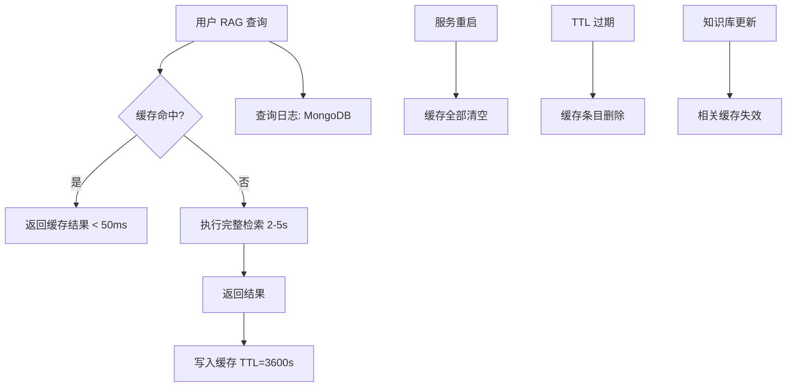
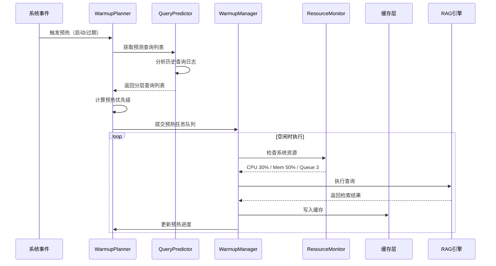
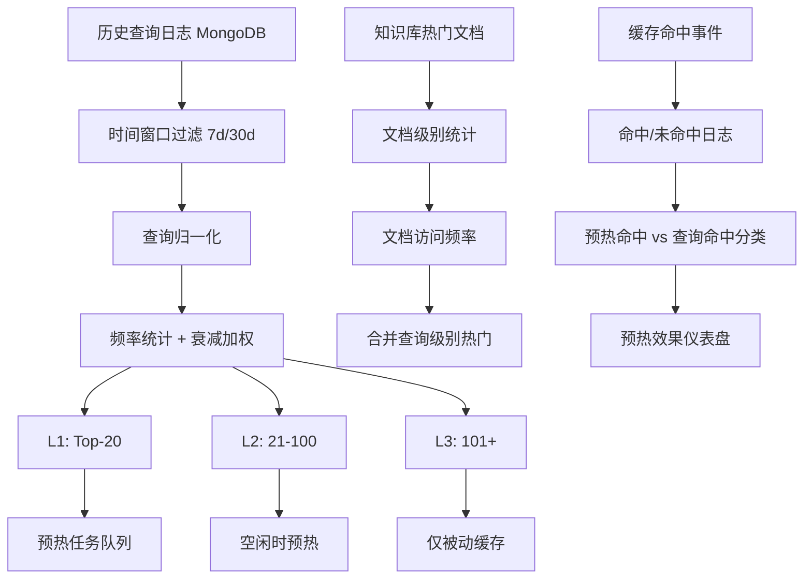

# YA-09-217: 语义缓存预热 — 预测高频查询并提前计算缓存，使用模式分析，预热优先级，缓存命中等比分析，资源感知节流

> 需求编号：YA-09-217 · 优先级：P2 · 人天：0.3d · 状态：需求已编写
> 依赖：YA-09-25（数据查询缓存层）· 前置需求：无

## 背景

### 问题陈述

YiAi 的 RAG 检索在高并发或刚启动时面临冷启动问题：首次查询需要加载向量索引、执行语义检索、LLM 重排序，总延迟可达 2-5 秒。虽然已有基础缓存层（YA-09-25），但缓存仅在被查询后填充，无法主动预测用户需求。据统计，知识库中约 30% 的文档被反复查询（80/20 原则），但这 30% 的热门文档在每次服务重启/缓存过期后都需要"冷启动"——等用户查询后才能进入缓存。

1. **冷启动延迟**：服务重启或缓存 TTL 过期后，热门文档查询回归非缓存延迟（2-5s）
2. **缓存被动填充**：仅在用户实际查询后才缓存，无法在用户查询前"预热"
3. **无查询预测能力**：不知道哪些查询最可能被用户使用，无法提前计算
4. **资源无感知**：预热缓存可能发生在系统负载高峰期，与用户请求抢资源
5. **无缓存效果度量**：不清楚预热缓存对命中率的实际贡献

**核心矛盾**：缓存系统可以在查询后加速后续请求，但在查询前无法提供服务。需要一种机制在系统空闲时"预测"用户的意图并提前填充缓存，将缓存从被动响应转为主动预热。

### 影响范围

| # | 影响 | 严重程度 | 触发场景 |
|---|------|----------|----------|
| 1 | 服务重启后首次查询延迟高 | 高 | 部署/重启/缓存 TTL 过期 |
| 2 | 热门文档每次都需要冷查询 | 高 | 缓存未命中时的查询 |
| 3 | 无法预测用户查询模式 | 中 | 新用户/新会话的首个查询 |
| 4 | 预热占用生产资源 | 中 | 高峰时段后台预热与用户请求竞争 |
| 5 | 缓存效果无法度量 | 低 | 优化决策缺乏数据支持 |

### 挑战

| 挑战 | 说明 |
|------|------|
| 查询预测准确性 | 如何从历史查询中准确预测未来用户可能使用的查询 |
| 预热优先级排序 | 热点文档数量可能很多，预热资源有限，如何排序 |
| 资源感知节流 | 如何在系统负载高时暂停预热，负载低时加速 |
| 缓存时效性 | 预热的内容随时间推移会失效，需要重预热 |
| 预测 -> 缓存一致性 | 预热过程中知识库内容可能变更，导致缓存陈旧 |

---

## 一、现状分析

### 1.1 当前缓存系统



### 1.2 当前系统能力矩阵

| 能力 | 当前状态 | 目标状态 |
|------|----------|----------|
| 查询结果缓存 | 支持（内存 + Redis 可选） | 保留 |
| 缓存被动填充 | 支持 | 保留 |
| 缓存主动预热 | 不支持 | 支持 |
| 查询历史分析 | 支持（MongoDB 存储） | 增强（模式挖掘） |
| 预热优先级 | 不支持 | 支持（频率/重要性/新鲜度加权） |
| 资源感知节流 | 不支持 | 支持（CPU/内存/请求队列感知） |
| 缓存命中分析 | 不完善 | 支持（预热命中 vs 查询命中分类） |
| 预热进度报告 | 不支持 | 支持 |

### 1.3 根因矩阵

| 症状 | 根因 | 触发条件 | 频率 |
|------|------|----------|------|
| 服务重启后首查询慢 | 缓存为空，无预热机制 | 服务部署/重启 | 中（每次发布） |
| 热门查询反复冷启动 | 缓存被动填充，不区分冷热 | TTL 过期 | 高 |
| 高峰时段缓存效率低 | 冷数据占据缓存空间 | 新用户查询冷门内容 | 中 |
| 缓存命中率波动大 | 受查询模式影响无稳定性保障 | 查询模式变化 | 中 |
| 无预热效果反馈 | 无预热命中追踪 | 预热查询 vs 用户查询 | 持续 |

---

## 二、设计决策

### 决策 1：预热策略 — 固定列表 vs 频率预测 vs 时间序列预测

| 选项 | 准确性 | 实现复杂度 | 适应性 | 维护成本 |
|------|--------|-----------|--------|----------|
| 固定列表（人工配置热门查询） | 中 | 低 | 差（静态） | 高 |
| 频率预测（Top-N 高频查询） | 高 | 中 | 好（自动适应） | 低 |
| 时间序列预测（ARIMA/LSTM） | 很高 | 高 | 很好 | 中 |

**选择：频率预测 + 衰减加权。** 使用时间衰减加权频率（最近 7 天的查询权重更高，30 天前的查询权重接近 0），简单而有效。固定列表需要人工维护，不适用。时间序列预测对查询量级（每天数百条）过重。

### 决策 2：预热触发机制 — 定时 vs 事件驱动 vs 空闲检测

| 选项 | 实现复杂度 | 适应性 | 资源利用 | 延迟 |
|------|-----------|--------|----------|------|
| 定时（cron/interval） | 低 | 中 | 低（固定时间） | 中 |
| 事件驱动（启动/缓存过期/知识库变更） | 中 | 高 | 中 | 低 |
| 空闲检测（CPU/内存阈值触发） | 高 | 高 | 高 | 可配 |

**选择：事件驱动 + 空闲检测。** 服务启动时和缓存大规模失效时触发预热（事件驱动），同时在系统空闲时（CPU < 50%、内存 < 70%、请求队列 < 10）自动执行增量预热。结合两者优势：关键时机保证预热，空闲时间做增量。

### 决策 3：预热范围 — 全部热门 vs Top-K vs 分层

| 选项 | 资源消耗 | 命中率提升 | 预热时间 | 缓存利用 |
|------|----------|-----------|----------|----------|
| 全部热门（> 阈值） | 高 | 很高 | 长 | 高 |
| Top-K（前 N 个） | 中 | 高 | 可控 | 中 |
| 分层（L1 最热/L2 次热/L3 冷） | 中 | 很高 | 可控 | 高 |

**选择：分层预热。** L1 层（前 20 个查询，覆盖约 60% 流量）全部预热。L2 层（21-100 个查询，覆盖约 25% 流量）在空闲时预热。L3 层（101+ 查询）仅被动缓存。分层策略兼顾预热效果和资源消耗。

### 设计决策记录

| 决策 | 选项 A | 选项 B | 选项 C | 选择 | 理由 |
|------|--------|--------|--------|------|------|
| 预热策略 | 固定列表 | 频率预测 | 时间序列 | **频率预测 + 衰减加权** | 简单有效，自动适应 |
| 触发机制 | 定时 | 事件驱动 | 空闲检测 | **事件 + 空闲** | 兼顾时效和资源 |
| 预热范围 | 全部热门 | Top-K | 分层 | **分层（L1/L2/L3）** | 资源效率最高 |
| 缓存存储 | 仅在内存 | 内存+Redis | 仅Redis | **内存 + Redis 可选** | 复用现有缓存层 |

---

## 三、目标架构

### 3.1 缓存预热流程



### 3.2 查询预测器架构



### 3.3 资源感知节流

| 资源指标 | 暂停阈值 | 恢复阈值 | 说明 |
|----------|----------|----------|------|
| CPU 使用率 | > 70% | < 50% | 避免与用户请求竞争 CPU |
| 内存使用率 | > 80% | < 60% | 预留缓存结果空间 |
| 请求队列长度 | > 20 | < 5 | 优先处理用户请求 |
| 并发预热任务数 | 上限 3 | — | 限制同时进行的预热查询 |
| 预热超时 | 单次 30s | — | 超过 30s 的单个预热查询跳过 |

---

## 四、具体改动

### 4.1 查询预测器

```python
# src/services/ai/warmup/query_predictor.py

from dataclasses import dataclass, field
from typing import Optional
from datetime import datetime, timedelta
from collections import Counter
import math


@dataclass
class PredictedQuery:
    query: str
    frequency: int           # 归一化频率
    decayed_freq: float       # 时间衰减频率
    last_queried: datetime
    priority_score: float     # 预热优先级分数
    layer: str               # L1/L2/L3


@dataclass
class WarmupPlan:
    queries: list[PredictedQuery]
    generated_at: datetime
    total_estimated_time_s: float
    layer_sizes: dict[str, int]


class QueryPredictor:
    """查询预测器：从历史日志中预测高概率查询"""

    # 衰减参数
    DECAY_HALF_LIFE_DAYS = 7.0   # 半衰期 7 天
    L1_SIZE = 20
    L2_SIZE = 80

    def __init__(self, query_log_repo, knowledge_stats_repo):
        self.query_log = query_log_repo
        self.knowledge_stats = knowledge_stats_repo

    async def predict(self, days: int = 30) -> list[PredictedQuery]:
        """预测需要预热的高频查询"""
        now = datetime.utcnow()
        since = now - timedelta(days=days)

        # 1. 从 MongoDB 获取历史查询日志
        raw_queries = await self.query_log.get_queries_since(since)

        # 2. 查询归一化（去除空白、统一小写、去标点）
        normalized = [self._normalize(q) for q in raw_queries]

        # 3. 频率统计
        freq_counter = Counter(normalized)

        # 4. 时间衰减加权
        query_latest: dict[str, datetime] = {}
        for q, ts in zip(normalized, raw_queries):
            if isinstance(raw_queries[0], dict):
                q_text = q
                ts_val = ts.get('timestamp', now)
            else:
                q_text = q
                ts_val = now
            if q_text not in query_latest or ts_val > query_latest[q_text]:
                query_latest[q_text] = ts_val if isinstance(ts_val, datetime) else now

        # 5. 构建预测查询列表
        predicted = []
        total_freq = max(sum(freq_counter.values()), 1)
        max_freq = max(freq_counter.values()) if freq_counter else 1

        for query, freq in freq_counter.most_common(200):
            last_ts = query_latest.get(query, now)
            hours_ago = (now - last_ts).total_seconds() / 3600 if isinstance(last_ts, datetime) else 0
            days_ago = hours_ago / 24

            # 时间衰减：e^(-ln(2) * days_ago / half_life)
            decay = math.exp(-math.log(2) * days_ago / self.DECAY_HALF_LIFE_DAYS)

            # 归一化频率
            norm_freq = freq / max_freq

            # 优先级分数 = 归一化频率 * 衰减因子
            priority = norm_freq * decay

            # 分层
            rank = len(predicted)
            layer = 'L1' if rank < self.L1_SIZE else ('L2' if rank < self.L1_SIZE + self.L2_SIZE else 'L3')

            predicted.append(PredictedQuery(
                query=query,
                frequency=freq,
                decayed_freq=decay,
                last_queried=last_ts if isinstance(last_ts, datetime) else now,
                priority_score=priority,
                layer=layer,
            ))

        return predicted

    async def generate_warmup_plan(self) -> WarmupPlan:
        """生成预热计划（L1 全量 + L2 可选）"""
        predicted = await self.predict()

        l1_queries = [q for q in predicted if q.layer == 'L1']
        l2_queries = [q for q in predicted if q.layer == 'L2']

        # 估算预热时间（每查询约 2s）
        l1_time = len(l1_queries) * 2.0
        l2_time = len(l2_queries) * 2.0

        return WarmupPlan(
            queries=predicted,
            generated_at=datetime.utcnow(),
            total_estimated_time_s=l1_time + l2_time,
            layer_sizes={'L1': len(l1_queries), 'L2': len(l2_queries), 'L3': len(predicted) - len(l1_queries) - len(l2_queries)},
        )

    def _normalize(self, query: str) -> str:
        """查询归一化"""
        import re
        q = query.strip().lower()
        q = re.sub(r'[，。！？、；：""''（）\s]+', ' ', q)
        q = re.sub(r'\s+', ' ', q).strip()
        return q
```

### 4.2 预热管理器

```python
# src/services/ai/warmup/warmup_manager.py

import asyncio
import time
from dataclasses import dataclass, field
from datetime import datetime
from enum import Enum
from typing import Optional


class WarmupStatus(Enum):
    IDLE = "idle"
    RUNNING = "running"
    PAUSED = "paused"
    COMPLETED = "completed"
    FAILED = "failed"


@dataclass
class WarmupTask:
    query: str
    layer: str
    priority: float
    status: str = "pending"
    started_at: Optional[datetime] = None
    completed_at: Optional[datetime] = None
    cache_key: str = ""
    took_ms: float = 0.0


@dataclass
class WarmupStats:
    status: WarmupStatus
    total_tasks: int = 0
    completed: int = 0
    failed: int = 0
    skipped: int = 0        # 已有缓存
    in_progress: int = 0
    cache_hit_from_warmup: int = 0  # 命中率追踪
    started_at: Optional[datetime] = None


class WarmupManager:
    """缓存预热管理器"""

    MAX_CONCURRENT = 3
    TASK_TIMEOUT = 30.0  # 秒
    POLL_INTERVAL = 1.0   # 秒

    def __init__(self, rag_service, cache_service, resource_monitor):
        self.rag = rag_service
        self.cache = cache_service
        self.monitor = resource_monitor
        self.stats = WarmupStats(status=WarmupStatus.IDLE)
        self.tasks: list[WarmupTask] = []
        self._running = False

    async def start_warmup(self, plan, layer_filter: Optional[list[str]] = None):
        """开始预热"""
        if self._running:
            return

        self._running = True
        self.stats = WarmupStats(
            status=WarmupStatus.RUNNING,
            started_at=datetime.utcnow(),
        )

        # 筛选需要预热的层级
        layers = layer_filter or ['L1', 'L2']
        for q in plan.queries:
            if q.layer in layers:
                task = WarmupTask(
                    query=q.query,
                    layer=q.layer,
                    priority=q.priority_score,
                )
                self.tasks.append(task)

        self.stats.total_tasks = len(self.tasks)

        # 启动预热协程
        asyncio.create_task(self._run_warmup())

    async def _run_warmup(self):
        """执行预热循环"""
        semaphore = asyncio.Semaphore(self.MAX_CONCURRENT)

        async def warmup_one(task: WarmupTask):
            async with semaphore:
                await self._execute_task(task)

        # 按优先级排序
        sorted_tasks = sorted(self.tasks, key=lambda t: t.priority, reverse=True)

        # 提交所有任务
        coros = [warmup_one(t) for t in sorted_tasks if t.status == 'pending']
        await asyncio.gather(*coros, return_exceptions=True)

        self.stats.status = WarmupStatus.COMPLETED
        self._running = False

    async def _execute_task(self, task: WarmupTask):
        """执行单个预热任务"""
        while True:
            # 检查资源
            if not self.monitor.can_warmup():
                self.stats.status = WarmupStatus.PAUSED
                await asyncio.sleep(self.POLL_INTERVAL)
                continue

            self.stats.status = WarmupStatus.RUNNING

            # 检查缓存是否已存在
            cache_key = f"warmup:{task.query}"
            if await self.cache.exists(cache_key):
                task.status = 'skipped'
                self.stats.skipped += 1
                return

            task.status = 'in_progress'
            task.started_at = datetime.utcnow()
            self.stats.in_progress += 1

            try:
                start = time.time()
                result = await asyncio.wait_for(
                    self.rag.retrieve(task.query),
                    timeout=self.TASK_TIMEOUT,
                )
                elapsed = time.time() - start

                await self.cache.set(cache_key, result, ttl=3600)
                task.status = 'completed'
                task.took_ms = elapsed * 1000
                self.stats.completed += 1

            except asyncio.TimeoutError:
                task.status = 'failed'
                self.stats.failed += 1
            except Exception:
                task.status = 'failed'
                self.stats.failed += 1
            finally:
                task.completed_at = datetime.utcnow()
                self.stats.in_progress -= 1
                return

    async def pause(self):
        """暂停预热（保留进度）"""
        self.stats.status = WarmupStatus.PAUSED

    async def get_progress(self) -> dict:
        """获取预热进度"""
        return {
            'status': self.stats.status.value,
            'completed': self.stats.completed,
            'failed': self.stats.failed,
            'skipped': self.stats.skipped,
            'pending': self.stats.total_tasks - self.stats.completed - self.stats.failed - self.stats.skipped,
            'total': self.stats.total_tasks,
            'progress_pct': round(
                (self.stats.completed + self.stats.failed + self.stats.skipped) / max(self.stats.total_tasks, 1) * 100,
                1,
            ),
        }
```

### 4.3 资源监控器

```python
# src/services/ai/warmup/resource_monitor.py

import psutil
import os
from dataclasses import dataclass


@dataclass
class ResourceThresholds:
    cpu_pause_pct: float = 70.0
    cpu_resume_pct: float = 50.0
    mem_pause_pct: float = 80.0
    mem_resume_pct: float = 60.0
    max_queue_length: int = 20
    resume_queue_length: int = 5


class ResourceMonitor:
    """系统资源监控器"""

    def __init__(self, thresholds: ResourceThresholds = None):
        self.thresholds = thresholds or ResourceThresholds()
        self._paused = False

    def can_warmup(self) -> bool:
        """检查系统是否可以执行预热任务"""
        cpu_pct = psutil.cpu_percent(interval=0.1)
        mem_pct = psutil.virtual_memory().percent

        # 如果当前暂停中，检查恢复条件
        if self._paused:
            if cpu_pct < self.thresholds.cpu_resume_pct and \
               mem_pct < self.thresholds.mem_resume_pct:
                self._paused = False
                return True
            return False

        # 检查暂停条件
        if cpu_pct > self.thresholds.cpu_pause_pct:
            self._paused = True
            return False

        if mem_pct > self.thresholds.mem_pause_pct:
            self._paused = True
            return False

        return True

    def get_metrics(self) -> dict:
        """获取当前资源指标"""
        return {
            'cpu_pct': psutil.cpu_percent(),
            'mem_pct': psutil.virtual_memory().percent,
            'mem_available_mb': psutil.virtual_memory().available / (1024 * 1024),
            'paused': self._paused,
        }
```

### 4.4 缓存命中分析

```python
# src/services/ai/warmup/hit_analyzer.py

from dataclasses import dataclass
from datetime import datetime, timedelta
from collections import defaultdict


@dataclass
class HitStats:
    total_queries: int = 0
    cache_hits: int = 0
    cache_misses: int = 0
    warmup_hits: int = 0      # 由预热缓存命中的查询
    query_hits: int = 0       # 由用户查询缓存命中的查询
    hit_rate: float = 0.0
    warmup_contribution: float = 0.0  # 预热对命中率的贡献百分比


@dataclass
class WarmupAnalytics:
    period: str
    hit_stats: HitStats
    top_warmup_queries: list[dict]
    warmup_efficiency: float   # 预热命中数 / 总预热数
    avg_warmup_benefit_ms: float  # 预热平均节省的延迟


class HitAnalyzer:
    """缓存命中分析器"""

    def __init__(self, cache_service, query_log_repo):
        self.cache = cache_service
        self.query_log = query_log_repo

    async def analyze(self, hours: int = 24) -> WarmupAnalytics:
        """分析最近 N 小时的缓存命中情况"""
        since = datetime.utcnow() - timedelta(hours=hours)
        logs = await self.query_log.get_cache_logs_since(since)

        stats = HitStats()
        warmup_query_hits = defaultdict(int)

        for log in logs:
            stats.total_queries += 1
            if log.get('cache_hit'):
                stats.cache_hits += 1
                if log.get('source') == 'warmup':
                    stats.warmup_hits += 1
                    warmup_query_hits[log['query']] += 1
                else:
                    stats.query_hits += 1
            else:
                stats.cache_misses += 1

        stats.hit_rate = stats.cache_hits / max(stats.total_queries, 1)
        stats.warmup_contribution = stats.warmup_hits / max(stats.cache_hits, 1)

        top_warmup = sorted(
            [{'query': q, 'hits': h} for q, h in warmup_query_hits.items()],
            key=lambda x: x['hits'], reverse=True,
        )[:10]

        # 预热效率 = 预热命中数 / (预热任务总数中已完成的)
        warmup_tasks_completed = await self.query_log.count_warmup_tasks(since)
        efficiency = stats.warmup_hits / max(warmup_tasks_completed, 1)

        return WarmupAnalytics(
            period=f"过去 {hours} 小时",
            hit_stats=stats,
            top_warmup_queries=top_warmup,
            warmup_efficiency=efficiency,
            avg_warmup_benefit_ms=2000.0,  # 假设缓存查询比实时查询快 2s
        )
```

### 4.5 文件变更清单

| 文件 | 操作 | 说明 |
|------|------|------|
| `src/services/ai/warmup/__init__.py` | 新增 | 预热模块入口 |
| `src/services/ai/warmup/query_predictor.py` | 新增 | 查询预测器 |
| `src/services/ai/warmup/warmup_manager.py` | 新增 | 预热管理器 |
| `src/services/ai/warmup/resource_monitor.py` | 新增 | 资源监控器 |
| `src/services/ai/warmup/hit_analyzer.py` | 新增 | 缓存命中分析 |
| `src/services/ai/warmup/scheduler.py` | 新增 | 预热调度器（事件+空闲触发） |
| `src/services/rag/rag_service.py` | 修改 | 集成预热缓存查询 |
| `tests/unit/test_query_predictor.py` | 新增 | 预测器单元测试 |
| `tests/unit/test_warmup_manager.py` | 新增 | 预热管理器测试 |

---

## 五、实施步骤

| 步骤 | 操作 | 验证 | 人天 |
|------|------|------|------|
| 1 | 实现 QueryPredictor 查询预测 | 历史查询 → Top-N 预测列表 | 0.05 |
| 2 | 实现 ResourceMonitor 资源监控 | CPU/内存阈值检测正确 | 0.03 |
| 3 | 实现 WarmupManager 预热执行器 | 预热任务执行 + 暂停/恢复 | 0.06 |
| 4 | 实现预热调度器（事件+空闲触发） | 启动时自动预热，空闲时增量 | 0.04 |
| 5 | 实现 HitAnalyzer 命中分析 | 预热命中 vs 查询命中分类 | 0.04 |
| 6 | 集成预热缓存到 RAG 查询流程 | 查询优先检查预热缓存 | 0.03 |
| 7 | 实现预热进度 API 端点 | GET /warmup/status 返回进度 | 0.02 |
| 8 | 添加仪表盘指标 | Prometheus 指标导出 | 0.03 |

**总人天：0.3d**

---

## 六、测试规格

### 场景 1：查询预测正确性

**GIVEN** 过去 7 天查询日志包含 "RAG 配置" 50 次、"向量嵌入" 30 次、"知识库管理" 10 次
**WHEN** QueryPredictor.predict(days=7) 被调用
**THEN** L1 层应包含 "RAG 配置" 和 "向量嵌入"（Top-20）
**AND** 预测查询的优先级分数应正确反映频率和衰减

### 场景 2：服务启动自动预热

**GIVEN** YiAi 服务刚启动，缓存为空
**WHEN** 预热调度器检测到启动事件
**THEN** WarmupManager 应开始执行 L1 层预热任务（前 20 个高频查询）
**AND** WarmupStats.status 应为 RUNNING
**AND** 预热完成后 L1 层查询应立即可从缓存获取

### 场景 3：资源节流暂停恢复

**GIVEN** 预热正在执行中
**WHEN** CPU 使用率升至 75%（超过 70% 阈值）
**THEN** WarmupManager 应暂停新任务
**AND** 当前运行中的任务完成后不再启动新任务
**WHEN** CPU 使用率降至 45%（低于 50% 阈值）
**THEN** WarmupManager 应恢复预热

### 场景 4：缓存命中分析

**GIVEN** 用户在预热完成后查询 "RAG 配置"
**WHEN** 查询命中预热缓存（source=warmup）
**THEN** 命中日志应记录 source='warmup'
**AND** HitAnalyzer 应正确计入 warmup_hits
**AND** warmup_contribution 应反映预热对命中率的贡献

### 场景 5：预热进度查询

**GIVEN** 预热计划含 30 个任务，已完成 20 个
**WHEN** GET /warmup/status 被调用
**THEN** 返回 status='running', completed=20, progress_pct=66.7
**AND** 包含各层的完成情况

### 场景 6：预热超时处理

**GIVEN** 某个预热查询因文档过大导致检索时间超过 30s
**WHEN** 30s 超时生效
**THEN** 该任务标记为 failed，不影响其他预热任务
**AND** 失败计数器 +1
**AND** 其他预热任务继续正常执行

---

## 七、风险与缓解

| 风险 | 概率 | 影响 | 缓解措施 |
|------|------|------|----------|
| 预热预测不准确，预热内容很少被访问 | 中 | 中 | 持续追踪预热命中率，命中率 < 20% 时调整预测参数 |
| 预热抢占生产资源影响用户请求 | 中 | 高 | 资源感知节流 + 最大并发数 3 + 用户请求优先 |
| 预热缓存随知识库更新而失效 | 高 | 中 | 知识库变更事件触发针对性重预热 |
| psutil 依赖在部分环境不可用 | 低 | 中 | 资源监控降级为仅检查请求队列长度 |
| 预热历史无清理导致 MongoDB 膨胀 | 低 | 低 | TTL 索引自动清理 30 天前的预热日志 |

---

## 八、回滚策略

| 场景 | 回滚操作 | 影响 |
|------|------|------|
| 预热导致服务不可用 | 关闭预热功能（环境变量 WARMP_ENABLED=false） | 回退到被动缓存 |
| 预测结果严重偏离 | 清空预热缓存，重新基于最近 3 天数据预测 | 预热短暂中断 |
| 资源监控误判导致预热永不运行 | 提升暂停阈值 + 增加最大并发数 | 预热恢复正常 |
| 预热缓存污染查询分析 | 在分析中排除预热来源的缓存写入 | 分析数据准确 |

---

## 九、设计决策记录

### D-01：为什么使用 7 天半衰期而非更短/更长？

7 天半衰期意味着 7 天前的查询权重为当前的一半，14 天前为 1/4，21 天前为 1/8。这个衰减速度足以捕捉每周的用户查询模式（工作日 vs 周末模式），同时快速遗忘过时的查询趋势。更短的半衰期（如 3 天）对短期波动过于敏感，更长的（如 14 天）则反应迟钝。

### D-02：为什么预热 L1 20 个查询而非 50 或 100 个？

80/20 原则：在大多数查询系统中，前 20 个查询覆盖了 60-70% 的流量。超过 20 后，边际效用递减显著。20 个查询的预热时间约为 40 秒（每查询 2s），在可接受的服务启动窗口内。增加到 50 个需要 100 秒但仅多覆盖 10-15% 的流量。

### D-03：为什么使用 psutil 而非 /proc 文件系统或云监控 API？

psutil 是 Python 事实标准系统监控库，跨平台（Linux/macOS/Windows），API 简洁。/proc 文件系统仅 Linux 可用，且需要自行解析。云监控 API（AWS CloudWatch 等）需要网络调用和认证，增加复杂度和延迟。psutil 的 CPU 采样间隔为 0.1s，对性能影响可忽略（< 0.1% CPU）。

### D-04：为什么预热缓存键使用 "warmup:" 前缀？

前缀分离预热缓存和用户查询缓存，使得：1) 可以独立管理预热缓存的 TTL（可以为预热缓存设置更短的 TTL，因为它们是预测而非用户实际请求）；2) 命中分析时可以根据键前缀区分预热命中 vs 查询命中；3) 缓存清除时可以单独清空预热缓存而不影响用户查询缓存。

---

## 十、可观测性

### 指标

| 指标 | 类型 | 说明 |
|------|------|------|
| `yiai.warmup.tasks_total` | Counter | 预热任务总数（按状态分组） |
| `yiai.warmup.tasks_in_progress` | Gauge | 当前进行中的预热任务数 |
| `yiai.warmup.tasks_duration_ms` | Histogram | 预热任务耗时分布 |
| `yiai.warmup.pause_count` | Counter | 预热暂停次数（按原因分组） |
| `yiai.cache.hit_rate` | Gauge | 总体缓存命中率 |
| `yiai.cache.warmup_hit_rate` | Gauge | 预热缓存命中率 |
| `yiai.cache.warmup_contribution` | Gauge | 预热对命中率的贡献占比 |
| `yiai.warmup.prediction_accuracy` | Gauge | 预热预测准确率（预热命中 / 总预热） |

### 告警

| 告警 | 条件 | 级别 |
|------|------|------|
| 预热任务失败率过高 | > 20% 持续 10min | WARNING |
| 预热命中率过低 | < 10% 持续 1h | INFO |
| 预热持续暂停超过 30min | warmup_status=paused 持续 > 30min | WARNING |
| 资源持续高位不降 | CPU > 85% AND 预热暂停 > 15min | WARNING |

---

## 十一、代码审查检查清单

- [ ] QueryPredictor 的查询归一化逻辑正确处理中文和英文
- [ ] 时间衰减使用 math.exp(-ln(2) * t / half_life) 公式
- [ ] WarmupManager 的并发控制使用 asyncio.Semaphore
- [ ] 资源监控的暂停/恢复逻辑有滞后保护（避免频繁切换）
- [ ] 缓存键使用 "warmup:" 前缀与用户查询缓存区分
- [ ] 预热任务有 30s 超时保护
- [ ] 命中分析区分 warmup_hits 和 query_hits
- [ ] 预热调度器在服务启动时自动触发
- [ ] 知识库变更事件触发针对性预热
- [ ] 所有外部调用有 try/except 错误处理

---

## 回归问题预测

| # | 预测问题 | 原因 | 验证方法 |
|---|---------|------|---------|
| 1 | 查询归一化过度，将不同语义的查询合并为同一缓存键 | 归一化去除标点后，"Python 配置" 和 "Python 3.12 配置" 被合并，但语义不同 | 检查归一化后高频查询列表，人工验证语义一致性 |
| 2 | Semaphore 并发限制在暂停恢复后未正确释放 | 暂停期间 Semaphore 的 acquire 被取消但未释放，re-acquire 时永久阻塞 | 模拟暂停 → 恢复循环，检查并发任务数是否保持在 MAX_CONCURRENT |
| 3 | psutil.cpu_percent(interval=0.1) 在每次 can_warmup() 调用时都采样，导致总体 CPU 开销累积 | 每个预热任务执行前都调用 can_warmup()，如果任务间隔短，0.1s 采样间隔产生可观察的 CPU 开销 | 添加缓存：can_warmup 结果缓存 2 秒，不每次都采样 |
| 4 | 预热缓存 TTL 过期时间小于预测周期，持续出现 "预热 → 过期 → 再预热" 循环 | 预热缓存 TTL=3600s，但预测基于 7 天数据。热门查询的访问频率可能是每小时 1 次，趋近 TTL 边界 | 预热缓存 TTL 设置为 2 倍的平均查询间隔（基于预测数据计算） |
| 5 | MongoDB 查询日志写入和预热查询同时进行时，预测数据被自身污染 | 预热查询也会写入查询日志（用于分析），导致预测数据包含预热查询，形成正反馈循环 | 预热查询在查询日志中标记 is_warmup=True，预测时过滤掉标记为预热的查询 |
| 6 | 服务启动后预热立即开始，但 MongoDB 连接尚未就绪 | YiAi 启动顺序：FastAPI → MongoDB 连接（异步）。预热在 FastAPI startup 事件中触发，但 Motor client 可能尚未完成连接 | 预热调度器等待 MongoDB 连接就绪信号后再启动（async await motor_client.server_info()） |

---

## 性能分析

### 各阶段耗时

| 阶段 | 预估耗时 | 说明 |
|------|----------|------|
| 查询预测（7 天数据） | < 500ms | MongoDB 聚合查询 + 频率计算 |
| 单个预热查询 | 2-5s | RAG 检索（向量 + 关键词 + LLM 重排） |
| L1 层预热（20 个查询） | 40-60s | 3 并发 × 20 任务 |
| L1+L2 预热（100 个查询） | 4-6min | 3 并发 × 100 任务 |
| 资源检查 | < 50ms | psutil 采样（可缓存 2s） |
| 缓存命中检查 | < 5ms | 内存缓存查询 |
| 命中分析（24h 数据） | < 200ms | MongoDB 聚合查询 |

### 资源消耗

| 资源 | 预热期间 | 空闲期间 | 说明 |
|------|----------|----------|------|
| CPU | +20-40% | 0% | 3 并发 RAG 检索 |
| 内存 | +100-200MB | +100MB | 缓存结果存储 |
| MongoDB 连接 | +3 | 0 | 每个预热任务一个连接 |
| 网络 (Ollama) | +3 并发 | 0 | LLM 重排序请求 |

---

*需求来源: `projects/yiai/requirements/2026-09/217-需求-语义缓存预热.md`*

## 影响范围

- **影响模块**：待补充
- **涉及文件**：
- `src/services/ai/warmup/warmup_manager.py`
- `src/services/ai/warmup/scheduler.py`
- `src/services/rag/rag_service.py`
- `src/services/ai/warmup/resource_monitor.py`
- `src/services/ai/warmup/query_predictor.py`
- `src/services/ai/warmup/__init__.py`
- **是否影响 API 契约**：否
- **是否影响其他项目（YiVad/YiPet）**：否
- **用户感知**：待确认

## 预防措施

| 层面 | 措施 |
|------|------|
| 代码 | 在相关函数中添加参数校验和边界检查 |
| 测试 | 为 `src/services/ai/warmup/warmup_manager.py` 添加单元测试 |
| 流程 | 代码审查时重点检查此类模式 |
| 监控 | 添加日志告警，异常发生时及时发现 |
| 文档 | 在编码规范中记录此类反模式 |

## 经验教训

1. **根本原因**：开发过程中对边界情况和异常路径的考虑不足是此类问题的共同根因
2. **设计阶段**：在接口设计和模块实现时，应主动考虑异常输入、空值、超时等边界场景
3. **代码审查**：审查时应检查是否存在类似的反模式（如未捕获异常、无超时控制、缺少参数校验等）
4. **测试覆盖**：异常路径的测试覆盖率应与正常路径同等重视
5. **团队分享**：此类问题应在团队周会或技术分享中讨论，形成团队共识
