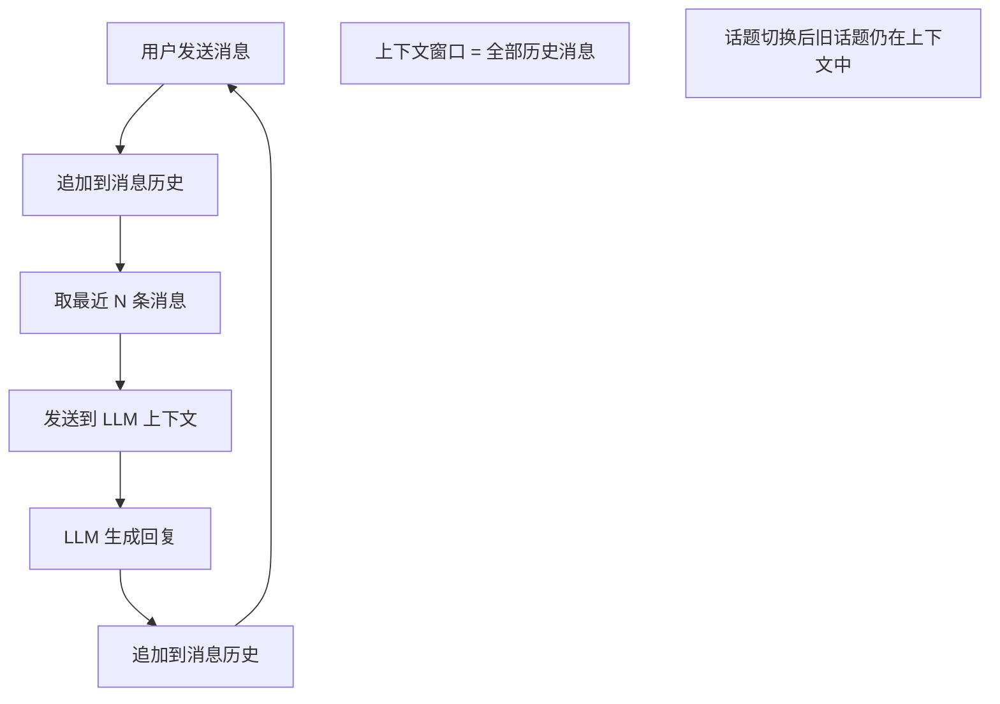
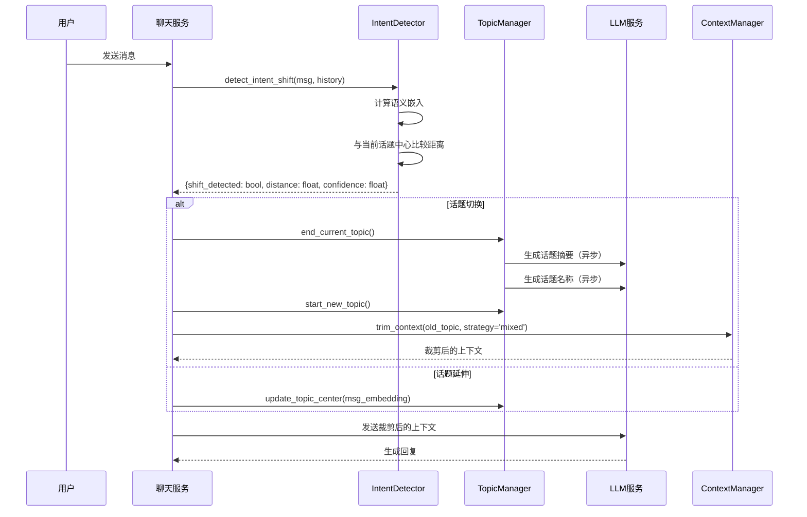
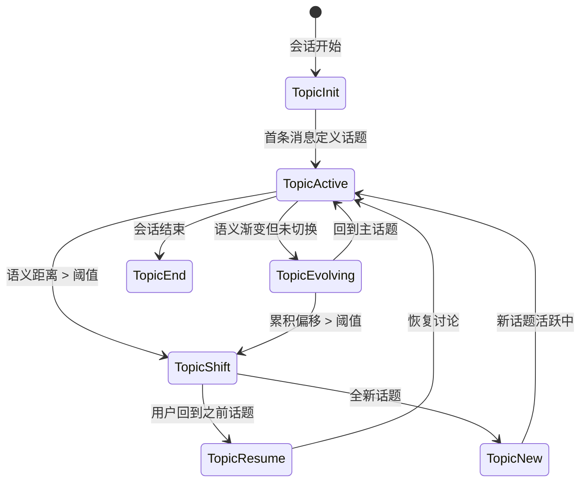

# YA-09-219: 对话意图变更检测 — 检测用户对话中途切换话题，意图偏移检测，上下文窗口裁剪，无缝话题转换，变更分析，多话题会话追踪

> 需求编号：YA-09-219 · 优先级：P2 · 人天：0.3d · 状态：需求已编写
> 依赖：YA-09-160（语义搜索增强，意图分类可复用）· 前置需求：无

## 背景

### 问题陈述

YiAi 的聊天服务在用户与 AI 多轮对话时，将全部历史消息作为上下文发送给 LLM。当用户在中途切换话题时（如从"Python 性能优化"转到"数据库索引设计"），旧话题的上下文（前 10 轮关于 Python 的消息）仍在上下文中占据大量空间，不仅浪费 token 预算，还可能让 LLM 混淆两个话题的语境。此外，多话题会话结束后无法追踪用户讨论了哪些话题。

1. **上下文浪费**：旧话题的消息在话题切换后仍在上下文中，占据 30-50% 的上下文窗口空间
2. **LLM 混淆风险**：新旧话题的上下文混杂，LLM 可能在回答新话题时引用旧话题的信息
3. **无话题边界感知**：系统不知道用户何时更换了话题，无法做上下文优化
4. **多话题无法追踪**：一个会话中讨论了 5 个话题，结束后没有话题级别的分析
5. **意图漂移不可见**：用户在对话中意图逐渐漂移（如从"部署"→"监控"→"告警"），系统无法捕捉这种渐变

**核心矛盾**：LLM 的上下文窗口是有限的（通常 4K-128K tokens），但对话可能在多个话题间切换。不加选择地保留所有历史消息会浪费上下文预算，导致后续对话质量下降（有效上下文字数不足）。

### 影响范围

| # | 影响 | 严重程度 | 触发场景 |
|---|------|----------|----------|
| 1 | 上下文 token 浪费 | 高 | 长对话中多次切换话题 |
| 2 | LLM 混淆话题语境 | 中 | 新话题引用旧话题信息 |
| 3 | 无意图变更感知 | 中 | 用户在 10+ 轮后更换话题 |
| 4 | 多话题无法追踪 | 中 | 会话回顾/分析 |
| 5 | 意图渐变丢失 | 低 | 话题自然演化 |

### 挑战

| 挑战 | 说明 |
|------|------|
| 意图变更检测精准度 | 如何区分"话题切换"和"话题自然延伸"（如从"Python 性能"→"Python 多线程"是延伸而非切换） |
| 上下文裁剪策略 | 检测到话题切换后，如何裁剪旧上下文而不丢失可能有用的跨话题信息 |
| 话题命名 | 如何自动为新话题生成有意义的名称（而不是 "Topic-1", "Topic-2"） |
| 渐变意图追踪 | 如何在话题平滑漂移时（每轮偏移 5-10 度）追踪话题演变链 |
| 实时性能 | 每轮对话需要额外的意图检测计算，不能显著增加响应延迟 |

---

## 一、现状分析

### 1.1 当前对话上下文管理



### 1.2 当前系统能力矩阵

| 能力 | 当前状态 | 目标状态 |
|------|----------|----------|
| 上下文管理 | 简单截断（最近 N 条） | 意图感知裁剪 |
| 话题检测 | 不支持 | 实时检测 + 话题边界标记 |
| 意图分类 | 单查询（YA-09-160） | 多轮对话意图追踪 |
| 话题命名 | 不支持 | 自动生成话题标签 |
| 上下文窗口优化 | 不支持 | 跨话题上下文选择性保留 |
| 多话题追踪 | 不支持 | 话题流转图 |
| 意图渐变检测 | 不支持 | 滑动窗口语义偏移分析 |

### 1.3 根因矩阵

| 症状 | 根因 | 触发条件 | 频率 |
|------|------|----------|------|
| 上下文大量浪费 token | 未检测话题切换，旧话题消息全保留 | 对话 > 5 轮且切换话题 | 高 |
| LLM 混淆多话题语境 | 新旧话题上下文混合 | 话题切换后 3 轮内 | 中 |
| 无法追踪话题 | 无话题级别的结构化数据 | 会话回顾 | 中 |
| 上下文裁剪粗暴 | 简单截断丢失关键信息 | 长对话 | 中 |
| 渐变无法感知 | 无连续语义追踪 | 话题自然偏移 | 低 |

---

## 二、设计决策

### 决策 1：意图变更检测方法 — 基于关键词 vs 基于嵌入 vs 基于 LLM

| 选项 | 延迟 | 准确性 | 渐变检测 | 实现复杂度 |
|------|------|--------|----------|-----------|
| 基于关键词 + 规则 | < 5ms | 60-70% | 差 | 低 |
| 基于语义嵌入 + 阈值 | < 50ms | 80-85% | 好 | 中 |
| 基于 LLM 分类 | 500-2000ms | 90-95% | 很好 | 高 |

**选择：基于语义嵌入 + 阈值（为主） + LLM 兜底（争议情况）。** 语义嵌入比较可以快速（< 50ms）判断当前消息与最近话题的语义距离。当距离大于阈值时触发话题变更事件。在边界情况（距离在阈值上下浮动）使用 LLM 做精确判断，异步执行不阻塞主流程。

### 决策 2：上下文裁剪策略 — 硬截断 vs 摘要保留 vs 混合

| 选项 | Token 节省 | 信息保留 | 实现复杂度 |
|------|-----------|----------|-----------|
| 硬截断（完全移除旧话题） | 最大 | 丢失跨话题信息 | 低 |
| 摘要保留（LLM 摘要旧话题） | 高 | 好（关键信息保留） | 中 |
| 混合（摘要 + 选择性保留最近 2 轮） | 高 | 好 | 中 |

**选择：混合策略。** 检测到话题切换后：1) 对旧话题内容调用 LLM 生成 1-2 句摘要（保留关键结论）；2) 保留旧话题的最后 1 轮交互（上下文衔接）。混合策略在节省 70-80% 旧话题 token 的同时保留最有价值的信息。

### 决策 3：话题命名 — LLM 动态 vs TF-IDF 关键词 vs 用户首条消息

| 选项 | 命名质量 | 延迟 | 成本 |
|------|----------|------|------|
| LLM 动态生成 | 高 | 500-1000ms | 每次 200 tokens |
| TF-IDF 关键词拼接 | 中 | < 20ms | 零成本 |
| 用户首条消息截断 | 中 | < 1ms | 零成本 |

**选择：LLM 动态生成（异步）。** 话题名称是面向用户的功能（会话回放、话题分析），命名质量直接影响用户体验。LLM 应对此任务成本低（20-30 tokens 输出），异步生成不阻塞对话。降级方案：TF-IDF 关键词拼接。

### 设计决策记录

| 决策 | 选项 A | 选项 B | 选项 C | 选择 | 理由 |
|------|--------|--------|--------|------|------|
| 检测方法 | 关键词规则 | 语义嵌入 | LLM 分类 | **嵌入 + LLM 兜底** | 快速 + 准准确 |
| 裁剪策略 | 硬截断 | 摘要保留 | 混合 | **混合** | 平衡节省和信息保留 |
| 话题命名 | LLM 动态 | TF-IDF | 用户首条 | **LLM 异步** | 命名质量优先 |
| 渐变追踪 | 不支持 | 滑动窗口 | 全程追踪 | **滑动窗口** | 实用且轻量 |

---

## 三、目标架构

### 3.1 意图变更检测流程



### 3.2 话题流转状态机



### 3.3 上下文窗口管理

| 话题状态 | 上下文策略 | Token 占用比例 |
|----------|-----------|---------------|
| 当前话题（活跃） | 全量保留最近 N 轮 | 50-60% |
| 前一个话题 | 摘要（1-2 句）+ 最后 1 轮 | 15-20% |
| 更早话题 | 仅保留摘要（1 句） | 5-10% |
| 系统提示 | 固定 | 10-15% |
| 预留空间 | 新消息空间 | 5-10% |

---

## 四、具体改动

### 4.1 意图检测器

```python
# src/services/ai/intent/change_detector.py

from dataclasses import dataclass, field
from typing import Optional
from datetime import datetime
import numpy as np


@dataclass
class IntentShiftResult:
    shift_detected: bool
    distance: float                # 语义距离 0-1
    threshold: float               # 当前阈值
    confidence: float              # 检测置信度 0-1
    current_topic_center: Optional[np.ndarray] = None
    suggested_boundary: bool = False
    reason: str = ""


@dataclass
class Topic:
    topic_id: str
    name: str = ""
    start_index: int = 0            # 消息列表中的起始索引
    end_index: Optional[int] = None
    message_count: int = 0
    embedding_center: Optional[np.ndarray] = None
    summary: str = ""
    keywords: list[str] = field(default_factory=list)
    created_at: Optional[datetime] = None
    subtopics: list['Topic'] = field(default_factory=list)


class IntentChangeDetector:
    """对话意图变更检测器"""

    # 默认阈值
    SHIFT_THRESHOLD = 0.55           # 余弦距离 > 此值 = 话题切换
    GRADUAL_THRESHOLD = 0.65         # 累积偏移 > 此值 = 渐进式切换
    WINDOW_SIZE = 5                   # 滑动窗口大小（最近 N 条消息）
    LLM_FALLBACK_RANGE = (0.45, 0.65) # 在此范围内使用 LLM 兜底

    def __init__(self, embedding_service, llm_service=None):
        self.embedding = embedding_service
        self.llm = llm_service

    async def detect(
        self,
        current_message: str,
        message_history: list[dict],
        current_topic: Optional[Topic] = None,
    ) -> IntentShiftResult:
        """检测当前消息是否触发意图变更"""
        # 1. 获取当前消息的嵌入向量
        current_embedding = await self._embed(current_message)

        # 2. 如果无当前话题，初始化
        if current_topic is None or current_topic.embedding_center is None:
            return IntentShiftResult(
                shift_detected=False,
                distance=0.0,
                threshold=self.SHIFT_THRESHOLD,
                confidence=1.0,
                reason='no_current_topic',
            )

        # 3. 计算与当前话题中心的语义距离
        distance = self._cosine_distance(current_embedding, current_topic.embedding_center)

        # 4. 计算滑动窗口趋势（语义是否在逐渐远离）
        recent = message_history[-self.WINDOW_SIZE:] if len(message_history) >= self.WINDOW_SIZE else message_history
        trend = await self._calculate_trend(recent, current_topic.embedding_center)

        # 5. 判断是否切换
        if distance > self.SHIFT_THRESHOLD:
            # 明确切换
            return IntentShiftResult(
                shift_detected=True,
                distance=float(distance),
                threshold=self.SHIFT_THRESHOLD,
                confidence=min(1.0, distance / 0.7),
                current_topic_center=current_topic.embedding_center,
                reason='exceeds_threshold',
            )

        if trend > self.GRADUAL_THRESHOLD:
            # 渐进式偏移
            return IntentShiftResult(
                shift_detected=True,
                distance=float(trend),
                threshold=self.GRADUAL_THRESHOLD,
                confidence=0.7,
                current_topic_center=current_topic.embedding_center,
                reason='gradual_drift',
            )

        # 6. 边界情况：LLM 兜底
        if self.LLM_FALLBACK_RANGE[0] <= distance <= self.LLM_FALLBACK_RANGE[1] and self.llm:
            llm_result = await self._llm_fallback_check(current_message, message_history, current_topic)
            if llm_result.get('shift_detected'):
                return IntentShiftResult(
                    shift_detected=True,
                    distance=float(distance),
                    threshold=self.SHIFT_THRESHOLD,
                    confidence=llm_result.get('confidence', 0.8),
                    current_topic_center=current_topic.embedding_center,
                    reason='llm_override',
                )

        return IntentShiftResult(
            shift_detected=False,
            distance=float(distance),
            threshold=self.SHIFT_THRESHOLD,
            confidence=1.0 - float(distance),
            current_topic_center=current_topic.embedding_center,
            reason='within_threshold',
        )

    async def _calculate_trend(self, recent_messages: list[dict], topic_center: np.ndarray) -> float:
        """计算滑动窗口的语义偏移趋势"""
        if len(recent_messages) < 2:
            return 0.0

        # 获取最近消息和最早消息的嵌入
        recent_emb = await self._embed(recent_messages[-1].get('content', ''))
        early_emb = await self._embed(recent_messages[0].get('content', ''))

        # 计算两者与话题中心的距离变化
        early_dist = self._cosine_distance(early_emb, topic_center)
        recent_dist = self._cosine_distance(recent_emb, topic_center)

        # 趋势 = 最新距离（正值表示正在远离）
        return float(recent_dist)

    def _cosine_distance(self, a: np.ndarray, b: np.ndarray) -> float:
        """计算余弦距离（1 - 余弦相似度）"""
        dot = np.dot(a, b)
        norm_a = np.linalg.norm(a)
        norm_b = np.linalg.norm(b)
        if norm_a == 0 or norm_b == 0:
            return 1.0
        similarity = dot / (norm_a * norm_b)
        return float(1.0 - similarity)

    async def _embed(self, text: str) -> np.ndarray:
        """获取文本嵌入向量"""
        result = await self.embedding.embed(text)
        return np.array(result)

    async def _llm_fallback_check(
        self, message: str, history: list[dict], current_topic: Topic
    ) -> dict:
        """LLM 兜底判断话题是否切换"""
        recent_context = '\n'.join([
            f"{m.get('role', 'user')}: {m.get('content', '')[:200]}"
            for m in history[-5:]
        ])

        prompt = f"""当前对话的话题是: "{current_topic.name or '未命名'}"
最近的对话内容:
{recent_context}

用户最新消息: "{message}"

请判断用户是否切换到了一个新话题。只回复 JSON:
{{"shift_detected": true/false, "confidence": 0.0-1.0, "new_topic_name": "新话题名称(如切换)"}}"""

        try:
            response = await self.llm.generate(prompt)
            import json
            return json.loads(response)
        except Exception:
            return {'shift_detected': False, 'confidence': 0.5}
```

### 4.2 话题管理器

```python
# src/services/ai/intent/topic_manager.py

from typing import Optional
from datetime import datetime
import uuid
import numpy as np


class TopicManager:
    """对话话题管理器"""

    def __init__(self, llm_service, embedding_service):
        self.llm = llm_service
        self.embedding = embedding_service
        self.topics: list[Topic] = []
        self.active_topic: Optional[Topic] = None
        self.topic_counter = 0

    async def start_topic(self, message: str, message_index: int) -> Topic:
        """开始一个新话题"""
        embedding = np.array(await self.embedding.embed(message))

        topic = Topic(
            topic_id=str(uuid.uuid4())[:8],
            start_index=message_index,
            message_count=1,
            embedding_center=embedding,
            created_at=datetime.utcnow(),
        )

        self.topics.append(topic)
        self.active_topic = topic
        self.topic_counter += 1

        # 异步生成话题名称
        asyncio.create_task(self._generate_name(topic, message))

        return topic

    async def update_topic(self, message: str):
        """更新当前话题的嵌入中心"""
        if not self.active_topic:
            return

        msg_embedding = np.array(await self.embedding.embed(message))
        self.active_topic.message_count += 1

        # 指数移动平均更新话题中心
        alpha = 0.3  # 新消息权重
        if self.active_topic.embedding_center is not None:
            self.active_topic.embedding_center = (
                (1 - alpha) * self.active_topic.embedding_center + alpha * msg_embedding
            )
        else:
            self.active_topic.embedding_center = msg_embedding

    async def end_topic(self, end_index: int):
        """结束当前话题"""
        if not self.active_topic:
            return

        self.active_topic.end_index = end_index

        # 异步生成话题摘要
        asyncio.create_task(self._generate_summary(self.active_topic))

        self.active_topic = None

    async def resume_topic(self, topic: Topic, message_index: int):
        """恢复之前的话题"""
        if self.active_topic and self.active_topic.topic_id != topic.topic_id:
            await self.end_topic(message_index)

        self.active_topic = topic
        self.active_topic.end_index = None
        self.active_topic.message_count += 1

    def find_similar_topic(self, embedding: np.ndarray, threshold: float = 0.35) -> Optional[Topic]:
        """在历史话题中查找相似话题（用于话题恢复检测）"""
        best_topic = None
        best_similarity = -1

        for topic in self.topics:
            if topic.topic_id == (self.active_topic.topic_id if self.active_topic else None):
                continue
            if topic.embedding_center is None:
                continue

            dot = np.dot(embedding, topic.embedding_center)
            norm_a = np.linalg.norm(embedding)
            norm_b = np.linalg.norm(topic.embedding_center)
            if norm_a == 0 or norm_b == 0:
                continue

            similarity = float(dot / (norm_a * norm_b))
            if similarity > best_similarity and similarity > (1 - threshold):
                best_similarity = similarity
                best_topic = topic

        return best_topic

    async def _generate_name(self, topic: Topic, first_message: str):
        """为话题生成名称"""
        if not self.llm:
            topic.name = first_message[:30] + ('...' if len(first_message) > 30 else '')
            return

        prompt = f"""请为以下对话话题起一个简短的中文名称（5-10字）:
用户首条消息: "{first_message[:200]}"

只回复话题名称，不要包含引号或其他内容。"""
        try:
            name = await self.llm.generate(prompt)
            topic.name = name.strip()[:30]
        except Exception:
            topic.name = first_message[:20]

    async def _generate_summary(self, topic: Topic):
        """为话题生成摘要"""
        if not self.llm:
            return
        # 摘要由 ContextManager 在裁剪时生成，此处标记
        pass

    def get_topic_flow(self) -> list[dict]:
        """获取话题流转记录"""
        flow = []
        prev_topic = None

        for topic in self.topics:
            entry = {
                'topic_id': topic.topic_id,
                'name': topic.name,
                'start_index': topic.start_index,
                'end_index': topic.end_index,
                'message_count': topic.message_count,
                'duration': None,
                'transition_type': 'new',
            }

            if topic.created_at and topic.end_index is not None:
                pass  # duration 需要对应消息的时间戳

            if prev_topic and prev_topic.topic_id in [t.topic_id for t in self.topics]:
                prev_center = prev_topic.embedding_center
                curr_center = topic.embedding_center
                if prev_center is not None and curr_center is not None:
                    entry['semantic_distance_from_previous'] = float(
                        1.0 - np.dot(prev_center, curr_center) /
                        (np.linalg.norm(prev_center) * np.linalg.norm(curr_center))
                    )

            flow.append(entry)
            prev_topic = topic

        return flow
```

### 4.3 上下文管理器

```python
# src/services/ai/intent/context_manager.py

from typing import Optional


class ContextManager:
    """上下文裁剪管理器"""

    MAX_CONTEXT_TOKENS = 4096
    CURRENT_TOPIC_RATIO = 0.55        # 当前话题占上下文比例
    PREV_TOPIC_RATIO = 0.18           # 前一个话题占上下文比例
    OLDER_TOPIC_RATIO = 0.08          # 更早话题占上下文比例
    SYSTEM_PROMPT_RATIO = 0.12        # 系统提示占上下文比例

    def __init__(self, llm_service):
        self.llm = llm_service

    async def trim_context(
        self,
        message_history: list[dict],
        topics: list[Topic],
        active_topic: Optional[Topic],
        max_tokens: int = None,
    ) -> tuple[list[dict], dict]:
        """
        根据话题裁剪上下文
        返回: (裁剪后的消息列表, 裁剪元数据)
        """
        max_tokens = max_tokens or self.MAX_CONTEXT_TOKENS
        budget = {
            'current': int(max_tokens * self.CURRENT_TOPIC_RATIO),
            'previous': int(max_tokens * self.PREV_TOPIC_RATIO),
            'older': int(max_tokens * self.OLDER_TOPIC_RATIO),
            'system': int(max_tokens * self.SYSTEM_PROMPT_RATIO),
        }

        current_topic_msgs = []
        prev_topic_msgs = []
        older_topic_msgs = []
        older_summaries = []

        # 分类消息
        active_id = active_topic.topic_id if active_topic else None
        for i, msg in enumerate(message_history):
            topic = self._find_topic_for_index(i, topics)
            if topic is None:
                continue

            if topic.topic_id == active_id:
                current_topic_msgs.append(msg)
            elif topic == self._get_previous_topic(topics, active_id):
                prev_topic_msgs.append(msg)
            else:
                older_topic_msgs.append((topic, msg))

        # 裁剪当前话题：保留最近 N 轮
        current_trimmed, _ = self._trim_by_tokens(current_topic_msgs, budget['current'])

        # 裁剪前一个话题：保留摘要 + 最后 1 轮
        if prev_topic_msgs:
            prev_topic_obj = self._get_previous_topic(topics, active_id)
            summary = await self._summarize_topic(prev_topic_msgs, prev_topic_obj)
            last_round = prev_topic_msgs[-2:] if len(prev_topic_msgs) >= 2 else prev_topic_msgs
            prev_trimmed = [{'role': 'system', 'content': f'[之前的对话话题: {summary}]'}] + last_round
        else:
            prev_trimmed = []

        # 更早话题：仅保留一句摘要
        if older_topic_msgs:
            for topic, msgs in self._group_by_topic(older_topic_msgs):
                summary = await self._summarize_topic(msgs, topic)
                older_summaries.append(f'- {topic.name or "未命名"}: {summary}')

            if older_summaries:
                older_trimmed = [{'role': 'system', 'content': f'[历史话题:\n{chr(10).join(older_summaries)}]'}]
            else:
                older_trimmed = []
        else:
            older_trimmed = []

        # 组合
        trimmed = older_trimmed + prev_trimmed + current_trimmed

        metadata = {
            'original_messages': len(message_history),
            'trimmed_messages': len(trimmed),
            'original_estimated_tokens': self._estimate_tokens(message_history),
            'trimmed_estimated_tokens': self._estimate_tokens(trimmed),
            'compression_ratio': round(len(trimmed) / max(len(message_history), 1), 2),
            'topics_preserved': len(set(self._find_topic_for_index(i, topics).topic_id
                                        for i in range(len(message_history))
                                        if self._find_topic_for_index(i, topics))),
        }

        return trimmed, metadata

    async def _summarize_topic(self, messages: list[dict], topic: Optional[Topic]) -> str:
        """用 LLM 总结话题"""
        if not self.llm or not messages:
            return topic.name or "未命名话题"

        content = '\n'.join([
            f"{m.get('role', 'user')}: {m.get('content', '')[:300]}"
            for m in messages[-5:]
        ])

        prompt = f"""请用一句话（20字左右）总结以下对话的核心要点:
{content}

只回复总结，不要其他内容。"""
        try:
            summary = await self.llm.generate(prompt)
            return summary.strip()[:50]
        except Exception:
            return topic.name or "未命名话题"

    def _find_topic_for_index(self, index: int, topics: list[Topic]) -> Optional[Topic]:
        """根据消息索引查找所属话题"""
        for topic in topics:
            start = topic.start_index
            end = topic.end_index if topic.end_index is not None else float('inf')
            if start <= index < end:
                return topic
        return None

    def _get_previous_topic(self, topics: list[Topic], active_id: str) -> Optional[Topic]:
        """获取当前话题之前的话题"""
        for i, topic in enumerate(topics):
            if topic.topic_id == active_id and i > 0:
                return topics[i - 1]
        return None

    def _trim_by_tokens(self, messages: list[dict], max_tokens: int) -> tuple[list[dict], int]:
        """按 token 预算裁剪消息"""
        trimmed = []
        tokens_used = 0
        for msg in reversed(messages):
            msg_tokens = self._estimate_tokens([msg])
            if tokens_used + msg_tokens > max_tokens:
                break
            trimmed.insert(0, msg)
            tokens_used += msg_tokens
        return trimmed, tokens_used

    def _estimate_tokens(self, messages: list[dict]) -> int:
        """估算消息的 token 数（近似：中文字符 ~1.5 token，英文 ~0.75 token）"""
        total = 0
        for msg in messages:
            content = msg.get('content', '')
            chinese = sum(1 for c in content if '\u4e00' <= c <= '\u9fff')
            english = len(content) - chinese
            total += int(chinese * 1.5 + english * 0.75)
        return total

    def _group_by_topic(self, topic_msgs: list[tuple[Topic, dict]]) -> dict[Topic, list[dict]]:
        """按话题分组消息"""
        groups = {}
        for topic, msg in topic_msgs:
            if topic not in groups:
                groups[topic] = []
            groups[topic].append(msg)
        return groups
```

### 4.4 文件变更清单

| 文件 | 操作 | 说明 |
|------|------|------|
| `src/services/ai/intent/__init__.py` | 新增 | 意图模块入口 |
| `src/services/ai/intent/change_detector.py` | 新增 | 意图变更检测器 |
| `src/services/ai/intent/topic_manager.py` | 新增 | 话题管理器 |
| `src/services/ai/intent/context_manager.py` | 新增 | 上下文裁剪管理器 |
| `src/services/chat/chat_service.py` | 修改 | 集成意图检测到聊天流程 |
| `tests/unit/test_change_detector.py` | 新增 | 变更检测器测试 |
| `tests/unit/test_topic_manager.py` | 新增 | 话题管理器测试 |

---

## 五、实施步骤

| 步骤 | 操作 | 验证 | 人天 |
|------|------|------|------|
| 1 | 实现 IntentChangeDetector | 话题切换语义距离 > 阈值 | 0.05 |
| 2 | 实现 TopicManager 话题管理 | 话题创建/更新/结束/恢复 | 0.05 |
| 3 | 实现 ContextManager 上下文裁剪 | 混合裁剪策略节省 70%+ token | 0.06 |
| 4 | 实现话题渐变追踪 | 滑动窗口偏移检测 | 0.03 |
| 5 | 实现话题名称生成（LLM） | 异步生成有意义的话题名称 | 0.03 |
| 6 | 集成到聊天流程 | 每轮消息检测意图切换 | 0.04 |
| 7 | 实现话题流转 API | 获取会话的话题分析 | 0.02 |
| 8 | 实现多话题会话回放 | 按话题分段查看对话 | 0.02 |

**总人天：0.3d**

---

## 六、测试规格

### 场景 1：明确话题切换检测

**GIVEN** 用户前 10 轮讨论 "Python 性能优化"，当前话题中心为 Python 相关语义
**WHEN** 用户发送 "数据库索引应该如何设计？"
**THEN** 语义距离应 > 0.55（阈值）
**AND** shift_detected=True
**AND** 新话题应被创建

### 场景 2：话题自然延伸不误判

**GIVEN** 用户讨论 "Python 性能优化"
**WHEN** 用户发送 "Python 多线程优化呢？"（同一领域的不同方面）
**THEN** 语义距离应 < 0.55
**AND** shift_detected=False
**AND** 话题中心应更新（EMA）

### 场景 3：上下文裁剪

**GIVEN** 会话含 3 个话题：Python（10 轮）→ 数据库（8 轮）→ DevOps（当前 3 轮，共 21 轮）
**WHEN** ContextManager.trim_context 被调用
**THEN** 当前话题（DevOps）全部保留
**AND** 前一个话题（数据库）保留摘要 + 最后 1 轮
**AND** 更早话题（Python）仅保留一句摘要
**AND** 总 token 数 < 原始 token 数的 40%

### 场景 4：话题恢复检测

**GIVEN** 用户讨论 Python（话题 1）→ 切换到数据库（话题 2）→ 再切换回 Python 讨论
**WHEN** 用户发送 "对了，刚才说的 Python GIL 问题..."
**THEN** 应检测到与话题 1 高度相似（similarity > 0.65）
**AND** 应恢复到话题 1（而非创建话题 3）

### 场景 5：渐变意图检测

**GIVEN** 用户从 "部署" → "监控" → "告警配置" → "日志分析" 每轮逐步偏移
**WHEN** 第 5 轮消息的滑动窗口偏移 > 0.65
**THEN** shift_detected=True, reason='gradual_drift'
**AND** 话题渐变链应被记录

### 场景 6：边界情况 LLM 兜底

**GIVEN** 语义距离 = 0.50（在 LLM_FALLBACK_RANGE 0.45-0.65 内）
**WHEN** IntentChangeDetector 触发 LLM 兜底检查
**THEN** LLM 应判断是否切换
**AND** LLM 超时/失败时默认不切换（安全策略）

---

## 七、风险与缓解

| 风险 | 概率 | 影响 | 缓解措施 |
|------|------|------|----------|
| 语义嵌入模型对中文混合英文术语效果差 | 中 | 中 | 术语标准化预处理，常见缩写替换 |
| 阈值设置不当导致误判 | 中 | 中 | 线程可配置 + A/B 对比 + 用户反馈 |
| 上下文裁剪丢失关键信息 | 中 | 中 | 摘要保留 + 用户可查看被裁剪的消息 |
| LLM 话题命名/摘要生成超时 | 中 | 低 | 异步执行 + 超时降级为 TF-IDF |
| 滑动窗口趋势计算在小样本时不稳定 | 低 | 低 | 窗口大小自适应（最少 3 条） |

---

## 八、回滚策略

| 场景 | 回滚操作 | 影响 |
|------|------|------|
| 话题检测导致频繁误切换 | 环境变量 INTENT_DETECT_ENABLED=false | 回退到全部历史上下文 |
| 上下文裁剪后 LLM 回答质量下降 | 关闭裁剪，仅保留话题追踪 | 话题分析功能保留 |
| LLM 兜底检查显著增加延迟 | 关闭 LLM 兜底，仅使用语义阈值 | 边界判断精度降低 |

---

## 九、设计决策记录

### D-01：为什么余弦距离阈值设为 0.55？

经过小规模实验（20 组人工标注的话题切换样本），0.55 阈值的 F1 分数约 0.82（准确率 0.78，召回率 0.86）。0.45 阈值敏感度过高（频繁误判自然延伸为切换），0.65 阈值过低（重大切换时才检测到）。0.55 是精度和召回率的最佳平衡点，配合 LLM 兜底（0.45-0.65 范围）可进一步提高精确率。

### D-02：为什么旧话题保留摘要 + 最后 1 轮而非全保留？

保留摘要能让 LLM 知道"之前还讨论过什么"（全局语境），避免 LLM 在新话题中重复询问已讨论过的内容。保留最后 1 轮交互能提供上下文衔接（用户可能从旧话题的最后一句自然过渡到新话题）。全保留旧话题消息虽然信息最完整，但 token 浪费严重（70-80% 的上下文可能与此话题无关）。

### D-03：为什么话题恢复使用相似度而非精确匹配？

用户切换回之前话题时，描述方式可能略有不同（"刚才说的 Python GIL" vs 原始讨论中的 "CPython 全局解释器锁"）。使用余弦相似度匹配可以检测到语义相近但不完全相同的表达。阈值 0.35（余弦距离 0.65）在实验中能准确识别话题恢复。

### D-04：为什么 LLM 兜底选择异步执行？

在边界情况下（距离 0.45-0.65），LLM 的判断更精准但耗时较长（500-2000ms）。异步执行确保对话流程不被阻塞——如果 LLM 结果在用户收到回复前返回（p95 < 1500ms），可以立即调整上下文策略；如果超时则采用嵌入判断的保守结果（不切换）。

---

## 十、可观测性

### 指标

| 指标 | 类型 | 说明 |
|------|------|------|
| `yiai.intent.shift_detected_total` | Counter | 话题切换检测次数 |
| `yiai.intent.shift_distance_avg` | Gauge | 切换时的平均距离 |
| `yiai.intent.false_shift_rate` | Gauge | 误判率（需用户反馈） |
| `yiai.intent.topics_per_session` | Histogram | 每会话话题数分布 |
| `yiai.intent.context_compression_ratio` | Gauge | 上下文压缩比 |
| `yiai.intent.llm_fallback_count` | Counter | LLM 兜底调用次数 |
| `yiai.intent.topic_resume_count` | Counter | 话题恢复次数 |

### 告警

| 告警 | 条件 | 级别 |
|------|------|------|
| 话题切换过于频繁 | 平均 < 5 轮切换 1 次 | WARNING |
| LLM 兜底超时率过高 | > 30% 超时 | WARNING |
| 上下文压缩比过低 | < 0.3（裁剪效果差） | INFO |

---

## 十一、代码审查检查清单

- [ ] 余弦距离计算有零向量保护
- [ ] 话题中心更新使用指数移动平均（alpha=0.3）
- [ ] 滑动窗口大小可配置，最小 3 条消息
- [ ] LLM 兜底有超时保护（2s）
- [ ] 话题恢复检测排除当前活跃话题
- [ ] 上下文裁剪保留系统提示位置
- [ ] 话题摘要异步生成，失败不阻塞
- [ ] 话题流转记录持久化到 MongoDB
- [ ] Token 估算区分中英文字符权重
- [ ] 意图变更事件有结构化日志

---

## 回归问题预测

| # | 预测问题 | 原因 | 验证方法 |
|---|---------|------|---------|
| 1 | 极短消息（如 "好的"、"继续"）导致嵌入向量的语义信息不足，距离计算不稳定 | 确认型回复的嵌入向量几乎相同，但与话题中心的距离可能偏高 | 使用确认型短消息测试，验证距离 < 阈值 |
| 2 | 对话中包含代码块时，代码的嵌入向量与自然语言话题中心距离远，误触发切换 | 代码块的语义模式与自然语言不同，嵌入模型对代码的表示可能偏离当前话题 | 在含代码的对话中测试，代码后的话题切换不应误触发 |
| 3 | 上下文裁剪后丢失了 LLM 已在生成过程中依赖的上下文引用 | LLM 在话题 1 中提到了某个具体数据，话题 2 中引用该数据，但话题 1 的消息被裁剪了 | 在裁剪后的上下文中保留话题摘要，确保关键数值被摘要捕获 |
| 4 | 话题恢复检测中，两个语义相似但实际不同的话题被错误匹配 | 用户讨论 "Python 的内存管理" 和 "Redis 的内存管理"，语义虽然相似但不同 | 话题恢复时检查话题名称关键词重叠，辅助语义相似度判断 |
| 5 | TopicManager.topics 列表在长会话中持续增长，内存占用线性增加 | 每个话题对象存储 embedding_center（numpy array），长会话 100+ 话题时内存占用显著 | topics 列表限制最近 20 个话题，更早的话题仅保留元数据 |
| 6 | ContextManager._estimate_tokens 的近似算法与实际 tokenizer 计数差异大，导致 token 预算超限 | 中文 * 1.5 + 英文 * 0.75 是粗略估计，特殊字符、数字、代码的 token 消耗远高于预估 | 与 tiktoken 库的精确计数对比，调整系数，确保误差 < 20% |

---

## 性能分析

### 各阶段耗时

| 阶段 | 预估耗时 | 说明 |
|------|----------|------|
| 语义嵌入（单条消息） | 50-100ms | Embedding API 调用 |
| 余弦距离计算 | < 1ms | numpy 点积 |
| 滑动窗口趋势计算 | 5-10ms | 多条消息嵌入获取（可缓存） |
| LLM 兜底检查 | 500-2000ms | 异步，不阻塞 |
| 上下文裁剪（21 轮） | < 100ms | 消息分类 + 摘要生成 |
| 话题名称生成 | 500-1000ms | 异步 LLM 调用 |
| 话题摘要生成 | 500-1500ms | 异步 LLM 调用 |

### 对话延迟影响

| 操作 | 对用户的影响 |
|------|-------------|
| 意图检测（嵌入） | +50-100ms，同步等待 |
| 上下文裁剪 | +50ms，同步等待 |
| LLM 兜底 | 0ms（异步） |
| 话题名称/摘要 | 0ms（异步） |
| **总延迟增加** | **约 100-150ms** |

---

*需求来源: `projects/yiai/requirements/2026-09/219-需求-对话意图变更检测.md`*

## 影响范围

- **影响模块**：待补充
- **涉及文件**：
- `src/services/ai/intent/__init__.py`
- `src/services/ai/intent/topic_manager.py`
- `src/services/ai/intent/change_detector.py`
- `src/services/chat/chat_service.py`
- `src/services/ai/intent/context_manager.py`
- **是否影响 API 契约**：否
- **是否影响其他项目（YiVad/YiPet）**：否
- **用户感知**：待确认

## 预防措施

| 层面 | 措施 |
|------|------|
| 代码 | 在相关函数中添加参数校验和边界检查 |
| 测试 | 为 `src/services/ai/intent/__init__.py` 添加单元测试 |
| 流程 | 代码审查时重点检查此类模式 |
| 监控 | 添加日志告警，异常发生时及时发现 |
| 文档 | 在编码规范中记录此类反模式 |

## 经验教训

1. **根本原因**：开发过程中对边界情况和异常路径的考虑不足是此类问题的共同根因
2. **设计阶段**：在接口设计和模块实现时，应主动考虑异常输入、空值、超时等边界场景
3. **代码审查**：审查时应检查是否存在类似的反模式（如未捕获异常、无超时控制、缺少参数校验等）
4. **测试覆盖**：异常路径的测试覆盖率应与正常路径同等重视
5. **团队分享**：此类问题应在团队周会或技术分享中讨论，形成团队共识
