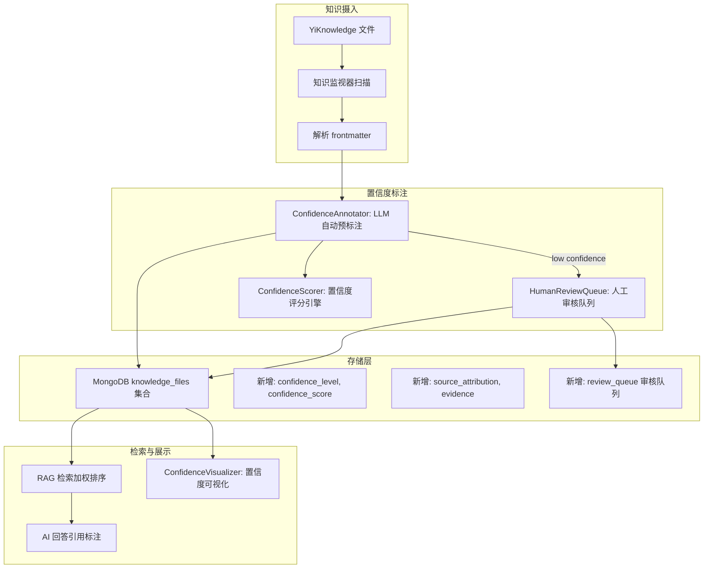
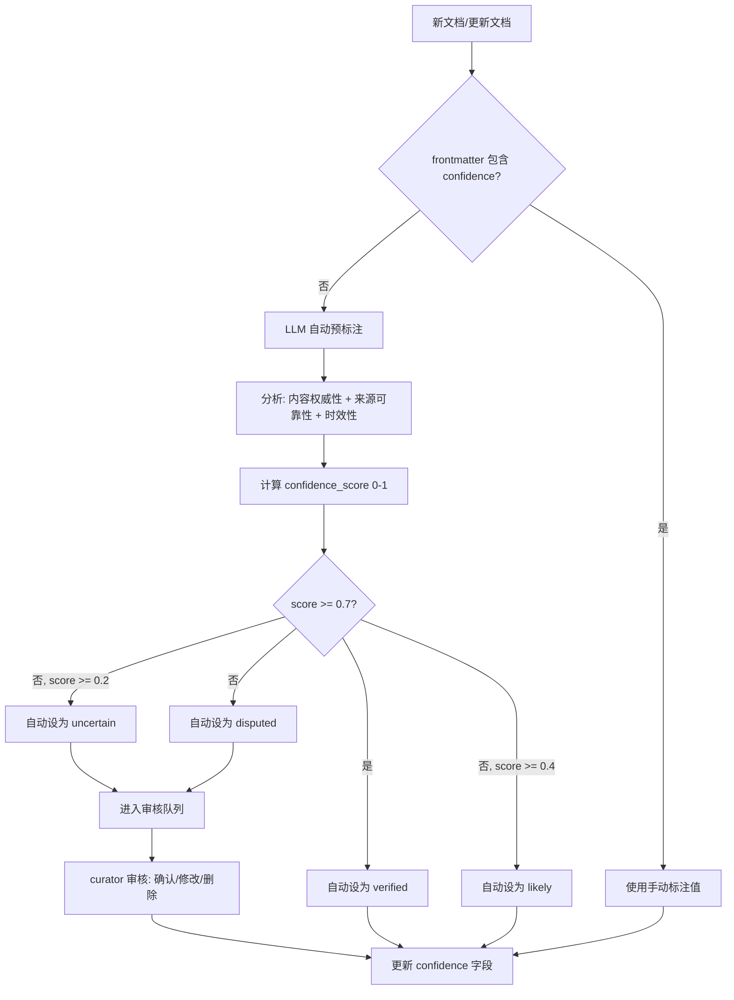

# YA-09-220: 知识置信度标注 — 知识库事实置信度分级标注，来源归因，置信度可视化，低置信度事实审核队列

> 需求编号：YA-09-220 · 优先级：P2 · 人天：0.3d · 状态：需求已编写
> 依赖：YA-09-191（答案溯源与引用）· 前置需求：无

## 背景

### 问题陈述

YiAi 的知识库（YiKnowledge）通过 RAG 为用户提供知识检索和问答服务。然而，知识库中的事实信息置信度参差不齐：有的来自官方文档（高可信度），有的来自社区讨论（中等可信度），有的是经验总结（低可信度），甚至是过时或被证伪的信息。当前系统对所有知识一视同仁，AI 在回答时无法区分"确定的官方信息"和"不确定的个人经验"。

1. **知识质量不透明**：用户无法判断检索到的知识是否可靠
2. **过时信息无标记**：版本变更后旧文档仍以同等置信度被检索
3. **个人经验与官方文档混淆**：社区经验帖和官方文档在检索结果中平级展示
4. **无来源归因**：知识缺乏明确的来源追溯，用户无法验证事实
5. **低质量知识无审核机制**：被标记为低置信度的知识没有集中审核和修正流程

**核心矛盾**：知识库作为 RAG 的数据源，其内容质量直接影响 AI 回答的可靠性。当前"所有知识平等的"模型无法区分事实的可靠程度，导致 AI 可能基于低质量知识给出错误回答，用户对此毫不知情。

### 影响范围

| # | 影响 | 严重程度 | 触发场景 |
|---|------|----------|----------|
| 1 | 低质量知识影响 AI 回答准确性 | 高 | 知识库含社区经验/个人总结 |
| 2 | 用户无法辨别信息可靠性 | 高 | 搜索结果同时包含官方和社区内容 |
| 3 | 过时知识持续被检索 | 中 | 版本更新后旧文档未标记 |
| 4 | 知识来源不可追溯 | 中 | 提出"这个结论从哪里来的" |
| 5 | 低质量知识无审核流程 | 中 | 需要规范和清理知识库 |

### 挑战

| 挑战 | 说明 |
|------|------|
| 置信度标注的主观性 | 同一事实不同人会给出不同的置信度评级 |
| 批量标注效率 | 知识库有数百篇文档，逐一人工标注不现实 |
| 置信度动态变化 | 今天高置信度的知识可能明天就过时或证伪 |
| 置信度与检索排序的整合 | 如何让置信度影响检索结果的排序权重 |
| 来源归因粒度 | 来源归因到文档级还是段落/句子级 |

---

## 一、现状分析

### 1.1 当前知识库状态

```
当前知识库（YiKnowledge）:
├── YiKnowledge markdown 目录树
│   ├── frontmatter: title, tags, category, status, type
│   └── 置信度字段: ❌ 不存在
├── MongoDB knowledge_files 集合
│   ├── path, title, tags, category, frontmatter
│   ├── embedding_vector（用于 RAG 检索）
│   └── confidence_level: ❌ 不存在
│       confidence_score: ❌ 不存在
│       source_attribution: ❌ 不存在
├── RAG 检索
│   └── 所有文档平等对待
└── AI 回答
    └── 无"此信息置信度"提示

缺失:
├── 置信度级别: verified/likely/uncertain/disputed
├── 置信度评分: 0.0-1.0
├── 来源归因: 文档级/段落级
├── 审核队列: 低置信度事实
├── 置信度可视化
└── 置信度影响检索排序
```

### 1.2 根因矩阵

| 症状 | 根因 | 触发条件 | 频率 |
|------|------|----------|------|
| AI 基于不可靠知识回答 | 知识无置信度标记 | 检索到低质量文档 | 中 |
| 用户无法分辨信息可靠性 | 搜索结果无置信度标识 | 多来源知识 | 高 |
| 过时知识被持续使用 | 无时效性标记和置信度降级 | 版本变更 | 中 |
| 来源无法追溯 | frontmatter 无 source 归因字段 | 需要引用来源 | 中 |
| 低质量知识堆积 | 无审核和清理机制 | 知识库持续增长 | 低 |

---

## 二、设计决策

### 决策 1：置信度分级 — 3 级 vs 4 级 vs 5 级

| 选项 | 区分度 | 标注成本 | 用户理解 | 实现复杂度 |
|------|--------|----------|----------|-----------|
| 3 级（高/中/低） | 中 | 低 | 高 | 低 |
| 4 级（verified/likely/uncertain/disputed） | 高 | 中 | 高 | 中 |
| 5 级（A/B/C/D/E） | 很高 | 高 | 低（混淆） | 中 |

**选择：4 级（verified/likely/uncertain/disputed）。** 4 级提供了足够的区分度：verified（官方文档/正式发布）、likely（多次验证的经验/广泛认可的实践）、uncertain（单次经验/未验证的假设）、disputed（被质疑或证伪的信息）。3 级区分度不够（中等级别模糊），5 级区分过度（用户难以区分 B 和 C 的语义差异）。

### 决策 2：标注方式 — 纯人工 vs 纯自动 vs 人机协同

| 选项 | 效率 | 准确率 | 可持续性 | 实现复杂度 |
|------|------|--------|----------|-----------|
| 纯人工（手动标注每篇文档） | 低 | 高 | 差（知识增长快） | 低 |
| 纯自动（LLM 自动判断置信度） | 高 | 中 | 好 | 中 |
| 人机协同（LLM 预标注 + 人工审核） | 高 | 高 | 好 | 中 |

**选择：人机协同（LLM 预标注 + 人工审核）。** LLM 自动读取文档内容和来源信息，给出初步的置信度评级和评分。verified 和 likely 级别的自动标注直接生效；uncertain 和 disputed 级别的进入审核队列，由 curator 确认或修改。这平衡了效率和准确率。

### 决策 3：来源归因粒度 — 文件级 vs 段落级 vs 句子级

| 选项 | 实现复杂度 | 维护成本 | 追溯精度 | 标注粒度 |
|------|-----------|----------|----------|----------|
| 文件级（整篇文档一个来源） | 低 | 低 | 粗 | 与文档一致 |
| 段落级（每个段落标注来源） | 高 | 高 | 中 | 需拆分文档 |
| 句子级（每个事实一个来源） | 很高 | 很高 | 细 | 运维成本高 |

**选择：文件级 + 段落级引用标注。** 大部分知识文件的来源是单一的（一个官方文档链接或一次经验总结），文件级来源归因覆盖 80% 的场景。对于引用多个来源的文档，在段落中使用标记 `[source: url]` 进行段落级标注。句子级过于细粒度，维护成本不可持续。

### 设计决策记录

| 决策 | 选项 A | 选项 B | 选项 C | 选择 | 理由 |
|------|--------|--------|--------|------|------|
| 置信度分级 | 3 级 | 4 级 | 5 级 | **4 级** | 区分度与用户理解平衡 |
| 标注方式 | 纯人工 | 纯自动 | 人机协同 | **人机协同** | 效率 + 准确率 |
| 来源归因 | 文件级 | 段落级 | 句子级 | **文件级 + 段落引用** | 80/20 原则 |
| 检索影响 | 不影响 | 加权排序 | 过滤低置信度 | **加权排序** | 灵活性优先 |

---

## 三、目标架构

### 3.1 置信度系统架构



### 3.2 置信度标注流程



### 3.3 置信度级别定义

| 级别 | 标识 | 颜色 | 分数范围 | 定义 | 示例 |
|------|------|------|----------|------|------|
| verified | 已验证 | 绿色 #28a745 | 0.8-1.0 | 官方文档、正式发布、多方验证 | Python 官方文档、RFC 标准 |
| likely | 很可能 | 蓝色 #17a2b8 | 0.5-0.8 | 广泛认可、多次验证的经验 | 业界最佳实践、知名技术博客 |
| uncertain | 不确定 | 橙色 #ffc107 | 0.2-0.5 | 单次经验、未验证假设、个人观点 | 个人博客、论坛讨论 |
| disputed | 存在争议 | 红色 #dc3545 | 0.0-0.2 | 被质疑、已证伪、过时信息 | 已被新版推翻的结论 |

---

## 四、具体改动

### 4.1 置信度数据模型

```python
# src/services/knowledge/confidence/models.py

from dataclasses import dataclass, field
from typing import Optional
from datetime import datetime
from enum import Enum


class ConfidenceLevel(str, Enum):
    VERIFIED = "verified"
    LIKELY = "likely"
    UNCERTAIN = "uncertain"
    DISPUTED = "disputed"


@dataclass
class SourceAttribution:
    source_type: str            # official_doc / blog / forum / paper / personal / unknown
    source_url: Optional[str] = None
    source_title: Optional[str] = None
    source_author: Optional[str] = None
    source_date: Optional[datetime] = None
    retrieval_method: str = "manual"  # manual / auto_extracted


@dataclass
class ConfidenceAnnotation:
    level: ConfidenceLevel
    score: float                                  # 0.0 - 1.0
    annotated_by: str = "system"                  # system / human / username
    annotated_at: Optional[datetime] = None
    reasoning: str = ""                           # 标注依据
    sources: list[SourceAttribution] = field(default_factory=list)
    evidence: str = ""                            # 支撑证据
    expires_at: Optional[datetime] = None          # 置信度过期时间
    reviewed: bool = False
    reviewed_by: Optional[str] = None


@dataclass
class ReviewTask:
    task_id: str
    file_path: str
    title: str
    current_level: ConfidenceLevel
    suggested_level: ConfidenceLevel
    auto_score: float
    reason: str
    created_at: datetime
    status: str = "pending"     # pending / approved / rejected / modified
    reviewed_by: Optional[str] = None
    reviewed_at: Optional[datetime] = None
    final_level: Optional[ConfidenceLevel] = None
    reviewer_note: str = ""


CONFIDENCE_LEVEL_MAP = {
    ConfidenceLevel.VERIFIED: {"score_min": 0.8, "color": "#28a745", "label": "已验证"},
    ConfidenceLevel.LIKELY: {"score_min": 0.5, "color": "#17a2b8", "label": "很可能"},
    ConfidenceLevel.UNCERTAIN: {"score_min": 0.2, "color": "#ffc107", "label": "不确定"},
    ConfidenceLevel.DISPUTED: {"score_min": 0.0, "color": "#dc3545", "label": "存在争议"},
}
```

### 4.2 LLM 自动预标注器

```python
# src/services/knowledge/confidence/auto_annotator.py

import re
from datetime import datetime
from typing import Optional


class AutoConfidenceAnnotator:
    """基于 LLM 的知识置信度自动预标注"""

    ANNOTATION_PROMPT = """你是一个知识库质量评估员。请评估以下文档内容的置信度。

评估维度:
1. 权威性: 内容是否来自官方来源/权威机构？
2. 可验证性: 内容是否能被其他来源验证？
3. 时效性: 内容是否可能过时？
4. 客观性: 内容是否客观还是主观意见？

置信度级别:
- verified (0.8-1.0): 官方文档、正式发布、多方验证的确定事实
- likely (0.5-0.8): 广泛认可的最佳实践、多次验证的经验
- uncertain (0.2-0.5): 个人经验、未验证假设、单一来源
- disputed (0.0-0.2): 可能有误、已被证伪、争议性内容

文档标题: {title}
文档内容:
{content}

来源信息:
{source_info}

请返回 JSON:
{{
  "level": "verified|likely|uncertain|disputed",
  "score": 0.0-1.0,
  "reasoning": "简要说明标注依据（1-2句）",
  "expires_in_days": 建议的有效天数（null 表示不设定）
}}"""

    def __init__(self, llm_service):
        self.llm = llm_service

    async def annotate(
        self,
        title: str,
        content: str,
        frontmatter: dict,
    ) -> dict:
        """对文档进行自动预标注"""
        # 1. 检查 frontmatter 是否有手动标注
        if 'confidence' in frontmatter:
            manual_level = frontmatter['confidence']
            if manual_level in [l.value for l in ConfidenceLevel]:
                return {
                    'level': manual_level,
                    'score': self._default_score(manual_level),
                    'reasoning': '手动标注 (frontmatter)',
                    'auto': False,
                }

        # 2. LLM 自动预标注
        source_info = self._extract_source_info(frontmatter)
        content_preview = content[:3000]  # 限制内容长度

        try:
            prompt = self.ANNOTATION_PROMPT.format(
                title=title,
                content=content_preview,
                source_info=source_info,
            )
            response = await self.llm.generate(prompt)

            import json
            result = json.loads(response)

            # 验证结果
            level = result.get('level', 'uncertain')
            if level not in [l.value for l in ConfidenceLevel]:
                level = 'uncertain'

            score = float(result.get('score', 0.5))
            score = max(0.0, min(1.0, score))

            expires_days = result.get('expires_in_days')
            expires_at = None
            if expires_days and isinstance(expires_days, (int, float)):
                from datetime import timedelta
                expires_at = datetime.utcnow() + timedelta(days=expires_days)

            return {
                'level': level,
                'score': score,
                'reasoning': result.get('reasoning', ''),
                'expires_at': expires_at,
                'auto': True,
            }

        except Exception as e:
            # LLM 失败时保守标注
            return {
                'level': 'uncertain',
                'score': 0.4,
                'reasoning': f'自动标注失败: {str(e)}',
                'auto': True,
            }

    def _extract_source_info(self, frontmatter: dict) -> str:
        """从 frontmatter 提取来源信息"""
        parts = []
        if 'source' in frontmatter:
            parts.append(f"来源: {frontmatter['source']}")
        if 'source_url' in frontmatter:
            parts.append(f"来源链接: {frontmatter['source_url']}")
        if 'author' in frontmatter:
            parts.append(f"作者: {frontmatter['author']}")
        if 'created' in frontmatter:
            parts.append(f"创建日期: {frontmatter['created']}")
        if 'updated' in frontmatter:
            parts.append(f"更新日期: {frontmatter['updated']}")
        return '\n'.join(parts) if parts else '无来源信息'

    def _default_score(self, level: str) -> float:
        """根据级别返回默认分数"""
        defaults = {
            'verified': 0.9,
            'likely': 0.65,
            'uncertain': 0.35,
            'disputed': 0.1,
        }
        return defaults.get(level, 0.5)
```

### 4.3 来源归因提取器

```python
# src/services/knowledge/confidence/source_attributor.py

import re
from typing import Optional
from urllib.parse import urlparse


class SourceAttributor:
    """知识来源归因提取器"""

    # 来源类型推断规则
    SOURCE_PATTERNS = {
        'official_doc': [
            r'docs\.python\.org', r'developer\.mozilla\.org',
            r'kubernetes\.io/docs', r'github\.com/.*/blob',
            r'python\.org/dev', r'nodejs\.org/docs',
            r'readthedocs\.io', r'pypi\.org/project',
        ],
        'paper': [
            r'arxiv\.org', r'doi\.org', r'researchgate\.net',
            r'scholar\.google\.com', r'acm\.org', r'ieee\.org',
        ],
        'forum': [
            r'stackoverflow\.com', r'stackexchange\.com',
            r'github\.com/.*/issues', r'reddit\.com/r/',
            r'v2ex\.com', r'zhihu\.com/question',
        ],
        'blog': [
            r'medium\.com', r'dev\.to', r'juejin\.im',
            r'segmentfault\.com', r'cnblogs\.com',
            r'博客园', r'简书',
        ],
        'personal': [
            r'github\.com/[^/]+$', r'github\.io',
            r'notion\.so', r'yuque\.com',
        ],
    }

    def extract_from_frontmatter(self, frontmatter: dict) -> Optional[SourceAttribution]:
        """从 frontmatter 提取来源归因"""
        source_url = frontmatter.get('source_url') or frontmatter.get('url')
        source_title = frontmatter.get('source', '')
        source_author = frontmatter.get('author', '')
        source_date = None

        if frontmatter.get('source_date'):
            try:
                source_date = datetime.fromisoformat(str(frontmatter['source_date']))
            except Exception:
                pass

        source_type = 'unknown'
        if source_url:
            source_type = self._classify_url(source_url)

        return SourceAttribution(
            source_type=source_type,
            source_url=source_url,
            source_title=source_title,
            source_author=source_author,
            source_date=source_date,
            retrieval_method='auto_extracted' if source_url else 'manual',
        )

    def extract_paragraph_sources(self, content: str) -> list[dict]:
        """从文档内容中提取段落级来源标注 [source: url]"""
        sources = []
        pattern = r'\[source:\s*([^\]]+)\]'
        for match in re.finditer(pattern, content):
            url = match.group(1).strip()
            source_type = self._classify_url(url)
            sources.append({
                'url': url,
                'type': source_type,
                'position': match.start(),
            })
        return sources

    def _classify_url(self, url: str) -> str:
        """根据 URL 推断来源类型"""
        try:
            domain = urlparse(url).netloc.lower()
        except Exception:
            return 'unknown'

        for source_type, patterns in self.SOURCE_PATTERNS.items():
            for pattern in patterns:
                if re.search(pattern, domain):
                    return source_type

        return 'other'
```

### 4.4 审核队列管理器

```python
# src/services/knowledge/confidence/review_queue.py

from datetime import datetime
from typing import Optional
import uuid


class ReviewQueueManager:
    """低置信度事实审核队列"""

    def __init__(self, data_service):
        self.data_service = data_service
        self.collection = "confidence_reviews"

    async def submit_for_review(self, file_path: str, annotation_result: dict) -> ReviewTask:
        """将自动标注结果提交审核"""
        task = ReviewTask(
            task_id=str(uuid.uuid4())[:12],
            file_path=file_path,
            title=annotation_result.get('title', ''),
            current_level=ConfidenceLevel(annotation_result.get('level', 'uncertain')),
            suggested_level=ConfidenceLevel(annotation_result.get('level', 'uncertain')),
            auto_score=annotation_result.get('score', 0.3),
            reason=annotation_result.get('reasoning', ''),
            created_at=datetime.utcnow(),
            status='pending',
        )

        await self.data_service.insert_one(self.collection, self._task_to_dict(task))
        return task

    async def get_pending_tasks(self, limit: int = 50) -> list[ReviewTask]:
        """获取待审核任务列表"""
        cursor = self.data_service.find(
            self.collection,
            {'status': 'pending'},
            sort=[('created_at', 1)],
            limit=limit,
        )
        tasks = []
        async for doc in cursor:
            tasks.append(self._dict_to_task(doc))
        return tasks

    async def approve(self, task_id: str, reviewer: str, final_level: Optional[str] = None) -> ReviewTask:
        """审核通过"""
        update = {
            'status': 'approved',
            'reviewed_by': reviewer,
            'reviewed_at': datetime.utcnow(),
        }
        if final_level:
            update['final_level'] = final_level

        await self.data_service.update_one(
            self.collection,
            {'task_id': task_id},
            {'$set': update},
        )
        return await self._get_task(task_id)

    async def reject(self, task_id: str, reviewer: str, note: str = "") -> ReviewTask:
        """审核驳回"""
        await self.data_service.update_one(
            self.collection,
            {'task_id': task_id},
            {'$set': {
                'status': 'rejected',
                'reviewed_by': reviewer,
                'reviewed_at': datetime.utcnow(),
                'reviewer_note': note,
            }},
        )
        return await self._get_task(task_id)

    async def modify(self, task_id: str, reviewer: str, new_level: str, note: str = "") -> ReviewTask:
        """审核修改"""
        await self.data_service.update_one(
            self.collection,
            {'task_id': task_id},
            {'$set': {
                'status': 'modified',
                'reviewed_by': reviewer,
                'reviewed_at': datetime.utcnow(),
                'final_level': new_level,
                'reviewer_note': note,
            }},
        )
        return await self._get_task(task_id)

    async def get_queue_stats(self) -> dict:
        """获取审核队列统计"""
        counts = {}
        for status in ['pending', 'approved', 'rejected', 'modified']:
            counts[status] = await self.data_service.count(
                self.collection,
                {'status': status},
            )
        return {
            'total': sum(counts.values()),
            'by_status': counts,
        }

    async def _get_task(self, task_id: str) -> Optional[ReviewTask]:
        doc = await self.data_service.find_one(self.collection, {'task_id': task_id})
        return self._dict_to_task(doc) if doc else None

    def _task_to_dict(self, task: ReviewTask) -> dict:
        return {
            'task_id': task.task_id,
            'file_path': task.file_path,
            'title': task.title,
            'current_level': task.current_level.value,
            'suggested_level': task.suggested_level.value,
            'auto_score': task.auto_score,
            'reason': task.reason,
            'created_at': task.created_at,
            'status': task.status,
            'reviewed_by': task.reviewed_by,
            'reviewed_at': task.reviewed_at,
            'final_level': task.final_level.value if task.final_level else None,
            'reviewer_note': task.reviewer_note,
        }

    def _dict_to_task(self, doc: dict) -> ReviewTask:
        return ReviewTask(
            task_id=doc['task_id'],
            file_path=doc['file_path'],
            title=doc.get('title', ''),
            current_level=ConfidenceLevel(doc.get('current_level', 'uncertain')),
            suggested_level=ConfidenceLevel(doc.get('suggested_level', 'uncertain')),
            auto_score=doc.get('auto_score', 0.3),
            reason=doc.get('reason', ''),
            created_at=doc.get('created_at', datetime.utcnow()),
            status=doc.get('status', 'pending'),
            reviewed_by=doc.get('reviewed_by'),
            reviewed_at=doc.get('reviewed_at'),
            final_level=ConfidenceLevel(doc['final_level']) if doc.get('final_level') else None,
            reviewer_note=doc.get('reviewer_note', ''),
        )
```

### 4.5 文件变更清单

| 文件 | 操作 | 说明 |
|------|------|------|
| `src/services/knowledge/confidence/__init__.py` | 新增 | 置信度模块入口 |
| `src/services/knowledge/confidence/models.py` | 新增 | 数据模型定义 |
| `src/services/knowledge/confidence/auto_annotator.py` | 新增 | LLM 自动预标注器 |
| `src/services/knowledge/confidence/source_attributor.py` | 新增 | 来源归因提取器 |
| `src/services/knowledge/confidence/review_queue.py` | 新增 | 审核队列管理器 |
| `src/services/knowledge/knowledge_service.py` | 修改 | 集成置信度标注 |
| `src/services/rag/rag_service.py` | 修改 | 检索结果加权排序 |
| `tests/unit/test_auto_annotator.py` | 新增 | 预标注器测试 |

---

## 五、实施步骤

| 步骤 | 操作 | 验证 | 人天 |
|------|------|------|------|
| 1 | 定义置信度数据模型 | MongoDB schema 扩展 | 0.02 |
| 2 | 实现来源归因提取器 | URL 分类正确 | 0.03 |
| 3 | 实现 LLM 自动预标注 | 不同类型文档标注合理性 | 0.06 |
| 4 | 实现审核队列管理 | CRUD + 状态流转 | 0.04 |
| 5 | 实现审核 API 端点 | 提交/审批/驳回/修改 | 0.03 |
| 6 | 集成到知识库扫描流程 | 新/更新文档自动预标注 | 0.04 |
| 7 | 实现 RAG 检索加权 | 置信度影响检索排序 | 0.04 |
| 8 | 实现置信度可视化 | 前端展示置信度标识 | 0.04 |

**总人天：0.3d**

---

## 六、测试规格

### 场景 1：LLM 自动预标注

**GIVEN** 一篇关于 "Python asyncio 使用指南" 的文档，内容引自官方文档
**WHEN** AutoConfidenceAnnotator.annotate 被调用
**THEN** 应返回 level='verified' 或 'likely'
**AND** score >= 0.6
**AND** reasoning 包含 "官方文档" 或 "权威来源"

### 场景 2：低置信度进入审核队列

**GIVEN** 一篇来自个人博客的 "Docker 生产部署经验"
**WHEN** AutoConfidenceAnnotator.annotate 返回 level='uncertain'
**THEN** 应自动提交到审核队列
**AND** ReviewTask 状态为 'pending'
**AND** 审核队列统计中 pending 计数 +1

### 场景 3：审核流转

**GIVEN** 审核队列中有一条待审核的 uncertain 标注
**WHEN** curator 调用 approve 并设置 final_level='likely'
**THEN** 任务状态变为 'approved'
**AND** knowledge_file 的 confidence 字段更新为 'likely'
**AND** 审核队列统计中 pending 计数 -1

### 场景 4：来源归因识别

**GIVEN** frontmatter 中 source_url = "https://docs.python.org/3/library/asyncio.html"
**WHEN** SourceAttributor.extract_from_frontmatter 被调用
**THEN** source_type 应为 'official_doc'
**AND** source_url 应保留原始 URL

### 场景 5：检索结果加权

**GIVEN** 检索结果中 verified 文档 score=0.85, uncertain 文档 score=0.80
**WHEN** RAG 服务应用置信度权重（verified * 1.2, uncertain * 0.9）
**THEN** verified 文档 weighted_score = 1.02, uncertain = 0.72
**AND** verified 文档排在 uncertain 文档之前

### 场景 6：手动标注优先

**GIVEN** frontmatter 中 confidence='verified'
**WHEN** AutoConfidenceAnnotator.annotate 被调用
**THEN** 应直接返回 'verified'，不调用 LLM
**AND** result 中 auto=False

---

## 七、风险与缓解

| 风险 | 概率 | 影响 | 缓解措施 |
|------|------|------|----------|
| LLM 自动标注偏见（对某些来源过度信任） | 中 | 中 | 人工抽样验证 + 标注日志可审计 |
| 审核队列堆积 | 中 | 中 | uncertain 文档仍可被检索（加权降低），审核非阻塞 |
| 置信度过期后未重新标注 | 中 | 低 | expires_at 过期触发重新标注提醒 |
| 人工标注与自动标注冲突 | 低 | 低 | frontmatter 手动标注优先级最高 |
| 审核 API 无权限控制 | 低 | 中 | 审核端点需 curator 角色权限 |

---

## 八、回滚策略

| 场景 | 回滚操作 | 影响 |
|------|------|------|
| LLM 标注质量显著下降 | 环境变量 AUTO_ANNOTATE_ENABLED=false | 仅保留手动标注 |
| 检索加权导致结果质量下降 | 关闭置信度加权，回退平等排序 | 置信度仅供展示 |
| 审核队列表数据膨胀 | 归档 30 天前的已处理任务 | 历史数据移至归档集合 |
| 来源归因分类不准 | 关闭自动分类，仅保留手动来源标注 | 来源类型统一为 unknown |

---

## 九、设计决策记录

### D-01：为什么 confidence 字段放在 MongoDB 而非 YiKnowledge frontmatter？

MongoDB 是 RAG 检索的直接数据源（YiKnowledge 文件扫描后写入 MongoDB + 向量索引），RAG 检索时需要读取 confidence 字段进行排序加权。如果仅放在 YiKnowledge frontmatter，每次检索需要额外读取文件系统或保持同步。MongoDB 作为唯一数据源，confidence 字段在 MongoDB 中存储和读取效率最高。同时同步回 YiKnowledge frontmatter（通过知识监视器的双向同步）。

### D-02：为什么 4 级置信度而非连续的 0-1 分数？

用户（非专家）更容易理解离散的标签（"已验证"、"很可能"）而非连续的数字分数（"置信度 0.73"）。离散标签提供了明确的认知边界。0-1 分数作为内部排序权重仍然被计算和存储，但在用户界面展示为 4 级标签。

### D-03：为什么审核队列中的 uncertain 文档在审核完成前仍可被检索？

审核可能需要数小时或数天。如果审核期间文档完全不可检索，会导致知识库内容"消失"（用户搜索时找不到），比显示为"不确定"更糟糕。保留检索但降低权重（* 0.9）并使用橙色标识，让用户知道该信息"不确定"，自行判断采纳程度。

### D-04：为什么来源归因不做完整的引用链追踪？

知识库文档的来源归因目标是"增强信息可信度"，而非"学术引用标准"。一条来源链接（如官方文档 URL）足以让用户验证信息。完整的引用链（如 A 引用 B，B 引用 C）需要构建引用图数据库，维护成本远高于收益。0.3d 的时间预算仅支持文件级 + 简单的段落级引用解析。

---

## 十、可观测性

### 指标

| 指标 | 类型 | 说明 |
|------|------|------|
| `yiai.confidence.auto_annotated_total` | Counter | 自动预标注总数（按级别分组） |
| `yiai.confidence.review_queue_size` | Gauge | 审核队列待处理数量 |
| `yiai.confidence.review_avg_hours` | Gauge | 平均审核耗时（小时） |
| `yiai.confidence.level_distribution` | Gauge | 各置信度级别文档数量分布 |
| `yiai.confidence.manual_vs_auto_ratio` | Gauge | 手动标注 vs 自动标注比例 |
| `yiai.confidence.llm_annotation_latency` | Histogram | LLM 标注耗时分布 |
| `yiai.confidence.source_type_distribution` | Counter | 来源类型分布 |

### 告警

| 告警 | 条件 | 级别 |
|------|------|------|
| 审核队列积压 | pending > 50 | WARNING |
| LLM 标注全部返回 uncertain | uncertain 占比 > 80% | WARNING |
| disputed 文档数量增长 | disputed 增长 > 50%/周 | INFO |
| verified 文档时效过期 | expires_at 过期文档 > 20% | INFO |

---

## 十一、代码审查检查清单

- [ ] 4 级置信度定义清晰，每级有明确的分数范围和颜色标识
- [ ] LLM 自动标注结果经过 JSON 解析和验证
- [ ] frontmatter 手动标注优先级高于自动标注
- [ ] expirse_at 字段正确处理为可选
- [ ] 审核队列状态机完整（pending → approved/rejected/modified）
- [ ] 来源归因 URL 分类正确使用正则匹配
- [ ] MongoDB knowledge_files 新增字段有默认值
- [ ] RAG 检索加权不影响原始相似度分数
- [ ] 置信度可视化使用语义化颜色
- [ ] 审核 API 有权限控制

---

## 回归问题预测

| # | 预测问题 | 原因 | 验证方法 |
|---|---------|------|---------|
| 1 | LLM 自动标注对中英混合技术文档的置信度评分偏低 | 中英混合的术语和表达方式可能被 LLM 识别为"不规范"，降低权威性评分 | 使用中英混合的标准技术文档（如 PyPI 包文档的中文翻译）测试标注结果 |
| 2 | knowledge_files 中新增 confidence 字段后，旧数据（无此字段）在检索时因 missing confidence 被排除 | RAG 检索的加权排序查询假设所有文档都有 confidence 字段，MongoDB 查询中缺失字段的文档不匹配 | 为所有现有文档运行迁移脚本，设置默认 confidence='likely'，score=0.5 |
| 3 | 审核队列的 MongoDB 写入和 knowledge_files 的置信度更新不是原子操作，可能产生不一致 | curator 审核通过后，review_queue 标记 approved 但 knowledge_files 更新失败（网络/MongoDB 异常） | 使用 MongoDB 事务或补偿机制：定期检查 approved 但 knowledge_files 未更新的任务 |
| 4 | source_attributor 的 URL 分类规则不覆盖自托管的内部文档系统 | 公司内部的 Confluence/GitLab 等自托管平台的 URL 模式不在 SOURCE_PATTERNS 中 | 添加可配置的自定义来源模式列表，支持通过配置文件扩展 |
| 5 | expires_at 过期触发重新标注时，如果 LLM 服务不可用，文档置信度回退到 uncertain | 重新标注流程依赖 LLM，LLM 不可用时标注失败，导致 validated 文档降级为 uncertain | 过期重新标注失败时保留当前置信度，在日志中标记过期但未重新标注 |
| 6 | 低置信度文档在 RAG 检索权重降低后，与主题相关但置信度低的文档排名大幅下降 | 某些领域的官方文档较少（如前沿技术），uncertain 级别的社区经验是唯一可用的知识来源 | 按搜索意图调整权重：intent=procedural 时降低置信度影响，intent=factual 时提高置信度影响 |

---

## 性能分析

### 各阶段耗时

| 阶段 | 预估耗时 | 说明 |
|------|----------|------|
| LLM 自动预标注（单篇） | 500-2000ms | 异步，不阻塞扫描 |
| 来源归因提取 | < 10ms | URL 正则匹配 |
| 审核队列 CRUD | < 20ms | MongoDB 单文档操作 |
| 检索加权排序 | < 5ms | 内存中权重乘法 |
| 置信度过期检查 | < 100ms（批量） | MongoDB 查询 + 标记 |

### 知识扫描延迟影响

| 操作 | 对扫描的影响 |
|------|-------------|
| 来源归因 | +10ms/文档，同步 |
| LLM 预标注 | 异步，不阻塞 |
| 审核队列提交 | +20ms/文档（仅 uncertain/disputed） |

---

*需求来源: `projects/yiai/requirements/2026-09/220-需求-知识置信度标注.md`*

## 影响范围

- **影响模块**：待补充
- **涉及文件**：
- `src/services/knowledge/confidence/source_attributor.py`
- `src/services/knowledge/confidence/review_queue.py`
- `src/services/knowledge/confidence/auto_annotator.py`
- `src/services/rag/rag_service.py`
- `src/services/knowledge/confidence/__init__.py`
- `src/services/knowledge/knowledge_service.py`
- **是否影响 API 契约**：否
- **是否影响其他项目（YiVad/YiPet）**：否
- **用户感知**：待确认

## 预防措施

| 层面 | 措施 |
|------|------|
| 代码 | 在相关函数中添加参数校验和边界检查 |
| 测试 | 为 `src/services/knowledge/confidence/source_attributor.py` 添加单元测试 |
| 流程 | 代码审查时重点检查此类模式 |
| 监控 | 添加日志告警，异常发生时及时发现 |
| 文档 | 在编码规范中记录此类反模式 |

## 经验教训

1. **根本原因**：开发过程中对边界情况和异常路径的考虑不足是此类问题的共同根因
2. **设计阶段**：在接口设计和模块实现时，应主动考虑异常输入、空值、超时等边界场景
3. **代码审查**：审查时应检查是否存在类似的反模式（如未捕获异常、无超时控制、缺少参数校验等）
4. **测试覆盖**：异常路径的测试覆盖率应与正常路径同等重视
5. **团队分享**：此类问题应在团队周会或技术分享中讨论，形成团队共识
