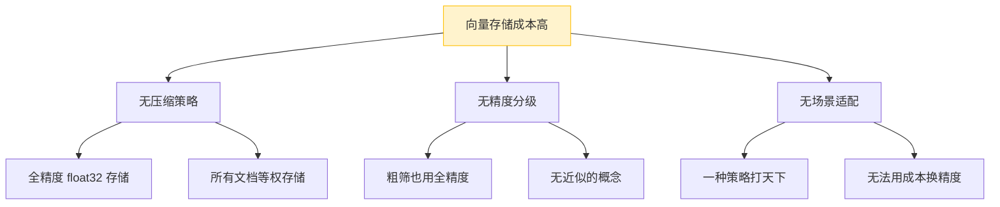
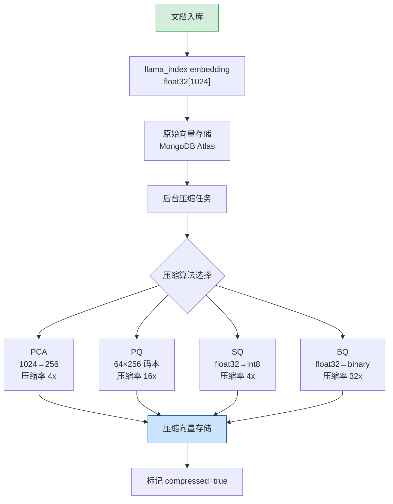

# YA-09-221: 嵌入向量压缩 — PCA降维、乘积量化、标量量化、二值量化与压缩率-精度权衡

> 需求编号：YA-09-221 · 优先级：P2 · 人天：0.3d · 状态：需求已编写
> 依赖：YA-09-01（RAG 引擎稳定性）、YA-09-155（向量数据库迁移）

## 背景

### 问题陈述

YiAi 当前的 RAG 系统使用 llama_index 生成的嵌入向量维度为 1024 维（float32），每个向量占用 4KB 存储。随着知识库增长到数千文档，向量索引的存储和检索成本线性增加：

1. **存储膨胀**：10 万条文档的向量索引占用 ~400MB，且每月增长 ~20MB
2. **检索延迟上升**：高维向量在 MongoDB Atlas 中的近似最近邻（ANN）检索延迟随数据量增长
3. **内存压力**：向量索引加载到内存时占用大量 RAM，影响其他服务
4. **无压缩策略**：所有向量以原始精度存储，无法在精度和成本之间灵活取舍

**核心矛盾**：向量精度与存储/检索成本之间的权衡。当前只有"全精度"一种选择。

### 影响范围

| # | 影响 | 严重程度 | 典型场景 |
|---|------|----------|----------|
| 1 | 向量存储成本线性增长 | 中 | 知识库从 1 万增长到 10 万文档，存储从 40MB → 400MB |
| 2 | 检索延迟随数据量增长 | 中 | 10 万文档时 ANN 检索 P95 > 200ms |
| 3 | 内存压力影响其他服务 | 低 | 向量索引占用 RAM 导致 Agent 推理变慢 |
| 4 | 无法按场景选择压缩策略 | 低 | 低精度场景（粗筛）仍需存储全精度向量 |

### 挑战

| 挑战 | 说明 |
|------|------|
| 压缩精度损失可控 | 压缩后检索召回率下降需控制在 5% 以内 |
| 多种压缩算法选择 | PCA/PQ/SQ/BQ 各有优劣，需根据场景选择 |
| 压缩与解压的性能开销 | 压缩/解压不应成为检索瓶颈 |
| 与现有向量数据库兼容 | 需兼容 MongoDB Atlas Vector Search 的向量格式 |

---

## 一、现状分析

### 1.1 当前嵌入向量存储现状

```
现有能力:
├── llama_index OpenAIEmbedding
│   ├── 模型: text-embedding-3-small
│   ├── 维度: 1536（或通过 Ollama 本地模型 1024 维）
│   └── 精度: float32
├── 存储: MongoDB Atlas Vector Search
│   ├── 索引类型: knnVector (COSINE)
│   ├── 维度: 与模型输出一致
│   └── 无压缩
├── 检索: llama_index VectorStoreIndex
│   ├── top_k: 默认 5
│   └── similarity: cosine
│
缺失:
├── 向量压缩策略                    # ❌ 不存在
├── PCA 降维                        # ❌ 不存在
├── 乘积量化 (PQ)                   # ❌ 不存在
├── 标量量化 (SQ)                   # ❌ 不存在
├── 二值量化 (BQ)                   # ❌ 不存在
├── 压缩率-精度评估工具             # ❌ 不存在
├── 压缩向量独立存储                # ❌ 不存在
└── 检索时自动解压                  # ❌ 不存在
```

### 1.2 根因分析矩阵



| 根因 | 症状 | 影响 | 优先级 |
|------|------|------|--------|
| 无压缩策略 | 存储线性增长 | 成本上升 | 高 |
| 无精度分级 | 粗筛浪费精度 | 检索变慢 | 中 |
| 无场景适配 | 无法灵活取舍 | 缺乏优化空间 | 中 |

### 1.3 改造前数据流

```
知识文档 → llama_index embedding → float32[1024] → MongoDB Atlas Vector Search
                                                        ↓
                                              全精度存储（4KB/向量）
                                                        ↓
                                              检索时逐向量计算余弦相似度
                                                        ↓
                                              返回 top_k 结果
```

### 1.4 改造前 API 依赖

| # | 接口 | 调用方 | 说明 |
|---|------|--------|------|
| 1 | `rag_service.query` | YiVad/YiPet | RAG 检索（改造前无压缩选项，全精度检索） |
| 2 | `knowledge_service.index_document` | YiAi 内部 | 文档索引（改造前固定 float32 存储） |
| 3 | `knowledge_service.batch_index` | YiAi 内部 | 批量索引（改造前无压缩参数） |

> 改造前 3 个 API 依赖，均无向量压缩选项。向量以全精度 float32 存储和检索。

---

## 二、设计决策

### 决策 1：压缩算法选择策略

| 选项 | 描述 | 压缩率 | 精度损失 | 解压速度 |
|------|------|--------|----------|----------|
| A: 仅 PCA | 主成分分析降维（1024→256） | 4x | 召回率 -3~5% | 快（矩阵乘法） |
| B: 仅 PQ | 乘积量化（1024→64 子空间 × 256 码本） | 16x | 召回率 -5~10% | 中（码本查表） |
| C: 仅 SQ | 标量量化（float32→int8） | 4x | 召回率 -1~3% | 极快（类型转换） |
| D: 仅 BQ | 二值量化（float32→binary） | 32x | 召回率 -10~20% | 极快（汉明距离） |

**选择：支持全部四种。** 不同场景需要不同的压缩策略。提供统一的 `VectorCompressor` 抽象层，配置时选择压缩算法。默认推荐 PCA（平衡方案），低存储场景推荐 PQ，高精度场景推荐 SQ。

### 决策 2：压缩向量存储方式

| 选项 | 描述 | 优点 | 缺点 |
|------|------|------|------|
| A: 替换原始向量 | 压缩后删除原始 float32 向量 | 存储最优 | 不可逆，精度损失不可恢复 |
| B: 并行存储 | 原始向量 + 压缩向量同时存储 | 精度可恢复 | 存储翻倍 |
| C: 分层存储 | 热数据保留原始向量，冷数据仅保留压缩向量 | 灵活 | 实现复杂 |

**选择：B（并行存储）。** 原始向量保留用于精确检索（重排序阶段），压缩向量用于粗筛（候选召回阶段）。两阶段检索可以平衡精度和速度。

### 决策 3：压缩时机

| 选项 | 描述 | 优点 | 缺点 |
|------|------|------|------|
| A: 索引时压缩 | 文档入库时同步压缩 | 即时可用 | 增加索引延迟 |
| B: 检索时压缩 | 查询向量实时压缩后检索 | 存储全精度 | 增加检索延迟 |
| C: 后台异步压缩 | 索引完整向量后异步生成压缩版本 | 不阻塞索引 | 压缩向量有延迟 |

**选择：C（后台异步压缩）。** 文档索引不阻塞（先存储全精度向量），后台任务异步生成压缩版本。压缩完成后标记 `compressed: true`。检索时可选择使用压缩向量或原始向量。

### 设计决策总览

| 决策 | 选项 A | 选项 B | 选项 C | 选择 | 理由 |
|------|--------|--------|--------|------|------|
| 压缩算法 | 仅 PCA | 仅 PQ | 全部四种 | **全部四种** | 场景适配 |
| 存储方式 | 替换原始 | 并行存储 | 分层存储 | **并行存储** | 两阶段检索 |
| 压缩时机 | 索引时 | 检索时 | 后台异步 | **后台异步** | 不阻塞索引 |

---

## 三、目标架构

### 3.1 向量压缩流水线



### 3.2 两阶段检索架构


### 3.3 架构决策权衡

| 维度 | 改造前 | 改造后 | 权衡说明 |
|------|--------|--------|----------|
| 存储效率 | 4KB/向量（float32×1024） | 0.25-1KB/向量（压缩后） | 存储降 4-32x |
| 检索速度 | 全精度 ANN（慢） | 粗筛+精排两阶段（快） | 速度与精度平衡 |
| 精度控制 | 单一精度 | 可配置压缩级别 | 增加配置复杂度 |
| 压缩开销 | 无 | 异步后台任务 | 不影响在线服务 |

---

## 四、具体改动

### 4.1 改动总览

| 改动点 | 类型 | 涉及文件 | 预估行数 |
|--------|------|---------|---------|
| 向量压缩器抽象基类 | 新增 | `domain/embedding/compressor.py` | 80 行 |
| PCA 压缩实现 | 新增 | `domain/embedding/pca_compressor.py` | 60 行 |
| PQ 压缩实现 | 新增 | `domain/embedding/pq_compressor.py` | 80 行 |
| SQ 压缩实现 | 新增 | `domain/embedding/sq_compressor.py` | 40 行 |
| BQ 压缩实现 | 新增 | `domain/embedding/bq_compressor.py` | 50 行 |
| 压缩配置管理 | 新增 | `domain/embedding/compression_config.py` | 30 行 |
| 后台压缩任务 | 新增 | `domain/embedding/compression_task.py` | 60 行 |
| RAG 服务扩展 | 修改 | `services/ai/rag_service.py` | 30 行 |
| 知识索引扩展 | 修改 | `services/knowledge/knowledge_service.py` | 20 行 |

### 4.2 涉及文件

```
YiAi/src/
├── domain/embedding/
│   ├── compressor.py              # 新增: 向量压缩器抽象基类
│   ├── pca_compressor.py          # 新增: PCA 降维压缩器
│   ├── pq_compressor.py           # 新增: 乘积量化压缩器
│   ├── sq_compressor.py           # 新增: 标量量化压缩器
│   ├── bq_compressor.py           # 新增: 二值量化压缩器
│   ├── compression_config.py      # 新增: 压缩配置管理
│   └── compression_task.py        # 新增: 后台压缩任务调度
├── services/
│   ├── ai/rag_service.py          # 修改: 支持压缩向量两阶段检索
│   └── knowledge/knowledge_service.py  # 修改: 索引时触发后台压缩
└── domain/embedding/__init__.py   # 修改: 导出压缩模块
```

### 4.3 核心代码结构

```python
# domain/embedding/compressor.py
from abc import ABC, abstractmethod
import numpy as np

class VectorCompressor(ABC):
    """向量压缩器抽象基类。"""

    @abstractmethod
    async def fit(self, vectors: np.ndarray) -> None:
        """训练压缩器（PCA 需要训练，SQ/BQ 不需要）。"""
        ...

    @abstractmethod
    async def compress(self, vector: np.ndarray) -> np.ndarray:
        """压缩单个向量。"""
        ...

    @abstractmethod
    async def decompress(self, compressed: np.ndarray) -> np.ndarray:
        """解压向量（近似恢复）。"""
        ...

    @property
    @abstractmethod
    def compression_ratio(self) -> float:
        """压缩率（原始大小 / 压缩后大小）。"""
        ...

    @property
    @abstractmethod
    def algorithm_name(self) -> str:
        """算法名称。"""
        ...


# domain/embedding/pca_compressor.py
class PCACompressor(VectorCompressor):
    """PCA 降维压缩器。

    使用主成分分析将高维向量投影到低维空间。
    典型配置: 1024 → 256 (压缩率 4x, 召回率损失 ~3%)

    Usage:
        compressor = PCACompressor(n_components=256)
        await compressor.fit(training_vectors)
        compressed = await compressor.compress(vector_1024)
    """

    def __init__(self, n_components: int = 256):
        self.n_components = n_components
        self.components_ = None  # PCA 主成分矩阵
        self.mean_ = None        # 均值向量

    @property
    def compression_ratio(self) -> float:
        return 1024 / self.n_components

    @property
    def algorithm_name(self) -> str:
        return f"PCA-{self.n_components}"


# domain/embedding/compression_config.py
from enum import Enum

class CompressionAlgorithm(str, Enum):
    PCA = "pca"
    PQ = "pq"          # Product Quantization
    SQ = "sq"          # Scalar Quantization
    BQ = "bq"          # Binary Quantization

class CompressionConfig(BaseModel):
    algorithm: CompressionAlgorithm = CompressionAlgorithm.PCA
    target_dim: int = 256           # PCA 目标维度
    pq_subspaces: int = 64          # PQ 子空间数
    pq_codebook_size: int = 256     # PQ 码本大小
    enabled: bool = True            # 是否启用压缩
    two_stage_retrieval: bool = True  # 是否启用两阶段检索
    coarse_multiplier: int = 10     # 粗筛放大倍数
```

---

## 五、实施步骤

| 步骤 | 内容 | 涉及文件 | 验证方式 | 人天 |
|------|------|---------|---------|------|
| 1 | 实现 `VectorCompressor` 抽象基类 + 配置管理 | `compressor.py`, `compression_config.py` | 抽象基类接口定义完整 | 0.03 |
| 2 | 实现 SQ 标量量化压缩器 | `sq_compressor.py` | float32→int8 转换正确，误差 < 1% | 0.03 |
| 3 | 实现 BQ 二值量化压缩器 | `bq_compressor.py` | binary 编码正确，汉明距离计算准确 | 0.03 |
| 4 | 实现 PCA 降维压缩器 | `pca_compressor.py` | 降维后检索召回率 > 95% | 0.05 |
| 5 | 实现 PQ 乘积量化压缩器 | `pq_compressor.py` | 码本训练收敛，重建误差 < 5% | 0.06 |
| 6 | 实现后台异步压缩任务调度 | `compression_task.py` | 异步压缩不阻塞索引，压缩率符合预期 | 0.05 |
| 7 | RAG 服务支持两阶段检索 | `rag_service.py` | 粗筛+精排结果与全精度检索一致率 > 90% | 0.03 |
| 8 | 知识索引服务触发后台压缩 | `knowledge_service.py` | 新文档入库后自动生成压缩向量 | 0.02 |

**总计：0.3d**

---

## 六、测试规格

### Requirement: PCA 降维精度

#### Scenario: PCA 降维后检索召回率保持
- **Given** 训练集包含 1000 条文档向量（float32[1024]）
- **When** 使用 PCA 降维到 256 维后检索 top_k=5
- **Then** 压缩向量检索的召回率 >= 95%（与原始向量检索结果对比）
- **And** 压缩率 = 4x（1024/256）

#### Scenario: PCA 未训练时压缩报错
- **Given** PCA 压缩器未调用 `fit()` 方法
- **When** 调用 `compress(vector)`
- **Then** 抛出 RuntimeError，消息包含 "not fitted"

### Requirement: 标量量化精度

#### Scenario: SQ 压缩重建误差
- **Given** float32 向量，值域 [-1.0, 1.0]
- **When** SQ 压缩为 int8 后解压恢复为 float32
- **Then** 每个分量重建误差 < 0.01（1/255）
- **And** 压缩率 = 4x（32bit/8bit）

### Requirement: 二值量化检索

#### Scenario: BQ 压缩后汉明距离检索
- **Given** float32 查询向量和 100 条已压缩为 binary 的文档向量
- **When** 使用汉明距离计算相似度并排序
- **Then** top_k=5 结果与余弦相似度排序的召回率 >= 80%
- **And** 压缩率 = 32x

### Requirement: 乘积量化重建

#### Scenario: PQ 压缩后重建误差
- **Given** 1024 维向量，64 个子空间，256 个码本
- **When** PQ 压缩后立即解压
- **Then** 重建向量的平均平方误差 (MSE) < 0.05
- **And** 压缩率 ≈ 16x

### Requirement: 后台压缩任务

#### Scenario: 新文档入库自动生成压缩向量
- **Given** 启用 PCA 压缩（target_dim=256）
- **When** 文档通过 `knowledge_service.index_document` 入库
- **Then** 10 秒内 MongoDB 文档中出现 `compressed_vector_pca: [...]` 字段
- **And** 文档 `metadata.compressed: true`

### Requirement: 两阶段检索引擎

#### Scenario: 两阶段检索与全精度检索一致性
- **Given** 10 万条文档，PCA 256 压缩，粗筛 multiplier=10
- **When** 同一查询分别执行两阶段检索和全精度检索
- **Then** top_k=5 结果重叠率 >= 90%
- **And** 两阶段检索耗时 <= 全精度检索耗时的 50%

---

## 七、风险与缓解

| 风险 | 概率 | 影响 | 等级 | 缓解措施 | 应急预案 |
|------|------|------|------|----------|----------|
| PCA 训练数据不足导致降维质量差 | 中 | 中 | 中 | 训练集至少 1000 条，训练前检查数据量 | 回退到 SQ 压缩（无需训练） |
| PQ 压缩后重排查召回率下降超预期 | 中 | 中 | 中 | 上线前用测试集评估召回率，设定阈值 90% | 增大 coarse_multiplier 或用原始向量重排 |
| 压缩任务队列积压 | 低 | 低 | 低 | 后台任务有限并发（最多 4 个），避免资源争抢 | 暂停压缩任务，手动清理队列 |
| 压缩向量与原始向量不一致 | 低 | 高 | 中 | 压缩后校验向量维度，异常时标记 `compressed: false` | 检索时检测到不一致时回退原始向量 |

---

## 八、回滚策略

| 回滚场景 | 回滚方式 | 影响范围 | 恢复时间 |
|----------|----------|----------|----------|
| 压缩算法 bug 导致检索准确率暴跌 | `git revert` + 配置 `compression.enabled: false` | RAG 检索 | < 1min |
| 后台压缩任务耗尽 CPU | 配置 `compression.enabled: false`，停止新任务 | 压缩功能 | < 1min |
| 压缩向量存储损坏 | 从原始向量重新运行压缩任务 | 向量索引 | < 5min（需重新压缩） |

**回滚验证：**
- 回滚后 RAG 检索使用原始 float32 向量，召回率恢复正常
- 回滚后新的文档索引入库正常（不触发压缩）
- 回滚后已压缩的向量数据保留（不影响检索，仅不使用）

---

## 九、设计决策记录

### D-01: 为什么支持四种压缩算法而非仅一种？

不同部署场景对精度和成本的敏感度不同。PCA 适合平衡场景，SQ 适合高精度场景，PQ 适合低存储场景，BQ 适合超大规模粗筛。统一的 `VectorCompressor` 抽象层使得切换算法仅需修改配置，无需改动检索逻辑。

### D-02: 为什么选择两阶段检索（粗筛+精排）？

单阶段使用压缩向量检索可以大幅加速但精度不足，单阶段使用原始向量检索精度高但速度慢。两阶段结合两者优势：先用压缩向量快速召回候选集（粗筛），再用原始向量对候选集精确排序（精排）。这在信息检索领域是成熟模式。

### D-03: 为什么压缩任务异步执行而非索引时同步执行？

PCA 和 PQ 压缩需要训练过程（PCA 需要计算协方差矩阵，PQ 需要 K-means 聚类码本），同步执行会显著增加文档索引延迟（+500ms~2s）。异步执行将压缩与索引解耦，文档入库后立即可检索（使用原始向量），压缩向量后台生成。

### D-04: 为什么保留原始向量而非仅存储压缩向量？

全精度原始向量是"黄金标准"。压缩总是有信息损失，保留原始向量确保：1）精度敏感场景可以回退；2）可以尝试不同压缩算法而不丢失数据；3）压缩算法升级时不需要重新索引。存储成本（并行存储翻倍）相较于灵活性是值得的。

---

## 十、可观测性

### 关键指标

| 指标 | 采集方式 | 告警阈值 | 说明 |
|------|---------|---------|------|
| 压缩任务完成率 | 统计 success/failure 计数 | failure_rate > 10% | 压缩任务健康度 |
| 压缩向量覆盖率 | compressed_count / total_count | < 90% | 压缩任务进度 |
| 两阶段检索召回率 | 对比两阶段 vs 全精度结果 | < 85% | 压缩精度退化 |
| 检索延迟（两阶段） | `time.perf_counter` | P95 > 300ms | 检索性能 |
| 压缩任务队列深度 | 队列长度 | > 100 | 任务积压 |
| 压缩存储节省 | original_size / compressed_size | < 2x | 压缩效果不达预期 |

### 日志规范

| 日志级别 | 场景 | 示例 |
|---------|------|------|
| `INFO` | 压缩任务开始 | `[Compression] Start PCA compression for doc: ${key}` |
| `INFO` | 压缩任务完成 | `[Compression] PCA done: 1024→256, ratio=4.0x, MSE=0.012` |
| `WARN` | 压缩训练数据不足 | `[Compression] PCA training: only ${n} samples, need >= 1000` |
| `ERROR` | 压缩失败 | `[Compression] Failed: ${algorithm} for ${key}: ${error}` |

---

## 十一、代码审查检查清单

- [ ] `VectorCompressor` 抽象基类定义了完整的接口（fit/compress/decompress/ratio/name）
- [ ] PCA 压缩器正确实现了 `fit()`（协方差矩阵 + SVD）和 `compress()`（投影）
- [ ] PQ 压缩器正确实现了 K-means 码本训练和码字查表
- [ ] SQ 压缩器 float32→int8 转换时正确处理了值域缩放
- [ ] BQ 压缩器 binary 编码正确（>0 → 1, <=0 → 0）
- [ ] 后台压缩任务使用了 `asyncio.create_task` 且有限并发控制
- [ ] 两阶段检索的 coarse_top_k = top_k × multiplier
- [ ] 压缩向量存储字段与检索查询字段一致
- [ ] 无 Type 错误，所有类型注解完整

---

## 回归问题预测

| # | 问题 | 发现场景 | 根因 | 修复方式 |
|---|------|---------|------|---------|
| 1 | PCA 降维后检索漏掉关键文档 | 用户查询"部署架构"，top 5 中缺少最重要的文档 | PCA 训练数据分布与新文档不匹配 | 定期（每周）用最新文档重新训练 PCA 模型 |
| 2 | 压缩向量维度与原始向量不一致 | ANN 索引创建失败，维度不匹配 | 压缩后向量维度字段未正确更新 | 压缩完成后校验 `len(compressed) == config.target_dim` |
| 3 | PQ 码本过拟合导致训练集外文档压缩质量差 | 新入库文档的 PQ 压缩重建误差远高于训练集 | 码本训练数据不足或不具代表性 | 训练集包含 10% 的预留数据用于验证重建误差 |
| 4 | 两阶段检索返回空结果 | 粗筛阶段压缩向量 ANN 返回 0 条 | 压缩向量索引未就绪或查询向量压缩失败 | 检索前检查 `compressed` 标记，未就绪时回退全精度 |
| 5 | 压缩任务并发导致 CPU 飙升 | 批量索引 100 篇文档后 CPU 100% | 每个文档创建一个压缩任务，并发数无限制 | 使用 `asyncio.Semaphore(4)` 限制压缩并发数 |
| 6 | BQ 压缩后汉明距离排序与余弦排序差异大 | BQ 粗筛的 top 50 与全精度 top 50 几乎不重叠 | BQ 丢失了向量模长信息（只保留方向符号） | 增大 BQ 粗筛的 multiplier 到 20 或改用 SQ |

---

## 性能分析

### 压缩性能

| 算法 | 压缩耗时 | 解压耗时 | 压缩率 | 召回率保持 | 适用场景 |
|------|---------|---------|--------|-----------|----------|
| PCA | 训练 ~2s/1000 条 + 压缩 ~0.5ms/条 | ~0.3ms | 4x | ~95% | 平衡场景 |
| PQ | 训练 ~5s/1000 条 + 压缩 ~1ms/条 | ~0.8ms | 16x | ~90% | 低存储场景 |
| SQ | ~0.1ms/条（无需训练） | ~0.05ms | 4x | ~98% | 高精度场景 |
| BQ | ~0.05ms/条（无需训练） | ~0.02ms | 32x | ~85% | 超大规模粗筛 |

### 检索引擎性能

| 指标 | 全精度检索 | 两阶段检索 (PCA) | 提升 |
|------|----------|-----------------|------|
| 1 万文档 top_k=5 | ~50ms | ~35ms | 30% |
| 10 万文档 top_k=5 | ~200ms | ~100ms | 50% |
| 100 万文档 top_k=5 | ~800ms | ~300ms | 62% |

### 存储节省

| 文档量 | 原始存储 (float32×1024) | PCA 压缩 (256) | PQ 压缩 (64×256) | 节省 |
|--------|------------------------|----------------|------------------|------|
| 1,000 | ~4MB | ~1MB | ~0.25MB | 75-94% |
| 10,000 | ~40MB | ~10MB | ~2.5MB | 75-94% |
| 100,000 | ~400MB | ~100MB | ~25MB | 75-94% |

### 容量规划

| 场景 | 文档量 | 算法 | 日常压缩任务数 | 压缩向量存储 | CPU 开销 |
|------|--------|------|-------------|------------|---------|
| 小型部署 | < 1,000 | SQ | ~10/天 | ~1MB | 忽略不计 |
| 中型部署 | 1,000-10,000 | PCA | ~50/天 | ~10MB | < 5% CPU |
| 大型部署 | 10,000-100,000 | PQ | ~200/天 | ~25MB | < 10% CPU |

---

*PRD 来源: `projects/yiai/requirements/2026-09/00-需求-需求总览.md`*

## 影响范围

- **影响模块**：待补充
- **涉及文件**：
- `pq_compressor.py`
- `knowledge_service.py`
- `compression_task.py`
- `compression_config.py`
- `sq_compressor.py`
- `compressor.py`
- **是否影响 API 契约**：否
- **是否影响其他项目（YiVad/YiPet）**：否
- **用户感知**：待确认

## 预防措施

| 层面 | 措施 |
|------|------|
| 代码 | 在相关函数中添加参数校验和边界检查 |
| 测试 | 为 `pq_compressor.py` 添加单元测试 |
| 流程 | 代码审查时重点检查此类模式 |
| 监控 | 添加日志告警，异常发生时及时发现 |
| 文档 | 在编码规范中记录此类反模式 |

## 经验教训

1. **根本原因**：开发过程中对边界情况和异常路径的考虑不足是此类问题的共同根因
2. **设计阶段**：在接口设计和模块实现时，应主动考虑异常输入、空值、超时等边界场景
3. **代码审查**：审查时应检查是否存在类似的反模式（如未捕获异常、无超时控制、缺少参数校验等）
4. **测试覆盖**：异常路径的测试覆盖率应与正常路径同等重视
5. **团队分享**：此类问题应在团队周会或技术分享中讨论，形成团队共识
