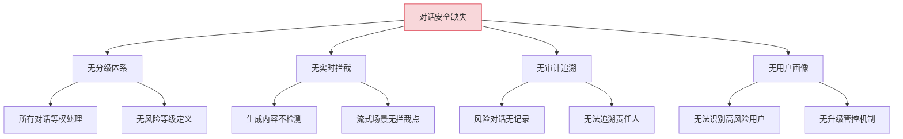
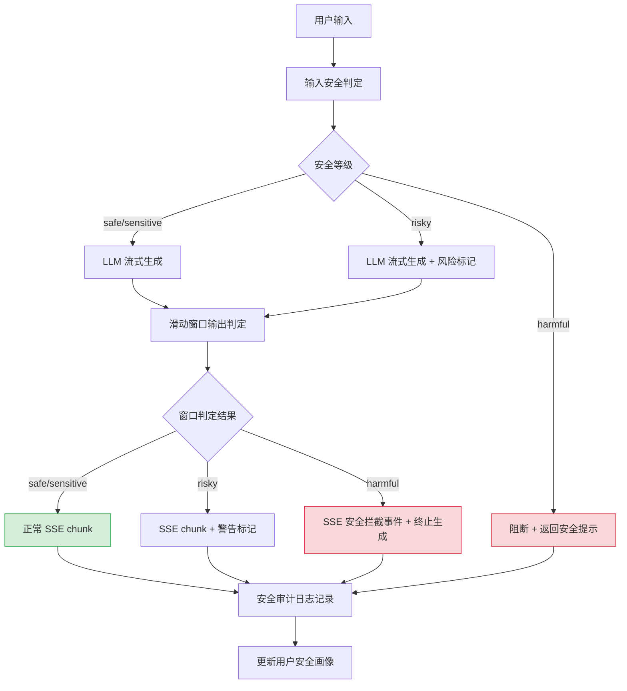
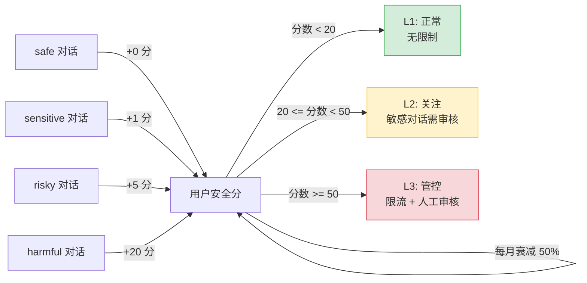

# YA-09-222: 对话安全分级 — 实时内容审核、安全拦截、审计日志与用户安全画像

> 需求编号：YA-09-222 · 优先级：P2 · 人天：0.3d · 状态：需求已编写
> 依赖：YA-09-05（审计日志）、YA-09-142（内容审核与安全检测）

## 背景

### 问题陈述

YiAi 作为面向多用户的 AI 服务平台，当前对话系统缺少系统化的安全分级和实时内容审核机制。所有用户对话以相同策略处理，无法区分安全对话和风险对话：

1. **无安全分级**：无法区分 safe/sensitive/risky/harmful 四个安全等级
2. **无实时拦截**：生成式 AI 可能产生不安全内容，当前无拦截机制
3. **无安全审计**：没有记录谁在什么时间生成了什么风险内容
4. **无用户画像**：无法识别高风险用户并采取升级管控措施
5. **无管理员干预**：管理员无法覆盖/撤销自动安全判定

**核心矛盾**：AI 生成内容的开放性与企业级安全合规要求之间的冲突。

### 影响范围

| # | 影响 | 严重程度 | 典型场景 |
|---|------|----------|----------|
| 1 | 风险内容无拦截 | 高 | 用户通过 prompt 注入让 AI 生成恶意代码 |
| 2 | 无法追溯风险对话 | 高 | 安全事件发生后无法定位责任人和内容 |
| 3 | 高风险用户无管控 | 中 | 同一用户反复触发风险内容但无升级措施 |
| 4 | 误拦截无申诉通道 | 中 | 正常对话被误判为 risky 但无法纠正 |

### 挑战

| 挑战 | 说明 |
|------|------|
| 实时性 | 安全判定必须在生成过程中完成（流式场景），不能等生成结束 |
| 准确性 | 误拦截（false positive）影响用户体验，漏拦截（false negative）带来安全风险 |
| 分级粒度 | 四级安全分级需要清晰的边界定义，避免模糊地带 |
| 与流式 SSE 的集成 | SSE 流式响应中插入安全拦截需要处理消息分片 |

---

## 一、现状分析

### 1.1 当前对话安全现状

```
现有能力:
├── 内容审核基础（YA-09-142）
│   ├── 关键词过滤
│   ├── 敏感词库
│   └── 基础违规检测
├── 审计日志（YA-09-05）
│   ├── 操作审计
│   └── 数据变更追踪
│
缺失:
├── 安全分级体系（safe/sensitive/risky/harmful）    # ❌ 不存在
├── 流式生成实时拦截                                   # ❌ 不存在
├── 安全拦截自定义消息                                 # ❌ 不存在
├── 安全审计日志                                       # ❌ 不存在
├── 用户安全画像                                       # ❌ 不存在
├── 管理员 override 机制                               # ❌ 不存在
└── 误拦截申诉与复审                                   # ❌ 不存在
```

### 1.2 安全分级定义

| 等级 | 名称 | 定义 | 示例 | 默认动作 |
|------|------|------|------|----------|
| `safe` | 安全 | 正常对话，无风险内容 | 技术问答、文档查询 | 正常生成 |
| `sensitive` | 敏感 | 涉及敏感话题但不违规 | 政治讨论、竞品分析 | 正常生成 + 标记 |
| `risky` | 风险 | 有潜在风险需要警告 | 漏洞利用思路、社会工程 | 生成 + 警告标记 |
| `harmful` | 有害 | 明确违规内容 | 恶意代码、仇恨言论、诈骗 | **阻断生成** |

### 1.3 根因分析矩阵



| 根因 | 症状 | 影响 | 优先级 |
|------|------|------|--------|
| 无分级体系 | 所有对话无差别处理 | 无法差异化管控 | 高 |
| 无实时拦截 | 有害内容可生成 | 安全风险 | 高 |
| 无审计追溯 | 风险对话无记录 | 合规风险 | 高 |
| 无用户画像 | 反复违规无法管控 | 滥用风险 | 中 |

### 1.4 改造前数据流

```
用户发送消息 → chat_service.chat → Ollama LLM 流式生成 → SSE 返回
                                                              ↓
                                             无安全检测，无拦截
                                                              ↓
                                             所有内容原样返回
```

### 1.5 改造前 API 依赖

| # | 接口 | 调用方 | 说明 |
|---|------|--------|------|
| 1 | `ai.chat_service.chat` | YiVad/YiPet | 流式聊天（改造前无安全检测） |
| 2 | `ai.agent_service.run_agent` | YiVad | Agent 执行（改造前无安全检测） |

> 改造前 2 个 API 依赖，均无安全分级和实时拦截。有害内容可直接生成并返回用户。

---

## 二、设计决策

### 决策 1：安全判定时机

| 选项 | 描述 | 优点 | 缺点 |
|------|------|------|------|
| A: 输入侧判定 | 仅在用户输入时判定安全等级 | 实现简单 | 无法拦截模型生成的有害内容 |
| B: 输出侧判定 | 仅在模型输出时判定安全等级 | 拦截生成内容 | 无法防御 prompt 攻击 |
| C: 双侧判定 | 输入+输出都判定 | 全面防护 | 实现复杂，延迟增加 |

**选择：C（双侧判定）。** 输入侧判定用于防御恶意 prompt（在推理前拦截），输出侧判定用于拦截模型生成的有害内容（在流式返回时拦截）。双侧覆盖确保完整的对话安全。

### 决策 2：流式 SSE 中的拦截方式

| 选项 | 描述 | 优点 | 缺点 |
|------|------|------|------|
| A: 缓冲后判定 | 先缓冲完整响应，判定后再流式发送 | 判定准确 | 破坏流式体验，首字延迟高 |
| B: 分片判定 | 每个 SSE chunk 实时判定，危险内容即时截断 | 保持流式 | 判定不完整，可能漏判 |
| C: 滑动窗口判定 | 维护最近 N 个 chunk 的滑动窗口，每窗判定 | 平衡实时和准确 | 实现复杂 |

**选择：C（滑动窗口判定）。** 维护最近 512 token 的滑动窗口，每收到新 chunk 时对窗口内容做安全判定。检测到 harmful 时立即发送安全拦截 SSE 事件并终止生成。在流式体验和安全之间取得平衡。

### 决策 3：用户安全画像维度

| 选项 | 描述 | 优点 | 缺点 |
|------|------|------|------|
| A: 仅计数 | 记录风险对话次数 | 简单 | 无法区分严重程度 |
| B: 分数累积 | 不同等级对话累积不同分数 | 区分严重程度 | 需设计分数体系 |
| C: 时间衰减+分数 | 分数随时间衰减，近期行为权重高 | 反映当前风险 | 实现最复杂 |

**选择：B（分数累积）。** safe=0 分, sensitive=+1 分, risky=+5 分, harmful=+20 分。用户安全分累计超过 50 分触发升级管控（限流或人工审核）。分数每月衰减 50%（避免永久惩罚历史行为）。

### 设计决策总览

| 决策 | 选项 A | 选项 B | 选项 C | 选择 | 理由 |
|------|--------|--------|--------|------|------|
| 判定时机 | 仅输入 | 仅输出 | 双侧 | **双侧** | 全面防护 |
| 流式拦截 | 缓冲判定 | 分片判定 | 滑动窗口 | **滑动窗口** | 平衡实时和准确 |
| 用户画像 | 仅计数 | 分数累积 | 衰减+分数 | **分数累积** | 区分严重程度 |

---

## 三、目标架构

### 3.1 对话安全流水线



### 3.2 用户安全画像分数模型



### 3.3 架构决策权衡

| 维度 | 改造前 | 改造后 | 权衡说明 |
|------|--------|--------|----------|
| 安全覆盖 | 无安全机制 | 输入+输出双侧判定 | 安全性 vs 延迟增加 |
| 流式拦截 | 不拦截 | 滑动窗口实时判定 | 实时性 vs 判定完整性 |
| 用户管控 | 无差异管控 | 三级安全画像 | 管控精准度 vs 误判风险 |
| 管理员干预 | 无 | override + 申诉 | 灵活性 vs 管理成本 |

---

## 四、具体改动

### 4.1 改动总览

| 改动点 | 类型 | 涉及文件 | 预估行数 |
|--------|------|---------|---------|
| 安全分级模型 | 新增 | `domain/safety/models.py` | 50 行 |
| 内容安全判定器 | 新增 | `domain/safety/classifier.py` | 120 行 |
| 流式 SSE 安全拦截器 | 新增 | `domain/safety/stream_interceptor.py` | 80 行 |
| 用户安全画像服务 | 新增 | `domain/safety/user_profile.py` | 60 行 |
| 安全审计日志 | 新增 | `domain/safety/audit.py` | 50 行 |
| 聊天服务集成 | 修改 | `services/ai/chat_service.py` | 40 行 |
| Agent 服务集成 | 修改 | `services/ai/agent_service.py` | 20 行 |
| 管理员 override API | 新增 | `services/safety/safety_service.py` | 60 行 |

### 4.2 涉及文件

```
YiAi/src/
├── domain/safety/
│   ├── __init__.py              # 新增: 安全模块导出
│   ├── models.py                # 新增: SafetyLevel, SafetyResult, UserSafetyProfile
│   ├── classifier.py            # 新增: SafetyClassifier 内容安全判定器
│   ├── stream_interceptor.py    # 新增: SSE 流式安全拦截器
│   ├── user_profile.py          # 新增: UserSafetyProfile 用户安全画像
│   └── audit.py                 # 新增: SafetyAuditLogger 安全审计日志
├── services/
│   ├── ai/chat_service.py       # 修改: 集成安全判定 + 流式拦截
│   ├── ai/agent_service.py      # 修改: 集成安全判定
│   └── safety/safety_service.py # 新增: 管理员 override + 查询 API
└── server/app.py                # 修改: 初始化安全模块
```

### 4.3 核心代码结构

```python
# domain/safety/models.py
from enum import Enum
from pydantic import BaseModel, Field
from datetime import datetime

class SafetyLevel(str, Enum):
    SAFE = "safe"              # 正常对话
    SENSITIVE = "sensitive"    # 敏感话题，需标记
    RISKY = "risky"            # 潜在风险，需警告
    HARMFUL = "harmful"        # 有害内容，需阻断

class SafetyResult(BaseModel):
    level: SafetyLevel
    score: float = Field(ge=0.0, le=1.0)      # 风险分数
    reason: str                                  # 判定理由
    keywords_matched: list[str] = []             # 匹配的关键词
    override_by: str | None = None               # 管理员 override

class SafetyAuditEntry(BaseModel):
    session_key: str
    user: str
    level: SafetyLevel
    message_snippet: str                          # 触发判定的消息片段
    action: str                                   # "allowed" | "warned" | "blocked"
    timestamp: datetime = Field(default_factory=datetime.now)


# domain/safety/classifier.py
class SafetyClassifier:
    """内容安全判定器 — 基于关键词 + 规则引擎 + LLM 辅助判定。"""

    HARMFUL_PATTERNS = [
        r"恶意代码|病毒|木马|后门",
        r"仇恨言论|种族歧视|性别歧视",
        r"诈骗|钓鱼|社工",
        r"自残|自杀|暴力",
    ]

    SENSITIVE_PATTERNS = [
        r"政治敏感|领导人",
        r"竞品分析.*(漏洞|缺陷)",
        r"内部.*(数据|文档|API)",
    ]

    async def classify_input(self, text: str) -> SafetyResult:
        """对用户输入做安全分级。"""
        ...

    async def classify_output(self, text: str) -> SafetyResult:
        """对模型输出做安全分级。"""
        ...

    async def classify_window(self, chunks: list[str]) -> SafetyResult:
        """对滑动窗口内容做安全分级。"""
        ...


# domain/safety/stream_interceptor.py
class StreamSafetyInterceptor:
    """SSE 流式安全拦截器。"""

    def __init__(self, classifier: SafetyClassifier, window_size: int = 512):
        self.classifier = classifier
        self.window_size = window_size
        self.buffer: list[str] = []

    async def intercept(self, chunk: str) -> tuple[bool, str | None]:
        """拦截单个 SSE chunk。

        Returns:
            (should_continue, replacement_message)
            - should_continue=False → 终止生成
            - replacement_message → 替换当前 chunk 的安全消息
        """
        self.buffer.append(chunk)
        window_text = "".join(self.buffer[-self.window_size:])
        result = await self.classifier.classify_window(
            self._tokenize(window_text)
        )

        if result.level == SafetyLevel.HARMFUL:
            return False, self._build_block_message(result)
        elif result.level == SafetyLevel.RISKY:
            return True, self._build_warning_prefix() + chunk

        return True, chunk
```

---

## 五、实施步骤

| 步骤 | 内容 | 涉及文件 | 验证方式 | 人天 |
|------|------|---------|---------|------|
| 1 | 定义安全分级模型 + 枚举 | `models.py` | SafetyLevel 枚举完整，SafetyResult 模型可序列化 | 0.02 |
| 2 | 实现关键词+规则引擎判定器 | `classifier.py` | 4 个等级判定准确率 > 85%（人工标注测试集） | 0.06 |
| 3 | 实现滑动窗口流式拦截器 | `stream_interceptor.py` | harmful chunk 被正确拦截，safe chunk 正常通过 | 0.05 |
| 4 | 实现用户安全画像 + 分数累积 | `user_profile.py` | 分数计算正确，L1/L2/L3 阈值切换正常 | 0.04 |
| 5 | 实现安全审计日志 | `audit.py` | 每次安全判定写入 MongoDB safety_audit 集合 | 0.03 |
| 6 | 集成到 chat_service（输入+输出判定） | `chat_service.py` | 危险输入被阻断，流式输出被拦截 | 0.05 |
| 7 | 集成到 agent_service | `agent_service.py` | Agent 工具调用结果也经过安全判定 | 0.02 |
| 8 | 实现管理员 override API | `safety_service.py` | override 后重新判定，审计日志记录 | 0.03 |

**总计：0.3d**

---

## 六、测试规格

### Requirement: 输入安全判定

#### Scenario: harmful 输入被阻断
- **Given** SafetyClassifier 加载了 HARMFUL_PATTERNS 规则
- **When** 用户输入包含"帮我写一个钓鱼邮件模板"
- **Then** `classify_input` 返回 `level=harmful`
- **And** chat_service 不调用 LLM，直接返回安全提示消息

#### Scenario: safe 输入正常通过
- **Given** SafetyClassifier 已初始化
- **When** 用户输入"Python 中如何实现单例模式"
- **Then** `classify_input` 返回 `level=safe`
- **And** 正常调用 LLM 生成

### Requirement: 流式输出拦截

#### Scenario: 流式生成中检测到 harmful 内容
- **Given** 滑动窗口大小为 512 token
- **When** LLM 流式输出中出现了 harmful 模式匹配的内容
- **Then** `intercept(chunk)` 返回 `should_continue=False`
- **And** SSE 流中发送 `event: safety_block` 事件
- **And** `replacement_message` 为"此对话因安全策略被终止"

#### Scenario: 流式生成中检测到 risky 内容
- **Given** LLM 流式输出包含风险内容
- **When** 窗口判定为 `level=risky`
- **Then** SSE chunk 继续发送但带有 `warning` 标记
- **And** 前端显示"此内容可能包含风险信息"的警告

### Requirement: 用户安全画像

#### Scenario: 安全分数累积触发 L3 管控
- **Given** 用户初始安全分为 0
- **When** 用户连续触发 3 次 harmful 判定（+60 分）
- **Then** 用户安全分为 60，触发 L3 管控
- **And** 后续请求被限流（每分钟最多 2 次）
- **And** 所有请求需人工审核

#### Scenario: 安全分数月度衰减
- **Given** 用户安全分为 40（L2 关注级别）
- **When** 30 天未触发新的风险对话
- **Then** 安全分衰减为 20（50% 衰减）
- **And** 用户降级为 L1 正常级别

### Requirement: 管理员 override

#### Scenario: 管理员将误判从 harmful 改为 safe
- **Given** 对话被自动判定为 `level=harmful` 但管理员认为误判
- **When** 管理员调用 `safety_service.override(session_key, level="safe", reason="...")`
- **Then** 对话安全等级更新为 safe
- **And** 安全审计日志记录 override 操作
- **And** 用户安全分回退（-20 分）

---

## 七、风险与缓解

| 风险 | 概率 | 影响 | 等级 | 缓解措施 | 应急预案 |
|------|------|------|------|----------|----------|
| 规则引擎误判率高 | 中 | 中 | 中 | 提供管理员 override + 申诉机制 | 紧急关闭安全拦截（配置开关） |
| 滑动窗口判定延迟影响流式体验 | 低 | 低 | 低 | 判定采用异步协程，不阻塞 chunk 发送 | 降低窗口大小到 256 token |
| 恶意用户试探规则边界 | 中 | 中 | 中 | 定期更新规则模式库 | 对 L3 用户全面人工审核 |
| 安全审计日志存储膨胀 | 低 | 低 | 低 | TTL 索引 90 天自动清理 | 归档到冷存储 |

---

## 八、回滚策略

| 回滚场景 | 回滚方式 | 影响范围 | 恢复时间 |
|----------|----------|----------|----------|
| 安全拦截大面积误判 | `safety.enabled: false` 配置关闭 | 对话安全 | < 1min |
| 性能下降明显 | `git revert` 安全模块集成 | 聊天/Agent 服务 | < 1min |
| 安全审计日志损坏 | 重建索引 + 从备份恢复 | 安全审计 | < 5min |

**回滚验证：**
- 回滚后对话恢复原有行为（无安全拦截）
- 回滚后聊天服务性能恢复正常（无判定开销）
- 回滚后已记录的安全审计日志保留

---

## 九、设计决策记录

### D-01: 为什么使用规则引擎+关键词而非 LLM 做安全判定？

LLM 做安全判定有两个问题：1）延迟——调用 LLM 判定需要在推理前额外一次 API 调用（+500ms），破坏流式体验；2）成本——每次对话多消耗一次推理资源。基于关键词+正则的规则引擎延迟 < 1ms，成本为零。未来可扩展为规则引擎+轻量分类模型的混合方案。

### D-02: 为什么安全分数需要月度衰减？

防止用户因历史行为被永久惩罚。一个用户可能在 3 个月前触发过 risky 对话（可能是无意的），如果分数不衰减，该用户将永远处于 L2 或 L3 级别。月度 50% 衰减意味着 3 个月后历史分数仅剩 12.5%，给予用户行为改善的机会。

### D-03: 为什么选择滑动窗口而非缓冲完整响应的拦截方式？

滑动窗口在流式 SSE 场景下是唯一保持实时性的方案。缓冲完整响应意味着用户需要等整个响应生成完毕才能看到第一个字，完全破坏了流式聊天的体验。滑动窗口的 trade-off 是可能漏判跨窗口的上下文相关风险内容，但这是可接受的——通过调节窗口大小可以控制。

### D-04: 为什么需要管理员 override 机制？

自动安全判定永远不可能 100% 准确。误判（将 safe 标记为 harmful）会严重影响用户体验和信任。管理员 override 提供了人工纠错的能力，同时 override 记录本身也是安全审计的一部分，确保纠错操作可追溯。

---

## 十、可观测性

### 关键指标

| 指标 | 采集方式 | 告警阈值 | 说明 |
|------|---------|---------|------|
| 安全拦截率 | blocked / total_requests | > 20% | 疑似规则过于严格 |
| 等级分布 | 各等级占比 | harmful > 5% | 用户行为异常 |
| 误判申诉率 | override_safe / total_blocked | > 30% | 规则引擎准确率低 |
| 判定延迟 | classify_input/output 耗时 | P95 > 5ms | 规则引擎性能问题 |
| L3 用户数 | safety_score >= 50 的用户 | > 5% 总用户 | 需要关注 |
| override 操作频率 | override_count / day | > 10 | 规则引擎需要调整 |

### 日志规范

| 日志级别 | 场景 | 示例 |
|---------|------|------|
| `INFO` | 安全判定结果 | `[Safety] Input classified: safe (score=0.05)` |
| `WARN` | risky 判定 | `[Safety] Output risky: ${reason}, user=${user}` |
| `ERROR` | harmful 拦截 | `[Safety] HARMFUL blocked: ${snippet}, user=${user}` |
| `INFO` | 管理员 override | `[Safety] Override: ${key} ${from}→${to} by ${admin}` |

---

## 十一、代码审查检查清单

- [ ] `SafetyLevel` 四个枚举值定义清晰，边界明确
- [ ] `SafetyClassifier` 规则模式使用编译后的正则（`re.compile`）
- [ ] `StreamSafetyInterceptor` 滑动窗口大小可配置
- [ ] safe/sensitive/risky 等级的 SSE chunk 发送不受影响
- [ ] harmful 拦截时正确发送 `safety_block` SSE 事件
- [ ] 安全判定和拦截的异常不会导致聊天服务崩溃（try-except 包裹）
- [ ] 用户安全分数更新使用 MongoDB `$inc` 原子操作
- [ ] 月度衰减使用定时任务（apscheduler）而非每次查询计算
- [ ] 安全审计日志正确记录 action（allowed/warned/blocked）

---

## 回归问题预测

| # | 问题 | 发现场景 | 根因 | 修复方式 |
|---|------|---------|------|---------|
| 1 | 安全判定阻塞了 SSE 流 | 用户输入 safe 内容但首字延迟增加 2s | `classify_input` 同步阻塞了流创建 | 将 classify_input 改为异步，在 LLM 调用开始前完成判定 |
| 2 | 滑动窗口边界导致 harmful 漏判 | harmful 内容跨两个窗口，单独窗口都不触发 | 窗口间无重叠 | 滑动窗口增加 25% 重叠（step_size = window_size × 0.75） |
| 3 | 安全审计日志写入失败不影响对话 | 对话正常但 MongoDB safety_audit 集合无记录 | 写入异常被静默吞掉 | 写入失败至少记录 ERROR 级别应用日志 |
| 4 | 管理员 override 后分数回退不完整 | override harmful→safe 后用户仍显示 L3 | 只更新了 session 等级未更新用户总分 | override 时同步调用 `user_profile.adjust_score(-20)` |
| 5 | 正则 ReDoS 攻击 | 恶意用户提交 10KB 的重复字符触发灾难性回溯 | 正则模式未做复杂度限制 | 所有正则使用 `re.compile(pattern, re.UNICODE)` 并限制输入长度 < 5000 字符 |
| 6 | 安全分衰减定时任务并发执行 | 每月 1 日 00:00 大量用户同时衰减 | 未做分片，单次处理所有用户 | 分批处理（每批 100 用户），使用分布式锁防止重复执行 |

---

## 性能分析

### 安全判定延迟

| 操作 | 耗时 | 说明 |
|------|------|------|
| `classify_input` | < 1ms | 正则匹配，无外部调用 |
| `classify_output` | < 1ms | 同上 |
| `classify_window` | < 2ms | 窗口拼接 + 正则匹配 |
| `stream_interceptor.intercept` | < 3ms | 含窗口管理 + 判定 |

### 对话延迟影响

| 场景 | 改造前延迟 | 改造后延迟 | 增量 |
|------|----------|----------|------|
| 首 token 延迟 | ~500ms（LLM 推理） | ~501ms | +1ms（输入判定） |
| Chunk 间延迟 | ~50ms | ~53ms | +3ms（窗口判定） |
| harmful 拦截 | N/A | ~505ms（判定+阻断） | 不生成后续 token |

### 存储增长预估

| 场景 | 日均对话 | 安全审计日志/条 | 日均存储 | 90 天存储 |
|------|---------|---------------|---------|----------|
| 小型部署 | 100 | ~300B | ~30KB | ~2.7MB |
| 中型部署 | 1,000 | ~300B | ~300KB | ~27MB |
| 大型部署 | 10,000 | ~300B | ~3MB | ~270MB |

### 容量规划

| 场景 | 用户量 | L3 用户占比 | 安全审计日志 | 规则模式数 | 判定延迟 P99 |
|------|--------|-----------|------------|----------|-------------|
| 小型部署 | < 50 | 0-1 人 | ~3MB | 10-20 | < 5ms |
| 中型部署 | 50-500 | 1-5 人 | ~30MB | 20-50 | < 5ms |
| 大型部署 | 500-5000 | 5-25 人 | ~300MB | 50-100 | < 10ms |

---

*PRD 来源: `projects/yiai/requirements/2026-09/00-需求-需求总览.md`*

## 影响范围

- **影响模块**：待补充
- **涉及文件**：
- `safety_service.py`
- `classifier.py`
- `user_profile.py`
- `chat_service.py`
- `agent_service.py`
- `audit.py`
- **是否影响 API 契约**：否
- **是否影响其他项目（YiVad/YiPet）**：否
- **用户感知**：待确认

## 预防措施

| 层面 | 措施 |
|------|------|
| 代码 | 在相关函数中添加参数校验和边界检查 |
| 测试 | 为 `safety_service.py` 添加单元测试 |
| 流程 | 代码审查时重点检查此类模式 |
| 监控 | 添加日志告警，异常发生时及时发现 |
| 文档 | 在编码规范中记录此类反模式 |

## 经验教训

1. **根本原因**：开发过程中对边界情况和异常路径的考虑不足是此类问题的共同根因
2. **设计阶段**：在接口设计和模块实现时，应主动考虑异常输入、空值、超时等边界场景
3. **代码审查**：审查时应检查是否存在类似的反模式（如未捕获异常、无超时控制、缺少参数校验等）
4. **测试覆盖**：异常路径的测试覆盖率应与正常路径同等重视
5. **团队分享**：此类问题应在团队周会或技术分享中讨论，形成团队共识
